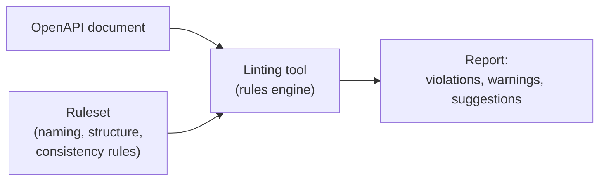

## What API Linting Is

**API linting** is the automated process of checking an API's design — usually expressed as an OpenAPI document — against a defined set of rules, the same way a code linter checks source code for style violations and common mistakes before anything ships.



Instead of a human reviewer manually reading through every path, parameter, and schema looking for inconsistencies, a linter mechanically walks the document and flags anything that breaks a rule — things like:

- A path using `/get_products` instead of a proper noun-based `/products`
- A property named `product_name` when the rest of the API uses `camelCase`
- An operation missing a `404` response even though it has a path parameter
- A `POST` operation with no `requestBody` defined
- Inconsistent date formats across different schemas

## How It Helps

| Problem it addresses | How linting helps |
|---|---|
| Design decisions made by many different people/teams | Enforces one consistent set of conventions automatically |
| Manual review is slow and inconsistent | Runs instantly, every time, catching the same class of issues a human reviewer might miss on a tired Friday |
| Inconsistencies discovered late (after implementation) | Catches problems at design time, in the OpenAPI document itself, before code is written |
| Style debates repeating in every PR review | Codifies the "house style" once, so it stops being a matter of opinion in every review |
| Onboarding new API designers | The ruleset itself becomes documentation of what "good" looks like in your organization |

A few concrete things I'd flag as genuinely valuable:

**It closes the loop on everything covered in earlier design stages.** All those guidelines — hierarchical paths, consistent naming (three words max, no parent prefixes), required `400`/`404`/`500` handling, standard error formats, `readOnly` vs `writeOnly` discipline — are easy to state as principles but easy to forget in practice across a large API surface. A linter turns each of those principles into an enforceable, automated rule instead of something that only gets checked if a reviewer happens to remember it.

**It scales consistency across many APIs, not just one.** If an organization has dozens of APIs built by different teams, linting is often the only realistic way to keep them looking and behaving like they came from the same place — using the same pagination pattern, the same error shape, the same naming conventions — without a central team manually reviewing every single change.

**It fits naturally into CI/CD.** Since the ruleset is machine-readable and the document itself is a structured file, linting can run automatically on every pull request, blocking a merge if the API design breaks house rules — the same way a code linter or test suite would.

## A Quick Example

Using a popular open-source linter, **Spectral**, a minimal custom rule might look like this:

```yaml
# .spectral.yaml
rules:
  path-no-trailing-slash:
    description: Paths should not end with a trailing slash
    given: "$.paths[*]~"
    then:
      function: pattern
      functionOptions:
        notMatch: "/$"

  operation-must-have-404-if-path-param:
    description: Operations on paths with a path parameter must define a 404 response
    given: "$.paths[?(@property.match(/\\{.*\\}/))].*.responses"
    then:
      field: "404"
      function: truthy
```

Running this against a document would immediately surface any path ending in `/` or any operation on a parameterized path that forgot to declare a `404` — exactly the kind of thing that's easy to miss by eye but trivial for a tool to catch every time.

## One Caution

Linting is a **conformance** check, not a **correctness** check — it can tell you a document follows your naming and structural conventions, but it can't tell you whether the API actually solves the right business problem or whether an operation's scope makes sense. It's a great complement to the design process covered so far (resource identification, HTTP mapping, user-friendliness), not a replacement for the human judgment those stages require.
