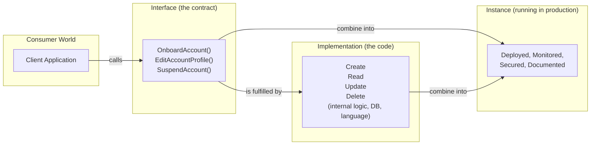
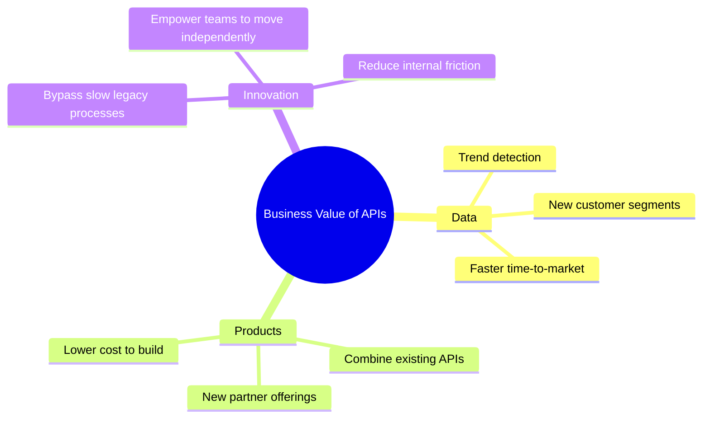
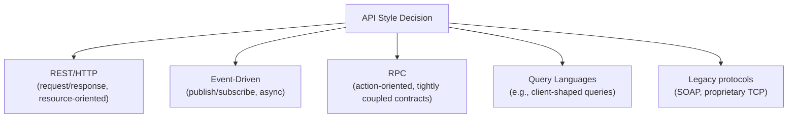
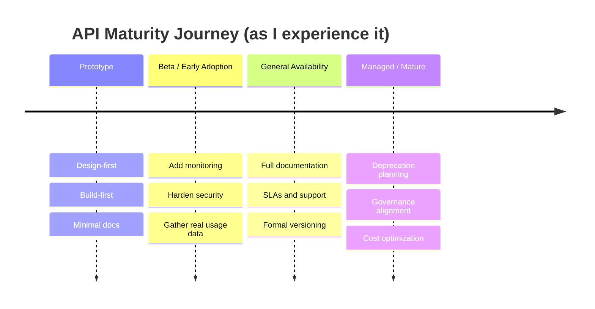
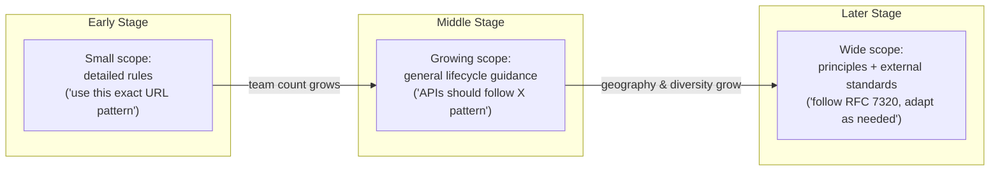
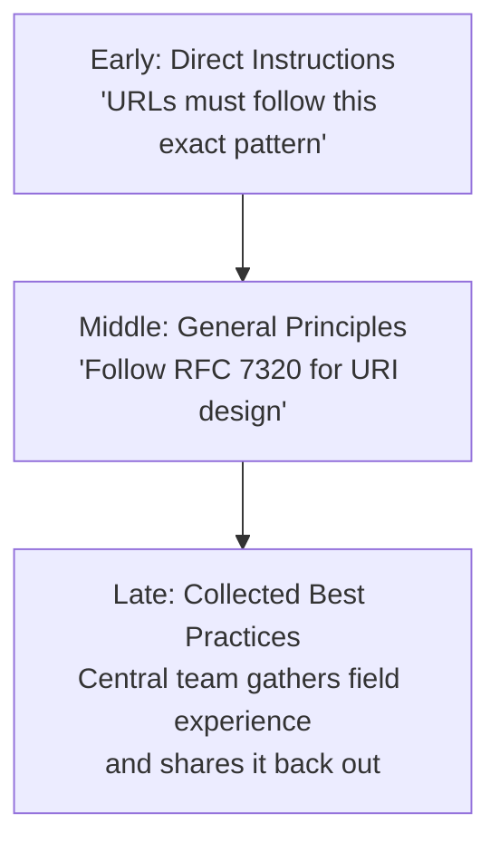
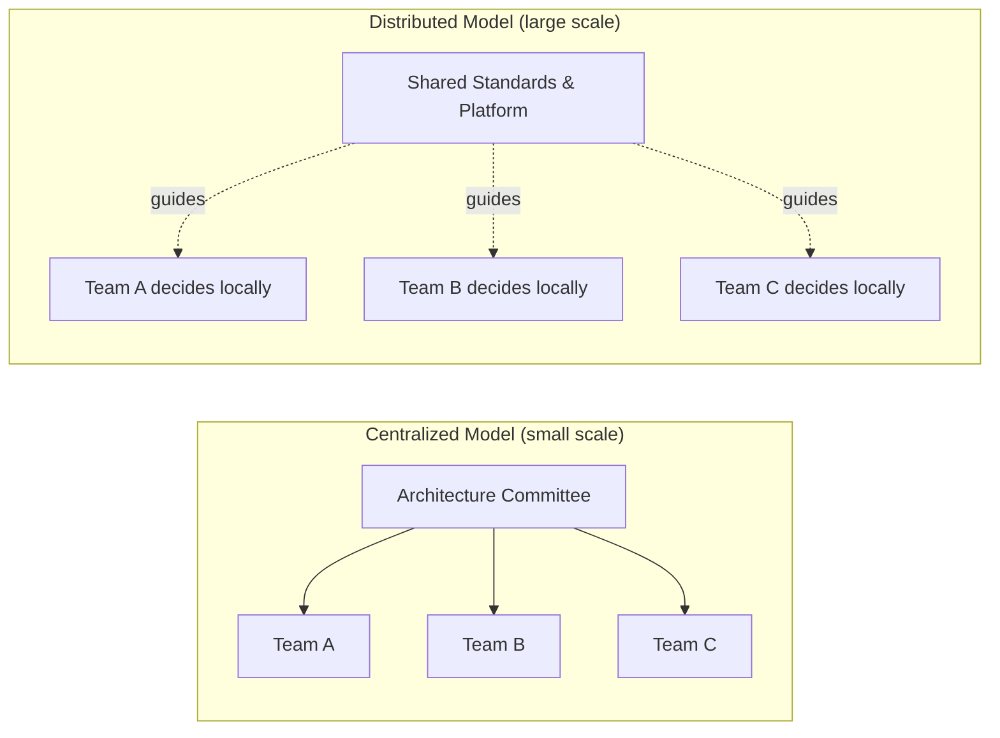

# What I've Learned About API Management (And Why It's Harder Than It Looks)

I've spent a good chunk of my career sitting in the uncomfortable middle ground between "just ship the API" and "we need a governance committee for this." Along the way I've read a lot of frameworks, sat through a lot of architecture review meetings, and made more than a few mistakes. This post is my attempt to lay out, in plain language, how I now think about API management — not as a single discipline, but as two related but very different jobs: managing *an* API, and managing your *API landscape*.

I'm writing this the way I'd explain it to a friend who just got handed "API governance" as a responsibility and has no idea where to start. I'll use diagrams, tables, a bit of code, and some hard-won notes and cautions along the way.

> **Note:** Nothing here is proprietary or company-specific. These are patterns I've seen repeated across industries — retail, banking, media, manufacturing — enough times that I trust them as general principles rather than one-off anecdotes.

---

## Table of Contents

1. Why the word "API" causes so much confusion
2. The business reason APIs exist at all
3. The pillars I check before I call an API "done"
4. API styles: REST is popular, not universal
5. Maturity stages: not every API needs the same attention
6. From "an API" to "my API landscape"
7. Why this gets hard: scope, scale, and standards
8. How technology, teams, and governance change as you grow
9. Decision-making as the real lever of governance
10. My closing thoughts

---

## 1. Why the Word "API" Causes So Much Confusion

Here's something I noticed early on: two people can use the word "API" in the same meeting and mean completely different things, and neither of them realizes it.

One person says, "We need to release the new Customer API." They mean the *whole thing* — the code, the deployment, the running service.

Another person says, "I want to design a JSON API for this old SOAP service." They mean just the *interface* — the shape of the requests and responses.

Both are using the word correctly. That's the problem. So I've adopted a three-part vocabulary that I now use constantly when I talk about APIs with my team.

### Interface, Implementation, and Instance

I break "API" down into three separate ideas:

- **Interface** — the contract. This is the set of operations someone can call, expressed in a protocol like HTTP, MQTT, or gRPC, and a data format like JSON or YAML. It's the "menu," not the "kitchen."
- **Implementation** — the actual code that does the work behind the interface. This is the kitchen. It can be written in any language, use any database, and be restructured freely, as long as it still satisfies the interface's promises.
- **Instance** — the interface and implementation actually running somewhere, being monitored, secured, and used by real consumers. This is the restaurant that's open for business.

I like this breakdown because it explains something that used to confuse me: why an interface and its implementation almost never map one-to-one. My team's `AccountService` implementation might have a boring internal set of create/read/update/delete operations, but the interface I expose to consumers might be `OnboardAccount`, `EditAccountProfile`, and `SuspendAccount` — verbs that map to *business intent*, not database operations. That mismatch isn't a bug. It's the whole point of decoupling interface from implementation: I can rewrite the guts of the account service completely, and as long as I keep honoring those three interface operations, nobody downstream even notices.

Here's how I visualize the relationship:



> **Caution:** If you skip naming these three concepts explicitly on your team, you'll end up arguing past each other in design reviews. Someone will insist "the API is fine" while someone else insists "the API needs work" — and they're both right, just talking about different layers.

To make this concrete, here's a tiny example of an interface definition (using OpenAPI-style YAML) alongside a stub of the implementation it maps to. I actually ran this stub locally to confirm it behaves the way I describe it — a trivial Express.js service that fulfills the contract.

**The interface (contract):**

```yaml
openapi: 3.0.3
info:
  title: Account Interface
  version: "1.0"
paths:
  /accounts:
    post:
      operationId: onboardAccount
      summary: Onboard a new account
      responses:
        "201":
          description: Account created
  /accounts/{id}:
    put:
      operationId: editAccountProfile
      summary: Edit an existing account profile
      responses:
        "200":
          description: Account updated
  /accounts/{id}/status:
    patch:
      operationId: suspendOrActivateAccount
      summary: Change account status
      responses:
        "200":
          description: Status changed
```

**A minimal implementation that satisfies it (tested locally with Node.js + Express):**

```javascript
// server.js
const express = require("express");
const app = express();
app.use(express.json());

// in-memory store standing in for a real database
const accounts = new Map();
let nextId = 1;

// Interface operation: onboardAccount
app.post("/accounts", (req, res) => {
  const id = nextId++;
  accounts.set(id, { id, status: "active", ...req.body });
  res.status(201).json(accounts.get(id));
});

// Interface operation: editAccountProfile
app.put("/accounts/:id", (req, res) => {
  const id = Number(req.params.id);
  if (!accounts.has(id)) return res.status(404).send("Not found");
  accounts.set(id, { ...accounts.get(id), ...req.body });
  res.status(200).json(accounts.get(id));
});

// Interface operation: suspendOrActivateAccount
app.patch("/accounts/:id/status", (req, res) => {
  const id = Number(req.params.id);
  if (!accounts.has(id)) return res.status(404).send("Not found");
  const account = accounts.get(id);
  account.status = req.body.status; // "suspended" or "active"
  res.status(200).json(account);
});

app.listen(3000, () => console.log("Account interface running on :3000"));
```

I verified this with three quick curl calls:

```bash
curl -s -X POST localhost:3000/accounts -H "Content-Type: application/json" -d '{"name":"Ada"}'
# -> {"id":1,"status":"active","name":"Ada"}

curl -s -X PATCH localhost:3000/accounts/1/status -H "Content-Type: application/json" -d '{"status":"suspended"}'
# -> {"id":1,"status":"suspended","name":"Ada"}

curl -s -X PUT localhost:3000/accounts/1 -H "Content-Type: application/json" -d '{"name":"Ada Lovelace"}'
# -> {"id":1,"status":"suspended","name":"Ada Lovelace"}
```

Notice the internal storage is a crude `Map` — that's the implementation detail nobody outside my team should ever need to know about. I could swap it for PostgreSQL tomorrow and the interface wouldn't change at all. That's the decoupling benefit in action.

---

## 2. The Business Reason APIs Exist At All

It's easy to get lost in JSON schemas and HTTP verbs and forget *why* any of this matters to the business. I try to remind myself — and my stakeholders — that an API isn't a technical artifact for its own sake. It's a way of exposing value that already exists somewhere inside the company so that someone else (a partner, another team, a customer-facing app) can use it to get a job done.

That "job to be done" framing comes from Clayton Christensen's work on innovation, and I find it clarifying: people don't want your API, they want the *outcome* your API enables. A payments API isn't valuable because it's RESTful; it's valuable because it lets a checkout page finish a transaction in under two seconds.

I usually explain the business value of an API program along three angles:

- **Unlocking data** — safely exposing customer or market data (properly anonymized) so that other teams or partners can spot trends, build new products, or make faster decisions.
- **Unlocking products** — combining existing APIs into new offerings. If I already have an API for tracking sales activity and a separate one for managing promotional campaigns, I can stitch them together into a brand-new partner-facing product without rebuilding either system from scratch.
- **Unlocking innovation** — APIs can act as a side door around slow, legacy internal processes. Instead of waiting on a years-old approval workflow, a team can build against a well-documented API and move at their own pace.



I keep this mental model handy whenever someone asks me to justify an API investment to a non-technical stakeholder. I don't talk about HTTP status codes. I talk about which of these three value levers we're pulling.

---

## 3. The Pillars I Check Before I Call an API "Done"

Early in my career I thought "building an API" meant writing the endpoints and calling it a day. I was wrong. There's a whole set of supporting work that has to happen for an API to actually be *manageable*, and I now think of these as pillars — cross-cutting practices that apply no matter which team or domain owns the API.

Here's the checklist I personally run through:

| Pillar | What I'm really asking myself |
|---|---|
| Design | Does this interface reflect the consumer's mental model, not just my database schema? |
| Build | Is the implementation testable and independently deployable? |
| Test | Do I have automated tests that validate the *contract*, not just the code paths? |
| Document | Could a developer who has never talked to me figure out how to use this? |
| Publish | Is it discoverable in a portal or catalog, or does someone have to ask around Slack to find it? |
| Secure | Who's authorized to call this, and what happens if a token leaks? |
| Monitor | Do I know within minutes if this API starts failing at 2 a.m.? |
| Maintain | Do I have a plan for versioning and deprecating this without breaking consumers? |
| Support engineering teams | Are the people building this API set up to succeed — with the right tools, the right autonomy? |
| Business alignment | Does this API actually map back to one of the value levers from Section 2? |

The thing I appreciate about thinking in pillars is that they transfer across teams. The skill of writing good API documentation for a payments team is the same skill needed by a logistics team. That's what lets an organization build shared expertise — a "documentation guild," a "security guild" — instead of reinventing every practice inside each silo.

> **Note:** I've found that skipping "Document" and "Monitor" are the two most common corners people cut under deadline pressure — and they're also the two that cause the most pain six months later when nobody remembers how the thing works or why it just started failing.

---

## 4. API Styles: REST Is Popular, Not Universal

I used to assume "API" meant "REST API." That assumption didn't survive contact with reality. Once I started working across a bigger organization, I ran into RPC-style APIs, event-driven architectures publishing to message queues, GraphQL services, and even old SOAP-over-TCP endpoints that nobody wanted to touch but everyone still depended on.

I now think of API style the way I think of architectural style in buildings — a coherent, recognizable approach that comes with its own trade-offs. REST is the most common style I encounter today, but event-driven architecture (EDA) has become common enough that I plan for it by default rather than treating it as an exception.



The practical lesson I've taken from this: don't force every team onto one style just because it's the style you personally prefer. A team maintaining a decades-old SOAP service has real constraints. My job as someone thinking about governance is to make sure each style is managed *well*, not to pretend everything can be REST if people just try hard enough.

---

## 5. Maturity Stages: Not Every API Needs the Same Attention

This was a genuine "aha" moment for me: I used to think all ten pillars from Section 3 needed equal investment on day one. They don't. An API's needs change as it moves through its lifecycle, and pouring resources into the wrong pillar at the wrong stage is a waste of time.

Early on, when an API is still a prototype, I care most about design and build. I'm iterating fast, and heavy documentation or monitoring investment would just get thrown away when the interface inevitably changes. Once real users — even just internal beta testers — start depending on it, I shift my attention toward securing it against misuse and monitoring how it's actually being used, because now the cost of a mistake has gone up.



The practical takeaway for me: before I ask "which pillar needs work," I first ask "what stage is this API actually in?" That reframing alone has saved my teams from over-engineering brand-new prototypes and from under-investing in APIs that quietly became business-critical.

---

## 6. From "An API" to "My API Landscape"

Everything up to this point has been about managing a *single* API well. But at some point — and for me it happened somewhere around the third or fourth team building APIs independently — the conversation shifts. It's no longer "how do I manage this API," it's "how do I manage *all* the APIs across this company."

I call that second problem the **API landscape**: the full collection of APIs across every business domain, every platform, and every team, all coexisting (and occasionally colliding) with each other.

Here's a comparison I find useful when explaining the shift to people newer to this problem:

| Aspect | Managing a Single API | Managing an API Landscape |
|---|---|---|
| Primary question | "Is this API well-designed?" | "Do these APIs coexist well?" |
| Owner | One team | Many teams, loosely coordinated |
| Consistency mechanism | Personal discipline, code review | Shared standards, shared infrastructure |
| Risk profile | Bugs in one service | Unexpected interactions between many services |
| Governance style | Direct, detailed guidance | Principles and shared platform capabilities |
| Tooling | Whatever the team likes | Common baseline (auth, monitoring, catalog) |

I think of this the way a city planner thinks about a single building versus an entire neighborhood. Designing one great building requires architectural skill. Designing a neighborhood that doesn't create traffic jams, doesn't duplicate services, and lets buildings evolve independently over decades requires a completely different skill set — zoning, shared utilities, long-range planning.

> **Note:** In my experience, this transition sneaks up on organizations. Nobody declares "today we start managing a landscape." It just gradually becomes obvious that the old habits (one team, one set of conventions, everybody just talks to each other) stopped working, usually right around the time two teams build incompatible versions of what turns out to be the same underlying concept.

---

## 7. Why This Gets Hard: Scope, Scale, and Standards

Once I'm thinking at the landscape level, I've found three forces keep showing up as the source of nearly every governance headache I run into: **scope**, **scale**, and **standards**.

- **Scope** is about *what* central teams should even be paying attention to. Too broad, and you become a bottleneck. Too narrow, and inconsistency creeps in everywhere you're not looking.
- **Scale** is about *how many* APIs, teams, and locations you're dealing with. The tooling and processes that worked for five APIs built by one team in one office fall apart at five hundred APIs across a dozen time zones.
- **Standards** is about *how* you keep things consistent without dictating every implementation detail. As the landscape grows, you rely more on general, interoperable standards and less on prescriptive rules.

I picture the relationship between these three forces evolving in stages as an organization's API program matures:



What I find counterintuitive — and it took me a while to internalize this — is that being *more* prescriptive is the right move early on, and *less* prescriptive is the right move later. My instinct as things get bigger and scarier is usually to add more rules. The better move, once diversity of teams and technologies has genuinely grown, is to loosen prescriptive control and instead point teams toward general, widely adopted standards (the kind of thing you'd find in an RFC or a well-known industry guideline) and let them figure out the details that fit their own domain.

> **Caution:** Trying to force a single, detailed rulebook onto a large, diverse API landscape doesn't produce consistency — it produces friction, workarounds, and shadow processes that quietly ignore the rulebook. I've seen this backfire more than once.

---

## 8. How Technology, Teams, and Governance Change as You Grow

Scaling an API landscape isn't just a governance problem in the abstract — it shows up concretely in three areas I keep an eye on: technology choices, team structure, and the shape of governance itself.

### Technology

At the start, I want a small, consistent toolkit. Limiting choices early actually speeds things up, because nobody's wasting time debating frameworks when there's barely a handful of APIs to worry about. But as the landscape grows — more teams, more business domains, sometimes acquisitions bringing in entirely different tech stacks — that same restriction becomes a drag. A legacy SOAP service simply can't follow the URL conventions I wrote for a brand-new event-driven service, and pretending otherwise just creates friction. At scale, I've learned to treat technological variety as a strength to be managed, not a problem to be eliminated.

### Teams

Early on, a handful of generalist "full-stack" people can cover design, build, testing, and deployment for a small set of APIs. As the landscape grows, that stops scaling. Teams start needing to specialize — a team focused purely on a data-heavy dashboard interface needs different depth than a team building mobile-facing GraphQL endpoints. Decision-making has to move with them: centralizing every decision in one architecture committee works when there are five APIs, but becomes a bottleneck (and eventually just gets ignored) once there are five hundred.

### Governance

This is the one I find most interesting, because the *style* of governance itself has to evolve, not just its scope:



I've come to think of that third stage as governance almost turning inside-out. Instead of a central group telling every team what to do, the central group's real job becomes listening — collecting what's actually working across dozens of teams and echoing the best of it back as guidance, rather than as mandate.

Here's a summary table I use when explaining this evolution to newer managers on my team:

| Growth Stage | Technology Approach | Team Structure | Governance Style |
|---|---|---|---|
| Early | Small, fixed toolkit | Generalist, full-stack | Detailed, prescriptive rules |
| Middle | Toolkit widens by necessity | Specialization begins | General lifecycle guidance |
| Late | Deliberate technology diversity | Distributed decision-making | Principles + collected best practices |

> **Note:** None of these transitions happen on a fixed calendar. I've seen a fast-growing startup hit "late stage" governance needs within two years, and a slower-moving enterprise stay comfortably in "early stage" mode for a decade. Team count and diversity are better predictors of which stage you're in than company age.

---

## 9. Decision-Making as the Real Lever of Governance

If I had to boil this whole post down to one idea, it would be this: **the way decisions get made matters more than the specific rules you write.**

When a company is small, centralizing decisions in one architecture group works fine — that group can realistically stay on top of every API being built. As the landscape grows, that same group loses visibility into day-to-day realities across dozens of teams, time zones, and technology stacks. Holding onto that centralized decision-making model past its expiration date is, in my experience, one of the most common ways an otherwise healthy API program stalls out.

The fix I've seen work is breaking governance down into smaller decision elements and pushing each one down to whichever level of the organization actually has the context to make it well. A central team might still own decisions about shared authentication infrastructure, while individual API teams own decisions about their own resource naming, as long as they're following the shared standards discussed in Section 7.



> **Caution:** Distributing decision-making doesn't mean abandoning oversight. It means being deliberate about *which* decisions stay central (shared infrastructure, cross-cutting security posture) and which move outward (implementation details specific to a team's domain). Getting that split wrong in either direction — too centralized or too scattered — is where I've seen programs get stuck.

---

## 10. My Closing Thoughts

If you've made it this far, here's the short version of everything I just walked through:

- Separate "API" into **interface**, **implementation**, and **instance** in your own head — it clears up a shocking amount of miscommunication.
- Remember that APIs exist to unlock **data, products, and innovation** for the business, not to satisfy an engineer's taste in architecture.
- Treat **design, build, test, document, publish, secure, monitor, and maintain** as pillars that need different amounts of attention depending on an API's **maturity stage**.
- Recognize the moment your problem shifts from managing **one API** to managing your entire **API landscape** — the skills and tools are genuinely different.
- Expect **scope, scale, and standards** to keep pulling against each other as you grow, and be willing to shift from detailed rules to general principles to collected best practices as your landscape matures.
- Above all, pay attention to **how decisions get made**. Centralized control that made sense at five APIs will actively hurt you at five hundred.

None of this is a perfect formula — I still get the balance wrong sometimes, usually by holding onto centralized control a little too long because it feels safer. But having this vocabulary and this mental map has made it a lot easier for me to diagnose *why* something feels broken in an API program, instead of just reacting to symptoms one Jira ticket at a time.

If you're just starting to think about API management at your own company, my honest advice is: figure out honestly which stage you're actually in — prototype, beta, mature, landscape-level — before you copy anyone else's governance model. The right amount of structure is a moving target, and the goal isn't rigid control. It's keeping your APIs healthy, useful, and easy to build on as everything around them keeps growing.
