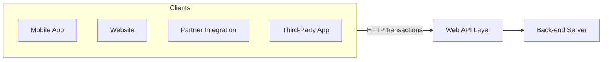
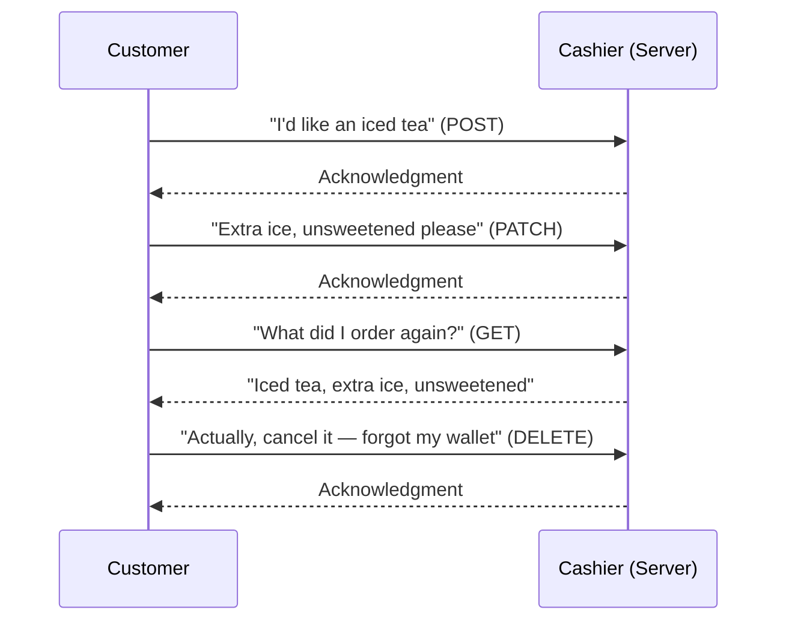
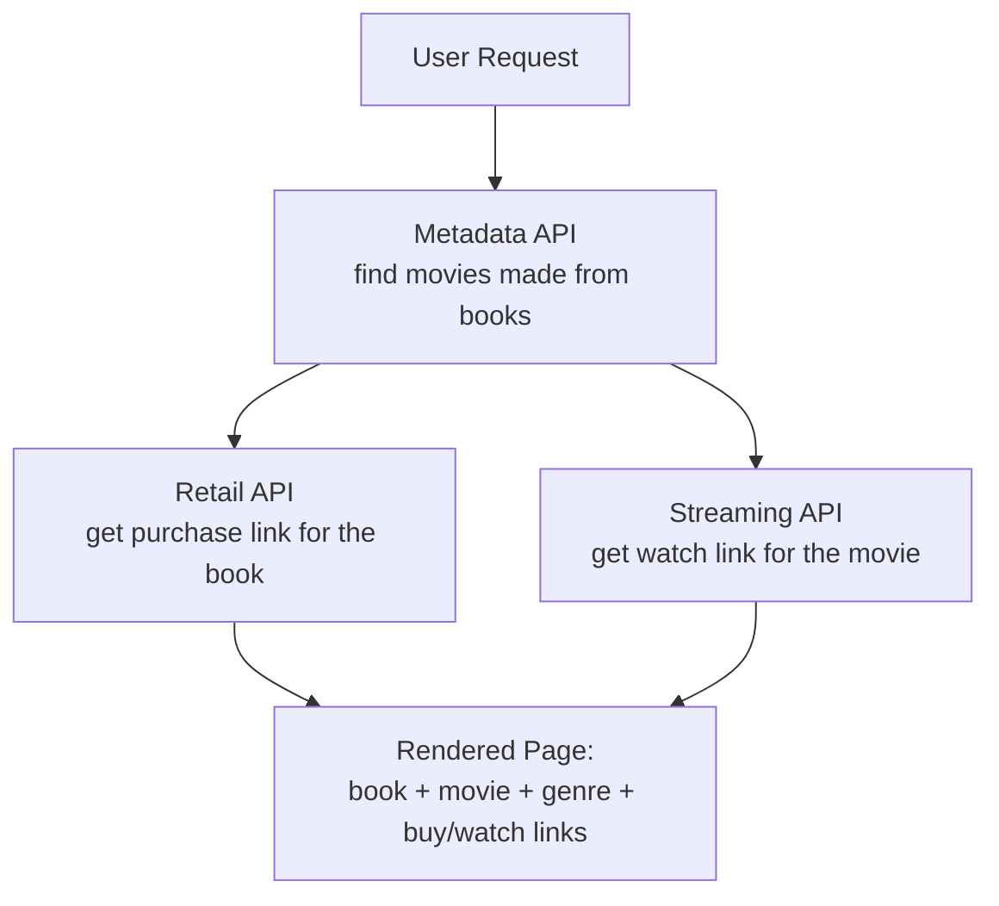
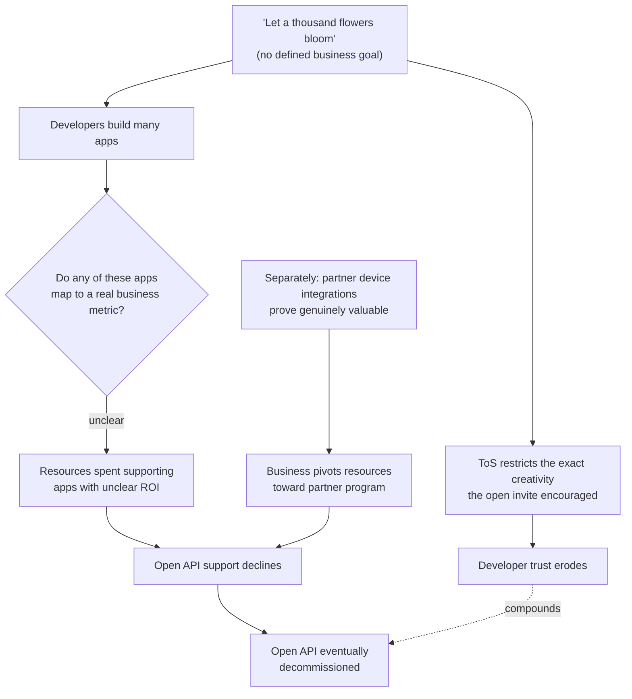
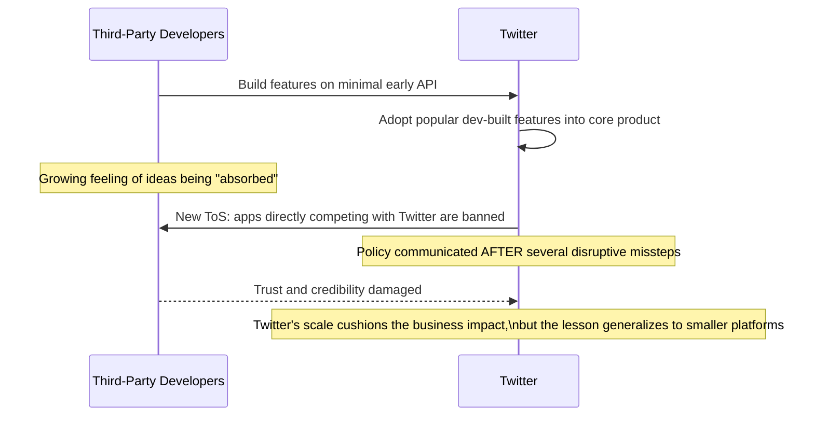
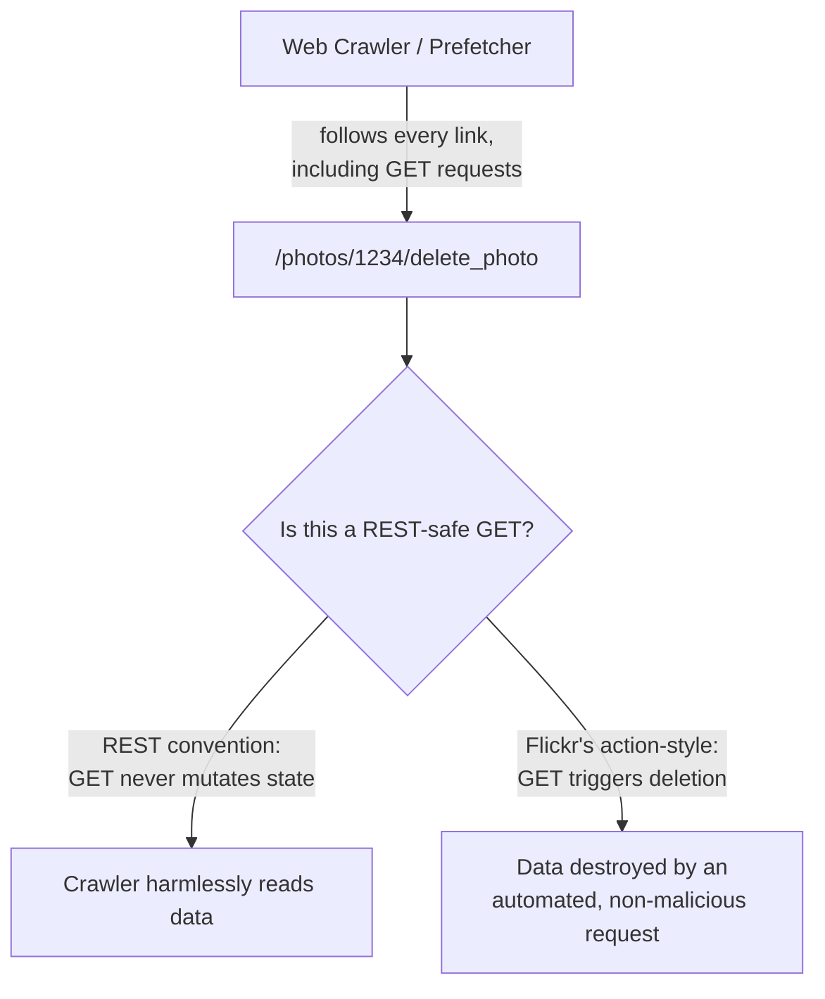
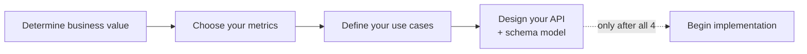
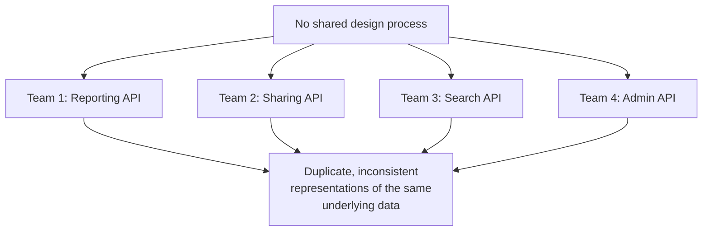

# What Makes an API Irresistible? Lessons From Netflix, Twitter, and Flickr's Growing Pains

I want to go back to first principles for this post. I've written before about designing APIs well, managing change, scaling, and building developer resources and programs — but I realized I never actually sat down and asked the more foundational question: what makes an API *irresistible* in the first place, versus one that just... exists, technically functional, unloved, and eventually decommissioned?

The honest answer is that the technology was never the hard part. Any competent developer can stand up a basic REST API in Flask or Rails in an afternoon. What separates an irresistible API from a forgettable one is everything *around* the technology — the vision behind it, the discipline in its design, and the respect it shows for the time of the people building on it. I want to walk through what a web API actually is, why REST won out as the dominant style, and then spend real time on three genuinely instructive case studies — Netflix, Twitter, and Flickr — because I think concrete failure stories teach this stuff better than abstract principles ever could.

I tested two small Python scripts along the way to make a couple of the more subtle points concrete rather than theoretical, so you can actually see the failure mode instead of just reading about it.

---

## Table of Contents

1. [What a Web API Actually Is](#part-1)
2. [Why REST Won](#part-2)
3. [JSON as the Default Format](#part-3)
4. [Developer Experience Is the Product](#part-4)
5. [Versioning: Get It Right the First Time](#part-5)
6. [Marketing to Developers](#part-6)
7. [Case Study: Netflix and the Cost of No Vision](#part-7)
8. [Case Study: Twitter and the Cost of Broken Trust](#part-8)
9. [Case Study: Flickr and the Cost of Bad REST Design](#part-9)
10. [The API Creation Process](#part-10)
11. [Schema Modeling and Design-First Development](#part-11)
12. [Supporting Your Developers](#part-12)
13. [Closing Thoughts](#part-13)

---

<a id="part-1"></a>
## 1. What a Web API Actually Is

I think it's worth being precise about this before going further, because "API" gets used loosely enough that the term can mean almost anything. Historically, an API described tightly coupled interfaces between systems designed together — think a mail server talking to its own database. Both sides were built by the same team, at the same time, with full knowledge of each other's internals.

A **web API** is a fundamentally different animal. It's a system where a client — a browser, a mobile app, another company's backend — talks to your server over HTTP, and critically, **the people building the client are not the people who built the server.** That's the defining characteristic: genuine decoupling between the two sides.

I like the old telephone switchboard analogy for this. Your phone only knew how to do two things: connect to the switchboard, and make noise. You didn't need to know anything about how Aunt Mae's phone worked internally — you just needed the well-known protocol (pick up, ring the operator, give a number) to reach her. A web API works the same way: a well-defined protocol (HTTP, plus your specific resource conventions) lets client and server interact without either side needing to know the other's internals.



### The coffee shop mental model

I still think the clearest way to explain CRUD (Create, Read, Update, Delete) to someone new to this is the coffee-shop analogy, because everyone's lived it:

| Real-World Action | API Equivalent |
|---|---|
| Order an iced tea | `POST` — create a new order |
| Ask for extra ice, unsweetened | `PATCH`/`PUT` — update the order |
| Ask the cashier what you ordered | `GET` — read the order |
| Realize you forgot your wallet, cancel | `DELETE` — remove the order |



> **Note:** What I like about this analogy is that it also explains *why* decoupling matters. The cashier doesn't need to know how the tea is actually brewed in the back, and you don't need to know either — you just need the shared, well-understood protocol of "how to order." That's exactly the value a REST API provides between client and server.

---

<a id="part-2"></a>
## 2. Why REST Won

REST stands for **Representational State Transfer**, and the core idea is deceptively simple: model your API around **nouns** (resources — users, photos, orders) rather than **verbs** (actions — `deletePhoto`, `sendMessage`, `cancelOrder`). Instead of exposing a list of things the server can *do*, you expose a list of things the client can *request, create, modify, or remove*.

| | REST (noun-based) | RPC / action-based (verb-based) |
|---|---|---|
| Core unit | Resources (`/photos/1234`) | Actions (`/delete_photo`) |
| How you operate on a resource | HTTP verb (`GET`, `POST`, `PUT`, `DELETE`) | The endpoint name itself encodes the action |
| Flexibility for the client | High — client decides how to combine/use resources | Lower — client is limited to predefined actions |
| Good fit for | General-purpose platforms encouraging creative use | Narrow, tightly-scoped interactions (e.g. SOAP-style enterprise integrations) |

> **Note:** REST isn't objectively "better" in some universal sense — it's a better fit for a specific goal: encouraging developers to combine and reuse your data creatively, in ways you didn't necessarily predict. If your actual goal is a small, fixed set of tightly controlled operations between two known systems, an action-based or SOAP-style API can be entirely reasonable. The right choice depends on whether you want to *constrain* usage or *invite creativity*.

### Mashups: what REST's flexibility actually buys you

I think the clearest illustration of REST's value is the concept of a **mashup** — an application built by combining multiple independent APIs into something none of the original providers built themselves. A classic example: combine a movie/book metadata API, a retail API, and a streaming API, and you get an app that lets someone browse book-to-movie adaptations by genre, then either buy the book or queue the movie — a genuinely new experience built entirely out of parts nobody designed together.



That kind of composition is only possible because each API exposed *resources* freely, rather than a narrow, predetermined set of actions. A verb-based API tends to anticipate a fixed set of use cases; a noun-based one lets developers assemble use cases you never explicitly designed for.

---

<a id="part-3"></a>
## 3. JSON as the Default Format

I don't think this needs much argument anymore, but it's worth being explicit about *why* JSON won as the default response format, because the reasoning still matters when you're picking a format for something new:

- It's **compact** relative to alternatives like XML, which matters a lot on slower or metered mobile connections.
- It maps almost directly onto native data structures in JavaScript, Python, PHP, Ruby, and most other commonly used languages — a JSON object basically *is* a dictionary/hash/object literal already.
- It's simple enough to hand-read and hand-write, which matters more than people give it credit for when you're debugging.

```json
{
  "glossary": {
    "title": "example glossary",
    "GlossDiv": {
      "title": "S",
      "GlossList": {
        "GlossEntry": {
          "ID": "SGML",
          "GlossTerm": "Standard Generalized Markup Language",
          "GlossSee": "markup"
        }
      }
    }
  }
}
```

> **Caution:** Resist the urge to support both JSON and XML "just in case," unless you have a genuinely compelling reason — an existing enterprise customer base that requires it, say. Supporting two formats isn't twice the work, it's more than twice the work: every endpoint now needs dual serialization logic, every test needs dual coverage, and every documentation page needs dual examples. I've seen teams take this on preemptively "to be safe" and then watch the second format sit at near-zero actual usage for years while still costing real maintenance time on every single change.

---

<a id="part-4"></a>
## 4. Developer Experience Is the Product

I want to state this as plainly as I can: **the developer's experience of using your API is the single most important factor in whether it succeeds.** Not the elegance of your backend architecture. Not how clever your resource model is on a whiteboard. Whether a real developer, under real time pressure, can actually get value out of it.

Here's the framing I find most useful: when a developer chooses to spend time on your API, they're spending the one resource they can never get more of. Time. That's true whether they're an internal engineer at your own company, a partner, or a random third-party developer who found you through a search result. Treating that time with respect — through documentation, tooling, and transparency — is what actually earns trust.

### Transparency as a trust-building mechanism

I've become a genuine believer in sharing more than instinct suggests is necessary:

- Share your **business value** for the API, not just its technical capabilities.
- Share the **metrics** you're using to judge success.
- Share **design documents early**, before the API is finalized, so developers can weigh in while their feedback can still change something.

> **Note:** The instinct to keep this stuff internal ("developers don't care about our business goals, they just want the docs") is usually wrong. Telling a developer *why* you built something and *how* you'll judge whether it worked signals that you're serious about the platform's long-term existence — which matters enormously to anyone deciding whether to invest real engineering time building on top of you.

### Time to Hello World, revisited

I've written about this metric before, but it's worth restating in this context: a commonly cited target among developer-focused companies is getting a brand-new developer to a **successful first API call within about five minutes** of landing on the site. That's an aggressive bar, and not every API can realistically hit it — but I'd treat it as the right *direction* to optimize toward, even if your actual number ends up higher.

```mermaid
flowchart LR
    Land[Developer lands on site] --> Read{Docs answer\n"why do I care?"\nquickly?}
    Read -- no --> Bounce[Developer leaves]
    Read -- yes --> Try[Developer tries\nfirst API call]
    Try --> Success{Succeeds within\n~5 minutes?}
    Success -- no --> Frustrated[Developer gives up\nor deprioritizes]
    Success -- yes --> Invested[Developer invests\nreal time building]
```

---

<a id="part-5"></a>
## 5. Versioning: Get It Right the First Time

I want to be blunt about something I think a lot of teams underestimate: **your first version matters disproportionately more than any version after it**, because the choice of *which* version to use ultimately sits with developers you don't control. Once someone has built an integration against v1, they have very little incentive to move to v2 unless it offers something they genuinely need — the migration cost is theirs to bear, not yours.

| Change Type | Developer Reaction | Your Cost |
|---|---|---|
| Backward-compatible addition | Generally well received, low friction | Low — no duplicated code paths |
| Backward-incompatible change | Real resistance, especially if it forces migration off a version they've invested in | High — often requires maintaining old + new in parallel |

> **Caution:** The "website model" of shipping a new version every week or two just doesn't transfer to APIs, no matter how tempting rapid iteration feels. A website update costs the *provider* almost nothing extra and the *user* nothing at all — they just see the new thing next time they load the page. An API version bump costs the *developer* real migration work, on their own schedule, which they may not be willing or able to do quickly. Treat every version as something you might be supporting for years, not months, because that's often the reality whether you planned for it or not.

I covered versioning mechanics (URI paths vs. headers vs. query params, SemVer conventions, transformation-layer implementations) in real depth in an earlier post, so I won't repeat all of that here — but I want to underline the point specific to this post: get the *first* version as close to right as you reasonably can, because the cost of being wrong compounds over every developer who builds on it before you notice.

---

<a id="part-6"></a>
## 6. Marketing to Developers

Developers landing on your API site have one real question, and it's worth stating it exactly the way they'd think it: **"Why do I care?"** That decomposes into two more specific questions: *"What can I do with this?"* and *"How do I actually do X?"*

The trap I see constantly: documentation that answers neither of those questions, instead explaining *what each piece of the system technically does* — which is a completely different (and much less useful, to a newcomer) question.

| What Marketing-to-Developers Should NOT Look Like | What It Should Look Like |
|---|---|
| Glossy taglines, stock photography, abstract value statements | Runnable example code, front and center |
| "Our platform empowers seamless integration" | "Here's how to send your first message in 4 lines of code" |
| A feature-by-feature technical breakdown with no entry point | A single, obvious "Get Started" path |

> **Note:** Developers respond to building blocks, not persuasion copy. I'd rather ship one genuinely good "copy-paste this and it works" example than a beautifully designed landing page with no runnable code on it anywhere.

---

<a id="part-7"></a>
## 7. Case Study: Netflix and the Cost of No Vision

I think this is the single most instructive failure story in the whole space, because the API itself wasn't *badly built* — the problem was that nobody had defined what success actually meant before opening it up.

### What happened

Netflix opened its API broadly to third-party developers under a "let a thousand flowers bloom" philosophy — invite creativity, see what people build, hope some of it drives new subscribers and revenue. The documentation focused on describing *what the API did*, not on tutorials or concrete use cases. Developers showed up in real numbers and built real applications — but the promised revenue benefit never materialized, largely because a fairly restrictive Terms of Service (no combining data with other vendors, no associated advertisements, required attribution) quietly capped exactly the kind of creative reuse the open invitation was supposed to encourage.

Meanwhile, Netflix discovered — somewhat separately from the open developer program — that *partner-driven* integrations into specific devices (game consoles, Blu-ray players, smart TVs) were genuinely valuable for establishing market dominance in the living room. That became the real, defensible business case. The open API, by contrast, kept consuming engineering resources to support a community whose applications weren't tied to any of the goals leadership could actually point to. Over time, support for the open API declined, new capabilities went to device partners first, and the open version was eventually shut down entirely.



### The lesson I take from this

The technology wasn't the failure point — the absence of a stated business goal was. "Developer engagement" is not a business goal; it's an activity metric that might or might not connect to one. If Netflix had defined, up front, something like "drive integrations into consumer devices to establish platform presence in the living room," the ToS restrictions, the resourcing decisions, and the eventual pivot toward partners instead of open access would all have been *predictable from day one* — instead of feeling, to the developers who'd invested real time, like the rug getting pulled out from under them.

> **Note:** I don't think this means you should never run an open, exploratory developer program. It means you should be honest with yourself about whether "see what happens" is actually your strategy, and communicate that framing honestly to developers rather than implying a level of long-term commitment you haven't actually decided to make.

---

<a id="part-8"></a>
## 8. Case Study: Twitter and the Cost of Broken Trust

Twitter's story is, I think, a genuinely more nuanced one than "they made a mistake" — because in some ways their early openness *worked exactly as intended*, and the friction came later, from a decision that was arguably reasonable but poorly communicated.

### What happened

Early Twitter was minimal by design — post a message, follow people, that was close to the entire feature set. The API mirrored that simplicity, and developers loved it precisely because the surface area was small enough to fully understand quickly. A meaningful number of features that eventually became core parts of Twitter itself were actually first built by third-party developers on top of the API, then adopted into the core product because users responded well to them. That's a genuinely healthy ecosystem dynamic — except developers understandably started to feel like their ideas were being absorbed into the platform without much acknowledgment.

The real rupture came later: Twitter rewrote its Terms of Service to prohibit applications that competed directly with Twitter's own product. Existing apps built in that competing space had to be killed off. The substance of that decision is defensible — Twitter wanted developers integrating sharing *into* their own apps, not rebuilding Twitter itself — but the *sequencing* was the problem. The policy wasn't communicated until after several visible, disruptive missteps, which left much of the developer community genuinely angry, and did real damage to Twitter's credibility as a platform partner (even though, given Twitter's scale, the business itself wasn't seriously threatened by the fallout).

A smaller, but structurally similar, story: Twitter's API originally supported both JSON and XML response formats. Usage data eventually showed fewer than 5% of developers were actually using XML — so Twitter built a new, XML-free version that better matched the other 95%'s actual usage. Reasonable decision. But sunsetting the old version took a long time and left a lot of developers frustrated in the interim, echoing the same lesson from the versioning section above: even a *good* backward-incompatible decision costs real trust if it's not paired with real advance communication.

| Decision | Was It the Right Call? | Was the Communication Right? |
|---|---|---|
| Restricting apps that directly competed with Twitter | Arguably yes — protects the core product | No — announced only after visible disruption |
| Dropping the low-usage XML format | Yes — matched real usage data | Partially — long sunset period caused ongoing friction |



### The lesson I take from this

Twitter eventually built one of the genuinely best developer portals in the industry — strong tutorials, active forums, consistent and well-documented APIs. That's worth noting, because it shows the story isn't "Twitter did API design badly." It's that **even reasonable, defensible decisions cost real trust when the communication lags behind the disruption.** The specific mechanism that damaged trust wasn't the decision itself — it was developers finding out about it *through* the disruption rather than *before* it.

---

<a id="part-9"></a>
## 9. Case Study: Flickr and the Cost of Bad REST Design

This is the case study I find most technically satisfying to walk through, because unlike Netflix and Twitter, the mistake here is a genuinely concrete, demonstrable technical one rather than a strategic or communication failure.

### What happened

Flickr, one of the earliest photo-sharing APIs, aimed to be RESTful but ended up building something closer to an action-based API wearing REST's clothing. The canonical example: to delete a photo, a client would send a `GET` request to a `delete_photo` action endpoint — something like `GET /photos/1234/delete_photo` — rather than sending a `DELETE` request to the photo resource itself.

```http
# The REST way
DELETE /photos/1234

# What Flickr actually did
GET /photos/1234/delete_photo
```

I wanted to make the actual danger of this concrete rather than just asserting it, so I built two tiny routers — one resource-oriented (REST-style), one action-oriented (the Flickr style) — and ran the exact scenario that makes this genuinely dangerous, not just stylistically wrong:

```python
class RESTRouter:
    """Resource-oriented: one URI per resource, behavior driven by HTTP verb."""

    def __init__(self):
        self.photos = {"1234": {"id": "1234", "title": "Sunset"}}

    def dispatch(self, method, path):
        parts = path.strip("/").split("/")
        if len(parts) == 2 and parts[0] == "photos":
            photo_id = parts[1]
            if method == "GET":
                return self.photos.get(photo_id, {"error": "not_found"})
            elif method == "DELETE":
                return {"deleted": self.photos.pop(photo_id, None) is not None}
        return {"error": "unrecognized_route"}


class ActionRouter:
    """Action-oriented (the old Flickr style): every operation is its own GET-able endpoint."""

    def __init__(self):
        self.photos = {"1234": {"id": "1234", "title": "Sunset"}}

    def dispatch(self, method, path):
        parts = path.strip("/").split("/")
        if len(parts) == 3 and parts[0] == "photos" and parts[2] == "delete_photo":
            photo_id = parts[1]
            return {"deleted": self.photos.pop(photo_id, None) is not None}
        return {"error": "unrecognized_route"}
```

Running the REST version behaves exactly as you'd hope:

```
REST: GET /photos/1234  -> {'id': '1234', 'title': 'Sunset'}
REST: DELETE /photos/1234 -> {'deleted': True}
REST: GET /photos/1234 (after delete) -> {'error': 'not_found'}
```

But watch what happens with the action-style router when a plain `GET` request hits the delete endpoint — the same kind of request a web crawler, a browser prefetcher, or a monitoring tool would make *without any intention to change anything*:

```
Action-style: GET /photos/1234/delete_photo -> {'deleted': True}
Action-style: photo still in store after a mere GET? False
```

The photo is gone. From a `GET` request. That's not a stylistic nitpick — it's a structural landmine. In the old, pre-widespread-strong-auth era of the web especially, an automated crawler innocently following every link on a page could trigger real destructive operations it had no business triggering, purely because the *verb* it used carried no guarantee about *safety*.



### Why this specific mistake matters beyond Flickr

The deeper lesson isn't really about Flickr specifically — it's about what happens when you violate a convention developers already trust. `GET` requests being safe (never mutating server state) isn't an arbitrary rule; it's load-bearing infrastructure that crawlers, caches, prefetchers, and browsers all rely on implicitly. When you break that convention, you're not just being unconventional — you're creating a category of bug that developers won't even think to test for, because they correctly assume `GET` is safe *everywhere else on the web*.

> **Caution:** Once developers have built real applications against a non-RESTful, action-based design like this, migrating them to the correct REST convention is genuinely painful — every client needs code changes, not just a config update. This is exactly why getting the resource model right in your *first* version (see the versioning section above) matters so much: some mistakes are cheap to fix on day one and extremely expensive to fix after real adoption.

| REST Convention | Why It Exists |
|---|---|
| `GET` never mutates state | Crawlers, caches, and prefetchers can safely follow `GET` links without risk |
| Operations on the same resource share one URI | Matches object-oriented thinking; consistent for the developer |
| Standard HTTP verbs signal standard behavior | Developers can predict behavior without reading every endpoint's docs individually |

---

<a id="part-10"></a>
## 10. The API Creation Process

I think the biggest structural mistake teams make is skipping straight to implementation because REST APIs are, technically, so easy to stand up. I want to lay out the process I actually trust, because I think the order matters as much as the individual steps.



### Step 1: Determine your business value

I like the elevator-pitch test here: if your CEO asked you, in an elevator, why the API exists, could you answer in one clear sentence tied to a real business outcome? "Developer engagement" fails this test — it's an activity, not an outcome. "Establish device-market leadership by enabling consistent partner integrations" passes it.

> **Note:** This matters more than it sounds like it should, because of resource contention. Engineering headcount is finite, and an API is an unusual kind of product — a genuinely excellent one can exist without visibly moving the company's bottom line. If leadership can't clearly see *why* the API matters, it tends to get starved of resources over time, or worse, deprioritized entirely when budgets tighten.

### Step 2: Choose your metrics

Here's a distinction I think is genuinely underappreciated: **the number of API keys issued is almost never a meaningful metric.** Developers grab keys to poke around; a huge fraction of those keys go completely unused. What you actually want to track is metrics tied back to the business value from step 1 — active usage, partner integrations actually shipped, engagement driven *through* the API rather than the main product.

| Weak Metric | Stronger, Business-Tied Metric |
|---|---|
| Number of API keys issued | Number of *actively used* keys making real requests |
| Number of applications registered | Number of applications with sustained production traffic |
| Raw API call volume | API usage correlated with the specific business outcome you defined in step 1 |

### Step 3: Define your use cases

I'd start with your own main product as the primary source of use cases — what capabilities does it already have that would be valuable exposed as an API? From there, two use cases show up often enough to deserve explicit mention:

- **Mobile.** Mobile developers need an API that returns everything a single screen needs in one efficient call, because a user losing connectivity mid-integration (walking into an elevator, a tunnel) needs the app to degrade gracefully, not hang waiting on a chain of sequential requests.
- **Partner integration.** If partnerships are a real business goal, make it genuinely easy for a partner to pull your data into their existing dashboards, portals, or products — that ease-of-integration is often the actual product partners are buying.

### Step 4: Design your API and schema model — before writing code

This is the step I think gets skipped most often, precisely because REST is technically so quick to start coding. The risk of skipping it: multiple teams building loosely related pieces of the same conceptual API, independently, without a shared design review — producing exactly the kind of drift I covered in a previous post about consistency eroding over time.



---

<a id="part-11"></a>
## 11. Schema Modeling and Design-First Development

I think this is one of the most practically underused techniques in API work: describing your API's shape in a structured, machine-readable format *before* writing implementation code. A few well-known approaches exist (OpenAPI/Swagger, RAML, API Blueprint), and while the specific syntax differs, they all buy you the same core benefits:

| Benefit | Why It Matters |
|---|---|
| Human-readable before code exists | Product managers, partners, and other teams can weigh in early, when feedback is still cheap to act on |
| Enables mock servers | Clients can start building against a fake server before the real backend exists |
| Drives documentation generation | Docs stay in sync with the actual defined shape instead of drifting from hand-written prose |
| Enables automated testing | You can validate real responses against the schema (I covered this exact pattern with JSON Schema in an earlier post) |

### A concrete mock server, tested

To make "design-first with a mock server" less abstract, I built a minimal mock server driven entirely by a small schema — the same underlying idea as what a tool built on OpenAPI or Blueprint gives you, just simplified down to the core mechanism:

```python
SCHEMA = {
    "resources": {
        "notes": {
            "example": {"id": 1, "title": "Buy milk", "done": False},
            "list_example": [
                {"id": 1, "title": "Buy milk", "done": False},
                {"id": 2, "title": "Walk the dog", "done": True},
            ],
        }
    }
}

class MockServer:
    def __init__(self, schema):
        self.schema = schema

    def handle(self, method, resource, resource_id=None):
        res_schema = self.schema["resources"].get(resource)
        if res_schema is None:
            return {"status": 404, "body": {"error": "unknown_resource"}}
        if method == "GET" and resource_id is None:
            return {"status": 200, "body": res_schema["list_example"]}
        if method == "GET" and resource_id is not None:
            return {"status": 200, "body": res_schema["example"]}
        if method == "POST":
            return {"status": 201, "body": res_schema["example"]}
        return {"status": 405, "body": {"error": "method_not_allowed"}}
```

Running through the realistic set of calls a frontend developer might make against this *before any real backend exists*:

```
GET /notes       -> {'status': 200, 'body': [{'id': 1, 'title': 'Buy milk', ...}, {'id': 2, ...}]}
GET /notes/1     -> {'status': 200, 'body': {'id': 1, 'title': 'Buy milk', 'done': False}}
POST /notes      -> {'status': 201, 'body': {'id': 1, 'title': 'Buy milk', 'done': False}}
DELETE /notes/1  -> {'status': 405, 'body': {'error': 'method_not_allowed'}}
GET /unknown     -> {'status': 404, 'body': {'error': 'unknown_resource'}}
```

Notice what that last-but-one line does for you: I never defined a `DELETE` behavior in the schema, so the mock correctly returns `405 Method Not Allowed` instead of silently doing something undefined. That's exactly the kind of gap a design review would want to catch *before* real client code gets written against an assumption that `DELETE` works — a genuinely cheap catch at the mock-server stage, and a genuinely expensive one after a mobile app has already shipped assuming it.

> **Note:** This is also design-driven development's real practical payoff: a frontend team, a QA team, and a partner integration team can all start building against this mock *in parallel*, using the same shared contract, well before the real backend implementation exists. That parallelism is the concrete time-savings that justifies the up-front design effort.

### Industry standards: your schema isn't your competitive advantage

One point I think is worth stating plainly: the actual *shape* of your API — the resource model, the field names — is very rarely your competitive advantage, even though companies often instinctively guard it like one. Your data and the value you provide through it are the real differentiators. Treating your schema as a trade secret mostly just makes life harder for developers trying to integrate multiple similar APIs (say, several different fitness-tracking platforms) into one coherent client, because every provider reinvented "user," "weight," and "steps" slightly differently for no real strategic reason.

> **Note:** There's real value in looking at how other companies in your space have modeled similar resources, and converging where it makes sense, rather than reinventing conventions from scratch. It lowers the integration cost for every developer trying to work across your industry — and, generalizing the point, keeps you closer to the same "developers can guess how your API behaves before reading the docs" consistency benefit I've emphasized throughout this whole series.

---

<a id="part-12"></a>
## 12. Supporting Your Developers

I want to close the loop on something I've touched throughout: developer support isn't a separate department bolted onto a finished API — it's part of the product itself, from day one.

The baseline I'd hold myself to:

- A developer portal with real documentation, not an afterthought README.
- Example code that's actually runnable, not pseudocode.
- A clearly communicated path to getting help when something breaks.
- Documentation that includes your use cases as tutorials, your stated business value, and your success metrics — the same transparency principle from earlier in this post, made concrete.

> **Caution:** It's tempting to think of external developers as an unpredictable, occasionally annoying source of support burden. I'd actively resist that framing. Every hour you invest up front in documentation and tooling is an hour of support burden you *don't* pay later, multiplied across every developer who would otherwise have gotten stuck on the same thing. Front-loading the investment is close to strictly cheaper than paying it out reactively, one confused developer at a time.

---

<a id="part-13"></a>
## 13. Closing Thoughts

If I compress this whole post down to what I want to carry forward:

1. **A web API's entire value proposition is decoupling** — client developers and server developers don't need to know each other's internals, which is what makes independent innovation (mashups, unplanned use cases) possible in the first place.
2. **REST's noun-based model earns its popularity by inviting creativity** — but it's a deliberate trade-off, not a universal law; action-based APIs are still the right call for narrow, tightly-scoped integrations.
3. **Developer experience is the product**, not a layer wrapped around the "real" product. Time to Hello World, transparent communication, and genuine respect for a developer's time are not nice-to-haves.
4. **Your first version matters disproportionately** — versioning cost is asymmetric, and it's paid mostly by developers, not by you.
5. **Netflix, Twitter, and Flickr each failed differently — and that's the point.** No vision, broken trust through poor sequencing, and a genuinely dangerous technical convention violation are three entirely distinct failure modes, and I'd bet most real API failures trace back to some combination of exactly these three.
6. **Design before you code.** A schema model isn't bureaucracy — it's the cheapest possible point to catch a gap (like an undefined `DELETE` behavior) before real client code gets built on top of an assumption you never actually intended to support.

The thread running through every post I've written in this series, and definitely through this one, is the same: an API is a long-term relationship with people who are trusting you with their time. Netflix lost that trust through ambiguity, Twitter through poor sequencing of a defensible decision, Flickr through a technical convention violated without realizing how load-bearing that convention actually was. None of these were exotic mistakes — they're the same handful of traps, over and over, across a decade of the API industry maturing. Knowing the pattern in advance is, genuinely, most of the advantage you get from reading case studies like these instead of learning them the expensive way yourself.

Thanks for reading — as always, if there's a piece of this you'd want a full dedicated post on (schema modeling languages in more depth, or a longer walk through design-first development), let me know.
