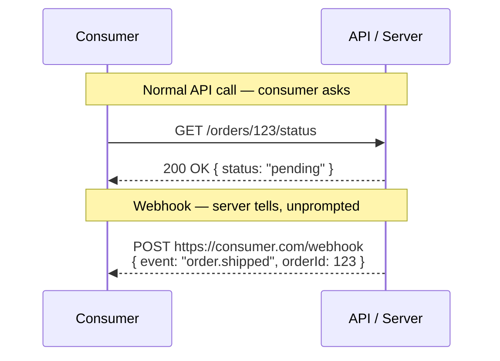

## What Is a Webhook?

A **webhook** is a way for a server to **notify a consumer automatically**, in real time, when something happens — instead of the consumer having to repeatedly ask "did anything change yet?"

It flips the normal API request direction:



In practice, this works like a reverse API call:

1. The consumer registers a URL with the provider ahead of time — e.g., `https://myapp.com/webhooks/orders`.
2. The consumer also specifies which **events** they care about (e.g., `order.shipped`, `payment.failed`).
3. Whenever that event actually happens on the provider's side, the provider sends an **HTTP POST request** to the consumer's registered URL, carrying event data in the body — no polling required.

```json
POST https://myapp.com/webhooks/orders
Content-Type: application/json

{
  "event": "order.shipped",
  "orderId": 123,
  "shippedAt": "2026-08-21T14:30:00Z",
  "trackingNumber": "1Z999AA10123456784"
}
```

## Why Consider Using One

| Problem with polling | How webhooks solve it |
|---|---|
| Consumer must repeatedly call `GET /orders/123` to check for changes | Provider pushes the update the moment it happens |
| Wastes requests when nothing has changed | No wasted calls — a request only happens when there's real news |
| Adds delay (only as fresh as your last poll interval) | Near real-time notification |
| Scales poorly with many consumers polling frequently | Scales better — server-initiated, only when needed |

**Typical use cases:** payment confirmations (Stripe), shipment tracking updates, CI/CD pipeline results (GitHub), chat/message events (Slack), subscription renewals — anywhere an event happens asynchronously and consumers need to react quickly without constantly checking.

## A Few Practical Considerations

- **Reliability** — the consumer's endpoint might be down when the webhook fires, so providers typically implement **retries** with backoff, and consumers should respond quickly with a `2XX` status to acknowledge receipt.
- **Security** — since anyone could send a POST to a public URL, providers usually **sign** the payload (e.g., an `X-Signature` header with an HMAC) so the consumer can verify the request genuinely came from the provider.
- **Ordering/duplicates** — consumers generally shouldn't assume events arrive in order or exactly once; designing handlers to be idempotent (safe to process twice) is standard practice.
- **Complementary, not a replacement** — webhooks are usually offered *alongside* a regular REST API, not instead of it; you still need normal endpoints to fetch full state, only using webhooks for the "notify me when something changes" part.
