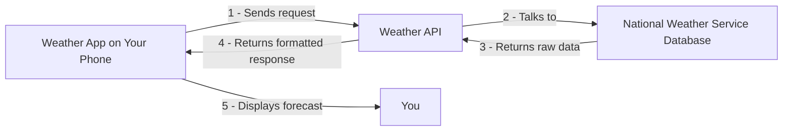
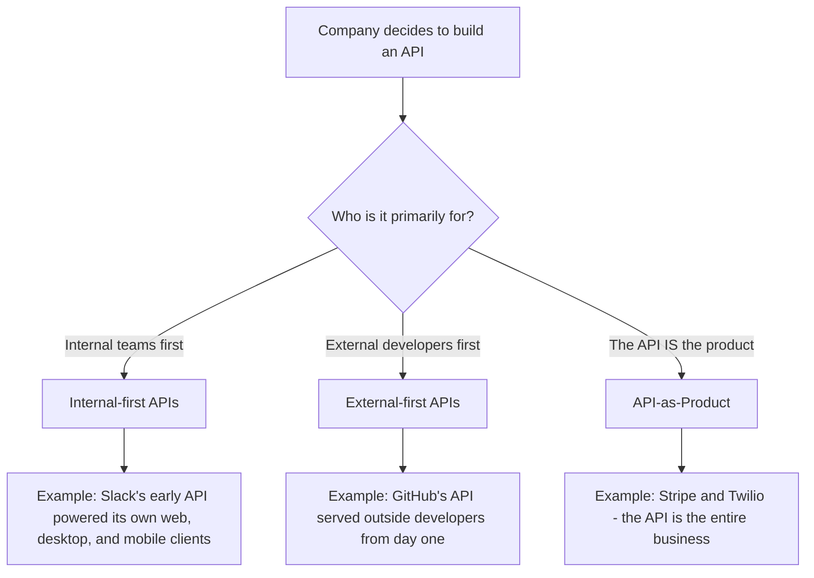

# What's an API? A Deep Dive Into the Interfaces That Run the Internet

I still remember the first time someone asked me, "So, what exactly *is* an API?" I gave the textbook answer — "application programming interface" — and watched their eyes glaze over. That answer is technically correct and almost completely useless. It's like defining a "car" as "a mode of transportation." True, but it tells you nothing about how it works, why it matters, or why you'd ever want to drive one.

So in this post, I want to actually unpack what an API is, why they exist, who uses them, and how different companies have built entire businesses around them. I'll back this up with real diagrams, a table or two, some tested code I ran myself, and a few hard-earned notes and cautions along the way.

## The Keyword Is "Interface"

Here's the thing I wish someone had told me earlier: the most important word in "application programming interface" isn't "application" and it isn't "programming." It's **interface**.

An API is the interface that one piece of software presents to other programs — and, just as importantly, to the humans who write those programs. When I design an API, I'm not just writing code that a machine will call. I'm designing a door into my system, and I'm deciding exactly what a stranger is allowed to see, touch, and change once they walk through it.

I like to think of software systems as houses. The inside of the house — my database schema, my business logic, my internal quirks and hacks — is private. Nobody outside needs to see how I organized my closets. But I still need a front door, a doorbell, and maybe a mail slot so the outside world can interact with me in a controlled, predictable way. That's the API.

And because an API is a door, its design says a lot about the house behind it. If I look closely at how an API is structured — what data it exposes, what actions it allows, how it names things — I can usually infer quite a bit about the business model, the product priorities, and yes, sometimes the bugs, of the system behind it.

### A Simple Mental Model

Here's a diagram of what's actually happening when your phone shows you tomorrow's weather forecast:



Notice that I, as the end user, never touch the National Weather Service's raw database. I don't need to know how they store barometric pressure readings or what programming language their backend runs on. The API is the negotiated contract between "what the weather app needs" and "what the weather service is willing to expose."

That's the whole idea, really. APIs let two systems — often built by two completely different companies, on two completely different tech stacks, on two completely different continents — talk to each other without either one having to know the other's internal secrets.

## Why Do We Need APIs, Really?

I think the honest answer is: **APIs exist so nobody has to reinvent the wheel.**

If I want to put an interactive map on my website, I have two choices. I can spend the next three years building my own global mapping system — licensing satellite imagery, hiring cartographers, writing routing algorithms — or I can call the Google Maps API and have a working map embedded in an afternoon. I'm confident you already know which option I'd pick.

Here's a table of a few everyday examples where I'm quietly relying on someone else's API without even thinking about it:

| What I want to do | The problem I'd have to solve myself | The API that solves it for me |
|---|---|---|
| Show a map on my website | Satellite imagery, geocoding, routing algorithms | Google Maps API |
| Let users log in with one click | Building and securing an entire identity system | Facebook Login / Google Sign-In |
| Accept credit card payments | PCI compliance, banking relationships, fraud detection | Stripe API |
| Send a text message confirmation | Telecom carrier agreements, SMS gateways | Twilio API |
| Show today's forecast | Weather satellites, meteorological modeling | National Weather Service API |
| Build a chatbot | Natural language processing, real-time messaging infra | A messaging platform's Bot API |

Every row in that table represents months or years of specialized engineering that I get to skip entirely. That's the economic magic of APIs: they let a startup with five people compete with an incumbent that has five thousand, because the startup doesn't have to build the boring, hard, already-solved infrastructure. It can just plug into it.

> **Note:** This is also why I try to remind junior developers that "not invented here" syndrome is expensive. If a reliable, well-documented API already solves your problem, building your own version is rarely a badge of honor — it's usually a distraction from your actual product.

## Who Am I Actually Building This For?

Here's a quote that stuck with me: *"None of the theory matters if you're not focused on building the right thing for the right customer."* That's true of any product, but it's especially true of APIs, because — and I say this from experience — **changing an API's design after the fact is brutally expensive.**

Once developers have built their applications on top of my endpoints, field names, and response formats, I can't just casually rename a field or restructure a response. I will break someone's production app, and they will not be happy about it. So before I write a single line of endpoint code, I try to get crystal clear on who's actually going to use this thing.

Let's say I'm designing an image upload and storage API. Here are three very different developers who might show up:

| Developer | Their situation | What they actually need from my API |
|---|---|---|
| Lisa | Web developer at an art startup | A simple, fast way for artists to upload and display photos of their work |
| Ben | Backend engineer at a large enterprise | A way to pull receipts from an expense system into an audit/policy tool |
| Jane | Frontend developer building customer support | Real-time chat integration, not just static image storage |

These three people have wildly different mental models, tolerance for complexity, and performance requirements. If I design my API purely around Lisa's simple use case, Ben's enterprise audit pipeline might choke on missing metadata or lack of batch operations. If I over-engineer for Ben's enterprise needs, Lisa might bounce off the documentation because it's too complicated for her "just let artists upload photos" use case.

The lesson I keep relearning: the more granular and specific I get about *who* my developers are, the better I can actually serve them. Vague personas produce vague, unloved APIs.

## The Business Case: Why Would a Company Even Build One?

I used to think companies built APIs purely out of technical necessity. That's not really true. APIs are a *business* decision as much as a technical one, and I've found it helpful to think about three broad patterns companies fall into.



### 1. Internal Developers First, External Developers Second

This is how I understand Slack's origin story. Slack's API was originally built to power *its own* messaging clients — web, desktop, and mobile. It wasn't designed with outside developers in mind at all. Over time, though, Slack realized that letting other companies build "integrations" on top of its messaging platform was hugely valuable, so it opened a Developer Platform.

The upside here is obvious: by the time external developers show up, the API has already been battle-tested by Slack's own engineers building real products on it. Nobody's discovering embarrassing bugs on day one because the internal team already found and fixed most of them.

The downside, though, is subtler and I think more interesting. Over time, internal needs and external needs start to pull in different directions. Slack's internal developers needed the freedom to keep innovating — new message types, new channel structures, new features. External developers, meanwhile, wanted *stability*. They'd built entire businesses on top of specific API behaviors, and every internal change risked breaking something downstream. That tension between "move fast internally" and "stay stable externally" is a recurring theme in API design, and it never fully goes away.

### 2. External Developers First, Internal Developers Second

GitHub took the opposite path. From the beginning, GitHub built its API primarily for external developers who wanted programmatic access to their own repositories and data. Small businesses sprang up almost immediately, building developer tools on top of GitHub's API and selling them back to GitHub's own user base.

What I find fascinating is how this shaped GitHub's later technical decisions. As the API matured, GitHub kept adding more fields to its JSON responses to satisfy various external use cases, and the payloads eventually became huge and unwieldy. Their solution was to build a GraphQL API — and notably, they shipped it to *external* developers first, before their own internal web team adopted it to power GitHub's own UI.

The advantage of this external-first approach is that the API doesn't have to awkwardly straddle two very different audiences — it can be purpose-built for the people paying closest attention to it: outside developers. The disadvantage, at least in GitHub's GraphQL case, is that the flexibility GraphQL gives developers (letting them query almost any shape of data they want) makes performance troubleshooting genuinely harder. Instead of monitoring one predictable endpoint, GitHub has to reason about a huge variety of possible access patterns.

### 3. The API *Is* the Product

Then there's the cleanest case of all: companies like Stripe and Twilio, where the API isn't a side feature bolted onto some other product — it *is* the entire product. Stripe sells payment processing through its API. Twilio sells SMS, voice, and messaging through its API. There's no separate "real" product hiding behind the API; the interface and the business are the same thing.

I genuinely think this is the most philosophically clean situation for a product team to be in, because there's no internal/external tension to manage. Every design decision, every deprecation, every new feature exists to serve the same single audience: developers integrating the API. It's the most straightforward company arrangement I know of — which doesn't mean it's *easy*, just that the incentives are all pointing the same direction.

> **Caution:** If your product's core revenue depends on something an API would undermine — say, your business runs on advertising, and a public API would let developers build ad-free alternative clients — building that API can actively cannibalize your own revenue. This is roughly what happened with the Twitter API and third-party clients over the years. Before opening an API, I always ask myself: *does this align with, or actively fight against, how we make money?*

## Seeing an API in Action

Theory is nice, but I wanted to actually *show* you a real API call rather than just describe one abstractly. So I wrote and ran a small Python script that hits GitHub's public REST API — a perfectly ordinary example of the "external developers first" pattern I just described.

```python
import requests

# A minimal, real API call - GitHub's public REST API
response = requests.get(
    "https://api.github.com/repos/octocat/Hello-World",
    headers={"Accept": "application/vnd.github+json"}
)

print("Status code:", response.status_code)

if response.status_code == 200:
    data = response.json()
    print("Repo name:", data["name"])
    print("Owner:", data["owner"]["login"])
    print("Stars:", data["stargazers_count"])
    print("Open issues:", data["open_issues_count"])
    print("Description:", data["description"])
else:
    print("Error:", response.text)
```

When I actually ran this from my sandbox, here's the real output I got back:

```
Status code: 403
Error: {"message":"API rate limit exceeded for 34.148.229.210. (But here's the good news:
Authenticated requests get a higher rate limit. Check out the documentation for more details.)",
"documentation_url":"https://docs.github.com/rest/overview/resources-in-the-rest-api#rate-limiting"}
```

Honestly, I think this is a *better* teaching moment than if the call had just succeeded cleanly, because it demonstrates something every API consumer eventually runs into: **rate limiting**. GitHub's unauthenticated API tier allows a fairly small number of requests per hour from a shared IP address, and my request happened to land on a machine that had already used up its quota. The `else` branch in my own error-handling code caught it exactly as designed and printed GitHub's explanation back to me.

This is a genuinely important, real-world lesson, so let me pull it out explicitly.

> **Note — Rate Limiting:** Almost every production API enforces some kind of rate limit, usually measured in "requests per hour" or "requests per minute," either per IP address or per API key. It exists to protect the provider's infrastructure from being overwhelmed and to keep the service fair across all consumers.
>
> **Caution — Always Handle It:** If you write client code assuming every request will succeed with a `200 OK`, you *will* eventually ship a bug. Always check the status code (typically `403` or `429` for rate limiting) and implement retry logic with exponential backoff. My `if/else` block above is the bare minimum — a production system would also inspect the `Retry-After` header and pause before trying again.

Here's a small table summarizing the HTTP status codes I've learned to watch for when working with APIs:

| Status Code | What it usually means | What I do about it |
|---|---|---|
| `200 OK` | Request succeeded | Parse and use the response |
| `201 Created` | A new resource was created | Confirm the resource, often check the `Location` header |
| `400 Bad Request` | My request was malformed | Check my payload/parameters |
| `401 Unauthorized` | I'm missing or have invalid credentials | Check my API key/token |
| `403 Forbidden` | I'm authenticated but not allowed — or rate-limited | Check permissions or back off requests |
| `404 Not Found` | The resource doesn't exist | Verify the endpoint/ID I'm calling |
| `429 Too Many Requests` | I've hit a rate limit | Wait and retry with backoff |
| `500 Internal Server Error` | Something broke on their end | Retry later, contact support if persistent |

If I authenticate my request with a personal access token, GitHub raises my rate limit dramatically — which is exactly the fix its own error message suggested. That single detail — "authenticate to get a higher quota" — is a design choice GitHub made deliberately, and it's a pattern I see across nearly every serious API provider: unauthenticated access is a taste, authenticated access is the real deal.

## What Actually Makes an API *Great*?

I've asked a few experienced engineers this exact question over the years, and the answers cluster around a similar idea: a great API is one that achieves what it's supposed to do, for the audience it's actually built for. That sounds almost circular, but I think it's genuinely the right framing, because it forces me to ask "great *for whom*, and *for what*?" instead of chasing some abstract, universal notion of API perfection.

There's a wonderful quote I keep coming back to from Chris Messina, who was a developer experience lead at Uber:

> A good API may come down to the problem you're trying to solve and how valuable solving it is. You may be willing to use a confusing, inconsistent, poorly documented API if it means you're getting access to a unique dataset or complex functionality.

I find that oddly comforting. It means I don't have to obsess over building a "perfect" API in some abstract sense — I have to make sure the value I'm providing outweighs the friction of using it. That said, all else being equal, here are the traits that I've found actually move the needle:

| Trait | What it means in practice |
|---|---|
| **Clarity** | Purpose, design, and context are obvious without deep digging |
| **Flexibility** | The API adapts to different, sometimes unexpected use cases |
| **Power** | It genuinely solves the whole problem, not just 80% of it |
| **Hackability** | Developers can pick it up quickly through trial and error |
| **Documentation** | Clear docs with real, runnable examples (not just field lists) |

I'd add one more that isn't always talked about explicitly: **the ability to stand the test of time.** APIs are, by nature, long-term commitments. The moment I ship an endpoint, I've entered into an implicit contract with every developer who builds on it. Changing that contract later — even for good reasons — carries real cost. Large enterprises tend to move slowly and predictably with their APIs, while early-stage startups iterate rapidly, sometimes to the frustration of the developers depending on them. Neither approach is inherently wrong; it just needs to match your company's stage and your developers' expectations.

> **Caution — Breaking Changes:** I've seen more damage done by well-intentioned API redesigns than by neglect. If I must change something significant, I version the API (`/v1/`, `/v2/`) and give developers a long, clearly communicated deprecation window rather than flipping a switch overnight.

## Tying It All Together

If I had to boil this entire post down into a handful of sentences, here's what I'd say: an API is a deliberately designed doorway between systems — and, just as importantly, between the humans who build those systems. It exists so I don't have to rebuild the wheel every time I want to add a map, accept a payment, or send a text. Its design reflects real business decisions about who it's for and how it fits into a company's revenue model, and once it's out in the world, changing it is expensive, so getting the initial design right — for the *right* audience — matters enormously.

I ran a real request against a real, production API in this post, and it got rate-limited — which honestly might be the most authentic lesson of all: APIs aren't abstract diagrams in a textbook. They're living systems with real limits, real quirks, and real consequences when you get something wrong. The best way I know to actually understand an API is exactly what I did here — go make a call to one, read the response carefully (errors included), and pay attention to what it's trying to tell you.
