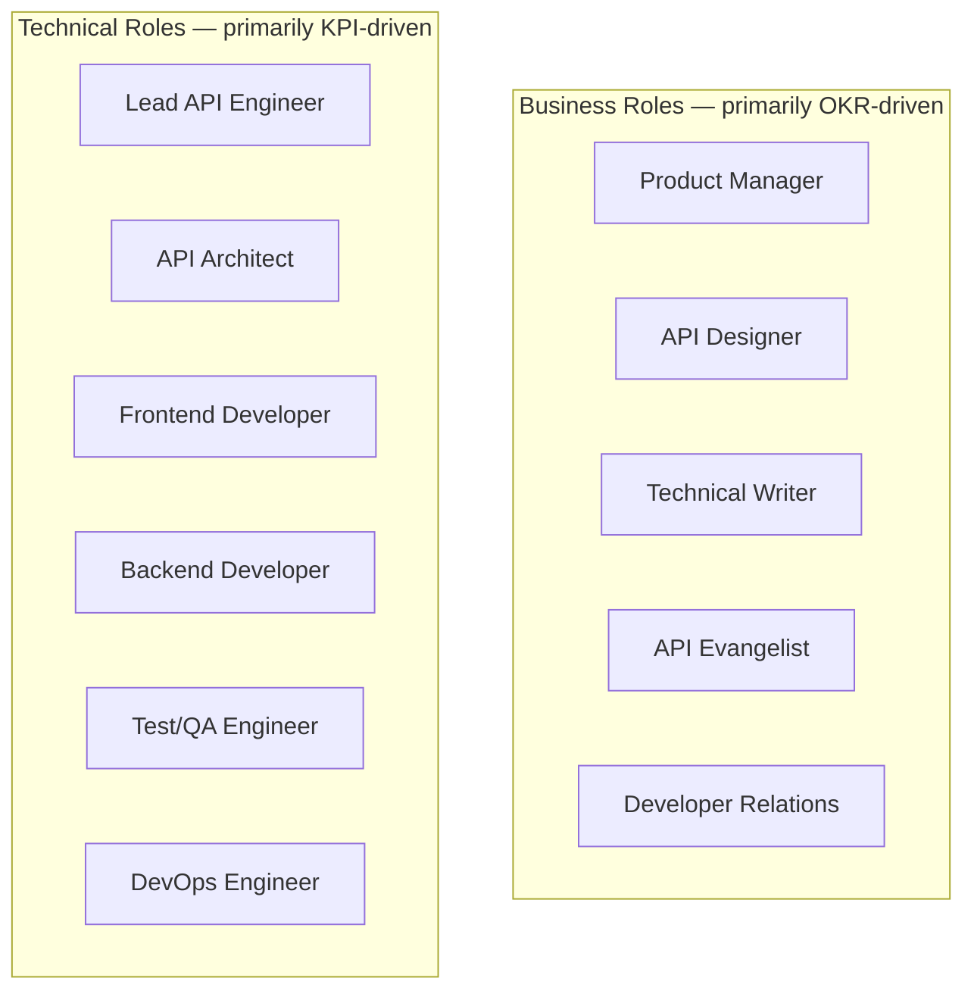
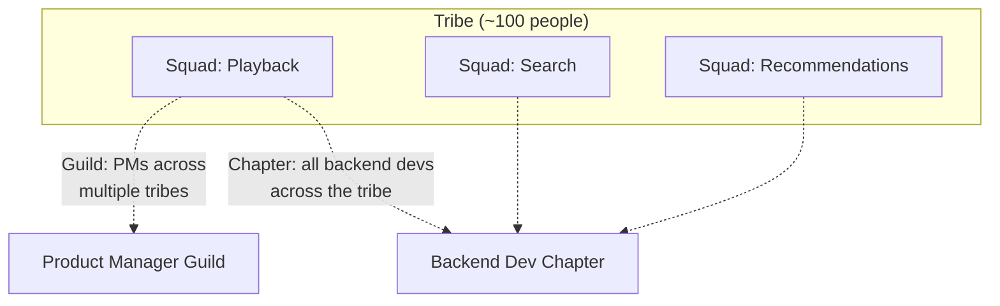
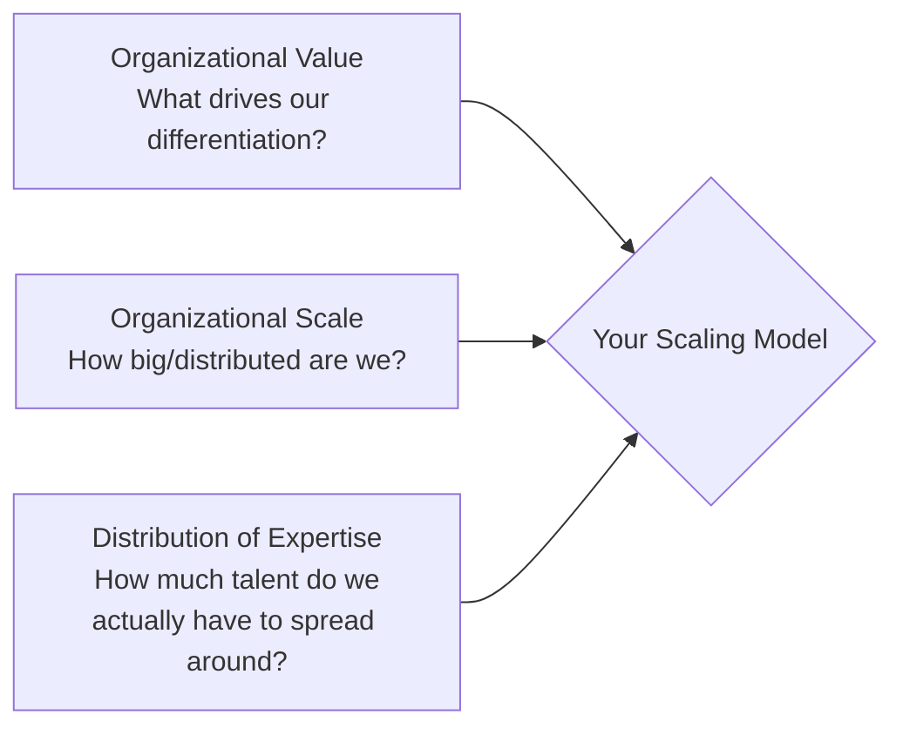
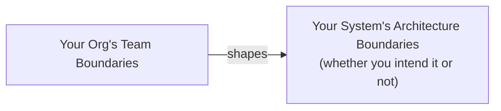
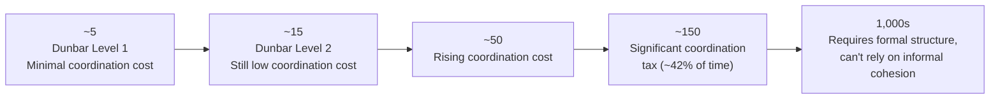
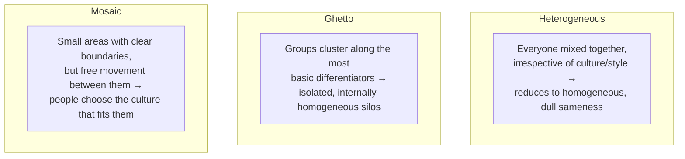
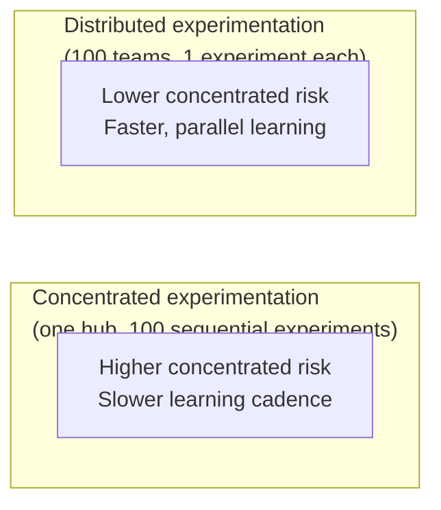

# Who Actually Builds an API? My Take on Roles, Teams, and the Culture That Holds Them Together

Steve Jobs put it plainly: *"Great things in business are never done by one person. They're done by a team of people."* I don't think that's a controversial statement, but I've noticed it's surprisingly easy to forget in the API world specifically, because so much of the discourse around APIs is technical — design patterns, protocols, versioning strategies. It's easy to slide into thinking of an API as an artifact that emerges from good architecture decisions alone. It doesn't. It emerges from a group of people, playing different roles, coordinating (imperfectly) with each other, inside a company culture that either helps or hurts that coordination.

This is the topic I want to dig into in this post: who actually does the work of building and running an API, how those people get organized into teams, how that organization needs to flex as your API matures, how teams scale once you have more than one of them, and — maybe the part I find most underrated — how company culture quietly shapes all of it, whether you're paying attention to it or not.

I want to be upfront about something before I dive in: there's no universal, standardized set of job titles across the industry. What one company calls an "API owner," another calls an "API program manager." What matters isn't the title — it's the underlying **role**, meaning the actual scope of responsibility and decision-making that has to be covered by *somebody*, regardless of what their business card says. I really like a line from software architect Simon Brown on this, originally said about the architect role specifically but true of every role I'll describe here: *"Becoming a software architect isn't something that simply happens overnight or with a promotion. It's a role, not a rank."*

Let's start with the roles themselves.

---

## API Roles: A Shared Vocabulary, Not a Set of Job Titles

I split the roles I typically see into two buckets — **business roles** and **technical roles**. I want to be clear that this split is a little artificial; plenty of these roles blend business and technical thinking constantly. But I find it genuinely useful as a lens, because it maps cleanly onto the OKR/KPI distinction I've written about elsewhere: business roles tend to be primarily accountable to OKRs (the big strategic "where are we going"), while technical roles tend to be primarily accountable to KPIs (the "how well is the thing actually performing" measurements).



> **Note:** I want to flag something up front: as you read through this list, do the exercise of mentally mapping each role onto your own organization's actual job titles. If you go through the list and find a role that genuinely isn't covered by anyone in your org, that's not a naming problem — that's a real gap in responsibility. I've found this exercise alone surfaces blind spots that a reorg chart review never would.

### Business Roles

**API Product Manager.** I think of the PM (sometimes called the product owner) as the main point of contact for the API, full stop — the human embodiment of the API-as-a-Product philosophy. They own making sure the API has clear OKRs and KPIs, that the rest of the team is properly staffed to cover the pillars I've written about elsewhere, and that the API is being actively monitored and shepherded through its full lifecycle. The PM defines the **what** — the jobs-to-be-done — while leaving the **how** to the technical roles. They're also accountable for the overall developer experience actually meeting consumer needs, from initial design through onboarding through the ongoing relationship. If I had to summarize the PM's job in one line: make sure all the moving parts actually come together the way they're supposed to.

**API Designer.** Owns every aspect of interface design — functionality, usability, and the overall developer experience of actually working with the API. A good designer keeps one eye on business OKRs and, often, coordinates with technical roles to make sure the design doesn't quietly undermine technical KPIs either. In a lot of organizations I've seen, the designer effectively becomes the first line of contact for API consumers, carrying the "voice of the consumer" into internal design decisions. They're also often the enforcer (in a good way) of company-wide style consistency.

**API Technical Writer.** Responsible for documentation aimed at *every* stakeholder connected to the API — not just external developers, but internal team members and even business-side stakeholders like a CIO or CTO who might need to understand what the API does. Technical writers don't have to come from a programming background (though many do), but they absolutely need to be strong communicators, researchers, and interviewers — because doing this job well means genuinely understanding both the provider's and the consumer's point of view. I've seen the best technical writers function almost like translators sitting between designers, engineers, and users.

**API Evangelist.** Focused on promoting the API practice and culture *within* the company — this role matters most in larger organizations where internal users don't have easy, direct access to the team that actually built the API they're trying to use. Evangelists make sure internal developers understand the API and can get their jobs done with it, and they're a critical feedback channel — listening to consumers and routing that feedback back to the product team. Depending on the org, they might also build samples, demos, and training material.

**Developer Relations (DevRel).** The external-facing cousin of the evangelist role. DevRel staff build the same kinds of samples, demos, and training assets, and they're similarly responsible for capturing consumer feedback and turning it into actionable fixes or features. What sets DevRel apart is the "selling" dimension — they may participate in customer on-sites, presales activities, ongoing support for key accounts, public speaking, blog writing, and general brand-awareness work aimed at driving the API's stated business goals.

### Technical Roles

**Lead API Engineer.** The technical mirror image of the product manager — where the PM owns the *what*, the lead engineer owns the *how*. This role is the key point of contact for development, testing, monitoring, and deployment work, and coordinates the rest of the technical team.

**API Architect.** Owns the architectural design details of the API itself, and — just as importantly — how it fits into the broader system: interacting cleanly with other APIs, other teams' systems, and shared infrastructure. The architect is also the advocate for the organization's overall software and system architecture, covering the "nonfunctional" concerns — security posture, stability and reliability targets, protocol and format choices — that don't show up directly in a feature list but absolutely determine whether the system holds up under real use.

**Frontend Developer.** Responsible for the *consumer-facing* experience of actually using the API — implementing things like the API registry, the consumer-facing developer portal, and other elements that shape how developers first encounter and interact with the product. Where the designer advocates for consumers from a business/UX lens, the frontend developer advocates for them from a technical implementation lens.

**Backend Developer.** Implements the actual interface itself, wires up data storage, connects to whatever other services the API depends on, and generally executes faithfully on the vision the PM and designer laid out. Once the API is live, it's the backend developer's job to keep it reliable, stable, and consistent in production.

**Test/QA Engineer.** Owns validating the design and testing functionality, safety, and stability — writing tests directly, or helping frontend/backend developers write their own. This goes well beyond simple functional testing; a good test/QA engineer is thinking about interoperability, scalability, security, and capacity testing too, usually leaning on whatever testing frameworks and tooling the broader QA community in the company has standardized on.

**DevOps Engineer.** Owns every aspect of building and deploying the API — working the delivery pipeline, writing (or teaching others to write) build scripts, managing release schedules, archiving build artifacts, and supporting rollbacks when something goes wrong. DevOps also typically owns real-time monitoring dashboards and mining offline logs to diagnose production issues. Depending on the org's hosting setup, this role might need to support desktop, build, test, staging, and production environments — sometimes spanning both on-premise and cloud infrastructure.

### A Quick Comparison Table

| Role | Bucket | Primary Accountability | Rough Technical Parallel |
|---|---|---|---|
| Product Manager | Business | OKRs, overall product success | Lead API Engineer |
| Designer | Business | Interface usability & DX | — |
| Technical Writer | Business | Documentation for all stakeholders | — |
| Evangelist | Business | Internal adoption & feedback | — |
| Developer Relations | Business | External adoption, brand, sales support | — |
| Lead API Engineer | Technical | Technical execution end-to-end | Product Manager |
| API Architect | Technical | Architecture, nonfunctional requirements | — |
| Frontend Developer | Technical | Consumer-facing implementation | — |
| Backend Developer | Technical | Core implementation, reliability | — |
| Test/QA Engineer | Technical | Validation, safety, stability | — |
| DevOps Engineer | Technical | Build, deploy, monitor, operate | — |

> **Caution:** Don't mistake "eleven roles" for "eleven headcount." A role is a scope of responsibility, not a person. Plenty of small, healthy teams cover multiple roles per person — the evangelist and DevRel roles frequently collapse into one person, and I've seen small teams where a single engineer covers both test/QA and DevOps. What matters is that every role's *responsibilities* get covered by someone, not that every role gets its own dedicated headcount.

---

## Roles Change Shape as Your API Matures

Here's where the role model actually becomes useful for day-to-day planning, rather than just a taxonomy exercise: **which roles matter most shifts predictably as an API moves through its lifecycle.** I've written elsewhere about the five-stage API product lifecycle (create, publish, realize, maintain, retire) — what I want to do here is overlay team composition on top of that same arc.


Two categories matter at every stage: **primary roles** (the ones whose decisions have the biggest impact, and without whom the required work for that stage literally can't happen) and **secondary roles** (still contributing, but in a supporting capacity relative to that stage's central work).

### Stage 1: Create

**Primary roles:** Product Manager, Designer, API Lead.
**Secondary roles:** API Evangelist, DevOps, API Architect, Backend Developer.

This is the stage where the strategic and design foundations get laid, at a point where mistakes are cheap because there aren't real users yet to hurt. The PM needs a genuine understanding of organizational context and the product domain in order to set a defensible course. The designer needs the experience to make solid interface decisions *and* the judgment to know how much design investment the situation actually warrants — over-investing in design rigor for a low-stakes internal API is its own kind of waste. Meanwhile, someone has to actually architect and build the implementation, which is where the API architect and API lead come in, orchestrating a cross-functional group doing genuinely exploratory, experimental work.

| Primary Activity | Roles Responsible |
|---|---|
| Develop the strategy | Product Manager |
| Design the interface model | Designer |
| Engineer the implementation | API Architect, API Lead, Developer |

| Supplementary Activity | Roles Responsible |
|---|---|
| Develop prototypes | API Lead, Backend Developer |
| Test implementability of the design | API Architect, API Lead, Backend Developer, Technical Writer |
| Test security of design and implementation | API Architect, Test/QA Engineer |
| Test marketability of the design | API Evangelist, DevRel |
| Test usability of the design | Designer |
| Plan/execute an implementation testing strategy | API Lead, Test/QA Engineer |

### Stage 2: Publish

**Primary roles:** Product Manager, Technical Writer, DevOps.
**Secondary roles:** Frontend Developer, Designer, Backend Developer, API Evangelist, DevRel.

Publishing means real users are about to get real access, so the emphasis shifts hard toward deployment, documentation, and discovery. A strong technical writer here directly accelerates the API's path from publish to realize — good docs get new users successfully integrating faster, full stop. DevOps takes point on actually deploying, monitoring, and architecting the live instance. And it's the PM's job to actually *trigger* the publish event — whatever that concretely means in your context (a catalog registration, an announcement email, a portal going live).

| Primary Activity | Role |
|---|---|
| Write and publish documentation | Technical Writer |
| Design deployment architecture, deploy instances | DevOps |
| Officially publish (make discoverable) | Product Manager |

| Supplementary Activity | Roles |
|---|---|
| Design/implement a developer portal | Frontend Developer |
| Market the API | API Evangelist, DevRel |
| Gather design feedback from users | API Evangelist, DevRel |
| Improve interface design | Designer |
| Collect usage data from deployed instances | API Lead, DevOps |
| Improve/optimize the implementation | API Lead, Backend Developer |
| Test security of implementation and deployment | API Architect, Test/QA Engineer |

### Stage 3: Realize

**Primary roles:** DevOps, Product Manager.
**Secondary roles:** Designer, Test/QA Engineer, API Architect, API Lead, Backend Developer, Frontend Developer, Technical Writer, DevRel, API Evangelist.

The stakes go up here — real value is being generated by real users, so protecting availability and managing change carefully both become paramount. The PM's job is genuinely hard in this stage: keep driving realized value forward without disrupting the users who are already delivering it. DevOps shifts focus toward resilience, observability, scalability, and performance — protecting quality for the high-value users who are now depending on the thing.

| Primary Activity | Role |
|---|---|
| Improve/optimize the deployment architecture | DevOps |
| Manage and prioritize changes | Product Manager |

| Supplementary Activity | Roles |
|---|---|
| Improve interface design | Designer |
| Improve/optimize tests | Test/QA Engineer |
| Improve/optimize implementation | API Architect, API Lead, Backend Developer |
| Test security of implementation/deployment | API Architect, Test/QA Engineer |
| Improve onboarding and learning experience | Frontend Developer, Technical Writer, DevRel |
| Market the API | API Evangelist, DevRel |

### Stage 4: Maintain

**Primary roles:** DevOps, DevRel, API Architect.
**Secondary roles:** Product Manager, API Lead, Backend Developer.

The goal narrows to "keep it running well" rather than "keep it growing," and the team composition narrows right along with it. DevOps keeps the deployed instances monitored and maintained. The API architect stays alert to *external* changes in the surrounding system that could quietly degrade this API's quality even without anyone touching it directly. DevRel keeps supporting existing users, sustaining the value the API still delivers even as growth has flattened.

| Primary Activity | Role |
|---|---|
| Improve/optimize the monitoring system | DevOps |
| Support existing users | DevRel |
| Identify system changes that could degrade quality | API Architect |

| Supplementary Activity | Roles |
|---|---|
| Plan and schedule implementation changes | Product Manager |
| Make required implementation changes | API Lead, Backend Developer |
| Make required deployment changes | DevOps, Backend Developer |

### Stage 5: Retire

**Primary role:** Product Manager.
**Secondary roles:** DevRel, API Evangelist, API Architect, DevOps, API Lead.

Retirement is fundamentally strategic work, so the PM leads it — the same skill set that built a tactical plan for launching a new API translates directly into building one for sunsetting an old one. DevOps handles the deployment-side deprecation (pulling instances, updating infrastructure); DevRel handles the user-side deprecation (communication, transition support). Sometimes a genuine technical plan is needed too — things like response headers signaling deprecation status, or messages embedded directly in API responses — and that typically falls to the architect or lead engineer.

| Primary Activity | Role |
|---|---|
| Develop a retirement strategy | Product Manager |

| Supplementary Activity | Roles |
|---|---|
| Communicate the retirement plan, help users transition | DevRel, API Evangelist, Technical Writer |
| Design a technical retirement strategy | API Architect, API Lead |
| Update deployment architecture, remove instances gracefully | DevOps, API Lead |

```mermaid
gantt
    dateFormat X
    axisFormat %s
    title Which roles carry the most weight, by lifecycle stage (illustrative)
    section Create
    PM + Designer + API Lead :active, 0, 1
    section Publish
    PM + Tech Writer + DevOps :active, 1, 2
    section Realize
    DevOps + PM :active, 2, 3
    section Maintain
    DevOps + DevRel + Architect :active, 3, 4
    section Retire
    PM (strategic) :active, 4, 5
```



> **Note:** Notice the pattern across all five stages — the Product Manager is a primary role in four out of five stages (everywhere except maintain), which tells me something important: PM continuity across the *entire* lifecycle is genuinely valuable, even in stages where their day-to-day workload is lighter. If I had to pick one role I'd be most reluctant to rotate frequently, it'd be this one.

---

## Scaling Beyond a Single Team

Everything so far has assumed I'm managing one API with one team. Reality, of course, is messier — most healthy API programs I've encountered have many teams, working on many APIs, simultaneously. That introduces a genuinely different category of challenge: not "how do I staff this one team well," but "how do I keep a whole community of teams from working at cross-purposes with each other?"

I like to treat each API team as functionally independent — able to solve its own problems with minimal cross-team dependency. But I've learned that theory and reality diverge here in an important way: in theory, independent teams don't need each other; in practice, teams absolutely cannot work well *without* each other. There's a constant, healthy tension between preserving team independence and enabling real cross-team collaboration, and managing that tension well is its own discipline.

General Stanley McChrystal, writing in *Team of Teams*, frames this really well: *"As the world grows faster and more interdependent, we need to figure out ways to scale the fluidity of teams across entire organizations."* The goal isn't making teams dependent on each other — it's getting them to genuinely work well together without sacrificing their independence.

### The Spotify Model: Squads, Tribes, Chapters, Guilds

The most widely referenced example of scaling this well comes from Spotify's 2012 whitepaper, "Scaling Agile @ Spotify," by Agile coaches Henrik Kniberg and Anders Ivarsson. I want to walk through it because — even though the paper itself is old by internet-time standards, and Spotify itself has evolved well past what it describes — I still see the core structure show up, in some variation, at a huge number of organizations.



**Squads** are the basic unit of work — small, self-contained teams of five to seven members, structured much like a Scrum team, with all the skills needed to take something from design through deployment. Each squad owns a specific mission inside a larger product area — one squad might own the playback experience of a music player, another owns search, and so on.

**Tribes** are collections of squads sharing a larger product scope — the whole Android app, the website, or a shared backend storage service everything else depends on, for instance. Spotify deliberately tries to cap tribes around 100 people — big enough for real diversity of skill and perspective, but small enough to still maintain healthy relationships across the group.

**Chapters** solve for a specific gap: since each squad is self-contained, each one likely has its own designer, backend developer, PM, and so on, all facing genuinely similar challenges even though they sit on different squads. A chapter is people sharing the *same role*, within the *same tribe*, getting together periodically to trade knowledge and experience — all the backend developers in the infrastructure tribe, say, meeting up regularly.

**Guilds** operate one level further out — sharing knowledge *across* multiple product groups entirely, not just within one tribe. A guild might be product managers from every corner of the company — customer-facing and internal-facing alike — getting together to share what they're learning.

> **Note:** I think the elegant part of this model is that it solves two problems at once with two different structures: squads and tribes optimize for *getting things done* with minimal coordination overhead, while chapters and guilds optimize for *knowledge sharing* without collapsing team independence back into one giant, slow-moving group.

### Don't Just Copy Spotify

Here's the caution I think gets skipped far too often: a wave of companies tried directly copying the Spotify model after this paper went viral, hoping to inherit Spotify's agility along with the org chart. The companies that actually benefited were the ones who **adapted** the model to their own context rather than copying it wholesale — and, tellingly, Spotify itself has continued evolving well past what's described in that original paper. Treat it as a solid, proven *starting point*, not a blueprint to follow literally.

I've found three factors matter most when deciding how to actually scale your own teams:



**Organizational value.** Different companies get value from fundamentally different things, and that has to shape how teams get scaled. A technology company selling API access directly might justify heavy infrastructure and engineering investment to stay competitive. A retailer, by contrast, might get more value from rapidly iterating on customer experience using largely commoditized technology underneath — and that difference should visibly show up in how much you invest in roles like DevRel, product management, or dedicated developer headcount.

**Organizational scale.** Company size, distribution, and decision-making structure all matter enormously here. A large, globally distributed org needs API teams that can stay genuinely connected to a much bigger web of stakeholders and authorities. A small, fast-moving startup needs a scaling strategy specifically designed *not* to introduce a bottleneck as it grows — because that bottleneck will bite quickly at startup speed.

**Distribution of expertise.** This is the factor I think gets underweighted most often. Talent availability varies enormously between organizations, largely as a downstream effect of the first two factors. A mid-tier regional bank simply isn't going to have the same density of deep API expertise as a large software company — and that's not a failure, it's just a different starting resource pool that has to inform the scaling model. Fewer people able to make high-quality decisions generally pushes you toward *centralizing* those decisions, or finding deliberate ways to distribute the expertise that does exist (a floating design pool, a shared architecture review board, and so on) rather than trying to fully decentralize decision-making the way Spotify's model assumes.

---

## Company Culture: The Invisible Governance Layer

I want to shift gears now to something I think gets dramatically underinvested in relative to how much it actually matters: **company culture as a governance mechanism.** I've written elsewhere about the tradeoff between centralized and decentralized decision-making — centralized decisions get enforced through authority (someone has to actually make people comply). Decentralized decisions can't rely on that same lever. What fills the gap, when it works well, is **culture** — an invisible hand shaping decisions consistently across a distributed organization without needing heavy process, standards documents, or common tooling to force the outcome.

That's a genuinely powerful idea once it clicks: with the right culture and the right people, you can safely push more decision-making authority outward — decentralizing more — while *still* getting consistent outcomes. That's exactly why investing real time in shaping culture pays off, especially as an organization scales its API program across more and more autonomous teams.

The concept itself traces back to Dr. Elliott Jaques' *The Changing Culture of a Factory*, where he defined culture as: *"the customary and traditional way of thinking and doing of things, which is shared to a greater or lesser degree by all its members, and which new members must learn."* I like that definition because it implies something actionable — if culture is learned and shared, it can also be deliberately shaped and steered, not just observed passively. Gareth Morgan's *Images of Organization* pushed this further, using metaphors (organizations as machines, as organisms, as brains) as a practical lens for actually thinking about how to influence your own culture.

I'm not going to try to summarize seventy years of organizational culture scholarship here. Instead, I want to walk through three specific frameworks I've found genuinely useful, over and over, when working with companies actively trying to build (or fix) their API culture: Conway's law, Dunbar's numbers, and Alexander's mosaic of subcultures.

### Conway's Law: Your Org Chart Is Your Architecture Diagram

Mel Conway's 1967 paper "How Do Committees Invent?" gave us what Fred Brooks later dubbed **Conway's law**, and I think it's become close to required reading in any serious discussion of microservices or API architecture at this point. The statement itself:

> *"Organizations which design systems...are constrained to produce designs which are copies of the communication structures of these organizations."*

Eric S. Raymond's famous illustration nails the intuition: *"If you have four groups working on a compiler, you'll get a 4-pass compiler."* Distilled to its essence, Conway's law says the boundaries between your teams **will** show up in the software those teams build, whether you intend it or not — because software only does what humans, working within their existing communication structures, actually tell it to do.



**A worked example I've seen play out firsthand.** If your "Orders" team and your "Inventory" team sit in completely separate reporting lines, rarely talk, and have historically different release cadences, don't be surprised when the Orders API and the Inventory API end up tightly coupled through a brittle, ad-hoc integration nobody quite owns — that's Conway's law expressing itself through the org chart, not a random architectural accident.

Some consultants push a "reverse Conway maneuver" — deliberately setting team boundaries *first*, specifically to engineer the system architecture you actually want to end up with. I think this can genuinely work to a real extent. But Conway himself flagged the risk of getting too aggressive with this, in the same original paper:

> *"[Conway's law] creates problems because the need to communicate at any time depends on the system in effect at that time. Because the design which occurs first is almost never the best possible, the prevailing system may need to change. Therefore, flexibility of organization is important to effective design."*

In other words: you can't fully "out-Conway" Conway's law. My honest takeaway from working with this idea over time: establish clear team boundaries early — that genuinely helps sort out responsibilities and clarify interfaces between teams — but hold those boundaries loosely enough to adjust as you learn more, because your first attempt at drawing those lines is essentially never the best possible arrangement.

> **Tip:** I've found real value in explicitly pairing Conway-awareness with a model-driven design approach — the same domain-driven design thinking I've written about elsewhere, applied simultaneously to your APIs *and* your team structure. When your domain model, your API boundaries, and your team boundaries are kept intentionally aligned and updated together, you get to actively steer Conway's law instead of just being subject to it. Matthew Skelton and Manuel Pais's *Team Topologies* is a genuinely excellent, much more current resource for putting this into practice deliberately.

### Dunbar's Numbers: Why Team Size Isn't Arbitrary

Conway tells me team boundaries shape system output. A natural follow-up question: what's the *right* size for a team in the first place? This is where Robin Dunbar's research comes in — you've probably encountered "Dunbar's number" (150) in some pop-science context before, but I think the underlying research is genuinely more useful than the single headline number suggests.

Dunbar's core claim: humans can only successfully maintain meaningful relationships with roughly 150 people at once before our cognitive capacity to coordinate and lead effectively starts breaking down. Past that threshold, keeping a group coordinated, on-task, and genuinely working together gets substantially harder.

There's real corroborating evidence for the power of this specific number beyond Dunbar's own research. Bill Gore, founder of W. L. Gore & Associates, instituted a hard rule: once a single factory location crossed 150 people, split it into two — sometimes literally building a new facility right next door. Netflix's Patty McCord calls this the "stand-on-a-chair" number — past 150, a team leader genuinely can't just stand on a chair and address the whole group in one go anymore.

But the number I find most useful isn't 150 — it's the underlying insight about **coordination cost scaling with group size**. Dunbar's research found that groups around 150 require something like 42% of total available time just for "social grooming" — the human coordination work needed to keep the group functioning as a group. In a modern office, that grooming shows up as meetings, emails, status updates, standups, shift handoffs — the whole apparatus of staying coordinated. Larger teams are expensive specifically *because* of this coordination tax, not because the individual people involved are somehow less capable.

Dunbar actually gives us a whole *series* of numbers, not just 150: roughly 5, 15, 50, 150, and further tiers into the thousands.



At the lower tiers — 5, and even up to 15 — coordination cost stays genuinely small. In a team of five, everyone deeply knows everyone else, knows exactly what their job is, and (let's be honest) knows precisely who is or isn't pulling their weight. That's a **Dunbar Level One** team — the size I most commonly see in early startups, and, not coincidentally, the size Spotify explicitly targets for its squads (five to seven people). **Dunbar Level Two** teams, up to around 15, are common in young companies that have gotten past initial funding and are actively scaling the business, and communication cost, while rising, is still manageable at this tier.

> **Note:** I've noticed a genuine pattern across the healthiest API organizations I've worked with: they actively fight to keep individual team sizes anchored at Dunbar Level One or Two, specifically *because* they understand that communication cost, not raw headcount, is the real constraint on team effectiveness. Adding a sixth or seventh person to an already-well-functioning five-person team isn't free just because "we have budget" — it changes the coordination math.

### Alexander's Mosaic of Subcultures: Managing the "Landscape of Teams"

Once you're managing many teams simultaneously, you face a genuinely different challenge than managing any single team well — what I like to call a "landscape of teams," which shares a surprising amount of structural similarity with managing a landscape of APIs. For this, I lean on the work of physical architect Christopher Alexander — yes, the same Alexander whose 1977 book *A Pattern Language* is widely credited as the origin point of the entire software patterns movement.

Alexander described three fundamentally different ways large communities organize their internal subgroups, originally applied to city planning, but I find the parallel to IT organizations genuinely striking:



**Heterogeneous** organizations mix everyone together without regard to lifestyle, working style, or genuine cultural differences — flattening everything toward a homogeneous, often uninspired common denominator. In IT terms, this might look like "we all use the exact same tools and processes across the entire company, no exceptions," regardless of whether that actually fits every team's real needs.

**Ghetto** organizations cluster along the crudest possible differentiators — "we're all data engineers here, the QA people work out of the other building" — creating isolated, internally-homogeneous pockets that rarely interact meaningfully with each other.

**Mosaic** organizations, Alexander's preferred pattern, have small areas with genuinely clear boundaries — but people can move freely between them, drawn toward whichever group's culture and mission actually resonates with them. In IT terms: *"I joined this squad specifically because I wanted to work on our mobile app."*

> **Caution:** I want to flag that it's tempting, especially for leaders who value consistency, to unconsciously drift an organization toward the "heterogeneous" pattern — standardizing everything, everywhere, in the name of efficiency and predictability. Alexander's framing pushed me to see that as a real cost, not a pure win: forced sameness across genuinely different teams tends to produce dull, uninspired output, not the consistency dividend leaders often expect from it.

Being able to actually name which pattern your organization is currently exhibiting — heterogeneous, ghetto, or mosaic — is, in my experience, the first real step toward doing something intentional about it, rather than just drifting into whichever pattern emerges by accident from how the company happened to grow.

### Culture Enables (or Kills) Experimentation

I want to close this culture discussion with the piece I think matters most in practice: **culture is what determines how much genuine experimentation and innovation your teams can actually pursue.** There's a line attributed to Peter Drucker that I think about constantly: *"Culture eats strategy for breakfast."* No matter how good your strategy is on paper, the prevailing culture is what actually drives day-to-day behavior — this is really Conway's law again, one level up: the organization and its boundaries determine the output, strategy documents notwithstanding.

A genuine key to fostering real innovation is making it **safe to experiment.** Michael Dell put this well in *Direct from Dell*: *"To encourage people to innovate more, you have to make it safe for them to fail."* The important word there is *safe* — not that failure should be common or trivial, but that teams need enough bounded room to genuinely experiment without being able to inflict serious, costly damage on the broader company in the process.

Here's something I found genuinely counterintuitive when I first encountered it, and I think it's worth spelling out carefully: **distributing experimentation across many teams is actually *safer* than concentrating it in one central hub**, even though it might initially seem like the opposite — more experiments happening everywhere sounds like it should mean more risk, not less.

Nassim Taleb's framing in *Skin in the Game* clarified this for me: *"The probabilities of success from the collection of people does not apply to [one person]."* An ensemble of 100 different teams each running one experiment is not the same risk profile as one team running 100 experiments in sequence — concentrating experimentation in a single hub (something like a centralized "Center for Enablement") actually concentrates the associated risk right along with it, even though it might feel more controlled and governed on the surface.



More distributed experimentation means more genuine attempts at innovation, which feeds directly back into the continuous-improvement model I've described elsewhere for the API product lifecycle — it's genuinely sustainable over time specifically because the risk is spread out rather than concentrated. Making this actually work well, without descending into chaos, requires the same "decision elements" thinking I'd apply to any other API governance question — clear boundaries, clear scope, clear authority — just applied to the boundaries around *experimentation itself* rather than to a specific API decision.

---

## Bringing It Together: A Small Illustrative Tool

To make some of this concrete rather than purely conceptual, here's a small, genuinely testable script I've used in a rough form to sanity-check team composition against a given API lifecycle stage — the kind of thing I'd run before a planning session to flag an obvious staffing gap ahead of time, rather than discovering it mid-quarter:

```javascript
// team-composition-check.js
const stagePrimaryRoles = {
  create: ['productManager', 'designer', 'apiLead'],
  publish: ['productManager', 'technicalWriter', 'devOps'],
  realize: ['devOps', 'productManager'],
  maintain: ['devOps', 'devRel', 'apiArchitect'],
  retire: ['productManager'],
};

function checkStaffingGaps(stage, currentTeamRoles) {
  const required = stagePrimaryRoles[stage];
  if (!required) {
    throw new Error(`Unknown lifecycle stage: ${stage}`);
  }
  const missing = required.filter((role) => !currentTeamRoles.includes(role));
  return {
    stage,
    fullyStaffed: missing.length === 0,
    missingPrimaryRoles: missing,
  };
}

module.exports = { checkStaffingGaps };
```

```javascript
// team-composition-check.test.js
const { checkStaffingGaps } = require('./team-composition-check');

describe('team composition gap check', () => {
  test('flags a missing primary role in the publish stage', () => {
    const result = checkStaffingGaps('publish', ['productManager', 'devOps']);
    expect(result.fullyStaffed).toBe(false);
    expect(result.missingPrimaryRoles).toEqual(['technicalWriter']);
  });

  test('passes when all primary roles for maintain are covered', () => {
    const result = checkStaffingGaps('maintain', ['devOps', 'devRel', 'apiArchitect', 'productManager']);
    expect(result.fullyStaffed).toBe(true);
    expect(result.missingPrimaryRoles).toEqual([]);
  });

  test('throws on an unknown lifecycle stage', () => {
    expect(() => checkStaffingGaps('deprecated', [])).toThrow();
  });
});
```

Obviously this is a toy example — real staffing decisions involve nuance no script will fully capture — but I've found even a lightweight, codified version of "which primary roles does this stage actually require" is a genuinely useful forcing function during planning conversations. It turns a fuzzy "do we have the right people on this?" gut-check into something explicit I can actually point to.

---

## Wrapping Up

If I had to compress this entire post into one operating principle, it'd be this: **an API is built by a team, that team's shape needs to change as the API matures, and none of that coordination works without a culture that supports it.** Roles give me a shared vocabulary for what work needs covering, regardless of what any individual's job title happens to say. The lifecycle mapping tells me where to focus staffing attention as an API moves from create through retire. Scaling frameworks like Spotify's squads-and-tribes model help me keep many teams cooperating without collapsing their independence. And the deeper cultural forces — Conway's law shaping my architecture whether I like it or not, Dunbar's numbers setting a real ceiling on how large a team can stay coordinated, Alexander's mosaic offering a genuinely healthier alternative to forced sameness or isolated silos — are the invisible substrate that determines whether all of the above actually works in practice, or just looks good on an org chart.

I'll end with the McChrystal quote that I think captures the whole shift in mindset better than anything else I've come across: *"The temptation to lead as a chess master, controlling each move of the organization, must give way to an approach as a gardener, enabling rather than directing."* Managing the people side of an API program, at any real scale, isn't about controlling every move. It's about tending the conditions — the roles, the team shapes, the culture — that let good work actually happen on its own.
