# Why I Stopped Fearing API Change (and Started Managing It Instead)

There's a quote I keep coming back to whenever I'm nervous about touching a live API: *"It is not necessary to change. Survival is not mandatory."* It's dry, a little dark, and completely true. Nobody is forcing me to improve my API. I could freeze it exactly as it is today and never touch it again. The problem is that "surviving" as a product usually requires the opposite — a willingness to keep changing, carefully, forever.

I want to use this post to walk through everything I've learned about managing change in a live, in-use API. Not the one-time work of building v1 — the *ongoing* work of keeping an API healthy for years after it ships. This is, in my experience, the single hardest and most under-appreciated discipline in API work, because it's invisible when done well and catastrophic when done poorly. Nobody throws a party when a breaking change *doesn't* happen. But everybody notices when it does.

I'm going to cover four big ideas in this post:

1. Why I think about change management as a *continuous improvement* discipline, not a one-off event.
2. Three different mental models for driving that continuous improvement (PDSA, OODA, and the Theory of Constraints).
3. What actually gets changed when I "change an API" — because it's never just one thing.
4. The real costs that make API change hard, and what I can actually do about them.

Let's get into it.

---

## Why Change Is the Whole Point, Not a Failure Mode

I used to treat "we have to change the API again" as a slightly embarrassing admission — like we didn't get it right the first time. I don't think that way anymore. Change *is* the mechanism by which an API product gets better. If I never touched my API again after launch, I'd need to have gotten everything right on day one: every edge case anticipated, every future requirement predicted, every scaling need pre-solved. That's basically how you'd have to build a spacecraft — huge amounts of upfront planning because there's no changing it once it launches.

Thankfully, I don't have to build APIs like rockets. I can ship something reasonably good, learn from how it's actually used, and improve it. That's a genuinely liberating shift once it clicks. Cheaper, easier change means I can afford to take more risks, because I know I can course-correct quickly if something doesn't work out. More risk tolerance means more room for real improvement, not just safe, incremental tweaks.

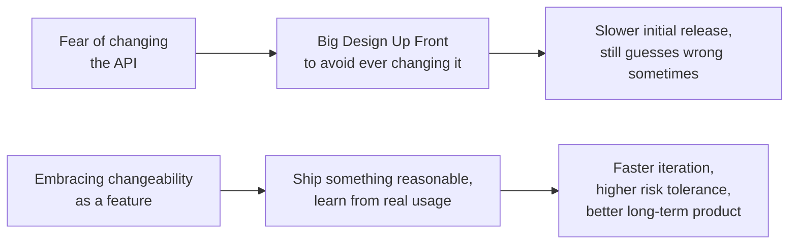

But I want to be precise about something: change for change's sake isn't the goal. Every change I make to an API should be justifiable in terms of **improving developer experience** or **reducing the maintenance cost** for whoever's sponsoring the product. Sometimes that payoff is immediate — better docs reduce support tickets tomorrow. Sometimes it's delayed — improving how the API scales won't show any benefit until traffic actually grows, but it prevents a future degradation I'd otherwise be scrambling to fix under pressure. I try to judge every proposed change against one of those two yardsticks, even when the benefit is a "someday" benefit rather than an "immediately visible" one.

> **Note:** I've found it genuinely useful to ask, before starting any nontrivial API change: *"Is this improving developer experience, reducing maintenance cost, or both — and if I can't articulate which, why am I doing this?"* It's a simple gut-check that's killed more than a few pet projects of mine that were really just technical curiosity dressed up as "improvement."

---

## Three Mental Models for Driving Continuous Improvement

If I accept that change should happen continuously, in small increments, rather than in rare, giant leaps, I need some kind of repeatable process for deciding *what* to change next and *how* to learn from each attempt. I rely on three different models depending on context, and I want to walk through all three because I think knowing more than one gives me flexibility to pick the right tool for the situation.

### Model 1: Plan-Do-Study-Act (PDSA)

This one comes from W. Edwards Deming, the quality-management pioneer whose ideas reshaped manufacturing in the 20th century. His "System of Profound Knowledge" treats an organization as a complex system worth studying scientifically, and the PDSA cycle is the practical engine at the center of it.

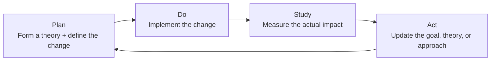

Here's a concrete example I've actually lived through. Say my goal is reducing the time it takes new developers to get their first successful API call working.

- **Plan:** My theory is that the docs are the bottleneck, so I plan to rewrite the "getting started" guide with a much more guided, step-by-step tone.
- **Do:** I actually rewrite it and ship the new version.
- **Study:** I watch the error rate for first-time API calls made by developers who visited the new doc page, and compare it to the baseline from before.
- **Act:** If errors dropped, great — I lock that pattern in and look for the next opportunity. If they didn't move much, that's useful information too: maybe the real bottleneck wasn't the docs at all, and it's time to investigate the interface design itself.

What I like about PDSA is that it treats a "failed" experiment as *useful data*, not a wasted effort. The point isn't to be right on the first try — it's to keep tightening the loop between action and evidence.

> **Tip:** PDSA works best when your organization already has a real appetite for experimentation and a genuine habit of doing honest post-implementation reviews. If "we tried something and it didn't work" gets treated as a failure to be swept under the rug rather than a data point, PDSA won't get you very far — the "Study" step quietly disappears, and you're left just doing "Plan-Do" forever.

Deming built this for factory floors, but I think it maps onto software almost perfectly, and it's not an accident that Lean, Kaizen, and Agile all share this same DNA: pick a target, change it a little, measure, and repeat.

### Model 2: Observe-Orient-Decide-Act (OODA)

The OODA Loop comes from a very different world — fighter pilot combat strategy. John Boyd studied why American pilots in the Korean War consistently won dogfights despite flying technically inferior aircraft, and his answer was: they made better decisions, faster, in a tight repeating loop.

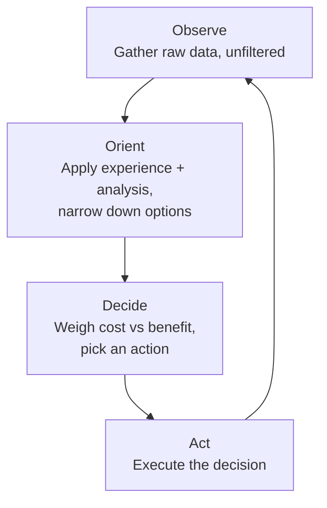

Walking through each step the way I apply it to API work:

- **Observe:** Pick a target concern — say, API security, or scaling, or a specific feature area — and gather as much raw information as I can, from as many sources as possible, without filtering or judging it yet.
- **Orient:** Now I apply my own experience and whatever analysis I can do, filtering out noise and narrowing down to a handful of genuinely plausible options.
- **Decide:** I weigh the real costs and benefits of those options and commit to one.
- **Act:** I execute — and because this is a *loop*, the results of that action immediately become the next round's raw material for Observe.

> **Note:** OODA has a genuinely colorful, warfare-flavored backstory, and I want to flag honestly: I don't think "war" is always the right metaphor for how a software team should think about improving a product. But the core insight — that *speed of decision-making itself* can be a competitive advantage, even against a technically superior opponent — has held up remarkably well in my experience, especially in fast-moving, competitive markets.

I reach for OODA specifically when speed genuinely matters more than exhaustive analysis — situations where market competition is fierce, and shipping early and often beats shipping "perfectly."

### Model 3: Theory of Constraints (TOC)

The third model comes from Eliyahu Goldratt's business novel *The Goal*, and it takes a completely different angle: instead of a generic improvement loop, it says *find your single biggest bottleneck, obsess over it, fix it, then move to the next one.*

Here are the five steps as I apply them:

1. **Identify the system's bottleneck** and pick one to target.
2. **Decide how to exploit it** — essentially, find the highest-leverage hack for working around or through it.
3. **Subordinate everything else** to that decision — resist the urge to split focus.
4. **Reduce (fix, replace, or remove) the bottleneck.**
5. **Go back to step 1** and find the *next* bottleneck — because there's always another one.

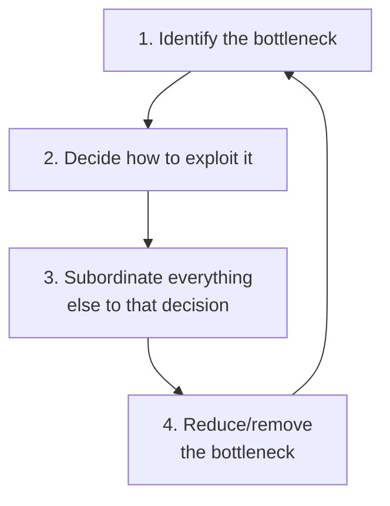

A subtlety I want to call out: in TOC, a "bottleneck" doesn't have to be something visibly broken. It might just be something inefficient, costly, or unreliable that's quietly capping how good the whole system can get, even while everything looks fine on the surface. For APIs, that could be developer experience capping adoption speed, a slow backend service capping reliability, or a clunky design capping how quickly your API can meet new product demands.

> **Tip:** TOC is my go-to when the organization *isn't* under direct competitive threat and just wants steady, disciplined, incremental improvement — the laser-focus nature of it doesn't play well if you're trying to move on ten fronts simultaneously, but it's fantastic for methodically working through a backlog of "known but not urgent" problems.

### Picking Between Them

I don't treat these as mutually exclusive — I think of them as three lenses, and I pick the one that fits the situation:

| Model | Best Fit When... | Core Mechanism |
|---|---|---|
| **PDSA** | You have a culture that tolerates experimentation and does honest retros | Iterative theory-test-learn cycle |
| **OODA** | Speed and competitive pressure matter more than certainty | Rapid observe-decide-act loop |
| **TOC** | You want steady, non-urgent, methodical improvement | Relentless focus on one bottleneck at a time |

None of these are the *only* valid approaches — they're examples, not gospel. What matters is that I've committed to *some* repeatable discipline for continuous improvement, one that actually fits my organization's culture, rather than either flying blind or freezing up entirely.

---

## API Change Velocity

Committing to lots of small, continuous changes only works if I can actually push those changes through *quickly*. If every small improvement takes six weeks to ship, "continuous incremental improvement" is really just "occasional improvement" wearing a nicer outfit. Velocity matters just as much as direction.

But — and this is important — velocity without quality is just recklessness. My goal isn't "ship as fast as humanly possible." It's "ship high-quality changes as fast as I responsibly can," because a fast pipeline that regularly breaks things will erode trust faster than a slow, careful one ever could.

I think about improving velocity through three separate levers:

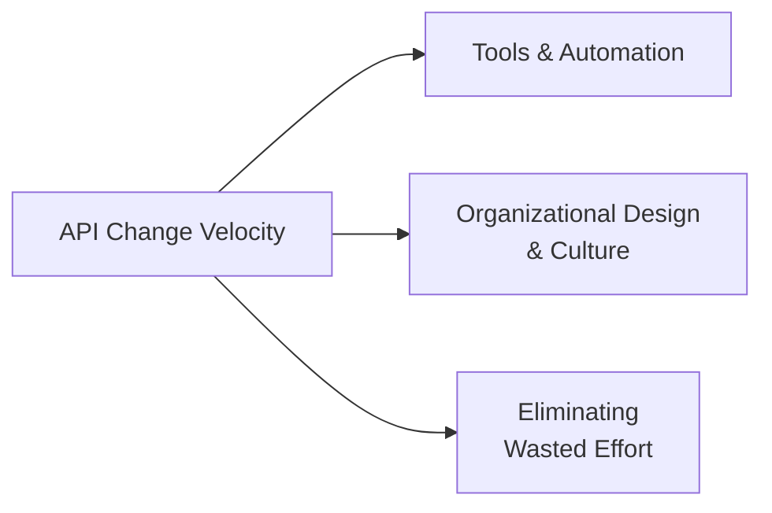

### Lever 1: Tools and Automation

The most obvious lever is replacing manual human effort with tooling wherever it's safe to do so. CI/CD pipelines are the classic example — automating testing and release work reduces both the *time* a change takes and the *chance* of a careless human error slipping through.

Here's roughly the shape of automation I lean on for API changes specifically — this isn't hypothetical, it mirrors pipelines I've actually built:

```yaml
# .github/workflows/api-change-pipeline.yml
name: API Change Pipeline

on:
  pull_request:
    paths:
      - 'openapi.yaml'
      - 'src/**'

jobs:
  validate-change:
    runs-on: ubuntu-latest
    steps:
      - uses: actions/checkout@v4

      - name: Lint the interface model
        run: npx @redocly/cli lint openapi.yaml

      - name: Detect breaking interface changes
        id: diff
        run: |
          npx openapi-diff base-openapi.yaml openapi.yaml \
            --fail-on-incompatible > diff-report.txt || echo "BREAKING=true" >> $GITHUB_ENV

      - name: Comment on PR if breaking
        if: env.BREAKING == 'true'
        run: |
          echo "🚨 This PR introduces a breaking interface change." \
          "Requires sign-off from the API owners before merge."

      - name: Run unit + contract tests
        run: npm ci && npm test

      - name: Run implementation-vs-model conformance check
        run: npm run test:contract
```

The key line I want to draw attention to is the **"Detect breaking interface changes"** step. That single automated check turns "did we accidentally break our public contract?" from a question a human has to remember to ask into a question the pipeline answers automatically, on every single pull request. That's a huge velocity *and* safety win at the same time — which is exactly the combination I'm always chasing.

> **Caution:** Tooling isn't free, and it isn't magic. There's always real up-front cost and risk in setting up and configuring automation properly. If your API is already well established and in active, heavy use, I'd strongly recommend introducing new tooling experimentally and incrementally, not as a big-bang rollout — a broken CI pipeline on a critical, high-traffic API is its own kind of incident.

### Lever 2: Organizational Design and Culture

This is the lever I find hardest to talk about, and also the one I think matters most at scale. Changing an API is fundamentally *knowledge work* — it requires coordinated decision-making among people. In a small team building a single API, that coordination cost is tiny; everyone already knows what everyone else is doing. But at the scale of a large organization with many APIs and many teams, coordination overhead becomes the real bottleneck, and it's the hardest one to fix because — unlike a tool — you can't just buy a better organizational culture off the shelf.

I've seen technically excellent engineering teams get bogged down not because the code was hard to write, but because getting sign-off from four different stakeholders, across three time zones, took longer than writing the actual change. No CI/CD pipeline fixes that. That's an organizational design problem, and it usually requires deliberately redesigning who has authority to make which decisions.

### Lever 3: Eliminating Wasted Effort

The third lever is refreshingly simple in concept, even if it's hard in practice: stop spending effort on things that don't return real value. If I'm pouring documentation-authoring hours into an API that's only ever consumed by the same team that builds it, I'm probably over-investing relative to the payoff. Cutting that kind of low-ROI work isn't just a time savings — it also removes an entire category of opportunities for something to go wrong, because work that never happens can't introduce a bug.

> **Note:** I try to periodically audit each pillar of investment against the *actual* audience for a given API. A public API with hundreds of third-party developers deserves heavy documentation investment. An API only ever touched by its own creating team probably doesn't — and if I'm treating both the same way "because that's our standard," I'm probably wasting effort somewhere.

---

## What "Changing an API" Actually Means

Here's something I wish had clicked for me earlier in my career: "changing the API" is not one thing. It's actually a change to *up to four distinct layers*, each with different blast radii, different costs, and different dependency relationships with each other.

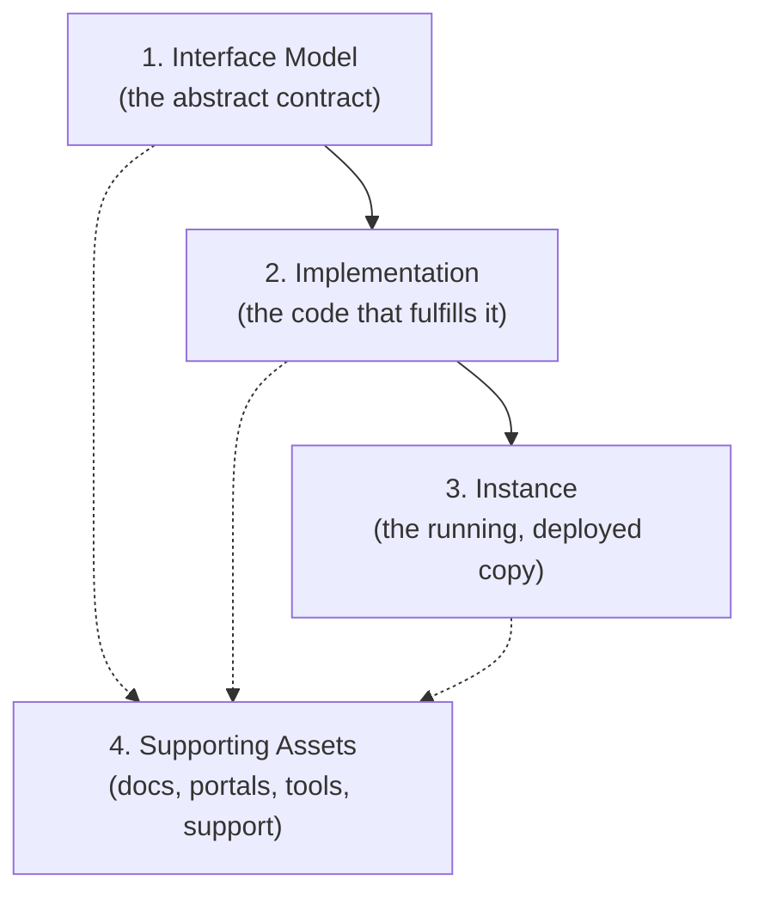

This is a **stack of dependent change**. A change at the top (the interface model) can ripple all the way down through everything below it. A change further down (say, just the supporting assets) can usually be made in relative isolation. Understanding which layer I'm actually touching — and what depends on it — is, in my experience, 80% of doing change management well.

### Layer 1: The Interface Model

The interface model is the *abstraction* that describes how my API behaves from a consumer's point of view — protocols, messages, vocabularies, the whole conceptual shape of the thing. Here's the subtle but important bit: the model itself can't actually be executed by a computer. It's a description, not a machine. I can express that model as a whiteboard sketch, as an OpenAPI file, or even implicitly through well-documented application code — but in every case, it's a *representation* of the API's behavior, not the behavior itself.

I really like framing this through the lens of **domain-driven design**: the idea that an implementation should exist as a faithful *expression* of an underlying model. Once I think of my code, my documentation, my data schemas, and my clients' integration code as all being separate "expressions" of the same underlying interface model, something important becomes obvious: **all of those expressions have to stay synchronized**, or my API starts lying to somebody. Docs that disagree with the actual running behavior are a synchronization failure. A client written against an outdated understanding of the model is a synchronization failure. That's exactly why interface model changes are the most expensive, highest-blast-radius kind of change I ever make — everything downstream is an expression of that model, and all of it has to move together.

**A quick worked example.** Imagine my current `Order` model looks like this:

```json
{
  "id": "ord_123",
  "status": "pending",
  "total": 42.50
}
```

Now I decide `total` should really be a structured object, to support multi-currency:

```json
{
  "id": "ord_123",
  "status": "pending",
  "total": { "amount": 42.50, "currency": "USD" }
}
```

That single change ripples into *everything*: every client parsing `order.total` as a plain number now breaks. My documentation needs updating. My contract tests need updating. My internal data model translation layer needs updating. This is precisely why I try to catch this category of change **before publication**, not after.

There's a line I keep coming back to from Joshua Bloch, the designer of the Java Collections API: *"Public APIs, like diamonds, are forever."* Once other people build real, working software against my interface, I've essentially made a long-term promise, and breaking that promise has real costs for people I may not even know exist. The wise move, in my experience, is front-loading as much interface-model rigor as possible *before* publication, precisely because the cost of getting it wrong afterward is so much higher.

**One important lever that softens this: coupling.** How tightly my consumers' code is bound to the exact shape of my interface model determines how expensive future changes will be. Event-driven and hypermedia-style APIs tend to introduce looser coupling — a client reacting to events, or following hypermedia links rather than hardcoding URLs, can often absorb certain kinds of model changes without needing any code changes at all. That flexibility isn't free, though — it requires real investment in infrastructure and design on both the client and server side, and it sometimes assumes a level of client sophistication (like understanding hypermedia) that your actual consumers may not have.

> **Caution:** Loose coupling sounds unambiguously good until you actually try to build it. I've seen teams adopt event-driven architecture specifically *for* the loose-coupling benefit, only to discover the message *structure and vocabulary* were just as tightly coupled as any RPC call — the loose coupling only applied to *who's listening*, not to *what shape the message has to be*. Don't assume a style label ("event-driven," "REST," "hypermedia") automatically buys you loose coupling — verify what's actually decoupled and what isn't.

### Layer 2: The Implementation

The implementation is the model brought to life — the actual code, configuration, data layer, infrastructure, and protocol choices that make the interface real. Anytime the interface model changes, the implementation has to change to match it. But — and this is the encouraging part — the implementation can also change **independently**, all the time, without touching the interface at all.

This is where most of my day-to-day change work actually lives: fixing bugs, shaving off latency, refactoring code I no longer like, swapping out a slow database query for a faster one. Because these changes are hidden behind a stable interface, my consumers don't have to change *their* code at all to benefit — which means I can ship implementation improvements far more often, and far more cheaply, than interface changes.

That doesn't mean implementation changes are risk-free, though. If I introduce a bug that breaks a running instance, or if my implementation starts behaving differently than what my documentation promises, my consumers absolutely feel that pain — they just don't have to *change their code* to feel it. A performance regression buried in an "invisible" implementation change can degrade the experience for every single user without a single line of client code being touched.

> **Note:** I treat "does the implementation still match the documented and modeled behavior?" as a mandatory question for every implementation change, not just interface changes. It's tempting to relax scrutiny because "nothing in the contract changed," but behavior drift without a contract change is arguably *more* dangerous, because there's no version bump or changelog entry warning anyone it happened.

### Layer 3: The Instance

The instance is the actual running, deployed copy of my implementation, sitting somewhere on a network, ready to serve real traffic. Here's a fact that's easy to forget in the abstract but obvious once you say it out loud: **the API hasn't really changed for anyone until the instances they're talking to have been updated.** I can merge code all day long, but until it's deployed, my users are still talking to the old behavior.

Instances can also change *independently* of both the model and the implementation — think of flipping a configuration flag, scaling up replica count, or cloning and destroying a running instance for a blue-green deployment. These changes are scoped to runtime properties: availability, observability, reliability, and perceived performance.

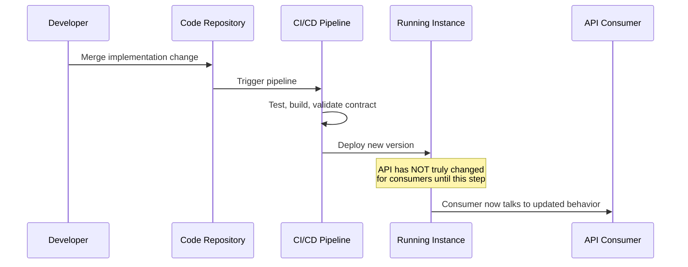

I like this diagram because it makes something concrete: the "deploy" step isn't a footnote at the end of the process — it's the moment the change actually becomes real for anyone outside my own team.

### Layer 4: Supporting Assets

Supporting assets are everything that exists to make my API pleasant and possible to *use*, but that isn't strictly part of the interface, implementation, or instance itself: documentation, a developer portal, registration flows, troubleshooting tools, key/credential distribution, even the humans on a support team who answer questions. If an API is genuinely a *product* and not just a running service, these assets are a huge part of what actually makes it usable.

Here's the interesting tension with supporting assets: they tend to have the **least cascading impact** on the rest of the system (I can redesign my docs site without touching a single line of implementation code), but they can also produce **surprisingly high total change cost**, precisely because they're the most *dependent* on everything else. Every cascading change to the interface model ripples all the way down into supporting assets eventually — new fields need documenting, changed behavior needs new troubleshooting guidance, and so on.

| Layer | Can Change Independently? | Blast Radius If Changed | Typical Change Frequency |
|---|---|---|---|
| Interface Model | Rarely wise to isolate | Very high — ripples through everything downstream | Low (should be front-loaded pre-publication) |
| Implementation | Yes, often | Low-medium — hidden behind the interface, unless behavior drifts | High |
| Instance | Yes, often | Medium — affects availability/performance directly | High (deploys happen constantly) |
| Supporting Assets | Yes, easily | Low directly, but dependent on everything above | Medium-high |

> **Tip:** Because supporting-asset changes are cheap to make and cheap to reverse, I treat them as the *lowest-risk* place to practice rapid, PDSA/OODA-style experimentation. Try a new documentation format, measure onboarding success, revert if it doesn't help. It's a great low-stakes training ground for a team building up its "continuous improvement" muscles before applying the same discipline to riskier interface-model changes.

---

## The Release Lifecycle That Ties This All Together

None of this happens through wishful thinking — it happens through a repeatable **release lifecycle**, the sequence of steps that carries a change from "idea" to "deployed, working part of the system." I don't think the API release lifecycle is fundamentally different from a general software release lifecycle, which is genuinely good news — it means I can borrow decades of existing software delivery wisdom instead of reinventing it from scratch.

### Three Classic Lifecycle Shapes

**Waterfall-style (traditional SDLC).** Initiation, analysis, design, construction, testing, implementation, maintenance — each phase completes before the next begins. This works when I have real certainty about requirements up front, but it handles mid-stream changes to those requirements poorly.

**Iterative.** I deliver a *subset* of requirements per release, cycling through multiple iterations until the full requirement set is met. This lines up naturally with the incremental-improvement philosophy I described earlier.

**Spiral.** I take iteration further — each cycle of design/build/test has the potential to actually *reshape* the original requirements, not just deliver a slice of them. This is the shape that Agile and Scrum methods embody in spirit.

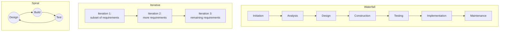

I don't think there's a universally "correct" choice among these three — I've used pieces of all three depending on the maturity and risk profile of the specific API in question. What actually matters, in my experience, is that the lifecycle I pick genuinely brings together *all* of the pillars I care about (design, development, testing, deployment, and so on) into one coordinated sequence, rather than letting each pillar operate in its own disconnected silo.

> **Caution:** A slow release lifecycle directly throttles your rate of improvement — no amount of enthusiasm for "continuous change" survives a six-week release train. A lifecycle that skips quality gates makes every change riskier. And a lifecycle that doesn't actually match your organization's real change requirements makes every change *less valuable* than it should be, even when it technically "works." Getting this pipeline right is not a secondary concern — it's foundational to everything else in this post.

---

## The Real Costs That Make API Change Hard

I want to close with the part of this topic I think is most practically useful: understanding the *specific* costs that make API changes expensive, because each one responds to a different kind of fix.

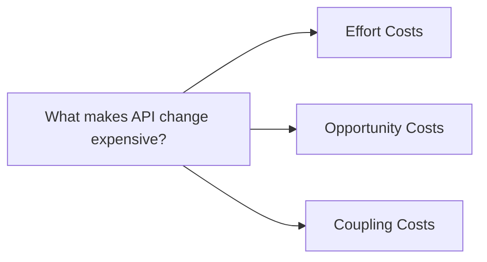

### Effort Costs

This is the obvious one: the time, energy, and money it actually takes to push a change through the full lifecycle. It's a function of several things at once — how complex the underlying problem is, how experienced the people doing the work are, how well-designed the change process itself is, and how clean (or messy) the existing implementation is to begin with.

I don't think there's a silver bullet here beyond what I already covered under "API Change Velocity" — tooling, organizational design, and eliminating wasted effort are still the three levers. What I'd add is this: effort cost reduction is a *compounding* investment. Every hour I spend improving my CI/CD pipeline or clarifying decision ownership pays that same hour back on every single future change, forever. That's part of why I try to treat pipeline and process investment as seriously as I treat feature work — it's not overhead, it's a multiplier.

### Opportunity Costs

This one is subtler, and I didn't fully appreciate it until I'd been burned by both sides of it. Opportunity cost is the cost of **waiting** — specifically, the value I lose by delaying a change in order to gather more information first, weighed against the value I'd gain by having that extra information before committing.

There's a useful idea from Lean software development here: waiting until the "last responsible moment" to make a critical decision. I like this framing because it explicitly acknowledges that waiting has a cost too — it's not free caution, it's a tradeoff.

For low-stakes, easily-reversible changes (tweaking documentation styling, adjusting an internal log format), I lean toward *not* overthinking the "last responsible moment" principle at all — the feedback loop is fast, and the cost of being wrong is tiny, so gathering more data before acting isn't worth the delay. But for high-stakes, hard-to-reverse changes — especially anything touching the interface model — the calculus flips. Those deserve real deliberation, because getting them wrong is expensive and slow to undo.

| Change Type | Recovery Difficulty | My Approach to Opportunity Cost |
|---|---|---|
| Documentation styling tweak | Trivial — revert instantly | Act fast, don't overthink it |
| Internal implementation refactor | Low — hidden behind interface | Act fairly fast, monitor closely |
| New optional field on a response | Low-medium — additive, non-breaking | Act with light review |
| Interface model breaking change | High — "public APIs are forever" | Deliberate carefully, gather real data first |

> **Note:** The single biggest lever for reducing opportunity cost isn't "wait longer" — it's "see more clearly, sooner." Investing in real visibility (good monitoring, good usage data, direct feedback channels) means I need to wait *less* before I have enough confidence to act, because I'm not flying blind. Visibility and opportunity cost are inversely related, and that's worth remembering the next time someone proposes "let's just wait and see" as a strategy — sometimes the better move is investing in *seeing*, not in *waiting*.

### Coupling Costs

This is, in my opinion, the deepest and trickiest cost of the three, and it's almost entirely about the interface model layer. Coupling is the shared knowledge — vocabulary, message structure, interface signatures — that my API and its consumers both depend on in order to communicate meaningfully at all. Some amount of coupling is completely unavoidable; two systems that share *zero* assumptions about each other simply can't talk to one another.

The real question isn't "coupled or not coupled" — it's **how much of that shared knowledge gets hardcoded, at design time, into consumer code that I don't control.** The more of it gets baked into client code, the more expensive every future interface change becomes, because now I'm not just changing my own system — I'm forcing a change in code I don't own and can't directly control.

I want to flag something I got burned by personally: **"loose coupling" is not a label you get for free just by choosing a particular architecture style.** I once assumed an event-driven system I built was inherently loosely coupled because, well, "event-driven architectures are loosely coupled" — that's the conventional wisdom. What I actually found was that the *sender* had no knowledge of *who* was listening (genuinely loose, that part was true) — but the *structure and vocabulary* of the event payloads themselves were just as rigidly coupled as any RPC call would have been. When I needed to rename a field in the event payload, every single consumer broke, exactly the way it would have with a traditional REST endpoint. The architecture style bought me loose coupling in one dimension and did absolutely nothing for coupling in the other.

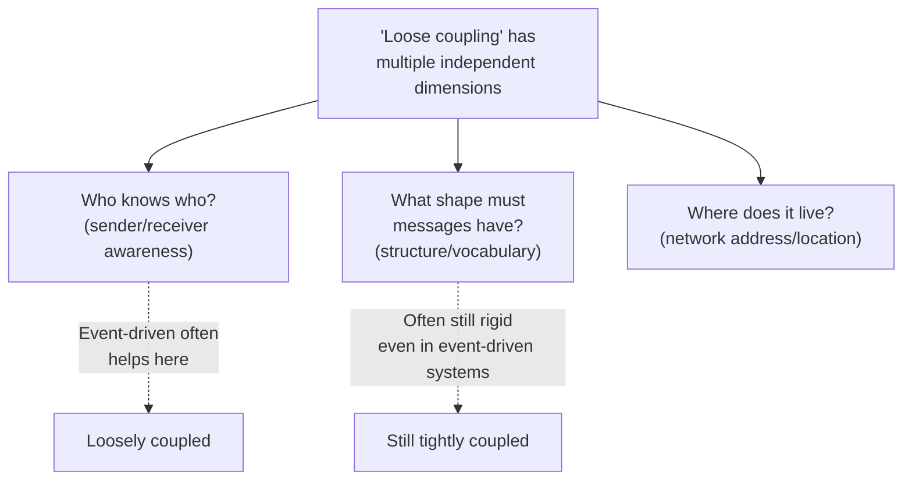

RPC-style interfaces make this tradeoff especially visible: they tend to precisely specify the interface model, which is *fantastic* for developer productivity out of the gate (great tooling, clear contracts, fast onboarding) — but that same precision is exactly what makes future changes expensive, because the semantics are hardcoded directly into every consumer's released code.

None of this means "always choose loose coupling" — loose coupling isn't free either. Building for it requires real up-front investment in both client and server infrastructure, and it sometimes assumes a level of client sophistication your actual developer audience may not have (writing a proper hypermedia-following client is a genuinely different skill than writing a client against a fixed REST contract). What I've landed on is this: I make an explicit, conscious decision early — before an API gets heavy external usage — about how much coupling I'm willing to accept, because retrofitting looser coupling onto an already-popular tightly-coupled API is a brutal, multi-year undertaking.

> **Caution:** Not all broken clients are equally costly to break. I've learned to be honest with myself about which consumers I genuinely need to protect versus which ones I can afford to inconvenience. Breaking a lightly-used internal script written by someone who left the company two years ago is very different from breaking your organization's flagship customer-facing mobile app. Treat "never break anyone, ever" as an aspiration, not a universal law — and be deliberate about where you draw that line.

---

## "Isn't This Just BDUF in Disguise?"

I want to address something head-on, because I asked myself this exact question the first time I really internalized how expensive interface-model changes can be: doesn't all this talk of "front-loading design changes before publication" contradict the Agile principle of favoring "responding to change" over "following a plan"?

My honest answer is: yes and no.

I fully buy into limiting upfront planning effort in general software engineering — that part of Agile thinking has earned its place. But APIs have a specific property that most internal code doesn't: **the consumers of my interface are often teams I don't control, sometimes companies I've never even talked to.** I don't have the option of just refactoring their code alongside mine the way I could with a private internal module. It's genuinely useful to think of my own APIs the way I'd think about a third-party API I depend on — I need it to be stable and predictable, and so do the people depending on mine.

That means *some* real planning has to happen — understanding my target audience, clearly stating the API's purpose, having a general sense of design direction — before I publish something I expect other people to build real, working software against. But — and this is the crucial "no" half of my answer — this doesn't mean I need to map out every last detail before I start. I can keep a long-term destination in mind while still iterating my way toward it in small, PDSA/OODA-style steps.

There's a genuinely liberating side effect here too, one I didn't expect: **the more I invest in reducing the general cost of change, the less BDUF-style upfront planning I actually need.** A huge amount of "extended planning" in software projects isn't really about designing the feature — it's about trying to quantify and mitigate the *risk of change itself*, defensively, because change is assumed to be expensive and dangerous. If I've already made change cheap and safe through good tooling, good process, and thoughtful coupling decisions, that entire category of defensive planning shrinks dramatically. Small iterations carry less risk almost by definition — there's simply less to go wrong, and less to undo, in a small change than in a sprawling, all-at-once one.

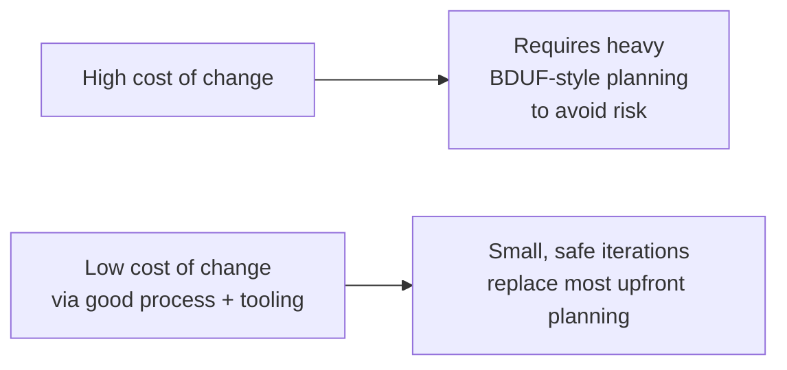

What I've noticed in the organizations that genuinely do this well is a consistent pattern: they hold a clear, persistent long-term vision, but they manage progress one deliberate step at a time, constantly watching for new evidence that should adjust their short-term expectations. That combination — steady long-term direction, flexible short-term execution — is, in my experience, the actual antidote to both extremes: the paralysis of BDUF on one side, and the chaos of undirected, plan-free changes on the other.

---

## Bringing It All Together

If I had to compress everything in this post into a single operating principle, it would be this: **treat every change to your API as a small, deliberate experiment, aimed at improving developer experience or reducing maintenance cost, executed through the cheapest and safest pipeline you can build, with full awareness of exactly which layer — interface, implementation, instance, or supporting assets — you're actually touching.**

That's a mouthful, I know. But each piece earns its place:

- **"Small, deliberate experiment"** comes from PDSA, OODA, and TOC — pick whichever mental model fits your culture, but pick *something* repeatable.
- **"Improving developer experience or reducing maintenance cost"** is the yardstick that keeps change purposeful instead of change for its own sake.
- **"Cheapest and safest pipeline you can build"** is the whole point of investing in change velocity — tools, org design, and cutting wasted effort.
- **"Full awareness of exactly which layer you're touching"** is what keeps me from accidentally treating a cheap, reversible documentation tweak with the same fear I'd apply to a genuinely expensive interface-model change — or worse, treating an interface-model change with the same casualness I'd apply to a docs tweak.

I'll end where I started: survival isn't mandatory, but I've never once regretted treating my API's changeability as a first-class feature rather than a scary liability to be minimized. The APIs I'm proudest of aren't the ones I got perfectly right on day one — none of them were. They're the ones I kept honestly, carefully, continuously improving, one small, well-understood change at a time.
