# Working With Web APIs, and Why I Believe in API First

I want to get hands-on in this post. I've spent a lot of time in this series talking about design philosophy, scaling, documentation, and ecosystem strategy — all important, but all a little abstract until you actually watch bytes move over HTTP. So this time I built a real, tiny REST API (a toppings list, because it's a fun departure from the usual to-do-list demo), ran real `curl` commands against it, and captured the actual output. Then I want to make the case for **API First** — the idea that your API shouldn't be a side project bolted onto your "real" product, but the single spine that everything else, including your own main product, runs through.

I think these two topics belong in the same post because they're really the same lesson at two different scales: at the level of a single HTTP request, and at the level of your entire company's architecture, the same principle holds — one well-defined interface, used consistently by everyone, beats N different ad hoc ones every time.

---

## Table of Contents

1. [HTTP Basics: Requests and Responses](#part-1)
2. [Building a Real Toppings API](#part-2)
3. [Walking Through the Full CRUD Lifecycle With Real curl Calls](#part-3)
4. [Inspecting Traffic: Browsers, curl, and HTTP Sniffers](#part-4)
5. [From API to Application: Wiring a Client to the API](#part-5)
6. [What Is API First, and Why Does It Matter?](#part-6)
7. [Code Consistency: A Concrete, Tested Demonstration](#part-7)
8. [Functional Equality](#part-8)
9. [Increased Productivity](#part-9)
10. [Internal vs. External Access](#part-10)
11. [Where API First Doesn't Fit](#part-11)
12. [Case Studies: Twilio, Instagram, Etsy, 3scale, Akamai](#part-12)
13. [Closing Thoughts](#part-13)

---

<a id="part-1"></a>
## 1. HTTP Basics: Requests and Responses

Before touching any actual API, I think it's worth being crisp about the two halves of every HTTP transaction, because everything downstream — REST conventions, status codes, debugging — builds directly on this.

### The request

Every HTTP request is made up of four pieces:

| Piece | What It Is | Example |
|---|---|---|
| Method | The "verb" — what the client wants to do | `GET`, `POST`, `PUT`, `DELETE` |
| URL | The unique identifier for the resource being acted on | `/api/v1.0/toppings/1` |
| Headers | Context about the request | `Accept: application/json` |
| Body | Data being sent (only for `POST`/`PUT`) | `{"title": "Ham"}` |

And CRUD — Create, Read, Update, Delete — maps directly onto four of HTTP's methods:

| CRUD Operation | HTTP Method |
|---|---|
| Create | `POST` |
| Read | `GET` |
| Update | `PUT` |
| Delete | `DELETE` |

### The response

A response always has a status code, plus its own headers and (usually) a body:

| Status Range | Meaning |
|---|---|
| 2XX | Success |
| 3XX | Redirect |
| 4XX | Client made a mistake (bad request, not found, unauthorized) |
| 5XX | Server made a mistake |

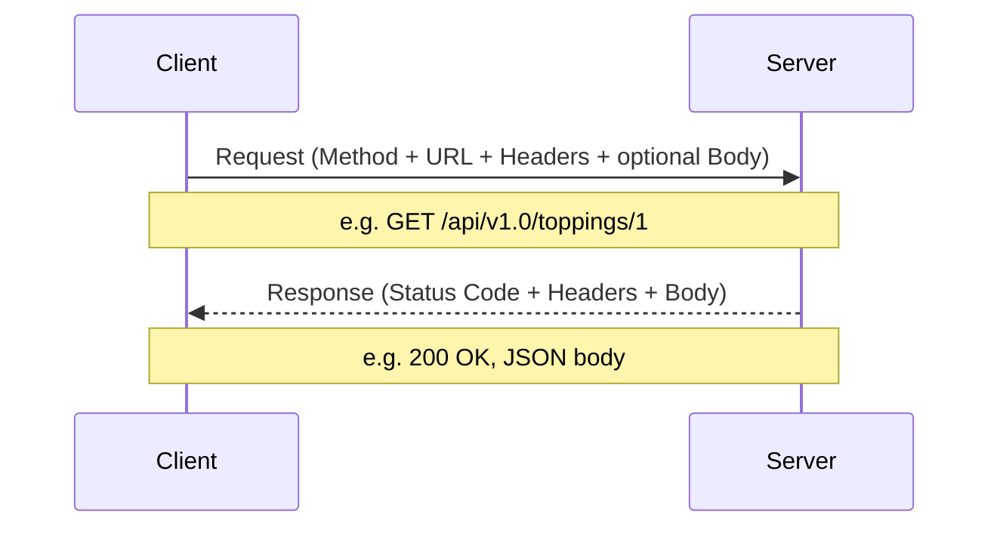

> **Note:** Every HTTP transaction is **stateless** — the server doesn't remember your previous request when handling the next one. If a client needs continuity across multiple calls (a login session, a shopping cart), that state has to be carried explicitly, usually via a token in the headers, not assumed to persist server-side between unrelated requests.

---

<a id="part-2"></a>
## 2. Building a Real Toppings API

I could describe a toppings API in the abstract, but I'd rather just build one and actually hit it with real requests — theory is a lot more convincing when you can watch it run. Here's a small, genuinely working REST API I put together in Flask:

```python
from flask import Flask, jsonify, request

app = Flask(__name__)

# In-memory "database" -- resets every time the server restarts
toppings = {
    1: "Pepperoni",
    2: "Pineapple",
    3: "Pickles",
}
next_id = 4


@app.route("/api/v1.0/toppings", methods=["GET", "POST"])
def toppings_collection():
    global next_id
    if request.method == "GET":
        return jsonify({
            "toppings": [
                {"id": tid, "title": title} for tid, title in toppings.items()
            ]
        })
    elif request.method == "POST":
        data = request.get_json()
        new_id = next_id
        toppings[new_id] = data["title"]
        next_id += 1
        return jsonify({"topping": {"id": new_id, "title": data["title"]}}), 201


@app.route("/api/v1.0/toppings/<int:topping_id>", methods=["GET", "PUT", "DELETE"])
def topping_item(topping_id):
    if request.method == "GET":
        if topping_id not in toppings:
            return jsonify({"error": "not_found"}), 404
        return jsonify({"topping": {"id": topping_id, "title": toppings[topping_id]}})
    elif request.method == "PUT":
        data = request.get_json()
        toppings[topping_id] = data["title"]
        return jsonify({"topping": {"id": topping_id, "title": data["title"]}})
    elif request.method == "DELETE":
        existed = topping_id in toppings
        toppings.pop(topping_id, None)
        return jsonify({"result": existed})
```

Notice how directly this maps onto the CRUD table above: the collection endpoint (`/toppings`) handles `GET` (list) and `POST` (create); the item endpoint (`/toppings/<id>`) handles `GET` (read one), `PUT` (update), and `DELETE`. This is the resource-oriented pattern I discussed in my previous post — one URI per conceptual thing, behavior driven entirely by the HTTP verb, not by the URL path itself.

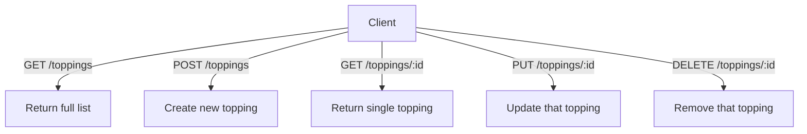

---

<a id="part-3"></a>
## 3. Walking Through the Full CRUD Lifecycle With Real curl Calls

I actually started this server and ran a full sequence of real `curl` commands against it, in order, the same way you'd explore an unfamiliar API for the first time. Every response below is genuine output, not something I typed up from memory.

### Step 1 — read a single topping

```bash
$ curl http://127.0.0.1:5055/api/v1.0/toppings/1
{"topping":{"id":1,"title":"Pepperoni"}}
```

### Step 2 — read the full list

```bash
$ curl http://127.0.0.1:5055/api/v1.0/toppings
{"toppings":[{"id":1,"title":"Pepperoni"},{"id":2,"title":"Pineapple"},{"id":3,"title":"Pickles"}]}
```

Pickles. Not my thing. Let's get rid of them.

### Step 3 — delete a topping

```bash
$ curl -X DELETE http://127.0.0.1:5055/api/v1.0/toppings/3
{"result":true}
```

### Step 4 — confirm the delete actually happened

```bash
$ curl http://127.0.0.1:5055/api/v1.0/toppings
{"toppings":[{"id":1,"title":"Pepperoni"},{"id":2,"title":"Pineapple"}]}
```

Pickles are gone. Now let's swap Pepperoni for Ham.

### Step 5 — update an existing topping

```bash
$ curl -H "Content-Type: application/json" -X PUT -d '{"title":"Ham"}' \
    http://127.0.0.1:5055/api/v1.0/toppings/1
{"topping":{"id":1,"title":"Ham"}}
```

### Step 6 — add a brand-new topping

```bash
$ curl -H "Content-Type: application/json" -X POST -d '{"title":"Extra cheese"}' \
    http://127.0.0.1:5055/api/v1.0/toppings
{"topping":{"id":4,"title":"Extra cheese"}}
```

### Step 7 — the final list

```bash
$ curl http://127.0.0.1:5055/api/v1.0/toppings
{"toppings":[{"id":1,"title":"Ham"},{"id":2,"title":"Pineapple"},{"id":4,"title":"Extra cheese"}]}
```

Ham, pineapple, and extra cheese. A Hawaiian pizza that actually makes sense.

### Step 8 — what happens when you ask for something that doesn't exist?

```bash
$ curl -w "\nHTTP status: %{http_code}\n" http://127.0.0.1:5055/api/v1.0/toppings/999
{"error":"not_found"}
HTTP status: 404
```

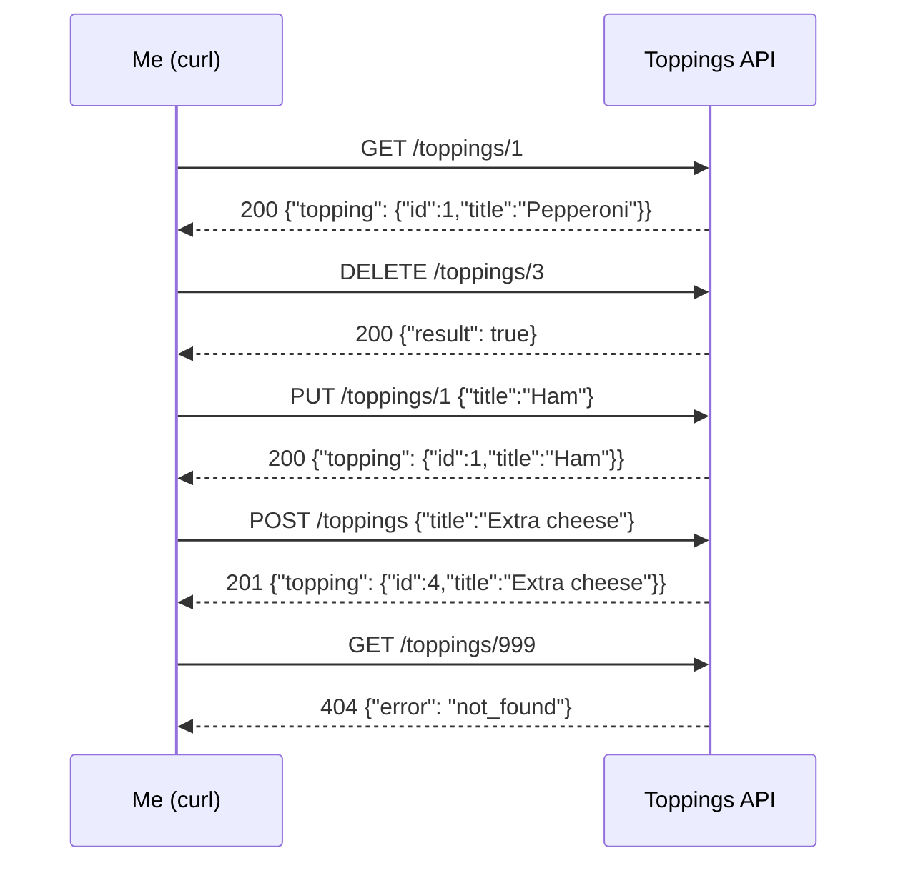

> **Note:** Notice the response shape is consistent across every operation — a single topping always comes back wrapped in `{"topping": {...}}`, and a list always comes back wrapped in `{"toppings": [...]}`. This isn't an accident; it's the exact consistency principle I've hammered on throughout this series. A client parsing responses from this API never has to guess whether it's getting an object or an array back — the wrapper key tells it immediately.

> **Caution:** This demo server keeps its data in an in-memory Python dictionary — it resets completely every time the process restarts, and it has zero authentication. That's completely fine for exploring how HTTP verbs and REST resources behave, but obviously nowhere close to production-ready. Don't mistake "good for learning the concepts" for "good to expose on the internet."

---

<a id="part-4"></a>
## 4. Inspecting Traffic: Browsers, curl, and HTTP Sniffers

Once you've got an API running, you generally have three tools for actually watching what's happening on the wire, and each has real trade-offs.

| Tool | Can Do | Can't Do |
|---|---|---|
| Browser | `GET` requests easily; browser dev tools show headers/status/timing | Can't easily send `POST`/`PUT`/`DELETE` directly |
| `curl` | Every HTTP method, full control over headers and body | No visual traffic monitor — one request at a time |
| HTTP sniffer (Charles, Fiddler, Wireshark, browser dev tools' Network tab) | Watches *all* traffic your system generates, from any source | Can add setup complexity, especially for HTTPS interception |

> **Note:** I'd genuinely recommend using at least two of these together when you're learning an unfamiliar API — `curl` (or a tool like Postman/Insomnia) to actually make the calls you want, and a sniffer or your browser's Network tab running alongside to watch the full request/response detail, including headers you didn't explicitly set yourself.

### A deliberately broken request teaches you more than a working one

One habit I'd recommend: once your happy-path calls work, deliberately break something and watch what comes back. Here's exactly that, against the same server:

```bash
$ curl -w "\nHTTP status: %{http_code}\n" http://127.0.0.1:5055/api/v1.0/toppings/999
{"error":"not_found"}
HTTP status: 404
```

That confirms the API fails predictably — a clear `404` with a machine-readable error code — rather than crashing, hanging, or (worse) silently returning something misleading like an empty `200`. I covered why this kind of meaningful, predictable error design matters so much back in my first post in this series; here you can see it actually behave that way against a real server instead of just reading about the principle.

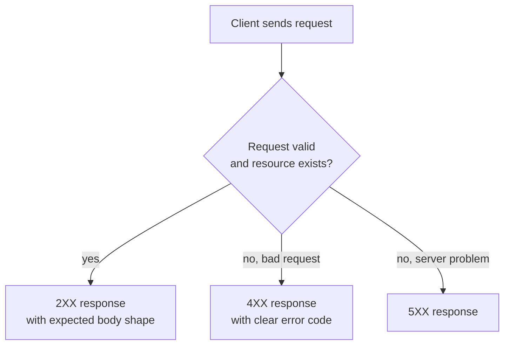

---

<a id="part-5"></a>
## 5. From API to Application: Wiring a Client to the API

Seeing raw JSON responses is useful, but it's genuinely a different kind of understanding to watch a real front-end application drive itself entirely off those same calls. The pattern is always the same, no matter how simple or complex the UI:

1. Page loads → client makes a `GET` call to the list endpoint.
2. Client renders the returned JSON into HTML (a row per topping, say).
3. Each rendered row embeds the resource's `id`, so the "Delete" or "Edit" button knows exactly which URL to call next.
4. User clicks a button → client fires the corresponding `PUT`/`DELETE`/`POST`.
5. Client re-fetches the list (or optimistically updates its own local view) and re-renders.

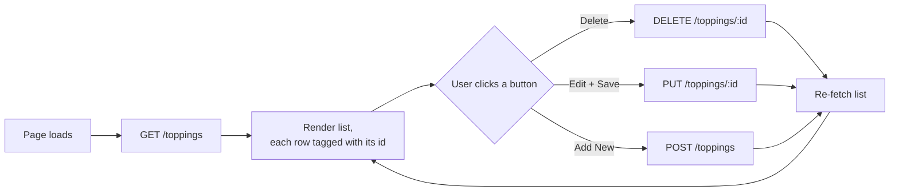

> **Note:** The user never needs to know or care about the numeric `id` underneath a topping's name — it's purely a plumbing detail the client uses to wire buttons to the right resource. This is actually a nice small illustration of decoupling in miniature: the *display* layer (the topping's title) and the *addressing* layer (its ID) are two separate concerns, and a well-designed client keeps them cleanly separated rather than, say, trying to address resources by their display name (which, as I covered when discussing consistency pitfalls in an earlier post, is exactly the kind of inconsistency that causes real problems once names can change).

---

<a id="part-6"></a>
## 6. What Is API First, and Why Does It Matter?

Now I want to zoom all the way out from a single HTTP request to your entire company's architecture, because I think the exact same lesson applies at both scales.

**API First** means: your back-end system talks to exactly one thing — the API — and *everything else* (your main website, your mobile app, partner integrations, internal reporting tools) talks to the back end exclusively *through* that API. Nothing gets a private side-channel into the database.

Compare that to what I'd call the "APIs as side products" pattern, which is genuinely still the more common default:

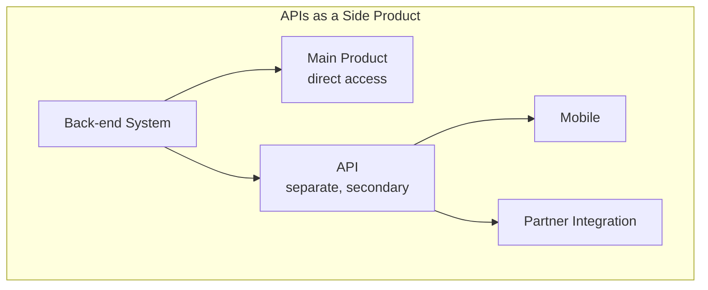

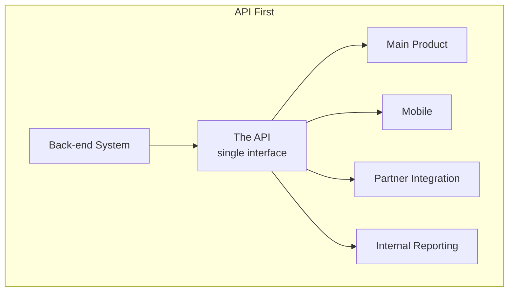

The difference is subtle to describe but has enormous downstream consequences: in the side-product model, the main product gets **direct, privileged access** to the back end, while everyone else goes through the (often lagging, often incomplete) API. In the API First model, the main product has **no special privilege at all** — it's just another client of the same interface everyone else uses.

> **Note:** I think the single sentence that best captures why this matters: *if your main product doesn't have to use your API, your API will always be a second-class citizen.* The moment there's a faster, unofficial path to the data, that path gets used under deadline pressure, and the "official" API quietly falls behind.

---

<a id="part-7"></a>
## 7. Code Consistency: A Concrete, Tested Demonstration

I wanted to make the cost of the side-product model genuinely concrete rather than just asserting it, so I built a small simulation. Imagine three different clients — a main product, a mobile app, and an internal reporting system — each independently deciding how to represent a `user` object pulled from the same underlying database record.

```python
DATABASE_USER = {
    "first_name": "Ada",
    "last_name": "Lovelace",
    "email": "ada@example.com",
    "company": "Analytical Engines Ltd",
}

# ---- Duplicated model: every client hand-rolls its own view of "user" ----

def main_product_view(user):
    # Written months ago; nobody updated it after `company` was added
    return {"first_name": user["first_name"], "email": user["email"]}

def mobile_view(user):
    # Written by a different team, at a different time, with different needs
    return {
        "full_name": f"{user['first_name']} {user['last_name']}",
        "email": user["email"],
    }

def reporting_view(user):
    # Yet another one-off representation
    return {
        "first_name": user["first_name"],
        "last_name": user["last_name"],
        "email": user["email"],
        "company": user["company"],
    }
```

Running these against the same underlying record gives three genuinely different shapes:

```
main_product_view: {'first_name': 'Ada', 'email': 'ada@example.com'}
mobile_view:       {'full_name': 'Ada Lovelace', 'email': 'ada@example.com'}
reporting_view:    {'first_name': 'Ada', 'last_name': 'Lovelace', 'email': 'ada@example.com', 'company': 'Analytical Engines Ltd'}
```

Every one of these represents "the same user," but a developer trying to build something that touches more than one of these clients now has to reconcile three separate, inconsistent shapes for a single conceptual entity.

### Now watch what happens when a new field gets added

I added a `location` field to the underlying database record and re-ran the same three functions **without changing any of them** — deliberately simulating what actually happens when nobody remembers (or has time) to update every downstream representation:

```python
DATABASE_USER["location"] = "London"
```

```
Duplicated model -- main_product_view has it? False
Duplicated model -- mobile_view has it?       False
Duplicated model -- reporting_view has it?    False
(Someone has to remember to update THREE separate functions.)
```

None of them picked up the new field, because each one is a hand-written, independent function that has to be manually updated. That's the feature-lag problem in miniature — a completely realistic, small-scale reproduction of exactly the "the main product got a new field in January, but the API didn't get it until months later" story from earlier chapters of this series.

### The API First fix: one shared serializer

```python
def api_user_serializer(user):
    """The single source of truth every client actually calls."""
    return {
        "first_name": user["first_name"],
        "last_name": user["last_name"],
        "full_name": f"{user['first_name']} {user['last_name']}",
        "email": user["email"],
        "company": user["company"],
    }
```

Every client — main product, mobile, reporting — calls this *same* function instead of writing its own:

```
main_product via API: {'first_name': 'Ada', 'last_name': 'Lovelace', 'full_name': 'Ada Lovelace', 'email': 'ada@example.com', 'company': 'Analytical Engines Ltd'}
mobile via API:       {'first_name': 'Ada', 'last_name': 'Lovelace', 'full_name': 'Ada Lovelace', 'email': 'ada@example.com', 'company': 'Analytical Engines Ltd'}
reporting via API:    {'first_name': 'Ada', 'last_name': 'Lovelace', 'full_name': 'Ada Lovelace', 'email': 'ada@example.com', 'company': 'Analytical Engines Ltd'}
```

Now, when `location` gets added, I only need to update **one** function:

```python
def api_user_serializer_v2(user):
    base = api_user_serializer(user)
    base["location"] = user.get("location")
    return base
```

```
main_product via API: {..., 'company': 'Analytical Engines Ltd', 'location': 'London'}
mobile via API:       {..., 'company': 'Analytical Engines Ltd', 'location': 'London'}
reporting via API:    {..., 'company': 'Analytical Engines Ltd', 'location': 'London'}
```

One change, three clients instantly consistent. That's the entire, concrete value proposition of API First, demonstrated at the smallest possible scale that still makes the point honestly.

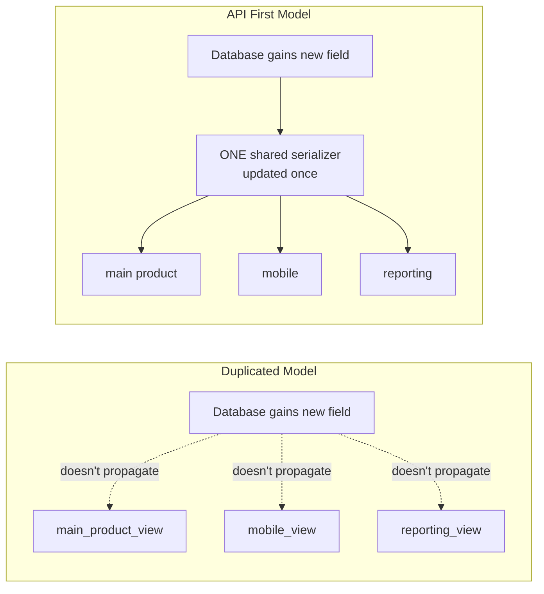

> **Caution:** I want to be honest about the limits of this toy example — real systems have real reasons a mobile client might legitimately want a *smaller* payload than a reporting system (bandwidth, screen real estate). API First doesn't mean every client must receive an identical response; it means every client goes through the *same governed interface* to get whatever subset it needs, rather than each one independently reinventing its own parallel path into the raw data. Field selection (which I covered when discussing API evolution in an earlier post) is exactly the mechanism for handling that legitimate variation without reintroducing the inconsistency problem.

---

<a id="part-8"></a>
## 8. Functional Equality

Here's a pattern I've seen play out almost identically across different companies: the main product ships a new feature in January. The API doesn't get the equivalent capability until months later — if ever — because by the time anyone gets around to it, the engineers who understood the feature's original intent have moved on to other projects, and whoever eventually builds the API version is working from incomplete context.

> **Note:** In the API First model, this entire failure mode structurally can't happen, because the main product's new feature *is itself* built on the API. There's no "later" step where the API catches up — the API and the feature ship together, by construction, because the main product has no other way to get the feature live.

| | Side-Product Model | API First Model |
|---|---|---|
| When does the API get a new capability? | Whenever someone eventually gets around to it | Simultaneously with the main product, because the main product depends on it |
| Who builds the API version? | Possibly a different team, with less context, later | The same team, with full context, right now |
| Risk of losing feature parity | High and ongoing | Structurally eliminated |

---

<a id="part-9"></a>
## 9. Increased Productivity

The counterintuitive part of API First, at least the first time you hear it, is that adding a layer of indirection *reduces* total engineering work rather than increasing it. I think the honest framing is: it front-loads cost (real design and discipline work up front) in exchange for eliminating a much larger amount of ongoing, compounding duplicate work.

Once teams share a single, stable interface:

- Client libraries and tooling can be shared across every team building against the API, instead of each team reinventing their own access layer.
- New resources become available to every consumer the moment they exist, rather than requiring separate implementation work per client.
- Testing consolidates — you can build integration tests against real use cases once, at the API layer, instead of duplicating test coverage across every individual client's private access path.

> **Caution:** I don't want to undersell the up-front cost here. Back-end engineers genuinely do more work initially under API First, because they can no longer take shortcuts that a tightly coupled main-product integration would otherwise let them get away with. The payoff is real, but it's a medium-term payoff, not an immediate one — and if you're evaluating this purely on a single sprint's velocity, it can look like a net loss right up until it very much isn't.

---

<a id="part-10"></a>
## 10. Internal vs. External Access

I think the single biggest misconception blocking companies from adopting API First is the assumption that it means throwing open every door to the entire internet. It doesn't. API First is orthogonal to *who* gets access — it's about *how* every consumer, internal or external, gets that access.

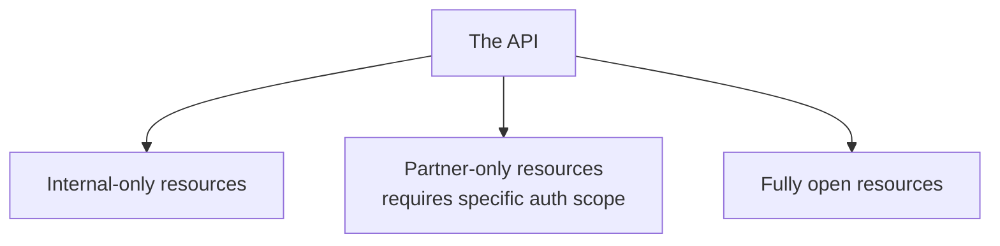

Authentication and authorization systems (OAuth being the most common) let you gate specific resources to specific audiences without needing a separate, parallel interface for each audience. A resource being *technically available* through the same API doesn't mean it's *exposed* to everyone — those are two independent decisions.

> **Note:** There's a genuinely underrated benefit to building internal-only APIs with the same care you'd give a public one: if a major partner eventually asks for access to a capability you'd only ever exposed internally, you're not starting from scratch. You're just deciding to widen who can authenticate against something that already exists, cleanly documented, at production quality — rather than building an entirely new interface under time pressure to meet a partner deadline.

> **Caution:** The inverse trap is just as real. Treating an "internal-only" API casually — skipping documentation, tolerating an inconsistent design, assuming "our own engineers will just figure it out" — creates exactly the same support burden and technical debt as a badly designed external API. Internal developers can't walk away and use a competitor's API, which paradoxically means they'll keep complaining about the pain points rather than silently churning away — but that's a support cost you're paying either way, just less visibly.

---

<a id="part-11"></a>
## 11. Where API First Doesn't Fit

I want to be balanced about this, because I don't think API First is a universal law any more than REST itself is. There are genuine situations where inserting an API layer between systems actively hurts you:

- **Extremely latency-sensitive systems** — think a stock trading platform — where every additional network hop and serialization step has a real, measurable cost that outweighs the consistency benefit.
- **Tightly coupled systems by design** — where two components were always meant to share the same process space or the same low-level protocol, and forcing an HTTP boundary between them would be pure overhead with no corresponding benefit.

> **Note:** The deciding question I'd actually ask: does *this specific* consumer prioritize raw performance over consistency and reliability? If yes, a tightly coupled direct connection might genuinely be the right call for that consumer. Most clients — main products, mobile apps, partner integrations, internal reporting — prioritize the opposite, which is exactly why API First is the right default *for most systems*, without being the right choice for literally every system.

---

<a id="part-12"></a>
## 12. Case Studies: Twilio, Instagram, Etsy, 3scale, Akamai

I find real case studies more convincing than abstract argument here, because they show the same principle succeeding under genuinely different starting conditions.

### Twilio — the API *is* the product

Twilio sells telephony capability (SMS, voice) purely through its API — there's no separate "main product" competing for engineering priority against the API, because the API *is* the entire product. As the platform matured, Twilio extended this discipline to functionality most companies would keep purely internal — billing, account configuration — exposing those as APIs too, even though most usage stays internal to their own website.

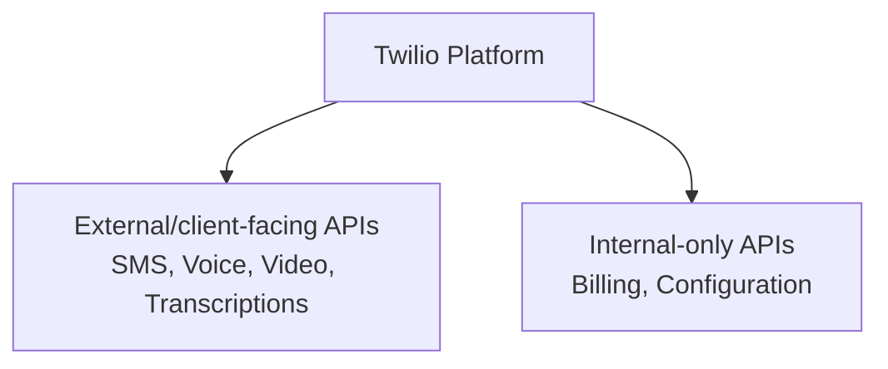

> **Note:** What I find most instructive about Twilio isn't just the API First architecture — it's that they paired it with genuinely serious investment in developer support (evangelists attending large numbers of hackathons, a stated goal of getting a new developer to a successful first call within five minutes). API First gives you the *foundation* for a great developer experience; it doesn't automatically produce one on its own.

### Instagram — Mobile First, API-ready by accident

Instagram started as a mobile-only app with an internal API purely for its own mobile client — not deliberately "API First" from a strategic standpoint, but structurally equivalent in an important way: there was no separate, privileged main-product path bypassing that API, because mobile was the *only* product. When users started demanding a website and third-party integrations, and some frustrated third-party developers began reverse-engineering the mobile API to get what they wanted, Instagram was able to formalize and open that same existing API relatively quickly — because the hard architectural work (a real, functioning API as the sole data path) had already happened by necessity, not by explicit long-term planning.

> **Note:** I think this case is a nice reminder that you can back into the benefits of API First without ever explicitly deciding "we are doing API First" as a stated strategy — sometimes a genuinely mobile-first constraint produces the same architectural discipline as a deliberate API First decision would have.

### Etsy — a deliberate, large-scale refactor

Etsy is the case study I find most persuasive precisely because it wasn't a green-field decision — it was a real company with a real, already-successful (if inefficient) API choosing to refactor toward API First on purpose. Their original API mirrored the backend database directly rather than being crafted around specific use cases, which forced mobile clients into an antipattern: making many separate calls just to render a single screen — expensive, slow, and fragile exactly in the moments (spotty connectivity, background/foreground transitions) where mobile clients most need efficiency.

Etsy's fix went beyond just "build a proper REST API" — they built a batching layer (bundling multiple logically related resources into a single response) specifically to serve efficient mobile rendering, while keeping the underlying resource model clean and RESTful. The unexpected side benefits are the part I find genuinely compelling: cross-team communication measurably improved (mobile and website teams had to actually talk to define shared use cases), and a completely unrelated feature — an activity feed — got dramatically faster (from several seconds to sub-second) purely as a side effect of the broader refactor, without ever having been a direct target of the project.

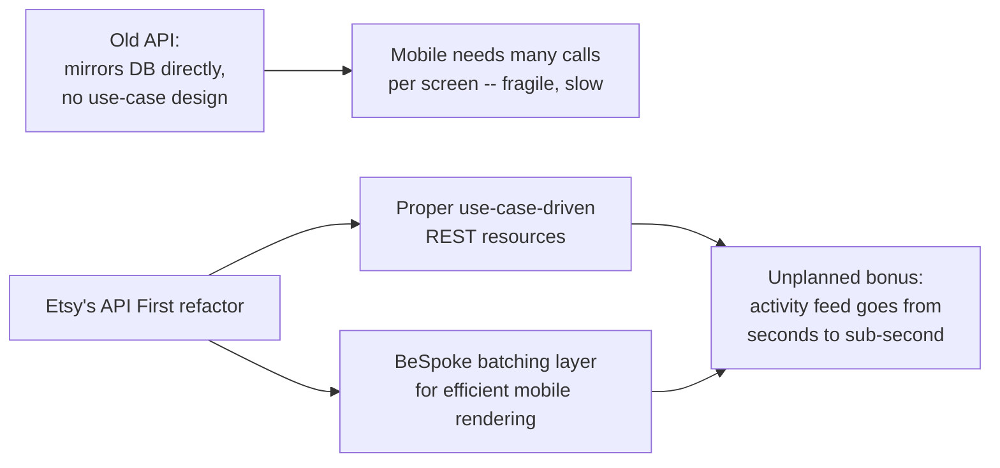

> **Caution:** Etsy's story is a genuine success, but I don't want to undersell the difficulty — refactoring an entire company's data access model in one deliberate push is a serious undertaking, not something to casually decide to replicate over a sprint or two. It's a strong case *for* API First's long-term value, and simultaneously a caution about the real cost of large-scale architectural migrations.

### 3scale — API management, applied to itself

3scale builds API management tooling, and, fittingly, runs its *own* business entirely through its own APIs — everything a customer can do through the product is available via API, because the product and the API are, structurally, the same thing. Their evolution is a nice illustration of the "start partial, converge to full API First" path: they began with dashboards and analytics that had *no* API of their own sitting alongside API-driven traffic management, and only later unified everything — dashboards, analytics, policy management, configuration — onto the same API-driven foundation.

| Before | After |
|---|---|
| Traffic management via API; dashboards/analytics with no API | Every function — traffic management, dashboards, analytics, policy, configuration — runs through the same API |

### Akamai — a strategic, multi-year migration

Akamai's case is the one I find most relevant to any large, risk-averse organization, because it's explicitly *not* a quick refactor — a meaningful share of internet traffic runs through Akamai's infrastructure, so a sudden, sweeping architectural change carried real systemic risk. Instead, Akamai treated the move to a unified API (called EdgeGrid) as a **strategic direction pursued over years**, consolidating what had been a genuinely inconsistent set of legacy APIs (different auth models, different conventions per product) into one coherent system incrementally, as each product got touched anyway for other reasons.

> **Note:** The lesson I take from Akamai specifically: API First doesn't have to mean "stop everything and rebuild." For a sufficiently large, sufficiently risk-sensitive system, it can mean "every new thing we build from today forward goes through the unified model, and we migrate the legacy pieces opportunistically" — a genuinely different, much lower-risk migration strategy than Etsy's more concentrated refactor, aimed at the same eventual destination.

| Company | Starting Point | Path to API First |
|---|---|---|
| Twilio | API is the entire product from day one | Extended the discipline to internal-only functions over time |
| Instagram | Mobile-only, API by structural necessity | Formalized and opened an API that already existed functionally |
| Etsy | Large existing but inefficient API | Deliberate, large-scale refactor in one concentrated push |
| 3scale | Partial API coverage, some dashboard-only features | Converged everything onto one unified API over successive versions |
| Akamai | Many inconsistent legacy APIs, high-risk system | Slow, strategic, multi-year incremental migration |

---

<a id="part-13"></a>
## 13. Closing Thoughts

If I compress this whole post down to what I'd want to remember:

1. **HTTP transactions are simple at their core** — method, URL, headers, body going one way; status code, headers, body coming back — and CRUD maps directly onto four HTTP verbs. Everything more sophisticated in API design is built on top of that simple foundation, not a replacement for it.
2. **Watching real traffic teaches you more than reading about it.** Running actual `curl` commands against an actual server — and deliberately breaking things, like requesting a nonexistent resource — surfaces exactly how an API behaves under real conditions, not just how it's supposed to behave in theory.
3. **A consistent response shape (the wrapper-key pattern) is a small design choice with an outsized payoff** — it's the difference between a client that can trust a predictable structure and one that has to defensively check what it got back every single time.
4. **API First isn't about openness — it's about having exactly one path into your data**, used by every consumer including your own main product, so that no consumer ever gets structurally privileged (and therefore structurally undermines the incentive to keep the shared API good).
5. **The cost of the alternative — duplicated, independently-maintained client representations — is concrete and measurable**, not just a theoretical inconsistency. I watched it happen in a fifteen-line simulation: three functions, one new field, and instantly three different answers to "does this client have the new data?"
6. **Real companies reach API First by genuinely different paths** — as a product from day one (Twilio), by structural accident (Instagram), by deliberate concentrated refactor (Etsy), by gradual convergence (3scale), or by slow strategic migration under real risk constraints (Akamai). There's no single "correct" path — only the right path given your actual constraints.

The thread connecting this post to everything else in the series is, I think, the clearest it's been yet: consistency isn't just a nice property of good documentation or good error messages — it's the direct, measurable output of architectural choices about who's allowed to bypass the shared interface. Every post in this series has, in one way or another, been about protecting that one shared interface from erosion. This one just finally showed the erosion happening, in code, and showed exactly what stops it.

Thanks for reading — if you want me to go deeper on any piece of this (building out the batching pattern Etsy used, or a fuller walkthrough of OAuth scopes for internal vs. partner vs. open access), let me know and I'll take a dedicated post at it.
