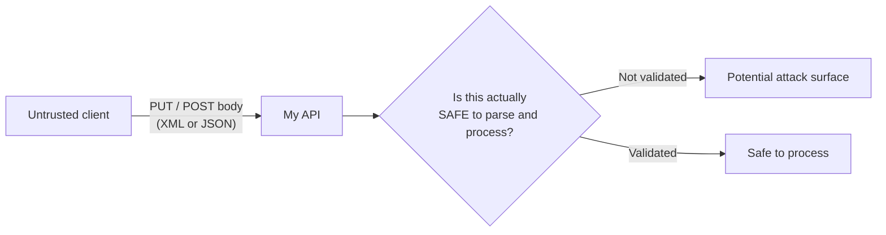
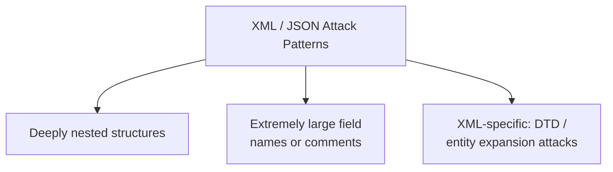
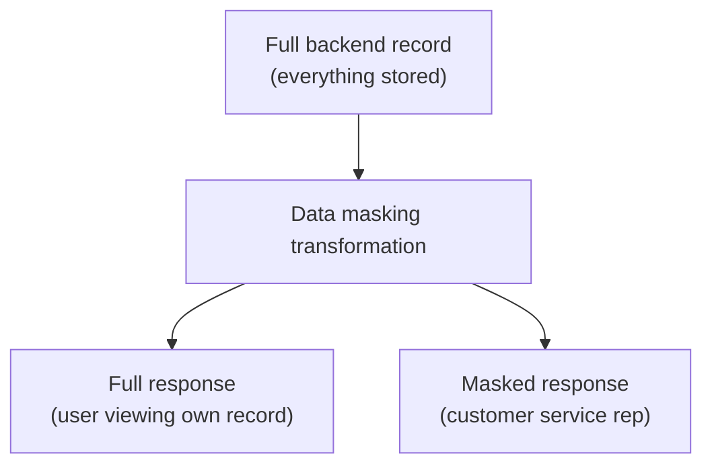
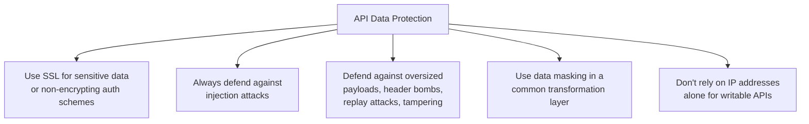
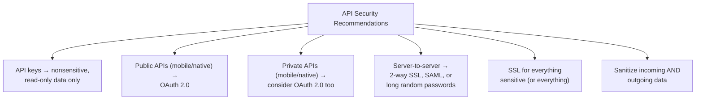
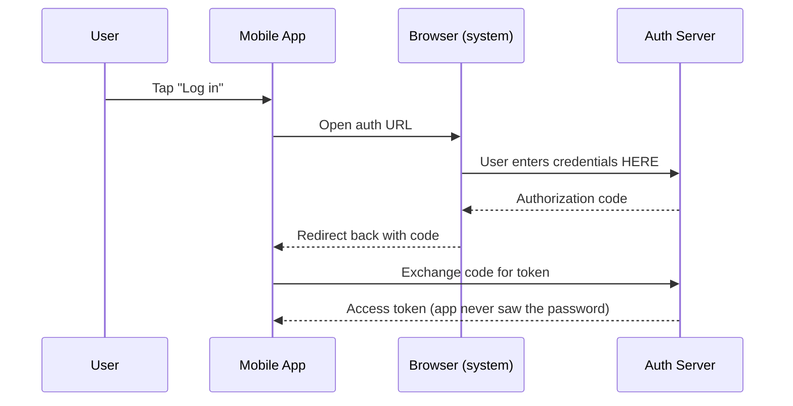
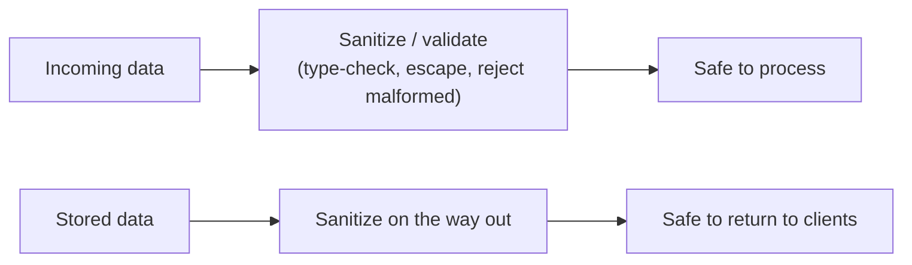

# XML/JSON Attacks, Data Masking, and General API Security Recommendations

I want to work through a chapter of API security that doesn't get nearly as much attention as authentication and authorization, even though it's just as capable of taking a backend down: the data itself. Every `PUT` and `POST` request I accept is, structurally speaking, a file upload from an untrusted source — and I've come to treat it exactly that seriously, whether it's XML or JSON.

## Why Accepting XML or JSON Is Inherently Risky

Any API that accepts structured data from a client is, in a real sense, accepting arbitrary input from someone I don't control. That's true even if the request looks perfectly well-formed. I think of it the same way I'd think about a file upload endpoint: **just because a document parses doesn't mean it's safe.**



> **Note:** The first, most basic check I always want in place is simply confirming the payload *is* what it claims to be — that something declared as JSON is actually valid JSON, and something declared as XML is actually valid, well-formed XML — before any business logic even looks at it.

## XML and JSON Attacks: Exploiting Format Flexibility

Both formats are flexible by design, and that flexibility is exactly what these attacks lean on. The general idea: construct a document that's technically valid syntax, but that causes the backend to do something wildly disproportionate to the size of the request — usually trying to allocate far more memory or CPU than the request size would suggest.



### The Classic Example: "Billion Laughs"

The most famous version of this is an XML entity-expansion attack, often called "billion laughs." A tiny document defines a short entity, then defines a second entity as ten copies of the first, then a third as ten copies of the second, and so on — each layer multiplying the size of the previous one. A payload that's only a few hundred bytes on the wire can expand into gigabytes once a naive parser resolves every entity.

I tested this directly against two different XML parsers to see the difference for myself:

```python
import xml.etree.ElementTree as ET
import defusedxml.ElementTree as DET
from defusedxml.common import EntitiesForbidden

billion_laughs = """<?xml version="1.0"?>
<!DOCTYPE lolz [
 <!ENTITY lol "lol">
 <!ENTITY lol2 "&lol;&lol;&lol;&lol;&lol;&lol;&lol;&lol;&lol;&lol;">
 <!ENTITY lol3 "&lol2;&lol2;&lol2;&lol2;&lol2;&lol2;&lol2;&lol2;&lol2;&lol2;">
]>
<lolz>&lol3;</lolz>
"""

# Standard library ElementTree — will expand the entities
root = ET.fromstring(billion_laughs)
print("Expanded text length:", len(root.text))
```

Running this against Python's own standard-library `ElementTree` parser confirmed it: the parser happily expanded the nested entities without complaint.

```
Expanded text length: 300
```

That's a small demo with only three levels of nesting — a real attacker's version would use dozens of levels, turning a similarly tiny payload into something that genuinely exhausts server memory. Now here's the same document fed to **defusedxml**, a library specifically built to reject this class of attack:

```python
try:
    root = DET.fromstring(billion_laughs)
    print("Parsed successfully (should not happen)")
except EntitiesForbidden as e:
    print("Correctly REJECTED:", e)
```

```
Correctly REJECTED: EntitiesForbidden(name='lol', system_id=None, public_id=None)
```

> **Caution:** This is the exact reason I never reach for a "default," general-purpose XML parser on an API endpoint that accepts untrusted input. Standard library XML parsers across most languages historically resolve DTDs and entities by default — safety has to be opted into explicitly, whether that's disabling DTD processing outright or using a hardened library like `defusedxml`.

### These Attacks Aren't Always Malicious

Something I want to flag because it changes how I think about defenses: not every malformed document is an attack. If I've ever hand-built an XML document with something like StAX and forgotten a closing tag, I've produced invalid XML entirely by accident. APIs are arguably **more** exposed to this kind of unintentional malformation than to deliberate attacks, simply because so many different client implementations are constructing these documents themselves, with varying degrees of correctness.

That reframes validation for me: it's not purely a security control against adversaries, it's also basic input hygiene against bugs — which is exactly why I treat "reject anything that doesn't parse as valid, well-formed data" as a baseline requirement regardless of who's sending it.

### JSON Isn't Automatically Safe Either

JSON doesn't have XML's DTD/entity mechanism, so it dodges that specific attack class — but it's not immune to the general pattern. A JSON document that's deeply nested, or that contains extremely large field names, can still cause real trouble for a naive parser or for downstream code that recursively walks the structure (stack exhaustion from deep recursion is a very real failure mode).

I tested a simple depth-limiting validator against a deliberately deep payload:

```python
def build_nested_json(depth):
    doc = {}
    current = doc
    for i in range(depth):
        current["nested"] = {}
        current = current["nested"]
    return doc

def validate_json_depth(obj, max_depth=10, current_depth=0):
    if current_depth > max_depth:
        raise ValueError(f"JSON exceeds max allowed depth of {max_depth}")
    if isinstance(obj, dict):
        for value in obj.values():
            validate_json_depth(value, max_depth, current_depth + 1)
    elif isinstance(obj, list):
        for item in obj:
            validate_json_depth(item, max_depth, current_depth + 1)

deep_payload = build_nested_json(50)
validate_json_depth(deep_payload, max_depth=10)
```

Running this against a 50-level-deep object threw exactly the error I wanted:

```
Correctly REJECTED: JSON exceeds max allowed depth of 10
```

And to confirm the validator isn't just rejecting everything, I ran it against a normal, shallow payload too:

```python
reasonable_payload = {"user": {"address": {"city": "Boston"}}}
validate_json_depth(reasonable_payload, max_depth=10)
```

```
Reasonable payload correctly PASSED validation
```

| Attack pattern | Format | Mitigation I use |
|---|---|---|
| Entity expansion ("billion laughs") | XML | Disable DTD processing / use a hardened parser (e.g., defusedxml) |
| Deeply nested structures | XML & JSON | Enforce a maximum nesting depth before/during parsing |
| Extremely large field names or comments | XML & JSON | Enforce maximum field name / payload size limits |
| Malformed documents (accidental or deliberate) | XML & JSON | Strict schema/format validation before processing |

## Data Masking: Controlling What Different Callers Can See

Separate from validating *incoming* data, there's a real concern about *outgoing* data — specifically, making sure an API response doesn't inadvertently expose more than the requester should actually see.



The scenario I keep coming back to: I have one backend record — say, a full user profile — and I want to expose it through the API to more than one kind of caller, but not give everyone the same level of detail. Rather than building two entirely separate backend services, I build **one** backend representation and apply a **transformation rule** at the API layer that removes or obfuscates fields depending on who's asking.

I built and tested a small version of exactly this:

```python
def mask_user_record(user_record, requester_role):
    if requester_role in ("self", "admin"):
        return user_record

    masked = dict(user_record)
    if "homeAddress" in masked:
        masked["homeAddress"] = None
    if "ssn" in masked:
        masked["ssn"] = "***-**-" + masked["ssn"][-4:]
    if "email" in masked:
        local, _, domain = masked["email"].partition("@")
        masked["email"] = local[0] + "***@" + domain
    return masked

user_record = {
    "userId": "u_789",
    "name": "Ana Diaz",
    "email": "ana.diaz@example.com",
    "homeAddress": "1 Main St, Boston, MA",
    "ssn": "123-45-6789",
}

print(mask_user_record(user_record, "self"))
print(mask_user_record(user_record, "customer_service"))
```

The output confirmed the two views diverge exactly as intended:

```
Self view: {'userId': 'u_789', 'name': 'Ana Diaz', 'email': 'ana.diaz@example.com', 'homeAddress': '1 Main St, Boston, MA', 'ssn': '123-45-6789'}
CSR view:  {'userId': 'u_789', 'name': 'Ana Diaz', 'email': 'a***@example.com', 'homeAddress': None, 'ssn': '***-**-6789'}
```

The self view gets the full record; the customer-service view gets the name and a masked email and SSN, but the home address is stripped entirely. Same backend record, two different API-level views, driven by who's calling.

> **Note:** If I have multiple services doing this kind of thing, I've found it's worth building masking as a **shared, common transformation layer** rather than reimplementing it per service — both because I'll likely want to add fields as often as I mask them, and because a single shared layer means a masking rule only needs to be gotten right once, not once per service.

> **Caution:** Data masking is not a substitute for proper authorization. Masking controls *what's visible in the response*; it doesn't control *whether the request should have been allowed at all*. I always apply real access control first — masking is a second, defense-in-depth layer on top of that, not instead of it.

## General API Data Protection Recommendations

Pulling together the broader recommendations I hold myself to on every API:



| Recommendation | Why it matters |
|---|---|
| Use SSL for sensitive data or non-encrypting auth | HTTP Basic auth and OAuth bearer tokens can be intercepted in transit without it |
| Defend against injection attacks everywhere | Backend, network edge, or both — injection doesn't respect architectural boundaries |
| Defend against large inputs, header bombs, replay, tampering | `POST`/incoming-parameter endpoints face many attack shapes, not just one |
| Use a common data-masking layer | Keeps masking rules consistent and centrally maintainable across services |
| Never rely on IP address alone for writable APIs | IPs are spoofable, non-unique, and not a trustworthy sole authentication factor |

## General API Security Recommendations



### API Keys: Fine for Nonsensitive, Read-Only Data

If my API exposes data I'd happily make public anyway — a maps/geocoding API is the classic example — a plain API key is a perfectly reasonable choice. It's simple to implement, and it still gives me identification for quota enforcement and per-application usage tracking, which raw IP-based tracking can't reliably provide.

```python
import secrets
import hashlib

def generate_api_key(prefix="pk_public"):
    return f"{prefix}_{secrets.token_urlsafe(24)}"

key = generate_api_key()
key_hash = hashlib.sha256(key.encode()).hexdigest()
print(key, "->", key_hash)
```

Since the underlying data behind this kind of key isn't sensitive, keeping the key itself perfectly secret is less critical — its main job is identifying the calling application, not gatekeeping private data.

### OAuth 2.0 for Native and Mobile Apps — Public and Private

For public APIs consumed by mobile/native apps, OAuth 2.0 is close to a hard requirement in my mind. The reason is specifically about **where the password lives**: with OAuth, the user typically authenticates in a web browser screen, not inside the app itself — meaning the application never actually sees the raw password.



This matters a lot for a public API where I don't control every app developer — an untrusted third-party app never gets a chance to (accidentally or maliciously) mishandle the user's actual password. OAuth also gives me **granular revocation**: I can kill a token for one specific user or one specific application, without forcing every other user to change their password.

For **private** APIs, I have more control over the clients being built, so it's a somewhat safer bet to let the app collect the password directly — but I still lean toward OAuth even here, because it lets the app acquire a token, store *that*, and discard the raw password immediately, reducing how long and how widely the actual password is ever exposed.

### Server-to-Server: OAuth Can Be Overkill

For APIs used only by a small number of internal or partner **systems** — not end users with passwords — I don't reach for OAuth by default. Two-way SSL, SAML, or even a well-generated long random password pair work fine here and are broadly supported across platforms. OAuth's whole value proposition centers on protecting an end user's password from an untrusted app; if there's no end-user password in the picture at all, that machinery is solving a problem I don't have.

| Consumer type | My default choice |
|---|---|
| Public API, nonsensitive/read-only data | Simple API key |
| Public API, native/mobile apps | OAuth 2.0 |
| Private API, native/mobile apps | OAuth 2.0 (still preferred, even with trusted clients) |
| Server-to-server, no end-user passwords | 2-way SSL, SAML, or long random passwords |

### SSL for Everything Sensitive — or Just Everything

I treat this as close to non-negotiable: unless every single piece of data my API touches is genuinely public and open, SSL needs to be in place, and I'll typically redirect any non-SSL traffic straight to the SSL port rather than silently allowing both. It makes every other authentication scheme meaningfully more secure and keeps private data away from anyone positioned to intercept traffic — and given how cheap and standard SSL/TLS is today, there's very little excuse not to.

### Sanitize Both Incoming and Outgoing Data

This closes the loop back to the XML/JSON attacks discussed earlier, but it applies more broadly than just format validation. I sanitize:

- **Incoming data** — so malicious content (like injected script) can't make it into my system in the first place. If a parameter is documented as numeric, I validate it's actually numeric before it goes anywhere near business logic.
- **Outgoing data** — so anything already in my system (even if it got there through a hole I've since closed) doesn't get echoed back to a client in a way that could be executed, e.g., unescaped script content that causes a cross-site-scripting issue when a browser later renders API-sourced content.



I apply this discipline across all APIs, but it earns extra weight on **writable** APIs specifically — a read-only API can leak bad data, but a writable API can be tricked into *storing* it, which then potentially propagates the problem to every future reader.

## Bringing It All Together

| Area | My baseline rule |
|---|---|
| Parsing untrusted XML/JSON | Validate format is genuinely correct; use hardened parsers; cap nesting depth and field sizes |
| Data exposure | Mask sensitive fields per caller role, ideally via one shared transformation layer |
| Transport | SSL for anything sensitive — realistically, SSL for everything |
| Public API, low sensitivity | API keys are sufficient |
| Public/private mobile & native apps | OAuth 2.0, so the app never holds the raw password |
| Server-to-server, no end users | Simpler mechanisms (2-way SSL, SAML, strong passwords) — OAuth is often overkill |
| Input/output hygiene | Sanitize both directions, always; extra scrutiny for writable APIs |

None of this is exotic — every technique here is well-documented and has been for years. What I've found actually matters is treating this as a checklist I genuinely apply before shipping, rather than assumed-safe defaults I only revisit after something goes wrong.
