# API Traffic Management: What I've Learned About Gateways and Service Meshes

I used to think "API gateway" and "service mesh" were basically interchangeable buzzwords — two names for "the thing that sits in front of my services and does the boring-but-critical stuff." After running both in production, I've come around to a much sharper distinction: a gateway manages traffic **coming into** my system from the outside world, and a service mesh manages traffic **moving around inside** my system, between services I own. Conflating the two is one of the more expensive architectural mistakes I've watched teams make.

This post is my attempt to lay out everything I now believe about traffic management — ingress and service-to-service — using a consistent example throughout: a small system I'll call **TaskFlow**, which started life as a single monolithic application and is gradually being decomposed into services (a Task service, a Notification service, and eventually others). I'll walk through why and how I'd introduce an API gateway first, then a service mesh, and where each one earns its keep — plus every mistake I've either made myself or watched someone else make.

> **Note**
> Everything below reflects my own opinions and experience. Where I show configuration (Kubernetes YAML, Istio/Linkerd/Consul-style resources), it's written fresh for this post as an illustration of the *shape* of the configuration — treat it as a teaching example, not a copy-paste production manifest.

## Table of Contents

1. [North-South vs. East-West: The Distinction That Changes Everything](#north-south-vs-east-west-the-distinction-that-changes-everything)
2. [Is an API Gateway Always the Right Answer?](#is-an-api-gateway-always-the-right-answer)
3. [What an API Gateway Actually Is](#what-an-api-gateway-actually-is)
4. [Why I Reach for an API Gateway](#why-i-reach-for-an-api-gateway)
5. [A Short History That Explains Why Gateways Look the Way They Do](#a-short-history-that-explains-why-gateways-look-the-way-they-do)
6. [The Three Flavors of API Gateway I Run Into](#the-three-flavors-of-api-gateway-i-run-into)
7. [Case Study: Putting a Gateway in Front of TaskFlow](#case-study-putting-a-gateway-in-front-of-taskflow)
8. [Failure Modes: Treating the Gateway as a Single Point of Failure](#failure-modes-treating-the-gateway-as-a-single-point-of-failure)
9. [Gateway Antipatterns I've Personally Walked Into](#gateway-antipatterns-ive-personally-walked-into)
10. [How I Actually Choose a Gateway](#how-i-actually-choose-a-gateway)
11. [Why East-West Traffic Needs a Different Tool](#why-east-west-traffic-needs-a-different-tool)
12. [What a Service Mesh Actually Is](#what-a-service-mesh-actually-is)
13. [The Eight Fallacies That Justify All of This Complexity](#the-eight-fallacies-that-justify-all-of-this-complexity)
14. [How Service Mesh Implementation Got Here: Libraries → Sidecars → Proxyless → eBPF](#how-service-mesh-implementation-got-here-libraries--sidecars--proxyless--ebpf)
15. [Case Study: Meshing TaskFlow's Internal Services](#case-study-meshing-taskflows-internal-services)
16. [Service Mesh Antipatterns](#service-mesh-antipatterns)
17. [Gateway vs. Mesh: My Side-by-Side Cheat Sheet](#gateway-vs-mesh-my-side-by-side-cheat-sheet)
18. [How I Actually Choose (or Skip) a Service Mesh](#how-i-actually-choose-or-skip-a-service-mesh)
19. [My Own Rollout Checklist](#my-own-rollout-checklist)
20. [Closing Thoughts](#closing-thoughts)

---

## North-South vs. East-West: The Distinction That Changes Everything

Before I touch any traffic-management tooling, I sort traffic into two buckets:

- **North-south traffic**: crosses the boundary of my system. A mobile app calling my public API, a partner's server calling my webhook endpoint, a browser loading my site. This traffic originates outside my trust boundary.
- **East-west traffic**: stays inside my system. My Task service calling my Notification service. Both ends are something I own and (mostly) trust.

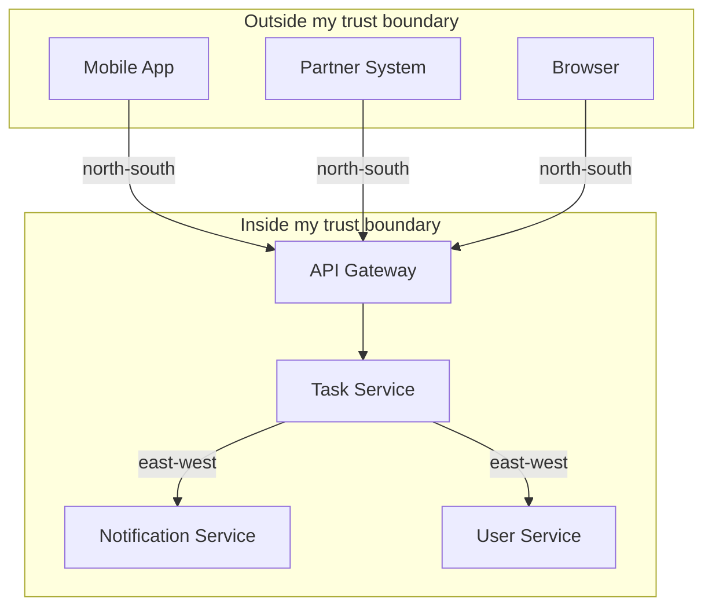

I bring this up first because every tool I discuss below is optimized for one side of that boundary or the other. Using a north-south tool for east-west traffic (or vice versa) is where most of the pain I've experienced actually comes from.

| | North-South | East-West |
|---|---|---|
| Origin | External (user, partner, internet) | Internal (a service I control) |
| Trust level | Low — assume hostile until proven otherwise | Higher — but not infinite, see zero-trust below |
| Typical tool | API gateway | Service mesh, or a shared library |
| Auth focus | Real-world user identity | Service (machine) identity, often *and* user identity |
| TLS | One-way (server cert), commonly enforced | Increasingly mutual (mTLS) |
| Who owns it, in my experience | A platform/API team | A platform/infrastructure team |

> **Note**
> I've heard the argument — and I take it seriously — that this distinction is getting blurrier as "zero trust" architectures treat every hop as untrusted regardless of whether it's internal or external. I still find the north-south/east-west framing useful as a starting mental model, even if the security posture on both sides ends up converging.

---

## Is an API Gateway Always the Right Answer?

No — and I want to say that clearly before diving into how great gateways are. If TaskFlow has a single backend and I just need TLS termination and basic routing, a plain reverse proxy or a cloud load balancer is enough, and reaching for a full API gateway is over-engineering.

Here's the comparison I actually sketch out on a whiteboard when I'm making this call:

| Capability I need | Reverse Proxy | Load Balancer | API Gateway |
|---|---|---|---|
| Route to a single backend | ✅ | ✅ | ✅ |
| TLS termination | ✅ | ✅ | ✅ |
| Route to multiple backends by path/host | ✅ (basic) | Partial | ✅ |
| Health-check-based failover across instances | ❌ | ✅ | ✅ |
| Aggregate/compose multiple backend calls | ❌ | ❌ | ✅ |
| Per-consumer authentication & authorization | ❌ | ❌ | ✅ |
| Rate limiting per API key/consumer | ❌ | ❌ | ✅ |
| Rich request/response logging and tracing | ❌ | ❌ | ✅ |
| Circuit breaking per upstream | ❌ | ❌ | ✅ |

My rule of thumb: I only reach for an API gateway once I have **cross-cutting requirements** — authentication, rate limiting, observability, API lifecycle management — that I don't want to reimplement inside every backend service, in every language those services happen to be written in.

---

## What an API Gateway Actually Is

In my mental model, an API gateway is a **management tool that sits at the edge** of my system, between consumers and my backend services, acting as a single point of entry for a defined set of APIs. It has two conceptual halves:

- **Control plane** — where I (or my platform team) define routes, policies, and telemetry requirements. This is the configuration layer.
- **Data plane** — where the actual traffic flows, where policies get enforced, and where telemetry actually gets emitted.

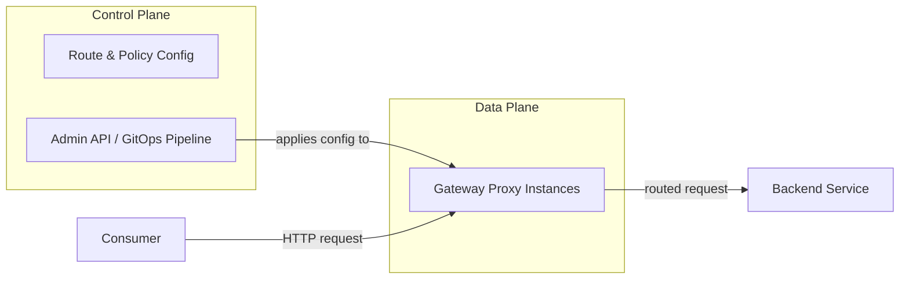

I also had to unlearn a sloppy habit of calling any proxy a "reverse proxy" interchangeably with "gateway." I now keep this distinction straight:

- A **forward proxy** protects clients — think of a corporate proxy routing employee traffic out to the internet.
- A **reverse proxy** protects servers — it sits in front of my backend and decides which backend handles an inbound request.
- An **API gateway** is a reverse proxy with a lot of API-specific functionality layered on top: auth, rate limiting, observability, lifecycle management.

---

## Why I Reach for an API Gateway

I've found it useful to break "why a gateway" down into distinct problems, because each one is a separate justification, and not every project needs all of them.

### 1. Reducing coupling with a facade

If my mobile client talks directly to five different backend services, that client is coupled to the internal topology of my system. If I move a service, rename it, or split it into two, I've just broken the client. Putting a gateway in front means the client only ever talks to one stable interface — I can rearrange the backend freely as long as I keep the gateway's contract stable.

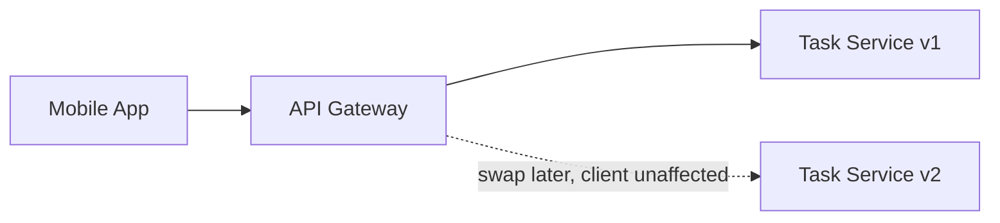

### 2. Simplifying consumption by aggregating calls

Sometimes the shape I want to expose to a client is different from what my backend naturally provides. If loading TaskFlow's dashboard screen needs data from the Task service, the Notification service, and the User service, I don't want the mobile client making three sequential round trips over a mobile network. I can have the gateway fan those calls out concurrently and stitch the results together into one response.

> **Caution**
> This is genuinely useful, but I try hard to keep this aggregation logic thin — pure composition, not business rules. Every time I've let real domain logic creep into gateway-level aggregation code, I've ended up with logic duplicated (or worse, diverging) between the gateway and the services it's calling. If the gateway calls are not independent — e.g., one depends on the result of another — I also have to think carefully about ordering and idempotency, since a gateway-level change to call order can silently change behavior.

### 3. Protecting APIs from abuse

The edge of my system is the first place a bad actor touches it. I lean on the gateway for IP allow/deny lists, rate limiting, load shedding, and (often) a web application firewall, either built in or integrated.

### 4. Understanding how my APIs are actually used

Nearly all user-facing traffic flows through the gateway, which makes it a natural place to capture top-line metrics: request volume, latency, error rates. I also use the gateway to inject a correlation ID into every inbound request, which every downstream service then propagates — that one ID is what lets me stitch together a trace across five services when something goes wrong.

### 5. Managing the API as a product

Once TaskFlow's API has external consumers, it stops being "just an endpoint" and starts being a product: developers need documentation, a way to get credentials, and a predictable lifecycle. This is where API gateways with built-in developer portals and lifecycle tooling earn their keep — although I only reach for this tier of functionality once I actually have third-party consumers to manage.

### 6. Monetization, if that's relevant to me

Some gateways bundle billing and account management — API keys tied to usage tiers, integration with a payment processor. I've never needed this on an internal-facing gateway, but for a public, monetized API, it's a real capability worth evaluating gateways on.

---

## A Short History That Explains Why Gateways Look the Way They Do

I find it genuinely useful to know *why* gateways have the shape they do, because the shape is a product of forty years of the same problem recurring in slightly different clothes.

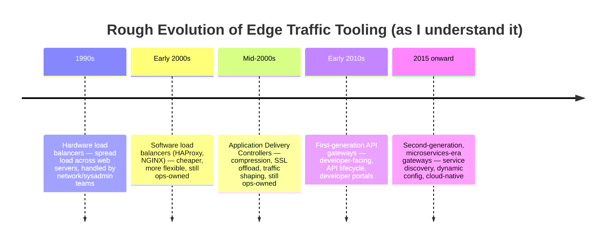

The detail that stuck with me most: early load balancers and proxies were built for **operations teams** — sysadmins configuring infrastructure. First-generation API gateways were the moment this tooling started being aimed at **developers** directly, with the explicit goal of managing an API as a product, not just as a network route. That shift is why modern gateways bundle things like developer portals and versioning support — it's a direct legacy of that first generation trying to solve API lifecycle management, not just traffic routing.

I also want to flag a genuinely confusing bit of terminology I had to sort out for myself: **"API gateway," "edge proxy," and "Kubernetes ingress controller"** get used almost interchangeably in casual conversation, but they're not the same thing. An edge proxy is a general-purpose reverse proxy operating mostly at the network/transport layer with little API-specific awareness. An ingress controller is a Kubernetes-specific mechanism for getting traffic into a cluster. An API gateway is the superset that adds API-aware, application-layer functionality (auth, rate limiting per consumer, request transformation) on top of either of those. In practice, many products today blur these lines deliberately, offering all three roles from one deployment.

---

## The Three Flavors of API Gateway I Run Into

When I evaluate gateway products now, I sort them into three rough categories, because the right one for TaskFlow depends heavily on which category fits my actual maturity and scale.

| | Traditional Enterprise Gateway | Microservices / "Micro" Gateway | Mesh-Bundled Ingress Gateway |
|---|---|---|---|
| Primary job | Full API lifecycle: publish, secure, monetize, deprecate | Route ingress traffic to backend services, lighter on lifecycle tooling | Get external traffic into a mesh, little else |
| Typical user | API platform/product teams | Application/platform engineers | Platform engineers already running a mesh |
| State management | Usually needs its own datastore (HA is my responsibility) | Often leans on the underlying platform (e.g., Kubernetes) for state | Leans entirely on the mesh's control plane |
| Developer experience | Admin UI, developer portal, service catalog | CLI/IaC-driven, lightweight portal | CLI/IaC-driven, minimal catalog |
| Where I've used this | Public, monetized, partner-facing APIs | Internal platform fronting many small services | Only when I already run a mesh and just need external entry |

The mistake I want to flag here: I once reached for a heavyweight enterprise gateway on a project that genuinely only needed a microservices gateway. I spent weeks standing up its dependent datastore and getting it highly available before I'd routed a single production request. If I'm not actively managing an API as a monetized product with external developers, I now default to the lighter option first and upgrade only when I actually feel the pain the heavier tool solves.

---

## Case Study: Putting a Gateway in Front of TaskFlow

Let's make this concrete. TaskFlow started as a monolith. I've now extracted the Task service into its own deployment, and I want the mobile app to call it directly instead of routing everything through the monolith.

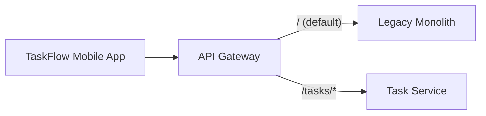

Here's a Kubernetes-native gateway mapping (written in the general shape of the Custom Resource style several gateway products use) routing the root path to my legacy monolith, and the `/tasks` path to the newly extracted Task service:

```yaml
apiVersion: gateway.example.io/v1
kind: RouteMapping
metadata:
  name: legacy-default-route
spec:
  hostname: "*"
  prefix: /
  service: taskflow-monolith.legacy:8080
---
apiVersion: gateway.example.io/v1
kind: RouteMapping
metadata:
  name: task-service-route
spec:
  hostname: "*"
  prefix: /tasks
  rewrite: /
  service: task-service.platform:8080
```

The `rewrite: /` field matters more than it looks — it strips `/tasks` off the front of the path before forwarding, so from the Task service's own point of view, it's just handling `GET /` and `GET /42`, with no awareness that the gateway prepended anything. This is exactly the kind of decoupling I described earlier: I can rename the external path, move the service, or split it further, and the Task service's own routes never need to change.

I can also route by hostname instead of path, which I reach for when I want a dedicated subdomain per service:

```yaml
apiVersion: gateway.example.io/v1
kind: RouteMapping
metadata:
  name: task-service-host-route
spec:
  hostname: "tasks.taskflow.example.com"
  prefix: /
  service: task-service.platform:8080
```

> **Caution**
> Some gateways let me route based on the *body* of a request, not just the path or headers. I avoid this almost every time it's offered. It leaks a dependency on my request schema into gateway configuration — now the gateway config has to change whenever my payload shape changes, which is exactly the kind of coupling I'm trying to get rid of by having a gateway in the first place. It's also genuinely expensive: deserializing and inspecting a full payload just to make a routing decision adds real latency at a layer where I want to spend as little time as possible.

As I extract more services from the monolith, this pattern just keeps repeating — one more `RouteMapping` per service, prefixes can nest (`/tasks/archive`) or use patterns, and eventually the monolith shrinks down to a thin shell handling whatever hasn't been extracted yet. This is the **strangler fig** pattern in action: I'm not doing a big-bang rewrite, I'm incrementally routing traffic away from the old system piece by piece.

---

## Failure Modes: Treating the Gateway as a Single Point of Failure

Once I put a gateway in front of everything, I have to be honest with myself: it's now squarely on the critical path of *every* request into my system. If it goes down, TaskFlow goes down, full stop.

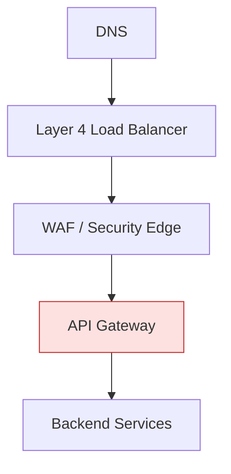

I think of the chain above as a sequence of single points of failure, each one a candidate for taking down my whole system if it fails and I haven't planned for it. The gateway is usually the one I have the most direct control over, so it's the one I invest the most in hardening:

- **Run multiple instances**, spread across availability zones, never a single pod or a single VM.
- **Configure real health checks** on whatever load balancer sits in front of the gateway, and actually test the failover path — I don't assume it works just because I configured it.
- **Decide deliberately** whether security components should "fail open" (pass traffic through if the component itself fails) or "fail closed" (block traffic). For most of TaskFlow I want fail-open on things like a non-critical WAF rule (I'd rather degrade gracefully than take the whole site down over a rules-engine hiccup), but for anything touching payment or PII, I want fail-closed, every time.
- **Own it, on-call.** Somewhere, a specific team has to be paged when the gateway misbehaves. "Everyone owns it" quietly becomes "no one owns it" the first time there's an incident at 2 a.m.

> **Note**
> The most common failover bug I've personally hit wasn't the gateway itself — it was **sticky session state not migrating correctly** when a gateway instance failed over. If any session affinity is configured, I test the actual failover, not just the health check passing.

---

## Gateway Antipatterns I've Personally Walked Into

### The gateway loopback trap

This one bit me directly. Once I had the Task service extracted and routed through the gateway, my legacy monolith needed to call it too. The path of least resistance was for the monolith to just call `https://api.taskflow.example.com/tasks` — the same public URL the mobile app uses.

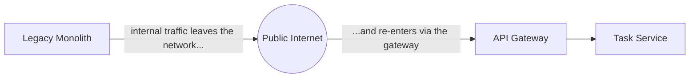

This works, technically, but it's genuinely wasteful: internal traffic is leaving my network and coming back in, paying egress costs, adding latency, and adding a hop that a bad actor could theoretically intercept. The fix was internal service discovery — the monolith should resolve the Task service's internal address directly, never routing east-west traffic out through the north-south gateway. This is exactly the gap a service mesh fills, and it's one of the biggest reasons I eventually introduce one.

### The gateway-as-ESB trap

Most gateways support plugins or scripting for extending behavior. It's tempting — dangerously tempting — to put actual business logic in there: "just transform this payload in the gateway plugin, it's easier than redeploying the service." I've regretted every instance of doing this. It couples my gateway config to my domain logic, and a plugin change now has to be coordinated with a service deployment, which defeats a huge part of why I wanted a gateway in the first place.

### Turtles all the way down

I've seen organizations deploy a "transport security gateway," then an "auth gateway," then a "logging gateway," each hop adding latency and another team to coordinate with for even a trivial change. If I find myself asking "wait, which gateway owns tracing again?" that's my signal I've over-layered this.

---

## How I Actually Choose a Gateway

Here's the checklist I genuinely run through, not a hypothetical one:

| Question I ask myself | Why it matters |
|---|---|
| Do I actually have cross-cutting requirements beyond routing? | If not, a load balancer is enough — don't over-build |
| Is there already a gateway (or gateway-shaped pile of tools) somewhere in the org? | Reinventing this is expensive; consolidating is usually cheaper |
| Do I need full API lifecycle management (developer portal, monetization)? | Decides enterprise gateway vs. lightweight microservices gateway |
| What's my team's skill level with the candidate technologies? | A powerful gateway nobody can operate is worse than a simple one everyone understands |
| Have I honestly totaled the cost of building this myself? | I almost never come out ahead building my own — this space is mature and well-solved |

I take "build vs. buy" seriously as its own decision point. Every time I've been tempted to write a custom gateway because "our requirements are special," it's turned out our requirements weren't actually that special — and the total cost of ownership (ongoing maintenance, security patching, feature parity with mature open-source or commercial options) dwarfed the cost of just adopting something that already exists.

---

## Why East-West Traffic Needs a Different Tool

Once TaskFlow has more than a couple of internal services, I hit a wall with gateway-only thinking. Internal traffic volume and change frequency are both much higher than external traffic — my Task service might call the Notification service dozens of times a second, and both services get redeployed multiple times a day. Putting a full API gateway in front of *every* internal service quickly becomes an operational and cost nightmare, and it's exactly the "gateway loopback" antipattern I described above, just formalized.

What I actually need for east-west traffic is something that:

- Discovers service locations dynamically, without hardcoded IPs (which constantly change in any cloud/container environment)
- Applies consistent reliability patterns — retries, timeouts, circuit breaking — without me hand-rolling them in every service, in every language
- Secures service-to-service calls (mutual TLS, service identity) without every team implementing their own certificate handling
- Gives me observability into internal call patterns, not just the traffic that crosses my public edge

This is the gap a **service mesh** fills.

---

## What a Service Mesh Actually Is

I define a service mesh, in my own words, as: **a dedicated infrastructure layer for handling service-to-service communication**, transparently, without requiring changes to my application code. Like a gateway, it splits into a control plane (where I define routing and policy) and a data plane (where traffic actually flows) — but critically, in a mesh these are *always* separate components, unlike some gateways that bundle both together.

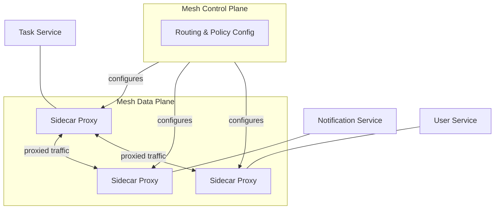

The dominant implementation pattern I run into today is the **sidecar**: a small proxy process deployed alongside every service instance, sharing its network namespace, transparently intercepting all inbound and outbound traffic. My Task service doesn't know a proxy is involved — it makes what looks like a normal call to `http://notification-service`, and the sidecar handles discovery, retries, mTLS, and telemetry underneath that call.

> **Note**
> I keep a very specific distinction in my head: "sidecar" is the general architectural pattern (running a helper process alongside my application, in the same namespace); "sidecar proxy" is the specific case where that helper is a network proxy. I've caught myself using the terms loosely and it's worth being precise, especially when discussing this with people newer to the pattern.

I also had to learn the difference between a **half proxy** and a **full proxy**. A full proxy — which is what every service mesh sidecar I've used actually is — maintains two entirely separate network connections (client-side and server-side) and actively mediates both. That's what gives it the power to inspect, retry, or reroute traffic on either side, at the cost of real CPU and memory overhead per proxy instance — which matters a lot once I'm running one sidecar per pod, times however many pods I have.

---

## The Eight Fallacies That Justify All of This Complexity

Every time I question whether a mesh is worth its operational overhead, I come back to a list originally compiled at Sun Microsystems in the '90s, sometimes called the **Fallacies of Distributed Computing** — assumptions engineers tend to make about networks that are simply false:

1. The network is reliable
2. Latency is zero
3. Bandwidth is infinite
4. The network is secure
5. Topology doesn't change
6. There is one administrator
7. Transport cost is zero
8. The network is homogeneous

> **Caution**
> These read like ancient history, coined decades before containers existed, and it's tempting to dismiss them as no longer relevant. I'd push back hard on that instinct. Every single one of these still bites me in a modern Kubernetes cluster: pods get rescheduled (topology changes constantly), cross-AZ calls have real latency, and "the network is secure" is exactly the assumption zero-trust architecture exists to kill.

A service mesh is, in my mental model, an explicit acknowledgment that these fallacies are real and need handling **consistently**, in one place, rather than reimplemented — inconsistently, with subtle bugs — inside every service, in every language, by every team.

---

## How Service Mesh Implementation Got Here: Libraries → Sidecars → Proxyless → eBPF

This history matters to me because it explains real trade-offs I have to make today, not just trivia.

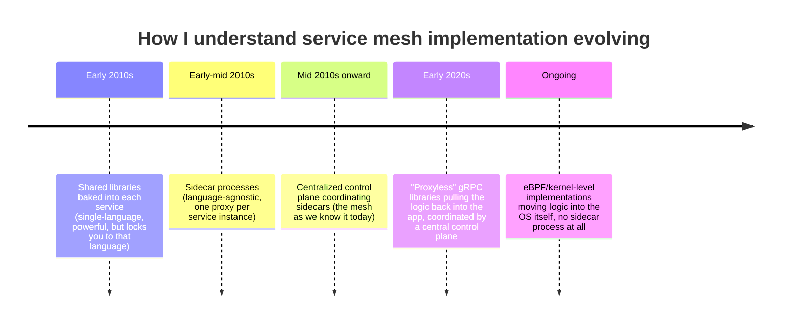

### Libraries first

The earliest approach I'd have reached for pre-2013 was a shared library baked directly into each service, handling service discovery, retries, and circuit breaking in-process. The problem: if TaskFlow used Java for the Task service and Go for a future analytics service, I now need to build and maintain that library twice, and keep both implementations behaviorally identical — which, in my experience, they never quite are.

### Then sidecars

Pulling that logic out into a separate process running alongside each service solved the polyglot problem — the proxy doesn't care what language wrote the service next to it, because all it sees is network traffic. This is still the dominant pattern I deploy today.

> **Caution**
> Sidecars aren't free. I once ran the numbers on a fairly modest cluster — a few dozen services, several replicas each — and just the aggregate memory footprint of the sidecar proxies alone was a meaningful fraction of my total cluster capacity. Tuning proxy resource limits per-service is something I now do deliberately rather than accepting defaults blindly.

### Proxyless gRPC and eBPF

More recently, I've seen the pendulum swinging back in an interesting way: "proxyless" service mesh implementations push the logic back into a shared library (gRPC's own libraries, in this case), coordinated by an external control plane, avoiding the sidecar's per-pod resource overhead entirely — at the cost of being restricted to gRPC-speaking services. Meanwhile, eBPF-based approaches push the networking logic into the OS kernel itself, so it applies transparently to every process on a node without a dedicated sidecar per pod. I haven't adopted either of these for TaskFlow yet — both feel like they're still stabilizing — but I keep half an eye on them because the resource overhead argument for eBPF in particular is compelling for larger deployments.

| Implementation Pattern | Language Flexibility | Per-Pod Overhead | Where I'd Actually Use It |
|---|---|---|---|
| Shared library, in-process | Locked to one language per library | None extra | Small, single-language shop; simple routing needs |
| Sidecar proxy | Fully language-agnostic | One proxy per pod (meaningful at scale) | My current default for a polyglot, moderately sized system |
| Proxyless (gRPC libraries) | Locked to gRPC | Minimal | High-performance, gRPC-only internal services, large scale |
| eBPF / kernel-level | Fully language-agnostic | Shared per node, not per pod | Very large clusters where sidecar overhead is a real cost problem |

---

## Case Study: Meshing TaskFlow's Internal Services

Let's say I've now extracted a second service — Notification — and I want the Task service to call it reliably, securely, and observably, without hand-rolling any of that logic myself.

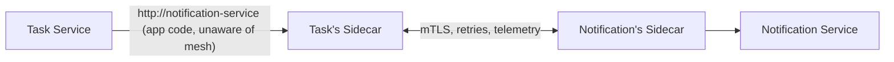

### Step 1: Routing

Here's a route definition, in the general shape of the kind of resource a service mesh control plane uses, directing traffic addressed to `notification-service` toward a specific stable version:

```yaml
apiVersion: mesh.example.io/v1
kind: ServiceRoute
metadata:
  name: notification-route
spec:
  host: notification-service
  http:
    - route:
        - destination:
            host: notification-service
            subset: v1
---
apiVersion: mesh.example.io/v1
kind: DestinationPolicy
metadata:
  name: notification-versions
spec:
  host: notification-service
  subsets:
    - name: v1
      labels:
        version: v1
    - name: v2
      labels:
        version: v2
```

Having two subsets defined (`v1` and `v2`) is what lets me gradually shift traffic to a new version later — 5% of calls to `v2`, then 25%, then 100% — without the Task service ever knowing a rollout is happening.

### Step 2: Observability, without touching my application code

Once the sidecars are in place, I get request volume, latency, and error-rate metrics for every service-to-service call, automatically. I didn't add a single line of instrumentation code to the Task or Notification services — the sidecars see every request because all traffic already flows through them.

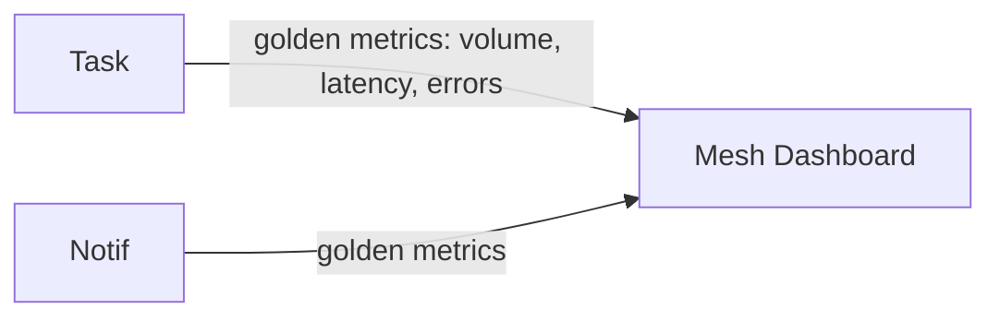

I still instrument my own business-specific metrics and logs inside each service — the mesh gives me the generic network-level picture, not domain-specific KPIs like "tasks completed per hour."

### Step 3: Locking down who can call whom

This is the piece I found most valuable, and it's the direct fix for the gateway-loopback problem I described earlier. Instead of relying on network-level firewall rules, I define **intentions** — explicit allow rules for which service can call which:

```yaml
apiVersion: mesh.example.io/v1
kind: ServiceIntention
metadata:
  name: deny-all-default
spec:
  destination:
    name: "*"
  sources:
    - name: "*"
      action: deny
---
apiVersion: mesh.example.io/v1
kind: ServiceIntention
metadata:
  name: task-can-call-notification
spec:
  destination:
    name: notification-service
  sources:
    - name: task-service
      action: allow
```

I start from a **deny-all default** and explicitly allow-list each required interaction. This flips the default posture from "everything can talk to everything unless I remember to lock it down" to "nothing can talk to anything unless I've explicitly said so" — which is the posture I actually want for anything handling real user data.

> **Note**
> The identity behind each of these intentions isn't just "an IP address I trust" — it's cryptographically verified via a TLS client certificate issued to each service. That's what makes mutual TLS (mTLS) and these authorization intentions work together: the sidecar isn't just checking "did this request come from a trusted subnet," it's checking "did this request come from a service that can cryptographically prove it's `task-service`."

### Step 4: Reliability policy, defined once

Here's where I stop hand-writing retry loops in application code. A policy like this applies consistently to every call to the Notification service, regardless of which language called it:

```yaml
apiVersion: mesh.example.io/v1
kind: DestinationPolicy
metadata:
  name: notification-reliability
spec:
  host: notification-service
  trafficPolicy:
    connectionPool:
      http:
        maxRequestsPerConnection: 10
    outlierDetection:
      consecutive5xxErrors: 5
      interval: 30s
      baseEjectionTime: 30s
    retries:
      attempts: 3
      perTryTimeout: 2s
```

If the Notification service starts throwing errors, the mesh will eject the unhealthy instance from the load-balancing pool for a while, retry failed calls a bounded number of times, and cap how long any single attempt is allowed to hang — all without a single retry-loop `try`/`except` block inside my Task service's code.

---

## Service Mesh Antipatterns

### Mesh as ESB, again

Same failure mode as the gateway-as-ESB antipattern, just one layer deeper. Mesh proxies increasingly support scripting extensions (WebAssembly filters being the modern flavor), and it's tempting to put payload transformation logic there. I resist this for the same reason as before: it couples infrastructure-layer configuration to domain-layer logic, and the two evolve at very different rates and are owned by different teams.

### Mesh as gateway

I've seen teams adopt a service mesh purely because its bundled ingress gateway solves their immediate pain point (getting external traffic in), while skipping a proper API gateway evaluation entirely. The mesh's ingress functionality is almost always thinner than a purpose-built API gateway — weaker developer portal support, less mature rate-limiting-per-consumer tooling. I now treat "the mesh has an ingress gateway" as a convenience for internal exposure, never as a substitute for evaluating a real gateway for genuinely external, product-facing APIs.

### Too many networking layers stacked without coordination

If my platform team rolls out a mesh but some application teams don't know it exists and keep their own hand-rolled retry logic, I end up with retries happening at two layers simultaneously — which can quietly turn a brief blip into a self-inflicted retry storm. Every layer I add to the networking stack has to be coordinated with the teams building on top of it, or the layers actively work against each other.

---

## Gateway vs. Mesh: My Side-by-Side Cheat Sheet

| | API Gateway | Service Mesh |
|---|---|---|
| Traffic direction | North-south (external → internal) | East-west (internal → internal) |
| Deployed | At the network edge | Distributed across every node/pod |
| Origin of traffic | Largely unknown, low trust | Known internal services, higher (but not full) trust |
| Typical topology | Centralized cluster of gateway instances | Decentralized — a proxy per service instance |
| Primary functions | Auth, rate limiting, API lifecycle, aggregation | Service discovery, mTLS, retries/circuit breaking, telemetry |
| Owned by, in my experience | API/platform team | Infrastructure/platform team |
| I'd skip it if... | Traffic is simple, single backend, no cross-cutting needs | Few internal services, single language, simple call graph |

I want to stress: these are complementary, not competing. In a mature TaskFlow deployment, I run both — a gateway at the edge handling external traffic, and a mesh internally handling how my services talk to each other once a request is inside.

---

## How I Actually Choose (or Skip) a Service Mesh

I don't adopt a mesh reflexively just because it's trendy. Here's the actual decision tree I use:

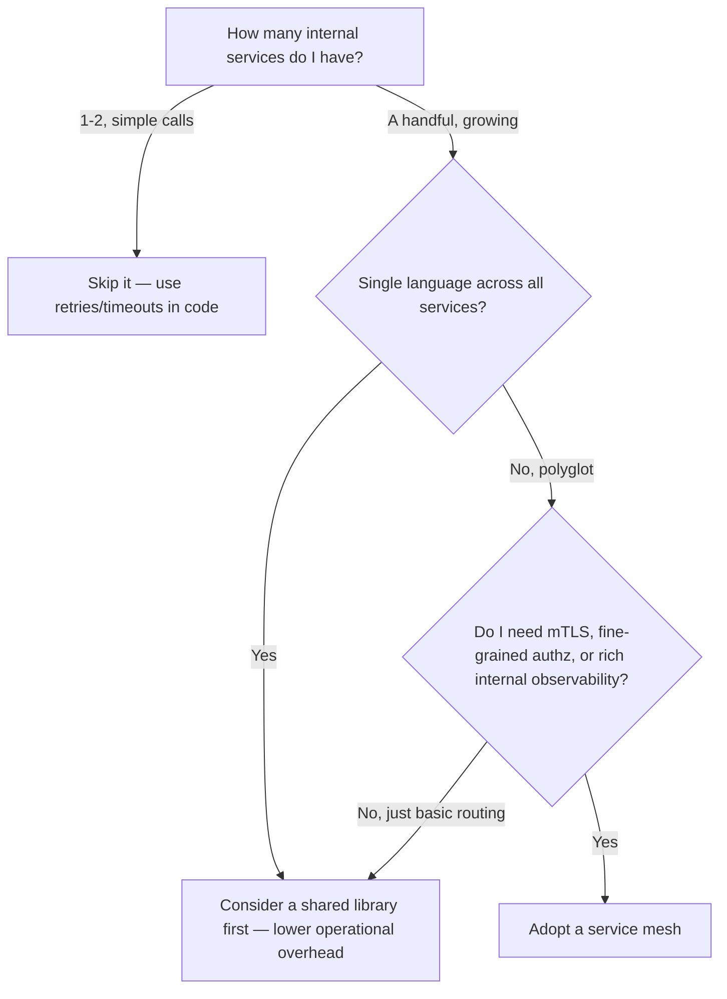

The single biggest factor for me is **polyglot-ness combined with genuine cross-cutting requirements**. If TaskFlow were entirely one language, I'd lean toward a well-maintained shared library first — it's less operational surface area than running a sidecar per pod. It's the combination of "multiple languages" and "I need mTLS/fine-grained authorization/consistent retries" that tips me toward a mesh.

| Question I ask | Why it matters |
|---|---|
| How many services do I actually have right now, not "eventually"? | A mesh has real fixed operational cost — don't pay it prematurely |
| Is my org single-language or polyglot? | Single-language orgs can often get away with a good shared library |
| Do I need mTLS and fine-grained service authorization specifically? | This is the mesh's strongest, hardest-to-replicate value |
| Do I already have partial solutions scattered around (some libraries, some sidecars, some nothing)? | Consolidating existing sprawl might be more urgent than adopting something new |
| What's my team's appetite for the ongoing operational cost of a control plane and sidecar fleet? | This is a genuine, ongoing cost, not a one-time setup |

---

## My Own Rollout Checklist

When I introduce either a gateway or a mesh into a real system now, this is roughly my sequence:

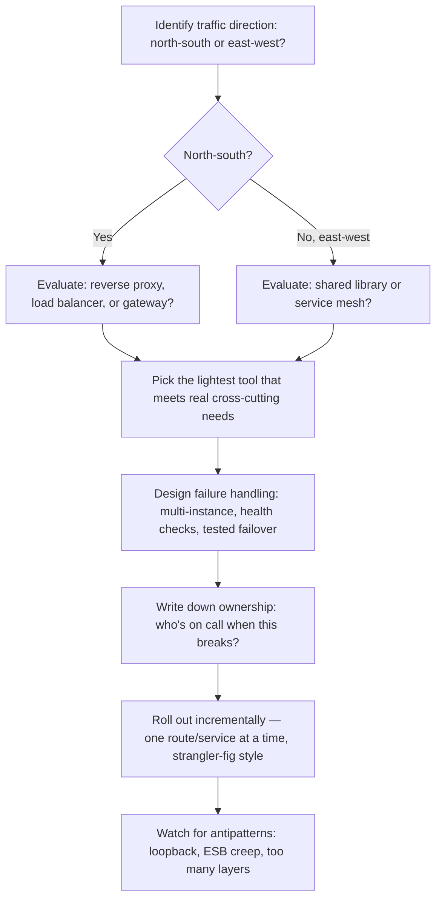

And the honest questions I ask myself before signing off on either:

| Layer | The question I actually ask |
|---|---|
| Do I need this at all? | Is a plain proxy/load balancer or a shared library genuinely insufficient? |
| Ownership | Who's paged at 2 a.m. if this breaks? |
| Failure mode | Fail open or fail closed, and have I actually tested that path? |
| Coupling | Am I keeping business logic out of gateway plugins and mesh filters? |
| Layering | Am I stacking multiple overlapping networking layers without coordinating them? |
| Rollout | Am I introducing this incrementally, service by service, rather than all at once? |

I also keep a running "definition of done" for any traffic-management rollout, gateway or mesh, before I call it production-ready rather than merely "deployed":

- I've tested a failover, not just configured one — killing an instance and watching traffic actually reroute, not just trusting the health-check config on paper.
- I've confirmed correlation IDs survive every hop in the request path, synchronous and asynchronous alike.
- I've written down, somewhere a teammate can find it without asking me, who owns this component and what the escalation path looks like at 2 a.m.
- I've deliberately decided (not defaulted into) whether each security control fails open or fails closed.
- I've rolled out any new authorization policy — deny-all included — in phases, with a way to see what *would* have been blocked before I actually start blocking it.

---

## Observability at the Edge vs. Observability in the Mesh

I want to spend a bit more time on this because it's one of those things that sounds identical in a sales deck for a gateway and a sales deck for a mesh, but in practice gives me completely different information depending on where it's captured.

At the **gateway**, I'm capturing the outside-in view: how is the world experiencing TaskFlow? Request volume by consumer, error rates by API key, p99 latency for the whole round trip from "request hits my edge" to "response leaves my edge." This is the data I bring to a postmortem when a partner integration says "your API has been slow all week" — I can immediately tell them whether that's true, and if so, whether it's a gateway-level problem (rate limiting kicking in, TLS handshake overhead) or something downstream.

At the **mesh**, I'm capturing the inside-out view: once a request is inside my system, which services did it actually touch, how long did each hop take, and where did it fail. This is the data that tells me *why* a request was slow — was it the Task service itself, or was it blocked waiting on a call to the Notification service that took four seconds because that service was mid-deploy?

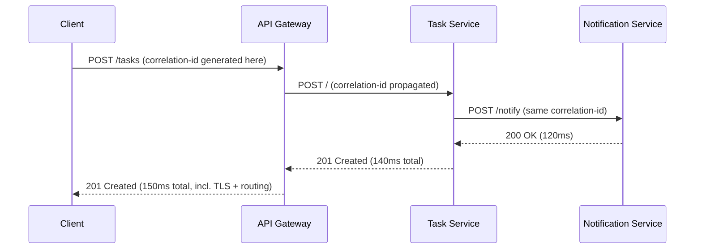

The thing that actually makes this useful, rather than two disconnected piles of metrics, is that single correlation ID generated at the gateway and propagated through every internal hop by the mesh. Without that connective tissue, I have a gateway dashboard telling me "this request took 150ms" and a mesh dashboard telling me "the Notification service had a slow request around that time," with no way to prove they're the same request. I treat wiring that propagation up correctly — and verifying it actually survives every hop, including through any queue or async boundary — as one of the highest-leverage things I do early in a rollout, precisely because it's what turns two separate tools into one coherent observability story.

> **Caution**
> I've been burned by a service silently dropping the correlation header — usually because a language-specific HTTP client library strips "unrecognized" headers by default on outbound calls, or because a message queue hop in between doesn't carry HTTP headers at all and needs the ID re-injected into the message envelope manually. I now explicitly test that a trace survives every hop in the request path, including any asynchronous ones, rather than assuming it "just works" because it worked for the first two synchronous hops I tested.

---

## Security: What Belongs at the Gateway, What Belongs in the Mesh

I get asked a version of this question a lot: "we have both a gateway and a mesh now — where does auth actually happen?" My answer has stabilized into a fairly clean split, though I want to be upfront that reasonable teams draw this line in slightly different places.

| Security Concern | Where I Enforce It | Why |
|---|---|---|
| TLS termination for external traffic | Gateway | It's the first thing external traffic touches |
| End-user authentication (login tokens, OAuth) | Gateway | The concept of "a logged-in user" is meaningful at the edge, less so three hops deep |
| Rate limiting per external consumer/API key | Gateway | Only the gateway knows who the external caller actually is |
| WAF rules (SQLi, XSS patterns, etc.) | Gateway | External traffic is the untrusted surface these rules are built for |
| Service-to-service mutual TLS | Mesh | Every internal hop should prove its own identity independently |
| Service-to-service authorization ("can Task call Notification?") | Mesh | This is a machine-identity concern, not a user-identity concern |
| Internal rate limiting / circuit breaking between services | Mesh | Protects internal services from each other, not from the outside world |

The subtlety I had to learn the hard way: **authenticating the end user at the gateway does not mean I can stop thinking about security once a request is inside.** A request that's been authenticated as "logged in as Alice" at the edge still needs to prove, hop by hop, that it's coming from a service that's actually authorized to make that call — because if one of my internal services is ever compromised, I don't want it to be able to freely call every other service just because the original request had a valid user token. This is the practical core of "zero trust" that I mentioned earlier: I don't extend implicit trust to a hop just because it's "inside" my network boundary.

> **Note**
> I treat these two layers of auth — user identity at the edge, service identity internally — as genuinely independent controls, not a single check that gets "inherited" as a request moves deeper into my system. Designing them that way means a compromised internal service is contained by the mesh's authorization policy even if it somehow got hold of a valid user token.

---

## A Worked Failure Scenario: Debugging a Slow Checkout in TaskFlow

I find abstract principles land better with a concrete failure story, so here's a version of an incident I've lived through more than once, adapted to TaskFlow.

**The report:** "Creating a task with a reminder is taking 8+ seconds intermittently, only during business hours."

**Step 1 — Check the gateway's view.** My gateway dashboard shows p50 latency on `POST /tasks` is normal (around 150ms), but p99 has spiked to 8 seconds. That immediately tells me this isn't a systemic, every-request problem — something is occasionally very slow, which smells like resource contention or an unhealthy instance somewhere downstream, not a code path that's slow for everyone.

**Step 2 — Check the mesh's view.** Using the correlation ID from one of the slow requests (captured in the gateway's access logs), I pull up the internal trace. It shows the Task service itself responding in 40ms — but the call it makes to the Notification service (to schedule the reminder) is the one taking 7+ seconds.

**Step 3 — Check the mesh's outlier detection.** The mesh's own telemetry shows one specific Notification service pod with elevated latency and a rising error count, while its siblings are healthy. Outlier detection *should* have ejected it from the load-balancing pool — and checking the policy, I find the `consecutive5xxErrors` threshold I'd configured was too high to catch a pod that was slow but not outright erroring.

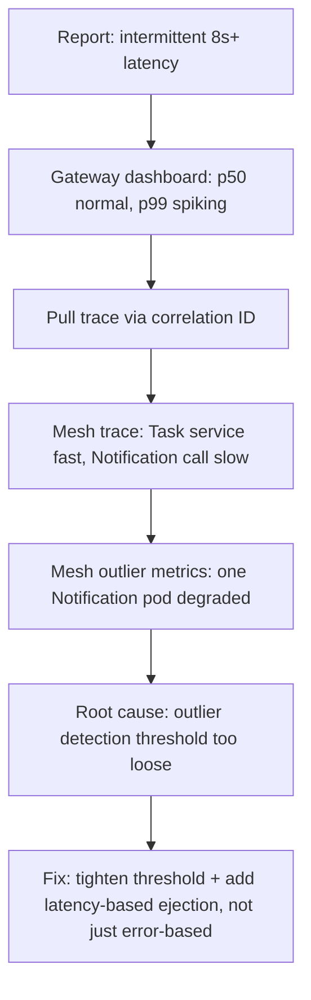

**The fix:** I tightened the outlier detection policy to also eject on elevated latency, not just consecutive 5xx errors, and I set up an alert on individual pod-level latency variance rather than only aggregate service latency. This is exactly the kind of root cause I would never have found from gateway metrics alone — the gateway told me *that* something was wrong; only the mesh told me *where* and *why*.

I walk through this example because it's the clearest illustration I have of why I don't treat "gateway or mesh" as an either/or decision once a system has real internal complexity — they answer genuinely different diagnostic questions, and losing either one means flying half-blind during an incident.

---

## Cost and Capacity Planning: The Part Nobody Puts in the Slide Deck

I want to be honest about a dimension that gets glossed over in most gateway and mesh product marketing: **both of these add real, ongoing infrastructure cost**, and I plan for that explicitly now rather than discovering it after the fact.

For a gateway, the costs I actually track are:

- Compute for running enough gateway instances, across enough availability zones, to survive a zone failure without capacity loss.
- The dependent datastore, if I'm running a traditional enterprise gateway that needs one for state (API keys, rate-limit counters, developer accounts) — and that datastore needs its own high-availability story.
- Egress costs, if my gateway is deployed in a way that routes any internal traffic back out through a public load balancer (this is the loopback antipattern showing up again, this time as a cost line item).

For a mesh, the costs I actually track are:

- Per-pod sidecar overhead — CPU and memory, multiplied by every replica of every service. On a cluster with a few dozen services and several replicas each, this genuinely adds up to a noticeable fraction of total cluster capacity, not a rounding error.
- Control plane compute and its own high-availability requirements — if the control plane goes down, I don't lose traffic immediately (the sidecars keep enforcing their last-known configuration), but I do lose the ability to make any policy changes until it's back.
- The latency cost of an extra network hop on every single internal call, twice (once through the caller's sidecar, once through the callee's) — usually single-digit milliseconds per hop, but that compounds across a deep call graph.

| Cost Category | Gateway | Mesh |
|---|---|---|
| Fixed compute overhead | A handful of gateway instances, independent of backend service count | Scales with number of service replicas — a sidecar per pod |
| State/datastore | Often required for enterprise-tier features | Usually none beyond the control plane itself |
| Added latency per hop | One hop, at the edge, once per external request | Two extra hops per internal call, multiplied across the whole call graph |
| Where cost scales fastest | With external traffic volume and consumer count | With number of internal services and their replica count |

I bring this up because it directly informs the "how many services do I actually have right now" question from my mesh decision tree earlier. A mesh's fixed-per-pod overhead means the cost-benefit math genuinely changes as my service count grows — it's a bad deal at two services, and an obviously good deal at fifty, with a real judgment call somewhere in between that I have to make based on my actual cluster size, not a rule of thumb from a blog post (including this one).

---

## FAQ: The Questions I Get Asked Most on This Topic

**Do I need a gateway before I need a mesh, or can I adopt a mesh first?**
In my experience, almost every system needs a gateway (or at least a load balancer) before it needs a mesh, simply because almost every system has external consumers before it has enough internal service-to-service complexity to justify a mesh. I can't think of a system I've worked on where the mesh came first.

**Can my API gateway and my service mesh be the same product?**
Some vendors offer both under one roof, and some meshes bundle a basic ingress gateway. I've found this convenient for smaller deployments, but I still evaluate the ingress capability on its own merits rather than assuming "it's included" means "it's good enough." If TaskFlow ever needs serious API productization — developer portal, monetization, fine-grained per-consumer plans — I'd want a dedicated gateway product even if I'm also running a mesh from a different vendor internally.

**Is a service mesh only for Kubernetes?**
The dominant implementations I've used are deeply tied to Kubernetes conventions (Custom Resources, sidecar injection via admission webhooks), but the underlying pattern doesn't strictly require it — some implementations support VM-based workloads too. I'd say Kubernetes is where the tooling is most mature today, not where the concept is fundamentally limited to.

**What's the single biggest thing I'd tell someone adopting a mesh for the first time?**
Roll it out incrementally, one namespace or one service at a time, with the "deny-all" authorization policy as the very last step, not the first. I want to confirm routing and observability are solid before I start actively blocking traffic — flipping to deny-all too early, before I'm confident I've mapped every legitimate service-to-service call, is the fastest way to cause a self-inflicted outage.

**How do I know when I've over-engineered this?**
If I can't clearly answer "what specific problem does this solve that a simpler tool doesn't," for either the gateway or the mesh, that's my signal I've reached for the pattern because it's fashionable rather than because I need it. I try to hold myself to naming the actual pain point before I introduce either piece of infrastructure.

**What do I actually lose if I skip a service mesh entirely and just write careful code?**
Honestly, less than the hype suggests, at small scale. A handful of services in one language, with a well-tested shared retry/timeout library and TLS handled at the platform level, can get most of the reliability benefit without a mesh's operational overhead. What I lose is the *consistency guarantee* — nothing stops one team from skipping the shared library, or implementing it slightly differently, and that drift is exactly the kind of thing that shows up as a mystery incident eighteen months later. The mesh's real value isn't that it does something impossible without it; it's that it makes the correct behavior the path of least resistance for every team, automatically, even the ones who've never read this post.

---

## Closing Thoughts

If I compress this entire post into one idea, it's this: **traffic crossing my system's boundary and traffic moving inside it are different problems, and I get in trouble every time I reach for the same tool to solve both.** An API gateway is built to stand at the edge, mediate untrusted traffic, and manage APIs as products. A service mesh is built to sit inside my system, make service-to-service calls resilient and secure without me reimplementing that logic per language, and give me visibility into a call graph I could never fully hold in my head otherwise.

Neither one is free. Both come with real operational cost — a gateway is a single point of failure I have to actively harden, and a mesh is a fleet of sidecar proxies quietly consuming CPU and memory I have to account for. I've learned to introduce each only once I can point to a specific, current pain point they solve — not because the pattern is popular, and not because a vendor's marketing made a compelling case. TaskFlow didn't need a service mesh on day one with two services calling each other over plain HTTP with a five-line retry loop. It needed one once I had enough services, in enough languages, with enough genuine security and reliability requirements, that hand-rolling the same logic five different ways stopped being tenable. That's the bar I'd encourage you to hold your own systems to as well.

If there's one habit I'd want a reader to take away from this whole post, it's the discipline of asking, before adding any layer to the network stack: which specific fallacy of distributed computing, or which specific cross-cutting requirement, am I actually solving with this? Not "gateways are best practice" or "everyone runs a mesh now" — the actual, nameable problem. Every piece of infrastructure I've described here is genuinely valuable when it's answering a real question I have about my system. The same piece of infrastructure, adopted because it seemed like the mature thing to do, just becomes one more moving part I have to operate, secure, and explain to the next engineer who inherits TaskFlow after me.
