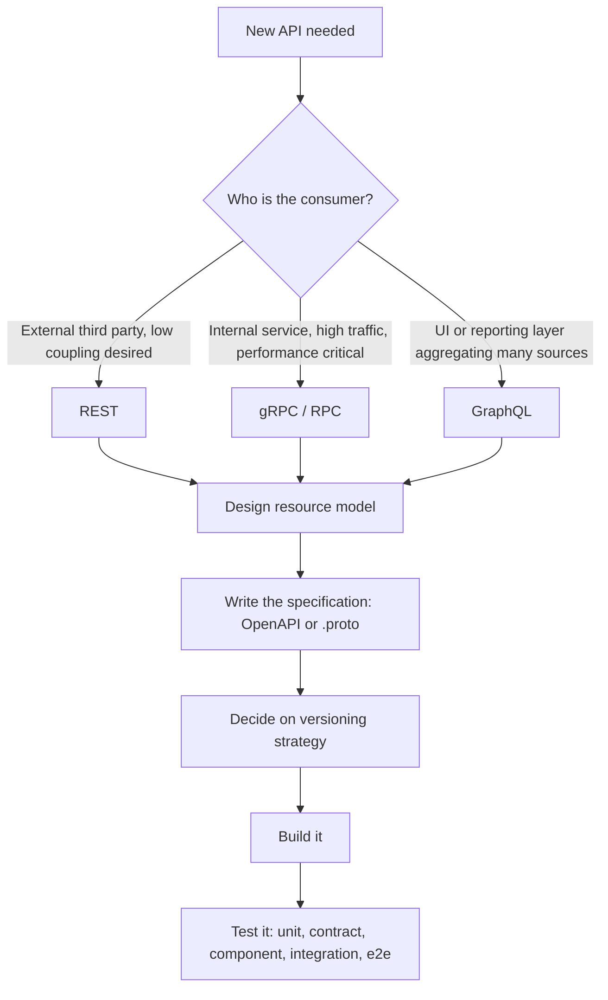
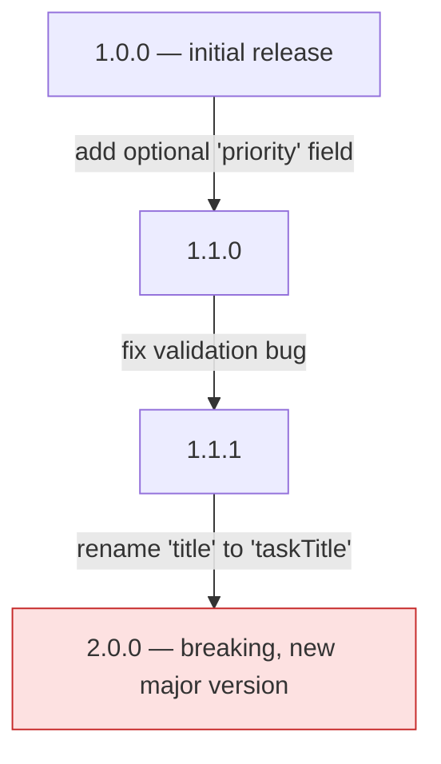
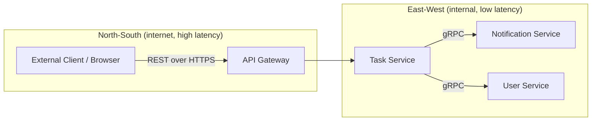
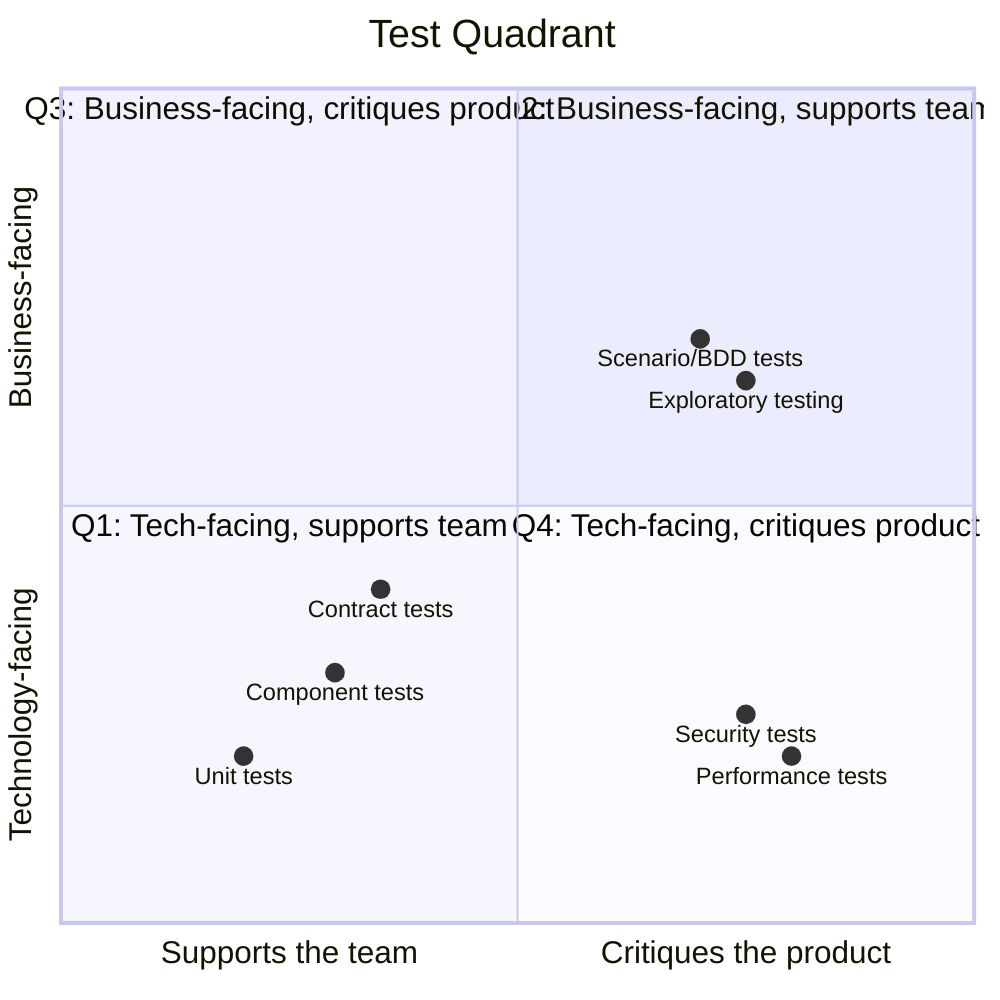
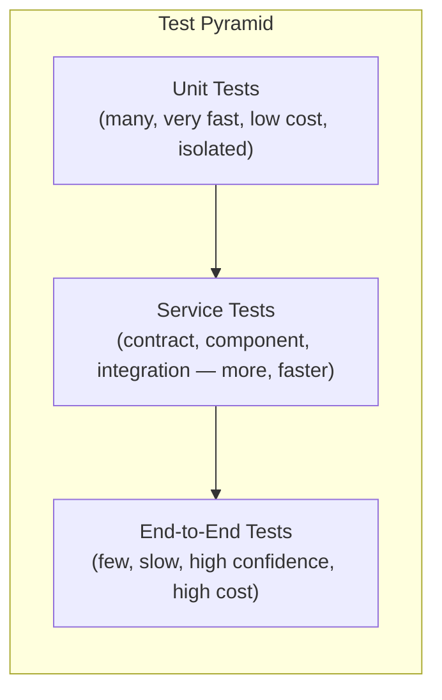
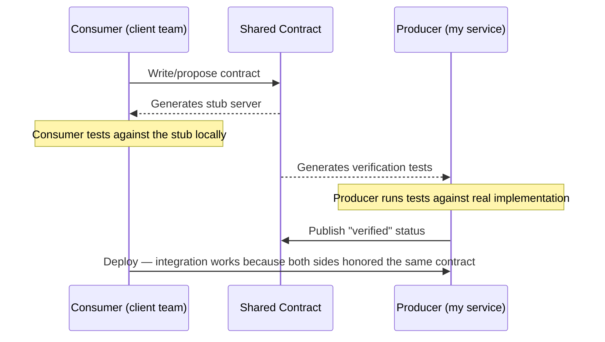
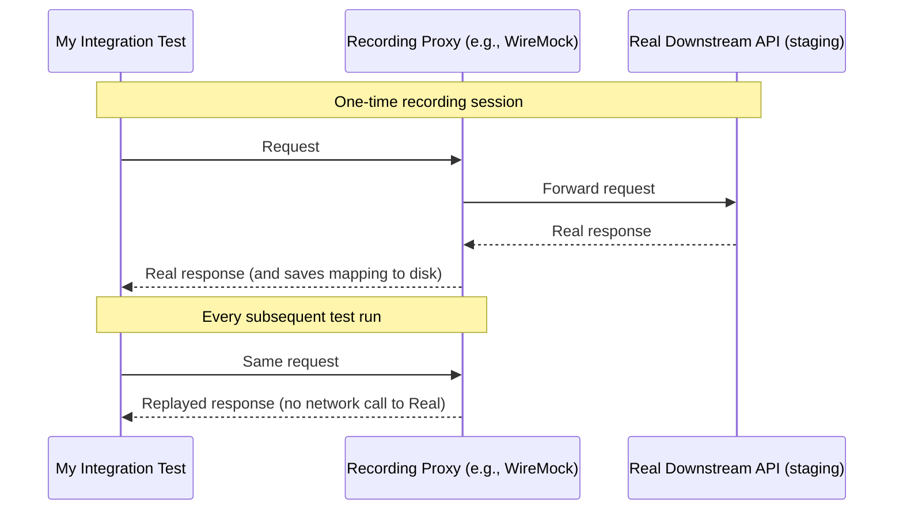
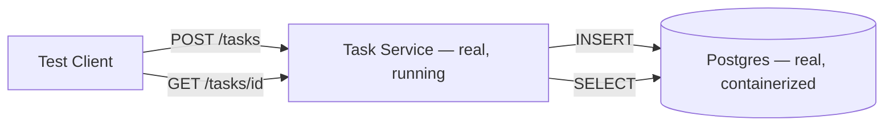
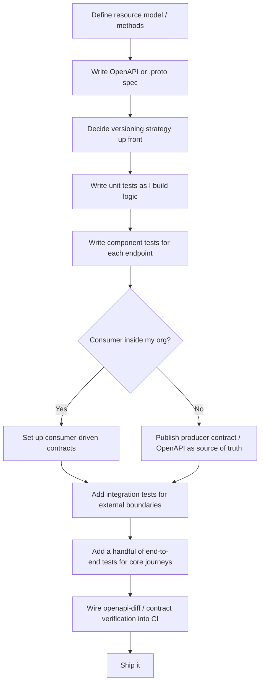

# Designing, Building, and Testing APIs: Everything I Wish Someone Had Told Me Earlier

I've spent a lot of time going back and forth between REST, RPC, and GraphQL on different projects, and I've made just about every testing mistake you can make — skipping contract tests because "the frontend team will catch it," writing end-to-end tests for things a unit test could have covered in a tenth of the time, and hand-rolling stub servers that quietly drifted out of sync with reality. This post is my attempt to lay out, in one place, how I now think about designing, building, and testing APIs — from the first decision of "REST or RPC?" all the way through to the test pyramid and contract testing.

I'm going to use a running example throughout: a small **Task Manager API**. It's deliberately simple — tasks with a title and a `done` flag — so that the API design and testing concepts stay front and center instead of getting buried in domain complexity. Every code snippet in this post is real code that I wrote and actually ran (I'll show you the test output), not pseudocode.

> **Note**
> This is a long post — I've tried to structure it so you can jump straight to the section you need using the table of contents below, rather than reading it front to back.

## Table of Contents

1. [Why API Design Decisions Matter So Much](#why-api-design-decisions-matter-so-much)
2. [REST: The Default Choice, and Why](#rest-the-default-choice-and-why)
3. [The Richardson Maturity Model](#the-richardson-maturity-model)
4. [RPC and gRPC: When REST Isn't the Right Tool](#rpc-and-grpc-when-rest-isnt-the-right-tool)
5. [A Quick Word on GraphQL](#a-quick-word-on-graphql)
6. [Choosing Between REST, RPC, and GraphQL](#choosing-between-rest-rpc-and-graphql)
7. [API Standards: Pagination, Filtering, and Errors](#api-standards-pagination-filtering-and-errors)
8. [Specifying REST APIs with OpenAPI](#specifying-rest-apis-with-openapi)
9. [API Versioning and Compatibility](#api-versioning-and-compatibility)
10. [Modeling Exchanges: North-South vs. East-West](#modeling-exchanges-north-south-vs-east-west)
11. [Why I Test APIs the Way I Do](#why-i-test-apis-the-way-i-do)
12. [The Test Quadrant](#the-test-quadrant)
13. [The Test Pyramid](#the-test-pyramid)
14. [Contract Testing](#contract-testing)
15. [Component Testing (With Real, Tested Code)](#component-testing-with-real-tested-code)
16. [Integration Testing and Stub Servers](#integration-testing-and-stub-servers)
17. [Testcontainers: Testing Against the Real Thing](#testcontainers-testing-against-the-real-thing)
18. [End-to-End Testing](#end-to-end-testing)
19. [Putting It All Together: My Own Checklist](#putting-it-all-together-my-own-checklist)
20. [Closing Thoughts](#closing-thoughts)

---

## Why API Design Decisions Matter So Much

I like to think of an API as a promise. The moment I publish an endpoint, I'm telling every consumer — a frontend team, a partner company, my own future self six months from now — "this is how you talk to my service, and I'm going to keep talking back in this shape." Breaking that promise is expensive. It means coordinated deployments, migration guides, angry Slack messages, and sometimes a 2 a.m. page because a field that used to be a string is now an integer.

That's why I think API design deserves the same level of care as database schema design, maybe more. A database schema is usually internal to my team. An API is a contract with people I may never talk to directly.

The good news is that most of the hard decisions repeat across projects: REST vs. RPC vs. GraphQL, how to paginate, how to version, how to report errors, and how to test all of it without drowning in brittle end-to-end suites. Once I internalized a framework for those decisions, designing a new API became a lot less stressful.



---

## REST: The Default Choice, and Why

REST (**RE**presentational **S**tate **T**ransfer) is, in my experience, still the right starting point for the majority of APIs I build, especially anything exposed outside my own team. It's not a protocol — it's a set of architectural constraints, most commonly layered on top of HTTP. Roy Fielding's dissertation is the original source, but in practice, I judge an API as "RESTful enough" if it hits these marks:

- **Resource-oriented.** I model nouns (`/tasks`, `/tasks/42`), not verbs (`/getTasks`).
- **Stateless.** My server never remembers what a client did in a previous request. Every request carries everything it needs.
- **Cacheable where appropriate.** I use HTTP headers to hint whether a response can be cached.
- **Uniform interface.** GET, POST, PUT, PATCH, DELETE all mean the same thing everywhere in my API.
- **Layered.** The consumer shouldn't be able to tell (or care) whether I'm backed by Postgres, a cache, or three other microservices behind the scenes.

Here's the shape of a REST exchange I'd design for my Task Manager API — request above the line, response below:

```
GET /tasks/1
Accept: application/json
---
200 OK
Content-Type: application/json

{
  "id": 1,
  "title": "Write blog post",
  "done": false
}
```

Because REST is stateless, if I want more context about task 1 later, I have to ask again — the server isn't holding a session for me. That's a deliberate trade-off: it makes REST APIs horizontally scalable (any server can handle any request) at the cost of the client repeating context.

> **Caution**
> Statelessness is a two-way street. I've seen teams claim their API is stateless while quietly caching client-specific state in a "session" object keyed by IP address. That's not REST — that's a landmine for anyone running behind a shared NAT or load balancer.

---

## The Richardson Maturity Model

When I review someone else's "REST" API, I use a mental model I picked up from Leonard Richardson's conference talks (later popularized by Martin Fowler): the **Richardson Maturity Model**. It gives me a quick way to gauge how RESTful an API actually is, on a scale of 0 to 3.

| Level | Name | What It Looks Like | My Task API Example |
|---|---|---|---|
| 0 | HTTP/RPC | A single URI, everything tunneled through it, usually POST | `POST /api` with `{"action": "getTasks"}` |
| 1 | Resources | Individual URIs per resource, but verbs aren't used correctly yet | `GET /tasks/1` exists, but so does `GET /deleteTask/1` |
| 2 | HTTP Verbs | Resources + correct use of GET/POST/PUT/DELETE, safe methods don't mutate state | `GET /tasks/1`, `DELETE /tasks/1`, `PUT /tasks/1` |
| 3 | Hypermedia (HATEOAS) | Responses include the actions available on the resource | `GET /tasks/1` returns links to `update` and `delete` actions |

In practice, I aim for **level 2** on almost everything I build. Level 3 (HATEOAS) is architecturally elegant, but I've rarely seen it pay for itself in service-to-service APIs — it makes the exchange "chatty" (the client has to follow links instead of just knowing the shape up front), and most consumers end up hardcoding the URLs anyway after reading my documentation once. I reserve HATEOAS-style thinking for public, browsable APIs where discoverability genuinely matters more than raw efficiency.


I highlighted level 2 in the diagram above because that's where I land most of the time — it's the sweet spot between "predictable and simple" and "not over-engineered."

---

## RPC and gRPC: When REST Isn't the Right Tool

Remote Procedure Call (RPC) is a different mental model entirely. Instead of modeling resources, I'm exposing **methods** that a consumer calls directly, almost as if the remote service were a local library. **gRPC** is the modern, high-performance implementation I reach for — it's stewarded by the Linux Foundation and has become the de facto standard for RPC across most languages.

Here's how I'd model the same task-fetching operation in a `.proto` file:

```protobuf
syntax = "proto3";

option java_multiple_files = true;
package com.example.tasks.grpc;

message TasksRequest {
  string status_filter = 1; // "done", "open", or empty for all
}

message Task {
  int32 id = 1;
  string title = 2;
  bool done = 3;
}

message TasksResponse {
  repeated Task tasks = 1;
}

service TaskService {
  rpc GetTasks(TasksRequest) returns (TasksResponse);
}
```

The biggest mental shift for me moving from REST to gRPC was around **state and coupling**. REST is stateless by definition; RPC leaves that entirely up to the implementation, and it's common for RPC-based integrations to build up state across an exchange for performance reasons. That's a deliberate trade: I get speed and a tight, function-level contract, at the cost of tighter coupling between producer and consumer.

I also had to get used to field numbering. In gRPC's binary wire format, the **position and order of fields is critical** — it's not just a specification I can loosely follow the way I can with JSON over REST.

> **Caution**
> With gRPC, removing a field, renaming a field, or changing a field's number all break backward compatibility. Adding a new field is safe *only* if it's optional. I learned this the hard way after "cleaning up" field ordering in a `.proto` file during a refactor and silently breaking every downstream consumer's binary decoding.

### When I reach for gRPC

I use gRPC almost exclusively for **east-west traffic** — service-to-service calls inside my own infrastructure, where I control both ends and traffic volume is high. The reasons:

- **Binary framing over HTTP/2** means smaller payloads and multiplexed requests over a single connection (no repeated TCP handshakes for 20 sequential calls).
- **Strict schemas** mean fewer "wait, is this field a string or a number?" bugs between services I own.
- **Codegen** for both client and server means less boilerplate.

I almost never expose gRPC directly to external, third-party consumers unless I know they're comfortable generating stubs from a `.proto` file — the barrier to entry is meaningfully higher than "just send a GET request with curl."

---

## A Quick Word on GraphQL

I don't reach for GraphQL nearly as often as REST or gRPC, but when I do, it's usually because I have a UI or reporting layer that needs to stitch together data from multiple backend services, and I don't want the client making five sequential REST calls to build up one screen's worth of data.

GraphQL introduces a query language and a schema layer over my existing services. Instead of the server deciding what fields come back, the client asks for exactly what it needs:

```graphql
query {
  task(id: 1) {
    title
    done
  }
}
```

The single biggest win I've gotten from GraphQL is **avoiding over-fetching and under-fetching** — especially valuable on mobile clients with constrained bandwidth. The trade-off is that I'm now maintaining a schema layer on top of my existing APIs, and I've found that GraphQL works best when it sits over a set of already well-designed underlying services rather than trying to paper over a messy legacy landscape.

---

## Choosing Between REST, RPC, and GraphQL

Here's the comparison table I actually keep in my notes and refer back to when I'm starting a new service:

| Factor | REST | gRPC | GraphQL |
|---|---|---|---|
| Best for | External/public APIs, CRUD-style resources | Internal, high-traffic, east-west service calls | UI/reporting layers aggregating multiple sources |
| Coupling | Loose | Tighter (shared `.proto`, method-level contract) | Loose on the client side, tighter on schema stitching |
| Payload format | Usually JSON (verbose, human-readable) | Binary (compact, fast to parse) | JSON, but client controls shape |
| Barrier to entry | Very low (curl, browser, any HTTP client) | Higher (needs codegen tooling) | Medium (needs a GraphQL client) |
| Statelessness | Enforced by the constraint | Optional, implementation-defined | Enforced (queries are stateless) |
| Versioning story | Well-understood (semantic versioning, `@nextLink` patterns) | Strict field-numbering rules | Often versionless — schema evolves additively |
| My default choice for | Public/partner APIs | Service-to-service calls I fully control | Data aggregation over many APIs |

None of this is a hard rule. I've built services that expose **both** a REST and a gRPC interface — REST for external partners, gRPC internally for speed. It's absolutely possible, but I don't do it casually: maintaining two representations of the same domain model means keeping them in sync, and every schema change now needs to be evaluated against two different compatibility rules.

---

## API Standards: Pagination, Filtering, and Errors

Once I've picked REST, I still have a hundred small decisions left: how do I paginate? How do I filter? How do I report an error? I don't reinvent these every time — I lean on established guidelines (I personally like the openly available Microsoft REST API Guidelines) so I'm not making arbitrary calls that will differ project to project.

### Pagination

My instinct early in my career was to return a raw array:

```json
[
  { "id": 1, "title": "Write blog post", "done": false },
  { "id": 2, "title": "Review PR", "done": true }
]
```

I don't do this anymore. Wrapping the array in an object from day one means I can add pagination later without a breaking change:

```json
{
  "value": [
    { "id": 1, "title": "Write blog post", "done": false }
  ],
  "@nextLink": "https://api.example.com/tasks?cursor=abc123"
}
```

> **Note**
> This is a case where thinking ahead costs me almost nothing (wrapping an array in an object) but saves a painful breaking change later (converting a bare array into an object once the collection grows).

### Filtering

For filtering, I like exposing a small, predictable query syntax rather than inventing bespoke query parameters for every field. A pattern I've had good luck with, inspired by the OData standard:

```
GET /tasks?$filter=done eq false
```

I don't build out the full filtering grammar on day one — I add operators as they're actually needed — but I design the URL structure so that adding them later doesn't break anything for existing consumers.

### Error Handling

This is the one I feel most strongly about. I want any consumer of my API to be able to write **one piece of error-handling code** that works consistently across every endpoint. My rules of thumb:

1. The HTTP status code must be accurate. Don't return `200 OK` with an error payload inside — that's one of my biggest pet peeves as an API consumer.
2. `4xx` means the client did something wrong; the response body should say exactly what.
3. `5xx` means I broke something; some client libraries will retry automatically on these, so I need to think about idempotency.
4. Never leak stack traces or internal details to an external consumer — that's a security risk, not just a style issue.

Here's the error shape I use across my own services:

```json
{
  "error": "invalid_request",
  "message": "title is required",
  "target": "title"
}
```

| Status Code | Meaning | What I put in the body |
|---|---|---|
| 400 | Malformed or invalid request | Field-level `message` explaining what's wrong |
| 401 | Missing/invalid credentials | Generic message — never leak *why* auth failed |
| 403 | Authenticated but not authorized | Generic message, no internal role names |
| 404 | Resource doesn't exist | Simple "not found" message |
| 409 | Conflict (e.g., duplicate creation) | What conflicted, so the client can resolve it |
| 500 | Server-side failure | Generic message only — details go to logs, not the response |

> **Caution**
> I keep detailed internal error information (stack traces, database error codes) in an `innerError` field that gets stripped before the response leaves my network boundary. It's incredibly useful during development and completely inappropriate for a public response.

---

## Specifying REST APIs with OpenAPI

I treat the OpenAPI Specification (OAS) as the single source of truth for the *shape* of my API — not its behavior, just its shape: paths, request/response schemas, security requirements, and documentation. Here's a trimmed OpenAPI document for my Task Manager API:

```yaml
openapi: 3.0.3
info:
  title: Task Manager API
  version: 1.0.0
paths:
  /tasks:
    get:
      summary: List tasks
      parameters:
        - name: status
          in: query
          schema:
            type: string
            enum: [done, open]
      responses:
        "200":
          description: A page of tasks
          content:
            application/json:
              schema:
                type: object
                properties:
                  value:
                    type: array
                    items:
                      $ref: "#/components/schemas/Task"
    post:
      summary: Create a task
      requestBody:
        required: true
        content:
          application/json:
            schema:
              type: object
              required: [title]
              properties:
                title:
                  type: string
      responses:
        "201":
          description: Task created
          headers:
            Location:
              schema:
                type: string
components:
  schemas:
    Task:
      type: object
      properties:
        id:
          type: integer
        title:
          type: string
        done:
          type: boolean
```

Once this exists, I get several things almost for free:

- **Client code generation.** I can hand this file to `openapi-generator` and get a typed client in TypeScript, Java, Go, whatever the consuming team needs.
- **Request/response validation.** I run a validator (I like `swagger-request-validator`) at my API gateway to reject anything that doesn't match the spec before it even reaches my service — genuinely useful as a security control at the edge of a DMZ, not just a dev-time nicety.
- **Mocking.** I can spin up a mock server straight from the spec so a frontend team can start building against my API before my implementation is finished.
- **Change detection.** Tools like `openapi-diff` compare two versions of my spec and tell me whether a change is backward compatible.

Here's a real (if slightly abbreviated) example of what `openapi-diff` output looks like when I rename `title` to `taskTitle` — a breaking change:

```
- GET /tasks
  Return Type:
    - Changed 200 OK
      Schema: Broken compatibility
      Missing property: [n].title (string)
--------------------------------------------------------------------------
-- Result --
--------------------------------------------------------------------------
API changes broke backward compatibility
```

And here's what it looks like when I add a new optional field, `priority` — a non-breaking, additive change:

```
- GET /tasks
  Return Type:
    - Changed 200 OK
      Schema: Backward compatible
--------------------------------------------------------------------------
-- Result --
--------------------------------------------------------------------------
API changes are backward compatible
```

I've started wiring this diff check directly into my CI pipeline as a required check on any PR that touches the spec — it catches accidental breaking changes before a human even has to notice them in review.

> **Note**
> An OpenAPI spec only describes the *shape* of an exchange, not its *behavior*. Two responses can both validate perfectly against my schema while one of them is functionally wrong (e.g., returning the wrong task for a given ID). That gap is exactly what contract testing and component testing are for — more on that below.

---

## API Versioning and Compatibility

I think about API changes the same way I think about a dependency in a code library: I want consumers to be able to upgrade on *their* schedule, not mine, whenever possible. There are really three upgrade strategies available to me:

1. **New version, new location.** `/v2/tasks` runs alongside `/v1/tasks`. Old consumers are unaffected; I now maintain two versions.
2. **Backward-compatible upgrade in place.** I add fields, add endpoints, but never remove or rename anything existing consumers depend on.
3. **Breaking change, everyone upgrades at once.** Sometimes unavoidable, always painful, always needs a coordinated migration.

In practice, I want a mix of all three, governed by **semantic versioning**:

| Version Segment | Meaning | Example Change |
|---|---|---|
| **Major** (`X.0.0`) | Breaking change — active opt-in required | Renaming `title` → `taskTitle` |
| **Minor** (`1.X.0`) | Backward-compatible addition — safe to receive passively | Adding an optional `priority` field |
| **Patch** (`1.0.X`) | Bug fix, no new functionality | Fixing a validation regex that rejected valid input |



My personal rule: if I have to squint and ask "will this break an existing consumer's parsing logic?", I treat it as a major version, full stop. It's much cheaper to be conservative here than to debug a partner integration failure in production.

---

## Modeling Exchanges: North-South vs. East-West

Before I pick REST, gRPC, or something else, I ask one question: **is this traffic north-south or east-west?**

- **North-south**: traffic crossing my system's boundary — a browser or external partner calling my API over the public internet.
- **East-west**: traffic between services I own, usually inside the same data center or cloud region.



This distinction changes my calculus completely. North-south traffic already pays a latency tax just crossing the internet, so I optimize for a low barrier to entry (REST, JSON) and loose coupling — I genuinely don't know every consumer, so I want to be forgiving. East-west traffic, by contrast, is where payload size and parsing speed actually start to matter at scale, especially once one external request fans out into a dozen internal calls. That's exactly the environment where gRPC's binary framing and HTTP/2 multiplexing pay for themselves.

| Consideration | North-South | East-West |
|---|---|---|
| Typical protocol | REST/HTTP+JSON | gRPC |
| Latency sensitivity | High (internet in the path) | Very high (compounds across service hops) |
| Coupling tolerance | Low — consumers I don't control | Higher — I control both ends |
| Payload verbosity | Acceptable (human-readable JSON) | Costly at scale — prefer binary |
| Versioning discipline | Strict, consumer-facing | Can move faster, but still needs care |

---

## Why I Test APIs the Way I Do

Testing is where I've made the most mistakes over the years, mostly by over-investing in the wrong layer. Early on, I leaned hard on end-to-end tests because they gave me the warmest, fuzziest feeling of confidence — "look, the whole system works!" But they were slow, flaky, and by the time one failed I often had no idea *where* in the stack the problem actually was.

What changed my approach was adopting two mental models together: the **test quadrant** (which tells me *what kind* of test I need) and the **test pyramid** (which tells me *how many* of each kind I should have).

---

## The Test Quadrant

The test quadrant, originally from Brian Marick and popularized in *Agile Testing* by Lisa Crispin and Janet Gregory, splits testing along two axes: **technology-facing vs. business-facing**, and **supporting the team vs. critiquing the product**.



I think about the four quadrants like this:

| Quadrant | Facing | Purpose | Examples in my toolbox |
|---|---|---|---|
| **Q1** | Technology | "Did I build it right?" | Unit tests, component tests |
| **Q2** | Business | "Am I building the right thing?" (automatable) | Contract tests, acceptance tests |
| **Q3** | Business | "Does it meet real user needs?" | Exploratory testing, scenario/BDD tests |
| **Q4** | Technology | "Does it hold up technically in production-like conditions?" | Performance, security, resilience testing |

I've found this useful less as a rigid classification system and more as a sanity check. If all my tests live in Q1, I have no way of knowing whether I built the *right* thing — just that whatever I built works internally. If I only have Q3/Q4 (manual exploratory + performance testing), I'm going to catch bugs incredibly late and slowly.

---

## The Test Pyramid

While the test quadrant tells me *what kind* of testing I need, the test pyramid (from Mike Cohn's *Succeeding with Agile*) tells me roughly how much of each I should have, based on cost, speed, and confidence trade-offs.



| Layer | Scope | Speed | Isolation | Confidence Given | Roughly how many I write |
|---|---|---|---|---|---|
| Unit | A single function/class | Milliseconds | Full (test doubles for everything external) | Low, individually | Hundreds to thousands |
| Service (contract, component, integration) | Multiple units, or one boundary | Sub-second to a few seconds | Partial | Medium-high | Dozens to low hundreds |
| End-to-end | Whole system | Seconds to minutes | None (real dependencies) | Highest, but narrow in scope | A handful — core journeys only |

The trap I fell into for years was assuming end-to-end tests give the *most* value because they give the *most* confidence per test. They do — but they're also the most expensive to write, the slowest to run, and the hardest to debug when they fail, because a failure could be anywhere across five services. Concentrating my testing budget at the top of the pyramid (sometimes called the "ice cream cone" anti-pattern) is a trap I actively watch for in code review now.

> **Note**
> No layer of the pyramid is "better" than another — they answer different questions at different costs. My rule of thumb: if a unit test can catch it, I write a unit test. I only reach for a slower, broader test when the bug I'm worried about can *only* be caught at that broader scope (e.g., "does my service actually parse what the real downstream API returns?").

---

## Contract Testing

This is the layer I underinvested in for years, and I regret it. A **contract** is a shared, executable definition of one interaction between a **consumer** and a **producer**: "if you send a request shaped like *this*, I will respond with something shaped like *that*."

### Why I bother with contracts at all

Before I adopted contract testing, my integration tests looked like this: I'd hand-write a JSON blob that *I believed* matched what the real service returned, and test against that. Inevitably, that hand-rolled fixture drifted from reality — someone on the other team renamed a field, and I didn't find out until a consumer broke in production. Contracts solve this because the *producer* is required to prove it satisfies the exact same definition the *consumer* is testing against.



### Producer contracts vs. consumer-driven contracts

| | Producer Contracts | Consumer-Driven Contracts (CDC) |
|---|---|---|
| Who defines the contract | The API owner | The consumer, submitted as a proposal (e.g., a pull request) |
| Best for | Public APIs, many unknown consumers | Internal APIs, consumer and producer in the same org |
| Change process | Producer decides unilaterally, communicates via versioning | Discussion and negotiation between teams |
| Tooling I've used | Hand-maintained specs + OpenAPI | Pact, Spring Cloud Contract |

For my Task Manager API, if this were an internal service consumed by a team I sit near, I'd go the CDC route. Here's a Pact-style contract (Groovy DSL, the format I've used most) for the "list tasks" interaction:

```groovy
Contract.make {
    request {
        description('Get all open tasks')
        method GET()
        url '/tasks'
        query 'status=open'
        headers {
            contentType('application/json')
        }
    }
    response {
        status OK()
        headers {
            contentType('application/json')
        }
        body(
            value: [
                $(
                    id: 1,
                    title: 'Write blog post',
                    done: false
                )
            ]
        )
    }
}
```

Once the producer (my service) accepts this contract, two things get generated automatically: a **stub server** the consumer team can develop against locally, and a set of **verification tests** that run against my real implementation in CI. If I ever break this contract — say, I rename `done` to `isDone` — my CI fails immediately, before I ever ship the change.

> **Caution**
> It's tempting to use contracts for multi-step scenario testing — "create a task, then fetch it, then check it's in the list." Frameworks technically support this, but I actively avoid it. Contracts are meant to define a single interaction; scenario-style testing belongs in component or end-to-end tests, not contracts.

I also keep this ADR-style table handy when I'm deciding whether contract testing is worth the setup cost on a new project:

| Question | My answer, most of the time |
|---|---|
| Is the consumer inside my org, and reachable for discussion? | If yes → consumer-driven contracts |
| Is this a public/external API with many unknown consumers? | If yes → producer contracts |
| Do I have the tooling/training budget to introduce this now? | If genuinely no → fall back to strong component tests, but plan to revisit |

---

## Component Testing (With Real, Tested Code)

Component tests sit in the middle of my service-test layer. They verify that multiple units — routing, validation, business logic, serialization — work together correctly, without reaching out to real external dependencies like a database or another service. I mock those.

Here's my actual Task Manager API, built with Flask, and the component tests I wrote against it. I ran these before writing this post, and I'm showing you the real output.

**`task_api.py`**

```python
from flask import Flask, jsonify, request

app = Flask(__name__)

# In-memory "database" for the demo
TASKS = {
    1: {"id": 1, "title": "Write blog post", "done": False},
    2: {"id": 2, "title": "Review PR", "done": True},
}
NEXT_ID = 3


@app.get("/tasks")
def list_tasks():
    status = request.args.get("status")
    values = list(TASKS.values())
    if status == "done":
        values = [t for t in values if t["done"]]
    elif status == "open":
        values = [t for t in values if not t["done"]]
    return jsonify({"value": values, "count": len(values)}), 200


@app.get("/tasks/<int:task_id>")
def get_task(task_id):
    task = TASKS.get(task_id)
    if task is None:
        return jsonify({"error": "not_found", "message": f"No task with id {task_id}"}), 404
    return jsonify(task), 200


@app.post("/tasks")
def create_task():
    global NEXT_ID
    body = request.get_json(silent=True)
    if not body or "title" not in body or not body["title"].strip():
        return jsonify({"error": "invalid_request", "message": "title is required"}), 400

    task = {"id": NEXT_ID, "title": body["title"], "done": False}
    TASKS[NEXT_ID] = task
    NEXT_ID += 1
    resp = jsonify(task)
    resp.status_code = 201
    resp.headers["Location"] = f"/tasks/{task['id']}"
    return resp


if __name__ == "__main__":
    app.run(port=5000)
```

**`test_task_api.py`**

```python
import unittest
from task_api import app


class TaskApiTests(unittest.TestCase):
    def setUp(self):
        self.client = app.test_client()

    def test_list_tasks_returns_200(self):
        resp = self.client.get("/tasks")
        self.assertEqual(resp.status_code, 200)
        body = resp.get_json()
        self.assertIn("value", body)
        self.assertGreaterEqual(body["count"], 2)

    def test_get_single_task_returns_200(self):
        resp = self.client.get("/tasks/1")
        self.assertEqual(resp.status_code, 200)
        self.assertEqual(resp.get_json()["title"], "Write blog post")

    def test_get_missing_task_returns_404(self):
        resp = self.client.get("/tasks/999")
        self.assertEqual(resp.status_code, 404)

    def test_create_task_returns_201_with_location_header(self):
        resp = self.client.post("/tasks", json={"title": "Deploy service"})
        self.assertEqual(resp.status_code, 201)
        self.assertIn("Location", resp.headers)
        self.assertEqual(resp.get_json()["done"], False)

    def test_create_task_without_title_returns_400(self):
        resp = self.client.post("/tasks", json={})
        self.assertEqual(resp.status_code, 400)

    def test_filter_by_status_done(self):
        resp = self.client.get("/tasks?status=done")
        body = resp.get_json()
        self.assertTrue(all(t["done"] for t in body["value"]))


if __name__ == "__main__":
    unittest.main()
```

Running this with `python3 -m unittest test_task_api.py -v` gives me:

```
test_create_task_returns_201_with_location_header ... ok
test_create_task_without_title_returns_400 ... ok
test_filter_by_status_done ... ok
test_get_missing_task_returns_404 ... ok
test_get_single_task_returns_200 ... ok
test_list_tasks_returns_200 ... ok

----------------------------------------------------------------------
Ran 6 tests in 0.009s

OK
```

Notice what these tests actually verify — not just "does it return 200," but **behavior**:

- Correct status code for success, not-found, and invalid-input cases
- The `Location` header is set correctly on creation (something a shape-only contract test wouldn't necessarily catch)
- Filtering logic actually filters
- Validation actually rejects a missing title

| Test | What it's really checking |
|---|---|
| `test_list_tasks_returns_200` | Happy path returns the right envelope shape |
| `test_get_missing_task_returns_404` | Not-found is modeled as 404, not a 200 with an empty body |
| `test_create_task_returns_201_with_location_header` | Resource creation semantics — 201 + `Location`, per REST convention |
| `test_create_task_without_title_returns_400` | Input validation actually runs before I touch "storage" |
| `test_filter_by_status_done` | Business logic (filtering), not just routing |

> **Note**
> The difference between a contract test and a component test, in my head: a contract test checks the *shape* matches what a consumer expects. A component test checks the *behavior* is correct — did my validation logic actually reject bad input, did my filter actually filter. I want both.

---

## Integration Testing and Stub Servers

Integration tests, in my mental model, verify the boundary *between* my service and something external — another API, a message queue, a database. The question I'm answering here isn't "does my logic work," it's "can I actually talk to the other side correctly."

If I have a generated stub server from a contract (see above), that's my first choice — it's accurate by construction, and it runs locally with no network dependency. When that's not available, I have two fallback options:

1. **Hand-roll a stub.** Quick, but error-prone — it's very easy to introduce a typo in a field name and never notice, because my own test is checking against my own mistake.
2. **Record real interactions and replay them.** Tools like WireMock let me record actual requests/responses against a real (often staging) instance of the dependency, then replay them locally as a stub.



I generally prefer the recording approach over hand-rolling because it removes an entire class of "I typo'd the fixture" bugs. The trade-off is I now have to keep recordings up to date, and — this bit me once — if I record against a production instance, I have to be very careful that no PII ends up baked into my test fixtures.

> **Caution**
> Recorded stubs are a point-in-time snapshot. If the real API changes shape and I don't re-record, my integration tests will happily keep passing against a stub that no longer matches reality. I try to pair recorded stubs with contract tests wherever I can, precisely because contracts don't have this staleness problem — they're regenerated whenever the contract itself changes.

---

## Testcontainers: Testing Against the Real Thing

Sometimes I don't want a stub at all — I want to test against a real instance of a dependency, just running locally and disposably. This is where **Testcontainers** has become one of my favorite tools. It orchestrates Docker containers as part of my test suite's lifecycle: spin up before the tests run, tear down after.

A concrete case from my own work: testing the data-access layer of my Task Manager service against a real Postgres instance, rather than mocking the database or relying on an in-memory substitute like H2 (which, in my experience, behaves subtly differently from the real thing in edge cases around constraints and types).

```java
@Testcontainers
class TaskRepositoryIntegrationTest {

    @Container
    static PostgreSQLContainer<?> postgres =
        new PostgreSQLContainer<>("postgres:16")
            .withDatabaseName("tasks_test")
            .withUsername("test")
            .withPassword("test");

    TaskRepository repository;

    @BeforeEach
    void setUp() {
        repository = new TaskRepository(postgres.getJdbcUrl(),
                                         postgres.getUsername(),
                                         postgres.getPassword());
        repository.migrate();
    }

    @Test
    void savedTaskCanBeReadBackWithCorrectFields() {
        Task saved = repository.save(new Task("Write blog post", false));

        Task found = repository.findById(saved.getId());

        assertThat(found.getTitle()).isEqualTo("Write blog post");
        assertThat(found.isDone()).isFalse();
    }
}
```

The value I get here over mocking: I'm not guessing what Postgres does with a unique constraint violation or a `NOT NULL` column — I'm finding out, every time I run the suite, against the exact same image I deploy to production.

| Approach | Speed | Accuracy | My verdict |
|---|---|---|---|
| Mock the database | Fastest | Lowest — I can mock the wrong behavior | Fine for pure unit tests of logic that happens to call a repository |
| In-memory DB (e.g., H2) | Fast | Medium — subtle behavioral differences from the real engine | I've been burned by this more than once |
| Testcontainers, real image | Slower | Highest — same version as production | My default for anything data-access related |

I draw a firm line, though: using Testcontainers to test my data-access layer against real Postgres is **not** an end-to-end test — it's still an integration test, scoped to one boundary. If I publish a message to Kafka in a test and then subscribe to the topic just to double check Kafka delivered it, I've crossed a line I try not to cross: I don't need to verify that Kafka does its job. That's Kafka's test suite's problem, not mine. I trust the boundary and only validate my side of the interaction.

---

## End-to-End Testing

End-to-end tests are at the top of the pyramid for a reason: they exercise the real system, wired together, the way a real user or consumer would experience it. For my Task Manager API, that means the actual HTTP service, backed by a real database, with no mocks or stubs anywhere in the request path.



I keep these few, focused only on **core user journeys**, and I deliberately keep third-party dependencies I don't own out of scope — I stub those, because their availability and network latency aren't things I want introducing flakiness into my suite.

Here's an example end-to-end test, using Python's `requests` library against a running instance of my service:

```python
import requests

BASE_URL = "http://localhost:5000"


def test_full_task_lifecycle():
    # Create
    create_resp = requests.post(f"{BASE_URL}/tasks", json={"title": "Ship the release"})
    assert create_resp.status_code == 201
    task_id = create_resp.json()["id"]

    # Read
    get_resp = requests.get(f"{BASE_URL}/tasks/{task_id}")
    assert get_resp.status_code == 200
    assert get_resp.json()["title"] == "Ship the release"
    assert get_resp.json()["done"] is False

    # Appears in the open list
    list_resp = requests.get(f"{BASE_URL}/tasks?status=open")
    ids = [t["id"] for t in list_resp.json()["value"]]
    assert task_id in ids
```

This test tells a story a real consumer would care about: "create a task, then confirm I can read it back, then confirm it shows up in the open list." That's exactly the kind of scenario testing I associate with Q3 of the test quadrant — it's business-facing, even though I've automated it.

I reserve **performance testing** — the other major flavor of end-to-end test — for a separate, representative environment that mirrors production hardware as closely as I can afford. A performance test run on my laptop against an in-memory dataset tells me nothing useful about whether my service meets its SLOs under real load; I've made that mistake and wasted a week chasing numbers that meant nothing once deployed.

> **Note**
> I keep security enabled (real TLS, real auth) in my end-to-end tests. Turning it off "just for testing" makes the test unrepresentative of the actual user journey, and I've seen that hide real auth bugs until they hit production.

| Test Type | What I check | Environment |
|---|---|---|
| Scenario / core journey | Correct behavior across the whole stack | Local, containerized dependencies |
| Performance | SLO compliance under realistic load | Production-like, dedicated environment |
| Security | TLS, authn/authz actually enforced | Same as scenario tests — never disabled |

---

## Can I Offer REST, gRPC, and GraphQL From the Same Service?

I get asked this a lot, usually right after someone discovers that tools like `openapi2proto` and `grpc-gateway` exist. Technically, yes — I can generate a `.proto` file from an OpenAPI spec, or generate a REST facade in front of a gRPC service. In practice, I've learned to be very cautious about doing this, and I want to walk through why.

### Generating one spec from another

`openapi2proto` will happily take my OpenAPI document and spit out a `.proto` file with matching messages. The catch is in the details: by default, fields get ordered alphabetically, which is completely irrelevant in JSON/REST-land but is load-bearing in gRPC's binary wire format. Say I have this generated message:

```protobuf
message Task {
  bool done = 1;
  string title = 2;
}
```

Now I add a harmless, backward-compatible field to my OpenAPI spec — `priority` — and regenerate:

```protobuf
message Task {
  bool done = 1;
  string priority = 2;   // inserted alphabetically...
  string title = 3;      // ...and title's field number just changed!
}
```

That silently breaks every gRPC consumer, even though the *equivalent* REST change was perfectly safe. This is the trap I want to flag clearly:

> **Caution**
> Auto-generating one API specification from another (OpenAPI → `.proto`, or vice versa) conflates two fundamentally different consistency models. REST/OpenAPI is forgiving about extra fields and ordering; gRPC is not. A change that's safe in one format can silently break the other once you're generating between them.

The reverse direction — `grpc-gateway`, which builds a REST reverse-proxy in front of an existing gRPC service from annotations in the `.proto` file — avoids the field-numbering trap, but introduces a different cost: it's tooling built around the Go ecosystem, and I've found the setup unfamiliar to teams that don't already live in that world. It also means I'm trying to make an RPC-shaped interaction *look* like a REST resource model after the fact, which rarely feels as natural as designing the REST API as a REST API from the start.

### What I actually do instead

When a service genuinely needs both an external REST interface and an internal high-performance gRPC interface, I design them **independently**, sharing only the underlying domain logic, not the wire format. The REST API gets modeled as resources, the gRPC API gets modeled as methods, and I accept that I'm maintaining two representations of the same domain. I record that decision as an ADR so future-me (or whoever inherits the service) understands it was deliberate, not an accident of tooling.

| Approach | Pros | Cons | When I'd use it |
|---|---|---|---|
| Generate `.proto` from OpenAPI | Fast to bootstrap | Field-numbering fragility, awkward fit | Rapid prototyping only, never for something I'll maintain long-term |
| `grpc-gateway` REST facade | Keeps gRPC as the single source of truth | Go-centric tooling, RPC-shaped REST feels off | Internal tooling where REST is just a convenience wrapper |
| Independent REST + gRPC APIs | Each interface is idiomatic for its consumers | Two things to maintain and keep conceptually aligned | My default when I genuinely need both, long-term |

---

## Common Pitfalls I've Actually Hit

I want to be concrete about mistakes, not just abstract principles, because these are the ones that cost me real time.

### 1. Treating the OpenAPI spec as optional documentation

Early in my career I wrote the code first and the OpenAPI spec afterward, as an afterthought for the docs site. The spec drifted from reality within a month. Now I write the spec first, generate stubs or validate against it in CI, and treat any code that doesn't match the spec as a bug — in either the code or the spec, but *something* is wrong.

### 2. Using PII as a resource identifier

I once used an email address as the primary key in a URL path: `/attendees/jim@example.com`. It seemed convenient — until I realized query parameters and path segments get logged all over the place: load balancers, application logs, error trackers, browser history. Personally identifiable information doesn't belong in a URL. I switched to opaque numeric or UUID identifiers and kept the email as a regular field in the body.

### 3. Skipping the `Location` header on creation

It's a small thing, but I used to forget to set the `Location` header on a `201 Created` response. It seems minor until a consumer's generated client code expects to follow it to fetch the newly created resource, and it's just... not there. My component tests now explicitly assert on this (see `test_create_task_returns_201_with_location_header` above) specifically because I forgot it often enough that I decided to make it un-forgettable.

### 4. Writing end-to-end tests for things a unit test could cover

I once had an end-to-end test suite with 40+ scenarios, many of which were just re-testing input validation logic that a five-line unit test could have covered in milliseconds instead of the 90 seconds it took to spin up the full stack. Trimming that suite down to core user journeys and pushing the validation coverage down to unit and component tests cut our CI pipeline time by more than half.

### 5. Letting recorded stubs go stale

I mentioned this above, but it's worth repeating because it bit me twice: a recorded stub for a partner API sat untouched for eight months. The partner had quietly added a required field to their request format. My integration tests kept passing against the stale recording right up until the day we deployed and the real integration failed immediately. Now I set a calendar reminder to re-record stubs for any dependency I don't have a live contract with.

> **Caution**
> If a stub — hand-rolled or recorded — is the *only* thing standing between me and knowing an integration works, I treat that as a risk, not a solved problem. Contracts (where available) or periodic re-recording are how I keep that risk bounded.

---

## A Short Note on API Gateways and Security

I haven't spent much time on this above, but it's worth flagging because it touches almost everything I've already covered. An API gateway is usually the first thing an external request hits, and I use it to enforce a lot of what I've described as "design decisions" before a request ever reaches my actual service code:

- **OpenAPI validation at the edge.** Requests that don't match my published schema get rejected before they reach application code, which both protects me and gives consumers a fast, clear failure.
- **Authentication and rate limiting.** Centralized here rather than reimplemented per service.
- **Version routing.** `/v1/tasks` and `/v2/tasks` can route to entirely different backend deployments, which is what makes the "new version, new location" versioning strategy practical at scale.

I don't treat the gateway as a substitute for good API design in the service itself, though — it's a second line of defense, not the only one. If my service's own input validation is sloppy because "the gateway will catch it," I've just made every internal caller of that service (who bypasses the gateway) vulnerable to exactly the bugs the gateway was supposed to prevent.

---

## Frequently Asked Questions (The Ones I Get Asked Most)

**Do I need contract testing if I already have a solid OpenAPI spec?**
I still say yes, if the consumer is inside my organization and reachable. An OpenAPI spec validates *shape*; it says nothing about whether my endpoint actually behaves correctly for a specific documented interaction. Contract tests close that gap, and they double as generated stub servers for free.

**Is GraphQL a replacement for REST?**
Not in my experience. I treat it as a layer that can sit *on top of* well-designed REST or gRPC services, not a wholesale replacement. If my underlying services are messy, GraphQL just becomes an elegant facade over a messy foundation.

**How many end-to-end tests is "enough"?**
Enough to cover every core user journey once, and not much more. If I find myself writing an end-to-end test to check a validation edge case, that's a sign the test belongs at a lower layer of the pyramid.

**Should I always version from day one, even for an internal API with one consumer?**
Yes. It costs almost nothing to start at `1.0.0` and follow semantic versioning discipline from the beginning. It costs a lot to retrofit versioning onto an API that's already been silently breaking a handful of internal consumers for a year.

**What's the single biggest testing mistake you see teams make?**
Concentrating effort at the top of the pyramid because end-to-end tests *feel* more valuable, when in reality most of the bugs I actually catch in my day-to-day work are caught by unit and component tests, in a fraction of the time.

---

## Tools I Actually Reach For

I don't want this post to be all theory, so here's the concrete toolbox I keep coming back to, organized by the layer of the pyramid or design decision it supports. None of this is an endorsement of "the only right tool" — it's just what's currently sitting in my own kit and why.

| Purpose | Tool(s) I use | Why I picked it |
|---|---|---|
| REST spec authoring | OpenAPI 3.x (YAML) | Wide tooling support, human-readable, diffable in git |
| Client/server codegen from spec | OpenAPI Generator | Supports the languages my consumers actually use |
| Spec validation at runtime | swagger-request-validator | Works well embedded in a gateway or DMZ boundary |
| Spec diffing in CI | openapi-diff | Catches accidental breaking changes before merge |
| RPC schema | Protocol Buffers (`.proto`) | Compact, strict, first-class gRPC support |
| RPC server framework | gRPC + Spring Boot Starter (Java), or grpc-go | Mature, well-documented, good tooling |
| Contract testing | Pact | Widest language support, strong CDC support, has a broker |
| Component testing | Language-native test client (Flask test client, REST-assured, supertest) | No network hop needed, fast |
| Integration stubs | WireMock | Recording + replay, works standalone or embedded |
| Real-dependency integration testing | Testcontainers | Same container image as production |
| End-to-end orchestration | Docker Compose or Testcontainers Compose module | Reasonably fast to spin up a full local stack |
| Performance testing | k6 or Gatling | Scriptable, CI-friendly, good reporting |

I want to be honest that tool choice matters far less than the underlying discipline — I've seen teams get excellent results with a completely different toolbox, as long as they respected the same layering principles: validate shape early (spec), validate behavior close to the code (component tests), validate the promise between teams explicitly (contracts), and reserve full-stack tests for the handful of journeys that actually need that level of confidence.

### A word on picking things you haven't used before

Every tool in that table had a learning curve for me the first time I introduced it to a team. Contract testing in particular has a real setup cost — deciding where contracts live, whether you're using a broker, training people on the Pact DSL or Spring Cloud Contract's format. My advice to myself, which I'll pass along here, is: don't try to introduce every layer of testing on the same project at the same time. I've had the most success rolling these out incrementally — get a solid component test suite in place first, since it's the cheapest layer to add value at, then layer in contract testing once there's an actual second team to contract with, then integration tests around the boundaries that have burned me before, and only then start trimming and hardening a small end-to-end suite around the journeys that matter most to the business.

---

## Putting It All Together: My Own Checklist

When I kick off a new API — REST, gRPC, doesn't matter — this is roughly the sequence I run through in my head now:



And the questions I actually ask myself at each layer:

| Layer | The question I ask | The tool I usually reach for |
|---|---|---|
| Design | REST, gRPC, or GraphQL — north-south or east-west? | — |
| Specification | Is the shape documented and enforceable? | OpenAPI / `.proto` |
| Unit | Does this one function do what I think it does? | Language-native test framework |
| Component | Does my endpoint behave correctly end-to-end *within* my service? | Flask test client, REST-assured, etc. |
| Contract | Does my producer honor exactly what my consumer expects? | Pact, Spring Cloud Contract |
| Integration | Can I actually talk to the thing on the other side of this boundary? | Stub servers, WireMock, Testcontainers |
| End-to-end | Does a real user journey work, start to finish? | `requests`/HTTP client against a real deployed stack |

---

## Closing Thoughts

If I had to compress everything in this post into one sentence, it would be this: **design for the consumer, test at the cheapest layer that gives you honest confidence.** REST, gRPC, and GraphQL are all reasonable choices — the "right" one depends entirely on who's calling and how tightly you're willing to couple to them. And no single style of testing — not contracts, not end-to-end, not unit tests — is sufficient on its own. Each one answers a question the others can't.

What changed my day-to-day the most wasn't learning a new framework. It was learning to ask, before writing any test: *what specific thing am I actually trying to catch here, and what's the cheapest layer that can catch it?* Most of the time, the honest answer is a layer lower than where my instinct first points.

I hope walking through a real, working Task Manager API — spec, versioning story, and a full test suite that actually runs green — made some of this more concrete than it would have been in the abstract. If you take one thing from this post, let it be this: write your OpenAPI spec (or `.proto` file) *before* you write your handler code. It forces the hard design conversations to happen early, when they're cheap, instead of late, when they're not.

And if you take a second thing, let it be about testing: resist the pull toward end-to-end tests as your default source of confidence. They're valuable, but only in small, deliberate doses, aimed squarely at the journeys your users actually care about. Everything else — the validation rules, the edge cases, the "what happens if this field is null" questions — belongs lower in the pyramid, where it's fast to write, fast to run, and fast to debug when it fails. I still catch myself reaching for the heavier tool out of habit sometimes, and every time I stop and ask "what's the cheapest layer that would actually catch this," I end up writing a smaller, faster, more maintainable test than I would have otherwise. That one question has probably saved me more engineering time than any single tool or framework in this entire post.
