# Evolving an API Architecture: From Monolith to Cloud, and What I'd Tell My Past Self

Every system I've ever worked on started smaller than it ended up, and every one of them had to change shape to survive. This post is about that process — how I use APIs as the actual mechanism for evolving a system, what architectural end states I weigh against each other, how I decide what to migrate to the cloud and how, and a handful of organizational lessons I wish someone had handed me earlier in my career.

I'll keep using **TaskFlow**, my running example from earlier posts: a legacy monolith gradually being decomposed into a Task service, a Notification service, sitting behind an API gateway and (eventually) a service mesh, with a migration to the cloud somewhere in its future. Everything I show as code here is real, tested code — I'll show you the test output.

> **Note**
> This post covers three things that are usually taught separately but that I've found are really one continuous story: evolving a monolith toward services, migrating that architecture to the cloud, and the organizational lessons that make either of those actually stick. I've structured it in that order.

## Table of Contents

**Part 1 — Evolving the Architecture**
1. [Why APIs Are My Tool of Choice for Evolution](#why-apis-are-my-tool-of-choice-for-evolution)
2. [Cohesion: The Property I Design Toward](#cohesion-the-property-i-design-toward)
3. [Coupling: Cohesion's Close Relative](#coupling-cohesions-close-relative)
4. [Information Hiding: Why Both of the Above Actually Matter](#information-hiding-why-both-of-the-above-actually-matter)
5. [Architectural End States I Weigh Against Each Other](#architectural-end-states-i-weigh-against-each-other)
6. [Setting Goals Before I Touch Anything](#setting-goals-before-i-touch-anything)
7. [Fitness Functions: Tested Code](#fitness-functions-tested-code)
8. [Decomposing a System Into Modules](#decomposing-a-system-into-modules)
9. [APIs as Seams for Extension](#apis-as-seams-for-extension)
10. [Finding Where to Actually Apply Pressure](#finding-where-to-actually-apply-pressure)
11. [The Strangler Fig, Facade, and Adapter Patterns](#the-strangler-fig-facade-and-adapter-patterns)
12. [The API Layer Cake — and Why I Avoid It](#the-api-layer-cake--and-why-i-avoid-it)

**Part 2 Moving to the Cloud**
- [The Six Rs of Cloud Migration](#the-six-rs-of-cloud-migration)
- [Case Study: Replatforming TaskFlow's Task Service](#case-study-replatforming-taskflows-task-service)
- [Starting at the Edge and Working Inward](#starting-at-the-edge-and-working-inward)
- [Zonal Architecture: Where I Started](#zonal-architecture-where-i-started)
- [Zero Trust: Where I'm Heading](#zero-trust-where-im-heading)
- [Locking Down the Platform Layer: Tested Network Policy Logic](#locking-down-the-platform-layer-tested-network-policy-logic)

**Part 3 Lessons Beyond the Architecture Diagram**
- [Conway's Law: My System Looks Like My Org Chart](#conways-law-my-system-looks-like-my-org-chart)
- [Type 1 vs. Type 2 Decisions](#type-1-vs-type-2-decisions)
- [What I'm Keeping an Eye On](#what-im-keeping-an-eye-on)
- [How I Actually Keep Learning](#how-i-actually-keep-learning)
- [Closing Thoughts](#closing-thoughts)

---

# Part 1 — Evolving the Architecture

## Why APIs Are My Tool of Choice for Evolution

Every system I've inherited that had a bad reputation — "the monolith," "that legacy mess" — got that reputation for one of three reasons: it had a large number of users I couldn't afford to disrupt, genuine design complexity, or it was tightly wired into a bunch of other systems. What I've come to realize is that these three traits are basically inevitable in any system that's actually succeeded — a system nobody uses doesn't accumulate this kind of baggage.

APIs are the tool I reach for to evolve these systems safely, because an API is a **natural boundary**. It's the one place in a codebase where I can draw a hard line and say "everything on this side can change freely, as long as what's on that side of the line stays stable." That single property — a stable seam I can build behind — is what makes incremental, low-risk evolution possible at all.

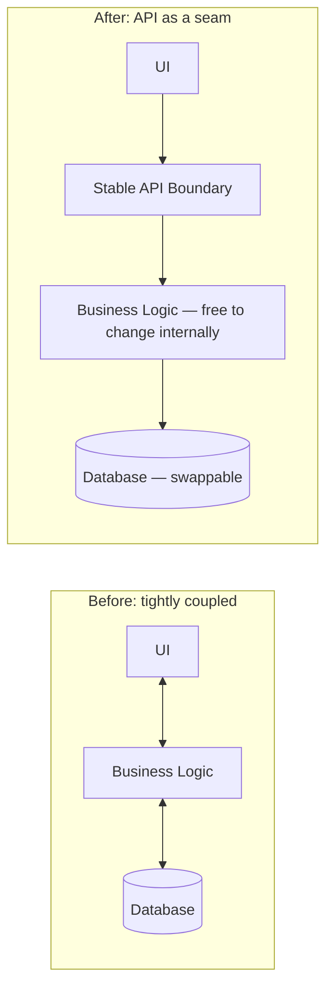

---

## Cohesion: The Property I Design Toward

Cohesion is about how tightly the things inside one module or service actually belong together. I've found a physical analogy sticks better than a textbook definition: driving a car versus flying a space shuttle. A car's dashboard is cohesive to the task of driving — pedals, wheel, a handful of gauges. A space shuttle's control panel has to be cohesive to an enormously more complex task, and it shows. The mistake I've made, and watched others make, is designing every API like it needs to be a space shuttle console "just in case," when the actual job it does is more like driving a car.

> **Note**
> High cohesion isn't just an aesthetic preference. A highly cohesive API becomes a **single, predictable point of change** — a related set of changes touches one API, not five. Low cohesion means the opposite: a single business change ripples across multiple APIs I have to remember to update in lockstep, and I will eventually forget one of them.

I learned this lesson concretely once when a "shared utils API" crept into a system I worked on — a grab-bag of convenience functions used across every domain entity. It felt efficient at first. It became a trap: a change behind the Task API quietly required a matching change in the utils API, and because there was no obvious reason the two were connected, that dependency got missed more than once, leaving the system in an inconsistent state that nobody noticed until a user reported it.

| Cohesion type | What it means | TaskFlow example |
|---|---|---|
| Functional | Everything in the module does one well-defined job | Task CRUD operations, all together |
| Sequential | Output of one part feeds directly into the next | Validate task → persist task → emit event |
| Communicational | Operations share the same input/output data | Everything operating on a single Task record |
| Coincidental | No real relationship — just bundled by convenience | The "utils API" trap I described above |

I don't obsess over classifying every module against this full taxonomy in practice, but keeping "would a new team member immediately understand why these things live together" as my working test has served me well.

---

## Coupling: Cohesion's Close Relative

Where cohesion is about what belongs *inside* a boundary, coupling is about how much one boundary depends on the details of another. A loosely coupled TaskFlow service has two properties I actively check for: components can change independently without breaking each other, and each component knows as little as possible about the internal details of the others.

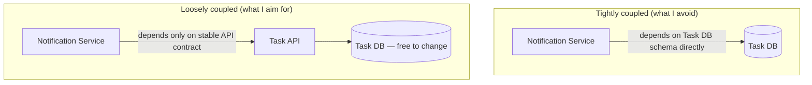

The very concrete payoff I've gotten from loose coupling: **testability**. When my Task service is loosely coupled to its consumers, I can stub or virtualize it entirely during testing — a consumer's test suite never needs to spin up a real Task service instance. When I've inherited a tightly coupled API, I've had no choice but to run the real dependency (or some heavyweight embedded substitute) just to test something that should have been a five-line mock.

> **Caution**
> I've seen "loose coupling" used as an excuse to avoid ever depending on anything, which just pushes the real coupling into duplicated logic across services instead. The goal isn't zero dependency — it's dependency on a **stable, explicit contract** rather than on another component's internal implementation details.

---

## Information Hiding: Why Both of the Above Actually Matter

Cohesion and loose coupling both serve the same underlying goal: **information hiding** — segregating the parts of my design most likely to change behind a stable interface, so a change on one side doesn't ripple outward. For an API specifically, this means exposing only business- or domain-focused operations, and never leaking my internal data model or implementation details through the wire format.

Here's a concrete TaskFlow example of getting this wrong, which I've done myself: if my Task API's response shape is a direct serialization of my database row — including internal foreign keys, soft-delete flags, and audit columns I never intended anyone outside the service to see — then swapping my datastore later means either writing brittle translation code to keep the old shape alive, or forcing every consumer to migrate in lockstep. Neither is a good place to be. Designing the API response shape as its own deliberate thing, decoupled from whatever my persistence layer happens to look like today, is what gives me the freedom to change that persistence layer later without anyone outside the service noticing or caring.

---

## Architectural End States I Weigh Against Each Other

Before I evolve anything, I want a real opinion about where I'm evolving *toward* — otherwise I'm the Cheshire Cat's Alice, not particularly caring which way I go, which means it genuinely doesn't matter which way I go. Here's how I actually weigh the options.

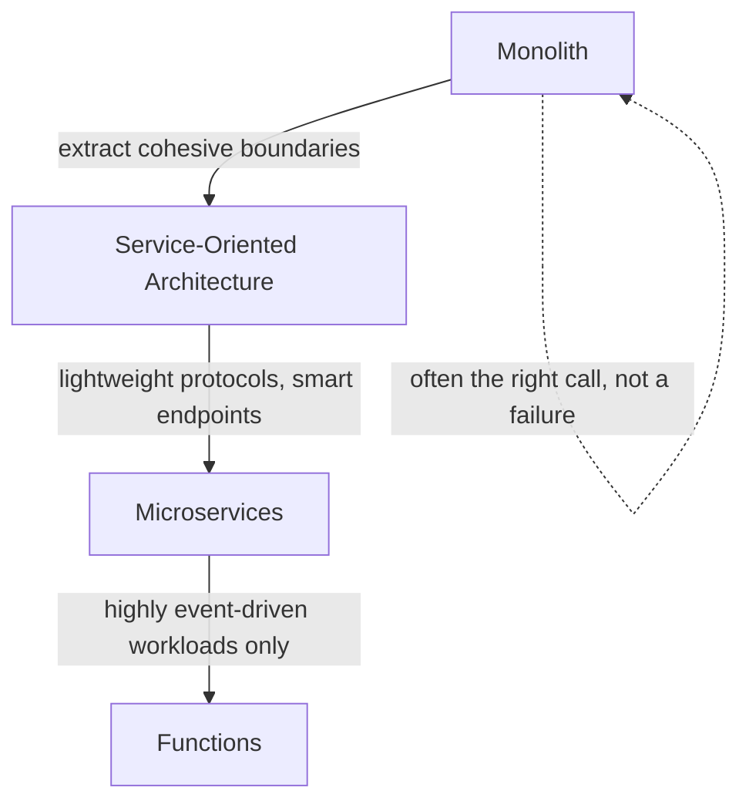

| Style | What I like about it | What tends to bite me | When I actually reach for it |
|---|---|---|---|
| **Monolith** | Fast to build, easy to reason about as a whole, one thing to deploy | Easy to accidentally couple everything to everything internally | Early-stage, finding product-market fit, small team |
| **SOA (classic)** | Services over a network, real separation | Historically dragged down by heavyweight middleware (ESBs, SOAP) doing business logic it shouldn't | Rarely my first choice today, but useful vocabulary for the pattern |
| **Microservices** | Small, independently deployable, "smart endpoints, dumb pipes" | Getting service boundaries right is genuinely hard; too many small services = death by a thousand network calls | Once I have real organizational and traffic-scale reasons to split |
| **Functions** | Great fit for highly event-driven, bursty workloads | Easy to over-decompose into pieces so fine-grained that everything has to be orchestrated together, recreating coupling at a different layer | Narrow, genuinely event-driven pipelines — not a general-purpose default |

> **Note**
> I want to push back on the reflexive idea that "monolith" is a dirty word. A monolith is just a system that runs as one deployable unit — there's nothing inherently wrong with that. What gives monoliths a bad reputation is when the word gets conflated with "big ball of mud," which is really a statement about **internal cohesion and coupling discipline**, not about deployment topology. I've seen beautifully modular monoliths and I've seen microservice systems that were a distributed ball of mud with extra network hops. The deployment topology is a much smaller factor in code quality than people assume.

Whichever end state I pick, the biggest recurring challenge across every one of them is the same: **getting service or module boundaries "correct."** I put "correct" in quotes deliberately — there's rarely one objectively right answer, and techniques from domain-driven design (context mapping, event storming) are what I actually lean on to get a defensible answer before I start extracting anything.

---

## Setting Goals Before I Touch Anything

I sort my evolutionary goals into two buckets, and I've learned to be explicit about which bucket a given piece of work falls into, because they get justified and prioritized differently.

- **Functional goals** — new features or capability requests, usually driven directly by users or the business.
- **Cross-functional (non-functional) goals** — the "ilities": maintainability, scalability, reliability. These are usually driven by engineering leadership or by a forecast of growing demand, not by a specific feature request.

I've watched teams struggle specifically because they never wrote down which category a piece of architectural work belonged to, which made it impossible to justify against feature work competing for the same sprint. Naming "we're doing this to reduce the change-failure rate on the Task service" as an explicit, catalogued cross-functional goal — rather than an implicit, unstated motivation — has made a real difference in how easily that work gets prioritized.

---

## Fitness Functions: Tested Code

Setting a goal is one thing; verifying I'm actually moving toward it, continuously, is another. This is where I use **fitness functions** — automated checks, wired into my build pipeline, that measure whether my architecture is actually holding to a property I care about, the same way a unit test measures whether a function behaves correctly.

| Category | What I'd check | A TaskFlow example |
|---|---|---|
| Code quality | Test coverage, cyclomatic complexity | Fail the build if complexity exceeds a threshold in any new function |
| Resiliency | Error rate under synthetic fault injection | Inject latency into the Notification service call and verify the Task service degrades gracefully instead of failing the whole request |
| Observability | Required metrics are actually being emitted | Fail the build if a new endpoint doesn't emit the standard RED metrics |
| Performance | Latency/throughput against a target | Fail the build if p95 latency on `POST /tasks` regresses past a threshold |
| Compliance | Business/regulatory requirements | Verify audit logging is present on any endpoint touching PII |
| Security | Known-vulnerability scanning | Fail the build if a dependency has a known CVE above a severity threshold |
| Operability | Minimum operational requirements | Fail the build if a new service is missing a health-check endpoint |

Here's a real one I wrote and tested — a fitness function enforcing my modular layering rule (controllers can call services, services can call the data-access layer, but controllers must never reach straight into the data-access layer and skip the service layer):

```python
"""
A tiny architectural fitness function.

Rule: files under controllers/ may only import from services/, never
directly from dao/. This enforces the layered module structure
(controller -> service -> dao) and fails the build if someone adds a
shortcut that skips the service layer.
"""
import ast
import pathlib


def find_forbidden_imports(root: str, forbidden_layer: str, restricted_dir: str):
    violations = []
    for path in pathlib.Path(root, restricted_dir).glob("*.py"):
        tree = ast.parse(path.read_text())
        for node in ast.walk(tree):
            if isinstance(node, ast.ImportFrom) and node.module == forbidden_layer:
                violations.append(str(path))
    return violations


def check_layering(root: str) -> list[str]:
    """Controllers must not import directly from dao."""
    return find_forbidden_imports(root, forbidden_layer="dao", restricted_dir="controllers")
```

I set up a tiny sample module tree to prove this actually catches a real violation — a well-behaved `task_controller.py` that correctly routes through the service layer, and a deliberately bad `bad_controller.py` that skips straight to the data-access layer:

```python
# controllers/task_controller.py (correct — goes through the service layer)
from services import task_service

def handle_get_task(task_id):
    return task_service.get_task(task_id)
```

```python
# controllers/bad_controller.py (a seeded violation — skips the service layer)
from dao import task_dao

def handle_bad(task_id):
    return task_dao.find_by_id(task_id)
```

And the tests:

```python
import unittest
from fitness_layering import check_layering


class LayeringFitnessFunctionTests(unittest.TestCase):
    def test_detects_controller_bypassing_service_layer(self):
        violations = check_layering(".")
        self.assertIn("controllers/bad_controller.py", violations)

    def test_well_behaved_controller_is_not_flagged(self):
        violations = check_layering(".")
        self.assertNotIn("controllers/task_controller.py", violations)

    def test_fails_build_when_any_violation_present(self):
        violations = check_layering(".")
        # This is the assertion a CI pipeline step would make
        self.assertTrue(len(violations) > 0, "expected the seeded violation to be caught")
```

Running `python3 -m unittest test_fitness_layering.py -v`:

```
test_detects_controller_bypassing_service_layer ... ok
test_fails_build_when_any_violation_present ... ok
test_well_behaved_controller_is_not_flagged ... ok

----------------------------------------------------------------------
Ran 3 tests in 0.001s

OK
```

This is a deliberately small example — a real fitness function suite would check dozens of these properties — but the shape is exactly what I use: a piece of code that inspects my actual architecture (not just unit-level behavior) and fails the build the moment someone, with good intentions, adds a "quick shortcut" that quietly erodes a property I've decided matters.

> **Note**
> I've found ADRs (Architecture Decision Records) are the natural companion to fitness functions. The fitness function enforces the rule mechanically; the ADR explains *why* the rule exists, so six months from now, when someone hits the build failure and is annoyed by it, there's a written answer to "wait, why can't I do this?" rather than just a red X in CI with no context.

---

## Decomposing a System Into Modules

I've worked on a codebase that had accumulated over two decades of undisciplined growth — the kind where fixing one bug reliably introduced two more, because nothing had a clear boundary. What I learned from that experience, directly: the problem was never that it was "a monolith." The problem was the total absence of module boundaries inside it.

A module, in the sense I mean here, is a boundary drawn at a scale larger than an individual class or method — a deliberate architectural partition, not just whatever a language's package system happens to give me for free. My default layering, and the one I tested above, looks like this:

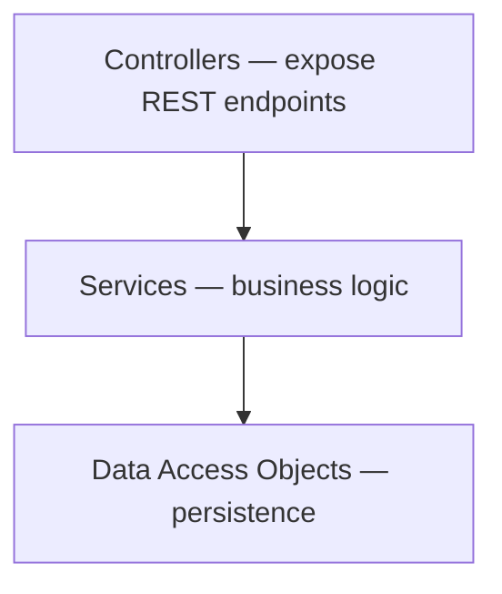

Each layer exposes a clear interface to the layer above it, and — this is the part I actually enforce — dependencies flow in one direction only. I've found the single most valuable piece of advice for defining a new module boundary comes down to this: expose as little as possible from the start. Once something is part of a module's public interface, walking it back is a genuinely painful, often multi-team effort. Keeping something private now costs nothing and leaves me free to expose it later if a real need shows up; exposing it prematurely is a decision I can't cheaply undo.

I've watched this pay off directly: a DAO module, built cleanly with a real interface hiding its internals, later became the shared foundation when three separate pieces of business logic were split out into independent services. Because the module boundary was already clean, that split was mechanical rather than a rewrite.

---

## APIs as Seams for Extension

I borrow the term "seam" from Michael Feathers' work on legacy code: a seam is any point where I can alter behavior without editing the code at that exact point — usually by injecting a different collaborator through an interface. Seams are what make legacy code testable, and they're also exactly where I look when deciding where to draw a new API boundary during a decomposition.

His recipe for working with existing code that doesn't already have good seams (or tests) is one I follow closely:

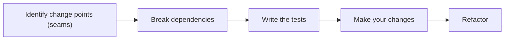

The detail I want to stress: I write the tests **before** making the change I actually want to make, not after. It's tempting to skip straight to the refactor when I'm confident about what I want to do — but the whole point of this sequence is that the tests are what let me *prove* the refactor didn't change behavior, and I've been burned enough times by "obviously safe" refactors that weren't.

When a seam I'm working with is genuinely used in more than one place across the codebase — not just a single class boundary — that's my signal it might deserve to become a real interservice API rather than just an in-process interface. I don't jump straight to a network boundary for every seam; I only promote one to a full API once there's a real cross-service reuse case behind it.

---

## Finding Where to Actually Apply Pressure

Not every part of a system is equally worth my attention, and it's not always obvious upfront which parts are. I look for a specific set of signals to find genuine leverage points rather than guessing:

| Signal | What it tells me |
|---|---|
| High change-failure rate for a subsystem | Something there is fragile or poorly tested |
| High volume of support tickets tied to one area | Real user-facing pain, probably worth prioritizing |
| High code churn in one part of the codebase | Frequently changing code is often where the real design pressure lives |
| High cyclomatic complexity (via static analysis) | A concrete, measurable proxy for "this is hard to reason about" |
| Low team confidence about estimating changes there | A qualitative signal that's easy to skip but genuinely valuable — ask the team directly |

I want to flag that last one specifically, because it's the one I most often forget to actually collect: just asking the engineers who work in a given area "how confident are you estimating a change here?" surfaces real signal that static analysis tools completely miss.

---

## The Strangler Fig, Facade, and Adapter Patterns

### Strangler fig

This is the pattern I reach for most often when migrating TaskFlow's functionality piece by piece. The name comes from a real botanical phenomenon — a fig that grows around a host tree, gradually taking over its structural role, sometimes eventually replacing it entirely.

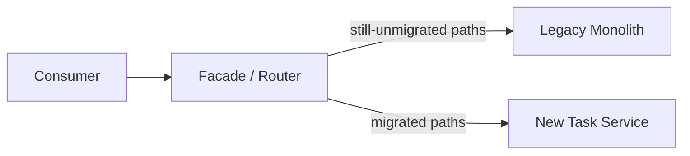

I introduce a routing layer in front of both the old and new implementations, and gradually shift traffic — path by path, or user by user via a feature flag — from the legacy implementation to the new one, until eventually the legacy path handles nothing and can be safely deleted.

> **Caution**
> The proxy or router in a strangler-fig migration has to stay dumb. The moment I let real business logic creep into that routing layer — "just a small transformation, it's easier here" — I've made the strangler fig itself something that's hard to remove at the end of the migration, which defeats the entire point of the pattern. I also keep close watch on data coherency between the legacy and new stores while both are live side by side; that's usually the trickiest, least glamorous part of the whole migration.

### Facade and adapter

Both of these get in the way on purpose — the difference is how much work they do while doing it. A **facade** is relatively simple: it routes and hides, but doesn't transform. An **adapter** goes further, actually converting between two different representations — a classic example I've dealt with directly is converting a legacy SOAP-RPC call into a modern REST call at the boundary.

| Pattern | What it does | Complexity | TaskFlow example |
|---|---|---|---|
| Facade | Routes/hides, no transformation | Lower | The strangler-fig router directing traffic to old vs. new Task service |
| Adapter | Actively transforms between representations | Higher | A gRPC-to-REST gateway in front of an internal gRPC-only service |

> **Note**
> I keep a specific warning to myself here: the moment my "simple gateway routing" starts quietly doing real transformation work, I've crossed from facade into adapter territory without deciding to, and the coupling cost goes up accordingly. I try to notice that line being crossed and ask explicitly whether I actually meant to cross it.

---

## The API Layer Cake — and Why I Avoid It

I want to specifically call out a pattern I've seen recommended in enterprise contexts and now actively avoid: strict horizontal layering across an entire organization's API surface — a presentation-facing layer, an application/orchestration layer, a domain layer, a data layer — where every single request has to flow down through every layer and back up.

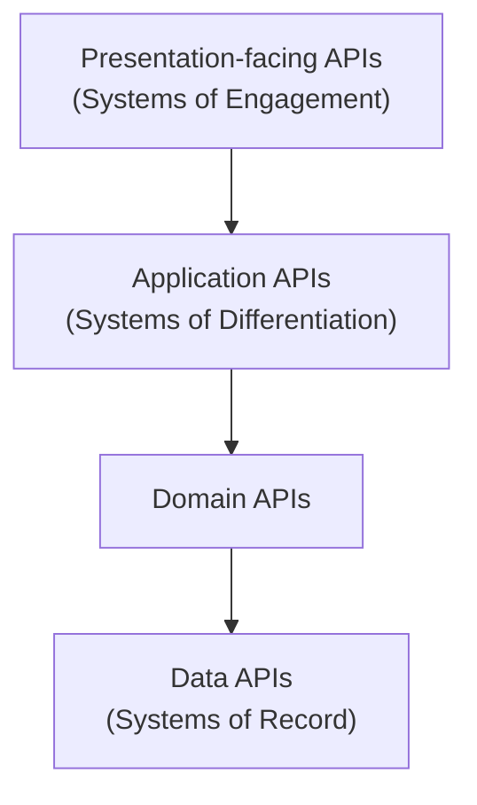

This looks tidy on a slide. In practice, I've watched it produce exactly the failure mode its designers were trying to avoid: because touching an end-to-end slice of business functionality means touching every layer, teams start taking shortcuts — duplicating logic to avoid an extra hop, or letting the presentation layer reach straight down to the data layer and quietly bypassing the layers in between. The strict layering, meant to enforce discipline, ends up encouraging its own violation.

> **Caution**
> I generally recommend avoiding this pattern as an organization-wide mandate. Cohesion within any one layer's slice looks good in isolation, but it comes at the direct expense of high coupling across layers for any single unit of business value — which is, in my experience, the exact opposite of what I actually want an evolving architecture to optimize for.

---

# Part 2 — Moving to the Cloud

## The Six Rs of Cloud Migration

When TaskFlow's owners eventually decide to stop running their own data center, I don't treat "move to the cloud" as one monolithic decision — I break it into a per-component choice, using six named strategies:

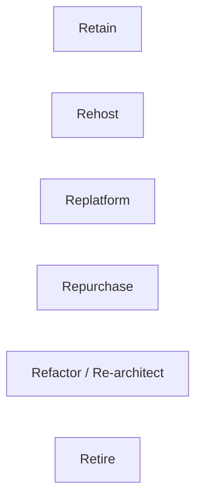

| Strategy | What it actually means | Effort | When I reach for it |
|---|---|---|---|
| **Retain** | Do nothing, for now — a conscious decision, not neglect | Lowest | The migration ROI genuinely isn't there yet; write down why in an ADR |
| **Rehost** ("lift and shift") | Move as-is, no re-architecture | Low | Time pressure, or a component with no obvious cloud-native win available |
| **Replatform** ("lift-tinker-and-shift") | Move, plus swap in compatible managed services | Medium | My default when there's an easy managed-service win (e.g., a compatible database) |
| **Repurchase** | Replace with a SaaS product entirely | Varies | The functionality is genuinely commodity (email sending, for instance) |
| **Refactor/Re-architect** | Rebuild to be cloud-native | Highest | Strong business need for scale/features the current architecture can't support |
| **Retire** | Just get rid of it | Lowest (once decided) | Found during the migration — surprisingly common to find dead components nobody's using |

I treat this as a genuinely per-component decision rather than a single organization-wide choice — it's entirely normal, in my experience, for one migration project to end up applying four or five of these six strategies across different parts of the same system, and I don't consider that inconsistent; I consider it the honest result of actually evaluating each component on its own merits instead of forcing a single template onto everything.

> **Caution**
> "Retain" is a real, valid strategy — not a failure to make a decision. I've seen architects feel obligated to migrate every single component just because a migration project is underway. Writing down explicitly *why* something is staying put, with an ADR, has saved me from having the same "why haven't we moved this yet" conversation repeatedly with different stakeholders over the following year.

---

## Refactor/Re-architect: The Expensive One, Done Right

I want to spend more time on this option specifically, because it's the one I've seen chosen for the wrong reasons more often than any of the other five. Refactor/re-architect means rebuilding how a system works internally — typically to take real advantage of cloud-native patterns — while deliberately preserving its external behavior. The core functionality a consumer sees shouldn't change; how it's achieved underneath absolutely does.

The trap I've watched teams fall into: reaching for a full re-architecture because it's the most technically interesting option, not because the business case actually justifies its cost. This is, in my experience, the most expensive of the six Rs by a wide margin — not just in engineering time, but in the organizational coordination it demands. I only reach for it when I can point to a specific, concrete limitation of the current architecture that's actually blocking something the business needs — a scaling ceiling I've genuinely hit, a feature that's architecturally impossible without the rebuild, not just "this would be nicer."

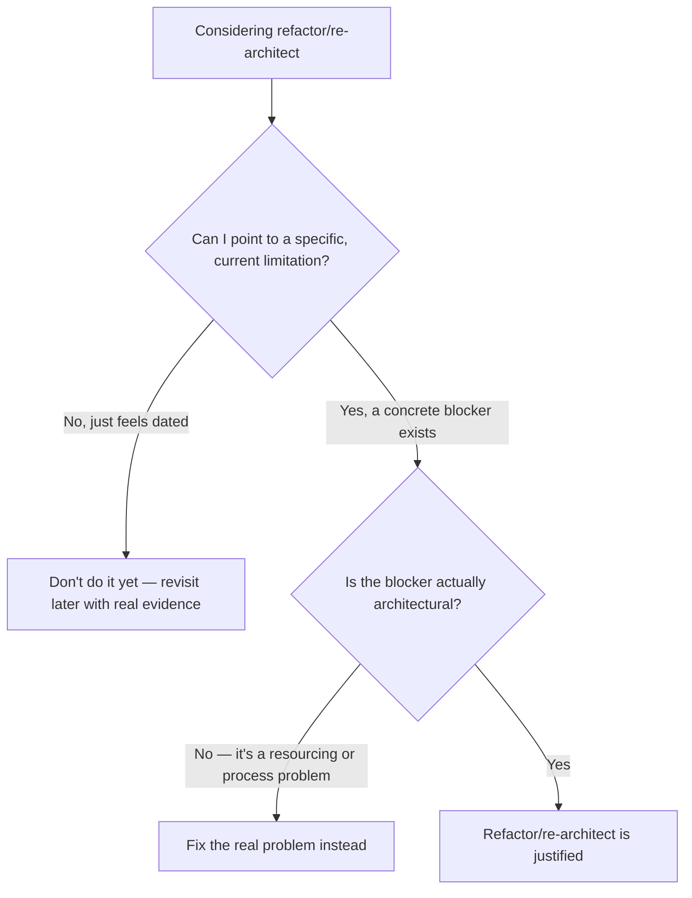

For TaskFlow specifically, I noted earlier that this step was effectively already behind me — I'd extracted the Task service from the monolith during an earlier evolutionary pass, well before the cloud migration even entered the picture. That ordering matters and I want to call it out explicitly: **I re-architect first, on infrastructure I already understand, and replatform second, once the application-level design is settled.** Doing both simultaneously — rebuilding my service boundaries at the same moment I'm also learning a new cloud platform's operational quirks — means I can no longer tell which of the two changes caused a given problem when something breaks. Separating them gives me a much smaller, more diagnosable blast radius for any given change.

> **Caution**
> I've specifically avoided re-architecting and replatforming in the same change window more than once, after learning the hard way how difficult it becomes to isolate a root cause when both the internal design and the underlying infrastructure shift at once. If an incident shows up during a combined change, I genuinely can't tell my team with confidence which half of the change is responsible — and that uncertainty costs far more time during the incident than doing the two changes sequentially would have cost up front.

---

## Repurchase: The Option I Almost Forget Exists

Of all six Rs, this is the one I catch myself forgetting to seriously evaluate, because as an engineer my instinct defaults to building rather than buying. Repurchase means replacing a piece of functionality outright with a commercial or SaaS product rather than migrating my own implementation at all.

The honest test I apply: is this piece of functionality actually part of what makes TaskFlow *TaskFlow*, or is it commodity infrastructure that a dozen vendors already do well? Sending transactional emails, handling payment processing, managing customer support tickets — none of that is my actual product. I don't gain anything by continuing to operate a bespoke, self-hosted version of something that's genuinely solved, mature, off-the-shelf technology elsewhere.

| Question I ask | If the answer is "commodity" | If the answer is "core to my product" |
|---|---|---|
| Would a competitor building the same feature look basically identical? | Strong repurchase candidate | Not a repurchase candidate |
| Does this differentiate TaskFlow from alternatives? | No — repurchase | Yes — keep building it myself |
| Is there mature, well-adopted SaaS tooling already solving this? | Yes — repurchase | Often no, or nothing domain-specific enough |

For TaskFlow's actual task-management domain, there's no credible off-the-shelf replacement — that's the product itself, so repurchase doesn't apply to the core service. But I've applied this option plenty of times to the supporting cast: outsourcing email delivery, authentication (an identity provider rather than a hand-rolled one, which I covered in an earlier post), and observability tooling, all as genuine repurchase decisions rather than things I built myself just because I technically could.

---

## Retire: The Pleasant Surprise

I called this the "lowest effort once decided" option earlier, and I want to explain why I've come to actively enjoy finding retire candidates during a migration, rather than treating them as an afterthought. Every large migration I've been part of has turned up at least one component that, on inspection, nobody actually uses anymore — an old internal reporting endpoint, a beta feature flag nobody remembered to remove, an integration with a partner who churned two years ago.

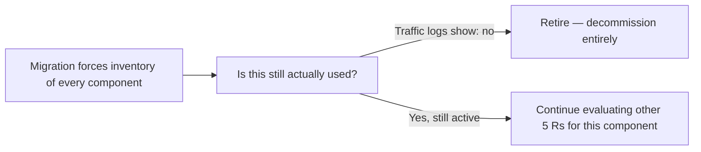

I treat a migration project as a forced, comprehensive inventory of everything I actually run — which is valuable independent of the migration itself. I check real traffic logs and access patterns, not institutional memory, before declaring something a retire candidate, because "nobody uses this anymore" is a claim I've been wrong about before, usually because some internal batch job nobody remembered was quietly still calling it once a month.

> **Note**
> I keep a specific discipline here: before I retire anything, I check its actual traffic over a period long enough to catch infrequent-but-real callers — a monthly report generator, a quarterly reconciliation job — not just a quick glance at last week's dashboard. A component that looks unused on a seven-day window can turn out to be very much used on a ninety-day one.

---

## Case Study: Replatforming TaskFlow's Task Service

For TaskFlow, I'd walk through each of the six Rs against the Task service specifically:

- **Retain** — not viable; the whole point is getting off self-managed infrastructure eventually.
- **Rehost** — viable, but leaves value on the table; I'd rather not "lift and shift" my own database instance if a compatible managed equivalent exists.
- **Replatform** — this is my pick. I move the Task service's compute to the cloud and swap my self-managed database for a protocol-compatible managed equivalent, without touching the service's actual code.
- **Repurchase** — not applicable; there's no equivalent commodity SaaS product for a bespoke task-management domain like this.
- **Refactor/Re-architect** — already effectively done; I extracted the Task service from the monolith earlier in this journey, so a fresh re-architecture isn't needed right now.
- **Retire** — not applicable to this specific service, though I've genuinely found forgotten, unused components during past migrations that qualified.

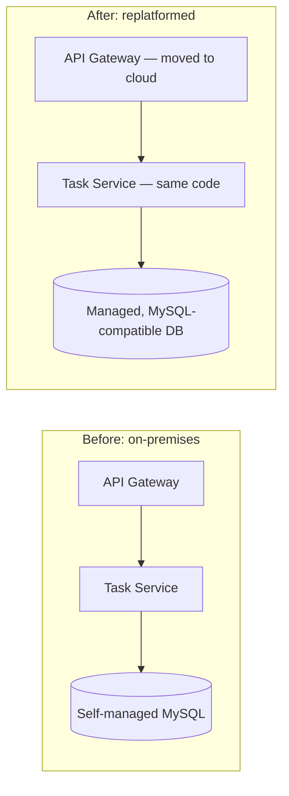

I move the gateway alongside the service specifically because it gives me a controlled way to gradually shift traffic from on-premises to cloud, rather than an all-at-once cutover.

---

## Starting at the Edge and Working Inward

My actual sequencing for an incremental migration: **the gateway moves first**, often paired with just one service, so I can stand up and validate a genuinely isolated proof-of-concept cloud environment before I risk disrupting anything live.

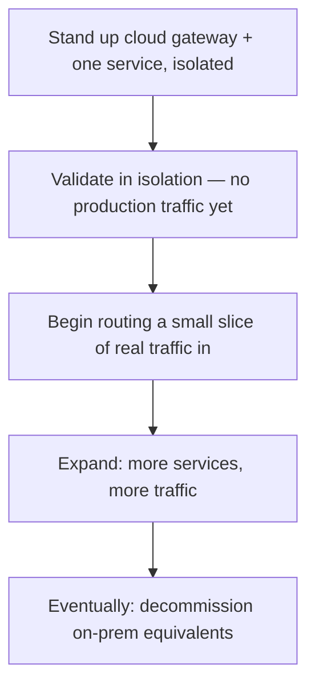

> **Note**
> I don't underestimate how much of a paradigm shift cloud infrastructure actually is compared to on-premises, even for an experienced team. Assumptions I never had to think about on-prem — network reliability between components, storage performance characteristics, even basic things like how DNS resolution behaves — genuinely don't transfer cleanly. I budget real learning time for this rather than assuming the migration is "just infrastructure."

Once real traffic has to cross between my on-prem and cloud environments during the migration window, I have real options for the routing itself — a simple HTTP redirect for a handful of routes, VPN peering for more complex cases, or a multicluster service mesh if I want a more unified, ongoing bridge. Which one I pick depends heavily on how many routes are crossing the boundary and for how long I expect that hybrid state to last.

---

## Zonal Architecture: Where I Started

Before I can talk meaningfully about zero trust, I want to be honest about the model most systems I've worked on actually started from: **zonal architecture** — segmenting infrastructure into nested zones, each with its own trust level, separated by security perimeters.

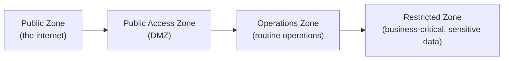

The mental model here is castle-and-moat: an attacker has the hardest time at the outer perimeter, but once inside, there's an implicit, growing trust extended to anything already "inside the walls." I understand why this model became dominant, and it's genuinely not a bad approach on its own — but the specific assumption it leans on ("this traffic originated from inside my network, so I trust it more") is exactly the assumption that stops holding up once I'm running in the cloud, where geographic and network locality get abstracted away, and where a compromised dependency deep in my build pipeline can plant something that looks, from the network's point of view, like legitimate internal traffic from the very first request it makes.

---

## Zero Trust: Where I'm Heading

Zero trust flips the zonal model's core assumption on its head: **never trust, always verify** — regardless of where a request is coming from, even if it's "inside" my network, and even if it was already verified once earlier in the same session.

I keep eight guiding principles in mind when I'm actually implementing this:

1. Know my architecture — every user, device, service, and data flow
2. Know my identities — for users, services, and devices alike
3. Assess device and service health continuously, not just at first connection
4. Use policy — not implicit network location — to authorize every request
5. Authenticate and authorize everywhere, not just at the edge
6. Monitor everything related to access, comprehensively
7. Don't trust *any* network, including my own internal one
8. Design and choose services with zero trust as a first-class requirement, not an afterthought

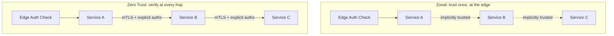

A service mesh — which I covered in an earlier post — becomes genuinely central here, not incidental. It gives me a homogeneous way to assert service identity (via certificates), enforce mTLS between every internal hop, and consistently monitor traffic across the whole platform. Combined with strong authentication at the gateway (OAuth2, as I covered in another earlier post), this gets me most of the way to the eight principles above — with one important gap I have to close separately.

---

## Locking Down the Platform Layer: Tested Network Policy Logic

The gap: a service mesh's sidecar model couples the proxy tightly to my application, but it makes **no assertion whatsoever about the platform underneath** — the node, the container runtime, the kernel. "Don't trust any network, including your own" has to extend below the mesh, down to the platform itself, or I've only solved half the problem.

Kubernetes NetworkPolicies are the tool I reach for here. My starting posture, deliberately, is deny-all:

```yaml
apiVersion: networking.k8s.io/v1
kind: NetworkPolicy
metadata:
  name: default-deny-all
spec:
  podSelector: {}
  policyTypes:
    - Ingress
    - Egress
```

From that fully locked-down baseline, I open up only the specific paths I actually need. Since my service mesh relies on DNS to resolve service names, I first need to allow that:

```yaml
apiVersion: networking.k8s.io/v1
kind: NetworkPolicy
metadata:
  name: allow-dns
spec:
  podSelector:
    matchLabels:
      app: task-service
  policyTypes:
    - Egress
  egress:
    - ports:
        - port: 53
          protocol: UDP
```

And then the actual application traffic I want to permit — in this case, letting the Task service reach the Notification service's namespace specifically:

```yaml
apiVersion: networking.k8s.io/v1
kind: NetworkPolicy
metadata:
  name: allow-task-to-notification
spec:
  podSelector:
    matchLabels:
      app: task-service
  policyTypes:
    - Egress
  egress:
    - to:
        - namespaceSelector:
            matchLabels:
              kubernetes.io/metadata.name: notification
```

Because getting a network policy allow-list right by hand is exactly the kind of thing I get subtly wrong under time pressure, I write a small check I can run against my actual policy definitions before applying them — verifying that every service I expect to be reachable actually has a corresponding explicit allow rule, and that nothing else does:

```python
def build_allowed_pairs(policies: list[dict]) -> set[tuple[str, str]]:
    """Extract (source_app_label, destination_namespace) pairs that are
    explicitly permitted by a list of NetworkPolicy-shaped dicts."""
    allowed = set()
    for policy in policies:
        source = policy["spec"]["podSelector"]["matchLabels"]["app"]
        for rule in policy["spec"].get("egress", []):
            for target in rule.get("to", []):
                ns_selector = target.get("namespaceSelector", {})
                dest_ns = ns_selector.get("matchLabels", {}).get(
                    "kubernetes.io/metadata.name"
                )
                if dest_ns:
                    allowed.add((source, dest_ns))
    return allowed


def is_call_permitted(policies: list[dict], source_app: str, dest_namespace: str) -> bool:
    return (source_app, dest_namespace) in build_allowed_pairs(policies)
```

And the tests, using policy dicts shaped like the YAML above:

```python
import unittest
from network_policy_check import is_call_permitted

TASK_TO_NOTIFICATION_POLICY = {
    "spec": {
        "podSelector": {"matchLabels": {"app": "task-service"}},
        "egress": [
            {
                "to": [
                    {
                        "namespaceSelector": {
                            "matchLabels": {"kubernetes.io/metadata.name": "notification"}
                        }
                    }
                ]
            }
        ],
    }
}


class NetworkPolicyCheckTests(unittest.TestCase):
    def test_explicitly_allowed_call_is_permitted(self):
        self.assertTrue(
            is_call_permitted([TASK_TO_NOTIFICATION_POLICY], "task-service", "notification")
        )

    def test_call_to_undeclared_namespace_is_denied(self):
        self.assertFalse(
            is_call_permitted([TASK_TO_NOTIFICATION_POLICY], "task-service", "billing")
        )

    def test_unrelated_source_app_is_denied(self):
        self.assertFalse(
            is_call_permitted([TASK_TO_NOTIFICATION_POLICY], "some-other-service", "notification")
        )

    def test_no_policies_means_nothing_is_permitted(self):
        self.assertFalse(is_call_permitted([], "task-service", "notification"))
```

Running `python3 -m unittest test_network_policy_check.py -v`:

```
test_call_to_undeclared_namespace_is_denied ... ok
test_explicitly_allowed_call_is_permitted ... ok
test_no_policies_means_nothing_is_permitted ... ok
test_unrelated_source_app_is_denied ... ok

----------------------------------------------------------------------
Ran 4 tests in 0.001s

OK
```

The `test_no_policies_means_nothing_is_permitted` case is the one I actually care most about — it's checking that my deny-all default genuinely holds when no explicit policy exists, rather than silently defaulting to "allowed." That's the exact property a zero-trust posture depends on, and it's cheap enough to verify automatically that I have no excuse not to.

> **Note**
> Every routing rule I define in my service mesh needs a matching allow rule in my network policy layer, or the mesh will happily resolve a service's location via DNS while the actual connection gets silently dropped at the platform level. I've been confused by this exact mismatch before — the mesh telling me routing looks fine while the platform quietly blocks the underlying packets — and now I treat "does my mesh config have a matching network policy" as something worth checking mechanically, not just remembering.

A pattern I've seen emerging, and one I keep an eye on: bridging multiple clusters — one on-prem, one in the cloud — by peering service meshes together, bringing both under a shared control plane. Done well, this gives me a single, homogeneous security model spanning the hybrid state during a migration, rather than maintaining two entirely different security postures simultaneously.

---

## An FAQ I Keep Getting Asked

**Do I need to pick one end-state architecture (monolith, SOA, microservices, functions) and commit to it for the whole system?**
No, and I'd actively push back on anyone insisting I do. TaskFlow, right now, is genuinely a hybrid — a shrinking legacy monolith, a couple of true microservices, and I could easily see a narrow, genuinely event-driven slice of functionality (say, generating scheduled digest notifications) landing well as a function-based component down the line. I pick the end state per component, based on that component's actual traffic pattern and team ownership, not as one sweeping decision for the whole system.

**How do I know when a module boundary is "right"?**
Honestly, I don't know for certain until it's been through at least one real change under pressure. My best leading indicator beforehand is asking whether a plausible near-term business change would touch one module or several — if I can picture a realistic feature request that forces edits across three "separate" modules simultaneously, that's a strong signal the boundary is drawn in the wrong place, even before I've felt the pain directly.

**Isn't "zero trust" just a marketing term at this point?**
I had that reaction too, initially. What changed my mind was actually implementing the eight principles I listed above and noticing they're genuinely falsifiable, testable properties of a system — "does every hop authenticate, not just the edge" is a yes/no question I can verify, not a vibe. The term gets used loosely in marketing, sure, but the underlying architectural principles it names are concrete enough to hold myself accountable to.

**What's the biggest mistake you've made in a cloud migration specifically?**
Underestimating latency introduced by crossing a network boundary I didn't used to have. A call that was effectively free — same process, same machine — before a migration can become meaningfully slow once it's crossing a real network hop, and if that call sits on a latency-sensitive path, the SLA impact can be a genuine surprise if I haven't measured it beforehand. I now explicitly map out which calls will newly cross a network boundary as part of any migration plan, before I move anything, specifically so this isn't a surprise I discover in production.

---

## Communicating "Retain" and Deprecation Decisions

I want to circle back to something I mentioned only briefly earlier, because I've learned it deserves more weight than a passing note: deciding *not* to migrate something right now isn't the end of the conversation — it's the start of a communication obligation. If a business unit is winding down on a known date, if a piece of software is heading toward end-of-life, or if a license underpinning a datastore is set to expire, that date needs to be communicated as an explicit deprecation warning, not left implicit in an internal ADR nobody outside my team reads.

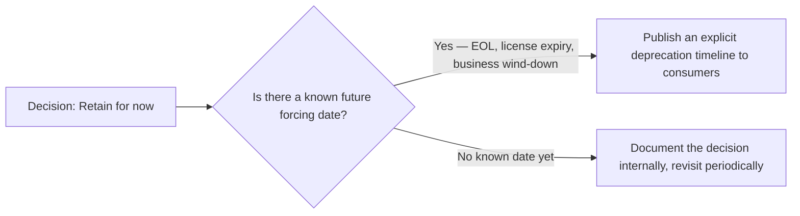

I've specifically checked SLAs and existing contracts before finalizing a retain decision, because there's often a contractually required deprecation notice period baked into an agreement I'd otherwise overlook — discovering that requirement *after* announcing a shorter timeline internally is an avoidable, embarrassing scramble.

> **Caution**
> A "retain" decision that never gets revisited quietly becomes permanent by default, regardless of whether that was ever the actual intent. I set a real calendar reminder to revisit any retain decision, not just a mental note — mental notes about deferred architecture work have a very poor survival rate against the next six months of feature deadlines.

---

# Part 3 — Lessons Beyond the Architecture Diagram

## Conway's Law, Applied to My Own Team's Structure

I want to push a bit further on Conway's Law than a single observation, because it's shaped how I actually structure teams now, not just how I diagnose problems after the fact. If I genuinely want TaskFlow's Task and Notification services to stay cleanly separated, independently deployable, and loosely coupled, the team structure around them has to reflect that — separate teams (or at minimum, clearly separated ownership within one team) with their own release cadence, rather than one team casually straddling both and unconsciously introducing shortcuts between them because, from inside that team, the "services" don't feel like a real boundary at all.

This cuts the other way too, and I think this direction is underappreciated: if I deliberately want two pieces of functionality to stay *tightly* coupled — genuinely, by design, because they always change together and splitting them would be pure overhead — the right move might be keeping one team responsible for both, rather than forcing an artificial team split that Conway's Law will then quietly "fix" by growing back the coupling anyway, just with worse communication and more friction between the humans involved.

| What I want architecturally | Team structure that reinforces it |
|---|---|
| Task and Notification stay loosely coupled, independently deployable | Separate team ownership, separate release cadence |
| Some internal library genuinely should stay a single shared thing | One team owns it, with a clear contribution process for others |
| A "utils API" temptation is a warning sign | If multiple teams keep contributing unrelated grab-bag functions to one place, that's Conway's Law telling me my true team boundaries don't match my intended architecture |

I've found reading the team structure I already have, honestly, is often a faster way to predict where an architecture will actually drift than reading the architecture diagram itself — the diagram shows intent, the org chart shows what's actually going to happen under deadline pressure.

---

## Conway's Law: My System Looks Like My Org Chart

I can't cover evolutionary architecture honestly without naming this directly: **any system I design ends up structurally mirroring the communication structure of the organization that designed it.** This isn't a cute observation — I've watched it play out literally. Four teams working on a piece of shared functionality tends to produce four layers of API, whether or not that was anyone's actual design intent.

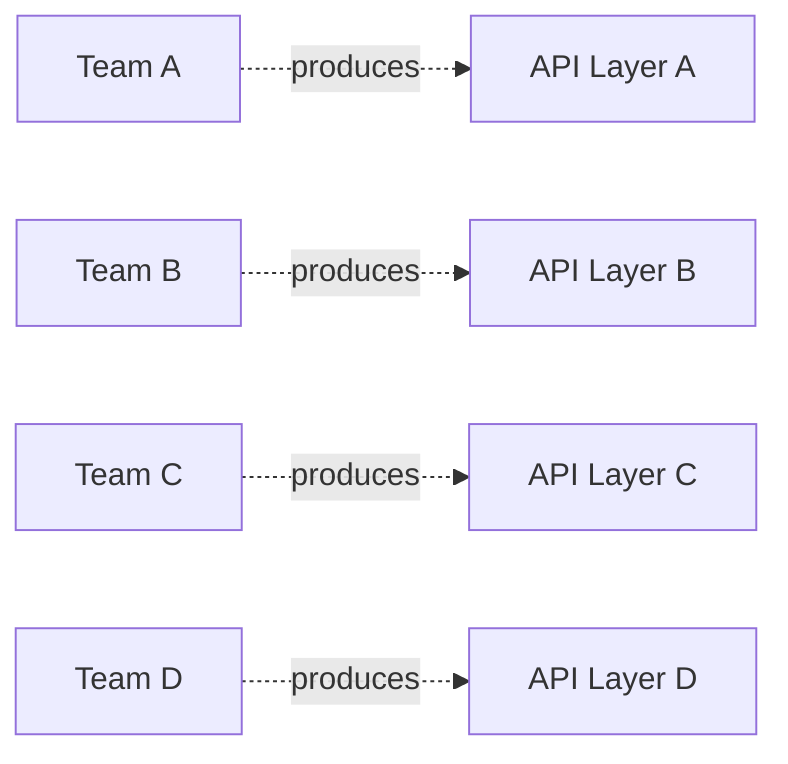

I don't have a tidy fix for this — it's genuinely an organizational design problem, not an architecture one, and I don't think I can architect my way around it. What I've taken from this is a healthy dose of humility: if I'm proposing a target architecture that fundamentally doesn't match how my organization actually communicates and is structured, I should expect real, sustained friction getting there, no matter how sound the technical design is on paper.

---

## Type 1 vs. Type 2 Decisions

I lean on a distinction popularized by Amazon's Jeff Bezos: **Type 1 decisions** are hard or impossible to reverse — walking through a door that locks behind me. **Type 2 decisions** are cheap to reverse — walking through a door I can walk right back out of if I don't like what's on the other side.

| | Type 1 | Type 2 |
|---|---|---|
| Reversibility | Hard or impossible | Easy, low cost |
| Process I use | Careful, deliberate, involves more stakeholders | Fast, move quickly, learn from the outcome |
| TaskFlow example | Choosing my core API gateway or service mesh platform | Adjusting a canary rollout's traffic-split percentage |

The mistake I actively watch for — in myself and in teams I've worked with — is applying Type 1 rigor to a Type 2 decision (grinding a reversible choice to a halt with excessive process) or, worse, treating a genuinely Type 1 decision with Type 2 casualness. Choosing my organization's core API gateway or service mesh technology is, in my experience, almost always Type 1 — the switching cost once dozens of teams have integrated against it is enormous — and I make sure the decision-making process actually reflects that weight, even when there's organizational pressure to "just pick something and move fast."

---

## What I'm Keeping an Eye On

A few things I don't consider settled yet, but that I'm actively watching because I think they'll matter more to how I build TaskFlow-shaped systems over the next few years:

- **Async API standards.** REST has OpenAPI as its shared specification language; asynchronous, event-driven APIs (built on brokers like Kafka, or direct client-broker patterns) have historically lacked an equivalent. A maturing specification standard for describing asynchronous APIs the way OpenAPI describes REST ones is something I think closes a real gap.
- **HTTP/3.** Built on QUIC over UDP instead of TCP, specifically aimed at fixing head-of-line blocking that HTTP/2 still suffers from. I haven't needed to force this yet, but I watch adoption numbers because it has real implications for anything sitting at my edge — ingress proxies and gateways specifically need to support it before I can take advantage of it.
- **Platform-integrated service mesh.** I see early signs that service mesh functionality is drifting toward being a built-in part of the underlying platform (the way most organizations don't replace their cloud vendor's container runtime or networking plugin) rather than something bolted on separately. If that trend holds, the practical decision shifts from "which mesh product do I adopt" to "which platform do I adopt, and what mesh does it bundle."

I don't treat any of these as settled enough to bet a production architecture on today, but they're each specific enough, with enough real momentum behind them, that I check back in on their maturity periodically rather than assuming today's landscape is permanent.

---

## How I Actually Keep Learning

A few concrete habits, not just vague "stay curious" advice:

- **I keep re-reading the fundamentals**, not just chasing new frameworks. Cohesion, coupling, and information hiding show up in conference talks and blog posts constantly, in new packaging — and every time, I find myself understanding some nuance a little better than I did the last time I encountered it.
- **I read broadly and regularly** — industry news aggregators, a handful of blogs I trust, technology radars and trend reports from a few different sources so I can cross-check for vendor bias rather than trusting a single source's framing.
- **I still write code.** Staying hands-on, even occasionally, is what keeps my sense of the actual friction developers face honest — I've watched architects lose touch with real day-to-day toil (container build workflows are the example I've seen bite people most often) simply by drifting too far from the keyboard.
- **I teach, deliberately.** Writing a post like this one is, honestly, one of the best ways I've found to discover the gaps in my own understanding — I don't fully know whether I understand something until I try to explain it clearly enough for someone else to follow.
- **I revisit old decisions on purpose.** Once or twice a year, I go back through my own team's ADRs and ask whether the reasoning still holds. Technology landscapes shift, and a decision that was clearly correct eighteen months ago sometimes deserves an honest second look rather than quiet, permanent inertia just because nobody's forced the conversation.

---

## Closing Thoughts

If I compress this entire post — evolution, cloud migration, and the organizational lessons around both — into one idea, it's this: **an API is the most reliable seam I have for making change safe**, whether that change is extracting a service from a monolith, moving a workload to the cloud, or shifting a whole organization's trust model from zonal to zero trust. Every pattern in this post — strangler fig, facades, fitness functions, deny-all network policies — is really the same underlying move applied in a different place: draw a stable, well-defined boundary, verify continuously that the boundary is actually holding, and let everything behind it change freely.

None of what I've described here is a single big decision made once. TaskFlow didn't go from monolith to cloud-native, zero-trust microservices in one leap, and I'd be skeptical of any real system that claims it did. It was dozens of small, individually reversible steps, each one validated before the next began — a canary here, a fitness function there, one service replatformed at a time. That incremental discipline, more than any specific technology choice in this post, is the thing I'd actually want a reader to take away and apply starting with whatever system they're working on today.

If I had to leave you with one practical next step: pick the single most tightly coupled boundary in your own system — the one everyone on the team already jokes about, the one nobody wants to touch — and just draw the API around it on paper first, before writing any code. Decide what stays hidden behind that boundary and what has to be exposed. In my experience, that fifteen-minute exercise alone surfaces most of the real design questions a full migration will eventually force you to answer anyway, at a fraction of the cost of discovering them mid-refactor.
