# Operating and Securing APIs: Releases, Threat Modeling, and Auth — What I've Actually Learned

Designing an API well and testing it thoroughly gets you maybe two-thirds of the way to something I'd trust in production. The remaining third — how I release changes without downtime, how I think about what could go wrong from an attacker's point of view, and how I actually verify who's calling my API and what they're allowed to do — is where I've spent most of my hard-won lessons. This post pulls all three of those threads together, using my running **TaskFlow** example (a Task service and a Notification service, sitting behind an API gateway, gradually replacing a legacy monolith).

Every code sample below is real, tested code — I'll show you the test output, not just the snippet.

> **Note**
> This is a long post, split into three parts: releasing APIs safely, threat modeling them, and then authenticating and authorizing the people and systems that call them. Feel free to jump to whichever part you need via the table of contents.

## Table of Contents

**Part 1 — Deploying and Releasing**
1. [Deployment Is Not Release](#deployment-is-not-release)
2. [Feature Flags: My First Tool for Separating the Two](#feature-flags-my-first-tool-for-separating-the-two)
3. [The API Lifecycle: Planned, Beta, Live, Deprecated, Retired](#the-api-lifecycle-planned-beta-live-deprecated-retired)
4. [Mapping Semantic Versioning Onto Release Strategy](#mapping-semantic-versioning-onto-release-strategy)
5. [Release Strategies: Canary, Traffic Mirroring, Blue-Green](#release-strategies-canary-traffic-mirroring-blue-green)
6. [Automating Rollouts With a Progressive Delivery Tool](#automating-rollouts-with-a-progressive-delivery-tool)
7. [Observability: The Three Pillars](#observability-the-three-pillars)
8. [Reading the Signals Before They Become Incidents](#reading-the-signals-before-they-become-incidents)
9. [Application-Level Gotchas: Caching, Headers, Logging](#application-level-gotchas-caching-headers-logging)
10. [Opinionated Platforms: The Paved Path](#opinionated-platforms-the-paved-path)

**Part 2 — Threat Modeling**
11. [Why I Threat Model Instead of Just "Being Careful"](#why-i-threat-model-instead-of-just-being-careful)
12. [Data Flow Diagrams: My Starting Point](#data-flow-diagrams-my-starting-point)
13. [My Six-Step Threat Modeling Process](#my-six-step-threat-modeling-process)
14. [STRIDE, Walked Through Against TaskFlow](#stride-walked-through-against-taskflow)
15. [Rate Limiting: Tested Code](#rate-limiting-tested-code)
16. [Scoring Risk With DREAD](#scoring-risk-with-dread)

**Part 3 — Authentication and Authorization**
17. [Authentication vs. Authorization, Concretely](#authentication-vs-authorization-concretely)
18. [Why I Moved Away From API Keys Alone](#why-i-moved-away-from-api-keys-alone)
19. [OAuth2: The Roles and the Abstract Flow](#oauth2-the-roles-and-the-abstract-flow)
20. [JWTs: Tested Issue-and-Verify Code](#jwts-tested-issue-and-verify-code)
21. [The Grants I Actually Use](#the-grants-i-actually-use)
22. [Scopes and Authorization Enforcement](#scopes-and-authorization-enforcement)
23. [OIDC: Answering "Who Is This User?"](#oidc-answering-who-is-this-user)
24. [Closing Thoughts](#closing-thoughts)

---

# Part 1 — Deploying and Releasing

## Deployment Is Not Release

For a long time I used "deploy" and "release" as synonyms. They're not, and once I properly separated the two concepts in my head, a lot of my anxiety about shipping changes went away.

- **Deployment**: getting a change running in production. The code is executing, but no real traffic is necessarily flowing through the new path yet.
- **Release**: actually turning the new behavior on for users, in a controlled way.

I like the way Thoughtworks framed this a few years back: deployment is a technical act, release is a business act with real user impact. Decoupling them means I can push code to production far more often — because pushing code no longer means "and now everyone gets the new behavior whether it's ready or not."

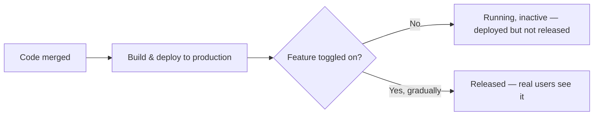

> **Caution**
> I've watched teams adopt an API-based architecture and skip this separation entirely — every deploy is a release, coordinated across every team that touches the path. It works fine while the system is small. It stops working the moment more than a couple of services are involved, because now a release requires choreographing multiple teams' deployments to land at the same instant, and any one of them slipping means either a broken intermediate state or an all-hands scramble.

---

## Feature Flags: My First Tool for Separating the Two

The simplest way I separate deployment from release is a feature flag: a runtime switch, usually backed by a configuration service external to my running application, that decides which code path executes.

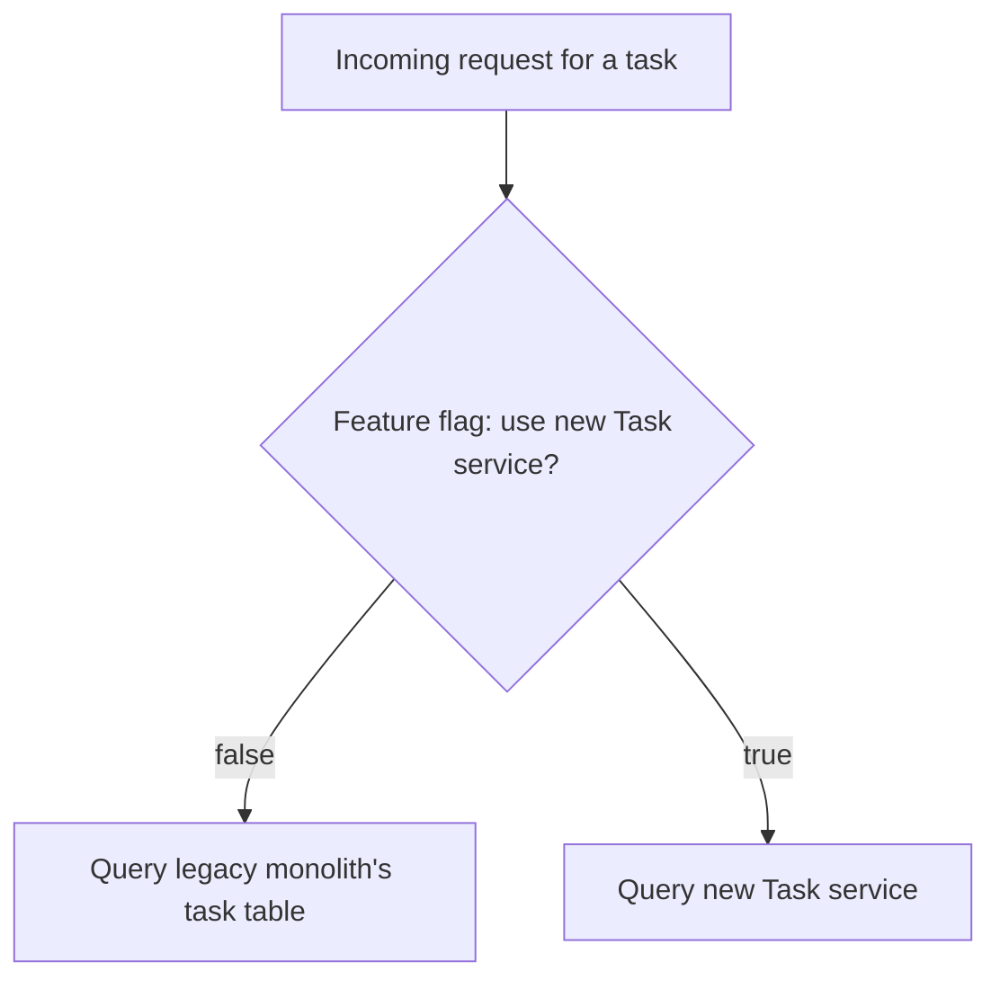

Here's a small, tested example — a feature flag evaluator I'd use to gradually cut TaskFlow users over from a legacy in-monolith task table to the new Task service, based on a percentage rollout keyed by user ID so the same user consistently lands on the same side:

```python
import hashlib


class FeatureFlag:
    """A minimal percentage-rollout feature flag.

    Same user always gets the same answer for a given percentage,
    because we hash (flag_name + user_id) rather than rolling dice
    on every call — that's what keeps the experience consistent for
    a single user while a rollout is in progress.
    """

    def __init__(self, name: str, percentage: int):
        if not 0 <= percentage <= 100:
            raise ValueError("percentage must be between 0 and 100")
        self.name = name
        self.percentage = percentage

    def is_enabled_for(self, user_id: str) -> bool:
        digest = hashlib.sha256(f"{self.name}:{user_id}".encode()).hexdigest()
        bucket = int(digest, 16) % 100
        return bucket < self.percentage
```

And the tests I ran against it:

```python
import unittest
from feature_flag import FeatureFlag


class FeatureFlagTests(unittest.TestCase):
    def test_zero_percent_enables_nobody(self):
        flag = FeatureFlag("new-task-service", 0)
        for uid in ["alice", "bob", "carol", "dave"]:
            self.assertFalse(flag.is_enabled_for(uid))

    def test_hundred_percent_enables_everybody(self):
        flag = FeatureFlag("new-task-service", 100)
        for uid in ["alice", "bob", "carol", "dave"]:
            self.assertTrue(flag.is_enabled_for(uid))

    def test_same_user_gets_consistent_result(self):
        flag = FeatureFlag("new-task-service", 50)
        first = flag.is_enabled_for("alice")
        for _ in range(20):
            self.assertEqual(first, flag.is_enabled_for("alice"))

    def test_roughly_matches_target_percentage(self):
        flag = FeatureFlag("new-task-service", 30)
        users = [f"user-{i}" for i in range(5000)]
        enabled_count = sum(1 for u in users if flag.is_enabled_for(u))
        ratio = enabled_count / len(users)
        self.assertAlmostEqual(ratio, 0.30, delta=0.03)


if __name__ == "__main__":
    unittest.main()
```

Running `python3 -m unittest test_feature_flag.py -v` gives me:

```
test_hundred_percent_enables_everybody ... ok
test_roughly_matches_target_percentage ... ok
test_same_user_gets_consistent_result ... ok
test_zero_percent_enables_nobody ... ok

----------------------------------------------------------------------
Ran 4 tests in 0.031s

OK
```

> **Caution**
> I have exactly one hard rule about feature flags now: **clean them up once a migration is complete, and never reuse a flag's name for something else.** I bring this up because a real production incident — the Knight Capital trading loss, which ran into the hundreds of millions of dollars — traced back in part to old feature-flagged code being reactivated unexpectedly during a deployment. A stale flag isn't just clutter; it's a landmine that a future deploy can step on.
>
> I also treat the feature-flag service itself as a potential single point of failure. If it's unreachable, my application needs a sane default (usually: fall back to the last known value from a local cache, or a safe hardcoded default) rather than failing the request outright.

---

## The API Lifecycle: Planned, Beta, Live, Deprecated, Retired

Once I'm thinking about releases as controlled, gradual things, it helps to have a shared vocabulary for where an API sits in its life. I use a five-stage lifecycle, adapted from an approach I first ran into via PayPal's now-archived API standards:

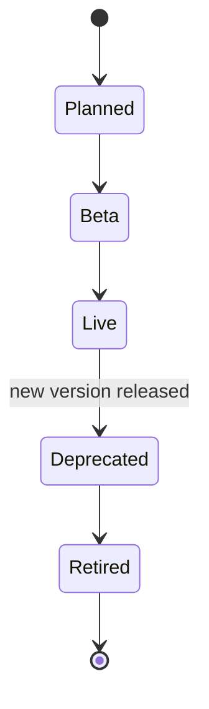

| Stage | What I do here |
|---|---|
| **Planned** | I socialize the design before writing production code — gather feedback from consumers on shape and scope |
| **Beta** | Live, but explicitly not versioned yet — I reserve the right to break it, and I say so loudly in docs |
| **Live** | Versioned and stable. There's only ever one "live" major.minor combination at a time |
| **Deprecated** | Still callable, but I stop building new functionality against it and start pushing consumers to migrate |
| **Retired** | Gone. No longer accessible |

The detail I find genuinely useful here: when I release a new **minor** version, the previous minor stays deprecated only briefly — just long enough to validate the new one in production — because a minor release is backward compatible by definition, so there's no real reason for a consumer to stay on the old one. A **major** version, on the other hand, might stay deprecated for months, because I'm asking every consumer to actively change their integration code, and that takes real calendar time, communication, and a migration guide.

---

## Mapping Semantic Versioning Onto Release Strategy

Combining the lifecycle above with semantic versioning tells me exactly how much ceremony a given release needs.

| Version bump | Consumer action required | My release approach |
|---|---|---|
| **Major** (`1.x` → `2.0`) | Must actively upgrade, on their own schedule | Run live and deprecated versions side by side; route by explicit version signal |
| **Minor** (`1.1` → `1.2`) | None — safe to receive passively | Deploy dark, then gradually shift traffic; no consumer code changes |
| **Patch** (`1.2.0` → `1.2.1`) | None | Same as minor, but I lean harder on automated compatibility checks in CI |

For a major version, I need some way for a consumer to actively opt in to the new behavior. I've used both of these approaches, and I lean toward the header version more often now:

```
GET /v1/tasks
```

versus

```
GET /tasks
Version: v1
```

Putting the version in the URL path is dead simple and immediately visible to anyone reading a request — but purists will point out that it's not strictly RESTful, since the version isn't really part of the resource identity. A version header keeps the URL clean and lets my gateway make the routing decision purely on header inspection, without needing path-rewriting logic. Neither is objectively correct; I pick based on which is easier for my actual consumers to work with, and I've found external, less sophisticated consumers generally find the URL-path version easier to reason about, so that's often where I land for public APIs.

For minor and patch changes, my main defense against accidentally shipping a breaking change disguised as a "safe" one is running an OpenAPI diff check in CI, exactly like I described in an earlier post on API design — the build fails if the spec diff isn't backward compatible, and someone has to consciously override that to proceed.

---

## Release Strategies: Canary, Traffic Mirroring, Blue-Green

Once I've separated deployment from release, I have a toolbox of strategies for the "turn it on gradually" part. I pick based on how much risk I'm willing to accept versus how much infrastructure I'm willing to run in parallel.

### Canary releases

I deploy the new version alongside the old one and shift a small percentage of traffic to it, watching closely, then ramping up if things look healthy.

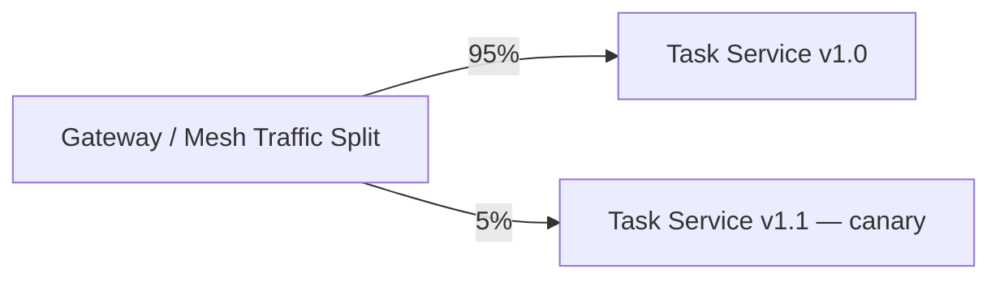

I watch two categories of signal during a canary: **technical** (latency, error rate, CPU) and **business** (did the KPI I actually care about hold steady or improve — e.g., task-creation completion rate). A canary that looks technically flawless but tanks a business metric is still a failed canary.

> **Note**
> In Kubernetes, precisely controlling a small percentage like 1% by adjusting pod counts alone is awkward — 1% of traffic to one pod out of a hundred means running ninety-nine replicas of the old version, which is rarely practical. I get much finer control doing the traffic split at the gateway or mesh layer instead of relying purely on replica-count ratios.

### Traffic mirroring (dark launches)

Sometimes I don't want *any* real user seeing the new version's response yet — I just want to observe how it behaves under real traffic patterns. Traffic mirroring duplicates incoming requests to the new version, discards its response (the original caller never sees it), and lets me compare behavior or just watch operational metrics.

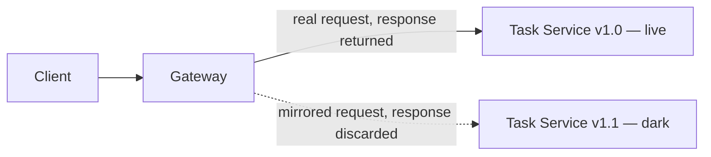

I reach for this specifically when I want operational confidence (does it crash, is it fast enough) without yet exposing any business-facing risk — a dark launch tells me nothing about business impact, only technical behavior, since the mirrored responses never reach a real user.

### Blue-green

For services that are tightly coupled — where the API and its consumer basically have to move in lockstep, often because they're owned by the same team and always deploy together — I reach for blue-green instead. I stand up a complete second environment ("green") next to the current live one ("blue"), validate it, then flip a router/gateway config to send all traffic to green in one atomic switch.

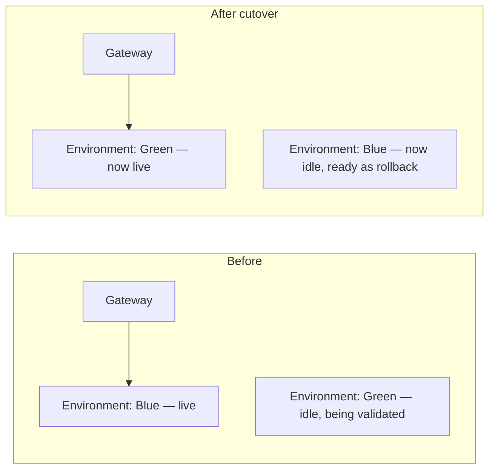

The appeal is simplicity — no fiddly percentage-based traffic splitting, and a rollback is just flipping the switch back. The cost is real: I'm running double the infrastructure for the duration of the cutover, and blue-green doesn't give me the fine-grained, gradual risk exposure that a canary does.

| Strategy | Infra cost | Risk exposure | Best for |
|---|---|---|---|
| Canary | Low (one extra small instance/pod) | Gradual, tunable | Loosely coupled services with independent consumers |
| Traffic mirroring | Low-medium (traffic duplicated) | None to real users (responses discarded) | Validating technical behavior before any real exposure |
| Blue-green | High (full second environment) | All-or-nothing, but instantly reversible | Tightly coupled services/consumers, simple rollback needs |

---

## Automating Rollouts With a Progressive Delivery Tool

Manually shifting traffic percentages is fine for a demo, but I don't want to be the one manually running `kubectl` commands at 2 a.m. to advance a rollout. This is where progressive delivery tooling earns its keep — I define the *strategy* declaratively, and the tool executes it, pausing for manual approval or for automated metric checks.

Here's the shape of a rollout definition I'd write for the Task service — five replicas, rolling out in 20% steps, pausing for confirmation at the first step and then continuing automatically after a timed pause at each subsequent step:

```yaml
apiVersion: rollouts.example.io/v1alpha1
kind: Rollout
metadata:
  name: task-service
spec:
  replicas: 5
  strategy:
    canary:
      steps:
        - setWeight: 20
        - pause: {}                 # wait for manual confirmation
        - setWeight: 40
        - pause: { duration: 10m }
        - setWeight: 60
        - pause: { duration: 10m }
        - setWeight: 80
        - pause: { duration: 10m }
  revisionHistoryLimit: 2
  selector:
    matchLabels:
      app: task-service
  template:
    metadata:
      labels:
        app: task-service
    spec:
      containers:
        - name: task-service
          image: taskflow/task-service:v1.1
```

I can also wire in automated analysis, so the rollout only proceeds if a real metric — not just my gut feeling — says it's healthy:

```yaml
apiVersion: rollouts.example.io/v1alpha1
kind: AnalysisTemplate
metadata:
  name: success-rate-check
spec:
  args:
    - name: service-name
  metrics:
    - name: success-rate
      successCondition: result[0] >= 0.95
      provider:
        prometheus:
          address: "http://prometheus.taskflow.internal:9090"
```

> **Note**
> "Success rate" alone can be a misleadingly simple metric. Plenty of API failures are the client's fault (a malformed request, an expired token) and don't indicate my service is unhealthy. I've had to add nuance here — segmenting the success-rate check to look specifically at `5xx` responses, not `4xx`, otherwise a canary can get blocked by a wave of legitimate client-side validation errors that have nothing to do with the new version's health.

---

## Observability: The Three Pillars

None of the release strategies above mean anything if I can't tell whether the new version is actually healthy. I lean on three categories of signal, and I've learned the hard way that no single one is sufficient on its own.

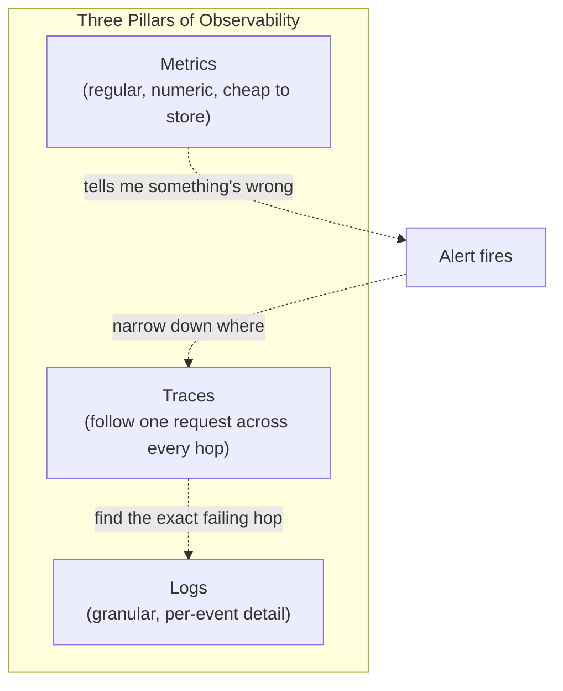

- **Metrics** — regular numeric measurements (request rate, latency, error count, CPU). Cheap to store and query over long time windows, but they tell me *that* something's wrong, not *why*.
- **Logs** — detailed, per-event records. The quality is only as good as the discipline behind emitting them — structured logging (consistent fields, machine-parseable) makes a genuinely enormous difference to how useful they are during an incident, versus a pile of loosely formatted strings I have to grep through by hand.
- **Traces** — follow a single request across every service it touches. This is the one I reach for first during a real incident, because it tells me exactly which hop in a multi-service call chain is actually slow or failing.

The thing that ties all three together for me is a **correlation ID** — generated as close to the origin of a request as possible (usually at my gateway) and propagated through every downstream hop, including across any asynchronous boundary like a message queue. Without that thread, I have three separate piles of data with no way to prove they're describing the same request.

### The metrics I actually watch

I lean on RED (Rate, Errors, Duration) as a starting framework, which maps closely onto the SRE world's "four golden signals" (latency, traffic, errors, saturation):

| Metric | What it tells me | A concrete TaskFlow example |
|---|---|---|
| Rate | Throughput — how much traffic am I handling | Task-creation requests per minute |
| Errors | What fraction of requests are failing, and how | 5xx rate on `POST /tasks`, broken out from 4xx |
| Duration | How long requests take | p50/p95/p99 latency on task creation |
| Saturation | How close to capacity I am | Worker thread pool utilization, DB connection pool usage |

> **Caution**
> RED/golden-signal metrics are a starting point, not the whole picture. A spike in `403 Forbidden` responses isn't a service health problem in the RED sense — the service is doing exactly what it's supposed to. But a sudden surge of 403s can be an early signal of a credential-stuffing attack or a compromised client, and I've learned to treat unusual patterns in specific status codes as their own category of signal worth alerting on, separate from raw error-rate thresholds.

---

## Reading the Signals Before They Become Incidents

I think of this the way I'd think about my car making a slightly odd noise: it still works, but something's off, and ignoring it now is how a minor issue becomes a breakdown later. My concrete version of this: rising garbage-collection pause times in a JVM-based service. The application still responds, latency still looks "fine" on average, but GC pauses eating into my request-handling time is often the earliest available warning sign — well before it shows up as user-visible latency — that a deploy or a traffic pattern change has introduced a memory problem.

My actual workflow when I notice a leading indicator like that: establish what "normal" looks like for that metric under typical load, alert when it drifts outside that range, and treat that alert as a prompt to investigate *now*, calmly, rather than waiting for it to cascade into the metric everyone actually notices (user-facing latency, or worse, a full outage). The earlier in that chain I catch something, the smaller and less stressful the eventual fix.

---

## Application-Level Gotchas: Caching, Headers, Logging

A few very specific things have bitten me personally when releasing changes to a distributed API system, and I want to call them out concretely rather than leaving them as vague advice.

### Caching can mask a broken release

I ran a canary of the Task service once, watched it look completely healthy, and rolled forward to 100%. Only afterward did a downstream consumer's proxy start throwing 500s — the client's own caching layer had been serving a stale, cached success response from before the rollout, and only once that cache expired did the actual (broken) new behavior get exercised. My fix going forward: set `Cache-Control: no-cache, no-store` deliberately on responses I don't want cached along a request path I'm actively rolling out, and don't declare a rollout fully validated until any relevant client-side caches would have naturally expired.

### Header propagation isn't automatic

Any service in TaskFlow that terminates one request and issues a new downstream request has to explicitly copy the headers that matter — my correlation ID, obviously, but I've also had to think hard about which *authentication* headers are safe to forward. An OAuth2 bearer token is generally fine to pass downstream (assuming the transport is secured with TLS throughout), but blindly forwarding some other authentication header can let one service impersonate another, or impersonate the original end user in a way I never intended.

> **Caution**
> I treat "which headers propagate downstream" as an explicit design decision for every service boundary, never an accident of whatever the HTTP client library happens to do by default.

### Two kinds of logs, not one

I now deliberately separate **journal** logs (important business-level events — "a new task was created," "a notification was sent") from **diagnostic** logs (unexpected errors, stack traces, debug detail). Tagging log entries with a `log_type` field lets me query just the journal during a business-facing investigation, without wading through diagnostic noise, or pull full diagnostics when I'm actually debugging a failure.

---

## Opinionated Platforms: The Paved Path

Once I've made all the decisions above — how to release, what to observe, how to propagate headers — I don't want every team on my org reinventing them independently, inconsistently, forever. This is where I've come to appreciate the value of an **opinionated platform**: a shared set of defaults (a base container image with tracing pre-wired, a standard library for feature flags, a default canary rollout template) that makes the *right* behavior the *easy* behavior.

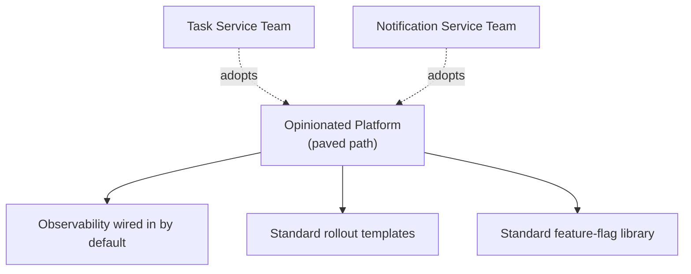

The trade-off I keep front of mind: every opinion I bake into the platform is a constraint on some team's freedom. I've found this only works when the platform is treated like an internal product — the teams using it are genuinely my customers, with a real feedback channel, not just a mandate handed down. The one thing I insist on: any team that adopts the platform automatically gets the latest features (better tracing, a new rollout capability) without having to re-integrate from scratch — otherwise "opinionated platform" quietly turns into "yet another thing to keep in sync by hand."

---

# Part 2 — Threat Modeling

## Why I Threat Model Instead of Just "Being Careful"

I used to think of security as something a specialist team handled after I'd built the thing. I've come around to a different view: nobody understands the actual shape of my system — its data flows, its trust boundaries, its weak points — better than the person who designed it. Security experts are hugely valuable for depth and for staying current on the threat landscape, but I don't think I can outsource the initial "where are the doors and windows" exercise to someone who's never seen my architecture.

That's what threat modeling is, in my own words: systematically looking at my system the way an attacker would, before they do.

> **Caution**
> Security breaches are not an abstract risk. Real-world breaches have run into the hundreds of millions of dollars in direct cost and regulatory fines, on top of reputational damage that's harder to put a number on. I bring this up not to be alarmist, but because it's the honest justification for spending real engineering time on this rather than treating it as a box-ticking exercise.

---

## Data Flow Diagrams: My Starting Point

Before I can find threats, I need an accurate picture of how data actually moves through TaskFlow. I use a Data Flow Diagram (DFD) rather than an architecture diagram, because a DFD is deliberately data-centric — it shows me flows and trust boundaries, not just which boxes exist.

The four building blocks I use:

| DFD Element | What it represents | TaskFlow example |
|---|---|---|
| External entity | Something outside my system | The mobile app, a third-party integration |
| Process | Something inside my domain that does work | The API gateway, the Task service |
| Datastore | Where data is persisted | The Task service's database |
| Trust boundary | A line where trust level changes | The internet-to-gateway boundary |

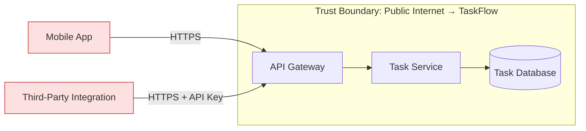

Drawing this out is what makes the next step — systematically hunting for threats — actually tractable, rather than a vague brainstorm.

---

## My Six-Step Threat Modeling Process

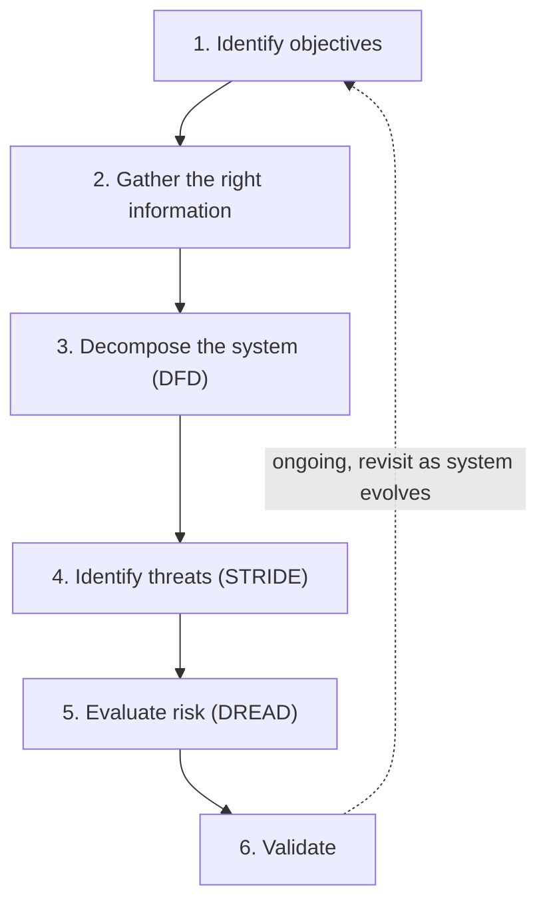

1. **Identify objectives.** For TaskFlow's Task API, mine is concrete: prepare it for external, third-party consumption while mitigating the OWASP API Security Top 10.
2. **Gather the right information.** I pull in whoever actually understands each component — I don't threat-model in a vacuum based on my own assumptions about how another team's service behaves.
3. **Decompose the system.** This is the DFD above.
4. **Identify threats**, systematically, using a structured methodology — I use STRIDE, covered below.
5. **Evaluate risk**, so I know what to fix first — I use DREAD.
6. **Validate**, and treat the whole thing as recurring, not a one-time exercise. I revisit it whenever I add meaningful new functionality, and periodically regardless, because the external threat landscape keeps moving even when my system doesn't.

---

## STRIDE, Walked Through Against TaskFlow

STRIDE gives me six categories of threat to systematically check for at every process and data flow in my diagram. I'll walk through each with a concrete TaskFlow example and how I mitigate it.

| STRIDE Category | What it means | My mitigation in TaskFlow |
|---|---|---|
| **S**poofing | Impersonating a legitimate user or service | Strong authentication (OAuth2 + JWT — see Part 3) |
| **T**ampering | Modifying data or requests in transit or at rest | Input validation at the gateway + backend, prepared statements |
| **R**epudiation | Denying an action with no way to prove otherwise | Structured logging + monitoring at every hop |
| **I**nformation disclosure | Exposing data to those not entitled to see it | Response field filtering, API inventory/lifecycle tracking |
| **D**enial of service | Making the system unavailable | Rate limiting + load shedding at the gateway |
| **E**levation of privilege | Performing an action outside one's authorized scope | Enforced authorization on every endpoint, not just the gateway |

### Tampering: a payload injection example

Here's a request I'd want my system to reject outright:

```json
POST /tasks
{
  "title": "Write blog post",
  "notes": "Hax; DROP ALL TABLES; --"
}
```

My defense is layered, deliberately, because I don't trust any single layer to catch everything:

1. **At the gateway** — the request is validated against my OpenAPI schema. If `notes` is defined as a plain string with a length limit, a wildly malformed payload can be rejected before it even reaches my service.
2. **In the service** — even if something schema-valid but malicious slips through, I use parameterized queries (never string-concatenated SQL) so injected content is treated as inert data, not executable SQL.

> **Caution**
> I never treat gateway-level validation as sufficient on its own. "Trust, but verify" — every layer downstream re-validates what it actually cares about, because the gateway can't know every backend-specific constraint, and a defense that only exists in one place is a defense that fails completely the moment that one place has a bug or gets bypassed.

### Tampering: mass assignment

This one's subtler and I've genuinely been bitten by it. Imagine my Task resource includes a `syncedDevices` field that's meant to be system-managed and read-only from the client's point of view:

```json
GET /tasks/42

{
  "id": 42,
  "title": "Write blog post",
  "syncedDevices": ["iPhone", "web"]
}
```

If my update handler blindly binds the entire incoming JSON body onto my internal Task entity (a common pattern with ORMs and "Active Record"-style frameworks), then a client can send:

```json
PUT /tasks/42
{
  "title": "Write blog post",
  "syncedDevices": ["attacker-controlled-device"]
}
```

...and quietly overwrite a field it was never supposed to touch. My fix: explicitly allow-list which fields an update endpoint accepts, rather than deserializing straight onto my persistence model. This is a backend-code problem, not something a gateway can catch — the gateway doesn't know which fields are meant to be externally writable versus internally managed.

### Information disclosure: excessive data exposure

I've made this mistake before: an endpoint quietly returns more fields than the caller actually needs, because it was convenient to just serialize the whole internal entity. If TaskFlow ever stored something sensitive on a user profile, I want to be deliberate about exactly which fields an external-facing endpoint returns — not rely on "well, nobody's asked for that field yet" as my security boundary.

### Denial of service

This is the category I want to spend real code on, because "add rate limiting" is easy to say and easy to get subtly wrong.

---

## Rate Limiting: Tested Code

I use a **token bucket** algorithm for rate limiting at my gateway — it allows short bursts (up to the bucket's capacity) while still enforcing a steady average rate over time, which fits how real traffic actually behaves better than a rigid fixed window does.

```python
import time


class TokenBucket:
    """A simple token-bucket rate limiter.

    capacity: max tokens the bucket can hold (burst size)
    refill_rate: tokens added per second
    """

    def __init__(self, capacity: int, refill_rate: float, clock=time.monotonic):
        self.capacity = capacity
        self.refill_rate = refill_rate
        self.tokens = float(capacity)
        self.clock = clock
        self.last_check = self.clock()

    def _refill(self):
        now = self.clock()
        elapsed = now - self.last_check
        self.tokens = min(self.capacity, self.tokens + elapsed * self.refill_rate)
        self.last_check = now

    def allow_request(self, cost: int = 1) -> bool:
        self._refill()
        if self.tokens >= cost:
            self.tokens -= cost
            return True
        return False
```

I tested this with a fake, controllable clock rather than sleeping in real time, so the tests run instantly and deterministically:

```python
import unittest
from rate_limiter import TokenBucket


class FakeClock:
    def __init__(self):
        self.now = 0.0

    def __call__(self):
        return self.now

    def advance(self, seconds):
        self.now += seconds


class TokenBucketTests(unittest.TestCase):
    def test_allows_requests_up_to_capacity(self):
        clock = FakeClock()
        bucket = TokenBucket(capacity=3, refill_rate=1, clock=clock)
        self.assertTrue(bucket.allow_request())
        self.assertTrue(bucket.allow_request())
        self.assertTrue(bucket.allow_request())
        self.assertFalse(bucket.allow_request())  # bucket exhausted

    def test_refills_over_time(self):
        clock = FakeClock()
        bucket = TokenBucket(capacity=2, refill_rate=1, clock=clock)  # 1 token/sec
        self.assertTrue(bucket.allow_request())
        self.assertTrue(bucket.allow_request())
        self.assertFalse(bucket.allow_request())
        clock.advance(1.0)  # 1 second passes -> 1 token regenerated
        self.assertTrue(bucket.allow_request())
        self.assertFalse(bucket.allow_request())

    def test_never_exceeds_capacity(self):
        clock = FakeClock()
        bucket = TokenBucket(capacity=2, refill_rate=5, clock=clock)
        clock.advance(100)  # huge gap, should cap at capacity not overflow
        self.assertTrue(bucket.allow_request())
        self.assertTrue(bucket.allow_request())
        self.assertFalse(bucket.allow_request())
```

Running `python3 -m unittest test_rate_limiter.py -v`:

```
test_allows_requests_up_to_capacity ... ok
test_never_exceeds_capacity ... ok
test_refills_over_time ... ok

----------------------------------------------------------------------
Ran 3 tests in 0.001s

OK
```

The `test_never_exceeds_capacity` test matters more than it might look — without that `min(self.capacity, ...)` cap in `_refill`, a long idle gap followed by a burst of traffic could let the bucket accumulate far more tokens than its stated capacity, defeating the entire point of having a burst limit in the first place.

| Rate-limiting strategy | How it behaves | When I reach for it |
|---|---|---|
| Fixed window | Hard cap per fixed time slice (e.g., 1,000/hour) | Simple, but allows a burst right at the window boundary |
| Sliding window | Cap over a continuously moving window | Smoother than fixed window, more computation to track |
| Token bucket | Steady refill rate, allows controlled bursts | My default — handles bursty real traffic gracefully |
| Leaky bucket | Requests processed at a strictly fixed output rate | When I need to smooth traffic hitting a fragile downstream |

> **Note**
> Whether my rate limiter **fails open** (lets traffic through if the limiter itself breaks) or **fails closed** (blocks traffic) is a deliberate decision, not a default I accept blindly. For most of TaskFlow, I want fail-closed — if the rate limiter is broken, I'd rather reject some traffic than risk an unprotected service getting hammered. For anything safety-critical, the calculus can flip entirely: I've heard the argument that a medical-emergency system might reasonably choose to fail open on an auth check, prioritizing availability of critical information over strict access control in a crisis. There's no universally correct default — I pick based on what's actually worse for my specific system: over-blocking, or under-protecting.

---

## Scoring Risk With DREAD

Once I've identified a pile of threats, I need to know which ones to fix first. I use **DREAD** — also from Microsoft, like STRIDE — to put a rough, consistent number on each one.

| Letter | Question I ask | Score |
|---|---|---|
| **D**amage | How bad would a successful attack actually be? | 1–10 |
| **R**eproducibility | How easily can it be repeated? | 1–10 |
| **E**xploitability | How much effort/skill does it take to pull off? | 1–10 |
| **A**ffected users | How many users does it touch? | 1–10 |
| **D**iscoverability | How easy is it for an attacker to even find this? | 1–10 |

The overall score is the average of all five.

Here's a worked example against TaskFlow: **no rate limiting on the public Task API.**

| Category | Score | My reasoning |
|---|---|---|
| Damage | 8 | Unbounded requests could genuinely take the gateway down |
| Reproducibility | 8 | Trivially repeatable — just keep hammering the endpoint |
| Exploitability | 5 | Attacker still has to get past basic auth to reach the endpoint at all |
| Affected Users | 10 | A gateway outage affects everyone, not a subset |
| Discoverability | 9 | The absence of a rate limit is obvious the moment someone tests it |

**Total: (8 + 8 + 5 + 10 + 9) / 5 = 8.0**

That's a high score, and it tells me this goes to the top of my remediation list — which, conveniently, is exactly the token-bucket limiter I just walked through above.

> **Note**
> I keep my own definitions written down for what a 3 versus a 7 versus a 10 actually means in each DREAD category — otherwise the scores drift depending on who's doing the scoring and how their day is going. For "Affected Users," for instance, I define 10 as "all users," 7 as "all users of one specific integration path," 3 as "a small subset," and 0 as "effectively nobody." Without that shared rubric, DREAD scores stop being comparable across different threats, and the whole point of prioritizing by score falls apart.

---

# Part 3 — Authentication and Authorization

## Authentication vs. Authorization, Concretely

I keep these two words straight with one sentence I repeat to myself constantly: **authentication is "who are you," authorization is "what are you allowed to do."** They're sequential — I always authenticate first, then authorize — and conflating them is a mistake I still see experienced engineers make in code review.

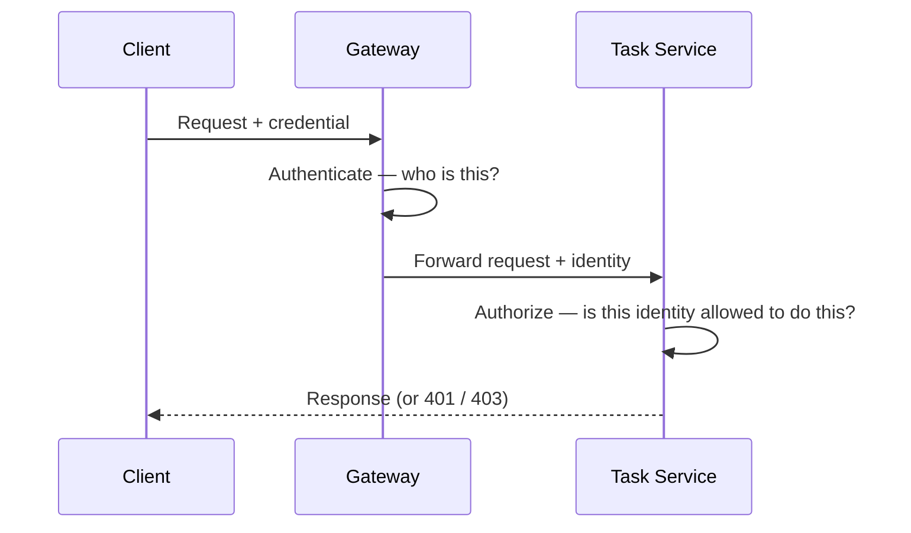

The distinction matters practically: a `401 Unauthorized` response means "I don't know who you are" (an authentication failure); a `403 Forbidden` means "I know exactly who you are, and you're not allowed to do that" (an authorization failure). I try to get this distinction right in my own APIs' error responses, because a consumer debugging an integration issue genuinely needs to know which one they're dealing with.

---

## Why I Moved Away From API Keys Alone

For simple system-to-system calls, an API key is the most straightforward option: a long, unguessable random string sent in a header, tied to a specific application or client.

```
GET /tasks
X-API-Key: 7f3a9c1e8b2d4f6a0c5e9b1d3f7a2c4e
```

An API key works fine as a starting point, but it has a real limitation I ran into directly: **an API key alone can't tell me anything about the end user on whose behalf a request is being made.** If TaskFlow's third-party integration wants to act on behalf of a specific attendee — say, updating that attendee's task list — an API key only proves "this is a legitimate integration," not "this specific user consented to this specific action."

> **Caution**
> I don't mix API keys and raw user credentials to solve this. The tempting-but-wrong fix is having the third-party integration also pass the end user's username and password alongside its API key — but that means the user has to hand their actual credentials to a third party, which is exactly the kind of trust I don't want to require. This is precisely the gap OAuth2 exists to close.

---

## OAuth2: The Roles and the Abstract Flow

I think about OAuth2 in terms of four roles, defined precisely enough that I stop myself from getting sloppy about who's who:

| Role | Who this is in TaskFlow |
|---|---|
| **Resource Owner** | The attendee — the person whose data is being accessed |
| **Client** | The third-party integration, or TaskFlow's own mobile app, acting on the resource owner's behalf |
| **Authorization Server** | My identity provider — issues access tokens after checking the resource owner consents |
| **Resource Server** | My API gateway (or the Task service directly) — the thing that actually hosts the protected data |

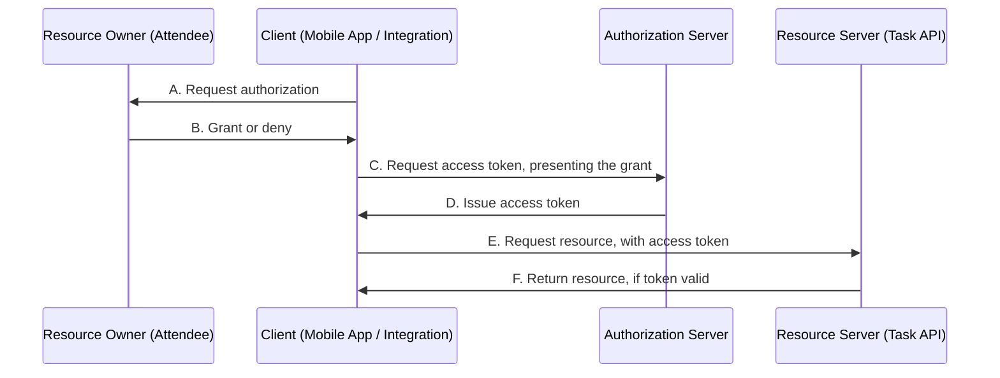

What I like about this abstract flow is how cleanly each step is isolated — my resource server never needs to know or care *how* the client obtained its access token, only that the token presented is valid. That's what lets OAuth2 support multiple different "grants" (concrete implementations of this abstract flow) for different situations, without my API code needing to change based on which grant a given client used.

---

## JWTs: Tested Issue-and-Verify Code

The token format I use almost universally now is a JSON Web Token (JWT) — a compact, signed, self-contained set of claims. "Self-contained" is the operative word: my Task service can verify a JWT's signature and expiry entirely in-process, without a network round-trip to look the token up in a database on every single request.

Here's the shape of a JWT's claims, using the standard reserved claim names:

```json
{
  "iss": "https://auth.taskflow.example.com/",
  "sub": "attendee-123",
  "aud": "task-service",
  "exp": 1700003400,
  "nbf": 1700002500,
  "iat": 1700002500,
  "scope": "tasks:read tasks:write"
}
```

| Claim | Meaning | Why I check it |
|---|---|---|
| `iss` | Issuer — who signed this token | Confirms it came from an authorization server I actually trust |
| `sub` | Subject — the unique ID of the principal | Tells me *who* this token is for |
| `aud` | Audience — who this token is intended for | Prevents a token issued for one service being replayed against another |
| `exp` | Expiration | A token past this time is dead, full stop |
| `nbf` | Not-before | A token can't be used before this time |
| `scope` | What this token authorizes | The basis for coarse-grained authorization checks |

Here's real code I wrote and tested — issuing and verifying a JWT, including checking scope, expiry, audience, and tamper resistance:

```python
import time
import jwt  # PyJWT

SECRET = "demo-signing-secret-do-not-use-in-prod"

def issue_access_token(subject: str, scopes: list[str], ttl_seconds: int = 900) -> str:
    now = int(time.time())
    claims = {
        "iss": "https://auth.taskflow.example.com/",
        "sub": subject,
        "aud": "task-service",
        "iat": now,
        "nbf": now,
        "exp": now + ttl_seconds,
        "scope": " ".join(scopes),
    }
    return jwt.encode(claims, SECRET, algorithm="HS256")


def verify_access_token(token: str, required_scope: str) -> dict:
    claims = jwt.decode(
        token,
        SECRET,
        algorithms=["HS256"],
        audience="task-service",
        issuer="https://auth.taskflow.example.com/",
    )
    granted_scopes = claims.get("scope", "").split()
    if required_scope not in granted_scopes:
        raise PermissionError(f"token missing required scope: {required_scope}")
    return claims
```

And the tests, deliberately covering the failure modes I actually care about — a missing scope, an expired token, a tampered payload, and a token issued for the wrong audience:

```python
import time
import unittest
import jwt
from jwt_demo import issue_access_token, verify_access_token, SECRET


class JwtDemoTests(unittest.TestCase):
    def test_valid_token_with_correct_scope_is_accepted(self):
        token = issue_access_token("attendee-123", ["tasks:read", "tasks:write"])
        claims = verify_access_token(token, "tasks:read")
        self.assertEqual(claims["sub"], "attendee-123")

    def test_token_missing_scope_is_rejected(self):
        token = issue_access_token("attendee-123", ["tasks:read"])
        with self.assertRaises(PermissionError):
            verify_access_token(token, "tasks:write")

    def test_expired_token_is_rejected(self):
        token = issue_access_token("attendee-123", ["tasks:read"], ttl_seconds=-10)
        with self.assertRaises(jwt.ExpiredSignatureError):
            verify_access_token(token, "tasks:read")

    def test_tampered_token_is_rejected(self):
        token = issue_access_token("attendee-123", ["tasks:read"])
        header, payload, signature = token.split(".")
        tampered_payload = payload[:-2] + ("A" if payload[-2] != "A" else "B") + payload[-1]
        tampered_token = ".".join([header, tampered_payload, signature])
        with self.assertRaises(jwt.InvalidSignatureError):
            verify_access_token(tampered_token, "tasks:read")

    def test_wrong_audience_is_rejected(self):
        now = int(time.time())
        claims = {
            "iss": "https://auth.taskflow.example.com/",
            "sub": "attendee-123",
            "aud": "some-other-service",
            "iat": now,
            "nbf": now,
            "exp": now + 900,
            "scope": "tasks:read",
        }
        token = jwt.encode(claims, SECRET, algorithm="HS256")
        with self.assertRaises(jwt.InvalidAudienceError):
            verify_access_token(token, "tasks:read")
```

Running `python3 -m unittest test_jwt_demo.py -v`:

```
test_expired_token_is_rejected ... ok
test_tampered_token_is_rejected ... ok
test_token_missing_scope_is_rejected ... ok
test_valid_token_with_correct_scope_is_accepted ... ok
test_wrong_audience_is_rejected ... ok

----------------------------------------------------------------------
Ran 5 tests in 0.002s

OK
```

The `test_tampered_token_is_rejected` case is the one I'd point to as proof this isn't just "trust the client" security theater — flipping a single character in the payload segment and re-sending it fails signature verification immediately, because the signature was computed over the original, untampered payload.

> **Caution**
> I use **JWS** (signed) tokens in this example, which give integrity — I know the claims haven't been tampered with — but they are **not encrypted**. Anyone who intercepts the token can read the claims inside it in plain text (they're just base64-encoded, not encrypted). I never put genuinely confidential data directly in JWT claims unless I'm specifically using **JWE** (encrypted JWTs) instead. My rule of thumb: treat every JWT claim as if it could be read by anyone who gets hold of the token, because it can be.

> **Note**
> I keep access token lifetimes short — minutes, not hours — specifically because a stolen long-lived token is a much bigger blast radius than a stolen short-lived one. This is also directly why refresh tokens exist: a long-lived refresh token lets a client silently get a new short-lived access token without forcing the user to log in again, while keeping the actually-dangerous, resource-accessing token's window of exposure small.

---

## The Grants I Actually Use

OAuth2's abstract flow gets implemented as concrete "grants" for different situations. I genuinely use two of these regularly, and I want to be honest that the others exist mostly for edge cases I haven't needed yet.

### Authorization Code Grant (+ PKCE)

This is what I use whenever a real human resource owner is involved — my mobile app, or a web-based integration.

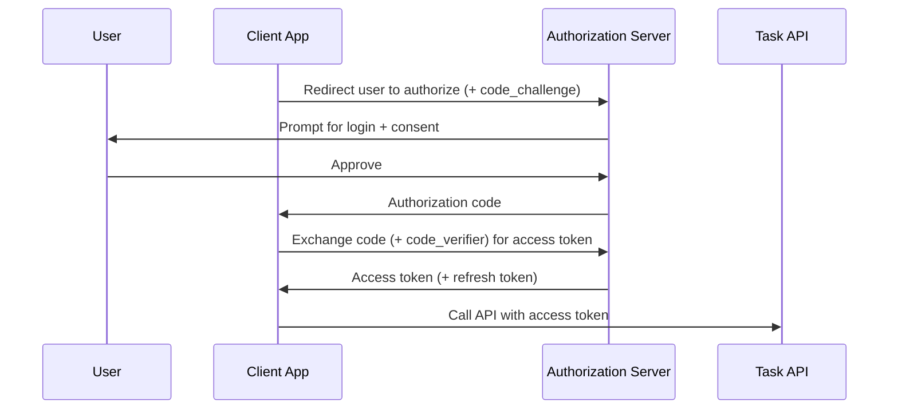

The **PKCE** extension (Proof Key for Code Exchange) matters specifically for **public clients** — anything that can't keep a secret confidential, like a mobile app or a single-page JavaScript app, where the source is fully visible to whoever's running it. PKCE works by having the client generate a random secret (`code_verifier`) up front, send only a hashed version (`code_challenge`) with the initial authorization request, and then present the original `code_verifier` when exchanging the authorization code for a token. If an attacker intercepts the authorization code midway through the flow, they still can't complete the exchange without the original `code_verifier`, which never left the legitimate client.

> **Note**
> I treat PKCE as mandatory for any public client, full stop, and I've started using it for confidential clients too, purely as defense in depth — it costs almost nothing to add and closes off an entire class of interception attack.

### Client Credentials Grant

For pure machine-to-machine calls, with no end user in the picture at all — say, a scheduled job that pulls a quarterly report from the Task API on TaskFlow's own behalf, not on behalf of any specific attendee — I use the much simpler Client Credentials Grant.

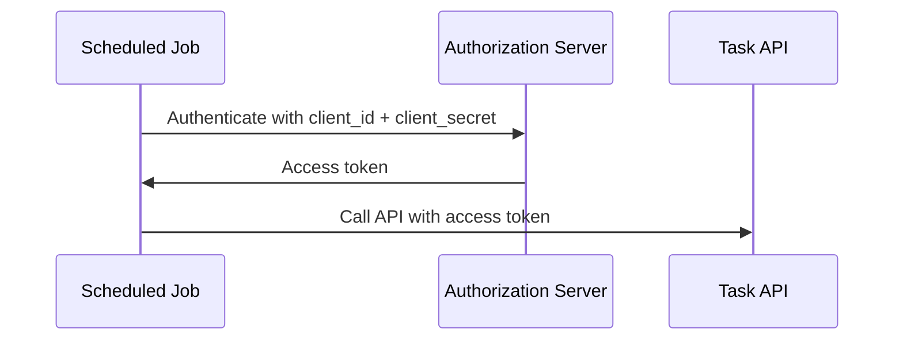

No redirect, no user consent screen, no refresh token — the client just authenticates directly and gets a token representing itself, not any particular user. I pre-arrange exactly what that client is allowed to do (via scopes, covered next) when I register it with my authorization server.

| Grant | Involves a real end user? | Client type | When I use it |
|---|---|---|---|
| Authorization Code + PKCE | Yes | Public or confidential | Mobile apps, SPAs, any user-facing integration |
| Client Credentials | No | Confidential only | Scheduled jobs, service-to-service, no user context |

> **Caution**
> I actively avoid the Resource Owner Password Credentials Grant, even though it technically exists and is simple to understand. It requires the client to directly handle the user's actual username and password — which is precisely the trust problem I'm trying to eliminate by using OAuth2 in the first place. If I see this grant proposed anywhere in a design, I treat it as a red flag worth pushing back on.

---

## Scopes and Authorization Enforcement

A valid, correctly signed token tells me *who* is calling. **Scopes** tell me what that caller is allowed to do, at a coarse grain, and — critically — they represent what the *resource owner actually consented to*, not a blank check.

For TaskFlow, I'd define scopes something like this:

| Scope | Grants |
|---|---|
| `tasks:read` | List and view tasks |
| `tasks:write` | Create and update tasks |
| `tasks:admin` | Delete tasks, manage other users' tasks |

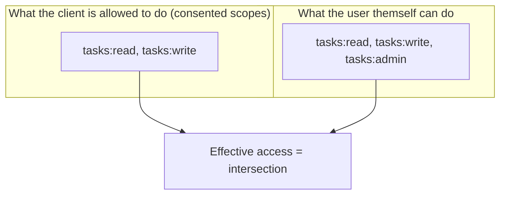

That overlap diagram is the detail I most want to stress: **the client's granted scope and the resource owner's own permission level are two separate, independent limits, and I always enforce the intersection of both.** A third-party integration might have been granted `tasks:admin` scope by a user who genuinely has admin rights — but if that same user's own account privileges get downgraded later, my authorization check needs to catch that too, not just trust the scope on an old token blindly.

This is also exactly where **Broken Object Level Authorization (BOLA)** and **Broken Function Level Authorization** — two of the most common issues I've seen flagged in the OWASP API Security Top 10 — come from. Having a valid, correctly scoped token is necessary but not sufficient. My Task service still has to check, on every single request, "does *this specific* authenticated caller have permission to act on *this specific* task ID?" — not just "does this caller generally have `tasks:write` scope." I enforce this check inside every relevant endpoint, never just once at the gateway, because the gateway can verify scope but it can't know my domain-specific ownership rules (like "a user can only edit their own tasks unless they're an admin").

---

## OIDC: Answering "Who Is This User?"

OAuth2 by itself never actually tells a client *who* the resource owner is — only that they consented to something. If my third-party CFP-style integration needs to store a record tied to the actual attendee's identity (name, email), OAuth2 alone doesn't give it that. This is exactly the gap **OpenID Connect (OIDC)** fills — it's an identity layer built on top of OAuth2.

The mechanism is a special `openid` scope. Requesting it alongside my normal scopes gets the client an **ID token** — a JWT specifically containing claims about the user, not about API access:

```json
{
  "iss": "https://auth.taskflow.example.com/",
  "sub": "attendee-123",
  "aud": "cfp-integration-client",
  "exp": 1700003400,
  "email": "jane@example.com",
  "email_verified": true,
  "name": "Jane Doe"
}
```

Additional standard scopes control how much detail comes back:

| Scope | Adds |
|---|---|
| `profile` | Name, nickname, picture, locale, and similar |
| `email` | Email address and verification status |
| `address` | Postal address |
| `phone` | Phone number and verification status |

> **Caution**
> I never substitute an ID token for an access token, and I actively watch for this mistake in code review. ID tokens exist to describe the user to the client — they're not meant to be presented to a resource server as proof of API access authorization. Using one that way conflates two genuinely different concerns and can lead to real security gaps, since an ID token's claims and lifetime assumptions aren't designed around being replayed as an access credential.

I've also run into plenty of engineers who use "OAuth2" and "OIDC" interchangeably, as if they're the same thing. They're not: OAuth2 is about **authorization** — granting access to a resource. OIDC is about **authentication** — establishing who the user actually is. TaskFlow genuinely needs both, for different reasons, and conflating them in conversation tends to produce conflated (and buggy) implementations.

---

## FAQ: The Questions I Get Asked Most on This Topic

**Do I need a service mesh to do canary releases, or can I do it with just a gateway?**
I can do gateway-level canaries for north-south traffic without a mesh at all — most modern gateways support weighted traffic splitting natively. Where I've found I genuinely need a mesh is canarying *internal* service-to-service calls, since a gateway sitting at my edge has no visibility into or control over east-west traffic between my Task and Notification services.

**Is DREAD still worth using if Microsoft itself has moved away from it?**
Yes, in my experience, with the caveat that I always pin down my own scoring rubric first (see the note above about defining what a 3 vs. a 7 actually means). DREAD's value isn't that it's a scientifically precise measurement — it's that it forces a consistent, repeatable conversation about risk instead of prioritizing by whoever argues loudest in the room.

**Should every internal service-to-service call also require a full OAuth2 flow?**
Not in my experience — that's usually overkill and adds real latency for no real security benefit. For purely internal calls, I lean on the service mesh's mutual TLS and service-identity-based authorization (covered in an earlier post) rather than layering a full OAuth2 token exchange on every internal hop. I reserve OAuth2 specifically for the boundary where a real external client or a real end user is involved.

**What's the single most common authorization bug you've actually seen in production?**
Checking scope but not object ownership — verifying a token carries `tasks:write` and stopping there, without then checking whether *this specific* caller actually owns *this specific* task ID. That gap is precisely what Broken Object Level Authorization is, and it's shown up in real, high-profile API breaches often enough that I now treat "does this endpoint check both scope AND ownership" as a mandatory line item in code review, not an optional nicety.

**How far in advance should I actually plan a major version deprecation?**
I don't have a universal number, and I'd be skeptical of anyone who gives one without knowing your consumer base. What I do instead: look at how quickly my existing consumers have historically migrated when given a heads-up, and set my deprecation window based on that observed behavior rather than an arbitrary "industry standard" timeframe. A deprecation window that's realistic for a handful of internal teams I can walk over and talk to is wildly unrealistic for hundreds of external, unknown third-party integrators.

**Do these three topics — releases, threat modeling, auth — actually depend on each other, or can I tackle them independently?**
They compound more than I expected when I first learned each one separately. A canary rollout is far less nerve-wracking when I already trust my observability stack to tell me immediately if something's wrong — which ties straight back to the metrics and tracing work in Part 1. A new authorization policy is far less risky to tighten when I already have the logging in place (from the repudiation section in Part 2) to see what it *would* have blocked before I start actually blocking it. And a threat model is only as good as my ability to actually verify identity at each trust boundary it identifies — which is exactly what Part 3 is for. I'd genuinely recommend tackling them in roughly the order I've laid them out here, because each one gives the next some of the infrastructure it needs to be low-risk.

---

## Closing Thoughts

If I had to boil three chapters' worth of hard-won lessons into one idea each, it'd be this:

**Releasing:** deployment and release are different acts, and the moment I stopped conflating them, gradual, low-risk rollouts stopped feeling like a luxury and started feeling like the obvious default.

**Threat modeling:** I don't need to be a security specialist to systematically ask "how would an attacker abuse this," and doing that exercise *before* something ships is dramatically cheaper than doing it after an incident forces the question.

**Auth:** authentication and authorization are two separate questions asked in sequence — who are you, then what are you allowed to do — and every genuinely nasty API security bug I've personally debugged traced back to one of those two checks being skipped, weakened, or trusted at the wrong layer of the stack.

None of this is exotic. It's OAuth2, JWTs, STRIDE, DREAD, canary releases — all mature, well-documented patterns that plenty of teams have already solved well. The actual skill, in my experience, isn't inventing anything new here; it's having the discipline to apply these patterns consistently, on every endpoint, on every release, rather than only remembering them after something's already gone wrong.

If I had to leave you with a single practical habit to start with tomorrow, it'd be this: pick one endpoint in your own system right now — any endpoint — and walk it through all three lenses in this post. Is a change to it releasable gradually, or does it force an all-or-nothing deploy? Has anyone actually STRIDE'd it, or is its security posture just "whatever the framework defaults gave us"? And does its authorization check verify both scope *and* ownership, or does it quietly stop at the first one? In my experience, doing that exercise on even one real endpoint teaches more than reading about all three topics in the abstract ever did — and it usually turns up at least one thing worth fixing before the next release goes out.
