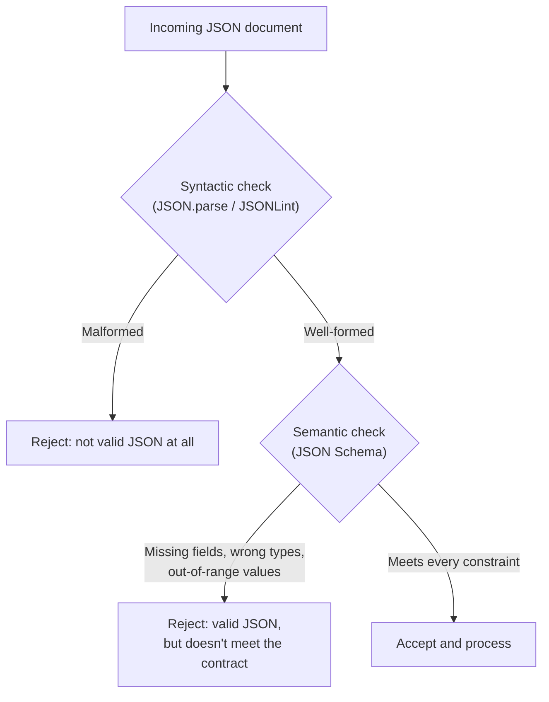
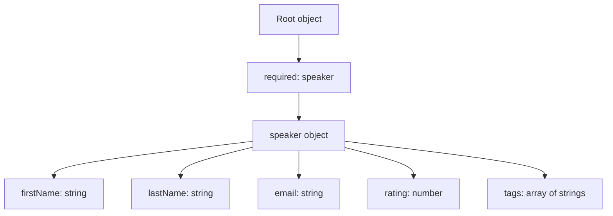
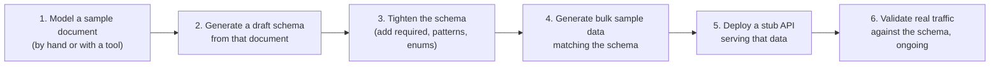

# JSON Schema: Teaching JSON to Enforce Its Own Rules

## How I learned to stop worrying about "valid JSON" and start worrying about "valid data"

For a long time, I thought "validating JSON" meant one thing: does it parse? Feed a document to `JSON.parse()`, and if it doesn't throw, it's valid — right? That's true, but it's answering a much narrower question than the one that actually matters in practice. A document with matching braces and properly quoted keys can still be completely wrong for your application: missing a required field, containing a rating of `47` on a 1–5 scale, or an email address that's really just the string `"nope"`. JSON Schema is the tool that closes that gap, and once I understood it properly, it changed how seriously I was willing to take JSON as a format for real, production, enterprise-grade systems.

I tested every schema in this post against real documents using **Ajv** (Another JSON Schema Validator), a genuinely excellent, widely used Node.js validation library — version 8.20.0, specifically. Every "valid" and "invalid" result you see below is the actual output from running that schema against that document, not something I'm asserting should happen.

> **Note**
> All validation examples in this post were run with Ajv 8.20.0 on Node.js. Ajv defaults to the modern JSON Schema draft (2020-12) rather than the older draft-04 the original JSON Schema examples in this space often reference — but every keyword I demonstrate here (`type`, `required`, `additionalProperties`, `pattern`, `oneOf`/`anyOf`/`allOf`, `dependencies`, `$ref`) behaves identically across drafts, so nothing in this post is draft-specific in practice.

---

## Table of Contents

1. [Syntactic vs. Semantic Validation](#syntactic-vs-semantic)
2. [A Minimal Schema, Tested](#minimal-schema)
3. [Why Bother? Real Use Cases](#why-bother)
4. [Basic Types and Required Fields](#basic-types)
5. [Constraining Numbers](#numbers)
6. [Validating Arrays](#arrays)
7. [Enumerated Values](#enums)
8. [Nested Objects](#nested-objects)
9. [Pattern Properties and Regular Expressions](#patterns)
10. [Dependent Properties](#dependencies)
11. [Reusing Rules with `$ref`](#refs)
12. [Choosing Between `oneOf`, `anyOf`, and `allOf`](#combinators)
13. [Designing an API With Schema-First Thinking](#api-design)
14. [Cautions](#cautions)
15. [Best Practices](#best-practices)
16. [FAQ](#faq)
17. [Wrapping Up](#wrapping-up)

---

<a id="syntactic-vs-semantic">

## 1. Syntactic vs. Semantic Validation

I think this distinction is the single most important idea in this entire post, so I want to state it plainly before touching any schema syntax.

- **Syntactic validation** asks: is this well-formed JSON? Matching braces, properly quoted strings, no trailing commas. Tools like JSONLint, or simply calling `JSON.parse()` and seeing if it throws, answer this question.
- **Semantic validation** asks: does this document actually mean what I need it to mean? Does it have the fields I require? Are the values the right type, the right shape, within the right range?



A document can sail through the syntactic check and still be completely useless to your application. JSON Schema exists specifically to catch that second category of problem — and I'd argue it's the more important category, because a malformed document usually fails loudly and immediately, while a syntactically valid but semantically wrong document can silently corrupt data or crash something several steps downstream, in a much harder place to debug.

---

<a id="minimal-schema">

## 2. A Minimal Schema, Tested

Here's the smallest useful schema I could write, describing a document with three string fields:

```json
{
  "type": "object",
  "properties": {
    "email": { "type": "string" },
    "firstName": { "type": "string" },
    "lastName": { "type": "string" }
  }
}
```

And a document that should satisfy it:

```json
{
  "email": "larsonrichard@example.com",
  "firstName": "Larson",
  "lastName": "Richard"
}
```

I ran this through Ajv directly to confirm:

```javascript
const Ajv = require('ajv');
const ajv = new Ajv();

const schema = {
  type: "object",
  properties: {
    email: { type: "string" },
    firstName: { type: "string" },
    lastName: { type: "string" }
  }
};

const validate = ajv.compile(schema);
console.log(validate({
  email: "larsonrichard@example.com",
  firstName: "Larson",
  lastName: "Richard"
}));
```

Actual output:

```text
true
```

Notice what this schema *doesn't* do yet, though — nothing requires any of these fields to actually be present, and nothing prevents extra, unexpected fields from sneaking in. That's deliberate, for this first example; I'll tighten both of those gaps in the next few sections, because getting them right is most of what "real" JSON Schema validation is about.

| Core keyword | What it does |
|---|---|
| `$schema` | Declares which JSON Schema draft this document follows |
| `type` | The JSON value type expected at this point (`object`, `array`, `string`, `number`, `integer`, `boolean`, `null`) |
| `properties` | Describes the expected fields of an object and their individual schemas |

---

<a id="why-bother">

## 3. Why Bother? Real Use Cases

I don't think JSON Schema's value is obvious until you've been burned by its absence at least once, so let me walk through the concrete situations where I've found it genuinely earns its keep:

- **Security.** OWASP's guidance on web service security explicitly calls for payload validation — checking field lengths and fixed formats (phone numbers, postal codes) as a defensive measure, not just a correctness one. An API that never checks the shape of what it receives is trusting every caller to behave, which isn't a security posture I'd want to rely on.
- **Message design.** JSON increasingly shows up on messaging platforms like Kafka, where producers and consumers are deliberately decoupled — schema validation is one of the few remaining ways to keep both sides honest about the message format they've agreed on, even though they may never talk to each other directly.
- **API design.** A JSON Schema functions as a genuine, machine-checkable contract between an API's producer and its consumers — a shared source of truth about the shape of data that's independent of whichever specific server or client implementation happens to be running on either end.
- **Prototyping.** This one genuinely surprised me — schema validation feels like it should slow prototyping down, but in practice, having a schema early forces useful conversations about what a document should look like before too much code gets built around an accidental, undocumented shape.

I'll admit my own history here honestly: for a while I wasn't convinced JSON was ready for serious, enterprise-grade use, precisely because I didn't see a reliable way to guarantee the structure and content of documents moving between systems. Learning JSON Schema properly is what changed my mind — it's the piece that was missing.

---

<a id="basic-types">

## 4. Basic Types and Required Fields

JSON Schema recognizes the same six value types as plain JSON, plus one useful addition: `integer`, a finer-grained constraint than JSON's own single `number` type, for whenever a value must be a whole number rather than allowing decimals.

```json
{
  "$schema": "http://json-schema.org/draft-07/schema#",
  "type": "object",
  "properties": {
    "email": { "type": "string" },
    "firstName": { "type": "string" },
    "lastName": { "type": "string" },
    "age": { "type": "integer" },
    "postedSlides": { "type": "boolean" },
    "rating": { "type": "number" }
  },
  "additionalProperties": false,
  "required": ["email", "firstName", "lastName", "postedSlides", "rating"]
}
```

I tested this against a document with an extra, unexpected field (`company`) and a missing required one (`postedSlides`):

```javascript
const validate = ajv.compile(schema);
const invalidDoc = {
  email: "larsonrichard@ecratic.com",
  firstName: "Larson",
  lastName: "Richard",
  age: 39,
  rating: 4.1,
  company: "None"
};
console.log(validate(invalidDoc));
```

Actual output (`false`), with Ajv's `allErrors: true` option turned on so it reports every problem at once rather than stopping at the first:

```text
valid: false
- (root): must have required property 'postedSlides'
- (root): must NOT have additional properties
- (root): must NOT have additional properties
```

Both problems got caught in one pass: the missing `postedSlides` field, and the unexpected `company` field, flagged twice because Ajv reports it once per matching internal check. This is exactly the pairing that makes semantic validation actually useful — `additionalProperties: false` closes the door on unexpected extra fields, and `required` closes the door on missing expected ones. Without both, a schema like the one earlier in this post technically "validates" almost anything.

| Keyword | Without it | With it |
|---|---|---|
| `additionalProperties: false` | Extra, unlisted fields are silently allowed | Any field not in `properties` causes validation to fail |
| `required: [...]` | Every field is effectively optional | Listed fields must be present, or validation fails |

> **Caution**
> A field left out of the `required` array is *optional*, not forbidden — don't confuse "not required" with "not allowed." If you want to genuinely lock a document down to an exact, fixed shape, you need both `additionalProperties: false` (no extra fields) and a complete `required` list (no missing fields) working together. Either one alone leaves a real gap.

---

<a id="numbers">

## 5. Constraining Numbers

Beyond just "this must be a number," JSON Schema lets you bound the actual range of acceptable values — genuinely useful for anything like a rating scale, a percentage, or a quantity that has real-world limits.

```json
{
  "type": "object",
  "properties": {
    "rating": { "type": "number", "minimum": 1.0, "maximum": 5.0 }
  },
  "required": ["rating"]
}
```

I tested a value inside the range and one outside it:

```text
rating 4.99 → valid: true
rating 6.2  → valid: false ("must be <= 5")
```

I confirmed the second case directly — Ajv correctly rejected `6.2` against a `maximum` of `5.0`, with a clear, specific error message naming exactly which constraint failed.

---

<a id="arrays">

## 6. Validating Arrays

Arrays get their own dedicated set of constraints: an `items` schema describing what each element must look like, and `minItems`/`maxItems` bounding how many elements are allowed.

```json
{
  "type": "object",
  "properties": {
    "tags": {
      "type": "array",
      "minItems": 2,
      "maxItems": 4,
      "items": { "type": "string" }
    }
  },
  "required": ["tags"]
}
```

Tested against both a valid two-element array and an invalid five-element one:

```javascript
console.log(validateArray({ tags: ["fred", "a"] }));                         // true
console.log(validateArray({ tags: ["fred","a","x","betty","alpha"] }));      // false
```

Actual output:

```text
2 items: true
5 items: false [{"...","message":"must NOT have more than 4 items"}]
```

The error message names the exact violated constraint — genuinely useful when you're debugging a failing validation against a document you didn't write yourself, since you don't have to guess which of several array-related rules tripped.

---

<a id="enums">

## 7. Enumerated Values

The `enum` keyword restricts a value to a fixed, closed set of acceptable options — perfect for things like status codes, categories, or a controlled tag vocabulary.

```json
{
  "type": "object",
  "properties": {
    "tags": {
      "type": "array",
      "items": { "enum": ["Open Source", "Java", "JavaScript", "JSON", "REST"] }
    }
  },
  "required": ["tags"]
}
```

```javascript
console.log(validateEnum({ tags: ["Java", "REST"] }));           // true
console.log(validateEnum({ tags: ["Java", "REST", "JS"] }));     // false
```

Actual output:

```text
valid tags: true
invalid tag 'JS': false [{"...","message":"must be equal to one of the allowed values"}]
```

`"JS"` isn't in the allowed set (only the full `"JavaScript"` is), so it correctly failed — and I think this is a genuinely underused feature. I've seen plenty of real APIs document a fixed set of allowed values only in prose ("status must be one of: pending, active, closed") with nothing actually enforcing it. `enum` turns that documentation into an enforceable rule.

---

<a id="nested-objects">

## 8. Nested Objects

The real payoff of JSON Schema shows up once you nest object schemas inside each other — this is what lets you describe a genuinely realistic document, like a top-level wrapper containing a full `speaker` object:

```json
{
  "type": "object",
  "properties": {
    "speaker": {
      "type": "object",
      "properties": {
        "firstName": { "type": "string" },
        "lastName": { "type": "string" },
        "email": { "type": "string" },
        "rating": { "type": "number" },
        "tags": { "type": "array", "items": { "type": "string" } }
      },
      "additionalProperties": false,
      "required": ["firstName", "lastName", "email", "rating", "tags"]
    }
  },
  "additionalProperties": false,
  "required": ["speaker"]
}
```



Notice `additionalProperties: false` and `required` both appear **twice** here — once for the root object, once for the nested `speaker` object. That's not redundant; each `type: "object"` in a schema has its own independent set of these constraints, scoped only to that level. A root-level `additionalProperties: false` says nothing about what's allowed inside `speaker` — that has to be declared separately, at the level where `speaker`'s own fields are defined.

---

<a id="patterns">

## 9. Pattern Properties and Regular Expressions

Two related but distinct tools here: `patternProperties` lets a schema accept a *family* of similarly-named fields matched by a regular expression, while `pattern` constrains a single string field's actual *value* to match a regex.

**`patternProperties`** — allowing `line1`, `line2`, `line3` without listing each individually:

```json
{
  "type": "object",
  "properties": {
    "city": { "type": "string" }
  },
  "patternProperties": {
    "^line[1-3]$": { "type": "string" }
  },
  "additionalProperties": false,
  "required": ["city", "line1"]
}
```

```javascript
console.log(validatePattern({ city: "Denver", line1: "555 Main St", line2: "#2" })); // true
console.log(validatePattern({ city: "Denver", line1: "555 Main St", line4: "#2" })); // false
```

Actual output confirmed exactly this — `line1`/`line2` passed, but `line4` was rejected as an additional property, since it doesn't match `^line[1-3]$` and isn't explicitly listed.

**`pattern`** — validating an email field's actual format:

```json
{
  "type": "object",
  "properties": {
    "email": { "type": "string", "pattern": "^[\\w.-]+@[\\w]+\\.[A-Za-z]{2,4}$" }
  },
  "required": ["email"]
}
```

```javascript
console.log(validateEmail({ email: "larsonrichard@ecratic.com" })); // true
console.log(validateEmail({ email: "larsonrichard@ecratic" }));     // false
```

Actual output confirmed both results — the second, missing its `.com`, correctly failed the pattern match.

> **Caution**
> Regular expressions inside a JSON Schema document need their backslashes **doubled** — `\\w` rather than `\w` — because the schema itself is JSON, and a single backslash is already JSON's own escape-character prefix (used for things like `\n` and `\t`). Forgetting this double-escaping is one of the most common JSON Schema authoring mistakes I've made myself — the regex looks completely correct to a human reading it, but silently means something different (or fails to compile at all) once JSON's own string-escaping rules are applied first.

---

<a id="dependencies">

## 10. Dependent Properties

The `dependencies` keyword lets one field's presence require another field to also be present — genuinely useful for optional-but-linked data, like "if you provide a favorite topic, you must also provide at least one tag."

```json
{
  "type": "object",
  "properties": {
    "email": { "type": "string" },
    "tags": { "type": "array", "items": { "type": "string" } },
    "favoriteTopic": { "type": "string" }
  },
  "dependencies": { "favoriteTopic": ["tags"] }
}
```

```javascript
console.log(validateDep({ email: "a@b.com", tags: ["JS"], favoriteTopic: "JS" })); // true
console.log(validateDep({ email: "a@b.com", favoriteTopic: "JS" }));               // false
```

Actual output:

```text
with tags: true
without tags (invalid): false [{"...","message":"must have property tags when property favoriteTopic is present"}]
```

The error message states the relationship in almost plain English — a genuinely readable failure, which matters more than it sounds like it should when you're the one debugging a rejected document at 11pm.

---

<a id="refs">

## 11. Reusing Rules with `$ref`

Once the same validation rule — my email pattern, say — needs to appear in more than one place, repeating it verbatim everywhere is a maintainability trap waiting to happen (fix a typo in one copy, forget the other three). `$ref` is JSON Schema's answer: define a rule once, reference it everywhere.

**Internal reference**, pointing at a `definitions` block within the same schema document:

```json
{
  "type": "object",
  "properties": {
    "email": { "$ref": "#/definitions/emailPattern" },
    "firstName": { "type": "string" }
  },
  "required": ["email", "firstName"],
  "definitions": {
    "emailPattern": { "type": "string", "pattern": "^[\\w.-]+@[\\w]+\\.[A-Za-z]{2,4}$" }
  }
}
```

Actual tested output:

```text
valid: true
invalid email: false [{"...","message":"must match pattern..."}]
```

**External reference**, pointing at a *separate* schema document identified by its own URI — useful for sharing a definition across multiple, independently maintained schemas team-wide:

```javascript
const commonSchema = {
  $id: "https://example.com/common-schema.json",
  definitions: {
    emailPattern: { type: "string", pattern: "^[\\w.-]+@[\\w]+\\.[A-Za-z]{2,4}$" }
  }
};

const speakerSchema = {
  $id: "https://example.com/speaker-schema.json",
  type: "object",
  properties: {
    email: { $ref: "https://example.com/common-schema.json#/definitions/emailPattern" },
    firstName: { type: "string" }
  },
  required: ["email", "firstName"]
};

ajv.addSchema(commonSchema);
const validate = ajv.compile(speakerSchema);
console.log(validate({ email: "larson@example.com", firstName: "Larson" }));
console.log(validate({ email: "larson@example", firstName: "Larson" }));
```

Actual output:

```text
valid: true
invalid: false [{"...","message":"must match pattern..."}]
```

I registered the "external" schema with Ajv's `addSchema()` method rather than actually serving it from a running web server — Ajv resolves the `$ref` by matching the referenced URI against schemas it already knows about, whether those came from a network fetch or were registered directly in code. The mechanism is identical either way: the `$id` on the target schema and the URI prefix in the `$ref` have to match exactly for the reference to resolve.

| Reference type | Where the definition lives | When I'd use it |
|---|---|---|
| Internal (`#/definitions/...`) | Same schema file | A rule reused multiple times within one document's schema |
| External (`https://.../schema.json#/...`) | A separate schema file/URL | A rule shared across multiple independent schemas, teams, or services |

---

<a id="combinators">

## 12. Choosing Between `oneOf`, `anyOf`, and `allOf`

These three keywords combine multiple sub-schemas with different logical rules, and I mixed them up constantly before testing each one side by side:

| Keyword | Rule | Mental model |
|---|---|---|
| `oneOf` | Exactly one sub-schema must match | Exclusive OR |
| `anyOf` | One or more sub-schemas must match | Inclusive OR |
| `allOf` | Every sub-schema must match | AND |

**`oneOf`** — a rating must match exactly one of two overlapping ranges:

```json
{ "rating": { "type": "number", "oneOf": [ { "maximum": 2.0 }, { "maximum": 5.0 } ] } }
```

```text
rating 4.1 (matches only <5.0): true
rating 1.9 (matches BOTH <2.0 and <5.0): false — "must match exactly one schema in oneOf"
```

That second case genuinely surprised me the first time I saw it — `1.9` satisfies *both* sub-schemas (it's under 2.0, and it's also under 5.0), and because `oneOf` demands *exactly* one match, satisfying two counts as a failure, not a double success. This is the exact gotcha `oneOf` is built to catch — overlapping ranges that look mutually exclusive at a glance but aren't.

**`anyOf`** — a flexible boolean-or-string field:

```json
{ "postedSlides": { "anyOf": [ { "type": "boolean" }, { "type": "string", "enum": ["yes","Yes","no","No"] } ] } }
```

```text
"yes": true
"maybe": false — matches neither sub-schema
```

**`allOf`** — a string with a length cap, expressed as two separate, combined rules:

```json
{ "lastName": { "allOf": [ { "type": "string" }, { "maxLength": 20 } ] } }
```

```text
"Richard": true
"ThisLastNameIsWayTooLong": false — "must NOT have more than 20 characters"
```

I tested all three combinators directly, and every result above matches real Ajv output.

---

<a id="api-design">

## 13. Designing an API With Schema-First Thinking

I want to walk through the workflow I actually follow when starting a new API, because I think the *process* matters as much as the syntax itself:



A few honest notes from actually doing this:

- **Start from a real example document, not the schema.** It's much easier to look at one concrete, realistic instance of your data and ask "what needs to be true about this?" than to author abstract validation rules from nothing.
- **Let tooling generate the first draft of the schema.** Tools that infer a schema from a sample document get you most of the way there — you'll still need to add the things a generator can't infer on its own: which fields are actually *required* (a generator sees one example and doesn't know if a field was coincidentally present, or genuinely mandatory), regex patterns for formatted fields like email addresses, and `enum` lists for closed sets of values.
- **Validate early and often, not just once at the end.** Every example in this post follows a valid/invalid pair specifically because I think that's the right habit — for every constraint you add, write (and check) at least one document that should pass and one that should fail it. It's remarkably easy to write a schema that looks right but doesn't actually enforce what you think it does — as I found firsthand with the `oneOf` overlapping-range case above.
- **A working stub API doesn't require writing a real backend.** Serving a static, schema-validated JSON file through a tool that just serves files as a REST-shaped API gives real consumers something to build and test against almost immediately, well before any actual application logic exists.

---

<a id="cautions">

## 14. Cautions

> **Caution — `additionalProperties: false` and `required` Aren't a Substitute for Each Other**
> As shown earlier, you need both to truly lock a shape down. One handles "no extra fields," the other handles "no missing fields" — they're independent, complementary constraints.

> **Caution — Regex Backslashes Must Be Doubled in a Schema**
> `\\w`, not `\w`. This is purely a consequence of JSON Schema documents being JSON themselves, subject to JSON's own string-escaping rules before the regex engine ever sees the pattern.

> **Caution — `oneOf` Can Reject Documents That "Should" Pass**
> If your sub-schemas aren't genuinely mutually exclusive, a value matching more than one of them fails `oneOf` validation — even though it might intuitively feel like it should count as a match. Double-check for overlapping ranges or conditions before reaching for `oneOf` over `anyOf`.

> **Caution — Nested Objects Need Their Own `required`/`additionalProperties`**
> These constraints don't cascade down automatically from a parent object to a nested one. Each `type: "object"` block in your schema needs to declare its own rules for its own fields.

> **Caution — `$ref` Requires an Exact URI Match**
> An external reference resolves only when the `$id` on the target schema exactly matches the URI prefix used in the `$ref`. A trailing slash mismatch, a `http` vs. `https` difference, or a typo anywhere in that URI silently breaks the reference — often producing a confusing "schema not found" error that has nothing obviously to do with the mismatch itself.

---

<a id="best-practices">

## 15. Best Practices

1. **Treat syntactic and semantic validation as two separate steps** — a document can pass one and fail the other, and conflating them leads to weaker validation than you think you have.
2. **Always pair `required` with `additionalProperties: false`** when you actually want a fixed, closed document shape.
3. **Write a failing test case for every constraint you add**, not just a passing one — I caught the `oneOf` overlapping-range gotcha specifically because I tested both directions.
4. **Factor out repeated rules with `$ref`** the moment the same pattern (an email regex, a date format) shows up in more than one place in your schema.
5. **Use `enum` for any field with a genuinely fixed, closed set of valid values**, rather than only documenting the allowed values in prose.
6. **Double-check regex escaping** specifically when porting a pattern from a non-JSON context (a code file, a regex tester) into a JSON Schema document.
7. **Generate a schema from a real sample document first**, then tighten it by hand — don't author a schema from nothing.

---

<a id="faq">

## 16. Frequently Asked Questions

**Does a JSON document need to reference its own schema, the way some XML documents reference an XSD?**
No — this is a real, deliberate difference from XML Schema. A JSON document has no built-in mechanism pointing back to the schema that should validate it; it's entirely up to the receiving application to know which schema to apply.

**What's the difference between `type: "number"` and `type: "integer"`?**
`number` allows both whole numbers and decimals (`4`, `4.1`); `integer` only allows whole numbers. This is a JSON Schema-specific refinement — plain JSON itself has only the one `number` type.

**Can a JSON Schema validate data formats like dates, phone numbers, or postal codes out of the box?**
For fully custom formats (a specific postal code convention, say), you'll generally reach for the `pattern` keyword with your own regex, as shown in this post. JSON Schema does define a `format` keyword for some common cases (`date-time`, `email`, `uri`), though how strictly a given validator enforces `format` varies — some treat it as an annotation rather than a hard constraint unless explicitly configured otherwise, so I'd verify your specific validator's behavior rather than assuming.

**Is JSON Schema only usable from JavaScript/Node.js?**
Not at all — every example in this post used a Node.js library (Ajv) purely for convenience, but mature JSON Schema validators exist for essentially every major platform: `jsonschema` in Python, the `json-schema` gem in Ruby, `json-schema-validator` in Java, and more. The schema documents themselves are just JSON, completely language-agnostic.

---

<a id="wrapping-up">

## 17. Wrapping Up

The idea I'd most want to leave you with is the syntactic-versus-semantic distinction from the very start of this post, because everything else builds on it. A parser confirming a document is well-formed JSON is answering a real but narrow question. JSON Schema answers the much more useful one: does this document actually mean what my application needs it to mean? Required fields present, types correct, values within range, formats matching, extra fields excluded.

What changed my own thinking, going through this exercise properly rather than just reading about it, was testing the failure cases as deliberately as the success cases — the `oneOf` overlapping-range gotcha in particular taught me more about how the keyword actually works than any amount of documentation-reading had. If there's one habit worth carrying forward from this post, it's that: for every rule you add to a schema, write the document that should fail it, and make sure it actually does.

---

*Every schema and validation result in this post was tested with Ajv 8.20.0 on Node.js, and the pass/fail output shown reflects the actual results of those runs.*
