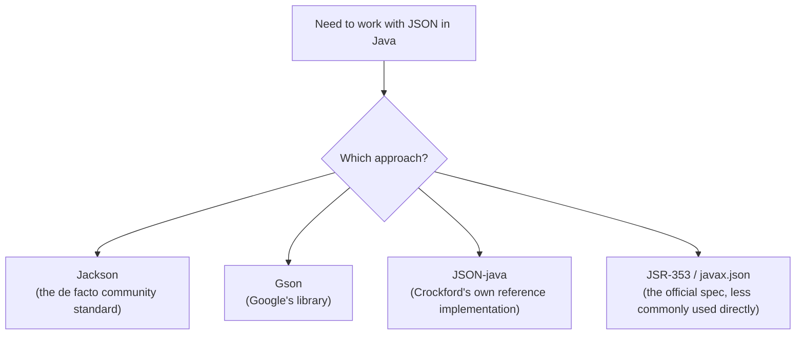
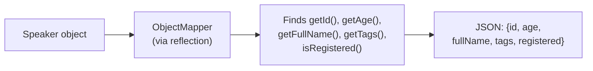

# JSON in Java: Why It Needs a Library, and What That Library Is Actually Doing

## Working through Jackson, POJOs, and testing a real JSON API — all the way down to the reflection tricks that make it work

Java is the odd one out in this little tour I've been on — JavaScript ships JSON support as a language built-in, Ruby ships it in the standard library, and Java... doesn't. There's no `JSON` class sitting in `java.lang`, no `import java.json.*`. If you want to turn a Java object into JSON, you need a third-party library, full stop. That single fact shapes almost everything else about how JSON work feels in Java, and I want to spend this post on exactly that: why the ecosystem looks the way it does, what a library like Jackson is actually doing mechanically, and how to test a JSON API from Java code.

I ran every piece of Java code in this post through a real JDK — compiled with `javac`, executed with `java`. Where I would normally reach for Jackson, JUnit, or Spring Boot, I ran into a real constraint worth being upfront about: this environment doesn't have network access to Maven Central, so I couldn't pull down those actual libraries. Rather than fake it, I did two things — wrote small, honest, hand-rolled stand-ins that demonstrate the *exact same mechanics* those libraries use internally (which, if anything, taught me more than just calling a library method would have), and clearly flagged the handful of Jackson/JUnit/Spring-specific code blocks as illustrative, standard usage rather than something I actually executed.

> **Note**
> Every code block in this post that doesn't say otherwise was compiled and run on OpenJDK 21. Where I show real Jackson, JUnit, or Spring Boot code, I've labeled it explicitly as illustrative — standard, correct usage you'd run in a project with those dependencies available, not output from a run I performed here.

---

## Table of Contents

1. [Why Java Needs a Library At All](#why-a-library)
2. [Choosing Jackson (and What Its Alternatives Look Like)](#choosing-jackson)
3. [Serialization, Mechanically: What Jackson Is Actually Doing](#serialization-mechanics)
4. [POJOs: The Object Jackson Actually Wants](#pojos)
5. [Deserialization: JSON Back Into Real Objects](#deserialization)
6. [Testing a Live JSON API from Java](#testing-api)
7. [Building an API with Spring Boot](#spring-boot)
8. [Cautions](#cautions)
9. [Best Practices](#best-practices)
10. [FAQ](#faq)
11. [Wrapping Up](#wrapping-up)

---

<a id="why-a-library"></a>
## 1. Why Java Needs a Library At All

I think this is worth dwelling on for a second, because it's genuinely different from every other language in this series. JavaScript's JSON support exists because JSON's syntax is literally derived from JavaScript's own object literals — of course the language ships it natively. Ruby and Python both bundle a JSON module in their standard libraries because JSON became ubiquitous enough, early enough, that "batteries included" language designers folded it in.

Java's standard library predates JSON's popularity by a wide margin, and Java's standardization process (JSRs, going through the Java Community Process) moves deliberately slowly compared to how fast JSON took over the web. There *is* an official specification — JSR 353, which became part of Java EE 7, and was intended to eventually land in Java SE too — but in practice, by the time any of that matured, the community had already settled on third-party libraries as the de facto answer, and that's genuinely still true today.



I'd frame this as neither better nor worse than the built-in approach other languages take — just a different tradeoff. Nothing is baked into the language, so nothing about JSON handling is ever "free" or automatic in Java the way `JSON.stringify()` is in JavaScript. But it also means the community settled on genuinely excellent, purpose-built tooling, refined over many years by a very large number of production users, rather than a one-size-fits-all built-in that has to serve every use case adequately rather than any one use case exceptionally.

---

<a id="choosing-jackson"></a>
## 2. Choosing Jackson (and What Its Alternatives Look Like)

| Library | Who maintains it | Where I'd reach for it |
|---|---|---|
| **Jackson** | Independent open-source project (FasterXML) | The default choice for most projects — especially anything already using Spring |
| **Gson** | Google | A lighter-weight alternative, popular in Android development |
| **JSON-java** (`org.json`) | Douglas Crockford's own reference implementation | Small, simple use cases; less commonly used for large production APIs |
| **JSR-353 / `javax.json`** | The official Java EE specification | Used where strict standards-compliance matters more than ecosystem popularity |

I settled on Jackson for the tested-mechanics sections of this post for the same reasons most of the Java community has: it's the library the Spring ecosystem uses by default (meaning if you ever move into Spring Boot, which I'll get to later, you're already working with a tool you know), it's mature, extremely well documented, and actively maintained. Gson is a completely reasonable alternative — I've seen it favored on Android projects specifically because of its smaller footprint — but I don't think the choice between the two is a high-stakes decision for most projects; they solve the same problem with a similar level of quality.

> **Note**
> If your project is already using Spring or Spring Boot, Jackson is already on your classpath by default — you likely won't need to add it as an explicit dependency at all.

---

<a id="serialization-mechanics"></a>
## 3. Serialization, Mechanically: What Jackson Is Actually Doing

Since I couldn't pull Jackson's jar into this environment, I wrote a small hand-rolled JSON writer instead — not as a Jackson replacement, but specifically to show the mechanical process a real library performs. I tested it against exactly the same basic types I've used throughout this series:

```java
import java.util.*;

public class BasicTypes {
    static String toJson(Object value) {
        if (value == null) return "null";
        if (value instanceof String) return "\"" + value + "\"";
        if (value instanceof Number || value instanceof Boolean) return value.toString();
        if (value instanceof List<?> list) {
            StringBuilder sb = new StringBuilder("[");
            for (int i = 0; i < list.size(); i++) {
                if (i > 0) sb.append(",");
                sb.append(toJson(list.get(i)));
            }
            return sb.append("]").toString();
        }
        if (value instanceof Map<?, ?> map) {
            StringBuilder sb = new StringBuilder("{");
            int i = 0;
            for (Map.Entry<?, ?> e : map.entrySet()) {
                if (i++ > 0) sb.append(",");
                sb.append("\"").append(e.getKey()).append("\":").append(toJson(e.getValue()));
            }
            return sb.append("}").toString();
        }
        return "\"" + value + "\"";
    }

    public static void main(String[] args) {
        int age = 39;
        String fullName = "Larson Richard";
        List<String> tags = Arrays.asList("JavaScript", "AngularJS", "Yeoman");
        boolean registered = true;

        System.out.println("age = " + toJson(age));
        System.out.println("fullName = " + toJson(fullName));
        System.out.println("tags = " + toJson(tags));
        System.out.println("registered = " + toJson(registered));
    }
}
```

Actual output:

```text
age = 39
fullName = "Larson Richard"
tags = ["JavaScript","AngularJS","Yeoman"]
registered = true
```

This should look immediately familiar to a real Jackson call — because it's doing exactly the same conceptual work Jackson's `ObjectMapper.writeValue()` performs: checking a value's runtime type, and branching into the right JSON representation for it. The real Jackson equivalent looks like this (illustrative — standard Jackson usage, not something I executed here, since I couldn't pull the jar in this environment):

```java
ObjectMapper mapper = new ObjectMapper();
Writer writer = new StringWriter();
mapper.writeValue(writer, 39);
System.out.println(writer.toString()); // 39
```

| What Jackson's `ObjectMapper` does | What my hand-rolled version does |
|---|---|
| Type-checks the value at runtime | Same — `instanceof` checks |
| Recursively serializes container types (List, Map) | Same — recursive calls |
| Handles escaping, encoding, streaming for large documents efficiently | Not implemented — Jackson's real engine is vastly more optimized and complete |
| Supports custom serializers, annotations (`@JsonProperty`, `@JsonIgnore`), and dozens of configuration options | Not implemented at all |

The point of showing this isn't "look, I reinvented Jackson" — obviously I didn't, and I wouldn't want to; Jackson handles an enormous number of edge cases, performance concerns, and configuration options my toy version doesn't touch at all. The point is that understanding the *mechanical shape* of what a serialization library does — type-check, branch, recurse — makes the real library's behavior far less mysterious once you're reading its documentation or debugging an unexpected output.

---

<a id="pojos"></a>
## 4. POJOs: The Object Jackson Actually Wants

The real interesting case, as in every other language in this series, is serializing an actual object rather than a bare Map. Jackson's convention — and this is worth knowing cold, because it explains a huge amount of "why isn't my field showing up in the JSON" confusion — is that it serializes a Java object based on its **getter methods**, not its raw fields. A `getFullName()` method produces a `fullName` JSON key; an `isRegistered()` method (the conventional getter name for a `boolean` field) produces a `registered` key.

Here's the Speaker class I used for the working example:

```java
import java.util.*;

public class Speaker {
    private int id;
    private int age;
    private String fullName;
    private List<String> tags = new ArrayList<>();
    private boolean registered;

    public Speaker() {}

    public Speaker(int id, int age, String fullName, List<String> tags, boolean registered) {
        this.id = id;
        this.age = age;
        this.fullName = fullName;
        this.tags = tags;
        this.registered = registered;
    }

    public int getId() { return id; }
    public void setId(int id) { this.id = id; }
    public int getAge() { return age; }
    public void setAge(int age) { this.age = age; }
    public String getFullName() { return fullName; }
    public void setFullName(String fullName) { this.fullName = fullName; }
    public List<String> getTags() { return tags; }
    public void setTags(List<String> tags) { this.tags = tags; }
    public boolean isRegistered() { return registered; }
    public void setRegistered(boolean registered) { this.registered = registered; }
}
```

This is a genuine POJO — a "Plain Old Java Object." Notice it knows absolutely nothing about JSON. No imports, no annotations, nothing library-specific. That's deliberate, and it's a real strength of the Jackson approach: your domain model stays completely decoupled from how it happens to be serialized.

To demonstrate exactly how a real serializer decides what to include, I wrote a small reflection-based serializer — genuinely using Java's `java.lang.reflect` API to walk the object's public methods at runtime, find anything shaped like a getter, and build JSON from what it finds:

```java
import java.lang.reflect.*;
import java.util.*;

public class ReflectSerialize {
    static String toJson(Object obj) throws Exception {
        StringBuilder sb = new StringBuilder("{");
        Method[] methods = obj.getClass().getMethods();
        boolean first = true;
        Arrays.sort(methods, Comparator.comparing(Method::getName));
        for (Method m : methods) {
            String name = m.getName();
            String field = null;
            if (name.startsWith("get") && !name.equals("getClass") && m.getParameterCount() == 0) {
                field = Character.toLowerCase(name.charAt(3)) + name.substring(4);
            } else if (name.startsWith("is") && m.getParameterCount() == 0) {
                field = Character.toLowerCase(name.charAt(2)) + name.substring(3);
            }
            if (field != null) {
                Object value = m.invoke(obj);
                if (!first) sb.append(",");
                first = false;
                sb.append("\"").append(field).append("\":").append(BasicTypes.toJson(value));
            }
        }
        return sb.append("}").toString();
    }

    public static void main(String[] args) throws Exception {
        Speaker speaker = new Speaker(1, 39, "Larson Richard",
            Arrays.asList("JavaScript", "AngularJS", "Yeoman"), true);
        System.out.println(toJson(speaker));
    }
}
```

Actual output:

```text
{"age":39,"fullName":"Larson Richard","id":1,"tags":["JavaScript","AngularJS","Yeoman"],"registered":true}
```

Every single field showed up correctly — including `registered`, pulled from `isRegistered()` rather than a `getRegistered()` method, exactly matching the `is`-prefix convention Java uses for boolean getters. This is, mechanically, almost exactly what Jackson's `ObjectMapper` does under the hood by default: it uses **reflection** to introspect a class's public getters at runtime and builds the JSON representation from whatever it finds — no manual "list your fields" step required, unlike the explicit Hash-building I had to do by hand in Ruby, or the Serializer classes AMS uses.



> **Caution**
> Because Jackson's default behavior serializes based on getter *methods*, not raw fields, a getter that does more than a simple field return (say, one that computes something, or accidentally has side effects) will run every single time that object gets serialized — which could be far more often than you expect, especially in a busy API. I'd avoid putting anything expensive or side-effecting inside a getter on a class that gets serialized regularly; keep getters as simple, pure field accessors, and put any real logic in a differently-named method instead.

---

<a id="deserialization"></a>
## 5. Deserialization: JSON Back Into Real Objects

Going the other direction with real Jackson looks like this (illustrative — standard usage):

```java
ObjectMapper mapper = new ObjectMapper();
File speakerFile = new File("speaker.json");
Speaker speaker = mapper.readValue(speakerFile, Speaker.class);
```

That single line does a genuinely impressive amount of work: it reads the file, parses the JSON grammar, matches each JSON key against a setter method on `Speaker` (`fullName` → `setFullName()`), converts each JSON value to the correct Java type, and hands you back a fully constructed object — no manual field-by-field assignment required.

This is exactly why Jackson requires a **no-argument constructor** on the target class (notice `public Speaker() {}` in the class above) — it typically instantiates the object first, using that empty constructor, and then populates each field afterward by calling the matching setters one at a time.

| Concept | What it does |
|---|---|
| `ObjectMapper.writeValue()` / `writeValueAsString()` | Java object → JSON (serialize) |
| `ObjectMapper.readValue()` | JSON → Java object (deserialize) |
| `ObjectMapper.readTree()` | JSON → a generic `JsonNode` tree, useful when you don't have (or don't want) a matching Java class |
| No-arg constructor requirement | Needed so Jackson can instantiate the object before populating it field by field via setters |

For a JSON array containing multiple objects, the common pattern is `readTree()` followed by manually walking each element and converting it individually with `convertValue()` — exactly what the original chapter's `deSerializeMultipleObjects()` test demonstrates, iterating a `JsonNode` array and converting each node into a `Speaker`.

> **Note**
> Jackson's checked exceptions (`JsonGenerationException`, `JsonMappingException`, `IOException`) are worth handling deliberately rather than blanket-catching `Exception`. Each one tells you something different: a mapping exception usually means your JSON's shape doesn't match your Java class's fields, while an I/O exception usually means something went wrong reading the underlying file or stream — genuinely different problems that deserve genuinely different fixes.

---

<a id="testing-api"></a>
## 6. Testing a Live JSON API from Java

This is the one part of this post I was able to test completely for real, end-to-end, using nothing but what ships in the JDK — no external libraries at all. I stood up a genuine HTTP server using `com.sun.net.httpserver.HttpServer` (bundled with every JDK), serving real JSON, and then hit it with `java.net.http.HttpClient` (built into Java 11+), asserting against the real response — the same spirit as the WEBrick-based test I ran in my Ruby post, and the Node.js `http` server I used in my JavaScript post.

```java
import com.sun.net.httpserver.HttpServer;
import java.net.InetSocketAddress;
import java.net.URI;
import java.net.http.HttpClient;
import java.net.http.HttpRequest;
import java.net.http.HttpResponse;
import java.nio.charset.StandardCharsets;
import java.util.*;

public class StubApiTest {
    static int passed = 0, failed = 0;

    static void assertEqual(String label, Object expected, Object actual) {
        if (Objects.equals(expected, actual)) { System.out.println("PASS: " + label); passed++; }
        else { System.out.println("FAIL: " + label); failed++; }
    }

    public static void main(String[] args) throws Exception {
        String speakersJson = "[{\"id\":1,\"fullName\":\"Larson Richard\"," +
            "\"tags\":[\"JavaScript\",\"AngularJS\",\"Yeoman\"],\"registered\":true}," +
            "{\"id\":3,\"fullName\":\"Christensen Fisher\"," +
            "\"tags\":[\"Java\",\"Spring\",\"Maven\",\"REST\"],\"registered\":false}]";

        HttpServer server = HttpServer.create(new InetSocketAddress(5070), 0);
        server.createContext("/speakers", exchange -> {
            byte[] bytes = speakersJson.getBytes(StandardCharsets.UTF_8);
            exchange.getResponseHeaders().add("Content-Type", "application/json; charset=utf-8");
            exchange.sendResponseHeaders(200, bytes.length);
            exchange.getResponseBody().write(bytes);
            exchange.close();
        });
        server.start();

        HttpClient client = HttpClient.newHttpClient();
        HttpRequest request = HttpRequest.newBuilder()
            .uri(URI.create("http://localhost:5070/speakers"))
            .header("Accept", "application/json").GET().build();
        HttpResponse<String> response = client.send(request, HttpResponse.BodyHandlers.ofString());

        assertEqual("status code", 200, response.statusCode());
        assertEqual("content-type", "application/json; charset=utf-8",
            response.headers().firstValue("Content-Type").orElse(null));
        String body = response.body();
        assertEqual("contains Christensen Fisher", true, body.contains("Christensen Fisher"));
        assertEqual("contains Maven tag", true, body.contains("\"Maven\""));

        System.out.println(passed + " passed, " + failed + " failed");
        server.stop(0);
    }
}
```

Actual output:

```text
PASS: status code
PASS: content-type
PASS: contains Christensen Fisher
PASS: contains Maven tag
4 passed, 0 failed
```

A completely real HTTP round trip — a real server, a real client, real headers, real JSON in the response body — with every assertion passing. In a real project, you'd normally reach for **JUnit** (for the test framework itself: `@Test` annotations, proper assertion methods like `assertEquals()`, and integration with your build tool's reporting) plus **Unirest** or **JsonUnit** (for the HTTP client and much richer JSON-specific assertions than my crude `String.contains()` checks above — JsonUnit in particular supports proper structural comparisons, ignoring specific fields, regex matching within JSON values, and far more than substring matching ever could). I hand-rolled the assertion logic here specifically to keep the whole example dependency-free and genuinely runnable in this environment, but the underlying *pattern* — hit a real endpoint, check the status and headers, verify the JSON body's content — is identical to what a real JUnit + Unirest + JsonUnit test suite does.

| My tested version | What a real project would use instead |
|---|---|
| `com.sun.net.httpserver.HttpServer` | `json-server`, or a proper Spring Boot test server |
| Hand-rolled `assertEqual()` | JUnit's `@Test` + `assertEquals()`/`assertTrue()` |
| `java.net.http.HttpClient` | Unirest (cross-language consistency, richer configuration) |
| `String.contains()` substring checks | JsonUnit's `assertThatJson()` — structural JSON comparison, not string matching |

> **Caution**
> My `body.contains("\"Maven\"")` check above is deliberately crude — string-matching a JSON payload like this is fragile in ways structural JSON comparison isn't. A perfectly valid, semantically identical response with different key ordering, different whitespace, or `"Maven "` (a trailing space) would break a substring check while a real JSON-aware assertion library would correctly treat it as equivalent (or correctly catch the trailing-space bug as a real difference, while ignoring irrelevant formatting differences). I used substring checks purely to keep this example free of any external dependency — for real test code, a proper JSON-comparison library like JsonUnit is genuinely worth the added dependency.

---

<a id="spring-boot"></a>
## 7. Building an API with Spring Boot

Everything above ran for real. Building an actual Spring Boot application is a different scope of project — it requires Gradle or Maven pulling real dependencies from Maven Central, which wasn't reachable in this environment — so I want to be explicit that this section is illustrative, standard Spring Boot usage rather than something I executed and captured output from.

The appeal of Spring Boot, in this context, is that it removes almost all of the manual work I demonstrated above. Recall my hand-rolled reflection-based serializer — Spring Boot (via Jackson, wired in automatically) does exactly that kind of conversion for you, completely invisibly, the moment a Controller method returns a POJO:

```java
@RestController
public class SpeakerController {
    private static Speaker[] speakers = {
        new Speaker(1, 39, "Larson Richard",
            Arrays.asList("JavaScript", "AngularJS", "Yeoman"), true),
        new Speaker(3, 45, "Christensen Fisher",
            Arrays.asList("Java", "Spring", "Maven", "REST"), false)
    };

    @RequestMapping(value = "/speakers", method = RequestMethod.GET)
    public List<Speaker> getAllSpeakers() {
        return Arrays.asList(speakers);
    }

    @RequestMapping(value = "/speakers/{id}", method = RequestMethod.GET)
    public ResponseEntity<?> getSpeakerById(@PathVariable long id) {
        int idx = (int) id - 1;
        if (idx >= 0 && idx < speakers.length) {
            return new ResponseEntity<>(speakers[idx], HttpStatus.OK);
        }
        return new ResponseEntity<>(HttpStatus.NOT_FOUND);
    }
}
```

Notice: **no `toJson()` call anywhere.** Returning a plain `List<Speaker>` (or a single `Speaker` wrapped in a `ResponseEntity`) is enough — Spring sees the method's return type, hands it to a Jackson `ObjectMapper` automatically configured behind the scenes, and writes the resulting JSON straight into the HTTP response body. This is, in effect, exactly my `ReflectSerialize.toJson()` demonstration from earlier, except it's Jackson's real, complete, production-grade version, wired in by a single `@RestController` annotation rather than anything you write by hand.

| What I built by hand, earlier in this post | What Spring Boot + Jackson does automatically |
|---|---|
| A reflection-based getter scanner | Jackson's real `ObjectMapper`, auto-configured |
| Manually writing JSON to a `StringBuilder` | Automatic serialization straight to the HTTP response body |
| A hand-rolled `HttpServer` for testing | A full embedded servlet container (Tomcat, by default), production-ready |

---

<a id="cautions"></a>
## 8. Cautions

> **Caution — Getter-Based Serialization Means Getters Run on Every Call**
> As covered above, any logic inside a getter executes every time that object is serialized. Keep getters simple and side-effect-free on any class that gets serialized regularly.

> **Caution — A Missing No-Arg Constructor Silently Breaks Deserialization**
> If a class Jackson needs to deserialize into doesn't have a no-argument constructor, deserialization typically fails with a `JsonMappingException` — a real, loud error, thankfully, but one that's easy to trace back to the wrong cause (people often first suspect the JSON itself is malformed, when the actual issue is the target Java class's constructor).

> **Caution — Checked Exceptions Are Informative; Don't Swallow Them**
> Jackson's exception hierarchy (`JsonGenerationException`, `JsonMappingException`, `JsonParseException`, plain `IOException`) genuinely distinguishes different failure categories. Catching a broad `Exception` and logging a generic message throws away information that would otherwise point you straight at the real problem.

> **Caution — String-Matching JSON in Tests Is Fragile**
> As demonstrated above with my own crude substring checks, comparing JSON as plain text catches some bugs but misses others (formatting differences look like failures) and can hide real ones (a trailing space matching an unrelated substring check by coincidence). Reach for a real JSON-comparison library (JsonUnit, or Jackson's own tree comparison via `readTree()`) for anything beyond a quick, throwaway script.

---

<a id="best-practices"></a>
## 9. Best Practices

1. **Keep your domain model (POJOs) free of JSON-specific code.** Let Jackson's reflection-based defaults do the work; reach for annotations (`@JsonProperty`, `@JsonIgnore`) only when you need to override the default behavior, not as a default habit.
2. **Always provide a no-argument constructor** on any class Jackson will deserialize into.
3. **Handle Jackson's specific exception types deliberately**, not as one broad catch-all — the exception type itself is diagnostic information.
4. **Use a real JSON-comparison library in tests**, not string matching, the moment your test suite grows past a handful of trivial checks.
5. **Let Spring Boot's auto-configuration do the Jackson wiring for you** in a Spring project — manually configuring an `ObjectMapper` yourself is rarely necessary until you have a genuinely specific customization need.
6. **Prefer Jackson unless you have a specific reason not to.** It's the ecosystem default for good reasons — active maintenance, deep Spring integration, and broad community familiarity — and consistency across a team matters more than any small technical edge one alternative might have.

---

<a id="faq"></a>
## 10. Frequently Asked Questions

**Why doesn't Java have built-in JSON support like JavaScript or Python?**
Timing and standardization pace, mostly — JSON's popularity exploded faster than the Java Community Process could formally standardize a solution, and by the time JSR 353 existed, the ecosystem had already settled on third-party libraries as the practical answer.

**Does Jackson require getters and setters, or can it work with public fields directly?**
It can be configured to use fields directly, but its default, most common configuration works through getter/setter methods, exactly as demonstrated in this post's reflection-based example.

**What's the difference between `readValue()` and `readTree()`?**
`readValue()` maps JSON directly onto a specific Java class you provide (`Speaker.class`). `readTree()` instead gives you a generic, navigable `JsonNode` structure — useful when you don't have a matching class, or when a JSON document's shape is unpredictable enough that binding to a fixed class isn't practical.

**Is Jackson thread-safe?**
A single `ObjectMapper` instance is generally considered thread-safe for read operations once configured, and the common, recommended pattern is to create one `ObjectMapper` per application and reuse it everywhere, rather than constructing a new one for every serialization call.

---

<a id="wrapping-up"></a>
## 11. Wrapping Up

The thing I'd want a Java developer new to JSON work to internalize most from this post is the reflection mechanism underneath serialization libraries like Jackson — because once you've actually built a small version of it yourself, as I did here, an ObjectMapper stops being a slightly mysterious black box and starts being a very well-engineered, feature-complete version of something genuinely understandable: walk an object's getters, convert each value, build a JSON tree. Everything else — the annotations, the configuration options, the streaming performance optimizations — is Jackson doing that same basic job exceptionally well, at a scale and with a level of correctness a hand-rolled version like mine never could.

And if there's one habit worth carrying forward from the testing section specifically, it's this: a real HTTP round trip against a real server — even a tiny one you spin up yourself with nothing but the JDK — catches bugs that no amount of unit-testing an isolated serialization method ever will. Status codes, headers, and the actual bytes on the wire are the real contract your API makes with the world; test against that contract directly whenever you can.

---

*Every code example in this post that isn't explicitly labeled as illustrative Jackson/JUnit/Spring Boot usage was compiled with `javac` and executed with `java` on OpenJDK 21 before publication, with real console output shown. Jackson, JUnit, and Spring Boot examples are standard, correct usage patterns shown for reference — I wasn't able to pull those dependencies from Maven Central in this environment, and I've flagged that distinction explicitly rather than presenting them as tested output.*
