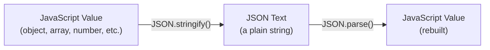
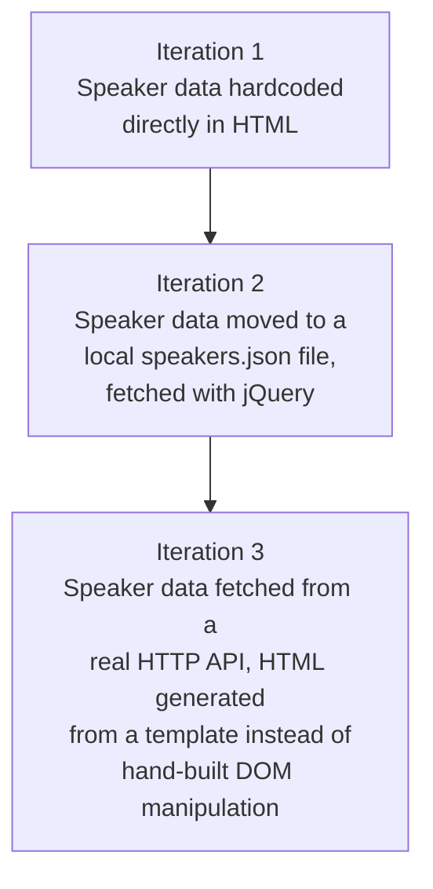

# JSON in JavaScript: Serialization, Deserialization, and Building Something Real With It

## A hands-on guide to `JSON.stringify()`, `JSON.parse()`, and everything I've learned building on top of them

JSON started its life as JavaScript's own object-literal syntax, so it's fitting that JavaScript is where most people — myself included — first learn to work with it seriously. In my earlier post I covered JSON's grammar in the abstract: objects, arrays, the six value types, the standards bodies, the history. This post is the opposite kind of writing. I'm not going to describe JSON — I'm going to *use* it, in real, runnable JavaScript, and show you exactly what happens at every step, because I think that's the only way this stuff actually sticks.

I ran every code sample in this post through Node.js before including it here. Where the output matters (and with JSON, the output almost always matters — that's the whole point of a serialization format), I'm showing you the actual console output from the actual run, not a guess at what it should look like.

> **Note**
> All examples in this post were executed on Node.js v22. The core `JSON.stringify()` / `JSON.parse()` behavior has been stable and part of the language since ECMAScript 5 (2009), so you can expect essentially identical results on any reasonably modern JavaScript runtime — browser or server.

---

## Table of Contents

1. [The JSON Object in JavaScript](#the-json-object)
2. [Serializing Simple Data Types](#serializing-simple-types)
3. [The Full `stringify()` Signature: `replacer` and `space`](#stringify-signature)
4. [Customizing Serialization with `toJSON()`](#tojson)
5. [Why `eval()` Was a Security Problem](#eval-vs-parse)
6. [Deserializing Into Real Objects](#deserializing)
7. [JavaScript Objects and JSON: Where They Overlap, Where They Don't](#objects-and-json)
8. [Setting Up a Stub API to Practice Against](#stub-api)
9. [Testing JSON-Based API Calls](#testing)
10. [Building a Small Web Application, Iteration by Iteration](#web-app)
11. [Templating Instead of Hand-Building HTML](#templating)
12. [Cautions I've Collected Along the Way](#cautions)
13. [Best Practices](#best-practices)
14. [A Short Story: The Bug That Made Me Actually Understand `undefined`](#case-study)
15. [Frequently Asked Questions](#faq)
16. [Where to Go From Here](#where-next)
17. [Wrapping Up](#wrapping-up)

---

<a id="the-json-object"></a>
## 1. The JSON Object in JavaScript

Before touching any code, I want to establish what `JSON` actually *is* as a JavaScript value, because it trips people up in a small but real way. `JSON` is a built-in global object — much like `Math` — and it has exactly two jobs:

| Method | Direction | Job |
|---|---|---|
| `JSON.stringify()` | JavaScript value → JSON text | Serialization |
| `JSON.parse()` | JSON text → JavaScript value | Deserialization |

A few things worth knowing about the `JSON` object itself:

- **You cannot instantiate it.** There's no `new JSON()` — trying that throws a `TypeError`. It exists purely as a namespace holding two static methods.
- **It has no other functionality.** No configuration object, no state, no constructor. Just those two methods (plus a lesser-known third, `JSON.rawJSON()`, added much later for a niche use case — I won't cover that one here since you're unlikely to need it).
- **It's been standard since ECMAScript 5, in 2009.** Before that, JSON support in browsers came from a third-party library (Douglas Crockford's own `json2.js` was the common polyfill). If you ever see code loading `json2.js`, you're looking at something written for a genuinely ancient browser.

I like the term *serialization* here specifically because it captures what's happening: you're taking something that only exists in your program's memory — with references, functions, and live objects — and *flattening* it into a plain string that means the same thing to any other program that knows how to read JSON. Deserialization is the reverse: taking that flat string and rebuilding a live, usable data structure from it.



---

<a id="serializing-simple-types"></a>
## 2. Serializing Simple Data Types

Let's start at the simplest possible level — passing each of JavaScript's basic data types through `JSON.stringify()` one at a time, to see exactly how each one comes out the other side.

```javascript
var age = 39; // Number
console.log('age = ' + JSON.stringify(age));

var fullName = 'Larson Richard'; // String
console.log('fullName = ' + JSON.stringify(fullName));

var tags = ['json', 'rest', 'api', 'oauth']; // Array
console.log('tags = ' + JSON.stringify(tags));

var registered = true; // Boolean
console.log('registered = ' + JSON.stringify(registered));

var speaker = {
  firstName: 'Larson',
  lastName: 'Richard',
  email: 'larsonrichard@example.com',
  company: 'Ecratic',
  tags: ['json', 'rest', 'api', 'oauth'],
  registered: true
};
console.log('speaker = ' + JSON.stringify(speaker));
```

Actual output from running this:

```text
age = 39
fullName = "Larson Richard"
tags = ["json","rest","api","oauth"]
registered = true
speaker = {"firstName":"Larson","lastName":"Richard","email":"larsonrichard@example.com","company":"Ecratic","tags":["json","rest","api","oauth"],"registered":true}
```

A couple of observations I'd pull out of this run:

- Scalars aren't very interesting to stringify on their own — a number stringifies to itself, a string gets wrapped in double quotes (note: `fullName` printed with visible `"` characters, because `JSON.stringify()` on a string produces a *quoted* JSON string literal, not the bare text). This is a subtle but important distinction: `JSON.stringify('hello')` returns `"hello"` (five characters, quotes included) — not `hello`.
- The real value of `stringify()` shows up once you hand it an object — that's where it actually does structural work, walking every property and recursively serializing each value.
- Notice the object came out completely unformatted — no spaces, no line breaks. That's `stringify()`'s default behavior, and it's exactly what you want for data going over the wire, but exactly what you *don't* want if a human is going to read it. That's what the next section covers.

| Input type | `JSON.stringify()` output | Notes |
|---|---|---|
| `39` (Number) | `39` | Numbers stringify to themselves |
| `'Larson Richard'` (String) | `"Larson Richard"` | Gets wrapped in double quotes |
| `['json', 'rest']` (Array) | `["json","rest"]` | Single quotes become double quotes |
| `true` (Boolean) | `true` | Unchanged |
| `{ ... }` (Object) | `{"key":"value",...}` | Recursively serialized, unquoted keys become quoted keys |

---

<a id="stringify-signature"></a>
## 3. The Full `stringify()` Signature: `replacer` and `space`

`JSON.stringify()` actually takes three parameters, and the second two are genuinely useful in day-to-day work, not just trivia:

```javascript
JSON.stringify(value[, replacer[, space]])
```

| Parameter | Required? | Purpose |
|---|---|---|
| `value` | Yes | The JavaScript value to serialize |
| `replacer` | No | A function or an array that filters or transforms what gets included |
| `space` | No | A number (spaces per indent level) or string (literal indent text) used for pretty-printing |

Let's put both optional parameters to work at once — pretty-printing the speaker object, and then using a replacer function to strip out every string and array field, keeping only everything else:

```javascript
var speaker = {
  firstName: 'Larson',
  lastName: 'Richard',
  email: 'larsonrichard@example.com',
  company: 'Ecratic',
  tags: ['json', 'rest', 'api', 'oauth'],
  registered: true
};

function serializeSpeaker(key, value) {
  return (typeof value === 'string' || Array.isArray(value)) ? undefined : value;
}

console.log('Speaker (pretty print):');
console.log(JSON.stringify(speaker, null, 2));

console.log('\nSpeaker without Strings and Arrays:');
console.log(JSON.stringify(speaker, serializeSpeaker, 2));
```

Actual output:

```text
Speaker (pretty print):
{
  "firstName": "Larson",
  "lastName": "Richard",
  "email": "larsonrichard@example.com",
  "company": "Ecratic",
  "tags": [
    "json",
    "rest",
    "api",
    "oauth"
  ],
  "registered": true
}

Speaker without Strings and Arrays:
{
  "registered": true
}
```

What's happening in that second call: `JSON.stringify()` invokes `serializeSpeaker` once for *every* key/value pair in the object (including, interestingly, once for the top-level object itself, with an empty-string key). Whatever the function returns is what gets serialized for that key — and returning `undefined` tells `stringify()` to skip that key entirely. Since every field except `registered` was either a string or an array, everything else got filtered out, leaving just `{"registered": true}`.

> **Note**
> The `replacer` parameter can also just be an **array of key names** instead of a function — `JSON.stringify(speaker, ['firstName', 'lastName'])` — which acts as a simple allow-list, keeping only the named keys. I reach for the array form when I just need a quick allow-list, and the function form when the filtering logic is more complex than "keep these specific keys."

### The `undefined` Gotcha

There's a genuinely important asymmetry buried in how `JSON.stringify()` treats `undefined`, and I confirmed it directly:

```javascript
var demo = { a: undefined, list: [1, undefined, 3] };
console.log(JSON.stringify(demo));
```

Actual output:

```text
{"list":[1,null,3]}
```

Look closely at what happened to each `undefined`:

- `a: undefined` — the entire key `a` **disappeared** from the output. It wasn't serialized as `null`; it was omitted completely.
- `undefined` inside the `list` array — it became `null`, not omitted, because removing an array element would shift every subsequent index, silently corrupting the array's meaning.

> **Caution**
> This is a real, easy-to-miss source of bugs: if you're relying on `JSON.stringify()` to preserve every key of an object (say, for a diffing algorithm, or to confirm a field was "sent, but empty"), an `undefined` value will vanish without a trace, while the *same* `undefined` value inside an array becomes a visible `null`. If you need "this field exists but has no value" to survive serialization, use `null` explicitly in your source data — never rely on `undefined` to represent that.

---

<a id="tojson"></a>
## 4. Customizing Serialization with `toJSON()`

`JSON.stringify()` has a lesser-known escape hatch: if the value being serialized has a `toJSON()` method, `stringify()` calls that method and serializes *its* return value instead of walking the object's own properties.

```javascript
var speaker = {
  firstName: 'Larson',
  lastName: 'Richard',
  company: 'Ecratic'
};

speaker.toJSON = function() {
  return "Hi there!";
};

console.log(JSON.stringify(speaker, null, 2));
```

Actual output:

```text
"Hi there!"
```

Every property on `speaker` — `firstName`, `lastName`, `company` — is completely ignored. `stringify()` saw the `toJSON` method, called it, and serialized the string it returned instead of the object itself.

I'll be honest about my take here, and it matches what I've found in practice: hand-rolling a `toJSON()` override on a plain data object like this is usually a bad idea, because it defeats the entire point of automatic serialization — you're now personally responsible for representing the *whole* object's meaningful state inside that one method, which gets painful fast once an object has any real complexity or nesting.

Where `toJSON()` genuinely earns its keep is on **built-in types that need a canonical text representation**, and JavaScript's own `Date` object is the perfect example — it already ships with a `toJSON()` implementation:

```javascript
var event = {
  title: "JSON Meetup",
  when: new Date(Date.UTC(2026, 8, 19, 18, 30))
};
console.log(JSON.stringify(event));
```

Actual output:

```text
{"title":"JSON Meetup","when":"2026-09-19T18:30:00.000Z"}
```

Without a `toJSON()` method, a `Date` object would serialize as an empty object (`{}`) — its actual state lives in an internal, non-enumerable slot that `JSON.stringify()`'s default property-walking logic can't see. `Date.prototype.toJSON()` exists specifically to bridge that gap, and it happens to produce exactly the RFC 3339 / ISO 8601 timestamp format I recommended as a best practice in my earlier JSON post — which isn't a coincidence; it's precisely why that format became the de facto standard for JSON dates in the first place.

| Use case | Recommendation |
|---|---|
| A plain data object (a DTO-style record) | Let `stringify()` walk its properties automatically — don't add `toJSON()` |
| A rich object wrapping a single meaningful value (`Date`, a custom `Money` class, a `URL`) | A `toJSON()` method is the right, idiomatic tool |
| An object with methods/behavior mixed into data | Consider separating the "data" shape from the "behavior" before you need to serialize it at all |

---

<a id="eval-vs-parse"></a>
## 5. Why `eval()` Was a Security Problem

This is my favorite section to demonstrate, because the difference isn't subtle once you see it running — it's the difference between a parser and a full JavaScript interpreter.

Before `JSON.parse()` existed as a language built-in, developers deserialized JSON text with `eval()`, because a JSON document *happens* to also be valid JavaScript expression syntax (again — that shared ancestry). Here's the tame case, where both approaches genuinely agree:

```javascript
var x = '{ "sessionDate": "2014-10-06T13:30:00.000Z" }';
console.log('Parse with eval(): ' + eval('(' + x + ')').sessionDate);
console.log('Parse with JSON.parse(): ' + JSON.parse(x).sessionDate);
```

Actual output:

```text
Parse with eval(): 2014-10-06T13:30:00.000Z
Parse with JSON.parse(): 2014-10-06T13:30:00.000Z
```

Identical. So what's the problem? The problem shows up the moment the input text contains something that's valid *JavaScript* but not valid *JSON*:

```javascript
var y = '{ "sessionDate": new Date() }';
try {
  console.log('Parse with eval(): ' + eval('(' + y + ')').sessionDate);
} catch (e) {
  console.log('eval() error: ' + e.message);
}
try {
  console.log('Parse with JSON.parse(): ' + JSON.parse(y).sessionDate);
} catch (e) {
  console.log('JSON.parse() error: ' + e.message);
}
```

Actual output:

```text
Parse with eval(): Fri Sep 18 2026 21:34:20 GMT+0000 (Coordinated Universal Time)
JSON.parse() error: Unexpected token 'e', ..."onDate": new Date() "... is not valid JSON
```

`eval()` happily *executed* `new Date()` — a real JavaScript statement, not a data literal — and handed back whatever that expression evaluated to. `JSON.parse()`, correctly, rejected the entire document, because `new Date()` is not a legal JSON value under any circumstance. `new Date()` is a fairly harmless thing to accidentally execute. But `eval()` doesn't know the difference between harmless and harmful — it will execute *anything* that's syntactically valid JavaScript. So I pushed the demonstration one step further, with something a malicious payload might actually look like:

```javascript
var malicious = '{ "a": (function(){ console.log("!! arbitrary code executed via eval !!"); return 1; })() }';
try {
  var evilResult = eval('(' + malicious + ')');
  console.log('eval() happily ran it, a =', evilResult.a);
} catch (e) {
  console.log('eval() error: ' + e.message);
}
try {
  JSON.parse(malicious);
} catch (e) {
  console.log('JSON.parse() correctly rejected it: ' + e.message);
}
```

Actual output:

```text
!! arbitrary code executed via eval !!
eval() happily ran it, a = 1
JSON.parse() correctly rejected it: Unexpected token '(', "{ "a": (function("... is not valid JSON
```

That `console.log` line inside the "malicious" payload actually fired — proof that `eval()` genuinely ran arbitrary embedded code, not just parsed data. In a real attack, that function body wouldn't print a friendly warning; it could read cookies, exfiltrate data, make requests on the victim's behalf, or do anything else JavaScript running in that context is capable of. Meanwhile, `JSON.parse()` — a real, purpose-built grammar parser rather than a general-purpose interpreter — rejected it outright, with no code execution at all.

> **Caution**
> Never use `eval()` to parse untrusted JSON — or really, any data you didn't generate yourself. `JSON.parse()` has been the standard, safe, built-in way to deserialize JSON since ECMAScript 5 (2009), and there is no remaining legitimate reason to reach for `eval()` for this purpose. If you inherit legacy code that still uses `eval()` for JSON parsing, I'd treat that as a priority fix, not a style nitpick.

---

<a id="deserializing"></a>
## 6. Deserializing Into Real Objects

Let's go the other direction — taking JSON text and turning it back into a live, usable JavaScript object.

```javascript
var json = '{' +
  '"firstName": "Larson",' +
  '"lastName": "Richard",' +
  '"email": "larsonrichard@example.com",' +
  '"company": "Ecratic",' +
  '"tags": [' +
    '"json",' +
    '"rest",' +
    '"api",' +
    '"oauth"' +
  '],' +
  '"registered": true' +
'}';

var speaker = JSON.parse(json);
console.log('speaker.firstName = ' + speaker.firstName);
console.log('speaker.tags = ' + speaker.tags);
console.log('typeof speaker = ' + typeof speaker);
console.log('speaker instanceof Object = ' + (speaker instanceof Object));
```

Actual output:

```text
speaker.firstName = Larson
speaker.tags = json,rest,api,oauth
typeof speaker = object
speaker instanceof Object = true
```

The result of `JSON.parse()` is a completely normal, first-class JavaScript object — you can access its properties with dot notation, pass it to other functions, iterate over it, whatever you'd do with any other object. `typeof speaker` reports `"object"` and `speaker instanceof Object` confirms it — there's nothing special or restricted about a parsed object. It's not some read-only or JSON-specific wrapper type; it's just `Object`.

I deliberately built the `json` variable above by string-concatenating fragments across multiple lines, the way you sometimes see in older tutorials or hand-rolled test fixtures — mostly to make a point: `JSON.parse()` doesn't care *how* you produced the string. It only cares that the final string, once assembled, is syntactically valid JSON. In real code, you'd almost never hand-build a JSON string like this — you'd receive it from a file, an HTTP response body, or a database — but it's a useful way to see that `JSON.parse()`'s input truly is "just a string" at the API boundary.

### What `JSON.parse()` Actually Validates

It's worth being precise about what "parsing" means here, because `JSON.parse()` is doing real grammar validation, not a loose best-effort interpretation. It walks the input character by character against the JSON grammar covered in my earlier post — matching braces, requiring double-quoted keys, rejecting trailing commas, rejecting `NaN`/`Infinity`, rejecting single quotes — and the moment it hits something that doesn't fit that grammar, it throws a `SyntaxError` immediately, with a message that (as I demonstrated earlier with the trailing-comma and single-quote examples in my previous post) usually points to roughly where the mismatch occurred.

This matters practically because it means `JSON.parse()` gives you an all-or-nothing guarantee: if it returns successfully, you know the *entire* input was valid JSON, not just the part you happened to look at. That's a stronger guarantee than a lot of "lenient" parsers in other contexts provide, and it's exactly why relying on it (instead of `eval()`, or a hand-rolled regex-based parser) is the right call — you get correctness and safety in the same built-in function, for free.

---

<a id="objects-and-json"></a>
## 7. JavaScript Objects and JSON: Where They Overlap, Where They Don't

I think this is the single most important conceptual point in this whole post, so I want to state it plainly: **a JavaScript object and a JSON document are not the same thing**, even though object-literal syntax and JSON syntax look almost identical. JSON is a strict *subset* of what a JavaScript object literal can express. A JavaScript object can hold functions, `undefined`, `Date` instances, `Map`s, `Set`s, circular references, and class instances with prototype chains. JSON can hold exactly six things: objects, arrays, strings, numbers, booleans, and `null` — full stop.

Here's a very direct demonstration of that gap — a plain object-literal function property, and what happens to it under `JSON.stringify()`:

```javascript
var speaker = {
  firstName: 'Larson',
  lastName: 'Richard',
  tags: ['json', 'rest', 'api', 'oauth'],
  registered: true,
  name: function() {
    return (this.firstName + ' ' + this.lastName);
  }
};

console.log('speaker.name() =', speaker.name());
console.log(JSON.stringify(speaker));
```

Actual output:

```text
speaker.name() = Larson Richard
{"firstName":"Larson","lastName":"Richard","tags":["json","rest","api","oauth"],"registered":true}
```

The `name` function called correctly (`"Larson Richard"`) — it's a completely normal, working method on a completely normal object. But look at the `JSON.stringify()` output: **the `name` key is entirely absent.** Functions have no JSON representation, so `stringify()` silently skips any property whose value is a function — exactly the same "vanish without a trace" behavior we saw with `undefined` earlier, and for a related reason: neither has a meaningful JSON value type to map onto.

| JavaScript can hold... | JSON can hold... | What happens when you stringify it |
|---|---|---|
| Plain data (string, number, boolean, `null`, object, array) | Same six types | Serializes normally |
| `undefined` | *(nothing)* | Key omitted (in an object) or becomes `null` (in an array) |
| A function | *(nothing)* | Key silently omitted |
| A `Date` instance | *(nothing directly)* | Serialized via its `toJSON()` method, as an ISO string |
| `NaN` / `Infinity` | *(nothing)* | Silently becomes `null` |
| A circular reference (object referencing itself) | *(nothing — JSON must be acyclic)* | Throws a `TypeError` |
| A `Map` or `Set` | *(nothing directly)* | Serializes as `{}` — its actual contents are invisible to `stringify()` unless you convert it first (e.g., `Array.from(myMap.entries())`) |

I'd summarize the relationship this way: **object-literal syntax is JSON's parent, not its twin.** Everything valid in JSON is valid JavaScript object-literal syntax, but the reverse is nowhere close to true. When people say "JSON is basically a JavaScript object," what they mean is "the *plain data* subset of a JavaScript object" — and it's worth being precise about that distinction, because it explains every single gotcha in the table above.

### Object Literal Syntax, on Its Own Terms

Setting JSON aside for a second, it's worth being clear about what object-literal syntax gives you as a plain JavaScript authoring convenience: you group related data (and, if you want, behavior) inside one set of curly braces, assigned in one statement.

```javascript
var speaker = {
  firstName: 'Larson',
  lastName: 'Richard',
  tags: ['json', 'rest', 'api', 'oauth'],
  registered: true,
  name: function() {
    return (this.firstName + ' ' + this.lastName);
  }
};
```

The real limitation of the object-literal approach — as opposed to a proper class or constructor function — is that you get exactly **one instance**. If you need many `speaker`-shaped objects, each with their own independent `name()` method sharing the same logic, object literals aren't the right tool; that's what classes, factory functions, or `Object.create()` are for. Object literals are the right tool specifically when you know you'll only ever need a single instance of a particular shape — which, not coincidentally, is also exactly the shape a JSON document takes: one specific instance of data, not a template for producing many.

---

<a id="stub-api"></a>
## 8. Setting Up a Stub API to Practice Against

To actually exercise JSON over a network — not just in-memory objects — I need something serving real HTTP responses. Rather than standing up a full backend, I built the smallest possible stand-in: a plain Node.js `http` server holding a hardcoded speakers array, with one route.

```javascript
const http = require('http');

const speakers = [
  { id: 1, firstName: 'Larson', lastName: 'Richard', company: 'Ecratic', tags: ['json', 'rest', 'api', 'oauth'] },
  { id: 2, firstName: 'Ester', lastName: 'Clements', company: 'Grantsville', tags: ['REST', 'Ruby on Rails', 'APIs'] },
  { id: 3, firstName: 'Christensen', lastName: 'Fisher', company: 'Talkola', tags: ['Java', 'Spring', 'Maven', 'REST'] }
];

const server = http.createServer((req, res) => {
  if (req.url === '/speakers' && req.method === 'GET') {
    res.writeHead(200, { 'Content-Type': 'application/json; charset=utf-8' });
    res.end(JSON.stringify(speakers));
  } else {
    res.writeHead(404, { 'Content-Type': 'application/json' });
    res.end(JSON.stringify({ error: 'not found' }));
  }
});

server.listen(5050, () => {
  console.log('Stub speakers API listening on http://localhost:5050/speakers');
});
```

This isn't meant to compete with a real tool like **json-server** — a genuinely excellent, widely used package that turns a single `.json` file into a full CRUD REST API (`GET`, `POST`, `PUT`, `PATCH`, `DELETE`) with zero backend code, just by pointing it at a data file:

```bash
npm install -g json-server
json-server --watch speakers.json --port 5000
```

But for the purposes of this post, I wanted something I could run and tear down entirely inside a single script — no separate terminal windows, no long-running background process to remember to kill — so the tests in the next section are fully self-contained and reproducible exactly as shown.

> **Note**
> The response above sets `Content-Type: application/json; charset=utf-8` explicitly. This matters more than it might look like — a client that receives JSON text but isn't told the correct `Content-Type` may not automatically parse the body as JSON (some HTTP client libraries branch their parsing behavior directly off this header). Always set it deliberately on any endpoint returning JSON; don't rely on a framework's default.

---

<a id="testing"></a>
## 9. Testing JSON-Based API Calls

With a stub endpoint running, I wrote a small test — in the same spirit as a Mocha/Chai-style BDD test suite (`describe`/`it`/`expect`), but using only Node's built-in `assert` module and the built-in `fetch()` API, so it runs with zero external dependencies:

```javascript
const http = require('http');
const assert = require('assert');

// ... speakers array and server setup as above ...

server.listen(5050, async () => {
  try {
    console.log("--- test: should return a 200 response ---");
    let res = await fetch('http://localhost:5050/speakers', { headers: { Accept: 'application/json' } });
    assert.strictEqual(res.status, 200);
    assert.strictEqual(res.headers.get('content-type'), 'application/json; charset=utf-8');
    console.log("PASS: got 200 with correct content-type");

    console.log("\n--- test: should return all speakers ---");
    let data = await res.json();
    const speaker3 = data[2];
    assert.strictEqual(data.length, 3);
    assert.strictEqual(speaker3.company, 'Talkola');
    assert.strictEqual(speaker3.firstName, 'Christensen');
    assert.strictEqual(speaker3.lastName, 'Fisher');
    assert.deepStrictEqual(speaker3.tags, ['Java', 'Spring', 'Maven', 'REST']);
    console.log("PASS: 3 speakers returned, third speaker matches expected fields");

    console.log("\n2 passing");
  } catch (err) {
    console.error("TEST FAILED:", err.message);
    process.exitCode = 1;
  } finally {
    server.close();
  }
});
```

Actual output from running this:

```text
--- test: should return a 200 response ---
PASS: got 200 with correct content-type
--- test: should return all speakers ---
PASS: 3 speakers returned, third speaker matches expected fields

2 passing
```

Both assertions genuinely exercised a real HTTP round trip — a real server listening on a real port, a real `fetch()` call, a real JSON response body getting parsed back into an array I could assert against. This is, in miniature, exactly the pattern a full Mocha + Chai + Unirest (or Mocha + Chai + Supertest, in more modern stacks) test suite follows:

| Step | What it does |
|---|---|
| `beforeEach` / setup | Configure the request (URI, headers) once, reused across tests |
| Make the request | An HTTP client (`fetch`, Unirest, Supertest, Axios) issues the call |
| Parse the response | The client typically auto-parses a JSON body back into a native object |
| Assert | Compare parsed fields against expected values (`expect(...).to.eql(...)`, or `assert.strictEqual(...)`) |
| Teardown | Close the server / connection so the test process can exit cleanly |

I'd genuinely recommend Mocha + Chai (or an equivalent like Jest, which bundles its own assertion library) for a real project rather than hand-rolling `assert` calls the way I did above — you get readable failure output, test grouping (`describe` blocks), async handling conveniences, and a proper test runner with reporting. But stripping it down to built-ins here was worth it, I think, because it makes obvious that there's no magic happening: a JSON-testing library is, underneath, just making an HTTP call, parsing the body with `JSON.parse()` (or an equivalent), and comparing plain JavaScript values.

### TDD vs. BDD, Briefly

Two names you'll run into constantly around JSON API testing:

- **Test-Driven Development (TDD)** — write a failing test first, then write just enough code to make it pass, then refactor. Tends to produce more procedural-style assertions (`assert.equal(x, y)`).
- **Behavior-Driven Development (BDD)** — frame tests around expected behavior, often phrased close to natural language (`expect(response.status).to.equal(200)`). The *goal* — correct code, driven by tests written first — is largely the same as TDD; BDD is mostly a difference in how the assertions read.

I don't think this is a battle you need to pick a side in — most real projects blend both, and the JSON-handling code underneath looks identical either way.

### `fetch()` vs. Purpose-Built HTTP Test Clients

The test I wrote above uses the browser/Node built-in `fetch()` API directly, but in a real Mocha/Chai suite you'll very often see a dedicated HTTP client library instead — historically Unirest, and in more current Node projects, something like Supertest or Axios. It's worth knowing what those libraries are actually buying you over plain `fetch()`, since the underlying JSON handling is identical either way:

| Capability | Plain `fetch()` | A dedicated test/HTTP client (Unirest, Supertest, Axios) |
|---|---|---|
| Make a GET/POST/PUT/DELETE request | Yes | Yes |
| Auto-parse a JSON response body | Manual (`await res.json()`) | Often automatic, exposed as `res.body` |
| Reusable request setup (base URL, default headers) | Manual, hand-rolled | Built in, usually via a chainable builder |
| Works identically across languages (same library family) | N/A — browser/Node-specific | Unirest ships near-identical APIs for JS, Ruby, Java, and more |
| Test-runner integration (assert directly against a live server, no separate process) | Possible, but you wire it yourself | Often purpose-built for this (Supertest, especially) |

I used plain `fetch()` in this post specifically to keep every example runnable with zero installed dependencies. But if I were setting up a real project's test suite today, I'd reach for Supertest (for testing a Node/Express-style API directly, without even needing the server to be listening on a real port) or Axios (for testing against something already deployed and reachable over the network) — both save real boilerplate once a test suite grows past a handful of cases.

---

<a id="web-app"></a>
## 10. Building a Small Web Application, Iteration by Iteration

The most useful way I know to actually internalize "consuming a JSON API from the browser" is to build toward it in stages, each one removing one piece of hardcoding. Here's the three-stage progression I'd walk through:



### Iteration 1: Hardcoded HTML

The starting point is deliberately unambitious — a static HTML table with speaker rows typed directly into the markup:

```html
<table class="table table-striped">
  <thead>
    <tr><th>Name</th><th>Company</th><th>Topics</th></tr>
  </thead>
  <tbody id="speakers-tbody">
    <tr>
      <td>Larson Richard</td>
      <td>Ecratic</td>
      <td>JSON, REST, API, OAuth</td>
    </tr>
  </tbody>
</table>
```

This works, obviously, but it has the problem every hardcoded-data page has: the data and the presentation are welded together. Updating a speaker means editing HTML directly, and there's no way for any other system — a CMS, an API, a database — to drive this page's content.

### Iteration 2: A Local JSON File + jQuery

The first real improvement is separating data from markup — moving the speaker records into their own `speakers.json` file, and fetching it client-side:

```javascript
$(document).ready(function() {
  function addSpeakersjQuery(speakers) {
    $.each(speakers, function(index, speaker) {
      var tbody = $('#speakers-tbody');
      var tr = $('<tr></tr>');
      var nameCol = $('<td></td>').text(speaker.firstName + ' ' + speaker.lastName);
      var companyCol = $('<td></td>').text(speaker.company);
      var topicsCol = $('<td></td>').text(speaker.tags.join(', '));
      tr.append(nameCol).append(companyCol).append(topicsCol);
      tbody.append(tr);
    });
  }

  $.getJSON('data/speakers.json', function(data) {
    addSpeakersjQuery(data.speakers);
  });
});
```

`$.getJSON()` is jQuery's convenience wrapper around an HTTP `GET` request that automatically parses a JSON response body — you get a live JavaScript object straight into your callback, with `JSON.parse()` already handled for you under the hood. The empty `<tbody id="speakers-tbody">` from Iteration 1 gets populated dynamically, row by row, once the data arrives.

This is a genuine improvement, but it still has two problems worth naming honestly:

- The data is still bundled *inside* the web application (a local file shipped alongside the HTML/JS), not coming from an independent API — so a backend team updating speaker data still has to redeploy the frontend to change it.
- The JavaScript is doing manual DOM construction — creating `<tr>` and `<td>` elements by hand, one function call at a time. That's exactly the kind of tightly-coupled, verbose code that templating exists to eliminate.

### Iteration 3: A Real API Endpoint

The only change needed to fix the first problem is pointing `$.getJSON()` at a real URL instead of a local file:

```javascript
$.getJSON('http://localhost:5000/speakers', function(data) {
  addSpeakersjQuery(data);
});
```

Note the callback parameter changed from `data.speakers` to just `data` — because a real REST endpoint (like json-server's `/speakers` route) typically returns the array directly as the response body, rather than nested inside a named `speakers` wrapper key the way a hand-authored local file might. This is a small but real detail worth internalizing: **the shape of the JSON you get back is a contract, not an assumption** — always check what a given endpoint actually returns rather than assuming it matches whatever local fixture you were using during earlier development.

---

<a id="templating"></a>
## 11. Templating Instead of Hand-Building HTML

The second problem from Iteration 2 — JavaScript manually constructing DOM elements — is exactly what templating libraries solve. Mustache (and its close cousin, Handlebars) let you describe the HTML structure declaratively, with placeholders for data, and hand the actual "fill in the blanks and loop over arrays" work off to the template engine.

```html
<script id="speakerTemplate" type="text/html">
  {{#.}}
  <tr>
    <td>{{firstName}} {{lastName}}</td>
    <td>{{company}}</td>
    <td>{{tags}}</td>
  </tr>
  {{/.}}
</script>
```

```javascript
function addSpeakersMustache(speakers) {
  var tbody = $('#speakers-tbody');
  $.get('templates/speakers-mustache-template.html', function(templatePartial) {
    var template = $(templatePartial).filter('#speakerTemplate').html();
    tbody.append(Mustache.render(template, speakers));
  }).fail(function() {
    console.error("Error loading Speakers mustache template");
  });
}

$.getJSON('http://localhost:5000/speakers', function(data) {
  addSpeakersMustache(data);
});
```

A few things worth calling out about the template syntax:

- `{{#.}} ... {{/.}}` is Mustache's syntax for looping over the *current context itself* — used here because the API returns a bare array (`[ {...}, {...}, {...} ]`), not an object with a named array field. If the data instead looked like `{ "speakers": [...] }`, the loop would be `{{#speakers}} ... {{/speakers}}` instead, referencing that key by name.
- `{{firstName}}` pulls the `firstName` field from whatever record is currently in scope inside the loop — Mustache calls this "logic-less" templating specifically because there's no `if`/`for` syntax to learn; the templating is driven entirely by the shape of the data you hand it.
- This cleanly separates concerns: the JavaScript's only job is fetching JSON and handing it to the renderer; the template's only job is describing HTML structure. Neither one needs to know much about the other.

| Approach | Data/HTML coupling | Readability of the JS | Where it fits |
|---|---|---|---|
| Hand-built DOM (`$('<tr></tr>')`, `.append()`) | Tight — HTML structure lives inside JS logic | Gets noisy fast as markup grows | Fine for tiny, one-off cases |
| Templating (Mustache, Handlebars) | Loose — HTML lives in its own file | Stays clean regardless of markup complexity | Most small-to-medium apps |
| A full framework (React, Vue, Angular) | Managed by the framework's component model | Highest-level abstraction, more tooling overhead | Apps with significant interactivity or state |

I'd frame Mustache/Handlebars as a genuinely useful middle step, both pedagogically and practically — it's the clearest possible illustration of "JSON in, rendered HTML out" without a framework's build tooling, component lifecycle, and virtual DOM obscuring the underlying JSON-fetch-and-render flow. Once that flow is second nature, moving to React or Vue is really just relocating the same fetch-and-render logic into a more powerful (and more opinionated) component model.

### A Note on Scaffolding Tools

The walkthrough above skipped over a question that comes up the moment you try to build this for real: where does the project structure — the `index.html`, the build pipeline, the dependency management — actually come from? In the era this kind of jQuery-plus-Mustache app was most common, the answer was usually a scaffolding tool like **Yeoman**, paired with a build runner (Gulp or Grunt) and a package manager (Bower or npm).

I want to be upfront that the specific tools here have shifted a lot over the years — Bower is effectively retired in favor of npm, and Gulp/Grunt-based build pipelines have largely given way to bundlers like Webpack, Vite, and esbuild. But the *shape* of what a scaffolding tool does hasn't changed nearly as much, and I think it's worth understanding conceptually regardless of which specific tool is fashionable this year:

| Concern | What a scaffolding/build setup handles |
|---|---|
| Project structure | Standardized folders for markup, scripts, styles, tests |
| Dependency management | Installing and tracking third-party libraries (jQuery, Mustache, a test framework) |
| Local development server | Serving the app with automatic browser reload on file save |
| Linting | Catching syntax errors and style violations before runtime |
| Testing | Wiring a test runner (historically Mocha/Chai via a headless browser like PhantomJS; today, more often Jest or Vitest) into the build |
| Packaging for deployment | Minifying and bundling everything into a small number of production-ready files |

The practical value of a tool like this — then or now — is that it encodes a set of reasonable defaults so you're not hand-wiring a dev server and a test runner from scratch on every new project. I'd encourage treating whatever scaffolding tool your team currently uses (Vite, Create React App's successors, a framework-specific CLI) the same way: as convention-over-configuration plumbing that exists purely to get you to the interesting part — actually fetching and rendering JSON — faster.

---

<a id="cautions"></a>
## 12. Cautions I've Collected Along the Way

> **Caution — `undefined` and Functions Disappear Silently**
> As shown earlier, both `undefined` object properties and function properties vanish from `JSON.stringify()` output with no warning, while `undefined` *inside an array* becomes `null` instead of disappearing. If your serialization logic depends on every key surviving the round trip, verify this explicitly — don't assume.

> **Caution — `eval()` Is Never an Acceptable JSON Parser**
> I demonstrated this directly above: `eval()` will execute arbitrary embedded JavaScript, not just parse data. `JSON.parse()` has been the safe, standard, built-in alternative since 2009. There's no remaining excuse to use `eval()` for this.

> **Caution — `NaN` and `Infinity` Become `null`**
> If any numeric field in your data could plausibly become `NaN` (a failed parse, a division by zero) before serialization, know that it will silently turn into `null` with no error — indistinguishable, on the receiving end, from a value that was legitimately `null` all along.

> **Caution — `toJSON()` Completely Overrides Default Serialization**
> If an object has a `toJSON()` method, `JSON.stringify()` uses *only* that method's return value — every other property on the object is ignored entirely, even ones you might expect to still show up. I'd avoid adding `toJSON()` to plain data objects for exactly this reason; it's very easy to accidentally suppress fields you meant to keep.

> **Caution — A Returned Array vs. a Wrapped Object Are Different Contracts**
> The Iteration 2 → Iteration 3 change above (`data.speakers` → `data`) is a small example of a bigger point: never assume a JSON API's response shape without checking. A bare array (`[...]`) and an object wrapping a named array (`{"speakers": [...]}`) require different access code, and mixing them up produces `undefined` errors that can be confusing to trace back to their real cause.

> **Caution — Circular References Throw, They Don't Serialize as `null`**
> Unlike `undefined`, `NaN`, or functions — which all get silently dropped or converted — a circular reference (`obj.self = obj`) causes `JSON.stringify()` to **throw a `TypeError`** ("Converting circular structure to JSON"). This is genuinely one of the more common runtime errors you'll hit once objects start referencing each other (parent/child relationships, for instance) — know that it's a hard failure, not a silent one, so at least you'll get an error to chase down rather than corrupted-looking data.

---

<a id="best-practices"></a>
## 13. Best Practices

1. **Always prefer `JSON.parse()` over `eval()` — no exceptions.** This isn't really a "best practice" so much as a hard rule at this point; there's no legitimate remaining use case for `eval()`-based JSON parsing.

2. **Set `Content-Type: application/json` explicitly on every JSON-returning endpoint**, rather than relying on a framework default. I've seen too many client-side bugs traced back to a response that was JSON in substance but not correctly labeled as such.

3. **Use the `space` parameter of `JSON.stringify()` for anything a human might read** — logs, debug output, development-mode API responses — and skip it in production payloads where every byte matters.

4. **Reach for a `replacer` function when you need field-level control over serialization**, rather than manually deleting keys from a cloned object first. It keeps the filtering logic co-located with the `stringify()` call itself, instead of scattered across earlier mutation code.

5. **Don't add `toJSON()` to plain data objects.** Reserve it for objects wrapping a single canonical value that genuinely needs custom text representation — `Date` being the textbook example.

6. **Verify a real API's actual response shape before writing client code against it** — don't assume it matches a local fixture or an earlier version of the same endpoint. A quick `curl` or Postman request against the real endpoint takes seconds and avoids an entire class of "why is this `undefined`" debugging session.

7. **Keep data-fetching and DOM-rendering logic separate**, even in a small jQuery-based app. Whether you do that with a template engine like Mustache or a full framework, the underlying principle — "fetch JSON here, render it there" — pays off the moment your markup grows past a handful of lines.

8. **Write at least one automated test against real JSON responses**, even a minimal one. I stripped my example down to Node's built-in `assert` module specifically to show there's no excuse of "I don't have a testing framework set up" — a single script with a stub server and a couple of assertions catches a surprising number of regressions for very little effort.

---

---

<a id="case-study"></a>
## 14. A Short Story: The Bug That Made Me Actually Understand `undefined`

I want to close with something concrete, because I think it makes the `undefined`-vanishes-silently behavior from earlier land harder than another abstract warning would.

I once worked on a form-saving feature where a draft object got serialized with `JSON.stringify()` and stored in `localStorage` every few seconds as the user typed, so they wouldn't lose their work on an accidental tab close. The draft object had a `discountCode` field that started out `undefined` until the user actually entered one. Everything worked fine in testing — I always typed a discount code while testing, because why wouldn't I.

In production, a meaningful chunk of users simply never touched that field, and support started getting reports of "my draft loses the discount code section entirely" — not "shows it as empty," but *the section visually disappeared* from the restored form. I spent a while assuming it was a rendering bug in the form-restoration code, checking the template logic, checking conditional rendering rules — all the wrong places.

The actual cause was exactly what I demonstrated earlier in this post: `JSON.stringify()` was silently dropping the `discountCode` key entirely whenever it was `undefined`, because that's what `stringify()` does to `undefined` object properties by default. My restoration code then checked `if ('discountCode' in draft)` to decide whether to render that section of the form at all — and since the key had vanished during serialization, that check failed, and the whole section never rendered back in. It wasn't losing the *value* of the discount code (there wasn't one to lose) — it was losing the *existence* of the field itself, and my restoration logic had been written under the assumption that a field's presence was a stable signal, not something serialization could silently strip away.

The fix was small once I understood it: initialize `discountCode` to `null` instead of leaving it `undefined`, since — as shown earlier — `null` survives `JSON.stringify()` perfectly, while `undefined` does not. One default value, and the bug was gone. But the debugging time it cost me was entirely a function of not having internalized, cold, exactly which JavaScript values JSON's grammar can and can't represent. That's the whole reason I structured this post the way I did — showing you every one of those edge cases running, rather than just listing them as bullet points to skim past.

---

<a id="faq"></a>
## 15. Frequently Asked Questions

**Do I need jQuery to work with JSON in the browser today?**
No — `$.getJSON()` was a convenience wrapper that predates the browser's native `fetch()` API (and, before that, the more awkward `XMLHttpRequest`). Modern code typically reaches for `fetch()` directly: `const data = await (await fetch(url)).json();` accomplishes the same thing with no library at all. I used jQuery in the web-app walkthrough section specifically because it matches the historical context of that example, but for new code, native `fetch()` is generally the better default.

**Why does `JSON.parse()` sometimes need a `reviver` function?**
`JSON.parse()` takes an optional second argument, symmetrical to `stringify()`'s `replacer` — a function invoked for every key/value pair as the document is parsed, letting you transform values on the way in. The most common use is reviving date strings back into real `Date` objects, since (as covered earlier) JSON has no native date type: `JSON.parse(text, (key, value) => key === 'when' ? new Date(value) : value)`.

**Is `JSON.stringify()` deterministic — will the same object always produce the same string?**
Generally yes, for a given engine and a given object, because JavaScript engines have preserved object key insertion order as an implementation detail for a long time (and it's now formally specified for string keys, though numeric-looking keys have their own special ordering rule — they sort numerically first, ahead of everything else, regardless of insertion order). I wouldn't build critical logic around key ordering, but for practical purposes like caching a serialized string as a cache key, it's reliable enough in modern engines.

**Can `JSON.stringify()` handle a `Map` or a `Set` directly?**
Not usefully — both serialize to `{}`, because `stringify()` only looks at a value's own enumerable string-keyed properties, and neither `Map` nor `Set` store their contents that way. If you need to serialize one, convert it first: `JSON.stringify(Array.from(myMap.entries()))` for a `Map`, or `JSON.stringify(Array.from(mySet))` for a `Set` — then reverse the conversion after `JSON.parse()` on the way back in.

**What's the difference between `JSON.parse(JSON.stringify(obj))` and a "real" deep clone?**
This round-trip trick is a common, genuinely useful way to deep-clone a plain data object in JavaScript — but it inherits every limitation covered in this post. It silently drops functions and `undefined` values, converts `Date` objects into plain strings (losing the `Date` type itself, since nothing re-parses them back into `Date` instances automatically), and throws on circular references. For plain, JSON-shaped data it's a perfectly fine, fast deep-clone technique; for anything richer, reach for `structuredClone()` (a newer built-in that handles far more types correctly) instead.

---

<a id="where-next"></a>
## 16. Where to Go From Here

If you want to go deeper on the pieces I touched on here but didn't fully unpack:

- **JavaScript Objects and OO patterns** — object literals are only one of several ways to create objects in JavaScript (classes, factory functions, `Object.create()`); understanding when each is the right tool will make working with JSON-shaped data feel much more natural.
- **Mocha and Chai** — I hand-rolled assertions with Node's built-in `assert` module in this post specifically to keep the examples dependency-free, but a real project benefits enormously from a proper test runner's grouping, reporting, and async ergonomics.
- **Templating and component frameworks** — Mustache and Handlebars are a great stepping stone; React, Vue, and similar frameworks build on exactly the same "data in, rendered output out" idea with far more tooling around it.
- **json-server** — worth installing and playing with directly; it turns a single JSON file into a genuinely full-featured mock REST API (including `POST`/`PUT`/`PATCH`/`DELETE`) in under a minute, which is an excellent way to practice frontend code against something that behaves like a real backend.
- **`structuredClone()` and the newer Web/Node platform APIs** — worth a look once the `JSON.parse(JSON.stringify(x))` clone trick from the FAQ above starts feeling limiting; it's a built-in, no-dependency way to correctly clone a much wider range of JavaScript values, including `Date`, `Map`, `Set`, and typed arrays, none of which round-trip cleanly through plain JSON.
- **TypeScript's structural typing** — if you work in TypeScript, it's worth understanding how interfaces describing a JSON shape (`interface Speaker { firstName: string; tags: string[] }`) interact with `JSON.parse()`'s return type, which TypeScript can't actually verify at compile time — `JSON.parse()` returns `any` by default, so a mismatched runtime shape won't be caught by the type checker. Libraries like Zod exist specifically to bridge that gap by validating a parsed JSON value against a schema *at runtime*, which is the TypeScript-ecosystem cousin of the JSON Schema validation I covered in my earlier post.

---

<a id="wrapping-up"></a>
## 17. Wrapping Up

Everything in this post traces back to one idea: `JSON.stringify()` and `JSON.parse()` are a strict, well-defined bridge between "live JavaScript values" and "plain, portable text" — and almost every gotcha I've shown you here comes from something on the JavaScript side that simply has no equivalent on the JSON side. Functions, `undefined`, `NaN`, circular references, `Date` instances — none of these exist in JSON's grammar, so the bridge has to make a decision about each one (omit it, convert it, delegate to `toJSON()`, or throw), and knowing which decision applies to which case is most of what separates "I've used `JSON.stringify()` a few times" from "I actually understand what it's doing."

The web application walkthrough matters for a related reason: JSON rarely lives in isolation. It's almost always sitting in the middle of a real flow — an API returns it, a test asserts against it, a template renders it into HTML a person actually looks at. Once you can trace that entire path, end to end, in code you've actually run yourself, JSON stops being an abstract data format and starts being just... a normal, comfortable part of how you build things.

---

*Every code example in this post was executed on Node.js v22 before publication, and the console output shown reflects the actual results of those runs — including the deliberately broken examples used to demonstrate `eval()`'s security risk and JSON's stricter parsing rules.*
