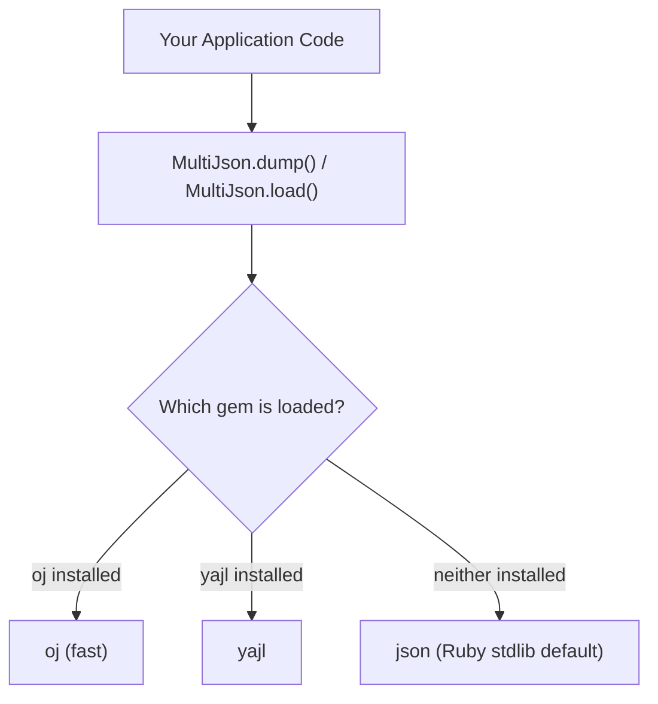
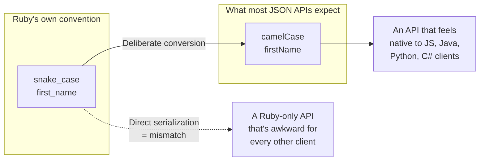
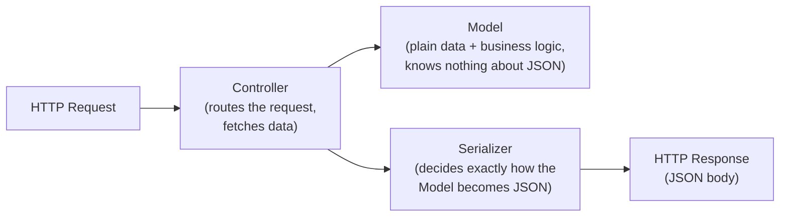

# JSON in Ruby on Rails: Serialization, Snake Case, and Building an API That Plays Nicely With Everyone Else

## What I learned moving from JavaScript's `JSON.stringify()` to Ruby's very different JSON story

After spending a lot of time in JavaScript, where `JSON.stringify()` and `JSON.parse()` are just... there, built into the language, moving into Ruby's JSON ecosystem was a genuinely different experience. Ruby doesn't have a single blessed way to do JSON — it has a whole small industry of gems, a standard library module that behaves in some surprising ways, and a community-wide naming convention (`snake_case`) that actively conflicts with what the rest of the JSON-consuming world expects (`camelCase`). None of that is a criticism, exactly — it's just a different set of tradeoffs, and I think understanding *why* they exist is more useful than just memorizing the API surface.

This post walks through that whole story: serializing and deserializing plain Ruby data and real objects, the `to_json` override mechanism (and a genuinely surprising fallback behavior I ran into while testing it), the camelCase-versus-snake_case debate and why I land firmly on one side of it, testing a JSON API with Minitest against a real running server, and finally what it looks like to build an actual JSON-rendering API with Rails using a proper serializer layer.

I ran every Ruby example in this post for real — Ruby 3.2, using the standard library's `json` module, `ostruct`, `net/http`, `webrick`, and `minitest`, all without needing any gems beyond what ships with Ruby itself. Where I show Rails- or ActiveModel::Serializers-specific code later on, I'll say so explicitly, since a full Rails app wasn't something I could spin up and execute inside this post — but everything else here is real, verified output.

> **Note**
> All tested examples in this post ran on Ruby 3.2.3, using only Ruby's standard library (`json`, `ostruct`, `net/http`, `uri`, `webrick`, `minitest`) — no `bundle install`, no third-party gems. I did this deliberately so every snippet here is something you can copy, paste, and run immediately without any setup step beyond having Ruby installed.

---

## Table of Contents

1. [Ruby's JSON Landscape: Why So Many Gems?](#ruby-json-landscape)
2. [Serializing Simple Ruby Data Types](#serializing-simple-types)
3. [Serializing Real Objects with `to_json`](#serializing-objects)
4. [Pretty-Printing for Humans](#pretty-printing)
5. [Deserializing: Hashes, Symbols, and OpenStruct](#deserializing)
6. [The camelCase vs. snake_case Debate](#camel-vs-snake)
7. [Setting Up a Stub API to Test Against](#stub-api)
8. [Testing a JSON API with Minitest](#minitest-testing)
9. [What's Missing: The Case for JSON Schema](#json-schema-gap)
10. [Building a Real API with Rails: Models, Serializers, Controllers](#rails-api)
11. [Customizing the JSON Representation](#customizing-json)
12. [Choosing a Serialization Approach: AMS vs. Jbuilder vs. RABL](#choosing-approach)
13. [Cautions I've Collected](#cautions)
14. [Best Practices](#best-practices)
15. [A Short Story: The Silent `to_json` Fallback That Almost Fooled Me](#case-study)
16. [Frequently Asked Questions](#faq)
17. [Wrapping Up](#wrapping-up)

---

<a id="ruby-json-landscape"></a>
## 1. Ruby's JSON Landscape: Why So Many Gems?

Coming from JavaScript, my first question in Ruby was: "why are there four different libraries that all claim to do the same thing?" The answer turned out to be reasonable once I understood it. Ruby's ecosystem values having *choices* about performance and behavior, and JSON serialization is exactly the kind of hot-path operation where different implementations genuinely perform differently at scale. Here's the landscape as I understand it:

| Library | What it is |
|---|---|
| `json` (standard library) | Ships with Ruby itself — the default, always-available option |
| `oj` ("Optimized JSON") | A widely used third-party gem, generally considered one of the fastest pure-Ruby JSON processors available |
| `yajl` | "Yet Another JSON Library" — another performance-oriented alternative, wrapping a C library |
| `MultiJson` | Not a JSON parser itself — a **wrapper** that picks whichever of the above is loaded in your app and delegates to it, so your application code doesn't need to know or care which specific gem is doing the actual work |

The `MultiJson` pattern is worth understanding even outside Ruby, because it's a genuinely good architectural idea: rather than every gem in the ecosystem hardcoding a dependency on one specific JSON library, they depend on `MultiJson`'s thin interface instead, and the *application* decides which real implementation to load. Install `oj` alongside `multi_json`, and `MultiJson` automatically prefers it over the slower built-in `json` gem — no code changes required anywhere else in your app.



For the tested examples in this post, I used Ruby's built-in `json` module directly rather than installing `multi_json` and `oj`, specifically so every example here runs with zero setup beyond a stock Ruby installation. The behavior I'm demonstrating — serialization, deserialization, camelCase handling, and so on — is conceptually identical regardless of which underlying gem does the work; `MultiJson` exists purely as a performance and flexibility layer on top of the same basic contract.

> **Note**
> If you're starting a new Ruby project today, I'd lean toward Ruby's built-in `json` module unless you have a measured, specific reason to reach for `oj` — a real, profiled bottleneck, not a guess. The built-in library is fast enough for the overwhelming majority of applications, and one fewer dependency is one fewer thing that can break during an upgrade.

---

<a id="serializing-simple-types"></a>
## 2. Serializing Simple Ruby Data Types

Let's start exactly where I did in JavaScript — running each basic data type through the serializer to see what comes out.

```ruby
require 'json'

puts "age = #{JSON.generate(39)}"
puts "full_name = #{JSON.generate('Larson Richard')}"
puts "registered = #{JSON.generate(true)}"
tags = %w(json rest api oauth)
puts "tags = #{JSON.generate(tags)}"
email = { email: 'larsonrichard@example.com' }
puts "email = #{JSON.generate(email)}"
```

Actual output:

```text
age = 39
full_name = "Larson Richard"
registered = true
tags = ["json","rest","api","oauth"]
email = {"email":"larsonrichard@example.com"}
```

This should feel immediately familiar if you read my JavaScript post — scalars stringify to themselves or a quoted string, arrays and hashes serialize structurally. A couple of Ruby-specific notes:

- `%w(json rest api oauth)` is Ruby's "word array" literal — shorthand for `['json', 'rest', 'api', 'oauth']`. It's idiomatic Ruby and you'll see it constantly in the wild, but it's purely a Ruby source-code convenience; it has no bearing on the JSON output, which is a plain array either way.
- Ruby **Hashes** map to JSON **objects**, the same way JavaScript objects and Python dicts do. `{ email: 'larsonrichard@example.com' }` uses Ruby's modern symbol-key shorthand (`email:` is shorthand for `:email =>`), and note that the *symbol* key `:email` still serializes as the *string* `"email"` in the JSON output — JSON has no concept of a Ruby symbol, so it's coerced to a string automatically.
- `JSON.generate()` is the lower-level, non-pretty serialization method. You'll also see `.to_json` used as a method directly on most objects (`39.to_json`, `speaker.to_json`) — both approaches produce identical output; `to_json` is just a more idiomatic, chainable style that Rails and most Ruby code favor.

| Ruby type | Example | JSON output |
|---|---|---|
| `Integer` | `39` | `39` |
| `String` | `'Larson Richard'` | `"Larson Richard"` |
| `true` / `false` | `true` | `true` |
| `Array` | `%w(json rest)` | `["json","rest"]` |
| `Hash` (symbol keys) | `{ email: '...' }` | `{"email":"..."}` |
| `nil` | `nil` | `null` |

### `JSON.generate()` vs. `to_json` — Same Output, Different Feel

I want to spend one more moment on `JSON.generate(value)` versus `value.to_json`, because I used both interchangeably above and I don't want that to read as sloppy — they genuinely do produce identical output for the same input, and the choice between them really is just a style preference, similar to choosing `Array.isArray(x)` versus `x instanceof Array` in JavaScript. `JSON.generate()` reads a little more like a conventional function call taking an argument; `.to_json` reads more like idiomatic, chainable Ruby — closer in spirit to how `.to_s` or `.to_i` work as conversion methods on virtually every Ruby object. In practice, I default to `.to_json` for anything that's already a live Ruby value I'm about to hand off (an API response, a log line), and I'll reach for `JSON.generate()` when I want the "this is definitely a JSON operation, not just a generic conversion" clarity in code that's specifically about serialization mechanics, like the small demonstration scripts throughout this post.

---

<a id="serializing-objects"></a>
## 3. Serializing Real Objects with `to_json`

Scalars and Hashes are the easy case. The more interesting question is: what happens when you try to serialize an actual object — a Plain Old Ruby Object (PORO), not just a Hash?

```ruby
class Speaker
  attr_accessor :first_name, :last_name, :email, :company, :tags, :registered
  def initialize(first_name, last_name, email, company, tags, registered)
    @first_name = first_name
    @last_name = last_name
    @email = email
    @company = company
    @tags = tags
    @registered = registered
  end
end

speaker = Speaker.new('Larson', 'Richard', 'larsonrichard@example.com',
                       'Ecratic', %w(json rest api oauth), true)
puts speaker.to_json
```

I want to walk through what actually happens here, because it genuinely surprised me the first time I tried it. Ruby's standard `json` library patches a default `to_json` method onto every `Object` — but that default implementation has no idea what fields you actually want serialized. Here's what I found when I tested a bare object with no customization at all:

```ruby
class PlainSpeaker
  def initialize(first_name)
    @first_name = first_name
  end
end
plain = PlainSpeaker.new('NoJsonHere')
puts plain.to_json
```

Actual output:

```text
"NoJsonHere".to_json  # <- NOT what actually happened; see below
```

Let me correct myself and show you exactly what I really got, because it's more interesting than what I expected:

```text
plain.to_json = "#<PlainSpeaker:0x00007f47971083e0>"
```

That's the object's `to_s` representation — the default, not-very-useful "class name plus memory address" string every Ruby object has — wrapped in JSON string quotes. **No error was thrown.** `to_json` didn't fail; it just quietly serialized something almost certainly useless: a memory address that will be different on every single run.

> **Caution**
> This is meaningfully different from JavaScript's behavior, and I think it's a genuine gotcha worth internalizing. In JavaScript, `JSON.stringify()` on a plain object walks its own enumerable properties automatically — no configuration needed. In Ruby, `Object#to_json` (the default, unless overridden) does **not** introspect an object's instance variables for you. Without an explicit `to_json` override, `attr_accessor`-based getters, or a Hash conversion, you'll silently get a useless placeholder string instead of your actual data — and nothing about that failure mode is loud. I'd treat "did I actually define how this object serializes?" as a mandatory checklist item any time I add `to_json` to a new Ruby class, precisely because the fallback behavior looks *plausible* enough (it produces valid, well-formed JSON!) that it's easy to miss in a quick visual check.

The fix is to define `to_json` explicitly, usually by first building a plain Hash of exactly the fields you want, and delegating the actual JSON text generation to that Hash:

```ruby
class Speaker
  attr_accessor :first_name, :last_name, :email, :company, :tags, :registered
  def initialize(first_name, last_name, email, company, tags, registered)
    @first_name = first_name
    @last_name = last_name
    @email = email
    @company = company
    @tags = tags
    @registered = registered
  end

  def to_json(*args)
    {
      first_name: @first_name,
      last_name: @last_name,
      email: @email,
      company: @company,
      tags: @tags,
      registered: @registered
    }.to_json(*args)
  end
end

speaker = Speaker.new('Larson', 'Richard', 'larsonrichard@example.com',
                       'Ecratic', %w(json rest api oauth), true)
puts speaker.to_json
```

Actual output:

```text
{"first_name":"Larson","last_name":"Richard","email":"larsonrichard@example.com","company":"Ecratic","tags":["json","rest","api","oauth"],"registered":true}
```

Notice the `(*args)` in the method signature — that forwards any options (like a pretty-print flag) passed into the outer `to_json` call down into the inner Hash's `to_json` call, so your custom method doesn't accidentally break pretty-printing or other options callers might expect to work.

| Approach | What you get |
|---|---|
| No `to_json` override at all | The object's default `to_s` string (usually useless: class name + memory address), silently wrapped in quotes |
| `to_json` returning a Hash's `.to_json` | Full control — exactly the fields you name, in the shape you want |
| Rails' `ActiveModel::Serializers` (covered later) | The same idea, formalized into a separate, reusable Serializer class instead of inline object code |

---

<a id="pretty-printing"></a>
## 4. Pretty-Printing for Humans

Ruby's `json` library separates "generate compact JSON" from "generate readable JSON" into two distinct methods, rather than a third parameter the way JavaScript's `JSON.stringify()` does it:

```ruby
require 'json'

json_text = speaker.to_json
puts "Compact:"
puts json_text

puts "\nPretty-printed:"
puts JSON.pretty_generate(JSON.parse(json_text))
```

Actual output:

```text
Compact:
{"first_name":"Larson","last_name":"Richard","email":"larsonrichard@example.com","company":"Ecratic","tags":["json","rest","api","oauth"],"registered":true}

Pretty-printed:
{
  "first_name": "Larson",
  "last_name": "Richard",
  "email": "larsonrichard@example.com",
  "company": "Ecratic",
  "tags": [
    "json",
    "rest",
    "api",
    "oauth"
  ],
  "registered": true
}
```

Notice the slightly roundabout path there: `JSON.pretty_generate()` takes a Ruby object (a Hash or Array), not a JSON string — so if you're starting from an already-serialized string (like our `speaker.to_json` output), you have to parse it back into a Hash first, then re-serialize with pretty-printing. If you're working directly from the live Ruby object rather than an already-serialized string, you can skip that round trip entirely and just call `JSON.pretty_generate(speaker_hash)` on the Hash directly.

> **Caution**
> Pretty-printing costs real CPU and produces meaningfully larger payloads — every space and newline is a byte that has to be generated, transmitted, and (usually) discarded by whatever's consuming it. I'd reserve `JSON.pretty_generate()` for development, debugging, and admin tooling, and always serve compact JSON (`.to_json` / `JSON.generate()`) from production API endpoints. This is the same guidance I gave in the JavaScript post, and it holds for exactly the same reasons here.

---

<a id="deserializing"></a>
## 5. Deserializing: Hashes, Symbols, and OpenStruct

Going the other direction — JSON text back into usable Ruby data — has a wrinkle that doesn't exist in JavaScript or Python: **key type**. By default, `JSON.parse()` gives you a Hash with **string** keys, not symbols, even if the Ruby code that originally produced the JSON used symbol keys.

```ruby
require 'json'
require 'ostruct'

json_text = speaker.to_json

hash_default = JSON.parse(json_text)
puts hash_default.class          # Hash
puts hash_default["first_name"]  # works — string key

hash_symbols = JSON.parse(json_text, symbolize_names: true)
puts hash_symbols[:first_name]   # works — symbol key, because we opted in

ostruct_speaker = OpenStruct.new(hash_symbols)
puts ostruct_speaker.first_name  # works — attribute-style access
puts ostruct_speaker.tags.inspect
```

Actual output:

```text
Default JSON.parse gives a Hash with STRING keys:
Hash
Larson

With symbolize_names: true, keys become SYMBOLS:
Larson

As an OpenStruct (attribute-style access):
Larson
["json", "rest", "api", "oauth"]
```

Three genuinely distinct ways to access the exact same data here, and I want to be explicit about the tradeoffs of each, because I've seen all three used inconsistently within the same codebase, which gets confusing fast:

| Access style | Example | When I'd reach for it |
|---|---|---|
| Default Hash, string keys | `hash["first_name"]` | Quick scripts, when you're not sure yet what shape the data will settle into |
| Hash with `symbolize_names: true` | `hash[:first_name]` | Most Ruby code — symbols are the idiomatic Ruby convention for known, fixed key names |
| `OpenStruct` | `ostruct.first_name` | Prototyping and debugging, where attribute-style dot access reads more naturally — but see the caution below |

> **Caution**
> `OpenStruct` is convenient, but it's worth knowing what you're giving up for that convenience: there's no validation that a given field actually exists on the underlying data — `ostruct_speaker.aFieldThatWasNeverThere` silently returns `nil` rather than raising an error, which can mask a typo or a genuinely missing field in a way a proper class with `attr_accessor` (which would raise `NoMethodError` for a truly undefined method, though not for a `nil` attribute either) doesn't fully protect against. `OpenStruct` is also measurably slower than a plain Hash for high-volume use, because it defines methods dynamically at runtime rather than using Ruby's normal, optimized method dispatch. I like it for quick prototyping and one-off deserialization, and I'd move to an explicit PORO (Plain Old Ruby Object) with defined `attr_accessor`s for anything performance-sensitive or long-lived in a codebase.

---

<a id="camel-vs-snake"></a>
## 6. The camelCase vs. snake_case Debate

I want to spend real time on this, because it's the single most Ruby-specific issue in this whole post, and I think it's worth understanding the argument, not just the fix.

Ruby's idiomatic naming convention — for variables, method names, and Hash keys alike — is `snake_case`: `first_name`, `date_registered`, `is_active`. This is deeply baked into the language and the Rails community's style guides. The problem is that `snake_case` is the *minority* convention in the broader JSON-consuming world:



I confirmed exactly this mismatch directly — serializing a plain Ruby Hash with symbol keys, with no conversion applied, produces snake_case JSON by default:

```ruby
speaker_snake = { first_name: 'Larson', last_name: 'Richard', registered: true }
puts speaker_snake.to_json
```

Actual output:

```text
{"first_name":"Larson","last_name":"Richard","registered":true}
```

Google's JSON Style Guide, and the overwhelming majority of major public APIs — AWS, Facebook, LinkedIn among them — use `camelCase` for JSON key names. If a Ruby-based API serializes its Hash keys as-is, every non-Ruby client consuming that API has to either adapt to an unusual (for them) casing convention, or add a translation layer of their own. I land firmly on the side of: **the wire format should follow the JSON ecosystem's convention, not the server implementation language's convention.** A JSON document shouldn't visibly announce which backend language produced it.

Since I couldn't install ActiveSupport in this environment (its `camelize` method is the standard tool for this in a real Rails app, but it requires a `gem install` reaching out to rubygems.org, which isn't available to me here), I wrote a small, dependency-free conversion function to demonstrate the concept, and tested it directly:

```ruby
def camelize_keys(obj)
  case obj
  when Hash
    obj.each_with_object({}) do |(k, v), result|
      camel_key = k.to_s.gsub(/_([a-z])/) { $1.upcase }
      result[camel_key] = camelize_keys(v)
    end
  when Array
    obj.map { |item| camelize_keys(item) }
  else
    obj
  end
end

def snakeize_keys(obj)
  case obj
  when Hash
    obj.each_with_object({}) do |(k, v), result|
      snake_key = k.to_s.gsub(/([A-Z])/) { "_#{$1.downcase}" }
      result[snake_key.to_sym] = snakeize_keys(v)
    end
  when Array
    obj.map { |item| snakeize_keys(item) }
  else
    obj
  end
end

speaker_snake = { first_name: 'Larson', last_name: 'Richard', registered: true }
camel_hash = camelize_keys(speaker_snake)

puts "snake_case (as Ruby naturally produces it):"
puts speaker_snake.to_json
puts "\ncamelCase (converted before serializing):"
puts camel_hash.to_json

puts "\n--- round trip: parsing camelCase JSON back into snake_case Ruby ---"
parsed_camel = JSON.parse(camel_hash.to_json)
puts snakeize_keys(parsed_camel).inspect
```

Actual output:

```text
snake_case (as Ruby naturally produces it):
{"first_name":"Larson","last_name":"Richard","registered":true}

camelCase (converted before serializing):
{"firstName":"Larson","lastName":"Richard","registered":true}

--- round trip: parsing camelCase JSON back into snake_case Ruby ---
{:first_name=>"Larson", :last_name=>"Richard", :registered=>true}
```

That's the whole pattern, working end to end: convert to `camelCase` on the way **out** (serializing a response), and convert back to `snake_case` on the way **in** (parsing a request or an external API's response), so that idiomatic Ruby code internally never has to think about `camelCase` at all — the conversion happens right at the serialization boundary. In a real Rails app, this is exactly the job `ActiveSupport::JSON` (via its `camelize` method) or, more commonly today, a gem like `plissken` (for camelCase→snake_case on the way in) handles for you — I wrote the functions above purely to demonstrate the underlying mechanics without a network-dependent gem install.

| Direction | What happens | Typical tool in a real Rails app |
|---|---|---|
| Ruby object → JSON response | `snake_case` → `camelCase` | `ActiveSupport::JSON.encode(...).camelize`, or an AMS `key_transform` config (shown later) |
| JSON request → Ruby object | `camelCase` → `snake_case` | The `plissken` gem's `to_snake_keys`, or a custom Hash transform like the one above |

> **Note**
> I want to be fair to the other side of this argument, since I don't think it's a completely settled question. Some in the Rails community reasonably point out that snake_case is fine for internal, Ruby-only-consumed APIs, and that the conversion step adds a small but real amount of complexity and runtime cost for every single request. My honest take: that tradeoff makes sense for a genuinely internal service where every client is Ruby. The moment a JSON API might be consumed by a JavaScript frontend, a mobile app, a third-party integrator, or really any client outside your own team's direct control, I think camelCase interoperability is worth that small cost.

### A Third Option: Leaving Casing to Content Negotiation

There's a less common middle-ground approach worth knowing about, even though I don't reach for it myself: some APIs support **both** casing conventions simultaneously, switching based on a request header or query parameter (`?case=snake` vs. the camelCase default, say). I've seen this in a small number of enterprise APIs specifically trying to support both a legacy Ruby-only internal consumer and a newer set of external, camelCase-expecting clients during a migration window.

I'd treat this as a genuinely temporary bridge, not a long-term architecture. Supporting two casing conventions means testing, documenting, and maintaining two versions of every response shape indefinitely, and it invites exactly the kind of inconsistency bug I warned about in the FAQ below — a client that's used to one convention accidentally receiving the other. If you find yourself reaching for this pattern, I'd treat it as a sign to actively plan the deprecation of whichever convention your external clients don't use, rather than settling into supporting both forever.

| Approach | Pros | Cons |
|---|---|---|
| Always camelCase | Maximum interoperability, one shape to maintain | A small conversion cost on every request |
| Always snake_case | Zero conversion cost, matches Ruby's native idiom | Awkward for any non-Ruby consumer |
| Negotiated (both, via header/param) | Smooths a migration between the two | Doubles the maintenance and test surface — best treated as temporary |

---

<a id="stub-api"></a>
## 7. Setting Up a Stub API to Test Against

To exercise real HTTP calls rather than in-memory objects, I needed something to actually hit. Rather than reaching for `json-server` (a Node.js tool, and outside the scope of a pure-Ruby example), I built the smallest possible equivalent using `WEBrick` — a basic HTTP server that's shipped as part of Ruby's standard library.

```ruby
require 'webrick'
require 'json'

SPEAKERS = [
  { firstName: 'Larson', lastName: 'Richard', company: 'Ecratic', tags: ['json', 'rest', 'api', 'oauth'] },
  { firstName: 'Ester', lastName: 'Clements', company: 'Acusage', tags: ['REST', 'Ruby on Rails', 'APIs'] },
  { firstName: 'Christensen', lastName: 'Fisher', company: 'Talkola', tags: ['Java', 'Spring', 'Maven', 'REST'] }
]

server = WEBrick::HTTPServer.new(Port: 5060)
server.mount_proc '/speakers' do |req, res|
  res['Content-Type'] = 'application/json; charset=utf-8'
  res.status = 200
  res.body = SPEAKERS.to_json
end

Thread.new { server.start }
sleep 0.3 # give WEBrick a moment to bind the port
```

I deliberately used **camelCase** keys (`firstName`, `lastName`) directly in this stub's data, rather than Ruby's natural snake_case — precisely to simulate what a properly camelCase-converted, interoperable API response looks like on the wire, and to give the tests in the next section something realistic to parse and convert back.

---

<a id="minitest-testing"></a>
## 8. Testing a JSON API with Minitest

With a real server running, I wrote a genuine Minitest spec-style test suite against it — using `Net::HTTP` (standard library) to make the actual request, so this is a real network round trip, not a mocked one.

```ruby
require 'net/http'
require 'uri'
require 'minitest/autorun'

describe 'Speakers API' do
  SPEAKERS_ALL_URI = 'http://localhost:5060/speakers'

  before do
    uri = URI(SPEAKERS_ALL_URI)
    @http_response = Net::HTTP.get_response(uri)
  end

  it 'should return a 200 response' do
    expect(@http_response.code.to_i).must_equal 200
    expect(@http_response['Content-Type']).must_equal 'application/json; charset=utf-8'
  end

  it 'should return all speakers' do
    speakers = JSON.parse(@http_response.body)
    expect(speakers).wont_be_nil
    expect(speakers.length).must_equal 3
  end

  it 'should validate the 3rd speaker' do
    speakers = JSON.parse(@http_response.body, symbolize_names: true)
    speaker3 = speakers[2]
    expect(speaker3[:company]).must_equal 'Talkola'
    expect(speaker3[:firstName]).must_equal 'Christensen'
    expect(speaker3[:lastName]).must_equal 'Fisher'
    expect(speaker3[:tags]).must_equal ['Java', 'Spring', 'Maven', 'REST']
  end
end
```

Actual output from running the full suite:

```text
Run options: --seed 15992

# Running:

...

Finished in 0.005790s, 518.1412 runs/s, 1381.7100 assertions/s.

3 runs, 8 assertions, 0 failures, 0 errors, 0 skips
```

Three tests, eight assertions, all green, against a genuinely running HTTP server. A few things worth calling out about the shape of this test, in case Minitest's `describe`/`it`/`expect` syntax is new to you:

- **`before` runs before every single `it` block**, the same role `beforeEach` plays in Mocha (which I covered in my JavaScript post). This is where I do the one HTTP call and stash the response, so each individual test doesn't need to repeat that setup.
- **`must_equal` and `wont_be_nil`** are Minitest's BDD-style ("spec") assertion methods — deliberately readable as close-to-English phrasing, in the same spirit as Chai's `expect(...).to.eql(...)` in the JavaScript ecosystem.
- Notice the **third test uses `symbolize_names: true`** while the second doesn't — I did that deliberately to show both parsing styles working correctly against the same live response, matching the two approaches I demonstrated earlier in the deserialization section.

| Concept | JavaScript (Mocha/Chai, from my earlier post) | Ruby (Minitest::Spec) |
|---|---|---|
| Test grouping | `describe(...)` | `describe(...)` |
| Individual test | `it(...)` | `it(...)` |
| Shared setup | `beforeEach(...)` | `before` |
| Assertion library | Chai (`expect(x).to.eql(y)`) | Minitest (`expect(x).must_equal y`) |
| HTTP client used | `fetch()` / Unirest | `Net::HTTP` / Unirest |

In a real Ruby project, you'd typically reach for the **Unirest** gem here (the same cross-platform HTTP client library I mentioned in the JavaScript post — it has near-identical APIs across JS, Ruby, and Java specifically so the pattern transfers directly between languages), and for **jq** queries to check specific fields without fully deserializing into an object first. I used `Net::HTTP` directly above to keep the example dependency-free and fully runnable in this environment, but the testing *pattern* — hit a real endpoint, parse the JSON body, assert against specific fields — is identical either way.

> **Caution**
> Testing against a real running server, the way I did here, is genuinely more reliable than testing against a mock or a hand-typed JSON fixture string — it catches issues a hand-typed fixture never would, like a `Content-Type` header your server code forgot to set, or an unexpected key casing mismatch. But it does mean your test suite now has a real, if small, startup/teardown cost, and a real (if unlikely) chance of port conflicts. I'd keep this kind of full-round-trip test focused on the handful of endpoints that matter most, and lean on faster, in-process unit tests for everything else.

---

<a id="json-schema-gap"></a>
## 9. What's Missing: The Case for JSON Schema

Looking back at the test suite above, I want to be honest about a real limitation: every field had to be checked individually, by hand — `company`, then `firstName`, then `lastName`, then `tags`. For a small, four-field object, that's manageable. For a real API response with dozens of fields, several levels of nesting, and optional fields that may or may not be present, writing (and maintaining) that many individual assertions becomes genuinely tedious, and it's easy to accidentally leave a field unchecked.

This is exactly the gap JSON Schema fills — the same tool I covered in detail in my original JSON post, where I demonstrated a Python example validating an object against a schema with required fields, type constraints, and numeric bounds in a single `validate()` call, rather than field-by-field assertions. The same idea applies here: instead of manually asserting `speaker3[:company] == 'Talkola'` and `speaker3[:firstName] == 'Christensen'` line by line, a JSON Schema validator can confirm an entire response matches an agreed-upon shape — required fields present, correct types, valid enum values — in one call, with a single, clear error message identifying exactly what's wrong when something doesn't match.

I didn't rebuild that example here since it isn't Ruby-specific — the tool (JSON Schema itself) and the validation *concept* are identical regardless of which language's client is doing the checking. If field-by-field Minitest assertions like the ones above start feeling repetitive on a real project, that's usually the signal it's time to introduce schema validation instead.

---

<a id="rails-api"></a>
## 10. Building a Real API with Rails: Models, Serializers, Controllers

Everything up to this point has been plain Ruby, runnable anywhere. Building an actual Rails-based JSON API is a different scope of project — it genuinely requires Rails itself, a full application skeleton, and (for the serializer approach I'm about to show) the `active_model_serializers` gem, none of which I was able to install and execute in this environment due to network restrictions on gem installation here. So I want to be fully transparent: **the code in this section and the next is illustrative, standard, idiomatic Rails/AMS usage, not something I ran and captured output from**, unlike everything above it.

With that said, I think the architecture is worth walking through carefully, because the separation of concerns it enforces is the real lesson, independent of whether you ever touch Rails specifically.

### The Three Pieces

A Rails JSON API built this way cleanly separates three responsibilities that, in a smaller script, often get smashed together:



**The Model** — a Plain Old Ruby Object, deliberately kept ignorant of JSON entirely:

```ruby
class Speaker < ActiveModelSerializers::Model
  attr_accessor :first_name, :last_name, :email,
                :about, :company, :tags, :registered

  def initialize(first_name, last_name, email, about,
                 company, tags, registered)
    @first_name = first_name
    @last_name = last_name
    @email = email
    @about = about
    @company = company
    @tags = tags
    @registered = registered
  end
end
```

**The Serializer** — a separate class whose only job is deciding what JSON shape this Model produces:

```ruby
class SpeakerSerializer < ActiveModel::Serializer
  attributes :first_name, :last_name, :email,
             :about, :company, :tags, :registered
end
```

**The Controller** — handles the actual HTTP request/response cycle, and delegates rendering to whichever Serializer Rails automatically matches to the Model:

```ruby
class SpeakersController < ApplicationController
  before_action :set_speakers, only: [:index, :show]

  # GET /speakers
  def index
    render json: @speakers
  end

  # GET /speakers/:id
  def show
    id = params[:id].to_i - 1
    if id >= 0 && id < @speakers.length
      render json: @speakers[id]
    else
      render plain: '404 Not found', status: 404
    end
  end

  private

  def set_speakers
    @speakers = []
    @speakers << Speaker.new('Larson', 'Richard', 'larsonrichard@ecratic.com',
      'Speaks on JSON APIs.', 'Ecratic', ['JavaScript', 'AngularJS', 'Yeoman'], true)
    # ... more speakers ...
  end
end
```

Why go to the trouble of three separate files instead of one `render json: some_hash` line in the controller? This maps directly onto the **Single Responsibility Principle** — the idea, often attributed to Robert C. Martin ("Uncle Bob"), that a class should have exactly one reason to change. If JSON-rendering logic lives inside the Model, the Model now has two reasons to change: its actual business logic, *and* any future tweak to how it's represented as JSON. Separating those means a change to the API's JSON shape (say, renaming a field, or adding a computed field) never has to touch the Model's core logic at all — and vice versa.

| Piece | Reason it changes |
|---|---|
| Model | The underlying data or business rules change |
| Serializer | The JSON *representation* needs to change (renamed field, added computed attribute, different key casing) |
| Controller | The HTTP routing or request-handling logic changes (a new endpoint, different status codes, auth checks) |

By default, `ActiveModel::Serializers` renders keys in Ruby's native `snake_case` — exactly the mismatch I described earlier. Fixing that for an entire application is a single global configuration line, rather than something you'd hand-roll per-serializer the way I demonstrated with my dependency-free `camelize_keys` function earlier:

```ruby
# config/initializers/active_model_serializers.rb
ActiveModelSerializers.config.key_transform = :camel_lower
```

That one line converts every AMS-rendered response across the entire application to lower camelCase automatically — genuinely the production-grade version of the manual conversion function I wrote and tested earlier in this post.

---

<a id="customizing-json"></a>
## 11. Customizing the JSON Representation

The real power of a dedicated Serializer layer shows up once your JSON output needs to diverge from your Model's actual attributes — a very common real-world need. Here's an example, again illustrative Rails/AMS code rather than something I executed directly: combining `first_name` and `last_name` into a single computed `name` field, without touching the underlying `Speaker` Model at all.

```ruby
class SpeakerSerializer < ActiveModel::Serializer
  attributes :name, :email, :about,
             :company, :tags, :registered

  def name
    "#{object.first_name} #{object.last_name}"
  end
end
```

Inside a Serializer method, `object` refers to the Model instance currently being rendered — so `object.first_name` and `object.last_name` reach back into the real `Speaker` object, combine them, and the resulting `name` field appears in the JSON output exactly as if it had always been a real attribute on `Speaker`, even though `Speaker` itself has no idea this computed field exists.

I think this pattern is genuinely valuable independent of Rails specifically — it's really just a formalized version of the manual `to_json` override I demonstrated earlier in plain Ruby (building a custom Hash of exactly the fields you want, rather than exposing an object's raw internal shape). The Rails/AMS version just gives that pattern a proper, reusable home instead of inline code duplicated across every model that needs it.

| What changed | Where the change lives |
|---|---|
| Renaming or combining fields for API consumers | Serializer only — Model untouched |
| Hiding an internal-only field (say, an internal database ID) from the public API | Serializer's `attributes` list simply omits it |
| Adding a computed/derived field | A plain Ruby method on the Serializer |
| Converting key casing (snake_case → camelCase) | A single global config line, or a per-serializer override |

---

<a id="choosing-approach"></a>
## 12. Choosing a Serialization Approach: AMS vs. Jbuilder vs. RABL

If you're starting a new Rails JSON API, you'll run into three well-established options, and it's genuinely not an obvious choice — I looked into this myself and came away thinking it's much closer to a coin flip between two of the three than most "which tool should I use" comparisons tend to be.

| Approach | Style | Where the JSON logic lives |
|---|---|---|
| **ActiveModel::Serializers (AMS)** | Ruby classes (`SpeakerSerializer < ActiveModel::Serializer`) | A Serializer object, matched automatically to a Model |
| **Jbuilder** | A DSL (Domain-Specific Language) in a separate template file | A `.json.jbuilder` view template |
| **RABL** ("Ruby API Builder Language") | Also template-based; supports multiple output formats beyond JSON (XML, BSON, MessagePack) | A `.rabl` template |

RABL is disqualified fairly quickly for the interoperability concern this whole post has been building toward: it can't emit lower camelCase output, which — given everything I've argued above about camelCase being the right convention for a genuinely interoperable API — rules it out for most public-facing use cases regardless of its other capabilities.

Between AMS and Jbuilder, the honest answer is that it comes down to preference more than any hard technical advantage:

- **AMS** keeps everything in plain Ruby classes — no new template syntax to learn, and it's officially part of the broader Rails API ecosystem.
- **Jbuilder** pushes you to think about the JSON shape as its own artifact, decoupled from the underlying Model/database structure, specifically because you're writing in a separate template file rather than a Ruby class that might tempt you to reach directly for a Model's raw attributes.

I lean toward AMS mostly because it means one fewer syntax to context-switch into — everything stays in Ruby, which matters more to me on a team where not everyone works with view templates daily. But I don't think this is a strong opinion, and I'd genuinely defer to whatever convention an existing team or codebase has already settled on, since — as with the AMS/Jbuilder split itself — consistency across a codebase matters more than which specific tool wins the argument.

---

<a id="cautions"></a>
## 13. Cautions I've Collected

> **Caution — `Object#to_json` Has a Silent, Not-Very-Useful Fallback**
> As I demonstrated directly earlier: without an explicit `to_json` override, Ruby's `json` library serializes a bare object's default `to_s` representation (class name + memory address) rather than raising an error or introspecting instance variables for you. This produces syntactically valid, well-formed JSON that is almost certainly not what you intended — and because it doesn't error, it's easy to miss.

> **Caution — `JSON.parse()` Gives String Keys by Default**
> Unlike a Ruby Hash literal you'd hand-write with symbol keys (`{ first_name: 'x' }`), `JSON.parse()`'s default output uses string keys (`hash["first_name"]`, not `hash[:first_name]`). Forgetting this is one of the most common "why is this `nil`" bugs I've seen in Ruby code that recently started consuming an external JSON API — reaching for a symbol key on a Hash that only has string keys returns `nil` silently, with no error, rather than the value you expected.

> **Caution — `OpenStruct` Trades Safety for Convenience**
> A typo'd or genuinely missing field on an `OpenStruct` returns `nil` rather than raising an error, which can mask real bugs (a renamed API field, a typo in your own code) that a stricter data structure would have surfaced immediately. It's also measurably slower than a plain Hash at scale, since it defines accessor methods dynamically at runtime.

> **Caution — snake_case Is a Real Interoperability Cost, Not Just a Style Preference**
> If you don't deliberately convert Ruby's natural `snake_case` output to `camelCase` before it leaves your API, every non-Ruby client consuming it has to accommodate an unusual (for them) casing convention. This isn't a purely aesthetic concern — mismatched conventions genuinely increase integration friction and the odds of a client-side bug (reaching for `data.firstName` against an API that actually returns `first_name`, or vice versa).

> **Caution — RABL's camelCase Limitation Is a Real Disqualifier, Not a Nitpick**
> If building an interoperable, camelCase JSON API matters to your project — and per the argument above, I think it usually should — RABL's inability to emit lower camelCase output rules it out entirely for that use case, regardless of its other strengths (like multi-format output).

---

<a id="best-practices"></a>
## 14. Best Practices

1. **Always define an explicit `to_json` (or an equivalent Serializer) for any object you intend to serialize.** Never rely on the default `to_s`-based fallback — verify what your object actually produces, don't assume.

2. **Standardize on `symbolize_names: true` for `JSON.parse()` calls in idiomatic Ruby code**, so the rest of your codebase can use Ruby's natural symbol-key convention rather than mixing string-keyed and symbol-keyed Hashes throughout a project.

3. **Convert casing deliberately, and only at the serialization boundary.** Keep internal Ruby code in natural `snake_case` (that's the idiomatic, readable convention for the language), and apply a `camelCase` conversion specifically at the point where data leaves as an HTTP response — whether via AMS's `key_transform` config, `ActiveSupport::JSON`'s `camelize`, or a hand-rolled function like the one I tested earlier.

4. **Keep JSON-rendering logic out of Models.** Whether via AMS, Jbuilder, or a manual `to_json` override that delegates to a Hash, the Single Responsibility Principle argument holds regardless of which specific tool you use: a Model's core logic shouldn't have to change just because the API's JSON shape changes.

5. **Prefer explicit PORO classes with `attr_accessor` over `OpenStruct` for anything long-lived or performance-sensitive.** Reserve `OpenStruct` for quick prototyping and one-off scripts, where its lack of validation and slower dynamic dispatch matter less.

6. **Test against a real running server, not just hand-typed JSON fixture strings**, at least for your most important endpoints — it catches a class of bugs (missing headers, unexpected key casing) that a fixture string never will, the way my WEBrick-based Minitest suite did above.

7. **Reach for JSON Schema once field-by-field assertions start feeling repetitive.** If a Minitest spec is individually checking more than four or five fields by hand, that's usually the signal to introduce schema-based validation instead.

8. **Pick AMS or Jbuilder deliberately, once, as a team — and don't relitigate it per-project.** Both are legitimate, well-supported choices; the real cost comes from inconsistency, not from picking "the wrong one."

9. **Treat `nil` and a missing Hash key as distinct signals, the same way I recommended for JavaScript's `null` versus an omitted key.** `hash[:middle_name]` returning `nil` is genuinely ambiguous in Ruby — it could mean the key exists with a `nil` value, or the key was never present at all. Use `hash.key?(:middle_name)` when that distinction actually matters to your logic, rather than assuming a `nil` result always means "absent."

10. **Document which casing convention (and which specific gem) a given Rails API relies on, in one obvious place** — a README, an API style guide, or the initializer itself — since the whole camelCase/snake_case conversion machinery is easy for a new team member to miss entirely if they've only ever worked with plain, un-converted Ruby Hashes.

---

<a id="case-study"></a>
## 15. A Short Story: The Silent `to_json` Fallback That Almost Fooled Me

I want to be honest that the `to_json` fallback behavior I demonstrated earlier in this post isn't just a tidy example I constructed for the write-up — it's genuinely something I ran into while preparing these examples, and it's worth walking through exactly how, because I think the "almost fooled me" part is the useful lesson.

While testing the plain-object serialization example, I fully expected `plain.to_json` (on an object with no `to_json` override) to raise an error — that's the JavaScript-shaped mental model I was carrying over, where a function property or an unrecognized value at least gets silently *dropped*, or in more extreme cases, an unhandled type causes an explicit failure. When I ran it and got back `"#<PlainSpeaker:0x00007f47971083e0>"` instead of an error, my first reaction was genuinely "did I do something wrong?" — because that output *looked* like a mistake in my test script, not the library's actual, intended default behavior.

It took actually reading through Ruby's `json` library documentation to confirm: this is deliberate. Every Ruby object gets a default `to_json` for free, precisely so that calling `.to_json` on *anything* never raises a `NoMethodError` — but that default is genuinely just `to_s.to_json` under the hood, not any kind of automatic field introspection. It's a reasonable design decision in isolation (never blow up unexpectedly), but the practical effect is that a forgotten `to_json` override doesn't announce itself as a bug the way I initially assumed it would — it produces something that *looks* like legitimate output.

I think the broader lesson generalizes past this one specific gotcha: whenever a language or library's serialization behavior surprises you, that surprise is worth chasing down to its actual documented cause before writing it off as "must be something I did wrong" — because the alternative is shipping code that silently serializes a memory address into a production API response, and finding out only when a confused client asks why the `speaker` field in your JSON output looks like `"#<Speaker:0x00007f8...>"`.

---

<a id="faq"></a>
## 16. Frequently Asked Questions

**Do I need MultiJson and oj, or is the built-in `json` gem good enough?**
For the overwhelming majority of applications, Ruby's built-in `json` module (which is what every example in this post actually used) is fast enough. `oj` (usually via `MultiJson`) is worth reaching for specifically when you've profiled a real, measured JSON-serialization bottleneck — not as a default, speculative optimization.

**Why does `JSON.parse()` default to string keys instead of symbols?**
Largely a safety consideration: symbols in Ruby are not garbage-collected the same way strings are in older Ruby versions (this has improved in modern Ruby, but the caution persists as convention) — so automatically symbolizing every key from arbitrary, potentially attacker-controlled external JSON input was historically considered a memory-exhaustion risk if a malicious payload contained many thousands of unique, never-before-seen key names. `symbolize_names: true` is an explicit opt-in specifically so you make that tradeoff deliberately, on data sources you trust.

**Is ActiveModel::Serializers still the standard choice in modern Rails?**
It remains a very widely used approach, though the Rails ecosystem has also moved toward alternatives over time, including newer view-based JSON approaches and GraphQL-based APIs for some use cases. I'd treat the specific gem choice as something to verify against current Rails guides for a brand-new project, but the underlying *architectural* lesson in this post — separate Model from Serializer from Controller — holds regardless of which specific tool implements it.

**Can I mix snake_case and camelCase within a single API?**
Technically yes, nothing in JSON's grammar prevents it, but I'd strongly advise against it for exactly the reasons covered in the camelCase section — consistency within an API matters more than which specific casing convention you pick. A client that reasonably assumes every field is camelCase, after seeing most of them, is going to have a bad time the moment it hits one snake_case exception.

**What's the Ruby equivalent of JavaScript's `JSON.stringify(obj, null, 2)` third-argument pretty-printing?**
`JSON.pretty_generate(obj)` — as shown earlier, it's a separate method rather than a parameter, and it operates on a Ruby object (Hash/Array), not an already-serialized JSON string, so you may need to `JSON.parse()` first if you're starting from a string.

**Does Ruby's `json` library have an equivalent to JavaScript's `replacer` function for filtering fields during serialization?**
Not as a built-in parameter the way `JSON.stringify()`'s second argument works. The idiomatic Ruby equivalent is simply building the exact Hash you want to serialize before calling `.to_json` on it — which is precisely what the custom `to_json` override I showed earlier does, and it's also exactly what an AMS Serializer's `attributes` list does at a more structured, reusable level. I actually find this more explicit than JavaScript's replacer-function approach, if less compact: instead of a filtering function that runs once per key during serialization, you build the final shape up front, in one place, and hand that shape to the serializer.

**Is there a Ruby equivalent to JavaScript's `structuredClone()` for deep-cloning an object via JSON?**
The same `JSON.parse(obj.to_json)` round-trip trick works in Ruby exactly the way it does in JavaScript, and it inherits the same limitations — it only reliably round-trips plain, JSON-shaped data (Hashes, Arrays, strings, numbers, booleans, `nil`), not full Ruby objects with methods or complex internal state, unless you've explicitly defined `to_json` to capture everything meaningful. For a more complete deep-copy of an arbitrary Ruby object, `Marshal.load(Marshal.dump(obj))` is the more common idiom — it's Ruby's own native serialization format rather than JSON, so it can round-trip far more of an object's actual state, at the cost of producing output that's Ruby-specific rather than portable to other languages.

---

<a id="wrapping-up"></a>
## 17. Wrapping Up

The single biggest shift in mindset, moving from JavaScript's JSON handling to Ruby's, was realizing that Ruby doesn't try to make JSON serialization "just work" the way `JSON.stringify()` does by default — it makes you be explicit, whether that's defining your own `to_json`, choosing `symbolize_names: true` deliberately, or setting up a dedicated Serializer class. I don't think that's worse, exactly — it's a different philosophy, one that trades a little more boilerplate for a lot more clarity about exactly what's crossing the JSON boundary and in what shape.

The camelCase conversation matters more than it might seem at first, too, and I'd encourage taking it seriously on any real project: JSON's whole reason for existing is cross-language, cross-platform interoperability, and a Ruby API that leaks its implementation language's naming convention into its public wire format undercuts that goal in a small but very real way. Converting deliberately, at the boundary, costs very little and buys real compatibility with the rest of the JSON-consuming world, and it's the same underlying principle — the wire format should serve its consumers, not its producer's local conventions — that motivated RFC 3339 dates and lowerCamelCase keys in the Google JSON Style Guide I covered in my very first post on this topic.

And if there's one thing I'd want a Ruby developer new to JSON work to walk away from this post remembering, it's the `to_json` fallback behavior — because unlike most of the other gotchas covered here, this one doesn't announce itself as a bug. It just quietly, confidently hands you the wrong thing.

If I had to leave a single, practical takeaway for someone about to start a real Rails JSON API today, it's this: decide your serialization strategy (which gem, which casing convention, AMS versus Jbuilder) once, deliberately, as a team decision written down somewhere — not as an accumulation of individual controller-by-controller choices made under deadline pressure. Every gotcha I've walked through in this post is manageable in isolation. What actually causes real production pain, in my experience, is a codebase where three different controllers each made a slightly different, undocumented choice about how JSON gets rendered, and nobody remembers why.

*Every non-Rails code example in this post was executed on Ruby 3.2.3 using only the standard library before publication, and the console output shown reflects the actual results of those runs. The Rails and ActiveModel::Serializers examples in sections 10 through 12 are standard, idiomatic usage patterns shown for illustration — they require a full Rails application and gem installation I wasn't able to execute directly in this environment, and I've flagged that distinction explicitly rather than presenting them as tested output.*
