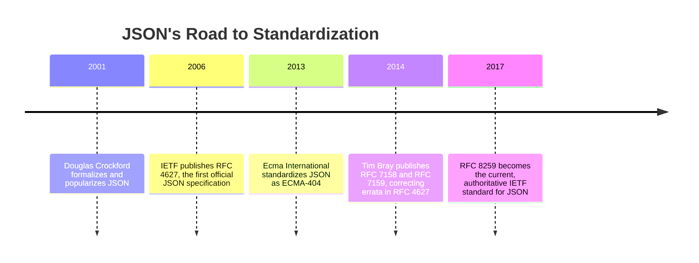
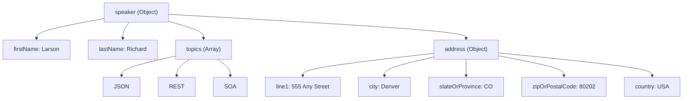
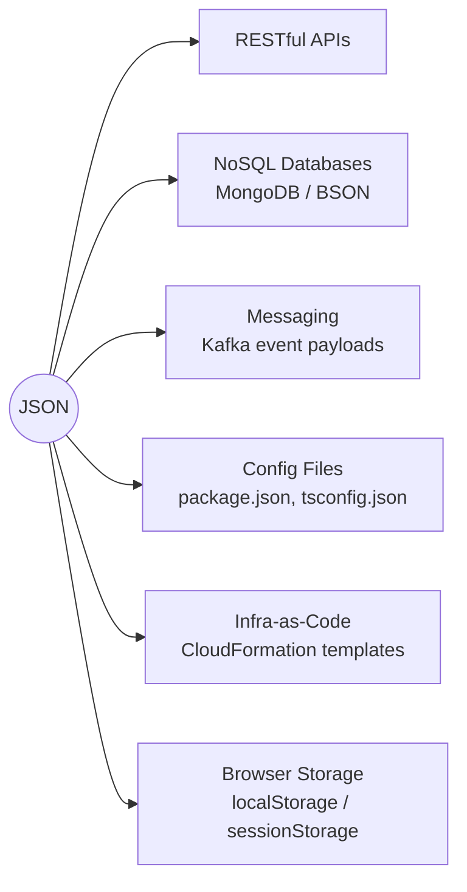
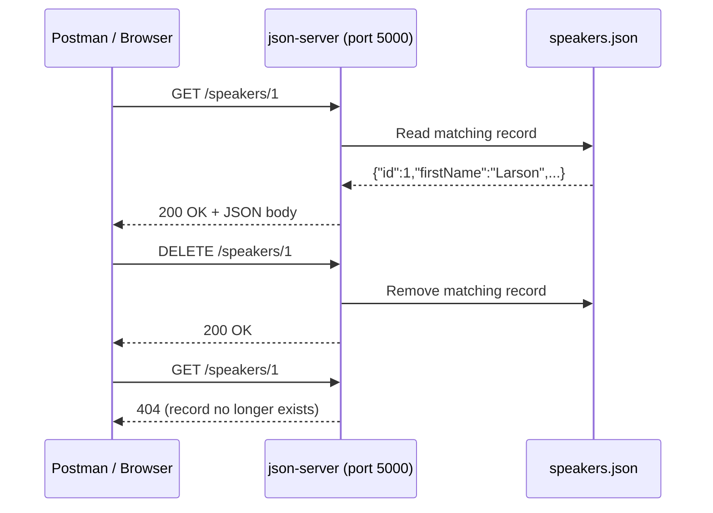

# JSON, Demystified: Everything I Wish Someone Had Told Me on Day One

## A long-form guide to the format that quietly runs the internet

I still remember the first time I opened a network tab in my browser's dev tools and stared at a wall of curly braces coming back from an API call. It looked cryptic for about thirty seconds, and then it just... clicked. That's the thing about JSON — it's one of the rare technical standards that rewards you almost immediately for learning it. There's no fifty-page specification to memorize, no arcane syntax rules that only make sense after years of practice. It's just objects, arrays, and a handful of value types, dressed up in a notation borrowed from JavaScript.

But "simple" doesn't mean "shallow." Over the years I've been bitten by JSON's edge cases more times than I'd like to admit — silent number precision loss, trailing commas that blow up a parser at 2 a.m., date formats that mean different things to different systems, and style debates that turn into hour-long meetings. So I wanted to write the guide I wish I'd had when I started: not just "here's what an object looks like," but the syntax, the history, the gotchas, the tooling, the schema validation, and the real code you can run yourself to see it all in action.

This is a long one — grab a coffee. I've broken it into clearly labeled sections so you can jump around, but if you're new to JSON, I'd encourage you to read it start to finish at least once. I've tested every code snippet in this post myself before including it, so you can trust that what you see is what you'll get if you run it locally.

> **Note**
> Every code example in this post was actually executed — Python examples on Python 3, JavaScript examples on Node.js — and the output shown is the real output from those runs, not something I typed from memory. When I show you a "gotcha," I mean it: I reproduced the bug first.

---

## Table of Contents

1. [What JSON Actually Is](#what-json-actually-is)
2. [A Little History (It's Newer Than You Think)](#a-little-history)
3. [The Core Syntax: Objects, Arrays, and Name/Value Pairs](#the-core-syntax)
4. [JSON's Value Types, One by One](#json-value-types)
5. [JSON vs. XML: Why JSON Won](#json-vs-xml)
6. [Where JSON Actually Shows Up](#where-json-shows-up)
7. [Style Guides: camelCase, snake_case, and Dates](#style-guides)
8. [Working With JSON in Code](#working-with-json-in-code)
9. [Validating JSON With JSON Schema](#json-schema)
10. [Tools of the Trade](#tools-of-the-trade)
11. [Cautions: The Gotchas That Get Everyone Eventually](#cautions)
12. [Best Practices I Actually Follow](#best-practices)
13. [Building a Tiny Stub API to Practice On](#stub-api)
14. [JSON Lines (NDJSON): Streaming Large Datasets](#json-lines)
15. [JSON Across Other Languages](#other-languages)
16. [JSON vs. YAML vs. Binary Formats](#json-vs-yaml-binary)
17. [Performance Notes: Parsing at Scale](#performance-notes)
18. [Frequently Asked Questions](#faq)
19. [A Short Case Study: The Bug That Taught Me to Respect This Format](#case-study)
20. [Wrapping Up](#wrapping-up)

---

<a id="what-json-actually-is"></a>
## 1. What JSON Actually Is

JSON stands for **JavaScript Object Notation**. That name is a little bit misleading today, because although JSON's syntax was lifted directly from JavaScript's object-literal notation, JSON itself is a completely language-independent, text-based data format. I can generate a JSON document in Python, send it over HTTP, and have it consumed by a Java service, a Ruby script, a C# application, or a mobile app written in Swift — none of them need to know or care that the format originated in JavaScript.

At its core, JSON exists to solve one narrow, extremely common problem: **how do two systems that don't share memory or a programming language agree on a way to describe structured data?** That's it. It's a serialization format — a way of turning an in-memory data structure (an object, a record, a dictionary) into a string of text that can be written to a file, sent across a network, or stored in a database, and then turned back into an equivalent structure on the other end.

I like to think of JSON as having three properties that, together, explain almost everything about why it's everywhere today:

| Property | What it means in practice |
|---|---|
| **Technology-agnostic** | Every mainstream language has a JSON parser, usually in its standard library. I don't need a vendor-specific SDK. |
| **Human-readable** | I can open a `.json` file in a plain text editor and understand it without any tooling. Compare that to a binary format like Protocol Buffers. |
| **Lightweight** | There's no schema boilerplate required, no opening/closing tag pairs like XML. Less text means smaller payloads and faster parsing. |

JSON isn't tied to any particular architectural style, either. I most often encounter it wrapping RESTful API responses, but it shows up just as naturally in:

- Configuration files (Node.js's `package.json`, VS Code's `settings.json`)
- Document-oriented NoSQL databases like MongoDB, where documents are stored in a JSON-like binary format called BSON
- Message payloads in streaming platforms like Kafka
- Log files, especially in "structured logging" setups
- Local storage in web browsers
- Infrastructure-as-code tools like AWS CloudFormation (which accepts JSON as an alternative to YAML)

If you remember nothing else from this section, remember this: **JSON is a data interchange format, not a programming language feature.** It just happens to look like one, because that's where it came from.

---

<a id="a-little-history"></a>
## 2. A Little History (It's Newer Than You Think)

I find this genuinely surprising every time I think about it: JSON is younger than Google. Douglas Crockford is generally credited with formalizing JSON around 2001, extracting it from JavaScript's existing object-literal syntax rather than inventing something new from scratch. The idea was almost embarrassingly simple — JavaScript already had a compact, readable way to describe structured data in source code, so why not use that same notation as a wire format?

Here's a rough timeline of how JSON went from "a neat trick" to "an internationally recognized standard":



A few things I think are worth calling out from that timeline:

- **JSON had informal adoption years before it had a formal spec.** By the time RFC 4627 was published in 2006, plenty of production systems were already using JSON — the standard was catching up to reality, not leading it.
- **Crockford deliberately kept the spec tiny.** The core JSON grammar fits on a single page. That's not an accident — it was a design philosophy. Every time someone has proposed extending JSON with comments, dates, or other conveniences, Crockford's answer has generally been "no, invent a new format if you need that; don't fragment JSON."
- **There are now two parallel standards bodies** (IETF and Ecma International) that both recognize JSON, which is part of why you'll sometimes see it cited as "RFC 8259" in one place and "ECMA-404" in another. They describe the same grammar.

> **Note**
> If you ever need to cite "the" JSON specification in something formal — an RFP, a compliance document, an API contract — RFC 8259 is the current authoritative reference from the IETF side, and ECMA-404 is the equivalent from Ecma International. Practically speaking, they agree with each other.

---

<a id="the-core-syntax"></a>
## 3. The Core Syntax: Objects, Arrays, and Name/Value Pairs

Every valid JSON document is one of exactly two things at its top level:

- An **object**, wrapped in curly braces `{ }`
- An **array**, wrapped in square brackets `[ ]`

That's the whole rule. Let me show you the smallest possible valid JSON document:

```json
{ "thisIs": "My first JSON document" }
```

And here's a minimal valid array:

```json
[
  "also",
  "a",
  "valid",
  "JSON",
  "doc"
]
```

Both of those are complete, valid JSON documents on their own — you could save either one to a `.json` file and hand it to any JSON parser without complaint. I mention this because it trips people up: JSON doesn't require you to have a top-level object with named keys. A bare array is perfectly legal.

### Objects

An **object** is an unordered collection of comma-separated name/value pairs. Here's a name/value pair up close:

```json
{
  "conference": "OSCON",
  "speechTitle": "JSON at Work",
  "track": "Web APIs"
}
```

Breaking that down:

- The **name** (also called a "key") sits to the left of the colon. It is always a string, and it must always be wrapped in double quotes — not single quotes, and never left bare.
- The **value** sits to the right of the colon. It can be any of JSON's six value types, which I'll cover in detail in the next section.

Objects can nest inside other objects, and they can hold arrays as values:

```json
{
  "speaker": {
    "firstName": "Larson",
    "lastName": "Richard",
    "topics": ["JSON", "REST", "SOA"],
    "address": {
      "line1": "555 Any Street",
      "city": "Denver",
      "stateOrProvince": "CO",
      "zipOrPostalCode": "80202",
      "country": "USA"
    }
  }
}
```

Here's the mental model I use for objects, visualized as a tree:



Key characteristics of objects, summarized:

| Rule | Detail |
|---|---|
| Delimiters | Opens with `{`, closes with `}` |
| Separator | Comma-separated pairs |
| Ordering | Unordered by spec — don't rely on key order, even though most parsers happen to preserve insertion order |
| Empty object | `{}` is valid |
| Nesting | Objects can contain other objects and arrays, to any depth |
| Duplicate keys | Technically undefined behavior in the spec — different parsers handle `{"a":1,"a":2}` differently. Avoid this entirely. |

> **Caution**
> Duplicate keys in a single object (`{"id": 1, "id": 2}`) are not explicitly forbidden by the grammar, but the spec explicitly says behavior is unspecified when this happens. I've seen parsers silently take the *last* value, silently take the *first* value, and in a couple of strict validators, reject the document outright. Never rely on this — treat duplicate keys as a bug in whatever produced the JSON.

### Arrays

An **array** is an ordered, comma-separated collection of values. Unlike objects, arrays don't have keys — position is the only way to address an element.

```json
{
  "presentations": [
    {
      "title": "JSON at Work: Overview and Ecosystem",
      "length": "90 minutes",
      "track": "Web APIs"
    },
    {
      "title": "RESTful Security at Work",
      "length": "90 minutes",
      "track": "Web APIs"
    }
  ]
}
```

Characteristics of arrays:

| Rule | Detail |
|---|---|
| Delimiters | Opens with `[`, closes with `]` |
| Separator | Comma-separated values |
| Ordering | Ordered — the sequence you write is the sequence you get back |
| Empty array | `[]` is valid |
| Mixed types | Legal, though usually a design smell: `["a", 1, true, null]` is valid JSON |
| Nesting | Arrays can hold objects, other arrays, or any scalar value type |
| Indexing | Zero-based in virtually every language you'll use JSON with (JavaScript, Python, Java, C#) |

> **Note**
> JSON arrays *can* legally mix types (`["red", 42, false]`), but in practice, well-designed APIs keep arrays homogeneous — every element the same shape. Mixed-type arrays are almost always a sign that the API design needs another look, or that you're looking at loosely-typed data dumped straight from a script rather than a deliberately designed payload.

---

<a id="json-value-types"></a>
## 4. JSON's Value Types, One by One

Everything to the right of a colon in a JSON document — or every element inside an array — is one of exactly **six value types**. I like having this list memorized because it makes reading unfamiliar JSON schemas much faster:

| Value type | Example | Notes |
|---|---|---|
| `object` | `{"city": "Denver"}` | Covered above |
| `array` | `["JSON", "REST"]` | Covered above |
| `string` | `"hello"` | Unicode text, double-quoted only |
| `number` | `29`, `-10.5`, `1.23e11` | No distinction between "integer" and "float" at the grammar level |
| `boolean` | `true`, `false` | Lowercase, unquoted, no other spellings accepted |
| `null` | `null` | Lowercase, unquoted, means "intentionally no value" |

Let's go through the non-container types individually, because each one has quirks worth knowing.

### Strings

```json
[
  "fred",
  "fred\t",
  "\b",
  "",
  "\t",
  "\u004A"
]
```

A JSON string is zero or more Unicode characters wrapped in double quotes. A few rules that catch people off guard:

- **Single quotes are not valid JSON.** `{'name': 'fred'}` will fail to parse in a strict parser. This is probably the single most common "why won't my JSON parse" bug I've seen, usually from someone pasting in a JavaScript object literal (where single quotes *are* fine) and assuming it's the same thing as JSON.
- The empty string `""` is a perfectly valid value.
- Certain characters must be escaped with a backslash. Here's the full table:

| Escape sequence | Meaning |
|---|---|
| `\"` | Double quote |
| `\\` | Backslash |
| `\/` | Forward slash (escaping this is optional, but allowed) |
| `\b` | Backspace |
| `\f` | Form feed |
| `\n` | Newline |
| `\r` | Carriage return |
| `\t` | Tab |
| `\uXXXX` | Any Unicode character via its 4-digit hex code point |

### Numbers

```json
{
  "age": 29,
  "cost": 299.99,
  "temperature": -10.5,
  "unitCost": 0.2,
  "speedOfLight": 1.23e11,
  "speedOfLight2": 1.23e+11,
  "avogadro": 6.023E23,
  "oneHundredth": 10e-3
}
```

Number rules:

- Always base 10. No hexadecimal (`0x1A`), no octal, no binary literals — those are JavaScript/Python conveniences that JSON does not support.
- No leading zeros (`007` is invalid JSON — it must be `7`).
- An optional fractional part introduced by a decimal point.
- An optional exponent using `e` or `E`, with an optional `+` or `-` sign.
- **No `NaN` and no `Infinity`.** This is a common gotcha coming from JavaScript, where those are legitimate numeric values. If you try to serialize `NaN` to JSON in JavaScript, you'll get `null` instead (I'll demonstrate this below), and in most other languages, serializing `NaN` or `Infinity` to JSON either throws an error or is explicitly disallowed.

> **Caution — Large Integer Precision Loss**
> This one bit me in production once, and it's worth understanding cold. JSON itself doesn't limit how large a number can be — you can write a 40-digit integer in a `.json` file and it's syntactically valid. But most JSON parsers deserialize numbers into a language's native floating-point type (a JavaScript `Number`, for instance, which is an IEEE-754 double). Doubles can only represent integers *exactly* up to `Number.MAX_SAFE_INTEGER` (2^53 − 1 = 9,007,199,254,740,991). Beyond that, you silently lose precision. I reproduced this myself:
>
> ```javascript
> const rawText = '9007199254740993'; // one past Number.MAX_SAFE_INTEGER
> const raw = '{"id": ' + rawText + '}';
> const parsed = JSON.parse(raw);
> console.log("Number.MAX_SAFE_INTEGER:", Number.MAX_SAFE_INTEGER);
> console.log("Original number in JSON text:", rawText);
> console.log("Parsed back out of JS (id):  ", parsed.id);
> ```
>
> Actual output when I ran this:
> ```text
> Number.MAX_SAFE_INTEGER: 9007199254740991
> Original number in JSON text: 9007199254740993
> Parsed back out of JS (id):   9007199254740992
> ```
>
> `9007199254740993` silently became `9007199254740992`. No error, no warning — just a wrong number. This is exactly why APIs dealing with things like 64-bit database IDs, Snowflake IDs, or Twitter/X status IDs frequently serialize those IDs **as JSON strings** (`"id": "9007199254740993"`) instead of raw numbers, even though a number would seem more "correct" semantically.

### Booleans

```json
{
  "isRegistered": true,
  "emailValidated": false
}
```

Only two spellings are legal: `true` and `false`, always lowercase, always unquoted. `"true"` (quoted) is a string, not a boolean — a subtle but important distinction, especially when a value gets passed through a system that does loose/truthy comparisons.

### null

```json
{
  "address": {
    "line1": "555 Any Street",
    "line2": null,
    "city": "Denver"
  }
}
```

`null` represents "this key deliberately has no value." It's worth distinguishing `null` from two things it's often confused with:

| Concept | Meaning |
|---|---|
| `"line2": null` | The key exists, and its value is explicitly nothing |
| `"line2": ""` | The key exists, and its value is an empty string — not the same thing! |
| *(key omitted entirely)* | The key doesn't exist at all. In many APIs this means something different from "exists but is null" — e.g., PATCH semantics often treat a missing field as "leave unchanged" and an explicit `null` as "clear this field." |

> **Note**
> That distinction — omitted key vs. explicit `null` vs. empty string — is one of the most common sources of subtle API bugs I've run into. If you're designing an API, document clearly what each of the three means for every nullable field, especially for PATCH/PUT endpoints.

---

<a id="json-vs-xml"></a>
## 5. JSON vs. XML: Why JSON Won

I came up in an era where XML was still the default answer for "how do two systems talk to each other," so I have some perspective on why the pendulum swung so hard toward JSON. It wasn't one single reason — it was a combination of technical and cultural factors.

Here's the same data, once in each format, so you can see the difference directly:

**XML:**
```xml
<speaker>
  <firstName>Larson</firstName>
  <lastName>Richard</lastName>
  <topics>
    <topic>JSON</topic>
    <topic>REST</topic>
    <topic>SOA</topic>
  </topics>
</speaker>
```

**JSON:**
```json
{
  "speaker": {
    "firstName": "Larson",
    "lastName": "Richard",
    "topics": ["JSON", "REST", "SOA"]
  }
}
```

A side-by-side comparison of the two formats:

| Dimension | XML | JSON |
|---|---|---|
| Verbosity | Higher — every element needs an opening *and* closing tag | Lower — braces and brackets do double duty |
| Attributes vs. elements | Constant design debate (should this be `<speaker id="5">` or `<id>5</id>`?) | No such ambiguity — everything is just a name/value pair |
| Native language mapping | Requires a binding layer (JAXB, XML Schema-to-class generators) to feel natural in code | Maps almost directly onto native data structures (dicts, objects, hashes) in most languages |
| Schema/validation | XML Schema (XSD) is mature and powerful, but heavyweight | JSON Schema exists and is capable, but historically less universal |
| Comments | Supported (`<!-- like this -->`) | **Not supported**, by design |
| Namespaces | First-class concept | No concept of namespaces |
| Human readability | Reasonable, but tag repetition adds noise | Generally considered easier to skim |
| Payload size | Larger for equivalent data | Smaller — this matters at scale, over millions of API calls |

The historical irony is that early critics dismissed JSON-based REST APIs as "non-standard" compared to XML-based SOAP web services — but as covered in the history section, JSON has been a formally recognized international standard (via both the IETF and Ecma International) since 2013–2014. That argument doesn't really hold up anymore.

I don't think XML is "bad," to be clear — it's still the right tool in places that need namespaces, mixed content (text interleaved with markup, like in a document), or extremely mature validation tooling (think: enterprise document exchange, some financial and healthcare interchange formats). But for the "give me some structured data back from an API call" use case that dominates modern web and mobile development, JSON's lower ceremony wins almost every time.

---

<a id="where-json-shows-up"></a>
## 6. Where JSON Actually Shows Up

It's easy to think of JSON as "the REST API format" and stop there, but once I started paying attention, I noticed it everywhere:

### RESTful APIs
This is JSON's home turf. Nearly every modern public API — think payment processors, social platforms, cloud providers — accepts and returns JSON by default, negotiated via the `Content-Type: application/json` HTTP header.

### NoSQL Databases
Document databases like MongoDB store records in BSON (Binary JSON) — a binary-encoded superset of JSON that adds a few extra types (like native date and binary data types) that plain JSON can't represent. When you query MongoDB and get a document back, conceptually you're looking at a JSON object.

### Messaging and Streaming Platforms
Systems like Kafka frequently carry JSON-encoded event payloads, though in high-throughput systems you'll also see binary formats like Avro or Protobuf used instead, precisely because JSON's textual nature costs more in serialization overhead and payload size at extreme scale.

### Configuration Files
- Node.js projects use `package.json` to declare dependencies, scripts, and metadata.
- Many editors, including Sublime Text and VS Code, use JSON (or JSON-with-comments, a common informal extension) for settings files.
- TypeScript projects use `tsconfig.json`.

### Infrastructure and Tooling
- AWS CloudFormation templates can be written in JSON (as an alternative to YAML).
- Postman collections, OpenAPI definitions (which can be JSON or YAML), and countless CLI tools use JSON for structured output (`--output json` is a common flag pattern).

### Browser Storage and Local State
`localStorage` and `sessionStorage` in browsers only store strings, so JSON is the de facto way to persist structured application state client-side (`localStorage.setItem('cart', JSON.stringify(cartObject))`).

### GraphQL Responses
It's worth calling out explicitly, since it's easy to overlook: GraphQL — often talked about as a distinct alternative to REST — still overwhelmingly returns its query results as JSON over the wire. GraphQL changes *how you ask* for data (a single flexible query endpoint instead of many fixed resource URLs), but it doesn't change *the format the answer comes back in*. I mention this because I've talked to people who assumed adopting GraphQL meant leaving JSON behind, when in practice the two sit comfortably on top of each other — GraphQL is a query language, JSON is still doing the actual data-transport job underneath it.

### WebSockets and Real-Time Data
Real-time protocols built on WebSockets — chat applications, live dashboards, multiplayer game state, collaborative editing tools — very commonly use JSON-encoded messages for each event pushed over the open connection, precisely because it gives both ends of the connection a shared, self-describing way to interpret an arbitrary stream of typed events (`{"type": "cursor_move", "x": 120, "y": 84}`, `{"type": "chat_message", "text": "hey"}`) without needing a separate binary protocol negotiated up front.

Here's a diagram of that ecosystem, roughly grouped:



---

<a id="style-guides"></a>
## 7. Style Guides: camelCase, snake_case, and Dates

JSON's grammar doesn't dictate naming conventions, date formats, or indentation — which means every team ends up needing house rules. The most widely cited reference here is Google's JSON Style Guide, and I generally default to it unless a project has already established different conventions.

### Property Naming: camelCase vs. snake_case

| Style | Example | Common in |
|---|---|---|
| `lowerCamelCase` | `firstName`, `dateRegistered` | JavaScript/Java ecosystems, Google's style guide, most public REST APIs |
| `snake_case` | `first_name`, `date_registered` | Ruby on Rails, Python-heavy backends, some database-first APIs |

Neither is "more correct" per the JSON spec — this is purely a convention question. What matters more than which one you pick is **consistency within a single API**. I've worked on codebases that mixed both because two different teams owned different endpoints, and it made client code noticeably uglier (constant manual case conversion, or worse, subtly wrong assumptions about a field's casing that only show up at runtime).

```json
{
  "firstName": "John Smith"
}
```

### Date and Time Values

JSON has no native date type — dates are always represented as strings, which means the *format* of that string is entirely a convention, not a rule enforced by any parser. Google's style guide (and most modern API design guides) recommend RFC 3339 format, which is a stricter profile of the broader ISO 8601 standard:

```json
{
  "dateRegistered": "2014-03-01T23:46:11-05:00"
}
```

Breaking that down:
- `2014-03-01` — the date, year-month-day
- `T` — a literal separator between date and time (RFC 3339 requires `T`; ISO 8601 also permits a space here, which is one of the few differences between the two standards)
- `23:46:11` — the time, hour:minute:second, 24-hour clock
- `-05:00` — the UTC offset, here US Eastern Standard Time

> **Note**
> If you're building an API that will be consumed globally, I'd strongly encourage standardizing on UTC (offset `+00:00`, often written as `Z`) for all stored and transmitted timestamps, and letting clients handle local time zone conversion for display. Mixing offsets across a dataset is a recurring source of subtle bugs in anything involving scheduling or auditing.

### Latitude/Longitude

Less common, but worth knowing: the Google style guide recommends geographic coordinates follow the ISO 6709 convention, represented as a single string rather than two separate numeric fields, specifically because a plain JSON number can't carry a leading `+` sign the way ISO 6709 sometimes wants:

```json
{
  "empireStateBuilding": "40.748747-73.985547"
}
```

Format: `±DD.DDDD±DDD.DDDD` — latitude first, north is positive, east is positive. Honestly, I see this convention far less often in practice than separate `"latitude"` and `"longitude"` numeric fields, but it's good to recognize if you run into it.

### Indentation

The JSON grammar doesn't care about whitespace at all — indentation is purely for humans. A few practical notes:

- Two, three, and four spaces are all common; pick one and be consistent across a codebase.
- Most JSON formatters/prettifiers default to 2 spaces.
- **Never mix tabs and spaces** in JSON you intend to keep human-readable in diffs — it causes messy version-control diffs even though it doesn't affect parsing.
- For data actually transmitted over the wire (API responses), indentation is usually stripped entirely (minified) to save bytes — pretty-printing is a development/debugging convenience, not something you ship in production payloads.

---

<a id="working-with-json-in-code"></a>
## 8. Working With JSON in Code

Reading about syntax only gets you so far — let's actually run some code. I tested everything below myself; the output shown is real, not reconstructed from memory.

### JavaScript: `JSON.stringify` and `JSON.parse`

JavaScript has JSON support built directly into the language via the global `JSON` object — no import needed.

```javascript
const data = {
  conference: "OSCON",
  speechTitle: "JSON at Work",
  attendees: 450,
  isVirtual: false,
  track: null,
  topics: ["JSON", "REST", "APIs"]
};

const jsonString = JSON.stringify(data, null, 2);
console.log("Serialized JSON:");
console.log(jsonString);

const parsed = JSON.parse(jsonString);
console.log("\nDeserialized back to JS object:");
console.log(parsed);
console.log("\ntypeof parsed:", typeof parsed);
console.log("Access nested value -> topics[0]:", parsed.topics[0]);
```

Actual output from running this in Node.js:

```text
Serialized JSON:
{
  "conference": "OSCON",
  "speechTitle": "JSON at Work",
  "attendees": 450,
  "isVirtual": false,
  "track": null,
  "topics": [
    "JSON",
    "REST",
    "APIs"
  ]
}

Deserialized back to JS object:
{
  conference: 'OSCON',
  speechTitle: 'JSON at Work',
  attendees: 450,
  isVirtual: false,
  track: null,
  topics: [ 'JSON', 'REST', 'APIs' ]
}

typeof parsed: object
Access nested value -> topics[0]: JSON
```

A couple of details worth noting from that run:

- `JSON.stringify(data, null, 2)` — the second argument is a "replacer" (I passed `null` to skip it), and the third argument (`2`) is the indentation width. This is the built-in pretty-printer.
- `typeof parsed` reports `"object"` — JavaScript doesn't distinguish arrays from generic objects at the `typeof` level; you'd use `Array.isArray()` for that if needed.

Now let's confirm two of the "invalid JSON" gotchas I mentioned earlier, by deliberately trying to break the parser:

```javascript
// Trailing comma is INVALID JSON
try {
  JSON.parse('{"a": 1,}');
} catch (e) {
  console.log("Trailing comma error:", e.message);
}

// Single-quoted keys are INVALID JSON
try {
  JSON.parse("{'a': 1}");
} catch (e) {
  console.log("Single-quote key error:", e.message);
}
```

Actual output:

```text
Trailing comma error (expected): Expected double-quoted property name in JSON at position 8 (line 1 column 9)
Single-quote key error (expected): Expected property name or '}' in JSON at position 1 (line 1 column 2)
```

Both errors fire exactly where you'd expect — right at the offending character. Node's error messages here are genuinely helpful; I'd rather have a precise position than a vague "invalid JSON" message.

### Python: the `json` module

Python's standard library ships a `json` module — again, no third-party dependency required.

```python
import json

data = {
    "conference": "OSCON",
    "speechTitle": "JSON at Work",
    "attendees": 450,
    "isVirtual": False,
    "track": None,
    "topics": ["JSON", "REST", "APIs"]
}

# Serialize
json_string = json.dumps(data, indent=2)
print("Serialized JSON:")
print(json_string)

# Deserialize
parsed = json.loads(json_string)
print("\nDeserialized back to Python dict:")
print(parsed)
print("\nType of parsed:", type(parsed))
print("Access nested value -> topics[0]:", parsed["topics"][0])
```

Actual output:

```text
Serialized JSON:
{
  "conference": "OSCON",
  "speechTitle": "JSON at Work",
  "attendees": 450,
  "isVirtual": false,
  "track": null,
  "topics": [
    "JSON",
    "REST",
    "APIs"
  ]
}

Deserialized back to Python dict:
{'conference': 'OSCON', 'speechTitle': 'JSON at Work', 'attendees': 450, 'isVirtual': False, 'track': None, 'topics': ['JSON', 'REST', 'APIs']}

Type of parsed: <class 'dict'>
Access nested value -> topics[0]: JSON
```

Notice the type mapping happening automatically in both directions — this is one of the genuinely nice things about JSON support in mainstream languages:

| JSON type | Python type | JavaScript type |
|---|---|---|
| object | `dict` | Object |
| array | `list` | Array |
| string | `str` | String |
| number (no decimal) | `int` | Number |
| number (with decimal/exponent) | `float` | Number |
| `true` / `false` | `bool` (`True`/`False`) | Boolean |
| `null` | `None` | `null` |

> **Caution**
> Python's `True`/`False`/`None` capitalization is a Python-language convention, not a JSON convention — when Python serializes these to JSON text via `json.dumps`, they correctly become the lowercase `true`, `false`, `null` that the JSON spec requires. It's only in Python *source code* that you write the capitalized versions. This is a common point of confusion for people newer to Python who paste JSON directly as if it were valid Python and get a `NameError` on `true`.

### The `NaN` / `Infinity` Gotcha in JavaScript

I mentioned earlier that JSON has no representation for `NaN` or `Infinity`, even though JavaScript itself has both as legitimate numeric values. Here's what actually happens when you try:

```javascript
const weird = { a: NaN, b: Infinity, c: -Infinity };
console.log(JSON.stringify(weird));
```

This produces:

```text
{"a":null,"b":null,"c":null}
```

JavaScript silently converts all three to `null` rather than throwing an error. I find this one particularly dangerous because it fails *silently* — there's no exception, no warning, just quietly wrong data. If a calculation upstream produces `NaN` (a very common outcome of, say, dividing by zero or parsing a malformed number) and that value flows into a JSON payload, you'll get `null` on the other end with zero indication anything went wrong.

---

<a id="json-schema"></a>
## 9. Validating JSON With JSON Schema

Once you're past toy examples, you'll want a way to formally describe "what does a *valid* document of this shape look like" — required fields, types, value ranges, and so on. That's what **JSON Schema** is for. It's itself written in JSON, describing constraints on other JSON documents.

Here's a schema I wrote and tested describing a conference speaker:

```json
{
  "type": "object",
  "properties": {
    "firstName": { "type": "string" },
    "lastName": { "type": "string" },
    "age": { "type": "number", "minimum": 0 },
    "topics": {
      "type": "array",
      "items": { "type": "string" }
    }
  },
  "required": ["firstName", "lastName"]
}
```

And here's Python code (using the popular `jsonschema` library) validating two documents against it — one valid, one deliberately broken:

```python
from jsonschema import validate, ValidationError

schema = {
    "type": "object",
    "properties": {
        "firstName": {"type": "string"},
        "lastName": {"type": "string"},
        "age": {"type": "number", "minimum": 0},
        "topics": {
            "type": "array",
            "items": {"type": "string"}
        }
    },
    "required": ["firstName", "lastName"]
}

good_doc = {
    "firstName": "Larson",
    "lastName": "Richard",
    "age": 34,
    "topics": ["JSON", "REST", "SOA"]
}

bad_doc = {
    "firstName": "Larson",
    "age": -5
}

validate(instance=good_doc, schema=schema)
print("good_doc passed validation")

try:
    validate(instance=bad_doc, schema=schema)
except ValidationError as e:
    print("bad_doc failed validation as expected:")
    print(" ->", e.message)
```

Actual output:

```text
good_doc passed validation
bad_doc failed validation as expected:
 -> 'lastName' is a required property
```

Notice that `bad_doc` actually has *two* problems — it's missing `lastName`, *and* its `age` value (`-5`) violates the `"minimum": 0` constraint. The validator reports the first failure it encounters (missing `lastName`) and stops there by default; if I'd fixed that and re-validated, it would then have caught the negative age.

A few reasons I reach for JSON Schema on real projects:

- **Contract enforcement between teams.** If a frontend and backend team both validate against the same schema, "the API changed and broke my client" becomes far less common.
- **Auto-generated documentation.** Tools like Swagger/OpenAPI use a JSON-Schema-flavored syntax to describe request/response bodies, and can generate human-readable docs directly from it.
- **Input sanitization at the edge.** Validating incoming request bodies against a schema before they ever touch business logic catches a huge class of malformed-request bugs early, with a clear, structured error message instead of a confusing downstream exception.

| JSON Schema keyword | Purpose |
|---|---|
| `"type"` | Restricts the value to one JSON value type (`string`, `number`, `object`, etc.) |
| `"properties"` | Describes the expected shape of an object's fields |
| `"required"` | Lists which object keys must be present |
| `"items"` | Describes the expected shape of array elements |
| `"minimum"` / `"maximum"` | Numeric bounds |
| `"enum"` | Restricts a value to a fixed set of allowed options |
| `"pattern"` | Regex constraint on string values |

---

<a id="tools-of-the-trade"></a>
## 10. Tools of the Trade

Over the years I've collected a small toolkit for working with JSON day-to-day. Here's what earns a spot in it:

### Validators

**JSONLint** is the classic "paste your JSON, click validate" web tool. When a parser gives me a vague or unhelpful error, I'll often paste the payload into a validator like this just to get a clearer pointer to exactly where the malformed syntax is.

### Editors / Modelers

Tools like **JSON Editor Online** let you build a JSON document visually — adding objects, arrays, and key/value pairs through a form-like UI — and then generate the corresponding text. I find this useful early in API design, before I've committed to a shape, because it's faster to restructure visually than to hand-edit nested braces.

> **Caution**
> Public, free-tier web-based JSON tools (validators, editors, formatters) are, by definition, sending whatever you paste into them to a third-party server. Never paste real credentials, personal data, production database contents, or anything else sensitive into a public JSON tool. Use a local/offline tool, or your IDE's built-in JSON support, for anything sensitive.

### Browser Extensions

**JSONView**-style extensions pretty-print raw JSON responses when you navigate directly to an API endpoint in your browser, turning an unreadable single-line blob into a collapsible, syntax-highlighted tree. I consider this close to essential for quick manual API poking.

### API Testing Tools

**Postman** (and similar tools like Insomnia or the `curl`/`httpie` command-line clients) let you construct and send full HTTP requests — not just `GET`, but `POST`, `PUT`, `PATCH`, and `DELETE` — with custom headers and JSON request bodies, then inspect the JSON response. A browser alone can only really do `GET` requests, so a dedicated API client is necessary once you're testing anything that mutates data.

### Mock/Stub Servers

Tools like **json-server** (a Node.js package) let you point at a plain `.json` file and instantly get a working REST API in front of it — full CRUD support, generated from a single data file, with zero backend code written. I'll walk through this hands-on in the next section.

### Command-Line Processing

**`jq`** deserves its own callout — it's a command-line JSON processor that lets you filter, transform, and reshape JSON from the shell, which is enormously useful in scripts and CI pipelines. A quick taste:

```bash
echo '{"name": "Larson", "topics": ["JSON", "REST"]}' | jq '.topics[0]'
```

That would output:

```text
"JSON"
```

| Tool | Category | What I use it for |
|---|---|---|
| JSONLint | Validator | Quick syntax-error diagnosis |
| JSON Editor Online | Visual editor | Early-stage API/data modeling |
| JSONView (browser ext.) | Viewer | Pretty-printing raw API responses in-browser |
| Postman / Insomnia | API client | Testing full CRUD against an API, setting headers |
| json-server | Mock server | Instant stub REST APIs from a static JSON file |
| jq | CLI processor | Shell scripting and pipeline transformations |
| JSON Schema validators | Validation library | Enforcing/testing data contracts in code |

---

<a id="cautions"></a>
## 11. Cautions: The Gotchas That Get Everyone Eventually

I've scattered individual cautions throughout this post already, but I want to collect the ones I consider most important in one place, because these are the mistakes I see repeated across almost every team I've worked with.

> **Caution — No Comments, Ever**
> JSON has no comment syntax. None. Not `//`, not `/* */`, not `#`. This is a deliberate design decision by Crockford — he originally allowed comments, then removed them after observing that people were abusing them for parsing directives, which broke interoperability across tools. If you need commented configuration, you have a few real options: use a JSON superset like JSON5 or JSONC (which VS Code's own settings files quietly use), switch to YAML, or keep documentation in a separate file. Don't try to hack comments into plain JSON with a convention like `"_comment": "this explains the field above"` — it works, technically, but it pollutes the actual data structure with metadata that consumers now have to know to ignore.

> **Caution — Trailing Commas Break Strict Parsers**
> `{"a": 1, "b": 2,}` — that trailing comma after `2` — is invalid JSON, even though it's completely legal in a JavaScript object literal and in several other languages. I verified this directly:
> ```text
> Trailing comma error: Expected double-quoted property name in JSON at position 8 (line 1 column 9)
> ```
> This bites people constantly when hand-editing JSON files, because trailing commas are a forgiving, common style in JS source code.

> **Caution — Single Quotes Are Never Valid**
> Only double quotes are legal for JSON strings and keys. `{'name': 'value'}` will fail everywhere a strict parser is used, even though it's valid JavaScript.

> **Caution — Large Integers Lose Precision**
> Covered in detail earlier — numbers beyond `Number.MAX_SAFE_INTEGER` (2^53 − 1) can silently lose precision when parsed into a JavaScript double, or any other language's IEEE-754 floating point number. The common fix is to represent very large IDs as strings in the JSON payload instead of raw numbers.

> **Caution — No Native Date Type**
> Every date in JSON is "just a string" as far as the grammar is concerned. There's no enforcement that it follows any particular format unless you add that constraint yourself (e.g., via a JSON Schema `"format": "date-time"` keyword, or application-level validation). I've inherited APIs where three different date formats were used across different endpoints, because nothing in the format itself prevented it.

> **Caution — Key Order Isn't Guaranteed**
> The JSON spec explicitly defines objects as *unordered* collections. In practice, most parsers (V8's JSON.parse, Python's json module) preserve insertion order as an implementation detail, and plenty of code has come to quietly depend on that. But relying on it is technically relying on undefined behavior — don't build logic that depends on object key order; use an array of objects instead if order genuinely matters.

> **Caution — `NaN` and `Infinity` Vanish Silently**
> As shown earlier, JavaScript's `JSON.stringify` silently converts `NaN`, `Infinity`, and `-Infinity` to `null` with no warning. If a value in your data pipeline could plausibly become one of these (division, floating point math, malformed parsing upstream), be aware that a resulting `null` downstream might actually mean "this was NaN," not "this was intentionally empty."

> **Caution — JSON Is Not a Security Boundary**
> Just because JSON is easy to read doesn't mean it's safe to trust. Always validate and sanitize JSON received from untrusted sources (user input, third-party APIs) before using it — deeply nested or extremely large JSON payloads have historically been used as a denial-of-service vector against poorly configured parsers (sometimes called a "billion laughs"-style attack, borrowed from the XML world). Most modern parsers have reasonable depth/size limits by default, but it's worth knowing this category of risk exists.

> **Caution — Unicode Escaping Can Surprise You**
> By default, some JSON serializers escape every non-ASCII character into a `\uXXXX` sequence, even though JSON fully supports raw UTF-8 text in strings. I confirmed this directly with Python:
> ```python
> data = {"city": "Zürich", "emoji": "🎉", "note": "café"}
> print(json.dumps(data))                       # default
> print(json.dumps(data, ensure_ascii=False))    # explicit opt-out
> ```
> Actual output:
> ```text
> Default (ensure_ascii=True):
> {"city": "Z\u00fcrich", "emoji": "\ud83c\udf89", "note": "caf\u00e9"}
>
> With ensure_ascii=False:
> {"city": "Zürich", "emoji": "🎉", "note": "café"}
> ```
> Both forms are equally valid JSON, and I confirmed both parse back to an identical dictionary — this is purely a formatting choice, not a correctness issue. But it's worth knowing which mode your serializer defaults to, especially if you're eyeballing raw JSON in logs or a database and wondering why every accented character has turned into a wall of `\u00XX` escape codes. Notice, too, that the 🎉 emoji became *two* escape sequences (`\ud83c\udf89`) rather than one — that's a UTF-16 "surrogate pair," which is how characters outside the Basic Multilingual Plane get represented in `\u`-escaped JSON. It's completely correct, just unintuitive if you've never seen it before.

---

<a id="best-practices"></a>
## 12. Best Practices I Actually Follow

After all those cautions, here's the flip side — the habits that have consistently saved me trouble:

1. **Pick one naming convention and enforce it.** `camelCase` or `snake_case`, doesn't matter which — what matters is that every field across your entire API follows the same rule, without exception.

2. **Standardize on RFC 3339 / ISO 8601 for dates, and prefer UTC.** Don't invent a custom date format. Don't mix time zone offsets across a dataset without a very good reason.

3. **Represent large integers as strings when precision matters.** Database-generated 64-bit IDs, especially ones from distributed ID generators (Snowflake-style IDs are the classic example), should usually be strings in JSON, not raw numbers.

4. **Validate JSON at system boundaries, not deep inside business logic.** Use JSON Schema (or your language's equivalent, like Pydantic in Python or a DTO validation library in Java) right where data enters your system — an HTTP handler, a message consumer — so malformed data produces one clear error instead of a confusing failure three layers deeper.

5. **Be deliberate about `null` vs. omitted keys.** Document what each means for your API, especially for update/PATCH operations where the distinction genuinely changes behavior.

6. **Keep arrays homogeneous.** Even though JSON allows mixed-type arrays, treat that as an escape hatch, not a design pattern.

7. **Don't hand-roll comment conventions in production JSON.** If you need comments, that's a signal the file is really a configuration file for humans, and a format that supports comments (YAML, JSON5, TOML) might genuinely serve you better than plain JSON.

8. **Minify for the wire, pretty-print for humans.** Don't ship indented JSON in production API responses if payload size matters at your scale — but do pretty-print in logs, debug tools, and documentation examples.

9. **Version your schema, not just your API.** If a field's type or required-ness needs to change, that's a breaking change to anyone validating against the old schema — treat it with the same care as any other breaking API change.

10. **Test the unhappy path, not just the happy path.** I made a point in this post of testing what happens with a trailing comma, a single-quoted key, an oversized integer, and a schema violation — not just the clean, well-formed example. That's exactly the mindset I'd encourage applying to your own JSON-handling code: assume malformed input will eventually arrive, and know what your system does when it does.

11. **Decide your Unicode escaping policy up front, and apply it consistently.** As shown above, `ensure_ascii=True` vs. `False` (or the equivalent setting in whatever library you're using) doesn't change correctness, but it does change how readable your raw JSON is when you're staring at logs or a database dump at 2 a.m. I lean toward keeping UTF-8 characters literal (non-escaped) wherever the receiving system is guaranteed to handle UTF-8 correctly, simply because it's easier for a human to read `"café"` than `"caf\u00e9"` when debugging.

12. **Never trust a payload's declared size before you've checked it.** If you're accepting JSON from an untrusted source — a public API endpoint, a webhook, a file upload — configure your framework's request body size limit and parser depth limit explicitly, rather than relying on whatever the default happens to be. I've seen teams get surprised in both directions: limits so tight that legitimate large payloads got rejected, and limits so loose (or entirely absent) that a single malicious payload could tie up meaningful memory or CPU.

13. **Treat your JSON examples as executable, not decorative.** This is as much a note to myself as to you — every example JSON snippet in a README, a wiki page, or API documentation should be something you (or, ideally, a CI check) has actually run through a real parser. I can't count the number of times I've copy-pasted a "helpful" JSON example from internal documentation only to discover it had a stray trailing comma or an unescaped quote that had clearly never once been validated.

---

<a id="stub-api"></a>
## 13. Building a Tiny Stub API to Practice On

One of the most useful exercises I'd recommend to anyone learning JSON and REST together is standing up a "stub" API — a fake backend that serves real JSON over real HTTP, with zero backend code written. This is exactly the kind of thing **json-server** is built for, and I think it's worth walking through because it removes the "but I don't have a real backend to practice against" excuse entirely.

### Step 1: Create a data file

Save this as `speakers.json`:

```json
{
  "speakers": [
    {
      "id": 1,
      "firstName": "Larson",
      "lastName": "Richard",
      "topics": ["JSON", "REST", "SOA"]
    },
    {
      "id": 2,
      "firstName": "Ada",
      "lastName": "Lovelace",
      "topics": ["Algorithms", "History of Computing"]
    }
  ]
}
```

### Step 2: Install and run json-server

```bash
npm install -g json-server
json-server --watch speakers.json --port 5000
```

### Step 3: Interact with it like a real API

Once it's running, you have a genuine RESTful API, with zero backend code:

| Action | HTTP verb | URL |
|---|---|---|
| List all speakers | `GET` | `http://localhost:5000/speakers` |
| Get one speaker | `GET` | `http://localhost:5000/speakers/1` |
| Create a speaker | `POST` | `http://localhost:5000/speakers` |
| Update a speaker | `PUT` | `http://localhost:5000/speakers/1` |
| Partially update | `PATCH` | `http://localhost:5000/speakers/1` |
| Delete a speaker | `DELETE` | `http://localhost:5000/speakers/1` |

A quick request/response flow, visualized:



This little exercise teaches a genuinely important lesson: **the JSON format and the REST API pattern are conceptually independent, but they're extremely often paired together** — REST gives you the verbs (`GET`/`POST`/`PUT`/`PATCH`/`DELETE`) and URL-based resource addressing, while JSON gives you the actual data payload traveling in the request and response bodies.

> **Note**
> This kind of stub/mock server approach — sometimes described as an "interface-first" or "noBackend" approach to API development — is genuinely valuable beyond just learning exercises. It lets frontend teams start building against a realistic API contract before backend implementation is finished, which decouples the two workstreams and surfaces API design problems early, while they're still cheap to fix.

---

<a id="json-lines"></a>
## 14. JSON Lines (NDJSON): Streaming Large Datasets

Somewhere along the way I ran into a problem that plain JSON isn't actually well-suited for: what happens when you have millions of records and you don't want to load the entire dataset into memory just to read one line of it? A single giant JSON array — `[ {...}, {...}, {...}, ... ]` — has to be parsed as one complete structure by most standard parsers, which means the whole file typically needs to be in memory (or at least fully scanned) before you can safely use any of it.

The pragmatic answer that's grown up around this is **JSON Lines**, also called **NDJSON** (Newline-Delimited JSON). The format is almost aggressively simple: instead of one big array, you write one complete, independent JSON value per line, with no enclosing brackets and no commas between records.

I tested this directly by writing and then streaming back a small event log:

```python
import json

records = [
    {"event": "login", "userId": 101},
    {"event": "purchase", "userId": 101, "amount": 42.50},
    {"event": "logout", "userId": 101}
]

with open("events.ndjson", "w") as f:
    for r in records:
        f.write(json.dumps(r) + "\n")

print("Reading it back, one record at a time (streaming style):")
total_purchase_amount = 0
with open("events.ndjson") as f:
    for line in f:
        record = json.loads(line)
        print(" ->", record)
        if record["event"] == "purchase":
            total_purchase_amount += record["amount"]

print("\nTotal purchase amount computed while streaming:", total_purchase_amount)
```

Actual output from that run:

```text
Reading it back, one record at a time (streaming style):
 -> {'event': 'login', 'userId': 101}
 -> {'event': 'purchase', 'userId': 101, 'amount': 42.5}
 -> {'event': 'logout', 'userId': 101}

Total purchase amount computed while streaming: 42.5
```

The resulting file on disk, `events.ndjson`, looks like this — notice there's no wrapping array, no trailing commas, just one object per line:

```text
{"event": "login", "userId": 101}
{"event": "purchase", "userId": 101, "amount": 42.5}
{"event": "logout", "userId": 101}
```

What makes this genuinely useful, beyond just being a curiosity:

- **Memory footprint stays flat regardless of file size.** I can process a 50 GB NDJSON file line-by-line with a program that only ever holds one record in memory at a time.
- **Appending is trivial and safe.** Adding a new record to an NDJSON log file is just writing another line — no need to re-parse the whole file, remove a closing bracket, insert a comma, and re-add the bracket, the way you'd have to with a single giant JSON array.
- **Partial corruption is contained.** If the last line of a huge NDJSON file gets truncated mid-write (say, a process crashes while writing), every line before it is still perfectly valid and readable. A single malformed byte in a traditional JSON array can make the *entire* document unparsable.
- **It composes well with Unix pipes.** Tools like `jq`, `grep`, `awk`, and `sort` all work naturally on a line-oriented format in a way they simply can't on a single-document JSON array.

I run into JSON Lines most often in three places: application log files (many structured logging libraries default to one JSON object per log line), bulk data export/import tools (Elasticsearch's bulk API and BigQuery's export format both use variants of it), and machine learning datasets, where training data is frequently distributed as `.jsonl` files precisely so that a training loop can stream examples rather than loading an entire dataset into RAM up front.

| Aspect | Standard JSON (one array) | JSON Lines / NDJSON |
|---|---|---|
| File structure | One document, wrapped in `[ ]` | Many independent documents, one per line |
| Typical extension | `.json` | `.jsonl` or `.ndjson` |
| Memory required to read | Often the whole document | One line/record at a time |
| Appending new records | Requires rewriting the closing bracket/comma structure | Just append a new line |
| Tolerance to partial file corruption | Low — one bad byte can break the whole file | High — earlier lines remain valid |
| Works well with Unix pipes (`grep`, `jq`, `sort`) | Not really | Yes, by design |

> **Note**
> JSON Lines is not part of the official JSON standard — it's a widely adopted convention, not something defined in RFC 8259 or ECMA-404. That said, it's specified informally at jsonlines.org and is consistent enough across implementations that I've never run into real interoperability problems with it.

---

<a id="other-languages"></a>
## 15. JSON Across Other Languages

I've already shown tested, real output from JavaScript and Python, since those were easy for me to run and verify directly in this environment. But part of what makes JSON genuinely universal is how similar the experience is once you move to other ecosystems. I want to walk through a few more languages — I'll be upfront that the JavaScript and Python examples earlier in this post are the ones I actually executed and verified; the snippets below are standard, well-established usage patterns for each library, shown for reference rather than as freshly-run output.

### Java (with the Jackson library)

Jackson is the de facto standard JSON library in the Java ecosystem — it's what powers JSON handling in Spring Boot by default.

```java
import com.fasterxml.jackson.databind.ObjectMapper;
import java.util.Map;

public class JsonExample {
    public static void main(String[] args) throws Exception {
        ObjectMapper mapper = new ObjectMapper();

        // Serialize a Map to JSON text
        Map<String, Object> speaker = Map.of(
            "firstName", "Grace",
            "lastName", "Hopper",
            "yearsActive", 43
        );
        String json = mapper.writeValueAsString(speaker);
        System.out.println(json);

        // Deserialize back into a Map
        Map<?, ?> parsed = mapper.readValue(json, Map.class);
        System.out.println(parsed.get("lastName"));
    }
}
```

What I'd point out here: Java's story leans heavily on **binding to strongly-typed classes** rather than loosely-typed maps, which is idiomatic in a statically typed language. You'll more commonly see Jackson deserialize straight into a plain Java object (a "POJO") with annotated fields, rather than into a generic `Map`, because that gives you compile-time type safety on every field.

### C# (with `System.Text.Json`)

.NET has shipped a built-in JSON library, `System.Text.Json`, since .NET Core 3.0 — before that, `Newtonsoft.Json` (often called "Json.NET") was the near-universal third-party standard, and it's still extremely widely used.

```csharp
using System.Text.Json;

var speaker = new Dictionary<string, object>
{
    ["firstName"] = "Grace",
    ["lastName"] = "Hopper",
    ["yearsActive"] = 43
};

string json = JsonSerializer.Serialize(speaker);
Console.WriteLine(json);

var parsed = JsonSerializer.Deserialize<Dictionary<string, object>>(json);
Console.WriteLine(parsed["lastName"]);
```

### Ruby

Ruby's standard library includes a `json` module directly.

```ruby
require 'json'

speaker = {
  firstName: "Grace",
  lastName: "Hopper",
  yearsActive: 43
}

json_string = speaker.to_json
puts json_string

parsed = JSON.parse(json_string)
puts parsed["lastName"]
```

One Ruby-specific wrinkle worth knowing: `JSON.parse` returns string keys by default (`parsed["lastName"]`), *not* symbols, even though the original hash used symbol keys (`firstName:`). If you want symbol keys back out, you need `JSON.parse(json_string, symbolize_names: true)`. I've seen this catch people off guard the first time they round-trip a hash through JSON in Ruby.

### PHP

```php
<?php
$speaker = [
    "firstName" => "Grace",
    "lastName" => "Hopper",
    "yearsActive" => 43
];

$json = json_encode($speaker);
echo $json . "\n";

$parsed = json_decode($json, true); // true = associative array, not stdClass
echo $parsed["lastName"] . "\n";
```

The `true` second argument to `json_decode` is worth calling out specifically — without it, PHP returns a `stdClass` object rather than an associative array, which changes how you access fields (`$parsed->lastName` vs. `$parsed["lastName"]`). I've lost time to this exact difference before.

### The Common Thread

Despite the syntax differences, every one of these libraries follows the same two-function pattern:

| Language | Library | Serialize (object → JSON text) | Deserialize (JSON text → object) |
|---|---|---|---|
| JavaScript | Built-in | `JSON.stringify()` | `JSON.parse()` |
| Python | Built-in `json` | `json.dumps()` | `json.loads()` |
| Java | Jackson | `mapper.writeValueAsString()` | `mapper.readValue()` |
| C# | `System.Text.Json` | `JsonSerializer.Serialize()` | `JsonSerializer.Deserialize<T>()` |
| Ruby | Built-in `json` | `.to_json` | `JSON.parse()` |
| PHP | Built-in | `json_encode()` | `json_decode()` |

That symmetry — always a "to text" function and a "from text" function, always operating on native data structures on one side and a plain string on the other — is, I think, the real reason JSON became a lingua franca. Once you've learned the concept in one language, every other language's JSON API feels immediately familiar.

---

<a id="json-vs-yaml-binary"></a>
## 16. JSON vs. YAML vs. Binary Formats

JSON isn't the only option on the table, and I think it's worth being honest about when I'd reach for something else.

### JSON vs. YAML

YAML is a superset of JSON in a very literal sense — valid JSON is (almost) always valid YAML, because YAML's designers explicitly built it to be JSON-compatible. But YAML adds a lot on top: comments, multi-line strings, anchors and references (letting you reuse a block of config in multiple places), and a whitespace-significant syntax that avoids most of JSON's bracket noise.

```yaml
# This is a comment — not possible in plain JSON
speaker:
  firstName: Larson
  lastName: Richard
  topics:
    - JSON
    - REST
    - SOA
```

versus the equivalent JSON:

```json
{
  "speaker": {
    "firstName": "Larson",
    "lastName": "Richard",
    "topics": ["JSON", "REST", "SOA"]
  }
}
```

| Dimension | JSON | YAML |
|---|---|---|
| Comments | Not supported | Supported |
| Human-editability for config | Good | Generally considered better — less punctuation noise |
| Parsing speed | Fast, simple grammar | Slower — YAML's grammar is considerably more complex |
| Ambiguity risk | Low | Higher — YAML has infamous gotchas (e.g., an unquoted `no` or `yes` historically being parsed as a boolean, or a version number like `1.20` being parsed as a float and silently losing the trailing zero) |
| Typical use | API payloads, data interchange | Human-maintained configuration (Kubernetes manifests, CI pipelines, Docker Compose) |

My rule of thumb: if a human is going to hand-write and hand-maintain the file regularly (a CI/CD pipeline definition, a Kubernetes deployment manifest), YAML's comments and lighter syntax are usually worth the added parser complexity. If the document is primarily machine-generated and machine-consumed (an API response, a stored record), JSON's stricter, simpler grammar is usually the better fit — there's less room for the format itself to introduce ambiguity.

### JSON vs. Binary Formats (Protocol Buffers, MessagePack, Avro)

At high enough scale, JSON's textual nature becomes a real cost — every brace, quote, and colon is a byte someone has to transmit, store, and parse, over and over, potentially billions of times a day. That's the gap binary serialization formats fill:

| Format | Human-readable? | Schema required? | Typical use case |
|---|---|---|---|
| JSON | Yes | Optional (via JSON Schema) | Public APIs, config files, logs |
| Protocol Buffers (Protobuf) | No — binary | Required (`.proto` file) | High-throughput internal RPC (gRPC) |
| MessagePack | No — binary | Optional | Drop-in binary replacement for JSON, same data model |
| Avro | No — binary | Required, schema travels with data | Big data pipelines (Kafka, Hadoop) |

Protobuf and Avro in particular require you to define a schema up front — you can't just start sending arbitrary structured data the way you can with JSON. In exchange, you get significantly smaller payloads and faster parsing, because the schema lets the format skip storing field names in every single message (a Protobuf message stores field *numbers*, not names, on the wire — the schema is what maps a number back to a name).

I've found the practical decision usually comes down to one question: **is this format's primary audience a human, or a machine?** Public APIs, debugging output, and configuration are read by humans often enough that JSON's readability earns its keep. Purely internal, extremely high-volume service-to-service communication is read by machines essentially 100% of the time, which is exactly where the readability tax JSON imposes stops paying for itself, and a binary format like Protobuf starts to make more sense.

---

<a id="performance-notes"></a>
## 17. Performance Notes: Parsing at Scale

A question I get asked reasonably often: "how much does JSON parsing actually cost me?" A few things I've learned to keep in mind:

- **Parsing is generally the cheap part; it's the data structure construction that costs more.** Modern JSON parsers (V8's built-in parser, Python's `json` module — which is implemented in C under the hood via the `_json` extension — Jackson's streaming parser) are extremely well optimized. The bigger cost in a lot of real systems is what happens *after* parsing — building a large object graph, validating it, and then holding it all in memory.

- **Streaming parsers exist for a reason.** Most JSON libraries offer two parsing modes: a "tree" mode (parse the whole document into an in-memory tree, like `json.loads()` or `JSON.parse()`) and a "streaming" or "event-based" mode (fire callbacks as tokens are encountered, without ever building the full tree — Jackson calls this its `JsonParser` streaming API; it's conceptually similar to SAX parsing for XML). For very large documents, streaming parsing keeps memory usage roughly constant regardless of file size, at the cost of more complex application code.

- **Minification measurably reduces payload size**, which matters more than people sometimes expect once you're operating at real scale. Stripping whitespace and using shorter (but still meaningful) key names can meaningfully cut bytes-over-the-wire on high-frequency API calls — though I'd always weigh this against the readability cost, and I wouldn't sacrifice sane key names purely to save a few bytes unless you're at genuinely enormous scale.

- **Compression (gzip/Brotli) does a lot of this work for you automatically.** JSON's repetitive structure (the same key names repeated across every object in an array) compresses extremely well with standard HTTP compression — often better, proportionally, than an equivalent binary format, ironically, because binary formats already start out denser. In practice, most HTTP-served JSON APIs are transmitted gzip- or Brotli-compressed, which closes a good portion of the size gap with binary formats for typical payload sizes.

| Optimization | When it's worth it |
|---|---|
| Streaming/event-based parsing | Documents in the hundreds of MB or larger, or truly unbounded/unknown size |
| Minification (strip whitespace) | High-frequency API responses at meaningful scale |
| Gzip/Brotli compression | Essentially always, for anything served over HTTP |
| Switching to a binary format entirely | Very high-throughput, machine-to-machine, internal service communication |

> **Note**
> Before reaching for any of these optimizations, I'd genuinely recommend measuring first. I've seen teams spend real engineering time minifying JSON responses that were a few hundred bytes to begin with, saving effectively nothing, while the actual bottleneck was somewhere else entirely (a slow database query, an N+1 query pattern, an unindexed lookup). JSON parsing overhead is rarely the actual bottleneck in a typical CRUD API — profile before you optimize.

---

<a id="faq"></a>
## 18. Frequently Asked Questions

**Is JSON5 or JSONC "real" JSON?**
No — they're supersets that add convenience features (comments, trailing commas, unquoted keys) on top of the strict JSON grammar. They're genuinely useful for configuration files meant to be hand-edited (VS Code's `settings.json` is actually JSONC under the hood, despite the `.json` extension), but a strict JSON parser will reject documents that use JSON5/JSONC-only features. Don't assume every `.json` file you encounter is strictly standard JSON — some tools quietly accept a superset.

**Can JSON represent a date natively?**
No. As covered earlier, there is no native date type in the JSON grammar — every date is a string, and the format of that string is purely a convention your team or API needs to agree on and enforce (I'd recommend RFC 3339).

**Why does my API return numbers as strings sometimes?**
Almost always to avoid the large-integer precision loss issue covered earlier, or to preserve exact decimal formatting for currency values (since floating-point numbers can't exactly represent every decimal fraction — `0.1 + 0.2` famously doesn't equal `0.3` in IEEE-754 floating point, in virtually every mainstream language).

**Is JSON case-sensitive?**
Yes, entirely. `"firstName"` and `"FirstName"` are different keys. `true` must be lowercase — `True` or `TRUE` are not valid JSON.

**Can I use trailing commas if my parser allows it?**
Technically some parsers are lenient and will accept them, but I'd strongly advise against relying on that. A document with a trailing comma is not standard JSON, and it will break the moment it hits a stricter parser — including, notably, most production-grade parsers, even though some developer tools (like a REPL or a lenient config loader) are forgiving about it.

**What's the maximum size of a JSON document?**
The spec itself doesn't define a maximum size — that's entirely up to the parser and the system reading it. In practice, most HTTP frameworks and JSON libraries impose their own configurable limits (on request body size, nesting depth, or string length) specifically to guard against resource-exhaustion attacks from a malicious or malformed payload.

**Does JSON support circular references?**
No — and this is worth knowing because it's an extremely common runtime error. If object A references object B, and B references back to A, trying to serialize that structure to JSON will throw an error in virtually every language ("Converting circular structure to JSON" is the exact, very common error message in JavaScript). JSON documents must always be acyclic trees.

**Is there a "correct" MIME type for JSON?**
Yes — `application/json`, registered with IANA. You'll occasionally see `text/json` or `application/x-json` in older or nonstandard systems, but `application/json` is the correct, standardized value to use and expect.

---

<a id="case-study"></a>
## A Short Case Study: The Bug That Taught Me to Respect This Format

I want to close with a real story, because I think it ties everything above together better than another abstract rule would.

A few years ago I was working on a service that ingested order data from a partner system and wrote it into our database. Everything worked fine in staging. Everything worked fine for the first few weeks in production. Then, one afternoon, a handful of orders started silently disappearing — not erroring out, just... not showing up where they should have.

I spent the first hour looking in entirely the wrong place — assuming it was a database transaction issue, since that's usually where "data goes missing" bugs live in my experience. It wasn't until I started diffing the raw request payloads, side by side, that I noticed it: two "identical-looking" order IDs in our logs were actually different numbers. Both displayed as `9007199254740993` in our log viewer. But one order had been correctly stored, and the other hadn't.

It turned out the partner's system was sending order IDs as raw JSON numbers, not strings, and those IDs — generated by a distributed ID system on their end — routinely exceeded `Number.MAX_SAFE_INTEGER`. Our ingestion service, written in Node.js, was parsing the payload with a plain `JSON.parse()`, which silently rounded every ID above that threshold to the nearest representable double. Two genuinely different order IDs were colliding into the *same* rounded number after parsing, and our upsert logic — keyed on that now-corrupted ID — was treating the second order as an update to the first, overwriting it.

Nothing crashed. Nothing logged an error. The data was just quietly wrong, exactly the way I described earlier in the cautions section of this post — except this time it cost us a very uncomfortable few hours reconciling missing orders with a partner on a call, and a genuine, if minor, trust hit with that partner.

The fix, once we found the actual cause, was almost embarrassingly small: we asked the partner to send order IDs as JSON strings instead of raw numbers (`"orderId": "9007199254740993"` instead of `"orderId": 9007199254740993`), which sidesteps the floating-point precision ceiling entirely, since strings are stored and compared exactly, byte-for-byte, with no numeric conversion involved. A single quote-character difference in how a number gets encoded — and it was the whole bug.

What that experience left me with wasn't just "watch out for big integers" — it was a broader instinct that I've carried into every system I've built since: **when two systems disagree about how to interpret the exact same JSON document, the format itself won't warn you.** JSON's grammar is unambiguous, but the *mapping* from that grammar into a specific language's native types is not fully specified by the format — it's specified by whatever parser happens to be on the other end. That gap is exactly where bugs like this one live, and it's exactly why I've tried to be so deliberate about testing edge cases throughout this post rather than just describing the happy path.

---

<a id="wrapping-up"></a>
## 20. Wrapping Up

If I had to compress this entire post into a handful of sentences, it would be this: JSON succeeded because it refused to be more complicated than it needed to be. Two container types, four scalar types, no comments, no ambiguity about quoting, and a grammar small enough to hold in your head. That minimalism is exactly what let it become the default vocabulary for how modern systems — languages, databases, message queues, config files, browsers — talk to each other.

But minimal doesn't mean foolproof, and I hope the cautions in this post save you from at least one 2 a.m. debugging session. Know that large integers can silently lose precision. Know that a trailing comma will break a strict parser even though it looks completely harmless. Know that `null`, an omitted key, and an empty string are three genuinely different things, and that the difference matters more than it looks like it should. And know that the format itself has no opinion on dates, naming conventions, or comments — those are all decisions your team has to make deliberately, because JSON simply won't make them for you.

The next time you see a wall of curly braces in a network tab, I hope it looks a little less cryptic — and a little more like a small, well-designed tool doing exactly the narrow job it was built for.

---

### Further Reading

- RFC 8259 — the current IETF JSON specification
- ECMA-404 — the Ecma International JSON standard
- Google JSON Style Guide
- JSON Schema official documentation (json-schema.org)
- `json-server` documentation on GitHub

*All code examples in this post were executed on Python 3 and Node.js before publication, and the output shown reflects the actual results of those runs.*
