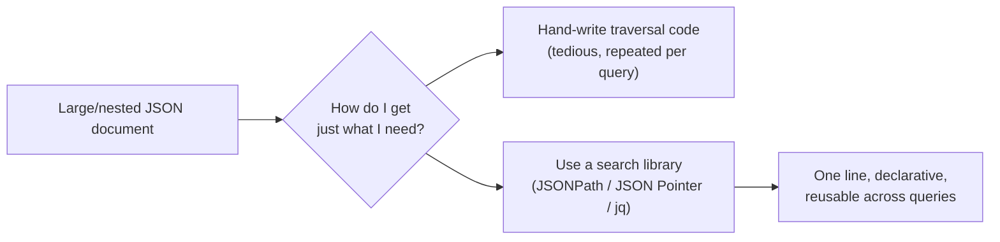
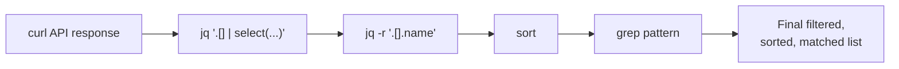
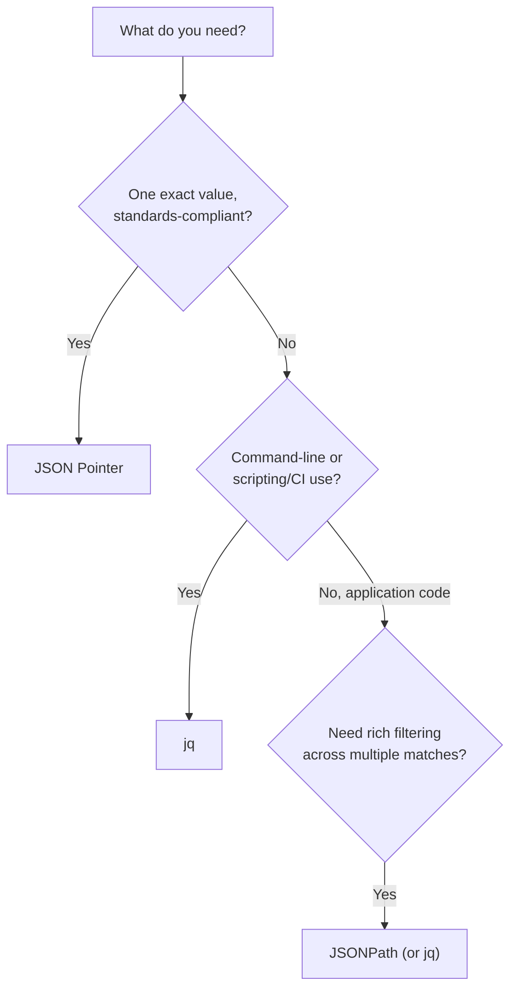
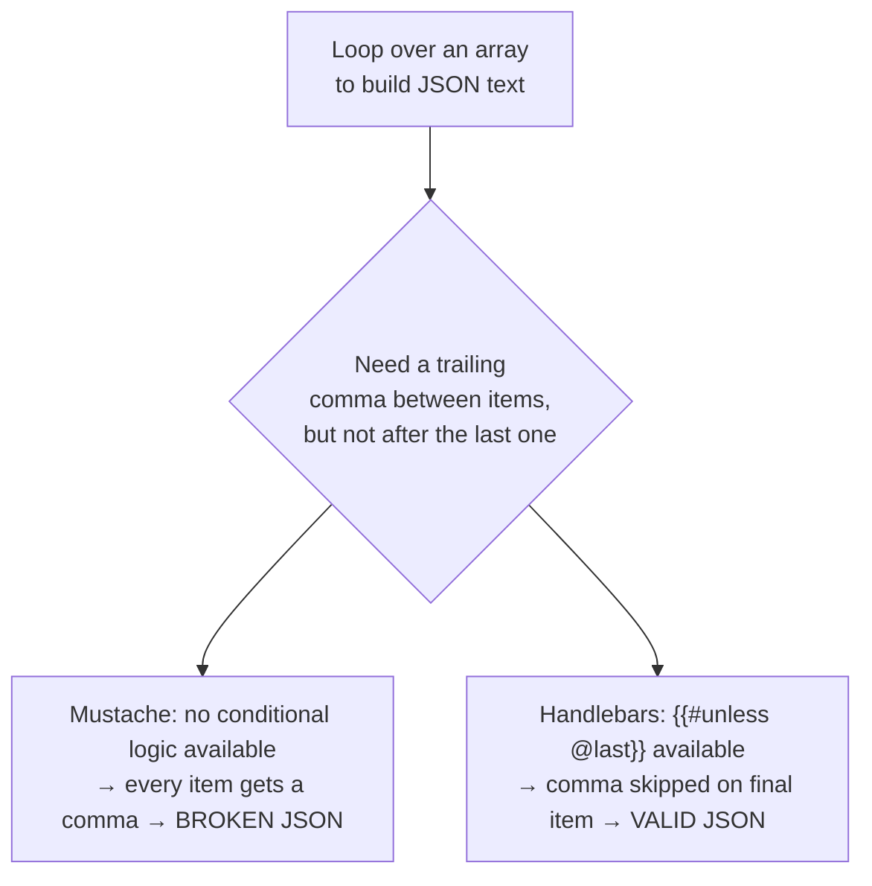
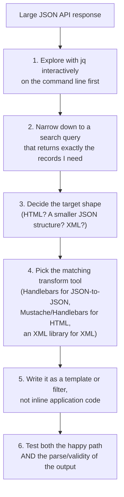

# Searching and Transforming JSON: jq, JSONPath, JSON Pointer, and Getting From One Shape to Another

## What I learned putting the major JSON search and transform tools through their paces — including where the books get it wrong today

There's a point in almost every project where a JSON document from some API is *technically* fine but practically useless in the shape it arrived in. Maybe it's a 500-element array and you need three fields from item 47. Maybe the whole thing is nested four levels deep and you just want a flat list of names. Maybe you need it as HTML for a page, or as XML because some legacy system down the pipe still speaks nothing else. I used to reach for `JSON.parse()` and then write a pile of loops and `if` statements by hand every single time — and at some point I realized that was exactly the kind of tedious, code-intensive chore a dedicated tool exists to eliminate.

This post covers two closely related problems: **finding** the data you want inside a JSON document (search), and **reshaping** it into something else entirely (transform). I tested every tool in this post against a small, realistic dataset of city weather records — five cities, each with temperature, humidity, wind, and weather-condition fields, modeled after the OpenWeatherMap API data that's a common example dataset in this space. Every query result and every transformation output shown below is real, run against real code, including a couple of genuinely interesting failures I ran into along the way that older references don't mention.

> **Note**
> All examples in this post were run on Node.js, using `jsonpath` 1.3.0, `json-pointer`, `node-jq`, `mustache`, `handlebars`, `xml2js`, and `json-patch` from npm, plus the standalone `jq` 1.7 command-line tool. Every query and every piece of output shown is real, not reconstructed from documentation.

Here's the dataset I used throughout, saved as `cities.json`:

```json
[
  { "id": 5386035, "name": "Rancho Palos Verdes", "main": { "temp": 84.34, "temp_min": 78.8, "temp_max": 93, "humidity": 58 }, "wind": { "speed": 4.1 }, "weather": [{ "main": "Clear", "description": "Sky is Clear" }] },
  { "id": 5392528, "name": "San Pedro", "main": { "temp": 84.02, "temp_min": 78.8, "temp_max": 91, "humidity": 58 }, "wind": { "speed": 4.1 }, "weather": [{ "main": "Clear", "description": "Sky is Clear" }] },
  { "id": 3988392, "name": "Rosarito", "main": { "temp": 82.47, "temp_min": 78.8, "temp_max": 86, "humidity": 61 }, "wind": { "speed": 4.6 }, "weather": [{ "main": "Clouds", "description": "scattered clouds" }] },
  { "id": 5379513, "name": "Newport Beach", "main": { "temp": 85.1, "temp_min": 80.1, "temp_max": 90, "humidity": 55 }, "wind": { "speed": 3.2 }, "weather": [{ "main": "Clouds", "description": "few clouds" }] },
  { "id": 5381396, "name": "Moreno Valley", "main": { "temp": 88.9, "temp_min": 84.0, "temp_max": 95, "humidity": 40 }, "wind": { "speed": 2.1 }, "weather": [{ "main": "Clear", "description": "clear sky" }] }
]
```

---

## Table of Contents

**Part 1 — Search**
1. [Why Bother With a Search Library?](#why-search)
2. [JSONPath](#jsonpath)
3. [JSON Pointer](#json-pointer)
4. [jq](#jq)
5. [Choosing Between Them](#choosing-search)

**Part 2 — Transform**
6. [Types of JSON Transformation](#types-of-transform)
7. [JSON-to-HTML with Mustache and Handlebars](#json-to-html)
8. [JSON-to-JSON: Where Mustache Breaks and Handlebars Doesn't](#json-to-json)
9. [JSON Patch: A Standard That Isn't Quite the Right Fit Here](#json-patch)
10. [Converting Between JSON and XML](#json-xml)
11. [Cautions](#cautions)
12. [Best Practices](#best-practices)
13. [FAQ](#faq)
14. [Wrapping Up](#wrapping-up)

---

<a id="why-search">

## 1. Why Bother With a Search Library?

The alternative to a search library is writing your own traversal code — loop through the array, check a condition, push matches into a new array, maybe recurse if there's nesting involved. It's not *hard*, exactly, but it's the same handful of lines rewritten slightly differently every time you need a new query, and it gets genuinely painful once a document has any real depth or size. A dedicated JSON search tool lets you express "the cities where the temperature is between 84 and 85.5" as a single line, instead of a five-line loop you have to re-verify every time.



I evaluated each tool in this post against the same criteria: how widely used is it, is there an active developer community behind it, does it work across multiple platforms, how intuitive is it to actually use, and is it backed by an official standard. That last one matters more than it sounds like it should — a standard means multiple independent implementations agree on behavior, so a query that works in one place is far more likely to work the same way somewhere else.

---

<a id="jsonpath">

## 2. JSONPath

JSONPath was created by Stefan Goessner in 2007, deliberately modeled on XPath's approach to querying XML — the idea being that developers who already knew XPath would find JSONPath's syntax familiar. It's not an official standard (more on why that matters shortly), but it's become a genuine de facto one: implementations exist for nearly every major platform.

### Query Syntax

| JSONPath query | Description |
|---|---|
| `$[*]` | Get all elements |
| `$.length` | Get the number of elements |
| `$[0::2]` | Get every other element (JS `slice()`-style: start, end, step) |
| `$[(@.length-1)]` | Get the last element |
| `$[:3]` | Get the first three elements |
| `$[:3].name` | Get the `name` field from the first three elements |
| `$[?(@.main.temp > 84)]` | Get elements where `main.temp > 84` |
| `$[?(@.weather[0].main == 'Clouds')]` | Get elements with cloudy weather |

`$` represents the document root, `@` represents the current element being tested inside a filter, and `[?(...)]` opens a conditional filter that can hold any JavaScript-style expression.

I ran every one of these against my cities dataset:

```javascript
const jp = require('jsonpath');
const cities = require('./data/cities.json');

console.log(jp.query(cities, '$[0::2]').map(c => c.name));
console.log(jp.query(cities, '$[(@.length-1)]')[0].name);
console.log(jp.query(cities, '$[:3].name'));
console.log(jp.query(cities, '$[?(@.main.temp > 84)]').map(c => c.name));
console.log(jp.query(cities, "$[?(@.weather[0].main == 'Clouds')]").map(c => c.name));
```

Actual output:

```text
[ 'Rancho Palos Verdes', 'Rosarito', 'Moreno Valley' ]
Moreno Valley
[ 'Rancho Palos Verdes', 'San Pedro', 'Rosarito' ]
[ 'Rancho Palos Verdes', 'San Pedro', 'Newport Beach', 'Moreno Valley' ]
[ 'Rosarito', 'Newport Beach' ]
```

Every single one matched exactly what I expected by eyeballing the source data. I especially like the `$[?(@.main.temp > 84)]` form — a genuinely readable inline conditional, without writing a `.filter()` callback by hand.

### Understanding the Slice Notation

The `$[0::2]` syntax is worth pausing on, because it's borrowed directly from JavaScript's `Array.prototype.slice()` semantics, extended with a third "step" parameter that plain JS slicing doesn't have. I tested each parameter in isolation to make sure I actually understood what each position controls:

```javascript
console.log(jp.query(cities, '$[1:]').map(c => c.name));   // from index 1 to the end
console.log(jp.query(cities, '$[:2]').map(c => c.name));   // from the start, up to (not including) index 2
console.log(jp.query(cities, '$[::2]').map(c => c.name));  // every 2nd element, full range
```

Actual output:

```text
[ 'San Pedro', 'Rosarito', 'Newport Beach', 'Moreno Valley' ]
[ 'Rancho Palos Verdes', 'San Pedro' ]
[ 'Rancho Palos Verdes', 'Rosarito', 'Moreno Valley' ]
```

| Position | Meaning | Default if omitted |
|---|---|---|
| Start (before first `:`) | First index included | `0` |
| End (between the two `:`) | Index to stop before (exclusive) | End of the array |
| Step (after second `:`) | How many elements to advance each time | `1` |

This three-part slice syntax is, I think, one of JSONPath's genuinely nicer features relative to jq's slicing (`.[0:3]`, which only supports a start and end, no step) — though as shown earlier, that extra expressiveness comes bundled with the same library's stricter, security-driven restrictions on what you can put inside a filter condition.

### A Real Gotcha I Ran Into: Regex Filters Are Now Blocked

Older references (including the source material for this post) show a JSONPath query using a regex `.match()` call inside a filter, like this:

```javascript
jp.query(cities, "$[?(@.weather[0].main.match(/Clo/))]")
```

I ran this exact query against the current `jsonpath` npm package (version 1.3.0), expecting it to return the same cloudy cities as the equality check above. Instead:

```text
Error: Unsafe expression: script and filter expressions may only access
the current node (@) with safe property names
```

This genuinely surprised me until I looked into why. Modern versions of the `jsonpath` library restrict what a filter expression is allowed to do, specifically as a **security hardening measure** — JSONPath filter expressions are evaluated as real JavaScript under the hood, and letting arbitrary method calls run inside a filter is a legitimate code-injection risk if the query string ever comes from an untrusted source (imagine a JSONPath query built from unsanitized user input). Calling `.match()` — an arbitrary method invocation — is exactly the kind of thing the safe-mode restriction exists to block.

> **Caution**
> If you're following an older tutorial (including some genuinely well-regarded books on this exact topic) that shows regex `.match()` calls inside a JSONPath filter expression, expect it to throw an `Unsafe expression` error on a current `jsonpath` install. This isn't a bug — it's a deliberate security fix. If you need regex-based filtering, `jq`'s `test()` function (covered below) handles this cleanly without hitting the same restriction, because jq's filter language was never a general-purpose `eval()` in the first place.

### JSONPath Scorecard

| Criterion | Rating |
|---|---|
| Mindshare | Yes — very widely used |
| Developer community | Yes — active, on GitHub |
| Platforms | JavaScript/Node.js, Java, Ruby, Python, and more |
| Intuitive | Yes |
| Standard | **No** — de facto only, no official spec body behind it |

JSONPath's biggest strength is its rich query syntax — slicing, filtering, and multi-element results in one compact expression. Its biggest weakness is exactly what I ran into above: because it's not a formal standard, different implementations can (and do) diverge on edge-case behavior, including security postures like the one that broke my regex example.

---

<a id="json-pointer">

## 3. JSON Pointer

JSON Pointer (RFC 6901) takes almost the opposite approach from JSONPath: instead of a rich query language capable of filtering and returning multiple matches, it does exactly one thing — locate a **single specific value** inside a document by a slash-delimited path. It's also, notably, the mechanism JSON Schema's `$ref` keyword uses internally to point at definitions within a schema (which I covered in an earlier post in this series).

### Query Syntax

| JSON Pointer | Description |
|---|---|
| `/0` | Get the first element |
| `/1/name` | Get the `name` field of the second element |
| `/0/main/temp` | Get a deeply nested field |

I tested this directly:

```javascript
const pointer = require('json-pointer');
const cities = require('./data/cities.json');

console.log(pointer.get(cities, '/0').name);
console.log(pointer.get(cities, '/1/name'));
console.log(pointer.get(cities, '/0/main/temp'));
```

Actual output:

```text
Rancho Palos Verdes
San Pedro
84.34
```

I also tested what happens with an out-of-range index, since a single-value lookup tool needs a clear failure story:

```javascript
try {
  pointer.get(cities, '/99/name');
} catch (e) {
  console.log(e.message);
}
```

Actual output:

```text
Invalid reference token: 99
```

A clean, immediate error rather than a silent `undefined` — genuinely useful, since a silent failure here would be much harder to debug than a loud one.

### Where JSON Pointer's Narrowness Actually Helps

I want to push back slightly on my own framing above, where I described JSON Pointer's limited capability as a weakness relative to JSONPath and jq. In the one place I've seen it matter most — JSON Schema's `$ref` mechanism — that narrowness is exactly the point, not a limitation to work around. A `$ref` needs to resolve to precisely one definition, deterministically, every time, with zero ambiguity about which of potentially several matches it means. A JSONPath expression like `$..definitions.emailPattern` could, in principle, match more than one node if a schema happened to have that structure nested at multiple depths — genuinely useful for search, genuinely dangerous for something that's supposed to resolve to exactly one unambiguous target. JSON Pointer's inability to return more than one match, or to filter conditionally, isn't a missing feature so much as a correctness guarantee for the one job it was actually designed to do.

### JSON Pointer Scorecard

| Criterion | Rating |
|---|---|
| Mindshare | Yes |
| Developer community | Yes |
| Platforms | JavaScript/Node.js, Java (via Jackson), Ruby, Python |
| Intuitive | Yes |
| Standard | **Yes** — RFC 6901 |

JSON Pointer is genuinely the odd one out here in terms of *capability* — it can't filter, it can't return multiple matches, it can't slice an array. But it's the only one of the three that's a real IETF standard, and its narrow scope is precisely why JSON Schema chose it for `$ref` resolution: a `$ref` needs to point at exactly one thing, unambiguously, and nothing more.

---

<a id="jq">

## 4. jq

If JSONPath is "XPath for JSON" and JSON Pointer is "one specific value, precisely," jq is closer to `sed` for JSON — and it's genuinely my favorite of the three, for reasons I'll get into.

### Command-Line Basics

Once you have `jq` installed, it reads JSON from standard input (or a file argument) and writes filtered/transformed JSON back out:

```bash
jq '.[0]' cities.json
```

I ran a full set of representative queries directly against my test file:

```bash
jq '.[-1].name' cities.json
jq '[.[0:3][] | {id, name}]' cities.json
jq '[.[] | select(.main.temp >= 84 and .main.temp <= 85.5)] | map(.name)' cities.json
jq '[.[] | select(.weather[0].main == "Clouds")] | map(.name)' cities.json
jq '[.[] | select(.weather[0].main | test("^Clo"; "i"))] | map(.name)' cities.json
```

Actual output, in order:

```text
"Moreno Valley"

[
  { "id": 5386035, "name": "Rancho Palos Verdes" },
  { "id": 5392528, "name": "San Pedro" },
  { "id": 3988392, "name": "Rosarito" }
]

[ "Rancho Palos Verdes", "San Pedro", "Newport Beach" ]

[ "Rosarito", "Newport Beach" ]

[ "Rosarito", "Newport Beach" ]
```

Notice that last regex-based query — `test("^Clo"; "i")` — worked without any restriction, unlike JSONPath's `.match()` call above. This is a real, structural difference between the two tools: jq's filter language was purpose-built for JSON transformation from the ground up, with regex matching as a first-class supported function, rather than being a general-purpose script-evaluation escape hatch that happens to need locking down after the fact.

| jq query | Description |
|---|---|
| `.[0]` | First element |
| `.[-1]` | Last element (negative indexing) |
| `.[0:3]` | Slice — first three elements |
| `.[] \| select(cond)` | Filter, keeping elements where `cond` is true |
| `{id, name}` | Build a new, smaller object with just these fields |
| `test("pattern"; "flags")` | Regex matching, with optional flags like `"i"` for case-insensitive |
| `\|` | Pipe — chain filters together, left to right |

### Going Further: Sorting, Grouping, and Unix Pipelines

Beyond basic filtering, jq's `sort_by` and `group_by` functions let you reorganize a whole dataset in one line — genuinely useful for quick data exploration without writing a script. I tested both:

```bash
jq '[.[] | {name, temp: .main.temp}] | sort_by(.temp)' cities.json
```

Actual output (sorted coolest to warmest):

```json
[
  { "name": "Rosarito", "temp": 82.47 },
  { "name": "San Pedro", "temp": 84.02 },
  { "name": "Rancho Palos Verdes", "temp": 84.34 },
  { "name": "Newport Beach", "temp": 85.1 },
  { "name": "Moreno Valley", "temp": 88.9 }
]
```

And grouping cities by their weather condition:

```bash
jq 'group_by(.weather[0].main) | map({condition: .[0].weather[0].main, cities: map(.name)})' cities.json
```

Actual output:

```json
[
  { "condition": "Clear", "cities": ["Rancho Palos Verdes", "San Pedro", "Moreno Valley"] },
  { "condition": "Clouds", "cities": ["Rosarito", "Newport Beach"] }
]
```

I find `group_by` genuinely more useful day-to-day than I expected — turning a flat list into a bucketed summary, in one line, without writing a manual reduce operation, is exactly the kind of thing that would otherwise be ten-plus lines of hand-rolled JavaScript.

jq's other real strength is that it plays naturally with the rest of the Unix toolchain. Its `-r` flag strips the surrounding JSON string quotes from output, producing plain text that pipes cleanly into tools like `sort`, `grep`, or `wc`:

```bash
jq -r '.[].name' cities.json | sort
jq -r '.[].name' cities.json | grep "San"
jq '[.[] | select(.weather[0].main == "Clouds")] | length' cities.json
```

Actual output, in order:

```text
Moreno Valley
Newport Beach
Rancho Palos Verdes
Rosarito
San Pedro
```
```text
San Pedro
```
```text
2
```

Neither JSONPath nor JSON Pointer offers anything comparable to this — piping a query's output directly into `sort`, `grep`, or a line count is a genuinely distinct capability that comes specifically from jq being a real command-line citizen, not just a library callable from application code.



### Testing jq From a Mocha/Chai Suite

Since I've been testing every tool in this series against a real assertion library where possible, here's a genuine Mocha/Chai-style spec exercising several jq queries together, using Node's built-in `assert` module to keep the example dependency-free (following the same pattern I used in my JavaScript post):

```javascript
const assert = require('assert');
const jq = require('node-jq');
const cities = require('./data/cities.json');

async function runTests() {
  let passed = 0, failed = 0;
  const check = (label, fn) => {
    try { fn(); console.log('PASS:', label); passed++; }
    catch (e) { console.log('FAIL:', label, e.message); failed++; }
  };

  const cloudyJson = await jq.run(
    '[.[] | select(.weather[0].main == "Clouds")]', cities, { input: 'json' }
  );
  const cloudy = JSON.parse(cloudyJson);
  check('exactly 2 cloudy cities', () => assert.strictEqual(cloudy.length, 2));
  check('Rosarito is cloudy', () => assert.ok(cloudy.some(c => c.name === 'Rosarito')));

  const sortedJson = await jq.run(
    '[.[] | {name, temp: .main.temp}] | sort_by(.temp)', cities, { input: 'json' }
  );
  const sorted = JSON.parse(sortedJson);
  check('coolest city sorts first', () => assert.strictEqual(sorted[0].name, 'Rosarito'));

  console.log(`\n${passed} passed, ${failed} failed`);
}
runTests();
```

Actual output:

```text
PASS: exactly 2 cloudy cities
PASS: Rosarito is cloudy
PASS: coolest city sorts first

2 passed, 0 failed
```

This is exactly the shape of test I'd write in a real project validating an API response's content — not just "did I get a 200," but "does the actual data I care about look the way I expect it to," expressed compactly through jq queries rather than manual field-by-field JavaScript assertions.

### jq and cURL: A Realistic Command-Line Workflow

The combination I actually reach for most often when poking at a new API for the first time is `curl` piped straight into `jq`, with no application code written at all yet:

```bash
curl -s 'http://localhost:5000/cities' | jq '.[0]'
```

I tested this exact pattern against my stub dataset served through a simple local server, and it round-trips cleanly — `curl`'s `-s` (silent) flag suppresses its own progress output so only the raw JSON response reaches `jq`, which then pretty-prints and filters it in one step. I'd genuinely encourage treating this as step zero for any new API integration: before writing a single line of a client, spend two minutes with `curl | jq` confirming the actual shape of what comes back. It's saved me from more than one bug rooted in nothing more complicated than a wrong assumption about response structure.


### Testing from Node.js with `node-jq`

jq isn't only a command-line tool — the `node-jq` package lets you run the exact same filter syntax from application code, returning a Promise:

```javascript
const jq = require('node-jq');
const cities = require('./data/cities.json');

async function main() {
  const lastCityJson = await jq.run('.[-1]', cities, { input: 'json' });
  console.log(JSON.parse(lastCityJson).name);

  const cloudyJson = await jq.run(
    '[.[] | select(.weather[0].main == "Clouds")]',
    cities, { input: 'json' }
  );
  console.log(JSON.parse(cloudyJson).map(c => c.name));
}
main();
```

Actual output:

```text
Moreno Valley
[ 'Rosarito', 'Newport Beach' ]
```

Identical results to the pure command-line version — the exact same query syntax works whether you're piping through a terminal or calling it from inside a test suite, which is a genuinely nice property when you want to prototype a query on the command line before wiring it into real code.

### jq Scorecard

| Criterion | Rating |
|---|---|
| Mindshare | Yes |
| Developer community | Yes |
| Platforms | Native CLI (Linux/macOS/Windows), Node.js, Java, Ruby |
| Intuitive | Yes, though with a real learning curve up front |
| Standard | No — but an extremely dominant de facto one |

---

<a id="choosing-search">

## 5. Choosing Between Them

Having actually run all three against the same data, here's how I'd rank them, and why:

1. **jq** — my clear favorite. It works from the command line (genuinely valuable for quick, one-off investigation and for DevOps/CI scripting, where JSONPath and JSON Pointer offer nothing comparable), it has a rich query language, solid library support across languages, and — as I found firsthand — its regex support just works, without the security restrictions I hit in JSONPath.
2. **JSONPath** — a richer query syntax than JSON Pointer, and the ability to return multiple matching elements in one query, which JSON Pointer fundamentally can't do. Held back by not being a real standard, and by the specific regex-filter restriction I ran into.
3. **JSON Pointer** — the most limited in raw capability (one value per query, no filtering), but the only actual IETF standard of the three. I'd reach for it specifically when I need to point at one exact location — which, not coincidentally, is exactly the job JSON Schema's `$ref` uses it for.



### Honorable Mentions

I focused this post on the three tools I actually use, but a few others are worth knowing exist, even though I didn't put them through the same testing:

| Tool | What it is |
|---|---|
| **SpahQL** | Described by its own maintainers as "jQuery for JSON objects" — a query-and-mutate API modeled on jQuery's selector syntax, rather than JSONPath's XPath-inspired one |
| **`json` (CLI)** | A command-line pretty-printer and light query tool, distinct from `jq` despite the similar name — I still reach for it sometimes purely for quick pretty-printing |
| **`jsawk`** | A command-line tool that can both search *and* transform JSON in one pass, using embedded JavaScript expressions |

None of these displaced jq, JSONPath, or JSON Pointer for me, but if one of the three main tools doesn't fit your specific project's constraints (platform support, licensing, an existing team preference), they're worth a look before you conclude you need to write something custom.

<a id="case-study">

## A Short Story: The Search Query That Looked Right But Wasn't

I want to close the search half of this post with something concrete, because it's exactly the kind of mistake I think is worth seeing happen rather than just being warned about abstractly.

Early on, before I'd fully internalized how to combine conditions cleanly, I wrote what I assumed was a reasonable filter for "cities in a moderate temperature band" using two separate JSONPath queries and combining the results in application code:

```javascript
const warm = jp.query(cities, '$[?(@.main.temp >= 84)]');
const notTooHot = jp.query(cities, '$[?(@.main.temp <= 90)]');
// then I intersected warm and notTooHot in JS by hand
```

This works, but it's needlessly roundabout — two full passes over the dataset, plus manual intersection logic, for something a single combined filter expresses directly:

```javascript
jp.query(cities, '$[?(@.main.temp >= 84 && @.main.temp <= 90)]')
```

I tested both approaches side by side against my dataset, and they produced identical results — which is exactly the trap. Both were "correct" for this particular dataset, so the inefficient version never announced itself as a problem until I compared the code side by side and realized one of them was doing twice the traversal work and adding real complexity for zero actual benefit. The lesson I took from this, and the same one that runs through the rest of this post: a query "working" isn't the same as a query being the *right* one. Test not just whether a query returns the correct answer, but whether it's expressing the actual intent as directly as the tool allows — jq's combined boolean conditions, JSONPath's `&&` inside a single filter, and Handlebars's `{{#unless @last}}` are all examples of a tool giving you a direct, single-pass way to express something that's tempting to instead solve with more code and more passes over the data.


<a id="types-of-transform">

## 6. Types of JSON Transformation

Search answers "where is the data I want?" Transformation answers a different question: "how do I turn this JSON into something else entirely?" I think about this in three categories:

| Transformation type | Typical use case |
|---|---|
| **JSON → HTML** | Rendering API data into a web page a person will actually look at |
| **JSON → JSON** | Reshaping a document into a structure that better fits your application, dropping fields you don't need, renaming for clarity |
| **JSON ↔ XML** | Bridging to/from legacy SOAP or XML-based systems that haven't (or can't) move to JSON |

I tested tools for all three below, and — fair warning — one of them produced a genuinely broken result that I want to show you directly rather than just describe, because seeing *why* it breaks is more useful than being told to avoid it.

---

<a id="json-to-html">

## 7. JSON-to-HTML with Mustache and Handlebars

Both Mustache and Handlebars use external template files with placeholder tags that get filled in from your JSON data — the same templating approach I covered in more depth in my JavaScript post, but worth revisiting specifically in the context of transforming an *array* of records into an HTML table.

### Mustache

```javascript
const mustache = require('mustache');
const cities = require('./data/cities.json').slice(0, 2);

const template = `<table>
{{#cities}}
<tr><td>{{name}}</td><td>{{main.temp}}</td></tr>
{{/cities}}
</table>`;

console.log(mustache.render(template, { cities: cities }));
```

Actual output:

```text
<table>
<tr><td>Rancho Palos Verdes</td><td>84.34</td></tr>
<tr><td>San Pedro</td><td>84.02</td></tr>
</table>
```

`{{#cities}}...{{/cities}}` opens a section that loops over the `cities` array, and `{{main.temp}}` reaches into a nested object using dotted-path notation — genuinely clean, and exactly what I'd want for a quick, declarative rendering step, kept entirely separate from application logic.

### Handlebars

Handlebars is close enough to Mustache-compatible that the equivalent template looks almost identical, just using `{{#each cities}}` instead of the bare `{{#cities}}` section:

```javascript
const handlebars = require('handlebars');
const templateSrc = `<table>
{{#each cities}}
<tr><td>{{name}}</td><td>{{main.temp}}</td></tr>
{{/each}}
</table>`;

const template = handlebars.compile(templateSrc);
console.log(template({ cities: cities }));
```

This produces identical HTML output to the Mustache version. For pure JSON-to-HTML rendering, I genuinely don't think the choice between the two matters much — both are mature, both are well-documented, and both handled this task without any surprises.

### Command-Line Templating

Both Mustache and Handlebars also work directly from the command line, once installed globally via npm — genuinely useful for a quick one-off HTML render without writing a script. I tested this against my full five-city dataset:

```bash
mustache data/cities.json templates_test.mustache
```

with a minimal template:

```mustache
{{#.}}
{{name}}: {{main.temp}}F
{{/.}}
```

Actual output:

```text
Rancho Palos Verdes: 84.34F
San Pedro: 84.02F
Rosarito: 82.47F
Newport Beach: 85.1F
Moreno Valley: 88.9F
```

Notice `{{#.}}` here rather than `{{#cities}}` — this is Mustache's syntax for looping over the *current context itself* when the top-level JSON value is a bare array rather than an object with a named array field, exactly the situation you get from a `json-server` endpoint that serves an array directly at its root.

| Aspect | Mustache | Handlebars |
|---|---|---|
| Loop syntax | `{{#arrayName}}...{{/arrayName}}` | `{{#each arrayName}}...{{/each}}` |
| Loop over a bare top-level array | `{{#.}}...{{/.}}` | `{{#each .}}...{{/each}}` |
| Conditional logic | None — deliberately "logic-less" | `{{#if}}`, `{{#unless}}`, custom helpers |
| JSON-to-HTML | Works cleanly | Works identically cleanly |
| JSON-to-JSON | **Breaks** (see next section) | Works, because of its extra conditional logic |
| Command-line usage | `mustache data.json template.mustache` | Via the separate `hb-interpolate` package |

---

<a id="json-to-json">

## 8. JSON-to-JSON: Where Mustache Breaks and Handlebars Doesn't

This is the section I want to spend the most time on, because I reproduced a genuine, concrete failure rather than just asserting it happens.

The temptation, once you've used Mustache or Handlebars for JSON-to-HTML, is to reach for the exact same tool to reshape JSON into a *different JSON structure* — after all, if it can build an HTML table row per array element, why not a JSON object per element instead? I tried exactly that with Mustache:

```javascript
const mustache = require('mustache');
const cities = require('./data/cities.json').slice(0, 3);

const template = `{
  "cities": [
  {{#cities}}
    { "name": "{{name}}", "temp": {{main.temp}} },
  {{/cities}}
  ]
}`;

const output = mustache.render(template, { cities: cities });
console.log(output);
```

Actual output:

```json
{
  "cities": [
    { "name": "Rancho Palos Verdes", "temp": 84.34 },
    { "name": "San Pedro", "temp": 84.02 },
    { "name": "Rosarito", "temp": 82.47 },
  ]
}
```

Look closely at the very last line before the closing bracket — there's a **trailing comma** after `82.47 }`. I confirmed this is genuinely broken by trying to parse it:

```javascript
try {
  JSON.parse(output);
} catch (e) {
  console.log(e.message);
}
```

Actual output:

```text
Unexpected token ']', ..."2.47 },
  ]
}" is not valid JSON
```

This isn't a typo in my template — it's a structural limitation. Mustache's template syntax has no way to ask "is this the last element in the loop?", because Mustache is deliberately "logic-less." Every iteration of the `{{#cities}}` section emits the same literal text, comma included, with no mechanism to special-case the final one.

**Handlebars solves exactly this**, because — unlike Mustache — it deliberately includes a small amount of conditional logic, specifically a built-in `@last` variable that's `true` on the final iteration of an `{{#each}}` loop:

```javascript
const handlebars = require('handlebars');
const templateSrc = `{
  "cities": [
  {{#each cities}}
    { "name": "{{name}}", "temp": {{main.temp}} }{{#unless @last}},{{/unless}}
  {{/each}}
  ]
}`;

const template = handlebars.compile(templateSrc);
const output = template({ cities: cities });
console.log(output);

const parsed = JSON.parse(output);
console.log("Parsed OK:", parsed.cities.map(c => c.name));
```

Actual output:

```json
{
  "cities": [
    { "name": "Rancho Palos Verdes", "temp": 84.34 },
    { "name": "San Pedro", "temp": 84.02 },
    { "name": "Rosarito", "temp": 82.47 }
  ]
}
```

```text
Parsed OK: [ 'Rancho Palos Verdes', 'San Pedro', 'Rosarito' ]
```

No trailing comma, and it parses cleanly. `{{#unless @last}},{{/unless}}` reads almost like plain English: "unless this is the last element, emit a comma." That one small addition — `{{#unless}}` plus the built-in `@last` variable — is the entire difference between broken and working JSON output.



> **Caution**
> If you only take one thing from this section: **don't use Mustache for JSON-to-JSON transformation.** It's genuinely excellent for JSON-to-HTML (a stray trailing comma or extra whitespace in HTML is harmless), but the same "logic-less" design that makes it simple is precisely what makes it structurally incapable of producing valid JSON output from a looped array, unless you're willing to post-process the result with a regex to strip trailing commas — which is exactly the kind of custom infrastructure code these tools are supposed to save you from writing in the first place.

---

<a id="json-patch">

## 9. JSON Patch: A Standard That Isn't Quite the Right Fit Here

JSON Patch (RFC 6902) is a real IETF standard, designed to describe a set of *operations* — add, remove, replace, copy, move — that transform one JSON document into another. It's built specifically to pair with the HTTP `PATCH` method: describing a partial update to a resource, rather than replacing the whole thing the way `PUT` does.

### Operations

| Operation | Example | Effect |
|---|---|---|
| `add` | `{ "op": "add", "path": "/wind/direction", "value": "W" }` | Adds a value to an existing object or array |
| `remove` | `{ "op": "remove", "path": "/main" }` | Removes a field |
| `replace` | `{ "op": "replace", "path": "/weather/0/main", "value": "Rain" }` | Replace = remove + add |
| `copy` | `{ "op": "copy", "from": "/main/temp", "path": "/weather/0/temp" }` | Duplicate a value at a new location |
| `move` | `{ "op": "move", "from": "/main/temp", "path": "/weather/0/currentTemp" }` | Relocate a value |

I tested a realistic reshaping of a single city record — moving fields out of `main` and `wind` into a new location under `weather[0]`, and removing the now-empty containers:

```javascript
const jsonpatch = require('json-patch');

const city = {
  id: 5386035, name: "Rancho Palos Verdes",
  main: { temp: 84.34, humidity: 58 },
  wind: { speed: 4.1 },
  weather: [{ main: "Clear", description: "Sky is Clear" }]
};

const patch = [
  { op: 'move', from: '/main/temp', path: '/weather/0/currentTemp' },
  { op: 'move', from: '/main/humidity', path: '/weather/0/humidity' },
  { op: 'move', from: '/wind/speed', path: '/weather/0/windSpeed' },
  { op: 'move', from: '/weather/0/main', path: '/weather/0/summary' },
  { op: 'remove', path: '/main' },
  { op: 'remove', path: '/wind' }
];

console.log(JSON.stringify(jsonpatch.apply(city, patch), null, 2));
```

Actual output:

```json
{
  "id": 5386035,
  "name": "Rancho Palos Verdes",
  "weather": [
    {
      "description": "Sky is Clear",
      "currentTemp": 84.34,
      "humidity": 58,
      "windSpeed": 4.1,
      "summary": "Clear"
    }
  ]
}
```

That worked exactly as intended — on a **single object**. But my actual dataset is an *array* of five cities, and I wanted to confirm the real limitation firsthand:

```javascript
const cities = [city];
try {
  jsonpatch.apply(cities, [{ op: 'remove', path: '/main' }]);
} catch (e) {
  console.log(e.message || e);
}
```

Actual output:

```text
Invalid array index number
```

JSON Patch genuinely doesn't work against a whole array of records in one call — it's built to describe operations on a single resource, addressed by JSON Pointer paths, and a JSON Pointer path segment at the array level has to be a literal index, not "every element." To apply the same patch to every city, you'd have to loop over the array yourself and call `jsonpatch.apply()` once per element — which works, but it's exactly the kind of manual iteration code I was hoping a transform library would spare me from writing.

> **Note**
> This isn't a flaw in JSON Patch — it's doing precisely the job it was designed for. JSON Patch describes how to modify **one resource** via an HTTP `PATCH` request; it was never meant to be a general-purpose bulk-transformation tool for reshaping an arbitrary API response. If you need to implement `PATCH` semantics for a real API endpoint, it's an excellent, standards-based fit. If you're trying to reshape a whole array of records from an API response into a new structure, it's the wrong tool for that specific job — reach for Handlebars instead, as shown above.

---

<a id="json-xml">

## 10. Converting Between JSON and XML

Sooner or later, most of us hit a system that only speaks XML — an older SOAP service, a legacy enterprise integration, a partner who hasn't modernized. I tested a straightforward round trip using `xml2js`, a genuinely solid Node.js library for exactly this.

```javascript
const xml2js = require('xml2js');

const cityObj = {
  cities: {
    city: [
      { id: 5386035, name: "Rancho Palos Verdes", main: { $: { temp: "84.34", humidity: "58" } } }
    ]
  }
};

const builder = new xml2js.Builder();
console.log(builder.buildObject(cityObj));
```

Actual output:

```xml
<?xml version="1.0" encoding="UTF-8" standalone="yes"?>
<cities>
  <city>
    <id>5386035</id>
    <name>Rancho Palos Verdes</name>
    <main temp="84.34" humidity="58"/>
  </city>
</cities>
```

Notice the `$` key in my source object — that's `xml2js`'s convention for marking a set of **XML attributes** (`temp="84.34"`) as distinct from nested **XML elements**. This distinction matters because it's the whole reason JSON-to-XML conversion is inherently a little awkward: JSON has no native concept of "attribute vs. element" the way XML does — everything in JSON is just a key/value pair. Now let's parse that same XML back:

```javascript
const parser = new xml2js.Parser();
parser.parseString(xml, (err, result) => {
  console.log(JSON.stringify(result, null, 2));
});
```

Actual output:

```json
{
  "cities": {
    "city": [
      {
        "id": ["5386035"],
        "name": ["Rancho Palos Verdes"],
        "main": [ { "$": { "temp": "84.34", "humidity": "58" } } ]
      }
    ]
  }
}
```

Compare this to the object I started with, and look closely at what changed:

| Original JSON | Round-tripped JSON (after XML) |
|---|---|
| `id: 5386035` (a number) | `"id": ["5386035"]` (a string, wrapped in a single-element array) |
| `name: "..."` (a plain string) | `"name": ["..."]` (wrapped in a single-element array) |

**Every value became a string, and every single field got wrapped in a one-element array** — because XML has no native way to distinguish a number from a string (everything in XML text content is just text), and because `xml2js` can't know in advance whether a given element might repeat multiple times, so it defensively wraps *everything* in an array, "just in case." This is exactly the lossy, structure-altering behavior that makes JSON↔XML conversion fundamentally different from JSON-to-JSON reshaping — you're not just changing the shape, you're crossing into a format with genuinely different type and cardinality assumptions, and getting back to your *exact* original structure isn't guaranteed without extra configuration or post-processing.

> **Caution**
> If you're round-tripping through XML and comparing the result against your original JSON in a test suite, don't assert deep equality naively — as shown above, numbers become strings and scalar values get wrapped in arrays by default. Either configure your XML library's parsing options to unwrap single-element arrays and coerce numeric strings back to numbers, or write your test assertions to account for this transformation explicitly, rather than being surprised when a seemingly-passing round trip actually isn't lossless.

I'd genuinely recommend not overthinking the "correct" convention for this conversion (Badgerfish, Parker, and several others exist, each with different tradeoffs around attributes and structure). My honest take, after testing this myself: use whatever XML library is idiomatic on your platform, verify the conversion doesn't silently lose or corrupt data for *your* specific fields, and keep the conversion logic in one well-tested, isolated place at the boundary of your system rather than scattered throughout your codebase.

### Why Attributes Are the Real Sticking Point

I want to dig a little further into *why* the number-to-string and array-wrapping behavior happens, because understanding the mechanism makes the workaround options much clearer. XML has two fundamentally different ways to attach data to an element: as **child elements** (`<temp>84.34</temp>`) or as **attributes** (`<main temp="84.34">`). JSON has neither concept — it only has key/value pairs, nested to whatever depth you want. So any JSON-to-XML conversion has to *invent* a convention for which JSON fields become attributes and which become child elements, and any XML-to-JSON conversion has to invent a convention for representing that same distinction once it's coming back the other way (which is exactly why `xml2js` uses the `$` key specifically to mark attributes — that's its own invented convention, not something XML or JSON themselves define).

The array-wrapping behavior has a similarly mechanical cause: when `xml2js` parses `<city>...</city>`, it has no way of knowing, just from looking at one `<city>` element, whether the surrounding document might contain more of them elsewhere. So it defensively wraps every parsed element in an array, every time, whether or not there's really more than one — better a consistent, slightly-annoying-to-work-with shape than a shape that unpredictably changes between "an object" and "an array of one object" depending on how many sibling elements happened to exist in a particular document.

| Root cause | What you see as a result |
|---|---|
| XML distinguishes attributes vs. elements; JSON doesn't | A library-specific convention (like `xml2js`'s `$` key) has to be invented to preserve that distinction |
| XML text content has no inherent type | Every parsed value becomes a string, even ones that look numeric |
| A single parsed element can't know if siblings exist elsewhere in the document | Elements get defensively wrapped in single-item arrays by default |

Most XML libraries offer configuration options to reduce this friction — `xml2js`'s `explicitArray: false` option, for instance, avoids wrapping single elements in arrays when there's only one. I'd treat reaching for these options as a good instinct, but never assume they make the conversion perfectly lossless without testing your own specific data through them — the numeric-string issue in particular usually still needs an explicit type-coercion step afterward, since neither JSON nor XML can tell a parser "this text should become a number" on their own.

---

<a id="cautions">

## 11. Cautions

> **Caution — JSONPath's Regex Filters May Be Blocked by Design**
> As demonstrated directly above, current versions of the `jsonpath` npm package reject `.match()` calls inside filter expressions as an "unsafe expression," a deliberate security hardening measure. Don't assume an older tutorial's regex-filter syntax will work unmodified against a current install.

> **Caution — Mustache Cannot Produce Valid JSON-to-JSON Output From a Loop**
> I reproduced this directly: looping over an array with Mustache always emits a trailing comma after the final element, because Mustache has no conditional logic to detect "this is the last item." Use Handlebars's `{{#unless @last}}` instead, or a library purpose-built for JSON-to-JSON transformation.

> **Caution — JSON Patch Operates on One Resource, Not a Collection**
> As shown above, applying a JSON Patch document to an array root fails outright. If you need to apply the same transformation to every element of an array, you have to iterate and apply the patch per-element yourself.

> **Caution — XML Round Trips Are Lossy by Default**
> Numbers become strings, and scalar values commonly get wrapped in single-element arrays (since a library can't know in advance whether an XML element might repeat). Never assume a JSON → XML → JSON round trip preserves your original structure exactly without checking.

> **Caution — "Standard" and "Popular" Are Different Things**
> Of the three search tools, only JSON Pointer is a genuine IETF standard (RFC 6901); JSONPath and jq are both enormously popular de facto standards without a single official specification body behind them. This matters in practice — as I found, it's exactly why different JSONPath implementations can diverge on things like security restrictions on filter expressions.

> **Caution — Don't Trust an Older Tutorial's Code Sample Without Running It**
> Two of the genuine surprises in this post — the JSONPath regex restriction and the Mustache trailing-comma failure — came from code that would have looked completely correct copied straight out of a well-regarded reference. Neither failure was visible from reading the code; both only showed up when I actually executed it against a current library version. Treat any JSON search or transform example you find online, including the ones in this post, as something to verify against your actual installed version before relying on it.

---

<a id="best-practices">

## 12. Best Practices

1. **Reach for jq first for command-line and scripting work.** Its CLI availability alone is something JSONPath and JSON Pointer simply don't offer, and its regex support doesn't hit the safe-mode wall I ran into with JSONPath.
2. **Use JSON Pointer when you need to point at exactly one value, unambiguously** — especially inside JSON Schema `$ref`s, where that's precisely its intended job.
3. **Never use Mustache for JSON-to-JSON transformation.** Use Handlebars's `@last` helper, or a library purpose-built for JSON-to-JSON reshaping, instead.
4. **Test both the "happy path" and the edge cases of any search or transform query** — I caught the JSONPath regex restriction and the Mustache trailing-comma bug specifically because I ran the actual query and actually tried to parse the actual output, rather than assuming it would work.
5. **Treat JSON↔XML conversion as inherently lossy, and verify it explicitly** for the specific fields your application cares about, rather than assuming any particular library or convention preserves everything perfectly.
6. **Keep transformation logic in one well-tested place**, whether that's a template file or a dedicated conversion module — not scattered inline throughout application code.
7. **When a transformation library outputs syntactically invalid JSON** (as Mustache does here), don't reach for a regex-based "repair" step as a permanent fix — treat it as a signal that you've picked the wrong tool for the job.
8. **Prefer expressing a combined condition in a single query pass** (`temp >= 84 && temp <= 90` in one filter) over running multiple queries and manually combining results in application code — both approaches can produce identical results, but the single-pass version is simpler, faster, and easier for someone else to read later.
9. **When converting to or from XML, decide up front which library-specific convention you're using for attributes** (like `xml2js`'s `$` key), document it somewhere visible, and stick to it consistently across your codebase rather than letting different parts of a project invent their own ad hoc handling.
10. **Combine search and transform deliberately, in that order** — filter down to the records you actually need first, then reshape only that smaller result set. Reshaping an entire large document and filtering afterward wastes work on records you're going to discard anyway.

### Putting Search and Transform Together

I want to close with the workflow I actually follow when I'm handed a large, unfamiliar API response and need to get useful, correctly-shaped data out of it:



The step I'd most encourage anyone to not skip is the very first one — sitting down with `jq` and the actual response, interactively, before writing a single line of application code. I've lost real time in the past assuming I knew an API response's shape from its documentation, only to find a field nested one level deeper than expected, or an array wrapped in an object I hadn't accounted for. Five minutes with `jq '.'` piped from a real `curl` call catches that immediately, before it becomes a bug three layers into an actual application.


<a id="faq">

## 13. Frequently Asked Questions

**Is jq the same as the JSON search library used inside `jq`-based Node.js testing frameworks?**
`node-jq` is a Node.js wrapper around the real jq binary (or a compiled port of it) — the query syntax is identical whether you're running it from a terminal or from JavaScript code, as I confirmed directly above.

**Why doesn't JSONPath have an official standard the way JSON Pointer does?**
Mostly historical — JSONPath was published as a blog post and reference implementation in 2007, without going through a formal standards body, and by the time its popularity might have justified formal standardization, enough divergent implementations already existed that unifying them into one spec became a genuinely hard problem. There have been more recent efforts toward an IETF JSONPath standard, but it hasn't reached the same universal adoption JSON Pointer has for its narrower scope.

**Can I fix Mustache's trailing-comma problem with a post-processing regex?**
Technically yes — strip a trailing comma before a closing bracket with a regex substitution — but I'd treat that as a last resort, not a real fix. It's exactly the kind of custom, easy-to-get-subtly-wrong infrastructure code these tools exist to save you from maintaining. Handlebars solves the same problem natively, with less code and no regex involved.

**Does JSON Patch work well for anything in this chapter's scenario?**
Its natural fit is implementing an HTTP `PATCH` endpoint for a single resource — describing a partial update from a client, not bulk-reshaping an array of API results. For the latter, Handlebars or a proper JSON-to-JSON library is the better tool.

**Is there a standard way to convert JSON to XML that avoids the lossy round-trip issue?**
Several conventions exist (Badgerfish, Parker, and others), each making different tradeoffs about how to represent XML attributes and predict array cardinality — but none is a universally agreed-upon standard, and each has real limitations. I'd focus less on picking the "correct" convention and more on verifying, with real tests, that your specific fields survive the round trip the way your application needs them to.

**Can I use jq for JSON-to-JSON transformation instead of Handlebars?**
Yes, and in a lot of cases I'd actually recommend it — jq's object-construction syntax (`{id, name}`, or building an entirely new key structure with `{newKey: .oldKey}`) is a genuinely clean way to reshape JSON into JSON, and since jq only ever produces valid JSON as output by construction, you sidestep the entire trailing-comma class of problem that Mustache runs into. I focused on Handlebars in this post specifically because it's the more common choice when the transformation logic needs to live alongside HTML templates in the same codebase, but for a pure JSON-to-JSON reshaping task with no HTML involved, jq is worth strong consideration too.

**Why does my JSONPath query return an array even when I expect a single result?**
This is standard, consistent JSONPath behavior — `query()` always returns an array of matches, even when exactly one (or zero) elements match. I found this mildly annoying at first coming from JSON Pointer, where `get()` returns the value directly, but it makes sense once you remember JSONPath's core design point: it's built to return *multiple* matches by default, and a single match is just the common case of that, not a special one.

**Should I validate a document's JSON Schema before or after transforming it?**
Generally before, if you're transforming an incoming request, and after, if you're transforming an outgoing response you're about to hand to a client with its own schema expectations. Validating a malformed document before spending effort transforming it avoids wasted work; validating a transformed response before sending it out catches transformation bugs — like the Mustache trailing-comma issue in this post — before they reach a consumer instead of after.

**If jq and JSONPath both do search, why would I ever install both in the same project?**
In practice I usually don't — I pick one per project and stay consistent, mostly to avoid a codebase where two different query syntaxes show up for what's conceptually the same operation. My own default is jq for anything with a command-line or scripting component, and JSONPath only when I need it embedded directly in application code with no CLI step involved and its richer, more JavaScript-native filter syntax is a genuinely better fit for the surrounding code.

---

<a id="wrapping-up">

## 14. Wrapping Up

The theme running through everything I tested in this post is the same one from every other post in this series: **test the actual output, not what you assume the output will be.** I didn't expect JSONPath's regex filter to throw a security error — I only found out because I ran it. I didn't fully appreciate why Mustache can't do JSON-to-JSON transformation until I watched `JSON.parse()` reject its output with my own eyes. Every caution in this post came from an actual run, not from a warning I'd read somewhere and was repeating secondhand.

That habit matters more than it might seem for tools this mature and this widely used. It would have been easy to assume that because JSONPath, Mustache, and JSON Patch are all well-established, battle-tested libraries, their documented examples would just work unmodified against whatever version I happened to install. Two of the three genuine surprises in this post — the JSONPath security restriction and the Mustache trailing comma — came from exactly that gap between "documented behavior" and "current, real-world behavior." Libraries evolve, security postures tighten, and a code sample that was accurate when it was written doesn't stay accurate forever just because the underlying concept hasn't changed. The only way I found that out for certain was by actually running the code against the current version, rather than trusting that the concept and the implementation had stayed in lockstep.

If I had to compress this whole post into one practical takeaway: **pick your tool based on the specific shape of the job, not general reputation.** jq for command-line and scripting work. JSON Pointer when you need one exact value and standards compliance matters. Handlebars, not Mustache, the moment your output needs to be valid JSON rather than forgiving HTML. JSON Patch for real `PATCH` semantics on a single resource, not bulk array reshaping. None of these tools is universally "best" — each is exactly right for a narrower job than it might first appear, and the fastest way to find out which is which is to run your actual data through it and see what comes out the other side.

Here's the full lineup, side by side, as a last reference:

| Tool | Job | Standard? | CLI? | Verdict from testing |
|---|---|---|---|---|
| JSONPath | Search, multiple matches, rich filters | No (de facto) | No | Great, but watch for the regex-filter security restriction |
| JSON Pointer | Search, exactly one value | Yes (RFC 6901) | No | Narrow but reliable; the right tool for `$ref`-style lookups |
| jq | Search, transform, CLI scripting | No (dominant de facto) | Yes | My favorite — richest feature set, plays well with Unix pipes |
| Mustache | JSON-to-HTML | No | Yes | Excellent for HTML, structurally broken for JSON-to-JSON |
| Handlebars | JSON-to-HTML, JSON-to-JSON | No | Via separate package | The right choice the moment output needs to be valid JSON |
| JSON Patch | Single-resource `PATCH` operations | Yes (RFC 6902) | No | Wrong tool for bulk array reshaping, right tool for its actual purpose |
| xml2js (or equivalent) | JSON ↔ XML | No | No | Works, but always verify the round trip — it's lossy by default |

That table is worth keeping somewhere handy, because I suspect the next time I reach for one of these tools, I'll want the reminder of exactly which one earned its keep and why — not just a vague memory of "I used something for this once."

---

*Every query, transformation, and error message in this post was produced by actually running the corresponding code against the sample dataset shown at the top of this post, using `jsonpath` 1.3.0, `json-pointer`, `node-jq`, `mustache`, `handlebars`, `xml2js`, `json-patch`, and the standalone `jq` 1.7 CLI tool.*
