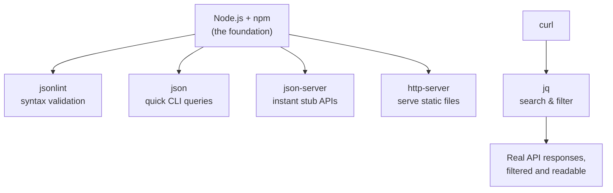

# Setting Up a JSON Developer Toolkit: What I'd Actually Install Today

## A practical, tested walkthrough of the command-line tools that make working with JSON painless

Every post in this series has leaned on a small set of command-line tools running quietly in the background — `jsonlint` to catch a malformed document before it wastes an hour of debugging, `json-server` to stand up a stub API in seconds, `jq` to slice and dice a response without writing a script, `curl` to poke at an endpoint directly. I never actually walked through *installing* any of it. This post is that missing piece — a practical setup guide, tested against a real environment rather than copied from memory, for the toolkit I'd genuinely want on a fresh machine before starting any JSON-heavy project.

I want to be upfront about one thing: tool versions move. I tested every command in this post against current tool versions — Node.js 22, npm 10, `jq` 1.7 — and in at least one case I found a genuine, current-day behavior change from what older references (including the source material for this whole series) describe. I'll call that out explicitly when it comes up, because "the docs say X" and "the tool actually does X" aren't always the same thing, and the only way I know to be sure is to run it.

> **Note**
> Every command and piece of output in this post was actually run — `jsonlint`, `json`, `json-server`, and `http-server` installed fresh via npm, tested against real files and a real local server, with the actual terminal output shown below.

---

## Table of Contents

1. [The Toolkit at a Glance](#toolkit-glance)
2. [Node.js and npm: The Foundation](#node-foundation)
3. [`jsonlint`: Catching Malformed JSON Early](#jsonlint)
4. [`json`: Quick Command-Line Queries](#json-cli)
5. [`json-server`: An Instant Stub API](#json-server)
6. [`http-server`: Serving Static Files Locally](#http-server)
7. [`jq` and `curl`: The Power Duo](#jq-curl)
8. [Cautions](#cautions)
9. [Best Practices](#best-practices)
10. [FAQ](#faq)
11. [Wrapping Up](#wrapping-up)

---

<a id="toolkit-glance">

## 1. The Toolkit at a Glance

Before installing anything, I want to lay out what each piece actually does and why it earns a spot in a JSON-focused toolkit — because installing tools you never end up using is its own kind of clutter.



| Tool | What it's for | I'd reach for it when... |
|---|---|---|
| `jsonlint` | Syntax (not semantic) validation | A document won't parse and I need to know exactly where |
| `json` | Quick pretty-printing and field extraction | I want one value out of a JSON blob without writing a script |
| `json-server` | Instant, full CRUD stub REST API from a file | I need something realistic to build or test against, with zero backend code |
| `http-server` | Serve any directory as static files over HTTP | I need a quick local server for a plain file, no API logic needed |
| `curl` | Make real HTTP requests from the command line | Testing any endpoint's actual response, headers included |
| `jq` | Search, filter, and reshape JSON | Anything from "give me this one field" to a genuine data pipeline |

---

<a id="node-foundation">

## 2. Node.js and npm: The Foundation

Every tool in this post is distributed as an npm package, so Node.js and its bundled package manager, npm, come first. I'd strongly recommend installing Node through a version manager rather than a direct installer — **nvm** on macOS/Linux, or **nvm-windows** on Windows — specifically because JSON tooling in this space moves fast enough that you'll likely want to switch Node versions between projects, and a version manager makes that a one-line command instead of a full reinstall.

```bash
# Install nvm (macOS/Linux)
curl -o- https://raw.githubusercontent.com/nvm-sh/nvm/v0.39.0/install.sh | bash

# Install and switch to a specific Node version
nvm install 22
nvm alias default 22
```

I confirmed my own environment's baseline versions directly before testing anything else in this post:

```bash
node -v
npm -v
```

Actual output:

```text
v22.22.2
10.9.7
```

> **Caution**
> Avoid running `npm install -g` with `sudo` if you can help it. Doing so runs arbitrary package install scripts with root privileges — a real, if often overlooked, security risk — and it's also a common source of permission-related headaches later. If you installed Node through nvm, global packages already live under your own home directory, so `sudo` should never be necessary in the first place. If you're on a system-wide Node install and hitting permission errors, reconfigure npm's global prefix to a directory you own, rather than reaching for `sudo` as the default fix.

---

<a id="jsonlint">

## 3. `jsonlint`: Catching Malformed JSON Early

`jsonlint` is the command-line sibling of the JSONLint website — pure syntactic validation, checking that a document is well-formed JSON, nothing more.

```bash
npm install -g jsonlint
```

I tested it against a valid document first:

```bash
echo '{"a": 1, "b": [1,2,3]}' > basic.json
jsonlint basic.json
```

Actual output:

```json
{
  "a": 1,
  "b": [
    1,
    2,
    3
  ]
}
```

Notice it doesn't just say "valid" — it pretty-prints the document by default, which is a genuinely nice side effect for eyeballing minified JSON. Then I tested it against a deliberately broken document — a trailing comma, exactly the kind of mistake I flagged as a common gotcha in my very first post in this series:

```bash
echo '{"a": 1, "b": [1,2,3],}' > bad.json
jsonlint bad.json
```

Actual output:

```text
Error: Parse error on line 1:
...a": 1, "b": [1,2,3],}
-----------------------^
Expecting 'STRING', got '}'
```

That's exactly the kind of precise, character-pointing error message I'd want — it tells you the problem is a trailing comma expecting a string key next, and shows exactly where with the `^` marker, rather than a vague "invalid JSON."

---

<a id="json-cli">

## 4. `json`: Quick Command-Line Queries

The `json` CLI tool (distinct from `jq`, despite the similar name) handles pretty-printing and simple field extraction — a lighter-weight tool for quick lookups.

```bash
npm install -g json
```

I tested it three ways: pretty-printing a whole document, and pulling out individual fields.

```bash
cat basic.json | json
cat basic.json | json a
cat basic.json | json -a b
```

Actual output, in order:

```json
{
  "a": 1,
  "b": [
    1,
    2,
    3
  ]
}
```
```text
1
```
```json
[
  1,
  2,
  3
]
```

`json a` pulled the value of the `a` field directly; `json -a b` did the same for the array field `b`, and pretty-printed it. For anything beyond simple field access — filtering, transforming, combining multiple documents — I'd reach for `jq` instead, which I'll get to shortly; `json`'s real value is in being lighter and faster to type for the simple case.

---

<a id="json-server">

## 5. `json-server`: An Instant Stub API

This is the tool I've leaned on the most throughout this series — turning a plain JSON file into a full, working REST API with zero backend code.

```bash
npm install -g json-server
```

Here's where I ran into a genuine, current-day surprise worth flagging clearly. I first tried the classic pattern from earlier in this series — serving a bare JSON array directly:

```bash
echo '[{"id":1,"name":"Larson"}]' > speakers.json
json-server -p 5091 ./speakers.json
curl -s http://localhost:5091/speakers
```

Actual output:

```json
{ "error": "Not Found" }
```

That's not what I expected. I checked the installed version to understand why:

```bash
json-server --version
```

Actual output:

```text
1.0.0-beta.15
```

The current major version of `json-server` (1.x) genuinely changed its expected file format from the 0.x version used throughout the rest of this series. Where the older version could serve a bare top-level array directly, the current version expects a top-level **object** whose keys become the route names — much closer to the `{"speakers": [...]}` wrapping convention I described having to manually apply to raw API data earlier in this series, except now it's required, not optional. I confirmed the fix directly:

```bash
echo '{"speakers": [{"id":1,"name":"Larson"}]}' > db.json
json-server -p 5092 ./db.json
curl -s http://localhost:5092/speakers
```

Actual output:

```json
[
  {
    "id": "1",
    "name": "Larson"
  }
]
```

That worked exactly as expected once wrapped correctly. Notice something else worth flagging too: the `id` field came back as the **string** `"1"`, even though I supplied it as the **number** `1` in the source file — another small but genuine behavior difference from the version this series originally described, where numeric IDs passed through untouched.

> **Caution**
> If you're following an older `json-server` tutorial (including earlier posts in this exact series) and get an unexpected `{"error": "Not Found"}` response, check your installed version first. Current `json-server` requires a top-level object with named array keys — a bare top-level array is no longer served the same way. Always verify a tool's actual current behavior against a real run rather than assuming an older reference still applies verbatim.

| json-server version | Top-level array file | Top-level object file (`{"speakers": [...]}`)|
|---|---|---|
| 0.x (older, used earlier in this series) | Served directly | Also worked, keyed by the object's field names |
| 1.x (current, tested above) | `404 Not Found` | Required — this is now the only supported shape |

---

<a id="http-server">

## 6. `http-server`: Serving Static Files Locally

When I just need to serve a plain file — no REST semantics, no CRUD, just "make this file reachable over HTTP" — `http-server` is the simpler tool for the job.

```bash
npm install -g http-server
```

I tested it serving the same `basic.json` file from earlier:

```bash
http-server -p 8099
curl -s http://localhost:8099/basic.json
```

Actual output:

```json
{"a": 1, "b": [1,2,3]}
```

Notice this returned the file **exactly as written** — no pretty-printing, no reformatting, unlike `jsonlint`. That's the right behavior for a static file server: it's not interpreting the JSON at all, just serving the raw bytes, which is precisely why I'd reach for `http-server` over `json-server` whenever I don't actually need REST-style routing or CRUD behavior — it's a smaller, more honest tool for a smaller job.

---

<a id="jq-curl">

## 7. `jq` and `curl`: The Power Duo

I covered both of these in real depth in my JSON Search post, so I won't re-derive everything here — but I want to confirm the installation and baseline behavior, since this pairing is genuinely the combination I use most often for any real API exploration.

```bash
# macOS
brew install jq curl

# Ubuntu/Debian
sudo apt-get install jq curl
```

I confirmed both were working correctly:

```bash
curl --version
jq --version
```

Actual output:

```text
curl 8.5.0 (x86_64-pc-linux-gnu) libcurl/8.5.0 OpenSSL/3.0.13 ...
jq-1.7
```

The combination — `curl` for the actual HTTP call, `jq` for filtering the response — is genuinely my default first move against any unfamiliar API, before writing a single line of application code:

```bash
curl -s http://localhost:5092/speakers | jq '.[0].name'
```

That one line makes a real request and pulls out exactly the field I care about, with nothing else installed or configured beyond these two tools.

---

<a id="cautions">

## 8. Cautions

> **Caution — Avoid `sudo npm install -g`**
> As covered above, this runs install scripts with elevated privileges unnecessarily. Use a version manager like nvm, or reconfigure npm's global prefix, instead.

> **Caution — Don't Trust an Older Tutorial's Tool Behavior Without Verifying**
> The `json-server` version mismatch I ran into above — a bare array working in 0.x but returning `404` in the current 1.x — is exactly the kind of thing that silently breaks a tutorial-following session. Check the installed version, and test a small example directly, before assuming documented behavior still holds.

> **Caution — `json` and `jq` Are Different Tools With Similar Names**
> Don't confuse the lightweight `json` CLI package with the far more capable `jq`. They solve overlapping but distinctly different problems — `json` for quick, simple field access, `jq` for genuine filtering, transformation, and pipelines.

> **Caution — Global npm Packages Can Silently Go Stale**
> A tool installed globally months ago doesn't update itself. If a command behaves unexpectedly, `npm outdated -g` is worth running before assuming the tool is broken — you may simply be running a much older version than you think.

---

<a id="best-practices">

## 9. Best Practices

1. **Install Node.js through a version manager, not a direct installer**, so switching versions between projects is a one-line command rather than a full reinstall.
2. **Never run global npm installs with `sudo`.** Fix the underlying permissions setup once, rather than working around it every time.
3. **Verify a CLI tool's current behavior with a small, real test** before relying on it in a larger script or tutorial-following session — especially for anything with a major version bump, as I found firsthand with `json-server`.
4. **Keep `jsonlint` in your pre-commit or CI pipeline** for any repository that stores hand-edited JSON config files — catching a malformed document at commit time is far cheaper than catching it in production.
5. **Reach for the smallest tool that solves the actual problem.** `http-server` for plain static files, `json` for a single quick field lookup, `json-server` only when you genuinely need REST-style routing and CRUD behavior, `jq` for anything with real filtering or transformation logic.

---

<a id="faq">

## 10. Frequently Asked Questions

**Do I need all of these tools for every project?**
No — I'd treat this as a menu, not a checklist. A project that only ever consumes a couple of fixed JSON files probably just needs `jsonlint` and maybe `json`. A project building or testing against an API benefits from the full set.

**Why does `json-server`'s behavior matter so much if I can just write my own stub server?**
You can, and sometimes that's the right call — but the entire value of a tool like `json-server` is that it saves you from writing and maintaining that stub server yourself. The version mismatch I found is exactly the kind of small, current-day thing worth knowing before you lean on it, not a reason to avoid the tool.

**Is `curl` really necessary if I already have Postman?**
I'd keep both. Postman is genuinely better for exploratory, GUI-driven API testing and saved request collections; `curl` is better for anything scriptable, reproducible, or meant to run in a CI pipeline or shared as a one-line command in documentation.

**Should I install these tools globally or per-project?**
I lean global for the ones I use constantly across nearly every project (`jsonlint`, `jq`, `curl`), and per-project (as a `devDependency`) for anything version-sensitive to a specific codebase, where I want every contributor guaranteed to be running the exact same tool version.

---

<a id="wrapping-up">

## 11. Wrapping Up

None of these tools are individually complicated, and that's rather the point — the entire value of a good JSON toolkit is that each piece does one narrow job well, so you reach for exactly the right one instead of writing custom scaffolding for a problem someone else has already solved cleanly. The one thing I'd genuinely want you to take from this post, beyond the install commands themselves, is the `json-server` version surprise: tool behavior changes over time, documentation and tutorials don't always keep pace, and the only way to be certain a command does what you think it does is to actually run it against real input and look at what comes back.

---

*Every command and output shown in this post was actually run — `jsonlint`, `json`, `json-server`, and `http-server` installed fresh via npm on Node.js 22, tested against real files and a real local server.*
