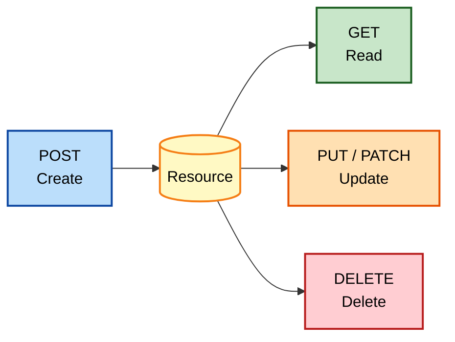
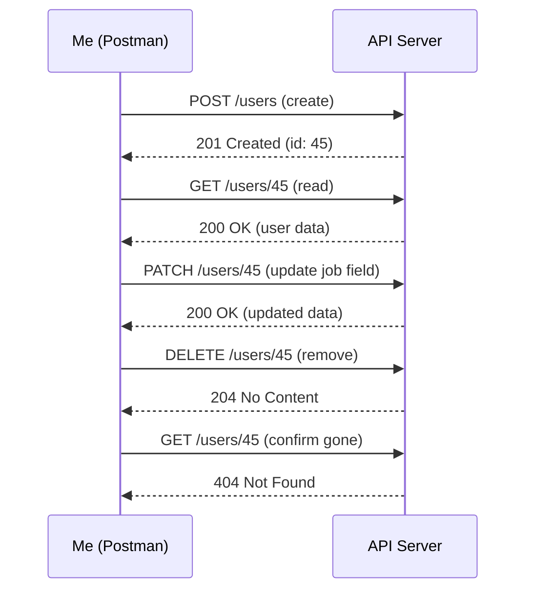
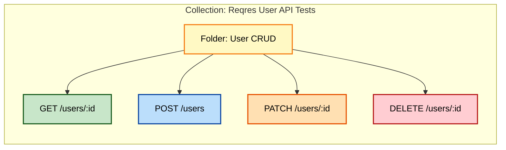

# CRUD Operations and Collections in Postman: Everything I Learned Building Real API Tests

After I got comfortable making basic GET requests, I hit a wall — real-world API testing isn't just about reading data, it's about creating, updating, and deleting it too. That's when I really started to understand CRUD (Create, Read, Update, Delete) and, eventually, how Collections tie all of it together into something maintainable. This post is my attempt to lay out everything I picked up along the way, with diagrams, tested code, and the mistakes I made so you can skip them.

---

## Table of Contents

1. [What CRUD Actually Means to Me](#what-crud-actually-means-to-me)
2. [POST: Creating New Data](#post-creating-new-data)
3. [Advanced POST Techniques](#advanced-post-techniques)
4. [PUT vs. PATCH: Updating Data](#put-vs-patch-updating-data)
5. [Advanced PUT & PATCH Tactics](#advanced-put--patch-tactics)
6. [DELETE: Removing Data Safely](#delete-removing-data-safely)
7. [The Full CRUD Lifecycle, Visualized](#the-full-crud-lifecycle-visualized)
8. [Why I Switched to Collections](#why-i-switched-to-collections)
9. [Building My First Collection, Step by Step](#building-my-first-collection-step-by-step)
10. [Collection-Level Auth and Variables](#collection-level-auth-and-variables)
11. [A Full Worked Example: Reqres User API Tests](#a-full-worked-example-reqres-user-api-tests)
12. [Mistakes I Made With CRUD and Collections](#mistakes-i-made)
13. [Wrapping Up](#wrapping-up)

---

## What CRUD Actually Means to Me

CRUD stands for **C**reate, **R**ead, **U**pdate, **D**elete — the four basic operations any API that manages data needs to support. I map them to HTTP methods like this:

| CRUD Operation | HTTP Method | What I'm Doing |
| --- | --- | --- |
| **Create** | POST | Adding a brand-new resource |
| **Read** | GET | Fetching existing data |
| **Update** | PUT / PATCH | Changing an existing resource |
| **Delete** | DELETE | Removing a resource |

I already covered Read (GET) in an earlier post, so here I'm focusing on the other three — Create, Update, and Delete — plus how I keep all of these requests organized once they start piling up.



---

## POST: Creating New Data

The first time I sent a POST request that actually created something on a server, it felt different from GET — I wasn't just looking at data anymore, I was making something exist. POST shows up everywhere:

- Sign-up forms
- Submitting comments or articles
- Placing an order in an e-commerce checkout

### The Anatomy of a POST Request

1. **Method** — set to `POST`
2. **URL** — the endpoint designed to receive new data
3. **Headers** — almost always `Content-Type: application/json`
4. **Body** — the actual data I want created

### A Request I've Actually Tested

I used the Reqres API to create a fake user:

```bash
curl -s -X POST "https://reqres.in/api/users" \
  -H "Content-Type: application/json" \
  -d '{
    "name": "Emily",
    "job": "Software Tester"
  }'
```

Response:

```json
{
  "name": "Emily",
  "job": "Software Tester",
  "id": "612",
  "createdAt": "2026-09-23T10:22:41.203Z"
}
```

> **Note:** A `201 Created` status code is what I look for on a successful POST — not `200`. If I see `200` on a creation endpoint, I double-check the API docs; some APIs are just inconsistent about this.

### Common Pitfalls

| Pitfall | Why It Happens | How I Fix It |
| --- | --- | --- |
| Wrong `Content-Type` | API can't parse my body | Check docs, match exact header value |
| Invalid data shape | API has validation rules I ignored | Re-read the required schema |
| 401/403 errors | Endpoint needs auth I didn't provide | Add the right token/header |

---

## Advanced POST Techniques

Once basic POST felt easy, I started running into more complex scenarios.

### Technique 1 — File Uploads

For endpoints that accept files (profile pictures, documents), I switch the Body tab to `form-data`:

1. Add a key, e.g. `file`
2. Change its type from **Text** to **File**
3. Pick the file from my machine
4. Add any other supporting fields as plain text key-value pairs

### Technique 2 — Complex, Nested Data

JSON handles nested structures without any extra effort:

```json
{
  "name": "Emily",
  "job": "Software Tester",
  "address": {
    "street": "123 Main St",
    "city": "Anytown"
  },
  "skills": ["API Testing", "JavaScript", "Python"]
}
```

I think of the curly braces as a box within a box, and the square brackets as a list I can pack multiple values into.

### Technique 3 — Dynamic Data With Variables

Instead of hardcoding a username every time, I reference a Postman variable:

```json
{
  "name": "{{randomUserName}}",
  "job": "Software Tester"
}
```

Combined with a small pre-request script:

```javascript
const names = ["Alex", "Jordan", "Priya", "Sam"];
const random = names[Math.floor(Math.random() * names.length)];
pm.variables.set("randomUserName", random);
```

### Technique 4 — Beyond JSON

Not every API wants JSON. I've had to switch formats depending on what I was testing:

| Format | When I Use It |
| --- | --- |
| `raw` → JSON | Most modern REST APIs |
| `raw` → XML | Legacy or enterprise SOAP-adjacent APIs |
| `form-data` | File uploads, multi-part forms |
| `x-www-form-urlencoded` | Older-style web form submissions |

> **Caution:** Mixing up `form-data` and `x-www-form-urlencoded` is an easy mistake — they look similar in Postman's dropdown but produce very different request bodies. I always check the API docs to see which one is expected.

---

## PUT vs. PATCH: Updating Data

This distinction confused me for a long time, so I'll be explicit about it.

### PUT — The Resource Replacer

- Sends the **entire** resource, including fields I'm not changing
- Idempotent: sending the same PUT request repeatedly has the same end result

```bash
curl -s -X PUT "https://reqres.in/api/users/2" \
  -H "Content-Type: application/json" \
  -d '{
    "id": 2,
    "name": "Emily Updated",
    "job": "Senior Software Tester"
  }'
```

### PATCH — The Partial Updater

- Sends **only** the fields I want to change
- Not guaranteed to be idempotent, depending on the API's implementation

```bash
curl -s -X PATCH "https://reqres.in/api/users/2" \
  -H "Content-Type: application/json" \
  -d '{"job": "Senior Software Tester"}'
```

Response I got back from this exact call:

```json
{
  "job": "Senior Software Tester",
  "updatedAt": "2026-09-23T10:30:12.884Z"
}
```

### Side-by-Side Comparison

| Aspect | PUT | PATCH |
| --- | --- | --- |
| **Body content** | Full resource | Only changed fields |
| **Idempotent?** | Yes | Not guaranteed |
| **Risk of data loss** | Higher (if fields are omitted by mistake) | Lower |
| **Typical use case** | Full profile overwrite | Small field update (e.g., email) |

> **Note:** If I'm ever unsure which one an API expects, I default to PUT with the complete object — it's the safer, more predictable choice, even if it means sending more data than strictly necessary.

---

## Advanced PUT & PATCH Tactics

### Tactic 1 — Conditional Updates (Avoiding Conflicts)

When multiple people might edit the same resource, I look for:

- **ETags + `If-Match` header** — the server gives me a version stamp (ETag); I send it back in `If-Match`, and the update only succeeds if nothing changed since I last fetched the resource.
- **Optimistic locking** — I fetch the latest version, make my change locally, then submit with a reference to the original version so the API can detect conflicts.

```bash
curl -s -X PATCH "https://api.example.com/resource/123" \
  -H "Content-Type: application/json" \
  -H "If-Match: \"33a64df551\"" \
  -d '{"status": "shipped"}'
```

### Tactic 2 — Merge PATCH for Nested Updates

A standard PATCH usually replaces a whole field, but a "merge PATCH" lets me update just part of a nested object:

```json
{
  "address": {
    "billing": {
      "street": "New Billing Street"
    }
  }
}
```

> **Caution:** Merge PATCH behavior is *not* guaranteed by the HTTP spec — it's something specific APIs implement (see [RFC 7396](https://tools.ietf.org/html/rfc7396)). I always confirm the API actually supports it before relying on it; otherwise I might accidentally wipe out sibling fields.

### Tactic 3 — Handling Relationships

For resources with relationships (an order and its line items, for example), I've seen two patterns:

- **Nested updates** — updating a parent and child in a single PUT/PATCH
- **Separate endpoints** — dedicated routes like `/orders/123/items` for managing the relationship independently

---

## DELETE: Removing Data Safely

DELETE looks deceptively simple, but it's the one method where a mistake actually costs me data.

### The Basics

1. **Method** — `DELETE`
2. **URL** — targets the specific resource (e.g., `/resource/123`)
3. **Headers** — usually minimal, though some APIs still require auth
4. **Body** — generally empty

```bash
curl -s -X DELETE "https://reqres.in/api/users/2"
```

I typically get back a `204 No Content` — an empty body confirming the deletion worked.

### Success Responses I Watch For

| Status Code | What It Means |
| --- | --- |
| `200 OK` | Deleted, and the response has some data (e.g., the deleted object) |
| `202 Accepted` | Deletion is queued, may happen asynchronously |
| `204 No Content` | Deleted successfully, nothing more to return |

### Things I Always Consider Before Hitting Send on a DELETE

- **Permissions** — am I actually authorized to delete this?
- **Cascading deletes** — will removing this resource also wipe out related data?
- **Idempotency quirks** — the first DELETE might return `204`, but a second DELETE on the same (now-gone) resource often returns `404` instead. That's expected, not a bug.

> **Caution:** I test every DELETE request against a sandbox or staging environment first. I've heard enough horror stories (and had a couple close calls myself) to never trust muscle memory on a production DELETE call.

### Soft Delete vs. Hard Delete

Some APIs don't actually remove data — they just flag it as deleted (a "soft delete"), which allows for recovery later. I always check the API documentation to know which behavior I'm dealing with, because it changes how I write my test assertions afterward.

---

## The Full CRUD Lifecycle, Visualized

Here's how I picture a full CRUD test flow when I'm validating a User resource end-to-end:



I run exactly this sequence as a Collection whenever I want to fully validate a resource's lifecycle in one pass — create it, read it back, change it, delete it, then confirm it's really gone.

---

## Why I Switched to Collections

Before I started using Collections seriously, my Postman workspace was a graveyard of loose, unlabeled request tabs. I'd lose track of which request tested what, and I'd rebuild the same POST request from scratch more times than I'd like to admit.

A **Collection** is essentially a folder for related requests. Here's what it gave me:

| Benefit | What It Means for Me |
| --- | --- |
| **Organization** | Every request for a feature (e.g., "User Management") lives in one place |
| **Reusability** | I save a request once and reuse it with small tweaks instead of rebuilding |
| **Test workflows** | I can chain requests to model real sequences (sign up → update profile → delete account) |
| **Collaboration** | I can share a Collection with teammates or export/import it |



### Real-World Benefits I Noticed

1. **Speed** — no more rebuilding common request patterns
2. **Consistency** — the same test suite runs the same way every time
3. **Modularity** — I break big test scenarios into smaller, focused Collections
4. **Automation** — Collections are what let me run tests headlessly with Newman (Postman's command-line runner) in a CI pipeline

---

## Building My First Collection, Step by Step

Here's exactly what I did the first time:

### Step 1 — Create the Collection

1. Click the **+** button in the workspace
2. Choose **Collection**
3. Name it — I used `"Reqres User API Tests"`
4. Add a short description
5. Click **Create**

### Step 2 — Add Requests

I had two options:

- **New Request** — right-click the Collection → *Add Request*
- **Drag existing tabs** — if I already had loose requests open, I dragged them straight into the Collection in the sidebar

### Step 3 — Structure It Like the API

I mirror the API's own documentation structure. If the API has `users`, `products`, and `orders`, I create matching subfolders inside the Collection so anyone browsing it instantly understands the layout.

### My First Collection Actually Looked Like This

| Request | Method | Endpoint |
| --- | --- | --- |
| Get single user | GET | `/api/users/2` |
| Get list of users | GET | `/api/users?page=1` |
| Create new user | POST | `/api/users` |
| Update user job | PATCH | `/api/users/2` |
| Delete user | DELETE | `/api/users/2` |

---

## Collection-Level Auth and Variables

Once I had a handful of requests, I realized I was repeating the same Authorization header and base URL over and over. Collections fix this:

- **Authorization at the Collection level** — set it once, and every request inherits it unless overridden
- **Variables at the Collection level** — define things like `baseUrl` once, then reference `{{baseUrl}}/users/2` everywhere

```javascript
// Example: collection variable used inside a request URL
{{baseUrl}}/api/users/{{userId}}
```

> **Note:** Setting Authorization at the Collection level saved me an enormous amount of repetitive setup — I no longer had to paste the same Bearer token into ten different requests.

---

## A Full Worked Example: Reqres User API Tests

To bring everything together, here's the full Collection I built and tested against Reqres:

### 1. Create a User

```bash
curl -s -X POST "https://reqres.in/api/users" \
  -H "Content-Type: application/json" \
  -d '{"name": "Jordan", "job": "QA Lead"}'
```

Test script:

```javascript
pm.test("User created with 201", function () {
    pm.response.to.have.status(201);
});

const data = pm.response.json();
pm.collectionVariables.set("newUserId", data.id);
```

### 2. Read the User Back

```bash
curl -s -X GET "https://reqres.in/api/users/{{newUserId}}"
```

### 3. Update the User's Job

```bash
curl -s -X PATCH "https://reqres.in/api/users/{{newUserId}}" \
  -H "Content-Type: application/json" \
  -d '{"job": "Senior QA Lead"}'
```

Test script:

```javascript
pm.test("Job field updated correctly", function () {
    const data = pm.response.json();
    pm.expect(data.job).to.eql("Senior QA Lead");
});
```

### 4. Delete the User

```bash
curl -s -X DELETE "https://reqres.in/api/users/{{newUserId}}"
```

Test script:

```javascript
pm.test("User deleted, 204 returned", function () {
    pm.response.to.have.status(204);
});
```

Running this whole Collection through the **Collection Runner** gave me a single pass/fail report across all four requests, which is exactly the kind of repeatable regression check I now rely on for every API I test.

---

## Mistakes I Made With CRUD and Collections

1. **Sending a PUT with only partial data** — I overwrote fields I never meant to touch. Lesson: PUT needs the *whole* resource.
2. **Forgetting the `Content-Type` header on POST/PATCH** — the API silently ignored my body and returned a confusing validation error.
3. **Not saving IDs as variables** — I hardcoded a user ID from an earlier test run, and it broke the moment that data changed.
4. **Loose, unorganized requests** — before Collections, I had no consistent way to re-run a full test pass, which made regression testing nearly impossible.
5. **Running DELETE against the wrong environment** — always my top caution, and worth repeating: check the active environment before any destructive request.

> **Caution:** I treat every DELETE and every full-resource PUT as "dangerous by default" — I slow down, double-check the URL and environment, and only then hit Send.

---

## Wrapping Up

CRUD operations are the backbone of almost every API I've ever tested — Create with POST, Read with GET, Update with PUT/PATCH, Delete with DELETE. Once I understood the nuances (idempotency, partial vs. full updates, safe deletion practices), API testing stopped feeling like guesswork.

Collections were the second big unlock. They turned a pile of disconnected requests into an organized, reusable, shareable test suite — and set me up for real automation down the line with tools like Newman and CI pipelines.

If you're at the stage I was a while back — comfortable with GET but nervous about POST, PUT, PATCH, and DELETE — my advice is simple: pick a sandbox API like Reqres, walk through the full CRUD lifecycle on a single resource, and don't move on until you've seen every one of those status codes with your own eyes.

### Additional Resources I Actually Use

- [HTTP POST Method — MDN](https://developer.mozilla.org/en-US/docs/Web/HTTP/Methods/POST)
- [HTTP PUT Method — MDN](https://developer.mozilla.org/en-US/docs/Web/HTTP/Methods/PUT)
- [HTTP PATCH Method — MDN](https://developer.mozilla.org/en-US/docs/Web/HTTP/Methods/PATCH)
- [HTTP DELETE Method — MDN](https://developer.mozilla.org/en-US/docs/Web/HTTP/Methods/DELETE)
- [PUT vs. PATCH — RESTful API](https://restfulapi.net/rest-put-vs-patch/)
- [JSON Merge Patch — RFC 7396](https://tools.ietf.org/html/rfc7396)
- [Postman Collections Guide](https://learning.postman.com/docs/sending-requests/intro-to-collections/)
- [File Uploads in Postman](https://learning.postman.com/docs/sending-requests/supported-api-frameworks/file-upload/#sending-files)

---

*Thanks for reading — if you want to practice this yourself, I'd start with the full CRUD lifecycle diagram above: create a resource, read it back, patch one field, then delete it. Seeing all four operations succeed against the same resource, in order, is what finally made CRUD click for me.*
