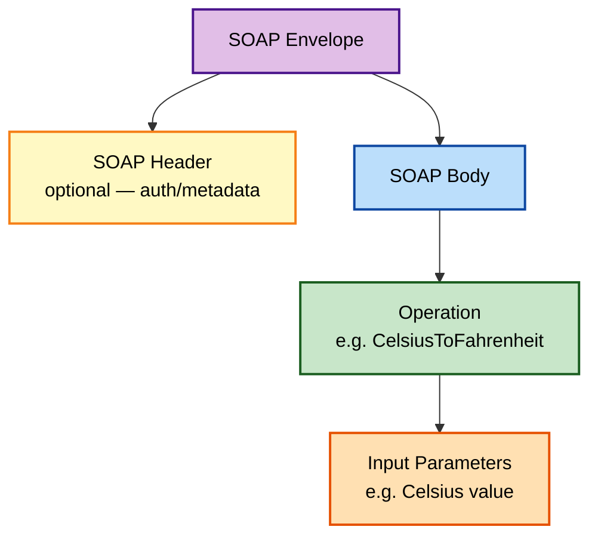
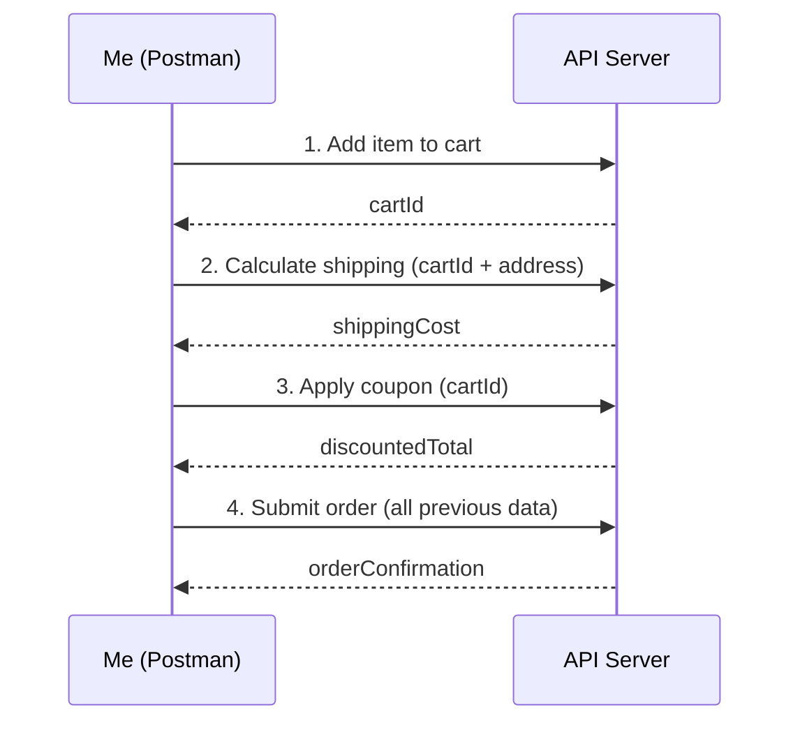
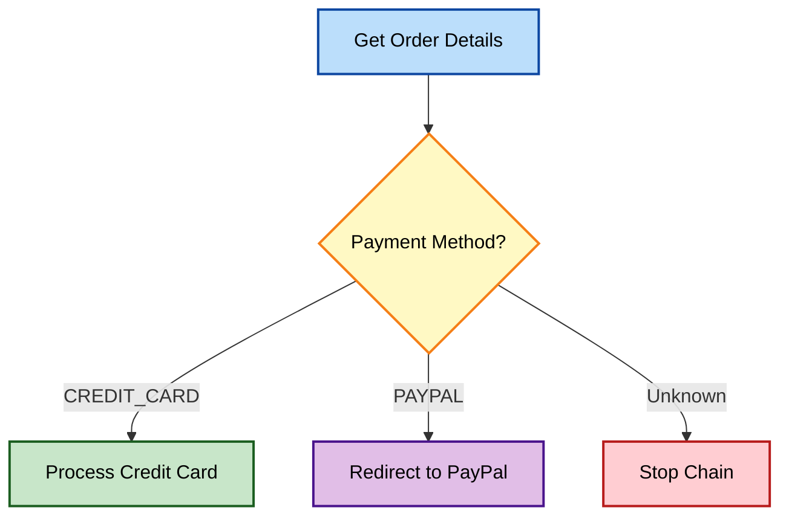
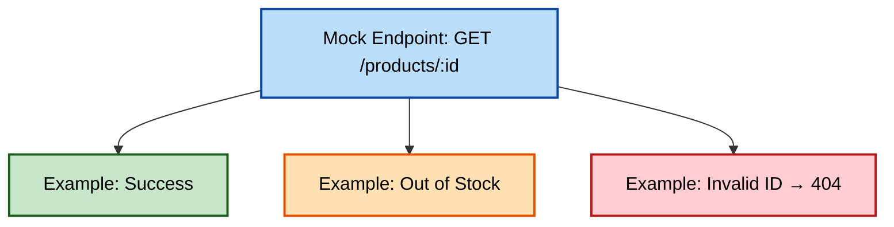
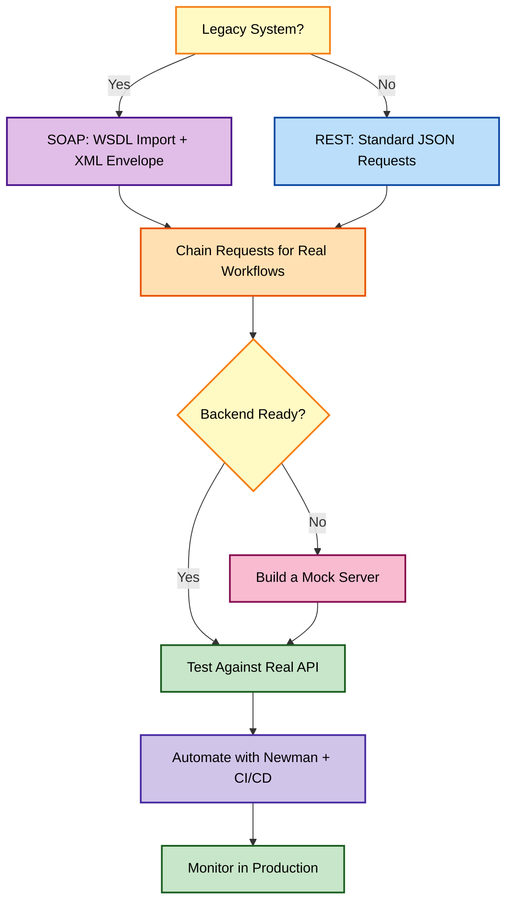

# SOAP, Chaining, and Mock APIs: The Final Pieces of My Postman Toolkit

There's a category of API testing problems that don't show up until you've been doing this for a while: a legacy system that still speaks SOAP instead of REST, a real-world workflow that needs five requests chained together instead of one, and a backend that simply doesn't exist yet but your frontend team needs *something* to build against today. This post covers how I tackled all three — SOAP testing, API chaining, and mock APIs — plus a look back at everything this journey has covered.

---

## Table of Contents

1. [Why SOAP Still Matters](#why-soap-still-matters)
2. [SOAP vs. REST: The Real Differences](#soap-vs-rest-the-real-differences)
3. [Key SOAP Concepts I Had to Learn](#key-soap-concepts-i-had-to-learn)
4. [Setting Up My First SOAP Request](#setting-up-my-first-soap-request)
5. [Importing a WSDL the Easy Way](#importing-a-wsdl-the-easy-way)
6. [Dissecting a Real SOAP Request and Response](#dissecting-a-real-soap-request-and-response)
7. [Testing SOAP Responses](#testing-soap-responses)
8. [Common SOAP Challenges](#common-soap-challenges)
9. [Why I Started Chaining API Requests](#why-i-started-chaining-api-requests)
10. [The Foundation: Variables as Glue](#the-foundation-variables-as-glue)
11. [A Basic Chain in Practice](#a-basic-chain-in-practice)
12. [Chain Execution Options](#chain-execution-options)
13. [Handling Errors in a Chain](#handling-errors-in-a-chain)
14. [Branching Chains Based on Response Data](#branching-chains-based-on-response-data)
15. [Data-Driven Loops Within a Chain](#data-driven-loops-within-a-chain)
16. [Staying Organized Across Multiple Collections](#staying-organized-across-multiple-collections)
17. [Debugging a Broken Chain](#debugging-a-broken-chain)
18. [When Chaining Isn't the Right Tool](#when-chaining-isnt-the-right-tool)
19. [Why Mock APIs Earned a Permanent Place in My Workflow](#why-mock-apis-earned-a-permanent-place-in-my-workflow)
20. [When to Reach for a Mock (and When Not To)](#when-to-reach-for-a-mock-and-when-not-to)
21. [Building My First Mock Server](#building-my-first-mock-server)
22. [Multiple Examples for Richer Mocks](#multiple-examples-for-richer-mocks)
23. [Combining Mocks With Tests](#combining-mocks-with-tests)
24. [The Full Picture, Visualized](#the-full-picture-visualized)
25. [Mistakes I Made](#mistakes-i-made)
26. [Looking Back: My Full API Testing Journey](#looking-back-my-full-api-testing-journey)
27. [Wrapping Up](#wrapping-up)

---

## Why SOAP Still Matters

I'll admit, the first time I heard "SOAP," I assumed it was a dead protocol I'd never actually encounter. Then I joined a project with a legacy insurance system, and suddenly XML envelopes were my whole week. SOAP is still very much alive in banking, insurance, healthcare, and plenty of enterprise systems that predate the REST era and have never had a reason to migrate.

---

## SOAP vs. REST: The Real Differences

| Aspect | SOAP | REST |
| --- | --- | --- |
| **Message format** | Strictly XML | Usually JSON, but flexible |
| **Contract** | WSDL (Web Services Description Language) — machine-readable blueprint | No formal contract required (OpenAPI is optional, not mandated) |
| **Structure** | Defined set of **operations** | **Resource**-oriented (nouns + HTTP verbs) |
| **Typical method** | Almost always POST | GET, POST, PUT, PATCH, DELETE |

> **Note:** The biggest mental shift for me moving from REST to SOAP testing was that SOAP doesn't really use different HTTP methods for different actions — nearly everything is a POST, and the *actual* operation you're calling lives inside the XML body, not the URL or the HTTP verb.

---

## Key SOAP Concepts I Had to Learn

| Concept | What It Means |
| --- | --- |
| **WSDL** | The contract describing available operations, input/output formats — my starting point for any SOAP API |
| **SOAP Envelope** | The outer XML wrapper containing everything in the message |
| **XML Namespaces** | Used heavily to avoid naming collisions — intimidating at first, harmless once you see the pattern |
| **XPath** | A query language for pinpointing specific elements inside XML responses |



---

## Setting Up My First SOAP Request

Here's exactly what I did:

1. **Method:** `POST` (almost always, for SOAP)
2. **URL:** the SOAP endpoint itself
3. **Body tab:** select **raw**, then **XML (text/xml)** from the content-type dropdown

A basic envelope structure looks like this:

```xml
<?xml version="1.0" encoding="utf-8"?>
<soap:Envelope xmlns:xsi="http://www.w3.org/2001/XMLSchema-instance"
               xmlns:xsd="http://www.w3.org/2001/XMLSchema"
               xmlns:soap="http://schemas.xmlsoap.org/soap/envelope/">
  <soap:Body>
    <CelsiusToFahrenheit xmlns="https://www.w3schools.com/xml/">
      <Celsius>25</Celsius>
    </CelsiusToFahrenheit>
  </soap:Body>
</soap:Envelope>
```

---

## Importing a WSDL the Easy Way

If I have a WSDL URL, Postman can generate the envelope structure for me automatically:

1. In the request body area, click **Import**
2. Paste the WSDL URL
3. Postman parses it and scaffolds a basic SOAP envelope

I tested this against the classic public example:

```
https://www.w3schools.com/xml/tempconvert.asmx?WSDL
```

> **Note:** WSDL import saves real time on the boilerplate, but I always double-check the generated envelope against the WSDL's documented parameter names — auto-generated scaffolding occasionally leaves placeholder text I need to manually swap out.

---

## Dissecting a Real SOAP Request and Response

Using the temperature-conversion SOAP API as a concrete example, here's the full request I sent:

```bash
curl -s -X POST "https://www.w3schools.com/xml/tempconvert.asmx" \
  -H "Content-Type: text/xml; charset=utf-8" \
  -H "SOAPAction: https://www.w3schools.com/xml/CelsiusToFahrenheit" \
  -d '<?xml version="1.0" encoding="utf-8"?>
<soap:Envelope xmlns:xsi="http://www.w3.org/2001/XMLSchema-instance"
               xmlns:xsd="http://www.w3.org/2001/XMLSchema"
               xmlns:soap="http://schemas.xmlsoap.org/soap/envelope/">
  <soap:Body>
    <CelsiusToFahrenheit xmlns="https://www.w3schools.com/xml/">
      <Celsius>25</Celsius>
    </CelsiusToFahrenheit>
  </soap:Body>
</soap:Envelope>'
```

And the shape of response I got back:

```xml
<?xml version="1.0" encoding="utf-8"?>
<soap:Envelope xmlns:soap="http://schemas.xmlsoap.org/soap/envelope/">
  <soap:Body>
    <CelsiusToFahrenheitResponse xmlns="https://www.w3schools.com/xml/">
      <CelsiusToFahrenheitResult>77</CelsiusToFahrenheitResult>
    </CelsiusToFahrenheitResponse>
  </soap:Body>
</soap:Envelope>
```

Breaking down the response structure:

| Part | What It Contains |
| --- | --- |
| **SOAP Envelope** | Echoes the outer wrapper structure |
| **Result element** | `<CelsiusToFahrenheitResult>` — the actual answer I care about |

---

## Testing SOAP Responses

The good news: Postman's **Tests** tab works on SOAP responses too, just with XML-specific tools.

### Status Code Check

```javascript
pm.test("Status code is 200", function () {
    pm.response.to.have.status(200);
});
```

### XPath Assertions

```javascript
pm.test("Temperature converted correctly", function () {
    pm.expect(pm.response.text()).to.have.xpath(
        '//CelsiusToFahrenheitResult[text()="77"]'
    );
});
```

### Schema Validation

If the API provides an XML schema, Postman can validate the response structure against it — useful for catching contract drift even when individual values look fine.

> **Caution:** XPath queries are unforgiving about exact structure — a small namespace mismatch or a slightly different element nesting will silently fail to match, even if the data "looks right" to my eyes. I always test my XPath expression against the raw response text before trusting it in a real assertion.

---

## Common SOAP Challenges

| Challenge | What I Do About It |
| --- | --- |
| **Dynamic placeholders** | Some WSDLs require per-request unique IDs — I generate these with pre-request scripts, same as REST |
| **SOAP Faults** | SOAP's structured error format needs its own handling in test scripts |

A SOAP Fault looks like this:

```xml
<soap:Envelope xmlns:soap="http://schemas.xmlsoap.org/soap/envelope/">
  <soap:Body>
    <soap:Fault>
      <faultcode>soap:Client</faultcode>
      <faultstring>Invalid input parameter</faultstring>
    </soap:Fault>
  </soap:Body>
</soap:Envelope>
```

I test for this explicitly:

```javascript
pm.test("No SOAP Fault returned", function () {
    pm.expect(pm.response.text()).to.not.include("<soap:Fault>");
});
```

---

## Why I Started Chaining API Requests

A single request rarely tells the full story of a real user workflow. Signing up, then fetching a profile, then updating it — that's three requests that depend on each other, not one isolated call.

| Use Case | Why Chaining Helps |
| --- | --- |
| **End-to-end scenarios** | Create user → get ID → update profile |
| **Data-driven flows** | Find a product → extract its ID → fetch pricing |
| **Dependency checks** | Confirm a write via one endpoint shows up correctly via another |

---

## The Foundation: Variables as Glue

Chaining relies entirely on the variable scopes I already knew:

| Scope | Best For Chaining |
| --- | --- |
| **Environment** | Base URLs, values consistent across the whole chain |
| **Global** | Data needed across multiple Collections or the entire workspace |
| **Local** | Short-lived values extracted from a single response |

---

## A Basic Chain in Practice

**Request 1 — Login:**

```bash
curl -s -X POST "https://reqres.in/api/login" \
  -H "Content-Type: application/json" \
  -d '{"email": "eve.holt@reqres.in", "password": "cityslicka"}'
```

Response:

```json
{"token": "QpwL5tke4Pnpja7X4"}
```

**Test Script (Request 1):**

```javascript
pm.test("Login successful", function () {
    pm.response.to.have.status(200);
});

let jsonData = pm.response.json();
pm.environment.set("authToken", jsonData.token);
```

**Request 2 — Get User Profile (uses the stored token):**

```bash
curl -s -X GET "https://reqres.in/api/users/2" \
  -H "Authorization: Bearer {{authToken}}"
```

This is the whole pattern: extract → store → reuse.

---

## Chain Execution Options

| Option | Best For |
| --- | --- |
| **Collection Runner** | Well-structured, ordered chains |
| **Manual chaining** | Quick, ad-hoc test flows |
| **Postman Flows / Workflows** | Complex chains with conditional logic (visual builder) |

### Scenario: E-commerce Checkout Chain



---

## Handling Errors in a Chain

By default, if one request in a chain fails, later requests may run against bad or missing data — that's the real risk I had to design around.

### Conditional Checks

```javascript
pm.test("Item is in stock", function () {
    let data = pm.response.json();
    pm.expect(data.inStock).to.eql(true);
});
```

### Flagging Failures for Later Steps

```javascript
if (pm.response.code !== 200) {
    pm.environment.set("chainFailed", true);
    pm.environment.set("productStatus", "NOT_FOUND");
}
```

Then, in a *later* request's pre-request script:

```javascript
if (pm.environment.get("chainFailed") === "true") {
    console.log("Skipping normal flow — using fallback logic");
    // use a flat-rate shipping value instead of a calculated one, for example
}
```

> **Note:** I always reset `chainFailed` back to `false` at the start of a chain run — otherwise a failure from a previous run can silently linger and affect the next one. This bit me exactly once, and once was enough to make it a permanent habit.

---

## Branching Chains Based on Response Data

Postman's `postman.setNextRequest()` lets me jump to a specific named request based on what a response actually contains:

```javascript
let paymentType = pm.response.json().paymentMethod;

if (paymentType === "CREDIT_CARD") {
    postman.setNextRequest("Process Credit Card");
} else if (paymentType === "PAYPAL") {
    postman.setNextRequest("Redirect to PayPal");
} else {
    postman.setNextRequest(null); // stop the chain
}
```



---

## Data-Driven Loops Within a Chain

Looping over a list an API returns, checking each item:

```javascript
const promoProducts = pm.response.json();

for (let i = 0; i < promoProducts.length; i++) {
    pm.environment.set("productId", promoProducts[i].id);
    postman.setNextRequest("Check Inventory");
}
```

> **Caution:** I set a hard upper limit on loop iterations any time I'm looping inside a Postman chain. An unbounded loop against a live API is a genuinely easy way to accidentally hammer a server or burn through rate limits — I've capped loops at a sane maximum (say, 50 iterations) even when I don't expect to hit it, purely as a safety net.

---

## Staying Organized Across Multiple Collections

Real workflows sometimes span more than one Collection. A few patterns I've used:

| Approach | How It Works |
| --- | --- |
| **"Master" orchestration Collection** | A dedicated Collection that calls into other, more granular Collections via `setNextRequest()` |
| **Shared workspace** | Collections in the same workspace can share variables |
| **Postman API** | Trigger separate Collection runs programmatically, coordinating them from outside Postman entirely |

---

## Debugging a Broken Chain

When a multi-step chain breaks somewhere in the middle, here's my process:

1. **Log liberally** — `console.log(variableName)` at every hand-off point between requests
2. **Step-through mode** — the Collection Runner can execute one request at a time, letting me inspect state after each
3. **Isolate** — temporarily break the chain into smaller pieces to pinpoint exactly where things go wrong

```javascript
console.log("Cart ID:", pm.environment.get("cartId"));
console.log("Shipping Cost:", pm.environment.get("shippingCost"));
console.log("Chain Failed Flag:", pm.environment.get("chainFailed"));
```

---

## When Chaining Isn't the Right Tool

Chaining is powerful, but I've learned it's not always the right call:

| Situation | Why Chaining Struggles | Better Approach |
| --- | --- | --- |
| **Heavy data prep** | Complex database seeding is awkward inside Postman scripts | A standalone setup script outside Postman |
| **Long async waits** | Approval flows, batch processing that takes minutes | External polling, or a scheduled monitor |
| **True parallelism** | Postman chains run sequentially, not concurrently | A real programming language for concurrent calls |

### Example: Batch Image Processing

Instead of a single Postman chain that waits minutes for processing:

1. Postman handles the upload
2. An **external script** polls the processing-status endpoint periodically
3. Once complete, that script **triggers a Postman Collection run** to verify the final results

This split keeps each tool doing what it's actually good at.

---

## Why Mock APIs Earned a Permanent Place in My Workflow

A mock API imitates a real API's structure but returns responses I control completely. This solved problems I didn't even realize I had until I started using them.

| Benefit | Why It Matters |
| --- | --- |
| **Parallel frontend development** | The frontend team doesn't wait on a backend that isn't ready yet |
| **Easy edge-case testing** | Forcing a 500 error or a missing field is trivial with a mock, hard with a real backend |
| **No rate limits, no cost** | Mocks are fast and free to hammer as much as I want |

---

## When to Reach for a Mock (and When Not To)

| Reach for a Mock | Don't Rely Only on a Mock |
| --- | --- |
| The real API doesn't exist yet | Final, true end-to-end integration testing |
| A third-party dependency is flaky | Verifying real-world performance/load |
| Testing error/edge-case handling | Complex backend state that spans multiple requests |

> **Note:** I treat mocks as a *development accelerant*, not a replacement for real integration testing. At some point, I always test against the actual API before calling anything "done."

---

## Building My First Mock Server

### The Scenario

A product catalog API with:

- `GET /products` — list of products
- `GET /products/{productId}` — single product details

### Step 1 — Build the Collection

I created requests matching the real API's shape, using a path variable for the single-product endpoint:

```
{{baseUrl}}/products/{{productId}}
```

### Step 2 — Create the Mock

1. Select a request → click the **Mocks** tab
2. **Create a new mock server**
3. Name it (e.g., `"Product Catalog Mock"`) → **Create**

Postman generates a dedicated mock server URL.

### Step 3 — Define the Response

```json
[
  { "id": 1, "name": "Cool Gadget", "price": 29.99 },
  { "id": 2, "name": "Useful Tool", "price": 15.50 }
]
```

### Step 4 — Test It

```bash
curl -s "https://<your-mock-id>.mock.pstmn.io/products"
```

Response:

```json
[
  { "id": 1, "name": "Cool Gadget", "price": 29.99 },
  { "id": 2, "name": "Useful Tool", "price": 15.50 }
]
```

Exactly the fabricated data I defined — no real backend involved at all.

---

## Multiple Examples for Richer Mocks

A single endpoint can return different responses depending on the scenario I want to simulate:

| Example | Simulates |
| --- | --- |
| Successful fetch | Normal, happy-path product lookup |
| Out-of-stock product | Edge case for inventory-aware UI logic |
| Invalid `productId` | Error-handling path (404-style response) |



---

## Combining Mocks With Tests

Once a mock exists, I test against it exactly like a real endpoint:

```javascript
pm.test("Mock returns 200", function () {
    pm.response.to.have.status(200);
});

pm.test("Product data matches expected schema", function () {
    let data = pm.response.json();
    data.forEach(product => {
        pm.expect(product).to.have.property("id");
        pm.expect(product).to.have.property("name");
        pm.expect(product).to.have.property("price");
    });
});
```

I can also drive this with variables and examples together — setting a `productId` environment variable, then swapping between examples to simulate different lookups without touching the test script at all.

> **Caution:** I keep mock server URLs clearly separate from real environment URLs (different environments entirely, e.g., `"Mock"` vs. `"Staging"`). Accidentally running a real-data test suite against a mock — or vice versa — produces results that look valid but mean nothing.

---

## The Full Picture, Visualized

Here's how SOAP, chaining, and mocking sit alongside everything else in a complete testing workflow:



---

## Mistakes I Made

1. **Assuming SOAP used different HTTP methods like REST** — nearly everything is POST; the real "verb" lives inside the XML body as the operation name.
2. **Writing brittle XPath queries** — a namespace mismatch silently broke an assertion I assumed was working correctly for weeks.
3. **Letting `chainFailed` linger between runs** — a stale flag from a previous failed run quietly altered the behavior of a later, otherwise-healthy run.
4. **Looping without an upper bound** — I got lucky that a test loop didn't run against a huge dataset the one time I forgot a safety cap.
5. **Testing against a mock and forgetting to also test the real API** — a mock happily "passed" a scenario that the real backend actually handled differently.
6. **Mixing up mock and real environment URLs** — running an important regression suite against leftover mock data instead of staging, and being confused why "everything passed" despite a known real bug.

> **Caution:** Every mistake here shares a theme — trusting a system's *apparent* success without double-checking what it was actually testing against. That single habit, verifying context before trusting a green checkmark, has saved me the most time of anything in this whole journey.

---

## Looking Back: My Full API Testing Journey

Writing this final post, it's worth pausing on how far this actually went — from a nervous first GET request to orchestrating multi-step chains against SOAP and REST APIs alike, backed by mocks, automated through CI/CD, and watched over by monitors.

| Stage | What I Can Now Do |
| --- | --- |
| **The Basics** | Craft any HTTP request, understand REST and SOAP alike |
| **Power Tools** | Use variables, environments, and scripts to make tests dynamic |
| **Beyond Requests** | Organize with Collections, collaborate via Workspaces, watch APIs with Monitors |
| **Automation** | Run everything headlessly with Newman, gate deployments through CI/CD |
| **Creative Problem-Solving** | Chain complex workflows, mock APIs that don't exist yet |

### Where I'd Point Myself Next

- **Community resources** — public workspaces and forums are full of real-world patterns worth studying
- **Test-driven API design** — writing Postman tests *before* an API is built, letting the tests help shape the contract
- **Deeper authentication scenarios** — multi-factor flows, more advanced OAuth grant types
- **Beyond Postman** — dedicated API security testing tools and contract-testing frameworks, once the fundamentals here feel solid

---

## Wrapping Up

SOAP testing taught me that "legacy" doesn't mean "irrelevant" — plenty of critical systems still speak XML, and the underlying testing principles (assert on responses, handle errors gracefully) carry over completely, just with a different message format. API chaining showed me how to model real user workflows instead of testing endpoints in isolation, and taught me just as much about designing for failure as about the happy path. Mock APIs gave me a way to test things that don't even exist yet, and to force edge cases a real backend would never willingly show me.

If there's one thread running through everything in this whole series, it's this: API testing isn't really about any single tool or technique. It's about building a habit of *not trusting anything until I've verified it myself* — the status code, the response body, the environment I'm actually pointed at. Everything else, from SOAP envelopes to mock servers to CI pipelines, is just infrastructure in service of that one habit.

### Additional Resources I Actually Use

- [Postman: Working with SOAP APIs](https://learning.postman.com/docs/sending-requests/requests/#sending-soap-requests)
- [Understanding WSDLs — W3Schools](https://www.w3schools.com/xml/xml_wsdl.asp)
- [XPath Tutorial — W3Schools](https://www.w3schools.com/xml/xpath_intro.asp)
- [Postman: Using Variables](https://learning.postman.com/docs/sending-requests/variables/)
- [Postman: Running Collections](https://learning.postman.com/docs/running-collections/intro-to-collection-runs/)
- [Postman: Controlling Test Flow](https://learning.postman.com/docs/writing-scripts/script-references/test-examples/#controlling-test-flow)
- [Postman: Mock Servers](https://www.postman.com/features/mock-api/)
- [Postman: Using Examples With Mocks](https://learning.postman.com/docs/designing-and-developing-your-api/mocking-data/using-examples-with-mocks/)

---

*Thanks for reading through this whole series — if you're just getting started with any of these three topics, my honest suggestion is to pick whichever one solves a problem you actually have right now. If you're stuck waiting on a backend, start with mocks. If you're testing a real user workflow, start with chaining. And if you've just discovered a legacy system speaking XML at you, SOAP will make a lot more sense once you've sent and dissected just one real envelope with your own eyes.*
