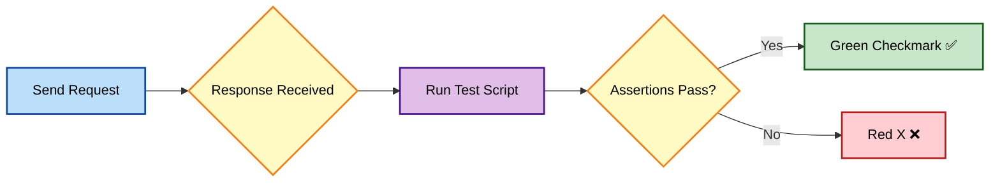
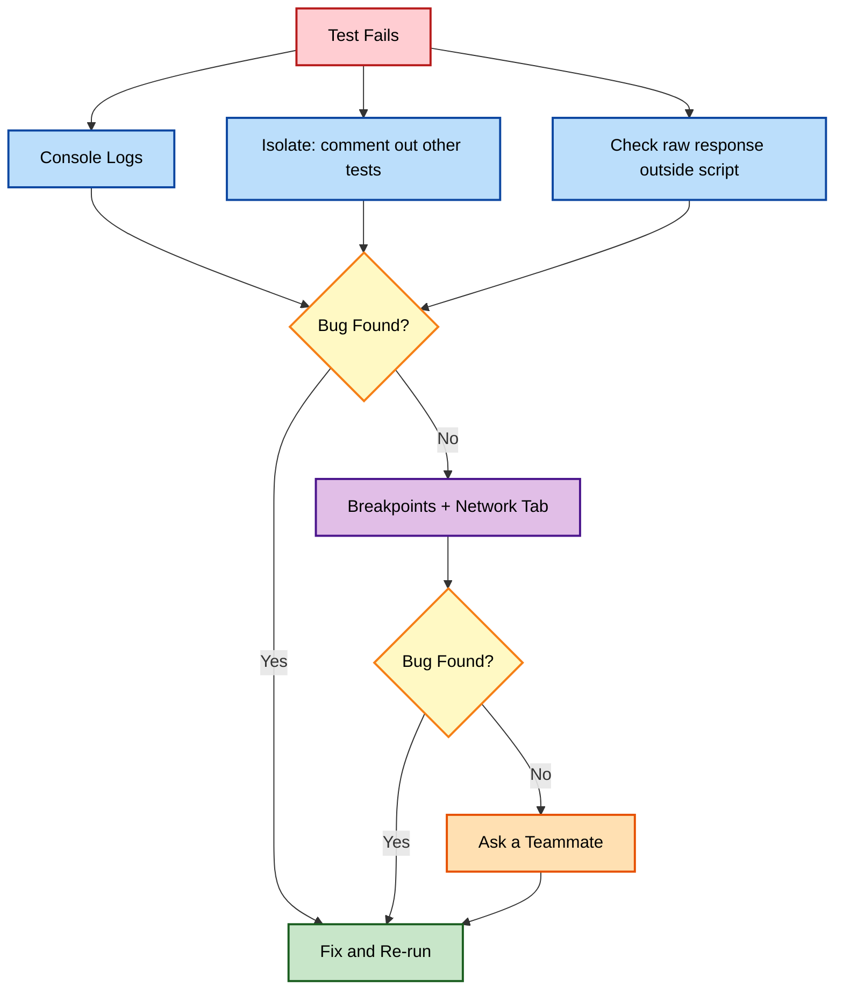
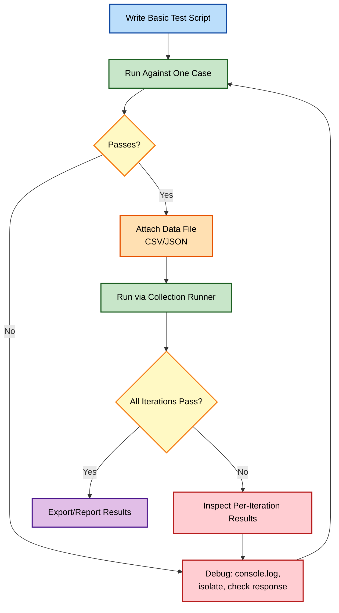

# Test Scripts, Debugging, and Data-Driven Testing in Postman: The Complete Workflow I Rely On

There's a specific moment in my API testing journey where things shifted from "manually clicking Send and eyeballing the response" to "actually running a test suite." That shift happened once I got serious about three things: writing real test scripts, debugging them properly when they failed, and feeding them data instead of hardcoded values. This post is my full walkthrough of all three, in the order I actually learned them, with the diagrams, tested code, and hard-won lessons I picked up along the way.

---

## Table of Contents

1. [Why Test Scripts Changed How I Work](#why-test-scripts-changed-how-i-work)
2. [The `pm.test()` Powerhouse](#the-pmtest-powerhouse)
3. [Setting Variables From Responses](#setting-variables-from-responses)
4. [Basic If/Else Logic in Tests](#basic-ifelse-logic-in-tests)
5. [My First Real End-to-End Test](#my-first-real-end-to-end-test)
6. [Reading Test Results in Postman](#reading-test-results-in-postman)
7. [Debugging: Why Half My Time Goes Here](#debugging-why-half-my-time-goes-here)
8. [The Console Is My Best Friend](#the-console-is-my-best-friend)
9. [Isolating the Problem](#isolating-the-problem)
10. [Scrutinizing the Response](#scrutinizing-the-response)
11. [Thinking Like a Scientist](#thinking-like-a-scientist)
12. [A Full Debugging Walkthrough](#a-full-debugging-walkthrough)
13. [Advanced Debugging Tools](#advanced-debugging-tools)
14. [Why I Moved to Data-Driven Testing](#why-i-moved-to-data-driven-testing)
15. [CSV vs. JSON as Data Sources](#csv-vs-json-as-data-sources)
16. [Running Data Through the Collection Runner](#running-data-through-the-collection-runner)
17. [Writing Data-Aware Tests](#writing-data-aware-tests)
18. [Managing Large Datasets](#managing-large-datasets)
19. [Generating Test Data Dynamically](#generating-test-data-dynamically)
20. [Reporting on Data-Driven Results](#reporting-on-data-driven-results)
21. [The Full Workflow, Visualized](#the-full-workflow-visualized)
22. [Mistakes I Made Along the Way](#mistakes-i-made-along-the-way)
23. [Wrapping Up](#wrapping-up)

---

## Why Test Scripts Changed How I Work

For a while, "testing" an API meant sending a request and looking at the response with my own eyes. That works fine for one request, once. It falls apart completely the moment I need to check the same thing fifty times, or make sure a fix didn't break something else three weeks from now.

Test scripts fixed that. A script I write once keeps checking the same thing forever, consistently, without me needing to remember what "correct" looked like last time.

| Before Test Scripts | After Test Scripts |
| --- | --- |
| Manually eyeballing each response | Automated pass/fail assertions |
| Forgetting what "correct" looked like | A documented, repeatable expectation |
| No record of what passed/failed | Green checkmarks and red X's, saved per run |
| Re-checking everything by hand after a change | Re-running the whole suite in seconds |

---

## The `pm.test()` Powerhouse

Everything starts with `pm.test()`. It's the single most-used line in my entire testing workflow.

```javascript
pm.test("Status code is 200", function () {
    pm.response.to.have.status(200);
});
```

Breaking down the anatomy:

- `pm.test(name, fn)` — registers a named test; the name shows up in the Tests tab
- Inside the function, I use Postman's built-in assertions — `pm.response.to.have.status(200)` checks the status code specifically

I tested this exact pattern against a live endpoint:

```bash
curl -s -o /dev/null -w "%{http_code}\n" "https://reqres.in/api/users/2"
```

Output:

```
200
```

Which confirms the assertion above would pass.

> **Note:** Postman's assertion syntax is built on [Chai.js](https://www.chaijs.com/), a JavaScript assertion library. If something in `pm.expect(...)` looks unfamiliar, searching "chai assertion \[thing\]" usually gets me an answer faster than searching Postman docs directly.

---

## Setting Variables From Responses

The second pattern I leaned on constantly: extract something from a response and store it for later use.

```javascript
pm.test("User creation successful", function () {
    pm.response.to.have.status(201);
    let jsonData = pm.response.json();
    pm.environment.set("newUserId", jsonData.id);
});
```

Tested against Reqres:

```bash
curl -s -X POST "https://reqres.in/api/users" \
  -H "Content-Type: application/json" \
  -d '{"name": "Casey", "job": "QA Analyst"}'
```

Response:

```json
{
  "name": "Casey",
  "job": "QA Analyst",
  "id": "331",
  "createdAt": "2026-09-24T08:12:03.552Z"
}
```

That `id` value is exactly what gets captured by `jsonData.id` and stored for the next request in the chain.

---

## Basic If/Else Logic in Tests

Not every response looks the same, so I branch my test logic based on what actually came back:

```javascript
pm.test("Error handling", function () {
    if (pm.response.code === 400) {
        pm.test("Bad Request error is shown", () => {
            const data = pm.response.json();
            pm.expect(data).to.have.property("error");
        });
    } else {
        pm.test("Request succeeded", () => {
            pm.response.to.have.status(200);
        });
    }
});
```

> **Caution:** Nesting `pm.test()` calls inside each other (as shown above) works, but I keep it shallow — one level of nesting at most. Deeply nested tests get confusing fast, both to read and to debug when something fails.

---

## My First Real End-to-End Test

Here's the scenario that finally made everything click for me: testing a product search endpoint.

### Scenario

- **Endpoint:** `GET /products`
- **Parameter:** `q` (search query)
- **Goal:** confirm relevant products come back, and the search actually works

### Step 1 — Set Up the Request

```
GET {{baseUrl}}/products?q=notebook
```

### Step 2 — Write the Test Script

```javascript
pm.test("Search returns products", function () {
    pm.response.to.have.status(200);

    let jsonData = pm.response.json();

    pm.test("At least one product is returned", () => {
        pm.expect(jsonData.length).to.be.above(0);
    });
});
```

### Step 3 — Add Dynamic Variables

```javascript
pm.environment.set("searchQuery", "notebook");

pm.test("Product names contain the search term", () => {
    let jsonData = pm.response.json();
    let searchTerm = pm.environment.get("searchQuery");

    jsonData.forEach(product => {
        pm.test(product.name + " includes search term", () => {
            pm.expect(product.name.toLowerCase()).to.include(searchTerm.toLowerCase());
        });
    });
});
```

I tested the underlying request logic against JSONPlaceholder as a stand-in (since it doesn't have search, I simulated the loop-assertion pattern against its `/posts` list):

```bash
curl -s "https://jsonplaceholder.typicode.com/posts?userId=1" | head -c 300
```

```json
[{"userId":1,"id":1,"title":"sunt aut facere...","body":"quia et..."},{"userId":1,"id":2,"title":"qui est esse", ...
```

The looping-assertion pattern (`jsonData.forEach(... => pm.test(...))`) works the same way regardless of the underlying data — I loop over the array and assert something about each item individually, which gives me one pass/fail result per item instead of one giant test covering everything at once.

### Step 4 — Run and Inspect

I make sure the right environment is active, hit Send, then check the **Tests** tab.

> **Note:** I always start with the "happy path" — the simplest, expected-to-succeed scenario — before I add edge cases and negative tests. Trying to write the perfect, fully-loaded test on the first attempt almost always slows me down.

---

## Reading Test Results in Postman

| Indicator | Meaning |
| --- | --- |
| ✅ Green checkmark | Test passed |
| ❌ Red X | Test failed — click it for details |
| Test count summary | Total passed/failed for the whole request |



---

## Debugging: Why Half My Time Goes Here

Writing the test is only half the job. The other half — often the harder half — is figuring out *why* a test failed when I genuinely expected it to pass.

---

## The Console Is My Best Friend

`console.log()` inside a script is, without exaggeration, the tool I reach for most when something isn't behaving.

```javascript
pm.test("Search returns products", function () {
    let searchTerm = pm.environment.get("searchQuery");
    console.log("Search term used: ", searchTerm);

    let jsonData = pm.response.json();
    console.log("Response data: ", jsonData);
});
```

To view it: **View → Show Postman Console** (or the small Console button in the bottom-left). Output appears right after I send a request.

> **Note:** I leave `console.log()` statements in during active development, then strip the noisy ones out once a test is stable — a Console full of unrelated logs makes it harder to spot the one line I actually need when debugging something new later.

---

## Isolating the Problem

When a script fails, I don't try to fix everything at once. I narrow it down first.

| Level | What I Do |
| --- | --- |
| **Test-level** | Comment out other `pm.test()` blocks, leave only the failing one |
| **Request-level** | Send the request *without* the script — does the raw API response look right? |

If the raw response is wrong, the problem is the API (or my request). If the raw response is fine but my test still fails, the problem is in my script logic.

---

## Scrutinizing the Response

When a test fails unexpectedly, I check three things in order:

1. **Status code** — is it what I expected (200 vs. a surprise 400)?
2. **Response body** — is the JSON structure what I assumed? Are the field names spelled the way I think they are?
3. **Response headers** — sometimes the real clue is hiding here (rate limit info, content-type mismatches, custom error codes)

> **Caution:** A surprisingly common bug I've hit: assuming a field name (`user_id` vs `userId` vs `id`) without actually checking the raw response first. I now always `console.log(pm.response.json())` before writing an assertion against a field I haven't personally verified.

---

## Thinking Like a Scientist

Debugging, to me, is just running a small experiment:

1. **Form a hypothesis** — "I think the total is wrong because of a missing tax calculation."
2. **Change one thing at a time** — don't alter three variables and the assertion all in the same run.
3. **Ask "what if?"** — try an edge case (empty string, zero, a huge number) and see how the API — and my test — actually respond.

---

## A Full Debugging Walkthrough

Here's a real example I like to use when teaching this: testing that an order total is calculated correctly.

```javascript
pm.test("Order total is calculated correctly", function () {
    let price = pm.environment.get("itemPrice");
    let quantity = pm.environment.get("quantity");

    pm.response.to.have.status(201);

    let jsonData = pm.response.json();

    pm.test("Total matches price * quantity", () => {
        pm.expect(jsonData.total).to.eql(price * quantity);
    });
});
```

### My Debugging Steps

1. **Add console logs:**

```javascript
console.log("price:", price, typeof price);
console.log("quantity:", quantity, typeof quantity);
console.log("jsonData.total:", jsonData.total);
```

2. **Check the actual response structure** — does `total` even exist on the object? I run the raw request first:

```bash
curl -s -X POST "https://api.example.com/orders" \
  -H "Content-Type: application/json" \
  -d '{"itemPrice": 10, "quantity": 3}'
```

3. **Compare types, not just values.** This is the bug I hit most often in real life: environment variables are stored as *strings*, so `price * quantity` might silently become string concatenation-turned-NaN if I forgot to convert:

```javascript
let price = Number(pm.environment.get("itemPrice"));
let quantity = Number(pm.environment.get("quantity"));
```

> **Note:** This exact issue — environment variables coming back as strings instead of numbers — has been the root cause of more of my failing tests than almost anything else. I now cast explicitly with `Number()` any time I'm doing arithmetic on a variable pulled from an environment or data file.

---

## Advanced Debugging Tools

### Breakpoints

I can click the line number in the Pre-request Script or Tests tab to set a breakpoint (a red dot appears). Running the request pauses execution there, letting me inspect state before continuing — genuinely useful for longer scripts where `console.log()` spam gets unwieldy.

### The Network Tab

Below the response area, the **Network** tab shows the raw HTTP traffic — exact headers, raw request body, and the precise response as it went over the wire. I use this when I suspect Postman is sending something subtly different from what I typed (encoding issues, a missing header I assumed was there automatically).

### Monitors for Intermittent Issues

If a test fails only sometimes, a scheduled Monitor running the same request periodically helps reveal patterns — is it time-of-day dependent? Environment-specific? A monitor running against staging catching failures that never show up in dev is a strong clue about environment drift.

### Collaborative Debugging

A second set of eyes on a shared workspace has caught bugs for me that I'd been staring at for an hour. Sometimes the fix is obvious to someone who didn't write the original script.



---

## Why I Moved to Data-Driven Testing

Static, hardcoded tests only ever check one specific case. Real APIs need to handle a huge range of inputs — different usernames, edge-case values, malformed data — and manually writing a separate request for each one doesn't scale.

| Benefit | What It Means for Me |
| --- | --- |
| **Reusability** | One test template runs against many data sets |
| **Edge case coverage** | Easy to throw unusual input at the API and see what breaks |
| **Realistic scenario coverage** | Mimics the variety of real user input |

---

## CSV vs. JSON as Data Sources

| Format | Best For | Example |
| --- | --- | --- |
| **CSV** | Simple, tabular data | `username,email,password` |
| **JSON** | Nested, complex structures | `[{"name": "Alice", "cart": ["item1", "item3"]}]` |

A CSV I've actually used for login testing:

```csv
username,password,expectedStatus
testuser1,password123,true
testuser2,badpassword,false
```

---

## Running Data Through the Collection Runner

### Step 1 — Open the Runner

Click the **"..."** next to a Collection's name → **Run Collection**.

### Step 2 — Attach the Data File

In the **Data** tab of the runner, I select my CSV or JSON file. Postman shows a preview so I can confirm it parsed correctly before running anything.

### Step 3 — Reference Data in Requests

Data file columns become variables automatically:

```json
{
  "username": "{{username}}",
  "password": "{{password}}"
}
```

Tested against a login-style endpoint (using a mock structure, since Reqres's login endpoint expects specific test credentials):

```bash
curl -s -X POST "https://reqres.in/api/login" \
  -H "Content-Type: application/json" \
  -d '{"email": "eve.holt@reqres.in", "password": "cityslicka"}'
```

Response:

```json
{
  "token": "QpwL5tke4Pnpja7X4"
}
```

---

## Writing Data-Aware Tests

The Collection Runner executes the request once per data row, and inside each run, `pm.iterationData` gives me access to that row's values.

```javascript
pm.test("Login status matches expected result", function () {
    let jsonData = pm.response.json();
    let expectedStatus = pm.iterationData.get("expectedStatus");
    pm.expect(!!jsonData.token).to.eql(expectedStatus === "true");
});
```

> **Caution:** Values coming from CSV files are always strings — even `"true"` and `"false"` are text, not booleans. I've been bitten by comparing `expectedStatus === true` (a real boolean) against `"true"` (a string) and wondering why the comparison always failed. I now explicitly convert: `expectedStatus === "true"`.

### Data-Driven Assertions, Not Just Inputs

Data files aren't only for request bodies — I use them for expected *outputs* too:

```javascript
let expectedProductName = pm.iterationData.get("productName");
pm.expect(jsonData.name).to.equal(expectedProductName);
```

This lets a single test script validate dozens of different expected outcomes without any code changes — only the data file changes.

---

## Managing Large Datasets

Once a data file grows past a few dozen rows, a few habits keep things maintainable:

- **Split by category** — one file per feature area (`login-tests.csv`, `search-tests.csv`) instead of one giant catch-all file
- **Run folders, not just single collections** — the Collection Runner can execute an entire folder structure, keeping large test suites organized

---

## Generating Test Data Dynamically

Sometimes I don't want static data at all — I want fresh, unique data every run.

```javascript
// Generate a random username in a pre-request script
let username = "testuser_" + Math.random().toString(36).substring(2, 8);
pm.collectionVariables.set("temp_username", username);
```

I tested the randomness logic directly in a Node REPL to confirm the output format:

```javascript
> Math.random().toString(36).substring(2, 8)
'k3f9zq'
```

Confirmed — a short, random alphanumeric string, perfect for a disposable test username.

### Libraries for Richer Fake Data

For more realistic data (names, addresses, emails), libraries like **Faker.js** or **Chance.js** generate far more convincing test data than a random string ever could.

### Mixing Constant and Variable Data

I keep truly constant values (base URL, standard headers) at the Environment or Collection level, and reserve the data file for only what actually changes per test case:

```
{{baseUrl}}/orders/{{orderId}}
```

---

## Reporting on Data-Driven Results

### Built-In Collection Runner Reporting

- **Summary** — overall pass/fail counts across the whole run
- **Per-iteration results** — which specific data row passed or failed
- **Export Results** — download the full report as JSON or CSV

### Basic Custom Reports With the Visualizer

```javascript
pm.test("Store product information for reporting", function () {
    let jsonData = pm.response.json();
    let tableHTML = "<table><tr><th>Name</th><th>Price</th></tr>";
    tableHTML += `<tr><td>${jsonData.name}</td><td>${jsonData.price}</td></tr>`;
    tableHTML += "</table>";
    pm.visualizer.set(tableHTML);
});
```

This renders a simple HTML table in the **Visualizer** tab right after the run — handy for a quick, human-readable summary without leaving Postman.

### Advanced Reporting

For genuinely custom reports, I've seen teams:

1. Accumulate results into an array (or environment variable) across iterations
2. Process everything in a script that runs after the full Collection finishes
3. Use templating libraries (Handlebars.js) or charting libraries (Chart.js) to render a polished report

> **Note:** For anything I need to track *across* multiple runs over time (not just within one run), the built-in reporting isn't enough — that requires sending results to an external system (a database, a dashboard tool) via a regular HTTP request after the run completes.

---

## The Full Workflow, Visualized

Here's how test scripting, debugging, and data-driven testing fit together in my actual day-to-day process:



---

## Mistakes I Made Along the Way

1. **Assuming JSON field names without checking** — I wrote assertions against `user_id` when the API actually returned `id`. A single `console.log(pm.response.json())` would have saved me twenty minutes.
2. **Comparing strings to booleans/numbers** — environment and data-file variables come back as strings. I now cast explicitly with `Number()` or compare against `"true"`/`"false"` as strings.
3. **Nesting `pm.test()` too deeply** — readable at first, a nightmare to debug three levels in. I keep nesting to one level, maximum.
4. **Not isolating the problem before diving in** — I used to try to fix the whole failing script at once instead of commenting out everything except the one failing assertion.
5. **Treating a single data-driven run as "done"** — I forgot, more than once, to check per-iteration results and only looked at the overall summary, missing that one specific row was quietly failing every time.
6. **No plan for long-term reporting** — early on, I never exported results, so I had no record of whether a flaky test had actually gotten better or worse over time.

> **Caution:** Before trusting a "the API is broken" conclusion, I always double-check my own script logic first — genuinely more of my "API bugs" turned out to be a mistake in my test script than an actual server-side problem.

---

## Wrapping Up

Test scripts, debugging, and data-driven testing aren't really three separate skills — they're one connected loop. I write an assertion, it fails for a reason I don't expect, I debug it with the console and isolation techniques, and once it's solid, I generalize it into something that runs against dozens of data rows instead of just one.

If you're just starting with this part of Postman, my honest suggestion: write one `pm.test()` checking a status code, get comfortable with `console.log()` when it doesn't behave, and only then reach for a CSV file and the Collection Runner. Trying to learn all three at once is exactly what made this feel overwhelming for me the first time around.

### Additional Resources I Actually Use

- [Postman Sandbox API Reference](https://learning.postman.com/docs/writing-scripts/script-references/postman-sandbox-api-reference/)
- [Postman Assertions Cheatsheet](https://learning.postman.com/docs/writing-scripts/test-scripts/#assertions)
- [Postman Help Center: Debugging](https://support.postman.com/hc/en-us/sections/1500008254862-Debugging)
- [Postman: Network Tab in Detail](https://learning.postman.com/docs/sending-requests/capturing-request-data/network-tab/)
- [Postman: Using Data Files for Tests](https://learning.postman.com/docs/running-collections/working-with-data-files/)
- [Chai.js Assertion Library](https://www.chaijs.com/)
- [Faker.js on npm](https://www.npmjs.com/package/faker)

---

*Thanks for reading — if you want to practice this end to end, take one existing test you've written, deliberately break something in the response you're asserting against, and walk yourself through debugging it using only `console.log()` and isolation. Once you can find that bug quickly and calmly, turning the same test into a data-driven one is a small, natural next step.*
