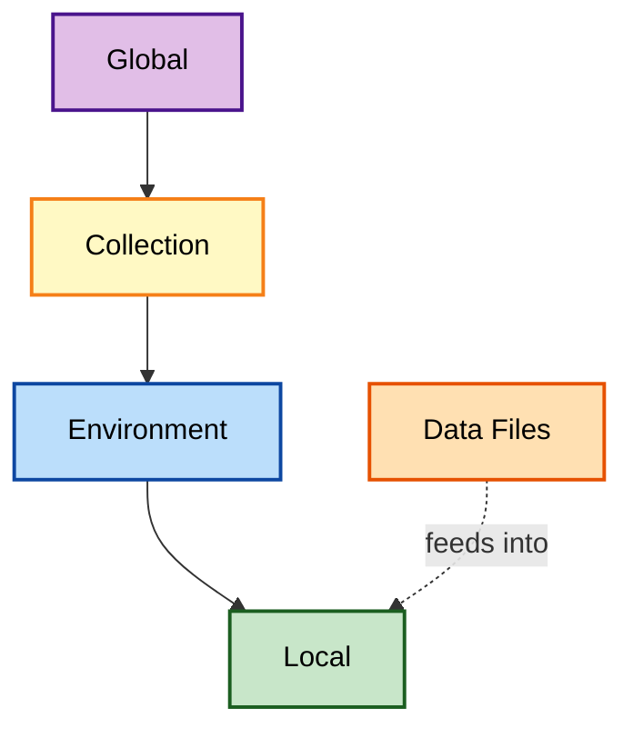
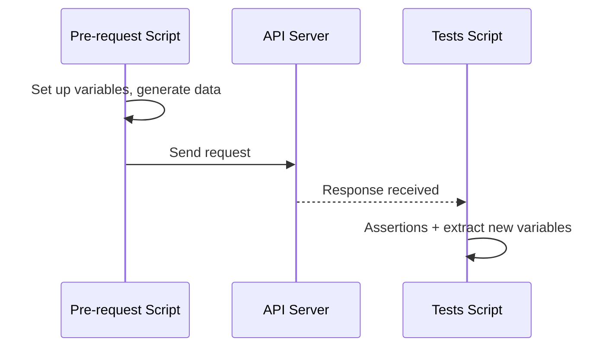

# Variables, Scripting, and Environments in Postman: How I Stopped Hardcoding Everything

There was a point in my API testing journey where every single request I built had values typed directly into the URL, the body, the headers — everywhere. Changing a base URL meant editing a dozen requests one by one. That changed the day I actually understood Postman variables, and it changed again when I combined them with scripting and environments. This post is my full breakdown of all three, written the way I wish someone had explained it to me the first time.

---

## Table of Contents

1. [Why Variables Changed Everything for Me](#why-variables-changed-everything-for-me)
2. [Understanding Variable Scopes](#understanding-variable-scopes)
3. [Creating and Using My First Variable](#creating-and-using-my-first-variable)
4. [Advanced Variable Strategies](#advanced-variable-strategies)
5. [Scripting: Pre-request and Tests](#scripting-pre-request-and-tests)
6. [Writing My First Test Script](#writing-my-first-test-script)
7. [Optimizing My Scripts](#optimizing-my-scripts)
8. [Dynamic Variable Techniques](#dynamic-variable-techniques)
9. [Environments: Why They Matter](#environments-why-they-matter)
10. [Building and Using an Environment](#building-and-using-an-environment)
11. [Advanced Environment Configuration](#advanced-environment-configuration)
12. [Managing Environments at Scale](#managing-environments-at-scale)
13. [A Full Worked Example: Variables + Scripts + Environments Together](#a-full-worked-example)
14. [Mistakes I Made](#mistakes-i-made)
15. [Wrapping Up](#wrapping-up)

---

## Why Variables Changed Everything for Me

Before variables, my workflow looked like this: copy a request, paste a new URL, manually change three or four values, send it, repeat. It worked, but it didn't scale, and it definitely didn't survive a switch from a test environment to production without a lot of tedious find-and-replace.

Variables solved four problems for me at once:

| Problem | How Variables Fixed It |
| --- | --- |
| Repeating the same value everywhere | Set it once, reference it with `{{variableName}}` everywhere |
| Switching between test/prod | Change one variable instead of every request |
| Feeding different inputs into the same test | Swap variable values instead of rebuilding requests |
| Messy, hard-to-read requests | Replaced long hardcoded strings with clean, meaningful names |

```mermaid
flowchart LR
    A[Hardcoded Value<br/>in every request]:::bad -->|Refactor| B[Single Variable<br/>{{baseUrl}}]:::good
    B --> C[Request 1]:::use
    B --> D[Request 2]:::use
    B --> E[Request 3]:::use

    classDef bad fill:#ffcdd2,stroke:#b71c1c,stroke-width:2px,color:#000
    classDef good fill:#c8e6c9,stroke:#1b5e20,stroke-width:2px,color:#000
    classDef use fill:#bbdefb,stroke:#0d47a1,stroke-width:2px,color:#000
```

---

## Understanding Variable Scopes

This was the part that took me the longest to really internalize. Postman variables exist at different levels, and the level determines where they're accessible and how long they live.

| Scope | Where It's Accessible | Lifespan | Typical Use |
| --- | --- | --- | --- |
| **Global** | Anywhere in my workspace | Persists until I clear it | Values shared across every project |
| **Collection** | Any request within that Collection | Persists with the Collection | API base URL, shared auth token |
| **Environment** | Requests while that environment is active | Persists until changed or environment switched | Per-environment config (dev, staging, prod) |
| **Local** | Only within the current request/script execution | Cleared after the run | Temporary, throwaway values |
| **Data** | Pulled from external CSV/JSON files | Per test-data row | Data-driven testing inputs |



> **Note:** When the same variable name exists in multiple scopes, Postman resolves it using a priority order — local beats data, which beats environment, which beats collection, which beats global. I learned this the hard way after wondering why my "global" change wasn't taking effect — a local variable was quietly overriding it.

---

## Creating and Using My First Variable

Here's exactly what I did to create a global `baseUrl` variable:

1. Clicked the **eye icon** next to my workspace name
2. Selected **Globals**
3. Clicked **+** to add a new variable
4. Named it `baseUrl`
5. Set its initial value to `https://reqres.in/api`

Then, in any request, instead of typing the full URL, I wrote:

```
{{baseUrl}}/users/2
```

Postman highlights recognized variables in orange, which is a small but genuinely useful visual cue — if a variable name *isn't* orange, that's my signal something's misspelled or out of scope.

I tested this directly:

```bash
# Manually resolving what {{baseUrl}}/users/2 becomes
curl -s -X GET "https://reqres.in/api/users/2"
```

Response:

```json
{
  "data": {
    "id": 2,
    "email": "janet.weaver@reqres.in",
    "first_name": "Janet",
    "last_name": "Weaver"
  }
}
```

---

## Advanced Variable Strategies

### Strategy 1 — Dynamic Data Generation

Postman ships with built-in dynamic variables I can drop straight into a request body:

| Dynamic Variable | What It Generates |
| --- | --- |
| `{{$randomString}}` / `{{$randomAlphaNumeric}}` | Random text |
| `{{$timestamp}}` | Current Unix timestamp |
| `{{$guid}}` | A globally unique identifier |

```json
{
  "name": "Test User - {{$randomString}}",
  "email": "user{{$timestamp}}@example.com"
}
```

### Strategy 2 — Combining Variables

I can nest variables inside each other for flexible URL building:

```
{{baseUrl}}/{{usersEndpoint}}
```

If `baseUrl` is `https://reqres.in/api` and `usersEndpoint` is `users`, this resolves to `https://reqres.in/api/users` — and I only ever need to update one piece if either part changes.

### Strategy 3 — Data-Driven Testing With External Files

For running the same request against many different inputs, I use a CSV:

```csv
username,password
user123,testpass
testuser,securepassword
```

Then reference `{{username}}` and `{{password}}` in my request, and run the whole Collection with that file attached via the Collection Runner — Postman loops through every row automatically.

### Strategy 4 — Variables in Authorization

I always store tokens as variables rather than pasting them directly:

```
Authorization: Bearer {{bearerToken}}
```

> **Caution:** I never hardcode a real API key or token as plain text inside a request I might export or share. I keep secrets in environment variables (ideally marked as "secret" type in Postman) so they don't end up committed to a shared Collection file.

---

## Scripting: Pre-request and Tests

Once I understood variables, scripting is what let me actually automate logic around them. Postman gives me two script hooks per request:



| Script | When It Runs | What I Use It For |
| --- | --- | --- |
| **Pre-request Script** | Before the request is sent | Setting variables, generating dynamic data, custom headers |
| **Tests Script** | After the response arrives | Assertions, extracting data, controlling test flow |

---

## Writing My First Test Script

Here's the very first test I ever wrote, in the **Tests** tab:

```javascript
pm.test("Status code is 200", function () {
    pm.response.to.have.status(200);
});
```

Breaking it down:

- `pm.` — accesses Postman's scripting API
- `.test(name, fn)` — registers a named test with a function
- `pm.response.to.have.status(200)` — a built-in assertion (uses Chai.js syntax under the hood)

I tested this against a real request:

```bash
curl -s -o /dev/null -w "%{http_code}" "https://reqres.in/api/users/2"
```

Output: `200` — which meant my test script would pass.

---

## Optimizing My Scripts

As my test suites grew, I started noticing scripts that were slow, repetitive, or just messy. Here's what I focused on cleaning up.

### Reduce Redundant Code

Instead of parsing the same response repeatedly:

```javascript
// Before — parsing twice
var jsonData = pm.response.json();
pm.environment.set("userId", jsonData.data.id);
var jsonData2 = pm.response.json();
console.log(jsonData2.data.email);
```

I consolidated it:

```javascript
// After — parse once, reuse
const jsonData = pm.response.json();
pm.environment.set("userId", jsonData.data.id);
console.log(jsonData.data.email);
```

### Use Functions for Repeated Logic

```javascript
function extractAndStore(field, varName) {
    const data = pm.response.json();
    pm.environment.set(varName, data[field]);
}

extractAndStore("id", "userId");
```

### Choose the Right Variable Scope

| If the value... | Use this scope |
| --- | --- |
| Applies to my entire workspace | Global |
| Only matters within one Collection | Collection |
| Changes between dev/staging/prod | Environment |
| Is only needed for one script run | Local |

> **Note:** I try to keep scripts readable over "clever." A slightly longer script with clear comments has saved me far more time than a compact one-liner I had to re-decipher six months later.

---

## Dynamic Variable Techniques

### Extracting Values From Responses

```javascript
let jsonData = pm.response.json();
pm.environment.set("orderId", jsonData.order.id);
```

### Generating Unique Values

```javascript
let timestamp = Date.now();
pm.collectionVariables.set("testRunTimestamp", timestamp);
```

### Variable Chaining

```javascript
let emailDomain = pm.environment.get("defaultDomain");
let username = pm.globals.get("testUsername");
let fullEmail = username + "@" + emailDomain;
pm.environment.set("userEmail", fullEmail);
```

### Conditional Logic

```javascript
if (pm.response.code === 200) {
    pm.environment.set("orderStatus", "success");
} else {
    pm.environment.set("orderStatus", "failed");
}
```

I tested a version of this pattern against Reqres:

```javascript
pm.test("Set status based on response code", function () {
    if (pm.response.code === 200) {
        pm.environment.set("lastCallStatus", "success");
    } else {
        pm.environment.set("lastCallStatus", "failed");
    }
    pm.expect(pm.environment.get("lastCallStatus")).to.be.oneOf(["success", "failed"]);
});
```

> **Caution:** `console.log()` is genuinely one of the most useful debugging tools in the Postman sandbox. I use it constantly when a variable isn't resolving the way I expect — checking the Postman Console (View → Show Postman Console) has saved me more time than almost any other single habit.

---

## Environments: Why They Matter

Once I had variables and scripts working well, environments were the natural next step — they're essentially named containers of variables I can switch between with one click.

| Reason | Why It Matters to Me |
| --- | --- |
| **Agility** | No hardcoded values that differ per environment |
| **Test accuracy** | I test against the right target, catching issues before production |
| **Organization** | Each environment's config stays cleanly separated |
| **Collaboration** | I can share a consistent setup with my team |

```mermaid
flowchart LR
    Dev[Development Environment<br/>baseUrl: dev.example.com]:::dev
    Stage[Staging Environment<br/>baseUrl: staging.example.com]:::stage
    Prod[Production Environment<br/>baseUrl: api.example.com]:::prod
    R[Same Request:<br/>GET {{baseUrl}}/users]:::request

    Dev -.->|active| R
    Stage -.->|active| R
    Prod -.->|active| R

    classDef dev fill:#c8e6c9,stroke:#1b5e20,stroke-width:2px,color:#000
    classDef stage fill:#ffe0b2,stroke:#e65100,stroke-width:2px,color:#000
    classDef prod fill:#ffcdd2,stroke:#b71c1c,stroke-width:2px,color:#000
    classDef request fill:#bbdefb,stroke:#0d47a1,stroke-width:2px,color:#000
```

---

## Building and Using an Environment

### Step 1 — Create It

1. Click the **eye icon** next to the workspace name
2. Click **+ Add Environment**
3. Name it (e.g., `"Development"`)
4. Add variables: `baseUrl`, `apiKey`, `testUsername`, etc.

### Step 2 — Activate It

In the top-right dropdown, I select the environment I want active. Every `{{variable}}` in my requests now resolves using that environment's values.

### Example Setup I Actually Used

| Environment | `baseUrl` | `apiKey` |
| --- | --- | --- |
| Development | `https://reqres.in/api` | *(not required)* |
| Production (hypothetical) | `https://my-company-api.com/v2` | `xxxxxxxxxxxxx` |

### Best Practices I Follow

- Keep dedicated environments for at least dev, staging, and production
- Use clear, descriptive names (`"Dev - Product Catalog API"`, not `"env1"`)
- Never store real secrets in plaintext inside a Collection or environment file I might share or commit
- Consider version-controlling environment exports for complex, team-based projects

---

## Advanced Environment Configuration

### Environment Inheritance

I create a **Base** environment for anything shared across all environments, then set specific ones (Dev, Staging, Prod) to "inherit from" it. Change something in Base, and every inheriting environment updates automatically — huge time-saver for things like a shared API version number.

### Initial Value vs. Current Value

Every environment variable actually has two values:

| Column | Meaning |
| --- | --- |
| **Initial Value** | The default, and what it resets to |
| **Current Value** | Can be changed temporarily during a test run via scripts or the UI |

I use this for things like setting a fresh `testUserId` via a pre-request script right before a test, without permanently altering the environment's stored default.

### Environment-Specific Logic

```javascript
let environment = pm.environment.get("environmentName");

if (environment === "Development") {
    // dev-specific behavior
} else if (environment === "Staging") {
    // staging-specific behavior
}
```

### Switching Environments From a Script

```javascript
pm.environment.set("activeEnvironment", "Production");
```

> **Caution:** I use this one sparingly. Changing environment context mid-script can make test results genuinely confusing to reason about later — I only do this intentionally, and I document exactly why in a comment when I do.

---

## Managing Environments at Scale

Once I started working with a team, a few extra practices became necessary:

### Version Control

I export environments as JSON and store them in Git, giving me a real history of who changed what and when.

### Sharing

A shared Postman workspace is the simplest way for a team to stay in sync. For more controlled sharing, explicit export/import works too.

### Environment-as-Code (Advanced)

For more complex setups, I've seen teams template environment files and generate them programmatically:

```json
{
  "name": "My API - {{environmentName}}",
  "values": [
    { "key": "baseUrl", "value": "{{baseUrl}}" }
  ]
}
```

### Security

| Do | Don't |
| --- | --- |
| Mark sensitive variables as "secret" type in Postman | Store API keys/passwords in plain, version-controlled files |
| Use a secret manager for production credentials | Paste raw tokens directly into shared Collections |

---

## A Full Worked Example

Here's how variables, scripts, and environments came together in a real test I built — creating a user with a unique email, then verifying it:

**Pre-request Script:**

```javascript
const timestamp = Date.now();
pm.environment.set("uniqueEmail", `testuser_${timestamp}@example.com`);
```

**Request Body:**

```json
{
  "name": "Test User",
  "email": "{{uniqueEmail}}"
}
```

**Request (tested against Reqres):**

```bash
curl -s -X POST "https://reqres.in/api/users" \
  -H "Content-Type: application/json" \
  -d '{"name": "Test User", "email": "testuser_1758623456@example.com"}'
```

Response:

```json
{
  "name": "Test User",
  "email": "testuser_1758623456@example.com",
  "id": "789",
  "createdAt": "2026-09-23T10:45:12.001Z"
}
```

**Tests Script:**

```javascript
pm.test("User created successfully", function () {
    pm.response.to.have.status(201);
});

pm.test("Email matches the unique generated value", function () {
    const data = pm.response.json();
    const expectedEmail = pm.environment.get("uniqueEmail");
    pm.expect(data.email).to.eql(expectedEmail);
});

pm.environment.set("createdUserId", pm.response.json().id);
```

Every single time I run this, it generates a brand-new email, sends the request, verifies the response, and stores the new ID — with zero manual editing required.

---

## Mistakes I Made

1. **Assuming Global variables always win** — they don't; local and environment-scoped variables take priority, which caused confusing "why isn't my change working" moments.
2. **Hardcoding a real token during testing** — and almost sharing that Collection with a teammate. I now always use `{{authToken}}` and mark it as secret.
3. **Over-optimizing scripts too early** — I once spent an hour "optimizing" a script that ran twice a day and saved milliseconds. Readability would've served me better.
4. **Forgetting to reset Current Values** — I left a temporary "Current Value" override in an environment and spent way too long confused about why a request wasn't matching its Initial Value.
5. **Switching environments mid-script without documenting why** — future me (and my teammates) had no idea what was happening.

> **Note:** The Postman Console (View → Show Postman Console) became one of my most-used tools once I started writing more complex scripts. If a variable isn't behaving the way I expect, that's always my first stop.

---

## Wrapping Up

Variables, scripting, and environments are the three tools that took my Postman usage from "manually clicking send over and over" to something that genuinely resembles an automated test suite. Variables gave me reusability, scripting gave me logic and automation, and environments gave me a clean way to move between dev, staging, and production without rebuilding anything.

If you're where I was — copy-pasting the same URL into request after request — my honest suggestion is to start small: create one global `baseUrl` variable, use it in a handful of requests, and get comfortable with how it resolves. Everything else here builds naturally on top of that first step.

### Additional Resources I Actually Use

- [Postman Variables Documentation](https://learning.postman.com/docs/sending-requests/variables/)
- [Dynamic Variables in Postman](https://learning.postman.com/docs/designing-and-developing-your-api/testing-your-api/dynamic-variables/)
- [Data-Driven Testing With Postman](https://learning.postman.com/docs/designing-and-developing-your-api/testing-your-api/data-driven-testing/)
- [Postman Sandbox API Reference](https://learning.postman.com/docs/writing-scripts/script-references/postman-sandbox-api-reference/)
- [Postman Environments Documentation](https://learning.postman.com/docs/sending-requests/managing-environments/)
- [MDN: Regular Expressions Guide](https://developer.mozilla.org/en-US/docs/Web/JavaScript/Guide/Regular_Expressions)

---

*Thanks for reading — if you want to try this yourself, start with the worked example above. Build one request that generates a unique email in a pre-request script, sends it, and asserts on the result in the tests script. Once that clicks, variables, scripting, and environments stop feeling like three separate features and start feeling like one connected workflow.*
