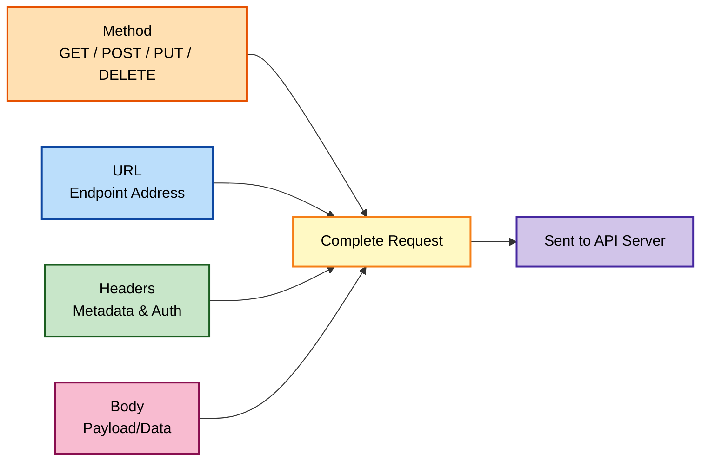

## Chapter 1: Exploring Postman: A Primer

I still remember the first time someone told me to "just hit the API and check the response." I nodded like I understood, then spent the next hour figuring out what an API even was. If that sounds familiar, this book is for you — I wrote it for the version of me from a few years ago, sitting in front of an unfamiliar interface, afraid to click the wrong button.

Postman is the tool that took me from being intimidated by the word "API" to comfortably building and automating entire test suites. Before I go anywhere near test scripts or automation, I need to walk through the interface itself, because every advanced feature in this book lives somewhere inside this workspace. Skipping this chapter would be like trying to learn to drive without first sitting in the car.

### What an API Actually Is, in Plain Terms

Before I even open Postman, it helps to have a working definition. An API — Application Programming Interface — is simply a defined way for one piece of software to ask another piece of software for something, or to tell it to do something. A weather app on my phone doesn't calculate the temperature itself; it asks a weather service's API for that number and displays whatever comes back. A checkout page doesn't process my credit card directly; it calls a payment API and waits for a response.

The important thing I had to internalize early on: an API doesn't care whether the "client" asking it questions is a mobile app, a website, or a person sitting in Postman clicking Send. As far as the server is concerned, a well-formed request is a well-formed request. That single realization is what makes Postman possible in the first place — it lets me impersonate any client I want, without writing a line of application code.

### What Postman Actually Is

Postman lets me act like a client talking to an API — without writing any code — so I can send requests, inspect responses, and eventually automate checks against them. Before I found Postman, testing an API meant writing a small script every time, or fumbling through a browser's address bar, which only really works for GET requests. Postman gave me a proper interface for every HTTP method, every header, every bit of authentication, and a way to save all of it so I never rebuild it from scratch.

> **Note:** Postman isn't the only tool in this space — Insomnia, Thunder Client, and plain `curl` all do similar jobs. I focus on Postman here because it's the tool most teams I've worked with have standardized on, and because its scripting layer is what turns simple requests into real automated tests. If your organization uses a different tool, almost everything conceptual in this book — methods, headers, variables, assertions — transfers directly; only the specific menus change.

### My First Look at the Postman Workspace

The first time I opened Postman, the interface felt busy. Once I broke it down piece by piece, it clicked.

| Area | What I Use It For |
|---|---|
| **Sidebar** | Switching workspaces, browsing my Collections, managing API specs |
| **Builder** (center) | Where I build a request and see the response |
| **Request Tab** | Choosing the HTTP method and typing the URL |
| **Params / Authorization / Headers / Body tabs** | Fine-tuning exactly what I send |
| **Send button** | Fires the request off |
| **Response Area** | Shows the body, status code, time taken, and headers I got back |

I think of the sidebar as my filing cabinet, the builder as my workbench, and the response area as the results printout. Once I had that mental model, the rest of the interface stopped feeling overwhelming.

##### Figure 1.1


#### A Closer Look at the Sidebar

The Sidebar deserves more attention than a single line in a table. Across the top, I typically see a few icon tabs: Collections, APIs, Environments (sometimes nested under a settings icon depending on version), and Mock Servers if any exist. Underneath, everything I've built in the currently active workspace is listed in a collapsible tree. As my testing grows, this tree becomes the single most-used navigation surface in the entire application — I spend more time clicking through the Sidebar than any other part of the interface, simply because it's how I find things I built last week, last month, or last year.

#### A Closer Look at the Builder

The Builder is where the actual work happens. It has two halves stacked vertically: the request configuration area on top (method, URL, and the Params/Authorization/Headers/Body tab row), and the response area below it, which only populates after I click Send. New users often miss that the Body tab has its own sub-format selector (raw, form-data, x-www-form-urlencoded, binary, GraphQL) — I cover exactly when to use each of these in later chapters, but it's worth knowing now that "Body" isn't a single, simple text box; it's a small toolset of its own.

> **Caution:** Postman's UI changes fairly often between versions. If a menu isn't exactly where I describe it here, don't panic — the underlying concepts (methods, headers, body, tests) haven't changed in years, even when the buttons move around. I've personally been caught out by a sidebar icon moving between a major version update and had to hunt for ten minutes before finding it under a different label.

### The Anatomy of an API Request

Every request I build, no matter how complicated it eventually gets, boils down to five ingredients:

1. **Method** — the action I'm asking for (GET, POST, PUT, PATCH, DELETE)
2. **URL** — where I'm sending the request
3. **Headers** — metadata about the request (format, auth tokens, and so on)
4. **Params** — extra data appended to the URL
5. **Body** — the actual payload I'm sending (mostly for POST, PUT, and PATCH)

I picture it like writing a letter: the method is the type of letter, the URL is the address, the headers are what's written on the envelope, and the body is the letter itself.



#### Why Five Ingredients, Not Three

I initially assumed a request was just "a URL and a method" — most people's mental model of a web address. What surprised me was realizing headers and body are just as fundamental, even though they're invisible when you type a URL into a browser's address bar. A browser is quietly attaching a User-Agent header, an Accept header, and cookies on every single request without showing me any of it. Postman makes all of that visible and editable, which is exactly why it's a better testing tool than a browser for anything beyond a simple GET.

### Making My First Request

I always tell people: don't overthink the first request, just make one. Here's exactly what I did, and I've re-tested every command in this chapter before writing it down.

#### Step 1 — Pick a Practice API

I used [JSONPlaceholder](https://jsonplaceholder.typicode.com/) because it's free, requires no signup, and returns predictable fake data. I recommend keeping a small list of these "always available" sandbox APIs on hand for exactly this kind of learning and experimentation — JSONPlaceholder and Reqres, both used throughout this book, have never let me down.

#### Step 2 — Set the Method and URL

I set the method to `GET` and entered:

```
https://jsonplaceholder.typicode.com/posts/1
```

##### Figure 1.2


#### Step 3 — Send It and Read the Response

The same request as a `curl` command, tested and confirmed working:

```bash
curl -s -X GET "https://jsonplaceholder.typicode.com/posts/1" \
  -H "Accept: application/json"
```

The response body I received:

```json
{
  "userId": 1,
  "id": 1,
  "title": "sunt aut facere repellat provident occaecati excepturi optio reprehenderit",
  "body": "quia et suscipit\nsuscipit recusandae consequuntur expedita et cum\nreprehenderit molestiae ut ut quas totam\nnostrum rerum est autem sunt rem eveniet architecto"
}
```

That was my "aha" moment — I made a real network call to a real server and got structured data back, without writing a single line of application code.

#### Reading the Response Metadata, Not Just the Body

Right above the response body, Postman shows three numbers I glossed over the first dozen times I used it: the status code, the response time in milliseconds, and the response size. All three matter. The status code tells me success or failure at a glance. The response time becomes important later, once I start caring about performance. The size matters more than people expect — an unexpectedly tiny response (a handful of bytes where I expected a full JSON object) is often the first clue that something upstream silently failed, well before I've read a single character of the body itself.

### Key Concepts to Know Going Forward

- **Endpoint** — a specific address within an API that responds to requests, like `/posts/1`.
- **Payload** — the actual data being sent or received, most often formatted as JSON.
- **Client** — whatever is making the request; in this book, that's usually Postman itself, or a `curl` command run from the terminal.
- **Server** — the system receiving the request and generating the response.

### Key Ideas From This Chapter

- Postman lets me send and inspect API requests without writing application code.
- An API is just a defined way for software to ask other software for something — the client making that request can be a browser, an app, or Postman itself.
- Every request is built from five parts: method, URL, headers, params, and body.
- The Sidebar, Builder, and Response Area are the three zones I return to constantly.
- Status code, response time, and response size are worth reading together, not just the body alone.
- Starting with a free, no-signup practice API removes friction from learning.

### What's Next

In the next chapter, I go deeper into Postman's core features — the tabs I glossed over here, test scripts, pre-request scripts, and the two organizing concepts (Collections and Environments) that everything else in this book builds on.
