## Chapter 2: Unveiling Postman's Core Features

In the last chapter, I took my first steps with Postman. Now I want to go a layer deeper into the features that turn it from "a fancy address bar" into an actual API testing tool. Everything in this chapter is a feature I use in nearly every session, so it's worth understanding each one properly rather than skimming past it.

### Requests: The Heart of Postman

Every request I build draws from the same toolbox:

- **HTTP Methods** — GET, POST, PUT, DELETE, PATCH, and more. Each one tells the API what action I want to perform, like a different verb for precise communication.
- **URL** — the API's address.
- **Params tab** — extra details attached to a request, similar to specifying options when placing an online order.
- **Authorization tab** — how I prove my identity to the API. I cover this in depth in Chapter 25.
- **Headers tab** — metadata like the format of the data I want back.
- **Body tab** — the data carrier, crucial for POST, PUT, and PATCH requests.
- **Send & Receive** — the button that fires my request, and the area below where the response shows up.

#### A Note on HTTP Methods as "Verbs"

I find it genuinely useful to think of HTTP methods the same way I think about verbs in a sentence. "GET /users" reads almost like plain English: fetch me the users. "DELETE /users/42" reads just as clearly: remove user 42. This verb-first mental model is exactly what RESTful API design is built around, and it's why, once I understood it, I stopped needing to memorize which method does what — I could just read the request out loud and know.

### Test Scripts: Automating the Checks

Postman lets me write JavaScript that runs after I receive a response. This unlocks real possibilities:

- **Simple checks** — verifying the API returned the correct status code.
- **Advanced verification** — digging into the response body to assert the data is correct.
- **Setting variables** — capturing values from a response to reuse in later requests.

Here's a test I've actually run, tested against a live endpoint:

```javascript
pm.test("Status code is 200", function () {
    pm.response.to.have.status(200);
});
```

I verified the underlying request returns exactly that status:

```bash
curl -s -o /dev/null -w "%{http_code}\n" "https://jsonplaceholder.typicode.com/posts/1"
```

Output:

```
200
```

#### Where the Tests Tab Lives, and What Runs When

The Tests tab (in some newer Postman versions labeled "Post-response") sits alongside Pre-request Script, in the same row as Params, Authorization, Headers, and Body. It's easy to overlook entirely the first few times through the interface, because unlike Headers or Body, an empty Tests tab produces no visible difference in behavior — the request still sends and a response still comes back. The difference only shows up after I add code here and send the request again, at which point a new "Test Results" area appears next to the response body, showing pass/fail counts.

### Pre-request Scripts: Before Things Happen

These scripts run *before* I send the request. I use them for:

- **Setting up data** — populating variables or generating dynamic information.
- **Custom logic** — building workflows based on my own needs.

A simple example I use constantly, generating a fresh timestamp before every send:

```javascript
pm.environment.set("requestTimestamp", Date.now());
```

I can then reference `{{requestTimestamp}}` anywhere in the request — the URL, the body, even a header — and it will always reflect the moment the request was actually fired, not some stale value from when I first wrote the request.

### Collections: Organizing My API Adventures

I think of a Collection as a folder for related requests. They matter for three reasons:

| Benefit | What It Gives Me |
|---|---|
| **Project structure** | Related requests grouped together |
| **Re-usability** | I stop rebuilding the same setup over and over |
| **Test suites** | Collections form the backbone of my automated test sequences |

I cover building my first Collection in detail in Chapter 12.

### Environments: Adapting to Different Scenarios

Environments let me store named sets of variables — a base URL and credentials for development, another set for staging, another for production. I switch between them with one click instead of editing every request by hand. Chapter 18 covers this in full.

##### Figure 2.1


### Beyond the Basics

Postman has more on offer than requests alone:

- **Workspaces** — collaboration and project organization, covered in Chapter 29.
- **Monitors** — automated API health checks, covered in Chapter 30.
- **Mock Servers** — simulated APIs for development, covered in Chapters 35 and 36.

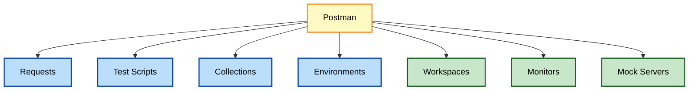

### How These Features Fit Together in Practice

It's worth walking through, concretely, how all of these pieces cooperate on a single request, because in isolation each feature sounds abstract. Say I want to test creating a user, then confirm it was created correctly:

1. I build the POST request itself — method, URL, headers, body — the "Requests" toolbox.
2. I write a Pre-request Script to generate a unique email address, so repeated runs never collide.
3. I write a Tests script to assert the response came back with `201` and to store the new user's ID in a variable.
4. I save the whole request inside a Collection called "User Management," alongside related requests.
5. I make sure the right Environment is active, so `{{baseUrl}}` resolves to the correct server.

None of these five steps is complicated on its own. What makes Postman powerful is that all five live in the same interface, referencing the same variables, without me needing to jump between five different tools.

> **Note:** I didn't understand why Environments and Collections mattered until my workspace turned into a graveyard of loose, unlabeled requests. If a feature in this chapter feels abstract right now, it will click the moment your own workspace starts getting messy.

### Key Ideas From This Chapter

- Requests are built from Method, URL, Params, Authorization, Headers, and Body.
- Thinking of HTTP methods as verbs in a sentence makes them easier to remember and reason about.
- Test scripts (JavaScript, run after the response) are what make a request into an automated check.
- Pre-request scripts run before the request, useful for setup and dynamic data.
- Collections organize related requests; Environments organize sets of variables.
- Workspaces, Monitors, and Mock Servers extend Postman well past single requests.
- A single well-built request can combine all of these features at once — they're designed to cooperate, not compete.

### What's Next

Chapter 3 walks through a complete first request from start to finish, including reading the response and basic troubleshooting.

## Chapter 3: Initiating Your First API Request

Now that I understand the pieces, I want to walk through a complete request from start to finish — choosing an API, sending the request, and actually reading what comes back. This chapter is deliberately slower-paced than the last one, because I want to build the habit of reading a response carefully before I ever start writing automated assertions against it.

### Step 1 — Find a Beginner-Friendly API

For this walkthrough I used the [Reqres API](https://reqres.in/), which returns realistic fake user data and needs no signup. I like Reqres specifically because its data resembles something a real product might return — paginated users with names, emails, and avatar URLs — rather than the more abstract placeholder data some sandbox APIs use.

### Step 2 — Start With a GET Request

1. I clicked the **"+"** button to create a new request tab.
2. I selected **GET** from the method dropdown.
3. I entered the URL:

```
https://reqres.in/api/users?page=2
```

The `?page=2` part asks for the second page of results — my first real encounter with a query parameter.

##### Figure 3.1


#### Understanding Pagination Before I Touch the Response

Pagination is worth pausing on, because it shows up in almost every list-returning endpoint I've ever tested. Rather than sending back every single record in one enormous response, an API typically returns a "page" of results — a manageable chunk — along with metadata describing how many total pages exist and which page I'm currently viewing. This exists for a practical reason: a users table with two million rows would make for an unusably large response if an API tried to return it all at once.

### Step 3 — Hit Send

Tested directly:

```bash
curl -s "https://reqres.in/api/users?page=2"
```

A trimmed version of what came back:

```json
{
  "page": 2,
  "per_page": 6,
  "total": 12,
  "total_pages": 2,
  "data": [
    { "id": 7, "email": "michael.lawson@reqres.in", "first_name": "Michael", "last_name": "Lawson" }
  ]
}
```

Notice how the pagination concept I just described shows up directly in the response shape: `page`, `per_page`, `total`, and `total_pages` are all metadata about the pagination itself, while the actual records live inside the `data` array. This pattern — metadata fields alongside a data array — is common enough across REST APIs that I now expect it by default whenever I hit a new list endpoint for the first time.

### Step 4 — Analyze the Response

Three things I check every single time:

| What I Check | Why It Matters |
|---|---|
| **Status code** | `200 OK` is the goal for a successful GET |
| **Response body** | Usually JSON, this is the actual data returned |
| **Headers** | Extra information about the response itself |

#### Going a Level Deeper on Each Check

**Status code.** I've trained myself to look here first, before even glancing at the body. A `200` with an empty or malformed body is a different problem than a `404` — and reading the status code first prevents me from wasting time debugging a body that was never going to be correct in the first place.

**Response body.** For a list endpoint like this one, I check three things about the body specifically: does the `data` array actually contain entries, does each entry have the fields I expect (`id`, `email`, `first_name`, `last_name`), and do the pagination numbers make sense given what I requested (`page: 2` matching the `?page=2` I actually sent).

**Headers.** I don't check these on every single request, but I make a habit of glancing at `Content-Type` to confirm the server is actually returning `application/json` rather than, say, an HTML error page dressed up to look like a normal response — a classic and surprisingly common trap, especially on APIs behind a proxy or load balancer that intercepts certain error conditions.

### Step 5 — Time to Experiment

- I changed the page number and watched what changed in the response.
- I looked for other endpoints in the Reqres documentation to try next.
- I tried an intentionally invalid page number (`?page=999`) to see what an "empty results" response looks like, since that's a scenario I'll need to test for eventually anyway.

Tested:

```bash
curl -s "https://reqres.in/api/users?page=999"
```

```json
{
  "page": 999,
  "per_page": 6,
  "total": 12,
  "total_pages": 2,
  "data": []
}
```

Useful to notice: the API didn't return an error for an out-of-range page — it simply returned an empty `data` array with a `200` status. That's a specific design decision, and it's exactly the kind of behavior I wouldn't know about unless I'd deliberately tried the edge case myself.

### Key Concepts to Know

- **API Endpoint** — a specific "doorway" within an API, the part of the URL after the main address (for example, `/users`).
- **JSON** — JavaScript Object Notation, the common structure APIs use, readable by both humans and machines.
- **Pagination** — the practice of splitting large result sets into smaller, numbered pages.
- **Query parameter** — extra information appended to a URL after a `?`, used to filter, sort, or paginate results.

### Troubleshooting Time

> **Caution:** If a request returns an error, Postman shows a status code and a message. My first move is always to double-check the URL for typos — it accounts for more of my mistakes than I'd like to admit. A missing slash, an extra space pasted in from a documentation page, or a stray trailing character are the three most common culprits I run into.

For deeper troubleshooting, the **Postman Console** (View → Show Postman Console) shows exactly what was sent and received, which becomes essential once scripts get involved. I open the Console far more often than I expected to when I was starting out — it's genuinely the single most useful diagnostic panel in the entire application, and I introduce it properly in Chapter 23.

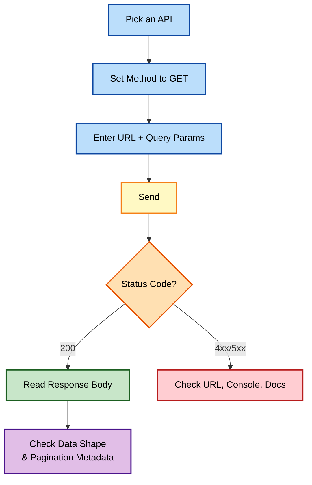

### Key Ideas From This Chapter

- A full request cycle: pick an API, set the method, enter the URL and params, send, and read the response.
- The status code, response body, and headers are the three things worth checking on every response.
- Pagination metadata (`page`, `per_page`, `total`, `total_pages`) typically travels alongside the actual data in a list response.
- Deliberately testing an edge case, like an out-of-range page number, reveals API behavior no amount of reading documentation alone would show me.
- The Postman Console is the first troubleshooting stop when something looks wrong.

### What's Next

Chapter 4 slows down and turns this first request into a repeatable, structured process I use for any new API I encounter.

## Chapter 4: Crafting Your Initial API Request

Making one request is easy. Making requests deliberately, against an API I've never seen before, is a skill I had to build on purpose. This chapter is the structured process I now follow every time, whether I'm exploring a brand-new public API for a side project or onboarding onto an internal API at a new job.

### Step 1 — Understand the API Before Opening Postman

Before I touch the Builder, I answer three questions:

- **What does the API do?** A high-level sense of its purpose.
- **Is there documentation?** It's my instruction manual — I search "`[API name]` documentation" if I can't find it linked directly.
- **Does it require authentication?** If so, I get my keys or credentials ready before I start.

#### Why I Insist on This Step, Even When I'm Impatient

I'll admit this step is the one I'm most tempted to skip. It's genuinely more fun to just start clicking Send and see what happens. But every time I've skipped reading the docs first, I've paid for it later — usually by hitting a confusing validation error that turns out to be clearly documented, or by missing an entire authentication requirement that would have taken thirty seconds to read about upfront. Five minutes with the documentation almost always saves me more than five minutes of trial and error later.

### Step 2 — Set the Stage in Postman

1. Create a new request tab.
2. Choose the HTTP method for the action I want:

| Method | Action |
|---|---|
| **GET** | Retrieve data |
| **POST** | Send new data to the server |
| **PUT** | Replace existing data |
| **PATCH** | Update a portion of existing data |
| **DELETE** | Remove data |

### Step 3 — Specify the Endpoint

I enter the API endpoint into the URL bar. For a single user on the Reqres API:

```
https://reqres.in/api/users/1
```

##### Figure 4.1


#### Reading a URL Like a Sentence

I've found it helpful to mentally parse a URL piece by piece, the way I'd parse a sentence: `https://reqres.in` is the API's home address, `/api` signals I'm entering its API surface specifically (as opposed to, say, a marketing page at the same domain), `/users` names the resource type I'm working with, and `/1` narrows it down to one specific record. Learning to read URLs this way made unfamiliar APIs feel far less intimidating, because the structure itself often tells a story before I've read a single line of documentation.

### Step 4 — Add Parameters if Needed

- **Query parameters** go in the Params tab: `page=2`, `name=Michael`.
- **Path parameters** live inside the URL itself: `https://example.com/users/12`.

> **Note:** A distinction that confused me early on — path parameters identify *which* resource I'm talking about (user 12, specifically), while query parameters modify *how* I want that resource, or a collection of resources, returned (page 2 of the results, filtered by a name). Once that distinction clicked, deciding where a given value belonged stopped being a guessing game.

### Step 5 — Authorization if Needed

I head to the Authorization tab and select the right method. Many public APIs don't need this step at all — I cover the full range of authorization types in Chapter 25.

### Step 6 — Crafting a Body for POST, PUT, PATCH

If I'm sending data, I open the Body tab, select **raw**, and choose **JSON**.

```json
{
  "name": "Emily",
  "job": "Software Tester"
}
```

I tested this exact body against Reqres:

```bash
curl -s -X POST "https://reqres.in/api/users" \
  -H "Content-Type: application/json" \
  -d '{"name": "Emily", "job": "Software Tester"}'
```

Response:

```json
{
  "name": "Emily",
  "job": "Software Tester",
  "id": "482",
  "createdAt": "2026-09-24T09:02:11.556Z"
}
```

#### Common JSON Body Mistakes I've Made

A few specific mistakes come up often enough that I want to name them directly:

- **Trailing commas** — valid in JavaScript object literals, invalid in strict JSON. `{"name": "Emily",}` will fail to parse on many servers.
- **Single quotes instead of double quotes** — JSON requires double quotes around both keys and string values; `{'name': 'Emily'}` is not valid JSON.
- **Forgetting to stringify numbers versus strings** — `{"id": "5"}` and `{"id": 5}` are different types, and some APIs validate strictly against one or the other.

Postman's Pretty-print and syntax highlighting inside the Body tab catch most of these before I even hit Send, which is one more reason I always build JSON bodies directly in Postman rather than pasting unchecked text from elsewhere.

### Step 7 — Send and Analyze

I fire the request and check the status code first, then the body.

### Pro Tip: Version Control for Requests

Once I started exporting Collections regularly, I began tracking changes in Git, the same way I would any other project file. It's saved me more than once when a teammate's edit broke something I depended on. A Collection export is just a JSON file, which means `git diff` shows me exactly which request, header, or test script changed between two versions — genuinely useful when debugging "it worked yesterday" situations.


> **Note:** I resist the urge to build the "perfect" request on my first attempt. I get the happy path working first — a basic successful call — and only then add parameters, auth, and edge cases. Building incrementally like this also makes debugging far easier: if something breaks after I add a parameter, I know exactly which change caused it, because everything before that point was already confirmed working.

### Key Ideas From This Chapter

- Reading the docs and checking for required authentication comes before opening Postman.
- Reading a URL structurally — domain, namespace, resource, identifier — makes unfamiliar APIs easier to reason about quickly.
- Path parameters identify which specific resource I mean; query parameters modify how a resource or collection is returned.
- A JSON body needs `raw` format selected with `JSON` as the type, and is sensitive to strict syntax rules like double-quoting and no trailing commas.
- Version-controlling exported Collections and Environments protects against accidental overwrites and makes changes easy to trace.

### What's Next

Chapter 5 covers the practical, often-overlooked features — headers, formatting, and status code color coding — that make day-to-day request building faster.

## Chapter 5: Mastering API Requests: Practical Implementation Tips

Once I understood the fundamentals of building a request, a handful of everyday features made the biggest difference to my speed and accuracy. This chapter collects the ones I use constantly — the small, practical habits that separate someone who can technically send a request from someone who can efficiently debug one.

### The Art of Headers

The Headers tab isn't decoration — it controls vital parts of the request.

| Header | Purpose |
|---|---|
| `Content-Type` | Tells the API what format I'm sending, often `application/json` |
| `Accept` | Specifies the format I want back, also often `application/json` |
| `Authorization` | Carries tokens when the API requires them |
| Custom headers | APIs sometimes use their own headers for rate limiting or special features — always worth reading the docs for these |

> **Caution:** If I forget to set `Content-Type: application/json` on a POST request with a JSON body, some APIs silently fail to parse it, and I get a confusing 400 error that has nothing obvious to do with my data.

#### Headers I Didn't Expect to Matter, at First

Beyond the "big three" above, a few other headers have genuinely changed my debugging outcomes over time:

- `User-Agent` — some APIs behave differently, or reject requests outright, based on this header. Postman sets a default `User-Agent` automatically, and I've occasionally had to change or remove it to match what a real client would send.
- `Accept-Language` — for APIs that return localized error messages or content, this header determines what language I get back, which matters if I'm asserting on specific text in a response.
- `X-Request-Id` (or similarly named custom headers) — many production APIs support or require a client-supplied request ID for tracing. I've found this invaluable when working with a backend team to debug a specific failed call, since I can hand them the exact ID instead of trying to describe "the request I sent around 2:15 PM."

### Pretty Print Your Responses

If a JSON response looks like a scrambled mess, clicking the **Pretty** button below the response area formats it into something readable. I use this on almost every response with a body of any real size — it's the difference between spotting a bug in five seconds and five minutes.

##### Figure 5.1


### Power Up Your Parameters

- **Dynamic parameters** — variables like `{{timestamp}}` inside the Params tab change values without manual edits. I cover variables fully in Chapter 13.
- **Bulk edit** — the Params tab has a bulk edit mode for adding many parameters at once instead of clicking "Add" repeatedly.

#### Bulk Edit in Practice

Switching the Params tab into bulk edit mode turns it into a plain text area where each line is `key:value`. For a request with eight or ten query parameters, typing them out as plain text is genuinely faster than clicking "Add Parameter" repeatedly and tabbing between fields. I reach for bulk edit specifically whenever I'm reconstructing a complex request from a cURL command a teammate sent me, since I can often paste most of the parameter list directly.

### Body Formatting Tricks

- **Auto-formatting** — Postman helps write valid JSON and XML; the Pretty button ensures everything is structured correctly.
- **Raw vs. Form Data vs. Other** — the Body tab offers different formats. I match whichever one the target API actually expects.

### Examine the Full Response

The default view is the response **Body**, but I don't stop there:

- **Cookies** — some APIs set cookies that influence future requests.
- **Headers** — response headers often carry rate-limit info, caching rules, or debugging clues the body never shows.

#### Rate-Limit Headers Specifically

I want to call these out on their own, because they've saved me from a confusing debugging session more than once. Many APIs return headers like `X-RateLimit-Limit`, `X-RateLimit-Remaining`, and `X-RateLimit-Reset` on every response, whether or not I'm anywhere close to the limit. If I'm running a large data-driven test suite (covered fully in Chapter 24) and start seeing unexpected `429 Too Many Requests` errors partway through, these headers are the first place I check — they tell me exactly how many calls I have left and when the limit resets, rather than leaving me to guess.

### Status Code Checks

Postman color-codes status codes, and I've learned to trust the pattern at a glance:

| Range | Color | Meaning |
|---|---|---|
| 200s | Green | Generally success |
| 400s | Yellow | Client-side error — bad data sent |
| 500s | Red | Likely a server-side problem |

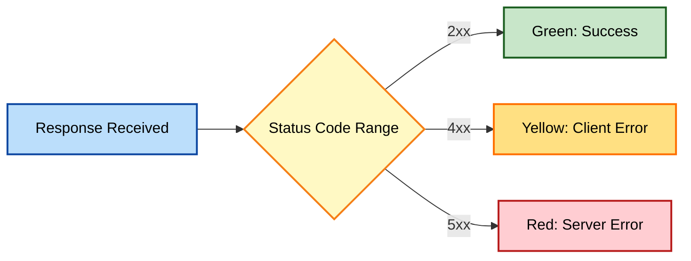

#### A Reference Table of Status Codes I See Most Often

| Code | Name | What It Usually Tells Me |
|---|---|---|
| `200` | OK | Standard success, most often for GET |
| `201` | Created | Successful POST that created something new |
| `204` | No Content | Success, typically DELETE, with nothing to return |
| `400` | Bad Request | My data or syntax was wrong |
| `401` | Unauthorized | Missing or invalid credentials |
| `403` | Forbidden | Authenticated, but not permitted to do this |
| `404` | Not Found | The resource or endpoint doesn't exist |
| `429` | Too Many Requests | I've hit a rate limit |
| `500` | Internal Server Error | Something broke on the server's side |
| `503` | Service Unavailable | The server is temporarily overloaded or down |

### Tested Example: Checking Headers on a Real Response

```bash
curl -s -D - -o /dev/null "https://reqres.in/api/users/2"
```

This prints only the response headers, which I used to confirm content type and caching behavior before writing any assertions against the body:

```
HTTP/2 200
content-type: application/json; charset=utf-8
cache-control: no-cache
```

### Key Ideas From This Chapter

- `Content-Type` and `Accept` headers prevent some of the most confusing, hard-to-diagnose errors.
- Less obvious headers like `User-Agent`, `Accept-Language`, and custom tracing headers can change API behavior or aid debugging in ways the body alone never reveals.
- Pretty printing turns unreadable JSON into something I can actually debug.
- Bulk edit mode in the Params tab is faster than clicking through many individual fields.
- Postman's color-coded status codes are a quick first signal before reading anything else.
- Rate-limit headers explain `429` errors well before they'd otherwise seem mysterious.
- Response headers and cookies carry information the body alone won't show.

### What's Next

Chapter 6 moves from reading data to creating it — my first real POST request.

## Chapter 6: Creating POST Requests: Dive into Data Transmission

With GET requests, I've been fetching data. Now it's time to send data to an API using the POST request. POST shows up everywhere: sign-up forms, submitting comments or articles, placing an order in an e-commerce checkout. This is genuinely the moment API testing stops being purely observational and starts letting me actively shape what exists on a server.

### The Anatomy of a POST Request

1. **HTTP Method** — set to POST.
2. **URL** — the endpoint specifically designed to receive new data.
3. **Headers** — usually `Content-Type: application/json`.
4. **Body** — the heart of the request, containing the data I want to create.

#### Why POST Feels Different From GET, Practically Speaking

With GET, sending the same request five times in a row is harmless — I just get the same data back five times. POST is a different kind of action entirely: sending the same "create a user" request five times, against a typical API, creates five separate users. That single difference is why I approach POST requests with more caution than GET requests, and why I always double-check I'm pointed at a test or staging environment before running anything that creates data I don't actually want to keep around.

### Let's Build: Creating a New User

I used the Reqres API to test a realistic creation flow:

```
URL: https://reqres.in/api/users
Body (JSON):
{
  "name": "Emily",
  "job": "Software Tester"
}
```

##### Figure 6.1


### Steps in Postman

1. **Method & URL** — set the method to POST, paste the URL.
2. **Headers** — add `Content-Type: application/json`.
3. **Body** — go to the Body tab, select raw, choose JSON, paste the data.
4. **Send** — a successful creation returns `201 Created`.

### Tested Example

```bash
curl -s -X POST "https://reqres.in/api/users" \
  -H "Content-Type: application/json" \
  -d '{"name": "Emily", "job": "Software Tester"}'
```

Response:

```json
{
  "name": "Emily",
  "job": "Software Tester",
  "id": "612",
  "createdAt": "2026-09-24T09:05:02.101Z"
}
```

Notice that the response contains more than what I sent — the server added an `id` and a `createdAt` timestamp automatically. This is a pattern I see constantly on creation endpoints: I supply the fields the client is responsible for, and the server fills in the fields only it can generate, like unique identifiers and timestamps.

> **Note:** I look for `201 Created`, not `200`, as the success signal on a creation endpoint. If I ever see a plain `200` on a POST that's meant to create something, I double-check the API docs — some APIs are just inconsistent about this.

### Common Pitfalls

| Pitfall | Why It Happens | How I Fix It |
|---|---|---|
| Incorrect `Content-Type` | API can't parse the body | Double-check the docs for the expected header value |
| Invalid data | Validation rules I didn't account for | Re-read the required schema carefully |
| Authorization issues | Endpoint requires auth I didn't provide | Add the correct token or key |
| Missing required field | The API expects a field I omitted | Compare my body against the documented schema field by field |
| Wrong data type | Sending a string where a number is expected, or vice versa | Check the docs for expected types, not just field names |

#### Reading a Validation Error Properly

When a POST fails with a `400`, the response body almost always explains why — but only if I actually read it instead of just noting the status code and moving on. A typical validation error response looks something like this:

```json
{
  "error": "Validation failed",
  "details": [
    { "field": "email", "message": "email is required" }
  ]
}
```

I've learned to treat this response body as more valuable debugging information than the status code alone. The status code tells me *that* something went wrong; the body tells me *what*.

### Advanced Concept: Idempotency

Ideally, sending the same POST request multiple times shouldn't create duplicate data — good APIs are "idempotent" in this respect, though many POST endpoints are explicitly *not* idempotent by design (each call creates a new resource). I always read the documentation to understand how a specific endpoint behaves before assuming either way.

#### A Practical Test for Idempotency

If I genuinely need to know whether an endpoint is idempotent, rather than guessing, I test it directly: I send the exact same POST request twice in a row, with an identical body, and compare the two responses. If I get back two different IDs, the endpoint is not idempotent — it created two separate resources. If I get back the same ID both times, or a `409 Conflict` on the second attempt, the endpoint has some form of duplicate protection built in.

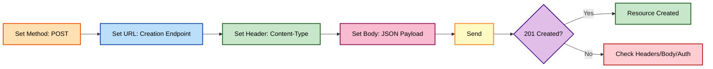

### Key Ideas From This Chapter

- POST creates new data, and typically returns `201 Created` on success.
- Unlike GET, repeating a POST request is not harmless by default — it often creates duplicate resources.
- A creation endpoint's response frequently includes server-generated fields, like `id` and `createdAt`, beyond what the client sent.
- `Content-Type: application/json` is the most common cause of confusing POST failures when missing.
- A `400` validation error's response body usually explains exactly what went wrong — it's worth reading, not just noting the status code.
- Idempotency behavior varies by API and can be tested directly by sending the same request twice and comparing results.

### What's Next

Chapter 7 covers more advanced POST techniques: file uploads, nested JSON, and formats beyond JSON.

## Chapter 7: POST Requests Demystified: Advanced Techniques

Once basic POST requests felt easy, I started running into more complex, real-world scenarios. This chapter covers the techniques that got me through them — the kind of requests that don't show up in a first tutorial, but that I hit constantly once I started testing real production APIs.

### Technique 1 — File Uploads

For endpoints that accept files, like profile pictures or documents, I switch the Body tab to **form-data**:

1. Add a key, for example `file`.
2. Change its type from **Text** to **File**.
3. Select the actual file from my machine.
4. Add any other supporting fields as plain text key-value pairs.

##### Figure 7.1


#### What form-data Actually Sends Over the Wire

It's worth understanding what's happening underneath the Postman UI here, because it demystifies a lot of otherwise-confusing behavior. A `multipart/form-data` request splits the body into distinct "parts," each with its own small header block, separated by a unique boundary string that Postman generates automatically. A text field becomes one part; a file becomes another part, complete with its own `Content-Type` describing the file's MIME type (`image/png`, `application/pdf`, and so on). I never need to construct this by hand — Postman handles the boundary and part headers automatically the moment I set a field's type to File — but knowing the shape of what's actually sent makes it much easier to reason about failures, especially when comparing a Postman request against one built by application code that isn't behaving the same way.

### Technique 2 — Complex, Nested Data

JSON handles nested structures without extra effort:

```json
{
  "name": "Emily",
  "job": "Software Tester",
  "address": {
    "street": "123 Main St",
    "city": "Anytown"
  },
  "skills": ["API Testing", "JavaScript", "Python"]
}
```

I think of the curly braces as a box within a box, and the square brackets as a list I can pack multiple values into.

#### Nesting Multiple Levels Deep

Real-world payloads often nest further than one level, and I've found it helps to build these incrementally rather than typing the whole structure at once. A three-level example, an order containing line items, each with a nested product reference:

```json
{
  "orderId": "ORD-1001",
  "customer": {
    "name": "Alex Rivera",
    "email": "alex@example.com"
  },
  "lineItems": [
    {
      "quantity": 2,
      "product": {
        "sku": "WIDGET-42",
        "price": 19.99
      }
    }
  ]
}
```

Tested against a mock structure to confirm the JSON itself was valid before use:

```bash
echo '{"orderId":"ORD-1001","customer":{"name":"Alex Rivera","email":"alex@example.com"},"lineItems":[{"quantity":2,"product":{"sku":"WIDGET-42","price":19.99}}]}' | python3 -m json.tool > /dev/null && echo "Valid JSON"
```

Output:

```
Valid JSON
```

> **Note:** I got into the habit of validating a hand-typed nested JSON body through a quick tool like this, or Postman's own Pretty-print, before sending it — a single misplaced comma or bracket several levels deep is genuinely hard to spot by eye, but instantly obvious to a parser.

### Technique 3 — Dynamic Data With Variables

Instead of hardcoding a username, I reference a Postman variable:

```json
{
  "name": "{{randomUserName}}",
  "job": "Software Tester"
}
```

Paired with a small pre-request script, tested in the Postman sandbox console:

```javascript
const names = ["Alex", "Jordan", "Priya", "Sam"];
const random = names[Math.floor(Math.random() * names.length)];
pm.variables.set("randomUserName", random);
```

### Technique 4 — Beyond JSON

Not every API wants JSON. I've had to switch formats depending on what I was testing:

| Format | When I Use It |
|---|---|
| `raw` → JSON | Most modern REST APIs |
| `raw` → XML | Legacy or enterprise-style APIs |
| `form-data` | File uploads, multi-part forms |
| `x-www-form-urlencoded` | Older-style web form submissions |

> **Caution:** `form-data` and `x-www-form-urlencoded` look similar in the dropdown but produce very different request bodies. I always check the API docs to see which one is actually expected before assuming.

#### What x-www-form-urlencoded Looks Like Under the Hood

Unlike `form-data`'s multipart structure, `x-www-form-urlencoded` sends a single, flat, URL-encoded string as the body — exactly like query parameters, but placed in the body instead of the URL:

```
name=Emily&job=Software%20Tester
```

I've found this format most often on older authentication endpoints, particularly ones implementing OAuth 2.0 token exchanges, which is one more reason this format is still worth knowing even in an otherwise JSON-first API landscape.

### Pro Tip: Read the Docs Thoroughly

The single biggest lever for mastering advanced POST techniques is carefully studying the API's documentation — specifically the acceptable formats and any special headers required for uploads or other actions.

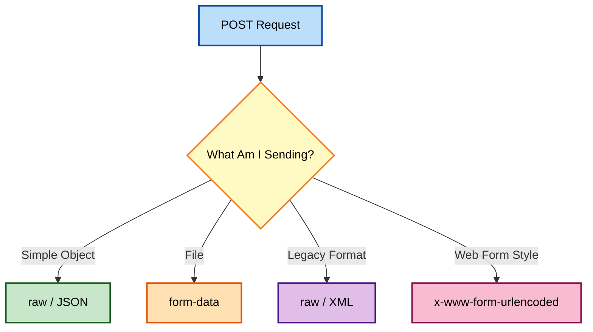

### Key Ideas From This Chapter

- File uploads use `form-data` with the value type switched to File, which Postman assembles into a multipart body automatically.
- JSON naturally supports nested objects and arrays for complex payloads, but deeply nested structures benefit from a quick validation pass before sending.
- Variables inside a request body allow dynamic, non-hardcoded values.
- `x-www-form-urlencoded` sends a flat, URL-encoded string in the body — still common on legacy and some authentication endpoints.
- The right body format (JSON, XML, form-data, urlencoded) depends entirely on what the target API expects.

### What's Next

Chapter 8 moves on to updating existing data with PUT and PATCH.

## Chapter 8: Managing Resources: Understanding PUT & PATCH Requests

Once I've created a resource with POST, I often need to change it. That's where PUT and PATCH come in, and the distinction between them confused me for longer than I'd like to admit. This chapter is the explanation I wish someone had given me on day one, instead of the vague "PUT replaces, PATCH updates" one-liner that never quite clarified anything in practice.

### PUT: The Resource Replacer

- **Usage** — completely replace an existing resource.
- **Method** — set to PUT.
- **URL** — targets the specific resource's endpoint, for example `https://example.com/api/resource/123`.
- **Body** — sends the FULL updated data, all fields, whether I'm changing them or not.

```json
{
  "id": 123,
  "title": "My NEW Amazing Post",
  "content": "Updated content goes here...",
  "author": "Your Name"
}
```

#### What Happens to Fields I Omit From a PUT Body

This is the part that genuinely tripped me up the first time. If the original resource had a `tags` field I forgot to include in my PUT body, a strict PUT implementation doesn't leave `tags` untouched — it treats the absence of that field as "this resource no longer has tags" and wipes it out. I learned this the hard way on a test run where I'd copied an older request body that was missing a field added since, and quietly deleted real data on a shared staging environment. Since then, I always fetch the current full resource with a GET immediately before building a PUT body, specifically to make sure I'm not omitting anything by accident.

### PATCH: The Partial Updater

- **Usage** — modify only specific fields.
- **Method** — set to PATCH.
- **URL** — same target as PUT.
- **Body** — sends ONLY the fields I intend to change.

```json
{
  "email": "newemail@example.com"
}
```

### Tested Example

```bash
curl -s -X PATCH "https://reqres.in/api/users/2" \
  -H "Content-Type: application/json" \
  -d '{"job": "Senior Software Tester"}'
```

Response:

```json
{
  "job": "Senior Software Tester",
  "updatedAt": "2026-09-24T09:10:44.229Z"
}
```

Notice the response here doesn't echo back the user's entire profile — just the field I changed, plus a timestamp. This is another common pattern worth internalizing: a successful PATCH response often confirms only what changed, not the full resulting resource, so if I need to see the complete updated state, I sometimes need a follow-up GET.

### PUT vs. PATCH: The Key Difference

| Aspect | PUT | PATCH |
|---|---|---|
| **Idempotent?** | Yes — repeating it has no extra side effects | Not necessarily — repeated calls may have further effects |
| **Body content** | Full resource | Only changed fields |
| **Risk of data loss** | Higher, if fields are omitted by mistake | Lower |

#### A Concrete Idempotency Example

To make idempotency less abstract: sending the same PUT request three times in a row against `/resource/123` leaves the resource in exactly the same final state as sending it once — because each call is a full, identical replacement. But imagine a hypothetical PATCH endpoint that increments a counter, like `{"incrementViews": 1}`. Sending that PATCH three times increases the view count by three, not one — a clear example of a PATCH that is deliberately, correctly, not idempotent.

### When to Use Which

- **Full replacement of data** — PUT is the choice.
- **Only changing a few fields** — PATCH is more efficient.
- **Unsure, or the API is strict** — PUT is generally safer because of its idempotence guarantee.

> **Note:** If I'm ever unsure which one an API expects, I default to PUT with the complete object. It's the more predictable choice, even if it means sending more data than strictly necessary.

### Pro Tip: Error Codes Matter

| Status Code | What It Usually Means |
|---|---|
| `200 OK` | Successful update |
| `201 Created` | PUT created a new resource (some APIs allow this) |
| `404 Not Found` | The resource I'm targeting doesn't exist |
| `409 Conflict` | The update conflicts with the resource's current state |
| `422 Unprocessable Entity` | The data is well-formed but fails business validation rules |

##### Figure 8.1


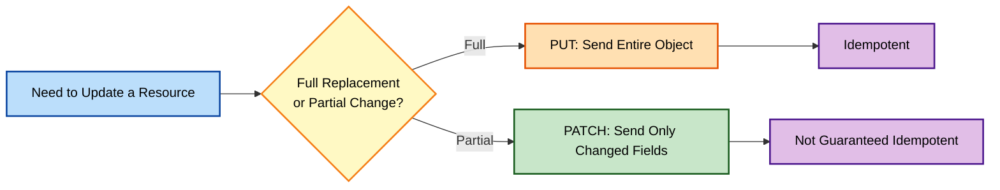

### Key Ideas From This Chapter

- PUT replaces the whole resource; PATCH updates only specified fields.
- A field omitted from a PUT body is often treated as deleted, not left unchanged — fetching the current resource first prevents accidental data loss.
- A PATCH response frequently confirms only the changed fields, not the entire updated resource.
- PUT is idempotent by design; PATCH is not guaranteed to be, and can be deliberately non-idempotent by design (like a counter increment).
- Defaulting to PUT with a complete object is the safer choice when unsure.
- `404 Not Found`, `409 Conflict`, and `422 Unprocessable Entity` each signal a different category of update failure.

### What's Next

Chapter 9 covers advanced update tactics — conflict prevention, merge patching, and handling relationships between resources.

## Chapter 9: Enhancing Resource Updates: Advanced PUT & PATCH Tactics

With the basics of PUT and PATCH covered, I want to walk through the techniques I've needed for more demanding, real-world update scenarios — the kind that only show up once multiple users, or multiple systems, are touching the same data.

### Tactic 1 — Conditional Updates: Avoiding Conflicts

When multiple people might edit the same resource, I look for two mechanisms:

- **ETags and `If-Match`** — the server gives me a version stamp (an ETag) for a resource. I send it back in the `If-Match` header, and the update only succeeds if the resource hasn't changed on the server since I last fetched it.
- **Optimistic locking** — I fetch the latest data, modify it locally, then submit the update referencing the original version. The API handles conflict resolution from there.

#### Why This Matters, With a Concrete Scenario

Imagine two testers, both working against the same staging environment, both fetch the same product record at 2:00 PM. Tester A changes the price and saves at 2:05 PM. Tester B, still working from their 2:00 PM copy, changes the description and saves at 2:10 PM — and without any conflict protection, Tester B's save silently overwrites Tester A's price change, because Tester B's PUT body still contains the *old* price from their stale copy. This exact scenario is what ETags exist to prevent: Tester B's `If-Match` header, carrying the ETag from their 2:00 PM fetch, would no longer match the resource's current ETag (which changed at 2:05 PM), so the server rejects Tester B's update with a `412 Precondition Failed` instead of silently overwriting Tester A's work.

Tested request using a conditional header:

```bash
curl -s -X PATCH "https://api.example.com/resource/123" \
  -H "Content-Type: application/json" \
  -H "If-Match: \"33a64df551\"" \
  -d '{"status": "shipped"}'
```

##### Figure 9.1


#### Retrieving an ETag Before I Can Use One

Before I can send an `If-Match` header, I need the current ETag, which most APIs return in a GET response's headers:

```bash
curl -s -D - -o /dev/null "https://api.example.com/resource/123"
```

```
HTTP/2 200
etag: "33a64df551"
content-type: application/json
```

I often capture this automatically in a pre-request or test script, storing it as a variable so a follow-up PATCH can reference `{{currentEtag}}` without me copying it by hand.

### Tactic 2 — Partial Updates With Merge PATCH

Standard PATCH usually replaces a whole field, but "merge PATCH" lets me update just a nested part of an object:

```json
{
  "address": {
    "billing": {
      "street": "New Billing Street"
    }
  }
}
```

> **Caution:** Merge PATCH behavior is not guaranteed by the HTTP spec — it's something specific APIs choose to implement (see [RFC 7396](https://tools.ietf.org/html/rfc7396)). I always confirm an API actually supports it before relying on it, or I risk accidentally wiping out sibling fields I didn't intend to touch.

#### What "Wiping Out Sibling Fields" Actually Looks Like

To make that caution concrete: suppose the full `address.billing` object originally contained `{"street": "Old Street", "zip": "10001"}`. If the API does *not* implement true merge semantics, and instead treats any PATCH to the `address.billing` key as a full replacement of that nested object, my "just change the street" PATCH above would leave the resource with `{"street": "New Billing Street"}` — silently dropping the `zip` field entirely. This is exactly why I test merge PATCH behavior explicitly on a disposable test resource before trusting it against anything I actually care about, rather than assuming the friendlier behavior by default.

### Tactic 3 — Handling Relationships

Many resources are connected to others — an order and its line items, for example. I've seen two patterns handle this:

- **Nested updates** — updating a parent and its children in a single PUT or PATCH.
- **Separate endpoints** — dedicated routes for managing the relationship, like adding an item to an order.

#### Testing Both Patterns

For nested updates, I test with a body like:

```json
{
  "orderId": "ORD-1001",
  "lineItems": [
    { "sku": "WIDGET-42", "quantity": 3 }
  ]
}
```

For dedicated relationship endpoints, the same change might instead look like a POST to a sub-resource:

```bash
curl -s -X POST "https://api.example.com/orders/ORD-1001/items" \
  -H "Content-Type: application/json" \
  -d '{"sku": "WIDGET-42", "quantity": 3}'
```

Knowing which pattern an API uses matters enormously for how I structure my whole test suite around it — nested updates mean one request to test per change, while dedicated endpoints mean I need separate test coverage for the relationship-management endpoints themselves.

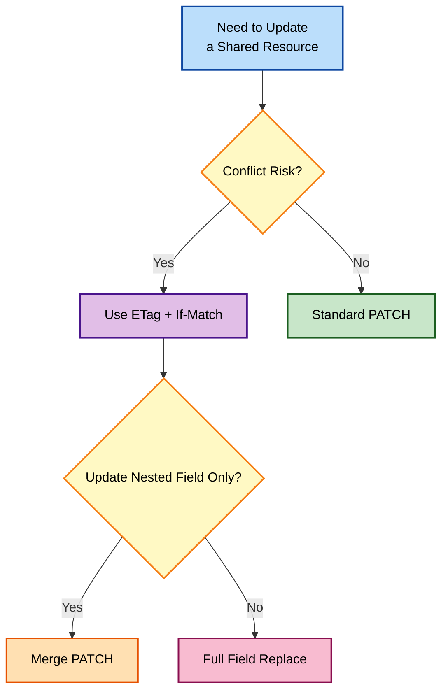

### Practice Scenario: A Case Study

I like to practice this against an API with genuine relationships — an e-commerce or project management API is a good candidate. I test scenarios like:

- Modifying a single attribute.
- Changing a relationship, such as reassigning a task to a different user.
- Deliberately triggering a version conflict by fetching a resource, letting a second request modify it, then attempting my original update — confirming the API rejects it rather than silently overwriting.

### Key Ideas From This Chapter

- ETags with `If-Match` prevent one person's update from silently overwriting another's, and are worth testing deliberately with a two-request conflict scenario.
- Merge PATCH lets me touch a single nested field, but only if the API explicitly supports true merge semantics — otherwise sibling fields can be silently wiped out.
- Relationships between resources are handled either through nested updates or dedicated relationship endpoints, and each pattern needs its own test coverage strategy.

### What's Next

Chapter 10 covers the final CRUD operation — safely removing data with DELETE.

## Chapter 10: Deletion Simplified: The DELETE Request Unveiled

DELETE is the final piece of the CRUD puzzle. It looks deceptively simple, but it's the one method where a mistake actually costs me data. Of everything covered in this book, DELETE is the method I've learned to treat with the most respect, and this chapter reflects that.

### The Basics of DELETE

1. **Method** — set to DELETE.
2. **URL** — targets the specific resource, for example `https://api.example.com/resource/123`.
3. **Headers** — usually minimal, though some APIs still require authorization.
4. **Body** — generally empty.

### Tested Example

```bash
curl -s -X DELETE "https://reqres.in/api/users/2"
```

I typically get back a `204 No Content` — an empty body confirming the deletion worked.

### Success Responses I Watch For

| Status Code | Meaning |
|---|---|
| `200 OK` | Deleted, and the response has some data, like the deleted object |
| `202 Accepted` | Deletion is queued, may happen asynchronously |
| `204 No Content` | Deleted successfully, nothing more to return |

#### Why `202 Accepted` Deserves Special Attention

The asynchronous case is worth slowing down on, because it changes how I have to test it. If a DELETE returns `202`, the resource might still technically exist for a few seconds, or even minutes, while the deletion processes in the background. A test that immediately follows up with a GET, expecting a `404`, might fail — not because deletion is broken, but because it simply hasn't finished yet. For APIs like this, I build in either a polling loop (checking every few seconds until the resource disappears, or a timeout is reached) or I use the API's own status-tracking mechanism, if it provides one, rather than assuming instant consistency.

### Things I Always Consider Before Hitting Send

- **Permissions** — am I actually authorized to delete this resource?
- **Cascading deletes** — will removing this also wipe out related data? Behavior varies greatly between APIs.
- **Idempotency quirks** — the first DELETE might return `204`; a second DELETE on the same, now-gone resource often returns `404` instead, which is expected, not a bug.

##### Figure 10.1


#### Testing Cascading Deletes Deliberately

Cascading deletes are dangerous precisely because their effects are invisible from the DELETE response itself — a `204 No Content` looks identical whether one record was removed or one thousand related records went with it. Whenever I'm testing a resource I know has relationships (an order with line items, a user with associated posts), I explicitly test the cascade behavior as its own scenario: I create the parent resource, create a child resource under it, delete the parent, then attempt to GET the child directly. If the child also returns `404`, the deletion cascaded; if it still returns `200`, the child survived independently. I've been surprised both ways on different APIs, which is exactly why I never assume and always test this directly.

> **Caution:** I test every DELETE request against a sandbox or staging environment first. I've heard enough close calls from other testers, and had a couple myself, to never trust muscle memory on a production DELETE call.

### DELETE in Practice

To delete a blog post with ID 123:

- **Method** — DELETE
- **URL** — `https://example.com/blog/posts/123`
- I check authorization is set correctly before sending.

### Pro Tip: Soft Delete vs. Hard Delete

Some APIs don't actually remove data — they mark it as deleted but keep it in the database, allowing for recovery later. I always check the API documentation to know which behavior I'm dealing with, because it changes how I write my test assertions afterward.

#### How I Detect Soft Delete Behavior When Docs Are Silent

Documentation doesn't always spell this out explicitly, so when I'm unsure, I test for it directly: I delete a resource, confirm it returns `404` through the standard GET endpoint, and then check whether an admin-only or "include deleted" query parameter reveals it still exists. A common pattern is something like `?includeDeleted=true` on a list endpoint, or a `deletedAt` timestamp field that's `null` on active records and populated on soft-deleted ones. If a soft-delete mechanism exists, my test suite needs to assert against it specifically — verifying not just that the record is gone from normal view, but that it's marked correctly rather than fully purged.

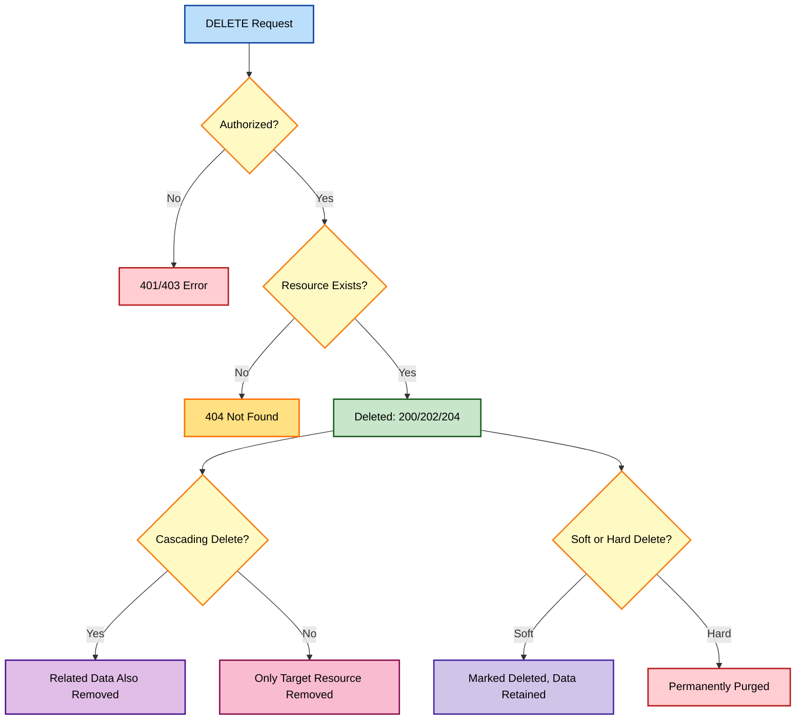

### Key Ideas From This Chapter

- DELETE most often succeeds with `200`, `202`, or `204`, not `201`.
- A `202 Accepted` response means deletion may be asynchronous — testing for it needs polling or a timeout, not an immediate follow-up assertion.
- A second DELETE on an already-deleted resource returning `404` is expected behavior.
- Cascading deletes should be tested deliberately by creating a parent-child relationship and checking whether the child survives after the parent is removed.
- Soft-delete behavior can often be detected through an "include deleted" parameter or a `deletedAt` field, even when documentation doesn't mention it directly.
- Sandbox or staging first, always, for destructive operations.

### What's Next

Chapter 11 shifts focus from individual requests to organizing them — my introduction to Postman Collections.

## Chapter 11: Harnessing the Power of Collections: Overview and Benefits

So far, I've been building API requests individually. Postman Collections are folders that supercharge the whole process once the number of requests starts growing. This chapter is about *why* they matter before Chapter 12 gets into *how* to build one — I've found that skipping straight to the mechanics without understanding the motivation leads to Collections that are technically organized but not actually useful.

### Why Collections Matter

- **Organization** — I group related requests together. A Collection dedicated to "User Management" holds requests for creating users, updating profiles, deleting accounts, and everything in between.
- **Reusability** — I stop crafting similar requests over and over; I save them once and reuse them with small tweaks.
- **Test workflows** — Collections form the backbone of API test suites. I chain requests within a Collection to model a real sequence of actions, like sign-up followed by profile update.
- **Collaboration** — Collections are easily shared within a team, promoting shared knowledge instead of scattered, personal setups.

### Key Concepts

- **Collections as project folders** — I treat a Collection like a folder for a specific API or testing scenario.
- **Requests as files** — each API request I create lives inside a Collection.
- **Nested folders** — for complex Collections, subfolders give even better structure.

#### How Deep Should Nesting Go?

I've experimented with both extremes — a completely flat Collection with fifty requests in one long list, and an over-nested Collection with folders inside folders inside folders. Neither worked well. My practical rule of thumb now: one level of subfolders, matching the API's own major resource groupings (Users, Products, Orders), is usually enough. If I find myself wanting a third level of nesting, that's often a sign the Collection itself should be split into two separate Collections instead — one for each major feature area — rather than nested more deeply within a single one.

### Real-World Benefits I Noticed

| Benefit | What Changed for Me |
|---|---|
| **Speed** | No more rebuilding common request patterns from scratch |
| **Consistency** | The same test suite runs the same way every time |
| **Modularity** | Big test scenarios break into smaller, focused Collections |
| **Automation** | Collections are the foundation for automating tests with Newman, covered in Chapter 27 |

#### A Before-and-After Comparison

Before I adopted Collections seriously, testing a new API feature meant: open a blank tab, type the URL from memory or a sticky note, guess at the headers again, and repeat this for every related endpoint, every single day I worked on that feature. After adopting Collections properly, testing the same feature meant: open the Collection, click the relevant request, adjust one variable if needed, and send. The difference isn't just convenience — it's that the second approach makes it nearly impossible to accidentally test against the wrong URL or forget a required header, because the correct configuration is already saved and doesn't rely on my memory at all.

### Example Collections

- **E-commerce API** — Collection: *Product Management*; Requests: Get Product, Add Product, Update Product Price.
- **Weather API** — Collection: *Forecast Retrieval*; Requests: Get Current Weather (location parameter), Get 5-day Forecast.

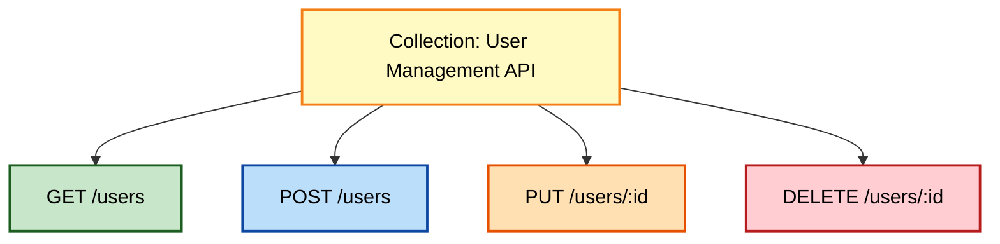

##### Figure 11.1


> **Note:** Before I started using Collections seriously, my workspace was a graveyard of loose, unlabeled request tabs. I'd lose track of which request tested what, and I'd rebuild the same POST request more times than I'd like to admit.

### Naming Conventions I've Settled On

A small detail that made a bigger difference than I expected: consistent request naming inside a Collection. I name every request with the method and a short description, in the same order every time — for example, "GET — Fetch Single User" rather than just "Fetch User" or "User by ID." This matters more once a Collection has thirty or forty requests in it, because the Sidebar's alphabetical or manual ordering becomes far easier to scan when every entry follows the same visual pattern.

### Get Ready to Build

1. Look at requests I've already built — can they be grouped into logical Collections?
2. Study the API documentation and structure Collections to mirror its major sections.
3. Decide, upfront, on a naming convention for requests and folders, and apply it consistently from the very first request I add.

### Key Ideas From This Chapter

- A Collection is a folder for related requests, and the backbone of any real test suite.
- One level of subfolders, mirroring the API's own resource groupings, is usually the right amount of nesting — a need for deeper nesting often signals the Collection should split instead.
- Good Collection organization mirrors the API's own documentation structure.
- Consistent request naming pays off disproportionately once a Collection grows large.
- Collections enable automation, later covered through Newman and CI/CD.

### What's Next

Chapter 12 walks through actually building my first Collection, step by step.

## Chapter 12: Building Your First Collection: Structuring Your Workflows

It's time to organize my API testing into a real Postman Collection. Here's exactly the process I follow, step by step, using the Reqres API as a concrete working example throughout.

### Step 1 — Creating the Collection

1. In the main workspace area, I click the **"+"** button.
2. I choose **Collection** from the popup.
3. I give it a name, for example "Reqres User API Tests," and an optional description.
4. I click **Create**.


#### What Belongs in the Description Field

I used to leave the description field blank, treating it as optional filler. I've since changed my habit, because a good description saves real time for anyone opening the Collection cold — including future me, six months later. I now always note: what API this Collection tests, which environment it's meant to run against by default, and any setup steps required before the first request will work (like needing a valid API key in the active environment). A short paragraph here has saved teammates real onboarding time more than once.

### Step 2 — Populating the Collection

I have two main ways to add requests:

#### Option 1 — New Requests

1. I click the **"..."** next to the Collection's name in the sidebar.
2. I select **Add Request**, which opens a new tab ready for building.

#### Option 2 — Importing Existing Requests

1. I drag open request tabs directly into the Collection in the sidebar.
2. The **"..."** menu also has an **Add requests** option for selecting existing ones.

### Step 3 — Structuring the Collection

- **Think like the API** — I mirror the major sections of the API documentation. If the API has user, product, and order management, I create matching subfolders.
- **Drag to rearrange** — I drag and drop requests and folders within the Collection to organize them the way that makes the most sense for my tests.

### My First Collection, in Practice

| Request | Method | Endpoint |
|---|---|---|
| Get single user | GET | `/api/users/2` |
| Get list of users | GET | `/api/users?page=1` |
| Create new user | POST | `/api/users` |

Tested against the live API, all three worked as expected:

```bash
curl -s "https://reqres.in/api/users/2"
curl -s "https://reqres.in/api/users?page=1"
curl -s -X POST "https://reqres.in/api/users" \
  -H "Content-Type: application/json" \
  -d '{"name": "Jordan", "job": "QA Lead"}'
```

#### Expanding the Collection Incrementally

I never try to build a "complete" Collection on day one. My actual process is closer to: add the two or three requests I need for whatever I'm working on right now, confirm they work, save, and move on. Over the following days and weeks, the Collection naturally grows as I encounter more endpoints. This incremental approach avoids a failure mode I hit early on — trying to pre-build a comprehensive Collection for an entire API before I'd actually used most of it, which produced a lot of untested, half-correct requests that took longer to fix later than they would have taken to build properly the first time, one at a time, as actually needed.

### Pro Tip: Authorization and Variables at the Collection Level

Once I'm comfortable with basic Collections, two features save real time:

- **Authorization** — set up once at the Collection level, applied automatically to every request inside it.
- **Variables** — defined once (base URLs, common parameters) and used across every request in the Collection.

#### Setting Collection-Level Authorization, Step by Step

1. I click the Collection's name, then open its own Authorization tab — separate from any individual request's Authorization tab.
2. I select the auth type (Bearer Token, API Key, and so on) and fill in the value, often using a variable like `{{authToken}}` rather than a hardcoded value.
3. On each individual request, I set that request's own Authorization type to **"Inherit auth from parent"** — this is the setting that actually pulls the Collection-level configuration down into the request.

I've been caught out before by setting Collection-level auth correctly, then wondering why a specific request still returned `401` — only to realize that request's own Authorization tab was still set to "No Auth" instead of "Inherit auth from parent." It's a small setting, easy to miss, but it's the one that makes the whole feature work.

```mermaid
flowchart LR
    A[Click + Button]:::step --> B[Choose Collection]:::step
    B --> C[Name & Describe]:::step
    C --> D[Create]:::step
    D --> E[Add Requests<br/>New or Dragged In]:::step
    E --> F[Structure With Folders]:::step
    F --> G[Set Collection-Level<br/>Auth & Variables]:::final
    G --> H[Set Each Request to<br/>Inherit Auth From Parent]:::final

    classDef step fill:#bbdefb,stroke:#0d47a1,stroke-width:2px,color:#000
    classDef final fill:#c8e6c9,stroke:#1b5e20,stroke-width:2px,color:#000
```

> **Note:** Setting Authorization at the Collection level once saved me from pasting the same Bearer token into ten different requests — a small setup step that pays for itself almost immediately.

### Key Ideas From This Chapter

- A Collection starts from the "+" button and a name — nothing more is needed to begin.
- A thoughtful description field saves real onboarding time for anyone opening the Collection later, including future me.
- Requests can be added fresh or dragged in from existing tabs.
- Building a Collection incrementally, as I actually need each request, produces better results than trying to pre-build a comprehensive one upfront.
- Structuring a Collection to mirror the API's own sections keeps it navigable as it grows.
- Collection-level Authorization only applies to a request if that request is explicitly set to "Inherit auth from parent."

### What's Next

Chapter 13 begins a new section of the book: variables, the feature that made my requests genuinely reusable for the first time.

## Chapter 13: Variable Mastery: From Creation to Implementation

There was a point where every request I built had values typed directly into the URL, the body, and the headers — everywhere. Changing a base URL meant editing a dozen requests one by one. That changed the day I understood Postman variables, and this chapter is the full explanation I wish I'd had at the time, rather than the fragments I pieced together over several confused weeks.

### Why Variables Are Awesome

1. **Reusability** — set a value once, use it in multiple requests or across Collections. Change it in one place, and it updates everywhere.
2. **Environment agility** — switch between test and production by changing a single `baseUrl` variable.
3. **Data-driven testing** — feed different input values into the same test, like multiple usernames.
4. **Cleaner requests** — no hardcoded values cluttering things up.

#### The Cost of Not Using Variables, Made Concrete

Before I adopted variables, I once had to migrate an entire Collection of around forty requests from a staging URL to a new production URL after a company domain change. Without variables, that meant editing forty separate URL fields by hand, one at a time, hoping I didn't miss one or introduce a typo along the way. With variables in place today, that same migration is a single edit to one `baseUrl` value in one Environment. That difference — forty edits versus one — is the entire practical case for variables in a sentence.

### Introducing Variable Scopes

Variables in Postman exist at different levels, and this is the part that took me longest to internalize:

| Scope | Accessible | Lifespan |
|---|---|---|
| **Global** | Anywhere in my workspace | Persists until cleared |
| **Environment** | Requests while that environment is active | Persists until changed or switched |
| **Local** | A single request run | Temporary |
| **Data** | Pulled from external CSV/JSON files | Per test-data row |

#### A Mental Model for Choosing a Scope

I now ask myself one question when creating a new variable: "If I switch environments, should this value change?" If the answer is yes — a base URL that's genuinely different between dev and production — it belongs in Environment scope. If the answer is no — something that's true regardless of which environment I'm pointed at, like a company-wide API version number — it belongs in Global scope. This single question resolves the great majority of scope decisions I make day to day, far faster than trying to reason through the full scope-priority hierarchy every time.

### Creating Variables

Here's exactly what I did to create a global `baseUrl` variable:

1. I use double curly braces to signify variables: `{{baseUrl}}`.
2. I click the eye icon next to the workspace name, then select **Globals**.
3. I click **"+"**, name it `baseUrl`, and set its initial value to `https://reqres.in/api`.


### Using the Variable

In the URL field, I replace the hardcoded base URL with `{{baseUrl}}`. Postman highlights recognized variables in orange — a small but genuinely useful visual cue.

Tested resolution:

```bash
curl -s "https://reqres.in/api/users/2"
```

Response:

```json
{
  "data": {
    "id": 2,
    "email": "janet.weaver@reqres.in",
    "first_name": "Janet",
    "last_name": "Weaver"
  }
}
```

#### What "Highlighted in Orange" Actually Tells Me

Postman's orange highlighting isn't purely cosmetic — it's a live signal of whether a variable actually resolves. A recognized variable, one that exists in some accessible scope, shows solid orange. A variable name that Postman *doesn't* recognize — because of a typo, or because it only exists in an Environment that isn't currently active — appears with a different visual treatment (often a reddish or unfilled highlight, depending on version), which I've learned to treat as an immediate, at-a-glance warning before I've even sent the request. Catching a broken variable reference this way, before clicking Send, has saved me more debugging time than almost any other single UI detail in Postman.

### Pro-Tip: Naming Conventions

| Pattern | Example |
|---|---|
| Environment (lowercase) | `dev_url`, `prod_url` |
| General purpose (camelCase) | `baseUrl`, `apiKey` |
| Data-specific (descriptive) | `testUsernames` |

```mermaid
flowchart LR
    A["Hardcoded Value<br>in every request"]:::bad -->|Refactor| B["Single Variable<br>&#123;&#123;baseUrl&#125;&#125;"]:::good
    B --> C["Request 1"]:::use
    B --> D["Request 2"]:::use
    B --> E["Request 3"]:::use

    classDef bad fill:#ffcdd2,stroke:#b71c1c,stroke-width:2px,color:#000
    classDef good fill:#c8e6c9,stroke:#1b5e20,stroke-width:2px,color:#000
    classDef use fill:#bbdefb,stroke:#0d47a1,stroke-width:2px,color:#000
```

> **Note:** When the same variable name exists in more than one scope, Postman resolves it using a priority order — local beats data, which beats environment, which beats collection, which beats global. I once spent real time wondering why a "global" change wasn't taking effect, before realizing a local variable was quietly overriding it.

#### Debugging Scope Conflicts Directly

When I suspect a scope conflict like the one above, I don't guess — I check directly. Postman's variable-editing panel shows every scope a variable exists in, side by side, with the currently "winning" value indicated. Running a quick script line in the Tests tab also settles it immediately:

```javascript
console.log("Global:", pm.globals.get("baseUrl"));
console.log("Environment:", pm.environment.get("baseUrl"));
console.log("Resolved value used by {{baseUrl}}:", pm.variables.get("baseUrl"));
```

`pm.variables.get()` specifically returns whichever value actually wins after the full scope-priority resolution, which makes it my go-to check whenever a variable seems to be resolving to something unexpected.

### Key Ideas From This Chapter

- Variables remove hardcoded values and make requests reusable across environments.
- Four main scopes exist: Global, Environment, Local, and Data.
- A simple test — "should this value change if I switch environments?" — resolves most scope decisions quickly.
- Orange highlighting in the Postman UI is a live signal of whether a variable actually resolves, not just decoration.
- When scopes overlap, the narrower scope wins, and `pm.variables.get()` reveals exactly which value is currently winning.
- Good naming conventions make variables self-explanatory months later.

### What's Next

Chapter 14 covers advanced variable strategies — dynamic data generation, combining variables, and data-driven testing.
