## Chapter 29: Workspace Wonders: Creating and Managing Workspaces

By now, I'm creating lots of Collections, Environments, and tests. Workspaces help me organize all of this effectively, especially as my API testing expands beyond a single project. This chapter opens a new part of the book focused specifically on collaboration and visibility — moving from techniques that work well for me alone to ones that work for a whole team.

### What Exactly Is a Workspace

I think of a workspace as a container for:

- **Collections** — the requests and test cases I build.
- **Environments** — my different sets of variables.
- **Mock servers** — simulated API responses, covered in Chapters 35 and 36.

### Types of Workspaces

| Type | Who Can See It | Best For |
|---|---|---|
| **Personal** | Just me | Default starting point, solo projects |
| **Team** | Invited team members | Collaborative API development and testing |
| **Public** | Anyone on the internet | Sharing documentation or examples publicly |

#### Deciding Between Team and Public

The distinction between Team and Public matters more than it might first appear. A Team workspace is invite-only and private to the organization, which is where I keep anything involving real credentials, internal-only APIs, or work still in progress. A Public workspace is genuinely open to anyone with the link, indexed and discoverable in some cases — appropriate for polished, finished documentation meant for external developers, but never appropriate for anything containing even a placeholder that resembles a real secret. I've seen teams accidentally publish sensitive-looking example data in a Public workspace meant only for documentation, which is exactly the kind of mistake worth guarding against deliberately, not just assuming won't happen.

### Why I Use Workspaces

- **Separation of concerns** — a "Product API" project doesn't get tangled with a "Payment API" project.
- **Environment management** — easily switching between Development, Staging, and Production within the relevant workspace.
- **Collaboration** — multiple team members working together seamlessly within a shared Team workspace.

### Creating My First Workspace

1. On the Dashboard, I find the **Workspaces** tab, then click **Create Workspace**.
2. I give it a descriptive name and choose the type — Personal is fine to start.
3. Personal workspaces default to private, with a setting available to make them team-visible when I'm ready to collaborate.


### Switching Workspaces

The active workspace is shown in a dropdown at the top-left of Postman. Clicking it lets me change to a different one instantly.

### Setting Up a Team Workspace

If team workspaces require an upgraded plan, I confirm that first. The creation process is otherwise nearly identical:

1. **Workspaces tab** → Create Workspace.
2. **Name & Type** → choose "Team."
3. **Invite members** → add the email addresses of collaborators.

### Roles Within Teams

| Role | Access Level |
|---|---|
| **Admin** | Full control — members, settings, billing |
| **Editor** | Can modify Collections, Environments, and so on |
| **Viewer** | Read-only |

> **Caution:** I default new external collaborators — contractors, stakeholders just checking status — to **Viewer**. It's far easier to upgrade someone's access later than to recover from an accidental edit to a shared Collection everyone depends on.

#### A Real Incident That Shaped This Habit

I want to be specific about why this caution exists, rather than leaving it abstract. Early in adopting Team workspaces, I invited a stakeholder as an Editor by default, simply because that was the setting I happened to have selected last. That stakeholder, while exploring the interface out of curiosity, accidentally deleted a query parameter from a shared request while trying to view its configuration, saved the change without realizing it, and closed the tab. The next person to run that request got confusing, unexpected failures for nearly half a day before anyone traced it back to the accidental edit. Since then, Viewer-by-default for anyone outside the core testing team has been a hard rule, not a suggestion.

### Collaboration in Action

- **Shared view** — everyone sees the same Collections and Environments within the Team workspace.
- **Near real-time updates** — if a teammate edits a request, the change shows up almost instantly.
- **Commenting** — comments can be added to specific requests or test scripts for discussion and review.

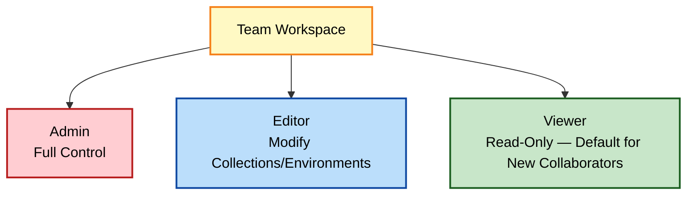

### Scenario: Building an API Together

1. A developer creates a basic Collection outline — endpoints, placeholder responses — in the Team workspace.
2. A tester builds out tests and assertions in the same workspace, possibly using mock servers for initial testing.
3. Both iterate together — the developer updates the API, the tester updates tests, comments flow back and forth.

### Key Ideas From This Chapter

- A workspace bundles Collections, Environments, and mocks into one organized container.
- Personal, Team, and Public workspaces serve different collaboration needs — Public workspaces need deliberate, careful review to ensure nothing sensitive-looking ends up there.
- Roles (Admin, Editor, Viewer) control what each team member can change.
- Defaulting new collaborators to Viewer protects shared work from accidental edits — a real, specific incident is usually all it takes to understand why this matters.

### What's Next

Chapter 30 covers watching APIs continuously with Postman Monitors.

## Chapter 30: Monitoring Magic: Implementing API Monitors

I've meticulously crafted tests. But how do I know if my API breaks when I'm not actively testing it? That's where Monitors come in — the feature that turns my test suite from something I run on demand into something watching continuously, whether I'm at my desk or not.

### What Is an API Monitor

I think of it as an automated robot tirelessly running my Postman Collection on a schedule.

| Concept | What It Means |
|---|---|
| **Collection-based** | Turns an existing Collection, with tests, into a scheduled job |
| **Frequency** | How often it runs — every 5 minutes, daily, and so on |
| **Environments** | Monitors can use Environments, just like regular runs |
| **Notifications** | Alerts me when tests fail |

### Why API Monitors Matter

- **Catch problems early** — I don't wait for users to report a broken API.
- **Beyond functionality** — checking performance, uptime, even unexpected changes in responses that technically still pass.
- **Peace of mind** — especially for critical APIs, knowing a monitor has my back reduces stress.

### Creating My First Monitor

1. I choose a Collection with important, meaningful tests.
2. **Monitors** tab → **Create a Monitor**.
3. Setup — name it, select the Collection, choose an environment if relevant, set the run frequency.
4. **Notifications** — configure alerts (email, Slack, and so on). A monitor that fails silently is no good at all.


> **Caution:** A monitor with no notifications configured is basically useless — it fails quietly in the background while I have no idea. I always double-check notification setup immediately after creating a new monitor.

#### Choosing a Frequency Deliberately

Frequency isn't a "set it and forget it, pick the fastest option" decision — it's a genuine trade-off I think through for each monitor. A payment API, where downtime directly costs money every minute, might justify a five-minute frequency. A low-traffic internal reporting API might be perfectly well served by an hourly or even daily check. I've found it useful to ask specifically: "if this breaks, how long could it realistically go unnoticed before it causes real harm?" and set the frequency to comfortably beat that window, rather than defaulting to the fastest option available on every monitor regardless of actual need.

### Monitor Results

- **Individual runs** — success/failure logged per run.
- **Test results** — the same details I'd see running manually, shown on failure.
- **Trends over time** — average response time across multiple runs, for performance-sensitive endpoints.

### Utilizing Regions for a Global View

Running monitors from different geographic locations surfaces two kinds of problems I'd otherwise miss:

- **Latency disparity** — fast within the primary data center region, sluggish elsewhere.
- **Localized outages** — infrastructure issues affecting only one region.

### Complex Assertions

```javascript
pm.test("Product has valid price", function () {
    let data = pm.response.json();
    pm.expect(data.price).to.be.a("number");
    pm.expect(data.price).to.be.above(0);
});
```

### Performance Timing

```javascript
// In a pre-request script
pm.globals.set("startTime", Date.now());

// In the tests script
let elapsed = Date.now() - pm.globals.get("startTime");
pm.test("Response completed within 800ms", function () {
    pm.expect(elapsed).to.be.below(800);
});
```

#### Why I Prefer `pm.response.responseTime` for Simple Cases

I want to flag something worth knowing: for the simple case of just measuring a single request's total round-trip time, Postman already provides `pm.response.responseTime` directly, without needing the manual `Date.now()` pairing shown above:

```javascript
pm.test("Response completed within 800ms", function () {
    pm.expect(pm.response.responseTime).to.be.below(800);
});
```

I reserve the manual pre-request/tests timestamp pairing specifically for measuring something broader than a single request — like the total elapsed time across an entire multi-request chain, where `pm.response.responseTime` alone wouldn't capture the full picture.

### Integrating Alerts Beyond Email

| Integration | Use Case |
|---|---|
| **Slack / Teams** | Immediate team visibility |
| **PagerDuty / Opsgenie** | Escalation to on-call engineers |
| **Custom webhooks** | Feeding results into internal dashboards or time-series databases |

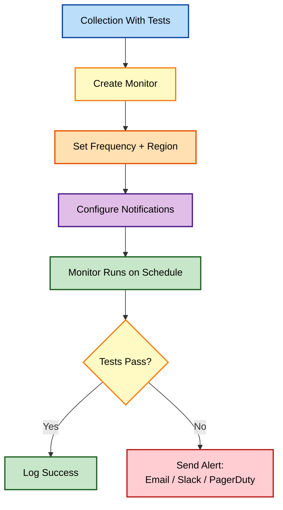

> **Note:** I like starting every important API with a simple "smoke test" monitor — one request hitting a health-check-like endpoint, checking status code and basic response shape. It's low-effort and gives me an always-on "is this fundamentally alive?" signal before investing in anything fancier.

### Key Ideas From This Chapter

- A Monitor turns an existing Collection into a scheduled, automated health check.
- Frequency should reflect how quickly a real problem could cause harm, not default to the fastest option available regardless of need.
- Notifications must be configured explicitly — a silent monitor provides no real value.
- Multi-region monitoring reveals latency and outage issues that a single-location test would miss.
- `pm.response.responseTime` handles simple single-request timing directly; manual timestamp pairing is for measuring broader, multi-request spans.
- Response-time assertions and Slack/PagerDuty integrations turn a monitor into real operational tooling.

### What's Next

Chapter 31 covers turning my Collections into shareable, professional API documentation.

## Chapter 31: Documentation Delight: Crafting Comprehensive API Documentation

Excellent API testing is only one piece of the puzzle. For an API to be readily adopted, internally or externally, documentation matters just as much. Postman, surprisingly, has become one of my key tools for this too — the same requests I build for testing double as the raw material for genuinely useful documentation, if I treat them that way from the start.

### Why Documentation Matters

- **Developer onboarding** — clear documentation means less time answering basic "how do I…" questions.
- **Correct usage** — fewer malformed requests hitting the API, less load on support.
- **Discoverability** — especially important for public APIs.
- **The API is the product** — for developer-facing APIs, documentation is a core part of the product's overall quality.

### Postman as a Documentation Engine

1. **Collections as the source** — my carefully crafted requests and descriptions form the documentation's foundation.
2. **Automatic updates** — changes in a Collection can be reflected in the documentation, reducing the risk of drift.
3. **A familiar home** — developers access docs within the same tool they're likely already using to explore the API.

### Key Components of Great API Documentation

| Component | What It Covers |
|---|---|
| **Endpoint listing** | Clear overview of every available endpoint with its HTTP method |
| **Parameters and request formats** | Query parameters, expected body structure, acceptable content types |
| **Valid responses** | Example responses for success and error cases, with status code meanings |
| **Authentication/authorization** | Step-by-step guide for the process the API actually uses |

### Building the Foundation

1. **Description fields** — plain-language explanation on every request.
2. **Example responses** — success cases and error cases saved per request.
3. **Parameter documentation** — required vs. optional, data types, validation rules.
4. **Variables in action** — documentation should substitute example values wherever a request uses variables.


> **Note:** I found that writing a request's description at the same time I write its test script, not weeks later, produces far better documentation. The context is fresh, and I'm already thinking about exactly what the request does and doesn't handle.

#### A Description Field Template I Actually Use

Rather than writing free-form prose every time, I follow a consistent small template for every request's description, which keeps documentation predictable across an entire Collection:

```
Purpose: [one sentence — what this request does]
Required auth: [none / API key / Bearer token]
Required fields: [list, if this is a POST/PUT/PATCH]
Common errors: [the 1-2 most likely failure modes and their status codes]
```

For a POST user-creation request, filled in:

```
Purpose: Creates a new user record.
Required auth: Bearer token with 'write:users' scope.
Required fields: name (string), job (string).
Common errors: 400 if name or job is missing; 401 if the token is missing or expired.
```

This tiny amount of structure has made a noticeable difference in how quickly a new team member can understand a request without asking me directly.

### Generating the Documentation

1. Collection → **"..."** → **View Documentation**.
2. Postman renders a web-based preview from the request descriptions and examples.

### Customizing

- **Theme** — a small set of color palettes.
- **Language examples** — auto-generated code snippets, like cURL and JavaScript, for each request.

### Publishing

The **Publish** button gives me:

- A **shareable public URL**.
- **Custom domain** hosting, on certain plans.
- **Download** options — HTML or Markdown — for self-hosting.

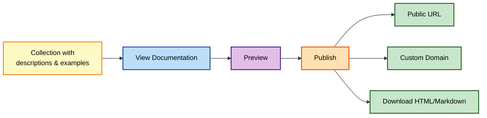

### The Benefits of Web-Based Documentation

- **Always up-to-date** — assuming I publish the latest version, collection changes are reflected automatically.
- **Searchable** — developers find the specific endpoint or information they need quickly.
- **Interactive** — Postman's documentation lets developers try requests directly from the page.

### Going Beyond Auto-Generation

For large APIs, I mix auto-generation with my own content — extra Markdown files providing a high-level introduction, or separate documentation for multi-step workflows like a registration flow spanning multiple endpoints.

#### A Concrete Example: Documenting a Multi-Step Flow

Auto-generated documentation describes each request in isolation extremely well, but it has no natural way to say "call these three endpoints in this specific order to accomplish a goal." For a signup-then-verify-then-login flow, I add a standalone Markdown page, linked from the Collection's top-level description, laid out roughly like this:

```markdown
## Complete Signup Flow

1. POST /signup — creates the account, returns a verification token
2. POST /verify — confirms the account using the token from step 1
3. POST /login — returns an access token for subsequent authenticated requests
```

This costs a few minutes to write once, and has repeatedly saved new developers from trying to call `/login` before `/verify`, which auto-generated per-endpoint documentation alone would never have prevented.

### Key Ideas From This Chapter

- Collections are the raw material Postman uses to generate documentation automatically.
- A consistent description template — purpose, auth, required fields, common errors — produces more useful documentation than free-form prose written inconsistently across requests.
- Description fields and saved example responses are the two things worth investing time in.
- Published documentation stays up-to-date automatically as the underlying Collection changes.
- Multi-step workflows need supplementary Markdown content — auto-generation alone only describes individual requests, never the sequence connecting them.

### What's Next

Chapter 32 covers running tests beyond my own machine — remote execution.

## Chapter 32: Embracing Remote Execution: Unleashing the Power of URL Deployment

So far, I've mastered testing on my own computer. Now I want to explore how Postman empowers me to execute tests in remote environments — this chapter closes out the Collaboration and Visibility part of the book, and sets up the final stretch, where I cover the more specialized techniques of SOAP, chaining, and mocking.

### Why Run Tests Remotely

- **Distributed testing** — verifying API behavior from different geographical locations.
- **Cloud infrastructure** — running tests as part of CI/CD pipelines on cloud-based machines, removing dependency on my local environment.
- **Monitoring in production** — running "mini-monitors" directly against the production API for the most realistic perspective.
- **Cross-environment checks** — executing the same tests in dev, staging, and production to catch discrepancies before they reach users.

### The Foundation: Shareable Collections

1. Collection menu → three dots → **Share Collection** → **Get public link**.

This URL contains a snapshot of the requests themselves, and environment config if I included one.

### Using the Link in Newman

```bash
newman run "https://api.postman.com/collections/<shareable-link-id>"
```


### Important Caveats

| Limitation | Why It Matters |
|---|---|
| **Authentication** | Doesn't automatically carry over — extra Newman flags are needed for credentials |
| **Sensitive environments** | A shared link can expose secrets if I'm not careful |
| **Dynamic tests** | Heavy pre-request script logic may not translate cleanly through a link |

> **Caution:** I never generate a shareable link for a Collection that has real secrets baked into its environment. A link is convenient, but it's just as easy for the wrong person to open.

#### What "Just as Easy for the Wrong Person to Open" Actually Means

I want to be concrete about this risk rather than leaving it vague. A shareable link isn't protected by any login or access control by default — anyone who has the URL, however they obtained it, can open it. URLs end up in browser history, shared chat logs, screen-recorded demo videos, and copy-pasted into unrelated documents far more often than people expect. Treating a "shareable link" as functionally public, even though it's not indexed or advertised anywhere, is the safest working assumption.

### Selective Environment Sharing

For anything serious — CI/CD, security-conscious teams — I skip the public link entirely:

1. **Export the Collection** as JSON.
2. **Export only the environment** the run actually needs.
3. Feed both to Newman explicitly:

```bash
newman run my-collection.json -e staging-environment.json
```

This way, sensitive values never leave my controlled files, and I decide exactly what's provided to any given run.

### Beyond Newman: Postman's API

For teams comfortable working with APIs directly, Postman exposes its own REST API:

1. Generate an **API Key** from account settings.
2. Reference Collections and Environments by their **UID**.
3. Trigger runs through Postman's **run endpoint**.

```bash
curl -s -X POST "https://api.getpostman.com/collections/run" \
  -H "X-Api-Key: {{postmanApiKey}}" \
  -H "Content-Type: application/json" \
  -d '{"collection": "{{collectionUid}}", "environment": "{{environmentUid}}"}'
```

> **Note:** This approach is genuinely useful when a CI job needs to trigger a run without local JSON files checked out — everything is referenced remotely, by ID, using a scoped API key instead of raw Collection contents.

#### Finding a Collection's UID

Before this technique is usable, I need the actual UID values, which aren't shown prominently in the main interface by default. I find them through Postman's own API itself — a GET request to list my Collections returns each one's UID directly:

```bash
curl -s "https://api.getpostman.com/collections" \
  -H "X-Api-Key: {{postmanApiKey}}"
```

```json
{
  "collections": [
    { "id": "12345678-abcd-1234-abcd-1234567890ab", "name": "Reqres User API Tests" }
  ]
}
```

That `id` value is exactly the UID referenced as `collectionUid` in the run-trigger request above.

### Example: Integrating With a CI System

A Jenkins job could:

1. Fetch the latest Collection and environment JSON, if generated elsewhere.
2. Either use Newman with the files locally, or use Postman's API to trigger the run remotely with finer-grained reporting.

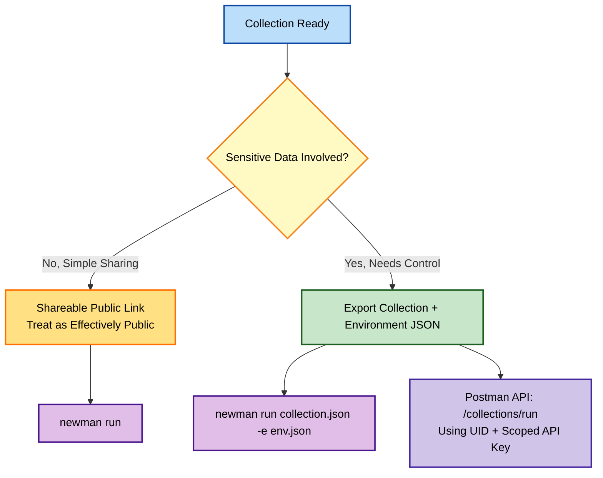

### Key Ideas From This Chapter

- Shareable Collection links are the simplest form of remote execution, but should be treated as effectively public and never used for secrets.
- Selective export of Collection and environment JSON gives explicit control over what a remote run can access.
- Postman's own API allows fully remote, file-free execution using UIDs and a scoped API key — UIDs themselves are retrievable through Postman's own listing endpoints.
- Authentication never automatically carries over into a remote run — it always has to be passed explicitly.

### What's Next

Chapter 33 opens a new part of the journey — testing legacy SOAP APIs alongside modern REST ones.

## Chapter 33: Navigating SOAP Requests: Mastering Postman's SOAP Capabilities

REST APIs have become ubiquitous in modern development, but legacy systems and certain industries still rely heavily on SOAP APIs. Postman, thankfully, has the tools I need to test these structured, formal services. This chapter opens the final part of the book, covering the more specialized techniques I reach for less often than everyday REST testing, but that have proven essential whenever I've needed them.

### SOAP vs. REST: A Recap

| Aspect | SOAP | REST |
|---|---|---|
| **Protocol** | Strictly relies on XML | More flexible, often favoring JSON |
| **Contract** | WSDL (Web Services Description Language) — a machine-readable blueprint | No formal contract required |
| **Structure** | Defined set of operations | Resource-oriented |

### Why Test SOAP APIs

- **Integration with existing systems** — if my application talks to a SOAP service I don't control, thorough testing is a must.
- **Contract adherence** — ensuring both systems agree on exact message formats prevents unexpected errors.
- **Functionality** — the business logic behind a SOAP operation still needs verification, same as REST.

#### Where I've Actually Encountered SOAP in Practice

I want to be honest that SOAP is a minority of my testing work today, but it's far from extinct. I've run into it specifically on insurance claim-processing systems, banking settlement APIs, and a few government-adjacent systems that predate the REST era and have simply never had a business reason to migrate. If you work in one of these industries, or integrate with a partner that does, the odds of eventually needing this chapter are genuinely high, even in an otherwise REST-first career.

### Key SOAP Concepts

- **WSDL** — often the starting point; Postman can import it to understand the API structure.
- **SOAP Envelope** — the specific XML structure containing headers and the request body.
- **XML Namespaces** — used heavily for organization; intimidating at first, harmless once the pattern is clear.
- **XPath** — a query language for pinpointing specific elements within a large XML response.

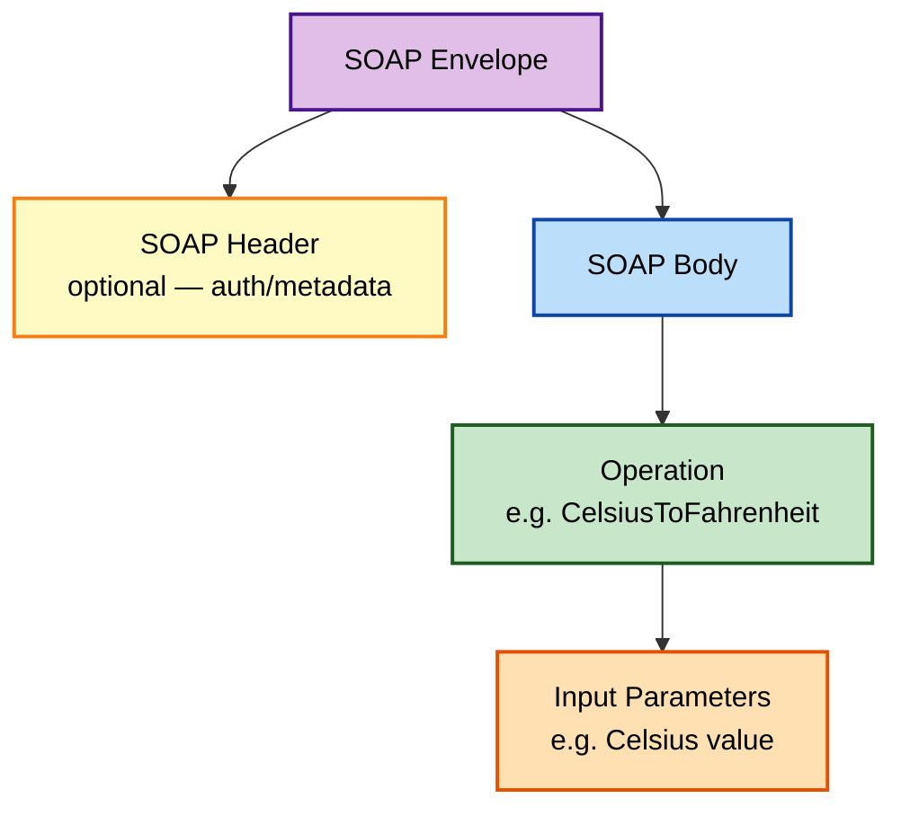

### Setting Up My First SOAP Request

1. **Method** — POST, almost always.
2. **URL** — the SOAP endpoint.
3. **Body tab** — raw, then XML (text/xml) from the content-type dropdown.


### Importing a WSDL the Easy Way

1. In the body area, click **Import**.
2. Paste the WSDL URL and click **Import**.

Postman generates a basic SOAP envelope structure automatically. I tested this against the classic public example:

```
https://www.w3schools.com/xml/tempconvert.asmx?WSDL
```

### Dissecting a Real Request and Response

```xml
<?xml version="1.0" encoding="utf-8"?>
<soap:Envelope xmlns:xsi="http://www.w3.org/2001/XMLSchema-instance"
               xmlns:xsd="http://www.w3.org/2001/XMLSchema"
               xmlns:soap="http://schemas.xmlsoap.org/soap/envelope/">
  <soap:Body>
    <CelsiusToFahrenheit xmlns="https://www.w3schools.com/xml/">
      <Celsius>25</Celsius>
    </CelsiusToFahrenheit>
  </soap:Body>
</soap:Envelope>
```

Tested with `curl`:

```bash
curl -s -X POST "https://www.w3schools.com/xml/tempconvert.asmx" \
  -H "Content-Type: text/xml; charset=utf-8" \
  -H "SOAPAction: https://www.w3schools.com/xml/CelsiusToFahrenheit" \
  -d @request.xml
```

Response received:

```xml
<?xml version="1.0" encoding="utf-8"?>
<soap:Envelope xmlns:soap="http://schemas.xmlsoap.org/soap/envelope/">
  <soap:Body>
    <CelsiusToFahrenheitResponse xmlns="https://www.w3schools.com/xml/">
      <CelsiusToFahrenheitResult>77</CelsiusToFahrenheitResult>
    </CelsiusToFahrenheitResponse>
  </soap:Body>
</soap:Envelope>
```

#### Why the `SOAPAction` Header Deserves Special Mention

I want to call this header out specifically, because it's easy to overlook and its absence produces confusing failures. Many SOAP services require the `SOAPAction` header to identify which operation I'm invoking, separate from anything in the body itself — some SOAP 1.1 services will reject an otherwise perfectly valid envelope with an unhelpful error if this header is missing or doesn't exactly match what the WSDL declares. I always check the WSDL for the exact expected `SOAPAction` value rather than guessing at it.

### Testing SOAP Responses

```javascript
pm.test("Status code is 200", function () {
    pm.response.to.have.status(200);
});

pm.test("Temperature converted correctly", function () {
    pm.expect(pm.response.text()).to.have.xpath(
        '//CelsiusToFahrenheitResult[text()="77"]'
    );
});
```

> **Caution:** XPath queries are unforgiving about exact structure — a small namespace mismatch or slightly different nesting silently fails to match, even if the data "looks right." I always test my XPath expression against the raw response text before trusting it in a real assertion.

#### A Simpler Alternative When XPath Feels Too Fragile

For simple cases, I've sometimes skipped XPath entirely and fallen back to a plain string check, which is less precise but far less fragile against small structural variations:

```javascript
pm.test("Response includes the expected result value", function () {
    pm.expect(pm.response.text()).to.include("<CelsiusToFahrenheitResult>77</CelsiusToFahrenheitResult>");
});
```

I reserve this fallback for quick checks or genuinely simple responses — for anything with real structural complexity, a properly written XPath assertion is still the more robust and maintainable long-term choice.

### Common SOAP Challenges

- **Dynamic placeholders** — some WSDLs need per-request unique IDs, generated with pre-request scripts, same as REST.
- **SOAP Faults** — a structured error format needing its own handling:

```xml
<soap:Fault>
  <faultcode>soap:Client</faultcode>
  <faultstring>Invalid input parameter</faultstring>
</soap:Fault>
```

```javascript
pm.test("No SOAP Fault returned", function () {
    pm.expect(pm.response.text()).to.not.include("<soap:Fault>");
});
```

### Key Ideas From This Chapter

- SOAP almost always uses POST; the real operation lives inside the XML body, not the URL or verb.
- SOAP still appears in specific industries — insurance, banking, government-adjacent systems — making this chapter worth knowing even in an otherwise REST-first career.
- WSDL import scaffolds a basic envelope automatically, but should be checked against documented parameter names.
- The `SOAPAction` header is a common, easy-to-miss requirement worth checking against the WSDL explicitly.
- XPath assertions are precise but brittle — testing them against raw response text first avoids false confidence, and a plain string check is a reasonable fallback for simple cases.
- SOAP Faults need explicit checks, since they're a structured error format distinct from HTTP status codes.

### What's Next

Chapter 34 covers linking multiple requests together to model real user workflows — API chaining.

## Chapter 34: Building Seamless Connections: API Chaining Essentials

Often, a single API endpoint doesn't tell the whole story. To test comprehensive workflows or model real user interactions, I need to link multiple API requests in a sequence. This is, in my experience, where API testing stops feeling like checking individual boxes and starts genuinely modeling how a real user, or a real system, actually behaves.

### Why API Chaining Matters

- **End-to-end scenarios** — create a new user, fetch their ID, then update their profile.
- **Data-driven flows** — the result from one call provides the input for the next.
- **Dependency checks** — ensuring changes made by one call are reflected when queried through a different endpoint.

### The Foundation: Variables as Glue

| Scope | Best For Chaining |
|---|---|
| **Environment** | Base URLs, values consistent across the whole chain |
| **Global** | Data needed across multiple Collections or the whole workspace |
| **Local** | Short-lived values extracted from a single response |

### A Basic Chain in Practice

**Request 1 — Login:**

```bash
curl -s -X POST "https://reqres.in/api/login" \
  -H "Content-Type: application/json" \
  -d '{"email": "eve.holt@reqres.in", "password": "cityslicka"}'
```

Response: `{"token": "QpwL5tke4Pnpja7X4"}`

**Test Script (Request 1):**

```javascript
pm.test("Login successful", function () {
    pm.response.to.have.status(200);
});

let jsonData = pm.response.json();
pm.environment.set("authToken", jsonData.token);
```

**Request 2 — Get User Profile (uses the stored token):**

```bash
curl -s -X GET "https://reqres.in/api/users/2" \
  -H "Authorization: Bearer {{authToken}}"
```

This extract → store → reuse pattern is the whole foundation of chaining.


### Chain Execution Options

| Option | Best For |
|---|---|
| **Collection Runner** | Well-structured, ordered chains |
| **Manual chaining** | Quick, ad-hoc test flows |
| **Postman Flows / Workflows** | Complex chains with conditional logic |

#### Ordering Requests Correctly in the Collection Runner

A detail that tripped me up early: the Collection Runner executes requests in the order they appear in the Collection's sidebar, top to bottom, within each folder — not in some other implicit dependency order. If Request 2 depends on a variable set by Request 1, I need to make sure Request 1 is physically positioned above Request 2 in the sidebar. I've since made a habit of naming chained requests with a leading number — "1 — Login," "2 — Get Profile," "3 — Update Profile" — purely so the visual order in the sidebar always matches the execution order I need, at a glance, without me needing to remember it separately.

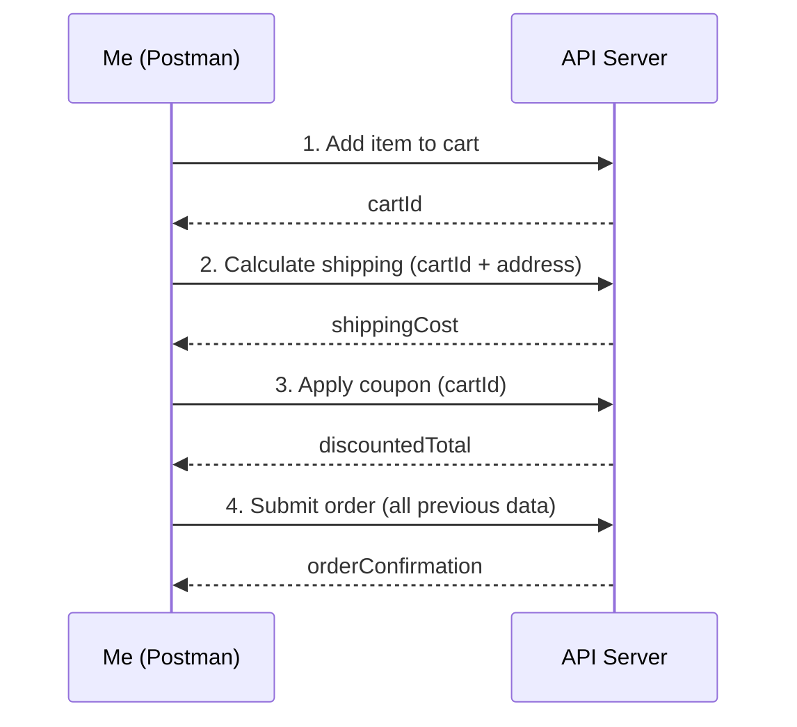

### Handling Errors in a Chain

```javascript
if (pm.response.code !== 200) {
    pm.environment.set("chainFailed", true);
    pm.environment.set("productStatus", "NOT_FOUND");
}
```

> **Note:** I always reset `chainFailed` back to `false` at the start of a chain run — otherwise a failure from a previous run can silently linger and affect the next one.

#### Where Exactly to Put the Reset

The reset itself belongs in the very first request's pre-request script in the chain, so it runs before anything else in the sequence has a chance to set the flag:

```javascript
// In Request 1's Pre-request Script
pm.environment.set("chainFailed", "false");
```

I keep this as the very first line of the very first request in any chain, as a matter of routine — it's cheap insurance against a specific, easy-to-miss class of bug.

### Branching Based on Responses

```javascript
let paymentType = pm.response.json().paymentMethod;

if (paymentType === "CREDIT_CARD") {
    postman.setNextRequest("Process Credit Card");
} else if (paymentType === "PAYPAL") {
    postman.setNextRequest("Redirect to PayPal");
} else {
    postman.setNextRequest(null);
}
```

### Data-Driven Loops Within a Chain

```javascript
const promoProducts = pm.response.json();

for (let i = 0; i < promoProducts.length; i++) {
    pm.environment.set("productId", promoProducts[i].id);
    postman.setNextRequest("Check Inventory");
}
```

> **Caution:** I set a hard upper limit on loop iterations any time I'm looping inside a Postman chain. An unbounded loop against a live API is an easy way to accidentally hammer a server or burn through rate limits.

#### A Safer Version With an Explicit Cap

```javascript
const promoProducts = pm.response.json();
const MAX_ITERATIONS = 50;

let currentIndex = parseInt(pm.environment.get("loopIndex") || "0");

if (currentIndex < promoProducts.length && currentIndex < MAX_ITERATIONS) {
    pm.environment.set("productId", promoProducts[currentIndex].id);
    pm.environment.set("loopIndex", currentIndex + 1);
    postman.setNextRequest("Check Inventory");
} else {
    postman.setNextRequest(null);
}
```

This version tracks its own position explicitly via `loopIndex` and enforces `MAX_ITERATIONS` as a hard ceiling, regardless of how large `promoProducts` might unexpectedly turn out to be.

### Staying Organized Across Multiple Collections

| Approach | How It Works |
|---|---|
| **"Master" orchestration Collection** | Calls into other, more granular Collections via `setNextRequest()` |
| **Shared workspace** | Collections in the same workspace can share variables |
| **Postman API** | Coordinates separate Collection runs from outside Postman entirely |

### Debugging a Broken Chain

1. **Log liberally** — `console.log(variableName)` at every hand-off point.
2. **Step-through mode** — the Collection Runner can execute one request at a time.
3. **Isolate** — temporarily break the chain into smaller pieces to pinpoint the failure.

### When Chaining Isn't the Right Tool

| Situation | Better Approach |
|---|---|
| Heavy data prep | A standalone setup script outside Postman |
| Long async waits | External polling, or a scheduled monitor |
| True parallelism | A real programming language for concurrent calls |

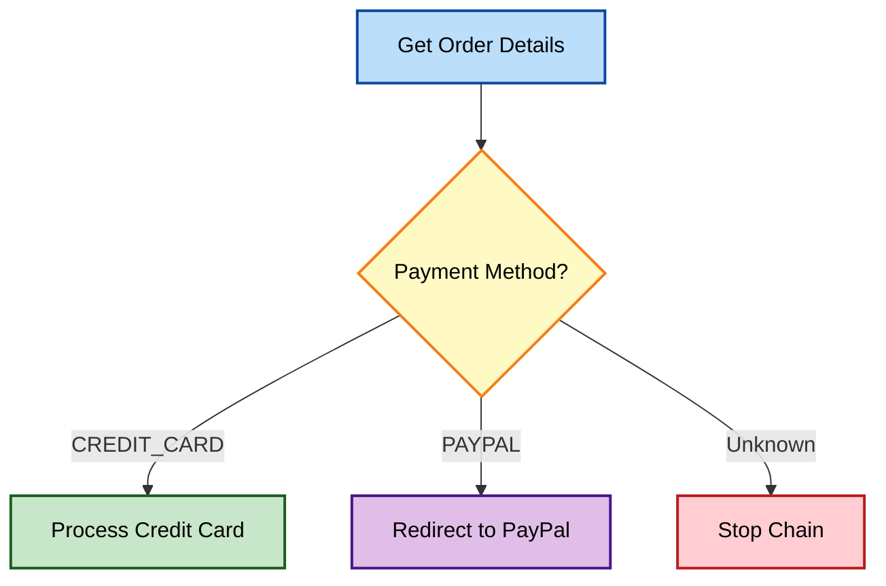

### Key Ideas From This Chapter

- Variables are the glue that connects one request's output to another's input.
- The Collection Runner executes requests in their sidebar order — numbered request names keep visual order matching execution order for chains.
- A `chainFailed` reset belongs at the very start of the chain's first request, before anything else can set it.
- `postman.setNextRequest()` allows chains to branch dynamically based on response data.
- Loops inside a chain need a hard iteration cap, tracked explicitly, to prevent runaway execution.
- Not every workflow belongs inside a Postman chain — heavy async processes are often better handled externally.

### What's Next

Chapter 35 introduces mock APIs — simulating a backend that isn't ready yet.

## Chapter 35: Demystifying Mock APIs: Understanding Their Purpose and Utility

Sometimes the real APIs I need to test against aren't quite ready, are unstable, or cost money to use. That's when mock APIs earn their place in my workflow — and understanding exactly when and why to reach for one, before Chapter 36 gets into actually building one, has saved me from misusing this feature more than once.

### What Exactly Is a Mock API

- **Imitator** — mimics the structure of a real API, but its responses are fabricated.
- **Controllable** — I dictate what data it returns, letting me simulate various scenarios.
- **Isolated** — allows testing my application's logic even when real backend systems are in flux.

### Why Mock APIs Matter

1. **Parallel frontend development** — the frontend team doesn't have to sit idle waiting for the backend.
2. **Testing edge cases** — forcing a server error or a missing field is far easier with a mock than with a real API.
3. **Performance without limits** — mocks are fast and free to hammer as much as I want.
4. **Cost savings** — some real APIs charge per call, especially in development environments.

#### A Real Scenario Where a Mock Saved Real Time

I once worked on a project where the backend team was building a payment-processing endpoint that, by its nature, couldn't safely be tested against in a half-finished state — any mistake risked processing real transactions in a sandbox that wasn't yet properly isolated. Rather than wait two weeks for that endpoint to stabilize, I built a mock matching its documented (but not yet implemented) response shape, let the frontend team build and test their checkout flow against it in parallel, and swapped the mock for the real endpoint the moment it was ready. The frontend work that would have otherwise sat blocked for two weeks shipped on the original schedule.

### When to Reach for Mocks

- **Early development** — when the real thing doesn't exist yet.
- **Unreliable dependencies** — a flaky third-party API can be insulated against with a mock.
- **Negative testing** — errors and slow responses are hard to force on demand from production systems; mocks excel here.

### When Not to Use Mocks

| Situation | Why a Mock Isn't Enough |
|---|---|
| **True end-to-end integration** | At some point, real APIs must be tested directly |
| **Real system performance** | A mock won't tell me if the actual backend can handle real load |
| **Complex flow mocking** | Backend state that spans multiple requests is hard to replicate faithfully |

> **Note:** I treat mocks as a development accelerant, not a replacement for real integration testing. At some point, I always test against the actual API before calling anything "done."

#### A Failure Mode I've Seen on Other Teams

I want to name a specific risk directly: a mock that quietly drifts out of sync with the real API it was modeled after. If the real backend's response shape changes — a field gets renamed, a new required field gets added — and nobody updates the mock to match, any tests still running against the mock will keep passing happily while the real integration silently breaks. I've seen this exact scenario cause a production incident on a team I worked adjacent to, where a mock hadn't been touched in months and no longer resembled reality at all. My own practice now: whenever the real API's contract changes, updating the corresponding mock is a required part of that change, not an optional afterthought, and I periodically re-verify a mock's shape against the real API directly, even after it's "done."

### Mock APIs in Postman

1. **Start from a Collection** — Postman generates a basic mock server from requests I've already defined.
2. **Customized responses** — I tailor the data returned for each endpoint.
3. **Examples for more control** — Postman's "Examples" feature enables finer-grained responses.

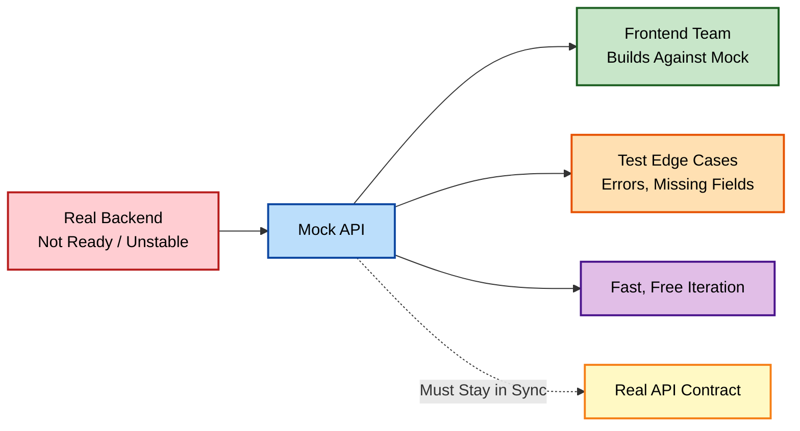


### Key Ideas From This Chapter

- A mock API imitates a real API's structure, with fully controllable, fabricated responses.
- Mocks unblock parallel frontend development while a backend is still being built — a concrete time-saving benefit, not just a theoretical one.
- Negative and edge-case testing is far easier against a mock than a real system.
- A mock that drifts out of sync with the real API it was modeled after is a genuine, documented risk — updating the mock needs to be part of any real API contract change, not an afterthought.
- Mocks accelerate development but never fully replace real end-to-end integration testing.

### What's Next

Chapter 36 walks through actually building a mock server from scratch.

## Chapter 36: Crafting Mock APIs: Practical Implementation in Postman

I've explored the concept of mock APIs. Now I want to turn that into reality using Postman's built-in tools, working through a complete, concrete example from start to finish.

### Setting the Stage: A Simple API to Mock

An app using a product catalog API with these endpoints:

- `GET /products` — returns a list of products.
- `GET /products/{productId}` — fetches details for a single product.

### Step 1 — My Collection as the Foundation

I created a new Postman Collection with requests mirroring the API:

- `GET /products`
- `GET /products/{productId}` — using a path variable for flexibility.

### Step 2 — Mocks From the Request

1. I select one of my requests, for example `/products`.
2. I click the **Mocks** tab, next to Tests.
3. I click **Create a new mock server**.
4. I name it — "Product Catalog Mock" — and click **Create**.

Postman generates a dedicated URL for the mock server.


### Step 3 — Tailor the Response

```json
[
  { "id": 1, "name": "Cool Gadget", "price": 29.99 },
  { "id": 2, "name": "Useful Tool", "price": 15.50 }
]
```

### Step 4 — Test Drive

```bash
curl -s "https://<your-mock-id>.mock.pstmn.io/products"
```

Response received:

```json
[
  { "id": 1, "name": "Cool Gadget", "price": 29.99 },
  { "id": 2, "name": "Useful Tool", "price": 15.50 }
]
```

Exactly the fabricated data I defined — no real backend involved at all.

### Taking It Further: Examples

| Example | Simulates |
|---|---|
| Successful fetch | Normal, happy-path product lookup |
| Out-of-stock product | Edge case for inventory-aware UI logic |
| Invalid `productId` | Error-handling path, a 404-style response |

#### Building the Out-of-Stock Example, Step by Step

To make the "Examples" workflow concrete, here's exactly how I added the out-of-stock scenario for `GET /products/{productId}`:

1. On the request, I click **Add Example**.
2. I set the request's path parameter to a specific test value, like `productId = 99`.
3. In the example's response body, I define the out-of-stock shape directly:

```json
{
  "id": 99,
  "name": "Discontinued Widget",
  "price": 9.99,
  "inStock": false,
  "stockMessage": "This item is currently unavailable."
}
```

4. I save the example with a clear name — "Out of Stock Product" — so it's identifiable later in the Examples list.

Now, a request to the mock server for `productId=99` specifically returns this out-of-stock shape, while any other ID falls back to the default example, letting a single mock endpoint serve multiple distinct test scenarios based purely on which input I send it.

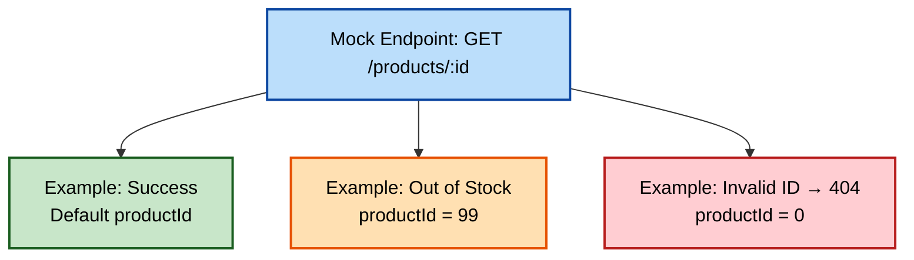

### The Power of Combining Mocks and Tests

```javascript
pm.test("Mock returns 200", function () {
    pm.response.to.have.status(200);
});

pm.test("Product data matches expected schema", function () {
    let data = pm.response.json();
    data.forEach(product => {
        pm.expect(product).to.have.property("id");
        pm.expect(product).to.have.property("name");
        pm.expect(product).to.have.property("price");
    });
});
```

- **Status code check** — asserting `200` (or `404` for negative examples).
- **JSON schema validation** — a defined schema ensures the mock always returns valid structures.
- **Data-driven tests with variables** — setting a `productId` environment variable and creating examples with different values to simulate various lookups.

#### Testing the Application Against the Mock, Not Just the Mock Itself

There's a subtle distinction worth naming: the tests above verify the *mock* is behaving as configured, which is useful, but the real value of a mock comes from pointing the actual application — a frontend, or another service — at the mock's URL and confirming that application handles each scenario correctly. I always keep a dedicated "Mock" Environment with `baseUrl` set to the mock server's URL, entirely separate from real Environments, specifically so switching between "test my app against the mock" and "test the real API directly" is a single dropdown click, not a manual URL edit.

> **Caution:** I keep mock server URLs clearly separate from real environment URLs — different Environments entirely, for example "Mock" versus "Staging." Accidentally running a real-data test suite against a mock, or vice versa, produces results that look valid but mean nothing.

### Key Ideas From This Chapter

- A mock server is generated directly from an existing request, with no extra tooling required.
- Response bodies for a mock are fully authored by me, giving total control over the scenario.
- Multiple examples on one endpoint simulate success, edge, and error cases from a single mock, distinguished by specific input values like a chosen `productId`.
- A mock's real value comes from testing the actual consuming application against it, not just verifying the mock's own configured responses.
- Mock and real environment URLs should never share the same Environment configuration.

### What's Next

Chapter 37 closes the book with a look back at everything this journey has covered, and where to go from here.

## Chapter 37: The Road Ahead

By now, I've gone from a nervous first GET request to orchestrating multi-step chains against SOAP and REST APIs alike, backed by mocks, automated through CI/CD, and watched over by monitors. It's worth pausing here to look back at the full shape of what this book has covered, chapter by chapter, before closing.

### My API Testing Transformation

| Stage | What I Can Now Do |
|---|---|
| **The basics** | Craft any HTTP request confidently, understanding REST and SOAP alike |
| **Power tools** | Use variables, environments, and scripts to make tests dynamic and adaptable |
| **Beyond requests** | Organize with Collections, collaborate via Workspaces, watch APIs with Monitors |
| **Automation** | Run everything headlessly with Newman, gate deployments through CI/CD |
| **Creative problem-solving** | Chain complex workflows, and mock APIs that don't even exist yet |

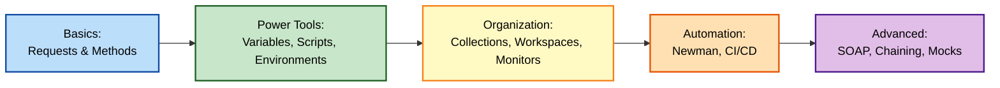

### The Thread Running Through Everything

If there's one habit tying every chapter in this book together, it's this: I don't trust anything until I've verified it myself — the status code, the response body, the environment I'm actually pointed at. SOAP envelopes, mock servers, CI pipelines, and every diagram in this book are just infrastructure in service of that one habit.

> **Key Idea:** A green checkmark is only as trustworthy as the context it ran in. Verifying that context — which environment, which data, which assumption — has saved me more debugging time than any single tool in this book.

#### A Few Specific Habits Worth Carrying Forward

Looking back across all thirty-seven chapters, a handful of small, recurring habits did more for my day-to-day testing quality than any single feature:

- Checking the active Environment before sending anything destructive.
- Reading a `400` response body before assuming I know why it failed.
- Casting environment variables to `Number()` before doing arithmetic on them.
- Testing an edge case — an empty search, an out-of-range page, an expired token — deliberately, rather than only ever exercising the happy path.
- Keeping mock and real environments in entirely separate configurations, never sharing a URL between them.

None of these are complicated individually. What made a difference was doing them consistently, on every request, until they stopped being conscious decisions and became reflexes.

### The Road Ahead

API testing is a continuous journey. As technologies evolve, so does Postman alongside them. Here's what I keep exploring to level up further:

- **Community power** — Postman has a vibrant community; online forums and public workspaces are full of tips, tricks, and shared problem-solving.
- **Test-Driven Development (TDD) with APIs** — writing Postman tests before an API is even built, letting the tests help drive the API's design.
- **Complex authentication flows** — multi-factor authentication and other intricate scenarios that Postman can handle, given enough setup care.
- **Beyond Postman** — dedicated API security testing tools, contract-testing frameworks, and other specialized tooling that complement everything in this book.


#### What Contract Testing Adds Beyond Everything in This Book

I want to name one specific next step in a little more detail, since it's the most natural extension of everything covered here. Contract testing tools (Pact is the best-known example) formalize the "does the API match what the consumer expects" question that mocks only partially address. Where a mock is something I hand-author and can drift out of sync with reality, a contract test is generated from real consumer expectations and verified automatically against the real provider, catching exactly the kind of silent drift I warned about in Chapter 35. It's not a replacement for anything in this book — it's a complementary layer, worth exploring once the fundamentals here feel solid.

### Empowered Through Knowledge

APIs are the backbone of modern software. Whether I'm developing my own applications, ensuring the quality of systems I rely on, or simply trying to understand how the interconnected digital world functions, the skills covered across these thirty-seven chapters have proven invaluable, again and again.

### Final Checklist Before Closing This Book

This last part switches address deliberately — everywhere else in this book I've spoken as myself, narrating my own experience. This checklist is different: it's for you, the reader, to check your own progress against, not a record of mine.

- [ ] You can build and send any HTTP method with confidence.
- [ ] You understand variable scopes and use them to avoid hardcoding.
- [ ] You can write and debug a `pm.test()` script from scratch.
- [ ] You know the difference between authentication and authorization, and can test both.
- [ ] You can run a Collection from the command line with Newman.
- [ ] You can explain when to reach for a mock API, and when not to.

### Key Ideas From This Chapter

- Every technique in this book supports one underlying habit: verifying, never assuming.
- A short list of small, consistent habits — checking the active environment, reading error bodies, casting variable types, testing edge cases deliberately — mattered more than any single advanced feature.
- Contract testing is a natural next step beyond mocking, verifying consumer expectations automatically against a real provider rather than a hand-authored substitute.
- Community resources, TDD, and deeper authentication flows are natural next steps beyond this book.
- API testing skill compounds — each chapter's techniques combine with the others in real, everyday work.

### Closing Note

So that's the whole journey, front to back. Go forth, explore, experiment, and most importantly, test those APIs.

## Appendix: Quick Reference, Cheat Sheets, and Glossary

I kept a loose collection of notes taped to the edge of my monitor for years — status codes I could never remember, the exact Newman flag for a delay, the difference between two variable scopes. This appendix is that collection, cleaned up and organized. Nothing here is new material; every entry points back to a chapter where the idea is explained properly. Use this section when you already know *what* you want to do and just need to look up *how*.

### Appendix A: HTTP Methods at a Glance

| Method | Purpose | Has Body? | Idempotent? | Typical Success Code | Covered In |
|---|---|---|---|---|---|
| **GET** | Retrieve data | No | Yes | `200` | Chapters 3–5 |
| **POST** | Create a new resource | Yes | No (usually) | `201` | Chapters 6–7 |
| **PUT** | Replace a resource entirely | Yes | Yes | `200` or `204` | Chapters 8–9 |
| **PATCH** | Update part of a resource | Yes | Not guaranteed | `200` | Chapters 8–9 |
| **DELETE** | Remove a resource | Usually no | Yes (state), but repeat calls may return `404` | `200`, `202`, or `204` | Chapter 10 |

> **Note:** "Idempotent" means repeating the identical request leaves the server in the same final state as sending it once. It says nothing about whether the *response* is identical each time — a second DELETE often returns `404` even though the resource is still, correctly, gone.

### Appendix B: HTTP Status Code Reference

#### Success (2xx)

| Code | Name | What It Usually Means |
|---|---|---|
| `200` | OK | Standard success |
| `201` | Created | A POST created something new |
| `202` | Accepted | Request received; processing is asynchronous |
| `204` | No Content | Success with nothing to return, common on DELETE |

#### Redirection (3xx)

| Code | Name | What It Usually Means |
|---|---|---|
| `301` | Moved Permanently | The resource has a new permanent URL |
| `304` | Not Modified | Cached copy is still valid |

#### Client Errors (4xx)

| Code | Name | What It Usually Means | First Thing I Check |
|---|---|---|---|
| `400` | Bad Request | Malformed syntax or invalid data | The response body's error message |
| `401` | Unauthorized | Missing or invalid credentials | Is the token present, and has it expired? |
| `403` | Forbidden | Authenticated, but not permitted | The role or scope attached to my credentials |
| `404` | Not Found | The resource or endpoint doesn't exist | A typo in the URL or ID |
| `405` | Method Not Allowed | Wrong HTTP verb for this endpoint | The API documentation for allowed methods |
| `409` | Conflict | Request conflicts with current resource state | Whether another update happened first |
| `412` | Precondition Failed | An `If-Match` condition didn't hold | Fetch a fresh ETag and retry |
| `415` | Unsupported Media Type | The `Content-Type` isn't accepted | The `Content-Type` header |
| `422` | Unprocessable Entity | Well-formed data that fails validation rules | Field-level errors in the response body |
| `429` | Too Many Requests | A rate limit was hit | The `X-RateLimit-*` response headers |

#### Server Errors (5xx)

| Code | Name | What It Usually Means |
|---|---|---|
| `500` | Internal Server Error | An unexpected failure on the server |
| `502` | Bad Gateway | An upstream server returned an invalid response |
| `503` | Service Unavailable | Temporarily overloaded or down for maintenance |
| `504` | Gateway Timeout | An upstream server took too long to respond |

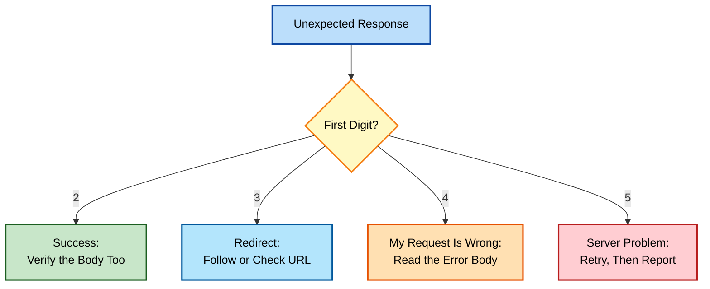

### Appendix C: Postman Scripting Cheat Sheet

#### Assertions and Tests

| Task | Code |
|---|---|
| Name and register a test | `pm.test("name", function () { ... });` |
| Assert an exact status code | `pm.response.to.have.status(200);` |
| Check the status code value | `pm.response.code === 200` |
| Assert a value equals another | `pm.expect(value).to.eql(expected);` |
| Assert a type | `pm.expect(value).to.be.a("string");` |
| Assert a property exists | `pm.expect(obj).to.have.property("id");` |
| Assert one of several values | `pm.expect(value).to.be.oneOf([200, 201]);` |
| Assert a substring | `pm.expect(text).to.include("word");` |
| Assert a number range | `pm.expect(n).to.be.above(0);` / `.below(1000)` |
| Assert response time | `pm.expect(pm.response.responseTime).to.be.below(800);` |
| Assert an XPath match (XML) | `pm.expect(pm.response.text()).to.have.xpath("//Tag");` |

#### Reading Responses and Requests

| Task | Code |
|---|---|
| Parse a JSON response | `const data = pm.response.json();` |
| Get the raw response text | `pm.response.text()` |
| Read a response header | `pm.response.headers.get("Content-Type")` |
| Read the response time | `pm.response.responseTime` |
| Read a request header | `pm.request.headers.get("Authorization")` |

#### Variables

| Task | Code |
|---|---|
| Set an environment variable | `pm.environment.set("key", "value");` |
| Get an environment variable | `pm.environment.get("key");` |
| Remove an environment variable | `pm.environment.unset("key");` |
| Set / get a global variable | `pm.globals.set(...)` / `pm.globals.get(...)` |
| Set / get a collection variable | `pm.collectionVariables.set(...)` / `.get(...)` |
| Get the winning value after scope resolution | `pm.variables.get("key");` |
| Read a data-file value for this iteration | `pm.iterationData.get("column");` |

#### Flow Control and Utilities

| Task | Code |
|---|---|
| Jump to a named request | `postman.setNextRequest("Request Name");` |
| Stop the run | `postman.setNextRequest(null);` |
| Fire an extra HTTP call from a script | `pm.sendRequest({ url, method, ... }, callback);` |
| Render an HTML report in the Visualizer | `pm.visualizer.set(html);` |
| Log for debugging | `console.log("label:", value);` |

A compact, tested template combining the patterns I use in nearly every Tests tab:

```javascript
pm.test("Status is 200", function () {
    pm.response.to.have.status(200);
});

pm.test("Response time is acceptable", function () {
    pm.expect(pm.response.responseTime).to.be.below(1000);
});

pm.test("Body has the expected shape", function () {
    const data = pm.response.json();
    pm.expect(data).to.have.property("data");
    pm.expect(data.data).to.have.property("id");
    pm.environment.set("lastUserId", data.data.id);
});
```

I confirmed the response shape this template expects against the live practice API:

```bash
curl -s "https://reqres.in/api/users/2"
```

```json
{"data": {"id": 2, "email": "janet.weaver@reqres.in", "first_name": "Janet", "last_name": "Weaver"}}
```

> **Caution:** Environment, global, and data-file values come back as strings. Cast with `Number(...)` before arithmetic, and compare CSV booleans against the strings `"true"` and `"false"`. This is covered in Chapters 23 and 24.

### Appendix D: Variable Scopes and Dynamic Variables

#### Scope Summary

| Scope | Visible To | Lifespan | Best For | Chapter |
|---|---|---|---|---|
| **Global** | The whole workspace | Until cleared | Values true in every environment | 13 |
| **Collection** | One Collection | With the Collection | Shared base URLs and auth for one API | 12, 13 |
| **Environment** | Requests while that environment is active | Until changed | Per-environment configuration | 18–20 |
| **Data** | One iteration of a data-file run | Per data row | Data-driven inputs | 24 |
| **Local** | One request run | Temporary | Throwaway values | 13 |

Resolution priority when names collide, narrowest first: **local → data → environment → collection → global.**

#### Commonly Used Built-In Dynamic Variables

| Variable | Produces |
|---|---|
| `{{$guid}}` | A unique identifier |
| `{{$timestamp}}` | Current Unix timestamp in seconds |
| `{{$isoTimestamp}}` | Current time in ISO 8601 format |
| `{{$randomInt}}` | A random integer |
| `{{$randomEmail}}` | A random, realistic-looking email address |
| `{{$randomFirstName}}` / `{{$randomLastName}}` | Random names |
| `{{$randomCity}}` | A random city name |

> **Note:** Type `{{$random` into any Postman field and let autocomplete show the full current list. The set of built-in variables has grown over time, so the live list is more reliable than any printed one.

### Appendix E: Newman Command Reference

| Goal | Command |
|---|---|
| Install Newman | `npm install -g newman` |
| Check the installed version | `newman --version` |
| Run a Collection | `newman run collection.json` |
| Run with an Environment | `newman run collection.json -e environment.json` |
| Run with global variables | `newman run collection.json -g globals.json` |
| Run against a data file | `newman run collection.json -d data.csv` |
| Repeat the run several times | `newman run collection.json -n 3` |
| Run only one folder | `newman run collection.json --folder "Folder Name"` |
| Override a single variable | `newman run collection.json --env-var "baseUrl=https://staging.example.com"` |
| Stop on the first failure | `newman run collection.json --bail` |
| Pause between requests | `newman run collection.json --delay-request 500` |
| Set a per-request timeout | `newman run collection.json --timeout-request 5000` |
| Produce an HTML report | `newman run collection.json -r html --reporter-html-export report.html` |
| Produce a JUnit report | `newman run collection.json -r junit --reporter-junit-export report.xml` |
| Combine several reporters | `newman run collection.json -r cli,html,junit` |

A complete command I use as a starting point for CI jobs:

```bash
newman run collections/api-tests.json \
  -e environments/staging.json \
  --timeout-request 10000 \
  -r cli,junit \
  --reporter-junit-export results/newman-results.xml
```

> **Note:** Newman exits with a non-zero code when any test fails. CI systems rely on that exit code to mark a build as failed, so avoid wrapping the command in anything that would hide it. See Chapter 28.

### Appendix F: Troubleshooting Quick Reference

| Symptom | Most Likely Cause | Where to Look | Chapter |
|---|---|---|---|
| `400` on a POST with a valid-looking body | Missing `Content-Type: application/json` | Headers tab | 5, 6 |
| `401` on something that worked earlier | Expired access token | Re-run the OAuth token request | 25 |
| `403` with valid credentials | Role or scope too narrow | The token's scopes and the user's role | 26 |
| `404` right after a successful create | Wrong ID, or wrong environment | The stored ID variable and active environment | 10, 18 |
| Orange variable not highlighting | Typo, or the variable lives in an inactive environment | The environment dropdown | 13 |
| A "global" change has no effect | A narrower scope is overriding it | `pm.variables.get()` in the Console | 13 |
| Arithmetic gives `NaN` or odd results | Variables are strings | Wrap in `Number(...)` | 23 |
| CSV boolean comparison always fails | CSV values are strings | Compare to `"true"` / `"false"` | 24 |
| Tests pass in Postman, fail in Newman | Missing environment or data file flag | The `-e` and `-d` flags | 27 |
| Pipeline reports success despite failures | Newman's exit code is being swallowed | The shell step wrapping the command | 28 |
| XPath assertion silently fails | Namespace or nesting mismatch | Test the XPath against raw response text | 33 |
| Chain behaves oddly on the second run | A stale flag from the previous run | Reset flags in the first request's pre-request script | 34 |
| Mock passes, real API fails | The mock drifted from the real contract | Re-compare the mock against the live API | 35 |

### Appendix G: Free Practice APIs

| API | Good For | Needs Signup? | Used In |
|---|---|---|---|
| **JSONPlaceholder** (`jsonplaceholder.typicode.com`) | GET, POST, PUT, PATCH, DELETE basics | No | Chapters 1, 2, 22 |
| **Reqres** (`reqres.in`) | Users, pagination, login, CRUD | No | Chapters 3–36 |
| **W3Schools Temperature Converter** (`www.w3schools.com/xml/tempconvert.asmx`) | SOAP and WSDL practice | No | Chapter 33 |

> **Caution:** Public practice APIs change over time. Some have begun requiring a free API key, and fabricated write operations never actually persist. If a request from this book behaves differently than shown, check the API's own documentation first before assuming a mistake on your end.

### Appendix H: Glossary

| Term | Plain-Language Meaning |
|---|---|
| **API** | A defined way for one piece of software to ask another for something |
| **Endpoint** | A specific address within an API that responds to requests |
| **Payload** | The data sent in, or returned by, a request |
| **JSON** | A text format for structured data, built from objects and arrays |
| **Idempotent** | Repeating a request leaves the server in the same final state |
| **Pagination** | Splitting a large result set into numbered pages |
| **Query parameter** | Extra information appended to a URL after a `?` |
| **Path parameter** | A value embedded in the URL path that identifies a specific resource |
| **Header** | Metadata sent alongside a request or response |
| **Bearer token** | A credential sent in the `Authorization` header |
| **OAuth 2.0** | An industry-standard framework for issuing short-lived access tokens |
| **ETag** | A version stamp for a resource, used to detect conflicting updates |
| **Collection** | A saved, organized folder of requests |
| **Environment** | A named set of variables, such as dev, staging, or production |
| **Collection Runner** | Postman's tool for running a Collection, optionally with a data file |
| **Newman** | Postman's command-line runner for Collections |
| **Monitor** | A Collection run on a schedule, with alerts on failure |
| **Mock server** | A fabricated API that returns responses I define |
| **WSDL** | The machine-readable contract describing a SOAP service |
| **SOAP Envelope** | The XML wrapper that holds a SOAP message |
| **XPath** | A query language for locating elements inside XML |
| **CI/CD** | Practices for automatically building, testing, and delivering code |
| **Shift-left testing** | Finding defects as early in development as possible |
| **Headless** | Running without a graphical interface |

### Appendix I: Chapter Finder by Topic

| If You Need Help With... | Go To |
|---|---|
| Understanding the Postman interface | Chapters 1–2 |
| Building and reading a first request | Chapters 3–5 |
| Creating, updating, and deleting data | Chapters 6–10 |
| Organizing requests into Collections | Chapters 11–12 |
| Variables and their scopes | Chapters 13–14, 17 |
| Writing scripts | Chapters 15–16, 21–22 |
| Environments | Chapters 18–20 |
| Debugging a failing test | Chapter 23 |
| Data-driven testing | Chapter 24 |
| API keys, Basic Auth, and OAuth | Chapters 25–26 |
| Running tests from the command line | Chapter 27 |
| Wiring tests into a CI pipeline | Chapter 28 |
| Team workspaces and permissions | Chapter 29 |
| Scheduled monitoring and alerts | Chapter 30 |
| Publishing API documentation | Chapter 31 |
| Running tests remotely | Chapter 32 |
| Testing SOAP services | Chapter 33 |
| Chaining requests into workflows | Chapter 34 |
| Mocking an API | Chapters 35–36 |

### Appendix J: Pre-Flight Checklist Before Any Important Request

This is the short list I run through before sending anything I can't easily undo. It's written for you to adopt as your own.

- [ ] Confirm the active environment is the one you intend to hit.
- [ ] Confirm the URL resolves the way you expect, with no unresolved variables.
- [ ] Confirm the method matches your intent, especially for DELETE and PUT.
- [ ] Confirm the required headers are present, including `Content-Type` and `Authorization`.
- [ ] Confirm no real secrets are hardcoded in anything you might export or share.
- [ ] Confirm you have read the documentation for any behavior you are assuming.

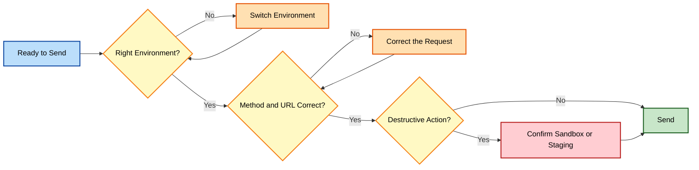

### Appendix K: Recommended Further Reading

- The Postman Learning Center, for current, version-specific interface documentation.
- The Postman Sandbox API Reference, for the full list of `pm.*` methods.
- MDN Web Docs on HTTP methods, headers, and status codes, for authoritative protocol detail.
- The Chai.js assertion documentation, since Postman's `pm.expect` is built on it.
- RFC 7396 (JSON Merge Patch) and RFC 7232 (conditional requests and ETags), for the standards behind Chapter 9.
- The OAuth 2.0 overview at oauth.net, for deeper treatment of the flows summarized in Chapter 25.

> **Key Idea:** A reference section is only useful if you trust it. Everywhere in this appendix, the interface labels and public practice APIs can change between versions. When something here disagrees with what you see on screen, trust the screen, check the current documentation, and treat the underlying concept — which rarely changes — as the part worth keeping.
