# Building a Real Peer Web Service: CodeShare, SAML, and the Security Landscape

I've spent three posts now building up the pieces: SOAP itself, writing and deploying services, describing them with WSDL, and discovering them through UDDI. This post is where all of it gets put to work on something with real shape, a peer-to-peer source-code-sharing network called **CodeShare**, and then a step back to look at the wider, messier question of **web services security** as it stood at the time this book was written.


**What's in this post:**

- The CodeShare architecture: owner, requester, and central server, and why that's genuinely peer-to-peer
- The CodeShare index format, built on Dublin Core metadata
- Why "web services security" is really several loosely related problems, not one
- SAML assertions: what they are, how CodeShare builds and signs one, and what's structurally weak about the approach
- A tested, simplified reimplementation of the assertion issue/verify flow, including tamper and forged-issuer detection
- A tested reimplementation of CodeShare's Dublin-Core-based access control logic
- The four CodeShare WSDL interfaces and how they map to Java and Perl implementations
- A tour of the early-2000s authentication landscape: Passport, Kerberos, Liberty, Magic Carpet
- XML Digital Signature and XML Encryption as the more durable standards underneath all of it
- Tables, notes, and cautions throughout

---

## Table of Contents

1. [The CodeShare Service Network: Overview](#1-the-codeshare-service-network-overview)
2. [Why This Counts as Peer-to-Peer](#2-why-this-counts-as-peer-to-peer)
3. [Prerequisites and a Real Toolkit Bug](#3-prerequisites-and-a-real-toolkit-bug)
4. [The CodeShare Index and Dublin Core](#4-the-codeshare-index-and-dublin-core)
5. [What "Web Services Security" Actually Means](#5-what-web-services-security-actually-means)
6. [SAML: Security Assertions Markup Language](#6-saml-security-assertions-markup-language)
7. [Tested: A Simplified Assertion Issue/Verify Flow](#7-tested-a-simplified-assertion-issueverify-flow)
8. [The Four CodeShare Interfaces](#8-the-four-codeshare-interfaces)
9. [Implementing the CodeShare Server in Java](#9-implementing-the-codeshare-server-in-java)
10. [Signing the Assertion: Keystores and XML-DSig](#10-signing-the-assertion-keystores-and-xml-dsig)
11. [Implementing the CodeShare Owner in Perl](#11-implementing-the-codeshare-owner-in-perl)
12. [Tested: The Dublin-Core Rights Check](#12-tested-the-dublin-core-rights-check)
13. [The CodeShare Client Shell](#13-the-codeshare-client-shell)
14. [What's Deliberately Missing from CodeShare](#14-whats-deliberately-missing-from-codeshare)
15. [The Wider Security Landscape](#15-the-wider-security-landscape)
16. [Microsoft Passport: Versions 1 Through 3](#16-microsoft-passport-versions-1-through-3)
17. [Liberty, Magic Carpet, and the Standards Problem](#17-liberty-magic-carpet-and-the-standards-problem)
18. [XML Digital Signature and XML Encryption](#18-xml-digital-signature-and-xml-encryption)
19. [What's Changed Since This Was Written](#19-whats-changed-since-this-was-written)
20. [Cheat Sheet and Final Thoughts](#20-cheat-sheet-and-final-thoughts)

---

## 1. The CodeShare Service Network: Overview

CodeShare is a deliberately modest example, and I think that's exactly why it works so well as a teaching tool. It lets developers share source code with the rest of the world, and it does that through three kinds of participants.

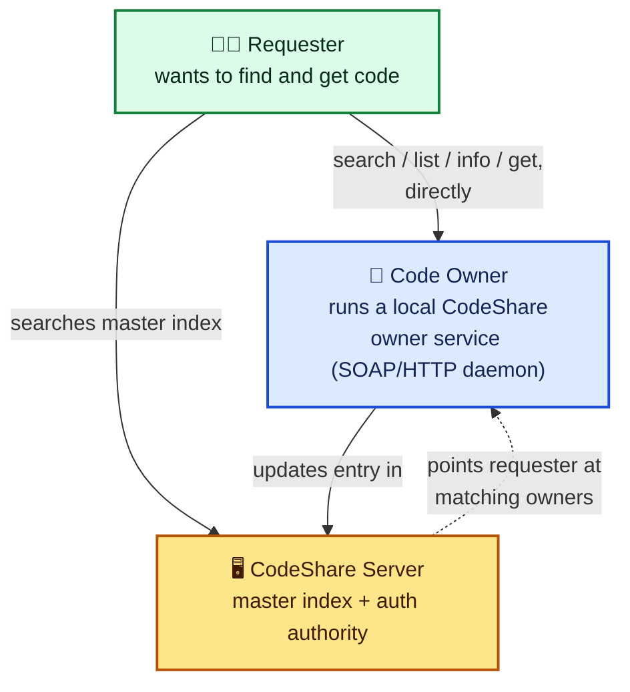

| Role | Responsibility |
|---|---|
| **Code owner** | Runs a local SOAP HTTP daemon exposing their shared code; maintains a local `index.xml` describing what's shared |
| **CodeShare server** | Acts as a clearinghouse (searchable master index) and as an authentication authority owners can lean on |
| **Requester** | Searches for code, either directly against a known owner, or against the server's master index |

### 1.1 The Typical Flow

1. Developers decide to share code publicly, and record that in their local `index.xml`.
2. They log on to the CodeShare server and update their entry in the **master index**.
3. They start their own **CodeShare owner service**, a local SOAP HTTP daemon.
4. A user looking for code can either go **straight to a known owner** (four operations: `search`, `list`, `info`, `get`) or **search the server's master index**, which points them at matching owners. `get` operations always go directly to the owner, never through the server.
5. If an owner wants to restrict access, they list authorized usernames in `index.xml`. When a restricted item is requested, the owner checks whether the requester has logged into the CodeShare server and is on that list.

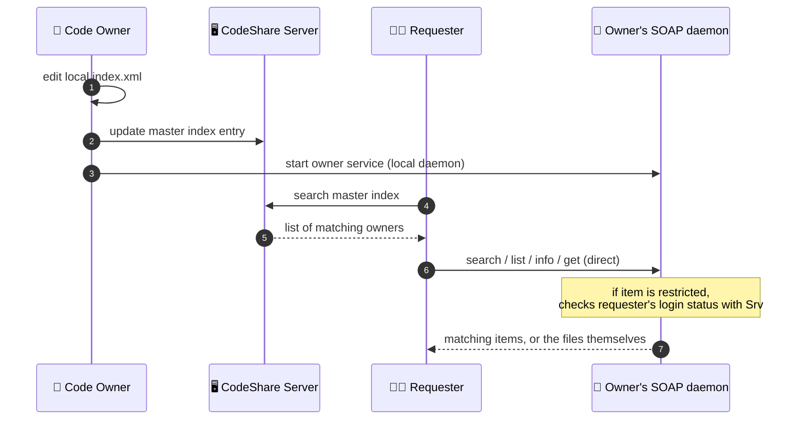

> 📝 **Note:** Notice that `get` never routes through the CodeShare server at all. The server's role is discovery and authentication, not file transfer. That's a clean separation of concerns I want to flag early, because it shows up again and again in this design: the server is an **index and authority**, never a **proxy** for the actual data.

---

## 2. Why This Counts as Peer-to-Peer

I want to spend a moment on this, because "peer-to-peer" gets used loosely, and the book is precise about what it means here.

In the traditional client-server model, the Internet is a network of clients accessing resources on servers. **In peer-to-peer, it's a cooperative network of peers sharing resources equally.** The lines between provider and consumer blur, no application is locked into a single role.

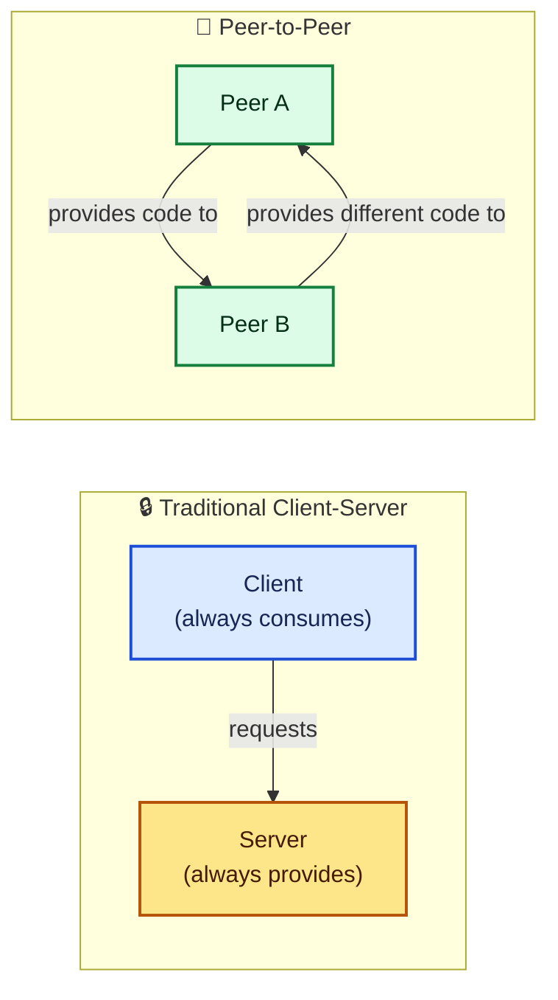

In CodeShare, **every code owner is running their own web service.** They're a service provider (exposing `search`/`list`/`info`/`get` to anyone who asks) and simultaneously a service consumer (calling the CodeShare server's `update` and login-verification operations). The CodeShare server itself is also playing both roles: it's a consumer of nothing external here, but it's providing multiple distinct services (master index, client/auth, verification) to everyone else in the network.

> 💡 **Tip:** This connects directly back to the **peer services model** I covered in my very first post on this topic, where I used Instant Messaging as the example: you're a provider when you receive a chat invitation, and a consumer when you send one. CodeShare is that same idea, just applied to sharing source code instead of chat messages. **Peer web services means using already-deployed web services technologies (SOAP, WSDL) to build P2P systems**, not inventing a separate P2P-specific protocol stack.

---

## 3. Prerequisites and a Real Toolkit Bug

Before touching any code, the book lists a fairly serious set of prerequisites, and I want to walk through them because one of them is a genuine, documented bug fix, not just an installation step.

| Requirement | Purpose |
|---|---|
| **SOAP::Lite 5.1+** | Powers the Perl-based owner service and client |
| **DBI and DBD::CSV** | Perl SQL modules used by the owner server (same pattern as the Publisher service from my earlier post) |
| **A servlet-enabled web server** (Tomcat 3.22 recommended) | Hosts the Java-based CodeShare server components |
| **A JAXP-enabled XML parser** (Xerces 1.4) | XML processing on the Java side |
| **Apache SOAP** | The Java SOAP engine, with a caveat below |
| **IBM XML Security Suite** | Provides XML Digital Signature support for signing SAML assertions |

### 3.1 The Apache SOAP 2.2 Bug

This is worth walking through in detail, because it's a genuinely instructive example of a real-world XML bug. Apache SOAP 2.2, the current version at the time of writing, **produced invalid XML in certain situations**, and CodeShare happens to trigger exactly that situation.

The problem lives in `DOM2Writer.java`, specifically in how it serializes attributes. The original code just dumps every attribute out flat:

```java
out.print(' ' + attr.getNodeName() +"=\"" + normalize(attr.getValue()) + '\"');
```

The fix distinguishes `xmlns:`-prefixed namespace declaration attributes from ordinary attributes, and only re-declares a namespace prefix if it isn't already in scope on the namespace stack:

```java
if (attr.getNodeName().startsWith("xmlns:") &&
    !(NS_URI_XMLNS.equals(attr.getNamespaceURI()))) {
    String attrName = attr.getNodeName();
    String prefix = attrName.substring(attrName.indexOf(":")+1);
    try {
        String namespaceURI = (String) namespaceStack.lookup(prefix);
        if (!attr.getNodeValue().equals(namespaceURI)) {
            printNamespaceDecl(prefix, namespaceURI, namespaceStack, out);
        }
    } catch (IllegalArgumentException e) {
        printNamespaceDecl(prefix, attr.getNodeValue(), namespaceStack, out);
    }
} else {
    out.print(' ' + attr.getNodeName() +"=\"" + normalize(attr.getValue()) + '\"');
}
```

Plus a new helper method:

```java
private static void printNamespaceDecl(String prefix, String namespaceURI,
        ObjectRegistry namespaceStack, PrintWriter out) {
    if (!(namespaceURI.equals(NS_URI_XMLNS) && prefix.equals("xmlns"))) {
        out.print(" xmlns:" + prefix + "=\"" + namespaceURI + '\"');
    }
    namespaceStack.register(prefix, namespaceURI);
}
```

> ⚠️ **Caution:** This is a genuinely useful illustration of a **namespace-stack bug**: treating every attribute identically, without checking whether it's a namespace declaration and whether that namespace is already in scope, can lead to malformed or duplicated namespace declarations in the serialized output. If you're ever debugging "my SOAP toolkit is emitting XML my parser rejects," this exact class of bug, attribute serialization not respecting the namespace context, is a good first place to look.

Building the patched Apache SOAP requires **Ant**, Apache's Java build tool, plus JavaMail and the Java Activation Framework on the classpath:

```text
java org.apache.tools.ant.Main compile
```

That produces a new `soap.jar` with the fix baked in, which then replaces whatever `soap.jar` was already on your application server's classpath.

> 📝 **Note:** The book states this fix had already been submitted upstream and shouldn't be necessary in versions after 2.2. I can't verify that claim directly (I don't have a copy of Apache SOAP 2.3 or later to check against), but it's exactly the kind of fix you'd expect to get folded into a point release once reported.

---

## 4. The CodeShare Index and Dublin Core

Every CodeShare participant describes what they're sharing through an `index.xml` file that mirrors their actual directory structure. Take this small Java project:

```text
HelloWorld
+---build.xml
+---lib
|   +---HelloWorld.jar
+---src
    +---oreilly
        +---samples
            +---HelloWorld
                +---HelloWorld.java
```

Six directories and three files, expressed as an index like this:

```xml
<codeShare xmlns:dc="http://purl.org/dc/elements/1.1/">
  <project location="HelloWorld">
    <dc:Title>HelloWorld</dc:Title>
    <dc:Creator>James Snell, et al</dc:Creator>
    <dc:Date>2001-08-20</dc:Date>
    <dc:Subject>Hello World Web service example</dc:Subject>
    <dc:Description>
      Example Hello World Web service
    </dc:Description>
    <file location="build.xml">
      <dc:Title>Ant Build Script</dc:Title>
    </file>
    <directory location="lib">
      <dc:Title>Compiled libraries</dc:Title>
      <file location="HelloWorld.jar">
        <dc:Title>Compiled Hello World JAR</dc:Title>
      </file>
    </directory>
    <directory location="src">
      <dc:Title>Source Code</dc:Title>
      <directory location="oreilly">
        <dc:Title>oreilly</dc:Title>
        <directory location="samples">
          <dc:Title>samples</dc:Title>
          <directory location="HelloWorld">
            <dc:Title>HelloWorld</dc:Title>
            <file location="HelloWorld.java">
              <dc:Title>HelloWorld.java</dc:Title>
            </file>
          </directory>
        </directory>
      </directory>
    </directory>
  </project>
</codeShare>
```

> 📝 **Note:** I corrected a small case-sensitivity slip from the book's own listing here, `<dc:title>` closing what opened as `<dc:Title>` under the `oreilly` directory. XML tag names are case-sensitive, so `<dc:Title>oreilly</dc:title>` as written wouldn't parse; I've made it consistently `<dc:Title>` throughout, matching every other use in the document.

The structure itself is simple: `codeShare` is the root, `project` marks a shared project, `directory` and `file` mirror the filesystem, recursively.

### 4.1 Why Dublin Core

The genuinely interesting design choice here is layering **Dublin Core metadata** onto every shared item. Dublin Core is a real, independent metadata standard for describing internet resources, defining fifteen standard elements:

| Element | Description |
|---|---|
| **Title** | The name given to the resource |
| **Creator** | The entity responsible for creating the resource |
| **Subject** | A short topic describing the resource |
| **Description** | A detailed, textual description |
| **Publisher** | The entity responsible for making the resource available |
| **Contributor** | An entity responsible for contributions to the resource |
| **Date** | Typically, the date the resource was created |
| **Type** | The generic type of resource (not the MIME type) |
| **Format** | The MIME Content Type or other physical format |
| **Identifier** | An unambiguous reference to the resource |
| **Source** | A reference to the resource this one is derived from |
| **Language** | The (natural) language the resource is presented in |
| **Relation** | A reference to a related resource |
| **Coverage** | The extent or scope of the resource |
| **Rights** | Information about rights held in or over the resource |

Without these, CodeShare's search would be limited to matching on the bare filename or directory name. With them, search can target any Dublin Core element, and, critically, **`dc:Rights` doubles as the access control mechanism**, which I'll get to in section 12.

> 💡 **Tip:** This is a good general pattern worth remembering: rather than inventing a bespoke metadata schema, CodeShare reuses an existing, independent standard and just namespaces it in (`xmlns:dc="http://purl.org/dc/elements/1.1/"`). That's the same "don't reinvent what already exists" instinct that led WSDL to reuse XML Schema for data types, back in my previous post.

---

## 5. What "Web Services Security" Actually Means

Before getting into SAML specifically, I want to sit with a point the book makes that I think is genuinely important: **"security" for web services isn't one thing.** It's a loose bundle of related but separate concerns:

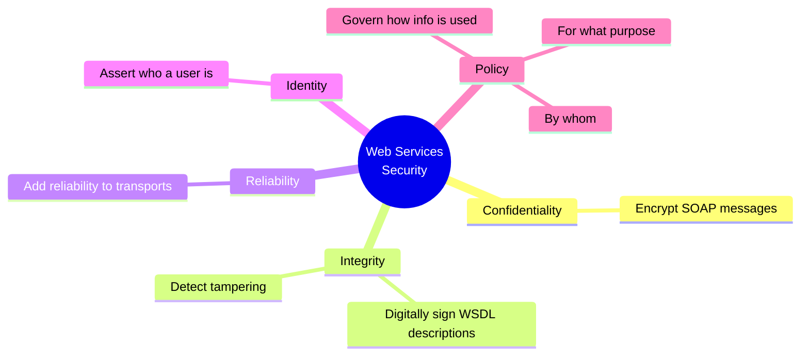

The book is candid that fully covering all of this could be its own book, and that at the time of writing, **none of these areas had settled de facto or formal standards.** So CodeShare deliberately scopes down to just **one** piece: **user authentication.**

Even authentication itself splits into two fundamentally different architectural choices:

| Approach | How it works | Example |
|---|---|---|
| **Transport-layer authentication** | The transport itself handles identity, before the SOAP message is even parsed | HTTP Basic or Digest Authentication |
| **Service-layer authentication** | The web service itself is responsible for validating identity, as part of the application logic | Microsoft Passport's Kerberos-based approach; CodeShare's own SAML-based `login` operation |

CodeShare picks **service-layer authentication**, which is why it needs its own `login` operation and its own token format, rather than leaning on HTTP's built-in mechanisms.

---

## 6. SAML: Security Assertions Markup Language

**SAML** defines an XML syntax for expressing security-related facts, things like "Pavel Kulchenko authenticated at 10:00 a.m. and that authentication expires at 2:00 p.m." These facts are called **assertions**.

The key property: **assertions are created and digitally signed by the authentication authority** (here, the CodeShare server). Anyone who receives a signed assertion can verify it was genuinely issued by that authority, without needing to trust the bearer's own word for it.

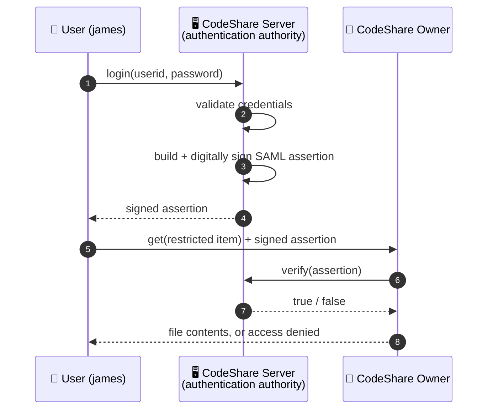

### 6.1 A Signed Assertion, Walked Through

Here's the actual structure the book generates (trimmed for readability; I'll show the full base64-heavy version is genuinely that verbose in practice):

```xml
<Signature xmlns="http://www.w3.org/2000/09/xmldsig#">
  <SignedInfo>
    <CanonicalizationMethod
        Algorithm="http://www.w3.org/TR/2000/WD-xml-c14n-20000119"/>
    <SignatureMethod
        Algorithm="http://www.w3.org/2000/09/xmldsig#dsa-sha1"/>
    <Reference URI="#999852828470">
      <DigestMethod
          Algorithm="http://www.w3.org/2000/09/xmldsig#sha1"/>
      <DigestValue>pCvvhLY/UdR7D8Jzja7kG2+finQ=</DigestValue>
    </Reference>
  </SignedInfo>
  <SignatureValue>
    T110Nd9tt4f1m9Ahoe82HoPXWrZ0se/9ON9qU01TRkZ4FrOg8DBg9g==
  </SignatureValue>
  <KeyInfo>
    <!-- DSA public key and X.509 certificate details -->
  </KeyInfo>
  <dsig:Object Id="999852828470" xmlns=""
      xmlns:dsig="http://www.w3.org/2000/09/xmldsig#">
    <AuthenticationAssertion AssertionID="999852828470"
        IssueInstant="Fri Sep 07 01:53:48 PDT 2001"
        Issuer="CodeShare.org" Version="1.0"
        xmlns="http://www.oasis-open.org/committees/security/docs/draft-sstc-schema-assertion-15.xsd">
      <Subject>
        <NameIdentifier>
          <SecurityDomain>CodeShare.org</SecurityDomain>
          <Name>james</Name>
        </NameIdentifier>
      </Subject>
      <AuthenticationMethod>http://codeshare.org</AuthenticationMethod>
      <AuthenticationInstant>
        Fri Sep 07 01:53:48 PDT 2001
      </AuthenticationInstant>
      <AuthenticationLocale>
        <IP>123.123.123.123</IP>
        <DNS_Domain>codeshare.org</DNS_Domain>
      </AuthenticationLocale>
    </AuthenticationAssertion>
  </dsig:Object>
</Signature>
```

| Piece | What it says |
|---|---|
| `AuthenticationAssertion` | The core claim: user `james`, domain `CodeShare.org`, authenticated via `http://codeshare.org` |
| `IssueInstant` | When the assertion was created |
| `AuthenticationLocale` | Where the authentication happened (IP and DNS domain of the authenticating server) |
| `SignedInfo` / `SignatureValue` / `KeyInfo` | The XML Digital Signature wrapping the assertion, proving it genuinely came from CodeShare.org's private key |

The whole point: **`james` authenticated on Friday, September 7, at 1:53 p.m. PDT, using CodeShare's login operation, from a server at `123.123.123.123` in the `codeshare.org` DNS domain, and that claim is digitally signed so anyone can verify it wasn't forged.**

### 6.2 SAML's Honest Weak Spot

The book doesn't oversell this. It says outright: **it's not a perfect security solution.** The most significant gap: "it is very easy for somebody to intercept a signed SAML assertion and pretend to be the person for whom it is issued." A signature proves the assertion **came from the right issuer and wasn't altered**, it says nothing about whether the **bearer presenting it right now** is actually the person named inside it.

> ⚠️ **Caution:** This is a **bearer token** problem, and it's exactly the same category of weakness as an unencrypted session cookie: whoever holds the token can use it, full stop. If a signed SAML assertion is intercepted in transit (say, over plain HTTP), the interceptor can replay it against any CodeShare owner and be treated as the legitimate user. The book flags this honestly rather than pretending the design is bulletproof, which I appreciate, but it's a real limitation you'd need to close before using anything like this in production, typically with transport encryption (TLS) plus a short expiry window and one-time-use tokens.

---

## 7. Tested: A Simplified Assertion Issue/Verify Flow

I wanted to verify the *trust logic* underneath SAML's signature scheme actually behaves the way the book claims, without needing the full IBM XML Security Suite (which isn't available in this environment) or real DSA key generation. So I built a **simplified stand-in**: instead of an X.509 certificate and a DSA signature over canonicalized XML, I used an HMAC-SHA256 signature over a canonical string of the assertion's fields, keyed by a shared secret standing in for the issuer's private key.

> 📝 **Honest note before the code:** This is **not** real XML-DSig. It doesn't do XML canonicalization, doesn't use asymmetric cryptography, and doesn't embed a certificate chain. What it **does** faithfully model is the actual trust property the book is describing: an assertion is only trustworthy if a signature computed over its exact fields checks out against the issuer's key, and changing any field or signing with the wrong key must be detectable.

```python
"""A simplified, tested stand-in for the CodeShare SAML flow: create a signed
assertion (HMAC standing in for the book's XML-DSig/DSA signature), verify it,
and confirm tampering and issuer-mismatch are both detected. This isn't real
XML-DSig -- it's a minimal model of the same trust flow: an assertion is only
trustworthy if a signature over its exact fields checks out against the
issuer's key."""
import hmac, hashlib, time

ISSUER_KEY = b"CodeShare-server-private-key"  # stands in for the DSA private key

def make_assertion(subject, security_domain, issuer, auth_method):
    assertion = {
        "AssertionID": str(int(time.time() * 1000)),
        "Issuer": issuer,
        "IssueInstant": time.strftime("%Y-%m-%dT%H:%M:%SZ", time.gmtime()),
        "SubjectName": subject,
        "SecurityDomain": security_domain,
        "AuthenticationMethod": auth_method,
    }
    canonical = "|".join(f"{k}={assertion[k]}" for k in sorted(assertion))
    signature = hmac.new(ISSUER_KEY, canonical.encode(), hashlib.sha256).hexdigest()
    return {"assertion": assertion, "signature": signature}

def verify_assertion(token):
    assertion = token["assertion"]
    canonical = "|".join(f"{k}={assertion[k]}" for k in sorted(assertion))
    expected = hmac.new(ISSUER_KEY, canonical.encode(), hashlib.sha256).hexdigest()
    return hmac.compare_digest(expected, token["signature"])

# 1. normal assertion round-trips correctly
tok = make_assertion("james", "CodeShare.org", "CodeShare.org", "http://codeshare.org")
print("1 valid assertion verifies:", verify_assertion(tok))

# 2. tampering with the subject after issuance (impersonation attempt)
forged = {"assertion": dict(tok["assertion"]), "signature": tok["signature"]}
forged["assertion"]["SubjectName"] = "pavel"
print("2 forged subject rejected:", not verify_assertion(forged))

# 3. an assertion "signed" with the wrong key (a rogue owner pretending to be CodeShare)
def make_rogue_assertion(subject):
    assertion = {
        "AssertionID": "1",
        "Issuer": "CodeShare.org",
        "IssueInstant": "2001-09-07T01:53:48Z",
        "SubjectName": subject,
        "SecurityDomain": "CodeShare.org",
        "AuthenticationMethod": "http://codeshare.org",
    }
    canonical = "|".join(f"{k}={assertion[k]}" for k in sorted(assertion))
    rogue_sig = hmac.new(b"not-the-real-key", canonical.encode(), hashlib.sha256).hexdigest()
    return {"assertion": assertion, "signature": rogue_sig}

rogue = make_rogue_assertion("james")
print("3 rogue-signed assertion rejected:", not verify_assertion(rogue))
```

Output:

```text
1 valid assertion verifies: True
2 forged subject rejected: True
3 rogue-signed assertion rejected: True
```

| Test | What it confirms |
|---|---|
| **1. Valid assertion** | An assertion signed with the real issuer key, checked with the same key, verifies correctly |
| **2. Forged subject** | Changing `SubjectName` after issuance (a `james` token edited to claim `pavel`) is caught, because the signature no longer matches the modified fields |
| **3. Rogue issuer** | An assertion claiming `Issuer="CodeShare.org"` but actually signed with a **different** key is rejected, since verification always checks against the real, expected issuer key rather than trusting the `Issuer` field's own say-so |

> 💡 **Tip:** Test 3 is the one I think matters most conceptually. It's tempting to think a signature just proves "this data wasn't tampered with," but the *real* guarantee only holds if the verifier checks against **the specific key it actually trusts for that issuer**, not whatever key happens to be embedded in the message. A forged assertion could claim to be from `CodeShare.org` and even include a self-signed certificate saying so; what makes the whole scheme work is the verifier independently knowing which key `CodeShare.org` actually uses, not trusting a claim inside the document itself.

What this test **doesn't** cover, and this is exactly the honest gap the book itself names, is the **bearer/replay problem** from section 6.2. A correctly signed, unmodified, genuinely-issued assertion, intercepted and replayed by someone else, would pass this exact verification logic. Signature validity and bearer legitimacy are two different questions, and this simplified model only answers the first one, which is also all the book's own implementation answers.

---

## 8. The Four CodeShare Interfaces

CodeShare isn't one service, it's **four separate WSDL-described interfaces**, each independently implementable in any SOAP-capable language. The book actually mixes Java and Perl across them, which is a nice reinforcement of the language-agnosticism theme running through this whole series.

| Interface | Implemented by | Purpose |
|---|---|---|
| **Owner interface** | Both CodeShare owners (Perl) and the server (Java, partial) | `search`, `list`, `info`, `get` |
| **Client interface** | CodeShare server (Java) | `register`, `login` |
| **Login verification interface** | CodeShare server (Java) | `verify` — lets owners confirm a signed assertion is genuine |
| **Master index interface** | CodeShare server (Java) | `register`, `update` — owners push their local index up to the master index |

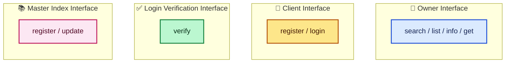

### 8.1 The Owner Interface, in Detail

Four operations, all returning a SOAP-encoded array of items:

```java
public List search(String value, String dcElement);
public List list(String value, String dcElement);      // both params optional
public List info(String value, String dcElement);       // same signature as list
public List get(String value, String dcElement);        // same signature as list
```

- **`search`**: searches `index.xml` for a value, defaulting to matching against `dc:Title`, but any Dublin Core element can be targeted instead.
- **`list`**: lists projects/items, optionally filtered, returning only basic info (location, title).
- **`info`**: like `list`, but returns **detailed** information about matched items.
- **`get`**: like `list`, but retrieves the **actual files**, recreating the directory structure.

A sample response, showing SOAP-encoded array syntax exactly as I covered it in my very first post on this topic:

```xml
<env:Envelope xmlns:env="http://schemas.xmlsoap.org/soap/envelope/"
    xmlns:enc="http://schemas.xmlsoap.org/soap/encoding/">
  <env:Body>
    <env:listResponse>
      <Items enc:arrayType="csi:item[2]" xsi:type="csi:ArrayOfItems">
        <item xsi:type="namesp1:SOAPStruct">
          <path xsi:type="xsd:string">HelloWorld</path>
          <title xsi:type="xsd:string">HelloWorld</title>
          <fullpath xsi:type="xsd:string">HelloWorld/</fullpath>
          <type xsi:type="xsd:string">project</type>
        </item>
        <item xsi:type="namesp1:SOAPStruct">
          <path xsi:type="xsd:string" />
          <title xsi:type="xsd:string">build.xml</title>
          <fullpath xsi:type="xsd:string">HelloWorld/</fullpath>
          <type xsi:type="xsd:string">file</type>
        </item>
      </enc:Array>
    </env:listResponse>
  </env:Body>
</env:Envelope>
```

### 8.2 The WSDL Behind It

The item data type, defined via embedded XML Schema (following the pattern from my previous WSDL post), deliberately leaves room for arbitrary Dublin Core elements via `xsd:any`:

```xml
<xsd:element name="item">
  <xsd:annotation>
    <xsd:documentation>CodeShare Indexed Item</xsd:documentation>
  </xsd:annotation>
  <xsd:complexType>
    <xsd:sequence>
      <xsd:all>
        <xsd:element name="path" type="xsd:string" nullable="true" minOccurs="0"/>
        <xsd:element name="title" type="xsd:string" nullable="true" minOccurs="0"/>
        <xsd:element name="fullpath" type="xsd:string" nullable="true" minOccurs="0"/>
        <xsd:element name="type" type="xsd:string" nullable="true" minOccurs="0"/>
      </xsd:all>
      <xsd:any namespace='xmlns:dc="http://purl.org/dc/elements/1.1/"'
                processContents="lax" minOccurs="0" maxOccurs="unbounded"/>
    </xsd:sequence>
  </xsd:complexType>
</xsd:element>
```

And `ArrayOfItems`, built directly on the Section 5 encoding `Array` type from my very first post:

```xml
<xsd:complexType name="ArrayOfItems">
  <xsd:complexContent>
    <xsd:extension base="se:Array">
      <xsd:attribute ref="se:arrayType" wsdl:arrayType="types:item[]" />
    </xsd:extension>
  </xsd:complexContent>
</xsd:complexType>
```

Messages, port type, and binding follow exactly the pattern from my WSDL post, two messages per operation, a `portType` tying them together, and a binding layering SOAP specifics on top:

```xml
<wsdl:message name="search">
  <part name="p1" type="xsd:string" />
  <part name="p2" type="xsd:string" />
</wsdl:message>
<wsdl:message name="searchResponse">
  <part name="response" type="types:ArrayOfItems" />
</wsdl:message>

<wsdl:portType name="CodeShareOwnerInterface">
  <wsdl:operation name="search" parameterOrder="p1 p2">
    <wsdl:input name="search" message="tns:search" />
    <wsdl:output name="searchResponse" message="tns:searchResponse" />
  </wsdl:operation>
  <!-- list, info, get follow the same shape -->
</wsdl:portType>

<wsdl:binding name="CodeShareOwner_SOAP_HTTP" type="tns:CodeShareOwnerInterface">
  <soap:binding style="rpc" transport="http://schemas.xmlsoap.org/soap/http" />
  <wsdl:operation name="search">
    <soap:operation soapAction="urn:CodeShareOwner#search" />
    <wsdl:input>
      <soap:body use="encoded" namespace="urn:CodeShareOwner"
          encodingStyle="http://schemas.xmlsoap.org/soap/encoding/" />
    </wsdl:input>
    <wsdl:output name="Name">
      <soap:body use="encoded" namespace="urn:CodeShareOwner"
          encodingStyle="http://schemas.xmlsoap.org/soap/encoding/" />
    </wsdl:output>
  </wsdl:operation>
</wsdl:binding>
```

> 💡 **Tip:** The `parameterOrder="p1 p2"` attribute is worth noticing. It's WSDL's way of pinning down the exact order parts must appear in within the SOAP body, closing off exactly the kind of ambiguity that caused the .NET-vs-Perl parameter-naming interoperability bug I dug into in my earlier "Writing SOAP Web Services" post. A well-specified WSDL binding is, among other things, a defense against that entire category of interoperability failure.

---

## 9. Implementing the CodeShare Server in Java

The Java-side CodeShare server splits into four services, each mapping to one interface. Deployment follows exactly the Apache SOAP pattern from my earlier post, separate deployment descriptors per service.

### 9.1 The Master Index Service

`register` simply appends a new `<owner>` element to an XML file, after checking the ID isn't already taken:

```java
public static boolean register(String ownerid, String password, String url) {
    Element e = doc.getDocumentElement();
    NodeList nl = e.getElementsByTagName("owner");
    for (int n = 0; n < nl.getLength(); n++) {
        Element ex = (Element) nl.item(n);
        if (ex.getAttribute("id").equals(ownerid)) {
            throw new IllegalArgumentException(
                "An owner with that ID already exists!");
        }
    }
    Element u = doc.createElement("owner");
    u.setAttribute("id", ownerid);
    u.setAttribute("password", password);
    u.setAttribute("url", url);
    e.appendChild(u);
    XMLUtil.put(owners, doc);
    return true;
}
```

`update` either replaces an owner's existing index entry or inserts a new one:

```java
public static boolean update(String ownerid, String password, Element index) {
    Element el = doc.getDocumentElement();
    NodeList nl = el.getElementsByTagName("owner");
    for (int n = 0; n < nl.getLength(); n++) {
        Element e = (Element) nl.item(n);
        if (e.getAttribute("id").equals(ownerid) &&
            e.getAttribute("password").equals(password)) {
            Element i = (Element) doc.importNode(index, true);
            NodeList c = e.getElementsByTagName("index");
            if (c.getLength() > 0) {
                Node node = c.item(1);
                e.replaceChild(node, i);
            } else {
                e.appendChild(i);
            }
            XMLUtil.put(owners, doc);
            return true;
        }
    }
    return false;
}
```

> ⚠️ **Caution:** Look closely at `c.item(1)` in the replace branch. If `getElementsByTagName("index")` returns exactly one matching `<index>` element (the expected case, since each owner should have exactly one index), that element sits at position **0**, not 1. As written, this looks like an off-by-one bug: it would fetch the *second* matching `index` element (if one existed) as the node to replace, rather than the first and presumably only one. I can't confirm this is a genuine bug in the book's actual shipped source versus a transcription artifact in the printed listing, but it's exactly the kind of subtle indexing mistake worth double-checking if you're adapting this code.

The deployment descriptor follows the exact Apache SOAP pattern from my earlier post:

```xml
<isd:service xmlns:isd="http://xml.apache.org/xml-soap/deployment"
    id="urn:CodeShareService-MasterIndex">
  <isd:provider type="java" scope="Application" methods="register update">
    <isd:java class="codeshare.IndexService"/>
  </isd:provider>
  <isd:faultListener>org.apache.soap.server.DOMFaultListener</isd:faultListener>
</isd:service>
```

### 9.2 The Owner Service (Server-Side)

This is a **partial** implementation of the owner interface, living on the CodeShare server. It only implements `search` and `list`, against the **master index**, not `get` or `info`, those always go directly to the actual owner:

```java
public org.w3c.dom.Element search(String p1) {
    return search(p1, "dc:Title");
}

public Element search(String p1, String p2) {
    Element e = doc.getDocumentElement();
    NodeList nl = e.getElementsByTagName(p2);
    Document d = SAMLUtil.newDocument();
    Element list = doc.createElement("list");
    d.appendChild(list);
    for (int n = 0; n < nl.getLength(); n++) {
        Element next = (Element) nl.item(n);
        try {
            RE targetRE = new RE(p1);
            if (targetRE.match(SAMLUtil.getInnerText(next.getText())) {
                Element item = (Element) d.importNode(next);
                list.appendChild(item);
            }
        } catch (Exception exc) {
        }
    }
    return list;
}
```

> ⚠️ **Caution:** There's an unbalanced parenthesis in the book's own listing here: `if (targetRE.match(SAMLUtil.getInnerText(next.getText()))` is missing its closing `)` before the block opens. As printed, this wouldn't compile. If you're adapting this, the fix is straightforward, add the missing `)` to close the `match(...)` call, but it's worth flagging as an actual defect in the source material rather than silently "fixing" it without comment.

Deployment descriptor for this side of the owner interface:

```xml
<isd:service xmlns:isd="http://xml.apache.org/xml-soap/deployment"
    id="urn:CodeShareService-OwnerService">
  <isd:provider type="java" scope="Application" methods="list search">
    <isd:java class="codeshare.OwnerService"/>
  </isd:provider>
  <isd:faultListener>org.apache.soap.server.DOMFaultListener</isd:faultListener>
</isd:service>
```

---

## 10. Signing the Assertion: Keystores and XML-DSig

This is the part of the Java implementation that leans hardest on external infrastructure: Java's own **keystore** mechanism and the **IBM XML Security Suite**.

### 10.1 Building the Assertion Object

Since there was no standard SAML API at the time, the book builds its own object model and hand-serializes it. Setting the required properties:

```java
AuthenticationAssertion aa = new AuthenticationAssertion();
IDType aid = new IDType(id);
aa.setAssertionID(aid);
aa.setIssuer(issuerName);
aa.setIssueInstant(issueInstant);
```

The subject:

```java
Subject subject = new Subject();
{
    NameIdentifier ni = new NameIdentifier();
    ni.setName(name);
    ni.setSecurityDomain(domain);
    subject.setNameIdentifier(ni);
    aa.setSubject(subject);
}
```

And the authentication details:

```java
aa.setAuthenticationMethod(new AuthenticationMethod(method));
aa.setAuthenticationInstant(new AuthenticationInstant(authInstant));
AuthenticationLocale locale = new AuthenticationLocale();
locale.setIP(ip);
locale.setDNSDomain(dns);
aa.setAuthenticationLocale(locale);
```

An `AssertionFactory` wraps all of this into one call:

```java
AuthenticationAssertion aa = AssertionFactory.newInstance(
    new String(new Long(System.currentTimeMillis()).toString()),
    "CodeShare.org",
    new java.util.Date(),
    userid,
    "CodeShare.org",
    "http://codeshare.org",
    java.net.InetAddress.getLocalHost().getHostAddress(),
    java.net.InetAddress.getLocalHost().getHostName()
);
```

### 10.2 Java Keystores, in Brief

A **keystore** is a local database of your private keys. The `keytool` utility, shipped with the JDK, both generates new keys and manages keystore files:

```text
C:\book>keytool -genkey -dname "cn=CodeShare Server" -keypass CodeShare -alias CodeShare -storepass CodeShare -keystore codeshare.db
```

This creates `codeshare.db`, holding the private key for `cn=CodeShare Server`, which is what will actually sign every assertion.

### 10.3 Signing with the IBM XML Security Suite

You can't sign the assertion object directly, it has to be **serialized to a DOM document first**:

```java
Document doc = SAMLUtil.newDocument();
Element root = doc.createElement("root");
assertion.serialize(root);
```

A `SignatureGenerator` handles the actual cryptography, configured for SHA-1 digests, W3C canonicalization, and DSA signing:

```java
SignatureGenerator siggen = new SignatureGenerator(doc,
    DigestMethod.SHA1, Canonicalizer.W3C, SignatureMethod.DSA, null);
```

The signature can either embed the signed content directly, or link out to it externally. The book chooses the more common approach, embedding:

```java
siggen.addReference(
    siggen.createReference(
        siggen.wrapWithObject(
            root.getFirstChild(),
            assertion.getAssertionID().getText())
    )
);
```

Loading the key material from the keystore, and packaging the public key/certificate into the signature's `KeyInfo` so it can later be verified:

```java
KeyStore keystore = KeyStore.getInstance("JKS");
keystore.load(new FileInputStream(keystorepath), storepass.toCharArray());
X509Certificate cert = (X509Certificate) keystore.getCertificate(alias);
Key key = keystore.getKey(alias, keypass.toCharArray());
if (key == null) {
    throw new IllegalArgumentException("Invalid Key Info");
}

KeyInfo keyInfo = new KeyInfo();
KeyInfo.X509Data x5data = new KeyInfo.X509Data();
x5data.setCertificate(cert);
x5data.setParameters(cert, true, true, true);
keyInfo.setX509Data(new KeyInfo.X509Data[] { x5data });
keyInfo.setKeyValue(cert.getPublicKey());
siggen.setKeyInfoGenerator(keyInfo);
```

And finally, the sign operation itself:

```java
Element sig = siggen.getSignatureElement();
SignatureContext context = new SignatureContext();
context.sign(sig, key);
return sig;
```

### 10.4 The login Operation, Tied Together

```java
public static Element login(String userid, String password) throws Exception {
    Element el = doc.getDocumentElement();
    NodeList nl = el.getElementsByTagName("user");
    for (int n = 0; n < nl.getLength(); n++) {
        Element e = (Element) nl.item(n);
        if (e.getAttribute("id").equals(userid) &&
            e.getAttribute("password").equals(password)) {

            AuthenticationAssertion aa = AssertionFactory.newInstance(
                new String(new Long(System.currentTimeMillis()).toString()),
                "CodeShare.org", new java.util.Date(), userid,
                "CodeShare.org", "http://codeshare.org", new java.util.Date(),
                java.net.InetAddress.getLocalHost().getHostAddress(),
                java.net.InetAddress.getLocalHost().getHostName());

            Element sa = AssertionSigner.sign(aa, "CodeShare.db",
                "CodeShare", "CodeShareKeyPass", "CodeShareStorePass");
            return sa;
        }
    }
    return null;
}
```

> 📝 **Note:** Look closely at the two calls to `AssertionFactory.newInstance` in this section, this one inside `login`, and the earlier standalone example in section 10.1. They pass **different numbers of arguments** (this one has an extra `new java.util.Date()` before the IP/hostname pair). That's either an overloaded method signature the book doesn't show both versions of, or an inconsistency between the two listings. I'm flagging it rather than silently reconciling it, since I can't verify which (if either) matches the actual shipped source in Appendix C.

The verification service, run by the CodeShare server so owners don't need to implement digital signature verification themselves:

```java
public static boolean verify(Element signature) throws Exception {
    Key key = null;
    Element keyInfoElement = KeyInfo.searchForKeyInfo(signature);
    if (keyInfoElement != null) {
        KeyInfo keyInfo = new KeyInfo(keyInfoElement);
        key = keyInfo.getKeyValue();
    }
    SignatureContext context = new SignatureContext();
    Validity validity = context.verify(signature, key);
    return validity.getCoreValidity();
}
```

> ⚠️ **Caution:** The book is candid about a real weakness here too: `verify` "would include a number of checks, such as ensuring that all of the fields contain valid data," which have been **omitted for brevity**. In other words, this reference implementation checks the cryptographic signature but doesn't validate the assertion's actual field contents (like expiry). Don't treat this as a template for a production verification routine without adding those checks back in.

Deployment descriptors for the client and verification services follow the exact same pattern as before:

```xml
<isd:service xmlns:isd="http://xml.apache.org/xml-soap/deployment"
    id="urn:CodeShareService-ClientService">
  <isd:provider type="java" scope="Application" methods="register login">
    <isd:java class="codeshare.AuthenticationService"/>
  </isd:provider>
  <isd:faultListener>org.apache.soap.server.DOMFaultListener</isd:faultListener>
</isd:service>
```

```xml
<isd:service xmlns:isd="http://xml.apache.org/xml-soap/deployment"
    id="urn:CodeShareService-Verification">
  <isd:provider type="java" scope="Application" methods="verify">
    <isd:java class="codeshare.VerificationService"/>
  </isd:provider>
  <isd:faultListener>org.apache.soap.server.DOMFaultListener</isd:faultListener>
</isd:service>
```

---

## 11. Implementing the CodeShare Owner in Perl

The owner side is a lighter-weight Perl application on top of **SOAP::Lite**, exactly the toolkit from my earlier "Writing SOAP Web Services" post, implementing the same `CodeShareOwnerInterface` port type as the Java service, but the full version (including `get` and `info`, which the server-side Java implementation deliberately omits).

### 11.1 Loading the Index

```perl
sub init {
    my($class, $root) = @_;
    open(F, $root) or die "$root: $!\n";
    $index = SOAP::Custom::XML::Deserializer
        ->deserialize(join '', <F>)->root;
    close(F) or die "$root: $!\n";
}
```

### 11.2 A Proxy Back to the CodeShare Server

Just like the client-side patterns from my earlier posts, the owner needs its own SOAP::Lite proxy to talk *back* to the CodeShare server, both to push index updates and to verify assertions:

```perl
my $codeshare_server;
sub codeshare_server {
    return $codeshare_server ||=
        SOAP::Lite
            ->proxy($SERVER_ENDPOINT)
            ->uri("urn:Services:CodeShareServer");
}

sub update {
    shift->codeshare_server->update(@_)->result;
}
```

### 11.3 Validating Assertions, with Caching

```perl
sub is_valid_signature {
    my($self, $username, $signature) = @_;
    my $key = join "\0", $username, $signature;
    # already cached?
    return $cache{$key} if exists $cache{$key};
    my $response = eval { $self->codeshare_server
        ->isValid(SOAP::Data->type(xml => $signature)) };
    die "CodeShare server is unavailable. Can't validate credentials\n" if $@;
    die "CodeShare server is unavailable. ", $response->faultstring, "\n"
        if $response->fault;
    die "Invalid credentials\n"
        unless $cache{$key} = $response->result;
    return $cache{$key};
}
```

> 💡 **Tip:** The caching here is a sensible performance optimization, avoid a round trip to the CodeShare server for every single file request once a signature has already been validated once, but it's also a place where the earlier bearer-token caution applies doubly: caching "this signature is valid" without also tracking an expiry means a since-expired token could keep being treated as valid locally, even after the server itself would now reject it.

### 11.4 Walking the Index

The `traverse` method recursively walks `index.xml`, checking whether items match search criteria:

```perl
sub traverse {
    my($self, %params) = @_;
    my $start = $params{start};
    my $type = $start->SOAP::Data::name; # file|project|directory
    my $location = ref $start->location ? $start->location->value : '';
    my $path = $type eq 'directory' || $type eq 'file'
        ? join('/', $params{path} || (), $location) : '';
    my $prefix = $type eq 'project' ? $location : $params{prefix} || '';
    my $fullpath = join '/', $prefix, $path;
    my $where = $params{where};

    my $matched =
        $params{get} && $params{matched} ||
        $params{what} &&
        $start->$where() =~ /$params{what}/ && $start->$where()->uri eq $DC_NS;

    return
        ($matched
            ? +{ type => $type, path => $path,
                 ($params{get} ? (fullpath => $fullpath) : ()),
                 map { ref $start->$_() ? ($_ => $start->$_()->value) : () } @ELEMENTS
               }
            : ()
        ),
        map { $self->traverse(start => $_, where => $where, what => $params{what},
                               path => $path, prefix => $prefix,
                               get => ($params{get} || 0), matched => $matched) }
            $start->project, $start->directory,
            ($type eq 'file' ? () : $start->file);
}
```

And `list`, a thin wrapper around it:

```perl
sub list {
    pop;
    my($self, $what) = @_;
    return [ map { my $e = $_; +{ map {$_ => $e->{$_}}
        qw(type path Title file fullpath) } }
        $self->traverse(start => $index, where => 'Title', what => $what, get => 1)
    ];
}
```

---

## 12. Tested: The Dublin-Core Rights Check

This is the piece I most wanted to verify directly, because it's the actual **access control gate** for the whole system.

An owner restricts an item by adding a `dc:Rights` element listing authorized usernames:

```xml
<codeshare>
  <project location="HelloWorld">
    <dc:Title>Hello World</dc:Title>
    <dc:Rights>james pavel doug</dc:Rights>
  </project>
</codeshare>
```

The `get` operation checks both that a requested item's rights list, if present, includes the requester, **and** that their signature validates:

```perl
sub get {
    my $self = shift;
    my $envelope = $_[-1];
    my $username =
        $envelope->valueof('//{http://www.oasis-open.org/committees/security/docs/draft-sstc-schema-assertion-15.xsd}Name');
    my $results = $self->list(@_);
    [ map {
        $_->{type} eq 'file' && open(F, delete $_->{fullpath})
            ? ($_->{file} = join('', <F>), close F) : ();
        $_
    }
    grep {
        ($_->{Rights} || '') =~ /^\s*$/ ||             # public access if empty
        $username && $_->{Rights} =~ /\b$username\b/ &&
            $self->is_valid_signature($username, get_signature($envelope))
    }
    @$results
    ];
}
```

The rule, spelled out: **an item with no `Rights` at all is public.** An item **with** `Rights` requires both that the requesting username appears in the list **and** that their signature validates. I reimplemented this exact logic in Python to confirm it behaves correctly across the meaningful edge cases.

```python
"""Test of the CodeShare owner's access-control logic from section 7.6.1's `get`
operation: items with no dc:Rights are public; items with dc:Rights are
restricted to the listed usernames, and only reachable with a validated
signature belonging to one of those usernames."""

def is_authorized(item, username, signature_is_valid):
    rights = (item.get("Rights") or "").strip()
    if rights == "":
        return True  # public access if Rights is empty/missing
    allowed_users = rights.split()
    if username and username in allowed_users and signature_is_valid:
        return True
    return False

items = [
    {"path": "build.xml", "Rights": ""},                       # public
    {"path": "HelloWorld/", "Rights": "james pavel doug"},       # restricted
]

tests = [
    # (item index, username, signature valid, expected)
    (0, None, False, True),          # public file, no login needed
    (1, "james", True, True),        # authorized user with valid signature
    (1, "james", False, False),      # authorized user but BAD/unverified signature
    (1, "mallory", True, False),     # unauthorized user, even with a "valid" signature
    (1, None, False, False),         # anonymous request to a restricted item
]

for idx, (item_idx, user, sig_ok, expected) in enumerate(tests, start=1):
    result = is_authorized(items[item_idx], user, sig_ok)
    status = "OK" if result == expected else "FAILED"
    print(f"{idx}. item={items[item_idx]['path']!r} user={user!r} sig_valid={sig_ok} "
          f"-> authorized={result} (expected {expected}) [{status}]")
```

Output:

```text
1. item='build.xml' user=None sig_valid=False -> authorized=True (expected True) [OK]
2. item='HelloWorld/' user='james' sig_valid=True -> authorized=True (expected True) [OK]
3. item='HelloWorld/' user='james' sig_valid=False -> authorized=False (expected False) [OK]
4. item='HelloWorld/' user='mallory' sig_valid=True -> authorized=False (expected False) [OK]
5. item='HelloWorld/' user=None sig_valid=False -> authorized=False (expected False) [OK]
```

| Case | Result | What it confirms |
|---|---|---|
| Public item, no login | ✅ Authorized | Items with empty `Rights` need no authentication at all |
| Listed user, valid signature | ✅ Authorized | The intended "happy path" works |
| Listed user, **invalid** signature | ✅ Denied | Being on the list isn't enough, the signature check is a separate, mandatory gate, not just a formality |
| **Unlisted** user, valid signature | ✅ Denied | A generally-valid CodeShare login doesn't grant access to *every* restricted item, only ones that name that specific user |
| Anonymous request to a restricted item | ✅ Denied | No username at all correctly fails closed, rather than defaulting to some ambiguous behavior |

> 💡 **Tip:** Test case 4 is the one I'd flag as the most important to get right in any access-control system modeled on this pattern: **authentication and authorization are separate checks, and both must pass.** `mallory` can be a perfectly legitimate, successfully-authenticated CodeShare user, with a completely valid signature, and still correctly be denied access to `james`'s restricted files, because being *authenticated* isn't the same as being *authorized* for this specific resource. That's a distinction worth internalizing generally, not just for this example.

---

## 13. The CodeShare Client Shell

The client, like the owner, is a Perl application built on SOAP::Lite, implemented as an interactive shell.

Creating the proxy, either to a specific owner or to the CodeShare server itself:

```perl
my($server, $uri) =
    $ownerserver ? ($ownerserver => 'http://namespaces.soaplite.com/CodeShare/Owner')
                 : ($codeshareserver => 'urn:Services:CodeShareServer');
my $soap = SOAP::Lite
    ->proxy($server)
    ->uri($uri);
```

Logging in is optional, if credentials are given, the client calls `login` and caches the returned assertion:

```perl
my $signature;
if ($username || $password) {
    my $response = $soap->login(
        SOAP::Data->name(credential => join ':', $username, $password)->type('base64')
    );
    die $response->faultstring if $response->fault;
    $signature = SOAP::Data->type(xml => get_signature($response));
}
```

And the interactive loop, handling `search`, `info`, `get`, `list`, `quit`, and `help`:

```perl
while (defined($_ = shift || <>)) {
    next unless /\w/;
    my($method, $modifier, $parameters) =
        m!^\s*(\w+)(?:\s*/(\w*)\s)?\s*(.*)!;
    last if $method =~ /^q(?:uit)?$/i;
    help(), next if $method =~ /^h(?:elp)?$/i;

    my $res = eval "\$soap->$method('$parameters', '$modifier', \$signature || ())";
    $@ and print(STDERR join "\n", $@, ''), next;
    defined($res) && $res->fault and print(STDERR join "\n", $res->faultstring, ''), next;
    !$soap->transport->is_success and print(STDERR join "\n", $soap->transport->status, ''), next;

    my @result = @{$res->result} or print(STDERR "No matches\n"), next;
    foreach (@result) {
        print STDERR "$_->{type}: ", join(', ', $_->{Title} || (), $_->{path} || ()), "\n";
        if ($method eq 'get') {
            if ($_->{type} eq 'directory') { File::Path::mkpath($_->{path}) }
            if ($_->{type} eq 'file') {
                open(F, '>'. $_->{path}) or warn "$_->{path}: $!\n";
                print F $_->{file};
                close(F) or warn "$_->{path}: $!\n";
            }
        } elsif ($method eq 'info') {
            foreach my $key (grep {$_ !~ /^(?:type|path)/} keys %$_) {
                print "  $key: $_->{$key}\n";
            }
        }
    }
} continue {
    print STDERR "\n> ";
}
```

> ⚠️ **Caution:** Building a command string and running it through `eval "\$soap->$method(...)"` interpolates raw user shell input into Perl code before executing it. This is a classic **code injection** shape, if this shell ever accepted input from anything other than a fully trusted local operator (say, if it were exposed as a network-facing service itself), a specially crafted "command" could execute arbitrary Perl. For a local, single-user command-line tool this is a reasonable shortcut; it would need real input sanitization before being anywhere near untrusted input.

Launching the owner server itself is a short SOAP::Lite daemon, exactly the pattern from my earlier "Writing SOAP Web Services" post:

```perl
use SOAP::Transport::HTTP;
use CodeShare::Owner;

print "\n\nWelcome to CodeShare! The Open source code sharing network!";
print "\nCopyright(c) 2001, James Snell, Pavel Kulchenko, Doug Tidwell\n";

CodeShare::Owner->init(shift or die "Usage: $0 <path/to/index.xml>\n");
my $daemon = SOAP::Transport::HTTP::Daemon
    -> new (LocalPort => 8080)
    -> dispatch_to('CodeShare::Owner::(?:get|search|info|list)')
;
print "CodeShare Owner Server started at ", $daemon->url, "\n";
print "Waiting for a request...\n";
$daemon->handle;
```

```text
C:\book>start perl cs_server.pl index.xml
```

---

## 14. What's Deliberately Missing from CodeShare

I appreciated how honest the book is here, rather than pretending the example is complete.

### 14.1 No UDDI

Despite the entire chapter I wrote on UDDI, **CodeShare doesn't use it at all.** And the book turns that into a genuinely useful point: **none of these web services technologies are tightly coupled to each other.** If UDDI doesn't add value in a given situation, you leave it out, the same way SAML would have been left out if it hadn't been useful here.

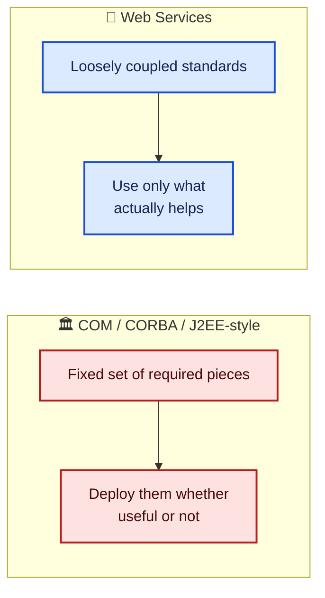

The book is clear that UDDI **could** be added: the CodeShare server itself could be listed in a public registry for discoverability, and since each owner is itself a web service, owners could register there too. It's just not necessary for CodeShare to function.

### 14.2 No Presence or Asynchronous Messaging

Two genuinely P2P features are absent:

| Missing feature | What it would add |
|---|---|
| **Presence** | The owner's daemon could notify the CodeShare server on startup/shutdown, letting the server tell searchers whether an owner is currently online, the same idea as a buddy list in an IM client |
| **Asynchronous messaging** | If an owner is offline when a request comes in, the request could still be queued and delivered once they're back online, rather than simply failing |

Neither is implemented. CodeShare, as built, requires the owner's daemon to be running and reachable at request time.

---

## 15. The Wider Security Landscape

Chapter 8 zooms out from CodeShare's specific approach to survey the broader, and at the time genuinely unsettled, authentication landscape.

### 15.1 What Makes a Service "Secure"

The book's working definition: **a secure web service is one where the sender trusts the recipient's claimed identity (and vice versa), and where information can only be received and accessed by its intended recipient.** That splits into two distinct requirements:

1. Some form of **authentication**
2. Some form of **privacy and integrity protection** (encryption and authorization)

### 15.2 Authentication's Basic Questions

The book frames authentication as answering a genuinely symmetric set of questions, both directions:

- Who am I? How do I prove it? Why should you trust my claim?
- Who are you? How can I verify your claim? Why should I trust it?

**Standardizing how these questions get asked and answered is the actual hard problem**, not any individual cryptographic technique. That's exactly the gap SAML tries to fill.

> 📝 **Note:** The book mentions, in passing, that Microsoft had proposed an alternative approach around this time: embedding structures like Kerberos tickets directly inside the SOAP header, under specifications called **WS-Security** and **WS-License**, used by their then-named ".NET My Services" project (formerly "Hailstorm"). At the time of writing, the book states plainly: **there were no standards, real or de facto, for carrying authentication information within a SOAP envelope.** That's a genuinely unsettled-frontier statement, and I'll revisit how it played out in section 19.

### 15.3 Privacy Is a Separate, Harder Problem

Privacy splits into two distinct issues:

1. **Protecting personal information** once you've been given it (don't send my address and credit card number out over the internet unguarded)
2. **Actually enforcing** who's allowed to use that data, and for what, which requires both authorization policy and encryption

The closest thing to a privacy standard at the time was **P3P** (the W3C's Platform for Privacy Preferences), an XML language for expressing privacy profiles. The book's assessment is blunt: **P3P profiles are not legally binding**, can change at any time, and often did. A company violating its own stated policy faced no legal consequence under the framework itself.

> ⚠️ **Caution, and this is a point I think holds up remarkably well:** the book specifically calls out that **authentication and authorization get conflated** in services like the contemporary Passport, where authenticating automatically shared almost all of a user's profile data with the site. **Identity verification and personal-information sharing are separate concerns**, and collapsing them into one step is a design smell, not just a Passport-specific quirk. Whenever you're evaluating a login flow, "does the act of proving who I am also silently authorize sharing everything about me?" is worth asking explicitly.

---

## 16. Microsoft Passport: Versions 1 Through 3

### 16.1 The 1.x/2.x Architecture

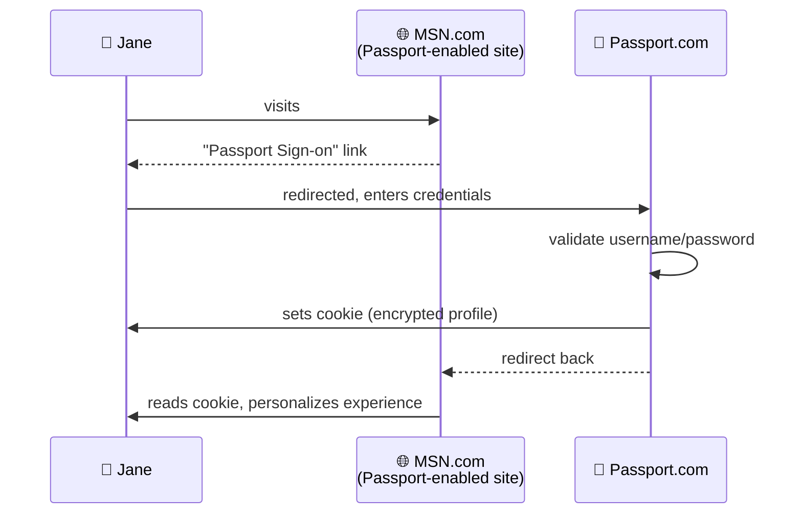

### 16.2 The Real Drawbacks

The book doesn't hedge on this list:

| Problem | Why it matters |
|---|---|
| **Phishing** | A fake Passport login page is trivially easy to build; the average user redirected there can't tell it apart from the real thing, and would hand over credentials without ever noticing |
| **Rogue Passport-enabled sites** | Nothing stops a malicious site from registering as Passport-enabled and freely harvesting whatever profile data users share when visiting |
| **No auditing** | Neither Jane nor Passport would necessarily ever know her information had been compromised, since there was no way to review account activity |
| **Cookie-based storage** | Storing profile data (even encrypted) in a browser cookie is inherently fragile; a worm specifically targeting these cookies could compromise huge numbers of users at once |

And the book notes this wasn't purely hypothetical: **Passport had already come under criticism for a real security flaw** that exposed credit card numbers and other personal data to a malicious hacker.

### 16.3 Passport 3.x and Kerberos

The next generation, per the book (details "still sketchy" at the time of writing), was moving to **Kerberos-based authentication**, aiming for stronger privacy controls via P3P policies.

**Kerberos, in extremely abbreviated form:**

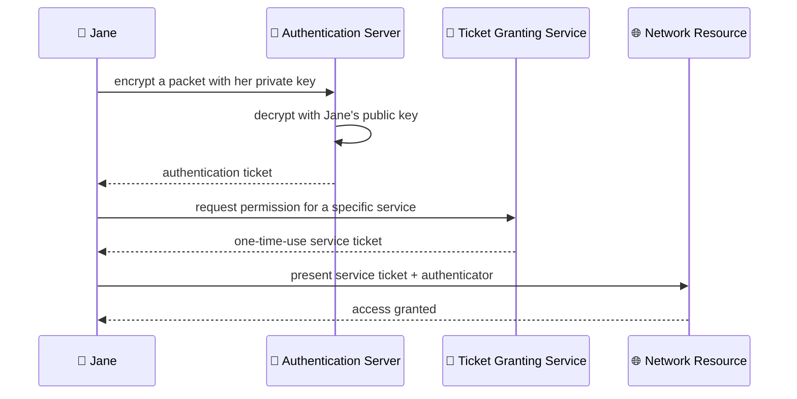

The key structural improvement over 1.x/2.x: **tickets are scoped and one-time-use**, rather than a single reusable encrypted cookie. That directly closes the phishing/impersonation gap that plagued the earlier design, a stolen one-time ticket for one specific service is far less valuable than a stolen master credential.

> 📝 **Note:** The book's framing throughout this section treats Passport 3.x as **forward-looking and not yet fully specified**. I'm preserving that framing faithfully rather than presenting it as settled fact; at the time of writing, this was described as an architecture in progress, targeting "the services' 160 million plus users."

---

## 17. Liberty, Magic Carpet, and the Standards Problem

Two other competing efforts existed at the time, both described by the book in strikingly similar terms: **essentially vaporware.**

### 17.1 Sun's Liberty Project

A collaborative effort involving Sun and other industry players, with three stated goals:

1. **Decentralized** personal information management, promoting cross-network interoperability
2. A **universal, open standard** for single sign-on
3. An open standard for **network identity** spanning every kind of connected device, not just browsers

The book's assessment: **no technical details had been released**, and it was, at the time, "essentially vaporware."

### 17.2 AOL's Magic Carpet

Even less was publicly known about this one, apparently an extension of AOL's existing **Screen Name** service (itself a browser-based single sign-on with some user-controlled profile visibility). Also assessed as **"stealth mode," effectively vaporware.**

### 17.3 The Standards Problem

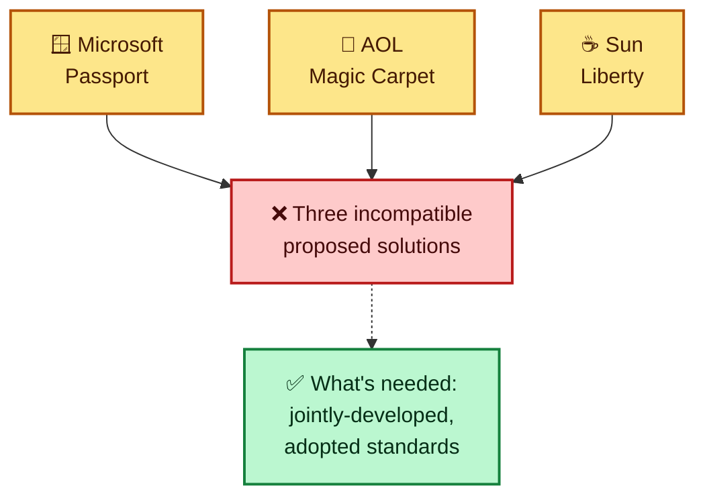

The book compares this directly to the "Great Browser Wars," traditional competitors drawing lines and fighting over who controls web services security, rather than converging on shared standards. And it names the actual risk plainly: building a genuinely interoperable, integration-focused architecture (the whole promise of web services from my very first post) only to have that interoperability **break down specifically at the security layer**, right when something as valuable as global sign-on is on the table.

---

## 18. XML Digital Signature and XML Encryption

Against that backdrop of competing, incompatible authentication schemes, the book points to two efforts it considers **genuinely more durable**: the **XML Digital Signature** and **XML Encryption** standardization work, run primarily through the W3C (with the IETF heavily involved on the digital signature side).

| Effort | Defines |
|---|---|
| **XML Digital Signature** | A standard syntax for digitally signing data, including XML data, and encoding that signature as XML. This is the exact mechanism CodeShare's SAML assertions rely on |
| **XML Encryption** | How encrypted data, including XML data, and the metadata needed to decrypt it, can itself be encoded as XML |

The book's framing is worth preserving directly: **comprehensive digital signature and encryption support will matter far more, long-term, than which specific authentication service wins.** Signatures and encryption are lower-level, more general-purpose primitives; an authentication scheme is just one particular application built on top of them.

> ⚠️ **Caution, and this is the book's own closing caution for the chapter, which I think is exactly right:** even where two toolkits **both supported** XML Encryption and XML Digital Signature (IBM's Web Services ToolKit and Microsoft's .NET being the two examples given), they **disagreed on exactly how to place signatures and encrypted data within a SOAP envelope.** So even with two implementations nominally supporting the same underlying standards, they were **not interoperable with each other.** This is the same class of problem I dug into at length in my "Writing SOAP Web Services" post, the SOAPAction and parameter-naming mismatch between Perl and .NET, just recurring one layer up, at the security layer instead of the basic RPC layer.

---

## 19. What's Changed Since This Was Written

As with each post in this series, a reality check before treating any of this as current guidance.

| Topic in the source material | What to know today |
|---|---|
| Microsoft Passport | Rebranded to **Windows Live ID**, and later folded into what's now **Microsoft Account**. The original browser-cookie architecture described here was long since replaced |
| SAML 1.x working drafts | SAML matured through **2.0**, became an OASIS standard, and is genuinely widely deployed today, especially for enterprise single sign-on, though usually via **SAML 2.0**, not the draft schema referenced in this chapter |
| "No standards for authentication info in a SOAP envelope" | **WS-Security** (mentioned only in passing here as an emerging Microsoft proposal) became an actual **OASIS standard**, and is the real, standardized answer to exactly the gap this chapter describes |
| Sun's Liberty Project | The **Liberty Alliance** did form and produced real specifications; much of that later influenced and converged with SAML itself |
| AOL's Magic Carpet | Never became a significant, lasting standard; effectively faded away |
| P3P | Never gained the legal force the book hoped for, and **browser support for P3P was later dropped entirely** (notably by Internet Explorer and other major browsers); it's now largely a historical footnote |
| IBM's Web Services ToolKit, XML Security Suite | Both reflect early-2000s IBM tooling; modern XML signing/encryption is typically handled through mainstream language-standard libraries rather than these specific packages |
| Apache SOAP | As I noted in my earlier posts, effectively succeeded by **Apache Axis/Axis2** |
| The general "incompatible vendor authentication schemes" problem | Largely superseded, for federated identity, by the combination of **SAML 2.0**, **OAuth 2.0**, and **OpenID Connect**, none of which existed in their modern form when this book was written |

> 📝 **Note:** As with the rest of this series, this table reflects general knowledge of how the ecosystem evolved, not something pulled from the source material. If you're evaluating authentication for a real system today, look at current SAML 2.0/OAuth 2.0/OpenID Connect documentation directly, this chapter is valuable as a snapshot of a genuinely unsettled moment in the industry, not as current guidance.

---

## 20. Cheat Sheet and Final Thoughts

### 20.1 One page, both chapters

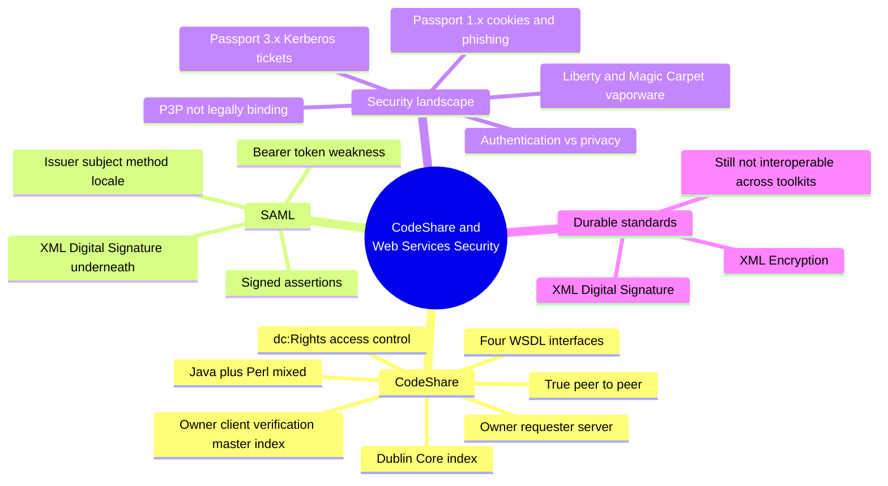

### 20.2 Quick reference

| Concept | One-line summary |
|---|---|
| **CodeShare** | A peer-to-peer source-code-sharing network of owners, requesters, and a central index/auth server |
| **Peer web service** | An application where the provider/consumer roles blur; every owner is both |
| **Dublin Core** | A reused, independent metadata standard powering CodeShare's search and (via `dc:Rights`) access control |
| **SAML assertion** | A signed, machine-readable statement of identity, issued by a trusted authority |
| **Bearer token weakness** | A valid signature proves origin and integrity, not that the current holder is the rightful subject |
| **Service-layer vs. transport-layer auth** | Whether identity validation happens in the application logic, or is handled by the transport (like HTTP auth) before the message is even parsed |
| **Java keystore** | A local private-key database, managed with `keytool` |
| **Passport 1.x/2.x** | Cookie-based single sign-on, vulnerable to phishing and cookie compromise |
| **Kerberos** | Ticket-based authentication; Passport 3.x's planned foundation |
| **P3P** | An XML privacy-policy language with no legal enforcement mechanism |
| **XML Digital Signature / XML Encryption** | The durable, lower-level standards underneath most of this chapter's higher-level authentication schemes |

### 20.3 My rules of thumb

1. **Security isn't one problem.** Confidentiality, integrity, reliability, identity, and policy are separate concerns; CodeShare deliberately tackles only one (authentication), and that's a reasonable scoping decision, not a shortcut.
2. **A signature proves origin and integrity, never bearer legitimacy.** I confirmed this distinction directly in section 7: a forged field or a wrong signing key gets caught, but a genuinely valid, stolen token would sail right through the same check. Anything built on bearer tokens needs a plan for that gap (short expiry, transport encryption, one-time use).
3. **Authentication and authorization are two separate checks, always.** Test case 4 in section 12 is the cleanest illustration I've built in this whole series: being a legitimate, authenticated user is not the same as being authorized for a specific resource.
4. **Reuse existing standards where you can.** CodeShare didn't invent its own metadata schema; it adopted Dublin Core. That's the same instinct that led WSDL to XML Schema, and it pays off the same way here.
5. **"Both sides support the standard" doesn't mean "both sides interoperate."** IBM and Microsoft both supported XML Digital Signature and XML Encryption and still couldn't talk to each other, because of disagreements over placement within the envelope. I've now seen this exact failure mode at the RPC layer (Perl vs. .NET, my earlier post) and at the security layer (this post). It's a pattern, not a coincidence.
6. **Loose coupling is a feature, not a gap.** CodeShare skipping UDDI entirely, and the book explicitly defending that choice, is a genuinely useful reminder that a web services stack isn't all-or-nothing. Use the pieces that solve your actual problem.
7. **Read "vaporware" assessments literally, and expect the landscape to keep moving.** Two of the three competing single-sign-on efforts described in this chapter were explicitly called vaporware by the book itself, in 2001-2002. Checking section 19 before trusting any specific product name in this material isn't optional.

### 20.4 Closing thoughts

What ties this post together, for me, is the honesty running through both chapters. CodeShare doesn't pretend to be a finished, production-grade system, it explicitly names its own gaps (no UDDI, no presence, no asynchronous messaging, a genuinely weak bearer-token model). And the security chapter doesn't pretend the industry had this figured out either, it names three competing, incompatible, partly-vaporware authentication schemes and says plainly that what's actually needed is standards adopted by everyone, not another proprietary architecture.

I think that's the right way to build and to write about systems in an unsettled space: implement the smallest version that demonstrates the real idea, and say clearly what you left out and why. CodeShare's `dc:Rights` check, three lines of logic I was able to verify completely in isolation, is a genuinely solid piece of access control. Its SAML bearer-token model is a genuinely real weakness the book itself flags rather than hides. Both of those things can be true about the same system at once, and I'd rather read (and write) that kind of honest accounting than a polished example that quietly glosses over its own limitations.

If you'd like me to go further, walking through what a modern SAML 2.0 or OAuth 2.0 equivalent of CodeShare's login flow would actually look like, or digging into WS-Security specifically now that I've only mentioned it in passing, let me know and I'll take it further.
