# Describing and Discovering SOAP Services: WSDL, UDDI, and WS-Inspection

I've now written a service by hand (twice, in two different toolkits), and I've built a real one with authentication. What I haven't done yet is answer a question that matters the moment you stop being the only person calling your own service: **how does someone else figure out how to use it?**

That's what this post is about. It covers two things that work together but solve different problems. **WSDL** (the Web Services Description Language) answers "what does this service look like, and how do I talk to it?" **UDDI** and **WS-Inspection** answer "where do I even find this service in the first place?" I'm working through chapters 5 and 6 of *Programming Web Services with SOAP* here, and as with my earlier posts, I tested the pieces I could actually run and I'm upfront about the pieces I couldn't.

**What's in this post:**

- Why self-description matters and what WSDL buys you concretely
- The four things every WSDL document describes: data, messages, interfaces, services
- A tested Python script that parses a corrected WSDL document and walks all four layers programmatically
- How WSDL binds an abstract interface to SOAP, and separately, to plain HTTP-GET
- Message exchange patterns, and what WSDL still can't express
- The UDDI data model: business entities, services, bindings, TModels
- A tested, minimal in-memory UDDI-style registry demonstrating find/save/get operations
- WS-Inspection as the lightweight alternative to UDDI
- Tables, notes, and cautions throughout

---

## Table of Contents

1. [Why Self-Description Matters](#1-why-self-description-matters)
2. [A Quick WSDL Example, and the Payoff](#2-a-quick-wsdl-example-and-the-payoff)
3. [Anatomy of a Service Description](#3-anatomy-of-a-service-description)
4. [Defining Data Types with XML Schema](#4-defining-data-types-with-xml-schema)
5. [Describing the Interface: Messages and Port Types](#5-describing-the-interface-messages-and-port-types)
6. [Describing the Implementation: Bindings and Services](#6-describing-the-implementation-bindings-and-services)
7. [Binding to Something Other Than SOAP: HTTP-GET](#7-binding-to-something-other-than-soap-http-get)
8. [Tested: Parsing a WSDL Document Programmatically](#8-tested-parsing-a-wsdl-document-programmatically)
9. [Messaging Patterns: What WSDL Can and Can't Express](#9-messaging-patterns-what-wsdl-can-and-cant-express)
10. [Discovery: Why WSDL Alone Isn't Enough](#10-discovery-why-wsdl-alone-isnt-enough)
11. [The UDDI Registry Data Model](#11-the-uddi-registry-data-model)
12. [The UDDI Interfaces: Publisher and Inquiry](#12-the-uddi-interfaces-publisher-and-inquiry)
13. [Publishing a Service to UDDI](#13-publishing-a-service-to-uddi)
14. [Tested: A Minimal UDDI-Style Registry](#14-tested-a-minimal-uddi-style-registry)
15. [Locating Services in UDDI](#15-locating-services-in-uddi)
16. [Making WSDL and UDDI Work Together](#16-making-wsdl-and-uddi-work-together)
17. [WS-Inspection: The Lightweight Alternative](#17-ws-inspection-the-lightweight-alternative)
18. [What's Changed Since This Was Written](#18-whats-changed-since-this-was-written)
19. [Cheat Sheet and Final Thoughts](#19-cheat-sheet-and-final-thoughts)

---

## 1. Why Self-Description Matters

Back in my first post, I mentioned that one thing sets web services apart from ordinary applications: they can be **self-describing**. I want to actually unpack that claim here, because it's easy to skim past.

Every application exposes functionality through operations. Those operations need specific inputs and may return specific outputs. All of that has to happen over some agreed-upon protocol. Normally, the developer of a *client* has to just... know all of this. The details end up hardcoded into the client application. If the service changes, the client breaks, and someone has to go change and recompile it.

**Web services can do better than this**, because the description of the service can itself be discovered dynamically, at runtime, rather than baked into the client at compile time.

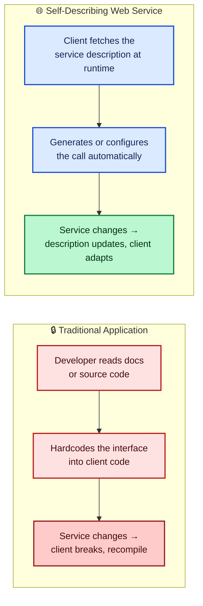

**The SOAP specification itself says nothing about description.** That's deliberate; SOAP is packaging, as I covered in my very first post on this topic. The de facto standard that fills the gap is **WSDL**, the Web Services Description Language. With WSDL, a service can describe what it does, how it does it, and how to actually use it.

### 1.1 What WSDL Buys You

| Benefit | What it means in practice |
|---|---|
| **Easier to write and maintain** | A structured, standard way to define an interface, rather than an ad hoc README |
| **Easier to consume** | Less hand-written client code, and fewer opportunities to get the wire format wrong |
| **Less disruptive change management** | Clients that dynamically discover WSDL can adapt automatically, instead of needing a recompile every time the service description changes |

> ⚠️ **Caution:** WSDL is not perfect. There's **no support for versioning** WSDL descriptions. Once a service description goes into production, treat it the way you'd treat a published object interface: **immutable**. If you need to make breaking changes, that's a new service description, not an edit to the old one.

> 📝 **Note:** Most developers don't hand-write WSDL. Toolkits generate it from existing code. The book's example: point your browser at a deployed `.NET .asmx` file and append `?WSDL` to the URL, and you get a dynamically generated WSDL description for free. Not every toolkit does this out of the box, though; Apache SOAP needed IBM's **Web Services ToolKit** extension (or the **WSIF** add-on) to get comparable WSDL support at the time this book was written.

---

## 2. A Quick WSDL Example, and the Payoff

Before getting into the full anatomy of a WSDL document, I want to show the payoff up front, because it's genuinely striking.

The book takes the **Perl-based Hello World service** from my previous post, writes a WSDL description for it, and then uses **IBM's WSIF** (Web Service Invocation Framework) to invoke it *without writing a single line of client code*:

```text
C:\book>java clients.DynamicInvoker http://localhost/sayhello.wsdl sayHello James
Hello James
```

Compare that single command-line invocation to the nine-line Java `Call`/`Parameter` dance I walked through in my last post. **The WSDL description let WSIF figure out everything Apache SOAP needed to know, automatically.**

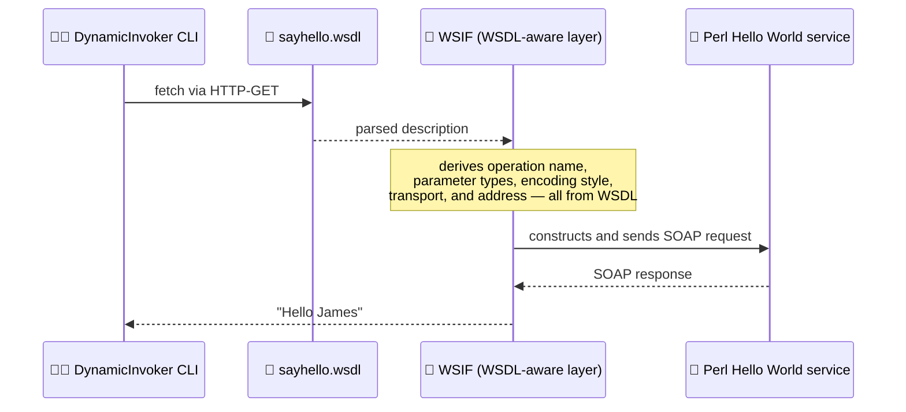

This is a deliberately simple example, and the book is honest that it doesn't generalize to a single command line for every WSDL-described service. But it makes the point cleanly: **WSDL exists because it makes services easier to write and, especially, easier to consume.**

---

## 3. Anatomy of a Service Description

A service description does two jobs at once: it describes the **abstract interface** a consumer talks to, and the **concrete implementation details** of a specific deployment of that interface. It does this through four kinds of building blocks.

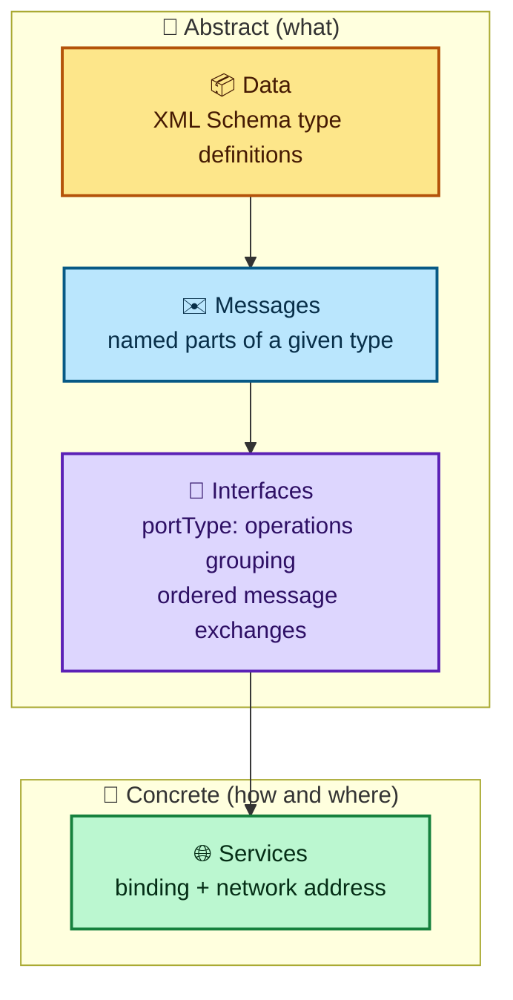

| Term | Definition | Hello World example |
|---|---|---|
| **Data** | Type definitions, typically via XML Schema | `xsd:string` |
| **Message** | A logical, named collection of typed parts | `sayHello_IN` (part: `name`, type `xsd:string`) |
| **Port type** | The abstract interface: a collection of operations, each an ordered exchange of messages | `HelloWorldInterface` |
| **Binding** | Says which protocols a port type uses (SOAP, HTTP, etc.) | `HelloWorldBinding` |
| **Service** | A collection of ports; a **port** pairs a binding with a specific network address | `HelloWorldService`, containing port `HelloWorldPort` |

> 💡 **Tip:** I find it useful to map this onto object-oriented programming, since the book gestures at this comparison too. A **port type** is like an interface declaration. A **binding** is like a specific implementing class, choosing concrete protocols the way a class chooses concrete data structures. A **service** is like an instantiated object at a known address. Same shape, different vocabulary.

---

## 4. Defining Data Types with XML Schema

Interoperability problems most often come down to a mismatch in what "an integer" or "a string" actually means on the wire between two different platforms. WSDL solves this the same way SOAP encoding tries to: by requiring both sides to agree on a **common, platform-neutral type system**, which in WSDL's case is the **W3C XML Schema** specification.

> 📝 **Note:** WSDL isn't technically locked into XML Schema; it can, in principle, use any type-definition mechanism both parties agree on. In practice, **XML Schema is what everyone actually uses**, precisely because it's platform-neutral in a way that a language-specific type system (say, Java's type system) can never fully be.

Here's a subtlety I appreciated from the book, and it's easy to miss: **the message that's actually sent over the wire doesn't have to be XML at all**, even though its *types* are defined using XML Schema. If you invoke a web service through a plain HTML form, the input message isn't XML syntax, it's URL-encoded form data. The XML Schema specification itself acknowledges this directly, in its own primer:

> "In fact, neither instances nor schemas need to exist as documents per se — they may exist as streams of bytes sent between applications, as fields in a database record, or as collections of XML Infoset 'Information Items.'"

So the rule is: **if the data *could* be expressed as XML, XML Schema can describe the rules for it**, whether or not it's literally serialized as XML on a given wire.

### 4.1 Referencing Types in WSDL: import vs. embedding

There are two ways to bring an XML Schema into a WSDL document.

**Option A: `<wsdl:import />`**, pointing at an external schema file:

```xml
<?xml version="1.0" encoding="UTF-8"?>
<wsdl:definitions name="HelloWorldDescription"
    targetNamespace="urn:HelloWorld"
    xmlns:tns="urn:HelloWorld"
    xmlns:types="urn:MyDataTypes"
    xmlns:soap="http://schemas.xmlsoap.org/wsdl/soap/"
    xmlns:wsdl="http://schemas.xmlsoap.org/wsdl/">
  <wsdl:import namespace="urn:MyDataTypes"
               location="telephonenumber.xsd" />
</wsdl:definitions>
```

**Option B: embedding the schema directly** inside `<wsdl:types>`:

```xml
<wsdl:types>
  <xsd:schema xmlns:xsd="http://www.w3.org/2000/10/XMLSchema"
              targetNamespace="urn:MyDataTypes"
              elementFormDefault="qualified">
    <xsd:complexType name="telephoneNumberEx">
      <xsd:complexContent>
        <xsd:restriction base="telephoneNumber">
          <xsd:sequence>
            <xsd:element name="countryCode">
              <xsd:simpleType>
                <xsd:restriction base="xsd:string">
                  <xsd:pattern value="\d{2}"/>
                </xsd:restriction>
              </xsd:simpleType>
            </xsd:element>
            <xsd:element name="area">
              <xsd:simpleType>
                <xsd:restriction base="xsd:string">
                  <xsd:pattern value="\d{3}"/>
                </xsd:restriction>
              </xsd:simpleType>
            </xsd:element>
            <xsd:element name="exchange">
              <xsd:simpleType>
                <xsd:restriction base="xsd:string">
                  <xsd:pattern value="\d{3}"/>
                </xsd:restriction>
              </xsd:simpleType>
            </xsd:element>
            <xsd:element name="number">
              <xsd:simpleType>
                <xsd:restriction base="xsd:string">
                  <xsd:pattern value="\d{4}"/>
                </xsd:restriction>
              </xsd:simpleType>
            </xsd:element>
          </xsd:sequence>
        </xsd:restriction>
      </xsd:complexContent>
    </xsd:complexType>
  </xsd:schema>
</wsdl:types>
```

| Approach | Pros | Cons |
|---|---|---|
| **`<wsdl:import />`** | Cleanly separates types from the service description; types can be reused across multiple WSDL files | At the time of writing, **many WSDL-enabled tools didn't properly support it** |
| **Embedded `<wsdl:types>`** | Works reliably, self-contained | The WSDL document gets bigger; harder to share type definitions across services |

> ⚠️ **Caution:** Given the tooling gap noted above, the book steers you toward embedding, `<wsdl:types>`, as the far more common, practically safer approach at the time. If you're using a modern toolkit today, check its `<wsdl:import>` support before relying on it; this is exactly the kind of interoperability gap that bit people in the SOAP era.

---

## 5. Describing the Interface: Messages and Port Types

A **port type** is WSDL's name for a web service interface. It's genuinely no different in spirit from an interface in any object-oriented language: input messages (parameters going in), output messages (values coming back), and fault messages (errors that might occur).

Here's the relevant piece of the Hello World WSDL again:

```xml
<wsdl:message name="sayHello_IN">
  <part name="name" type="xsd:string" />
</wsdl:message>
<wsdl:message name="sayHello_Out">
  <part name="greeting" type="xsd:string" />
</wsdl:message>

<wsdl:portType name="HelloWorldInterface">
  <wsdl:operation name="sayHello">
    <wsdl:input message="tns:sayHello_IN" />
    <wsdl:output message="tns:sayHello_OUT" />
  </wsdl:operation>
</wsdl:portType>
```

> ⚠️ **Caution, and this one is a genuine bug in the book's listing, not just a stylistic quirk:** notice the message is *defined* as `sayHello_Out` (lowercase `ut`), but the `portType`'s `<wsdl:output>` element references `tns:sayHello_OUT` (uppercase `OUT`). **XML names are case-sensitive.** As written, this WSDL document would fail to resolve that reference in a strict parser. When I built the tested, parseable version of this document later in this post, I corrected the message name to `sayHello_OUT` consistently throughout, so the reference actually resolves.

### 5.1 No Inheritance (Yet)

Something I found genuinely surprising: **WSDL port types don't support inheritance.** You might want to write something like this:

```xml
<wsdl:definitions>
  <wsdl:portType name="HelloWorldInterface">
    <wsdl:operation name="sayHello" />
  </wsdl:portType>
  <wsdl:portType name="HelloWorldInterfaceEx"
                 extends="HelloWorldInterface">
    <wsdl:operation name="sayGoodbye" />
  </wsdl:portType>
</wsdl:definitions>
```

The intent is obvious: `HelloWorldInterfaceEx` should inherit `sayHello` and add `sayGoodbye`. **This isn't supported.** The book notes it was being considered for future versions of the spec.

> 💡 **Tip:** If you find yourself wanting interface inheritance in WSDL, the practical workaround at the time (and still a reasonable one) is composition: just re-list every operation you want in the "extended" port type explicitly, rather than relying on the spec to do it for you.

---

## 6. Describing the Implementation: Bindings and Services

Port types are abstract. To actually be useful, they need to be **bound** to real protocols, exactly the way a Java interface needs an implementing class.

```xml
<wsdl:binding name="HelloWorldBinding"
              type="tns:HelloWorldInterface">
  <soap:binding style="rpc"
                transport="http://schemas.xmlsoap.org/soap/http"/>

  <wsdl:operation name="sayHello">
    <soap:operation soapAction="urn:Hello" />

    <wsdl:input>
      <soap:body use="encoded"
                 namespace="..."
                 encodingStyle="..." />
    </wsdl:input>
    <wsdl:output>
      <soap:body use="encoded"
                 namespace="..."
                 encodingStyle="..." />
    </wsdl:output>
  </wsdl:operation>
</wsdl:binding>
```

The only real difference between this and the bare `portType` is the addition of `soap:`-prefixed elements. Those are what tell a SOAP-aware toolkit exactly how to package each operation's messages.

| Element | What it specifies |
|---|---|
| **`<soap:binding />`** | Transport protocol and message **style**: `rpc` (conforms to SOAP RPC convention) or `document` (arbitrary XML payload) |
| **`<soap:operation />`** | The value of the `SOAPAction` HTTP header for this operation |
| **`<soap:body />`** | Whether message parts are **encoded** (Section 5 rules) or **literal** (arbitrary XML, no defined encoding rules) |
| **`<soap:fault />`** | Contents of the SOAP fault `detail` element, works like `<soap:body />` but for faults |
| **`<soap:header />`** | How message parts should appear in the SOAP **header**, rather than the body |
| **`<soap:headerfault />`** | How fault information about specific headers should appear in a returned SOAP fault |
| **`<soap:address />`** | The network location where the service is actually deployed |

An instance of the `sayHello` input message, bound to SOAP using this definition, looks exactly like the plain SOAP examples from my very first post:

```xml
<s:Envelope xmlns:s="...">
  <s:Body>
    <m:sayHello xmlns:m="urn:Hello">
      <name>John</name>
    </m:sayHello>
  </s:Body>
</s:Envelope>
```

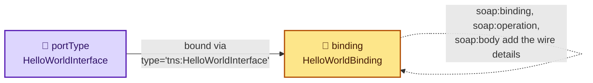

---

## 7. Binding to Something Other Than SOAP: HTTP-GET

This is a detail I really like, because it drives home just how separable WSDL's abstraction layers are. A binding doesn't have to specify SOAP at all. Here's the exact same `HelloWorldInterface` port type, bound instead to plain **HTTP-GET**:

```xml
<wsdl:binding name="HelloWorldBinding"
              type="tns:HelloWorldInterface">
  <http:binding verb="GET"/>
  <wsdl:operation name="sayHello">
    <http:operation location="sayHello" />
    <wsdl:input>
      <http:urlEncoded />
    </wsdl:input>
    <wsdl:output>
      <mime:content type="text/plain" />
    </wsdl:output>
  </wsdl:operation>
</wsdl:binding>
```

The `<http:urlEncoded />` element says every part of the input message becomes a query string parameter. An instance of this binding is just a URL:

```text
http://www.acme.com/sayHello?name=John
```

And the response is a bare stream of data with a MIME content type, no envelope at all:

```http
HTTP/1.1 200 OK
Server: Microsoft-IIS/5.0
Content-Type: text/plain;
Content-Length: 11

Hello James
```

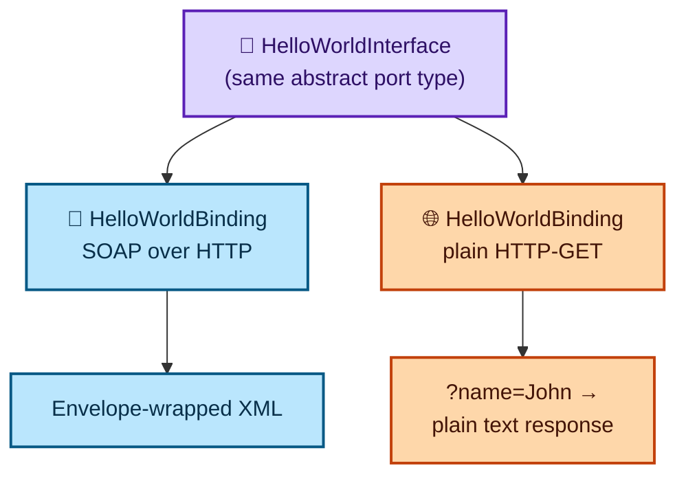

> 📝 **Note:** This is a great concrete illustration of the "packaging is independent of everything else" idea I kept coming back to in my very first post. The *same abstract operation* — take a name, return a greeting — can be delivered as a full SOAP envelope or as a bare query string, and WSDL can describe both without touching the underlying `portType` at all.

### 7.1 Naming the Service's Location

The final piece any implementation description needs is: **where is it actually running?** That's the `service`/`port` pairing:

```xml
<wsdl:service name="HelloWorldService">
  <wsdl:port name="HelloWorldPort"
             binding="tns:HelloWorldBinding">
    <soap:address location="http://localhost:8080" />
  </wsdl:port>
</wsdl:service>
```

Because a `service` is a *collection* of `port`s, a single WSDL document can describe **multiple deployments of the same interface** at different addresses, or even bound to different protocols. Recall from my previous post that I built the exact same Hello World service three separate times, in Perl, Java, and C#. WSDL can describe all three as one logical service:

```xml
<wsdl:service name="HelloWorldService">
  <wsdl:port name="HelloWorldPort_Perl"
             binding="tns:HelloWorldBinding">
    <soap:address location="http://localhost:8080" />
  </wsdl:port>
  <wsdl:port name="HelloWorldPort_Java"
             binding="tns:HelloWorldBinding">
    <soap:address location="http://localhost/soap/servlet/rpcrouter" />
  </wsdl:port>
  <wsdl:port name="HelloWorldPort_NET"
             binding="tns:HelloWorldBinding">
    <soap:address location="http://localhost/helloworld.asmx" />
  </wsdl:port>
</wsdl:service>
```

That's a nice full-circle moment. The book spent an entire chapter proving that Perl, Java, and .NET implementations of Hello World are interchangeable at the wire level; here, WSDL gives you a single document that formally captures exactly that fact.

> 📝 **Note:** The name attributes throughout WSDL — `HelloWorldInterface`, `HelloWorldBinding`, and so on — are **completely arbitrary**. There's no naming convention the spec requires you to follow. Pick names that make sense to your team.

---

## 8. Tested: Parsing a WSDL Document Programmatically

I wanted to actually verify the four-layer structure I've been describing, rather than just take it on faith from the prose. So I took the book's Hello World WSDL, fixed the `sayHello_Out`/`sayHello_OUT` case mismatch from section 5, and wrote a Python script that walks the document the way a WSDL-aware tool like WSIF would: extracting messages, the port type's operations, the binding's SOAP details, and the service's ports.

```python
"""Test that a well-formed WSDL document (fixing the book's dangling case-mismatch
typo) parses cleanly, and extract the four description layers programmatically -
messages, portType/operations, binding, and service/port - the way a WSDL-aware
tool like WSIF would."""
import xml.etree.ElementTree as ET

WSDL_NS = "http://schemas.xmlsoap.org/wsdl/"
SOAP_NS = "http://schemas.xmlsoap.org/wsdl/soap/"

wsdl_doc = '''<?xml version="1.0" encoding="UTF-8"?>
<wsdl:definitions name="HelloWorldDescription"
    targetNamespace="urn:HelloWorld"
    xmlns:tns="urn:HelloWorld"
    xmlns:xsd="http://www.w3.org/2001/XMLSchema"
    xmlns:soap="http://schemas.xmlsoap.org/wsdl/soap/"
    xmlns:wsdl="http://schemas.xmlsoap.org/wsdl/">

  <wsdl:message name="sayHello_IN">
    <wsdl:part name="name" type="xsd:string" />
  </wsdl:message>
  <wsdl:message name="sayHello_OUT">
    <wsdl:part name="greeting" type="xsd:string" />
  </wsdl:message>

  <wsdl:portType name="HelloWorldInterface">
    <wsdl:operation name="sayHello">
      <wsdl:input message="tns:sayHello_IN" />
      <wsdl:output message="tns:sayHello_OUT" />
    </wsdl:operation>
  </wsdl:portType>

  <wsdl:binding name="HelloWorldBinding" type="tns:HelloWorldInterface">
    <soap:binding style="rpc" transport="http://schemas.xmlsoap.org/soap/http" />
    <wsdl:operation name="sayHello">
      <soap:operation soapAction="urn:Hello" />
      <wsdl:input>
        <soap:body use="encoded" namespace="urn:Hello"
                   encodingStyle="http://schemas.xmlsoap.org/soap/encoding/" />
      </wsdl:input>
      <wsdl:output>
        <soap:body use="encoded" namespace="urn:Hello"
                   encodingStyle="http://schemas.xmlsoap.org/soap/encoding/" />
      </wsdl:output>
    </wsdl:operation>
  </wsdl:binding>

  <wsdl:service name="HelloWorldService">
    <wsdl:port name="HelloWorldPort" binding="tns:HelloWorldBinding">
      <soap:address location="http://localhost:8080" />
    </wsdl:port>
  </wsdl:service>
</wsdl:definitions>'''

root = ET.fromstring(wsdl_doc)

def q(tag, ns=WSDL_NS):
    return f"{{{ns}}}{tag}"

print("== messages ==")
for msg in root.findall(q("message")):
    parts = [(p.get("name"), p.get("type")) for p in msg.findall(q("part"))]
    print(f"  {msg.get('name')}: {parts}")

print("== portType / operations ==")
for pt in root.findall(q("portType")):
    print(f"  portType {pt.get('name')}")
    for op in pt.findall(q("operation")):
        inp = op.find(q("input"))
        out = op.find(q("output"))
        print(f"    operation {op.get('name')}: input={inp.get('message') if inp is not None else None}, "
              f"output={out.get('message') if out is not None else None}")

print("== binding ==")
for b in root.findall(q("binding")):
    soap_binding = b.find(q("binding", SOAP_NS))
    print(f"  binding {b.get('name')} for {b.get('type')} "
          f"style={soap_binding.get('style')} transport={soap_binding.get('transport')}")
    for op in b.findall(q("operation")):
        soap_op = op.find(q("operation", SOAP_NS))
        print(f"    operation {op.get('name')}: soapAction={soap_op.get('soapAction')}")

print("== service / ports ==")
for svc in root.findall(q("service")):
    print(f"  service {svc.get('name')}")
    for port in svc.findall(q("port")):
        addr = port.find(q("address", SOAP_NS))
        print(f"    port {port.get('name')} binding={port.get('binding')} "
              f"address={addr.get('location') if addr is not None else None}")
```

Output:

```text
== messages ==
  sayHello_IN: [('name', 'xsd:string')]
  sayHello_OUT: [('greeting', 'xsd:string')]
== portType / operations ==
  portType HelloWorldInterface
    operation sayHello: input=tns:sayHello_IN, output=tns:sayHello_OUT
== binding ==
  binding HelloWorldBinding for tns:HelloWorldInterface style=rpc transport=http://schemas.xmlsoap.org/soap/http
    operation sayHello: soapAction=urn:Hello
== service / ports ==
  service HelloWorldService
    port HelloWorldPort binding=tns:HelloWorldBinding address=http://localhost:8080
```

| What I verified | Result |
|---|---|
| The document is well-formed XML once the case-mismatch bug is fixed | ✅ Parses cleanly |
| Each `message` correctly exposes its named, typed `part`s | ✅ `name`/`xsd:string`, `greeting`/`xsd:string` |
| The `portType`'s single operation correctly references both messages | ✅ `input`/`output` resolve to the message names |
| The `binding` correctly layers SOAP-specific details on top of the abstract operation | ✅ `style=rpc`, `soapAction=urn:Hello` extracted |
| The `service`'s `port` correctly ties the binding to a real network address | ✅ `http://localhost:8080` extracted |

> 💡 **Tip:** This little script is, in miniature, exactly what a tool like WSIF does before it can dynamically invoke a service: read the four layers, resolve the cross-references between them (`message` name → `part`s, `operation` → `message`, `binding` → `portType`, `port` → `binding`), and only then construct the actual SOAP call. Seeing it work end to end made the abstract "four things WSDL describes" table from section 3 click for me in a way just reading the spec prose didn't.

---

## 9. Messaging Patterns: What WSDL Can and Can't Express

A **messaging pattern** is the sequence of messages passed between consumer and provider for a given operation. WSDL supports two fundamental patterns.

### 9.1 Single-Message Exchange

Just one message, in either direction, analogous to a function with no return value:

```xml
<portType name="...">
  <operation name="Consumer_to_Provider">
    <input message="..." />
  </operation>
  <operation name="Provider_to_Consumer">
    <output message="..." />
  </operation>
</portType>
```

`<input />` always means consumer-to-provider. `<output />` always means provider-to-consumer.

### 9.2 Multiple-Message Exchange

Two or more messages, most commonly the familiar "call a method, get a result back" shape:

```xml
<portType name="...">
  <operation name="Consumer_to_Provider_to_Consumer">
    <input message="..." />
    <output message="..." />
  </operation>
  <operation name="Provider_to_Consumer_to_Provider">
    <output message="..." />
    <input message="..." />
  </operation>
</portType>
```

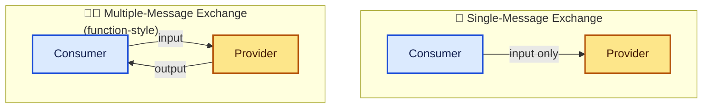

### 9.3 What's Missing: Sequencing and Workflow

Here's the genuinely important limitation. **WSDL can only describe simple, function-style exchanges.** It has no way to express **sequencing rules across multiple operations**. The book's example is exactly right: it's often useful to require that a consumer must call `login` before calling `deleteAllRecords`, and there's no way to express that requirement *in WSDL itself*.

That gap was, at the time, being addressed by separate specifications focused on workflow: **IBM's Web Services Flow Language (WSFL)** and **Microsoft's XLANG**. Neither is covered in the book, and I'm not going to pretend I can give them a fair, detailed treatment here either, they're each substantial specifications in their own right.

> ⚠️ **Caution:** This limitation matters practically. If your service has operations with real ordering dependencies, like the Publisher service's `login`-then-`postItem` pattern from my last post, **WSDL alone will not document that constraint for you.** You still need separate, human-readable documentation (or a workflow specification) to communicate it.

### 9.4 Intermediaries Don't Change the Pattern

One clean point from the book, tying back to my first post's discussion of actors and message paths: **intermediaries don't change the exchange pattern.** A request-response operation is still request-response, even if the request and response each make a few extra stops along the way through intermediary actors. **WSDL doesn't yet provide any way to describe that path** at all; it only describes the logical endpoints.

---

## 10. Discovery: Why WSDL Alone Isn't Enough

WSDL solves "how do I talk to this service, once I've found it." It says nothing about "how do I *find* it in the first place." That's the problem **discovery** solves, and it's where **UDDI** (Universal Description, Discovery, and Integration) comes in.

> 📝 **Note:** The book is explicit that it focuses on **UDDI Version 1.0**, even though Version 2.0 already existed at the time of writing, because 2.0 had very little tooling support yet. I'm following that same lens here, describing the 1.0-era model the book actually walks through, and I'll flag in section 18 how this evolved.

UDDI has two parts: a **registry** of metadata about businesses and their services (including a pointer to each service's WSDL), and a **SOAP-based API** for querying and publishing to that registry.

**UDDI isn't the only discovery mechanism.** IBM and Microsoft also proposed **WS-Inspection**, a much lighter alternative I'll cover in section 17.

---

## 11. The UDDI Registry Data Model

The UDDI registry is a hierarchy of XML structures: business entities, containing business services, containing binding templates, plus a separate concept called TModels that ties abstract concepts (like a WSDL interface) to concrete registrations.

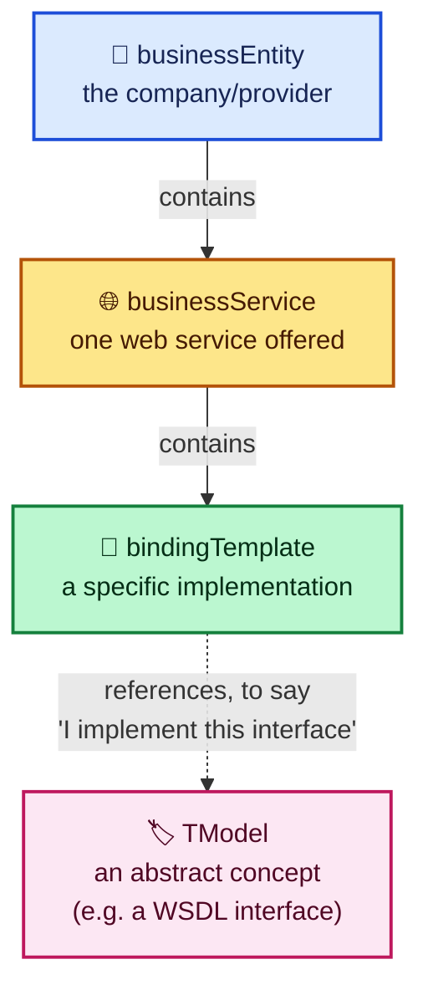

### 11.1 Business Entity

Represents the **provider** of web services: contact information, industry categories, business identifiers, and the services offered.

```xml
<businessEntity businessKey="uuid:C0E6D5A8-C446-4f01-99DA-70E212685A40"
                operator="http://www.ibm.com"
                authorizedName="John Doe">
  <name>Acme Company</name>
  <description>
    We create cool Web services
  </description>
  <contacts>
    <contact useType="general info">
      <description>General Information</description>
      <personName>John Doe</personName>
      <phone>(123) 123-1234</phone>
      <email>jdoe@acme.com</email>
    </contact>
  </contacts>
  <businessServices>
    ...
  </businessServices>
  <identifierBag>
    <keyedReference
        TModelKey="UUID:8609C81E-EE1F-4D5A-B202-3EB13AD01823"
        name="D-U-N-S"
        value="123456789" />
  </identifierBag>
  <categoryBag>
    <keyedReference
        TModelKey="UUID:C0B9FE13-179F-413D-8A5B-5004DB8E5BB2"
        name="NAICS"
        value="111336" />
  </categoryBag>
</businessEntity>
```

### 11.2 Business Service

An **individual web service** offered by that entity:

```xml
<businessService serviceKey="uuid:D6F1B765-BDB3-4837-828D-8284301E5A2A"
                 businessKey="uuid:C0E6D5A8-C446-4f01-99DA-70E212685A40">
  <name>Hello World Web Service</name>
  <description>A friendly Web service</description>
  <bindingTemplates>
    ...
  </bindingTemplates>
  <categoryBag />
</businessService>
```

### 11.3 Binding Templates

The **technical description** of the implementation, roughly equivalent to a WSDL `service` element:

```xml
<bindingTemplate serviceKey="uuid:D6F1B765-BDB3-4837-828D-8284301E5A2A"
                 bindingKey="uuid:C0E6D5A8-C446-4f01-99DA-70E212685A40">
  <description>Hello World SOAP Binding</description>
  <accessPoint URLType="http">
    http://localhost:8080
  </accessPoint>
  <TModelInstanceDetails>
    <TModelInstanceInfo
        TModelKey="uuid:EB1B645F-CF2F-491f-811A-4868705F5904">
      <instanceDetails>
        <overviewDoc>
          <description>
            references the description of the
            WSDL service definition
          </description>
          <overviewURL>
            http://localhost/helloworld.wsdl
          </overviewURL>
        </overviewDoc>
      </instanceDetails>
    </TModelInstanceInfo>
  </TModelInstanceDetails>
</bindingTemplate>
```

Since one `businessService` can have **multiple** binding templates, you can advertise several implementations of the same logical service, each with its own protocol or network address.

### 11.4 TModels

A **TModel** describes any abstract concept the registry needs to track. That covers things like an industry classification code (NAICS), a business identifier scheme (D-U-N-S), or, importantly, **a WSDL port type**:

```xml
<TModel TModelKey="uuid:xyz987..."
        operator="http://www.ibm.com"
        authorizedName="John Doe">
  <name>HelloWorldInterface Port Type</name>
  <description>
    An interface for a friendly Web service
  </description>
  <overviewDoc>
    <overviewURL>
      http://localhost/helloworld.wsdl
    </overviewURL>
  </overviewDoc>
</TModel>
```

Once registered, a `bindingTemplate` can reference this TModel to say: **"this implementation conforms to the `HelloWorldInterface` port type."**

| Structure | Represents | Roughly equivalent to |
|---|---|---|
| `businessEntity` | The provider | A company profile |
| `businessService` | An offered service | The WSDL `service` name |
| `bindingTemplate` | A specific implementation | The WSDL `port`/`service` pairing |
| `TModel` | An abstract, reusable concept | A WSDL `portType`, or a classification scheme |

### 11.5 Federated and Private Registries

At the network level, UDDI was designed as a **global federation** of linked registries, all speaking the same SOAP-based publish/find API.

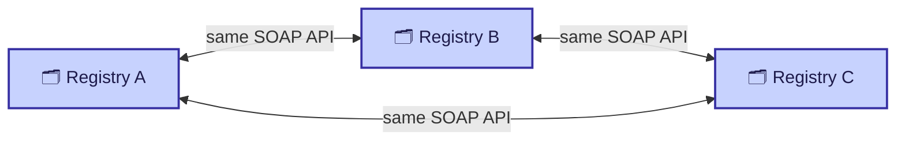

Organizations could instead run **private registries**, for members of a single company or industry group to advertise services among themselves. The thing that makes both cases compatible is the same underlying API: publish and find, whether the registry is public or private.

---

## 12. The UDDI Interfaces: Publisher and Inquiry

UDDI exposes two SOAP interfaces, described (fittingly) as WSDL themselves.

### 12.1 The Publisher Interface (`PublishSOAP`)

Sixteen operations for a provider managing its own registry entries:

| Operation | Purpose |
|---|---|
| `get_authToken` | Retrieves an authorization token, functionally identical to the login token from the Publisher service in my last post |
| `discard_authToken` | Invalidates a token, equivalent to logging out |
| `save_business` | Creates or updates a business entity |
| `save_service` | Creates or updates a service under an existing business |
| `save_binding` | Creates or updates a binding template's technical details |
| `save_TModel` | Registers or updates an abstract concept |
| `delete_business` | Removes business entities entirely |
| `delete_service` | Removes services entirely |
| `delete_binding` | Removes binding templates |
| `delete_TModel` | Removes TModels |
| `get_registeredInfo` | Returns a summary of everything registered under the caller's account |

> 📝 **Note:** I genuinely appreciated the parallel the book draws here without quite spelling it out: `get_authToken`/`discard_authToken` are structurally identical to the login-token pattern I tested extensively in my last post for the Publisher service. Same idea, same tradeoffs, applied to a different (and much more widely deployed) registry.

Every one of these corresponds to a WSDL message and operation. A representative sample:

```xml
<message name="bindingDetail">
  <part name="body" element="uddi:bindingDetail" />
</message>
<message name="businessDetail">
  <part name="body" element="uddi:businessDetail" />
</message>
```

```xml
<portType name="PublishSoap">
  <operation name="delete_binding">
    <input message="tns:delete_binding" />
    <output message="tns:dispositionReport" />
    <fault name="error" message="tns:dispositionReport" />
  </operation>
  <operation name="delete_business">
    <input message="tns:delete_business" />
    <output message="tns:dispositionReport" />
    <fault name="error" message="tns:dispositionReport" />
  </operation>
  <!-- delete_service, delete_TModel, discard_authToken, get_authToken,
       get_registeredInfo, save_binding, save_business, save_service,
       save_TModel, validate_categorization all follow the same shape -->
</portType>
```

### 12.2 The Inquiry Interface (`InquireSOAP`)

Ten operations for **searching** the registry and pulling details:

| Operation | Purpose |
|---|---|
| `find_binding` | Web services matching binding criteria |
| `find_business` | Business entities matching criteria |
| `find_service` | Web services matching criteria |
| `find_TModel` | TModels matching criteria |
| `get_bindingDetail` | Full details for a specific binding template |
| `get_businessDetail` | Registration for a business entity, including its services |
| `get_businessDetailExt` | Complete registration for a business entity |
| `get_serviceDetail` | Complete registration for a web service |
| `get_TModelDetail` | Complete registration for a TModel |

```xml
<portType name="InquireSoap">
  <operation name="find_binding">
    <input message="tns:find_binding" />
    <output message="tns:bindingDetail" />
    <fault name="error" message="tns:dispositionReport" />
  </operation>
  <operation name="find_business">
    <input message="tns:find_business" />
    <output message="tns:businessList" />
    <fault name="error" message="tns:dispositionReport" />
  </operation>
  <operation name="find_service">
    <input message="tns:find_service" />
    <output message="tns:serviceList" />
    <fault name="error" message="tns:dispositionReport" />
  </operation>
  <!-- ... -->
</portType>
```

> 💡 **Tip:** UDDI itself is imported from a fixed XML Schema location, `http://www.uddi.org/schema/2001/uddi_v1.xsd`. This is the WSDL `<wsdl:import>` mechanism I flagged as having spotty tool support in section 4, applied to UDDI's own core types. If a toolkit's `<wsdl:import>` support is shaky, that same weakness can bite you specifically when working with UDDI's WSDL.

---

## 13. Publishing a Service to UDDI

The book walks through **UDDI4J**, IBM's open-source Java toolkit for the Publish and Inquiry interfaces. The steps to publish a service:

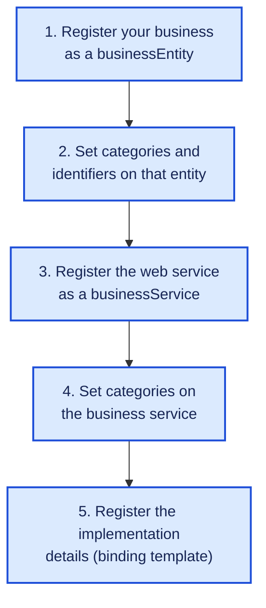

You initialize a proxy to the registry:

```java
UDDIProxy proxy = new UDDIProxy();
proxy.setPublishURL(
    "https://www3.ibm.com/services/uddi/testregistry/protect/publishapi");
```

Build up the business entity:

```java
BusinessEntity business = new BusinessEntity();
business.setName("O'Reilly and Associates");
```

Attach categories and identifiers (here, a NAICS industry code and a fictitious D-U-N-S number):

```java
CategoryBag cbag = new CategoryBag();
KeyedReference cat = new KeyedReference();
cat.setTModelKey("UUID:C0B9FE13-179F-413D-8A5B-5004DB8E5BB2");
cat.setKeyName("NAICS");
cat.setKeyValue("11194");
cbag.getKeyedReferenceVector().add(cat);
business.setCategoryBag(cbag);

IdentifierBag ibag = new IdentifierBag();
KeyedReference id = new KeyedReference();
id.setTModelKey("UUID:8609C81E-EE1F-4D5A-B202-3EB13AD01823");
id.setKeyName("D-U-N-S");
id.setKeyValue("1234567890");
ibag.getKeyedReferenceVector().add(id);
business.setIdentifierBag(ibag);
```

Add the service and its binding:

```java
BusinessServices services = new BusinessServices();
BusinessService service = new BusinessService();
service.setName("Hello World Service");
services.getBusinessServiceVector().add(service);
business.setBusinessServices(services);

BindingTemplates bindings = new BindingTemplates();
BindingTemplate binding = new BindingTemplate();
AccessPoint accessPoint = new AccessPoint();
accessPoint.setText("http://localhost:8080");
accessPoint.setURLType("HTTP");
binding.setAccessPoint(accessPoint);
bindings.getBindingTemplateVector().add(binding);
service.setBindingTemplates(bindings);
```

And log in and save:

```java
AuthToken token = proxy.get_authToken("james", "semaj");
Vector businesses = new Vector();
businesses.add(business);
proxy.save_business(token.getAuthInfo().getText(), businesses);
```

This ultimately produces a SOAP envelope like this over the wire:

```xml
<SOAP-ENV:Envelope
    xmlns:SOAP-ENV="http://schemas.xmlsoap.org/soap/envelope/"
    xmlns:xsi="http://www.w3.org/1999/XMLSchema-instance"
    xmlns:xsd="http://www.w3.org/1999/XMLSchema">
  <SOAP-ENV:Body>
    <save_business generic="1.0" xmlns="urn:uddi-org:api">
      <authInfo>test</authInfo>
      <businessEntity>
        <name>O'Reilly and Associates</name>
        <businessServices>
          <businessService>
            <name>Hello World Service</name>
            <bindingTemplates>
              <bindingTemplate>
                <accessPoint
                    urlType="HTTP">http://localhost:8080</accessPoint>
              </bindingTemplate>
            </bindingTemplates>
          </businessService>
        </businessServices>
        <identifierBag>
          <keyedReference keyName="D-U-N-S"
              keyValue="1234567890"
              TModelKey="UUID:8609C81E-EE1F-4D5A-B202-3EB13AD01823"/>
        </identifierBag>
        <categoryBag>
          <keyedReference keyName="NAICS"
              keyValue="11194"
              TModelKey="UUID:C0B9FE13-179F-413D-8A5B-5004DB8E5BB2"/>
        </categoryBag>
      </businessEntity>
    </save_business>
  </SOAP-ENV:Body>
</SOAP-ENV:Envelope>
```

### 13.1 Requirements and Common Failures

Before this works, you need:

1. A valid **user account** with the specific UDDI registry, registered through their HTML form
2. **Apache SOAP 2.1 or higher** on the classpath (UDDI4J itself is built on Apache SOAP, so the same `soap.jar`/`mail.jar`/`activation.jar` requirement from my previous post applies)

| Common registration failure | Cause |
|---|---|
| Duplicate business | A company already exists under that name |
| Malformed registration | A problem with the information you supplied |
| Access denied | Improper permissions for the requested action |

### 13.2 Destructive Saves: Read Before You Write

This is the caution I'd tattoo on my monitor if I were doing UDDI work regularly.

> ⚠️ **Caution:** `save_business` is **destructive**. Calling it doesn't merge your new information with what's already registered, it **replaces** the entire business entity record with whatever you send. If you only meant to add one new service, and you call `save_business` with just that one service, **you can silently wipe out every other service that business had registered.**

Two ways around this:

1. **Fetch the full record first**, make your change to the retrieved object, then save the whole thing back.
2. **Save only the specific part changing.** If you already have a business registered and just want to add a service, call `save_service`, not `save_business`.

```java
// Initialize the proxy to the UDDI registry
UDDIProxy proxy = new UDDIProxy();
proxy.setPublishURL("https://www3.ibm.com/services/uddi/testregistry/protect/publishapi");

// Prepare the business service record
BusinessServices services = new BusinessServices();
BusinessService service = new BusinessService();
service.setBusinessKey("uuid:C0E6D5A8-C446-4f01-99DA-70E212685A40");
service.setName("Hello World Service");
services.getBusinessServiceVector().add(service);

// Prepare the binding templates
BindingTemplates bindings = new BindingTemplates();
BindingTemplate binding = new BindingTemplate();
AccessPoint accessPoint = new AccessPoint();
accessPoint.setText("http://localhost:8080");
accessPoint.setURLType("HTTP");
binding.setAccessPoint(accessPoint);
bindings.getBindingTemplateVector().add(binding);
service.setBindingTemplates(bindings);

// Logon to UDDI registry and register
AuthToken token = proxy.get_authToken("username", "password");
Vector servicesToSave = new Vector();
servicesToSave.add(service);
proxy.save_service(token.getAuthInfo().getText(), servicesToSave);
```

The important line is `service.setBusinessKey(...)`, telling the registry **which existing business** this new service belongs to, so `save_service` can scope its change narrowly instead of touching the whole entity.

---

## 14. Tested: A Minimal UDDI-Style Registry

I wanted to verify this data model actually behaves the way the book describes, especially the destructive-save warning, so I built a tiny in-memory Python model of the business/service/binding hierarchy, with `save_business`, `save_service`, `find_business`, `find_service`, and `get_service_detail`.

```python
"""A tiny in-memory model of the UDDI business/service/binding hierarchy and the
find_business / find_service / get_serviceDetail style lookups, to check the
data model described in the book actually composes and round-trips correctly."""
import uuid

class Registry:
    def __init__(self):
        self.businesses = {}   # businessKey -> dict

    def save_business(self, name, services):
        key = str(uuid.uuid4())
        self.businesses[key] = {"name": name, "businessKey": key, "services": {}}
        for svc_name, access_point in services:
            self.save_service(key, svc_name, access_point)
        return key

    def save_service(self, business_key, svc_name, access_point):
        biz = self.businesses[business_key]
        svc_key = str(uuid.uuid4())
        biz["services"][svc_key] = {
            "name": svc_name,
            "serviceKey": svc_key,
            "businessKey": business_key,
            "bindingTemplates": [{"accessPoint": access_point, "urlType": "HTTP"}],
        }
        return svc_key

    def find_business(self, name_query):
        return [b for b in self.businesses.values() if name_query.lower() in b["name"].lower()]

    def find_service(self, business_key, name_query):
        biz = self.businesses[business_key]
        return [s for s in biz["services"].values() if name_query.lower() in s["name"].lower()]

    def get_service_detail(self, service_key):
        for biz in self.businesses.values():
            if service_key in biz["services"]:
                return biz["services"][service_key]
        raise KeyError("no such service")

# --- exercise it exactly the way section 6.3/6.4 describes ---
reg = Registry()
biz_key = reg.save_business("O'Reilly and Associates",
                             services=[("Hello World Service", "http://localhost:8080")])

# find_business
matches = reg.find_business("O'Reilly")
print("1 find_business ->", [m["name"] for m in matches])
assert len(matches) == 1 and matches[0]["businessKey"] == biz_key

# find_service scoped to that business
svc_matches = reg.find_service(biz_key, "Hello World")
print("2 find_service  ->", [s["name"] for s in svc_matches])
svc_key = svc_matches[0]["serviceKey"]

# get_serviceDetail by key, then use it to "invoke" (just print) the access point
detail = reg.get_service_detail(svc_key)
print("3 get_serviceDetail access point ->", detail["bindingTemplates"][0]["accessPoint"])

# negative case: searching for a business that was never registered
none_found = reg.find_business("Acme Company")
print("4 find_business for unregistered name ->", none_found)
assert none_found == []

# destructive-save illustration (section 6.3.4): re-calling save_business with the
# same name creates a brand NEW business record rather than merging, exactly the
# "operations like save_business are destructive/replacing" warning from the book
biz_key2 = reg.save_business("O'Reilly and Associates", services=[])
print("5 two separate businessKeys for repeated save_business:", biz_key != biz_key2)
```

Output:

```text
1 find_business -> ["O'Reilly and Associates"]
2 find_service  -> ['Hello World Service']
3 get_serviceDetail access point -> http://localhost:8080
4 find_business for unregistered name -> []
5 two separate businessKeys for repeated save_business: True
```

| What I verified | Result |
|---|---|
| `save_business` registers a business plus its nested services in one call | ✅ |
| `find_business` locates it by a case-insensitive partial name match | ✅ |
| `find_service`, scoped to a `businessKey`, locates the nested service | ✅ |
| `get_service_detail` retrieves the binding template's access point | ✅ |
| Searching for a business that was never registered correctly returns nothing | ✅ |
| Calling something equivalent to `save_business` again, rather than `save_service`, produces a **second, independent business record** rather than merging into the first | ✅ |

> 📝 **Honest note:** This is a deliberately simplified model, real UDDI has TModels, category/identifier bags, multiple binding templates per service, and a full SOAP wire format, none of which I reimplemented here. What I specifically wanted to confirm was the **shape of the data model and the destructive-save behavior**, since that's the single most consequential gotcha in this chapter, and both held up exactly as described.

---

## 15. Locating Services in UDDI

On the consuming side, UDDI4J supports the mirror-image operations: `find_business`, `find_service`, `find_binding`.

```java
FindQualifiers fqs = new FindQualifiers();
FindQualifier fq = new FindQualifier();
fq.setText(FindQualifier.sortByNameAsc);
BusinessList list = proxy.find_business("O'Reilly", fqs, 0);
```

`FindQualifiers` control things like case sensitivity, sort order, and whether an exact name match is required. The final argument to every `find_*` operation is a **maximum result count**; passing `0` means "return everything that matches."

Walking the results down to individual services:

```java
BusinessInfos infos = list.getBusinessInfos();
for (Iterator i = infos.getBusinessInfoVector().iterator(); i.hasNext();) {
    BusinessInfo info = (BusinessInfo) i.next();
    System.out.println("Business name: " + info.getName());
    for (Iterator j = info.getServiceInfos().getServiceInfoVector().iterator();
         j.hasNext();) {
        ServiceInfo sinfo = (ServiceInfo) j.next();
        System.out.println("\tService name: " + sinfo.getName());
    }
}
```

And drilling into a specific service by its UUID:

```java
ServiceDetail detail = proxy.get_serviceDetail(serviceKey);
```

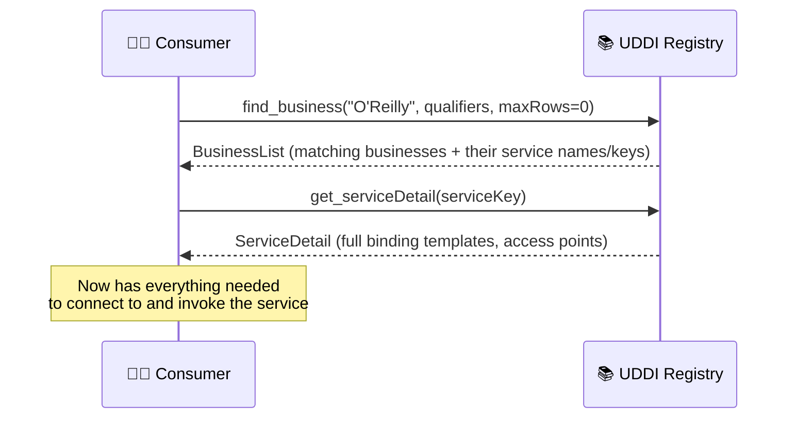

---

## 16. Making WSDL and UDDI Work Together

WSDL and UDDI overlap somewhat in what they can describe, which raised a real practical question: how do you use them together without duplicating effort? The industry answer was a **best-practices document** defining a clean split.

### 16.1 Split Your WSDL in Two

**Interface description**: everything abstract, data types, messages, port types, bindings.

```xml
<?xml version="1.0" encoding="UTF-8"?>
<wsdl:definitions name="HelloWorldInterfaceDescription"
    targetNamespace="urn:HelloWorldInterface"
    xmlns:tns="urn:HelloWorldInterface"
    xmlns:soap="http://schemas.xmlsoap.org/wsdl/soap/"
    xmlns:wsdl="http://schemas.xmlsoap.org/wsdl/">
  <wsdl:message name="sayHello_IN">
    <part name="name" type="xsd:string" />
  </wsdl:message>
  <wsdl:message name="sayHello_Out">
    <part name="greeting" type="xsd:string" />
  </wsdl:message>
  <wsdl:portType name="HelloWorldInterface">
    <wsdl:operation name="sayHello">
      <wsdl:input message="tns:sayHello_IN" />
      <wsdl:output message="tns:sayHello_OUT" />
    </wsdl:operation>
  </wsdl:portType>
  <wsdl:binding name="HelloWorldBinding"
                type="tns:HelloWorldInterface">
    <soap:binding style="rpc"
                  transport="http://schemas.xmlsoap.org/soap/http" />
    <wsdl:operation name="sayHello">
      <soap:operation soapAction="urn:Hello" />
      <wsdl:input>
        <soap:body use="encoded" namespace="urn:Hello"
            encodingStyle="http://schemas.xmlsoap.org/soap/encoding/" />
      </wsdl:input>
      <wsdl:output>
        <soap:body use="encoded" namespace="urn:Hello"
            encodingStyle="http://schemas.xmlsoap.org/soap/encoding/" />
      </wsdl:output>
    </wsdl:operation>
  </wsdl:binding>
</wsdl:definitions>
```

> ⚠️ **Caution:** Once again, this listing carries the same `sayHello_Out`/`sayHello_OUT` case mismatch flagged in section 5. I'd correct it the same way when actually using this document.

**Implementation description**: just the `service`, importing the interface description:

```xml
<?xml version="1.0" encoding="UTF-8"?>
<wsdl:definitions name="HelloWorldImplementationDescription"
    targetNamespace="urn:HelloWorldImplementation"
    xmlns:tns="urn:HelloWorldImplementation"
    xmlns:hwi="urn:HelloWorldInterface"
    xmlns:soap="http://schemas.xmlsoap.org/wsdl/soap/"
    xmlns:wsdl="http://schemas.xmlsoap.org/wsdl/">
  <wsdl:import namespace="urn:HelloWorldInterface"
               location="HelloWorldInterfaceDescription.wsdl" />

  <wsdl:service name="HelloWorldService">
    <wsdl:port name="HelloWorldPort"
               binding="hwi:HelloWorldBinding">
      <!-- location of the Perl Hello World Service -->
      <soap:address location="http://localhost:8080" />
    </wsdl:port>
  </wsdl:service>
</wsdl:definitions>
```

### 16.2 Register the Interface as a TModel

```java
TModel tModel = new TModel();
tModel.setName("Hello World Interface");

OverviewDoc odoc = new OverviewDoc();
odoc.setOverviewURL("http://localhost/HelloWorldInterface.wsdl");
tModel.setOverviewDoc(odoc);

CategoryBag cbag = new CategoryBag();
KeyedReference kr = new KeyedReference();
kr.setTModelKey("uuid:C1ACF26D-9672-4404-9D70-39B756E62AB4");
kr.setKeyName("uddi-org:types");
kr.setKeyValue("wsdlSpec");
// (attach cbag to tModel in the full listing)

UDDIProxy proxy = new UDDIProxy();
proxy.setPublishURL("https://www-3.ibm.com/services/uddi/testregistry/protect/publishapi");
AuthToken token = proxy.get_authToken("james", "semaj");
Vector tModels = new Vector();
tModels.add(tModel);
TModelDetail detail = proxy.save_TModel(token.getAuthInfo().getText(), tModels);

// retain the auto-generated key for the next step
tModel = (TModel) detail.getTModelVector().elementAt(0);
String tModelKey = tModel.getTModelKey();
```

The category reference with key name `uddi-org:types` and value `wsdlSpec` is how UDDI marks a TModel as **specifically representing a WSDL description**, rather than something like a NAICS code.

### 16.3 Link the Service to the TModel

```java
BusinessService service = new BusinessService();
service.setBusinessKey(businessKey);
service.setName("HelloWorldService");

BindingTemplates templates = new BindingTemplates();
BindingTemplate template = new BindingTemplate();
templates.getBindingTemplateVector().add(template);
service.setBindingTemplates(templates);

AccessPoint accessPoint = new AccessPoint();
accessPoint.setURLType("HTTP");
accessPoint.setText("http://localhost:8080");
template.setAccessPoint(accessPoint);

TModelInstanceDetails details = new TModelInstanceDetails();
TModelInstanceInfo instance = new TModelInstanceInfo();
instance.setTModelKey(tModelKey);

InstanceDetails instanceDetails = new InstanceDetails();
OverviewDoc odoc2 = new OverviewDoc();
odoc2.setOverviewURL("http://localhost/HelloWorldImplementationDescription.wsdl");
instanceDetails.setOverviewDoc(odoc2);
instance.setInstanceDetails(instanceDetails);

details.getTModelInstanceInfoVector().add(instance);
template.setTModelInstanceDetails(details);

UDDIProxy proxy = new UDDIProxy();
// ... abbreviated
proxy.save_service(authInfo, services);
```

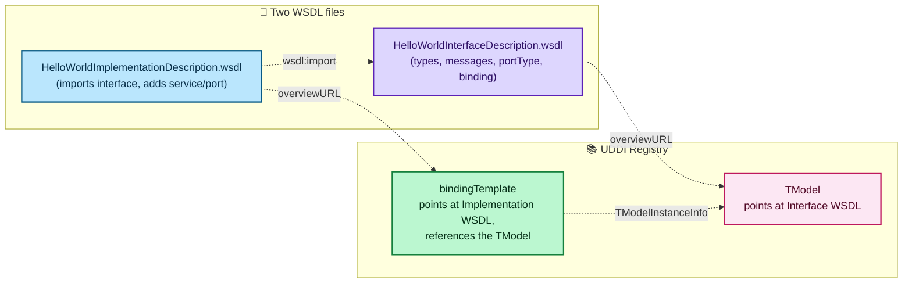

### 16.4 Putting It All Together: WSDL + UDDI + WSIF

Once published this way, a client can go from **zero information** to **a working invocation**, entirely on its own side, with nothing needed on the server:

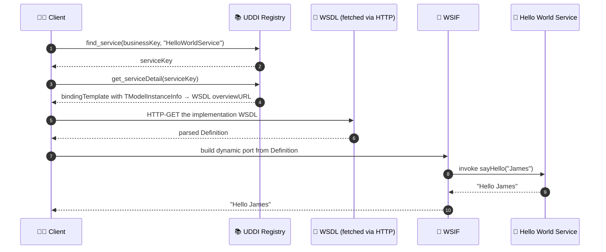

In code, locating the service:

```java
UDDIProxy proxy = new UDDIProxy();
FindQualifiers fq = new FindQualifiers();
ServiceList list = proxy.find_service(businessKey, "HelloWorldService", fq, 0);
ServiceInfos infos = list.getServiceInfos();
ServiceInfo info = (ServiceInfo) infos.getServiceInfoVector().elementAt(0);
String serviceKey = info.getServiceKey();
```

Following the trail from the service detail down to the WSDL path:

```java
ServiceDetail detail = proxy.get_serviceDetail(serviceKey);
BusinessService service = (BusinessService) detail
    .getBusinessServiceVector().elementAt(0);
BindingTemplate template = (BindingTemplate) service
    .getBindingTemplates().getBindingTemplateVector().elementAt(0);
TModelInstanceDetails details = template.getTModelInstanceDetails();
TModelInstanceInfo instance = details.getTModelInstanceInfoVector().elementAt(0);
InstanceDetails instanceDetails = instance.getInstanceDetails();
OverviewDoc odoc = instanceDetails.getOverviewDoc();
String wsdlpath = odoc.getOverviewURLString();
```

Then using WSIF to build a dynamic port and invoke it:

```java
Definition def = WSIFUtils.readWSDL(null, wsdlPath);
Service service = WSIFUtils.selectService(def, null, "HelloWorldService");
PortType portType = WSIFUtils.selectPortType(def, null, "HelloWorldInterface");
WSIFDynamicPortFactory dpf = new WSIFDynamicPortFactory(def, service, portType);
WSIFPort port = dpf.getPort();

WSIFMessage input = port.createInputMessage();
WSIFMessage output = port.createOutputMessage();
WSIFMessage fault = port.createFaultMessage();

WSIFPart namePart = new WSIFJavaPart(String.class, args[0]);
input.setPart("name", namePart);

System.out.println("Calling the SOAP Server to say hello!\n");
System.out.print("The SOAP Server says: ");
port.executeRequestResponseOperation("sayHello", input, output, fault);
WSIFPart greetingPart = output.getPart("greeting");
String greeting = (String) greetingPart.getJavaValue();
System.out.print(greeting + "\n");
```

Running it:

```text
C:\book>java wsdluddiExample James
Calling the SOAP Server to say hello!
The SOAP Server says: Hello James
```

The thing I want to underline here: **the client was never told which implementation to use.** It discovered the service in UDDI, fetched its WSDL, and bound to it dynamically, all at runtime. And this isn't remotely Java-specific; C#, Visual Basic, and Perl all had UDDI and WSDL extensions of their own at the time.

---

## 17. WS-Inspection: The Lightweight Alternative

UDDI is powerful, but it's also a lot of machinery, businessEntity, businessService, bindingTemplate, TModel, a whole SOAP API, for something that, in many cases, is really just "here's where my WSDL document lives." **WS-Inspection**, jointly proposed by IBM and Microsoft, fills that gap.

A WS-Inspection document is a simple, discoverable **index of services** at a given network location:

```xml
<?xml version="1.0"?>
<inspection
    xmlns="http://schemas.xmlsoap.org/ws/2001/10/inspection/"
    xmlns:uddi="http://schemas.xmlsoap.org/ws/2001/10/inspection/uddi/">
  <service>
    <abstract>The Hello World Service</abstract>
    <description
        referencedNamespace="http://schemas.xmlsoap.org/wsdl/"
        location="http://example.com/helloworld.wsdl"/>
    <description referencedNamespace="urn:uddi-org:api">
      <uddi:serviceDescription
          location="http://www.example.com/uddi/inquiryapi">
        <uddi:serviceKey>
          4FA28580-5C39-11D5-9FCF-BB3200333F79
        </uddi:serviceKey>
      </uddi:serviceDescription>
    </description>
  </service>
  <link
      referencedNamespace="http://schemas.xmlsoap.org/ws/2001/10/inspection/"
      location="http://example.com/moreservices.wsil"/>
</inspection>
```

Notice this single document references the *same* Hello World service **two different ways**: a direct WSDL pointer, and a UDDI service key lookup. WS-Inspection doesn't compete with either mechanism, it's a lightweight index that can point at both.

### 17.1 The Phone Book Analogy

The book's analogy for the relationship between the two is the best explanation I've seen of this distinction, and I want to preserve it faithfully:

> **UDDI is a phone book.** If you need a plumber and don't know one, you open the phone book and search.
>
> **WS-Inspection is useful when you already know who you want to call.** You don't need to search a directory, you just want that specific provider's list of what they offer and where to find it.

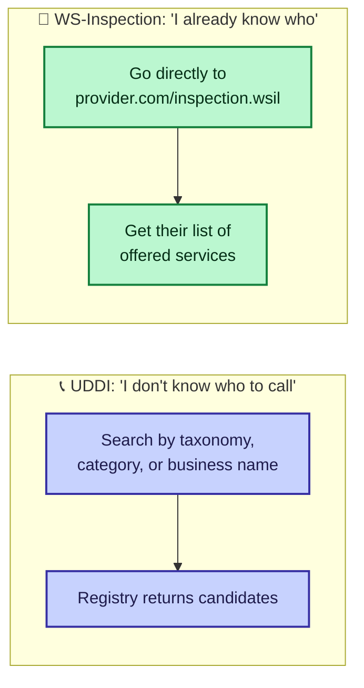

### 17.2 Syntax and Well-Known Location

The root `<inspection>` element holds a mix of:

| Element | Purpose |
|---|---|
| `<abstract>` | Free-text documentation, anywhere in the document |
| `<link>` | Points at other WS-Inspection documents, or other discovery mechanisms entirely (like a UDDI registry) |
| `<service>` | One offered service, itself a collection of `<abstract>` and `<description>` elements |

A service's `<description>` elements can point at **multiple** description formats for the same service, exactly as the example above does for both WSDL and UDDI.

> 💡 **Tip:** The spec defines a **well-known location convention**: at minimum, put a document named `Inspection.wsil` at your web server's root, e.g. `http://www.example.com/inspection.wsil`. That convention alone is most of WS-Inspection's value: a client that knows nothing about your service can still find out what you offer just by checking one predictable URL.

> 📝 **Note:** At the time the book was written, WS-Inspection had **not yet been submitted for standardization**, though both IBM and Microsoft had implemented support for it. The book's own assessment was that, "because of its usefulness and simple syntax," it was likely to gain favorable support. I'll address how that actually played out in the next section.

---

## 18. What's Changed Since This Was Written

As with my earlier posts, a reality check before you build anything on this.

| Topic in the source material | What to know today |
|---|---|
| UDDI Version 1.0 as the focus, with 2.0 barely supported | UDDI progressed to **Version 3.0**. More significantly, the entire public UDDI Business Registry effort (the IBM/Microsoft/SAP-operated public nodes) **was discontinued in 2006**. UDDI survives mainly in private/enterprise registry deployments, not as a public internet-wide directory the way this chapter describes |
| WS-Inspection as an emerging, not-yet-standardized proposal | WS-Inspection never achieved the widespread adoption the book anticipated. It's largely a historical footnote rather than something you'd encounter in active use today |
| IBM's WSIF and Web Services ToolKit | Reflects tooling specific to that era; the broader industry consolidated around toolkits like Apache Axis/Axis2 and, later, language-native WSDL-to-client generators bundled with mainstream frameworks |
| `<wsdl:import>` having spotty tool support | Modern tooling generally handles `<wsdl:import>` reliably; this was very much an early-2000s growing pain |
| WSDL 1.1 as described throughout (port types, bindings, services) | **WSDL 2.0** later renamed several core concepts (`portType` became `interface`, `port` became `endpoint`) and changed some semantics; most real-world deployments you'd meet today, though, are still WSDL 1.1, so the vocabulary in this post remains broadly practical |
| Discovery via a centralized registry as the dominant paradigm | The industry's center of gravity shifted heavily toward REST/JSON APIs, and where formal discovery matters at all today, it's more likely handled through API gateways, service meshes, or platform-specific registries (like a cloud provider's API catalog) than a UDDI-style universal registry |

> 📝 **Note:** As before, this table reflects general knowledge of how the ecosystem evolved rather than anything from the source material itself. If you're integrating with a specific SOAP service today, check its actual WSDL and whatever discovery mechanism it documents, rather than assuming any of the public UDDI infrastructure described in this chapter is still reachable.

---

## 19. Cheat Sheet and Final Thoughts

### 19.1 One page, both halves of the chapter

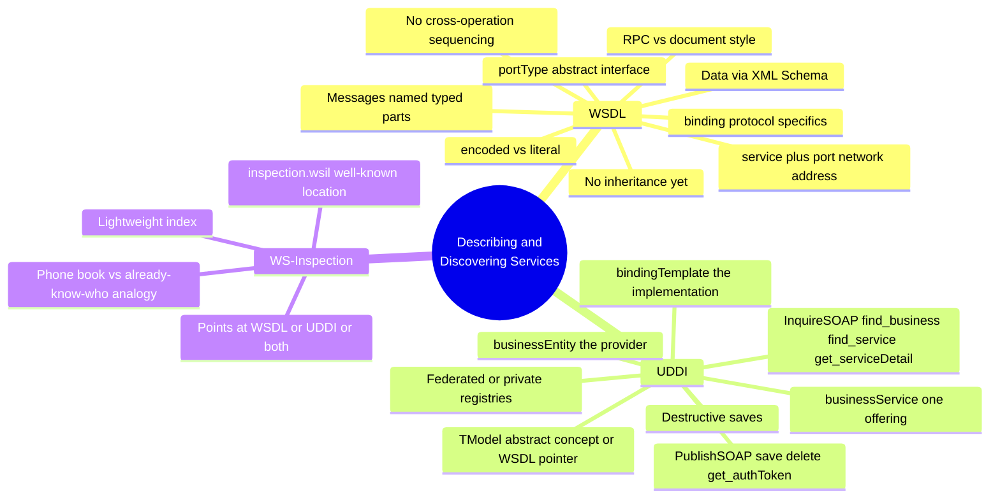

### 19.2 Quick reference

| Concept | One-line summary |
|---|---|
| **WSDL** | The de facto standard for describing what a service does and how to call it |
| **portType** | The abstract interface: operations as ordered message exchanges |
| **binding** | Ties a portType to concrete protocols (SOAP, HTTP-GET, etc.) |
| **service / port** | The concrete network address(es) where a binding is actually deployed |
| **RPC vs. document style** | Whether the SOAP body follows the RPC convention, or carries arbitrary XML |
| **encoded vs. literal** | Whether message parts follow Section 5 encoding rules, or are arbitrary XML |
| **WSIF** | A WSDL-aware layer that lets a client invoke a service knowing only its WSDL |
| **UDDI** | A searchable registry of businesses and the services they offer |
| **businessEntity / businessService / bindingTemplate** | Provider → offering → concrete implementation, in that nesting order |
| **TModel** | An abstract concept the registry tracks, including "this is a WSDL interface" |
| **Destructive save** | `save_business` replaces the whole record; scope your saves narrowly |
| **WS-Inspection** | A lightweight index of services at a known location, no registry infrastructure required |

### 19.3 My rules of thumb

1. **Treat a published WSDL description as immutable.** There's no versioning story here; a breaking change means a new description, not an edit.
2. **Don't hand-write WSDL if you can generate it.** Most real toolkits will do this from your existing code; hand-authoring invites exactly the kind of case-mismatch bug I had to fix twice in this post.
3. **XML names are case-sensitive, and nothing will warn you kindly.** The `sayHello_Out`/`sayHello_OUT` bug I found and fixed is a small, easy mistake with a totally unhelpful failure mode: a parser just won't resolve the reference.
4. **Remember what WSDL can't do.** No inheritance, no cross-operation sequencing. If your service has a real ordering dependency (login before delete), document it outside WSDL, or reach for a workflow specification.
5. **`save_business` is a loaded gun.** Always prefer the narrowest save operation (`save_service`, `save_binding`) over the broadest one, or fetch-modify-save the full record if you must use the broad one.
6. **A TModel is UDDI's way of pointing outward.** Whether it's a classification code or a WSDL interface, treat TModels as UDDI's mechanism for referencing description formats it doesn't itself define.
7. **Discovery and description are genuinely separate problems, and it's fine to only solve one of them.** If you already know exactly who you're calling, a WS-Inspection-style well-known WSDL location is enough. You don't need a UDDI registry for that; you need one when you don't yet know who to call.

### 19.4 Closing thoughts

What ties this whole post together, for me, is a single idea: **abstraction layers that can be discovered and composed at runtime, rather than hardcoded at compile time.** WSDL separates the abstract interface from its concrete binding, which is how the same `HelloWorldInterface` can be delivered over SOAP or bare HTTP-GET without touching the interface definition. UDDI separates "what a business offers" from "how to technically reach it," which is how a client can search by category, find a business, and only then discover the wire-level details.

The WSDL-plus-UDDI-plus-WSIF example in section 16 is the whole chapter's thesis condensed into one working program: a client that was never told which implementation to call, in which language, at which address, and still successfully said "Hello James." That's the actual promise of self-describing, discoverable web services, made concrete rather than aspirational.

If you'd like me to go further, walking through a modern equivalent of WSIF's dynamic invocation, or digging into how WSDL 2.0 actually changed the vocabulary I used throughout this post, let me know and I'll take it further.
