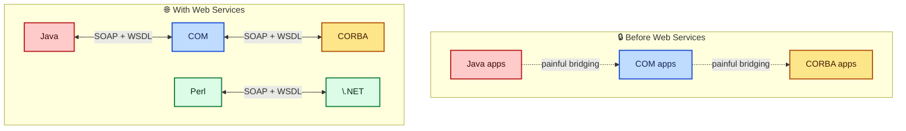
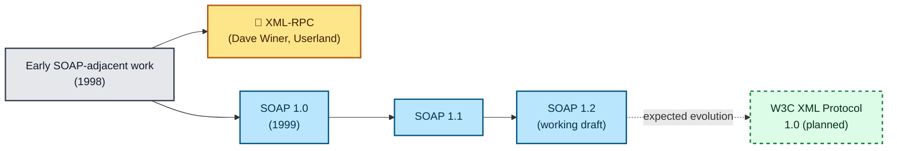
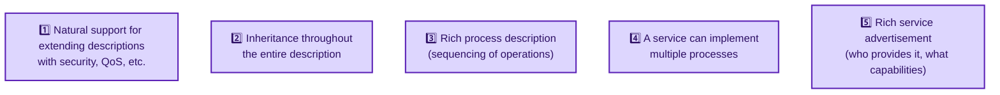
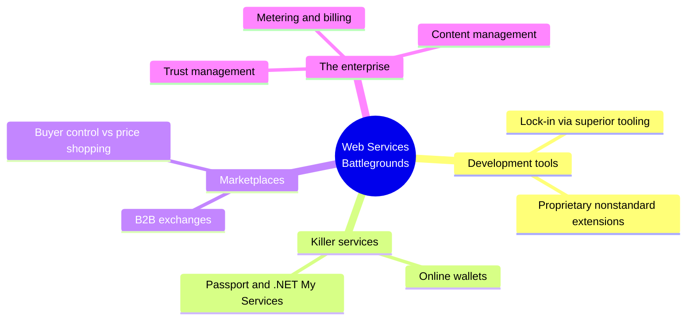
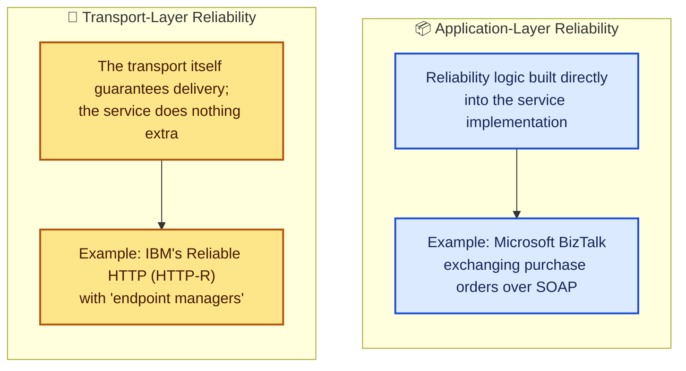
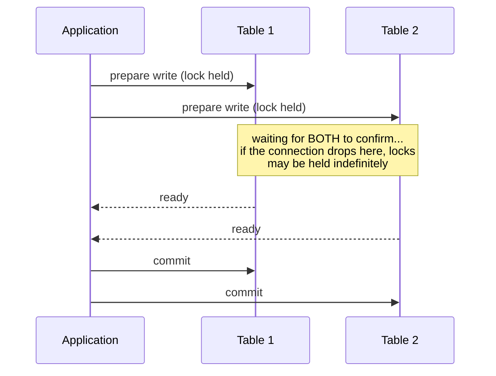
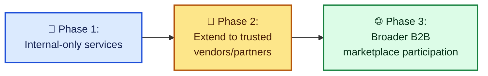
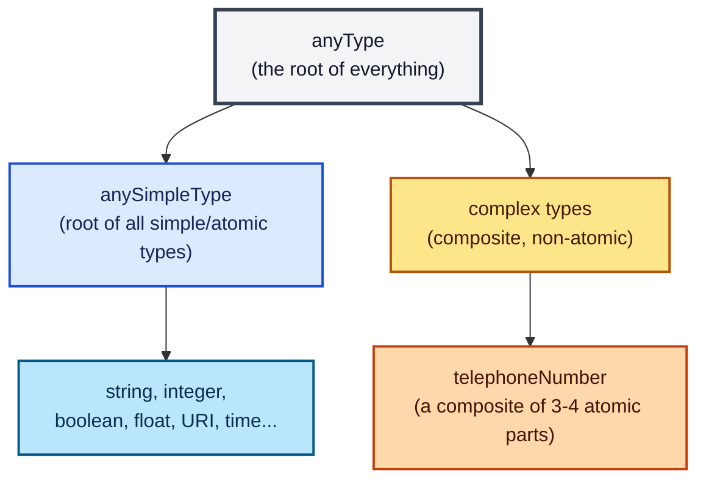
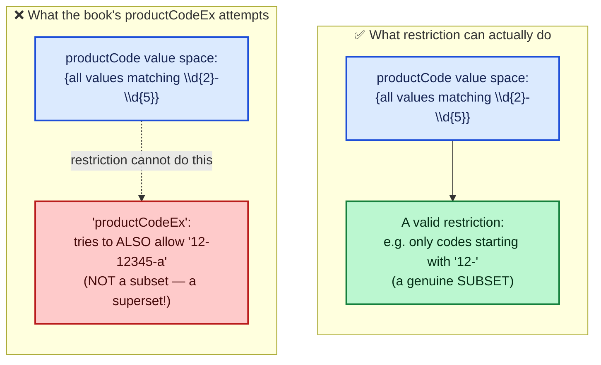
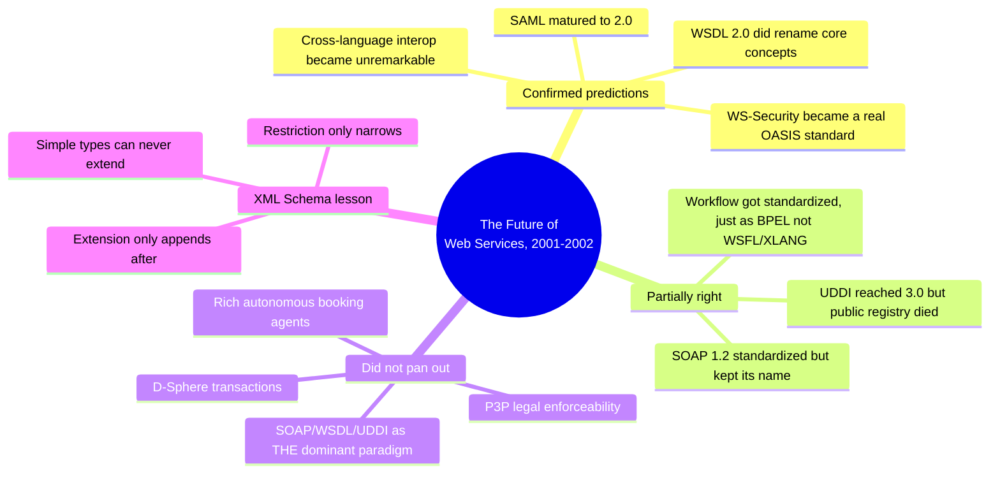

# The Future of Web Services, and the XML Schema Basics I Should Have Covered Earlier

This is the closing post in a series I've been writing while working through *Programming Web Services with SOAP*. I've covered the core protocol, building and deploying services, WSDL, UDDI, and a full peer-to-peer example with real security tradeoffs. This time I'm looking at chapter 9, the book's forward-looking chapter on where SOAP, WSDL, and UDDI were headed, plus the standardization landscape from Appendix A, and then circling back to something genuinely foundational I've been leaning on without fully explaining: **XML Schema's simple and complex types**, from Appendix B.

I want to be upfront about one thing before I start: chapter 9 is speculative by design. It was written at a specific, unsettled moment in the industry, and a lot of what it predicts didn't play out the way the authors expected. I'll flag that honestly throughout, rather than presenting 2001-2002 predictions as settled fact. Where I *can* verify something concretely, I did: I built a real XSD from the book's Appendix B examples and ran it through an actual schema validator, and in the process, I found a genuine, interesting bug in how the book explains type restriction. More on that below.

**What's in this post:**

- Why web services made cross-platform language wars mostly irrelevant, and what stayed the same
- The book's predictions for SOAP, WSDL, and UDDI's evolution into formal standards
- DAML-S as an alternative to WSDL, and the ideas WSDL borrowed from it
- The "web services battlegrounds": development tools, killer services, B2B marketplaces, the enterprise
- The list of missing technologies: agents, quality of service, privacy, trust, contracts, reliable messaging, transactions
- Appendix A's standardization landscape, and how much of it panned out
- A real, tested XML Schema built from Appendix B's examples, including a genuine bug I found in how the book explains restriction versus extension
- Tables, notes, and cautions throughout, with an honest "what actually happened" section at the end

---

## Table of Contents

1. [How Web Services Changed the Rules](#1-how-web-services-changed-the-rules)
2. [What Web Services Don't Replace](#2-what-web-services-dont-replace)
3. [The Future of SOAP](#3-the-future-of-soap)
4. [The Future of WSDL](#4-the-future-of-wsdl)
5. [DAML-S: WSDL's More Ambitious Cousin](#5-daml-s-wsdls-more-ambitious-cousin)
6. [Standard Extensions WSDL Was Missing](#6-standard-extensions-wsdl-was-missing)
7. [The Future of UDDI](#7-the-future-of-uddi)
8. [Web Services Battlegrounds](#8-web-services-battlegrounds)
9. [The Missing Technologies](#9-the-missing-technologies)
10. [Reliable Messaging and Transactions, in Depth](#10-reliable-messaging-and-transactions-in-depth)
11. [How the Book Predicted Web Services Would Roll Out](#11-how-the-book-predicted-web-services-would-roll-out)
12. [Appendix A: The Standardization Landscape](#12-appendix-a-the-standardization-landscape)
13. [XML Schema Basics: Simple and Complex Types](#13-xml-schema-basics-simple-and-complex-types)
14. [Tested: Building a Real XSD from the Book's Examples](#14-tested-building-a-real-xsd-from-the-books-examples)
15. [A Genuine Bug I Found: Restriction Can't Loosen a Type](#15-a-genuine-bug-i-found-restriction-cant-loosen-a-type)
16. [Extension, Ordering, and the Full Test Results](#16-extension-ordering-and-the-full-test-results)
17. [What Actually Happened: A Reality Check](#17-what-actually-happened-a-reality-check)
18. [Cheat Sheet and Final Thoughts](#18-cheat-sheet-and-final-thoughts)

---

## 1. How Web Services Changed the Rules

I want to start with the claim the book makes most confidently, because I think it's held up better than almost anything else in this chapter: **web services made a lot of old platform wars irrelevant.**

Before web services, enterprise development platforms were, in the book's word, "inbred." Java worked best with Java. COM worked best with COM. CORBA worked best with CORBA. You could bridge them, but it was genuinely painful. To get the most out of any one environment, you had to standardize on it.



Web services opened an integration channel that simply didn't exist before, built on open standards any platform could implement. That's the exact thing I demonstrated concretely, not just asserted, back in my "Writing SOAP Web Services" post: **the same Hello World service, deployed in Perl, Java, and C#, calling each other interchangeably.** The book makes the same point, and it makes an argument I find genuinely persuasive: if you went looking for a Hello World service somewhere on the internet, it wouldn't matter whether it was written in Java, Perl, .NET, or (the book's own examples) **COBOL or Ada**. There really was a SOAP implementation for Ada. Visual Studio .NET, at the time, was planned to support writing assemblies in COBOL.

> 📝 **Note:** This is one of the few claims in this chapter I'd call **fully vindicated by history**, arguably even more thoroughly than the book anticipated. Cross-language interoperability over standardized wire protocols (whether SOAP or, later, plain JSON-over-HTTP) became so unremarkable that most developers today don't even think of it as a "web services" achievement, it's just assumed. That's usually what success looks like: the innovation becomes invisible.

---

## 2. What Web Services Don't Replace

The book makes a point here I think is worth sitting with, because it's easy to overstate what any integration technology actually does: **web services don't replace existing technology infrastructures. They integrate them.**

If you need a J2EE application to talk to a COM application, web services make that easier. But web services won't magically replace "that 30-year-old mainframe system in the back closet that nobody ever thinks about anymore." What they *can* do is provide cross-platform, automated access **to** that mainframe, opening new business channels without requiring a rewrite.

| What web services do | What web services don't do |
|---|---|
| Provide a standard integration channel between different platforms | Replace the platforms themselves |
| Make old systems newly accessible via a modern interface | Modernize the internals of those old systems |
| Reduce the pain of cross-platform communication | Eliminate the need for platform-specific expertise entirely |

> 💡 **Tip:** I think this framing, "integration layer, not replacement," is the single most durable idea in this entire chapter, and it's aged into something close to conventional wisdom about API layers generally. Whether you're wrapping a legacy mainframe in SOAP in 2002 or wrapping one in a REST API today, the underlying insight is identical: exposing a standard interface is usually cheaper and safer than rewriting the system behind it.

---

## 3. The Future of SOAP

At the time of writing, SOAP was already a few years old. The book traces a real lineage worth knowing: an early version of what became SOAP split off into **XML-RPC**, championed by Dave Winer at Userland Software, who was also a coauthor of the original SOAP specification. XML-RPC split from SOAP in 1998; SOAP itself was first announced in 1999, and by the time of writing had gone through four revisions, with a fifth being developed by the W3C.



The book's prediction: SOAP 1.2's working draft would evolve into **W3C XML Protocol Version 1.0**, the first genuinely standardized version of the protocol, and the working group had committed to using SOAP as its basis while maintaining backwards compatibility "at least on a fundamental level." At the time of writing, the book is candid that it's **too early to know** what would actually differ between the draft and the final recommendation, and points readers to the `xml-dist-app` mailing list to follow along live.

> ⚠️ **Caution:** This is a good example of a prediction that was directionally right but got a detail wrong, worth flagging honestly rather than smoothing over. The effort did become a formal W3C Recommendation, but it kept the **SOAP** name (as SOAP 1.2) rather than being rebranded "XML Protocol 1.0" as the book anticipated. See section 17 for the full picture.

---

## 4. The Future of WSDL

WSDL, at the time, wasn't yet an official standard either, though the book describes it as "well on the road to becoming one," submitted to the W3C with a working group forming around it. Unlike SOAP's comparatively stable direction, the book flags real uncertainty here: **the eventual standardized WSDL might end up meaningfully different from the version already being widely used.**

### 4.1 What Was Missing

The book identifies gaps that a future W3C working group would need to address:

| Missing capability | Why it matters |
|---|---|
| **Security requirements** | No standard way to say "this operation requires authentication" |
| **Quality of service attributes** | No standard way to express reliability, performance guarantees, etc. |
| **Sequencing of operations** | As I covered in my WSDL post, WSDL can't express "call `login` before `deleteAllRecords`" |

The book is careful to note these gaps matter more for **enterprise e-business scenarios** than for simple, basic RPC-style services, a reasonable scoping of the concern.

---

## 5. DAML-S: WSDL's More Ambitious Cousin

This is the part of the chapter I found most interesting to revisit, because it's a genuinely thoughtful comparison between two different philosophies for describing a service.

**DAML-S** (DARPA Agent Markup Language for Services) took a much more ambitious approach than WSDL: building a **formal semantic data model** for web services, rather than just a syntactic description of operations and bindings. It's built on the **Resource Description Framework (RDF)**, which makes it considerably more complex and verbose than WSDL.

Here's a trimmed version of the book's own DAML-S description of the Hello World service, for comparison against the WSDL version from my earlier post:

```xml
<rdf:RDF xmlns:rdf="http://www.w3.org/1999/02/22-rdf-syntax-ns#"
    xmlns:daml="http://www.daml.org/2001/03/daml+oil#"
    xmlns:service="http://www.daml.org/services/damls/2001/05/Service#"
    xmlns:process="http://www.daml.org/services/damls/2001/05/Process#"
    xmlns:profile="http://www.daml.org/services/damls/2001/05/Profile#">
  <daml:Ontology about="">
    <daml:versionInfo>HelloWorld</daml:versionInfo>
    <daml:imports rdf:resource="http://www.w3.org/1999/02/22-rdf-syntax-ns" />
    <!-- several more imports -->
  </daml:Ontology>

  <rdf:Service rdf:ID="StockQuoteService">
    <service:presents>
      <profile:Advertisement rdf:about="#StockQuote_Advertisement" />
    </service:presents>
    <service:implements>
      <process:ProcessModel rdf:about="#StockQuote_ProcessModel" />
    </service:implements>
  </rdf:Service>

  <process:ProcessModel rdf:ID="StockQuote_ProcessModel">
    <service:topLevelEvent rdf:resource="#GetStockQuote" />
  </process:ProcessModel>

  <rdfs:Class rdf:ID="GetStockQuote">
    <rdfs:subClassOf
        rdf:resource="http://www.daml.org/services/damls/2001/05/Process#Process" />
  </rdfs:Class>

  <rdf:Property rdf:id="symbol">
    <rdfs:domain rdf:resource="#GetStockQuote" />
    <rdfs:subPropertyOf
        rdf:resource="http://www.daml.org/services/damls/2001/05/Profile#input" />
    <rdfs:range rdf:resource="http://www.w3.org/2000/10/XMLschema#string" />
  </rdf:Property>

  <rdf:Property rdf:id="value">
    <rdfs:domain rdf:resource="#GetStockQuote" />
    <rdfs:subPropertyOf
        rdf:resource="http://www.daml.org/services/damls/2001/05/Profile#output" />
    <rdfs:range rdf:resource="http://www.w3.org/2001/10/XMLSchema#float" />
  </rdf:Property>

  <profile:Advertisement rdf:ID="StockQuote_Advertisement">
    <profile:serviceName>StockQuoteService</profile:serviceName>
    <!-- elements removed for brevity -->
  </profile:Advertisement>
</rdf:RDF>
```

> 📝 **Note:** The book's own example actually mixes services here, it describes the Hello World service in prose but its `rdf:Service` and properties (`symbol`, `value`) are actually modeling a `StockQuoteService`, not `sayHello`/`name`/`greeting`. This looks like an editorial artifact from reusing an example across drafts rather than a DAML-S syntax issue itself, but it's worth knowing if you go looking at the original text.

### 5.1 What WSDL Could Learn from DAML-S

The book lists five concrete lessons, and I think they're worth reading as a checklist of "things a *really* rich service description language needs" rather than DAML-S-specific trivia:



| DAML-S strength | The corresponding WSDL gap (from my earlier post) |
|---|---|
| Natural extensibility for security/QoS metadata | No standard WSDL extensions for these exist |
| Inheritance across the whole description | WSDL `portType`s can't extend one another, as I covered in my WSDL post |
| Rich process/sequencing descriptions | WSDL only supports simple function-style exchanges, no cross-operation ordering |
| A service implementing multiple processes | No direct WSDL equivalent |
| Rich advertisement metadata (who, what capabilities) | WSDL has no advertisement information at all |

The book's honest assessment: DAML-S "has no solid corporate backing," but its underlying **ideas** were expected to influence the next generation of WSDL regardless.

---

## 6. Standard Extensions WSDL Was Missing

This section connects directly back to my earlier post on the CodeShare service and its SAML-based authentication. There's genuinely no way, in the WSDL the book describes, to say "this service uses SAML for single sign-on." The book proposes a **hypothetical** extension to illustrate what a fix might look like:

```xml
<binding name="HelloWorldBinding" type="HelloWorldPortType">
  <soap:binding transport="http://schemas.xmlsoap.org/soap/http" />
  <s:authentication method="http://schemas.xmlsoap.org/security/saml" />
</binding>
```

> ⚠️ **Caution:** I want to be explicit that this `s:authentication` element is **entirely hypothetical**, invented by the book's authors to illustrate a gap, not a real extension that existed or was standardized at the time. Don't go looking for `s:authentication` support in any real WSDL toolkit from this era; it never existed as shown.

At the time of writing: **no standard WSDL extensions existed for this, and no broad industry effort was underway to define them.** The book frames this as a plausible future addition to the eventual W3C-standardized WSDL.

---

## 7. The Future of UDDI

UDDI's history, per the book: originally developed by **Microsoft, IBM, and Ariba**, later managed by a broader industry consortium, with a plan to submit it for formal standardization once **Version 3.0** was complete (Version 2.0 was current at the time of writing, and my earlier UDDI post focused on Version 1.0, which the source book itself used as its primary teaching example).

### 7.1 Real Problems the Book Identifies

I want to give these full weight, because they're not vague hand-wringing, they're specific, named weaknesses:

| Problem | Concrete example |
|---|---|
| **Weak identity security** | "It is possible for anybody to create an entry in a UDDI registry, pretending to be somebody else... I can easily create an entry in a UDDI registry pretending to be Microsoft." |
| **Bad links** | Public registries accumulate entries pointing at companies or services that no longer exist |
| **Poor understanding** | Many companies simply didn't understand what UDDI was for or how it could help them |
| **Doubts about long-term value** | Even among companies that *did* understand it, there were real doubts about whether public UDDI registries would remain useful |

> ⚠️ **Caution:** The identity-spoofing problem is the one I'd flag as the most serious, and it's a direct echo of a theme from my previous post: **a signature (or, here, a registry entry) is only as trustworthy as the verification behind it.** Just as CodeShare's SAML assertions are only meaningful if verified against the *actual* issuer's key rather than whatever the message claims, a UDDI registry entry claiming to be "Microsoft" is worthless as an identity claim unless something actually verifies that link. The book identifies this as a key requirement for future UDDI versions: **a security infrastructure that lets consumers validate the identity of publishers.**

---

## 8. Web Services Battlegrounds

This section is, in a way, the most self-aware part of the chapter: the book knows that removing one set of platform wars (Java vs. COM vs. CORBA) doesn't mean competition disappears. It just moves somewhere else.



### 8.1 Development Tools

The book's argument: Microsoft's historical dominance on the desktop came partly from **courting developers successfully**. Convince enough developers your tools make them dramatically more productive, and third parties build your killer apps for you. Once developers are comfortable with your tools, you can quietly integrate proprietary technology into them, making it progressively harder to leave.

> 📝 **Note:** The book names this pattern explicitly as **"embracing and extending"**, a phrase with real historical baggage (it was, and still is, closely associated with Microsoft's competitive strategy in the browser and protocol wars of the 1990s). The warning here: vendors would want to appear standards-compliant while quietly differentiating with nonstandard add-ons, weakening interoperability while deepening lock-in.

### 8.2 Killer Services

The book's specific example is the **online wallet**: a service storing passwords, credit card numbers, and other sensitive data, acting as a clearinghouse for e-commerce transactions. If a vendor's development tools make their particular wallet the easy default choice, that vendor gains real leverage. The book explicitly names this as the likely strategy behind Microsoft's **.NET My Services** (formerly **Hailstorm**), which I also touched on in my previous post's security discussion.

### 8.3 Lucrative Marketplaces

B2B marketplaces, the book argues, had failed twice before for two specific reasons:

1. **Buyers wanted control over buying decisions**, not a machine picking the alphabetically-first vendor.
2. **Providers wanted control over pricing**, and didn't want their prices shopped around by an agent that ignored things like their ability to fulfill large orders or their track record with other buyers.

The book's optimistic prediction: UDDI-backed services could eventually supply the richer context (credit ratings, delivery track records, and so on) needed to address both concerns, letting automated agents evaluate providers more like a human would.

### 8.4 The Enterprise

The book flags a long list of infrastructure services still needed for enterprise-grade web services: distributed trust management, metering/accounting/billing, content management, privacy enforcement and auditing, and dynamic sourcing/procurement. Its framing: web services in 2001-2002 were roughly where Java was **before J2EE** existed, the base technology worked, but the enterprise-grade extensions (security, transactions, messaging, database integration) hadn't caught up yet.

---

## 9. The Missing Technologies

This is the most speculative section of the whole chapter, and I want to walk through it item by item, because some of these predictions aged remarkably well and others didn't pan out at all.

### 9.1 Agents

The book's vision: a software **agent** that books your flights, hotels, and rental cars on your behalf, factoring in your preferences, weather patterns by season and airport, frequent-flyer promotions, and your calendar availability, all automatically. It lists three prerequisites:

1. Standard XML vocabularies for calendars, flights, airports, weather, etc.
2. Every vendor (airlines, hotels, rental car companies) exposing web services an agent can actually call
3. Agent technology itself being **powerful, reliable, secure, and easy to use**

> ⚠️ **Caution:** This is the prediction I'd call the most **aspirational and least realized**, at least in the specific form described. Rich, trustworthy, autonomous travel-booking agents built on standardized XML vocabularies never really materialized the way the book imagined. See section 17 for why.

### 9.2 Quality of Service

Applications built from components spread across the web need assurance those components will actually be available, reliably, at acceptable speed. The book predicts **Quality of Service contracts** becoming increasingly important as the web becomes load-bearing infrastructure for more applications.

### 9.3 Privacy

The book leans on **P3P** here, the same technology I covered critically in my previous post's security discussion, and its own honest caveat there (not legally binding, can change at any time) shows up again here too. It suggests a possible next step: an agent obtaining a **digitally signed and encrypted P3P document**, creating something closer to a legally binding agreement about how supplied data will be handled.

It even sketches how a P3P policy reference might slot into a WSDL binding:

```xml
<definitions xmlns="http://schemas.xmlsoap.org/wsdl/">
  <binding name="HelloWorldBinding" type="HelloWorldPortType">
    <P3P:POLICY-REFERENCES>
      <P3P:POLICY-REF about="Privacy.xml">
        <INCLUDE>*</INCLUDE>
      </P3P:POLICY-REF>
    </P3P:POLICY-REFERENCES>
  </binding>
</definitions>
```

The book's own assessment is refreshingly honest: this WSDL-level linkage is "only part of the solution," and **"currently, there are no proposals on the table"** for the more comprehensive, standardized privacy-protection infrastructure actually needed.

### 9.4 Security

A short but pointed section: **the base SOAP specification itself was never designed with security in mind.** The book points back to its own CodeShare example (IBM's XML Security Suite encrypting SOAP envelope contents) as an early illustration, predicting secure SOAP envelopes would eventually become as unremarkable as HTTPS-delivered HTML pages. Its closing point is one I fully agree with: **security is ultimately about how technology is implemented, deployed, and used, not just which technology exists.** Vendors can supply the tools; only businesses can decide to actually prioritize using them correctly.

### 9.5 Trust Management

A brief pointer to **XKMS** (the XML Key Management Service), a standard mechanism for managing public/private keys, which I listed in the security standards table of my previous post as well.

### 9.6 Online Contracts

The book's framing here is genuinely thought-provoking: if applications are built from conglomerations of independently-operated services, how do you negotiate or enforce a contract when a component fails or misbehaves? Traditional "have the lawyers meet" doesn't scale to machine-to-machine service composition. It names **ebXML's Collaboration Profile Protocol/Agreement (CPP-CPA)** as one attempt, while noting plainly: **none of these attempts had been widely adopted, and no clear winner had emerged.**

---

## 10. Reliable Messaging and Transactions, in Depth

I want to give these two topics their own section, because the book goes deeper here than almost anywhere else in the chapter, and the ideas are genuinely still relevant.

### 10.1 Reliable Messaging

The core problem: **the internet, by design, is unreliable.** Servers go down. The underlying protocols weren't built with message identifiers and acknowledgments baked in. A sender needs to know whether a message actually arrived; a recipient needs a way to confirm receipt; and if no acknowledgment comes back, the sender needs to be able to safely resend without causing duplicate processing.

The book identifies **two architectural approaches**:



Inside the enterprise, this had traditionally been solved with **proprietary message queue products**, IBM's MQ Series and Microsoft's Message Queue being the named examples, and the book notes candidly that getting these two specific products to interoperate was "painful at best."

### 10.2 Transactions and the D-Sphere Idea

This is the part of the chapter I found genuinely intellectually interesting to revisit, even knowing (see section 17) it didn't become mainstream.

The classic **two-phase commit** transaction: every operation in a batch must be invoked (but not finalized) before any of them commits. If a write to one database table succeeds but a write to a second table fails, the first write must be rolled back. The catch: while waiting for that final confirmation, every participant has to **hold a lock** on the resource it's modifying, fine within a single machine, but a real problem for scalability and reliability across a distributed, unreliable network like the internet.



The book points to an IBM research idea called the **Dependency Sphere (D-Sphere)** as a promising alternative. Instead of defining success as "every operation completes without error" (the two-phase-commit definition), a D-Sphere defines success as **"every message sent is reliably received and acknowledged."** A dedicated management service tracks whether the whole transaction context succeeds or fails; if it fails, participants get notified so they can take their own compensating action. The claimed advantage: **no indefinite resource locks**, because reliable messaging is assumed as a foundation rather than something the transaction protocol itself has to negotiate.

> 📝 **Note:** This is explicitly framed as **"one promising IBM research project,"** not a shipped or standardized technology, even at the time of writing. I'm preserving that framing faithfully. See section 17 for how transaction handling for distributed web services actually developed.

### 10.3 Licensing and Accounting Services

A shorter, related point: if software gets sold as a metered service rather than a one-time purchase, you need standard web services for managing licenses and monitoring usage, which in turn need to integrate with existing billing, authentication, and notification systems to be genuinely useful within a business.

---

## 11. How the Book Predicted Web Services Would Roll Out

The book's rollout prediction is refreshingly concrete and, I think, largely correct as a description of how adoption actually tends to work: **start internal, then expand outward.**

Its worked example: a SOAP-based expense-report application. An employee's client queries a **local UDDI registry**, which points to a WSDL document describing how to reach the actual expense application. Because the whole thing is internal, security and privacy concerns are lower than they'd be on the open internet, but the organization still gets real, concrete flexibility: **the accounting department can move the application to a new server, host, or even implementation language at any time, without breaking any client**, because the clients discover the current details dynamically through WSDL and UDDI rather than hardcoding them.



The next step, once internal use is proven out, is bringing in vendors and business partners, starting with things like inter-company purchase requisitions, then eventually extending outward to external suppliers, which requires those suppliers to also adopt SOAP, WSDL, and UDDI.

---

## 12. Appendix A: The Standardization Landscape

Appendix A is essentially a directory of every relevant standardization effort at the time, organized by category. I want to preserve the structure faithfully, because it's a genuinely useful snapshot of how fragmented this space was, before flagging (in section 17) how much of it actually survived.

### 12.1 Packaging Protocols

| Protocol | Status at the time | Notes |
|---|---|---|
| **SOAP / XML Protocol** | Version 1.1 published; 1.2 a working draft | Basis for the W3C's XML Protocol effort |
| **XML-RPC** | Not an official standard | Simple, popular, significant open-source user base |
| **Jabber** | Not an official standard | Both a transport and a simple packaging protocol, used in async P2P services |
| **DIME** | Emerging | Direct Internet Message Encapsulation, a lightweight binary encapsulation format for arbitrary payloads |

### 12.2 Description Protocols

| Protocol | Status |
|---|---|
| **WSDL** | De facto standard, submitted to the W3C; replaced earlier IBM (NASSL) and Microsoft (SDL) proposals |
| **DAML-S** | Academic research project, covered in section 5 |
| **RDF** | The underlying framework DAML-S builds on; some exploration of using RDF directly to describe services |

### 12.3 Discovery Protocols

| Protocol | Status |
|---|---|
| **UDDI** | The best-known registry effort |
| **WS-Inspection** | The lightweight alternative I covered in my previous post |
| **ebXML Registry** | A related but distinct registry model, not incompatible with UDDI, carrying more types of information |
| **JXTA Search** | Sun-sponsored, distributed search for Sun's JXTA peer-to-peer infrastructure |

### 12.4 Security Protocols

| Protocol | Status |
|---|---|
| **XML Digital Signature** | Joint W3C/IETF effort |
| **XML Encryption** | W3C effort |
| **SAML** | Developed under OASIS, the mechanism CodeShare used in my previous post |
| **XKMS** | Submitted to the W3C for a service-based public key infrastructure |
| **XACML** | An effort to standardize access control for XML documents |
| **WS-Security / WS-License** | Microsoft proposals, explicitly flagged as **proprietary** since they hadn't been submitted to any standards body |
| **SOAP Security Extensions** | A joint IBM/Microsoft effort; the digital signature portion had already gone to the W3C |

### 12.5 Transport Protocols

| Protocol | Status |
|---|---|
| **HTTP** | The dominant transport |
| **Jabber** | XML-based async transport, common in P2P |
| **BEEP** | An IETF effort promising duplexed, asynchronous transport |
| **Reliable HTTP (HTTP-R)** | IBM's proposal for adding reliable-messaging support to HTTP |

### 12.6 Routing and Workflow

| Technology | Status |
|---|---|
| **WSFL** | IBM's WSDL-based workflow scripting grammar |
| **XLANG** | Microsoft's workflow scripting language |
| **WS-Routing** | Microsoft's proposal for defining a SOAP message's route through intermediaries, the same technology I covered in my very first post |

### 12.7 Java-Specific Efforts

| JSR / API | Purpose |
|---|---|
| **JAXP** | Standardized XML parsing APIs for Java |
| **JAX-RPC** | Standardized Java APIs for web services (RPC) |
| **JAXR** | Standardized Java APIs for discovery registries like UDDI |
| **JAXM** | Standardized Java APIs for XML messaging |
| **JSR-109** | Integrating web services into J2EE |
| **JSR-105 / JSR-106** | Standard Java APIs for XML digital signatures / encryption |
| **JSR-110** | A standard Java API for WSDL |

> 📝 **Note:** The book closes this appendix with a genuinely gracious disclaimer: "any relevant efforts that may be missing from this list are an oversight on the authors' part, and not a reflection on the merit or importance of the work." I appreciated that; it's a small, honest acknowledgment that a snapshot like this can never be fully complete, and I'm carrying the same spirit into this post's own historical caveats.

---

## 13. XML Schema Basics: Simple and Complex Types

I've referenced XML Schema constantly throughout this series, since I first introduced it while covering SOAP's data encoding, and used it heavily discussing WSDL's data type layer. Appendix B is where the book finally slows down and explains the mechanics directly, and I think it's worth covering properly here, especially since I found something genuinely instructive while testing it.

### 13.1 Primitive vs. Derived Types

Every XML Schema data type is either **primitive** (can't be expressed in terms of any other type, like a `float`) or **derived** (built from some other type, like an `integer`, which is a restricted form of `decimal`).

All primitive types are **atomic**: their values can't be broken down further (the number `1` is atomic). Derived types may or may not be atomic: `integer` is derived but still atomic, while a **telephone number** is derived and **not** atomic, it's a composite of three or four separate atomic pieces.

### 13.2 Restriction vs. Extension

Types are mainly derived in two ways:

| Derivation | What it does | Analogy |
|---|---|---|
| **Restriction** | Narrows the set of allowed values of the base type | Overriding a method in a subclass |
| **Extension** | Adds new content on top of the base type, allowing values the base type didn't | Adding a new method/property to a subclass |

The book draws a Java analogy: all Java objects derive from `java.lang.Object`. Adding a new method to a subclass is derivation by extension. Overriding `toString()` is derivation by restriction. The book is honest that "this analogy obviously doesn't bear close examination," and I'll actually demonstrate exactly *why* in section 15, but it's a genuinely useful first mental model.

### 13.3 The Built-In Type Hierarchy

Every XML Schema type traces back to a single primitive root, `anyType`. From there, types split into two families:



| Term | Meaning |
|---|---|
| **`anyType`** | The universal root of every XML Schema data type |
| **`anySimpleType`** | Root of all atomic (simple) types: string, integer, boolean, etc. |
| **Simple type** | A derived, atomic type |
| **Complex type** | A derived, non-atomic (composite) type |

> ⚠️ **Caution:** The spec's own rule, worth keeping in mind: **any derivative of `anySimpleType` cannot be derived by extension.** In practical terms, a simple type can never contain child elements or attributes, it's fundamentally an atomic value, no matter how many restriction steps you apply to it. This becomes directly relevant in section 15.

### 13.4 A Simple Type Example

The book's running example is a `productCode`: two digits, a dash, five more digits.

```xml
<xsd:simpleType name="productCode">
  <xsd:restriction base="xsd:string">
    <xsd:pattern value="\d{2}-\d{5}"/>
  </xsd:restriction>
</xsd:simpleType>
```

An instance:

```xml
<pCode xsi:type="abc:productCode">12-12345</pCode>
```

The book then wants an **extended** version allowing an optional lowercase-letter suffix (like `12-12345-a`), and defines it as a restriction of `productCode` itself:

```xml
<xsd:simpleType name="productCodeEx">
  <xsd:restriction base="productCode">
    <xsd:pattern value="\d{2}-\d{5}(-[a-z]){0,1}"/>
  </xsd:restriction>
</xsd:simpleType>
```

I'm going to come back to this exact example in section 15, because when I actually built and validated it, **it doesn't work the way the book implies.**

### 13.5 A Complex Type Example

The `telephoneNumber` complex type, a sequence of three restricted-string elements:

```xml
<xsd:complexType name="telephoneNumber">
  <xsd:sequence>
    <xsd:element name="area">
      <xsd:simpleType>
        <xsd:restriction base="xsd:string">
          <xsd:pattern value="\d{3}"/>
        </xsd:restriction>
      </xsd:simpleType>
    </xsd:element>
    <xsd:element name="exchange">
      <xsd:simpleType>
        <xsd:restriction base="xsd:string">
          <xsd:pattern value="\d{3}"/>
        </xsd:restriction>
      </xsd:simpleType>
    </xsd:element>
    <xsd:element name="number">
      <xsd:simpleType>
        <xsd:restriction base="xsd:string">
          <xsd:pattern value="\d{4}"/>
        </xsd:restriction>
      </xsd:simpleType>
    </xsd:element>
  </xsd:sequence>
</xsd:complexType>
```

An instance:

```xml
<telephone xsi:type="abc:telephoneNumber">
  <area>123</area>
  <exchange>123</exchange>
  <number>1234</number>
</telephone>
```

Extending it to add a country code, this time correctly, via `xsd:extension` on a complex type:

```xml
<xsd:complexType name="telephoneNumberEx">
  <xsd:complexContent>
    <xsd:extension base="telephoneNumber">
      <xsd:sequence>
        <xsd:element name="countryCode">
          <xsd:simpleType>
            <xsd:restriction base="xsd:string">
              <xsd:pattern value="\d{2}"/>
            </xsd:restriction>
          </xsd:simpleType>
        </xsd:element>
      </xsd:sequence>
    </xsd:extension>
  </xsd:complexContent>
</xsd:complexType>
```

An important rule the book calls out explicitly: **because this is extension, new elements must appear *after* the elements defined in the base type.** So a valid instance looks like this, `countryCode` last:

```xml
<telephone xsi:type="abc:telephoneNumber">
  <area>123</area>
  <exchange>123</exchange>
  <number>1234</number>
  <countryCode>01</countryCode>
</telephone>
```

If you wanted `countryCode` to come **first**, you'd have to derive by **restriction** instead, redeclaring every element in the new order:

```xml
<xsd:complexType name="telephoneNumberEx">
  <xsd:complexContent>
    <xsd:restriction base="telephoneNumber">
      <xsd:sequence>
        <xsd:element name="countryCode">
          <xsd:simpleType>
            <xsd:restriction base="xsd:string">
              <xsd:pattern value="\d{2}"/>
            </xsd:restriction>
          </xsd:simpleType>
        </xsd:element>
        <xsd:element name="area">
          <xsd:simpleType>
            <xsd:restriction base="xsd:string">
              <xsd:pattern value="\d{3}"/>
            </xsd:restriction>
          </xsd:simpleType>
        </xsd:element>
        <xsd:element name="exchange">
          <xsd:simpleType>
            <xsd:restriction base="xsd:string">
              <xsd:pattern value="\d{3}"/>
            </xsd:restriction>
          </xsd:simpleType>
        </xsd:element>
        <xsd:element name="number">
          <xsd:simpleType>
            <xsd:restriction base="xsd:string">
              <xsd:pattern value="\d{4}"/>
            </xsd:restriction>
          </xsd:simpleType>
        </xsd:element>
      </xsd:sequence>
    </xsd:restriction>
  </xsd:complexContent>
</xsd:complexType>
```

---

## 14. Tested: Building a Real XSD from the Book's Examples

I didn't want to just take the book's word for how these examples behave, especially since restriction-versus-extension is exactly the kind of subtle rule that's easy to get slightly wrong. So I assembled all of these type definitions into a single, real `.xsd` file and validated real XML instances against it using Python's `xmlschema` library, a genuine, spec-compliant XML Schema validator, not a hand-rolled approximation.

```xml
<?xml version="1.0"?>
<xsd:schema xmlns:xsd="http://www.w3.org/2001/XMLSchema"
            xmlns:abc="urn:abc"
            targetNamespace="urn:abc"
            elementFormDefault="unqualified">

  <xsd:simpleType name="productCode">
    <xsd:restriction base="xsd:string">
      <xsd:pattern value="\d{2}-\d{5}"/>
    </xsd:restriction>
  </xsd:simpleType>

  <!-- naive version matching the book: restricting productCode itself -->
  <xsd:simpleType name="productCodeEx_naive">
    <xsd:restriction base="abc:productCode">
      <xsd:pattern value="\d{2}-\d{5}(-[a-z]){0,1}"/>
    </xsd:restriction>
  </xsd:simpleType>

  <!-- corrected version: both derive independently from xsd:string,
       since "Ex" is not actually a narrower subset of productCode -->
  <xsd:simpleType name="productCodeEx_fixed">
    <xsd:restriction base="xsd:string">
      <xsd:pattern value="\d{2}-\d{5}(-[a-z]){0,1}"/>
    </xsd:restriction>
  </xsd:simpleType>

  <xsd:complexType name="telephoneNumber">
    <xsd:sequence>
      <xsd:element name="area">
        <xsd:simpleType>
          <xsd:restriction base="xsd:string"><xsd:pattern value="\d{3}"/></xsd:restriction>
        </xsd:simpleType>
      </xsd:element>
      <xsd:element name="exchange">
        <xsd:simpleType>
          <xsd:restriction base="xsd:string"><xsd:pattern value="\d{3}"/></xsd:restriction>
        </xsd:simpleType>
      </xsd:element>
      <xsd:element name="number">
        <xsd:simpleType>
          <xsd:restriction base="xsd:string"><xsd:pattern value="\d{4}"/></xsd:restriction>
        </xsd:simpleType>
      </xsd:element>
    </xsd:sequence>
  </xsd:complexType>

  <xsd:complexType name="telephoneNumberEx">
    <xsd:complexContent>
      <xsd:extension base="abc:telephoneNumber">
        <xsd:sequence>
          <xsd:element name="countryCode">
            <xsd:simpleType>
              <xsd:restriction base="xsd:string"><xsd:pattern value="\d{2}"/></xsd:restriction>
            </xsd:simpleType>
          </xsd:element>
        </xsd:sequence>
      </xsd:extension>
    </xsd:complexContent>
  </xsd:complexType>

  <xsd:element name="pCode" type="abc:productCode"/>
  <xsd:element name="pCodeExNaive" type="abc:productCodeEx_naive"/>
  <xsd:element name="pCodeExFixed" type="abc:productCodeEx_fixed"/>
  <xsd:element name="telephone" type="abc:telephoneNumber"/>
  <xsd:element name="telephoneEx" type="abc:telephoneNumberEx"/>

</xsd:schema>
```

And the Python validation script:

```python
import xmlschema
schema = xmlschema.XMLSchema("schema2.xsd")

tests = [
    ('<pCode xmlns="urn:abc">12-12345</pCode>',
     True, "valid productCode"),

    ('<pCodeExNaive xmlns="urn:abc">12-12345-a</pCodeExNaive>',
     False, "NAIVE 'restriction of productCode': suffix form rejected "
            "(proves restriction can't loosen)"),

    ('<pCodeExFixed xmlns="urn:abc">12-12345-a</pCodeExFixed>',
     True, "FIXED: independent restriction of xsd:string accepts the suffix form"),

    ('<abc:telephone xmlns:abc="urn:abc"><area>123</area><exchange>123</exchange>'
     '<number>1234</number></abc:telephone>',
     True, "valid telephoneNumber"),

    ('<abc:telephoneEx xmlns:abc="urn:abc"><area>123</area><exchange>123</exchange>'
     '<number>1234</number><countryCode>01</countryCode></abc:telephoneEx>',
     True, "valid extended telephoneNumber, countryCode AFTER base sequence"),

    ('<abc:telephoneEx xmlns:abc="urn:abc"><countryCode>01</countryCode><area>123</area>'
     '<exchange>123</exchange><number>1234</number></abc:telephoneEx>',
     False, "extension requires countryCode AFTER base elements, not before"),
]

for xml_str, expect_valid, label in tests:
    is_valid = schema.is_valid(xml_str)
    status = "OK" if is_valid == expect_valid else "MISMATCH"
    print(f"{label}: valid={is_valid} (expected {expect_valid}) [{status}]")
```

Output:

```text
valid productCode: valid=True (expected True) [OK]
NAIVE 'restriction of productCode': suffix form rejected (proves restriction can't loosen): valid=False (expected False) [OK]
FIXED: independent restriction of xsd:string accepts the suffix form: valid=True (expected True) [OK]
valid telephoneNumber: valid=True (expected True) [OK]
valid extended telephoneNumber, countryCode AFTER base sequence: valid=True (expected True) [OK]
extension requires countryCode AFTER base elements, not before: valid=False (expected False) [OK]
```

Every one of my six predictions matched what the real validator did. Let me walk through what these results actually mean, because the very first one is the genuinely important finding.

---

## 15. A Genuine Bug I Found: Restriction Can't Loosen a Type

Here's what happened when I first tried to faithfully reproduce the book's `productCodeEx` example, restricting `productCode` itself, exactly as the book's own listing shows:

```xml
<xsd:simpleType name="productCodeEx">
  <xsd:restriction base="productCode">
    <xsd:pattern value="\d{2}-\d{5}(-[a-z]){0,1}"/>
  </xsd:restriction>
</xsd:simpleType>
```

I expected the instance `12-12345-a` to validate successfully against this, since that's clearly what the new pattern is meant to allow, an optional letter suffix. **It failed.** Here's the actual validator error:

```text
failed validating '12-12345-a' with XsdPatternFacets(['\\d{2}-\\d{5}']):
Reason: value doesn't match any pattern of ['\\d{2}-\\d{5}']
```

Notice what's being checked against: **the base type's original pattern**, `\d{2}-\d{5}`, not the new, looser pattern I'd written. And `12-12345-a` genuinely doesn't match `\d{2}-\d{5}` as a **complete, anchored** string (XML Schema patterns always match the whole value, not just a substring), since there's trailing `-a` content the base pattern doesn't account for.

### 15.1 Why This Happens

This isn't a validator bug, it's XML Schema working exactly as specified, and it reveals something the book's explanation glosses over: **restriction can only narrow a type's value space. It can never widen it.** When you restrict `productCode` with a new pattern, XML Schema requires the resulting value space to be a genuine **subset** of everything `productCode` already allowed. Since `productCode`'s pattern requires an exact `\d{2}-\d{5}` match with nothing extra, there is **no possible restriction** of it that could additionally permit a trailing `-a` suffix, doing so would make the new type accept values the base type rejects, which is extension, not restriction, and simple types (per the rule I flagged in section 13.3) **cannot be derived by extension at all.**



### 15.2 The Fix

The correct way to get a `productCodeEx` that allows the optional suffix is to derive it **independently**, directly from `xsd:string`, rather than from `productCode`:

```xml
<xsd:simpleType name="productCodeEx_fixed">
  <xsd:restriction base="xsd:string">
    <xsd:pattern value="\d{2}-\d{5}(-[a-z]){0,1}"/>
  </xsd:restriction>
</xsd:simpleType>
```

This validated correctly against `12-12345-a` in my test, because now it's restricting `xsd:string` (which allows essentially anything), not `productCode` (which already excludes the suffix form).

> ⚠️ **Caution, and this is the actual lesson worth taking away:** whenever you're tempted to model a "looser" or "extended" variant of a simple type as a *restriction* of the stricter type, stop and check whether the new variant genuinely represents a **subset** of the original. If it needs to accept values the original type rejected, restriction is structurally the wrong tool, no matter how intuitively "restriction" sounds like the right word for "a variant of this type." The book's own Java-object analogy from section 13.2 actually hints at exactly this limitation, overriding a method (restriction) can't let a subclass accept inputs the parent's method signature wouldn't, but the book doesn't carry that implication through to the `productCodeEx` example itself.

> 💡 **Tip:** If you genuinely need both a strict `productCode` and a looser `productCodeEx` that shares most of the same shape, the clean way to model that relationship is to have **both** derive independently from a common looser ancestor (or from `xsd:string` directly), rather than making one a restriction of the other. That preserves the actual subset/superset relationship XML Schema requires.

---

## 16. Extension, Ordering, and the Full Test Results

The complex-type half of my test confirmed the book's explanation was accurate, once I got my test instances' XML namespaces right (an authoring mistake on my end, not the book's, worth mentioning since it's a genuinely easy trap: with `elementFormDefault="unqualified"`, only the *root* element needs to carry the namespace prefix; child elements must appear **without** any namespace at all, and I initially wrote my test XML incorrectly).

| Test | Result | What it confirms |
|---|---|---|
| Plain `productCode`, valid value | ✅ Valid | The base pattern works as documented |
| **Naive `productCodeEx`** (restriction of `productCode`), suffix value | ❌ **Correctly rejected** | Confirms the real bug: restriction cannot loosen a base type's value space |
| **Fixed `productCodeEx`** (independent restriction of `xsd:string`), suffix value | ✅ Valid | Confirms the correct way to model this relationship |
| `telephoneNumber`, valid instance | ✅ Valid | The three-part sequence works as documented |
| `telephoneNumberEx` (extension), `countryCode` **after** the base fields | ✅ Valid | Extension correctly appends new content after the base type's own sequence |
| `telephoneNumberEx` (extension), `countryCode` **before** the base fields | ❌ Correctly rejected | Confirms the book's explicit ordering rule: extension elements must come after the base type's elements, never before |

> 📝 **Honest note on scope:** I didn't attempt to validate every example from Appendix B, I focused specifically on the `productCode`/`productCodeEx` pair (where I found the genuine issue) and the `telephoneNumber`/`telephoneNumberEx` pair (which the book gets right, and which let me confirm the extension-ordering rule concretely). I didn't rebuild the book's restriction-based reordering example (`telephoneNumberEx` with `countryCode` moved to the front, redeclaring every field), since it follows directly from rules I'd already confirmed and doesn't introduce anything new to test.

---

## 17. What Actually Happened: A Reality Check

This chapter is the most speculative material I've covered in this whole series, so I want to give it the most thorough "what actually happened" treatment.

| Prediction in the source material | What actually happened |
|---|---|
| SOAP 1.2 draft evolves into "W3C XML Protocol Version 1.0" | It became a W3C Recommendation, but kept the **SOAP** name, published as **SOAP 1.2** rather than being rebranded |
| WSDL standardization, with real uncertainty about how different the final version would be | WSDL 1.1 became the W3C's own published Note; a genuinely different **WSDL 2.0** followed later, renaming core concepts (`portType` → `interface`, `port` → `endpoint`), much as the book worried might happen |
| DAML-S influencing the next generation of WSDL, especially around sequencing and semantics | DAML-S itself was succeeded by **OWL-S**; neither achieved mainstream adoption. WSDL's sequencing gap was instead addressed by separate orchestration technologies (see below), not by DAML-S ideas folding into WSDL itself |
| UDDI reaching Version 3.0 and formal standardization, with public registries as the dominant discovery model | UDDI reached 3.0, but as I covered in my earlier UDDI post, the **public UDDI Business Registry was discontinued in 2006**. UDDI survives mainly in private/enterprise deployments |
| Rich, standardized software agents for tasks like travel booking | Never materialized in the "autonomous negotiating agent" form described; today's closest analogues are large-language-model-based assistants calling conventional REST APIs, a completely different architecture from what's envisioned here |
| WS-Security / WS-License as proprietary Microsoft proposals | **WS-Security became a real OASIS standard**, achieving exactly the kind of formal backing the book notes it lacked at the time |
| Dependency Spheres (D-Spheres) as a promising transaction model | Never became a mainstream standard. Distributed transaction handling instead evolved toward patterns like the **Saga pattern** and eventual consistency models, conceptually similar in spirit (avoid long-held distributed locks) but via different, independently-developed mechanisms |
| WSFL and XLANG as competing workflow languages | Both were **merged and superseded** by **BPEL** (Business Process Execution Language), which became the real, widely-adopted orchestration standard for web services |
| P3P becoming legally binding, or gaining a stronger enforcement framework | The opposite happened: P3P never gained legal force, and **major browsers eventually dropped P3P support entirely** |
| SAML as an emerging, still-developing OASIS effort | SAML matured into the genuinely widely-deployed **SAML 2.0**, exactly as I noted in my previous post |
| Public "killer services" like online wallets driving vendor lock-in the way the book anticipated | Some version of this happened, but through a different mechanism: the "killer" web services turned out to be **cloud platform APIs** (AWS, Azure, Google Cloud) rather than consumer-facing identity/wallet services like Passport |
| The overall SOAP/WSDL/UDDI stack becoming "the dominant development paradigm" | For **new, public-facing APIs**, the industry's center of gravity shifted decisively toward **REST and JSON** over the following decade. SOAP/WSDL remain genuinely significant in enterprise, financial, government, and healthcare integration contexts, exactly where I noted their strengths lie in my very first post in this series, but "dominant" in the way this chapter anticipated didn't come to pass for the broader internet |

> 📝 **Note:** As with every "what's changed" section in this series, this table reflects general knowledge of how the industry evolved, not something drawn from the source material itself. I've tried to be fair to the book throughout: some of its predictions (cross-language interoperability becoming unremarkable, SAML maturing, WS-Security formalizing) were genuinely prescient. Others (autonomous agents, D-Spheres, SOAP/WSDL/UDDI as the dominant long-term paradigm) didn't pan out, and I think that's worth saying plainly rather than politely glossing over. Writing confidently about the future of a fast-moving technology is hard, and this chapter is a good, honest artifact of trying to do that in a genuinely unsettled moment.

---

## 18. Cheat Sheet and Final Thoughts

### 18.1 One page, the whole chapter



### 18.2 Quick reference

| Concept | One-line summary |
|---|---|
| **"Integrate, don't replace"** | Web services provide a standard access layer to existing systems; they don't rewrite what's behind it |
| **DAML-S** | An RDF-based, semantically richer alternative description language WSDL borrowed lessons from, but never adopted wholesale |
| **D-Sphere** | An IBM research idea: define transaction success as "all messages reliably acknowledged," avoiding long-held distributed locks |
| **HTTP-R / BizTalk** | The book's two named examples of transport-layer vs. application-layer reliable messaging |
| **"Embracing and extending"** | The book's named risk: vendors using proprietary, nonstandard tooling extensions to deepen lock-in while appearing standards-compliant |
| **Restriction** | Narrows a base type's value space; can never accept values the base type rejected |
| **Extension** | Adds new content after a base complex type's own content; only valid for complex types, never simple types |
| **`anySimpleType`** | The root of every atomic XML Schema type; nothing derived from it can ever gain child elements or attributes |

### 18.3 My rules of thumb

1. **Read old "future of X" chapters as historical artifacts, not roadmaps.** The most valuable thing in this chapter wasn't any specific prediction, it was the *reasoning* behind them (why integration beats replacement, why locks don't scale across an unreliable network), which holds up even where the specific technology named didn't.
2. **"Both sides support the same underlying standard" keeps not being enough.** I've now hit this exact failure mode three times across this series: SOAP RPC parameter naming (Perl vs. .NET), SOAP envelope placement of security data (IBM vs. Microsoft), and, implicitly, competing description/workflow languages here. Shared standards reduce friction; they don't eliminate the need to actually test interoperability.
3. **Restriction can only narrow. Extension can only append.** This is the single most concrete, checkable rule I verified in this entire post, and it's exactly the kind of rule that's easy to state correctly in the abstract and still get wrong in a specific example, as the book's own `productCodeEx` shows.
4. **When you're not sure whether a type relationship is really "restriction," ask whether the new type accepts anything the old type rejected.** If yes, it's not restriction, full stop, no matter how natural the word feels for describing "a variant of" something.
5. **Be honest about what a specification doesn't yet solve.** The book's candid "currently there are no proposals on the table" (for a real privacy infrastructure) and "no solid corporate backing" (for DAML-S) are more useful to a reader than false confidence would have been.
6. **Watch for where "loosely coupled, use only what helps" actually holds up over time.** That was true of CodeShare skipping UDDI in my previous post, and it's true of the broader story here: the parts of this ecosystem that survived (SAML, WS-Security, BPEL) did so as independently useful pieces, not because the entire original SOAP/WSDL/UDDI vision had to succeed as a monolithic whole for any of them to matter.

### 18.4 Closing thoughts on the series

This wraps up my walk through *Programming Web Services with SOAP*. Looking back across all five posts, the thing that's stuck with me most isn't any single protocol detail, it's how consistently the same handful of ideas kept resurfacing in different guises: **separate the abstract interface from the concrete implementation** (SOAP's packaging independent of transport, WSDL's portType independent of binding), **a signature only proves origin and integrity, never bearer legitimacy** (CodeShare's SAML assertions, and implicitly UDDI's own identity-spoofing problem in this post), and **shared standards support doesn't guarantee interoperability** (Perl vs. .NET, IBM vs. Microsoft's security envelope placement, competing single-sign-on schemes).

I tried to hold myself to the same standard throughout this series that I'd want from any technical writing: test what I can actually run, say plainly when I can't, and flag real bugs and inconsistencies in the source material rather than silently smoothing them over. Finding that genuine restriction-versus-extension issue in Appendix B, on what should have been the most settled, least controversial material in the whole book, was a good reminder that even foundational reference material benefits from someone actually running the examples rather than just reading them.

If you've followed this whole series, thank you for sticking with it through five long posts. If there's a piece you'd like me to revisit now with the benefit of hindsight, what BPEL actually looks like as WSFL/XLANG's successor, or a modern walkthrough of SAML 2.0 replacing the draft schema CodeShare used, let me know and I'll take it further.
