# Web Services and SOAP, Explained From the Ground Up

I've spent a lot of time with SOAP, both the specification and the sometimes painful work of getting two toolkits to agree with each other. This post is my attempt to explain the whole picture in one place. It starts with the general idea of a web service, climbs through the technology stack, and then goes deep into SOAP: envelopes, headers, faults, actors, RPC, encoding, and transports.


**What you'll get from this post:**

- A clear definition of a web service (it really is simple)
- The web services architecture and the five-layer stack
- Every core piece of SOAP, with diagrams
- A working, tested SOAP client and server that I ran while writing
- Tables, notes, and cautions where I've seen people get burned

> 📝 **Note:** I use the word "SOAP" throughout in the sense the spec used at the time: an XML-based packaging protocol. The acronym originally stood for "Simple Object Access Protocol," but as you'll see, SOAP has no concept of objects at all.

---

## Table of Contents

1. [What Is a Web Service?](#1-what-is-a-web-service)
2. [Web Service Fundamentals](#2-web-service-fundamentals)
3. [The Two Worlds: Programmers vs. Business](#3-the-two-worlds-programmers-vs-business)
4. [Just-In-Time Integration](#4-just-in-time-integration)
5. [The Web Service Technology Stack](#5-the-web-service-technology-stack)
6. [The Peer Services Model](#6-the-peer-services-model)
7. [Introducing SOAP](#7-introducing-soap)
8. [Anatomy of a SOAP Message](#8-anatomy-of-a-soap-message)
9. [RPC-Style Messages and mustUnderstand](#9-rpc-style-messages-and-mustunderstand)
10. [Encoding Styles and Versioning](#10-encoding-styles-and-versioning)
11. [SOAP Faults](#11-soap-faults)
12. [The Message Exchange Model: Actors and Paths](#12-the-message-exchange-model-actors-and-paths)
13. [SOAP for RPC in Practice](#13-soap-for-rpc-in-practice)
14. [SOAP Data Encoding in Depth](#14-soap-data-encoding-in-depth)
15. [SOAP Transports](#15-soap-transports)
16. [Hands-On: A Tested SOAP Server and Client](#16-hands-on-a-tested-soap-server-and-client)
17. [What Has Changed Since This Material Was Written](#17-what-has-changed-since-this-material-was-written)
18. [Cheat Sheet and Final Thoughts](#18-cheat-sheet-and-final-thoughts)

---

## 1. What Is a Web Service?

Before I go anywhere else, I want to nail the definition, because the industry hype around this term buried it for years.

> **A web service is a network-accessible interface to application functionality, built using standard Internet technologies.**

That's it. If an application can be reached over a network using some combination of protocols like HTTP, XML, SMTP, or Jabber, I'd call it a web service. Despite all the marketing noise, it really is that simple.

Here's the part I find most useful. **Web services aren't a revolution. They're an evolution** of principles that have guided the Internet for years. The web you use every day is already a web service in this sense. When you order a book, send a greeting card, or read the news, your browser (the client) speaks HTTP and HTML (standard protocols and data formats) to application services (publishing, searching, retrieving content) on a server.

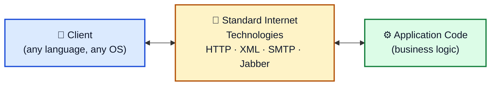

The middle box is the whole point. The client never touches the application code directly. It only touches the standardized layer.

---

## 2. Web Service Fundamentals

### 2.1 A web service is an abstraction layer

A web service is an interface positioned between the application code and the user of that code. It hides the platform-specific and language-specific details of how the code is actually invoked. Because the layer is standardized, **any language that can speak the web service protocols can use the application's functionality.**

Some consequences follow from this:

- The application services can be written in Java and the client in C++, and nobody cares.
- The server can run on Unix and the client on Windows, and nobody cares.
- Platform becomes irrelevant, and that's the real prize.

**Interoperability is the headline benefit.** Java-based and Microsoft Windows-based solutions were historically painful to integrate. A web services layer between application and client removes a great deal of that friction.

> 📝 **Note:** In the early 2000s, the major vendors (IBM, Microsoft, Sun, BEA and others) were all racing to add web services support. IBM was threading it through WebSphere, Tivoli, Lotus, and DB2, and Microsoft's .NET platform was built around it. That vendor momentum is a big reason SOAP went mainstream.

### 2.2 What a web service looks like inside

A web service is fundamentally **a messaging framework**. The only requirement is that it can send and receive messages over standard Internet protocols. The most common shape is remote procedure calls: one message says "call this subroutine with these arguments," and the reply says "here are the results."

There are three moving parts, shown below.

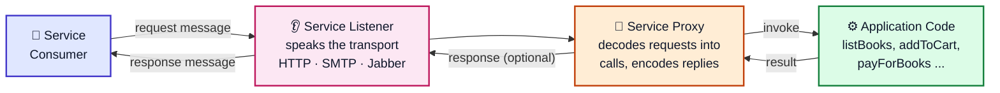

| Component | Job | Example |
|---|---|---|
| **Application code** | All the business logic: listing books, adding to a cart, taking payment | Your Java class, Perl module, or Python function |
| **Service Listener** | Speaks the transport protocol and receives incoming requests | An HTTP server, a Jabber client, an SMTP handler |
| **Service Proxy** | Decodes incoming requests into calls on the application code, and optionally encodes a response | A SOAP toolkit's dispatcher |

The Listener and Proxy can be standalone (a TCP or HTTP daemon, for example) or live inside an application server. IBM's WebSphere, for instance, has built-in support for receiving a SOAP message over HTTP and using it to invoke deployed Java applications. Apache's web server has a module that implements SOAP. There were even implementations for the Palm and Pocket PC PDA operating systems.

That last point matters more than it looks. **Web services don't require a server environment.** They can be hosted or consumed by anything from a giant Application Service Provider's server farm to a handheld. They also don't force you into the traditional client-server model (server holds the data and does the processing) or the n-tier model (storage, business logic, and UI separated). They're used heavily in both, but they can take any shape, including peer-to-peer systems where decentralized peers use standard protocols to provide services to each other.

---

## 3. The Two Worlds: Programmers vs. Business

This is one of my favorite ideas from the source material, because it explains so much about why the web services ecosystem is so sprawling.

A web service exposes functionality to any client in any language. That raises questions in two very different worlds.

**Programmers ask:**

- "How do we do two-phase commit transactions?"
- "How do I do object inheritance?"
- "How do I make this thing run faster?"

**Business people ask:**

- "How do I make sure the person calling the service is who they claim to be?"
- "How can we tie multiple web services into a workflow?"
- "How can I guarantee the reliability of these transactions?"

Both sets of questions are legitimate, and they pull in opposite directions. Business processes demand completeness, trust, security, and reliability. Programmers want simplicity, performance, and robustness. Every business issue eventually needs a software solution, but the goals conflict.

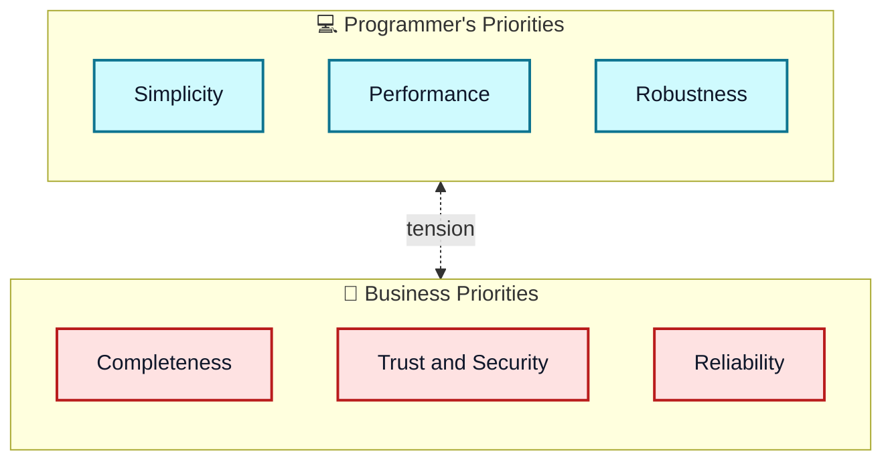

The practical outcome is that **web service tools usually optimize for one perspective or the other, rarely both.**

| Tool | Orientation | Character |
|---|---|---|
| **SOAP::Lite** (Perl, by Pavel Kulchenko) | Programmer-first | Very simple tools for invoking Perl modules over SOAP, XML-RPC, Jabber, and more |
| **Apache Axis** (successor to Apache SOAP) | Business-process-first | More complex; built to ease implementing processes and tying multiple services together |

The important insight: both tools implement many of the same standards (SOAP, WSDL, UDDI), so **they interoperate.** The difference is in how they interface with your application. That gives developers a choice of implementation approach without restricting the people who consume the service.

---

## 4. Just-In-Time Integration

Once you have basic web services, the next idea is **Just-In-Time (JIT) Integration**: dynamically integrating application services based on business requirements, not on the technology platform they happen to be built with.

It rests on the **web services architecture** with three roles:

- **Service provider** publishes a description of its services to a registry.
- **Service registry** stores those descriptions.
- **Service consumer** (a person or a program) searches the registry, finds a suitable service, and binds to it.

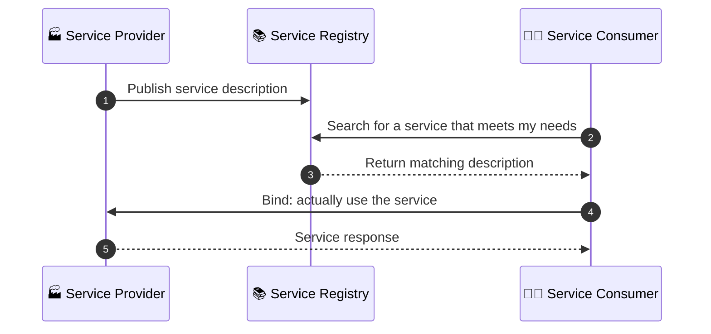

**Binding** means a consumer actually using a service a provider offers. The key to JIT integration is that binding can happen at any time, including **at runtime**. A client might not know which procedures it will call until it's running, has searched the registry, and has found a candidate. It's analogous to late binding in object-oriented programming.

The book's example is a purchasing service:

- If the client **hard-codes** the server address, the service is bound at **compile time**.
- If the client **searches** for a suitable server and binds to it, the service is bound at **runtime**. That's Just-In-Time integration.

> ⚠️ **Caution:** Runtime discovery sounds magical, but in practice most real deployments hard-coded endpoints for years. The discovery layer (UDDI, WS-Inspection) saw far less adoption than SOAP and WSDL. Treat the JIT vision as an architectural ideal, not a description of what most systems did.

---

## 5. The Web Service Technology Stack

The architecture is implemented through **five layers of technology**, each building on the one below. This stack looks a lot like the TCP/IP network model, and that's no accident. The web services stack adds three extra layers on top (packaging, description, discovery) that make Just-In-Time integration and a platform-neutral programming model possible.

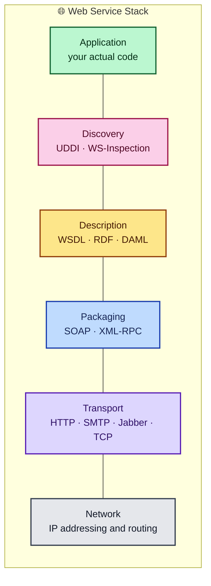

Why layering matters: because each layer solves a separate problem, you only implement the pieces you need right now. When you need a new layer, you don't rewrite large chunks of infrastructure to support a new way of exchanging information or authenticating users. The goal is **total modularization** of distributed computing, as opposed to the large monolithic platforms of the past (Java, CORBA, COM). Modularity is especially valuable here because the standards were evolving so quickly.

### 5.1 Layer-by-layer summary

| Layer | Purpose | Key technologies | Notes |
|---|---|---|---|
| **Discovery** | Let consumers fetch descriptions of providers | UDDI, WS-Inspection (WSIL) | UDDI was widely recognized; IBM and Microsoft jointly proposed WS-Inspection as an alternative |
| **Description** | Record the service's decisions about network, transport, and packaging so a consumer can contact it | WSDL (de facto standard), RDF, DAML | RDF and DAML are far richer but far more complex |
| **Packaging** | Put data in a format all parties understand (serialization or marshalling) | SOAP, XML-RPC | XML is the basis of most packaging formats |
| **Transport** | Move data between two or more network locations | TCP, HTTP, SMTP, Jabber | Choose based on communication needs |
| **Network** | Basic communication, addressing, routing | IP | Identical to the TCP/IP network layer |
| **Application** | The code that implements the actual functionality | Anything | Reached through the lower layers |

### 5.2 Discovery

The discovery layer gives consumers a way to fetch provider descriptions. UDDI (Universal Description, Discovery, and Integration) was the best-known mechanism. WS-Inspection was proposed as a lighter alternative.

### 5.3 Description

When you build a web service, you decide, at every level, which network, transport, and packaging protocols to support. A **description** records those decisions so a consumer can figure out how to talk to you. WSDL is the de facto standard. RDF and DAML are alternatives that describe services more richly but at a big complexity cost.

### 5.4 Packaging

For application data to travel across the network, it has to be "packaged" in a format everyone understands. You'll also hear this called **serialization** or **marshalling**. That covers which data types exist, how values are encoded, and so on.

HTML is technically a packaging format, but it's a poor fit because it's tied to *presentation* rather than *meaning*. XML represents meaning, and XML parsers are everywhere, so it became the basis of nearly all web service packaging. **SOAP is the most common XML-based packaging format.**

### 5.5 Transport

The transport layer enables direct application-to-application communication on top of the network layer. Its main job is to move data between locations. Web services can be built on almost any transport, and the choice depends on your needs:

| Transport | Strength | Weakness |
|---|---|---|
| **HTTP** | Most ubiquitous firewall support | No native support for asynchronous communication |
| **Jabber** | Good asynchronous channel | Not a formal standard |
| **SMTP** | Store-and-forward, works over email infrastructure | Latency; not request-response |
| **TCP** | Raw and flexible | You build everything else yourself |

### 5.6 Network and application

The network layer is exactly the TCP/IP network layer: addressing and routing. The application layer is simply your code that implements the functionality.

### 5.7 Beyond the stack

The five layers don't solve everything. Security, trust, workflow, and identity were left to a family of companion standards:

| Standard | What it does |
|---|---|
| **XML Protocol (W3C)** | Working group standardizing SOAP itself |
| **XKMS** | XML Key Management Services: adds PKI capabilities to web services |
| **SAML** | Security Assertions Markup Language: XML grammar for security events such as authentication |
| **XML-Dsig** | Digital signatures for any XML document |
| **XML-Enc** | Encrypting XML data and expressing encrypted data as XML |
| **XSD** | XML Schema: structure of XML documents |
| **P3P** | Platform for Privacy Preferences: data privacy policies |
| **WSFL** | Web Services Flow Language: workflows, as an extension to WSDL |
| **Jabber** | Lightweight asynchronous transport used in peer-to-peer apps |
| **ebXML** | Suite of XML specs for electronic business, built to use SOAP |

> 📝 **Note:** The source text claims the W3C XML Protocol work would "eventually replace" SOAP. What actually happened is that the W3C's work *became* SOAP 1.2. It refined SOAP rather than replacing it.

---

## 6. The Peer Services Model

There's an alternative, complementary view of the architecture called the **peer services model**, based on peer-to-peer (P2P). Every member of a group of peers shares a common collection of services and resources. A peer can be a person, an application, a device, or even a group of peers acting as one.

The same three roles exist (provider, consumer, registry), but the boundaries blur. **Any peer can be both provider and consumer**, which makes the model more dynamic and flexible.

The best example is Instant Messaging:

- Every user is a **peer**.
- When you *receive* a chat invitation, you're the **service provider**.
- When you *send* a chat invitation, you're the **service consumer**.
- When you log in, the IM server acts as the **service registry**. It tracks where you are and what your messaging capabilities are.

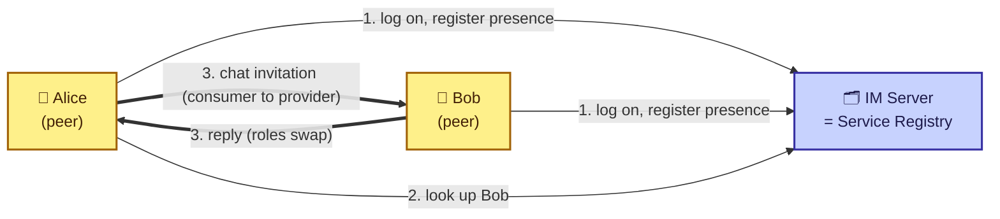

Peer services and web services grew up separately and use different protocols. **Peer web services** unify the technologies, protocols, and models into one picture. That's why the book's sample CodeShare application is a peer web service.

---

## 7. Introducing SOAP

Now the star of the show. SOAP's place in the stack is as **a standardized packaging protocol for messages shared by applications**. The specification defines two things and nothing more:

1. A simple **XML-based envelope** for the information being transferred.
2. A set of **rules for translating** application- and platform-specific data types into XML.

That minimalism is exactly why it fits such a wide range of messaging and integration patterns, and a big reason for its popularity.

### 7.1 SOAP is XML

SOAP is an *application* of XML. It leans heavily on **XML Schema** and **XML Namespaces**. If those are unfamiliar, learn them first. Everything below assumes at least a cursory grasp.

### 7.2 XML messaging

XML messaging means applications exchange information as XML documents. A message can be anything: a purchase order, a stock price request, a search query, a flight listing. Because XML isn't tied to any application, OS, or language, a Windows Perl program can build an XML message, send it to a Unix Java program, and change what that program does.

The fundamental idea: two applications, regardless of OS or language, can openly share information using nothing more than a simple message encoded in a way both understand. **SOAP provides a standard way to structure those messages.**

### 7.3 RPC and EDI

XML messaging, and therefore SOAP, has two related applications:

| Style | Full name | What it is | The XML contains |
|---|---|---|---|
| **RPC-style** | Remote Procedure Call | One program calls a procedure on another, passing arguments and receiving return values | A representation of parameter or return values |
| **Document-style** | Electronic Document Interchange (EDI) | Automated business transactions with standard document formats | A purchase order, tax refund, or similar document |

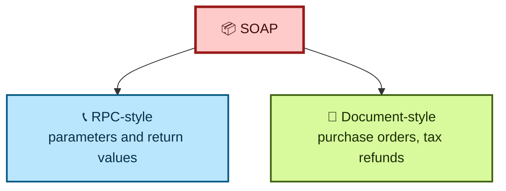

### 7.4 Why we need a standard encoding

Just saying "we use XML" isn't enough. Consider one telephone number. All of these are valid XML:

```xml
<phoneNumber>(123) 456-7890</phoneNumber>

<phoneNumber>
  <areaCode>123</areaCode>
  <exchange>456</exchange>
  <number>7890</number>
</phoneNumber>

<phoneNumber area="123" exchange="456" number="7890" />

<phone area="123">
  <exchange>456</exchange>
  <number>7890</number>
</phone>
```

Which is correct? **Whichever the receiving application expects.** So the two sides must agree on:

1. The **types** of information being exchanged
2. **How** that information is expressed as XML
3. How to actually **send** it

Without those agreements, XML alone is just angle brackets. SOAP supplies the conventions.

---

## 8. Anatomy of a SOAP Message

A SOAP message is an **Envelope** containing an **optional Header** and a **required Body**.

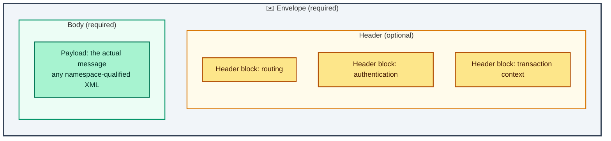

- **Header**: blocks of information about *how the message should be processed*, such as routing and delivery settings, authentication or authorization assertions, and transaction contexts.
- **Body**: the *actual message*. Anything expressible in XML can go here.

### 8.1 A document-style example

Here's the book's purchase order, in document-style SOAP:

```xml
<s:Envelope xmlns:s="http://www.w3.org/2001/06/soap-envelope">
  <s:Header>
    <m:transaction xmlns:m="soap-transaction"
                   s:mustUnderstand="true">
      <transactionID>1234</transactionID>
    </m:transaction>
  </s:Header>
  <s:Body>
    <n:purchaseOrder xmlns:n="urn:OrderService">
      <from><person>Christopher Robin</person>
            <dept>Accounting</dept></from>
      <to><person>Pooh Bear</person>
          <dept>Honey</dept></to>
      <order><quantity>1</quantity>
             <item>Pooh Stick</item></order>
    </n:purchaseOrder>
  </s:Body>
</s:Envelope>
```

This one example touches every core piece: the topmost **Envelope**, the optional **Header** with one header block (a transaction ID), and the mandatory **Body** with the payload.

### 8.2 The rules for envelopes

| Rule | Detail |
|---|---|
| Body count | Every Envelope must contain **exactly one** Body |
| Body contents | Any number of child nodes. The *contents of Body are the message* |
| Body restrictions | Must be well-formed, namespace-qualified XML, with **no processing instructions** and **no DTD references** |
| Header count | If present, **at most one** Header |
| Header position | Must be the **first child** of Envelope, before Body |
| Header contents | Any valid, well-formed, namespace-qualified XML |
| Header block | Each element inside Header is called a *header block* |

> ⚠️ **Caution:** "No DTD references" is a deliberate security and interoperability decision. If you're building or parsing SOAP by hand, keep external entity and DTD processing **disabled** in your XML parser. Allowing them is a classic vector for XXE (XML External Entity) attacks. This isn't in the book; it's my own hard-won advice.

Header blocks exist to carry *contextual* information relevant to processing, such as authentication credentials or routing data. In the example above, the header block says the document has a transaction ID of "1234."

---

## 9. RPC-Style Messages and mustUnderstand

### 9.1 A request-response pair

RPC messages normally come in pairs. The **request** carries the function call. The **response** carries the return value(s). SOAP doesn't *require* every request to have a response, but the pairing is by far the most common pattern.

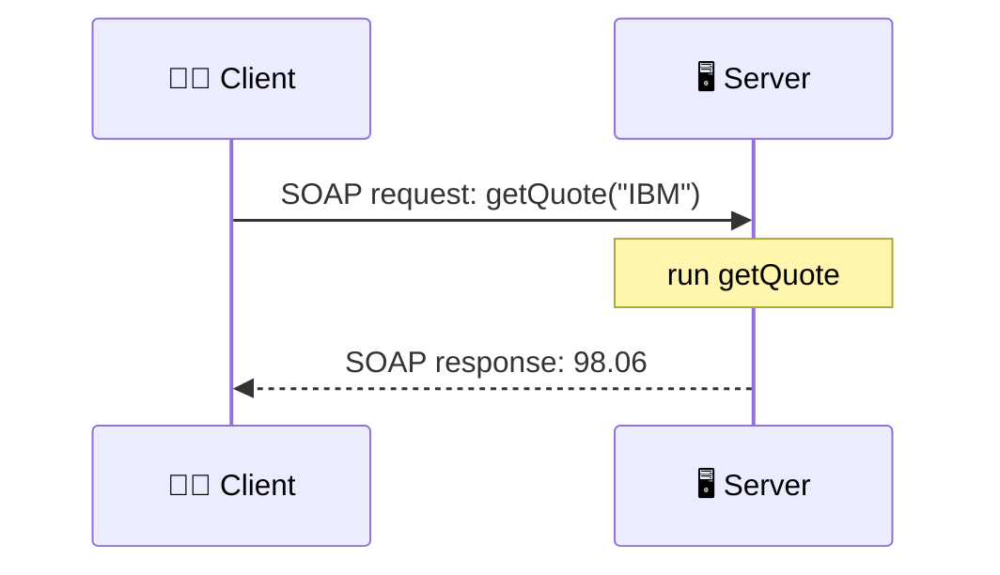

Imagine the server offers a function that returns a stock price:

```java
public Float getQuote(String symbol);
```

The request for IBM's price looks like this:

```xml
<s:Envelope xmlns:s="http://www.w3.org/2001/06/soap-envelope">
  <s:Header>
    <m:transaction xmlns:m="soap-transaction"
                   s:mustUnderstand="true">
      <transactionID>1234</transactionID>
    </m:transaction>
  </s:Header>
  <s:Body>
    <n:getQuote xmlns:n="urn:QuoteService">
      <symbol xsi:type="xsd:string">IBM</symbol>
    </n:getQuote>
  </s:Body>
</s:Envelope>
```

And a possible response:

```xml
<s:Envelope xmlns:s="http://www.w3.org/2001/06/soap-envelope">
  <s:Body>
    <n:getQuoteResponse xmlns:n="urn:QuoteService">
      <value xsi:type="xsd:float">98.06</value>
    </n:getQuoteResponse>
  </s:Body>
</s:Envelope>
```

> 📝 **Note:** The original text has a small typo in this response (it opens with `getQuoteRespone` and closes with `getQuoteResponse`). I've corrected it here. Also note that these fragments use `xsi:` and `xsd:` prefixes without declaring them. A real message must declare `xmlns:xsi="http://www.w3.org/2001/XMLSchema-instance"` and `xmlns:xsd="http://www.w3.org/2001/XMLSchema"` or a strict parser will reject the document.

### 9.2 The mustUnderstand attribute

This is one of the most important ideas in SOAP.

When one application sends a message to another, there's an implicit requirement that the **recipient must understand how to process it**. If not, it must reject the message and explain the problem. The book's example is a nice one: if Amazon.com sent O'Reilly a purchase order for 150 electric drills, someone at O'Reilly would call and explain that they sell books, not drills.

**Header blocks are different.** A recipient may not understand a particular header block and still be able to process the main message just fine. So how does a sender say "this header is *not* optional"?

By adding `mustUnderstand="true"` to the header block. Now the rule is:

> If the recipient does **not** understand a header block flagged `mustUnderstand="true"`, it **must reject the entire message**.

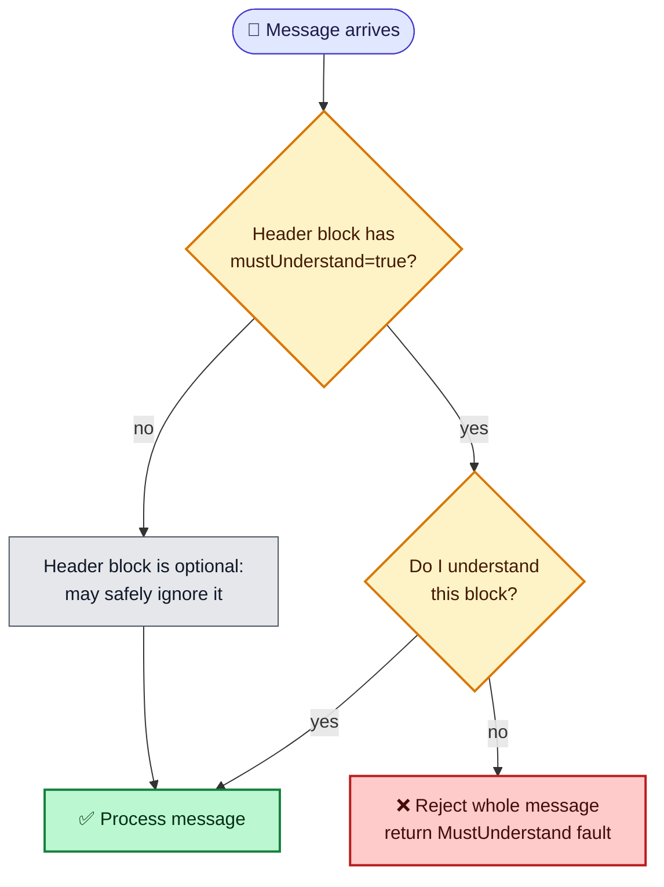

In the `getQuote` example, the transaction header carries this flag. So even if the server understands `getQuote` perfectly, if it doesn't know how to handle transactions, **the whole message is rejected.** That's how you *guarantee* the recipient understands transactions.

> 💡 **Tip:** Use `mustUnderstand` for headers that change the *meaning* of the message: security, transactions, routing. Leave it off for purely informational headers like debugging hints.

I verified this behavior in the tested server later in this post. A message with an unknown `mustUnderstand` header gets a `MustUnderstand` fault, even though the body is perfectly valid.

---

## 10. Encoding Styles and Versioning

### 10.1 Encoding styles

Section 5 of the SOAP standard introduces **encoding styles**. An encoding style is a set of rules for how native application and platform data types get turned into a common XML syntax. These are intended for RPC-style SOAP.

You declare one with the `encodingStyle` attribute. It can appear anywhere in the document and applies to **all descendants** of the element where it sits:

```xml
<s:Envelope xmlns:s="http://www.w3.org/2001/06/soap-envelope">
  <s:Body>
    <n:getQuote xmlns:n="urn:QuoteService"
                s:encodingStyle="http://www.w3.org/2001/06/soap-encoding">
      <symbol xsi:type="xsd:string">IBM</symbol>
    </n:getQuote>
  </s:Body>
</s:Envelope>
```

Here every child of `getQuote` follows the Section 5 rules.

Something that surprises people: **no single encoding style is the default.** The spec deliberately says so. Section 5 is just *one* possible mechanism, and it's not right for every job. If you're shipping a purchase order that already has a defined XML syntax, you don't need Section 5 at all. You drop the document into the Body as is.

| Scenario | Use Section 5 encoding? |
|---|---|
| RPC call with typed parameters | Usually yes |
| Document that already has its own XML schema | No, drop it in as is |
| Your toolkit does automatic marshalling | Probably, but check its docs |

### 10.2 Versioning

The spec had several versions. The version discussed in the source material was a working draft that later became SOAP 1.2, while SOAP 1.1 was widely deployed. To prevent subtle incompatibilities, SOAP 1.2 introduced a versioning model:

1. A **1.1** processor receiving a **1.2** message triggers a **"version mismatch"** error.
2. A **1.2** processor receiving a **1.1** message may **either** process it as 1.1 **or** trigger a version mismatch error.

You detect the version by checking the **Envelope namespace**:

| Version | Envelope namespace (as used in the source material) |
|---|---|
| SOAP 1.1 | `http://schemas.xmlsoap.org/soap/envelope/` |
| SOAP 1.2 (draft) | `http://www.w3.org/2001/06/soap-envelope` |

A mismatch error may include an **Upgrade header block** telling the sender which versions the recipient supports:

```xml
<s:Envelope xmlns:s="http://schemas.xmlsoap.org/soap/envelope/">
  <s:Header>
    <V:Upgrade xmlns:V="http://www.w3.org/2001/06/soap-upgrade">
      <envelope qname="ns1:Envelope"
                xmlns:ns1="http://www.w3.org/2001/06/soap-envelope"/>
    </V:Upgrade>
  </s:Header>
  <s:Body>
    <s:Fault>
      <faultcode>s:VersionMismatch</faultcode>
      <faultstring>Version Mismatch</faultstring>
    </s:Fault>
  </s:Body>
</s:Envelope>
```

For backwards compatibility, **version mismatch errors must always be expressed in SOAP 1.1 format**, no matter which version is in use. That way, even the oldest processor can read the complaint.

> ⚠️ **Caution:** The `2001/06/soap-envelope` namespace is from a *draft*. The final SOAP 1.2 Recommendation uses `http://www.w3.org/2003/05/soap-envelope`. If you copy the book's namespace into production code, a real SOAP 1.2 stack will treat it as an unknown version. See [section 17](#17-what-has-changed-since-this-material-was-written).

---

## 11. SOAP Faults

A **fault** is a special message dedicated to reporting errors that occurred while processing a SOAP message.

```xml
<s:Envelope xmlns:s="...">
  <s:Body>
    <s:Fault>
      <faultcode>Client.Authentication</faultcode>
      <faultstring>Invalid credentials</faultstring>
      <faultactor>http://acme.com</faultactor>
      <details>
        <!-- application specific details -->
      </details>
    </s:Fault>
  </s:Body>
</s:Envelope>
```

### 11.1 The four pieces of a fault

| Element | Purpose | Notes |
|---|---|---|
| **fault code** | Algorithmically generated identifier for the *type* of error | Must be an XML Qualified Name, so it only has meaning within a defined namespace |
| **fault string** | Human-readable explanation | For people, not for programs |
| **fault actor** | Unique identifier of the processing node where the error occurred | Ties into the actors concept in section 12 |
| **fault details** | Application-specific error details | **Must** be present if the error relates to the *body*; **must not** be used for errors about anything else |

### 11.2 Standard fault codes

SOAP defines four standard fault types:

| Code | Meaning | Typical cause |
|---|---|---|
| **VersionMismatch** | The Envelope uses an invalid namespace | Sending 1.2 to a 1.1-only server |
| **MustUnderstand** | A header block flagged `mustUnderstand="true"` wasn't understood | Missing support for a required extension |
| **Client** | Something is wrong with the message | Bad credentials, malformed Section 5 encoding |
| **Server** | An error that can't be directly linked to the message itself | Database down, bug in your code |

The single most useful mental model: **Client means "your fault, fix your message and retry differently." Server means "my fault, retrying later might work."**

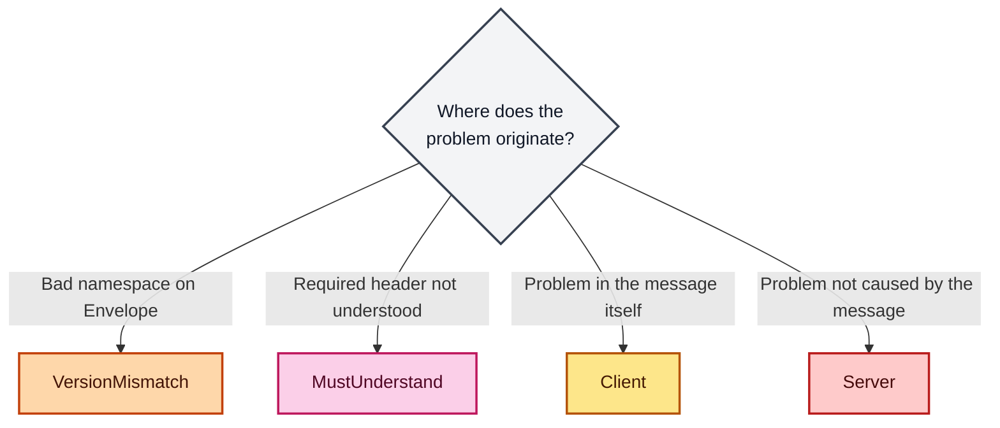

### 11.3 Extensible fault codes

The four codes can be extended for finer granularity while staying backwards compatible. Look at `Client.Authentication` from the example: it's a more specific kind of `Client` fault. **The dot notation means the left side is more generic than the right side.**

That means a simple client that only knows the four core codes can still act sensibly. It sees `Client.Authentication`, recognizes the `Client` prefix, and treats it as a client error. In my tested server, I return `s:Client.UnknownSymbol` for an unknown stock ticker, and the client can still classify it as a client-side problem.

### 11.4 MustUnderstand faults and the Misunderstood header

There's a subtle design problem here. When a `mustUnderstand` fault is returned, it *should* say which header blocks weren't understood. But the standard fault structure can't say that. The `details` element is reserved for errors in the **body**, not the header.

The fix, defined in the SOAP 1.2 draft, is a **Misunderstood header block** you attach to the fault message:

```xml
<s:Envelope xmlns:s="...">
  <s:Header>
    <f:Misunderstood qname="abc:transaction"
                     xmlns:f="soap-transactions" />
  </s:Header>
  <s:Body>
    <s:Fault>
      <faultcode>MustUnderstand</faultcode>
      <faultstring>Header(s) not understood</faultstring>
      <faultactor>http://acme.com</faultactor>
    </s:Fault>
  </s:Body>
</s:Envelope>
```

> ⚠️ **Caution:** The Misunderstood block is **optional**, so you can't rely on it as your primary way to learn which header broke things. In my tested server, I put the offending header names in the `faultstring` as a pragmatic fallback. Human-readable, but not machine-reliable.

### 11.5 Custom faults

You can invent your own fault codes that don't derive from the standard ones. The only requirement is that they're **namespace qualified**:

```xml
<s:Fault xmlns:xyz="urn:myCustomFaults">
  <faultcode>xyz:CustomFault</faultcode>
  <faultstring>My custom fault!</faultstring>
</s:Fault>
```

I'd approach custom faults carefully. A processor that only knows the standard four codes can't take intelligent action on one. Because the four codes are already extensible (`Client.Something`), custom codes are largely unnecessary. Use them only when the standard codes are too generic to express what happened.

---

## 12. The Message Exchange Model: Actors and Paths

Processing a SOAP message means pulling apart the envelope and doing something with its content. SOAP gives a general framework but leaves implementation details to the application. What SOAP *does* specify is how **applications exchange messages**.

### 12.1 Intermediaries and message paths

At its core, a SOAP message is a one-way transmission from a sender to a receiver, but along the way it may pass through **intermediaries**, each of which does something with it. The book compares this to a **Unix pipeline**: the output of one program feeds the next.

- A **SOAP intermediary** is a web service that sits between consumer and provider and adds value.
- The set of intermediaries a message passes through is the **message path**.
- Each node on the path is called an **actor**.

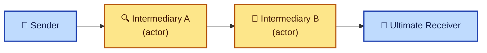

Note that SOAP itself does **not** define how a message path gets constructed. Extensions like Microsoft's WS-Routing filled that gap.

### 12.2 Targeting header blocks with actor

What SOAP *does* give you is **targeting**: a way to say which header block is meant for which actor. Two key points:

- Targeting works **only on header blocks**. The Body can't be targeted at a particular node.
- You use the `actor` attribute, whose value is a unique identifier for the intermediary (a URL or something more generic).
- **Intermediaries that don't match the `actor` value must ignore that block.**

The book's example: I'm a wholesaler of cardigan sweaters. You send me a purchase order for 100 sweaters. I use a trusted third-party service to verify that the digital signature on your order is genuine. Your message routes through that verifier, which extracts the signature, validates it, and adds a new header block telling me whether it's valid.

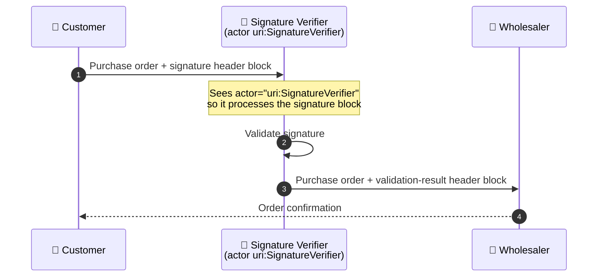

The XML that makes it work:

```xml
<s:Envelope xmlns:s="...">
  <s:Header>
    <x:signature actor="uri:SignatureVerifier">
      ...
    </x:signature>
  </s:Header>
  <s:Body>
    <abc:purchaseOrder>...</abc:purchaseOrder>
  </s:Body>
</s:Envelope>
```

That `actor` attribute is how the verifier knows the signature block is its responsibility. If the message never passes through the verifier, the signature block is simply ignored.

### 12.3 WS-Routing

Since SOAP doesn't say *how* a message gets to the verifier, building message paths is hard without a standard. **WS-Routing** (the SOAP Routing Protocol) was Microsoft's proposal. It defines a standard header block expressing the exact sequence of intermediaries:

```xml
<s:Envelope xmlns:s="...">
  <s:Header>
    <m:path xmlns:m="http://schemas.xmlsoap.org/rp/"
            s:mustUnderstand="true">
      <m:action>http://www.im.org/chat</m:action>
      <m:to>http://D.com/some/endpoint</m:to>
      <m:fwd>
        <m:via>http://B.com</m:via>
        <m:via>http://C.com</m:via>
      </m:fwd>
      <m:rev><m:via/></m:rev>
      <m:from>mailto:johndoe@acme.com</m:from>
      <m:id>uuid:84b9f5d0-33fb-4a81-b02b-5b760641c1d6</m:id>
    </m:path>
  </s:Header>
  <s:Body>...</s:Body>
</s:Envelope>
```

This message must reach `D.com/some/endpoint` but only after passing through `B.com` and then `C.com`. Because WS-Routing is a third-party extension not every processor understands, the header carries `mustUnderstand="true"`, so any node that can't follow the path rejects the message rather than silently skipping the routing.

| WS-Routing element | Meaning |
|---|---|
| `action` | What the message wants to do |
| `to` | The ultimate destination |
| `fwd` / `via` | The ordered list of intermediaries on the forward path |
| `rev` | The reverse path, for replies |
| `from` | The originator |
| `id` | A unique identifier for this message |

> ⚠️ **Caution:** WS-Routing was a proprietary proposal and did not become a lasting standard. Treat it as a good illustration of *why* routing needs a header block, not as something to build on.

---

## 13. SOAP for RPC in Practice

RPC was the most common application of SOAP. Here's how calls, responses, and errors are represented.

### 13.1 Invoking methods

The rules for packaging an RPC request are simple:

- The method call is represented as **a single structure**, with each `in` or `in-out` parameter as a field of that structure.
- The **names and physical order** of the parameters must match those of the method being invoked.

Take this Java method:

```java
String checkStatus(String orderCode, String customerID);
```

Calling it with `checkStatus("abc123", "Bob's Store")` produces:

```xml
<s:Envelope xmlns:s="...">
  <s:Body>
    <checkStatus xmlns="..."
        s:encodingStyle="http://www.w3.org/2001/06/soap-encoding">
      <orderCode xsi:type="string">abc123</orderCode>
      <customerID xsi:type="string">Bob's Store</customerID>
    </checkStatus>
  </s:Body>
</s:Envelope>
```

The RPC conventions don't *require* Section 5 encoding or `xsi:type` typing, but they're widely used.

### 13.2 Returning responses

Responses mirror requests: a single structure with a field for each `in-out` or `out` parameter. If `checkStatus` returned the string `new`, the response might be:

```xml
<s:Envelope xmlns:s="...">
  <s:Body>
    <checkStatusResponse
        s:encodingStyle="http://www.w3.org/2001/06/soap-encoding">
      <return xsi:type="xsd:string">new</return>
    </checkStatusResponse>
  </s:Body>
</s:Envelope>
```

Two conventions worth knowing:

- The response element's name isn't functionally important, but the convention is **method name + "Response"**.
- The return element's name is arbitrary. **The first field in the response structure is treated as the return value.**

> 📝 **Note:** The source example has mismatched closing tags (`</SOAP:Body>` versus `<s:Body>`). I've cleaned that up. In real XML those must match exactly.

### 13.3 Reporting errors

RPC uses the standard **SOAP fault** for errors, extended through the `detail` element if needed. My practical takeaway echoes the book: there's little point crafting elaborate custom error content in RPC faults, because most SOAP RPC implementations won't know what to do with it. Stick to standard fault codes, and put useful text in `faultstring`.

---

## 14. SOAP Data Encoding in Depth

This is the densest part of the spec, and the part that caused the most real-world pain.

### 14.1 Why encoding exists

The first half of SOAP is the envelope. The second half, **Section 5**, is one *possible* way to serialize data for that envelope. It's described as "a simple type system that is a generalization of the common features found in type systems in programming languages, databases, and semi-structured data." That generality means you can apply it in nearly any environment.

Encoding is **entirely optional**. It's offered as a convenience so applications can exchange information dynamically *without a priori knowledge* of the types involved.

### 14.2 Vocabulary

| Term | Meaning | Example |
|---|---|---|
| **Value** | A single data unit or combination of units | `Joe`, a score, a temperature |
| **Accessor** | An element that contains or allows access to a value | `<firstname>Joe</firstname>`: `firstname` is the accessor, `Joe` is the value |
| **Compound value** | Two or more accessors grouped as children of one accessor | `<name>` containing `<firstname>` and `<lastname>` |
| **Struct** | Compound value where each accessor has a **different name** | A `person` with `firstname` and `lastname` |
| **Array** | Compound value where accessors have the **same name**, identified by position | A `people` list of `person` elements |
| **Single-referenced accessor** | No identity beyond being a child of its parent | An `address` embedded inside one `person` |
| **Multireferenced accessor** | Has an `id`; others reference it with `href` | A shared `address` used by two people |

```xml
<!-- A struct -->
<person>
  <firstname>Joe</firstname>
  <lastname>Smith</lastname>
</person>

<!-- An array -->
<people>
  <person name='joe smith'/>
  <person name='john doe'/>
</people>
```

**Multireferencing** lets two values share one piece of data. Here, both people live at the same address:

```xml
<people>
  <person name='joe smith'><address href='#address-1'/></person>
  <person name='john doe'><address href='#address-1'/></person>
</people>
<address id='address-1'>
  <street>111 First Street</street>
  <city>New York</city>
  <state>New York</state>
</address>
```

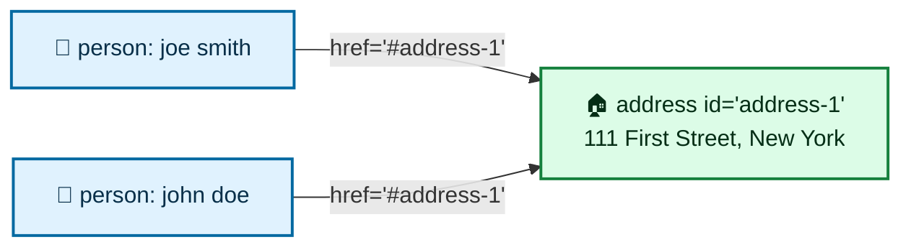

`href` can also point outside the envelope, for example at binary data, a part of a MIME multipart message, or another XML document: `<address href='http://acme.com/data.xml#joe_smith' />`.

I checked the id/href resolution logic with a small Python script (see section 16). Both `href` references resolved to the same address element.

### 14.3 The xsi:type confusion

This is the part of the spec that gave implementers headaches. Section 5.1 essentially says: the types of values *may* be self-describing via `xsi:type`, *or* determinable only by reference to a schema, in XML Schema notation *or any other notation*.

Translated into plain English, SOAP gives you **three ways** to say what type an accessor is:

1. **`xsi:type` on each accessor:** `<name xsi:type="xsd:string">John Doe</name>`
2. **Reference an XML Schema** that defines the element's type: `<person xmlns="personschema.xsd"><name>John Doe</name></person>`, where the schema says `name` is `xsd:string`
3. **Reference some other schema notation:** `<person xmlns="urn:some_namespace">...`, where that namespace implies `name` is a string

That flexibility caused a genuine interoperability mess:

| Implementation | Chosen strategy | Consequence |
|---|---|---|
| **IBM / Apache SOAP** | Required `xsi:type` typing, ignored the other two options | Couldn't read Microsoft's schema-typed data |
| **Microsoft SOAP** | Ignored `xsi:type`, used schemas from an external service description | Couldn't read IBM's `xsi:type`-typed data |

Both were *legal* SOAP encoders, and neither implemented the whole spec, so **neither could interpret the other's data types.** The irony is painful, since SOAP exists to promote interoperability. It was resolved with time, with a big push from the community "SOAPBuilders" group.

> ⚠️ **Caution:** This is a general lesson about specs with too many optional paths. When two vendors each implement a *subset*, the intersection can be nearly empty. Whenever I'm choosing tooling, I check which encoding and typing mode it actually emits, and I test against the other side early.

### 14.4 Built-in data types

SOAP encoding uses the **XML Schema data types**. Every type used in a SOAP-encoded block must come directly from XML Schema or be derived from it.

There are two equivalent syntaxes for a typed value. Both express an integer 36:

```xml
<SOAP-ENC:int>36</SOAP-ENC:int>
<value xsi:type="xsd:int">36</value>
```

| Syntax | Called | Accessor name | Where you see it |
|---|---|---|---|
| `<SOAP-ENC:int>36</SOAP-ENC:int>` | **Anonymous accessor** | The name *is* the type | Commonly in encoded arrays |
| `<value xsi:type="xsd:int">36</value>` | **Named accessor** | A meaningful identifier | Most everywhere else |

### 14.5 Multiple references and the "no objects" surprise

Two variables might both hold 42. The plain encoding is just two separate elements:

```xml
<SOAP-ENC:int>42</SOAP-ENC:int>
<SOAP-ENC:int>42</SOAP-ENC:int>
```

But sometimes two variables occupy the **same memory**, as in the C-style call `tweak(&i, &i)`. To say that, you use `id` and `href`:

```xml
<value xsi:type="xsd:int" id="v1">42</value>
<value href="#v1" />
```

Here's the point I'd underline twice. Although SOAP originally stood for "Simple Object Access Protocol," **SOAP has no concept of an object.** To SOAP, everything is data encoded into XML. There's no such thing as an "object reference" on the wire. Section 5 gives rules for turning an object into an XML *representation*, and any other references to that object are expressed with `id`/`href`.

Given this Java:

```java
Address address = new Address();
Person person = new Person();
person.setAddress(address);
```

a serialization might look like:

```xml
<Person>
  <Address href="#address1" />
</Person>
<Address id="address1" />
```

> ⚠️ **Caution:** Don't assume you can pass "live" remote objects through SOAP the way CORBA or RMI would. You send *copies* of data. If you need identity to survive, you design it yourself.

### 14.6 Structs, arrays, and bytes

- **Strings are not byte arrays** in SOAP, even if your language treats them that way.
- Arbitrary binary data should go in as a **base64** string:

```xml
<some_binary_data xsi:type="SOAP-ENC:base64">
  aDF4JIK34KJjk3443kjlkj43SDF43==
</some_binary_data>
```

- Regular arrays use type `SOAP-ENC:Array` (or a derivative) with an `arrayType` attribute:

```xml
<some_array xsi:type="SOAP-ENC:Array"
            SOAP-ENC:arrayType="se:string[3]">
  <se:string>Joe</se:string>
  <se:string>John</se:string>
  <se:string>Marsha</se:string>
</some_array>
```

**Reading `arrayType`:** the square brackets give the dimensions, and the numbers inside give the element count per dimension.

| `arrayType` value | Meaning |
|---|---|
| `xsd:string[3]` | One dimension, 3 strings |
| `xsd:string[3,2]` | Two-dimensional array (3 by 2) |
| `xsd:string[2][]` | An unbounded array of one-dimensional string arrays, each with 2 elements |
| `xsd:string[4]` | One dimension, 4 strings |

Arrays of arrays are expressed by nesting with `href` links:

```xml
<data xsi:type="SOAP-ENC:Array" SOAP-ENC:arrayType="xsd:string[2][]">
  <names href="#names-1"/>
  <names href="#names-2"/>
</data>
<names id="names-1" xsi:type="SOAP-ENC:Array"
       SOAP-ENC:arrayType="xsd:string[2]">
  <name>joe</name><name>john</name>
</names>
<names id="names-2" xsi:type="SOAP-ENC:Array"
       SOAP-ENC:arrayType="xsd:string[2]">
  <name>mike</name><name>bill</name>
</names>
```

A key subtlety: a multidimensional array is **syntactically almost identical** to a flat array. Only the `arrayType` value tells them apart. Compare `xsd:string[2,2]` with four children, and `xsd:string[4]` with four children. The elements look the same; the attribute is the difference.

> ⚠️ **Caution:** If you ever hand-edit an encoded array, changing the element count without updating `arrayType` will produce a message that looks fine but decodes wrong, or fails on stricter parsers.

### 14.7 Partial and sparse arrays

Two clever extensions:

**Partially transmitted arrays** send only some of the array. `SOAP-ENC:offset` gives the zero-based ordinal of the first element sent. To send only the last two of five elements:

```xml
<names xsi:type="SOAP-ENC:Array" SOAP-ENC:arrayType="xsd:string[5]"
       SOAP-ENC:offset="[2]">
  <name>Item 4</name>
  <name>Item 5</name>
</names>
```

Hold on, and read carefully. The book uses `offset="[2]"` and labels the items 4 and 5, which is a little inconsistent, since an offset of 2 counting from zero would start at the *third* element. For "last two of five," the correct offset is `[3]`. I mention it because it's a good reminder to treat book examples as illustrations and to test your own encoder's output.

**Sparse arrays** transmit only elements that have data, each labeled with `SOAP-ENC:position`:

```xml
<names xsi:type="SOAP-ENC:Array" SOAP-ENC:arrayType="xsd:string[10,10]">
  <name SOAP-ENC:position="[2,5]">data</name>
  <name SOAP-ENC:position="[5,2]">data</name>
</names>
```

### 14.8 Null accessors

In a sparse array, a missing accessor means "null or some default." The trouble is the receiver can't tell whether the value really was null or whether the sender mangled the message. The better way is the XML Schema `xsi:nil` attribute:

```xml
<name xsi:type="xsd:string" xsi:nil="true" />
```

That's explicit and removes the ambiguity. I confirmed in my test script that a standard XML parser reads `xsi:nil="true"` cleanly.

> 💡 **Tip:** Always distinguish "not sent" from "sent as null." A missing element and an explicit nil can mean different things in a business system (unknown versus deliberately empty).

---

## 15. SOAP Transports

SOAP is layered on top of the network and transport layers as a **packaging** protocol, so it doesn't care how messages travel. That flexibility is real. SOAP::Lite alone could exchange SOAP over **HTTP, FTP, raw TCP, SMTP, POP3, MQSeries, and Jabber**.

### 15.1 SOAP over HTTP

HTTP is by far the most common transport, and the spec even devotes specific text to mapping SOAP's exchange model onto HTTP. It fits SOAP's RPC style naturally, because both are request-response. The SOAP request is `POST`ed, and the SOAP response comes back in the HTTP response.

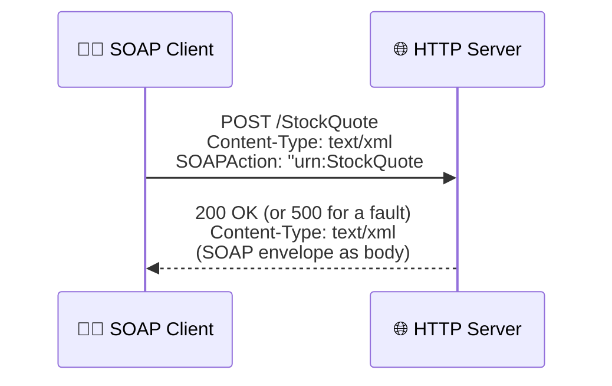

An HTTP request carrying a SOAP message:

```http
POST /StockQuote HTTP/1.1
Content-Type: text/xml
Content-Length: nnnn
SOAPAction: "urn:StockQuote#GetQuote"

<s:Envelope xmlns:s="http://www.w3.org/2001/06/soap-envelope">
  ...
</s:Envelope>
```

And the response:

```http
HTTP/1.1 200 OK
Content-Type: text/xml
Content-Length: nnnn

<s:Envelope xmlns:s="http://www.w3.org/2001/06/soap-envelope">
  ...
</s:Envelope>
```

The **SOAPAction** header declares the *intent* of the request. Its value is arbitrary, but it lets an HTTP server filter unacceptable requests *before* decoding any XML.

### 15.2 The contentious issues

| Question | The debate | Where things landed (per the source) |
|---|---|---|
| **Port 80 or a SOAP-specific port?** | SOAP masquerades as ordinary web traffic, so firewalls wave it through, which security admins dislike. Nothing *requires* port 80. | Many people use 80 specifically to avoid firewall filtering |
| **Is SOAPAction useful?** | Since its value is arbitrary, a server can't rely on it to know the intent without parsing XML. | The W3C group was leaning toward deprecating it |
| **HTTP 500 or 200 for client faults?** | A Client fault is an application error, not a server error. | Consensus: consistency matters most, so use **500** for all SOAP faults over HTTP |
| **A `soap://` URL scheme?** | Would stop SOAP masquerading as ordinary HTTP. | Some wanted it; WS-Routing even defined one |

> ⚠️ **Caution on port 80:** Choosing port 80 *to avoid the firewall* is convenient and also a policy end-run. If your organization's security team hasn't approved SOAP traffic, tunneling it through 80 can be a real problem. Talk to them first.

HTTP isn't a perfect fit, either. It wasn't designed to carry XML messages, and the two don't always mesh. That said, HTTP remained the dominant transport, though .NET's heavy use of SOAP over Instant Messaging was seen as a possible challenger.

---

## 16. Hands-On: A Tested SOAP Server and Client

I don't trust explanations I can't run. So I wrote a small SOAP 1.1 server and client using **only the Python standard library** (no external packages), and I ran it while writing this post. It demonstrates:

- An RPC-style `getQuote` call
- A `mustUnderstand` header the server *does* understand
- A `mustUnderstand` header the server *doesn't* understand, which triggers a `MustUnderstand` fault
- A `Client.UnknownSymbol` fault with extended dot-notation
- Faults returned with HTTP status 500, as the consensus says

I used the **SOAP 1.1 namespace** (`http://schemas.xmlsoap.org/soap/envelope/`) because that's what real toolkits of the era spoke and what stays widely compatible.

### 16.1 The code

Save this as `soap_demo.py`:

```python
"""Minimal SOAP 1.1 server + client using only the Python standard library."""
import threading
import urllib.request
import urllib.error
from http.server import BaseHTTPRequestHandler, HTTPServer
import xml.etree.ElementTree as ET

ENV = "http://schemas.xmlsoap.org/soap/envelope/"
QUOTE_NS = "urn:QuoteService"
UNDERSTOOD_HEADERS = {"{soap-transaction}transaction"}
PRICES = {"IBM": 98.06, "MSFT": 54.20}


def envelope(body_xml, header_xml=""):
    hdr = f"<s:Header>{header_xml}</s:Header>" if header_xml else ""
    return (f'<?xml version="1.0" encoding="UTF-8"?>'
            f'<s:Envelope xmlns:s="{ENV}">{hdr}<s:Body>{body_xml}</s:Body></s:Envelope>')


def fault(code, msg, actor="http://localhost"):
    return envelope(f"<s:Fault><faultcode>{code}</faultcode>"
                    f"<faultstring>{msg}</faultstring>"
                    f"<faultactor>{actor}</faultactor></s:Fault>")


class Handler(BaseHTTPRequestHandler):
    def log_message(self, *a):
        pass  # keep the demo output clean

    def do_POST(self):
        raw = self.rfile.read(int(self.headers["Content-Length"]))
        status, out = 200, ""
        try:
            root = ET.fromstring(raw)
            if root.tag != f"{{{ENV}}}Envelope":
                status, out = 500, fault("s:VersionMismatch", "Version Mismatch")
            else:
                header = root.find(f"{{{ENV}}}Header")
                bad = []
                if header is not None:
                    for blk in header:
                        mu = blk.get(f"{{{ENV}}}mustUnderstand")
                        if mu in ("1", "true") and blk.tag not in UNDERSTOOD_HEADERS:
                            bad.append(blk.tag)
                if bad:
                    status, out = 500, fault(
                        "s:MustUnderstand",
                        "Header(s) not understood: " + ", ".join(bad))
                else:
                    call = root.find(f"{{{ENV}}}Body")[0]
                    if call.tag == f"{{{QUOTE_NS}}}getQuote":
                        sym = call.find("symbol").text.strip()
                        if sym not in PRICES:
                            status, out = 500, fault(
                                "s:Client.UnknownSymbol", f"Unknown symbol {sym}")
                        else:
                            out = envelope(
                                f'<n:getQuoteResponse xmlns:n="{QUOTE_NS}">'
                                f'<value>{PRICES[sym]}</value></n:getQuoteResponse>')
                    else:
                        status, out = 500, fault("s:Client", "Unknown operation")
        except ET.ParseError:
            status, out = 500, fault("s:Client", "Malformed XML")
        except Exception as e:  # anything unexpected is the server's fault
            status, out = 500, fault("s:Server", str(e))
        data = out.encode()
        self.send_response(status)
        self.send_header("Content-Type", "text/xml; charset=utf-8")
        self.send_header("Content-Length", str(len(data)))
        self.end_headers()
        self.wfile.write(data)


def call(url, body_xml, header_xml=""):
    req = urllib.request.Request(
        url, envelope(body_xml, header_xml).encode(),
        {"Content-Type": "text/xml; charset=utf-8",
         "SOAPAction": '"urn:QuoteService#getQuote"'})
    try:
        with urllib.request.urlopen(req) as r:
            status, text = r.status, r.read()
    except urllib.error.HTTPError as e:   # SOAP faults arrive as HTTP 500
        status, text = e.code, e.read()
    root = ET.fromstring(text)
    f = root.find(f".//{{{ENV}}}Fault")
    if f is not None:
        return status, ("FAULT", f.find("faultcode").text, f.find("faultstring").text)
    return status, ("OK", float(root.find(".//value").text))


if __name__ == "__main__":
    srv = HTTPServer(("127.0.0.1", 8099), Handler)
    threading.Thread(target=srv.serve_forever, daemon=True).start()
    url = "http://127.0.0.1:8099/StockQuote"

    q = lambda s: (f'<n:getQuote xmlns:n="{QUOTE_NS}">'
                   f'<symbol>{s}</symbol></n:getQuote>')
    understood = ('<m:transaction xmlns:m="soap-transaction" s:mustUnderstand="1">'
                  '<transactionID>1234</transactionID></m:transaction>')
    unknown = '<x:audit xmlns:x="urn:audit" s:mustUnderstand="1"/>'

    print("1 plain         ", call(url, q("IBM")))
    print("2 with header   ", call(url, q("IBM"), understood))
    print("3 unknown symbol", call(url, q("XXX")))
    print("4 mustUnderstand", call(url, q("IBM"), unknown))
    srv.shutdown()
```

### 16.2 The output I got

```text
1 plain          (200, ('OK', 98.06))
2 with header    (200, ('OK', 98.06))
3 unknown symbol (500, ('FAULT', 's:Client.UnknownSymbol', 'Unknown symbol XXX'))
4 mustUnderstand (500, ('FAULT', 's:MustUnderstand', 'Header(s) not understood: {urn:audit}audit'))
```

| Test | What it proves |
|---|---|
| **1** | Basic RPC request and response works end to end |
| **2** | A `mustUnderstand` header the server *does* recognize is accepted |
| **3** | An extended fault code (`Client.UnknownSymbol`) works, HTTP status is 500 |
| **4** | An unrecognized `mustUnderstand` header rejects the *whole* message, even though the body was valid |

> 📝 **Honest note on what I did and didn't test:** I ran the four scenarios above and they behaved as shown. The `VersionMismatch` branch is in the server code, but I did **not** exercise it in that run, so I'm not claiming it's verified. I also ran a separate small script confirming that `id`/`href` multireferences resolve to the same element, that `xsi:nil="true"` parses, and that an `arrayType` array's children read back in order.

### 16.3 A second snippet: resolving multireferences

Here's the id/href resolver I used to check the encoding rules from section 14:

```python
import xml.etree.ElementTree as ET

doc = '''<r xmlns:xsi="http://www.w3.org/2001/XMLSchema-instance"
            xmlns:E="http://schemas.xmlsoap.org/soap/encoding/">
  <people>
    <person><address href="#a1"/></person>
    <person><address href="#a1"/></person>
  </people>
  <address id="a1"><city>New York</city></address>
  <name xsi:nil="true"/>
  <names E:arrayType="xsd:string[2]"><n>a</n><n>b</n></names>
</r>'''

root = ET.fromstring(doc)
ids = {e.get("id"): e for e in root.iter() if e.get("id")}

for a in root.iter("address"):
    href = a.get("href")
    if href:
        print("resolved", ids[href[1:]].find("city").text)

NIL = "{http://www.w3.org/2001/XMLSchema-instance}nil"
print("nil:", root.find("name").get(NIL))
print("array:", [n.text for n in root.find("names")])
```

Output:

```text
resolved New York
resolved New York
nil: true
array: ['a', 'b']
```

### 16.4 How the demo maps to the concepts

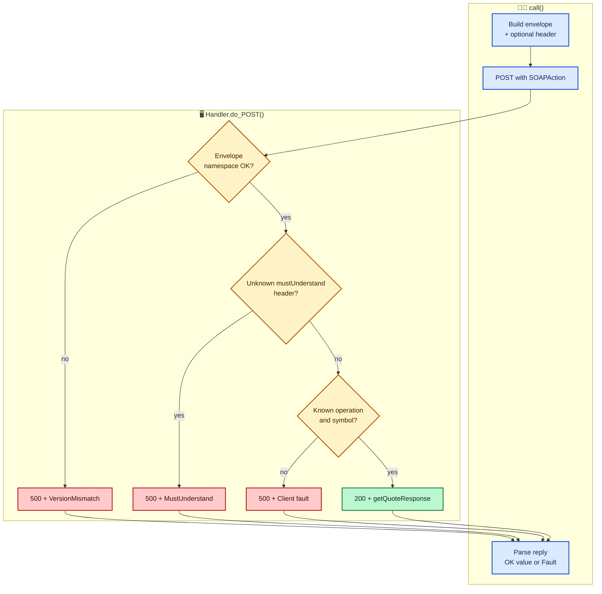

> ⚠️ **Caution: this is a teaching server, not production code.** It builds XML with f-strings, so a malicious `symbol` value would be injected into the response text. In real code I'd use a proper SOAP toolkit or at least escape values with `xml.sax.saxutils.escape`. It also has no authentication, TLS, size limits, or timeouts. Never expose it to the internet as is.

---

## 17. What Has Changed Since This Material Was Written

The source material was written against draft-era SOAP 1.2. A lot has settled since, so here are the places where I'd be careful applying the text literally.

| Topic in the source material | What to know today |
|---|---|
| Namespace `http://www.w3.org/2001/06/soap-envelope` | This was a draft URI. Final SOAP 1.2 uses `http://www.w3.org/2003/05/soap-envelope`. SOAP 1.1 stays at `http://schemas.xmlsoap.org/soap/envelope/` |
| `actor` attribute for targeting | Renamed **`role`** in SOAP 1.2 (SOAP 1.1 still uses `actor`) |
| Fault codes `Client` and `Server` | Renamed **`Sender`** and **`Receiver`** in SOAP 1.2 (1.1 keeps Client/Server) |
| `faultcode`, `faultstring`, `faultactor`, `details` | SOAP 1.2 restructured faults (`Code`, `Reason`, `Node`, `Role`, `Detail`). Note SOAP 1.1 uses `detail` (singular) |
| Misunderstood header | Made part of the final 1.2 specification |
| Section 5 encoding as the RPC default | Real-world practice shifted heavily toward **document/literal** style with schema-defined types, and away from Section 5 encoding |
| SOAPAction header | Kept in 1.1; in 1.2 it moved into a content-type `action` parameter |
| UDDI / WS-Inspection discovery | Little real-world adoption compared to WSDL |
| WS-Routing | Did not become a lasting standard |
| WSDL as the description layer | Remained the standard description mechanism |

> 📝 **Note:** I'm summarizing from general knowledge of how SOAP evolved, not from the source text. If you're implementing against a real system, verify against the specific SOAP version and toolkit documentation that system uses, and check current specs rather than trusting my table alone.

### 17.1 Where SOAP fits today

I'll be candid about my own view. For new public-facing APIs, many teams reach for simpler HTTP+JSON interfaces because they're easier to read, debug, and consume. But SOAP is very much alive in places that value its strengths: enterprise integration, banking and payments, government systems, healthcare messaging, and anywhere WS-Security, formal contracts (WSDL), and strong tooling matter. If you work in those areas, understanding this layered model, envelope, header blocks, faults, and encoding, will keep paying off.

---

## 18. Cheat Sheet and Final Thoughts

### 18.1 The whole thing on one page

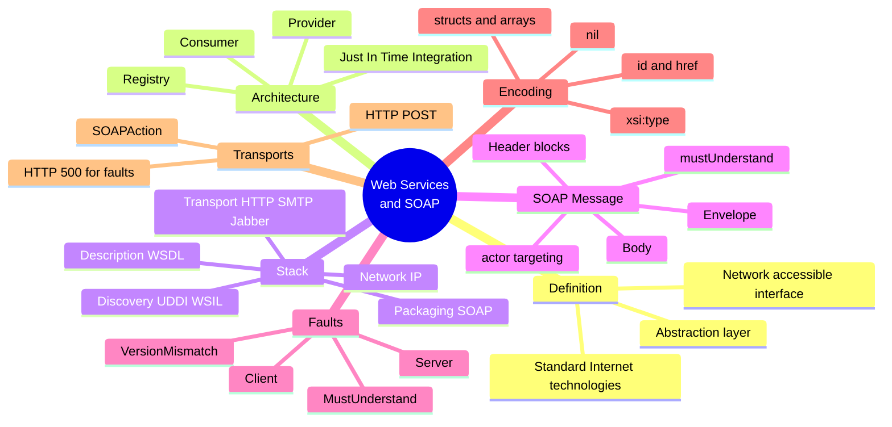

### 18.2 Quick reference

| Concept | One-line summary |
|---|---|
| **Web service** | A network-accessible interface to application functionality via standard Internet technologies |
| **Service Listener** | Speaks the transport protocol and receives requests |
| **Service Proxy** | Decodes requests into application calls |
| **JIT integration** | Discover and bind to services at runtime, driven by business requirements |
| **SOAP** | XML envelope plus data-encoding rules; a packaging protocol |
| **Envelope** | Top-level container: one optional Header, one required Body |
| **Header block** | Processing context: routing, auth, transactions |
| **mustUnderstand** | "Reject the whole message if you can't handle this header" |
| **actor** | Target a header block at a specific intermediary |
| **Fault** | Standard error message: code, string, actor, details |
| **Client vs Server fault** | Bad message versus a problem not caused by the message |
| **Section 5 encoding** | Optional rules for turning native data into XML |
| **xsi:type** | Explicit type on each accessor |
| **id / href** | Multireferences: shared values |
| **xsi:nil** | Explicit null |
| **SOAPAction** | HTTP header hinting at the request's intent |

### 18.3 My rules of thumb

Here's what I've taken away from working through this material:

1. **Remember SOAP is just a packaging layer.** Everything else (security, discovery, description) lives in other layers or companion standards.
2. **Use `mustUnderstand` deliberately.** It's your only tool for saying a header is non-negotiable.
3. **Prefer standard fault codes with dotted extensions** over inventing custom ones. Simple clients can still act on them.
4. **Test interoperability early.** The `xsi:type` versus schema-typing split shows how "both sides are legal SOAP" can still mean "they can't talk."
5. **Treat draft-era namespaces and names as historical.** Verify against the SOAP version your counterpart actually speaks.
6. **Secure your XML parser.** Disable DTDs and external entities.
7. **Don't confuse SOAP with objects.** It ships data copies, never live object references.
8. **Keep firewalls and security teams in the loop.** Port 80 tunneling is convenient, but it's still a policy decision.

### 18.4 Closing thoughts

What I love about this material is how *modest* the core idea is. A web service is an interface. SOAP is an envelope and a set of rules. The complexity of the ecosystem comes from real problems layered on top: security, reliability, discovery, and workflow. Each got its own layer or companion standard, so you adopt only what you need.

If you take one thing away, let it be this: **agree on the conventions, not just the syntax.** XML alone tells two programs nothing. SOAP's real contribution was giving them a shared set of conventions, and that's a lesson that holds no matter what protocol you end up using.

I hope this walkthrough saved you some of the confusion I went through. If there's a section you'd like me to expand, whether that's the encoding rules, faults, or building a fuller client and server, tell me and I'll dig in.
