# Day One on an Unfamiliar API Platform: How I Research a Product Before I Test It

> **TL;DR:** When I join a project and I'm asked to improve quality, I resist the urge to start firing requests at random endpoints. I spend my first days *researching*: using the product, watching its HTTP traffic, reading documentation and source code, talking to the team, and then capturing everything in a visual model I can share and improve. This post walks through that process using the `restful-booker-platform` sandbox, and I back it up with a small, working mock platform and tests that I actually ran.

---

## Table of Contents

1. [The first-day problem](#the-first-day-problem)
2. [Meet the sandbox product](#meet-the-sandbox-product)
3. [Why I research before I test](#why-i-research-before-i-test)
4. [Researching the product itself](#researching-the-product-itself)
5. [Researching beyond the product](#researching-beyond-the-product)
6. [Automating my research: a tested mini platform](#automating-my-research-a-tested-mini-platform)
7. [Capturing what I learned: models](#capturing-what-i-learned-models)
8. [Congratulations, you're testing (but there's more to do)](#congratulations-youre-testing-but-theres-more-to-do)
9. [Pitfalls I try to avoid](#pitfalls-i-try-to-avoid)
10. [Cheat sheet and summary](#cheat-sheet-and-summary)

---

## The first-day problem

Imagine it's my first day on an established project. I've joined a team, and I've been asked to put a testing strategy in place to help improve quality. Where do I begin? Or, if a strategy already exists, how do I take it further? Do I need new tools, new techniques, new activities?

I find this is the moment where people make their first mistake. The pressure to look useful is strong, so they reach for the familiar: a favorite automation framework, a load-testing tool they read about last week, or a quick blast of requests against the staging environment. Any of those might deliver *some* value. But none of them moves me toward the real goal, which is an **effective API testing strategy** for *this* product, *this* team and *these* users.

A good strategy needs an understanding of what it's a strategy *for*. If I don't know how the system works, how it was implemented, who built it and who it serves, how could I possibly pick the right testing activities?

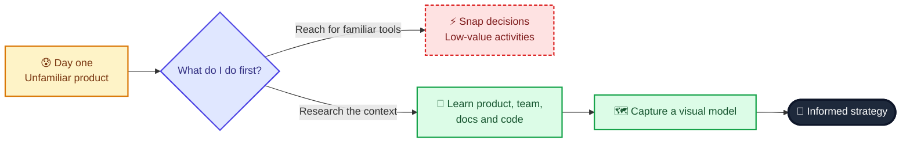

> **📝 Note: Already on a project?** Most of us aren't actually starting from zero. We're joining or inheriting something that already exists. Everything in this post still applies. The techniques are just as useful for refreshing your understanding of a platform you've worked on for years, and they're a fast way to accelerate a new colleague's learning.

---

## Meet the sandbox product

To practice, I use an open sandbox called **restful-booker-platform**. I like to role-play that it's a real product I'm responsible for. In the story, it was created for bed-and-breakfast (B&B) owners to manage their websites and bookings, and it supports these features:

| Feature | What it does |
|---|---|
| Branding | Lets the owner create branding to market the B&B |
| Rooms | Lets the owner add rooms with details for guests to book |
| Bookings | Lets guests create bookings |
| Reports | Lets the owner view booking reports to assess availability |
| Messages | Lets guests send messages to contact the B&B host |

The platform began as a hobby project for a single B&B owner. It has since grown and is now used by several owners to take bookings. It's slowly expanding in both scope and customer base, but growth has hurt: owners have complained about **bugs, downtime and incorrectly implemented features**. My (pretend) mission is to design a testing strategy that helps the team improve quality so both owners and guests are happy.

> **⚠️ Caution:** The scenario is fiction used for learning. The sandbox is real and runnable, but the "frustrated owners" are a teaching device. Please don't point exploratory tools at someone else's live production system without permission.

### What a short history already tells me

Before touching anything, the story alone gives me useful clues. I like to write these down immediately:

| Clue in the history | What I infer | What it might mean for testing |
|---|---|---|
| Built for B&Bs | Two user types: **guests** and **B&B managers** | My API tests and designs must consider both |
| Multiple features | Probably multiple services handled by multiple APIs | I'll need to understand the relationships between them |
| Core built in Java | Likely tooling and language choices for automation | I may favor Java-friendly tools for some checks |
| Growing fast, bugs and downtime | Reliability and correctness are visible pain points | Risk-based thinking will matter a lot |
| Hobby origins | Possibly little documentation, organic structure | I should expect surprises |

None of these are conclusions. They're *hypotheses*, and my research will confirm or overturn them. That distinction between "I assume" and "I know" is what the whole chapter is about.

---

## Why I research before I test

When I begin research, I try to hold two ideas in my head.

**First, the goal is learning, not breaking.** I'm expanding my understanding of the context I'm building a strategy for. I'm not trying to push systems to their limits to hunt for bugs. Sometimes issues turn up naturally and that's fine, but if I go into "attack mode" I'll miss the quieter, structural information.

**Second, I should look at *all* facets of the product and project.** The more I learn, the clearer my strategic choices become. There's no mandatory order. Some people prefer to read documentation first, some like a demo from a teammate, some want to read code, and some just want to play with the product. Pick whatever suits your learning style. But since I have to start somewhere, I begin with the product itself.

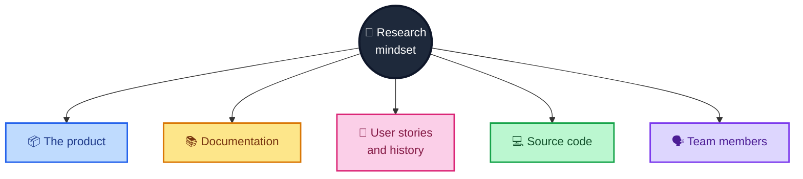

---

## Researching the product itself

My focus is APIs, so I won't spend much testing effort on the user interface. But the UI is still a superb research tool. Using the product the way a real user would teaches me about the users' needs and about how the product currently serves them.

> **🧪 Activity:** Book a room and contact the B&B as a guest. Then log in as a B&B manager, create rooms, update the branding, read reports and open the messages. Take notes on everything you learn.

> **📝 Note:** Yes, there's a UI in an API-focused topic. The sandbox ships with one because it's used to teach many kinds of testing. If your platform has a UI, use it to learn how things work. Just remember that a strategy covering both UI and API testing needs extra research into UI-specific activities.

I move through four increasingly "technical" lenses. Each one reveals a layer the previous one hides.

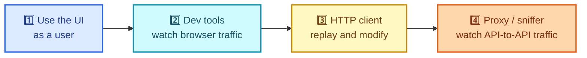

| Lens | Tool examples | What it reveals | Limits |
|---|---|---|---|
| UI | Browser | Features, user journeys, user needs | Hides everything behind the screen |
| Dev tools | Chrome / Firefox dev tools | Which APIs the browser calls and what data flows | Only browser-to-backend traffic |
| HTTP client | Postman | How each endpoint behaves when I change it | Only what I think to try |
| Proxy / sniffer | Wireshark | Which APIs call *each other* | Needs access to the machine's network |

### Lens 2: dev tools

Browsers like Chrome and Firefox include built-in developer tools. I'll just call them **dev tools**. They can monitor HTTP traffic, capturing the requests the browser sends and the responses that come back. That traffic is a goldmine for working out which web APIs are being called and what information is shared.

Here's how I use them on the landing page:

1. Open dev tools (right-click the page and choose *Inspect Element*), then open the **Network** tab.
2. Click the **XHR** filter.
3. Visit the application (locally on `http://localhost:8080`, or the hosted sandbox).

**XHR** stands for XMLHttpRequest. These are HTTP requests the browser sends to an API *in the background*, so data can be changed without reloading the whole page. For example, a request to `/branding/` can refresh the home page images and text without a page refresh.

On the landing page I see at least two calls: one to `/branding/` and another to `/room/`. Opening each reveals which images and text drive the page and which rooms are bookable. In a few seconds I've learned that at least two APIs exist, and what shape their data has.

> **💡 Tip:** Clear the network history between actions (the *Clear* button near the recording icon). Otherwise the list fills up and it's hard to tell which calls belong to which action.

> **🧪 Activity:** Visit each page you found earlier while watching the traffic. Record the URIs, which APIs they imply, and which HTTP methods are used.

If you want to keep this evidence, dev tools can export the traffic as a **HAR** file. I'll show you how to summarize one with a few lines of Python later in this post.

### Lens 3: an HTTP client

Now that I know traffic exists, I want to *play* with it. I use an HTTP client; the one I use is **Postman**, and its free version has everything I need. The workflow:

1. Load the Admin panel with the Network tab open so requests are captured.
2. Right-click the `/room/` request and choose **Copy > Copy as cURL** (pick the Bash option if asked).
3. In Postman, click **Import**.
4. Choose **Raw text**, paste the cURL, then **Continue > Import**.

The request now lives in Postman, where I can safely poke at it. With `GET /room/` I can:

- change the URI to `/room/1` and discover a second endpoint that shows one room's details,
- change the method to `OPTIONS` and read the `Allow` response header to see which other methods the endpoint accepts,
- inspect the request headers and notice a custom cookie containing a `token`.

Three tiny edits, three new facts. And I'm still not testing exhaustively. I'm *learning*.

> **⚠️ Caution:** A "Copy as cURL" request often contains live cookies and authentication tokens. Treat exported requests (and HAR files) like passwords. Don't paste them into public tickets, chats or repositories.

> **🧪 Bonus activity:** Learn how Postman **Collections** work and save your requests in one. Future-you will thank present-you.

### Lens 4: a proxy or sniffing tool

Everything so far watched traffic between the *browser* and the backend. But in a platform like this, a lot happens *behind* the backend, where APIs talk to each other. To see that, I use a network analyzer. The one I use is **Wireshark**, which can sniff many network protocols.

The catch: to listen to local traffic I need the platform running **on my own machine**. The steps:

1. Install and open Wireshark.
2. From the capture list, pick the interface with **Loopback** in its name.
3. Type `http` into the display filter and press Enter, so only HTTP appears.

Now I trigger actions from Postman. When I send `POST /room/` to create a room, Wireshark shows me *two* requests: the one I sent to `/room/`, and a second one to `localhost:3004/auth/validate`. From that I can conclude two things:

- there is a web API called **auth** listening on port **3004**, and
- the **room** API sends requests to **auth**.

Neither fact was visible from the UI or from dev tools. That's the power of this lens: it exposes the platform's *internal* conversations.

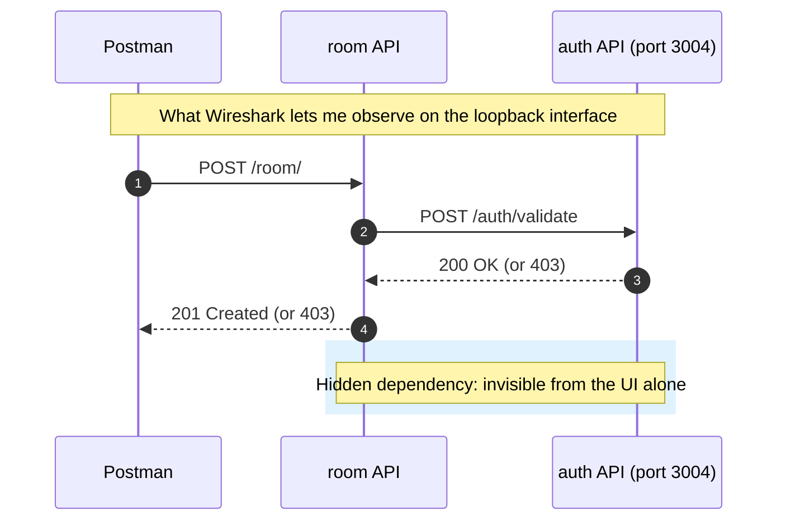

Let me save you some time with the common snags:

| Problem | Likely cause | What to try |
|---|---|---|
| No Loopback interface listed | Missing OS permissions or plugins | Check your OS permissions and Wireshark install options |
| Mac cannot see localhost traffic | Missing packet-capture permissions | Install ChmodBPF (a Homebrew cask is available) |
| Loopback still unavailable | Some network cards can't monitor internal traffic | Search whether your card supports it |
| Capture list is overwhelming | Many protocols (HTTP, TCP, UDP...) at once | Filter with `http` |

> **⚠️ Caution:** Only capture traffic on machines and networks you own or have explicit permission to monitor. Sniffing someone else's traffic can be illegal and is always unethical.

> **📝 Note on limits:** This technique only works where I can listen to network devices on the machine. If the platform runs elsewhere and I lack access, I need another route, such as logs, tracing or asking the team.

> **🧪 Activity:** Capture the traffic while you call `GET /report/` and note which other APIs the report API contacts.

After these four lenses I know that the platform is a *collection* of APIs: rooms, reports, security and more. I might already be forming strategic ideas. But product-only research has blind spots, so I widen the net.

---

## Researching beyond the product

A sandbox with a finished UI is a luxury. Real projects may have no UI, or an unfinished one. Fortunately software leaves a paper trail: documentation, user stories, and code.

### Documentation

Attitudes to documentation have changed since agile took over, but it's rare for a project to have *none*. Even if long requirement documents are gone, wikis, API documentation and user stories survive.

With the sandbox, I read the project's README files. They tell me which versions of Java and Node it runs on and how to run it locally, and they reveal that **each API module has its own documentation**. Opening an API module shows a README with build, configuration and run details, plus a link to technical API documentation.

Modern API tooling can generate **interactive documentation**. For the room API it lists every endpoint. Opening `room-controller` shows its requests, and selecting `GET /room/` shows how the request must be built and what the response looks like. A **Try it out** button followed by **Execute** sends a real request and shows the real response. That's research with guard rails.

### User stories and project history

Finally I read the artifacts that record the product's journey: user stories, feature files, requirement documents, completed-work lists. Where they live depends on the team (a tracker like Jira, a GitHub projects board, or, sometimes, old emails). They can tell me:

- features I missed during product analysis,
- who developed which feature,
- who the users are and what problems we're solving,
- how the product has changed as it grew.

On the sandbox's GitHub projects board I can find past bugs, technical debt and user stories. Notice how *varied* that is. User stories explain features. Technical debt cards reveal technical details such as libraries and the database in use.

### Source code

For some people, source code is the obvious place to start. For others, it's intimidating. Here's how I frame it for the anxious: **reading code is different from writing code.** Writing means using a language to solve problems. Reading means making sense of an existing solution. I'm not trying to invent anything. I'm looking for clues, such as:

| Clue | Example | What it tells me |
|---|---|---|
| Module names in the repo root | `room`, `booking`, `branding` | The APIs that exist |
| Class and package names | A class named `AuthRequests` inside the room API | The room API talks to the auth API |
| Dependency files | `pom.xml`, `package.json` | Libraries and technologies in use |
| Code comments | Descriptions above methods | Intent that isn't obvious from names |

> **💡 Tip:** Notice how that `AuthRequests` clue agrees with what Wireshark showed me. When two independent sources agree, my confidence in that fact rises. When they disagree, I've found something worth asking about.

### Talking to team members

Unless the entire previous team vanished, there are people who know things. Using the model from my last post, I want to learn about both circles:

- **Imagination (what we want to build):** talk to product owners, designers and business analysts. For instance, I might learn that site reliability and uptime matter enormously to B&B owners. That would push me to favor reliability-focused testing activities over others.
- **Implementation (what we've built):** talk to the developers. Ask for an informal chat, a pairing session where they demo the product, or a guided tour of the codebase.

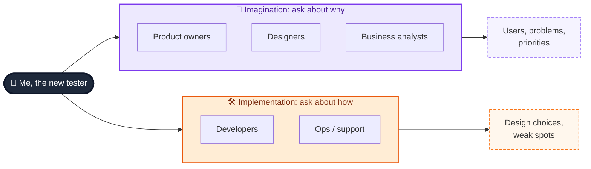

> **📝 Note:** People are a *source*, like documents and code, and they can be wrong or out of date too. I treat what I'm told as a hypothesis to cross-check, not gospel.

---

## Automating my research: a tested mini platform

I can't ship the Java sandbox inside a blog post, and I couldn't run it where I wrote this. But I wanted every technique above to be something you could run in a minute. So I built a **mock platform** with the same *shape* as the one described: four small APIs (`auth`, `room`, `branding`, `report`) where `room` secretly depends on `auth` and `report` secretly depends on `room`.

> **⚠️ Caution:** This mock is **my stand-in**, not restful-booker-platform. The endpoint names (`/room/`, `/branding/`, `/auth/validate`, `/report/`) mirror what the chapter describes, but the behavior, data and ports are my own simplifications. Use it to practice the *techniques*, then repeat them on the real sandbox.

Two honest limitations before the code:

- A real network sniffer like Wireshark sees traffic from outside. My mock cheats by having services *record* who called them (via an `X-Caller` header) so I can simulate what a sniffer would reveal.
- The mock uses random free ports. The real auth API in the chapter listens on port 3004.

### The platform: `mini_platform.py`

```python
"""A mock multi-API platform (stdlib only) for practising API discovery.
NOT restful-booker-platform itself: a stand-in with a similar shape."""
import json
import re
import threading
import urllib.error
import urllib.request
from http.server import BaseHTTPRequestHandler, ThreadingHTTPServer

TRAFFIC = []  # (caller, callee, method, path): what a network sniffer would reveal


def call(base, method, path, body=None, headers=None):
    """Tiny HTTP client: returns (status, json_body, response_headers)."""
    data = json.dumps(body).encode() if body is not None else None
    req = urllib.request.Request(base + path, data=data, method=method,
                                 headers={"Content-Type": "application/json", **(headers or {})})
    try:
        with urllib.request.urlopen(req) as r:
            raw = r.read()
            return r.status, (json.loads(raw) if raw else {}), dict(r.headers)
    except urllib.error.HTTPError as e:
        raw = e.read()
        return e.code, (json.loads(raw) if raw else {}), dict(e.headers)


class Service:
    def __init__(self, name):
        self.name, self.routes, self.server, self.port = name, [], None, None

    def route(self, method, pattern):
        def decorator(fn):
            self.routes.append((method, re.compile(pattern + "$"), fn))
            return fn
        return decorator

    def start(self, port=0):
        svc = self

        class Handler(BaseHTTPRequestHandler):
            def log_message(self, *args):
                pass

            def _send(self, status, payload, extra=None):
                body = json.dumps(payload).encode()
                self.send_response(status)
                self.send_header("Content-Type", "application/json")
                self.send_header("Content-Length", str(len(body)))
                for k, v in (extra or {}).items():
                    self.send_header(k, v)
                self.end_headers()
                self.wfile.write(body)

            def _handle(self):
                caller = self.headers.get("X-Caller")
                if caller:
                    TRAFFIC.append((caller, svc.name, self.command, self.path))
                length = int(self.headers.get("Content-Length", 0))
                body = json.loads(self.rfile.read(length)) if length else {}
                matches = [(m, fn) for m, rx, fn in svc.routes if rx.match(self.path)]
                if self.command == "OPTIONS" and matches:
                    allow = ", ".join(sorted({m for m, _ in matches} | {"OPTIONS"}))
                    return self._send(200, {}, {"Allow": allow})
                for m, fn in matches:
                    if m == self.command:
                        status, payload = fn(self, body)
                        return self._send(status, payload)
                self._send(405 if matches else 404, {"error": "No such route"})

            do_GET = do_POST = do_PUT = do_DELETE = do_OPTIONS = _handle

        self.server = ThreadingHTTPServer(("127.0.0.1", port), Handler)
        self.port = self.server.server_address[1]
        threading.Thread(target=self.server.serve_forever, daemon=True).start()
        return self

    @property
    def base(self):
        return f"http://127.0.0.1:{self.port}"

    def stop(self):
        self.server.shutdown()
        self.server.server_close()


def build_platform():
    """Start four APIs: auth, room, branding, report. room and report call others."""
    auth, room, branding, report = (Service(n) for n in ("auth", "room", "branding", "report"))
    rooms = [{"roomid": 1, "roomName": "101", "type": "Single"},
             {"roomid": 2, "roomName": "102", "type": "Double"}]

    @auth.route("POST", r"/auth/validate")
    def validate(req, body):
        return (200, {"valid": True}) if body.get("token") == "valid-token" else (403, {"valid": False})

    auth.start()

    @branding.route("GET", r"/branding/")
    def get_branding(req, body):
        return 200, {"name": "Shady Meadows B&B"}

    branding.start()

    @room.route("GET", r"/room/")
    def list_rooms(req, body):
        return 200, {"rooms": rooms}

    @room.route("GET", r"/room/\d+")
    def one_room(req, body):
        rid = int(req.path.rsplit("/", 1)[1])
        found = [r for r in rooms if r["roomid"] == rid]
        return (200, found[0]) if found else (404, {"error": "not found"})

    @room.route("DELETE", r"/room/\d+")
    def delete_room(req, body):
        return 202, {}

    @room.route("POST", r"/room/")
    def create_room(req, body):
        cookie = req.headers.get("Cookie", "")
        token = cookie.split("token=")[1].split(";")[0] if "token=" in cookie else ""
        status, _, _ = call(auth.base, "POST", "/auth/validate", {"token": token},
                            {"X-Caller": "room"})  # <- the hidden dependency
        if status != 200:
            return 403, {"error": "not authorised"}
        new = {"roomid": len(rooms) + 1, **body}
        rooms.append(new)
        return 201, new

    room.start()

    @report.route("GET", r"/report/")
    def get_report(req, body):
        _, data, _ = call(room.base, "GET", "/room/", headers={"X-Caller": "report"})
        return 200, {"roomCount": len(data["rooms"])}

    report.start()
    return {"auth": auth, "room": room, "branding": branding, "report": report}
```

### The research helpers: `discovery.py`

These four functions each automate one of the chapter's research activities:

| Function | Automates | Chapter technique |
|---|---|---|
| `summarize_har` | Summarizing exported dev-tools traffic, XHR only | Dev tools |
| `allowed_methods` | Sending `OPTIONS` and reading the `Allow` header | HTTP client |
| `open_ports` | Asking "which APIs are listening?" | Counting APIs |
| `edges_to_mermaid` | Turning observed calls into a diagram | Modeling |

```python
"""Small research helpers that automate the chapter's discovery activities."""
import socket
from collections import Counter
from urllib.parse import urlparse

from mini_platform import call


def summarize_har(har: dict) -> list[tuple]:
    """Dev tools -> 'Save all as HAR'. Return unique (method, path, count)
    for XHR/fetch calls only, most frequent first."""
    counts = Counter()
    for entry in har["log"]["entries"]:
        if entry.get("_resourceType") in ("xhr", "fetch"):
            req = entry["request"]
            counts[(req["method"], urlparse(req["url"]).path)] += 1
    return [(m, p, n) for (m, p), n in counts.most_common()]


def allowed_methods(base: str, path: str) -> list[str]:
    """The OPTIONS trick: ask an endpoint which methods it supports."""
    status, _, headers = call(base, "OPTIONS", path)
    if status != 200:
        return []
    allow = next((v for k, v in headers.items() if k.lower() == "allow"), "")
    return sorted(m.strip() for m in allow.split(",") if m.strip())


def open_ports(host: str, ports: list[int], timeout=0.3) -> list[int]:
    """Which of these ports are listening? (a poor man's 'how many APIs?')"""
    found = []
    for port in ports:
        with socket.socket() as s:
            s.settimeout(timeout)
            if s.connect_ex((host, port)) == 0:
                found.append(port)
    return found


def edges_to_mermaid(edges) -> str:
    """Turn observed (caller, callee, ...) traffic into a Mermaid model."""
    pairs = sorted({(c, e) for c, e, *_ in edges})
    lines = ["flowchart LR", "    UI[UI]"]
    lines += [f"    {c} --> {e}" for c, e in pairs]
    return "\n".join(lines)
```

### The tests: `test_discovery.py`

I want my research tools to be trustworthy, so each one gets a check, including negative cases such as a closed port, an unknown path and a missing token.

```python
import unittest

import mini_platform as mp
from discovery import allowed_methods, edges_to_mermaid, open_ports, summarize_har

SAMPLE_HAR = {"log": {"entries": [
    {"_resourceType": "document", "request": {"method": "GET", "url": "http://localhost:8080/"}},
    {"_resourceType": "xhr", "request": {"method": "GET", "url": "http://localhost:8080/branding/"}},
    {"_resourceType": "xhr", "request": {"method": "GET", "url": "http://localhost:8080/room/"}},
    {"_resourceType": "xhr", "request": {"method": "GET", "url": "http://localhost:8080/room/"}},
    {"_resourceType": "image", "request": {"method": "GET", "url": "http://localhost:8080/logo.png"}},
]}}


class DiscoveryTests(unittest.TestCase):
    @classmethod
    def setUpClass(cls):
        cls.p = mp.build_platform()

    @classmethod
    def tearDownClass(cls):
        for s in cls.p.values():
            s.stop()

    def setUp(self):
        mp.TRAFFIC.clear()

    def test_har_summary_keeps_only_xhr_and_counts(self):
        self.assertEqual(summarize_har(SAMPLE_HAR),
                         [("GET", "/room/", 2), ("GET", "/branding/", 1)])

    def test_ui_style_calls_succeed(self):
        self.assertEqual(mp.call(self.p["branding"].base, "GET", "/branding/")[0], 200)
        self.assertEqual(mp.call(self.p["room"].base, "GET", "/room/")[0], 200)

    def test_options_reveals_methods(self):
        self.assertEqual(allowed_methods(self.p["room"].base, "/room/"), ["GET", "OPTIONS", "POST"])
        self.assertEqual(allowed_methods(self.p["room"].base, "/room/1"), ["DELETE", "GET", "OPTIONS"])
        self.assertEqual(allowed_methods(self.p["room"].base, "/nope"), [])

    def test_wrong_method_is_405_unknown_path_is_404(self):
        self.assertEqual(mp.call(self.p["room"].base, "PUT", "/room/1")[0], 405)
        self.assertEqual(mp.call(self.p["room"].base, "GET", "/nope")[0], 404)

    def test_create_room_requires_valid_token(self):
        base = self.p["room"].base
        self.assertEqual(mp.call(base, "POST", "/room/", {"roomName": "201"})[0], 403)
        ok = mp.call(base, "POST", "/room/", {"roomName": "201"}, {"Cookie": "token=valid-token"})
        self.assertEqual(ok[0], 201)

    def test_hidden_dependency_room_calls_auth(self):
        mp.call(self.p["room"].base, "POST", "/room/", {"roomName": "202"},
                {"Cookie": "token=valid-token"})
        self.assertIn(("room", "auth", "POST", "/auth/validate"), mp.TRAFFIC)

    def test_report_calls_room(self):
        status, body, _ = mp.call(self.p["report"].base, "GET", "/report/")
        self.assertEqual(status, 200)
        self.assertIn(("report", "room", "GET", "/room/"), mp.TRAFFIC)

    def test_port_scan_finds_apis_and_skips_closed_port(self):
        ports = sorted(s.port for s in self.p.values())
        closed = max(ports) + 1000
        self.assertEqual(open_ports("127.0.0.1", ports + [closed]), ports)

    def test_edges_become_mermaid(self):
        edges = [("room", "auth", "POST", "/auth/validate"), ("report", "room", "GET", "/room/"),
                 ("room", "auth", "POST", "/auth/validate")]
        self.assertEqual(edges_to_mermaid(edges),
                         "flowchart LR\n    UI[UI]\n    report --> room\n    room --> auth")


if __name__ == "__main__":
    unittest.main(verbosity=2)
```

Run them with:

```bash
python3 test_discovery.py
```

Here is what I got (Python 3, standard library only):

```text
test_create_room_requires_valid_token  ... ok
test_edges_become_mermaid  ... ok
test_har_summary_keeps_only_xhr_and_counts  ... ok
test_hidden_dependency_room_calls_auth  ... ok
test_options_reveals_methods  ... ok
test_port_scan_finds_apis_and_skips_closed_port  ... ok
test_report_calls_room  ... ok
test_ui_style_calls_succeed  ... ok
test_wrong_method_is_405_unknown_path_is_404  ... ok

----------------------------------------------------------------------
Ran 9 tests in ~1.5s

OK
```

### The demo: research in action

Finally, a short script that repeats my activities: find the listening ports, ask `/room/` which methods it allows, trigger the actions I'd perform in Postman, then print what a sniffer would have shown and generate a diagram from it.

```python
import mini_platform as mp
from discovery import allowed_methods, edges_to_mermaid, open_ports

platform = mp.build_platform()
ports = sorted(s.port for s in platform.values())
print("Listening ports found:", len(open_ports("127.0.0.1", ports)))
print("OPTIONS /room/ ->", allowed_methods(platform["room"].base, "/room/"))

# Trigger the same actions I'd perform in the UI / Postman
mp.call(platform["room"].base, "POST", "/room/", {"roomName": "301"}, {"Cookie": "token=valid-token"})
mp.call(platform["report"].base, "GET", "/report/")

print("\nObserved API-to-API traffic:")
for caller, callee, method, path in mp.TRAFFIC:
    print(f"  {caller} -> {callee}: {method} {path}")
print("\nGenerated model:\n" + edges_to_mermaid(mp.TRAFFIC))
```

```text
Listening ports found: 4
OPTIONS /room/ -> ['GET', 'OPTIONS', 'POST']

Observed API-to-API traffic:
  room -> auth: POST /auth/validate
  report -> room: GET /room/

Generated model:
flowchart LR
    UI[UI]
    report --> room
    room --> auth
```

That last block is real output. The tool *discovered* that `room` calls `auth` and that `report` calls `room`, then produced a diagram from the evidence. Here's that generated model after I added colors:

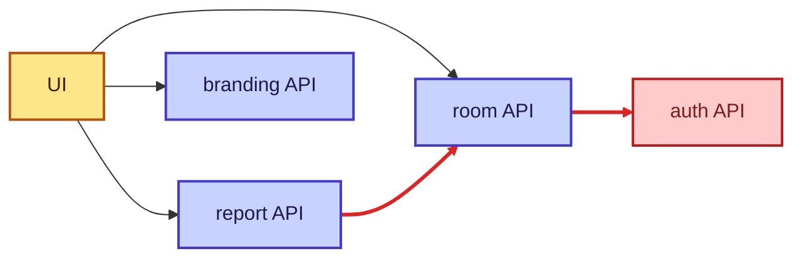

*(Red lines are the API-to-API calls I could only see by watching internal traffic.)*

The UI-to-API edges in that picture come from my dev-tools-style research, not from the generator, which only knows about calls between APIs. That's the point: no single technique gave me the whole picture.

> **📝 Why the tests matter here:** Research tools can mislead you as quietly as research sources can. The test `test_wrong_method_is_405_unknown_path_is_404` exists because I wanted my tooling to tell "this endpoint doesn't exist" apart from "this endpoint exists but not with that method". If `allowed_methods` simply returned an empty list for both cases, I could wrongly conclude an endpoint was missing.

> **💡 Tip:** Distinguishing `404` (no such resource) from `405` (resource exists, wrong method) is itself valuable research. A `405` response tells me an endpoint is real even when I guessed the verb wrong.

---

## Capturing what I learned: models

By now I've collected a lot: endpoints, ports, dependencies, user types, risks. And, importantly, it's *complicated*. I could take notes and try to memorize everything, but at some point I need to arrange my thoughts into something coherent that I can share and that still makes sense after a week on holiday. My answer is a **visual model**, one that is clear, succinct, easy to update and easy to share.

### The power of models

Think about driving to a friend's house in a city you've never visited. You open a map. The map is a **model**: it shows main roads and junctions, and leaves out terrain, speed limits and traffic stops. It's not an accurate depiction of the geography, and that's by design. It shares what you need and drops what you don't.

There's an old saying: *"All models are wrong, but some are useful."* I love it because it gives me permission. If every model is wrong, I can build one that deliberately **amplifies** the information I care about and ignores the rest.

| Property of a good model | Why it matters |
|---|---|
| Shows what matters to the decision | Keeps my attention on risks and opportunities |
| Omits unneeded detail | Prevents overload |
| Easy to update | Stays true as I learn |
| Easy to share | Invites feedback |
| Admits it's wrong | Reminds me to keep checking it against reality |

### Building my own model, step by step

Teams already use many diagram types (sequence, state, system diagrams). But each one is a model built to answer *specific* questions, and the way I model will influence the way I decide. So I don't force what I've learned into a prebuilt shape. I arrange it so it helps me:

1. make sense of what I've learned,
2. trigger testing ideas and spot opportunities,
3. draw out feedback that expands my understanding.

Tools like Visio, Miro and diagrams.net all work, and so does pen and paper. I build the model **iteratively**. Here's how I'd evolve it for the sandbox.

**Step 1: two basic areas.**

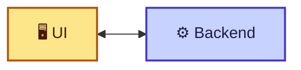

Basic, but it already tells me there are two sections with a relationship.

**Step 2: the backend is many APIs, not one.**

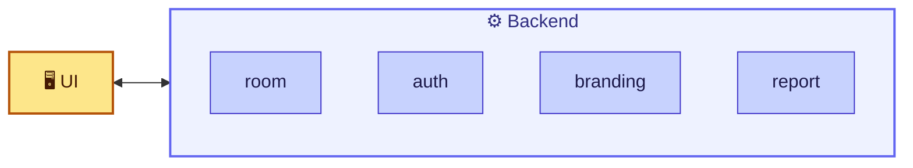

Now I can see multiple web APIs that each need consideration.

**Step 3: add a relationship.** The room API asks the auth API whether a room can be created.

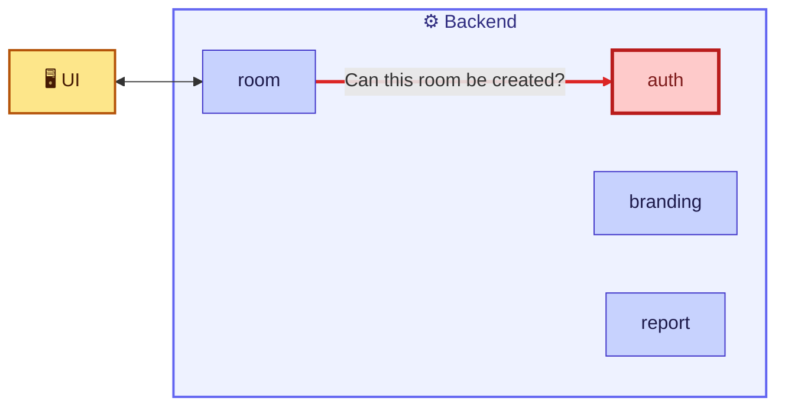

Even this tiny fragment tells me several things:

- Multiple web APIs will require testing.
- `room` depends on `auth`, so **auth might take priority** in the order of testing.
- The APIs must be able to send requests to, and receive responses from, one another.
- The UI and APIs must be able to exchange information too.

> **💡 Tip:** As the model grows, risks and testing opportunities appear *naturally*. Seeing that `auth` sits underneath other services, for example, makes "what happens when auth is slow or down?" an obvious question. I never had to sit down and brainstorm it.

### Why feedback makes models better

One more thing matters: I build the model **iteratively and I show it to others**. Each of us carries a different mental model of how things work, and those are hard to communicate. If I explain from my mental model, the listener has to translate it into theirs, which takes effort and invites misunderstanding.

A visual model shares both my *knowledge* and my *interpretation* of that knowledge. That helps the reviewer understand where I'm coming from and give feedback in terms that make sense to me. And as my model and their mental model converge, we gain a **shared understanding**. We learn more together than either of us would alone.

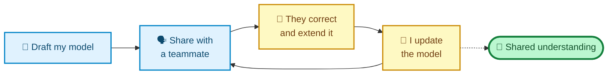

> **⚠️ Caution:** Don't let a model become decoration. If I never check it against reality or against my teammates, it drifts into fiction. A stale model is worse than none, because people trust diagrams.

> **🧪 Final activity:** Work through every source in this post. Learn as much as you can about the platform, then arrange it into a visual model. At a minimum, capture the web APIs, their relationships and the endpoints each contains. Arrange it however works best for *you*.

---

## Congratulations, you're testing (but there's more to do)

Pause and reflect. In my previous post I described testing as learning about what we want to build and what we've built. Any activity that helps me learn counts, if I do it with deliberate intention and focus. By experimenting with the product through various tools and building models, I've been testing. It doesn't take much to *begin*: a few simple tools and a mindset that seeks new information instead of only confirming assumptions.

But good testing is **easy to pick up and difficult to master**. My research so far has been informal. It lacks deliberate organization. And my time will always be limited. This chapter's work is a starting point, and to find the high-value information my team needs, I need focused, deliberate activities, which means a strategy.

| | What I did in this post | What a strategy adds |
|---|---|---|
| Approach | Informal exploration | Deliberate, risk-driven activities |
| Selection of activities | Whatever I happened to try | Chosen to fit goals and context |
| Coverage | Wide but shallow | Targeted where risk is highest |
| Output | Understanding and a model | Plans, checks, and repeatable practices |
| Time use | Open-ended | Constrained and prioritized |

It's tempting to jump into activities that are familiar or sound novel. By working out my goals and my plan first, I can pick the right testing activities for this particular context.

---

## Pitfalls I try to avoid

| Pitfall | Why it hurts | What I do instead |
|---|---|---|
| Diving straight into testing | I optimize the wrong things | Research first, then choose activities |
| Hunting for bugs during research | I lose the structural picture | Keep the goal as *learning* |
| Relying on one source | Each source has blind spots | Cross-check product, docs, code and people |
| Treating docs or people as perfectly accurate | Both can be stale | Treat them as hypotheses |
| Skipping code because "I'm not a developer" | I miss cheap, high-value clues | Read for names, dependencies and comments |
| Leaking tokens in cURL or HAR exports | Real security risk | Sanitize before sharing |
| Sniffing networks I don't control | Legal and ethical trouble | Only capture where I have permission |
| Keeping the model private | No feedback, no shared understanding | Share early and iterate |
| Never updating the model | It becomes misleading | Revisit it whenever I learn something |

---

## Cheat sheet and summary

### My research checklist

| Done? | Step | Output |
|---|---|---|
| ☐ | Read the product's short history | Hypotheses about users, features, tech |
| ☐ | Use the product as each user type | Feature list, user journeys |
| ☐ | Watch XHR traffic in dev tools | List of APIs, URIs and methods |
| ☐ | Replay and modify requests in an HTTP client | Endpoint behavior notes, extra endpoints, `Allow` headers |
| ☐ | Sniff local traffic between APIs (if possible) | API-to-API dependencies |
| ☐ | Read READMEs and API docs | Run instructions, endpoint details |
| ☐ | Browse user stories and the project board | History, past bugs, technical debt |
| ☐ | Skim source code for names and dependencies | Confirmation of architecture clues |
| ☐ | Talk to product and development colleagues | Priorities, risks, tacit knowledge |
| ☐ | Draw a model, share it, iterate | Shared understanding |

### The big picture

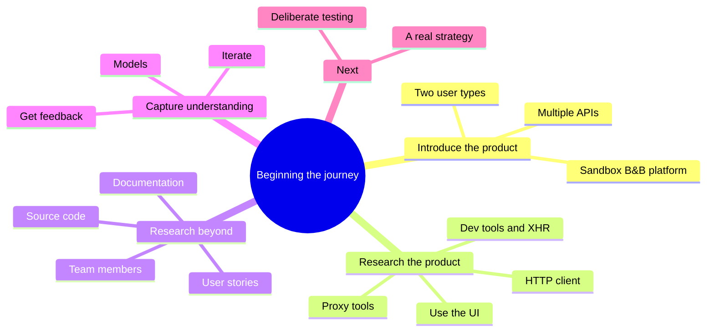

### Key takeaways

- **Research comes before strategy.** I can't choose good testing activities for a context I don't understand.
- **Learn, don't break.** The research mindset is about expanding understanding, not stress-testing.
- **There's no required order.** Pick the source that suits your learning style, but eventually cover them all.
- **Each tool shows a different layer.** The UI shows features, dev tools show browser traffic, an HTTP client shows endpoint behavior, and a proxy shows API-to-API conversations.
- **Documentation, stories, code and people** each add context the product alone can't give.
- **Reading code is not writing code.** Names, dependencies and comments are accessible clues.
- **Models turn research into something shareable.** A good model includes what matters and omits what doesn't, and it improves through feedback.
- **Research is a form of testing**, but it's informal, so a deliberate strategy is the next step.

### Quick glossary

| Term | Meaning |
|---|---|
| **XHR** | XMLHttpRequest: a background HTTP request from the browser to an API |
| **Dev tools** | Built-in browser tools for inspecting pages and network traffic |
| **HAR** | A file format for exported browser network traffic |
| **HTTP client** | A tool such as Postman for crafting and sending requests |
| **cURL** | A command-line way of describing an HTTP request |
| **`OPTIONS`** | An HTTP method that asks which methods a resource supports |
| **Loopback** | The network interface for traffic that stays inside your machine |
| **Proxy / sniffer** | A tool that observes network traffic (for example, Wireshark) |
| **Model** | A simplified representation that highlights useful information |
| **Mental model** | The picture of how something works that sits in a person's head |

### Where I go next

With a working understanding of the product and a shareable model, I'm ready to get deliberate. The next steps are to understand what my *users* value and which risks matter most, and then to match specific testing activities to those risks. That's where a collection of informal research activities becomes an actual strategy.

If I could leave you with one habit, it would be this: **before I test anything, I make sure I can draw it.** If I can't sketch the APIs and how they depend on each other, I haven't researched enough yet. And if I *can* draw it, someone else can correct me, which is how I find out what I got wrong before it costs anyone anything.

---

*Source and credits:* this post is based on the chapter "Beginning our testing journey" and uses the open `restful-booker-platform` sandbox for its examples. The Python mock platform, helpers and tests above are my own illustrations, written and run for this post.
