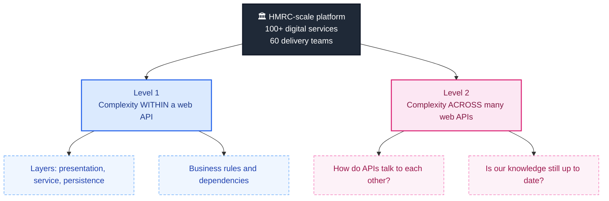
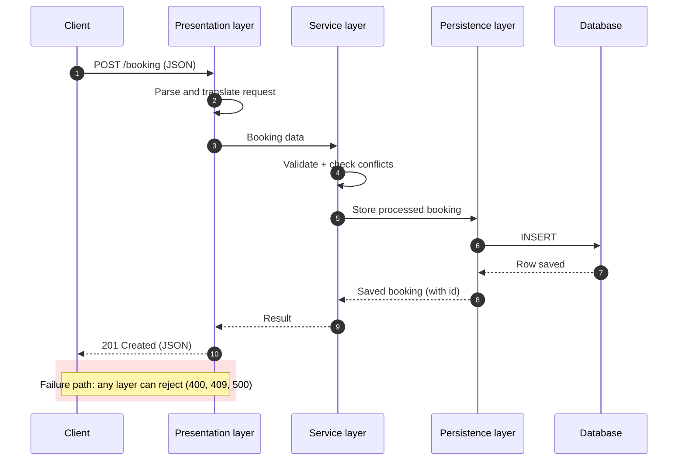
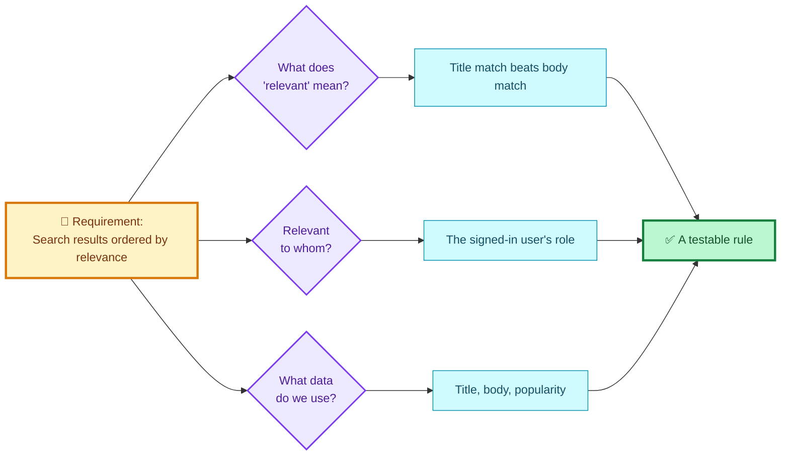
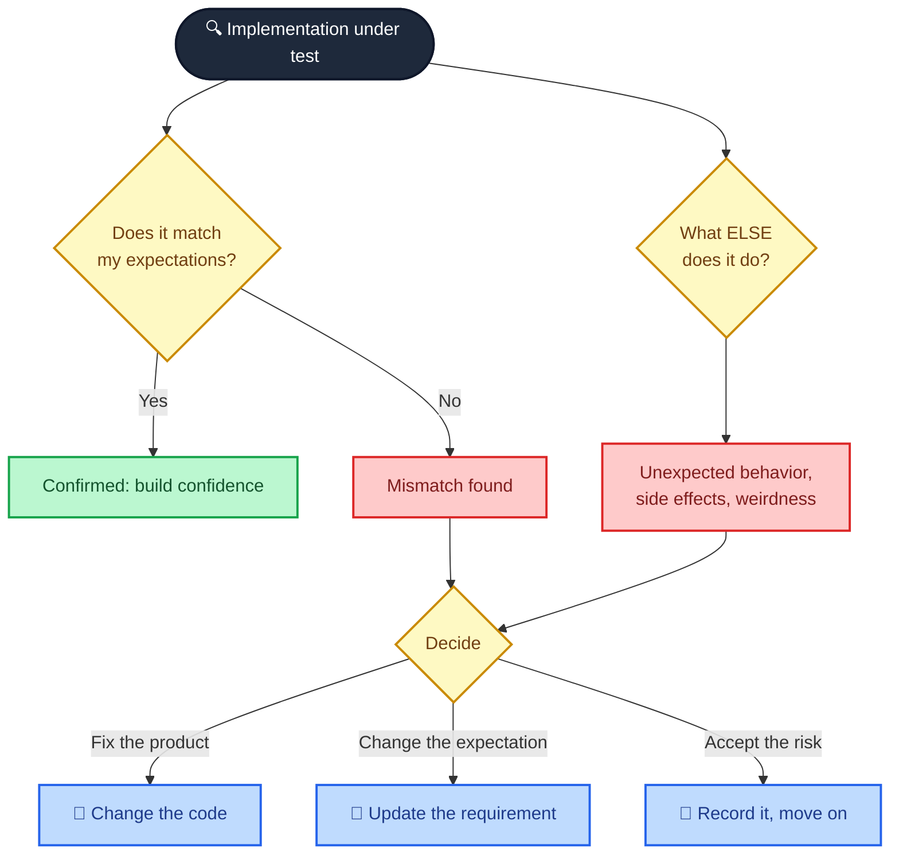
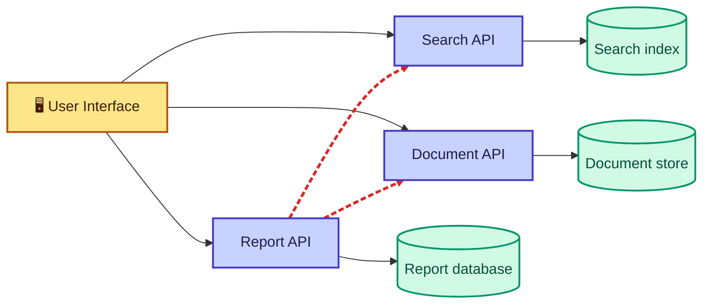
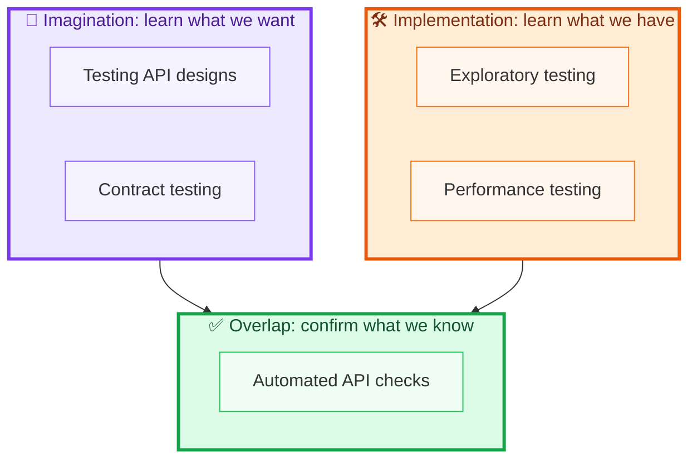
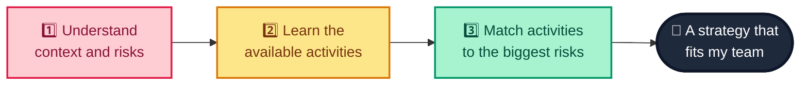
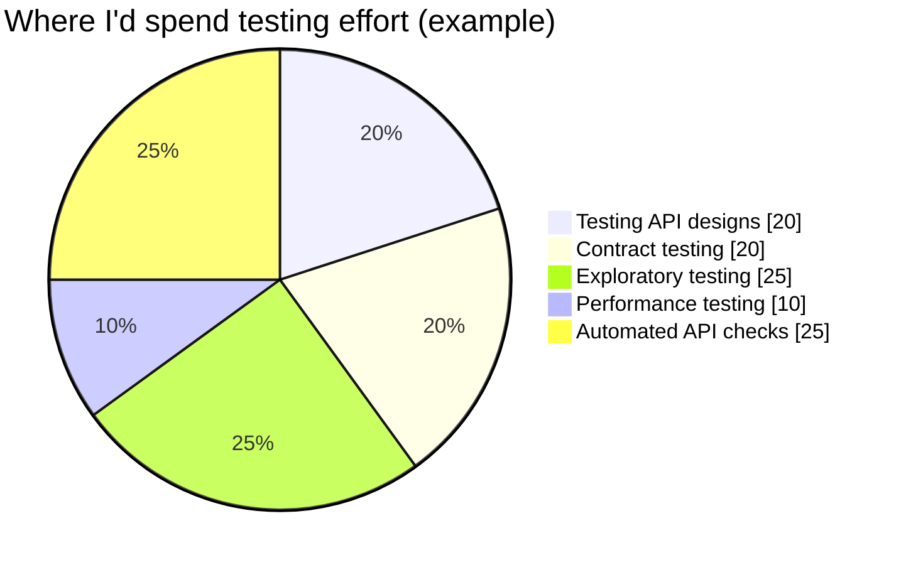
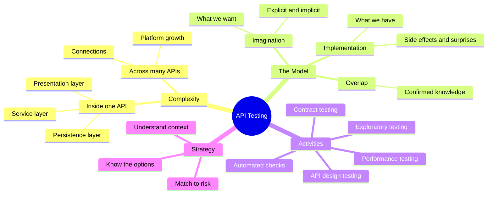

# Why and How I Test Web APIs: Imagination, Implementation, and a Strategy That Actually Works

> **TL;DR:** Web APIs are far more complicated than they look, and that complexity multiplies when many of them work together. I use a simple two-circle model of testing, *imagination* (what we want) and *implementation* (what we have), to decide which testing activities to invest in. This post walks through the model, a real-world-sized example, and a small working API with tests that I ran myself.

---

## Table of Contents

1. [The question that started it all](#the-question-that-started-it-all)
2. [Where the complexity hides](#where-the-complexity-hides)
3. [A tiny API I can actually test](#a-tiny-api-i-can-actually-test)
4. [What testing really is](#what-testing-really-is)
5. [Testing the imagination](#testing-the-imagination)
6. [Testing the implementation](#testing-the-implementation)
7. [Where the circles overlap: automated checks](#where-the-circles-overlap-automated-checks)
8. [Building an API testing strategy](#building-an-api-testing-strategy)
9. [Common mistakes I see](#common-mistakes-i-see)
10. [Cheat sheet and summary](#cheat-sheet-and-summary)

---

## The question that started it all

How do I make sure that what I'm building is of good quality, and that it is actually valuable to the people who will use it?

It sounds like a question with a tidy answer, but it isn't. The real problem is the sheer number of complex activities that happen in any software project. Requirements get written and misread, code gets merged, dependencies update themselves, and services quietly change how they talk to each other. If I want to make *informed* choices that improve quality, I first have to cut through that noise and build a real understanding of two things:

- how my systems actually work, and
- what my users actually want from them.

That is the job of a good testing strategy. Before I get into the API-specific details, I want to reflect on why software gets so complicated in the first place, because once you see the complexity clearly, the purpose of testing stops being abstract.

> **📝 Note:** Throughout this post I use "testing" in a broad sense. I don't just mean writing automated tests. I mean *any* activity that helps me learn about what we want to build and what we've built.

---

## Where the complexity hides

I like to think about complexity in two "levels". The first lives inside a single web API. The second appears when many web APIs have to cooperate on a platform.

To make this concrete, consider a project I find endlessly instructive: the UK's HMRC tax platform. In 2013 the UK government set out a digital strategy that pushed every department toward a "Digital by Default Service Standard". HMRC's goal was to move all UK tax services online, improving them and cutting costs along the way.

By 2017 the HMRC platform boasted more than 100 digital services, built by around 60 delivery teams spread across five delivery centers. Every one of those services was supported by a platform of interconnected web APIs that were (and still are) constantly growing. When I joined in 2015, there were roughly half the services, teams, and delivery centers that exist today, and the platform *already* contained well over 100 web APIs.

So here's the question that keeps me honest: **how does a project of that size deliver high-quality services to end users?**



### Level 1: complexity within a web API

It might seem a bit silly to ask "what is a web API?", but when I take the time to unpack its makeup, I discover not only what it *is*, but where its complexity lives.

A typical web API receives requests over HTTP from clients, and those requests trigger different layers to run. Once the work is done and (say) a booking has been stored, the API responds over HTTP. But if I take a more granular walk through the API, I start to notice just how much is going on inside a single service:

1. **The presentation layer** receives the HTTP request and translates it into something the other layers can read.
2. **The service layer** takes the booking information and applies business logic. Is it a valid booking? Does it conflict with another booking?
3. **The persistence layer** prepares the processed booking for storage and writes it to a database.
4. On the way back, **each layer has to respond to the one above it** so that the final HTTP response can be assembled.



Each of those layers can be built in a different way depending on requirements and taste. I can design my API with REST, GraphQL, or SOAP, and each style has its own patterns and rules to learn. The service layer holds business logic that, depending on the context, may have many specific custom rules. The persistence layer depends on a database with its own behavior. Every layer rests on dependencies that have their own active development life cycles.

> **📝 Note on REST:** In this post (and in most of my day-to-day work) I use REST, because it's currently the most widely used architecture style. But the testing activities I describe apply just as well to GraphQL or SOAP. The mental model doesn't care how the layers are built.

I can absolutely build understanding by testing the pieces individually, and I encourage teams to do exactly that. J. B. Rainsberger's talk *"Integrated Tests Are a Scam"* is a great read on the topic. But testing parts in isolation only ever gives me a piece of the puzzle, not the whole picture.

### Level 2: complexity across many web APIs

Now zoom out to the HMRC platform with its 100+ APIs. How do I keep a mental model of how each one works *and* how they relate to one another?

Approaches like microservice architecture reduce the complexity inside a single API by making each one smaller and more focused. That's a real benefit. But the flip side is that they often lead to *more* web APIs on the platform. So new questions appear:

- How do I make sure my knowledge of the platform is up to date?
- How do I keep up with how each API talks to the others?
- How do I confirm those connections are still working within expected parameters?

| Aspect | Inside one API | Across many APIs |
|---|---|---|
| Main source of complexity | Layers, business rules, dependencies | Connections, contracts, versions |
| Typical question | "Is this booking valid?" | "Does the Report API still understand the Search API?" |
| Who changes things | One team | Many teams, on different schedules |
| Typical risk | Logic bugs, bad data handling | Broken integrations, stale assumptions |
| Helpful activities | Exploratory and automated checks | Contract testing, platform-level monitoring |

To build a high-quality product, I have to make informed choices. That means my knowledge of how my APIs work, how they relate to each other, and how they serve end users is vital. If I *don't* make informed choices, I risk issues appearing in my products because I misinterpreted how my systems work. Testing is how I establish and maintain that understanding.

---

## A tiny API I can actually test

Talking about layers is fine, but I prefer to see them. So I built a deliberately small bookings API using nothing but the Python standard library (no installs, no frameworks) that mirrors the three layers above. I ran every snippet in this post, and the tests at the end passed.

> **⚠️ Caution:** This is a *teaching* API. It stores data in memory, has no authentication, and uses Python's built-in HTTP server, which is not meant for production. Please don't deploy it.

### `bookings_api.py`

```python
"""A tiny three-layer bookings web API (standard library only)."""
import json
import threading
from datetime import date
from http.server import BaseHTTPRequestHandler, ThreadingHTTPServer


# ---------- Persistence layer ----------
class BookingRepository:
    def __init__(self):
        self._rows, self._next_id = {}, 1
        self._lock = threading.Lock()

    def save(self, booking: dict) -> dict:
        with self._lock:
            booking = {**booking, "id": self._next_id}
            self._rows[self._next_id] = booking
            self._next_id += 1
            return booking

    def all_for_room(self, room: int) -> list:
        with self._lock:
            return [b for b in self._rows.values() if b["room"] == room]


# ---------- Service layer (business logic) ----------
class BookingError(Exception):
    def __init__(self, status: int, message: str):
        super().__init__(message)
        self.status, self.message = status, message


class BookingService:
    def __init__(self, repo: BookingRepository):
        self.repo = repo

    def create(self, data: dict) -> dict:
        for field in ("room", "guest", "checkin", "checkout"):
            if field not in data:
                raise BookingError(400, f"Missing field: {field}")
        try:
            checkin = date.fromisoformat(data["checkin"])
            checkout = date.fromisoformat(data["checkout"])
        except (TypeError, ValueError):
            raise BookingError(400, "Dates must be ISO format YYYY-MM-DD")
        if checkout <= checkin:
            raise BookingError(400, "Checkout must be after checkin")
        for other in self.repo.all_for_room(data["room"]):
            o_in = date.fromisoformat(other["checkin"])
            o_out = date.fromisoformat(other["checkout"])
            if checkin < o_out and o_in < checkout:   # ranges overlap
                raise BookingError(409, "Room already booked for those dates")
        return self.repo.save(data)


# ---------- Presentation layer (HTTP) ----------
def make_handler(service: BookingService):
    class Handler(BaseHTTPRequestHandler):
        def log_message(self, *args):  # keep test output quiet
            pass

        def _send(self, status, payload):
            body = json.dumps(payload).encode()
            self.send_response(status)
            self.send_header("Content-Type", "application/json")
            self.send_header("Content-Length", str(len(body)))
            self.end_headers()
            self.wfile.write(body)

        def do_POST(self):
            if self.path != "/booking":
                return self._send(404, {"error": "Not found"})
            try:
                length = int(self.headers.get("Content-Length", 0))
                data = json.loads(self.rfile.read(length) or b"{}")
                self._send(201, service.create(data))
            except json.JSONDecodeError:
                self._send(400, {"error": "Body must be valid JSON"})
            except BookingError as e:
                self._send(e.status, {"error": e.message})

    return Handler


def start_server(port=0):
    service = BookingService(BookingRepository())
    server = ThreadingHTTPServer(("127.0.0.1", port), make_handler(service))
    threading.Thread(target=server.serve_forever, daemon=True).start()
    return server
```

Even in 89 lines, look at how many decisions are hiding in there:

| Decision hidden in the code | Why it matters for testing |
|---|---|
| Overlap rule: `checkin < o_out and o_in < checkout` | Is a same-day turnover (checkout day = next checkin day) allowed? I chose yes. Did the business? |
| Dates are ISO strings | What happens with `"01/11/2026"`? |
| Missing fields return 400 | Which field is reported first if several are missing? |
| Bad JSON returns 400 | Without the `except`, this would be a 500 |
| Rooms are plain integers | What about room `-5` or `"abc"`? |
| In-memory storage with a lock | What if two identical requests arrive at the same instant? |

Every row in that table is a question about *imagination* (what do we want?) or *implementation* (what did we build?). That distinction is the heart of this post.

---

## What testing really is

Success with testing requires a shared understanding of its purpose and value. Sadly, there are many misconceptions about what testing is and what it offers. To get everyone on the same page, I use a model based on one created by James Lyndsay in his paper *"Why Exploration has a Place in any Strategy"*.

The model has two circles:

- The **left circle is imagination**: what we *want* in a product.
- The **right circle is implementation**: what we *have* in a product.

The purpose of testing is to learn as much as possible about what's going on in each circle by carrying out testing activities. The more I test in these two circles, the more I learn, and the more I achieve two things:

1. **Discovering potential issues** that might affect quality.
2. **Overlapping the two circles**, so I understand what I'm building and can be confident it's the product or service we actually want.

```mermaid
flowchart LR
    subgraph IMG["💭 IMAGINATION: what we want"]
        direction TB
        I1["Explicit expectations<br/>(written and spoken)"]
        I2["Implicit expectations<br/>(assumed, unspoken)"]
    end
    subgraph OVL["✅ OVERLAP: what we know matches"]
        direction TB
        O1["Confirmed behavior"]
        O2["Shared understanding"]
    end
    subgraph IMP["🛠️ IMPLEMENTATION: what we have"]
        direction TB
        M1["Intended behavior"]
        M2["Side effects, weirdness,<br/>vulnerabilities"]
    end
    IMG --- OVL --- IMP

    style IMG fill:#e0f2fe,stroke:#0284c7,stroke-width:3px,color:#0c4a6e
    style OVL fill:#dcfce7,stroke:#16a34a,stroke-width:3px,color:#14532d
    style IMP fill:#ffedd5,stroke:#ea580c,stroke-width:3px,color:#7c2d12
    style I1 fill:#f0f9ff,stroke:#38bdf8,color:#075985
    style I2 fill:#f0f9ff,stroke:#38bdf8,color:#075985,stroke-dasharray: 4 3
    style O1 fill:#f0fdf4,stroke:#4ade80,color:#166534
    style O2 fill:#f0fdf4,stroke:#4ade80,color:#166534
    style M1 fill:#fff7ed,stroke:#fb923c,color:#9a3412
    style M2 fill:#fff7ed,stroke:#fb923c,color:#9a3412,stroke-dasharray: 4 3
```



### Surprise: you're already testing

Because the goal of testing is to understand and learn about what we want our products to do and how they should work, you're probably already doing some form of it. Debugging code, loading an API and casually firing off a few requests, or emailing a client to ask how something should behave: in each case you're learning, and therefore testing.

That's why testing is sometimes assumed to be easy. But there's a big difference between **ad hoc, informal testing** and **focused, intentional testing**. Complexity can overwhelm us, and it's only with a *strategic* approach that I see a real difference.

| | Ad hoc testing | Focused, intentional testing |
|---|---|---|
| Trigger | Curiosity, a bug report | A known risk or open question |
| Coverage | Whatever I happen to try | Chosen deliberately |
| Output | A vague feeling it works | Specific learning I can share |
| Repeatable? | Rarely | Yes, and often documented |
| Helps decisions? | A little | A lot |

---

## Testing the imagination

The imagination circle represents what we want from our product, and those expectations are both **explicit** and **implicit**. Testing here means learning as much as I can about both. I don't want to learn only what was written down or said aloud; I want to dig into the details and remove ambiguity around terms and ideas.

Let me use the classic example from this model. Imagine a product owner tells the team:

> "Search results are to be ordered by relevance."

The explicit information is clear: they want search results, ordered by relevance. But there is a *lot* of implied information hiding inside that sentence. I uncover it by testing the ideas behind the request, which usually means asking questions:

- What is meant by "relevant" results?
- Relevant *to whom*?
- What information is shared with the search?
- How do we order by relevancy?
- What data should we use?

Each answer reduces misunderstanding and exposes risk. If I know more about what I'm being asked to build, I'm far more likely to build the right thing the first time.



### Turning answers into something executable

Here's the part I enjoy most: once those questions are answered, the answers can become code. Suppose the team agrees on this rule: *a title hit is worth three times a body hit, ties keep their original order, and documents with no hits are not relevant.* That's something I can write down and test.

### `search_ranking.py`

```python
"""Turning an ambiguous requirement into something testable."""

def rank_by_relevance(query: str, documents: list[dict]) -> list[dict]:
    """Score = title hits * 3 + body hits. Ties keep original order.
    Documents with a score of 0 are not relevant, so they are dropped."""
    terms = query.lower().split()
    scored = []
    for doc in documents:
        title, body = doc["title"].lower(), doc["body"].lower()
        score = sum(3 * title.count(t) + body.count(t) for t in terms)
        if score > 0:
            scored.append((score, doc))
    scored.sort(key=lambda pair: -pair[0])   # stable sort keeps tie order
    return [doc for _, doc in scored]
```

> **💡 Tip:** When I run a "three amigos" or refinement session, I treat every adjective in a requirement ("fast", "relevant", "secure", "simple") as a question waiting to be asked. Vague adjectives are where the most expensive misunderstandings live.

> **⚠️ Caution:** My relevance formula above is only an example. If I had invented it alone and shipped it, I'd have *skipped* testing the imagination, and I'd be guessing what the business wants. The rule only counts as an answer once the people who own the requirement agree to it.

---

## Testing the implementation

Testing the imagination gives me a stronger sense of what I'm being asked to build. But knowing *what* to build doesn't guarantee that the result matches those expectations. That's why I also test the implementation, to learn:

1. **Whether** the product matches our expectations.
2. **How** the product might *not* match our expectations.

Both goals matter equally. Of course I want to confirm I built the right thing. But side effects such as unintended behavior, vulnerabilities, missed expectations, and downright weirdness will always exist in software. With the search example, I wouldn't just confirm that results arrive in the relevant order. I'd also ask the product questions like:

- What if I enter different search terms?
- What if the relevant results don't match the behavior of other search tools?
- What if part of the service is down when I search?
- What if I request results 1,000 times in less than 5 seconds?
- What happens if there are *no* results?

By exploring beyond expectations, I become aware of what's really going on in my product, warts and all. That protects me from making incorrect assumptions and releasing a poor-quality product. And if I do find unexpected behavior, I get to choose: remove it, or readjust my expectations to match reality.



### Exploring my bookings API with those questions

Let me put this into practice. Here are the "what if" questions I'd ask of the bookings API, and what I found when I actually ran each one:

| What if...? | Expected | Observed (I ran it) | Verdict |
|---|---|---|---|
| I send a perfectly valid booking | `201` with an id | `201`, `id: 1` | ✅ Matches |
| A required field is missing | `400` with a clear message | `400`, `Missing field: guest` | ✅ Matches |
| Checkout is *before* checkin | `400` | `400` | ✅ Matches |
| The body isn't valid JSON | `400`, not a crash | `400` | ✅ Matches |
| Two bookings overlap | `409` | `409` | ✅ Matches |
| One guest checks out the day another checks in | Allowed | `201` | ✅ Matches (a rule I should confirm with the business) |
| I hit an unknown URL | `404` | `404` | ✅ Matches |
| I send 1,000 bookings rapidly | All succeed, reasonably fast | All `201`, about 0.5 seconds locally | ✅ Matches |

> **📝 Note:** A table full of green ticks feels good, but it only describes *these* questions. The valuable ones are the questions I haven't thought of yet. Notice the same-day turnover row: it "matches" only because *I* decided what the rule should be. That's an imagination question wearing an implementation costume.

> **⚠️ Caution on the load probe:** My 1,000-request loop runs sequentially against a local server on one machine. It tells me the API doesn't fall over in a trivial case. It does **not** tell me how the API behaves under real concurrent load, with a real database, over a real network. Don't mistake a smoke test for a performance test.

---

## Where the circles overlap: automated checks

The more I learn through testing about what I want to build and what I have built, the more my two circles *align*. And the more they align, the more accurate my perception of quality becomes.

The area where they overlap is where I place **automated API checks**. These cover the places where my knowledge of what I want (imagination) and what I built (implementation) agree. Their job is to:

- confirm my knowledge of how the API works is still correct, and
- alert me to any regression in quality.

I deliberately call them *checks* rather than *tests*. A check confirms something I already believe; it doesn't discover anything new. That's valuable, but it's a different job from exploration.

### `test_bookings_api.py`

Here's the full test file I ran. It starts the server on a random free port, sends real HTTP requests, and checks the results.

```python
import json
import time
import unittest
import urllib.error
import urllib.request

from bookings_api import start_server
from search_ranking import rank_by_relevance


def post(base, path, payload, raw=False):
    body = payload if raw else json.dumps(payload).encode()
    req = urllib.request.Request(base + path, data=body, method="POST",
                                 headers={"Content-Type": "application/json"})
    try:
        with urllib.request.urlopen(req) as r:
            return r.status, json.loads(r.read())
    except urllib.error.HTTPError as e:
        return e.code, json.loads(e.read())


class BookingChecks(unittest.TestCase):
    def setUp(self):
        self.server = start_server()
        self.base = f"http://127.0.0.1:{self.server.server_address[1]}"
        self.good = {"room": 1, "guest": "Ada", "checkin": "2026-11-01", "checkout": "2026-11-03"}

    def tearDown(self):
        self.server.shutdown()
        self.server.server_close()

    # Automated check: imagination and implementation overlap
    def test_valid_booking_is_created(self):
        status, body = post(self.base, "/booking", self.good)
        self.assertEqual(status, 201)
        self.assertEqual(body["id"], 1)

    # Exploring beyond expectations
    def test_missing_field_is_rejected(self):
        bad = {k: v for k, v in self.good.items() if k != "guest"}
        status, body = post(self.base, "/booking", bad)
        self.assertEqual((status, body["error"]), (400, "Missing field: guest"))

    def test_checkout_before_checkin_is_rejected(self):
        status, _ = post(self.base, "/booking", {**self.good, "checkout": "2026-10-30"})
        self.assertEqual(status, 400)

    def test_garbage_json_gets_400_not_500(self):
        status, _ = post(self.base, "/booking", b"{not json", raw=True)
        self.assertEqual(status, 400)

    def test_overlapping_booking_conflicts(self):
        post(self.base, "/booking", self.good)
        status, _ = post(self.base, "/booking", {**self.good, "checkin": "2026-11-02", "checkout": "2026-11-05"})
        self.assertEqual(status, 409)

    def test_back_to_back_booking_is_allowed(self):
        post(self.base, "/booking", self.good)
        status, _ = post(self.base, "/booking", {**self.good, "checkin": "2026-11-03", "checkout": "2026-11-05"})
        self.assertEqual(status, 201)

    def test_unknown_path_is_404(self):
        status, _ = post(self.base, "/nope", self.good)
        self.assertEqual(status, 404)

    # "What if I request 1,000 times quickly?" - a tiny load probe
    def test_one_thousand_requests_complete_quickly(self):
        start = time.perf_counter()
        for i in range(1000):
            # a distinct room per request, so none conflict
            status, _ = post(self.base, "/booking", {**self.good, "room": i})
            self.assertEqual(status, 201)
        elapsed = time.perf_counter() - start
        print(f"\n1000 requests took {elapsed:.2f}s")
        self.assertLess(elapsed, 30)


class SearchRelevanceChecks(unittest.TestCase):
    docs = [
        {"title": "Tax guide", "body": "payroll payroll"},
        {"title": "Payroll basics", "body": "intro"},
        {"title": "Holiday policy", "body": "nothing here"},
    ]

    def test_title_match_outranks_body_matches(self):
        titles = [d["title"] for d in rank_by_relevance("payroll", self.docs)]
        self.assertEqual(titles, ["Payroll basics", "Tax guide"])

    def test_no_results_returns_empty_list(self):
        self.assertEqual(rank_by_relevance("zebra", self.docs), [])


if __name__ == "__main__":
    unittest.main(verbosity=2)
```

### Running it

Save the three files in one folder, then run:

```bash
python3 test_bookings_api.py
```

This is the output I got (Python 3, no extra packages):

```text
test_back_to_back_booking_is_allowed ... ok
test_checkout_before_checkin_is_rejected ... ok
test_garbage_json_gets_400_not_500 ... ok
test_missing_field_is_rejected ... ok
test_one_thousand_requests_complete_quickly ...
1000 requests took 0.48s
ok
test_overlapping_booking_conflicts ... ok
test_unknown_path_is_404 ... ok
test_valid_booking_is_created ... ok
test_no_results_returns_empty_list ... ok
test_title_match_outranks_body_matches ... ok

Ran 10 tests in 4.5s

OK
```

> **📝 A small honest story:** My *first* version of the ranking test failed to prove what its name claimed. The "Tax guide" document had three body hits and "Payroll basics" had one title hit worth three points, so they **tied**, and the test passed only because ties keep their original order. A green test that doesn't test what it says is worse than no test. I fixed the data so the title hit genuinely scores higher (3 vs. 2). This is exactly why I keep saying checks need to be questioned too.

> **💡 Tip:** Every check should be able to fail for the reason in its name. When I write one, I briefly break the code on purpose and confirm the check goes red. If it stays green, the check is decoration.

---

## Building an API testing strategy

Here's where the model pays off. It can feel abstract, so let me make it concrete with a system I've worked on: a service that let users **search and read regulatory documents**, and **create reports** from those documents. Simplified, it was a set of web APIs providing services to the UI *and to each other*. For example, the Search API could be queried by the UI, but also by another API such as the Report API.



*(The red dashed lines are API-to-API calls. Those are the connections that quietly break when one team changes something.)*

Now I can fill in my two circles with specific testing activities.

**On the imagination side:**

- **Testing API designs** lets me question ideas and build a shared understanding of the problems we're trying to solve, *before* code exists.
- **Contract testing** helps teams make sure their APIs speak to each other, and get updated correctly when changes occur.

**On the implementation side:**

- **Exploratory testing** lets me learn how the APIs behave and discover potential issues.
- **Performance testing** helps me understand how the APIs behave under load.

**In the overlap:**

- **Automated API checks** confirm my knowledge is still correct and flag regressions.



### A quick reference of activities

| Activity | Circle | What it teaches me | Typical question |
|---|---|---|---|
| Testing API designs | Imagination | Whether the idea is clear and shared | "What problem is this endpoint really solving?" |
| Contract testing | Imagination | Whether APIs still agree on how they talk | "If Search changes its response, who breaks?" |
| Exploratory testing | Implementation | How the API really behaves, including surprises | "What happens if I send something strange?" |
| Performance testing | Implementation | Behavior under load | "What happens at 100 times today's traffic?" |
| Automated API checks | Overlap | Whether what I believe is still true | "Did my last change break anything known?" |

### The three steps to a strategy

No single activity gives me the whole picture. A successful strategy is *holistic*: many activities working together to keep me and my team informed. To build one, I follow three steps:

1. **Understand my context and its risks.** Who are my users? What do they want? How does my product work? How do we work as a team? What does quality mean to *them*?
2. **Appreciate the testing activities available.** Do I know how to use automation effectively? Do I know I can test ideas and API designs before coding starts? How can I get value from testing in production?
3. **Use my context to pick the right activities.** Which risks matter most, and which activities best reduce them?



### A worked example: matching risk to activity

Let me show the third step in action with the regulatory-documents system.

| Risk | Likelihood | Impact | Best-fit activity |
|---|---|---|---|
| Search returns irrelevant results | High | High | Test the imagination (what is "relevant"?), then add automated checks |
| Report API breaks when Search changes | Medium | High | Contract testing |
| A slow Search API makes Reports time out | Medium | Medium | Performance testing |
| Strange input causes server errors | Medium | Medium | Exploratory testing |
| Misunderstood requirements | High | High | Testing API designs *before* coding |



> **📝 Note:** Those percentages are an illustration of *one* context, not a recipe. A payments API with strict regulation would shift the weight dramatically. Your risks decide your strategy, not a template.

> **⚠️ Caution:** The most common trap I see is treating "API testing" as a synonym for "automated checks". Automation covers only the overlap. If that's all you do, you'll learn very little about what you *want* or about the surprises you *haven't found yet*.

---

## Common mistakes I see

Over the years I've watched the same patterns appear again and again. Here are the ones I'd most like to save you from:

| Mistake | Why it hurts | What I do instead |
|---|---|---|
| Testing only after the code is finished | Misunderstandings get baked in | Test ideas and designs early |
| Automating everything first | Only confirms what I already believe | Explore first, then automate what's worth keeping |
| Treating green checks as proof of quality | Checks only cover the questions I asked | Keep exploring beyond the checks |
| Testing each API in isolation only | Misses the connections between APIs | Add contract and integration-level activities |
| Never revisiting the strategy | The platform keeps growing and changing | Review my strategy as the context changes |
| Assuming "everyone knows what relevant means" | Implicit expectations differ between people | Ask the questions out loud |

> **⚠️ Caution:** Be careful with the phrase "we'll test it later". Complexity doesn't wait. By the time "later" arrives, the number of APIs, dependencies, and unspoken assumptions has usually grown.

---

## Cheat sheet and summary

Here is everything I'd want you to take away, condensed.

### The mental model in one picture



### Key takeaways

- **Web APIs are layered.** Each layer does complex work, and the layers get more complex when combined.
- **Complexity scales again across a platform.** Many APIs working together create services for end users, and keeping track of their relationships is hard.
- **Understanding is the real goal.** I can only deliver high quality if I understand what I'm building and what my users want.
- **Testing has two focus areas.** I test the *imagination* to learn what I want to build, and the *implementation* to learn what I have built.
- **Overlap equals confidence.** The more the two circles overlap, the better informed I am about quality.
- **Different activities reveal different things.** Design testing, contract testing, exploratory testing, performance testing, and automated checks each shine a light on a different area.
- **A strategy is holistic.** It's a combination of activities chosen for my context's risks, not a single tool or technique.
- **Ad hoc is not enough.** I'm probably already testing informally, but a *focused, intentional* approach is what changes outcomes.

### Quick glossary

| Term | Meaning |
|---|---|
| **Web API** | A service that receives HTTP requests and returns responses, usually with JSON |
| **Presentation layer** | Receives the request and translates it for the other layers |
| **Service layer** | Applies business logic (validity, conflicts, rules) |
| **Persistence layer** | Prepares data for storage and writes it to a database |
| **REST** | A widely used architecture style for web APIs |
| **Imagination** | What we want in a product (explicit and implicit expectations) |
| **Implementation** | What we actually have in a product |
| **Automated check** | A repeatable confirmation of something we already believe |
| **Contract testing** | Verifying that APIs agree on how they communicate |
| **Exploratory testing** | Learning how a product behaves by investigating it with curiosity |
| **Regression** | A previously working behavior that has stopped working |

### Where I'd go next

This post sets the foundation. From here, I'd dig into each of the activities above one by one: how to build a visual model of your API platform, how to test API designs before writing code, how to explore APIs with tools, how to write maintainable automated checks, how to approach contract and performance testing, and how to bring testing into production. Each of those is a lens that reveals something the others can't.

If you take only one thing from this post, let it be this: **testing is about learning.** Every question I ask of my requirements and every request I send to my API makes the picture clearer. The clearer the picture, the better the decisions I make, and better decisions are what high-quality products are made of.

---

*Credits and further reading:* the testing model comes from James Lyndsay's paper *"Why Exploration has a Place in any Strategy"*, and J. B. Rainsberger's talk *"Integrated Tests Are a Scam"* is a great companion on testing parts versus wholes. Both are referenced in the source chapter this post is based on.
