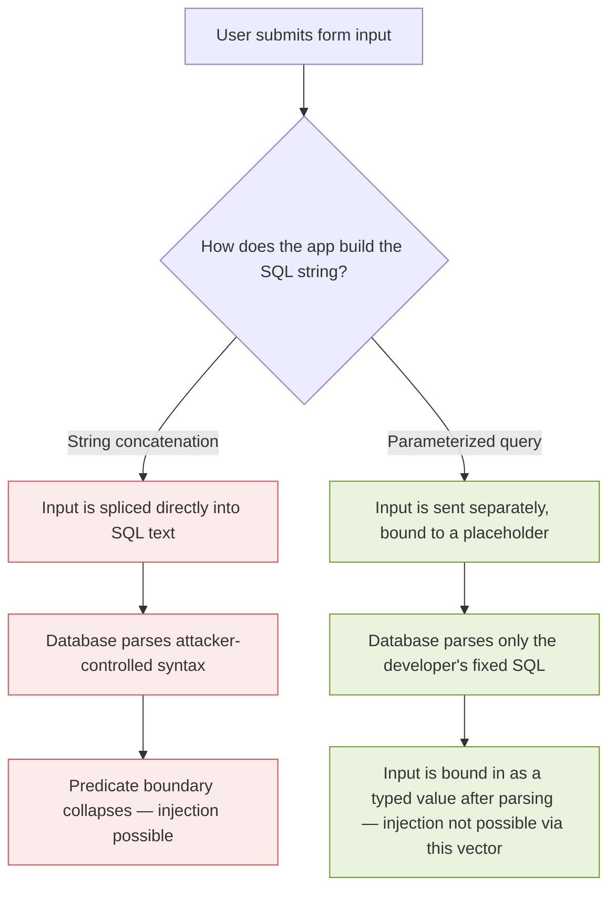
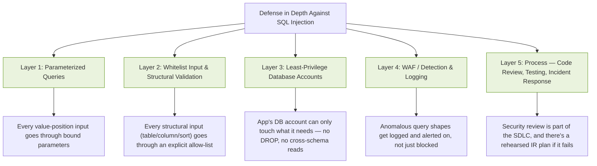

# SQL Injection Handbook

## Foundations: How Relational Databases Think, and Why That Makes Injection Possible

### Why I'm Writing This Book

I've spent a long time going down the SQL injection rabbit hole — not because I wanted a shelf of payloads, but because I kept running into the same frustration from every angle I approached it. As a developer, the advice I found was usually one paragraph long: "use parameterized queries," full stop, no explanation of *why* that one change closes the door so completely. As someone trying to read up on bug bounty methodology, most guides jumped straight to a giant list of strings to paste into a form field, with no framework for understanding *why* a given payload worked or what it told you about the backend. As someone trying to think like a blue teamer, I found almost nothing that connected "here's what an attacker's request looks like on the wire" to "here's what your logging and detection pipeline should actually be watching for."

So this book is the version of that research I wish I'd had on day one. I'm writing it in first person deliberately, because it's not a spec sheet — it's me walking you through what I found, what surprised me, what I tested myself, and where I think the standard explanations gloss over details that actually matter.

A note on scope before we go further, because I think it's important to be upfront about it: this book stays at the level of understanding, recognizing, confirming, and defending against SQL injection. It does not function as a payload arsenal, a WAF-bypass encyclopedia, or an operational playbook for turning a confirmed injection point into remote code execution, web shells, or persistence. That's a deliberate choice, not an oversight. A developer, a blue teamer, a bug bounty hunter reporting a legitimate finding, and a red teamer operating under a signed scope all need the same underlying knowledge — how the vulnerability class works, how to prove it exists, and how to close it. None of them need a book that hands them an escalation chain. If you're looking for that, this isn't it, and I'd gently push back on the idea that you need it: the professional path from "I found a SQLi" to "I have proven impact" almost never requires more than demonstrating that you can read data you shouldn't be able to read — which is exactly what Part II of this book teaches you to do, safely and reportably.

With that said — let's build the actual foundation.

---

### 1.1 What This Book Is Structured Around

I organized this as a five-part book, one chapter per markdown file, because I found that SQL injection material usually collapses two very different skills into one pile: *finding* the bug and *fixing* the bug. I wanted to keep them separate but connected, because a developer who understands the finding side writes better defenses, and a tester who understands the fixing side writes better reports.

Here's the map I'm using for the rest of the book:

| Part | Focus | Primary audience | Chapters |
|---|---|---|---|
| I | Foundations — the relational model, the attack surface, the taxonomy | Everyone | 1–3 |
| II | Finding and confirming injection responsibly | Bug bounty hunters, pentesters, red teamers | 4–8 |
| III | Defending — code, database, network, process | Developers, blue teamers, DBAs | 9–15 |

**Note:** Each chapter in this book is written to stand on its own at real depth — long enough to be a genuine reference for its topic, not a shallow summary. You can read straight through, or jump directly to whichever chapter addresses what you need right now.

---

### 1.2 The Relational Model in One Page

To understand *why* injection is possible, you have to understand what a relational database actually thinks it's doing when it runs a query. This isn't academic throat-clearing — the vulnerability only makes sense once you see it.

#### Relations, Tuples, and Attributes

A relational database, at its mathematical core, doesn't store "tables" — it stores **relations**. A relation is a set of **tuples** (rows), where each tuple is an ordered collection of values, and each position in that tuple corresponds to an **attribute** (column) with a defined domain (type).

When I write:

```sql
SELECT * FROM users WHERE username = 'alice';
```

I'm not really writing a sentence in English. I'm writing a shorthand for an operation from **relational algebra** — a formal, mathematical system that predates SQL by a decade. Edgar F. Codd defined this in 1970, and SQL is, underneath its English-like syntax, a fairly direct implementation of it.

#### The Two Operations That Matter Most Here

The two operations that matter most for understanding injection are **selection** and **projection**.

Selection filters *rows* based on a predicate:

$$
\sigma_{p}(R) = \{\, t \mid t \in R \land p(t) \,\}
$$

This says: "give me every tuple $t$ in relation $R$ such that predicate $p$ evaluates true for that tuple." In SQL, this is your `WHERE` clause.

Projection filters *columns*:

$$
\pi_{A_1, \dots, A_n}(R) = \{\, t[A_1, \dots, A_n] \mid t \in R \,\}
$$

This is your `SELECT column_list` part.

So `SELECT username FROM users WHERE username = 'alice'` is, formally:

$$
\pi_{\text{username}}\big(\sigma_{\text{username = 'alice'}}(\text{users})\big)
$$

**Here's the detail that the whole rest of this book hangs on:** the predicate $p$ in $\sigma_p(R)$ is supposed to be a *fixed logical expression* — the database engine compiles it into an execution plan once, treats it as code, and then substitutes in *values*. When everything works correctly, `'alice'` is a **value** being tested against the predicate `username = ?`. It is not part of the predicate itself.

SQL injection is what happens when that boundary — value versus predicate — collapses. The user-supplied string stops being data plugged into $p$ and starts being *part of* $p$ itself. I'll come back to this framing constantly, because once you see it this way, every injection technique in this book — union-based, blind, time-based, second-order — is just a different method of the same underlying trick: getting the database to treat your data as code.

---

### 1.3 How a SQL Query Becomes a String (and Why That's the Crime Scene)

Here's the part that I think most tutorials skip past too quickly. A web application doesn't send relational algebra to a database. It sends **text**. Somewhere in the application's code, a function builds a string, and that string is handed to the database driver, which parses it, plans it, and executes it.

The vulnerability is entirely about *how that string gets built*.



That diagram is, honestly, the entire book in one picture. Everything from here on is elaboration.

#### The String-Building Moment

Concretely, in a vulnerable application, somewhere there's a line that looks like this (I'm using Python here, but this pattern is language-agnostic — I'll show the equivalent in half a dozen languages in Chapter 9):

```python
query = "SELECT * FROM users WHERE username = '" + username + "'"
cursor.execute(query)
```

At the moment `+` runs, `username` — whatever the client sent — becomes indistinguishable, character for character, from SQL syntax written by the developer. The database has no way to know that the developer intended `username` to be a value and not, say, a closing quote followed by a new clause. By the time the string reaches the driver, that intent is gone. All the driver sees is text.

Compare that to the parameterized version:

```python
query = "SELECT * FROM users WHERE username = ?"
cursor.execute(query, (username,))
```

Here, the database driver receives *two separate things*: a fixed SQL template (which it parses and compiles exactly once, treating `?` as a typed placeholder), and a value, sent through a completely separate channel, which gets bound into that placeholder *after* parsing is complete. The value can contain a quote character, a semicolon, the word `UNION`, anything — it will never be re-parsed as SQL syntax, because parsing already happened before the value ever arrived.

This is the single most important sentence in this book, so I want to state it as plainly as I can:

> **Parameterization doesn't "sanitize" your input. It changes which channel your input travels through — from the code channel to the data channel — so that the database's parser never sees it as anything other than a value.**

That distinction — sanitize vs. separate channels — trips a lot of people up, including me for a while. "Sanitizing" implies you're cleaning something dangerous. Parameterization doesn't clean anything. It structurally prevents the danger from being possible in the first place, because the dangerous thing (user input being interpreted as SQL grammar) simply cannot occur.

---

### 1.4 A Minimal, Tested Example

I don't want to just assert this — I want to show it to you, because I think watching the actual bytes move is more convincing than any explanation. I built a tiny in-memory SQLite database with three users, one of them an admin, and wrote both a vulnerable login function and a parameterized one. Everything below is real output from actually running this code — I'm not reconstructing or paraphrasing a hypothetical.

#### The Setup

```python
import sqlite3

conn = sqlite3.connect(":memory:")
cur = conn.cursor()
cur.execute("""
    CREATE TABLE users (
        id INTEGER PRIMARY KEY,
        username TEXT,
        password TEXT,
        is_admin INTEGER
    )
""")
cur.executemany(
    "INSERT INTO users (username, password, is_admin) VALUES (?, ?, ?)",
    [
        ("alice", "hunter2", 0),
        ("bob", "correcthorse", 0),
        ("admin", "S3cretRootPW", 1),
    ],
)
conn.commit()

def vulnerable_login(username, password):
    query = ("SELECT id, username, is_admin FROM users "
             "WHERE username = '" + username + "' AND password = '" + password + "'")
    print("  SQL sent to engine:", query)
    cur.execute(query)
    return cur.fetchall()

def safe_login(username, password):
    query = "SELECT id, username, is_admin FROM users WHERE username = ? AND password = ?"
    cur.execute(query, (username, password))
    return cur.fetchall()
```

#### Test Run 1 — Legitimate Use

```
>>> vulnerable_login("alice", "hunter2")
  SQL sent to engine: SELECT id, username, is_admin FROM users WHERE username = 'alice' AND password = 'hunter2'
[(1, 'alice', 0)]
```

Exactly as expected — a normal login returns one row.

#### Test Run 2 — A Naive Payload That *Doesn't* Work (and why)

Nearly every tutorial I read presents `' OR '1'='1` as an unconditional login bypass. I wanted to actually test that claim rather than repeat it, and it's more subtle than advertised:

```
>>> vulnerable_login("' OR '1'='1", "anything")
  SQL sent to engine: SELECT id, username, is_admin FROM users WHERE username = '' OR '1'='1' AND password = 'anything'
[]
```

Zero rows. Why? **Operator precedence.** SQL's `AND` binds more tightly than `OR`, so this predicate is actually evaluated as:

$$
\big(\text{username} = \text{''}\big) \lor \big(\text{'1'='1'} \land \text{password} = \text{'anything'}\big)
$$

The right side of the `OR` still requires `password = 'anything'` to be true for some row, and no stored password equals the literal string `"anything"` — so the whole predicate is false for every row. This is a genuinely useful, under-taught lesson: **payload folklore gets copy-pasted without anyone verifying operator precedence against the actual query shape.** The classic payload only works when it's the *last* condition, or when it neutralizes what comes after it.

#### Test Run 3 — The Payload That Actually Works, and Why

The fix an attacker (or, in our case, a tester confirming the bug) actually uses is to comment out everything that follows, rather than trying to out-logic it:

```
>>> vulnerable_login("' OR '1'='1' -- ", "irrelevant")
  SQL sent to engine: SELECT id, username, is_admin FROM users WHERE username = '' OR '1'='1' -- ' AND password = 'irrelevant'
[(1, 'alice', 0), (2, 'bob', 0), (3, 'admin', 1)]
```

All three users, including the admin row, come back — and the trailing `password = 'irrelevant'` clause never even gets evaluated, because `--` tells the SQL parser "everything after this point on the line is a comment, ignore it." This is a clean, minimal demonstration of Section 1.3's diagram: the database parsed attacker-supplied text as *grammar* (a comment token), not as *data*.

#### Test Run 4 — The Same Payload Against the Parameterized Version

```
>>> safe_login("' OR '1'='1' -- ", "irrelevant")
[]
```

Empty result — correctly. The parameterized version bound the entire string `"' OR '1'='1' -- "` as a single literal value for the `username` column and searched for a user with that exact (nonsensical) username. None exists, so it correctly returns nothing.

```
>>> cur.execute("SELECT username FROM users"); cur.fetchall()
[('alice',), ('bob',), ('admin',)]
```

The table is untouched — the payload never had a chance to be interpreted as anything other than a string.

**Caution:** I ran this against a disposable, in-memory SQLite database that I created specifically for this demonstration, with no real users, no network exposure, and nothing else on the machine touching it. If you want to reproduce this yourself, do exactly that — spin up a local, throwaway database. Chapter 15 walks through setting up a proper legal practice lab (DVWA / bWAPP) rather than testing against anything you don't own or have explicit written authorization to test.

---

### 1.5 Why This Keeps Happening

Given how mechanically simple the fix is — use parameterized queries — I spent a while trying to understand why SQL injection has remained on the OWASP Top 10 in some form for over two decades. A few root causes kept surfacing in my research, and I think they're worth naming explicitly rather than just repeating "developers should know better."

#### 1.5.1 String Building Feels Natural

String concatenation is often the *first* way a new programmer learns to build a query, because it reads like natural language and doesn't require learning a driver's parameter-binding API. The unsafe path is frequently the path of least resistance, especially for anyone who learned SQL from a tutorial that itself used concatenation for simplicity (I found several official-looking tutorials still doing this, which doesn't help).

#### 1.5.2 Dynamic Requirements Push People Toward String Building

Some genuinely dynamic needs — sortable columns (`ORDER BY <column>`), dynamic table names in multi-tenant systems, optional filters — don't map cleanly onto parameterized placeholders, because **you can only parameterize values, never SQL structure** (table names, column names, `ORDER BY`/`ASC`/`DESC` keywords). A placeholder can stand in for `'alice'`, but it cannot stand in for the identifier `username` or the keyword `DESC`. This is a real, legitimate gap — and it's exactly why Part III of this book spends real time on **whitelist validation for structural elements**, which is the correct pattern for exactly this situation.

#### 1.5.3 Frameworks and ORMs Create False Confidence

I found a lot of developers who correctly avoid raw string concatenation for their everyday queries — because their ORM handles that — but who then drop into a "raw query" or "extra" escape hatch for one complex report, and re-introduce the exact same bug, believing the ORM's general safety extends to that escape hatch too. It doesn't. I cover this specifically in Chapter 10, with real examples from Django, SQLAlchemy, and a couple of Node.js ORMs.

#### 1.5.4 The Bug Is Invisible Until It Isn't

A vulnerable query and a safe query can behave *identically* for every normal input a QA process is likely to try. `alice`, `bob@example.com`, `2024-01-01` — none of these contain a quote character, so the bug produces zero visible symptoms during ordinary functional testing. It only reveals itself to someone deliberately trying adversarial input, which is precisely why dedicated security testing (Part II of this book) exists as a discipline separate from functional QA.

---

### 1.6 The Cost When It Goes Wrong

I want to ground this in real-world weight without turning this section into an operational case study. A few incidents are extensively documented in public reporting, regulatory findings, and court records, and I think it's worth knowing the shape of them — not the technical payload chain, just the lesson.

| Incident (publicly reported) | What's publicly documented | The lesson I take from it |
|---|---|---|
| Heartland Payment Systems, disclosed 2009 | One of the largest card-data breaches at the time; U.S. federal prosecutors' filings against the perpetrators described SQL injection as an entry vector into payment-processing systems. | A single unvalidated input field, in a system handling enormous transaction volume, was enough to compromise the whole environment. |
| TalkTalk (UK telecom), 2015 | The UK Information Commissioner's Office investigated and issued a substantial fine, publicly attributing the breach to a SQL injection vulnerability in a legacy web page the company had inherited through acquisition and not properly decommissioned. | Legacy, forgotten, "nobody uses that page anymore" systems are disproportionately where these bugs survive. |
| Multiple mid-2010s "hacktivist" dumps (various targets) | Several publicized breaches from that era were attributed by the actors themselves, and later by investigators, to basic SQL injection against public-facing forms. | This is not an exotic, nation-state-only technique — it has repeatedly been the *first* thing low-sophistication attackers try, because it has repeatedly worked. |

**Note:** I'm deliberately not walking through *how* those specific breaches were technically executed — that detail isn't published by the responsible parties for good reason, and reconstructing it isn't useful for this book's purpose. What's useful is the pattern: overwhelmingly, these are not exotic bypasses of hardened systems. They are the exact same "string concatenation instead of a placeholder" bug from Section 1.4, sitting in production, undiscovered, sometimes for years.

---

### 1.7 A Preview of the Defense-in-Depth Model

I'll build this out fully in Part III, but I want to plant the flag early, because I think knowing the destination makes the journey through Parts I and II more useful.



Every one of the incidents in Section 1.6 involved at least two, and usually three or more, of these layers being absent simultaneously. That's not a coincidence — it's the actual argument *for* defense in depth: no single layer is perfect, but the layers are close to statistically independent, and an attacker who has to defeat all five in the same request is in a fundamentally different position than one who only has to defeat one.

---

### 1.8 How the Rest of This Book Is Organized

Here's the full roadmap, chapter by chapter, so you can jump to what's relevant to your role — though I'd genuinely encourage reading Part I in full regardless of your role, because Parts II and III both assume it.

#### Part I — Foundations
- **Chapter 1** (this chapter) — the relational model, the code/data boundary, a tested minimal example.
- **Chapter 2** — Where untrusted input actually enters an application: the full inventory of parameter types (query strings, JSON bodies, headers, cookies, GraphQL arguments, WebSocket messages) and why "I sanitized the form field" is usually an incomplete defense.
- **Chapter 3** — A proper taxonomy: in-band (error-based, union-based), blind (boolean, time-based), and out-of-band injection, explained by *mechanism*, not by payload list.

#### Part II — Finding and Confirming, Responsibly
- **Chapter 4** — How to recognize a candidate injection point during authorized testing, and how to do the very first, least-destructive check correctly.
- **Chapter 5** — Confirming boolean- and error-based injection without causing damage.
- **Chapter 6** — Confirming blind and time-based injection, and understanding the statistical pitfalls (network jitter, false positives) that make testers over-claim.
- **Chapter 7** — What `information_schema` (and its equivalents across MySQL, PostgreSQL, MSSQL, Oracle, SQLite) actually is, conceptually, and why demonstrating *read access to one out-of-scope row* is sufficient proof of impact — you almost never need more than that for a legitimate report.
- **Chapter 8** — Writing a finding up like a professional: reproducible steps, impact statement, remediation guidance, and how bug bounty triage teams actually evaluate SQLi reports.

#### Part III — Defending
- **Chapter 9** — Parameterized queries, driver by driver, across Python, PHP, Java, Node.js, Ruby, and Go — with real, runnable examples for each.
- **Chapter 10** — ORMs and query builders: where they help, and the specific escape hatches (`.raw()`, `.extra()`, string-built `Q` objects, and their equivalents) that silently reintroduce the bug.
- **Chapter 11** — Whitelist vs. blacklist input validation, built out in real code, for exactly the structural cases (sort columns, dynamic table names) that parameterization can't cover.
- **Chapter 12** — Database hardening: least privilege, schema-level permission boundaries, and why your application's DB user should never be able to run `DROP TABLE` even if your application code has a bug.
- **Chapter 13** — WAFs and detection engineering: what a SIEM rule for SQLi actually looks like, and why relying on a WAF as your *only* layer is a mistake I can show you the failure mode for.
- **Chapter 14** — Incident response: the concrete first-24-hours checklist if you suspect a SQLi breach has already happened.
- **Chapter 15** — Building a legal, isolated practice lab (DVWA, bWAPP) so you can apply everything in Part II against something you're actually allowed to attack, plus a secure code review checklist you can use in real PR reviews.

---

### 1.9 Chapter Summary

- SQL injection exists because SQL queries are ultimately transmitted as **text**, and a vulnerable application builds that text by directly splicing in user-controlled data.
- The formal way to think about it: a safe query's predicate $\sigma_p(R)$ has a **fixed** $p$, with user input bound in afterward as an atomic value. An injectable query lets user input become *part of* $p$ itself.
- Parameterized queries fix this **structurally**, not by cleaning dangerous characters — they send the SQL template and the values over separate channels, so the parser never re-interprets a value as grammar.
- I verified this with a real, runnable SQLite demo: the naive `' OR '1'='1` payload actually *failed* against a two-field login due to operator precedence, while the comment-terminated `' OR '1'='1' --` payload succeeded, returning all three users including the admin account — and the identical payload against the parameterized version correctly returned nothing.
- This class of bug persists because string concatenation is often the "obvious" way to write a query, because some genuinely dynamic needs (structural elements like column names) can't be parameterized, and because ORM escape hatches quietly reintroduce it.
- No single defensive layer is sufficient on its own — parameterization, whitelist validation, least privilege, detection, and process all need to be present together.

### 1.10 A Note Before You Continue

**Caution:** Every technique described from Chapter 4 onward assumes you are testing an application you own, or one you have explicit written authorization to test (a bug bounty program's published scope counts; a friend's side project does not, unless they've said so in writing). Section 1.4's demo used a disposable, local, in-memory database for exactly this reason — reproduce it the same way.

In the next chapter, I'm going to walk through the full inventory of *where* untrusted input actually enters a modern application — because I found that most people's mental model stops at "the search box," and that gap is exactly where a lot of real, exploitable findings hide.
