*This comprehensive SQL guide covers essential concepts from basics to advanced topics. Regular practice and real-world application are key to mastering SQL. Keep this document as a reference for your database development journey.*


# SQL Notes for Professionals

## Comprehensive SQL Guide with Interactive Diagrams

---

# Table of Contents

1. [Introduction to SQL](#introduction-to-sql)
2. [Database Fundamentals](#database-fundamentals)
3. [Data Types and Constraints](#data-types-and-constraints)
4. [DDL - Data Definition Language](#ddl-data-definition-language)
5. [DML - Data Manipulation Language](#dml-data-manipulation-language)
6. [Querying Data with SELECT](#querying-data-with-select)
7. [Filtering and Sorting](#filtering-and-sorting)
8. [Aggregate Functions](#aggregate-functions)
9. [Joins and Relationships](#joins-and-relationships)
10. [Subqueries and CTEs](#subqueries-and-ctes)
11. [Views and Indexes](#views-and-indexes)
12. [Stored Procedures and Functions](#stored-procedures-and-functions)
13. [Transactions and Concurrency](#transactions-and-concurrency)
14. [Advanced Query Techniques](#advanced-query-techniques)
15. [Database Design Patterns](#database-design-patterns)
16. [Performance Optimization](#performance-optimization)
17. [Security Best Practices](#security-best-practices)
18. [Real-World Examples](#real-world-examples)

---

## Introduction to SQL

### What is SQL?

SQL (Structured Query Language) is the standard language for managing and manipulating relational databases. It allows you to create, read, update, and delete data in a structured manner.

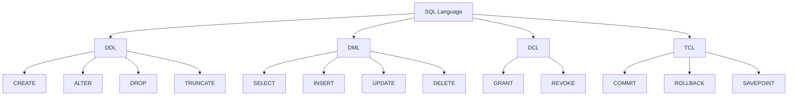

### SQL Command Categories

| Category | Commands | Description |
|----------|----------|-------------|
| DDL | CREATE, ALTER, DROP, TRUNCATE | Define database structure |
| DML | SELECT, INSERT, UPDATE, DELETE | Manipulate data |
| DCL | GRANT, REVOKE | Control access |
| TCL | COMMIT, ROLLBACK, SAVEPOINT | Manage transactions |

### Database Architecture

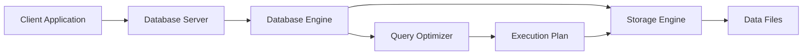

---

## Database Fundamentals

### Entity-Relationship Model

The ER model represents data as entities and relationships between them.

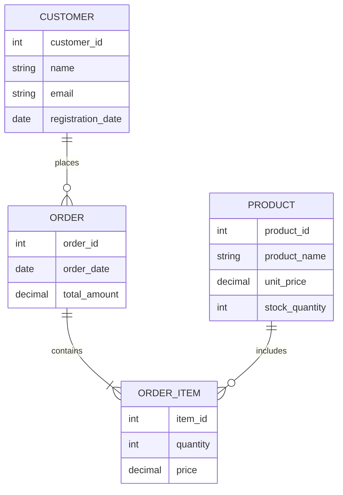

### Database Schema Design

```sql
-- Creating a sample database
CREATE DATABASE CompanyDB;
USE CompanyDB;

-- Creating tables with relationships
CREATE TABLE Departments (
    dept_id INT PRIMARY KEY AUTO_INCREMENT,
    dept_name VARCHAR(100) NOT NULL,
    location VARCHAR(100),
    budget DECIMAL(10,2)
);

CREATE TABLE Employees (
    emp_id INT PRIMARY KEY AUTO_INCREMENT,
    first_name VARCHAR(50) NOT NULL,
    last_name VARCHAR(50) NOT NULL,
    email VARCHAR(100) UNIQUE,
    hire_date DATE,
    salary DECIMAL(10,2),
    dept_id INT,
    FOREIGN KEY (dept_id) REFERENCES Departments(dept_id)
);

CREATE TABLE Projects (
    project_id INT PRIMARY KEY AUTO_INCREMENT,
    project_name VARCHAR(100) NOT NULL,
    start_date DATE,
    end_date DATE,
    budget DECIMAL(12,2),
    status VARCHAR(20)
);

CREATE TABLE Employee_Projects (
    emp_id INT,
    project_id INT,
    role VARCHAR(50),
    hours_allocated INT,
    PRIMARY KEY (emp_id, project_id),
    FOREIGN KEY (emp_id) REFERENCES Employees(emp_id),
    FOREIGN KEY (project_id) REFERENCES Projects(project_id)
);
```

### Database Normalization

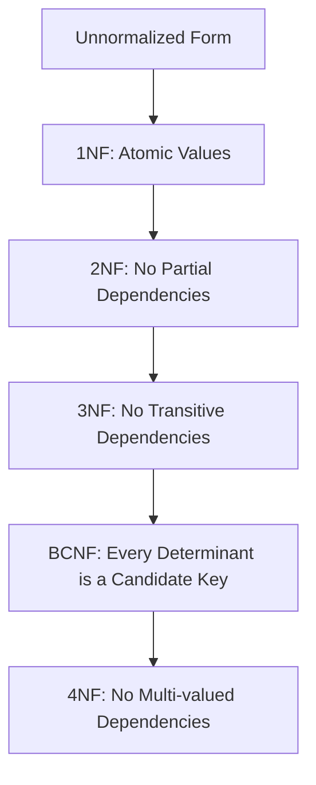

**Example of Normalization:**

```sql
-- Unnormalized table
CREATE TABLE Unnormalized_Orders (
    order_id INT,
    customer_name VARCHAR(100),
    products VARCHAR(500), -- Comma-separated: "Laptop,Mouse,Keyboard"
    order_date DATE
);

-- 1NF: Atomic values
CREATE TABLE Orders_1NF (
    order_id INT,
    customer_name VARCHAR(100),
    order_date DATE
);

CREATE TABLE Order_Items_1NF (
    order_id INT,
    product_name VARCHAR(100),
    quantity INT
);

-- 2NF: Remove partial dependencies
CREATE TABLE Customers (
    customer_id INT PRIMARY KEY,
    customer_name VARCHAR(100),
    email VARCHAR(100)
);

CREATE TABLE Orders_2NF (
    order_id INT PRIMARY KEY,
    customer_id INT,
    order_date DATE,
    FOREIGN KEY (customer_id) REFERENCES Customers(customer_id)
);
```

---

## Data Types and Constraints

### Common SQL Data Types

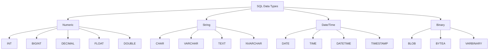

### Constraints in SQL

```sql
-- Comprehensive example of constraints
CREATE TABLE Product_Catalog (
    -- PRIMARY KEY constraint
    product_id INT PRIMARY KEY AUTO_INCREMENT,
    
    -- NOT NULL constraint
    product_name VARCHAR(100) NOT NULL,
    
    -- UNIQUE constraint
    sku VARCHAR(20) UNIQUE,
    
    -- CHECK constraint
    price DECIMAL(10,2) CHECK (price > 0),
    
    -- DEFAULT constraint
    category VARCHAR(50) DEFAULT 'General',
    
    -- Multiple column constraints
    quantity_in_stock INT CHECK (quantity_in_stock >= 0),
    reorder_level INT,
    
    -- Composite constraints
    CONSTRAINT chk_reorder CHECK (reorder_level <= quantity_in_stock),
    
    -- Date constraints
    created_date DATE DEFAULT (CURRENT_DATE),
    expiry_date DATE,
    CONSTRAINT chk_expiry CHECK (expiry_date > created_date)
);

-- Adding constraints to existing table
ALTER TABLE Product_Catalog
ADD CONSTRAINT chk_sku_format 
CHECK (sku REGEXP '^[A-Z]{3}-[0-9]{4}$');
```

### Working with Different Data Types

```sql
-- String operations
SELECT 
    UPPER(product_name) AS upper_name,
    LOWER(category) AS lower_category,
    CONCAT(sku, '-', product_id) AS full_sku,
    SUBSTRING(product_name, 1, 10) AS short_name,
    LENGTH(product_name) AS name_length
FROM Product_Catalog;

-- Date operations
SELECT 
    CURRENT_DATE AS today,
    DATE_ADD(created_date, INTERVAL 30 DAY) AS plus_30_days,
    DATEDIFF(expiry_date, created_date) AS days_valid,
    YEAR(created_date) AS creation_year,
    MONTHNAME(created_date) AS creation_month
FROM Product_Catalog;

-- Numeric operations
SELECT 
    price,
    ROUND(price * 1.1, 2) AS price_with_tax,
    CEILING(price) AS ceiling_price,
    FLOOR(price) AS floor_price,
    ABS(price - 100) AS difference_from_100
FROM Product_Catalog;
```

---

## DDL - Data Definition Language

### CREATE Operations

```sql
-- Create database
CREATE DATABASE ECommercePlatform
CHARACTER SET utf8mb4
COLLATE utf8mb4_unicode_ci;

-- Create table with all features
CREATE TABLE Users (
    user_id BIGINT AUTO_INCREMENT,
    username VARCHAR(50) NOT NULL,
    email VARCHAR(100) NOT NULL,
    password_hash VARCHAR(255) NOT NULL,
    full_name VARCHAR(100),
    date_of_birth DATE,
    phone_number VARCHAR(20),
    is_active BOOLEAN DEFAULT TRUE,
    created_at TIMESTAMP DEFAULT CURRENT_TIMESTAMP,
    updated_at TIMESTAMP DEFAULT CURRENT_TIMESTAMP ON UPDATE CURRENT_TIMESTAMP,
    last_login DATETIME,
    
    -- Constraints
    PRIMARY KEY (user_id),
    UNIQUE KEY uk_email (email),
    UNIQUE KEY uk_username (username),
    INDEX idx_full_name (full_name),
    INDEX idx_created_at (created_at),
    CONSTRAINT chk_password_length CHECK (LENGTH(password_hash) >= 8)
) ENGINE=InnoDB DEFAULT CHARSET=utf8mb4;

-- Create table as select
CREATE TABLE Active_Users AS
SELECT user_id, username, email, full_name
FROM Users
WHERE is_active = TRUE;
```

### ALTER Operations

```sql
-- Add column
ALTER TABLE Users 
ADD COLUMN profile_picture_url VARCHAR(500) AFTER email;

-- Modify column
ALTER TABLE Users 
MODIFY COLUMN phone_number VARCHAR(15);

-- Add constraint
ALTER TABLE Users 
ADD CONSTRAINT chk_age 
CHECK (date_of_birth <= DATE_SUB(CURRENT_DATE, INTERVAL 13 YEAR));

-- Add foreign key
ALTER TABLE Users 
ADD COLUMN department_id INT,
ADD FOREIGN KEY (department_id) REFERENCES Departments(dept_id);

-- Drop column
ALTER TABLE Users 
DROP COLUMN profile_picture_url;

-- Rename table
RENAME TABLE Users TO Platform_Users;
```

### DROP and TRUNCATE

```sql
-- Drop table (structure and data)
DROP TABLE IF EXISTS Temp_Data;

-- Drop table with foreign keys (MySQL)
SET FOREIGN_KEY_CHECKS = 0;
DROP TABLE IF EXISTS Orders;
SET FOREIGN_KEY_CHECKS = 1;

-- Truncate table (data only, reset auto-increment)
TRUNCATE TABLE Log_Table;

-- Drop database
DROP DATABASE IF EXISTS TestDB;
```

### Complete Schema Creation Example

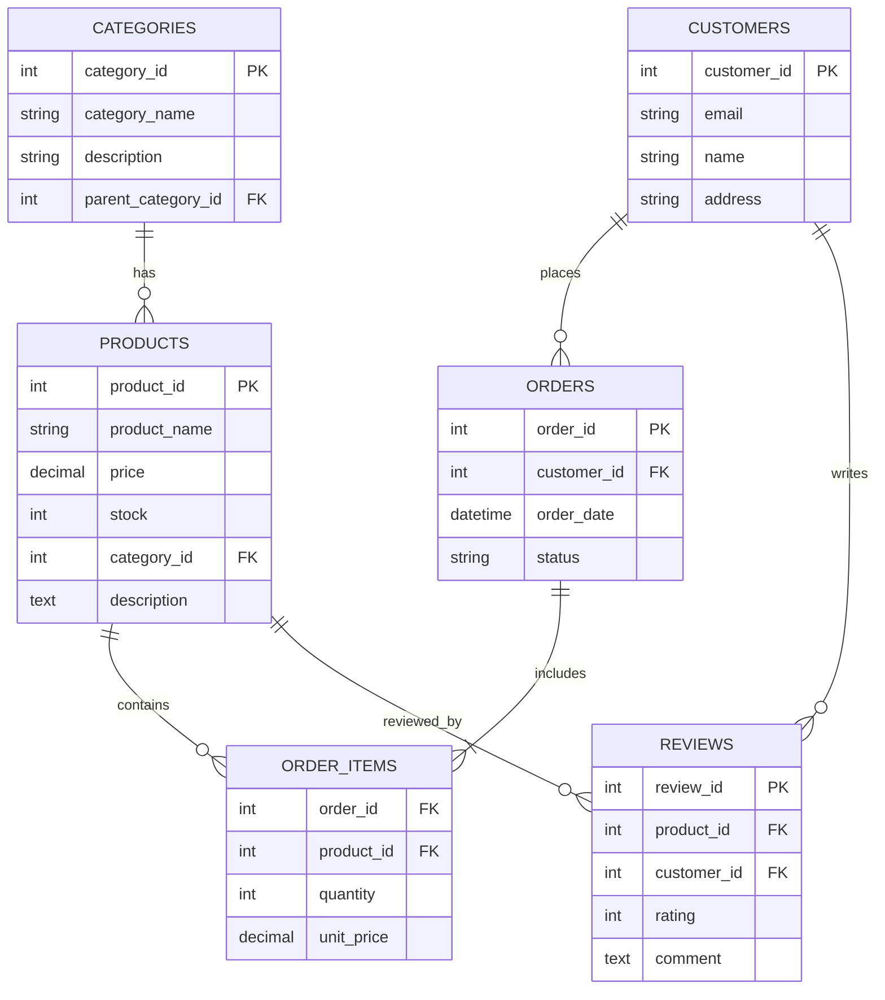

---

## DML - Data Manipulation Language

### INSERT Operations

```sql
-- Single row insert
INSERT INTO Employees (first_name, last_name, email, hire_date, salary, dept_id)
VALUES ('John', 'Doe', 'john.doe@company.com', '2023-01-15', 75000, 1);

-- Multiple row insert
INSERT INTO Employees (first_name, last_name, email, hire_date, salary, dept_id)
VALUES 
    ('Jane', 'Smith', 'jane.smith@company.com', '2023-02-01', 82000, 2),
    ('Bob', 'Johnson', 'bob.johnson@company.com', '2023-03-10', 68000, 1),
    ('Alice', 'Williams', 'alice.w@company.com', '2023-04-15', 91000, 3);

-- Insert with select
INSERT INTO High_Salary_Employees (emp_id, name, salary)
SELECT emp_id, CONCAT(first_name, ' ', last_name), salary
FROM Employees
WHERE salary > 80000;

-- Insert with default values
INSERT INTO Audit_Log (user_id, action) 
VALUES (1001, 'LOGIN');

-- Insert ignore (skip duplicates)
INSERT IGNORE INTO Unique_Emails (email)
SELECT email FROM Temp_User_List;

-- Upsert (INSERT ... ON DUPLICATE KEY UPDATE)
INSERT INTO Employee_Skills (emp_id, skill_id, proficiency)
VALUES (101, 5, 'Expert')
ON DUPLICATE KEY UPDATE proficiency = 'Expert';
```

### UPDATE Operations

```sql
-- Simple update
UPDATE Employees 
SET salary = 80000 
WHERE emp_id = 101;

-- Update with calculation
UPDATE Employees 
SET salary = salary * 1.10 
WHERE performance_rating = 'Excellent';

-- Update multiple columns
UPDATE Employees 
SET 
    salary = salary * 1.05,
    bonus_eligible = TRUE,
    last_salary_review = CURRENT_DATE
WHERE hire_date <= DATE_SUB(CURRENT_DATE, INTERVAL 1 YEAR);

-- Update with subquery
UPDATE Employees e
SET e.manager_id = (
    SELECT m.emp_id 
    FROM Employees m 
    WHERE m.dept_id = e.dept_id 
        AND m.job_title = 'Manager'
    LIMIT 1
)
WHERE e.manager_id IS NULL;

-- Update with join
UPDATE Employees e
JOIN Departments d ON e.dept_id = d.dept_id
SET e.bonus = e.salary * d.bonus_percentage / 100
WHERE d.bonus_percentage > 0;

-- Conditional update with CASE
UPDATE Employees 
SET salary_increase = CASE
    WHEN performance_rating = 'Excellent' THEN salary * 0.10
    WHEN performance_rating = 'Good' THEN salary * 0.05
    WHEN performance_rating = 'Average' THEN salary * 0.02
    ELSE 0
END
WHERE YEARS_OF_SERVICE > 1;
```

### DELETE Operations

```sql
-- Simple delete
DELETE FROM Employees 
WHERE emp_id = 101;

-- Delete with condition
DELETE FROM Orders 
WHERE order_date < DATE_SUB(CURRENT_DATE, INTERVAL 1 YEAR)
AND status = 'Cancelled';

-- Delete with subquery
DELETE FROM Employee_Projects 
WHERE emp_id NOT IN (
    SELECT emp_id FROM Employees WHERE is_active = TRUE
);

-- Delete with join
DELETE e
FROM Employees e
JOIN Departments d ON e.dept_id = d.dept_id
WHERE d.dept_status = 'Closed';

-- Soft delete (update instead of delete)
UPDATE Employees 
SET 
    is_deleted = TRUE,
    deleted_at = CURRENT_TIMESTAMP
WHERE emp_id = 101;

-- Delete all rows (preserve structure)
DELETE FROM Temp_Logs;
```

---

## Querying Data with SELECT

### Basic SELECT Operations

```sql
-- Select all columns
SELECT * FROM Employees;

-- Select specific columns
SELECT emp_id, first_name, last_name, salary 
FROM Employees;

-- Select with aliases
SELECT 
    emp_id AS 'Employee ID',
    CONCAT(first_name, ' ', last_name) AS 'Full Name',
    salary * 12 AS 'Annual Salary'
FROM Employees;

-- Distinct values
SELECT DISTINCT department_id 
FROM Employees;

-- Select with expressions
SELECT 
    product_name,
    price,
    price * 0.08 AS tax,
    price * 1.08 AS total_price,
    CASE 
        WHEN price < 50 THEN 'Economy'
        WHEN price < 200 THEN 'Standard'
        ELSE 'Premium'
    END AS price_category
FROM Products;
```

### Advanced SELECT Techniques

```sql
-- LIMIT and OFFSET (for pagination)
SELECT * FROM Products 
ORDER BY created_at DESC 
LIMIT 10 OFFSET 20;

-- String functions
SELECT 
    UPPER(first_name) AS upper_name,
    LOWER(email) AS lower_email,
    CONCAT(LEFT(first_name, 1), '. ', last_name) AS short_name,
    LENGTH(full_name) AS name_length,
    SUBSTRING(email, 1, INSTR(email, '@') - 1) AS username
FROM Users;

-- Date manipulation
SELECT 
    order_date,
    DATE_FORMAT(order_date, '%Y-%m-%d') AS formatted_date,
    DAYNAME(order_date) AS day_of_week,
    WEEK(order_date) AS week_number,
    QUARTER(order_date) AS quarter,
    DATEDIFF(CURRENT_DATE, order_date) AS days_ago
FROM Orders;

-- Math functions
SELECT 
    price,
    ROUND(price, 1) AS rounded,
    CEILING(price) AS ceiling,
    FLOOR(price) AS floor,
    POWER(price, 2) AS squared,
    SQRT(price) AS square_root,
    LOG(price) AS natural_log
FROM Products;
```

### Query Structure Visualization

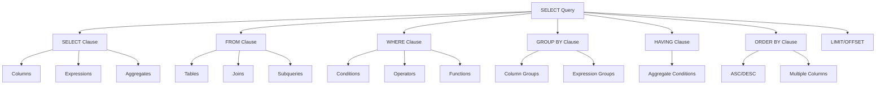

---

## Filtering and Sorting

### WHERE Clause

```sql
-- Comparison operators
SELECT * FROM Products 
WHERE price > 100;

SELECT * FROM Employees 
WHERE hire_date >= '2023-01-01';

-- Logical operators (AND, OR, NOT)
SELECT * FROM Products 
WHERE category = 'Electronics' 
   AND price BETWEEN 100 AND 500
   AND stock_quantity > 0;

SELECT * FROM Employees 
WHERE department = 'Sales' 
   OR (department = 'Marketing' AND salary > 60000);

-- IN operator
SELECT * FROM Products 
WHERE category IN ('Electronics', 'Computers', 'Mobile');

SELECT * FROM Employees 
WHERE department_id IN (
    SELECT dept_id FROM Departments WHERE location = 'New York'
);

-- BETWEEN operator
SELECT * FROM Orders 
WHERE order_date BETWEEN '2023-01-01' AND '2023-12-31';

-- LIKE operator (pattern matching)
SELECT * FROM Users 
WHERE email LIKE '%@gmail.com';

SELECT * FROM Products 
WHERE product_name LIKE 'iPhone%';

SELECT * FROM Employees 
WHERE first_name LIKE '_ohn';  -- John, John

-- REGEXP (regular expressions)
SELECT * FROM Products 
WHERE product_name REGEXP '^[A-C]';  -- Starts with A, B, or C

-- IS NULL / IS NOT NULL
SELECT * FROM Employees 
WHERE manager_id IS NULL;

SELECT * FROM Orders 
WHERE shipping_date IS NOT NULL;
```

### ORDER BY Clause

```sql
-- Basic ordering
SELECT * FROM Products 
ORDER BY price ASC;

SELECT * FROM Products 
ORDER BY product_name DESC;

-- Multiple columns
SELECT * FROM Employees 
ORDER BY department_id ASC, salary DESC;

-- Order by expression
SELECT *, price * stock_quantity AS inventory_value
FROM Products 
ORDER BY inventory_value DESC;

-- Order by position
SELECT product_id, product_name, price 
FROM Products 
ORDER BY 3 DESC;  -- Orders by price (3rd column)

-- Random ordering
SELECT * FROM Products 
ORDER BY RAND() 
LIMIT 10;

-- NULL handling
SELECT * FROM Employees 
ORDER BY manager_id ASC NULLS FIRST;

-- Case-based ordering
SELECT * FROM Employees 
ORDER BY 
    CASE department
        WHEN 'Executive' THEN 1
        WHEN 'Management' THEN 2
        WHEN 'Sales' THEN 3
        ELSE 4
    END;
```

### Complex Filtering Examples

```sql
-- Subquery filtering
SELECT * FROM Employees 
WHERE salary > (
    SELECT AVG(salary) FROM Employees
);

-- Correlated subquery
SELECT * FROM Products p
WHERE price > (
    SELECT AVG(price) 
    FROM Products 
    WHERE category = p.category
);

-- EXISTS operator
SELECT * FROM Customers c
WHERE EXISTS (
    SELECT 1 FROM Orders o
    WHERE o.customer_id = c.customer_id
        AND o.total_amount > 1000
);

-- ALL, ANY operators
SELECT * FROM Products 
WHERE price > ALL (
    SELECT price FROM Products WHERE category = 'Basic'
);

-- Combined conditions
SELECT * FROM Orders 
WHERE 
    (status = 'Pending' AND order_date >= CURRENT_DATE - INTERVAL 7 DAY)
    OR
    (status = 'Processing' AND priority = 'High')
    OR
    (total_amount > 1000 AND customer_type = 'Premium');
```

---

## Aggregate Functions

### Basic Aggregate Functions

```sql
-- COUNT
SELECT COUNT(*) AS total_employees FROM Employees;
SELECT COUNT(DISTINCT department) AS unique_departments FROM Employees;
SELECT COUNT(manager_id) AS employees_with_manager FROM Employees;

-- SUM
SELECT SUM(salary) AS total_salary_cost FROM Employees;
SELECT SUM(quantity * unit_price) AS total_revenue FROM Order_Items;

-- AVG
SELECT AVG(salary) AS average_salary FROM Employees;
SELECT AVG(DATEDIFF(shipping_date, order_date)) AS avg_delivery_days FROM Orders;

-- MIN and MAX
SELECT 
    MIN(price) AS cheapest_product,
    MAX(price) AS most_expensive_product
FROM Products;

-- Statistical functions
SELECT 
    AVG(salary) AS mean_salary,
    STDDEV(salary) AS salary_stddev,
    VARIANCE(salary) AS salary_variance,
    MIN(salary) AS min_salary,
    MAX(salary) AS max_salary
FROM Employees;
```

### GROUP BY Clause

```sql
-- Basic grouping
SELECT 
    department_id,
    COUNT(*) AS employee_count,
    AVG(salary) AS avg_salary,
    SUM(salary) AS total_salary
FROM Employees
GROUP BY department_id;

-- Multiple columns grouping
SELECT 
    department_id,
    YEAR(hire_date) AS hire_year,
    COUNT(*) AS hires,
    AVG(salary) AS avg_starting_salary
FROM Employees
GROUP BY department_id, YEAR(hire_date);

-- GROUP BY with expressions
SELECT 
    CASE 
        WHEN salary < 50000 THEN 'Low'
        WHEN salary < 80000 THEN 'Medium'
        ELSE 'High'
    END AS salary_range,
    COUNT(*) AS employee_count
FROM Employees
GROUP BY salary_range;

-- Filtering groups with HAVING
SELECT 
    department_id,
    COUNT(*) AS employee_count,
    AVG(salary) AS avg_salary
FROM Employees
GROUP BY department_id
HAVING AVG(salary) > 60000 
   AND COUNT(*) >= 5;

-- Complex GROUP BY example
SELECT 
    d.department_name,
    COUNT(e.emp_id) AS total_employees,
    AVG(e.salary) AS avg_salary,
    SUM(e.salary) AS total_payroll,
    MIN(e.hire_date) AS earliest_hire,
    MAX(e.hire_date) AS latest_hire,
    GROUP_CONCAT(DISTINCT e.job_title ORDER BY e.job_title) AS job_roles
FROM Employees e
JOIN Departments d ON e.dept_id = d.dept_id
GROUP BY d.department_id, d.department_name
HAVING total_employees > 3
ORDER BY avg_salary DESC;
```

### Aggregate Function Flow

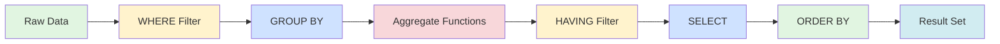

### Advanced Aggregate Queries

```sql
-- Running totals
SELECT 
    order_date,
    daily_total,
    SUM(daily_total) OVER (ORDER BY order_date) AS running_total
FROM (
    SELECT 
        DATE(order_date) AS order_date,
        SUM(total_amount) AS daily_total
    FROM Orders
    GROUP BY DATE(order_date)
) daily_sales;

-- Moving averages
SELECT 
    order_date,
    total_amount,
    AVG(total_amount) OVER (
        ORDER BY order_date 
        ROWS BETWEEN 6 PRECEDING AND CURRENT ROW
    ) AS moving_avg_7days
FROM Orders;

-- Percentage of total
SELECT 
    department,
    COUNT(*) AS emp_count,
    COUNT(*) * 100.0 / SUM(COUNT(*)) OVER () AS percentage
FROM Employees
GROUP BY department;

-- Rank-based aggregates
SELECT 
    department,
    salary,
    RANK() OVER (PARTITION BY department ORDER BY salary DESC) AS salary_rank,
    DENSE_RANK() OVER (PARTITION BY department ORDER BY salary DESC) AS dense_rank,
    PERCENT_RANK() OVER (PARTITION BY department ORDER BY salary) AS percent_rank
FROM Employees;
```

---

## Joins and Relationships

### Types of Joins

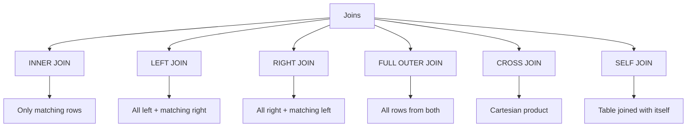

### INNER JOIN

```sql
-- Basic inner join
SELECT 
    e.first_name,
    e.last_name,
    d.department_name
FROM Employees e
INNER JOIN Departments d ON e.dept_id = d.dept_id;

-- Multiple joins
SELECT 
    o.order_id,
    c.first_name,
    c.last_name,
    p.product_name,
    oi.quantity,
    oi.unit_price,
    (oi.quantity * oi.unit_price) AS line_total
FROM Orders o
INNER JOIN Customers c ON o.customer_id = c.customer_id
INNER JOIN Order_Items oi ON o.order_id = oi.order_id
INNER JOIN Products p ON oi.product_id = p.product_id;

-- Join with conditions
SELECT 
    e.first_name,
    e.last_name,
    p.project_name,
    ep.role
FROM Employees e
INNER JOIN Employee_Projects ep 
    ON e.emp_id = ep.emp_id 
    AND ep.end_date IS NULL
INNER JOIN Projects p ON ep.project_id = p.project_id;

-- Join with multiple conditions
SELECT *
FROM Orders o
INNER JOIN Shipping s 
    ON o.order_id = s.order_id
    AND s.shipping_date >= o.order_date;
```

### LEFT JOIN (LEFT OUTER JOIN)

```sql
-- Basic left join
SELECT 
    d.dept_id,
    d.department_name,
    e.first_name,
    e.last_name
FROM Departments d
LEFT JOIN Employees e ON d.dept_id = e.dept_id;

-- Find departments with no employees
SELECT 
    d.dept_id,
    d.department_name
FROM Departments d
LEFT JOIN Employees e ON d.dept_id = e.dept_id
WHERE e.emp_id IS NULL;

-- Multiple left joins
SELECT 
    c.customer_id,
    c.first_name,
    c.last_name,
    COUNT(o.order_id) AS total_orders,
    SUM(o.total_amount) AS total_spent
FROM Customers c
LEFT JOIN Orders o ON c.customer_id = o.customer_id
LEFT JOIN Payments p ON o.order_id = p.order_id
GROUP BY c.customer_id, c.first_name, c.last_name;
```

### Self Joins

```sql
-- Employee hierarchy
SELECT 
    e1.first_name AS employee,
    e1.job_title,
    e2.first_name AS manager,
    e2.job_title AS manager_title
FROM Employees e1
LEFT JOIN Employees e2 ON e1.manager_id = e2.emp_id;

-- Finding duplicates
SELECT 
    DISTINCT a.email
FROM Users a
INNER JOIN Users b 
    ON a.email = b.email 
    AND a.user_id != b.user_id;

-- Related items
SELECT 
    a.product_name,
    b.product_name AS related_product,
    a.category
FROM Products a
JOIN Products b 
    ON a.category = b.category 
    AND a.product_id != b.product_id;
```

### Advanced Join Techniques

```sql
-- Cross Apply (SQL Server) / Lateral Join (PostgreSQL)
SELECT 
    d.department_name,
    emp_details.*
FROM Departments d
LEFT JOIN LATERAL (
    SELECT 
        first_name,
        last_name,
        salary
    FROM Employees e
    WHERE e.dept_id = d.dept_id
    ORDER BY salary DESC
    LIMIT 3
) emp_details ON TRUE;

-- Semi Join (using EXISTS)
SELECT 
    p.product_name,
    p.price
FROM Products p
WHERE EXISTS (
    SELECT 1 
    FROM Order_Items oi
    WHERE oi.product_id = p.product_id
        AND oi.quantity > 10
);

-- Anti Join (NOT EXISTS)
SELECT 
    c.customer_id,
    c.email
FROM Customers c
WHERE NOT EXISTS (
    SELECT 1 
    FROM Orders o
    WHERE o.customer_id = c.customer_id
        AND o.order_date >= CURRENT_DATE - INTERVAL 1 YEAR
);

-- Full outer join
SELECT 
    COALESCE(d.department_name, 'No Department') AS department,
    COALESCE(e.first_name, 'No Employee') AS employee
FROM Departments d
FULL OUTER JOIN Employees e ON d.dept_id = e.dept_id
ORDER BY d.department_name;
```

---

## Subqueries and CTEs

### Subqueries

```sql
-- Scalar subquery (returns single value)
SELECT 
    first_name,
    last_name,
    salary,
    (SELECT AVG(salary) FROM Employees) AS company_avg,
    salary - (SELECT AVG(salary) FROM Employees) AS diff_from_avg
FROM Employees;

-- Column subquery (using IN)
SELECT 
    product_name,
    price
FROM Products
WHERE product_id IN (
    SELECT product_id 
    FROM Order_Items 
    WHERE quantity > 100
);

-- Correlated subquery
SELECT 
    e.first_name,
    e.salary,
    (SELECT AVG(salary) 
     FROM Employees 
     WHERE department_id = e.department_id) AS dept_avg
FROM Employees e;

-- Derived table (subquery in FROM)
SELECT 
    dept_stats.*
FROM (
    SELECT 
        department_id,
        AVG(salary) AS avg_salary,
        COUNT(*) AS emp_count
    FROM Employees
    GROUP BY department_id
) dept_stats
WHERE dept_stats.avg_salary > 50000;

-- Multiple subqueries
SELECT 
    product_name,
    price,
    (SELECT COUNT(*) FROM Order_Items WHERE product_id = p.product_id) AS order_count,
    (SELECT AVG(rating) FROM Reviews WHERE product_id = p.product_id) AS avg_rating
FROM Products p;
```

### Common Table Expressions (CTEs)

```sql
-- Basic CTE
WITH High_Paid_Employees AS (
    SELECT 
        emp_id,
        first_name,
        last_name,
        salary,
        department_id
    FROM Employees
    WHERE salary > 75000
)
SELECT * FROM High_Paid_Employees
WHERE department_id = 1;

-- Multiple CTEs
WITH 
Dept_Stats AS (
    SELECT 
        department_id,
        AVG(salary) AS avg_salary,
        MAX(salary) AS max_salary
    FROM Employees
    GROUP BY department_id
),
Company_Stats AS (
    SELECT 
        AVG(salary) AS company_avg,
        MAX(salary) AS company_max
    FROM Employees
)
SELECT 
    e.first_name,
    e.salary,
    d.avg_salary AS dept_avg,
    c.company_avg,
    e.salary - d.avg_salary AS above_dept_avg,
    e.salary - c.company_avg AS above_company_avg
FROM Employees e
JOIN Dept_Stats d ON e.department_id = d.department_id
CROSS JOIN Company_Stats c
WHERE e.salary > d.avg_salary;

-- Recursive CTE
WITH RECURSIVE Employee_Hierarchy AS (
    -- Base case: top-level employees
    SELECT 
        emp_id,
        first_name,
        last_name,
        manager_id,
        0 AS level,
        CAST(first_name AS CHAR(100)) AS hierarchy_path
    FROM Employees
    WHERE manager_id IS NULL
    
    UNION ALL
    
    -- Recursive case: employees with managers
    SELECT 
        e.emp_id,
        e.first_name,
        e.last_name,
        e.manager_id,
        eh.level + 1,
        CONCAT(eh.hierarchy_path, ' > ', e.first_name)
    FROM Employees e
    INNER JOIN Employee_Hierarchy eh ON e.manager_id = eh.emp_id
)
SELECT 
    level,
    hierarchy_path,
    first_name,
    last_name
FROM Employee_Hierarchy
ORDER BY hierarchy_path;
```

### Subquery Performance Comparison

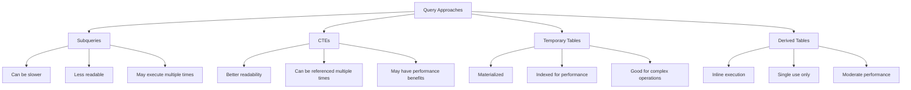

### Advanced CTE Examples

```sql
-- Recursive number sequence
WITH RECURSIVE Numbers AS (
    SELECT 1 AS n
    UNION ALL
    SELECT n + 1 FROM Numbers WHERE n < 10
)
SELECT * FROM Numbers;

-- Date range generation
WITH RECURSIVE Date_Range AS (
    SELECT '2024-01-01' AS date
    UNION ALL
    SELECT DATE_ADD(date, INTERVAL 1 DAY)
    FROM Date_Range
    WHERE date < '2024-01-31'
)
SELECT 
    dr.date,
    COUNT(o.order_id) AS orders_count,
    COALESCE(SUM(o.total_amount), 0) AS daily_total
FROM Date_Range dr
LEFT JOIN Orders o ON DATE(o.order_date) = dr.date
GROUP BY dr.date
ORDER BY dr.date;

-- Hierarchical data
WITH RECURSIVE Category_Tree AS (
    SELECT 
        category_id,
        category_name,
        parent_id,
        0 AS depth
    FROM Categories
    WHERE parent_id IS NULL
    
    UNION ALL
    
    SELECT 
        c.category_id,
        c.category_name,
        c.parent_id,
        ct.depth + 1
    FROM Categories c
    JOIN Category_Tree ct ON c.parent_id = ct.category_id
)
SELECT 
    CONCAT(REPEAT('  ', depth), category_name) AS hierarchy,
    depth
FROM Category_Tree
ORDER BY path;
```

---

## Views and Indexes

### Views

```sql
-- Create view
CREATE VIEW Employee_Details AS
SELECT 
    e.emp_id,
    e.first_name,
    e.last_name,
    e.email,
    e.salary,
    d.department_name,
    d.location,
    CONCAT(m.first_name, ' ', m.last_name) AS manager_name
FROM Employees e
JOIN Departments d ON e.dept_id = d.dept_id
LEFT JOIN Employees m ON e.manager_id = m.emp_id;

-- Query a view
SELECT * FROM Employee_Details
WHERE salary > 50000
ORDER BY department_name;

-- Materialized view (MySQL doesn't support directly, but can emulate)
CREATE TABLE Materialized_Dept_Stats AS
SELECT 
    department_id,
    COUNT(*) AS emp_count,
    AVG(salary) AS avg_salary,
    SUM(salary) AS total_salary
FROM Employees
GROUP BY department_id;

-- Refresh materialized view
TRUNCATE TABLE Materialized_Dept_Stats;
INSERT INTO Materialized_Dept_Stats
SELECT 
    department_id,
    COUNT(*) AS emp_count,
    AVG(salary) AS avg_salary,
    SUM(salary) AS total_salary
FROM Employees
GROUP BY department_id;

-- Updatable view
CREATE VIEW Active_Employees AS
SELECT 
    emp_id,
    first_name,
    last_name,
    email,
    department_id,
    salary
FROM Employees
WHERE status = 'Active'
WITH CHECK OPTION;

-- Drop view
DROP VIEW IF EXISTS Employee_Details;
```

### Indexes

```sql
-- Single column index
CREATE INDEX idx_last_name ON Employees(last_name);

-- Composite index
CREATE INDEX idx_name_email ON Users(last_name, first_name, email);

-- Unique index
CREATE UNIQUE INDEX idx_unique_email ON Users(email);

-- Partial index (MySQL 8.0+)
CREATE INDEX idx_high_salary ON Employees(salary)
WHERE salary > 75000;

-- Full-text index
CREATE FULLTEXT INDEX idx_product_search 
ON Products(product_name, description);

-- Using indexes effectively
SELECT * FROM Employees 
WHERE last_name = 'Smith';

SELECT * FROM Users 
WHERE last_name = 'Johnson' 
  AND first_name = 'Robert';

-- Check index usage
EXPLAIN SELECT * FROM Employees 
WHERE last_name = 'Smith' AND salary > 50000;
```

### Index Types and Usage

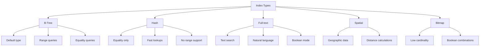

### Index Management

```sql
-- Show indexes
SHOW INDEX FROM Employees;

-- Analyzing index efficiency
SELECT 
    TABLE_NAME,
    INDEX_NAME,
    SEQ_IN_INDEX,
    COLUMN_NAME,
    CARDINALITY,
    SUB_PART,
    NULLABLE
FROM information_schema.STATISTICS
WHERE TABLE_SCHEMA = 'your_database'
  AND TABLE_NAME = 'Employees';

-- Remove unused index
DROP INDEX idx_last_name ON Employees;

-- Rebuild index (for optimization)
ALTER TABLE Employees DROP INDEX idx_last_name;
ALTER TABLE Employees ADD INDEX idx_last_name(last_name);

-- Create index on foreign key
ALTER TABLE Orders
ADD INDEX idx_customer_id (customer_id);

-- Covering index
CREATE INDEX idx_covering_employee 
ON Employees(department_id, hire_date, salary);
```

### View Management

```sql
-- Alter view
ALTER VIEW Employee_Details AS
SELECT 
    e.emp_id,
    e.first_name,
    e.last_name,
    e.email,
    e.phone_number,  -- Added column
    e.salary,
    d.department_name,
    d.location
FROM Employees e
JOIN Departments d ON e.dept_id = d.dept_id;

-- Check view definition
SHOW CREATE VIEW Employee_Details;

-- Information about views
SELECT 
    TABLE_NAME AS view_name,
    VIEW_DEFINITION,
    CHECK_OPTION,
    IS_UPDATABLE
FROM information_schema.VIEWS
WHERE TABLE_SCHEMA = 'your_database';
```

---

## Stored Procedures and Functions

### Stored Procedures

```sql
-- Basic stored procedure
DELIMITER $$

CREATE PROCEDURE GetEmployeesByDepartment(
    IN dept_id INT,
    IN min_salary DECIMAL(10,2)
)
BEGIN
    SELECT 
        emp_id,
        first_name,
        last_name,
        salary
    FROM Employees
    WHERE department_id = dept_id
      AND salary >= min_salary
    ORDER BY salary DESC;
END$$

DELIMITER ;

-- Call procedure
CALL GetEmployeesByDepartment(1, 50000);

-- Procedure with output parameters
DELIMITER $$

CREATE PROCEDURE GetDepartmentStats(
    IN dept_id INT,
    OUT total_employees INT,
    OUT avg_salary DECIMAL(10,2),
    OUT total_budget DECIMAL(12,2)
)
BEGIN
    SELECT 
        COUNT(*),
        AVG(salary),
        SUM(salary)
    INTO 
        total_employees,
        avg_salary,
        total_budget
    FROM Employees
    WHERE department_id = dept_id;
END$$

DELIMITER ;

-- Call with output parameters
CALL GetDepartmentStats(1, @emp_count, @avg_sal, @budget);
SELECT @emp_count, @avg_sal, @budget;

-- Procedure with error handling
DELIMITER $$

CREATE PROCEDURE InsertEmployee(
    IN p_first_name VARCHAR(50),
    IN p_last_name VARCHAR(50),
    IN p_email VARCHAR(100),
    IN p_salary DECIMAL(10,2),
    IN p_dept_id INT
)
BEGIN
    DECLARE EXIT HANDLER FOR SQLEXCEPTION
    BEGIN
        ROLLBACK;
        SELECT 'Error occurred, transaction rolled back' AS result;
    END;
    
    DECLARE EXIT HANDLER FOR SQLWARNING
    BEGIN
        ROLLBACK;
        SELECT 'Warning occurred, transaction rolled back' AS result;
    END;
    
    START TRANSACTION;
    
    -- Check if email exists
    IF EXISTS (SELECT 1 FROM Employees WHERE email = p_email) THEN
        SIGNAL SQLSTATE '45000' 
        SET MESSAGE_TEXT = 'Email already exists';
    END IF;
    
    -- Insert employee
    INSERT INTO Employees (first_name, last_name, email, salary, dept_id, hire_date)
    VALUES (p_first_name, p_last_name, p_email, p_salary, p_dept_id, CURDATE());
    
    COMMIT;
    SELECT 'Employee inserted successfully' AS result;
END$$

DELIMITER ;
```

### User-Defined Functions

```sql
-- Scalar function
DELIMITER $$

CREATE FUNCTION CalculateBonus(
    salary DECIMAL(10,2),
    performance_rating INT
) 
RETURNS DECIMAL(10,2)
DETERMINISTIC
READS SQL DATA
BEGIN
    DECLARE bonus DECIMAL(10,2);
    
    SET bonus = CASE 
        WHEN performance_rating >= 90 THEN salary * 0.15
        WHEN performance_rating >= 80 THEN salary * 0.10
        WHEN performance_rating >= 70 THEN salary * 0.05
        ELSE 0
    END;
    
    RETURN bonus;
END$$

DELIMITER ;

-- Use function
SELECT 
    first_name,
    last_name,
    salary,
    CalculateBonus(salary, performance_rating) AS bonus
FROM Employees;

-- Table-valued function (emulated in MySQL)
DELIMITER $$

CREATE PROCEDURE GetTopPerformers(
    IN top_n INT
)
BEGIN
    SELECT 
        emp_id,
        first_name,
        last_name,
        salary,
        performance_rating,
        CalculateBonus(salary, performance_rating) AS bonus
    FROM Employees
    ORDER BY performance_rating DESC
    LIMIT top_n;
END$$

DELIMITER ;

CALL GetTopPerformers(5);
```

### Complex Business Logic Procedure

```sql
DELIMITER $$

CREATE PROCEDURE ProcessMonthlyPayroll(
    IN process_month DATE
)
BEGIN
    DECLARE done INT DEFAULT FALSE;
    DECLARE emp_id_var INT;
    DECLARE base_salary DECIMAL(10,2);
    DECLARE bonus_amount DECIMAL(10,2);
    DECLARE total_payment DECIMAL(12,2);
    
    -- Cursor for employees
    DECLARE emp_cursor CURSOR FOR 
        SELECT emp_id, salary 
        FROM Employees 
        WHERE status = 'Active';
    
    DECLARE CONTINUE HANDLER FOR NOT FOUND SET done = TRUE;
    
    -- Create temporary table for payroll
    CREATE TEMPORARY TABLE IF NOT EXISTS Payroll_Results (
        emp_id INT,
        base_salary DECIMAL(10,2),
        bonus DECIMAL(10,2),
        deductions DECIMAL(10,2),
        net_pay DECIMAL(10,2),
        processed_date DATE
    );
    
    OPEN emp_cursor;
    
    read_loop: LOOP
        FETCH emp_cursor INTO emp_id_var, base_salary;
        
        IF done THEN
            LEAVE read_loop;
        END IF;
        
        -- Calculate bonus based on previous month performance
        SELECT COALESCE(AVG(rating), 70)
        INTO @perf_rating
        FROM Performance_Reviews
        WHERE emp_id = emp_id_var
          AND review_date BETWEEN 
              DATE_SUB(process_month, INTERVAL 2 MONTH)
              AND DATE_SUB(process_month, INTERVAL 1 MONTH);
        
        SET bonus_amount = CalculateBonus(base_salary, @perf_rating);
        
        -- Calculate deductions (simplified)
        SET @deductions = base_salary * 0.15; -- Tax, insurance, etc.
        
        -- Calculate net pay
        SET total_payment = base_salary + bonus_amount - @deductions;
        
        -- Insert into payroll results
        INSERT INTO Payroll_Results 
        VALUES (emp_id_var, base_salary, bonus_amount, @deductions, total_payment, process_month);
        
    END LOOP;
    
    CLOSE emp_cursor;
    
    -- Insert into permanent payroll table
    INSERT INTO Payroll_History 
    SELECT * FROM Payroll_Results;
    
    -- Update employee balances
    UPDATE Payroll_History ph
    JOIN Employees e ON ph.emp_id = e.emp_id
    SET e.last_paid_date = process_month
    WHERE ph.processed_date = process_month;
    
    -- Return summary
    SELECT 
        COUNT(*) AS employees_processed,
        SUM(base_salary) AS total_salary,
        SUM(bonus) AS total_bonuses,
        SUM(net_pay) AS total_payout
    FROM Payroll_Results
    WHERE processed_date = process_month;
    
    -- Cleanup
    DROP TEMPORARY TABLE IF EXISTS Payroll_Results;
    
END$$

DELIMITER ;
```

---

## Transactions and Concurrency

### Transaction Management

```sql
-- Basic transaction
START TRANSACTION;

UPDATE Accounts 
SET balance = balance - 1000 
WHERE account_id = 1;

UPDATE Accounts 
SET balance = balance + 1000 
WHERE account_id = 2;

COMMIT;

-- Transaction with savepoints
START TRANSACTION;

INSERT INTO Orders (customer_id, order_date, total_amount) 
VALUES (101, CURRENT_DATE, 2500);

SET @order_id = LAST_INSERT_ID();

SAVEPOINT order_created;

INSERT INTO Order_Items (order_id, product_id, quantity, unit_price)
VALUES (@order_id, 1, 2, 500);

-- If any error occurs
-- ROLLBACK TO order_created;

INSERT INTO Order_Items (order_id, product_id, quantity, unit_price)
VALUES (@order_id, 2, 3, 500);

COMMIT;

-- Transaction with error handling
START TRANSACTION;

BEGIN
    -- Deduct from source
    UPDATE Accounts 
    SET balance = balance - @transfer_amount 
    WHERE account_id = @source_account
      AND balance >= @transfer_amount;
    
    IF ROW_COUNT() = 0 THEN
        ROLLBACK;
        SELECT 'Insufficient funds' AS error_message;
    ELSE
        -- Add to destination
        UPDATE Accounts 
        SET balance = balance + @transfer_amount 
        WHERE account_id = @dest_account;
        
        IF ROW_COUNT() = 0 THEN
            ROLLBACK;
            SELECT 'Invalid destination account' AS error_message;
        ELSE
            -- Log transfer
            INSERT INTO Transfer_Log (from_account, to_account, amount, transfer_date)
            VALUES (@source_account, @dest_account, @transfer_amount, NOW());
            
            COMMIT;
            SELECT 'Transfer successful' AS result;
        END IF;
    END IF;
END;
```

### Concurrency Control

```sql
-- Pessimistic locking
START TRANSACTION;

SELECT * FROM Products 
WHERE product_id = 100
FOR UPDATE;

-- Process order with locked row
UPDATE Products 
SET stock_quantity = stock_quantity - 5 
WHERE product_id = 100 
  AND stock_quantity >= 5;

COMMIT;

-- Optimistic locking (using version column)
-- Table has version_column INT

START TRANSACTION;

SELECT @current_version := version_column, 
       @current_stock := stock_quantity
FROM Products 
WHERE product_id = 100;

-- Check if enough stock
IF @current_stock >= 5 THEN
    UPDATE Products 
    SET stock_quantity = stock_quantity - 5,
        version_column = version_column + 1
    WHERE product_id = 100 
      AND version_column = @current_version;
    
    IF ROW_COUNT() = 0 THEN
        ROLLBACK;
        SELECT 'Concurrent modification detected' AS error;
    ELSE
        INSERT INTO Orders (...);
        COMMIT;
        SELECT 'Order processed' AS result;
    END IF;
END IF;
```

### Transaction Isolation Levels

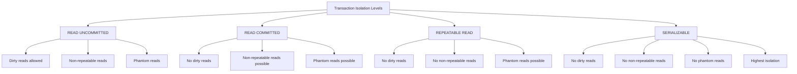

```sql
-- Set transaction isolation level
SET SESSION TRANSACTION ISOLATION LEVEL READ COMMITTED;

-- Check current isolation level
SELECT @@transaction_isolation;

-- Demonstrate dirty read prevention
-- Session 1
SET TRANSACTION ISOLATION LEVEL READ UNCOMMITTED;
START TRANSACTION;
UPDATE Accounts SET balance = 5000 WHERE account_id = 1;
-- Before commit, Session 2 can see uncommitted data

-- Session 2
SET TRANSACTION ISOLATION LEVEL READ COMMITTED;
START TRANSACTION;
SELECT balance FROM Accounts WHERE account_id = 1;
-- Will only see committed data
```

---

## Advanced Query Techniques

### Window Functions

```sql
-- ROW_NUMBER
SELECT 
    ROW_NUMBER() OVER (ORDER BY salary DESC) AS rank,
    first_name,
    last_name,
    salary
FROM Employees;

-- RANK and DENSE_RANK
SELECT 
    department_id,
    first_name,
    salary,
    RANK() OVER (PARTITION BY department_id ORDER BY salary DESC) AS salary_rank,
    DENSE_RANK() OVER (PARTITION BY department_id ORDER BY salary DESC) AS dense_salary_rank
FROM Employees;

-- LAG and LEAD
SELECT 
    order_date,
    total_amount,
    LAG(total_amount) OVER (ORDER BY order_date) AS previous_day_amount,
    LEAD(total_amount) OVER (ORDER BY order_date) AS next_day_amount,
    total_amount - LAG(total_amount) OVER (ORDER BY order_date) AS day_over_day_change
FROM (
    SELECT 
        DATE(order_date) AS order_date,
        SUM(total_amount) AS total_amount
    FROM Orders
    GROUP BY DATE(order_date)
) daily_totals;

-- Running calculations
SELECT 
    order_id,
    customer_id,
    order_date,
    total_amount,
    SUM(total_amount) OVER (
        PARTITION BY customer_id 
        ORDER BY order_date
        ROWS UNBOUNDED PRECEDING
    ) AS running_total,
    AVG(total_amount) OVER (
        PARTITION BY customer_id 
        ORDER BY order_date
        ROWS BETWEEN 2 PRECEDING AND CURRENT ROW
    ) AS moving_avg_3orders
FROM Orders;

-- NTILE (quartile distribution)
SELECT 
    first_name,
    last_name,
    salary,
    NTILE(4) OVER (ORDER BY salary) AS salary_quartile
FROM Employees;
```

### Pivot and Unpivot

```sql
-- Pivot using CASE
SELECT 
    department_id,
    SUM(CASE WHEN YEAR(hire_date) = 2021 THEN 1 ELSE 0 END) AS hires_2021,
    SUM(CASE WHEN YEAR(hire_date) = 2022 THEN 1 ELSE 0 END) AS hires_2022,
    SUM(CASE WHEN YEAR(hire_date) = 2023 THEN 1 ELSE 0 END) AS hires_2023,
    SUM(CASE WHEN YEAR(hire_date) = 2024 THEN 1 ELSE 0 END) AS hires_2024
FROM Employees
GROUP BY department_id
ORDER BY department_id;

-- Dynamic pivot (requires stored procedure)
DELIMITER $$

CREATE PROCEDURE Dynamic_Pivot()
BEGIN
    SET @sql = NULL;
    
    SELECT GROUP_CONCAT(DISTINCT
        CONCAT(
            'SUM(CASE WHEN category = ''',
            category,
            ''' THEN total_sales ELSE 0 END) AS ',
            REPLACE(category, ' ', '_')
        )
    ) INTO @sql
    FROM Sales_By_Category;
    
    SET @sql = CONCAT('SELECT product_name, ', @sql, 
                      ' FROM Sales_By_Category GROUP BY product_name');
    
    PREPARE stmt FROM @sql;
    EXECUTE stmt;
    DEALLOCATE PREPARE stmt;
END$$

DELIMITER ;
```

### Recursive Queries

```sql
-- Employee hierarchy
WITH RECURSIVE Org_Chart AS (
    SELECT 
        emp_id,
        first_name,
        last_name,
        manager_id,
        0 AS depth,
        CAST(CONCAT(first_name, ' ', last_name) AS CHAR(200)) AS path
    FROM Employees
    WHERE manager_id IS NULL
    
    UNION ALL
    
    SELECT 
        e.emp_id,
        e.first_name,
        e.last_name,
        e.manager_id,
        oc.depth + 1,
        CONCAT(oc.path, ' > ', e.first_name, ' ', e.last_name)
    FROM Employees e
    JOIN Org_Chart oc ON e.manager_id = oc.emp_id
)
SELECT 
    CONCAT(REPEAT('    ', depth), first_name, ' ', last_name) AS organization_chart,
    depth
FROM Org_Chart
ORDER BY path;

-- Fibonacci sequence
WITH RECURSIVE Fibonacci AS (
    SELECT 0 AS n, 0 AS fib_n, 1 AS fib_n_plus_1
    
    UNION ALL
    
    SELECT 
        n + 1,
        fib_n_plus_1,
        fib_n + fib_n_plus_1
    FROM Fibonacci
    WHERE n < 20
)
SELECT n, fib_n FROM Fibonacci;
```

### Advanced Analytics

```sql
-- Cohort analysis
WITH First_Purchase AS (
    SELECT 
        customer_id,
        MIN(DATE(order_date)) AS cohort_date
    FROM Orders
    GROUP BY customer_id
),
Customer_Cohorts AS (
    SELECT 
        fp.customer_id,
        DATE_FORMAT(fp.cohort_date, '%Y-%m') AS cohort,
        TIMESTAMPDIFF(MONTH, fp.cohort_date, DATE(o.order_date)) AS month_number,
        o.total_amount
    FROM First_Purchase fp
    JOIN Orders o ON fp.customer_id = o.customer_id
)
SELECT 
    cohort,
    COUNT(DISTINCT CASE WHEN month_number = 0 THEN customer_id END) AS month_0,
    COUNT(DISTINCT CASE WHEN month_number = 1 THEN customer_id END) AS month_1,
    COUNT(DISTINCT CASE WHEN month_number = 2 THEN customer_id END) AS month_2,
    COUNT(DISTINCT CASE WHEN month_number = 3 THEN customer_id END) AS month_3
FROM Customer_Cohorts
GROUP BY cohort
ORDER BY cohort;

-- RFM Analysis
SELECT 
    customer_id,
    DATEDIFF(CURRENT_DATE, MAX(order_date)) AS recency_days,
    COUNT(*) AS frequency,
    SUM(total_amount) AS monetary,
    NTILE(4) OVER (ORDER BY DATEDIFF(CURRENT_DATE, MAX(order_date))) AS r_quartile,
    NTILE(4) OVER (ORDER BY COUNT(*)) AS f_quartile,
    NTILE(4) OVER (ORDER BY SUM(total_amount)) AS m_quartile
FROM Orders
GROUP BY customer_id;
```

---

## Database Design Patterns

### Slowly Changing Dimensions (SCD)

```sql
-- SCD Type 1: Overwrite (no history)
UPDATE Dim_Customer
SET 
    email = 'newemail@example.com',
    phone = '555-0123'
WHERE customer_id = 101;

-- SCD Type 2: Add new row (maintains history)
INSERT INTO Dim_Customer (
    customer_bk,
    first_name,
    last_name,
    email,
    effective_date,
    expiry_date,
    is_current
)
VALUES (
    101,  -- Business key
    'John',
    'Doe',
    'newemail@example.com',
    CURRENT_DATE,
    '9999-12-31',
    1
);

-- Expire old record
UPDATE Dim_Customer
SET 
    expiry_date = CURRENT_DATE - INTERVAL 1 DAY,
    is_current = 0
WHERE customer_bk = 101 
  AND is_current = 1
  AND expiry_date = '9999-12-31';

-- SCD Type 3: Previous value column
ALTER TABLE Dim_Customer
ADD COLUMN previous_email VARCHAR(100);

UPDATE Dim_Customer
SET 
    previous_email = email,
    email = 'newemail@example.com',
    updated_date = CURRENT_DATE
WHERE customer_id = 101;
```

### Star Schema Design

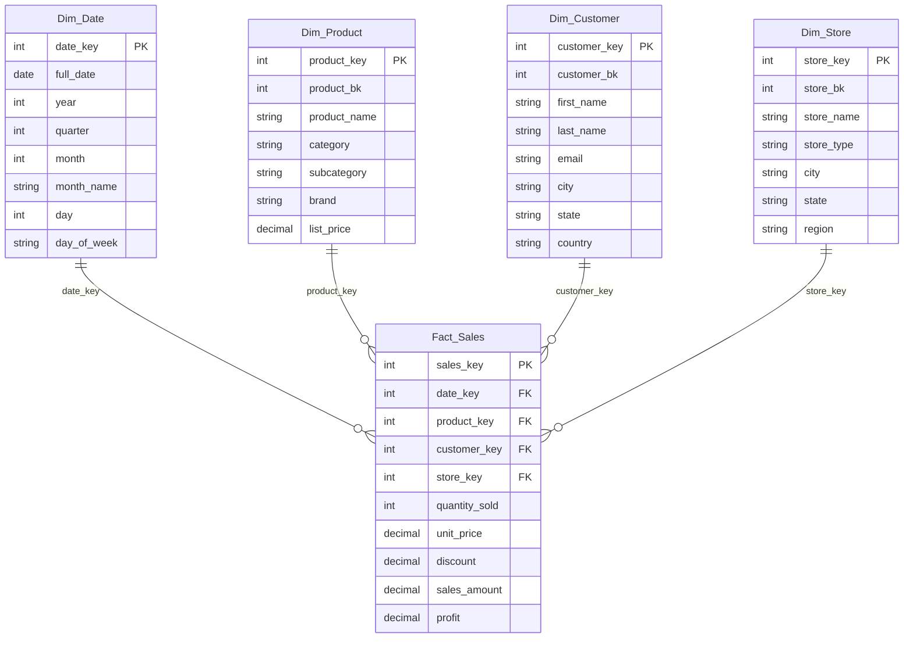

### Common Table Patterns

```sql
-- Adjacency List (Parent-Child)
CREATE TABLE Categories (
    id INT PRIMARY KEY,
    name VARCHAR(100),
    parent_id INT,
    FOREIGN KEY (parent_id) REFERENCES Categories(id)
);

-- Closure Table (for hierarchical data)
CREATE TABLE Category_Paths (
    ancestor_id INT,
    descendant_id INT,
    depth INT,
    PRIMARY KEY (ancestor_id, descendant_id),
    FOREIGN KEY (ancestor_id) REFERENCES Categories(id),
    FOREIGN KEY (descendant_id) REFERENCES Categories(id)
);

-- Entity-Attribute-Value (EAV)
CREATE TABLE Product_Attributes (
    product_id INT,
    attribute_name VARCHAR(100),
    attribute_value TEXT,
    PRIMARY KEY (product_id, attribute_name)
);

-- Join Table (Many-to-Many)
CREATE TABLE Student_Courses (
    student_id INT,
    course_id INT,
    enrollment_date DATE,
    grade VARCHAR(2),
    PRIMARY KEY (student_id, course_id),
    FOREIGN KEY (student_id) REFERENCES Students(id),
    FOREIGN KEY (course_id) REFERENCES Courses(id)
);
```

---

## Performance Optimization

### Query Optimization Techniques

```sql
-- Use EXPLAIN to analyze query plan
EXPLAIN SELECT 
    e.first_name,
    e.last_name,
    d.department_name
FROM Employees e
JOIN Departments d ON e.dept_id = d.dept_id
WHERE e.salary > 50000
  AND d.location = 'New York';

-- Optimized version with proper indexing
EXPLAIN SELECT 
    e.first_name,
    e.last_name,
    d.department_name
FROM Employees e
JOIN Departments d ON e.dept_id = d.dept_id
WHERE e.salary > 50000
  AND d.location = 'New York';
-- With indexes: idx_salary_dept(salary, dept_id), idx_location(location)

-- Avoid SELECT *
-- Bad:
SELECT * FROM Employees;

-- Good:
SELECT emp_id, first_name, last_name, email, salary 
FROM Employees;

-- Use EXISTS instead of COUNT
-- Slower:
SELECT c.* 
FROM Customers c
WHERE (SELECT COUNT(*) FROM Orders o WHERE o.customer_id = c.id) > 0;

-- Faster:
SELECT c.* 
FROM Customers c
WHERE EXISTS (SELECT 1 FROM Orders o WHERE o.customer_id = c.id);
```

### Indexing Strategies

```sql
-- Covering index for common queries
CREATE INDEX idx_covering_emp 
ON Employees(department_id, salary, first_name, last_name);

-- This query uses only index
SELECT first_name, last_name, salary
FROM Employees
WHERE department_id = 1
  AND salary > 50000;

-- Partial index for filtered queries
CREATE INDEX idx_active_users 
ON Users(email)
WHERE is_active = 1;

-- Composite index order matters
-- Good for: WHERE last_name = 'Smith' AND first_name = 'John'
-- Good for: WHERE last_name = 'Smith'
-- Not good for: WHERE first_name = 'John'
CREATE INDEX idx_name ON Users(last_name, first_name);

-- Index foreign keys
CREATE INDEX idx_fk_order_customer ON Orders(customer_id);
```

### Performance Monitoring

```sql
-- Find slow queries (MySQL)
SELECT 
    DIGEST_TEXT,
    COUNT_STAR,
    AVG_TIMER_WAIT/1000000000000 AS avg_seconds,
    SUM_ROWS_EXAMINED/COUNT_STAR AS avg_rows_examined
FROM performance_schema.events_statements_summary_by_digest
ORDER BY AVG_TIMER_WAIT DESC
LIMIT 10;

-- Table size analysis
SELECT 
    TABLE_NAME,
    TABLE_ROWS AS row_count,
    DATA_LENGTH/1024/1024 AS data_size_mb,
    INDEX_LENGTH/1024/1024 AS index_size_mb,
    (DATA_LENGTH + INDEX_LENGTH)/1024/1024 AS total_size_mb
FROM information_schema.TABLES
WHERE TABLE_SCHEMA = 'your_database'
ORDER BY total_size_mb DESC;

-- Index usage statistics
SELECT 
    TABLE_NAME,
    INDEX_NAME,
    SEQ_IN_INDEX,
    COLUMN_NAME,
    CARDINALITY
FROM information_schema.STATISTICS
WHERE TABLE_SCHEMA = 'your_database'
  AND TABLE_NAME = 'Orders';
```

### Best Practices Summary

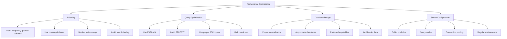

---

## Security Best Practices

### User Management

```sql
-- Create user with password
CREATE USER 'app_user'@'localhost' 
IDENTIFIED BY 'StrongP@ssw0rd123!';

-- Create user with password expiry
CREATE USER 'temp_user'@'%' 
IDENTIFIED BY 'TempP@ss456!' 
PASSWORD EXPIRE INTERVAL 30 DAY;

-- Grant specific privileges
GRANT SELECT, INSERT, UPDATE 
ON CompanyDB.* 
TO 'app_user'@'localhost';

-- Grant with column-level permissions
GRANT SELECT (emp_id, first_name, last_name, email) 
ON Employees 
TO 'hr_user'@'localhost';

-- Grant execute on procedures
GRANT EXECUTE ON PROCEDURE GetEmployeeByDepartment 
TO 'app_user'@'localhost';

-- Revoke privileges
REVOKE DELETE ON CompanyDB.* 
FROM 'app_user'@'localhost';

-- Show grants
SHOW GRANTS FOR 'app_user'@'localhost';

-- Drop user
DROP USER 'temp_user'@'%';
```

### Data Encryption

```sql
-- Column-level encryption (MySQL example)
-- Using AES_ENCRYPT/AES_DECRYPT
INSERT INTO Users (username, email, password, ssn)
VALUES (
    'johndoe',
    'john@email.com',
    SHA2('userpassword', 256),
    AES_ENCRYPT('123-45-6789', 'encryption_key')
);

SELECT 
    username,
    email,
    AES_DECRYPT(ssn, 'encryption_key') AS ssn
FROM Users
WHERE username = 'johndoe';

-- Transparent Data Encryption (TDE)
-- Enable at database level (Oracle/SQL Server example)
ALTER DATABASE CompanyDB 
SET ENCRYPTION ON;

-- Encrypt specific columns
ALTER TABLE Employees
ADD COLUMN salary_encrypted VARBINARY(256);

UPDATE Employees
SET salary_encrypted = AES_ENCRYPT(CAST(salary AS CHAR), 'salary_key');
```

### Audit and Logging

```sql
-- Create audit table
CREATE TABLE Audit_Log (
    audit_id BIGINT AUTO_INCREMENT PRIMARY KEY,
    table_name VARCHAR(50),
    action VARCHAR(10),
    record_id BIGINT,
    old_values JSON,
    new_values JSON,
    changed_by VARCHAR(100),
    changed_at TIMESTAMP DEFAULT CURRENT_TIMESTAMP
);

-- Create audit trigger
DELIMITER $$

CREATE TRIGGER audit_employee_changes
AFTER UPDATE ON Employees
FOR EACH ROW
BEGIN
    INSERT INTO Audit_Log (
        table_name,
        action,
        record_id,
        old_values,
        new_values,
        changed_by
    )
    VALUES (
        'Employees',
        'UPDATE',
        NEW.emp_id,
        JSON_OBJECT(
            'first_name', OLD.first_name,
            'last_name', OLD.last_name,
            'salary', OLD.salary
        ),
        JSON_OBJECT(
            'first_name', NEW.first_name,
            'last_name', NEW.last_name,
            'salary', NEW.salary
        ),
        CURRENT_USER()
    );
END$$

DELIMITER ;

-- Monitor failed login attempts
CREATE TABLE Failed_Logins (
    attempt_id BIGINT AUTO_INCREMENT PRIMARY KEY,
    username VARCHAR(100),
    ip_address VARCHAR(45),
    attempt_time TIMESTAMP DEFAULT CURRENT_TIMESTAMP
);
```

---

## Real-World Examples

### E-Commerce Database Example

```sql
-- Complete e-commerce schema
CREATE TABLE Customers (
    customer_id INT PRIMARY KEY AUTO_INCREMENT,
    email VARCHAR(100) UNIQUE NOT NULL,
    first_name VARCHAR(50),
    last_name VARCHAR(50),
    phone VARCHAR(20),
    address_line1 VARCHAR(255),
    city VARCHAR(100),
    state VARCHAR(50),
    country VARCHAR(50),
    created_at TIMESTAMP DEFAULT CURRENT_TIMESTAMP,
    loyalty_points INT DEFAULT 0,
    customer_tier ENUM('Bronze', 'Silver', 'Gold', 'Platinum') DEFAULT 'Bronze'
);

CREATE TABLE Categories (
    category_id INT PRIMARY KEY AUTO_INCREMENT,
    category_name VARCHAR(100),
    parent_category_id INT,
    slug VARCHAR(100),
    FOREIGN KEY (parent_category_id) REFERENCES Categories(category_id)
);

CREATE TABLE Products (
    product_id INT PRIMARY KEY AUTO_INCREMENT,
    sku VARCHAR(50) UNIQUE,
    product_name VARCHAR(200) NOT NULL,
    description TEXT,
    category_id INT,
    brand VARCHAR(100),
    unit_price DECIMAL(10,2),
    compare_at_price DECIMAL(10,2),
    cost_price DECIMAL(10,2),
    stock_quantity INT DEFAULT 0,
    reorder_point INT,
    weight DECIMAL(8,3),
    is_active BOOLEAN DEFAULT TRUE,
    created_at TIMESTAMP DEFAULT CURRENT_TIMESTAMP,
    updated_at TIMESTAMP ON UPDATE CURRENT_TIMESTAMP,
    FOREIGN KEY (category_id) REFERENCES Categories(category_id),
    INDEX idx_category_brand (category_id, brand),
    FULLTEXT INDEX idx_product_search (product_name, description)
);

CREATE TABLE Orders (
    order_id INT PRIMARY KEY AUTO_INCREMENT,
    order_number VARCHAR(20) UNIQUE,
    customer_id INT,
    order_date TIMESTAMP DEFAULT CURRENT_TIMESTAMP,
    status ENUM('Pending', 'Confirmed', 'Processing', 'Shipped', 'Delivered', 'Cancelled', 'Returned'),
    shipping_method VARCHAR(50),
    shipping_address TEXT,
    billing_address TEXT,
    subtotal DECIMAL(10,2),
    shipping_cost DECIMAL(10,2),
    tax_amount DECIMAL(10,2),
    discount_amount DECIMAL(10,2),
    total_amount DECIMAL(10,2),
    payment_status ENUM('Pending', 'Paid', 'Refunded', 'Failed'),
    notes TEXT,
    FOREIGN KEY (customer_id) REFERENCES Customers(customer_id),
    INDEX idx_order_date (order_date),
    INDEX idx_customer_order_date (customer_id, order_date)
);

CREATE TABLE Order_Items (
    order_item_id INT PRIMARY KEY AUTO_INCREMENT,
    order_id INT,
    product_id INT,
    quantity INT NOT NULL,
    unit_price DECIMAL(10,2),
    discount_percentage DECIMAL(5,2) DEFAULT 0,
    line_total DECIMAL(10,2),
    FOREIGN KEY (order_id) REFERENCES Orders(order_id) ON DELETE CASCADE,
    FOREIGN KEY (product_id) REFERENCES Products(product_id),
    INDEX idx_order_products (order_id, product_id)
);

-- Complex business queries
-- Top selling products by category
WITH Product_Sales AS (
    SELECT 
        p.product_id,
        p.product_name,
        c.category_name,
        SUM(oi.quantity) AS units_sold,
        SUM(oi.line_total) AS total_revenue,
        ROW_NUMBER() OVER (PARTITION BY p.category_id ORDER BY SUM(oi.quantity) DESC) AS rank
    FROM Products p
    JOIN Categories c ON p.category_id = c.category_id
    JOIN Order_Items oi ON p.product_id = oi.product_id
    JOIN Orders o ON oi.order_id = o.order_id
    WHERE o.status IN ('Confirmed', 'Processing', 'Shipped', 'Delivered')
    GROUP BY p.product_id, p.product_name, c.category_name, p.category_id
)
SELECT *
FROM Product_Sales
WHERE rank <= 3
ORDER BY category_name, rank;
```

### Analytics Dashboard Queries

```sql
-- Sales dashboard
SELECT 
    DATE(order_date) AS sale_date,
    COUNT(DISTINCT order_id) AS order_count,
    COUNT(DISTINCT customer_id) AS unique_customers,
    SUM(total_amount) AS total_revenue,
    SUM(total_amount) / COUNT(DISTINCT order_id) AS avg_order_value,
    SUM(total_amount) / COUNT(DISTINCT customer_id) AS revenue_per_customer
FROM Orders
WHERE order_date >= DATE_SUB(CURRENT_DATE, INTERVAL 30 DAY)
GROUP BY DATE(order_date)
ORDER BY sale_date;

-- Customer lifetime value
SELECT 
    c.customer_id,
    c.email,
    c.first_name,
    c.last_name,
    COUNT(o.order_id) AS total_orders,
    SUM(o.total_amount) AS lifetime_value,
    AVG(o.total_amount) AS avg_order_value,
    DATEDIFF(MAX(o.order_date), MIN(o.order_date)) / COUNT(o.order_id) AS days_between_orders,
    DATEDIFF(CURRENT_DATE, MAX(o.order_date)) AS days_since_last_order
FROM Customers c
JOIN Orders o ON c.customer_id = o.customer_id
WHERE o.status != 'Cancelled'
GROUP BY c.customer_id, c.email, c.first_name, c.last_name
HAVING total_orders > 1
ORDER BY lifetime_value DESC;

-- Inventory management
SELECT 
    c.category_name,
    COUNT(p.product_id) AS total_products,
    SUM(p.stock_quantity) AS total_stock,
    SUM(p.stock_quantity * p.cost_price) AS inventory_value,
    SUM(CASE WHEN p.stock_quantity = 0 THEN 1 ELSE 0 END) AS out_of_stock,
    SUM(CASE WHEN p.stock_quantity <= p.reorder_point THEN 1 ELSE 0 END) AS needs_reorder,
    AVG(p.stock_quantity) AS avg_stock_per_product
FROM Products p
JOIN Categories c ON p.category_id = c.category_id
WHERE p.is_active = TRUE
GROUP BY c.category_id, c.category_name
ORDER BY inventory_value DESC;
```

---

## Appendix: Quick Reference

### Commonly Used SQL Commands

| Command | Description | Example |
|---------|-------------|---------|
| SELECT | Retrieve data | `SELECT * FROM table;` |
| INSERT | Add new records | `INSERT INTO table VALUES (...);` |
| UPDATE | Modify records | `UPDATE table SET col=val WHERE ...;` |
| DELETE | Remove records | `DELETE FROM table WHERE ...;` |
| CREATE | Create objects | `CREATE TABLE table_name (...);` |
| ALTER | Modify structure | `ALTER TABLE table ADD col type;` |
| DROP | Remove objects | `DROP TABLE table;` |
| JOIN | Combine tables | `SELECT ... FROM t1 JOIN t2 ON ...;` |
| GROUP BY | Group rows | `SELECT ... GROUP BY col;` |
| ORDER BY | Sort results | `SELECT ... ORDER BY col;` |

### SQL Execution Order

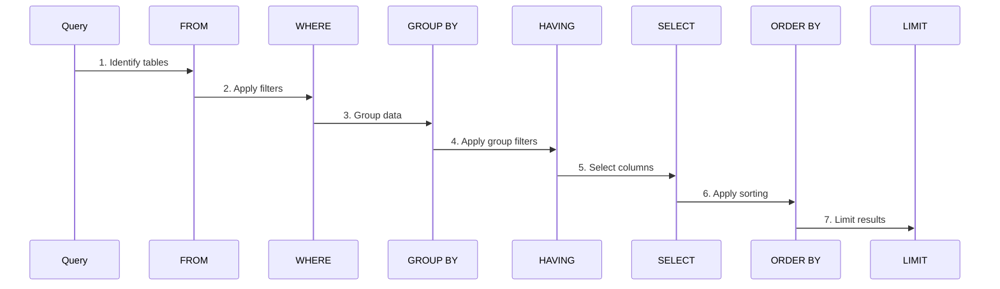

### Database Design Checklist

- [ ] Entities properly identified and modeled
- [ ] Relationships correctly defined (1:1, 1:M, M:M)
- [ ] Primary keys established for all tables
- [ ] Foreign keys properly referenced
- [ ] Appropriate data types selected
- [ ] Normalization applied (3NF minimum)
- [ ] Indexes created for performance
- [ ] Constraints defined for data integrity
- [ ] Naming conventions consistent
- [ ] Security measures implemented
- [ ] Backup strategy defined

---

## Best Practices Summary

1. **Always use meaningful names** for tables, columns, and indexes
2. **Normalize data** to reduce redundancy but denormalize when necessary for performance
3. **Use appropriate data types** to optimize storage and performance
4. **Create indexes strategically** based on query patterns
5. **Write efficient queries** by analyzing execution plans
6. **Implement proper error handling** in stored procedures
7. **Use transactions** for data consistency
8. **Regularly maintain** database (updates statistics, rebuild indexes)
9. **Implement security measures** (encryption, access control, auditing)
10. **Document your database** schema, relationships, and business logic

---
